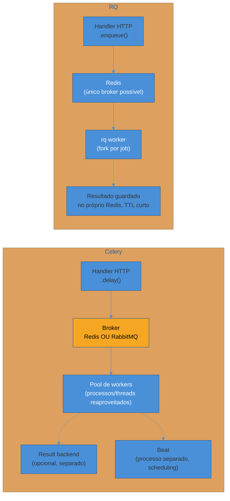

# RQ — a fila simples sobre Redis

> [!abstract] TL;DR
> **RQ** (Redis Queue) enfileira uma função Python comum com `Queue(connection=redis).enqueue(funcao, *args)` — **sem decorator**, sem instância de aplicação central, sem broker além do Redis que muita stack já tem rodando por causa do cache. O worker sobe com `rq worker` na linha de comando e executa cada job, por padrão, num processo filho isolado (fork por job). O que RQ **não** tem, de propósito: retry automático sofisticado (existe `Retry(max=3)`, uma versão simples, sem backoff exponencial nativo nem jitter), scheduling maduro tipo Celery Beat (existe `rq-scheduler`, um pacote separado, menos integrado ao ecossistema), e suporte a outro broker além de Redis. A troca é direta: menos superfície de configuração, código-fonte pequeno o bastante para ler numa tarde, debugabilidade alta — ao custo de reimplementar, à mão, qualquer coisa que passe do caso simples "rodar isso depois". `rq-dashboard` cobre a parte de observabilidade, com uma fração da profundidade do Flower.

## O time que se afogou em Celery para enviar um e-mail

Uma startup de três desenvolvedores estava validando o primeiro produto: um SaaS simples de agendamento de consultas. O único trabalho que precisava sair do caminho síncrono da API era, como em quase todo sistema que já apareceu neste galho, enviar um e-mail — confirmação de agendamento, para o cliente e para o profissional. Alguém do time tinha usado Celery no emprego anterior e trouxe a ferramenta sem muita discussão: "é o padrão, todo mundo usa".

O que se seguiu não foi um bug técnico — foi um mês de fricção acumulada, o tipo de custo que não aparece num incidente único, mas em cada PR:

- Configurar o broker (Redis, que já usavam para cache — tudo bem até aqui) e decidir se precisavam de um **result backend** separado, porque um exemplo de tutorial usava `AsyncResult` e ninguém no time sabia dizer se o produto realmente precisava consultar resultado de task em algum lugar.
- Descobrir, só em produção, a diferença entre `@app.task` e `@shared_task`, e por que o módulo de tasks de notificações não devia importar a instância `Celery` central diretamente — um detalhe de arquitetura que a documentação do Celery cobre bem, mas que exige ter lido a documentação.
- Configurar roteamento de fila (`task_routes`) mesmo tendo, na prática, uma única fila com um volume baixíssimo de mensagens — só porque os tutoriais que o time seguiu já vinham com essa configuração pronta, "por garantia".
- Subir Flower para monitorar um sistema que, na época, processava menos de duzentas tasks por dia — e gastar meio dia configurando autenticação básica nele, porque expor sem senha não é seguro nem para volume baixo.

Nada disso é culpa do Celery — é exatamente o volume de configuração que a nota anterior deste galho descreveu como "o preço da abstração". O problema é que **o produto não precisava de nada disso ainda**. Três pessoas, um MVP, uma única tarefa fire-and-forget de baixo volume — e um mês de trabalho de infraestrutura foi gasto em algo que, com a ferramenta certa, teria sido resolvido em uma tarde.

```python
# tasks.py — o que o time queria escrever desde o início
def enviar_confirmacao(email: str, horario: str) -> None:
    smtp_client.enviar(
        destinatario=email,
        assunto="Consulta confirmada",
        corpo=f"Sua consulta foi agendada para {horario}.",
    )
```

```python
# handler HTTP — dez linhas depois, resolvido
from redis import Redis
from rq import Queue

fila = Queue(connection=Redis())

@app.post("/agendamentos", status_code=201)
def criar_agendamento(dados: CriarAgendamentoDTO):
    agendamento = repositorio.salvar(Agendamento.criar(dados))
    fila.enqueue(enviar_confirmacao, agendamento.email, agendamento.horario_formatado)
    return agendamento
```

Essa é a nota que desenvolve **RQ**, a ferramenta que o time deveria ter escolhido desde o início — e, em contraste direto, mostra exatamente onde essa simplicidade para de compensar e Celery volta a ser a escolha certa. As notas [[02 - Celery fundamentos — broker, worker e tasks|02]] e [[03 - Celery em produção — retries, idempotência e Celery Beat|03]] já cobriram a arquitetura geral de task queue (broker, worker, fila) — esta nota assume esse vocabulário pronto e foca no que muda.

## `enqueue()` sem decorator: a diferença ergonômica que salta aos olhos primeiro

A primeira coisa que chama atenção ao ler código RQ ao lado de código Celery não é uma feature faltando — é a ausência de um decorator. Em Celery, uma função só vira task depois de marcada com `@app.task`/`@shared_task`, o que amarra o módulo onde ela vive a uma instância `Celery` (direta ou adiada). Em RQ, **qualquer função Python importável** pode ser enfileirada, sem nenhuma marcação prévia — quem decide que ela vira um job é o código que chama `.enqueue(...)`, não quem escreveu a função:

```python
# tasks.py — função Python comum, sem decorator, sem saber que existe uma fila
def gerar_pdf_relatorio(usuario_id: int) -> str:
    usuario = buscar_usuario(usuario_id)
    caminho = renderizar_pdf(usuario)
    return caminho
```

```python
from redis import Redis
from rq import Queue

fila = Queue("relatorios", connection=Redis())
job = fila.enqueue(gerar_pdf_relatorio, usuario_id=42)

print(job.id)       # UUID do job, disponível na hora
print(job.get_status())  # 'queued', 'started', 'finished', 'failed'...
```

> [!question]- Se não existe decorator, como o worker sabe qual função rodar quando consome o job?
> O mesmo jeito que Python resolve qualquer import: RQ serializa a referência da função como uma string de import — o caminho completo do módulo mais o nome da função (`"app.tasks.gerar_pdf_relatorio"`) — junto dos argumentos, e grava isso como um job no Redis. Quando o worker (`rq worker`) consome o job, ele faz o `import` desse caminho e chama a função com os argumentos desserializados. É por isso que a função precisa ser **importável** — um caminho de módulo válido, alcançável a partir de onde o worker roda — e não pode ser uma `lambda` ou um método de instância sem cuidado extra: uma `lambda` não tem um caminho de import estável, e um método vinculado a uma instância exigiria serializar a instância inteira junto, o mesmo problema de "objeto com estado vivo atravessando processo" já discutido na nota 02 sobre a `Session` do SQLAlchemy.

Essa ausência de decorator não é só estética — ela elimina uma classe inteira de decisão que Celery exige cedo: `@app.task` ou `@shared_task`? A `app` mora onde? O módulo de tasks importa de onde? Em RQ, a resposta é sempre "a função não sabe que existe fila nenhuma" — o acoplamento com a infraestrutura de mensageria vive inteiramente no lado de quem chama `.enqueue()`, nunca no lado de quem escreve a lógica de negócio.

## O worker: um comando, um processo por job

Assim como em Celery, definir (ou aqui, simplesmente escrever) uma função não faz nada rodar sozinho — é preciso um processo separado consumindo a fila:

```bash
rq worker relatorios --url redis://localhost:6379/0
```

A diferença estrutural relevante em relação ao pool de processos/threads configurável do Celery: por padrão, RQ dá **fork de um processo filho por job**. Cada job roda isolado, num processo próprio, que morre ao terminar — se um job travar toda a memória disponível ou corromper algum estado global do interpretador, o processo seguinte nasce limpo, sem carregar esse estranho. O custo é o oposto do ganho: fork tem overhead de sistema operacional (criar processo é mais caro que reaproveitar uma thread ou um worker de pool já quente), o que torna RQ menos indicado para volumes muito altos de jobs pequenos e rápidos — o cenário onde o modelo de pool do Celery (`--pool=prefork`/`gevent`/`eventlet`, reaproveitando processos) tende a escalar melhor.



O diagrama resume a diferença de topologia: Celery tem até quatro peças móveis (broker, pool de workers, result backend opcional, Beat opcional), cada uma configurável e substituível — RQ tem duas (Redis, worker), e o "resultado" de um job, quando existe, é gravado no mesmo Redis que já serve de fila, sem infraestrutura adicional para decidir.

> [!tip] `rq worker` sobe mais de uma fila, com prioridade por ordem
> `rq worker alta prioridade padrao` faz o worker esvaziar a fila `alta_prioridade` inteira antes de tocar em `padrao` — a ordem dos nomes na linha de comando é a prioridade. É o equivalente funcional, embora mais simples, do roteamento de fila do Celery: em vez de configuração declarativa (`task_routes`), a prioridade é a ordem literal dos argumentos passados ao comando `rq worker`.

## Retry: `Retry(max=3)`, não `autoretry_for`

A nota 03 deste galho dedicou boa parte do espaço a `autoretry_for`, `retry_backoff`, `retry_backoff_max` e `retry_jitter` — um mecanismo de retry rico o suficiente para reagir a `Retry-After` de uma API externa, evitar efeito manada com jitter, e crescer o delay exponencialmente até um teto configurável. RQ tem uma versão **muito** mais simples: a classe `Retry`, passada no momento de enfileirar (não na definição do worker nem da função):

```python
from redis import Redis
from rq import Queue, Retry

fila = Queue(connection=Redis())

fila.enqueue(
    enviar_confirmacao,
    args=(agendamento.email, agendamento.horario_formatado),
    retry=Retry(max=3, interval=[10, 30, 60]),  # 3 tentativas, intervalos fixos crescentes
)
```

`max=3` é o teto de tentativas — igual, em espírito, ao `max_retries` do Celery. `interval` é uma lista de segundos entre tentativas: a primeira retentativa espera 10s, a segunda 30s, a terceira 60s. Não é backoff exponencial calculado automaticamente (não existe `retry_backoff=True` que multiplica sozinho) — é uma lista fixa que **você** escreve, e se quiser algo parecido com exponencial, escreve os números você mesmo (`[10, 20, 40, 80]`). Não há campo nativo equivalente a `retry_jitter`: se o cenário precisar de jitter para evitar efeito manada, é preciso implementar isso manualmente, geralmente adicionando um `random.uniform(...)` na hora de calcular os próprios intervalos antes de passá-los para `Retry`.

> [!warning] RQ não distingue exceção transitória de exceção permanente por padrão
> **O que acontece:** um time configura `Retry(max=3)` numa função esperando que RQ, como o `autoretry_for` do Celery, só retente em cima de exceções de rede — e descobre que, por padrão, `Retry` reage a **qualquer** exceção levantada dentro da função, sem filtro por tipo. **Por quê:** RQ não tem, na API pública estável, um equivalente direto de `autoretry_for=(ConnectionError, Timeout)` que restrinja o retry a classes específicas de exceção — a configuração de `Retry` é sobre *quantas vezes* e *com que intervalo*, não sobre *para quais erros*. Um `ValueError` de dado inválido é retentado do mesmo jeito que um `ConnectionError` transitório, o que desperdiça as tentativas num erro que nunca vai se resolver sozinho. **Como evitar:** quando a distinção entre erro transitório e erro permanente importa (e normalmente importa), tratar isso dentro da própria função — capturar as exceções não-transitórias e relançá-las como um tipo que sinaliza "não adianta retentar", ou simplesmente validar o dado *antes* de enfileirar o job, para que erros de validação nunca cheguem a rodar dentro do worker.

O que se perde, resumindo em uma frase: **RQ tem "quantas vezes e com que espaçamento", não "para quais erros e com que crescimento adaptativo"** — a segunda metade fica por conta do código da aplicação, exatamente como o `self.retry(...)` manual do Celery cobre os casos que `autoretry_for` sozinho não alcança, só que em RQ **todo** retry além do caso mais simples já exige esse esforço manual, não só os casos de nuance.

## Scheduling: sem Beat nativo, `rq-scheduler` é pacote à parte

Celery Beat, coberto com profundidade na nota 03, roda como processo dedicado, integrado ao mesmo broker e ao mesmo monitoramento das tasks disparadas por `.delay()` — uma tarefa periódica cai na mesma fila, é pega pelos mesmos workers, tem os mesmos retries se configurados. RQ **não tem** um scheduler embutido no pacote principal. O que existe é `rq-scheduler`, um pacote irmão, mantido separadamente, que precisa do próprio processo:

```bash
pip install rq-scheduler
```

```python
from redis import Redis
from rq_scheduler import Scheduler
from datetime import datetime, timedelta

agendador = Scheduler(connection=Redis())

# Agendar para um horário futuro específico
agendador.enqueue_at(
    datetime.utcnow() + timedelta(hours=2),
    enviar_lembrete_consulta,
    agendamento_id=agendamento.id,
)

# Agendar recorrência (a cada N segundos, sem sintaxe crontab-like nativa)
agendador.schedule(
    scheduled_time=datetime.utcnow(),
    func=limpar_agendamentos_expirados,
    interval=3600,  # a cada hora, em segundos
    repeat=None,     # None = repete indefinidamente
)
```

```bash
# Processo separado, análogo ao `celery beat` — precisa estar rodando
# para os jobs agendados de fato serem empurrados pra fila na hora certa
rqscheduler --host localhost --port 6379
```

A diferença que mais pesa na prática não é a sintaxe (`enqueue_at`/`schedule` cobrem boa parte do que `crontab()` cobre, embora sem a mesma expressividade de "todo dia às 6h, exceto fins de semana" sem escrever lógica própria) — é o grau de **integração**. `rq-scheduler` é um projeto separado, com ciclo de release próprio, manutenção historicamente mais esparsa que o núcleo do Celery, e nenhuma garantia contratual de acompanhar cada versão nova de `rq` no mesmo ritmo. Times que adotam RQ pela simplicidade e depois precisam de scheduling robusto frequentemente descobrem que estão adicionando de volta uma peça de infraestrutura externa — só que menos madura que o Beat que tentaram evitar.

> [!question]- Faz sentido usar `rq-scheduler` só para uma única tarefa periódica simples, tipo "limpar sessões expiradas toda hora"?
> Sim, esse é exatamente o ponto-doce do pacote: uma ou duas tarefas periódicas, sem necessidade de expressividade tipo-cron completa (múltiplos horários por semana, exceções de feriado, fusos horários diferentes por tarefa). Para esse caso, `rq-scheduler` resolve com pouco código extra e sem exigir aprender a sintaxe `crontab()` do Celery. O ponto de virada é quando o número de tarefas periódicas cresce, ou quando a expressividade de horário fica complexa o bastante para o código de agendamento virar, ele mesmo, uma fonte de bugs — nesse momento, a maturidade e a integração nativa do Celery Beat (mesma fila, mesmo monitoramento, mesma garantia de retry) tendem a compensar o investimento de configuração inicial maior.

## Contraste tabelado: RQ vs Celery, ponto a ponto

| Critério | Celery | RQ |
|---|---|---|
| Definir uma task | Decorator (`@app.task`/`@shared_task`), amarrado a uma instância `Celery` | Função Python comum, importável — sem decorator, sem instância central |
| Disparar | `.delay()` / `.apply_async()` | `fila.enqueue(funcao, *args)` |
| Broker suportado | Redis **ou** RabbitMQ | Só Redis |
| Subir o worker | `celery -A app worker` — pool configurável (prefork/gevent/eventlet) | `rq worker <filas>` — fork de processo por job, por padrão |
| Retry automático | `autoretry_for` filtrando por exceção, `retry_backoff` exponencial, `retry_jitter`, `retry_backoff_max` | `Retry(max=N, interval=[...])` — teto de tentativas e lista fixa de intervalos, sem filtro por exceção nem jitter nativo |
| Scheduling periódico | Celery Beat — processo nativo integrado, sintaxe `crontab()` completa | `rq-scheduler` — pacote separado, menos maduro, sintaxe mais limitada |
| Result backend | Opcional, configurável separadamente (Redis, banco) | Resultado gravado no próprio Redis por padrão, com TTL configurável |
| Dashboard | Flower — maduro, métricas por worker/fila, integração Prometheus/Grafana | `rq-dashboard` — mais simples, cobre o essencial |
| Roteamento de prioridade | `task_routes` declarativo + workers dedicados por `-Q` | Ordem dos nomes de fila no comando `rq worker` |
| Configuração mínima para começar | Instância `Celery`, broker, decorator em cada task | `Queue(connection=Redis())` e uma função qualquer |
| Superfície de código-fonte | Grande — dezenas de opções, várias camadas (broker/worker/prefetch/roteamento) | Pequena — dá para ler o pacote inteiro numa tarde |

> [!tip] A pergunta de uma frase, RQ vs Celery
> "Preciso de retry com backoff exponencial genuíno, scheduling tipo-cron maduro, RabbitMQ, ou vou operar em volume alto o bastante para o overhead de fork-por-job pesar?" — se a resposta é sim para qualquer um desses, Celery. "É Redis, volume baixo a médio, e o time quer código simples de ler e depurar do início ao fim?" — RQ.

## Quando a simplicidade do RQ compensa

Voltando ao time de agendamento de consultas do início da nota: o produto tinha exatamente o perfil onde RQ ganha da comparação, e vale nomear os traços desse perfil de forma explícita, porque eles se repetem em muitos MVPs e sistemas internos:

- **Volume baixo a médio de jobs**, sem exigência de throughput que justifique o modelo de pool reaproveitado do Celery sobre o fork-por-job do RQ.
- **Nenhuma necessidade real de múltiplos brokers** — o projeto já tinha Redis para cache, e usar a mesma instância (com um banco lógico separado, `redis://.../1`) para a fila não adicionou peça nova de infraestrutura.
- **Poucas tarefas periódicas, ou nenhuma** — quando existem, `rq-scheduler` cobre sem drama; se o produto crescesse a ponto de precisar de dezenas de agendamentos com regras de horário complexas, isso seria, por si só, sinal de reavaliar.
- **Time pequeno, sem tempo (ou apetite) para a complexidade operacional extra do Celery** — múltiplos processos além do worker (Beat, opcionalmente Flower), configuração de roteamento de fila que ninguém no time tinha experiência prévia para acertar de primeira, superfície de opções grande demais para o volume de trabalho real.
- **O caso de uso é literalmente "rodar isso depois, sem frescura"** — sem necessidade de resultado consultável, sem retry sofisticado reagindo a `Retry-After` de terceiros, sem roteamento por prioridade fina.

Nenhum desses traços é uma crítica ao Celery — é a mesma lição já fechada na nota 01 deste galho: "quantas features tem" não é o critério certo de comparação; o critério é "quanto dessas features o projeto de fato vai usar, e o time vai conseguir operar bem, hoje". Um sistema que hoje é um MVP de três pessoas pode, em dois anos, crescer para o ponto onde RabbitMQ, scheduling elaborado, ou volume de jobs que pede um pool reaproveitado se tornam necessários de verdade — nesse momento, migrar de RQ para Celery é um trabalho real, mas nunca maior do que o custo de ter operado Celery, sem necessidade, desde o primeiro dia.

## `rq-dashboard`: o Flower simplificado

Assim como Celery tem Flower, RQ tem `rq-dashboard` — um dashboard web bem mais enxuto, consistente com a filosofia geral do pacote:

```bash
pip install rq-dashboard
rq-dashboard --redis-url redis://localhost:6379/0
```

A tela lista filas, jobs em espera, jobs em execução, e jobs que falharam com o traceback completo — o suficiente para responder "essa fila está represada?" ou "por que esse job específico falhou?" sem vasculhar log bruto. O que falta em relação ao Flower: métricas históricas por worker ao longo do tempo, integração pronta com Prometheus/Grafana, e granularidade de inspeção por task individual (argumentos, tempo de execução detalhado) tão rica quanto a do Flower. Para o volume que RQ tipicamente atende, isso raramente é uma limitação sentida na prática — mas é uma limitação real se o projeto crescer a ponto de precisar de alerta automatizado sofisticado sobre taxa de falha por fila, o mesmo ponto de virada onde o restante da comparação também aponta de volta para Celery.

> [!warning] `rq-dashboard` exposto sem autenticação
> **O que acontece:** o dashboard é subido em produção, acessível pela rede interna, sem nenhuma camada de autenticação na frente. **Por quê:** `rq-dashboard`, na configuração padrão, não embute autenticação própria — qualquer um com acesso de rede ao endereço enxerga filas, argumentos de jobs (que podem conter dado sensível, como um e-mail ou um ID de pagamento) e tracebacks completos de falha. **Como evitar:** colocar o dashboard atrás de autenticação (proxy reverso com Basic Auth, VPN, ou rede interna genuinamente isolada) antes de expor em qualquer ambiente além do desenvolvimento local — a mesma disciplina que a nota 03 já recomendou para Flower.

## Casos práticos

### Cenário 1: migrando de thread in-process para RQ, sem virar projeto Celery

Um script de processamento em lote, rodando dentro de um cron job simples, usava `threading.Thread` para paralelizar o envio de notificações — e sofria exatamente o problema descrito na nota 01 deste galho: se o processo morresse no meio, notificações pendentes na memória de uma thread se perdiam sem log nem retry. O time considerou Celery, mas o volume era baixo (algumas centenas de notificações por execução, uma vez por dia) e a equipe não tinha ninguém com experiência prévia configurando broker/result backend/roteamento. A migração para RQ levou uma tarde:

```python
# antes — thread in-process, sem durabilidade
threads = [threading.Thread(target=notificar, args=(u,)) for u in usuarios]
for t in threads:
    t.start()
```

```python
# depois — RQ, sem infraestrutura nova além do Redis que já existia para cache
from redis import Redis
from rq import Queue

fila = Queue("notificacoes", connection=Redis())
for usuario in usuarios:
    fila.enqueue(notificar, usuario.id)
```

O ganho não foi performance — foi durabilidade: se o script batch morrer depois de enfileirar, os jobs continuam no Redis, esperando por um `rq worker` disponível, e nenhuma notificação silenciosamente desaparece.

### Cenário 2: quando RQ deixou de bastar

Um serviço interno de processamento de imagens começou pequeno (RQ, Redis, um worker) e cresceu junto com o produto até processar picos de milhares de jobs por minuto em horários de uso concentrado. O overhead de fork-por-job começou a aparecer nas métricas de latência — cada job, mesmo trivial, pagava o custo fixo de criar um processo novo. Ao mesmo tempo, o time precisava de roteamento fino entre "redimensionar thumbnail" (deve ser quase instantâneo) e "aplicar filtro pesado" (pode esperar), algo que a ordem de filas do `rq worker` cobria de forma rudimentar, mas sem a granularidade de `task_routes` combinado com múltiplos grupos de workers dedicados. A migração para Celery, nesse ponto, não foi prematura nem desnecessária — foi exatamente o momento em que o perfil de carga deixou de bater com o perfil que RQ resolve bem, e o investimento na configuração adicional do Celery (pool de workers reaproveitados, roteamento declarativo) se pagou desde a primeira semana.

## Como explicar em inglês

> "RQ trades Celery's feature depth for simplicity: you enqueue a plain importable Python function with `Queue.enqueue()` — no decorator, no central app instance — and a worker process, started with `rq worker`, forks a child process per job to run it. It only supports Redis as a broker, which is fine when Redis is already in the stack for caching. What you give up is Celery's richer retry model — RQ's `Retry(max=N, interval=[...])` is a fixed list of delays with no exponential backoff or jitter built in, and no filtering by exception type — and native periodic scheduling, which requires the separate `rq-scheduler` package instead of something as integrated as Celery Beat. The trade-off is deliberate: less magic, a codebase small enough to read end-to-end, and faster debugging for teams that don't need Celery's full surface. It stops paying off once job volume is high enough that fork-per-job overhead matters, or once retry/scheduling needs outgrow what a fixed interval list and a side package can reasonably cover."

| PT | EN |
|----|----|
| Fila (RQ) | Queue |
| Enfileirar | To enqueue |
| Fork por job | Fork per job |
| Intervalo fixo de retry | Fixed retry interval |
| Agendador (pacote separado) | Scheduler (separate package) |
| Painel/dashboard | Dashboard |
| Simplicidade operacional | Operational simplicity |

## O que vem a seguir

RQ fecha o contraste entre as duas task queues do galho — a próxima parada muda de categoria inteiramente: comunicação direta com o broker, sem abstração de tarefa nenhuma.

- [[05 - aio-pika — RabbitMQ assíncrono|05 — aio-pika: RabbitMQ assíncrono]] — quando nem Celery nem RQ bastam, porque o problema pede controle fino sobre exchange/queue/routing key, não uma API de "rode isso depois".
- [[01 - Panorama — Celery vs RQ vs aio-pika vs aiokafka|01 — Panorama: Celery vs RQ vs aio-pika vs aiokafka]] — o mapa completo das quatro ferramentas, com a tabela de decisão que situa RQ entre as demais.

## Veja também

- [[02 - Celery fundamentos — broker, worker e tasks|02 — Celery fundamentos: broker, worker e tasks]] — a arquitetura de broker/worker/task que esta nota assume como pré-requisito para o contraste.
- [[03 - Celery em produção — retries, idempotência e Celery Beat|03 — Celery em produção: retries, idempotência e Celery Beat]] — `autoretry_for`, `retry_backoff`, Celery Beat e Flower, os pontos de comparação direta desta nota.

## Fontes

- python-rq.org — [*RQ: Simple job queues for Python*](https://python-rq.org/) (acessado 2026-07-12) — `Queue.enqueue()`, ausência de decorator, filosofia de design.
- python-rq.org — [*Workers*](https://python-rq.org/docs/workers/) (acessado 2026-07-12) — `rq worker`, fork por job, prioridade por ordem de fila.
- python-rq.org — [*Retrying Failed Jobs*](https://python-rq.org/docs/#retrying-failed-jobs) (acessado 2026-07-12) — `Retry(max=N, interval=[...])`, ausência de filtro por exceção e de jitter nativo.
- GitHub — [*rq-scheduler*](https://github.com/rq/rq-scheduler) (acessado 2026-07-12) — `Scheduler`, `enqueue_at`, `schedule`, processo `rqscheduler` separado.
- GitHub — [*Parallels/rq-dashboard*](https://github.com/Parallels/rq-dashboard) (acessado 2026-07-12) — instalação, cobertura de features, comparação implícita com Flower.
