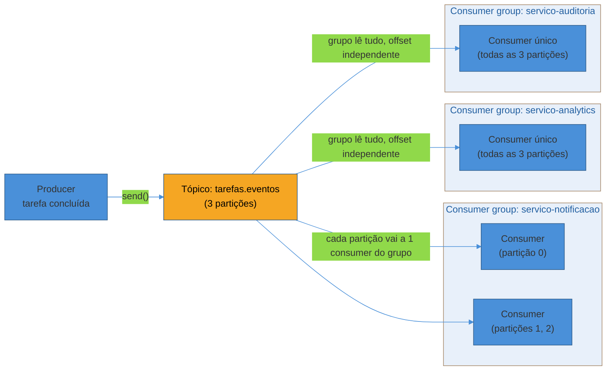

# kafka-python e aiokafka — producer e consumer

> [!abstract] TL;DR
> `kafka-python` (síncrono) e `aiokafka` (assíncrono) são clientes Kafka para Python — a API é quase espelhada, mas o modelo de execução muda por completo. Um `KafkaProducer.send(topico, valor)` bloqueia a thread até o broker aceitar o batch; um `await producer.send_and_wait(...)` cede o controle ao event loop enquanto espera. Do lado do consumo, a peça que realmente separa este ferramental de Celery/RQ/aio-pika é o `group_id`: consumers no **mesmo** grupo dividem as partições de um tópico entre si — cada mensagem vai para um consumer só, dentro daquele grupo; consumers em grupos **diferentes** leem o tópico inteiro, cada um do seu próprio jeito, sem interferir um no outro. É essa peça que permite um único evento alimentar três serviços independentes sem que o código que publica saiba que eles existem. E há uma escolha operacional que decide se sua aplicação perde mensagens silenciosamente sob crash: commitar o offset automaticamente (fácil, arriscado) ou manualmente, depois que o processamento de verdade terminou (mais código, garantia real).

Uma tarefa é concluída na plataforma de cursos do Galho 13 desta trilha — o aluno termina o último módulo, o sistema marca `Tarefa.status = CONCLUIDA` e precisa reagir a esse fato. Só que "reagir" não significa uma coisa: significa **três** coisas, cada uma pertencendo a um serviço diferente, hoje rodando em processos diferentes, escritos e mantidos por times diferentes.

- O **serviço de notificação** precisa mandar um e-mail de parabéns — em segundos, porque é a experiência que o aluno vê na hora.
- O **serviço de analytics** precisa registrar o evento num pipeline de métricas — não tem pressa nenhuma, roda em lote a cada poucos minutos, e um dia vai precisar reprocessar o histórico inteiro quando o time de dados mudar o modelo de agregação.
- O **serviço de auditoria** precisa gravar um registro imutável de que aquela tarefa foi concluída naquele instante — por motivos de compliance, esse registro tem que sobreviver mesmo que o serviço de auditoria esteja fora do ar no momento exato em que o evento acontece, e precisa poder ser reconstruído do zero se um novo requisito de auditoria aparecer daqui a um ano.

Modelar isso como uma tarefa Celery resolveria bem **um** desses três casos — mas não os três ao mesmo tempo, sem gambiarra. Celery entrega uma tarefa a **um** worker; se três serviços diferentes precisam reagir ao mesmo fato, o código que publica o evento teria que saber, de antemão, que existem exatamente três consumidores e publicar três tarefas idênticas — e no dia em que um quarto serviço precisar entrar, alguém tem que lembrar de mexer no publisher. É exatamente o cenário que [[01 - Panorama — Celery vs RQ vs aio-pika vs aiokafka|a nota 01 deste galho]] nomeou como "fato a registrar" em vez de "tarefa a executar", e que [[03-Dominios/Engenharia/Comunicação entre Sistemas/4 - Comunicação assíncrona/02 - Message queue vs event streaming|Comunicação entre Sistemas — Message queue vs event streaming]] trata com profundidade agnóstica de linguagem: quando múltiplos consumidores independentes precisam ler o mesmo dado, no seu próprio ritmo, com possibilidade de reler o histórico depois, o modelo certo não é fila — é **log de eventos**. Esta nota não repete essa distinção conceitual; assume que ela já está clara e foca em como o código Python fala com um log de eventos de verdade: o Apache Kafka, via `kafka-python` e `aiokafka`.

## O publisher: um evento, três leitores que ele nunca precisa conhecer

O código que marca a tarefa como concluída não decide quem vai reagir — ele só publica o fato. Essa inversão é o ponto central do event streaming: quem produz o evento não conhece, e não deveria conhecer, a lista de consumidores.

```python
# kafka-python — síncrono
from kafka import KafkaProducer
import json

producer = KafkaProducer(
    bootstrap_servers="localhost:9092",
    value_serializer=lambda evento: json.dumps(evento).encode("utf-8"),
)

def publicar_tarefa_concluida(tarefa: Tarefa) -> None:
    evento = {
        "tipo": "tarefa_concluida",
        "tarefa_id": str(tarefa.id),
        "usuario_id": str(tarefa.usuario_id),
        "concluida_em": tarefa.concluida_em.isoformat(),
    }
    producer.send("tarefas.eventos", value=evento)
    producer.flush()  # garante que o batch saiu antes de seguir — ver nota sobre flush() abaixo
```

`value_serializer` é a peça que resolve a (de)serialização de forma declarativa: em vez de transformar o dicionário em bytes manualmente em cada chamada de `send()`, o producer faz isso uma vez, no construtor, e toda chamada seguinte só passa o dicionário Python puro. O padrão didático desta nota — e o mais comum em projetos pequenos e médios — é JSON: legível, sem dependência extra, fácil de depurar com `kcat` ou o Kafka-UI apontando pro tópico.

```python
# aiokafka — assíncrono, mesma ideia, API praticamente espelhada
from aiokafka import AIOKafkaProducer
import json

async def publicar_tarefa_concluida(tarefa: Tarefa, producer: AIOKafkaProducer) -> None:
    evento = {
        "tipo": "tarefa_concluida",
        "tarefa_id": str(tarefa.id),
        "usuario_id": str(tarefa.usuario_id),
        "concluida_em": tarefa.concluida_em.isoformat(),
    }
    await producer.send_and_wait(
        "tarefas.eventos",
        value=json.dumps(evento).encode("utf-8"),
    )
```

```python
# ciclo de vida do producer assíncrono — precisa de start()/stop() explícitos
producer = AIOKafkaProducer(bootstrap_servers="localhost:9092")

@app.on_event("startup")
async def iniciar_producer():
    await producer.start()

@app.on_event("shutdown")
async def parar_producer():
    await producer.stop()
```

A diferença de superfície entre as duas bibliotecas é pequena de propósito — `aiokafka` foi desenhada para espelhar `kafka-python` API por API, trocando chamadas bloqueantes por corrotinas ([aiokafka docs, *aiokafka: AsyncIO Kafka client*](https://aiokafka.readthedocs.io/), 2026). `send_and_wait()` é o equivalente assíncrono de `send()` seguido de `.get()` no futuro retornado — publica e espera a confirmação do broker antes de continuar, sem bloquear a thread do event loop enquanto espera. `send()` sozinho (sem `_and_wait`) também existe em ambas as bibliotecas e devolve imediatamente um future/objeto de resultado, deixando o `flush()`/await por conta do chamador — útil quando o volume de publicação é alto e esperar cada confirmação individualmente destruiria o throughput.

> [!question]- Por que `producer.flush()` aparece no exemplo síncrono, mas não no assíncrono?
> `KafkaProducer.send()` do `kafka-python` é assíncrono **internamente** mesmo numa aplicação síncrona — ele não bloqueia a thread esperando o broker confirmar, só enfileira a mensagem num buffer interno e devolve um `FutureRecordMetadata`. Sem `flush()` (ou sem esperar o future explicitamente com `.get()`), o processo pode terminar antes do batch ser realmente enviado — comum em scripts curtos ou em testes que publicam e saem logo em seguida. `send_and_wait()` do `aiokafka` já resolve isso: o `await` só retorna depois que o broker confirmou, então não existe o mesmo risco de "saí antes de mandar". Em aplicações de longa duração (uma API rodando o dia inteiro), nenhuma das duas exige flush a cada chamada — o producer manda os batches sozinho, no ritmo configurado por `linger.ms`.

> [!tip] JSON é o padrão didático — Avro + Schema Registry é o padrão de produção mais rigoroso
> O evento `tarefa_concluida` acima é um dicionário Python virando JSON sem nenhum contrato formal — funciona, é legível, e é suficiente para a maioria dos projetos pequenos e médios. Em produção, sistemas que dependem de múltiplos times publicando e consumindo o mesmo tópico ao longo de anos costumam adotar **Avro com Schema Registry**: um servidor central que armazena o schema de cada evento, valida compatibilidade (um campo novo com default não quebra consumers antigos; remover um campo obrigatório, quebra) e recusa publicar uma mensagem que viole o contrato — errros de schema estouram no producer, antes de chegar a produção, em vez de quebrarem silenciosamente um consumer meses depois. Esta nota não desenvolve Avro/Schema Registry — [[03-Dominios/Engenharia/Comunicação entre Sistemas/Mensageria/Kafka|Comunicação entre Sistemas — Kafka]] cobre `Schema Registry` e modos de compatibilidade com profundidade, e a trilha Java trata o assunto a fundo com Spring/Confluent Schema Registry. Vale saber que existe e por que é o próximo passo natural quando JSON solto começa a doer — não vale reimplementar aqui.

## Três consumers, três grupos, zero coordenação entre eles

Aqui está a peça que faz o cenário de abertura funcionar. Os três serviços — notificação, analytics, auditoria — cada um roda seu próprio processo, cada um com seu próprio `group_id`, cada um lendo o tópico `tarefas.eventos` do começo ao fim, de forma completamente independente:

```python
# kafka-python — serviço de notificação (síncrono, precisa reagir rápido)
from kafka import KafkaConsumer
import json

consumer = KafkaConsumer(
    "tarefas.eventos",
    bootstrap_servers="localhost:9092",
    group_id="servico-notificacao",
    value_deserializer=lambda b: json.loads(b.decode("utf-8")),
    auto_offset_reset="earliest",
)

for mensagem in consumer:  # itera indefinidamente, bloqueando entre mensagens
    evento = mensagem.value
    if evento["tipo"] == "tarefa_concluida":
        enviar_email_parabens(evento["usuario_id"], evento["tarefa_id"])
```

```python
# aiokafka — serviço de analytics (assíncrono, roda dentro de um worker asyncio)
from aiokafka import AIOKafkaConsumer
import json

async def consumir_para_analytics():
    consumer = AIOKafkaConsumer(
        "tarefas.eventos",
        bootstrap_servers="localhost:9092",
        group_id="servico-analytics",
        value_deserializer=lambda b: json.loads(b.decode("utf-8")),
        auto_offset_reset="earliest",
    )
    await consumer.start()
    try:
        async for mensagem in consumer:
            evento = mensagem.value
            registrar_metrica(evento)
    finally:
        await consumer.stop()
```

O detalhe que faz tudo funcionar sem nenhuma coordenação central: `group_id="servico-notificacao"` e `group_id="servico-analytics"` são strings diferentes, então o broker trata os dois consumers como pertencendo a grupos diferentes — cada grupo tem seu próprio offset guardado no tópico interno `__consumer_offsets`, e ler um não afeta o outro em nada. O terceiro serviço, auditoria, entra da mesma forma — outro `group_id`, outro processo, zero linha de código mudada em quem publica.



Note a assimetria dentro de cada grupo: o grupo `servico-notificacao` tem dois consumers dividindo as três partições do tópico entre si — cada partição vai para exatamente um consumer daquele grupo, então mais consumers naquele grupo significa mais paralelismo (até o limite do número de partições). Já `servico-analytics` e `servico-auditoria` rodam com um consumer só cada, lendo o tópico inteiro sozinhos. Isso é decisão de cada serviço, independente dos outros — nada no Kafka exige que os três grupos tenham o mesmo número de consumers. A mecânica completa de como partições são atribuídas dentro de um grupo, o que é rebalance e por que ele pausa o processamento, mora em [[03-Dominios/Engenharia/Comunicação entre Sistemas/Mensageria/Kafka|Comunicação entre Sistemas — Kafka]] — esta nota assume esse modelo mental já formado e mostra só o parâmetro Python (`group_id`) que o aciona.

> [!question]- Se eu não passar `group_id` nenhum, o que acontece?
> `kafka-python` e `aiokafka` aceitam rodar sem `group_id` — nesse modo, o consumer não faz parte de grupo nenhum, não tem offset gerenciado pelo broker, e cabe à aplicação decidir manualmente de onde ler (geralmente via `consumer.seek()` para uma partição e offset específicos). É um modo avançado, útil para ferramentas de inspeção ou replay pontual de um intervalo exato — não para serviços de produção que precisam de coordenação automática de partições e retomada de onde pararam depois de um restart. Na prática, praticamente todo consumer de aplicação em produção define `group_id`.

## `async for` sobre um consumer: por que não bloqueia o resto da aplicação

O laço `for mensagem in consumer:` do exemplo síncrono bloqueia a thread inteira enquanto não chega mensagem nova — aceitável quando o processo inteiro existe só para consumir aquele tópico (um worker dedicado, por exemplo). Mas o serviço de analytics deste cenário roda dentro de uma aplicação que também expõe endpoints HTTP para o time de dados consultar métricas em tempo real — se o consumo de Kafka bloqueasse o event loop, toda requisição HTTP concorrente travaria junto. `async for mensagem in consumer:` resolve isso da mesma forma que qualquer chamada de I/O assíncrona resolve: cede o controle ao event loop enquanto espera a próxima mensagem chegar do broker, permitindo que outras corrotinas — inclusive handlers HTTP concorrentes — rodem nesse intervalo. O mecanismo de fundo (event loop, corrotinas, `async with`) já foi coberto nos Galhos 7-8 desta trilha e não é reexplicado aqui; `aiokafka` só *usa* esse modelo, do mesmo jeito que [[05 - aio-pika — RabbitMQ assíncrono|aio-pika]] usa.

## Commit de offset: automático é conveniente, manual é seguro

Toda mensagem lida por um consumer tem uma posição — um offset — dentro da partição de onde veio. "Commitar" o offset é dizer ao broker "este grupo já processou até aqui; se eu cair e voltar, comece depois deste ponto". A forma como esse commit acontece é a decisão mais importante do lado do consumer, e as duas bibliotecas oferecem exatamente as mesmas duas opções.

### Auto-commit — o padrão, e o padrão que engana

```python
consumer = KafkaConsumer(
    "tarefas.eventos",
    bootstrap_servers="localhost:9092",
    group_id="servico-notificacao",
    enable_auto_commit=True,  # padrão — nem precisaria escrever
    auto_commit_interval_ms=5000,  # commita a cada 5s, em background
)
```

`enable_auto_commit=True` é o valor padrão nas duas bibliotecas — o que significa que qualquer código escrito sem pensar no assunto já está usando auto-commit. O broker recebe um commit periódico, num intervalo configurável (`auto_commit_interval_ms`), independente de o processamento da mensagem ter de fato terminado.

> [!warning] Auto-commit pode confirmar um offset antes do processamento terminar — e a mensagem "some"
> **O que acontece:** o consumer lê a mensagem de offset 100 (o e-mail de parabéns do aluno X), começa a processar, e o intervalo de auto-commit dispara e confirma o offset 100 no broker **antes** do `enviar_email_parabens()` terminar. Se o processo crashar exatamente nesse intervalo — entre o commit e o fim do processamento real — o Kafka já registrou que o grupo `servico-notificacao` processou até o offset 100. Quando o consumer reiniciar, ele começa do offset 101, e o e-mail de parabéns daquele aluno nunca é enviado. Nenhum erro aparece em lugar nenhum — do ponto de vista do broker, tudo correu bem. **Por quê:** o auto-commit não tem conhecimento nenhum sobre o que o código da aplicação está fazendo com a mensagem — ele só corre num timer, desacoplado do processamento de verdade. É o mesmo tipo de risco que [[03-Dominios/Engenharia/Comunicação entre Sistemas/Mensageria/Kafka|Comunicação entre Sistemas — Kafka]] documenta com profundidade: "não use auto-commit em produção séria" não é exagero, é a lição repetida de qualquer time que operou Kafka além do protótipo. **Como evitar:** desligar `enable_auto_commit` e commitar manualmente, só depois que o processamento daquela mensagem (ou daquele batch) terminou de verdade com sucesso.

### Commit manual — mais código, garantia real

```python
# kafka-python — commit síncrono, depois de processar
consumer = KafkaConsumer(
    "tarefas.eventos",
    bootstrap_servers="localhost:9092",
    group_id="servico-notificacao",
    enable_auto_commit=False,
    value_deserializer=lambda b: json.loads(b.decode("utf-8")),
)

for mensagem in consumer:
    evento = mensagem.value
    enviar_email_parabens(evento["usuario_id"], evento["tarefa_id"])
    consumer.commit()  # só chega aqui se a linha acima não lançou exceção
```

```python
# aiokafka — mesma lógica, assíncrona
consumer = AIOKafkaConsumer(
    "tarefas.eventos",
    bootstrap_servers="localhost:9092",
    group_id="servico-analytics",
    enable_auto_commit=False,
    value_deserializer=lambda b: json.loads(b.decode("utf-8")),
)

await consumer.start()
try:
    async for mensagem in consumer:
        registrar_metrica(mensagem.value)
        await consumer.commit()  # commita só depois de registrar de verdade
finally:
    await consumer.stop()
```

O padrão é sempre o mesmo: processar primeiro, commitar depois — nunca o contrário. Se `registrar_metrica()` lançar uma exceção, o `commit()` na linha seguinte nunca executa, o offset não avança, e na próxima vez que o consumer subir (ou depois de um rebalance) ele relê a mesma mensagem. Isso é **at-least-once delivery**: a mensagem pode ser processada mais de uma vez (se o crash acontecer *depois* do processamento mas *antes* do commit), mas nunca é perdida silenciosamente. A contrapartida é que o código que processa a mensagem precisa ser seguro para rodar duas vezes com o mesmo evento — idempotência, que esta nota não desenvolve porque [[07 - Garantias de entrega na prática — DLQ e Outbox em Python|a nota 07 deste galho]] trata isso a fundo com código real, na mesma linha do que a nota 03 já fez para Celery.

> [!tip] Commit síncrono vs assíncrono, dentro do próprio commit manual
> `consumer.commit()` (síncrono, `kafka-python`) bloqueia até o broker confirmar o commit — mais lento, mais seguro (você sabe que o commit realmente aconteceu antes de seguir para a próxima mensagem). Existe também uma variante assíncrona do commit em ambas as bibliotecas (`commit_async()` no `kafka-python`) que não espera confirmação — mais rápido, mas pode falhar silenciosamente se não houver um callback de erro tratando isso. Para a maioria dos casos de uso didáticos e de produção pequena/média, o commit síncrono depois de cada mensagem (ou depois de cada pequeno lote) é o ponto de partida mais seguro; otimizar para commit assíncrono em lote é uma decisão de performance a se tomar depois de medir, não antes.

## Comparando os dois modos de commit, lado a lado

| | Auto-commit | Commit manual |
|---|---|---|
| Configuração | `enable_auto_commit=True` (padrão) | `enable_auto_commit=False` + `commit()` explícito |
| Quando o offset avança | Num timer, desacoplado do processamento | Só depois que o código confirma que processou com sucesso |
| Risco de perder mensagem | Sim — commit pode ocorrer antes do processamento terminar | Não — commit só depois do trabalho real |
| Risco de reprocessar mensagem | Também existe, mas menor previsibilidade | Sim, se crashar entre processar e commitar — por isso exige idempotência |
| Código extra | Nenhum | Uma chamada de `commit()`/`await commit()` por mensagem ou lote |
| Quando usar | Protótipos, scripts descartáveis, dados onde perda ocasional é aceitável | Qualquer serviço de produção onde o evento importa (notificação, auditoria, cobrança) |

## kafka-python vs aiokafka: quando usar qual

A pergunta não é "qual é melhor" — é a mesma pergunta que qualquer escolha de biblioteca de I/O em Python responde: a aplicação já roda num event loop assíncrono, ou não?

- **`kafka-python`** é a escolha natural para um worker dedicado, um script batch, ou uma aplicação Django clássica (WSGI, sem `asyncio` em lugar nenhum) — não faz sentido rodar um event loop inteiro só para consumir um tópico Kafka numa aplicação que, no resto do código, é inteiramente síncrona.
- **`aiokafka`** é a escolha certa quando o serviço já é `async` de ponta a ponta — um handler FastAPI que também precisa consumir eventos, um worker construído sobre `asyncio.gather()` processando múltiplas fontes concorrentemente. Bloquear o event loop com uma chamada síncrona de rede (o que `kafka-python` faria) derruba a concorrência de toda a aplicação, não só do trecho que consome Kafka — a mesma armadilha que já apareceu na comparação com aio-pika na nota 01.

> [!question]- Dá para misturar as duas bibliotecas no mesmo projeto?
> Tecnicamente sim — um projeto grande pode ter um worker batch síncrono usando `kafka-python` e uma API assíncrona usando `aiokafka`, cada um consumindo tópicos diferentes (ou até o mesmo tópico, com `group_id`s diferentes). O que não compensa é misturar as duas *no mesmo processo* para o mesmo propósito — se a aplicação já é `async`, usar `kafka-python` ali só reintroduz o problema de bloquear o event loop que `aiokafka` existe para resolver.

## Instalação mínima e configuração de conexão

Como nas outras notas deste galho, vale ver o que cada biblioteca exige antes de qualquer linha de lógica de negócio:

```bash
# kafka-python — cliente síncrono
pip install kafka-python

# aiokafka — cliente assíncrono
pip install aiokafka
```

Nenhuma das duas embute um broker — `bootstrap_servers` aponta para um cluster Kafka já rodando (localmente, tipicamente via `docker compose` com a imagem `apache/kafka:4.0`, ou um cluster gerenciado em produção). `bootstrap_servers` não precisa listar todos os brokers do cluster — um ou dois endereços bastam para o cliente descobrir o resto da topologia na primeira conexão, mas listar mais de um em produção evita um ponto único de falha na descoberta inicial:

```python
producer = KafkaProducer(
    bootstrap_servers=["kafka-1:9092", "kafka-2:9092", "kafka-3:9092"],
    value_serializer=lambda evento: json.dumps(evento).encode("utf-8"),
)
```

## Serialização além do JSON: uma olhada rápida em Avro

O padrão didático desta nota — `json.dumps`/`json.loads` — não valida nada: se o producer publicar `{"usuario_id": 42}` (inteiro) e um consumer esperar `usuario_id` como string, o erro só aparece em runtime, silenciosamente, possivelmente meses depois de o código ter sido escrito. Um contrato Avro descreveria o schema explicitamente:

```json
{
  "type": "record",
  "name": "TarefaConcluida",
  "fields": [
    { "name": "tarefa_id", "type": "string" },
    { "name": "usuario_id", "type": "string" },
    { "name": "concluida_em", "type": "string" }
  ]
}
```

Com um Schema Registry na frente, o producer registra esse schema uma vez, e toda publicação subsequente é validada contra ele antes de sair — mudar o tipo de `usuario_id` de string para inteiro, por exemplo, seria rejeitado na hora de publicar, não descoberto meses depois num consumer quebrado em produção. `confluent-kafka-python` (um terceiro cliente Kafka, baseado em `librdkafka`, diferente de `kafka-python`/`aiokafka`) é a biblioteca mais comum para integrar Avro + Schema Registry em Python — mas essa integração completa foge do escopo desta nota, que fica no par `kafka-python`/`aiokafka` com JSON. O ponto de saber que Avro existe e o que ele resolve já é suficiente para reconhecer, numa entrevista ou numa decisão de arquitetura, o momento em que JSON solto parou de ser suficiente.

## Casos práticos

**O relatório de auditoria que precisou reler seis meses de histórico.** O serviço de auditoria do cenário de abertura roda havia seis meses, consumindo `tarefas.eventos` com `group_id="servico-auditoria"` e gravando cada evento numa tabela imutável — até que o time de compliance pediu um relatório novo, agregando dados que o serviço de auditoria original nunca tinha calculado (tempo médio entre início e conclusão de tarefa, por categoria). Com uma task queue, esse pedido seria irrealizável sem reprocessar manualmente cada registro do banco de dados de origem — a mensagem original, publicada meses atrás, já teria sido consumida e descartada. Com Kafka, a solução foi direta: subir um consumer temporário com um `group_id` novo (`auditoria-relatorio-2026-07`) e `auto_offset_reset="earliest"`, que lê o tópico inteiro desde o começo da retenção configurada, sem tocar em nenhum dos consumers de produção já rodando. Depois de gerar o relatório, o consumer temporário foi desligado — o `group_id` novo simplesmente para de existir quando ninguém mais commita nele, sem exigir nenhuma limpeza especial.

**Rebalance no meio do horário de pico.** O grupo `servico-notificacao` rodava com dois consumers dividindo três partições — um consumer com duas partições, outro com uma. Durante um deploy, o segundo consumer foi reiniciado (nova versão do serviço), e por alguns segundos o Kafka disparou um rebalance: a partição que estava com o consumer reiniciado ficou temporariamente sem ninguém lendo, até a atribuição se estabilizar de novo. Esse é o motivo prático por que a mecânica de rebalance — coberta com profundidade em [[03-Dominios/Engenharia/Comunicação entre Sistemas/Mensageria/Kafka|Comunicação entre Sistemas — Kafka]] — importa mesmo para quem só escreve o código Python do consumer: um deploy mal cronometrado (subir os dois consumers do grupo ao mesmo tempo, em vez de rolling) amplia a janela de rebalance e, com ela, o atraso na entrega de notificações.

## Armadilhas comuns

> [!warning] Esquecer `group_id` diferente entre ambientes (dev, staging, produção)
> **O que acontece:** um time sobe um ambiente de staging apontando para o mesmo cluster Kafka de produção, usando o mesmo `group_id` do serviço de notificação em produção — e de repente metade das notificações reais são consumidas pelo consumer de staging, nunca chegando ao usuário de verdade. **Por quê:** consumers com o mesmo `group_id` dividem as partições entre si, não importa em qual ambiente ou máquina estão rodando — o Kafka não sabe (nem se importa) que um deles é "staging". `group_id` é uma string simples; se coincidir, o comportamento é dividir a carga, exatamente como esperado dentro de um grupo legítimo. **Como evitar:** prefixar `group_id` com o ambiente (`staging-servico-notificacao`, `prod-servico-notificacao`) desde a primeira configuração — nunca reaproveitar literalmente o mesmo `group_id` entre ambientes que apontam para o mesmo cluster.

> [!warning] Deserializar sem tratar mensagem malformada
> **O que acontece:** `value_deserializer=lambda b: json.loads(b.decode("utf-8"))` funciona perfeitamente até que uma mensagem chegue com um payload que não é JSON válido (um bug no producer, uma mensagem de outro sistema publicada por engano no mesmo tópico) — e o `json.loads` levanta uma exceção que derruba o laço de consumo inteiro, travando o serviço até alguém intervir manualmente. **Por quê:** o deserializer roda para cada mensagem, sem proteção automática — uma mensagem ruim é tratada exatamente como qualquer exceção de processamento, incluindo a decisão (que cabe à aplicação) de se isso deveria pular a mensagem, mandar para uma fila de erro, ou realmente parar tudo. **Como evitar:** envolver a deserialização (ou o processamento inteiro) num `try/except` que decide explicitamente o que fazer com uma mensagem malformada — tipicamente logar com detalhe suficiente para investigar depois e seguir para a próxima mensagem, em vez de deixar uma exceção não tratada matar o consumer inteiro. A nota 07 deste galho, ao tratar DLQ, mostra o padrão completo de "mensagem que falhou repetidamente vai para um tópico de erro dedicado".

## Consumindo em lote: `poll()` explícito em vez de iterar mensagem a mensagem

O `for mensagem in consumer:` (ou `async for`) usado até aqui processa uma mensagem por vez — direto, legível, e suficiente para a maior parte dos casos. Mas o serviço de analytics deste cenário, ao gravar métricas num banco analítico, ganha muito mais fazendo um `INSERT` em lote do que um `INSERT` por evento. Para isso, as duas bibliotecas expõem `poll()` diretamente, devolvendo um lote de mensagens de uma vez:

```python
# kafka-python — poll explícito, processamento em lote
consumer = KafkaConsumer(
    "tarefas.eventos",
    bootstrap_servers="localhost:9092",
    group_id="servico-analytics",
    enable_auto_commit=False,
    value_deserializer=lambda b: json.loads(b.decode("utf-8")),
)

while True:
    lotes = consumer.poll(timeout_ms=1000, max_records=500)
    eventos = [
        mensagem.value
        for registros in lotes.values()
        for mensagem in registros
    ]
    if eventos:
        registrar_metricas_em_lote(eventos)  # 1 INSERT com várias linhas
        consumer.commit()  # commita o lote inteiro de uma vez, depois do INSERT
```

```python
# aiokafka — o mesmo padrão, assíncrono
while True:
    lotes = await consumer.getmany(timeout_ms=1000, max_records=500)
    eventos = [
        mensagem.value
        for registros in lotes.values()
        for mensagem in registros
    ]
    if eventos:
        await registrar_metricas_em_lote(eventos)
        await consumer.commit()
```

`poll()` (síncrono) e `getmany()` (assíncrono) devolvem um dicionário — chave é a partição (`TopicPartition`), valor é a lista de mensagens daquela partição dentro do lote. `max_records` limita quantas mensagens vêm de uma vez; `timeout_ms` limita quanto tempo o cliente espera até devolver o que já tiver, mesmo que o lote esteja incompleto. O ganho de throughput vem do mesmo lugar que em qualquer outro processamento em lote: menos round-trips ao banco (ou ao serviço externo que consome o evento), ao custo de uma latência ligeiramente maior por evento individual — o último evento de um lote de 500 espera todos os outros 499 chegarem (ou o timeout estourar) antes de ser processado.

> [!question]- Vale a pena trocar `for mensagem in consumer:` por `poll()`/`getmany()` explícito em todo consumer?
> Não por padrão. A iteração simples (`for`/`async for`) já usa `poll()` por baixo dos panos, com um `max_records` padrão razoável — a diferença é que ela entrega uma mensagem de cada vez para o código da aplicação, escondendo o lote. Vale trocar para `poll()`/`getmany()` explícito quando o processamento de fato se beneficia de operar em lote — inserção em massa num banco, chamada batelada a uma API externa que aceita múltiplos itens por requisição. Para o serviço de notificação do cenário de abertura, que manda um e-mail por evento, processar mensagem a mensagem já é o modelo certo — não há lote a ganhar ali.

## Observabilidade: lag do consumer group

Depois que o handler HTTP retorna e o evento é publicado, a pergunta que sobra é a mesma das outras ferramentas deste galho: como saber se os três serviços estão de fato acompanhando o ritmo de eventos publicados, ou se algum deles está ficando para trás? A métrica central chama-se **consumer lag** — a diferença entre o offset mais recente do tópico (o que o producer já publicou) e o offset que aquele consumer group já commitou (o que ele já processou de fato):

```bash
kafka-consumer-groups --bootstrap-server localhost:9092 \
  --group servico-notificacao --describe
```

```
TOPIC            PARTITION  CURRENT-OFFSET  LOG-END-OFFSET  LAG
tarefas.eventos  0          1050            1100            50
tarefas.eventos  1          890             890             0
tarefas.eventos  2          2000            2600            600  ⚠️
```

Nem `kafka-python` nem `aiokafka` expõem um dashboard próprio — diferente do Flower do Celery ou do `rq-dashboard` do RQ, mencionados na nota 01 deste galho, o lag de um consumer group é uma métrica do **broker**, não do cliente Python, e a forma usual de monitorá-la em produção é externa às duas bibliotecas: o comando `kafka-consumer-groups` acima, ferramentas como Burrow ou Kafka Lag Exporter alimentando Prometheus/Grafana, ou o Kafka-UI para inspeção visual pontual. Um lag crescente na partição 2 do grupo `servico-notificacao`, por exemplo, é o primeiro sinal de que aquele serviço está processando mais devagar do que o producer está publicando — seja porque o SMTP está lento, seja porque o processamento de cada evento ficou mais pesado do que antes.

> [!tip] Lag alto não é sempre um problema — mas lag crescente sempre merece atenção
> Um lag de algumas dezenas de mensagens é normal e esperado, especialmente logo depois de um deploy (o rebalance descrito no caso prático acima gera um pico momentâneo de lag que se resolve sozinho). O sinal de alerta de verdade é lag que **cresce** ao longo do tempo, sem se estabilizar — isso indica que o consumer não está acompanhando o ritmo do producer, e cedo ou tarde (dependendo da política de retenção do tópico) as mensagens mais antigas serão descartadas antes de serem lidas.

## Em entrevista

Uma pergunta comum em entrevistas sênior que tocam sistemas orientados a eventos é "como você garante que um consumer Kafka não perde mensagens em caso de crash?". A resposta que sinaliza profundidade não pula direto para "eu uso commit manual" — nomeia o trade-off primeiro: "por padrão, `kafka-python` e `aiokafka` fazem auto-commit num timer, desacoplado do processamento real — o que significa que um crash no momento errado confirma um offset que a aplicação nunca de fato processou, e a mensagem se perde silenciosamente. Eu desligo `enable_auto_commit` e commito manualmente, só depois que o processamento terminou com sucesso — isso me dá at-least-once delivery: nunca perco mensagem, mas posso processar a mesma mensagem duas vezes se o crash acontecer entre o processamento e o commit. Por isso o código que processa precisa ser idempotente, o que é uma responsabilidade separada, não algo que o commit manual resolve sozinho."

## Como explicar em inglês

> "kafka-python and aiokafka are Python's synchronous and asynchronous Kafka clients, respectively — the API is nearly mirrored, but the execution model is completely different. The piece that matters most for event-driven design is the `group_id`: consumers in the same group split a topic's partitions between them, so each message goes to exactly one consumer within that group. Consumers in different groups each read the entire topic independently, with their own offset — that's what lets three completely separate services react to the same event without any of them knowing the others exist. On the offset side, auto-commit is the default and it's dangerous in production: it commits on a timer, disconnected from whether the message was actually processed, so a crash at the wrong moment silently loses a message. I always disable auto-commit and commit manually, right after processing succeeds — that guarantees at-least-once delivery, at the cost of needing idempotent consumers, since a crash between processing and committing means the same message gets reprocessed."

| PT | EN |
|----|----|
| Log imutável | Immutable log |
| Grupo de consumidores | Consumer group |
| Partição | Partition |
| Deslocamento / offset | Offset |
| Confirmação automática | Auto-commit |
| Confirmação manual | Manual commit |
| Ao menos uma vez (entrega) | At-least-once (delivery) |
| Idempotência | Idempotency |
| Reprocessamento | Replay |
| Loop de eventos | Event loop |

## O que vem a seguir

- [[07 - Garantias de entrega na prática — DLQ e Outbox em Python|07 — Garantias de entrega na prática: DLQ e Outbox em Python]] — o que fazer quando uma mensagem falha repetidamente (DLQ) e como publicar no Kafka de forma atômica com uma mudança de estado no banco (Outbox), incluindo a idempotência que esta nota deixou como responsabilidade separada.
- [[08 - Capstone — processamento assíncrono na API de Tarefas|08 — Capstone: processamento assíncrono na API de Tarefas]] — o cenário de abertura desta nota aplicado de verdade à API hexagonal do Galho 13.

## Veja também

- [[03-Dominios/Tecnologia/Python/Mensageria/index|Mensageria (MOC do galho)]]
- [[01 - Panorama — Celery vs RQ vs aio-pika vs aiokafka|01 — Panorama: Celery vs RQ vs aio-pika vs aiokafka]] — por que aiokafka não é "Celery mais complicado", é uma categoria de problema diferente
- [[05 - aio-pika — RabbitMQ assíncrono|05 — aio-pika: RabbitMQ assíncrono]] — o outro cliente assíncrono deste galho, mesma dependência de asyncio, broker e modelo mental diferentes (fila vs log)
- [[03-Dominios/Engenharia/Comunicação entre Sistemas/4 - Comunicação assíncrona/02 - Message queue vs event streaming|Comunicação entre Sistemas — Message queue vs event streaming]] — a distinção conceitual fila vs streaming, agnóstica de linguagem
- [[03-Dominios/Engenharia/Comunicação entre Sistemas/Mensageria/Kafka|Comunicação entre Sistemas — Kafka]] — arquitetura interna (partições, consumer groups, rebalance, Schema Registry) com profundidade
- [[03-Dominios/Tecnologia/Python/Programação Reativa e Assíncrona/index|Programação Reativa e Assíncrona]] — `asyncio`/event loop, usado por `aiokafka`

## Fontes

- kafka-python — [*kafka-python: Python client for the Apache Kafka distributed stream processing system*](https://kafka-python.readthedocs.io/) (acessado 2026-07-12) — `KafkaProducer`, `KafkaConsumer`, `enable_auto_commit`, `value_serializer`/`value_deserializer`.
- aiokafka docs — [*aiokafka: AsyncIO Kafka client*](https://aiokafka.readthedocs.io/) (acessado 2026-07-12) — `AIOKafkaProducer`, `AIOKafkaConsumer`, `send_and_wait()`, ciclo de vida `start()`/`stop()`, commit manual assíncrono.
- Apache Kafka — [*Apache Kafka Documentation*](https://kafka.apache.org/documentation/) (acessado 2026-07-12) — consumer groups, partições, offsets, `__consumer_offsets`, at-least-once delivery.
