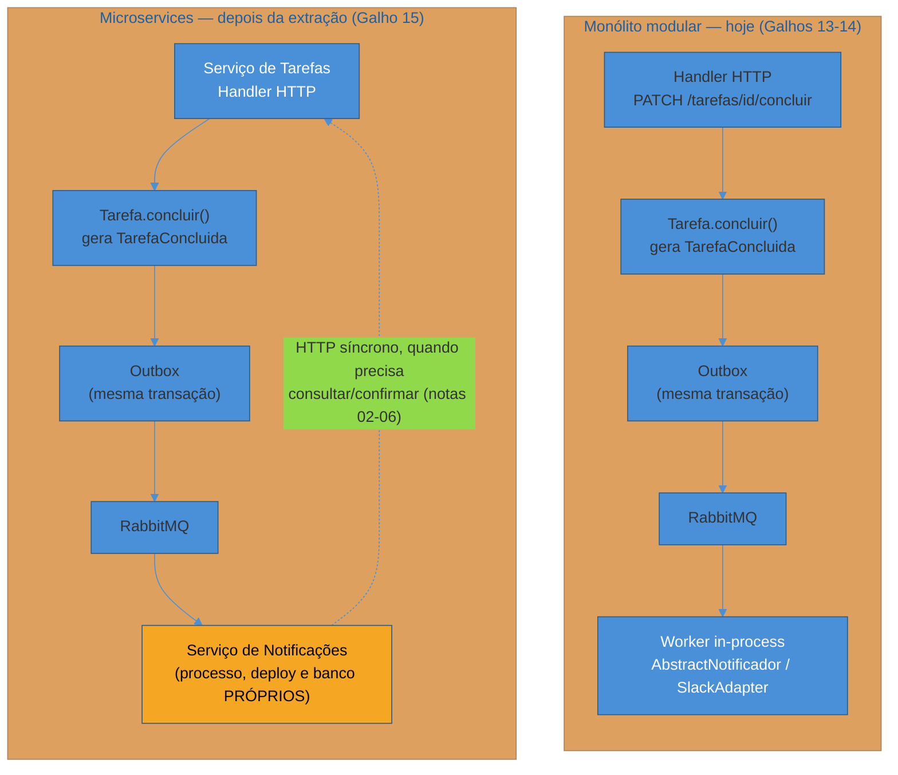

# Panorama — de monólito modular a microservices em Python

> [!abstract] TL;DR
> A API de Tarefas que esta trilha construiu ao longo dos Galhos 9-14 já é um **monólito modular** de verdade — domínio isolado em arquitetura hexagonal ([[03-Dominios/Tecnologia/Python/Arquitetura e Design Patterns/index|Galho 13]]), eventos de domínio publicados via Outbox e consumidos de forma assíncrona ([[03-Dominios/Tecnologia/Python/Mensageria/index|Galho 14]]). Este galho **não** é sobre quebrar essa API em microservices porque "é assim que se faz em produção". É sobre o que muda no código quando a decisão de extrair um serviço **já foi tomada por um motivo concreto** — normalmente organizacional (um time quer deployar sem coordenar release com outro) ou técnico (um perfil de carga radicalmente diferente do resto). A tese honesta, herdada de [[03-Dominios/Tecnologia/Java/Microservices e sistemas distribuídos/01 - O que são microservices e a tese honesta|Java — a tese honesta]] e de [[03-Dominios/Tecnologia/Java/Microservices e sistemas distribuídos/23 - Quando NÃO fazer microservices|quando NÃO fazer microservices]], não muda uma vírgula por trocar de linguagem: microservices trocam complexidade de código por complexidade operacional, e só compensam quando o monólito modular já dói de verdade. O que muda é só a superfície: como código Python fala HTTP com outro serviço, resiste a falha de rede, se autentica, se descobre, propaga trace e coordena uma Saga. É o mapa dessas sete notas seguintes.

## Uma extração real não é sobre moda

O time de plataforma da API de Tarefas — a mesma API que atravessou os Galhos 9 a 14 desta trilha — está numa reunião de planejamento de sprint. O módulo de notificações, hoje um `AbstractNotificador`/`SlackAdapter` chamado por um worker que consome eventos `TarefaConcluida` de uma fila RabbitMQ (exatamente como a [[03-Dominios/Tecnologia/Python/Mensageria/08 - Capstone — processamento assíncrono na API de Tarefas|capstone do Galho 14]] deixou pronto), está prestes a crescer: além de Slack, o produto quer e-mail transacional, push mobile e, em alguns meses, um "centro de notificações" dentro do próprio app, com histórico e preferências por usuário. O time que cuida desse pedaço não é mais o mesmo time que cuida do cadastro e do CRUD de tarefas — é um time novo, dedicado a comunicação com o usuário, com seu próprio backlog e sua própria cadência de deploy.

O gatilho concreto que aparece na reunião não é estético. É este: o time de notificações quer subir uma mudança no adaptador de push mobile **hoje à tarde**, mas o pipeline de deploy da API de Tarefas está em code freeze por causa de uma migração de banco arriscada que o time de produto está testando em produção. Duas equipes, dois ritmos, um único deployável — e agora um bloqueia o outro por um motivo que não tem nada a ver com o código de nenhum dos dois.

> [!question]- Isso não poderia ser resolvido com feature flags ou com um pipeline de deploy mais rápido, sem extrair nada?
> Em muitos casos, sim — e é exatamente essa a primeira pergunta que um time sênior deveria fazer antes de considerar extração, como a [[03-Dominios/Tecnologia/Java/Microservices e sistemas distribuídos/23 - Quando NÃO fazer microservices|árvore de decisão da trilha Java]] deixa explícito. Feature flags resolvem "eu quero desligar essa mudança sem reverter o deploy". Pipeline mais rápido resolve "o deploy demora demais". Nenhum dos dois resolve o problema real desta cena: **dois times diferentes, com prioridades e apetite de risco diferentes, precisando deployar o mesmo binário**. Enquanto o código de notificações mora dentro do mesmo processo e do mesmo pipeline da API de Tarefas, o time de notificações está, estruturalmente, refém do calendário de risco do time de produto — não importa quão rápido o CI rode.

Repare no que **não** apareceu nessa cena: ninguém disse "vamos fazer microservices porque é a arquitetura certa" ou "porque todo produto sério em produção usa microservices". O motivo é específico, nomeável e, mais importante, é um motivo que o **monólito modular atual não resolve sozinho** — porque o problema não é de código, é de quem aperta o botão de deploy e quando. Essa é a diferença entre extrair por dor real e extrair por Microservice Envy, o termo que a própria trilha Java já cunhou para o oposto disto.

> [!tip] O teste rápido antes de extrair qualquer coisa
> Pergunte: "se eu não extrair este módulo, qual dor concreta continua existindo amanhã?" Se a resposta for "nenhuma, só acho mais elegante", pare — fique no monólito modular. Se a resposta for "dois times não conseguem deployar sem se coordenar" ou "este pedaço precisa escalar 50x mais que o resto e está derrubando o resto junto", a dor é real e a extração é candidata legítima. É exatamente o critério que a [[03-Dominios/Tecnologia/Java/Microservices e sistemas distribuídos/23 - Quando NÃO fazer microservices|árvore de decisão da trilha Java]] formaliza — e que se aplica sem alteração nenhuma aqui, porque é uma decisão de arquitetura, não de linguagem.

## O que já está pronto — e por que isso importa mais do que parece

A boa notícia, e o motivo pelo qual esta extração é discutível em vez de imprudente, é que a API de Tarefas não está numa bola de lama. Ela já tem as três propriedades que Sam Newman aponta como pré-requisito para uma extração barata — mesmo antes de qualquer código de rede existir:

- **Fronteira de domínio já estável.** O Galho 13 isolou `Tarefa` como entidade de domínio puro, com `AbstractNotificador` como *port* e `SlackAdapter` como *adapter* — a interface pública do módulo de notificações já existe, só não está atrás de uma rede.
- **Comunicação já assíncrona no ponto certo.** O Galho 14 já tirou a notificação do caminho síncrono do handler HTTP via Outbox e uma fila RabbitMQ — o handler `PATCH /tarefas/{id}/concluir` já não espera o Slack responder. Extrair o serviço de notificações não muda essa propriedade; ela já estava resolvida.
- **Contrato de evento já nomeado.** `TarefaConcluida` já é um Domain Event serializável, com `evento_id`, `ocorrido_em` e um payload estável — o mesmo contrato que hoje um worker in-process consome pode, sem mudar de forma, ser consumido por um processo totalmente separado.

Note a diferença real entre os dois lados do diagrama: o caminho assíncrono (evento via Outbox → RabbitMQ → consumer) **não muda nada** com a extração — ele já era desacoplado. O que aparece de novo é a seta pontilhada: qualquer chamada **síncrona** entre os dois serviços (o serviço de Tarefas perguntando ao de Notificações "esse usuário tem push habilitado?", por exemplo) agora atravessa rede, com tudo que isso implica — é exatamente essa seta que as seis notas seguintes deste galho existem para tratar.

## O preço que a extração cobra, mesmo com a fronteira pronta

Ter a fronteira certa não zera o custo — só o reduz. A [[03-Dominios/Tecnologia/Java/Microservices e sistemas distribuídos/01 - O que são microservices e a tese honesta|tese honesta da trilha Java]] chama isso de *microservice premium*, e ele se cobra em Python exatamente como se cobra em qualquer stack, porque é um custo de **rede**, não de linguagem:

- **A rede não é confiável.** Uma chamada de função Python (`notificador.enviar(...)`) não tem timeout, não perde pacote, não retorna 503. Uma chamada HTTP para o serviço de Notificações tem tudo isso — e "esquecer" de tratar essas falhas é a forma mais comum de um microservice ficar pior que o monólito que ele substituiu.
- **Cada serviço agora tem seu próprio banco.** Se o serviço de Notificações ganha um banco próprio (para guardar preferências e histórico), a consulta que antes era um `JOIN` vira duas chamadas de rede e uma composição manual — e a transação que antes era ACID vira, na melhor das hipóteses, uma Saga com compensação.
- **Observabilidade deixa de ser "ler um log".** Diagnosticar "por que a notificação da tarefa 4821 não chegou" agora exige reconstruir uma jornada que passou por dois processos, dois bancos e uma fila — sem um trace correlacionando as pontas, é procurar agulha em dois palheiros diferentes.
- **Duas coisas para operar em vez de uma.** Dois deploys, dois conjuntos de métricas, duas superfícies de erro em produção, duas versões de contrato para manter compatíveis ao longo do tempo.

> [!warning] Nenhuma nota deste galho existe para "ensinar microservices". Elas existem para pagar esse preço de forma disciplinada
> Cada nota seguinte resolve um pedaço específico desse preço — timeout e connection pooling (nota 02), retry e circuit breaker (nota 03), autenticação entre serviços (nota 04), descoberta de endereço (nota 05), trace distribuído (nota 06), coordenação transacional (nota 07). Nenhuma delas existe para convencer você de que extrair foi a decisão certa — essa decisão já foi tomada, com um motivo concreto, antes da primeira linha de código de rede. O papel deste galho é: dada a decisão, como o código Python não vira um desastre operacional.

## Fronteiras: o que este galho NÃO ensina (de novo)

Vale repetir, porque é fácil confundir "aplicado" com "raso": os **conceitos** por trás de cada peça já foram cobertos em profundidade, de forma agnóstica de linguagem, em outros lugares da árvore de conhecimento — e este galho não os repete, só os aplica em código Python real.

- **CAP, consistência eventual, consenso distribuído** → [[03-Dominios/Engenharia/Arquitetura/System Design/index|System Design]]. Aqui só se usa o vocabulário, não se reconstrói a teoria.
- **Circuit Breaker como padrão, API Gateway/BFF como conceito, Rate Limiting como estratégia** → também [[03-Dominios/Engenharia/Arquitetura/System Design/index|System Design]] (sub-galhos "Building blocks" e "Padrões recorrentes"). A nota 03 deste galho mostra `tenacity`/`pybreaker` implementando o padrão, não explica de novo o que um circuit breaker é.
- **Contratos REST/GraphQL/gRPC, idempotência, versionamento de API, webhooks** → [[03-Dominios/Engenharia/Comunicação entre Sistemas/index|Comunicação entre Sistemas]]. As notas 02 e 04 consomem esses contratos com `httpx`, não os desenham do zero.
- **Mensageria, broker, Outbox, Dead Letter Queue** → já construídos no [[03-Dominios/Tecnologia/Python/Mensageria/index|Galho 14]] desta própria trilha. A Saga da nota 07 reusa esse ferramental — RabbitMQ, `aio-pika`, tabela `outbox_events` — sem reconstruí-lo.
- **Domain Events, arquitetura hexagonal, Repository, Unit of Work, Service Layer** → já construídos no [[03-Dominios/Tecnologia/Python/Arquitetura e Design Patterns/index|Galho 13]] desta trilha. `TarefaConcluida`, `AbstractNotificador`, `AbstractUnitOfWork` continuam exatamente como estavam — este galho os consome, não os reabre.
- **Observabilidade de produção em profundidade** (logging estruturado, métricas, dashboards Grafana) → fica para um galho futuro desta trilha (Observabilidade de operação). A nota 06 aqui cobre só tracing distribuído, na medida em que ele é indispensável para depurar uma chamada entre dois serviços — não o stack de observabilidade inteiro.
- **Kubernetes e deploy em si** → também um galho futuro (Cloud-native e produção). Quando a nota 05 falar de service discovery via DNS, ela vai mencionar que isso é "o jeito que Kubernetes resolve o problema hoje" como um fato do ambiente, sem ensinar a operar um cluster.

## O mapa das sete notas seguintes

O galho segue a ordem em que uma extração de serviço real, do zero, acumula peças — cada nota resolve exatamente um pedaço do preço listado acima, sobre o mesmo cenário de abertura (o time de notificações extraindo seu serviço da API de Tarefas):

1. **[[02 - Comunicação síncrona entre serviços — httpx|Comunicação síncrona entre serviços: httpx]]** — o cliente HTTP moderno do Python, timeouts explícitos (por que uma request sem timeout é uma bomba-relógio em produção) e connection pooling reutilizável.
2. **[[03 - Resiliência na prática — tenacity e circuit breaker|Resiliência na prática: tenacity e circuit breaker]]** — retry com backoff exponencial e circuit breaker de verdade, aplicados sobre a chamada `httpx` da nota anterior.
3. **[[04 - Cliente de API Gateway — autenticação serviço-a-serviço|Cliente de API Gateway: autenticação serviço-a-serviço]]** — como o serviço de Tarefas se autentica perante o Gateway ao chamar o serviço de Notificações, e como reage a rate limit.
4. **[[05 - Service discovery na prática|Service discovery na prática]]** — como o cliente descobre o endereço do serviço de Notificações sem hardcode, o jeito honesto (DNS/Kubernetes Service) contra o jeito de livro-texto (registry dedicado).
5. **[[06 - Tracing distribuído com OpenTelemetry|Tracing distribuído com OpenTelemetry]]** — como reconstruir a jornada de uma requisição que atravessou os dois serviços, com o trace ID viajando no header HTTP.
6. **[[07 - Saga orquestrada em Python|Saga orquestrada em Python]]** — quando uma operação de negócio precisa coordenar os dois serviços com passo de compensação, sem transação ACID cruzando o processo.
7. **[[08 - Capstone — extraindo o serviço de Notificações|Capstone: extraindo o serviço de Notificações]]** — todas as peças anteriores aplicadas de ponta a ponta, extraindo de fato o `AbstractNotificador`/`SlackAdapter` para um serviço HTTP separado.

> [!question]- Por que a ordem começa por comunicação síncrona (`httpx`), se a maior parte da API de Tarefas já é assíncrona via eventos?
> Porque o problema que abriu este galho — o time de notificações querendo consultar preferências de push antes de decidir o canal, ou o serviço de Tarefas querendo confirmar que uma notificação foi de fato agendada — não se resolve com um evento fire-and-forget; exige uma resposta imediata. A comunicação assíncrona via Outbox e RabbitMQ já está resolvida desde o Galho 14; o que falta, e o que este galho ensina primeiro, é exatamente o tipo de chamada que os eventos não cobrem: pergunta-resposta síncrona entre dois processos que antes eram um só.

## Na prática: o que muda no código, resumido em uma tabela

| Aspecto | Monólito modular (Galhos 13-14) | Depois da extração (este galho) |
| --- | --- | --- |
| Chamar `notificador.enviar(...)` | Chamada de método Python, mesma memória | Requisição HTTP via `httpx`, outra máquina (nota 02) |
| O que acontece se a chamada falhar | Exceção Python, propaga na hora | Timeout, conexão recusada, 503 — precisa retry/circuit breaker (nota 03) |
| Quem pode chamar o serviço de Notificações | Qualquer código no mesmo processo | Só quem se autentica como client legítimo (nota 04) |
| Como o chamador acha o endereço | Import Python (`from notificacoes import SlackAdapter`) | Resolução de nome — DNS/Kubernetes Service (nota 05) |
| Como depurar "por que isso falhou" | `pdb`/stack trace local | Trace distribuído correlacionando os dois processos (nota 06) |
| Concluir tarefa + notificar, atomicamente | Uma transação, ou evento assíncrono via Outbox | Sem transação cruzando processo — Saga com compensação, quando o caso exige (nota 07) |
| Deploy | Um pipeline, um binário | Dois pipelines, dois binários, contratos versionados entre eles (nota 08) |

Cada linha dessa tabela é um custo que a organização decidiu pagar **por um motivo específico** — não porque a tabela em si é desejável. Se você chegou nesta nota achando que microservices é o próximo passo natural de qualquer API que cresce, essa tabela é o antídoto: é uma lista de trabalho extra, não uma lista de conquistas.

## Armadilhas

### (1) Extrair antes de a fronteira provar que está estável

O cenário de abertura funciona porque `AbstractNotificador` já era uma interface pública clara havia dois galhos — a extração é mecânica, não uma descoberta às pressas de onde termina "notificação" e começa "tarefa". Extrair um módulo cuja fronteira ainda está mexendo (mudando de forma a cada sprint) significa pagar o preço de rede **e** ainda ter que corrigir a fronteira depois, com o custo dobrado que [[03-Dominios/Tecnologia/Java/Microservices e sistemas distribuídos/23 - Quando NÃO fazer microservices|a trilha Java]] já descreveu para mover funcionalidade entre serviços.

*Fix:* se a fronteira ainda está incerta, resolva isso dentro do monólito modular primeiro — reorganizar um pacote Python é barato; reorganizar dois serviços em produção não é.

### (2) Achar que "está em Python" muda o cálculo

É tentador achar que, por a API já ser assíncrona por natureza (FastAPI, `asyncio`), o custo do distribuído é menor do que numa stack Java tradicional. Não é: `asyncio` ajuda a não bloquear uma *thread* enquanto se espera uma resposta de rede, mas não reduz em nada a probabilidade de a rede falhar, nem a necessidade de retry, timeout, circuit breaker ou trace correlacionado. O premium do distribuído é sobre **topologia**, não sobre paradigma de concorrência.

*Fix:* trate a extração em Python com o mesmo rigor operacional que trataria em qualquer outra stack — as sete notas seguintes existem exatamente para isso.

## Em resumo

A API de Tarefas não vira microservices porque este galho existe. Ela vira microservices porque um time real bateu numa dor real de coordenação de deploy — e este galho existe para que, dada essa decisão já tomada, o código Python que resulta dela não vire um monólito distribuído (o pior dos dois mundos, com o overhead de rede e o acoplamento do monólito juntos). A partir da próxima nota, o foco muda de "por que extrair" para "como o código conversa depois de extraído" — começando pela peça mais básica de todas: um cliente HTTP configurado para produção, não para o feliz caminho do tutorial.

## Fontes

- Martin Fowler & James Lewis — *Microservices*, martinfowler.com: https://martinfowler.com/articles/microservices.html (conceito e trade-offs, referenciado via [[03-Dominios/Tecnologia/Java/Microservices e sistemas distribuídos/01 - O que são microservices e a tese honesta|nota irmã da trilha Java]])
- Martin Fowler — *MicroservicePremium*, martinfowler.com: https://martinfowler.com/bliki/MicroservicePremium.html
- Martin Fowler — *MonolithFirst*, martinfowler.com: https://martinfowler.com/bliki/MonolithFirst.html
- Sam Newman, via InfoQ — *Monolith Decomposition Patterns* (2020): https://www.infoq.com/news/2020/05/monolith-decomposition-newman/
- Real Python — *Python HTTP Clients: Which Should You Use?*: https://realpython.com/python-httpx/ (contexto de ferramental, desenvolvido na nota 02 deste galho)

## Veja também

- [[03-Dominios/Tecnologia/Python/Microservices e sistemas distribuídos/index|Microservices e sistemas distribuídos (MOC do galho)]]
- [[02 - Comunicação síncrona entre serviços — httpx|02 — Comunicação síncrona entre serviços: httpx]]
- [[03-Dominios/Tecnologia/Python/Mensageria/08 - Capstone — processamento assíncrono na API de Tarefas|Capstone do Galho 14 — o ponto de partida desta extração]]
- [[03-Dominios/Tecnologia/Python/Arquitetura e Design Patterns/index|Arquitetura e Design Patterns]] — Galho 13, domínio hexagonal reusado aqui
- [[03-Dominios/Tecnologia/Java/Microservices e sistemas distribuídos/01 - O que são microservices e a tese honesta|Java — O que são microservices e a tese honesta]]
- [[03-Dominios/Tecnologia/Java/Microservices e sistemas distribuídos/23 - Quando NÃO fazer microservices|Java — Quando NÃO fazer microservices]]
- [[03-Dominios/Engenharia/Arquitetura/System Design/index|System Design]] — CAP, Circuit Breaker, API Gateway como conceito
- [[03-Dominios/Engenharia/Comunicação entre Sistemas/index|Comunicação entre Sistemas]] — contratos REST/GraphQL/gRPC
