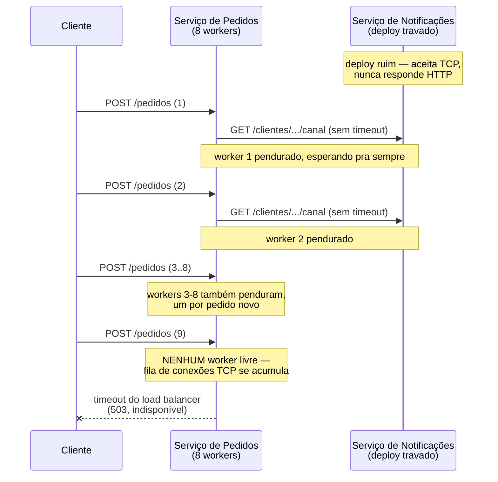
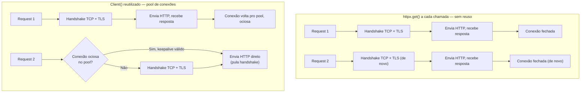
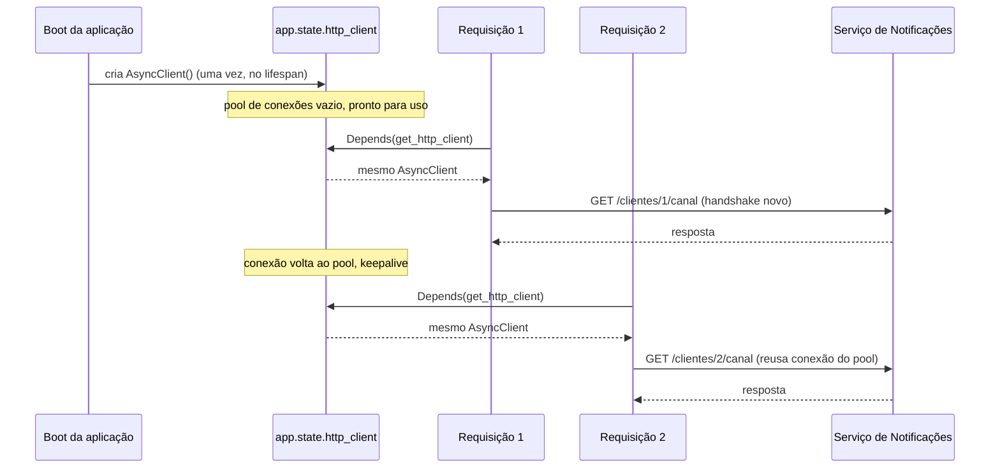

# Comunicação síncrona entre serviços — httpx

> [!abstract] TL;DR
> `httpx` é o cliente HTTP que o ecossistema Python adotou como sucessor de fato do `requests` para uso em produção: mesma API ergonômica (`get`/`post`/`json=`/`raise_for_status()`), mas com suporte nativo a **HTTP/2** e, principalmente, uma API **assíncrona** (`httpx.AsyncClient`) espelhando exatamente a síncrona (`httpx.Client`) — o mesmo vocabulário, os mesmos parâmetros, duas formas de chamar. Dois hábitos separam um cliente HTTP de brinquedo de um cliente HTTP de produção. O primeiro é **timeout explícito**: sem configurar um, uma chamada de rede pode ficar pendurada indefinidamente esperando um serviço remoto que travou — e cada requisição pendurada segura um worker/thread/coroutine que nunca é devolvido, até que o processo inteiro fique sem capacidade de atender qualquer requisição nova, mesmo as que nada têm a ver com o serviço problemático. O segundo é **reuso de conexão via `Client()`**: cada instância de `Client`/`AsyncClient` mantém um pool de conexões TCP+TLS já estabelecidas, prontas para reuso — o mesmo custo de handshake que a [[03-Dominios/Tecnologia/Python/Persistência de dados/07 - Connection pooling e performance em produção|nota 07 do Galho 9]] já descreveu para conexões de banco se aplica, sem alteração de princípio, a conexões HTTP: abrir um cliente novo a cada chamada paga esse custo de novo, toda vez; um cliente reutilizado como singleton da aplicação paga uma vez só. Em FastAPI, isso normalmente significa um `AsyncClient` injetado via `Depends()` ([[03-Dominios/Tecnologia/Python/Web e APIs REST/04 - Injeção de dependência no FastAPI — Depends|Galho 10, nota 04]]), com ciclo de vida gerenciado no `lifespan` da aplicação — o mesmo padrão de "recurso caro, singleton por app, injetado por requisição" que a `Session` de banco já ensinou.

## O incidente que abre esta nota

Sexta-feira, período de maior tráfego do dia. O serviço de Pedidos precisa consultar o serviço de Notificações a cada pedido criado, só para confirmar que o cliente tem um canal de notificação configurado antes de prosseguir. O código, escrito rápido meses atrás e nunca revisitado, faz exatamente o que parece razoável a um olhar apressado:

```python
import httpx

def criar_pedido(dados: dict) -> dict:
    pedido = salvar_pedido(dados)

    # Confirma que o cliente tem canal de notificação configurado
    resposta = httpx.get(f"http://notificacoes-service/clientes/{pedido['cliente_id']}/canal")
    if resposta.status_code == 200:
        pedido["notificacao_configurada"] = True

    return pedido
```

`httpx.get(url)` — uma chamada de nível de módulo, sem `Client` nenhum, sem timeout, sem nada além da URL. Funciona nos testes manuais, funciona em staging, funciona em produção durante meses. Na sexta-feira em questão, o time de Notificações publica um deploy com um bug de inicialização — o processo sobe, aceita conexões TCP na porta, mas trava dentro de um `import` pesado antes de conseguir responder a qualquer request HTTP. O socket aceita a conexão; a resposta nunca vem.

Do lado do serviço de Pedidos, cada chamada `httpx.get(...)` para o serviço travado não falha — ela **espera**. Sem timeout configurado, não existe um limite de tempo depois do qual a chamada desiste e levanta uma exceção; ela simplesmente fica pendurada, indefinidamente, segurando o worker que a executou. O serviço de Pedidos roda atrás de um servidor com um número finito de workers (Gunicorn, oito processos, o cenário exatamente análogo ao que a nota de connection pooling do Galho 9 já descreveu para conexões de banco). Cada novo pedido que chega dispara uma nova chamada pendurada, que consome um worker a mais — e, num intervalo de poucos minutos, os oito workers estão todos ocupados esperando respostas que nunca chegarão.



O serviço de Pedidos — que não tinha nenhum bug próprio, nenhuma query lenta, nenhum problema de recurso — fica completamente indisponível porque um serviço **de terceiro**, chamado sem timeout, o arrastou junto. É uma cascata de indisponibilidade: um deploy ruim em Notificações vira uma queda total em Pedidos, e de lá pode se espalhar para qualquer outro serviço que dependa de Pedidos, se ninguém isolar o problema a tempo.

> [!bug] O que está quebrado, em uma frase
> Um cliente HTTP sem timeout configurado não é uma omissão inofensiva — é um bug esperando acontecer: no dia em que o serviço remoto travar (deploy ruim, banco lento do outro lado, rede degradada), cada chamada pendurada consome um worker que nunca é devolvido, e a indisponibilidade de UM serviço remoto vira a indisponibilidade do serviço chamador inteiro.

O resto desta nota desenvolve, nessa ordem: por que `httpx` é a escolha certa de cliente HTTP em produção Python hoje; como configurar timeout de forma explícita e granular (a correção direta do incidente); como reutilizar conexões via `Client()`/`AsyncClient()` como singleton, evitando pagar handshake TCP+TLS a cada chamada; e como isso tudo se encaixa dentro de um handler assíncrono do FastAPI.

## Por que `httpx`, e não `requests`

`requests` foi, por mais de uma década, a biblioteca de fato-padrão para HTTP em Python — API limpa, `resposta = requests.get(url)`, `resposta.json()`, e décadas de exemplos de tutorial construídos em cima dela. O problema não é que `requests` pare de funcionar; é que `requests` **não tem API assíncrona**, e boa parte dos serviços Python de produção hoje (FastAPI, Starlette, qualquer coisa em cima de `asyncio` — o assunto dos Galhos 7 e 8 desta trilha) precisa fazer chamadas HTTP de dentro de handlers `async def`, onde uma chamada bloqueante como `requests.get()` trava o event loop inteiro enquanto espera a resposta — exatamente o tipo de bloqueio que a [[03-Dominios/Tecnologia/Python/Concorrência e paralelismo/06 - asyncio fundamentals — event loop, coroutines e Task|nota 06 do Galho 7]] já descreveu como incompatível com concorrência cooperativa.

`httpx` resolve isso oferecendo **as duas APIs na mesma biblioteca**, com o mesmo vocabulário:

```python
import httpx

# Síncrono — mesma API que requests, praticamente linha a linha
with httpx.Client() as client:
    resposta = client.get("https://api.exemplo.com/pedidos/42")
    resposta.raise_for_status()
    dados = resposta.json()

# Assíncrono — mesmíssima API, com await
async def buscar_pedido():
    async with httpx.AsyncClient() as client:
        resposta = await client.get("https://api.exemplo.com/pedidos/42")
        resposta.raise_for_status()
        dados = resposta.json()
```

`client.get()` vira `await client.get()`; `httpx.Client()` vira `httpx.AsyncClient()`; todo o resto — parâmetros, cabeçalhos, tratamento de resposta, exceções — é idêntico. Não existem duas bibliotecas com filosofias diferentes para aprender (como seria migrar de `requests` síncrono para `aiohttp` assíncrono, que tem sua própria API e suas próprias convenções, cobertas na [[03-Dominios/Tecnologia/Python/Programação Reativa e Assíncrona/03 - aiohttp cliente — ClientSession, connection pooling e requisições concorrentes|nota 03 do Galho 8]]) — é a mesma API, escolhendo síncrono ou assíncrono conforme o contexto de chamada exige.

> [!question]- Se `aiohttp` já cobre cliente assíncrono (Galho 8, nota 03), por que este galho usa `httpx`?
> Os dois fazem o trabalho de cliente HTTP assíncrono, mas com propósitos de ecossistema diferentes. `aiohttp` é assíncrono-só — não tem API síncrona, e é frequentemente usado também como **servidor** (a nota 04 do mesmo galho cobre `aiohttp` do lado servidor). `httpx` é a escolha mais comum quando o mesmo código-base precisa funcionar em contexto síncrono e assíncrono — por exemplo, uma biblioteca cliente compartilhada entre um script de linha de comando síncrono e um serviço FastAPI assíncrono — ou quando o time simplesmente prefere a API mais próxima de `requests`, já familiar. Em produção, as duas escolhas são válidas; este galho usa `httpx` porque os serviços da API de Tarefas construídos ao longo da trilha já são FastAPI (síncrono e assíncrono convivendo, dependendo do endpoint), e ter uma única biblioteca cobrindo os dois casos simplifica a superfície de dependências do projeto.

Além da API dupla, `httpx` suporta **HTTP/2** nativamente (via o parâmetro `http2=True` na construção do cliente, que exige o extra opcional `httpx[http2]` instalado, dependente da biblioteca `h2`). HTTP/2 multiplexa múltiplas requisições numa única conexão TCP — várias chamadas concorrentes ao mesmo host não precisam mais de conexões TCP separadas, reduzindo ainda mais o overhead de handshake sob alta concorrência contra o mesmo servidor:

```python
client = httpx.Client(http2=True)
```

Esse ganho só se materializa se o servidor do outro lado também fala HTTP/2 — a maioria dos serviços internos por trás de um Ingress/API Gateway moderno em Kubernetes já suporta, mas vale confirmar antes de assumir o ganho como automático.

## Timeouts explícitos: a correção direta do incidente

A causa raiz do incidente de abertura é simples de nomear: `httpx.get(url)`, chamado sem nenhum parâmetro de timeout, usa um comportamento padrão que **não é "sem limite"** — mas o padrão do `httpx` (timeout de 5 segundos em cada uma das quatro fases de uma requisição, ver adiante) só se aplica quando se usa o cliente de nível de módulo (`httpx.get`) sem override, e é justamente esse padrão implícito, nunca revisado, que se torna perigoso quando a suposição do time é "isso vai falhar rápido se algo der errado" sem ninguém ter verificado o valor real. Em produção, timeout não deveria ser "o que a biblioteca decidiu por padrão" — deveria ser uma decisão explícita, documentada, calibrada para o SLA daquela chamada específica.

```python
import httpx

# Errado: timeout implícito, ninguém sabe qual valor está em vigor
resposta = httpx.get("http://notificacoes-service/clientes/42/canal")

# Certo: timeout explícito, decisão documentada
resposta = httpx.get(
    "http://notificacoes-service/clientes/42/canal",
    timeout=5.0,  # 5 segundos é o SLA acordado com o time de Notificações
)
```

> [!warning] Cliente HTTP sem timeout configurado é um bug esperando acontecer
> Não é uma questão de "se" um serviço remoto vai travar ou ficar lento demais — é questão de "quando". Um timeout ausente transforma qualquer degradação do lado de lá (deploy ruim, banco lento, rede saturada) numa degradação garantida do lado de cá, porque cada chamada pendurada consome um recurso finito (worker, thread, slot de conexão) que nunca é devolvido enquanto a chamada não retorna. Configurar timeout não é otimização de performance — é a diferença entre "um serviço remoto degradado" e "uma cascata de indisponibilidade".

### As quatro fases do timeout granular

O que `httpx` chama de "timeout" na verdade decompõe em quatro fases distintas da vida de uma requisição HTTP, cada uma com seu próprio limite configurável via `httpx.Timeout`:

```python
import httpx

timeout = httpx.Timeout(
    connect=5.0,  # tempo máximo para estabelecer a conexão TCP (+ TLS handshake)
    read=10.0,    # tempo máximo entre bytes de resposta recebidos (não é o total da resposta)
    write=5.0,    # tempo máximo para enviar o corpo da requisição
    pool=2.0,     # tempo máximo esperando uma conexão livre no pool (ver seção seguinte)
)

client = httpx.Client(timeout=timeout)
```

- **`connect`** — quanto tempo esperar pelo handshake TCP (e TLS, se HTTPS) até a conexão estar de fato estabelecida. Um servidor que não responde no nível de rede (porta filtrada, host fora do ar) estoura esse timeout primeiro, antes de qualquer byte de HTTP trocar de mãos.
- **`read`** — quanto tempo esperar entre dois pedaços consecutivos de dados recebidos do servidor, uma vez que a resposta começou a chegar. É frequentemente mal-entendido como "tempo total da resposta inteira" — não é: um servidor que envia dados lentamente, mas de forma contínua (streaming, por exemplo), pode levar mais que `read` segundos no total sem nunca estourar esse timeout, desde que nunca fique mais que `read` segundos **sem enviar nada**. É exatamente esse tipo de timeout — "sem receber nada há muito tempo" — que teria protegido o serviço de Pedidos no incidente de abertura: o serviço travado nunca chega a enviar sequer o primeiro byte de resposta, então `connect` teria sucesso (a porta aceita conexão), mas `read` estouraria assim que o prazo configurado passasse sem nenhum dado chegando.
- **`write`** — quanto tempo esperar para enviar o corpo da requisição (relevante principalmente em `POST`/`PUT` com corpo grande, ou quando o servidor está lento para consumir dados de entrada).
- **`pool`** — quanto tempo esperar por uma conexão disponível no pool interno do cliente, quando todas as conexões já abertas estão ocupadas por outras requisições concorrentes e o limite de conexões simultâneas (`max_connections`, ver seção seguinte) já foi atingido. Esse é o timeout mais fácil de esquecer, e o mais parecido em espírito com o `pool_timeout` do `QueuePool` do SQLAlchemy que a nota 07 do Galho 9 já cobriu — mesmo conceito estrutural (esperar por um recurso finito emprestado), aplicado a conexões HTTP em vez de conexões de banco.

Para o caso comum de "o mesmo valor em todas as quatro fases", `httpx` aceita um único número:

```python
client = httpx.Client(timeout=10.0)  # equivalente a connect=read=write=pool=10.0
```

E é possível combinar um default geral com um override pontual em fases específicas:

```python
timeout = httpx.Timeout(10.0, connect=5.0)  # tudo em 10s, exceto connect em 5s
```

> [!question]- Por que não usar sempre um timeout único e simples, em vez de quatro valores separados?
> Um único número funciona bem como ponto de partida, mas mistura fenômenos diferentes sob o mesmo limite. `connect` falhando é quase sempre um problema de rede/infra (host fora do ar, DNS quebrado, firewall bloqueando); `read` estourando é quase sempre o servidor remoto processando devagar ou travado (o cenário do incidente de abertura); `pool` estourando é sobre o **cliente local** não ter conexão disponível, nada a ver com o servidor remoto. Um serviço que precisa de resiliência fina — por exemplo, tolerar handshakes lentos em redes ruins mas falhar rápido se o servidor não está respondendo dados — se beneficia de configurar cada fase separadamente. Para a maioria dos casos, começar com um timeout único (ex: `timeout=5.0`) e só granularizar quando um incidente real mostrar que uma fase específica precisa de um limite diferente é uma progressão razoável — não é preciso desenhar as quatro fases perfeitamente desde o primeiro dia.

### O que acontece quando um timeout estoura

`httpx` levanta uma subclasse de `httpx.TimeoutException` — especificamente `ConnectTimeout`, `ReadTimeout`, `WriteTimeout` ou `PoolTimeout`, dependendo de qual fase estourou — que o código chamador precisa capturar e tratar como uma falha de comunicação, não deixar propagar sem controle:

```python
import httpx

try:
    resposta = client.get(
        "http://notificacoes-service/clientes/42/canal",
        timeout=httpx.Timeout(connect=5.0, read=10.0, write=5.0, pool=2.0),
    )
    resposta.raise_for_status()
except httpx.ConnectTimeout:
    # host não respondeu ao handshake — provável problema de rede/infra
    logger.warning("timeout conectando ao serviço de notificações")
    return {"notificacao_configurada": None}  # degrada, não derruba o pedido inteiro
except httpx.ReadTimeout:
    # conectou, mas o servidor não respondeu a tempo — provável travamento do lado de lá
    logger.warning("timeout aguardando resposta do serviço de notificações")
    return {"notificacao_configurada": None}
except httpx.HTTPStatusError as exc:
    # respondeu, mas com status de erro (4xx/5xx)
    logger.warning(f"serviço de notificações respondeu {exc.response.status_code}")
    return {"notificacao_configurada": None}
```

Esse padrão — degradar em vez de derrubar o pedido inteiro — é uma decisão de produto, não só de código: se confirmar canal de notificação é uma checagem "de boa vontade", uma falha de comunicação com o serviço remoto não deveria impedir a criação do pedido em si. A [[03 - Resiliência na prática — tenacity e circuit breaker|nota 03 deste galho]] desenvolve isso de forma mais estruturada — retry com backoff exponencial via `tenacity` para falhas transitórias, e circuit breaker para parar de tentar de vez quando o serviço remoto está claramente fora do ar, evitando que o próprio ato de tentar (mesmo com timeout curto) ainda contribua para sobrecarregar um serviço já degradado.

## Connection pooling: reutilizando `Client()` como recurso caro

O incidente de abertura usou `httpx.get(url)` — uma chamada de nível de módulo que, por trás dos panos, cria um `Client` temporário, faz a requisição, e descarta o cliente ao final. Isso significa que **cada chamada** paga do zero o custo de estabelecer uma conexão TCP nova e, se HTTPS, negociar TLS de novo — exatamente o mesmo custo estrutural (handshake TCP, negociação TLS, múltiplas idas-e-voltas de rede antes do primeiro byte útil trafegar) que a [[03-Dominios/Tecnologia/Python/Persistência de dados/07 - Connection pooling e performance em produção|nota 07 do Galho 9]] já detalhou para conexões de banco de dados. O paralelo é direto: assim como abrir uma `Session` de banco nova a cada query descarta o benefício de manter uma conexão já autenticada pronta para reuso, chamar `httpx.get()` a cada requisição HTTP descarta o benefício de manter uma conexão TCP já estabelecida pronta para a próxima chamada ao mesmo host.

```python
import httpx
import time

# Ruim: um cliente novo (implícito) a cada chamada — paga handshake toda vez
def buscar_canal_ruim(cliente_id: int) -> dict:
    resposta = httpx.get(f"http://notificacoes-service/clientes/{cliente_id}/canal")
    return resposta.json()

# Melhor: um Client reutilizado — conexão TCP fica aberta entre chamadas
client = httpx.Client(base_url="http://notificacoes-service", timeout=5.0)

def buscar_canal_bom(cliente_id: int) -> dict:
    resposta = client.get(f"/clientes/{cliente_id}/canal")
    return resposta.json()
```

`httpx.Client()` mantém, internamente, um **pool de conexões** — por padrão, até 100 conexões mantidas abertas no total, das quais até 20 podem ficar "keepalive" (ociosas, mas prontas para reuso) por host. Esses limites são configuráveis via `httpx.Limits`:

```python
limits = httpx.Limits(
    max_connections=100,           # total de conexões simultâneas permitidas
    max_keepalive_connections=20,  # conexões ociosas mantidas abertas para reuso
    keepalive_expiry=5.0,          # segundos até uma conexão ociosa ser fechada
)

client = httpx.Client(limits=limits, timeout=5.0)
```

Quando uma segunda requisição é feita ao mesmo host dentro da janela de `keepalive_expiry`, `httpx` reutiliza a conexão TCP já aberta em vez de abrir uma nova — pulando direto para "enviar a requisição HTTP", sem repetir handshake TCP nem, se HTTPS, negociação TLS.



> [!tip] O `base_url` do `Client` reduz repetição, não só custo de conexão
> Passar `base_url="http://notificacoes-service"` na construção do `Client` permite que todas as chamadas subsequentes usem paths relativos (`client.get("/clientes/42/canal")` em vez da URL completa repetida em cada chamada) — um detalhe de ergonomia pequeno, mas que também evita o erro comum de uma URL base digitada de forma ligeiramente diferente em duas chamadas diferentes no mesmo código.

### Por que instância nova a cada chamada é cara — mesmo sem medir milissegundos

Como a nota do Galho 9 já registrou para o caso de banco, o número exato de milissegundos que um handshake custa varia com rede, TLS, distância física entre os serviços, e não deveria ser citado como constante universal. O que importa, estruturalmente, é que esse custo é **fixo por conexão**, não por requisição lógica — sob um volume alto de chamadas HTTP entre dois serviços (o caso comum em arquitetura de microservices, onde um serviço pode chamar outro dezenas de vezes por segundo), criar um `Client` novo a cada chamada multiplica esse custo fixo pelo número de chamadas, enquanto reutilizar um `Client` paga o custo uma vez e amortiza sobre todas as chamadas subsequentes que reusam uma conexão do pool.

> [!warning] `with httpx.Client() as client:` dentro de uma função chamada em loop ainda é o anti-padrão
> **O que acontece:** trocar `httpx.get(url)` por `with httpx.Client() as client: client.get(url)` parece uma correção, porque agora existe um `Client` explícito — mas se esse bloco `with` está dentro de uma função chamada repetidamente (dentro de um loop, ou dentro de um handler chamado a cada requisição HTTP), um `Client` novo ainda é criado (e destruído) a cada chamada, com o mesmo custo de conexão nova pago toda vez. **Por quê:** o ganho de connection pooling só existe quando o **mesmo** objeto `Client` sobrevive entre múltiplas chamadas HTTP, mantendo seu pool interno de conexões keepalive vivo entre elas — um `Client` criado e descartado a cada chamada nunca chega a reutilizar nada, porque não há um "segunda chamada" que reencontre o mesmo pool. **Como evitar:** o `Client`/`AsyncClient` precisa viver no escopo certo — variável de módulo, atributo de uma classe de serviço construída uma vez, ou (em FastAPI) um objeto gerenciado pelo `lifespan` da aplicação e injetado via `Depends()`, nunca recriado dentro do handler que processa cada requisição individual.

## `Client()` como singleton da aplicação: o padrão em FastAPI

A pergunta natural depois da seção anterior é: se `Client()` precisa sobreviver entre chamadas, onde ele deveria morar dentro de uma aplicação FastAPI real? A resposta segue o mesmo padrão que a [[03-Dominios/Tecnologia/Python/Web e APIs REST/04 - Injeção de dependência no FastAPI — Depends|nota 04 do Galho 10]] já estabeleceu para a `Session` de banco de dados: um recurso caro de criar (conexão de banco, ou aqui, o pool de conexões HTTP de um `Client`) não deveria ser recriado a cada requisição — deveria ser um **singleton por aplicação**, criado uma vez no boot e injetado onde for necessário.

A diferença em relação ao `get_db` do Galho 10 é sutil, mas importante: uma `Session` de banco precisa ser **nova a cada requisição** (unidade de trabalho isolada por request), mas o `Client`/`AsyncClient` HTTP em si — o objeto que carrega o pool de conexões — deveria ser **compartilhado entre todas as requisições**, porque é justamente esse compartilhamento que faz o pool valer a pena. O ciclo de vida certo para o `Client` é o ciclo de vida da **aplicação inteira**, não de cada requisição individual — o que aponta para o `lifespan` do FastAPI, não para uma dependência recriada a cada chamada:

```python
from collections.abc import AsyncGenerator
from contextlib import asynccontextmanager

import httpx
from fastapi import Depends, FastAPI


@asynccontextmanager
async def lifespan(app: FastAPI) -> AsyncGenerator[None, None]:
    # Setup: roda uma vez, no boot da aplicação
    app.state.http_client = httpx.AsyncClient(
        base_url="http://notificacoes-service",
        timeout=httpx.Timeout(connect=5.0, read=10.0, write=5.0, pool=2.0),
        limits=httpx.Limits(max_connections=100, max_keepalive_connections=20),
    )
    yield
    # Teardown: roda uma vez, no shutdown da aplicação
    await app.state.http_client.aclose()


app = FastAPI(lifespan=lifespan)


def get_http_client(request) -> httpx.AsyncClient:
    return request.app.state.http_client


@app.post("/pedidos")
async def criar_pedido(
    dados: dict,
    http_client: httpx.AsyncClient = Depends(get_http_client),
):
    pedido = salvar_pedido(dados)

    try:
        resposta = await http_client.get(f"/clientes/{pedido['cliente_id']}/canal")
        resposta.raise_for_status()
        pedido["notificacao_configurada"] = True
    except httpx.HTTPError:
        pedido["notificacao_configurada"] = None

    return pedido
```

O `lifespan` cria o `AsyncClient` **uma vez**, quando a aplicação sobe, e o guarda em `app.state` — um espaço da aplicação FastAPI feito exatamente para esse tipo de estado de ciclo de vida longo, mencionado en passant na nota 04 do Galho 10 como alternativa a variável de módulo. `get_http_client` é uma dependência simples, sem `yield` (porque não há setup/teardown por requisição a fazer — o cliente já existe, pronto, desde o boot); ela só devolve o objeto já criado. Cada requisição a `/pedidos` reutiliza o **mesmo** `AsyncClient`, e portanto o **mesmo** pool de conexões keepalive contra o serviço de Notificações — a segunda, terceira, centésima chamada ao mesmo host reaproveitam conexões já estabelecidas, em vez de pagar handshake a cada pedido criado.



> [!warning] Criar `AsyncClient()` dentro do handler é o mesmo erro de `Session` sem `Depends`
> **O que acontece:** um handler declara `async with httpx.AsyncClient() as client:` diretamente dentro do corpo da função, por parecer "mais simples" ou "mais explícito" — um `Client` novo, com pool próprio, criado e destruído a cada requisição HTTP recebida pela API. **Por quê:** é estruturalmente o mesmo erro do incidente de abertura da [[03-Dominios/Tecnologia/Python/Web e APIs REST/04 - Injeção de dependência no FastAPI — Depends|nota 04 do Galho 10]] — abrir um recurso caro dentro do handler, em vez de reutilizar um já existente — só que aplicado a conexões HTTP em vez de sessão de banco. O pool interno do `AsyncClient` nunca chega a acumular conexões keepalive reaproveitáveis, porque o objeto inteiro é descartado ao final de cada requisição, junto com qualquer conexão que ele tivesse aberto. **Como evitar:** o `AsyncClient` (ou `Client`, em contexto síncrono) mora no `lifespan` da aplicação, exposto via `app.state`, e é injetado — nunca instanciado — dentro do handler.

## `async with httpx.AsyncClient()`: quando faz sentido

A seção anterior deixa uma pergunta em aberto: se criar um `AsyncClient` dentro do handler é o anti-padrão para o caso comum (chamadas repetidas ao mesmo host, ao longo da vida da aplicação), quando o padrão `async with httpx.AsyncClient() as client:` — visto em praticamente todo tutorial de `httpx` — é de fato apropriado?

A resposta depende de **quantas vezes** aquele `Client` vai ser usado. `async with` é correto e idiomático quando o cliente é de fato de vida curta e local — por exemplo, um script único que faz uma chamada e termina, um teste que precisa de um cliente isolado por caso de teste, ou uma tarefa em lote que abre um cliente, faz N chamadas dentro do mesmo bloco `with`, e encerra:

```python
async def sincronizar_lote_de_clientes(ids_clientes: list[int]) -> list[dict]:
    # Correto: UM Client, reutilizado para TODAS as chamadas do lote,
    # dentro de um único bloco de vida curta (a função inteira)
    async with httpx.AsyncClient(base_url="http://notificacoes-service", timeout=5.0) as client:
        resultados = []
        for cliente_id in ids_clientes:
            resposta = await client.get(f"/clientes/{cliente_id}/canal")
            resultados.append(resposta.json())
        return resultados
```

O que faz esse uso de `async with` correto não é a sintaxe em si — é que o `Client` é criado **uma vez** para o lote inteiro, e as N chamadas dentro do loop compartilham o mesmo pool de conexões. O anti-padrão não é "usar `async with httpx.AsyncClient()`" — é usar esse padrão **dentro** de um escopo que se repete a cada requisição HTTP recebida pela própria aplicação, recriando o cliente inteiro (e descartando seu pool) toda vez que o handler roda. A regra prática: se a função que contém o `async with httpx.AsyncClient()` é chamada uma vez por processo/lote/script, está correto; se é chamada uma vez por requisição HTTP recebida (um handler do FastAPI, por exemplo), o `Client` deveria vir de fora — do `lifespan`, como a seção anterior mostrou — não ser criado ali dentro.

> [!question]- E dentro de testes, `async with httpx.AsyncClient()` a cada teste é um problema?
> Não da mesma forma. Testes são, por natureza, de vida curta e isolada — cada teste criando seu próprio `AsyncClient` (ou usando `httpx.AsyncClient(transport=...)` apontando para um transporte em memória, sem sequer tocar a rede, um padrão comum para testar endpoints FastAPI sem subir um servidor real) não sofre o mesmo problema de custo repetido em produção, porque o volume de chamadas dentro de uma suíte de testes não é comparável ao volume de requisições reais de produção, e o isolamento entre testes (evitar estado compartilhado entre casos de teste) geralmente pesa mais do que o ganho marginal de reutilizar um pool de conexões que sequer vai tocar a rede de verdade.

A mecânica do `await` dentro desse bloco — o que acontece no event loop enquanto a coroutine espera a resposta de rede, como outras coroutines conseguem rodar nesse meio-tempo — já foi coberta em profundidade pelo Galho 7 (fundamentals do event loop) e pelo Galho 8 (asyncio em produção); esta nota não repete essa mecânica, só aponta que `await client.get(...)` é, do ponto de vista do event loop, uma operação de I/O igual a qualquer outra `await` — a coroutine cede o controle enquanto espera a resposta de rede, permitindo que o event loop processe outras requisições concorrentes nesse intervalo, exatamente o comportamento que torna um handler assíncrono do FastAPI capaz de atender muitas requisições concorrentes com um único processo.

## Checklist de cliente HTTP de produção

Juntando as peças desta nota, um cliente HTTP pronto para produção — não para tutorial — passa por esta lista antes de ir ao ar:

1. **Timeout explícito, sempre.** Nunca depender do padrão implícito de nenhuma biblioteca; declarar `timeout=` (ou `httpx.Timeout(...)` granular) em todo `Client`/`AsyncClient` criado, calibrado para o SLA real daquela chamada, não um número arbitrário copiado de outro lugar.
2. **`Client`/`AsyncClient` reutilizado, não recriado por chamada.** Um único objeto vivendo pelo tempo de vida do processo (ou do lote/script, em contextos de vida mais curta), nunca instanciado dentro de um handler ou loop que roda repetidamente.
3. **Limites de pool configurados conscientemente.** `max_connections`/`max_keepalive_connections` calibrados para o volume real de chamadas concorrentes ao serviço remoto — os defaults do `httpx` (100/20) são um ponto de partida razoável, não um número que dispensa revisão sob carga real.
4. **Exceções de timeout e HTTP tratadas explicitamente.** `ConnectTimeout`, `ReadTimeout`, `HTTPStatusError` capturados e traduzidos numa decisão de produto (degradar, falhar o request inteiro, tentar de novo) — nunca deixadas propagar sem controle até o cliente HTTP externo da própria API.
5. **Retry e circuit breaker por cima, não em vez de timeout.** Timeout sozinho evita que uma chamada trave para sempre; não evita que o serviço chamador continue tentando repetidamente contra um serviço claramente fora do ar. A [[03 - Resiliência na prática — tenacity e circuit breaker|próxima nota deste galho]] constrói essa camada em cima do que esta nota já estabeleceu.
6. **Ciclo de vida atrelado ao `lifespan` da aplicação, em FastAPI.** Criado no setup, fechado (`aclose()`) no shutdown, injetado via `Depends()` — nunca criado ad-hoc dentro de um handler que roda a cada requisição.

## Em entrevista

> "The most common production incident I've seen with HTTP clients isn't a bug in the client library itself — it's a missing timeout. A service makes an outbound call to another service without configuring `connect`/`read`/`write` timeouts explicitly, that remote service has a bad deploy or a slow dependency, and every inbound request that triggers that outbound call now hangs indefinitely, holding a worker or thread that never gets released. With a fixed-size worker pool — say, eight Gunicorn workers — it doesn't take many stuck requests before every worker is blocked waiting on a response that's never coming, and a completely unrelated service becomes unavailable because of a dependency it called. `httpx` makes this explicit rather than implicit: you configure a `Timeout` object with separate limits for connection establishment, reading response data, writing the request body, and waiting for a pooled connection — and you treat each of those as a distinct failure mode with its own handling, usually degrading gracefully rather than failing the whole request. The second habit that separates a toy client from a production one is reusing the `Client`/`AsyncClient` instance instead of constructing one per call — the same TCP-handshake-plus-TLS cost that makes database connection pooling matter applies identically to HTTP connections, and a client instantiated once, with its own pool, injected as an app-scoped singleton, amortizes that cost across every call to the same host instead of paying it every single time."

> [!question]- E se perguntarem "por que não confiar nos defaults de timeout do `httpx`?"
> `httpx` de fato tem um timeout default (5 segundos em cada fase, quando nenhum é especificado) — não é literalmente "sem limite". O ponto não é que o default seja perigoso por si só; é que um default **implícito e não revisado** costuma não corresponder ao SLA real de nenhuma chamada específica: 5 segundos pode ser generoso demais para uma chamada que deveria falhar em 1 segundo (degradação de UX percebida pelo usuário final esperando), ou curto demais para uma chamada legitimamente pesada (geração de relatório, processamento de arquivo grande do lado remoto). Declarar o timeout explicitamente, mesmo que o valor escolhido termine igual ao default, transforma uma decisão acidental em uma decisão registrada — visível em code review, documentável, e revisável quando um incidente mostrar que o valor estava errado.

## How to explain in English

> `httpx` is Python's production-grade successor to `requests` — same familiar API (`get`/`post`/`json=`/`raise_for_status()`), but with a matching async client (`AsyncClient` mirrors `Client` method-for-method) and native HTTP/2 support. Two habits separate a production HTTP client from a toy one. First, explicit, granular timeouts — `connect`/`read`/`write`/`pool`, each covering a different failure mode, because a client without a configured timeout can hang forever the moment a remote service stalls, tying up a worker that never gets released until the whole calling service runs out of capacity. Second, reusing the `Client`/`AsyncClient` instance as an app-scoped singleton instead of constructing a fresh one per call — the same TCP-handshake-plus-TLS cost that makes database connection pooling matter applies to HTTP connections too, and a client created once amortizes that cost across every subsequent call to the same host. In FastAPI, that singleton typically lives in the app's `lifespan`, exposed via `app.state`, and gets injected through `Depends()` — never instantiated fresh inside a request handler.

| PT | EN |
|----|----|
| timeout explícito | explicit timeout |
| conexão pendurada | hanging connection |
| cascata de indisponibilidade | availability cascade |
| pool de conexões | connection pool |
| conexão keepalive | keepalive connection |
| cliente reutilizado / singleton | reused client / singleton client |
| handshake TCP+TLS | TCP+TLS handshake |
| ciclo de vida da aplicação | application lifespan |
| degradar graciosamente | fail gracefully / degrade gracefully |
| falha transitória | transient failure |

## Síntese

`httpx` unifica cliente HTTP síncrono e assíncrono numa API só, tornando-se a escolha natural para serviços Python que precisam de ambos os mundos (scripts síncronos, handlers assíncronos de FastAPI) sem duas bibliotecas com filosofias diferentes. As duas disciplinas que separam um uso de tutorial de um uso de produção não são sobre funcionalidades exóticas — são sobre dois hábitos simples, fáceis de pular sob pressa: configurar timeout explicitamente em cada uma das quatro fases relevantes (`connect`/`read`/`write`/`pool`), porque a alternativa é uma chamada que trava para sempre e arrasta o serviço chamador junto; e reutilizar `Client`/`AsyncClient` como um recurso de vida longa — singleton por aplicação, tipicamente gerenciado no `lifespan` do FastAPI e injetado via `Depends()` — em vez de recriá-lo a cada chamada, pagando de novo o mesmo custo de handshake TCP+TLS que a nota de connection pooling de banco do Galho 9 já ensinou a evitar no contexto de banco de dados.

Timeout sozinho evita que uma chamada individual trave para sempre, mas não decide o que fazer quando uma chamada falha de fato — tentar de novo? Desistir e degradar? Parar de tentar de vez contra um serviço claramente fora do ar? Essas perguntas são o assunto da próxima nota do galho.

- [[01 - Panorama — de monolito modular a microservices em Python|01 — Panorama: de monolito modular a microservices em Python]] — nota anterior deste galho; contexto de quando e por que extrair um serviço.
- [[03 - Resiliência na prática — tenacity e circuit breaker|03 — Resiliência na prática: tenacity e circuit breaker]] — próxima nota; retry e circuit breaker construídos em cima do cliente `httpx` desta nota.
- [[03-Dominios/Tecnologia/Python/Persistência de dados/07 - Connection pooling e performance em produção|07 — Connection pooling e performance em produção]] — Galho 9; o mesmo custo estrutural de conexão, no contexto de banco de dados.
- [[03-Dominios/Tecnologia/Python/Web e APIs REST/04 - Injeção de dependência no FastAPI — Depends|04 — Injeção de dependência no FastAPI: Depends]] — Galho 10; mecanismo de `Depends()` e padrão de recurso singleton via `lifespan`/`app.state`, reusado nesta nota para o `AsyncClient`.
- [[03-Dominios/Tecnologia/Python/Concorrência e paralelismo/06 - asyncio fundamentals — event loop, coroutines e Task|06 — asyncio fundamentals]] — Galho 7; mecânica do event loop e `await`, consumida sem repetição nesta nota.
- [[03-Dominios/Tecnologia/Python/Programação Reativa e Assíncrona/03 - aiohttp cliente — ClientSession, connection pooling e requisições concorrentes|03 — aiohttp cliente]] — Galho 8; cliente HTTP assíncrono alternativo, contraste de escopo citado nesta nota.
- [[index|Microservices e sistemas distribuídos (Galho 15)]] — MOC deste galho.

## Fontes

- Encode. *HTTPX — QuickStart*. python-httpx.org. https://www.python-httpx.org/quickstart/ (acessado em 2026-07-12) — API síncrona/assíncrona, `Client`, uso básico.
- Encode. *HTTPX — Timeouts*. python-httpx.org. https://www.python-httpx.org/advanced/timeouts/ (acessado em 2026-07-12) — `httpx.Timeout`, fases `connect`/`read`/`write`/`pool`, timeout default.
- Encode. *HTTPX — Async Support*. python-httpx.org. https://www.python-httpx.org/async/ (acessado em 2026-07-12) — `AsyncClient`, uso com `asyncio`, `async with`.
- Encode. *HTTPX — HTTP/2 Support*. python-httpx.org. https://www.python-httpx.org/http2/ (acessado em 2026-07-12) — `http2=True`, requisitos (`httpx[http2]`).
- Encode. *HTTPX — Connection Pooling*. python-httpx.org. https://www.python-httpx.org/advanced/resource-limits/ (acessado em 2026-07-12) — `httpx.Limits`, `max_connections`, `max_keepalive_connections`, `keepalive_expiry`.
- Encode. *HTTPX — Exceptions*. python-httpx.org. https://www.python-httpx.org/exceptions/ (acessado em 2026-07-12) — hierarquia de exceções, `TimeoutException` e subclasses.
- FastAPI. *Lifespan Events*. fastapi.tiangolo.com/advanced/events/. https://fastapi.tiangolo.com/advanced/events/ (acessado em 2026-07-12) — padrão `lifespan` para recursos de ciclo de vida de aplicação.
- Real Python. *Python HTTP Clients: Requests vs. HTTPX vs. AIOHTTP*. realpython.com. https://realpython.com/python-httpx/ (acessado em 2026-07-12) — comparação entre clientes, motivação de migração de `requests`.

Consultado em 2026-07-12.
