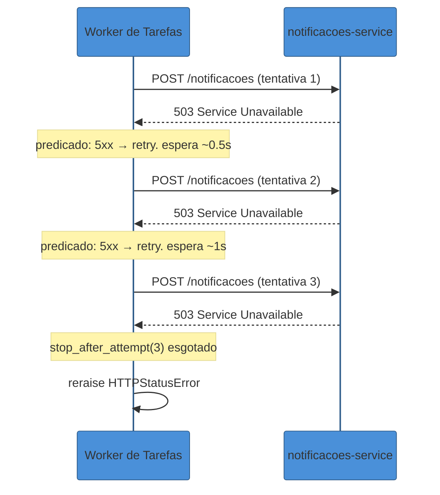
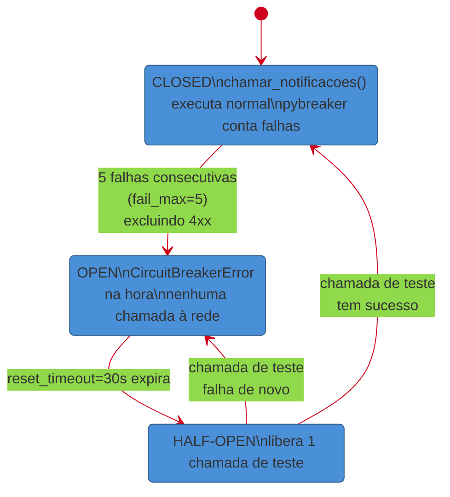
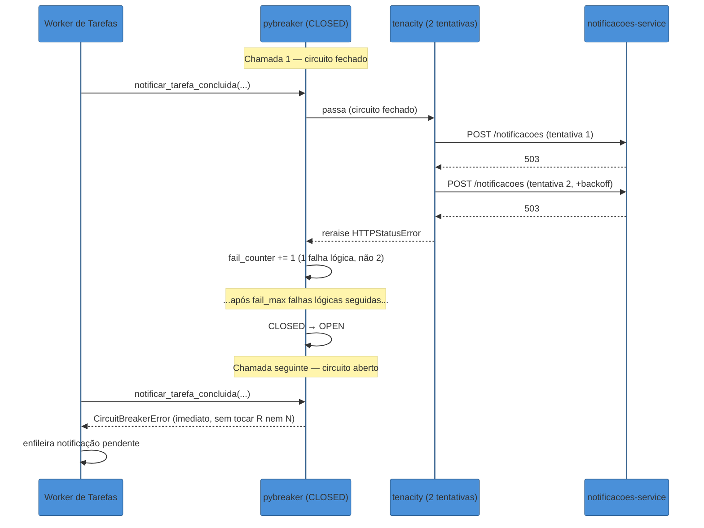

# Resiliência na prática — tenacity e circuit breaker

> [!abstract] TL;DR
> `payment-service` lento não é o único jeito de derrubar um sistema — um `notificacoes-service` fora do ar, combinado com um `tarefas-service` que retenta cada chamada sem parar, produz o mesmo efeito: carga infinita num serviço que já não aguenta mais nada. `tenacity` resolve o "vale a pena tentar de novo?" — `@retry(stop=stop_after_attempt(3), wait=wait_exponential(...))`, disparado só em exceções transitórias (timeout, erro 5xx), nunca em 4xx. `pybreaker` resolve o "esse serviço está doente o suficiente pra eu parar de tentar?" — os três estados fechado/aberto/half-open já cobertos em [[03-Dominios/Engenharia/Arquitetura/System Design/3 - Padrões recorrentes/05 - Circuit Breaker e resiliência|System Design]], aqui aplicados como decorator Python de verdade sobre uma chamada `httpx`. Os dois sozinhos resolvem metade do problema cada um: retry sem breaker martela um serviço morto até o timeout de cada tentativa; breaker sem retry desiste de falhas transitórias que sumiriam sozinhas. A composição correta é breaker por fora, retry por dentro, com um número de tentativas pequeno o bastante para não estourar o limiar do próprio breaker numa única chamada lógica.

## O incidente: o worker que multiplicou a própria carga

Terça-feira, 9h14. O time de Tarefas recebe um alerta de fila: `enviar_notificacao_tarefa_concluida` está com atraso de quarenta minutos e crescendo. A fila não parou de receber mensagens — ela parou de **esvaziar**.

A causa não está no worker de Tarefas. Está em `notificacoes-service`, um serviço HTTP separado (o mesmo que a [[08 - Capstone — extraindo o serviço de Notificações|nota 08 deste galho]] vai extrair) que recebeu um deploy ruim de manhã cedo e está devolvendo `503 Service Unavailable` para praticamente toda requisição. Ele não caiu — o processo está de pé, respondendo, só que com um erro em quase toda chamada.

O código que consome esse serviço, escrito meses atrás por alguém preocupado (com razão) com instabilidade de rede, tinha um retry simples:

```python
import httpx

def notificar_tarefa_concluida(tarefa_id: int, usuario_id: int) -> None:
    while True:
        try:
            resposta = httpx.post(
                "http://notificacoes-service/notificacoes",
                json={"tarefa_id": tarefa_id, "usuario_id": usuario_id},
                timeout=5.0,
            )
            resposta.raise_for_status()
            return
        except (httpx.TimeoutException, httpx.HTTPStatusError):
            continue  # tenta de novo. E de novo. E de novo.
```

O `while True` foi escrito pensando em "instabilidade momentânea de rede" — o tipo de falha que aparece uma vez e some sozinha. Mas `notificacoes-service` não está instável, está **sistematicamente quebrado**, e cada chamada que falha dispara imediatamente outra, sem esperar nada entre uma tentativa e a próxima. Cada tarefa concluída na fila de Tarefas agora corresponde a um loop de retentativas infinitas rodando em algum worker, cada uma abrindo uma nova conexão TCP e batendo de novo no mesmo serviço que acabou de recusar a anterior.

O efeito é duplo. Primeiro, cada worker que deveria estar processando a *próxima* mensagem da fila está preso, para sempre, tentando entregar a notificação atual — a fila para de esvaziar não porque o volume de trabalho aumentou, mas porque o trabalho que já estava em andamento nunca termina. Segundo, `notificacoes-service`, que já estava com problema, agora recebe uma enxurrada de retentativas de *todos* os workers presos nesse loop simultaneamente — exatamente o tipo de carga adicional que torna mais difícil ele voltar a funcionar, mesmo depois que o deploy ruim for revertido.

Alguém mata os workers travados manualmente, reverte o deploy de `notificacoes-service`, e a fila volta a esvaziar. Mas o `while True` continua no código, esperando o próximo incidente igual. A correção de verdade não é "trocar o `while True` por um número fixo de tentativas" — é reconhecer que esse código estava resolvendo o problema errado com a ferramenta certa faltando outra ao lado: retry sozinho nunca deveria continuar indefinidamente contra um serviço que já provou, repetidas vezes, que não vai responder.

> [!question]- Um `while True` com `time.sleep(1)` no meio já não resolveria isso?
> Melhoraria, mas não resolveria. Um `sleep(1)` fixo reduz a taxa de martelo (de "instantâneo" para "uma vez por segundo, para sempre"), mas ainda é **infinito** — o worker continua preso, a fila continua sem esvaziar, e `notificacoes-service` continua recebendo tráfego constante enquanto está fora do ar. Falta duas coisas que esse ajuste sozinho não dá: um número finito de tentativas com espera *crescente* (para não martelar todo mundo no mesmo ritmo simultâneo — é o backoff exponencial + jitter, já coberto em [[03-Dominios/Engenharia/Arquitetura/System Design/3 - Padrões recorrentes/05 - Circuit Breaker e resiliência|System Design]]) e, mais importante, um mecanismo que reconheça "esse serviço está doente *agora*, parem de tentar por um tempo" — que é exatamente o papel do circuit breaker, não do retry.

## Retry declarativo com tenacity

`tenacity` é a biblioteca de retry de referência do ecossistema Python — um decorator que expressa, declarativamente, quantas vezes tentar, quanto esperar entre tentativas e em quais exceções vale a pena insistir. Ela substitui o `while True`/`try`/`except`/`continue` manual por uma política nomeada, legível e testável isoladamente.

```python
import httpx
from tenacity import (
    retry,
    stop_after_attempt,
    wait_exponential,
    retry_if_exception,
)


def _deve_retentar(excecao: BaseException) -> bool:
    """Retry só em falha transitória: timeout, conexão recusada,
    ou erro 5xx (o servidor remoto admitiu que o problema é dele).
    Nunca em 4xx — um 400/404/422 não muda tentando de novo."""
    if isinstance(excecao, (httpx.TimeoutException, httpx.ConnectError)):
        return True
    if isinstance(excecao, httpx.HTTPStatusError):
        return excecao.response.status_code >= 500
    return False


@retry(
    stop=stop_after_attempt(3),
    wait=wait_exponential(multiplier=0.5, min=0.5, max=4),
    retry=retry_if_exception(_deve_retentar),
    reraise=True,
)
def notificar_tarefa_concluida(cliente: httpx.Client, tarefa_id: int, usuario_id: int) -> None:
    resposta = cliente.post(
        "/notificacoes",
        json={"tarefa_id": tarefa_id, "usuario_id": usuario_id},
    )
    resposta.raise_for_status()
```

A função `notificar_tarefa_concluida` reaproveita o `httpx.Client()` reutilizável já apresentado na [[02 - Comunicação síncrona entre serviços — httpx|nota 02 deste galho]] — o `cliente` chega como parâmetro, não é recriado a cada chamada, então o custo de conexão TCP+TLS discutido lá continua pago uma vez só, mesmo que o `@retry` acabe chamando essa função internamente várias vezes.

Cada peça do decorator resolve uma pergunta específica:

- **`stop=stop_after_attempt(3)`** — teto de três tentativas. `tenacity` também oferece `stop_after_delay(segundos)` (desiste depois de um orçamento de tempo total, independente de quantas tentativas isso levou) e a composição `stop_after_attempt(3) | stop_after_delay(10)` (desiste no que vier primeiro) — útil quando quem chamou essa função também tem um timeout próprio a respeitar, e a soma das tentativas não pode ultrapassá-lo.
- **`wait=wait_exponential(multiplier=0.5, min=0.5, max=4)`** — a mesma lógica de backoff exponencial já coberta em profundidade em System Design: a primeira espera é `0.5s`, a segunda `1s`, a terceira `2s`, com um teto de `4s` para não deixar o crescimento exponencial virar minutos de espera numa função que só tem três tentativas de qualquer forma. Desde a versão 8.2, `tenacity` também oferece `wait_exponential_jitter`, que já embute um componente aleatório na mesma chamada — equivalente a combinar `wait_exponential` com jitter manualmente, só que em uma linha.
- **`retry=retry_if_exception(_deve_retentar)`** — o predicado que decide, exceção por exceção, se vale tentar de novo. É aqui que mora a decisão mais importante desta seção: um `httpx.HTTPStatusError` com `status_code >= 500` é candidato a retry (o servidor admitiu, na resposta, que o problema é dele, e pode ser transitório); um `4xx` nunca é — retentar um `400 Bad Request` ou um `422 Unprocessable Entity` produz exatamente o mesmo erro na segunda vez, porque o problema está no payload que *você* enviou, não numa falha momentânea do lado de lá.
- **`reraise=True`** — quando as três tentativas se esgotam, `tenacity` levanta a **última exceção original** (`httpx.TimeoutException`, `httpx.HTTPStatusError`, o que tiver sido) em vez de embrulhá-la numa `RetryError` genérica própria da biblioteca. Isso importa porque o código que chama `notificar_tarefa_concluida` — e, adiante nesta nota, o circuit breaker que vai envolver essa chamada — precisa reconhecer o tipo real da exceção para decidir o que fazer a seguir.



> [!warning] Retry cego em erro não-idempotente
> **O que acontece:** o predicado de retry não distingue o tipo de operação — retenta um `POST /notificacoes` (que dispara um envio de verdade) do mesmo jeito que retentaria um `GET`. **Por quê:** se a primeira tentativa teve sucesso do lado do servidor mas a confirmação se perdeu na rede (o mesmo cenário de ambiguidade discutido em [[03-Dominios/Tecnologia/Python/Mensageria/03 - Celery em produção — retries, idempotência e Celery Beat|Celery em produção — retries, idempotência e Celery Beat]], Galho 14 deste trilha), a segunda tentativa duplica o efeito — nesse caso, duas notificações. `tenacity` não tem como saber se a operação é segura para repetir; essa responsabilidade é do lado que recebe (idempotency key, upsert), não do decorator de retry. **Como evitar:** antes de decorar uma chamada de escrita com `@retry`, confirmar que ela é idempotente — ou que o servidor de destino aceita uma idempotency key. Retry declarativo resolve *quando* tentar de novo; não resolve *se* é seguro fazê-lo. Essa é a mesma disciplina de at-least-once + idempotência já coberta em [[03-Dominios/Tecnologia/Python/Mensageria/03 - Celery em produção — retries, idempotência e Celery Beat|Celery em produção]] — não repetida aqui, só reafirmada no contexto de chamada HTTP síncrona em vez de task assíncrona.

`tenacity` também expõe hooks úteis em produção — `before_sleep=` para logar cada tentativa antes de esperar, `retry_error_callback=` para devolver um valor de fallback em vez de propagar a exceção final:

```python
import logging
from tenacity import retry, stop_after_attempt, wait_exponential, retry_if_exception, before_sleep_log

logger = logging.getLogger("tarefas.notificacoes")


@retry(
    stop=stop_after_attempt(3),
    wait=wait_exponential(multiplier=0.5, min=0.5, max=4),
    retry=retry_if_exception(_deve_retentar),
    before_sleep=before_sleep_log(logger, logging.WARNING),
    reraise=True,
)
def notificar_tarefa_concluida(cliente: httpx.Client, tarefa_id: int, usuario_id: int) -> None:
    resposta = cliente.post(
        "/notificacoes",
        json={"tarefa_id": tarefa_id, "usuario_id": usuario_id},
    )
    resposta.raise_for_status()
```

`before_sleep_log` grava uma linha de log a cada tentativa que falhou e vai esperar antes da próxima — sem esse hook, as duas primeiras tentativas falhando são invisíveis nos logs, e só a exceção final (se todas esgotarem) aparece, dificultando diagnosticar "esse serviço está com uma taxa de falha crescente" antes que o circuit breaker sequer abra. Esta nota não desenvolve `retry_error_callback` a fundo porque a decisão de "o que fazer quando as tentativas se esgotam" pertence, com mais precisão, à camada do circuit breaker — que é o próximo problema.

## O limite do retry sozinho

O diagrama de sequência acima já revela o problema: três tentativas contra um serviço genuinamente fora do ar ainda são três chamadas de rede, cada uma pagando o timeout configurado (ou o tempo de resposta do 503, o que vier primeiro) mais o tempo de espera entre elas. Multiplicado pelo volume de tarefas concluídas por minuto no incidente de abertura, isso continua sendo carga real chegando em `notificacoes-service` — só que agora com um teto de três tentativas por chamada em vez de infinitas, o que é estritamente melhor, mas ainda está longe de "parar de bater na porta".

`tenacity` não tem memória entre chamadas. Cada invocação de `notificar_tarefa_concluida` decide por si só se vale a pena tentar — ela não sabe que a chamada anterior, um segundo atrás, também falhou três vezes seguidas, nem que a chamada daqui a um segundo provavelmente vai falhar do mesmo jeito. É exatamente esse histórico agregado, através do tempo e através de chamadas diferentes, que falta — e é isso que um circuit breaker guarda.

## Circuit breaker aplicado — pybreaker

Os três estados do circuit breaker — fechado, aberto e meio-aberto — e a lógica de limiar sobre janela deslizante já estão descritos em profundidade em [[03-Dominios/Engenharia/Arquitetura/System Design/3 - Padrões recorrentes/05 - Circuit Breaker e resiliência#Os três estados|Circuit Breaker e resiliência]]; esta seção não repete essa explicação, só aplica o mesmo mecanismo como código Python real, decorando a mesma chamada `httpx` da seção anterior.

`pybreaker` é a implementação de referência do padrão em Python — um `CircuitBreaker` configurável que funciona tanto como decorator quanto como context manager, com os mesmos três estados descritos em System Design mapeados diretamente para constantes da biblioteca.

```python
import pybreaker

breaker_notificacoes = pybreaker.CircuitBreaker(
    fail_max=5,
    reset_timeout=30,
    exclude=[lambda exc: isinstance(exc, httpx.HTTPStatusError) and exc.response.status_code < 500],
)


@breaker_notificacoes
def chamar_notificacoes(cliente: httpx.Client, tarefa_id: int, usuario_id: int) -> None:
    resposta = cliente.post(
        "/notificacoes",
        json={"tarefa_id": tarefa_id, "usuario_id": usuario_id},
    )
    resposta.raise_for_status()
```

- **`fail_max=5`** — o limiar: depois de cinco falhas consecutivas, o disjuntor abre. É a mesma ideia de "janela deslizante recente" de System Design, só que `pybreaker`, na sua forma mais simples, conta falhas consecutivas em vez de uma taxa sobre uma janela de N chamadas — suficiente para a maioria dos casos de uso; quem precisa de janela por tempo (ex.: "50% de falha nos últimos 60 segundos") normalmente migra para `CircuitBreaker` com um `state_storage` customizado ou para uma biblioteca com suporte nativo a janela por tempo.
- **`reset_timeout=30`** — quanto tempo o disjuntor fica em `OPEN` antes de passar para `HALF-OPEN` e liberar uma chamada de teste. Equivalente direto ao `waitDuration` descrito em System Design.
- **`exclude=[...]`** — a mesma disciplina do predicado de retry, aplicada ao breaker: um `4xx` não deveria contar como "o serviço está doente", porque o problema não é de `notificacoes-service`, é do payload enviado. Sem esse `exclude`, um bug no cliente que manda `422` sistematicamente abriria o circuito por um motivo que fechar o circuito não resolve — o serviço remoto está perfeitamente saudável, quem está errado é quem chama.

Quando o disjuntor está `OPEN`, qualquer chamada a `chamar_notificacoes(...)` levanta `pybreaker.CircuitBreakerError` **imediatamente**, sem sequer tentar abrir uma conexão com `notificacoes-service` — o mesmo "falhar rápido" descrito em System Design, agora como uma exceção Python concreta que o código chamador precisa capturar.

```python
try:
    chamar_notificacoes(cliente, tarefa_id, usuario_id)
except pybreaker.CircuitBreakerError:
    # circuito aberto — nem tentou a rede. Aplica o fallback:
    # enfileira pra reprocessamento quando o circuito fechar de novo.
    enfileirar_notificacao_pendente(tarefa_id, usuario_id)
```

`pybreaker` também expõe os estados diretamente, úteis para health checks e dashboards internos:

```python
breaker_notificacoes.current_state  # "closed" | "open" | "half-open"
breaker_notificacoes.fail_counter   # falhas consecutivas na janela atual
```

> [!tip] `circuitbreaker` como alternativa mais leve
> O pacote [`circuitbreaker`](https://github.com/fabfuel/circuitbreaker) (de Fabian Fuelling) cobre o mesmo caso de uso com uma API ainda mais enxuta — um único decorator `@circuit(failure_threshold=5, recovery_timeout=30, expected_exception=httpx.HTTPStatusError)`, sem objeto `CircuitBreaker` explícito para instanciar à parte. É uma escolha razoável quando o projeto quer só o comportamento básico dos três estados, sem os hooks de listener e sem o controle mais fino de `exclude`/`state_storage` que `pybreaker` oferece. Esta nota usa `pybreaker` como principal por ele expor os estados explicitamente (útil para health checks) e por ser a biblioteca mais citada em produção Python — mas a decisão entre os dois raramente é crítica; o padrão que importa é o mesmo nos dois.



Aplicado ao incidente de abertura: com o breaker no lugar, `notificacoes-service` volta a receber cinco tentativas de cada worker (não infinitas), e depois disso o circuito abre — todos os workers seguintes recebem `CircuitBreakerError` em microssegundos, enfileiram a notificação pendente e voltam a processar a *próxima* mensagem da fila imediatamente, em vez de ficar presos esperando uma resposta que não vem. `notificacoes-service` para de receber tráfego de Tarefas por 30 segundos — exatamente o tempo que o time responsável precisa para reverter o deploy ruim sem competir com uma enxurrada de retentativas alheias.

## Compondo os dois: por que a ordem importa

Retry e circuit breaker resolvem perguntas diferentes, e nenhum dos dois sozinho é suficiente:

- **Retry sem circuit breaker** continua martelando um serviço que já provou, repetidas vezes, que está fora do ar — é exatamente o `while True` do incidente de abertura, só que com um teto de tentativas em vez de infinito. Ainda desperdiça tempo e carrega o serviço doente sem necessidade, porque cada chamada nova começa do zero, sem lembrança das falhas anteriores.
- **Circuit breaker sem retry** desperdiça falhas genuinamente transitórias. Se `notificacoes-service` teve um único glitch de rede — um pacote perdido, uma reconexão de 200ms — e a chamada falhou uma única vez, um breaker sem retry por baixo já contaria isso como uma falha na direção do limiar, sem dar a chance óbvia de "tenta mais uma vez rapidinho" que resolveria o problema sem incidente nenhum.

A composição correta, e a mesma ordem descrita em System Design para a pilha completa de resiliência, é **circuit breaker por fora, retry por dentro**:

```python
import httpx
import pybreaker
from tenacity import retry, stop_after_attempt, wait_exponential, retry_if_exception


def _deve_retentar(excecao: BaseException) -> bool:
    if isinstance(excecao, (httpx.TimeoutException, httpx.ConnectError)):
        return True
    if isinstance(excecao, httpx.HTTPStatusError):
        return excecao.response.status_code >= 500
    return False


breaker_notificacoes = pybreaker.CircuitBreaker(
    fail_max=5,
    reset_timeout=30,
    exclude=[lambda exc: isinstance(exc, httpx.HTTPStatusError) and exc.response.status_code < 500],
)


@breaker_notificacoes
@retry(
    stop=stop_after_attempt(2),  # curto de propósito — ver explicação abaixo
    wait=wait_exponential(multiplier=0.3, min=0.3, max=2),
    retry=retry_if_exception(_deve_retentar),
    reraise=True,
)
def notificar_tarefa_concluida(cliente: httpx.Client, tarefa_id: int, usuario_id: int) -> None:
    resposta = cliente.post(
        "/notificacoes",
        json={"tarefa_id": tarefa_id, "usuario_id": usuario_id},
    )
    resposta.raise_for_status()
```

A leitura dos decorators é de baixo para cima: `@retry` decora a função original primeiro (mais interno), `@breaker_notificacoes` decora o resultado disso por cima (mais externo). Na prática, isso significa:

1. Quando o circuito está **fechado**, uma chamada a `notificar_tarefa_concluida(...)` entra no `pybreaker`, que deixa passar e invoca a função decorada por `@retry` — que pode tentar até duas vezes internamente, com backoff, antes de desistir.
2. Se as duas tentativas internas falharem, `@retry` levanta a exceção original (`reraise=True`) — e é **essa única falha lógica**, não duas, que o `pybreaker` registra no seu contador. É por isso que o `stop_after_attempt` interno precisa ser **pequeno** (2, não 5 ou 10): se o retry interno já tentasse cinco vezes por chamada, cada "falha" reportada ao breaker já teria custado cinco idas à rede — o breaker levaria cinco vezes mais tempo de rede real para abrir do que o `fail_max=5` sugere, e o próprio retry interno já teria martelado o serviço doente mais do que o necessário antes do breaker sequer perceber o padrão.
3. Quando o circuito está **aberto**, `pybreaker` nem chega a invocar a função decorada por `@retry` — ele levanta `CircuitBreakerError` na hora, e o retry interno nunca roda. É essa a vantagem concreta de "breaker por fora": um circuito aberto barra até a primeira tentativa, sem gastar nenhum orçamento de retry num serviço que o próprio breaker já sabe que está fora do ar.



> [!question]- E se eu simplesmente aumentar `fail_max` pra compensar o retry interno, em vez de diminuir o `stop_after_attempt`?
> Funciona matematicamente (`fail_max=25` com `stop_after_attempt(5)` chega num número parecido de idas à rede antes de abrir), mas piora a legibilidade e o acoplamento entre as duas configurações — toda vez que alguém mexer no número de tentativas do retry, precisaria lembrar de recalcular o `fail_max` do breaker também, e as duas bibliotecas não sabem uma da existência da outra para alertar sobre essa dependência oculta. É mais simples e mais robusto manter o retry interno **deliberadamente curto** (2-3 tentativas, o suficiente só para absorver um glitch pontual) e deixar o `fail_max` do breaker expressar, sozinho, "quantas falhas lógicas sustentadas eu tolero antes de considerar o serviço doente" — sem fazer contas cruzadas entre as duas camadas toda vez que uma delas mudar.

> [!warning] Circuit breaker por dentro do retry (ordem invertida)
> **O que acontece:** alguém inverte a ordem dos decorators — `@retry` por fora, `@breaker_notificacoes` por dentro — na esperança de "tentar de novo mesmo se o circuito abrir". **Por quê:** com essa ordem, cada tentativa do retry externo invoca o breaker de novo, e se o circuito já está aberto, cada uma dessas tentativas levanta `CircuitBreakerError` imediatamente — que, a menos que o predicado de retry trate especificamente essa exceção como "não vale retentar", o retry externo tentaria de novo mesmo assim, gastando o orçamento inteiro de tentativas martelando um breaker que já está gritando "pare". Na melhor hipótese isso é inofensivo mas inútil (retry rápido contra `CircuitBreakerError`, sem tocar a rede); na pior, se o predicado de retry for genérico demais, é retry ativo contra o próprio mecanismo que existe para impedir exatamente isso. **Como evitar:** manter a ordem canônica — circuit breaker por fora (decide *se* vale tentar), retry por dentro (decide *quantas vezes*, dado que o breaker já autorizou) — e limitar o retry interno a poucas tentativas, para que cada chamada lógica conte como uma única falha para o breaker.

## Observando o breaker em produção

Um circuit breaker que ninguém observa é um circuit breaker que abre em produção sem que o time saiba — a fila de notificações pendentes começa a crescer silenciosamente, e a primeira pista costuma ser um usuário reclamando de notificação atrasada, não um alerta. `pybreaker` expõe um mecanismo de listener justamente para fechar essa lacuna:

```python
import pybreaker


class BreakerLogListener(pybreaker.CircuitBreakerListener):
    def state_change(self, cb, old_state, new_state):
        logger.warning(
            "circuit breaker %s: %s -> %s",
            cb.name, old_state.name, new_state.name,
        )

    def failure(self, cb, exc):
        logger.info("circuit breaker %s registrou falha: %r", cb.name, exc)


breaker_notificacoes = pybreaker.CircuitBreaker(
    fail_max=5,
    reset_timeout=30,
    exclude=[lambda exc: isinstance(exc, httpx.HTTPStatusError) and exc.response.status_code < 500],
    listeners=[BreakerLogListener()],
    name="notificacoes-service",
)
```

`state_change` dispara exatamente nas transições que interessam para um dashboard ou alerta — `CLOSED → OPEN` é o sinal de "pare tudo, `notificacoes-service` está doente"; `HALF-OPEN → CLOSED` é "recuperou"; `HALF-OPEN → OPEN` é "tentou recuperar e ainda não conseguiu", útil para distinguir uma falha pontual de uma degradação prolongada. Em produção, esse `state_change` normalmente alimenta o mesmo pipeline de métricas (Prometheus/Grafana) usado para o resto do sistema, transformando "o circuito abriu" de um detalhe interno de biblioteca em um evento operacional visível — o mesmo papel que o Flower cumpre para retries do Celery na [[03-Dominios/Tecnologia/Python/Mensageria/03 - Celery em produção — retries, idempotência e Celery Beat|nota equivalente de Mensageria]], só que aqui para chamadas HTTP síncronas em vez de tasks assíncronas.

> [!tip] O breaker é por processo, não compartilhado entre workers
> Um detalhe operacional fácil de esquecer: uma instância de `CircuitBreaker` guarda seu estado em memória do processo Python onde foi criada. Se o serviço de Tarefas roda com dez workers em paralelo (dez processos, não dez threads do mesmo processo), cada um tem seu **próprio** breaker, com seu próprio contador de falhas — um worker pode estar com o circuito aberto enquanto outro, que ainda não acumulou cinco falhas, continua tentando normalmente. Isso não é necessariamente errado (cada worker aprende sozinho, mais rápido que esperar uma coordenação central), mas é uma faca de dois gumes: com muitos workers, o número efetivo de chamadas que ainda alcançam `notificacoes-service` antes de todos os breakers abrirem é `fail_max × número_de_workers`, não `fail_max`. Times que precisam de um limiar coordenado entre processos usam o `state_storage` de `pybreaker` com um backend compartilhado (Redis), em vez do armazenamento em memória padrão — mas isso já é uma decisão de infraestrutura que vale a pena só quando o número de workers é grande o suficiente para o limiar por processo parar de fazer sentido.

## Casos práticos

### Cenário 1: `fail_max` calibrado baixo demais derruba disponibilidade sem necessidade

Um time configura `fail_max=2` em produção, pensando em "abrir rápido, proteger o serviço remoto o quanto antes". Numa manhã comum, duas requisições seguidas para `notificacoes-service` esbarram num timeout de rede genuinamente aleatório (não relacionado a nenhum problema real no serviço remoto — só ruído de rede, o tipo de coisa que acontece algumas vezes por dia em qualquer ambiente distribuído). O circuito abre. Pelos próximos trinta segundos (`reset_timeout`), toda notificação da fila de Tarefas vai para o fallback de "pendente", mesmo que `notificacoes-service` estivesse, na prática, saudável o tempo todo. O limiar baixo demais transformou dois eventos de ruído — que o retry interno já deveria ter absorvido sozinho — num período de degradação desnecessária. A correção não foi "desistir do circuit breaker": foi recalibrar `fail_max` para um número que só é atingido por uma falha *sustentada* (5, no exemplo desta nota), deixando o retry interno (2 tentativas com backoff curto) absorver o ruído pontual antes de qualquer falha chegar a ser contada pelo breaker.

### Cenário 2: fallback que mascara a notificação perdida

Depois do incidente de abertura desta nota, o time implementa `enfileirar_notificacao_pendente(...)` como fallback para quando o circuito está aberto — mas a implementação inicial só grava um registro numa tabela `NotificacaoPendente`, sem nenhum processo que efetivamente reprocesse essa fila mais tarde. Três semanas depois, alguém percebe que a tabela tem duas mil linhas acumuladas: notificações que "não falharam" (o worker não travou, a fila de Tarefas continuou fluindo normalmente, exatamente como o circuit breaker deveria garantir) mas também nunca chegaram ao usuário, porque o fallback resolveu o sintoma imediato (não travar o worker) sem fechar o ciclo (reenviar quando o circuito fechar de novo). A lição, que ecoa o aviso sobre fallback perigoso já discutido em System Design: um fallback que só evita a falha visível, sem um caminho de recuperação posterior, troca "sistema travado, alerta óbvio" por "sistema degradado silenciosamente" — às vezes um trade-off aceitável, mas só se for uma decisão deliberada, com um job de reprocessamento da tabela `NotificacaoPendente` rodando de verdade, não um esquecimento.

## Resumo em uma frase

Retry decide *se vale a pena tentar de novo agora*; circuit breaker decide *se vale a pena tentar de novo neste serviço, ponto*; a composição correta é o breaker por fora vetando a chamada inteira quando o serviço já provou que está doente, e o retry por dentro, com poucas tentativas, absorvendo só o ruído pontual que sobra depois desse veto.

## Como explicar em inglês

> "Retry and circuit breaker answer different questions, and neither alone is enough. `tenacity` handles *whether it's worth trying again right now* — a declarative `@retry` with exponential backoff, restricted to transient failures like timeouts and 5xx responses, never blind-retrying a 4xx or a non-idempotent write. `pybreaker` handles *whether this service is sick enough that trying again at all is pointless* — the same closed/open/half-open state machine from the resilience pattern, applied as a real decorator around an `httpx` call. Composing them correctly means the circuit breaker wraps the outside, so an open circuit vetoes the whole call before any retry budget gets spent, and the retry sits inside with a short attempt count, so a single logical failure — even if it took two internal retries — only counts once against the breaker's threshold. Get the order backwards, or let the inner retry run too many attempts, and you either hammer a service you already know is down, or blow past the breaker's threshold on a single call."

| PT | EN |
|----|----|
| Retentativa declarativa | Declarative retry |
| Espera com backoff exponencial | Exponential backoff wait |
| Falha transitória | Transient failure |
| Disjuntor / Circuit breaker | Circuit breaker |
| Fechado / Aberto / Meio-aberto | Closed / Open / Half-open |
| Falha lógica (após esgotar retries) | Logical failure |
| Falhar rápido | Fail fast |
| Predicado de retry | Retry predicate |
| Limiar de falhas | Failure threshold |

## O que vem a seguir

Retry e circuit breaker cobrem a resiliência de uma chamada isolada entre dois serviços. A próxima nota deste galho assume essa base pronta e resolve um problema adjacente: como autenticar essa chamada quando ela passa por um API Gateway, e como reagir de forma coordenada quando o próprio gateway pede para o cliente desacelerar.

- [[04 - Cliente de API Gateway — autenticação serviço-a-serviço|04 — Cliente de API Gateway: autenticação serviço-a-serviço]] — awareness de rate limit via headers `Retry-After`/`X-RateLimit-*`, conectando diretamente com o `tenacity` desta nota.

## Veja também

- [[02 - Comunicação síncrona entre serviços — httpx|02 — Comunicação síncrona entre serviços: httpx]] — o `httpx.Client()` reutilizável decorado nesta nota.
- [[01 - Panorama — de monolito modular a microservices em Python|01 — Panorama: de monolito modular a microservices em Python]] — mapa do galho.
- [[03-Dominios/Engenharia/Arquitetura/System Design/3 - Padrões recorrentes/05 - Circuit Breaker e resiliência|Circuit Breaker e resiliência]] — os três estados, a falha em cascata, timeout e bulkhead, agnósticos de linguagem.
- [[03-Dominios/Tecnologia/Python/Mensageria/03 - Celery em produção — retries, idempotência e Celery Beat|Celery em produção — retries, idempotência e Celery Beat]] — Galho 14, idempotência aplicada em Python (evento_id, upsert), referenciada no aviso sobre retry cego.
- [[08 - Capstone — extraindo o serviço de Notificações|08 — Capstone: extraindo o serviço de Notificações]] — onde `notificacoes-service` desta nota é de fato extraído e consumido em produção.
- [[03-Dominios/Tecnologia/Java/Microservices e sistemas distribuídos/13 - Resiliência I — a falha distribuída e o Circuit Breaker|Resiliência I — Circuit Breaker em Java]] — o mesmo padrão, com Resilience4j, na trilha irmã.

## Fontes

- **tenacity** — [*Tenacity documentation*](https://tenacity.readthedocs.io/) (acessado 2026-07-12) — `@retry`, `stop_after_attempt`, `stop_after_delay`, `wait_exponential`, `wait_exponential_jitter`, `retry_if_exception`, `reraise`.
- **pybreaker** — [*danielfm/pybreaker*](https://github.com/danielfm/pybreaker) (acessado 2026-07-12) — `CircuitBreaker`, `fail_max`, `reset_timeout`, `exclude`, `CircuitBreakerError`, estados `current_state`/`fail_counter`.
- **circuitbreaker** — [*fabfuel/circuitbreaker*](https://github.com/fabfuel/circuitbreaker) (acessado 2026-07-12) — alternativa mais leve, decorator `@circuit`, mencionada como opção secundária.
- [[03-Dominios/Engenharia/Arquitetura/System Design/3 - Padrões recorrentes/05 - Circuit Breaker e resiliência|Circuit Breaker e resiliência]] — os três estados, o conceito de falha em cascata e a ordem canônica de composição da pilha completa de resiliência, reaproveitados por referência nesta nota.
- [[03-Dominios/Tecnologia/Python/Mensageria/03 - Celery em produção — retries, idempotência e Celery Beat|Celery em produção — retries, idempotência e Celery Beat]] — idempotência aplicada em Python, reaproveitada por referência no aviso sobre retry em operações não-idempotentes.
