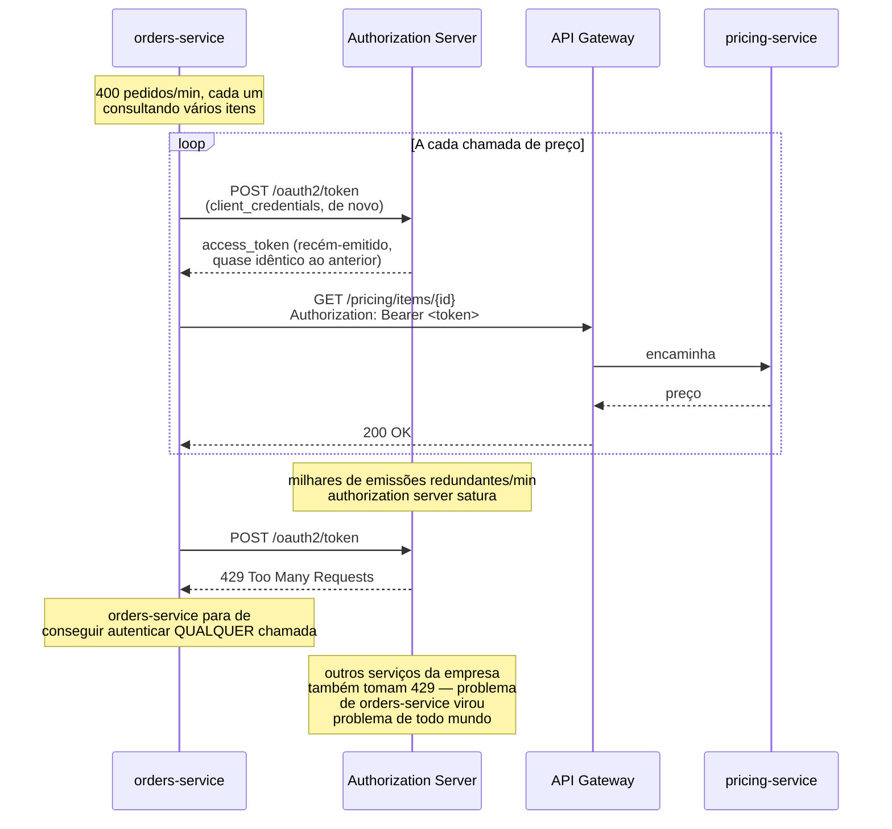
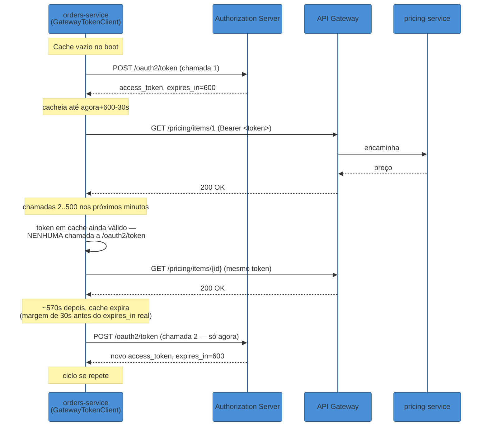
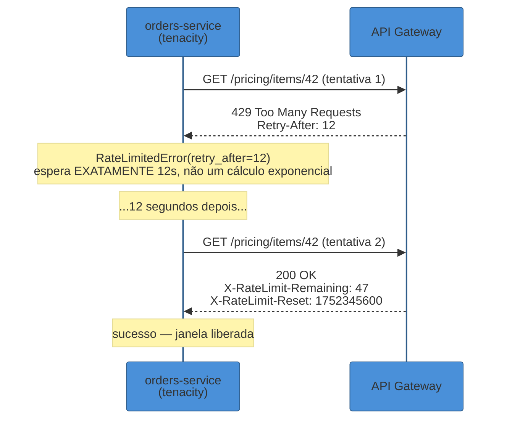

# Cliente de API Gateway — autenticação serviço-a-serviço

> [!abstract] TL;DR
> `orders-service` chama `pricing-service` através do API Gateway centenas de vezes por minuto. Sem cache de token, cada chamada abre com uma ida extra ao authorization server para pedir um `access_token` novo — e quando o volume sobe, `orders-service` não sobrecarrega só `pricing-service`: sobrecarrega o próprio authorization server, um componente que todos os outros serviços também dependem para se autenticar. Esta nota assume o **conceito** de API Gateway já coberto em [[03-Dominios/Engenharia/Arquitetura/System Design/3 - Padrões recorrentes/06 - API Gateway e BFF|System Design]] e o **fluxo** OAuth2 Client Credentials Grant já coberto em [[03-Dominios/Engenharia/Auth e Identidade/2 - OAuth 2.1 e OpenID Connect/04 - Grants de máquina e fluxos especiais|Auth e Identidade]], e escreve o **código** que falta entre os dois: um cliente Python que obtém o token via `httpx` (a mesma biblioteca da [[02 - Comunicação síncrona entre serviços — httpx|nota 02 deste galho]]), guarda esse token em memória com uma margem de segurança antes do `expires_in` real, e só volta a pedir um token novo quando o cache expira de fato — nunca a cada chamada. Cobre também a alternativa mais simples e menos segura (API key estática num header `X-API-Key`, aceitável só em ambientes internos de baixo risco) e a **awareness de rate limit**: ler `Retry-After`/`X-RateLimit-Remaining`/`X-RateLimit-Reset` da resposta do gateway e alimentar esses valores de volta no `tenacity` da [[03 - Resiliência na prática — tenacity e circuit breaker|nota 03 deste galho]], trocando um backoff cego por um backoff que sabe exatamente quanto tempo esperar porque o próprio servidor disse.

## O incidente: um token novo a cada chamada, e o authorization server que engasgou

Segunda-feira, início de manhã, pico de tráfego do sistema de pedidos entrando em produção. `orders-service` precisa consultar `pricing-service` — que fica atrás do API Gateway da empresa, não é acessível diretamente — para confirmar o preço final de cada item antes de fechar um pedido. O código que faz essa chamada, escrito rápido por alguém que só queria "fazer funcionar" antes de um deadline, resolve autenticação da forma mais direta possível: pede um token novo, usa, descarta.

```python
import httpx

GATEWAY_URL = "https://api-gateway.interno.exemplo.com"
TOKEN_URL = "https://auth.interno.exemplo.com/oauth2/token"

CLIENT_ID = "orders-service"
CLIENT_SECRET = "s3gr3d0-do-orders-service"  # em produção, vem de um secret manager


def buscar_preco(item_id: int) -> dict:
    # Pede um token NOVO a cada chamada — o bug desta seção
    resposta_token = httpx.post(
        TOKEN_URL,
        data={
            "grant_type": "client_credentials",
            "client_id": CLIENT_ID,
            "client_secret": CLIENT_SECRET,
            "scope": "pricing.read",
        },
    )
    resposta_token.raise_for_status()
    access_token = resposta_token.json()["access_token"]

    resposta = httpx.get(
        f"{GATEWAY_URL}/pricing/items/{item_id}",
        headers={"Authorization": f"Bearer {access_token}"},
    )
    resposta.raise_for_status()
    return resposta.json()
```

Funciona nos testes manuais — uma chamada, um token, uma resposta. Funciona em staging, com um volume baixo de tráfego sintético. Em produção, sob o pico de segunda-feira, `orders-service` processa em torno de 400 pedidos por minuto, e cada pedido consulta o preço de vários itens — o que significa **milhares de chamadas ao endpoint `/oauth2/token`** por minuto, uma para cada chamada real a `pricing-service`, a maioria delas pedindo essencialmente o mesmo token que a chamada anterior, um segundo antes, já tinha recebido.

O authorization server não foi dimensionado para esse padrão. Ele não é um endpoint qualquer — ele é o componente do qual **todos os outros serviços da empresa dependem** para se autenticar entre si, incluindo serviços completamente alheios a `orders-service` e `pricing-service`. Sob a carga de milhares de emissões de token redundantes por minuto, o authorization server começa a responder mais devagar, depois começa a devolver `429 Too Many Requests` para `orders-service` — e, por consequência, também para outros clients que estavam tentando emitir token no mesmo intervalo, sem ter feito nada de errado.



A ironia do incidente está no próprio título desta seção: `orders-service`, tentando chamar `pricing-service`, acaba sendo rate-limitado **no próprio authorization server**, um componente que ele nem estava tentando usar de forma abusiva — só estava esquecendo de guardar o resultado de uma chamada que não muda a cada request.

> [!bug] O que está quebrado, em uma frase
> Pedir um `access_token` novo a cada chamada trata o token como se fosse descartável por natureza — mas um `access_token` de client credentials normalmente vive minutos (`expires_in` típico entre 5 e 60 minutos, a depender do authorization server), e chamar o endpoint de token a cada requisição real transforma um recurso reutilizável em uma dependência síncrona extra em **toda** chamada, multiplicando a carga sobre um componente compartilhado por todo o sistema.

O resto desta nota resolve esse incidente e o que vem depois dele: como cachear o token corretamente, respeitando o `expires_in` com margem de segurança; quando um `X-API-Key` estático é uma alternativa aceitável em vez de OAuth2; e como reagir de forma inteligente quando o próprio gateway — não o authorization server — começa a aplicar rate limit sobre as chamadas de negócio.

## Client credentials em código: token cacheado, renovado automaticamente

O fluxo em si — por que client credentials é o grant certo para M2M, as três formas de autenticar o client (`client_secret`, `private_key_jwt`, mTLS), a ausência de refresh token — já está coberto em [[03-Dominios/Engenharia/Auth e Identidade/2 - OAuth 2.1 e OpenID Connect/04 - Grants de máquina e fluxos especiais#Client credentials — o client é seu próprio resource owner|Grants de máquina e fluxos especiais]]; esta seção não repete esse conteúdo, só implementa a parte que falta: um cliente Python que **lembra** do token entre chamadas.

A correção do incidente não é "chamar `/oauth2/token` mais devagar" — é reconhecer que o token, uma vez emitido, continua válido por um tempo conhecido (`expires_in`, presente na resposta do authorization server), e que pedir um token novo antes desse prazo expirar é trabalho redundante. A estrutura certa é um objeto que guarda o token atual e sua data de expiração, e só faz a chamada de rede quando o token em cache está ausente ou vencido:

```python
import time
import threading

import httpx


class GatewayTokenClient:
    """Obtém e cacheia um access_token de client credentials,
    renovando automaticamente quando ele está perto de expirar."""

    def __init__(
        self,
        token_url: str,
        client_id: str,
        client_secret: str,
        scope: str,
        http_client: httpx.Client,
        margem_segundos: float = 30.0,
    ) -> None:
        self._token_url = token_url
        self._client_id = client_id
        self._client_secret = client_secret
        self._scope = scope
        self._http = http_client
        self._margem = margem_segundos

        self._token: str | None = None
        self._expira_em: float = 0.0  # timestamp Unix
        self._lock = threading.Lock()

    def obter_token(self) -> str:
        # Fast path: token em cache e ainda válido — sem ida à rede
        if self._token is not None and time.monotonic() < self._expira_em:
            return self._token

        # Token ausente ou vencido: renova, com lock pra evitar
        # que N threads concorrentes disparem N renovações ao mesmo tempo
        with self._lock:
            # Re-checa depois de adquirir o lock — outra thread
            # pode ter renovado enquanto esta esperava
            if self._token is not None and time.monotonic() < self._expira_em:
                return self._token

            resposta = self._http.post(
                self._token_url,
                data={
                    "grant_type": "client_credentials",
                    "client_id": self._client_id,
                    "client_secret": self._client_secret,
                    "scope": self._scope,
                },
            )
            resposta.raise_for_status()
            corpo = resposta.json()

            self._token = corpo["access_token"]
            expires_in = corpo.get("expires_in", 300)  # segundos; default conservador
            # Renova ANTES do vencimento real, com margem de segurança
            self._expira_em = time.monotonic() + expires_in - self._margem

            return self._token
```

Cada peça resolve um risco específico do incidente de abertura:

- **`time.monotonic()`, não `time.time()`**, para medir expiração. `time.monotonic()` nunca anda para trás — imune a ajustes de relógio do sistema (NTP corrigindo o horário, mudança de fuso) que poderiam fazer um cache parecer válido por mais tempo do que realmente é, ou invalidar um token cedo demais por engano.
- **`margem_segundos=30.0`** subtraída do `expira_em`: o cache expira **antes** do token real expirar, não exatamente no segundo do vencimento. Sem essa margem, existe uma janela minúscula, mas real, onde o cache ainda considera o token válido, a chamada HTTP começa a ser montada, e no meio do caminho o token vence de fato — o resource server (aqui, o gateway) recusaria essa chamada com `401`, e o código chamador precisaria de uma lógica de retry só para esse caso específico. Expirar o cache um pouco antes do vencimento real elimina essa corrida.
- **`threading.Lock()` com double-checked locking**: se `orders-service` roda com múltiplas threads (ou o equivalente em processos concorrentes, dependendo do modelo de deploy), sem o lock, N threads que descobrem simultaneamente que o token expirou disparariam N chamadas de renovação ao mesmo tempo — exatamente o mesmo problema do incidente de abertura, só que restrito à borda de expiração em vez de acontecer a cada chamada. O lock garante que só uma thread de fato renova; as demais, ao readquirir o lock, encontram o token já renovado pela primeira e reaproveitam.
- **`expires_in` com `.get(..., 300)`**: o padrão OAuth2 (RFC 6749 §5.1) recomenda que o authorization server inclua `expires_in` na resposta, mas não é estritamente obrigatório em toda implementação — um default conservador evita que a ausência do campo resulte num cache que nunca expira.



Com o cache no lugar, `orders-service` chama `/oauth2/token` uma vez a cada ciclo de expiração (a cada ~9,5 minutos, no exemplo acima), não uma vez por chamada de negócio — o mesmo volume de tráfego que antes gerava milhares de emissões de token por minuto agora gera uma dúzia, independentemente de quantos preços forem consultados nesse intervalo.

### Integrando o token cacheado numa chamada real ao gateway

O `GatewayTokenClient` isolado só resolve metade do problema — a outra metade é usar o token obtido para de fato chamar o gateway, reaproveitando o `httpx.Client()` singleton já estabelecido na [[02 - Comunicação síncrona entre serviços — httpx|nota 02 deste galho]]:

```python
import httpx

http_client = httpx.Client(base_url="https://api-gateway.interno.exemplo.com", timeout=5.0)

token_client = GatewayTokenClient(
    token_url="https://auth.interno.exemplo.com/oauth2/token",
    client_id="orders-service",
    client_secret="s3gr3d0-do-orders-service",  # via secret manager, não hardcoded
    scope="pricing.read",
    http_client=httpx.Client(timeout=5.0),  # cliente separado, só pro token endpoint
)


def buscar_preco(item_id: int) -> dict:
    token = token_client.obter_token()
    resposta = http_client.get(
        f"/pricing/items/{item_id}",
        headers={"Authorization": f"Bearer {token}"},
    )
    resposta.raise_for_status()
    return resposta.json()
```

Repare que `token_client` usa um `httpx.Client()` **separado** do `http_client` que chama o gateway — não porque compartilhar seja proibido, mas porque as duas chamadas têm perfis de rede diferentes (o endpoint de token é chamado raramente, o gateway é chamado o tempo todo), e manter os pools de conexão separados evita que uma degradação num afete o timeout configurado do outro. Em um serviço maior, os dois normalmente vivem no mesmo `lifespan` da aplicação FastAPI, como singletons de `app.state`, seguindo exatamente o padrão que a nota 02 já estabeleceu.

> [!question]- Por que não usar um `refresh_token` para renovar em vez de pedir client credentials de novo?
> Porque client credentials, por design, não emite `refresh_token` — o ponto já foi coberto em [[03-Dominios/Engenharia/Auth e Identidade/2 - OAuth 2.1 e OpenID Connect/04 - Grants de máquina e fluxos especiais|Grants de máquina e fluxos especiais]]: se o client já tem a credencial (`client_secret`, chave privada, certificado) para se autenticar de novo a qualquer momento, guardar um segundo segredo (`refresh_token`) só para renovar o primeiro não adiciona segurança nenhuma — só complexidade. O `GatewayTokenClient` desta nota não precisa de lógica de refresh token porque o próprio padrão "pedir um token novo quando o cache expira" já é, estruturalmente, a forma como client credentials se renova.

## `X-API-Key`: a alternativa mais simples, e quando ela é aceitável

Nem todo cliente serviço-a-serviço precisa da máquina de estados de OAuth2. Muitos gateways internos — especialmente em ambientes de baixo risco, onde todos os serviços rodam na mesma VPC privada, atrás do mesmo perímetro de rede, sem exposição à internet pública — aceitam uma alternativa muito mais simples: uma chave estática, gerada uma vez, enviada em todo request via um header customizado.

```python
import httpx

API_KEY = "sk_interno_a1b2c3d4e5f6"  # via secret manager

http_client = httpx.Client(
    base_url="https://api-gateway.interno.exemplo.com",
    headers={"X-API-Key": API_KEY},
    timeout=5.0,
)


def buscar_preco(item_id: int) -> dict:
    resposta = http_client.get(f"/pricing/items/{item_id}")
    resposta.raise_for_status()
    return resposta.json()
```

Não há emissão de token, não há cache, não há renovação — o header é fixo, configurado uma vez na construção do `Client`, presente em toda chamada automaticamente porque foi passado como `headers=` do próprio cliente reutilizável. É, estruturalmente, o caminho mais curto entre "preciso me autenticar" e "código funcionando".

O preço dessa simplicidade é a segurança que o client credentials grant oferece e o `X-API-Key` não:

| Propriedade | OAuth2 Client Credentials | `X-API-Key` estático |
|---|---|---|
| Token de vida curta | Sim (minutos) — janela de exposição pequena se vazar | Não — a chave normalmente vive indefinidamente até rotação manual |
| Revogação granular | Sim, via revogar o client no authorization server | Depende — geralmente exige trocar a chave em todo lugar que a usa |
| Distinção entre clients | Cada client tem seu próprio `client_id`/segredo, auditável individualmente | Se a mesma chave é compartilhada entre serviços, perde-se rastreabilidade de quem fez o quê |
| Escopo granular por chamada | Sim, via `scope` pedido no token | Não — a chave normalmente dá acesso a tudo que o endpoint permite, sem distinção |
| Complexidade de implementação | Cache, renovação, tratamento de expiração | Nenhuma — um header fixo |
| Onde costuma vazar | Menos crítico (token expira sozinho) | Log, código-fonte, variável de ambiente — e o vazamento não expira |

> [!tip] Quando `X-API-Key` é uma escolha razoável, não um atalho perigoso
> Ambientes internos de baixo risco — rede privada isolada, sem exposição à internet, poucos serviços, cada um confiável por construção (mesma equipe, mesmo pipeline de deploy, sem multi-tenancy entre clientes externos) — são o cenário onde o custo extra de OAuth2 (authorization server, cache de token, rotação de credencial) não compra proteção proporcional ao risco real. Um script interno de sincronização batch, chamando uma API de relatórios que só outros serviços do mesmo time acessam, é candidato razoável a `X-API-Key`. A linha se cruza quando qualquer uma dessas condições muda: o gateway passa a expor o endpoint para parceiros externos, múltiplos times/serviços com necessidades de acesso diferentes passam a compartilhar a mesma chave, ou a superfície de risco de um vazamento (dados sensíveis, capacidade de escrita) cresce o suficiente para que "a chave nunca expira sozinha" deixe de ser um detalhe tolerável.

> [!warning] `X-API-Key` compartilhada entre serviços diferentes
> **O que acontece:** para economizar o trabalho de gerar uma chave por serviço, o time cria uma única `X-API-Key` e a distribui para todo serviço interno que precisa chamar o gateway.
> **Por quê:** isso recria, na camada de API key, exatamente o problema do "usuário-robô com senha compartilhada" que a nota de Auth e Identidade já descreve para o cenário OAuth — revogar o acesso de *um* serviço comprometido exige trocar a chave de *todos*, e os logs do gateway não conseguem distinguir qual serviço fez qual chamada, porque a credencial apresentada é idêntica para todos eles.
> **Como evitar:** uma `X-API-Key` por serviço, cadastrada individualmente no gateway, mesmo em ambiente de baixo risco — o custo de gerar N chaves em vez de uma é desprezível perto do custo de investigar um incidente sem conseguir separar tráfego legítimo de tráfego comprometido.

## Rate limit awareness: reagir ao que o gateway está dizendo, não adivinhar

Autenticação resolve "quem é você"; rate limiting resolve "quantas vezes você pode perguntar isso por minuto" — e um API Gateway, por concentrar 100% do tráfego de entrada (o próprio papel que [[03-Dominios/Engenharia/Arquitetura/System Design/3 - Padrões recorrentes/06 - API Gateway e BFF#Gateway Offloading|System Design]] já descreve como Gateway Offloading), é o lugar natural onde esse limite é aplicado. Do lado do cliente Python, a pergunta não é "como implementar rate limiting" — isso é responsabilidade do gateway, não do cliente — mas **como reagir de forma inteligente quando o gateway sinaliza que o limite foi atingido**, em vez de continuar batendo na porta ou de esperar um tempo arbitrário que não tem relação nenhuma com o que o servidor realmente pediu.

A maioria dos gateways de mercado (Kong, AWS API Gateway, Azure API Management, e a maioria das implementações internas inspiradas neles) segue duas convenções de header amplamente adotadas, embora não formalmente unificadas em um único RFC até 2026 (o IETF tem um draft, `RateLimit-*`, ainda em evolução — o que existe em produção hoje é majoritariamente a convenção `X-RateLimit-*`, herdada do GitHub e replicada por praticamente todo gateway de API relevante):

- **`Retry-After`** — presente em respostas `429 Too Many Requests` ou `503 Service Unavailable`, definido no próprio RFC 9110 (HTTP semantics) como um header padrão, não específico de rate limiting. Indica quantos segundos esperar antes de tentar de novo (ou, alternativamente, uma data HTTP absoluta) — é a informação mais direta e confiável que o cliente pode receber, porque veio do servidor que de fato sabe quando o limite vai resetar.
- **`X-RateLimit-Limit`** / **`X-RateLimit-Remaining`** / **`X-RateLimit-Reset`** — presentes em respostas de sucesso também (não só em `429`), permitindo que o cliente monitore proativamente quantas chamadas ainda tem disponíveis antes de bater no limite, em vez de descobrir só quando já foi rejeitado. `Remaining` é o número de chamadas restantes na janela atual; `Reset` é, tipicamente, um timestamp Unix (ou segundos até o reset, dependendo do gateway) indicando quando a janela reinicia.

```python
import httpx
import time


def chamar_gateway_com_rate_limit_awareness(cliente: httpx.Client, path: str) -> dict:
    resposta = cliente.get(path)

    remaining = resposta.headers.get("X-RateLimit-Remaining")
    if remaining is not None and int(remaining) < 5:
        logger.warning(
            "rate limit quase esgotado: %s chamadas restantes na janela atual",
            remaining,
        )

    if resposta.status_code == 429:
        retry_after = resposta.headers.get("Retry-After")
        if retry_after is not None:
            # Retry-After pode ser segundos (string numérica) ou data HTTP —
            # a maioria dos gateways de API usa segundos
            time.sleep(float(retry_after))
        resposta = cliente.get(path)  # uma nova tentativa, agora que esperamos

    resposta.raise_for_status()
    return resposta.json()
```

Esse `time.sleep()` manual funciona como demonstração, mas não é o lugar certo para essa lógica em produção — a [[03 - Resiliência na prática — tenacity e circuit breaker|nota 03 deste galho]] já construiu, com `tenacity`, exatamente o mecanismo de "tentar de novo com uma espera calculada" que esse cenário precisa. A diferença central é que o backoff da nota 03 é **exponencial e cego** — `wait_exponential(multiplier=0.5, min=0.5, max=4)` — calculado sem nenhuma informação vinda do servidor, uma estimativa razoável quando a causa da falha é desconhecida (timeout, erro 5xx genérico). Rate limit é diferente: o servidor **disse exatamente** quanto tempo esperar, e ignorar essa informação para usar um backoff exponencial genérico é jogar fora um dado mais preciso em favor de um palpite.

`tenacity` permite exatamente essa troca via `wait_from_call_state` (ou, em versões mais recentes, `wait_incrementing` combinado a um extrator de exceção) — o padrão geral é capturar o `Retry-After` dentro de uma exceção customizada e usar uma função de espera que lê esse valor em vez de calcular exponencialmente:

```python
import httpx
from tenacity import retry, stop_after_attempt, retry_if_exception_type, wait_exponential


class RateLimitedError(Exception):
    """Levantada quando o gateway responde 429, carregando o Retry-After."""

    def __init__(self, retry_after: float) -> None:
        self.retry_after = retry_after
        super().__init__(f"rate limited, retry after {retry_after}s")


def _extrair_espera(retry_state) -> float:
    excecao = retry_state.outcome.exception()
    if isinstance(excecao, RateLimitedError):
        # respeita o que o servidor pediu, não um cálculo exponencial cego
        return excecao.retry_after
    # fallback: backoff exponencial normal para qualquer outra falha transitória
    return wait_exponential(multiplier=0.5, min=0.5, max=4)(retry_state)


@retry(
    stop=stop_after_attempt(4),
    wait=_extrair_espera,
    retry=retry_if_exception_type((RateLimitedError, httpx.TimeoutException)),
    reraise=True,
)
def buscar_preco(cliente: httpx.Client, item_id: int) -> dict:
    resposta = cliente.get(f"/pricing/items/{item_id}")

    if resposta.status_code == 429:
        retry_after = float(resposta.headers.get("Retry-After", 1.0))
        raise RateLimitedError(retry_after)

    resposta.raise_for_status()
    return resposta.json()
```

A função `_extrair_espera` recebe o `retry_state` do próprio `tenacity` — o mesmo objeto que carrega a exceção da última tentativa — e decide, chamada a chamada, se existe um `Retry-After` explícito para respeitar ou se cai de volta no backoff exponencial padrão. O resultado é um retry que se comporta de forma **diferente** dependendo da causa: uma falha de rede transitória usa o mesmo backoff exponencial já estabelecido na nota 03; um `429` explícito usa exatamente o tempo que o gateway pediu, nem mais nem menos.



> [!warning] Ignorar `Retry-After` e continuar com backoff exponencial genérico
> **O que acontece:** o retry trata `429` como qualquer outra falha transitória, aplicando o mesmo `wait_exponential` usado para timeout ou erro 5xx — sem ler o `Retry-After` presente na resposta.
> **Por quê:** o backoff exponencial calculado sem informação do servidor é, na melhor das hipóteses, uma coincidência acertar o tempo certo, e na pior, ou espera menos do que o necessário (a próxima tentativa também toma `429`, desperdiçando uma tentativa do orçamento de retry) ou espera muito mais do que o necessário (o gateway já teria liberado a janela há segundos, mas o cliente continua esperando por um cálculo que não tem relação com o estado real do limite).
> **Como evitar:** tratar `429` com `Retry-After` como uma classe de falha própria — não misturada ao mesmo predicado/wait de timeout e 5xx — e usar o valor do header diretamente como tempo de espera, com um fallback exponencial só para o caso (raro, mas possível) de o gateway responder `429` sem incluir o header.

> [!question]- E se o `429` vier sem `Retry-After` nenhum?
> Acontece — nem todo gateway inclui o header em toda resposta `429`, especialmente implementações internas mais simples que não seguem à risca o RFC 9110. Nesse caso, a resposta correta é cair de volta no backoff exponencial normal (como o `_extrair_espera` do exemplo faz, com um `.get("Retry-After", 1.0)` de fallback) — tratar a ausência do header como "o servidor não me disse quanto esperar, então eu estimo com cautela", não como um sinal para ignorar o rate limit e tentar de novo imediatamente. Monitorar `X-RateLimit-Remaining` proativamente, como a primeira função desta seção mostra, também ajuda a evitar chegar ao `429` com `Retry-After` ausente: se o cliente já loga um aviso quando `Remaining` cai abaixo de um piso (5, no exemplo), ele pode desacelerar voluntariamente antes de ser rejeitado — uma forma simples de client-side throttling que evita depender inteiramente da resposta de erro do servidor.

## Compondo tudo: token cacheado, chamada ao gateway, rate limit awareness

A versão completa do cliente de `orders-service` para `pricing-service`, juntando autenticação cacheada e retry consciente de rate limit, fica assim — reaproveitando `GatewayTokenClient` desta nota e o padrão de composição breaker-por-fora/retry-por-dentro já estabelecido na nota 03 (o circuit breaker foi omitido aqui por brevidade, mas seguiria envolvendo esta mesma função, exatamente como na nota 03):

```python
import httpx
from tenacity import retry, stop_after_attempt, retry_if_exception_type, wait_exponential


class RateLimitedError(Exception):
    def __init__(self, retry_after: float) -> None:
        self.retry_after = retry_after
        super().__init__(f"rate limited, retry after {retry_after}s")


def _extrair_espera(retry_state) -> float:
    excecao = retry_state.outcome.exception()
    if isinstance(excecao, RateLimitedError):
        return excecao.retry_after
    return wait_exponential(multiplier=0.5, min=0.5, max=4)(retry_state)


@retry(
    stop=stop_after_attempt(4),
    wait=_extrair_espera,
    retry=retry_if_exception_type((RateLimitedError, httpx.TimeoutException)),
    reraise=True,
)
def buscar_preco(
    gateway_client: httpx.Client,
    token_client: GatewayTokenClient,
    item_id: int,
) -> dict:
    token = token_client.obter_token()  # cache — sem ida à rede na maioria das chamadas

    resposta = gateway_client.get(
        f"/pricing/items/{item_id}",
        headers={"Authorization": f"Bearer {token}"},
    )

    if resposta.status_code == 429:
        retry_after = float(resposta.headers.get("Retry-After", 1.0))
        raise RateLimitedError(retry_after)

    resposta.raise_for_status()
    return resposta.json()
```

O fluxo, em uma passada: `obter_token()` devolve o token em cache na esmagadora maioria das chamadas, sem tocar a rede; a chamada real ao gateway carrega esse token no header `Authorization`; se o gateway responder `429`, a exceção customizada carrega o `Retry-After` para o `tenacity` usar como tempo de espera exato; qualquer outra falha transitória (timeout) cai no backoff exponencial padrão da nota 03. As três peças — autenticação, resiliência, rate limit — não competem entre si porque cada uma resolve uma pergunta diferente, na mesma lógica de composição que a nota 03 já defendeu para retry e circuit breaker.

## Checklist de cliente de gateway pronto para produção

1. **Token nunca pedido a cada chamada.** Cache em memória, com margem de segurança antes do `expires_in` real, e lock para evitar renovações concorrentes redundantes.
2. **`X-API-Key` só onde o risco justifica a simplicidade.** Ambiente interno de baixo risco, uma chave por serviço (nunca compartilhada), nunca a escolha padrão para tráfego externo ou multi-tenant.
3. **`Retry-After` respeitado quando presente**, não substituído por um backoff exponencial genérico — o servidor sabe exatamente quando a janela reseta, o cliente não.
4. **`X-RateLimit-Remaining` monitorado proativamente**, não só reagido depois do `429` — um aviso de log quando o restante cai abaixo de um piso permite desacelerar antes de ser rejeitado.
5. **Rate limit tratado como classe de falha própria no retry**, separada de timeout/5xx, com seu próprio predicado e sua própria função de espera.
6. **Credenciais (client secret, API key) vindas de secret manager**, nunca hardcoded — os exemplos desta nota usam literais só para legibilidade didática.

## Em entrevista

> "The failure mode I've seen most often with service-to-service auth through a gateway isn't a security bug — it's a performance bug that looks like one. A service fetches a fresh OAuth2 client credentials token on every single outbound call instead of caching it, and under real production volume that turns into thousands of redundant token requests per minute against the authorization server — a shared component every other service in the org also depends on to authenticate. The fix is straightforward: cache the token in memory, honor the `expires_in` the server gave you with a small safety margin, and only hit the token endpoint again once the cache actually expires — with a lock so concurrent threads don't all renew at once the moment it does. The second habit that matters is treating rate limiting as information, not noise: if the gateway responds `429` with a `Retry-After` header, that's the server telling you exactly how long to wait — using a generic exponential backoff instead throws away a more precise signal in favor of a guess. I'd wire that into the same retry layer that already handles transient failures, just with its own predicate and its own wait function that reads the header instead of computing blindly."

> [!question]- Por que não usar `functools.lru_cache` no lugar de um cache manual com lock?
> `lru_cache` cacheia pelo *argumento* da chamada — funciona bem quando o resultado depende de um parâmetro variável, mas um `access_token` de client credentials não depende de nenhum argumento por chamada (o `client_id`/`scope` são fixos para aquele client), então `lru_cache` cachearia efetivamente para sempre, sem nenhuma noção de expiração baseada em `expires_in`. Também não oferece um jeito nativo de expirar por tempo (existe `cachetools.TTLCache`, que resolveria parte do problema, mas ainda precisaria de lógica própria para ler `expires_in` da resposta e não de um TTL fixo configurado de antemão) nem controle explícito sobre concorrência — o `threading.Lock()` do `GatewayTokenClient` garante que só uma renovação acontece por vez, algo que um decorator de cache genérico não modela por padrão. Para esse caso específico — expiração vinda do próprio payload da resposta, não de um TTL fixo — um objeto dedicado, pequeno e explícito, é mais claro do que forçar um decorator de cache genérico a fazer algo que ele não foi desenhado para fazer.

## How to explain in English

> "A client calling an API behind a gateway needs two things beyond a plain HTTP call: authentication and rate-limit awareness. For service-to-service auth, OAuth2 client credentials is the right grant — no user in the flow, the service authenticates as itself — but the token it returns is reusable for its whole `expires_in` window, so the client needs to cache it in memory rather than requesting a new one on every call; skipping that turns every outbound request into an extra round trip to the authorization server, which under load can overwhelm a component every other service also depends on. A static `X-API-Key` header is a simpler, weaker alternative — fine for low-risk internal traffic where OAuth2's extra machinery doesn't buy proportional protection, risky the moment the same key is shared across services or exposed externally. On the rate-limiting side, the gateway usually tells you exactly what to do: a `429` with `Retry-After` is the server stating precisely how long to wait, and a retry layer that ignores that in favor of generic exponential backoff is discarding a more accurate signal. The right design treats rate-limit responses as their own failure class inside the same retry machinery used for transient errors, with a wait function that reads `Retry-After` when it's present and falls back to exponential backoff only when it's not."

| PT | EN |
|----|----|
| Autenticação serviço-a-serviço | Service-to-service authentication |
| Token em cache | Cached token |
| Margem de segurança (antes do vencimento) | Safety margin (before expiry) |
| Chave de API estática | Static API key |
| Ambiente interno de baixo risco | Low-risk internal environment |
| Consciência de rate limit | Rate limit awareness |
| Espera exata (do servidor) | Exact (server-directed) wait |
| Backoff exponencial cego | Blind exponential backoff |
| Desacelerar proativamente | Proactively throttle |
| Renovação concorrente redundante | Redundant concurrent renewal |

## Síntese

Autenticar um cliente Python contra um API Gateway não é, em si, complicado — o fluxo OAuth2 Client Credentials já foi coberto em Auth e Identidade, e o código que falta é pequeno: uma chamada `httpx.post()` ao endpoint de token, um cache em memória com margem de segurança antes do `expires_in`, e um lock para evitar renovações concorrentes redundantes quando o cache expira. O erro que essa nota abriu descrevendo — pedir um token novo a cada chamada de negócio — não é um erro de segurança, é um erro de performance que se disfarça de código correto até o volume de produção expor o custo real: um authorization server compartilhado por todo o sistema, sobrecarregado por chamadas redundantes que um cache trivial evitaria.

A alternativa mais simples, `X-API-Key` num header fixo, é uma escolha legítima quando o risco do ambiente justifica abrir mão das propriedades que OAuth2 oferece — vida curta do token, revogação granular, escopo por chamada — mas nunca deveria ser compartilhada entre serviços diferentes, sob pena de recriar o mesmo problema do "usuário-robô com senha compartilhada" que a nota de Auth e Identidade já descreveu para o cenário humano.

Rate limit awareness fecha o círculo: um cliente que lê `Retry-After` e `X-RateLimit-Remaining` da resposta do gateway, e alimenta esses valores de volta no `tenacity` já construído na nota 03 deste galho, reage ao rate limit com a precisão que o próprio servidor forneceu — em vez de adivinhar com um backoff exponencial genérico, calculado sem nenhuma informação sobre o estado real do limite do outro lado.

- [[01 - Panorama — de monolito modular a microservices em Python|01 — Panorama: de monolito modular a microservices em Python]] — mapa do galho.
- [[02 - Comunicação síncrona entre serviços — httpx|02 — Comunicação síncrona entre serviços: httpx]] — o `httpx.Client()` reutilizável decorado nesta nota para autenticação e rate limit.
- [[03 - Resiliência na prática — tenacity e circuit breaker|03 — Resiliência na prática: tenacity e circuit breaker]] — o `tenacity` estendido nesta nota para reagir ao `Retry-After` em vez de backoff cego.
- [[03-Dominios/Engenharia/Arquitetura/System Design/3 - Padrões recorrentes/06 - API Gateway e BFF|API Gateway e BFF]] — o conceito de gateway, roteamento, agregação e offloading, referenciado sem repetir.
- [[03-Dominios/Engenharia/Auth e Identidade/2 - OAuth 2.1 e OpenID Connect/04 - Grants de máquina e fluxos especiais|Grants de máquina e fluxos especiais]] — o fluxo Client Credentials Grant em si, referenciado sem repetir.
- [[08 - Capstone — extraindo o serviço de Notificações|08 — Capstone: extraindo o serviço de Notificações]] — onde autenticação de client, retry e circuit breaker se juntam num cenário integrador.
- [[index|Microservices e sistemas distribuídos (Galho 15)]] — MOC deste galho.

## Fontes

- **Microsoft Azure Architecture Center** — [*Gateway Offloading pattern*](https://learn.microsoft.com/en-us/azure/architecture/patterns/gateway-offloading) — o gateway como ponto natural de rate limiting e offloading de cross-cutting concerns, referenciado via [[03-Dominios/Engenharia/Arquitetura/System Design/3 - Padrões recorrentes/06 - API Gateway e BFF|System Design]].
- **IETF Datatracker** — [*RFC 6749 — The OAuth 2.0 Authorization Framework*](https://datatracker.ietf.org/doc/html/rfc6749) §4.4 e §5.1 — client credentials grant e o campo `expires_in` na resposta de token.
- **IETF Datatracker** — [*RFC 9110 — HTTP Semantics*](https://datatracker.ietf.org/doc/html/rfc9110#field.retry-after) — definição normativa do header `Retry-After`, aplicável a qualquer resposta `429`/`503`, não só rate limiting de API.
- **IETF Datatracker** — [*RateLimit header fields for HTTP (draft)*](https://datatracker.ietf.org/doc/draft-ietf-httpapi-ratelimit-headers/) — proposta de padronização dos headers `RateLimit-*`, ainda em evolução em 2026; a convenção `X-RateLimit-*` (não padronizada formalmente) continua sendo a mais difundida em gateways de produção.
- **Encode** — [*HTTPX — QuickStart*](https://www.python-httpx.org/quickstart/) (acessado em 2026-07-12) — `httpx.post()`/`httpx.get()`, headers customizados, reutilizados nesta nota para o cliente de token e o cliente de gateway.
- **tenacity** — [*Tenacity documentation*](https://tenacity.readthedocs.io/) (acessado em 2026-07-12) — `wait` customizado via função (`retry_state`), reutilizado nesta nota para extrair `Retry-After` em vez de calcular backoff exponencial.
- **GitHub Docs** — [*Rate limits for the REST API*](https://docs.github.com/en/rest/using-the-rest-api/rate-limits-for-the-rest-api) — exemplo de referência amplamente citado da convenção `X-RateLimit-Limit`/`Remaining`/`Reset`, adotada por outros gateways de API além do GitHub.
- [[03-Dominios/Engenharia/Auth e Identidade/2 - OAuth 2.1 e OpenID Connect/04 - Grants de máquina e fluxos especiais|Grants de máquina e fluxos especiais]] — client credentials grant, autenticação de client, ausência de refresh token, reaproveitados por referência nesta nota.

Consultado em 2026-07-12.
