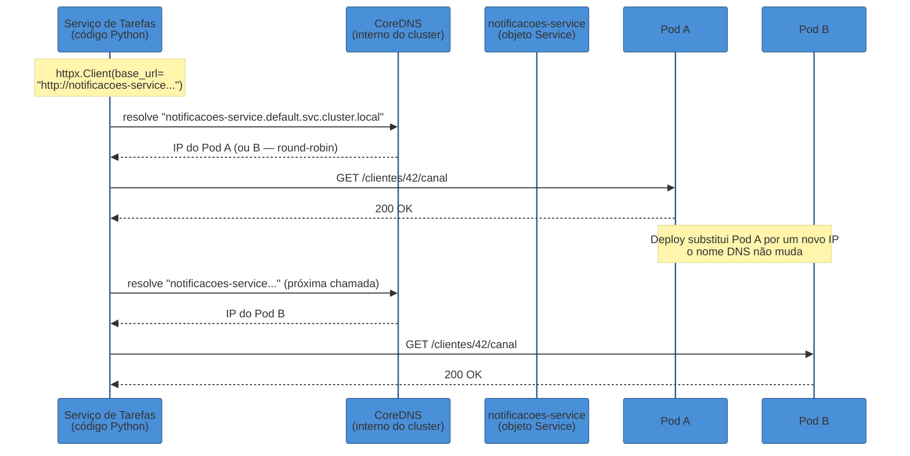
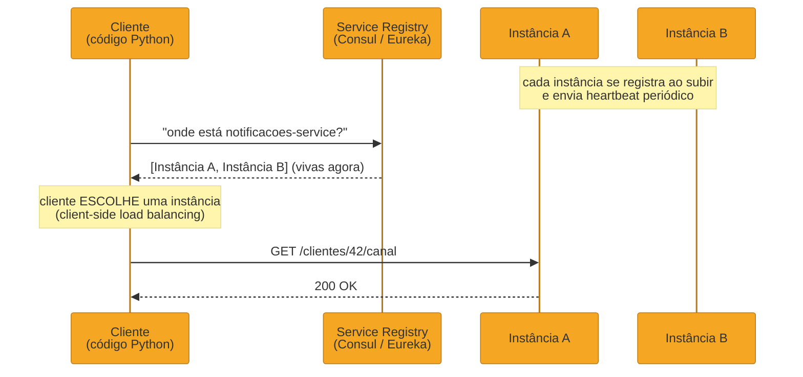
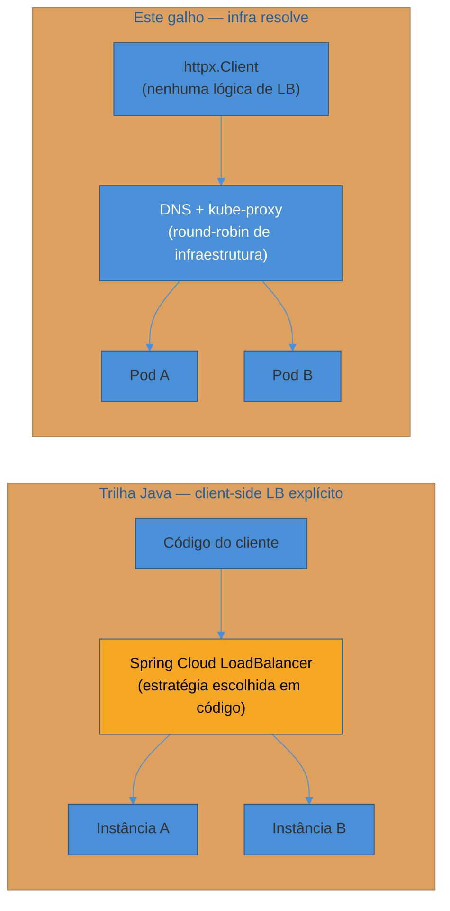

# Service discovery na prática

> [!abstract] TL;DR
> Na maioria dos deploys Python modernos, service discovery **não é código** — é DNS. O serviço de Tarefas fala com `notificacoes-service` chamando `http://notificacoes-service.default.svc.cluster.local`, o DNS interno do Kubernetes resolve esse nome para o IP de um Pod vivo, e a única coisa que o código Python precisa é ler essa URL de uma variável de configuração (`pydantic-settings`, já coberto na [[03-Dominios/Tecnologia/Python/Segurança/06 - Secrets e configuração segura|nota 06 do Galho 11]]) e passá-la pro `httpx.Client` já construído nas [[02 - Comunicação síncrona entre serviços — httpx|notas 02]] e [[03 - Resiliência na prática — tenacity e circuit breaker|03]] deste galho. O jeito de livro-texto — um service registry dedicado (Consul, Eureka) que o cliente consulta explicitamente antes de cada chamada — ainda existe e ainda é usado fora de Kubernetes ou em topologia multi-cluster, mas é exceção, não regra, no ecossistema Python de hoje. E quando existem várias réplicas do serviço remoto, o próprio DNS do Kubernetes já faz um round-robin básico entre elas — client-side load balancing sofisticado (o tipo que a trilha Java resolve com Spring Cloud LoadBalancer) raramente é necessário aqui, porque a infraestrutura de rede já resolve isso numa camada abaixo do código da aplicação.

## "Onde está o código de service discovery dessa aplicação?"

Um dev júnior entra no time de Tarefas na terceira semana. Já leu as notas anteriores deste galho — sabe que o cliente HTTP tem timeout explícito, sabe que retry e circuit breaker protegem a chamada contra `notificacoes-service` fora do ar. Abre o repositório procurando a peça que, no seu modelo mental (formado lendo sobre Eureka, Consul, `DiscoveryClient` em algum tutorial de arquitetura de microservices), devia estar ali: o código que registra o serviço de Tarefas num registry ao subir, e que consulta esse registry para descobrir o endereço do serviço de Notificações antes de cada chamada.

Não encontra nada disso. O que encontra é isto:

```python
# config.py
from pydantic_settings import BaseSettings, SettingsConfigDict


class Settings(BaseSettings):
    model_config = SettingsConfigDict(env_file=".env", env_file_encoding="utf-8")

    notificacoes_service_url: str = "http://notificacoes-service.default.svc.cluster.local"


settings = Settings()
```

```python
# cliente_notificacoes.py
import httpx
from config import settings

client = httpx.Client(base_url=settings.notificacoes_service_url, timeout=5.0)


def buscar_canal(cliente_id: int) -> dict:
    resposta = client.get(f"/clientes/{cliente_id}/canal")
    resposta.raise_for_status()
    return resposta.json()
```

Uma string. Uma variável de ambiente. Nenhum registro, nenhuma consulta prévia, nenhum cliente de discovery importado. O júnior pergunta ao time sênior: "cadê o service discovery de verdade?" — e a resposta honesta, que esta nota inteira existe para justificar, é: **não tem, porque não precisa ter**. O Kubernetes já resolve esse problema numa camada que o código Python nem enxerga — a "descoberta" acontece dentro do resolvedor DNS do cluster, antes mesmo do pacote sair da máquina do serviço de Tarefas.

> [!question]- Isso não é só adiar o problema — o Kubernetes não precisa de "algum código" fazendo discovery por baixo dos panos?
> Precisa, sim — só que esse código não é *seu*. Ele já existe, roda como parte da infraestrutura do cluster (o `kube-dns`/CoreDNS e o `kube-proxy`, ou o equivalente de um service mesh), e resolve o problema uma única vez, para toda a frota, em vez de cada aplicação reimplementar sua própria lógica de registro e consulta. É a mesma lógica de "não construir seu próprio circuit breaker do zero" que a [[03 - Resiliência na prática — tenacity e circuit breaker|nota 03]] já aplicou com `tenacity`/`pybreaker` — só que aqui a peça reutilizada não é uma biblioteca Python, é a própria plataforma de execução.

O resto desta nota desenvolve, nessa ordem: por que o DNS do Kubernetes Service é o mecanismo de discovery de fato hoje; o que muda quando ele não está disponível (o jeito de livro-texto, com um registry dedicado); e por que client-side load balancing raramente é uma preocupação de código Python neste ambiente.

## DNS do Kubernetes Service: discovery sem código de discovery

Um `Service` do Kubernetes ganha, automaticamente, um nome DNS resolvível dentro do cluster — no formato `<nome-do-service>.<namespace>.svc.cluster.local` (ou, dentro do mesmo namespace, o encurtamento `<nome-do-service>` já basta). Esse nome não muda: enquanto o `Service` existir, `notificacoes-service` resolve para *algum* Pod saudável por trás dele, não importa quantas vezes esses Pods subam, caiam, sejam substituídos por um deploy novo, ou mudem de IP — o próprio mecanismo do `Service`/`Endpoints`/CoreDNS existe exatamente para absorver essa instabilidade, mantendo o nome estável enquanto o conjunto de IPs por trás dele muda o tempo todo.



O que o diagrama deixa explícito: entre a primeira e a segunda chamada, um Pod inteiro pode ter sido substituído — e o código Python **não mudou uma linha**. A "descoberta" de um novo endereço aconteceu inteiramente dentro da resolução de nome, antes da primeira letra de `GET` ser escrita na rede. Do ponto de vista do `httpx.Client`, `notificacoes-service` é indistinguível de qualquer outro hostname da internet — não existe API especial, não existe cliente de discovery, é a mesma chamada `client.get(...)` que a [[02 - Comunicação síncrona entre serviços — httpx|nota 02]] já construiu.

> [!tip] A URL é config, não infraestrutura de código
> A `notificacoes_service_url` na classe `Settings` acima não é diferente, em espécie, de qualquer outro valor de configuração que a [[03-Dominios/Tecnologia/Python/Segurança/06 - Secrets e configuração segura|nota 06 do Galho 11]] já tratou — só que em vez de guardar uma credencial, guarda um endereço. Em desenvolvimento local, essa mesma variável aponta para `http://localhost:8001`; em produção, para o nome DNS do `Service`. Nenhuma lógica de discovery precisa saber a diferença — o `Settings` já resolve isso por ambiente, exatamente como resolve `DATABASE_URL` ou qualquer segredo.

### Por que isso funciona sem nenhuma biblioteca de discovery

A pergunta que fica implícita é: se instâncias sobem e descem o tempo todo, como o DNS consegue devolver sempre um IP *vivo*, sem que o serviço de Tarefas precise, ele mesmo, verificar se aquele Pod ainda está respondendo? A resposta é que o Kubernetes mantém o objeto `Endpoints` (ou `EndpointSlice`, na versão mais recente) atualizado em tempo real com a lista de Pods que passam nos health checks (readiness probe) do `Service` — um Pod que está de pé mas ainda não pronto para tráfego, ou que já falhou o probe, simplesmente **não aparece** na lista de endpoints, e portanto o DNS nunca devolve o IP dele. A aplicação Python nunca vê essa lista diretamente; ela só vê o resultado final, um IP que, no momento da resolução, é considerado saudável pela infraestrutura.

> [!question]- E se o DNS resolver um IP e, entre a resolução e a chamada HTTP, aquele Pod cair?
> Pode acontecer — é uma janela de corrida pequena, mas real, entre "DNS resolveu" e "a chamada de rede chegou lá". É exatamente esse cenário que as [[02 - Comunicação síncrona entre serviços — httpx|notas 02]] e [[03 - Resiliência na prática — tenacity e circuit breaker|03]] já cobrem: timeout explícito evita que a chamada trave esperando um Pod morto, e o retry do `tenacity` (restrito a falhas transitórias, nunca a 4xx) absorve exatamente esse tipo de glitch pontual — a próxima tentativa resolve o DNS de novo e, com alta probabilidade, cai num Pod diferente e saudável. Discovery via DNS não elimina a necessidade de resiliência de rede; ela só elimina a necessidade de *código* de discovery.

## O jeito de livro-texto: um service registry dedicado

O modelo que a maior parte da literatura de arquitetura de microservices ensina primeiro — e que a trilha Java desenvolve em profundidade em [[03-Dominios/Tecnologia/Java/Microservices e sistemas distribuídos/06 - Service discovery — o conceito e o Eureka|Service discovery: o conceito e o Eureka]] e [[03-Dominios/Tecnologia/Java/Microservices e sistemas distribuídos/07 - Discovery — Consul e Kubernetes-native|Discovery: Consul e Kubernetes-native]] — é diferente: existe um **service registry** como peça de infraestrutura própria (Netflix Eureka, HashiCorp Consul, etcd usado como registry), cada instância de cada serviço se registra nele ao subir e prova que segue viva por heartbeat, e o cliente **consulta esse registry explicitamente**, via uma chamada HTTP ou uma API de cliente, antes de decidir para qual endereço mandar a próxima requisição.

Esse modelo não desapareceu — ele continua sendo a escolha certa em dois cenários que este galho não desenvolve a fundo, por ficarem fora do escopo de "como o código Python de uma aplicação já dentro de Kubernetes se comunica":

- **Ambientes sem Kubernetes** (ou sem qualquer orquestrador com discovery embutido) — VMs tradicionais, um cluster gerenciado à mão, ou uma frota heterogênea rodando fora de containers. Sem um `Service`/DNS de cluster para se apoiar, alguém precisa prover essa função, e um registry dedicado como Consul (que também resolve por DNS, além de API HTTP, e ainda serve como KV store de configuração) é a escolha padrão.
- **Topologia multi-cluster ou multi-região** — quando o serviço de Tarefas roda num cluster e o serviço de Notificações roda em outro (ou numa região geográfica diferente), o DNS interno de um único cluster Kubernetes não enxerga o outro. Um registry externo ao cluster, ou um service mesh operando entre clusters, volta a ser necessário para resolver esse "quem está vivo, em qualquer lugar" além da fronteira de um único cluster.



A diferença estrutural em relação ao diagrama anterior está clara comparando os dois: no modelo Kubernetes-native, a "consulta ao registry" acontece dentro da resolução DNS, invisível ao código; no modelo de registry dedicado, ela é **uma chamada explícita**, separada da chamada de negócio, que o código do cliente precisa fazer (ou delegar a uma biblioteca de discovery) antes de decidir para onde mandar o `GET`.

> [!warning] Não confundir "não usa registry dedicado" com "não tem discovery"
> É tentador ler "é só DNS" como "não existe service discovery aqui" — mas discovery, como conceito, é exatamente o mesmo problema sendo resolvido: traduzir um nome lógico estável (`notificacoes-service`) para um endereço de rede vivo, sem hardcode e sem intervenção manual a cada mudança de topologia. A diferença não é "tem discovery" vs "não tem" — é **onde** esse mecanismo mora: dentro de uma biblioteca que a aplicação importa e chama explicitamente, ou dentro da infraestrutura de rede que a aplicação nem enxerga. Confundir os dois leva ao erro comum de achar que "aplicação Kubernetes-native não precisa se preocupar com discovery" — ela se preocupa, só que a preocupação já foi resolvida um nível abaixo, pela plataforma.

Esse detalhe de infraestrutura — como o Consul opera, como um service mesh como Istio ou Linkerd estende esse modelo, como o próprio Kubernetes é operado e configurado — fica fora do escopo desta nota e desta trilha por enquanto: é assunto do galho futuro de Cloud-native e produção desta trilha Python, e já coberto com profundidade agnóstica de linguagem no domínio [[03-Dominios/Engenharia/Arquitetura/System Design/index|System Design]]. Esta nota trata o Kubernetes como um fato do ambiente de execução, do mesmo jeito que a [[01 - Panorama — de monolito modular a microservices em Python|nota 01 deste galho]] já avisou que faria.

## Client-side load balancing: por que raramente é código Python aqui

Quando o serviço de Notificações tem múltiplas réplicas — o caso comum sob qualquer carga real de produção —, alguém precisa decidir, a cada chamada, para qual réplica mandar a requisição. No modelo de registry dedicado, essa decisão é explicitamente do **cliente**: ele recebe a lista completa de instâncias vivas do registry e aplica uma estratégia de balanceamento (round-robin, menor número de conexões ativas, ponderado por zona geográfica) antes de escolher uma. É exatamente o papel que [[03-Dominios/Tecnologia/Java/Microservices e sistemas distribuídos/07 - Discovery — Consul e Kubernetes-native|Spring Cloud LoadBalancer]] cumpre na trilha Java — uma biblioteca dedicada, rodando dentro do processo do cliente, com estratégias configuráveis de escolha de instância.

No ecossistema Python/Kubernetes, essa decisão quase nunca aparece como código de aplicação, por um motivo estrutural: o `Service` do Kubernetes já é, ele mesmo, um balanceador. Cada resolução de DNS contra `notificacoes-service` pode devolver um IP diferente entre as réplicas disponíveis (round-robin básico feito pelo próprio CoreDNS/kube-proxy), e mesmo quando o DNS é cacheado por um período curto, o `kube-proxy` (ou, em clusters com service mesh, o proxy sidecar de cada Pod) distribui as conexões TCP entre as réplicas saudáveis do `Service` na camada de rede — antes mesmo de qualquer decisão de "qual instância chamar" chegar a existir como uma linha de código Python.



Isso não significa que balanceamento sofisticado (afinidade de zona, peso por capacidade de cada réplica, balanceamento consciente de latência) seja impossível no ecossistema Kubernetes — significa que, quando ele é necessário, a resposta canônica também é uma peça de infraestrutura, não uma biblioteca Python: um **service mesh** (Istio, Linkerd) rodando como proxy sidecar em cada Pod, capaz de aplicar estratégias de roteamento muito mais ricas do que round-robin, sem que uma única linha do código da aplicação precise saber que essas estratégias existem.

> [!question]- Então nunca faz sentido escrever lógica de balanceamento em código Python neste ambiente?
> Quase nunca, e vale ser honesto sobre o "quase". Existe balanceamento em nível de aplicação quando o cliente HTTP mantém, ele mesmo, um pool de conexões keepalive contra múltiplos IPs resolvidos (o `httpx.Limits` já visto na [[02 - Comunicação síncrona entre serviços — httpx|nota 02]] atua nesse nível, mas ainda sobre o mesmo hostname, não escolhendo entre réplicas manualmente) — e existem casos de nicho, como um cliente que precisa rotear deliberadamente para uma réplica específica por afinidade de dado (sticky routing), onde algum código explícito volta a ser necessário. Mas isso é a exceção que confirma a regra: a decisão-padrão, na esmagadora maioria dos serviços Python rodando em Kubernetes, é deixar a infraestrutura de rede resolver — e só introduzir complexidade de aplicação quando um caso de uso concreto e medido exigir, nunca por precaução.

## Tabela comparativa: quem resolve o quê

| Aspecto | DNS do Kubernetes Service (este galho) | Registry dedicado (Consul/Eureka) | Service mesh (Istio/Linkerd) |
| --- | --- | --- | --- |
| Onde mora a lógica de discovery | Infraestrutura do cluster (CoreDNS + `kube-proxy`) | Biblioteca cliente + servidor de registry externo | Proxy sidecar por Pod |
| O que o código Python vê | Um hostname comum, lido de config | Chamada explícita a uma API de discovery | Um hostname comum, igual ao DNS |
| Funciona fora de Kubernetes | Não | Sim (esse é o caso de uso principal) | Depende da implantação do mesh |
| Funciona entre múltiplos clusters | Não, sem trabalho extra | Sim, é um dos motivos de existir | Sim, com mesh multi-cluster configurado |
| Client-side load balancing | Round-robin básico via DNS/kube-proxy | Responsabilidade explícita do cliente | Estratégias ricas, na camada de proxy |
| Esforço de operação para o time de app | Nenhum além de já estar em Kubernetes | Manter o registry no ar, healthchecks | Instalar e operar o mesh |

A leitura da tabela é direta: cada linha para baixo move a responsabilidade para uma peça de infraestrutura diferente, nunca para o código Python — a única linha onde "código Python" aparece de fato é "o que o código Python vê", e mesmo aí, nas três colunas, o padrão comum é "um hostname comum".

## Armadilhas comuns

> [!warning] Cachear a resolução DNS por tempo longo demais
> **O que acontece:** um `httpx.Client()` de vida longa (o padrão correto ensinado na [[02 - Comunicação síncrona entre serviços — httpx|nota 02]]) reutiliza conexões TCP já estabelecidas via pool de keepalive — e, enquanto uma conexão existente continua saudável, o cliente não precisa resolver o DNS de novo. Se um Pod específico, cujo IP ficou "preso" numa conexão keepalive de longa duração, for substituído por um deploy, as chamadas seguintes por aquela conexão específica continuam indo para o IP antigo até a conexão cair (ou o `keepalive_expiry` configurado na nota 02 expirar). **Por quê:** o pool de conexões existe justamente para evitar handshake repetido — o mesmo motivo que o torna eficiente é o que faz uma conexão sobreviver, por uma janela curta, além da vida útil do Pod que ela alcançou. **Como evitar:** manter `keepalive_expiry` num valor razoável (segundos, não minutos) e confiar no retry/circuit breaker das notas 02-03 para absorver a falha pontual de uma conexão presa a um Pod que já não existe mais — o próximo `GET` nessa mesma sessão HTTP naturalmente abre uma conexão nova, que resolve o DNS de novo.

> [!warning] Confundir `Service` do tipo `ClusterIP` com `Headless Service`
> **O que acontece:** um time espera que o DNS de um `Service` sempre devolva um único IP "virtual" estável (o padrão `ClusterIP`, o caso comum descrito nesta nota) e se surpreende quando, em outro contexto (ex.: descobrir todas as réplicas individualmente, não uma única entrada balanceada), o mesmo nome DNS devolve uma **lista** de IPs de Pods diretamente. **Por quê:** um `Headless Service` (`clusterIP: None`) existe justamente para esse segundo caso — quando a aplicação precisa saber sobre *cada* réplica individualmente (comum em bancos de dados distribuídos ou sistemas com estado por instância, via `StatefulSet`), não apenas alcançar "uma qualquer, balanceada". Os dois tipos coexistem no Kubernetes e resolvem problemas diferentes. **Como evitar:** para o caso deste galho — um cliente HTTP stateless chamando um serviço stateless de múltiplas réplicas — o `ClusterIP` padrão (o comportamento descrito no restante desta nota) é a escolha certa; `Headless Service` é uma ferramenta de nicho, fora do escopo de uma chamada HTTP síncrona simples.

## Em resumo, e a resposta honesta ao júnior

Voltando à pergunta que abriu esta nota: não existe "código de service discovery" no serviço de Tarefas porque não precisa existir. A responsabilidade que, num livro-texto de arquitetura de microservices, pertenceria a um registry dedicado e a um cliente de discovery explícito, já foi absorvida por duas peças de infraestrutura que o time de plataforma nem escreveu: o `Service` do Kubernetes (que dá um nome DNS estável a um conjunto de Pods que muda o tempo todo) e o `kube-proxy`/service mesh (que distribui tráfego entre as réplicas vivas desse `Service`). O único artefato de código que resta é uma URL numa classe `Settings`, exatamente como qualquer outra configuração — e o `httpx.Client` das notas anteriores deste galho nem sabe, nem precisa saber, que o hostname que recebeu não aponta para uma máquina fixa, mas para um `Service` inteiro por trás de um nome só.

A honestidade que vale carregar dessa nota: "é só DNS" não é uma simplificação de amador — é a consequência direta de rodar dentro de uma plataforma que já resolveu esse problema uma vez, para toda a frota, em vez de pedir que cada aplicação o resolva de novo. Quando esse pressuposto deixa de valer — fora de Kubernetes, ou atravessando múltiplos clusters —, o jeito de livro-texto volta a ser a resposta certa, e as ferramentas para isso (Consul, um service mesh multi-cluster) já existem e são maduras; só não são o caso comum que este galho trata.

## Como explicar em inglês

> "Most Python services running in Kubernetes don't have any service discovery code at all — the discovery happens inside DNS resolution, before the application ever sees it. A Kubernetes `Service` gets a stable DNS name that resolves to whichever Pods are currently healthy behind it, so the client just calls a hostname read from configuration — the same `pydantic-settings` layer used for any other config value — and `kube-proxy` handles routing across replicas at the network layer. The textbook model — a dedicated service registry like Consul or Eureka, with the client explicitly querying it and choosing an instance — still exists and is still the right answer outside Kubernetes, or across multiple clusters where a single cluster's internal DNS doesn't reach. But inside a single Kubernetes cluster, that responsibility has already been absorbed by the platform, which is also why sophisticated client-side load balancing — the kind Spring Cloud LoadBalancer provides in the Java stack — is rarely application code in this ecosystem: the network proxy already does it a layer below."

| PT | EN |
|----|----|
| Descoberta de serviço | Service discovery |
| Registry de serviço | Service registry |
| Nome DNS estável | Stable DNS name |
| Round-robin de infraestrutura | Infrastructure-level round-robin |
| Balanceamento no lado do cliente | Client-side load balancing |
| Proxy sidecar | Sidecar proxy |
| Malha de serviço | Service mesh |

## O que vem a seguir

O endereço já resolvido e a chamada já resiliente ainda deixam uma pergunta em aberto: quando uma requisição atravessa dois serviços — o de Tarefas chamando o de Notificações —, como reconstruir essa jornada quando algo dá errado? A próxima nota deste galho resolve isso com tracing distribuído.

- [[06 - Tracing distribuído com OpenTelemetry|06 — Tracing distribuído com OpenTelemetry]] — como o trace ID viaja no header HTTP entre os dois serviços cujo endereço esta nota acabou de resolver.

## Veja também

- [[01 - Panorama — de monolito modular a microservices em Python|01 — Panorama: de monolito modular a microservices em Python]] — mapa do galho e a tabela de custos que a extração cobra.
- [[02 - Comunicação síncrona entre serviços — httpx|02 — Comunicação síncrona entre serviços: httpx]] — o `httpx.Client` que recebe a URL resolvida por esta nota.
- [[03 - Resiliência na prática — tenacity e circuit breaker|03 — Resiliência na prática: tenacity e circuit breaker]] — retry e circuit breaker absorvem a janela de corrida entre resolução DNS e chamada de rede.
- [[03-Dominios/Tecnologia/Python/Segurança/06 - Secrets e configuração segura|Secrets e configuração segura]] — Galho 11, `pydantic-settings` como camada de configuração tipada, reusada nesta nota para a URL do serviço.
- [[03-Dominios/Tecnologia/Java/Microservices e sistemas distribuídos/06 - Service discovery — o conceito e o Eureka|Java — Service discovery: o conceito e o Eureka]] — o conceito completo de registry, heartbeat e client-side vs server-side discovery.
- [[03-Dominios/Tecnologia/Java/Microservices e sistemas distribuídos/07 - Discovery — Consul e Kubernetes-native|Java — Discovery: Consul e Kubernetes-native]] — Consul e o modo Kubernetes-native desenvolvidos em profundidade, incluindo Spring Cloud LoadBalancer.
- [[03-Dominios/Engenharia/Arquitetura/System Design/index|System Design]] — CAP, consistência eventual e os fundamentos agnósticos de linguagem por trás de qualquer mecanismo de discovery.
- [[index|Microservices e sistemas distribuídos (Galho 15)]] — MOC deste galho.

## Fontes

- Kubernetes. *DNS for Services and Pods*. kubernetes.io. https://kubernetes.io/docs/concepts/services-networking/dns-pod-service/ (acessado em 2026-07-12) — formato do nome DNS de um `Service`, resolução dentro do cluster.
- Kubernetes. *Service*. kubernetes.io. https://kubernetes.io/docs/concepts/services-networking/service/ (acessado em 2026-07-12) — `Service`/`Endpoints`/`EndpointSlice`, como o `kube-proxy` distribui tráfego entre Pods saudáveis.
- HashiCorp. *What is Consul?*. consul.io. https://developer.hashicorp.com/consul/docs/intro (acessado em 2026-07-12) — service registry dedicado, resolução por DNS e API HTTP, mencionado como o jeito de livro-texto fora de Kubernetes.
- Encode. *HTTPX — QuickStart*. python-httpx.org. https://www.python-httpx.org/quickstart/ (acessado em 2026-07-12) — `httpx.Client`, consumido sem alteração nesta nota.
- Pydantic. *pydantic-settings*. docs.pydantic.dev. https://docs.pydantic.dev/latest/concepts/pydantic_settings/ (acessado em 2026-07-12) — `BaseSettings`, referenciado via [[03-Dominios/Tecnologia/Python/Segurança/06 - Secrets e configuração segura|nota 06 do Galho 11]].

Consultado em 2026-07-12.
