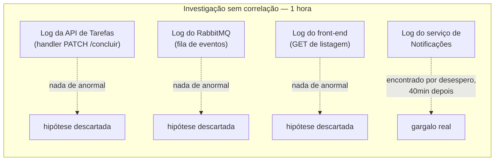
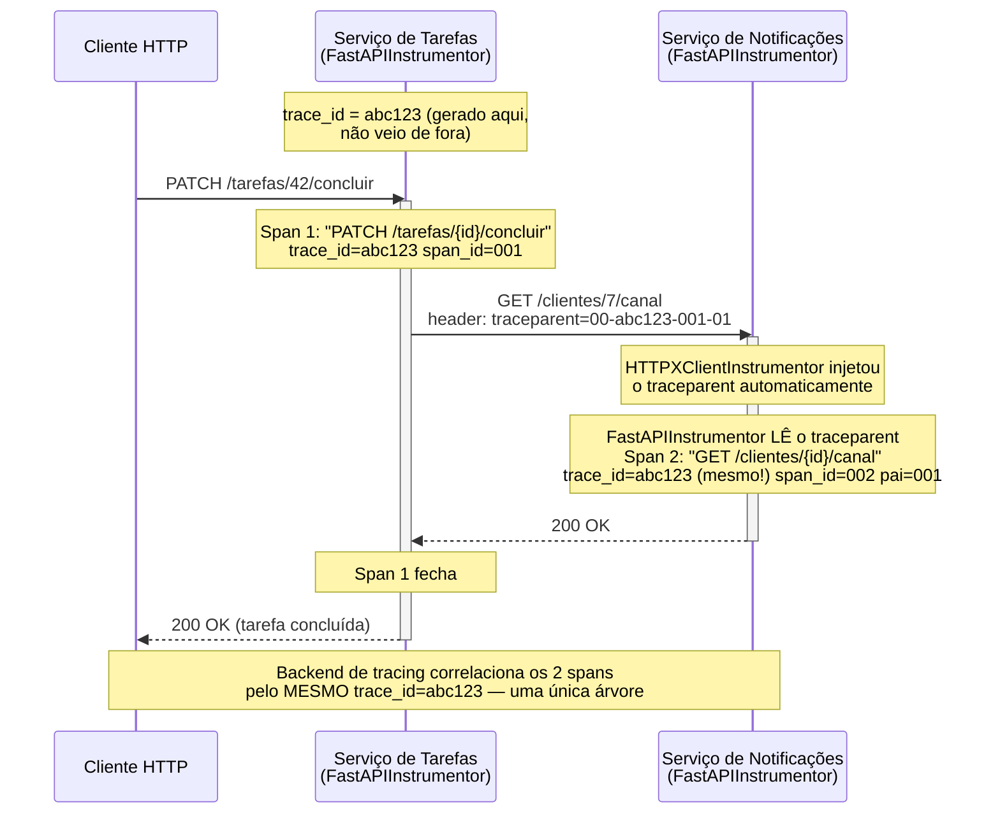

# Tracing distribuído com OpenTelemetry

> [!abstract] TL;DR
> Quando `notificacoes-service` era uma chamada de função dentro do mesmo processo da API de Tarefas, "por que essa operação demorou" se respondia com um log e um `pdb`. Depois da extração deste galho, a mesma pergunta atravessa dois processos, dois arquivos de log sem nenhuma correlação entre si, e uma fila no meio — sem um identificador comum amarrando as pontas, cada investigação vira procurar a mesma agulha em dois palheiros diferentes, um de cada vez. **OpenTelemetry** resolve isso com três conceitos: um `Span` é uma unidade de trabalho com início, fim e atributos (uma requisição HTTP, uma query, um handler); um `Tracer` cria esses spans; e um **trace context** — propagado no header HTTP `traceparent`, padrão [W3C Trace Context](https://www.w3.org/TR/trace-context/) — carrega o mesmo `trace_id` de um processo para o outro, amarrando spans de serviços diferentes na mesma jornada. O caminho de menor esforço é **instrumentação automática**: `opentelemetry-instrumentation-fastapi` cria um span por requisição sem tocar no código de rota, e `opentelemetry-instrumentation-httpx` propaga o `traceparent` em toda chamada de saída da [[02 - Comunicação síncrona entre serviços — httpx|nota 02 deste galho]] sem uma linha de código manual — os dois lados da chamada, instrumentados, já se correlacionam sozinhos. Instrumentação manual (`with tracer.start_as_current_span(...)`) entra só quando o span automático é grande demais para localizar o gargalo dentro dele.

## O incidente: uma hora procurando em dois lugares errados

Segunda-feira, 14h30. Um cliente abre um chamado de suporte: "concluir uma tarefa está lento — às vezes demora uns três segundos, e isso trava minha tela até a confirmação aparecer." Três segundos não parece muito escrito numa frase, mas para quem está esperando uma tela de "salvando..." depois de um clique, é tempo suficiente para duvidar se o clique funcionou.

O time de plataforma pega o chamado. `PATCH /tarefas/{id}/concluir` é o endpoint envolvido — o mesmo handler que, desde o [[03-Dominios/Tecnologia/Python/Mensageria/index|Galho 14]], grava a tarefa concluída, publica `TarefaConcluida` via Outbox, e devolve resposta ao cliente **antes** de qualquer notificação ser processada. Em teoria, o handler HTTP nunca deveria levar três segundos — ele só grava no banco e insere uma linha na tabela de outbox, dentro da mesma transação. A notificação em si roda depois, de forma assíncrona, num worker que consome a fila RabbitMQ. Então por que o cliente está vendo lentidão bem ali, no clique?

A primeira hipótese do time é a mais óbvia: banco lento. Alguém abre o log da API de Tarefas, filtra pelo endpoint, e não encontra nada fora do comum — as queries do handler `concluir` completam em milissegundos, como sempre completaram. Segunda hipótese: RabbitMQ com fila congestionada, atrasando o ack que o handler espera antes de responder. Só que o handler **não espera** o RabbitMQ processar nada — ele só grava na tabela de outbox; quem lê essa tabela e publica de fato é um processo separado, desacoplado do ciclo de resposta HTTP. Essa hipótese cai por terra assim que alguém relê o próprio código do Galho 14 com atenção.

Terceira hipótese, quarenta minutos depois de aberto o chamado: talvez o problema não esteja no handler HTTP, mas em algo que o cliente **percebe** como parte do fluxo, mesmo sem estar tecnicamente dentro dele — o front-end faz um segundo `GET` logo depois do `PATCH`, para atualizar a lista de tarefas na tela, e talvez esse `GET` esteja lento. Alguém abre o log do endpoint de listagem. Nada de anormal ali também.

Cada hipótese consome tempo porque cada log é consultado **isoladamente** — o log da API de Tarefas não sabe nada sobre o que acontece no worker de notificações; o log do worker não tem nenhum identificador em comum com o log da API que permita dizer "esta linha aqui e aquela linha ali fazem parte da mesma requisição do cliente". Uma hora depois de aberto o chamado, alguém finalmente lembra que o serviço de Notificações — já extraído, seguindo o capítulo de abertura deste galho — também tem seu próprio log, e resolve olhar ali por desespero, mais do que por hipótese fundamentada.



Ali, no log de Notificações, aparece a peça que faltava: o worker que consome `TarefaConcluida` da fila — o mesmo worker construído no Galho 14 — recebeu, três semanas atrás, uma mudança pequena e aparentemente inofensiva. Alguém precisava enriquecer a notificação com a preferência de canal do usuário (push, e-mail, ambos), e a forma mais rápida de resolver isso, sob pressão de sprint, foi adicionar uma chamada `httpx.get(...)` **síncrona** dentro do próprio consumer, direto para o endpoint de preferências do serviço de Usuários — sem revisar se aquele endpoint tinha latência aceitável sob carga, e sem que ninguém tivesse motivo óbvio para desconfiar, porque o consumer roda "em background", fora do caminho crítico que o cliente sente... exceto que não está, de fato, totalmente fora: o `ack` da mensagem, e portanto o avanço da fila, só acontece depois que essa chamada síncrona retorna, e o serviço de Usuários, sob uma carga específica de horário de pico, está respondendo em cerca de três segundos.

O motivo de o cliente **perceber** essa lentidão, mesmo o handler HTTP respondendo rápido, é um detalhe do front-end que ninguém tinha investigado: a tela de "salvando..." não fecha no `200 OK` do `PATCH` — ela espera um evento de WebSocket que o front-end assina, disparado só depois que a notificação é processada com sucesso, um detalhe de UX pensado para mostrar "notificação enviada" junto com "tarefa concluída". Ninguém no time de plataforma tinha esse fio condutor em mente quando abriu o chamado; cada log, sozinho, contava uma parte da história sem apontar para as outras partes.

> [!bug] O que estava quebrado, em uma frase
> Uma chamada HTTP síncrona esquecida dentro de um consumer de fila estava adicionando três segundos ao tempo até o cliente ver a confirmação completa — e sem um identificador comum correlacionando os logs da API de Tarefas, do worker e do serviço de Usuários, encontrar isso consumiu uma hora de investigação manual, log por log, hipótese por hipótese.

Duas semanas depois desse incidente, o time adiciona tracing distribuído aos três serviços envolvidos. O próximo chamado parecido — outro cliente reclamando de lentidão semelhante — é resolvido em **dez segundos**: alguém abre o trace da requisição pelo `trace_id` que o próprio cliente reporta (visível num cabeçalho de resposta ou num ID de correlação exposto na tela de erro), vê um único spans-tree com três segundos concentrados num único span chamado `GET /usuarios/{id}/preferencias`, dentro do span do consumer, dentro da mesma árvore do span do `PATCH /tarefas/{id}/concluir` — a jornada inteira, visível de uma vez, sem abrir um único log manualmente.

O resto desta nota constrói exatamente essa capacidade: o vocabulário do OpenTelemetry Python SDK, como instrumentar automaticamente FastAPI e `httpx` sem escrever propagação manual, quando vale a pena instrumentar manualmente um trecho específico, e como o `traceparent` viaja de um serviço para o outro sem que o código de negócio precise saber que ele existe.

## Por que o log sozinho não escala para múltiplos processos

A [[03-Dominios/Tecnologia/Python/Microservices e sistemas distribuídos/01 - Panorama — de monolito modular a microservices em Python|nota 01 deste galho]] já nomeou isso na lista de preços que uma extração cobra: "observabilidade deixa de ser 'ler um log'". Vale esticar por que, especificamente, o problema não é "os logs pioraram" — é que a **unidade de investigação** mudou de forma.

Dentro de um único processo, um log estruturado (mesmo sem nenhuma ferramenta de tracing) já resolve boa parte do problema, porque tudo que aconteceu durante o processamento de uma requisição está, por construção, na mesma stack de chamadas, no mesmo processo, geralmente no mesmo arquivo de log — seguir a sequência de eventos é uma questão de ler de cima para baixo, ou de filtrar por um ID de requisição gerado localmente. É esse cenário — investigação dentro de um processo só — que o galho de observabilidade de produção futuro desta trilha (logging estruturado, correlação de request ID dentro de um processo) vai desenvolver a fundo; esta nota não repete esse território.

O que muda, estruturalmente, quando uma operação de negócio atravessa **dois ou mais processos** — o handler HTTP da API de Tarefas, o consumer do worker de Notificações, uma chamada síncrona ao serviço de Usuários — é que não existe mais um único log contínuo para ler de cima para baixo. Existem três (ou mais) logs, cada um só ciente do que aconteceu dentro do seu próprio processo, sem nenhum vocabulário compartilhado que diga "esta linha do log A e aquela linha do log B fazem parte da mesma operação de negócio". Um ID de requisição gerado localmente pela API de Tarefas não significa nada para o worker de Notificações, que nunca o viu — a menos que alguém desenhe, deliberadamente, um jeito desse identificador **viajar** entre os processos.

> [!question]- Não bastaria cada serviço gerar um `request_id` e todo mundo logar ele nas mensagens da fila?
> É o começo certo do raciocínio, e é exatamente o que tracing distribuído formaliza — só que com um padrão já resolvido em vez de reinventado a cada equipe. Um `request_id` caseiro, propagado manualmente (colocado no payload da mensagem RabbitMQ, lido de volta pelo consumer, repassado em cada chamada HTTP subsequente) funciona, mas exige que **cada** ponto de entrada e saída de cada serviço seja tocado manualmente para carregar esse valor adiante — e basta um desenvolvedor esquecer de propagar numa chamada nova (exatamente como aconteceu com a chamada `httpx.get(...)` do incidente desta nota, que não tinha motivo óbvio de "levar" nenhum identificador junto) para o rastro quebrar silenciosamente bem no ponto que mais importaria depurar depois. OpenTelemetry resolve o mesmo problema, mas com instrumentação automática que intercepta os pontos de entrada/saída padrão (servidor HTTP, cliente HTTP, driver de banco, cliente de fila) e propaga o identificador sem que o código de negócio precise carregar esse fio manualmente — o ganho não é o conceito (que já era óbvio), é a automação da propagação nos pontos onde ela costuma vazar.

## Vocabulário do OpenTelemetry: `Tracer`, `Span`, contexto de trace

OpenTelemetry é um projeto CNCF — um padrão vendor-neutral de instrumentação, com SDKs para múltiplas linguagens (Python entre elas), pensado para não prender o time a um backend de observabilidade específico. O SDK Python gira em torno de três conceitos:

- **`Span`** — uma unidade de trabalho rastreada, com nome, início, fim, atributos (pares chave-valor arbitrários, como `http.status_code` ou `tarefa.id`), e, opcionalmente, eventos e um status (`OK`/`ERROR`). Um span representa "uma coisa que aconteceu" — processar uma requisição HTTP, executar uma query, rodar um trecho específico de lógica de negócio.
- **`Tracer`** — o objeto que cria spans. Obtido via `trace.get_tracer(__name__)`, geralmente um por módulo, seguindo a mesma convenção que `logging.getLogger(__name__)` já estabelece para loggers — um nome que identifica de onde o span se origina.
- **Trace** — o conjunto de spans relacionados que, juntos, formam a árvore completa de uma operação de negócio de ponta a ponta. Cada span dentro de um trace compartilha o mesmo `trace_id`; cada span também guarda uma referência ao seu `span_id` pai, formando a árvore.
- **Contexto de trace (`SpanContext`)** — o par `(trace_id, span_id)` que identifica de forma única "este span específico, dentro deste trace específico". É esse contexto que precisa **viajar** de um processo para o outro para que o serviço B saiba que o span que ele está prestes a criar é filho de um span que já existe no serviço A.

```python
from opentelemetry import trace

tracer = trace.get_tracer(__name__)

with tracer.start_as_current_span("processar_conclusao_tarefa") as span:
    span.set_attribute("tarefa.id", tarefa_id)
    span.set_attribute("usuario.id", usuario_id)
    # ... lógica de negócio aqui dentro é coberta pelo span
```

`start_as_current_span` faz duas coisas ao mesmo tempo: cria o `Span` e o registra como o span "atual" no contexto do processo — qualquer span novo criado dentro desse bloco `with`, mesmo em código que não recebe o objeto `span` explicitamente, automaticamente vira filho dele. Essa propagação implícita **dentro** de um processo é o que permite que instrumentação automática (a próxima seção) crie árvores de spans coerentes sem que cada camada de código precise passar o span pai manualmente como parâmetro.

> [!tip] O nome do span importa mais do que parece
> `tracer.start_as_current_span("processar_conclusao_tarefa")` — o nome do span é o primeiro (e às vezes único) dado que alguém vê ao abrir um backend de tracing sob pressão de incidente, antes de expandir qualquer atributo. Nomes genéricos demais (`"processar"`, `"handler"`) obrigam quem investiga a abrir cada span individualmente para descobrir o que ele realmente fez; nomes específicos o bastante para identificar a operação de negócio (`"processar_conclusao_tarefa"`, `"consultar_preferencias_usuario"`) tornam a árvore de spans legível de relance — o mesmo princípio de nomeação clara que já vale para funções e variáveis, aplicado a um contexto onde o "leitor" costuma estar sob pressão de tempo.

### Configurando o `TracerProvider`

Antes de qualquer `tracer.start_as_current_span(...)` funcionar, o processo precisa de um `TracerProvider` configurado — o objeto raiz que decide para onde os spans vão depois de finalizados. Em produção, isso normalmente significa um **exportador OTLP** (OpenTelemetry Protocol) mandando os spans para um coletor:

```python
from opentelemetry import trace
from opentelemetry.sdk.resources import Resource
from opentelemetry.sdk.trace import TracerProvider
from opentelemetry.sdk.trace.export import BatchSpanProcessor
from opentelemetry.exporter.otlp.proto.grpc.trace_exporter import OTLPSpanExporter

resource = Resource.create({"service.name": "tarefas-service"})
provider = TracerProvider(resource=resource)
provider.add_span_processor(
    BatchSpanProcessor(OTLPSpanExporter(endpoint="http://otel-collector:4317"))
)
trace.set_tracer_provider(provider)

tracer = trace.get_tracer(__name__)
```

`Resource.create({"service.name": "tarefas-service"})` é o que permite que, mais tarde, um backend de tracing distinga "este span veio do serviço de Tarefas" de "este span veio do serviço de Notificações" — sem isso, todos os spans chegariam anônimos, sem indicar sua origem. `BatchSpanProcessor` agrupa spans finalizados e os envia em lote ao coletor (em vez de uma chamada de rede por span, que seria caro demais sob volume real); `OTLPSpanExporter` fala o protocolo OTLP, o formato de fato-padrão que a maioria dos coletores (Jaeger, Grafana Tempo, o próprio OpenTelemetry Collector) já sabe receber.

> [!warning] Esta nota não desenvolve o backend de coleta a fundo
> Configurar um coletor OpenTelemetry, escolher entre Jaeger e Grafana Tempo, dimensionar retenção de traces em produção — isso é infraestrutura de observabilidade, não código de aplicação, e fica para um galho futuro desta trilha (Observabilidade e produção). O que importa para esta nota é só que existe um destino (`endpoint="http://otel-collector:4317"`, tipicamente um `OpenTelemetry Collector` recebendo via OTLP e reexportando para o backend de escolha do time) — o `Resource`, o `TracerProvider` e o `BatchSpanProcessor` são a parte que o código Python de fato controla; o resto é uma URL de configuração, injetada por variável de ambiente na maioria dos deploys reais, não hardcoded como no exemplo acima.

Em ambiente de desenvolvimento, trocar `OTLPSpanExporter` por `ConsoleSpanExporter` (do mesmo pacote SDK) imprime cada span no `stdout` assim que ele fecha — útil para ver a árvore de spans sem depender de nenhum coletor rodando localmente, o mesmo tipo de atalho de desenvolvimento que `print()` cumpre para debugging rápido antes de configurar logging de verdade.

## Instrumentação automática: o caminho de menor esforço

A parte mais valiosa do ecossistema OpenTelemetry para quem já usa FastAPI e `httpx` — exatamente a combinação que as [[03-Dominios/Tecnologia/Python/Microservices e sistemas distribuídos/02 - Comunicação síncrona entre serviços — httpx|notas 02]] e [[03-Dominios/Tecnologia/Python/Web e APIs REST/index|Web e APIs REST]] desta trilha já usam — não é escrever `start_as_current_span` por todo canto. É a **instrumentação automática**: bibliotecas que envolvem o framework/biblioteca de terceiros e criam spans (e propagam contexto) sem que uma única linha do código de negócio precise mudar.

### `opentelemetry-instrumentation-fastapi`: um span por requisição, de graça

```python
from fastapi import FastAPI
from opentelemetry.instrumentation.fastapi import FastAPIInstrumentor

app = FastAPI()

FastAPIInstrumentor.instrument_app(app)


@app.patch("/tarefas/{tarefa_id}/concluir")
async def concluir_tarefa(tarefa_id: int):
    # nenhuma linha de tracing aqui dentro — o span já existe,
    # criado automaticamente antes deste handler ser chamado
    ...
```

`FastAPIInstrumentor.instrument_app(app)` instala um middleware ASGI que envolve **toda** requisição que chega na aplicação — não é preciso decorar cada rota individualmente, nem tocar em nenhum handler existente. Para cada requisição, o instrumentador cria automaticamente um span com o nome do método+rota (`PATCH /tarefas/{tarefa_id}/concluir`), preenche atributos padrão (`http.method`, `http.route`, `http.status_code`, entre outros do semantic convention HTTP do próprio OpenTelemetry) e fecha o span quando a resposta é enviada — sucesso ou exceção, capturando o status em ambos os casos.

O detalhe que faz essa instrumentação valer o esforço de instalar (uma linha) é que ela também **lê** o header `traceparent` da requisição recebida, se ele existir, e usa o `trace_id` de lá em vez de gerar um novo — é assim que um span criado no serviço de Tarefas se torna filho de um span criado, por exemplo, num API Gateway que chamou a API de Tarefas primeiro. Sem essa leitura automática, cada serviço geraria seu próprio `trace_id` isolado, e a árvore nunca se uniria entre processos — exatamente o problema que este galho existe para resolver.

### `opentelemetry-instrumentation-httpx`: propagação de saída, sem código manual

O outro lado da mesma moeda: quando o serviço de Tarefas chama o serviço de Notificações via `httpx` — o cliente que a nota 02 já construiu como singleton no `lifespan` — cada chamada de saída precisa **enviar** o `traceparent` no header, para que o serviço remoto saiba que aquela requisição é parte de um trace que já começou em algum outro lugar.

```python
import httpx
from opentelemetry.instrumentation.httpx import HTTPXClientInstrumentor

HTTPXClientInstrumentor().instrument()

# a partir daqui, TODO Client/AsyncClient criado neste processo
# propaga o traceparent automaticamente em cada chamada de saída
client = httpx.AsyncClient(base_url="http://notificacoes-service", timeout=5.0)
```

`HTTPXClientInstrumentor().instrument()` faz um patch global — chamado uma vez, tipicamente junto do resto da configuração de observabilidade no `lifespan` ou no bootstrap da aplicação, antes de qualquer `Client`/`AsyncClient` ser criado. A partir daí, **toda** chamada `httpx`, síncrona ou assíncrona, passa a: (1) criar um span cliente cobrindo aquela chamada específica, com atributos como `http.url` e `http.status_code`; e (2) injetar o header `traceparent` (com o `trace_id` do span atual do processo) na requisição de saída, automaticamente.

Repare no que **não** aparece em nenhum dos dois blocos de código acima: nenhuma linha manipulando headers, nenhum `headers={"traceparent": ...}` escrito à mão, nenhuma leitura explícita de contexto. Isso é deliberado — é o ponto central desta seção. A [[03-Dominios/Tecnologia/Python/Microservices e sistemas distribuídos/02 - Comunicação síncrona entre serviços — httpx|nota 02 deste galho]] mostrou o `AsyncClient` singleton, criado no `lifespan`, injetado via `Depends()`; a instrumentação automática se encaixa exatamente nesse mesmo objeto, sem exigir mudança nenhuma na forma como ele é usado dentro dos handlers.



O detalhe que faz esse diagrama funcionar de ponta a ponta é que **os dois lados** precisam estar instrumentados. Se apenas o serviço de Tarefas tivesse `HTTPXClientInstrumentor` instalado, mas o serviço de Notificações não tivesse `FastAPIInstrumentor`, o header `traceparent` chegaria na requisição, mas nada do lado de Notificações leria ou usaria esse valor — o span do serviço de Tarefas existiria isolado, sem nenhum span filho do lado de lá, e a árvore ficaria incompleta exatamente no ponto que mais importaria: a fronteira entre os dois processos.

> [!warning] Instrumentar só um lado da chamada quebra a correlação silenciosamente
> **O que acontece:** o time instrumenta o serviço de Tarefas (que faz a chamada de saída) mas esquece de instrumentar o serviço de Notificações (que recebe a chamada) — ou instala a instrumentação, mas numa versão do serviço que ainda não foi implantada em produção.
> **Por quê:** o `traceparent` viaja no header HTTP independentemente de o lado receptor saber o que fazer com ele — um serviço não instrumentado simplesmente ignora o header, gera seu próprio `trace_id` do zero (se tiver alguma instrumentação parcial) ou não gera span nenhum. Em nenhum dos dois casos a árvore se completa; o pior cenário é quando o time acha que está tudo correlacionado, porque a instrumentação do lado de Tarefas está funcionando e reportando spans normalmente, sem perceber que metade da jornada nunca aparece.
> **Como evitar:** instrumentação de tracing é uma disciplina de **todos os serviços da malha**, não uma opção por serviço — o valor cresce exatamente com a cobertura. Um checklist de deploy que inclua "instrumentação OpenTelemetry ativa e reportando ao coletor" antes de considerar um serviço novo pronto para produção evita esse ponto cego.

### Instalação e o padrão `opentelemetry-bootstrap`

As duas bibliotecas de instrumentação automática usadas nesta nota fazem parte de um ecossistema maior de pacotes `opentelemetry-instrumentation-*` — um por biblioteca de terceiros suportada (FastAPI, `httpx`, `requests`, SQLAlchemy, Redis, e dezenas de outras). Instalar cada uma manualmente funciona, mas o próprio projeto oferece uma ferramenta de linha de comando que detecta as dependências instaladas no projeto e sugere as instrumentações compatíveis:

```bash
pip install opentelemetry-distro opentelemetry-exporter-otlp
opentelemetry-bootstrap --action=install
```

`opentelemetry-bootstrap` inspeciona o ambiente Python ativo, identifica bibliotecas como `fastapi` e `httpx` já instaladas, e instala automaticamente os pacotes de instrumentação correspondentes — um atalho útil ao adicionar tracing a um serviço já existente com várias dependências, evitando a tarefa manual de descobrir e instalar cada `opentelemetry-instrumentation-X` uma por uma.

## Instrumentação manual: quando o span automático não é granular o bastante

A instrumentação automática das duas bibliotecas acima cria **um** span por requisição HTTP recebida e **um** span por chamada HTTP de saída — suficiente para responder "qual serviço, ou qual chamada de rede, é o gargalo". Não é suficiente para responder uma pergunta mais fina: "dentro deste handler específico, qual **trecho de lógica de negócio** é o gargalo, quando não há nenhuma chamada de rede envolvida?"

Retomando o incidente de abertura: o span automático do `GET /usuarios/{id}/preferencias`, dentro do consumer de Notificações, já teria sido suficiente para apontar exatamente onde os três segundos estavam — porque o gargalo, nesse caso específico, era mesmo uma chamada de rede, e o `HTTPXClientInstrumentor` cobre isso sozinho. Mas nem todo gargalo é uma chamada de rede. Um cálculo de priorização de tarefas pesado, uma serialização grande, uma etapa de validação que percorre uma lista enorme — tudo isso acontece **dentro** de um único span automático (o span da requisição HTTP inteira), sem nenhuma subdivisão visível.

```python
from opentelemetry import trace

tracer = trace.get_tracer(__name__)


async def processar_conclusao_tarefa(tarefa_id: int, usuario_id: int) -> None:
    tarefa = await buscar_tarefa(tarefa_id)

    with tracer.start_as_current_span("recalcular_prioridade_das_tarefas_pendentes") as span:
        span.set_attribute("tarefa.id", tarefa_id)
        span.set_attribute("usuario.id", usuario_id)
        prioridades = recalcular_prioridade_das_tarefas_pendentes(usuario_id)
        span.set_attribute("tarefas.recalculadas", len(prioridades))

    await salvar_tarefa(tarefa)
```

`with tracer.start_as_current_span("recalcular_prioridade_das_tarefas_pendentes")` cria um span filho do span "atual" naquele momento — se essa função estiver rodando dentro de um handler já coberto pelo `FastAPIInstrumentor`, o span manual nasce automaticamente como filho do span da requisição, sem nenhum código adicional de propagação de contexto; a propagação **dentro** do mesmo processo é implícita, gerenciada pelo SDK via uma variável de contexto (`contextvars`, o mesmo mecanismo que a trilha já cobriu para `asyncio` no [[03-Dominios/Tecnologia/Python/Concorrência e paralelismo/index|Galho 7]]).

O que instrumentação manual acrescenta, além de granularidade temporal, é a possibilidade de anexar **atributos de domínio** ao span — `tarefa.id`, `usuario.id`, `tarefas.recalculadas` — informação que faz sentido de negócio e que nenhuma instrumentação automática genérica saberia adicionar sozinha, porque ela não conhece o vocabulário da aplicação.

```python
with tracer.start_as_current_span("validar_regras_de_negocio") as span:
    try:
        validar_tarefa(tarefa)
    except RegraDeNegocioViolada as exc:
        span.set_status(trace.Status(trace.StatusCode.ERROR, str(exc)))
        span.record_exception(exc)
        raise
```

`span.record_exception(exc)` anexa a exceção (tipo, mensagem, stack trace) como um evento dentro do span, e `span.set_status(...)` marca o span como `ERROR` explicitamente — sem isso, um span que teve uma exceção propagada de dentro dele ainda aparece como span "normal" para quem está lendo a árvore depois, a menos que o instrumentador automático da camada de fora já capture isso sozinho (o que `FastAPIInstrumentor` de fato faz para exceções não tratadas que chegam até ele — mas um span manual, mais interno, criado deliberadamente para uma etapa específica, se beneficia de marcar seu próprio status quando a exceção é tratada ali mesmo, sem propagar até o span raiz).

> [!question]- Instrumentação manual e automática competem, ou coexistem no mesmo processo?
> Coexistem, e é o padrão comum — não uma escolha entre um ou outro. A instrumentação automática cobre a "casca" (requisição HTTP recebida, chamada HTTP de saída, e, com os pacotes equivalentes, query de banco via SQLAlchemy, publicação numa fila via os drivers instrumentados do Galho 14) sem custo de código; a instrumentação manual entra pontualmente, só onde o time já sabe (por experiência de incidente, como o desta nota, ou por suspeita fundamentada) que um trecho específico de lógica de negócio precisa de visibilidade própria. Instrumentar manualmente **tudo** desde o primeiro dia é esforço desperdiçado — a maioria dos gargalos reais em serviços que já usam FastAPI e `httpx` está em I/O (rede, banco, fila), que a instrumentação automática já cobre; instrumentação manual é a ferramenta certa depois que um trace automático já apontou "o gargalo está em algum lugar dentro deste span específico" e a granularidade automática não é suficiente para ir além disso.

## Propagação de contexto: o mecanismo por trás do `traceparent`

A seção de instrumentação automática já mostrou o efeito prático — o `trace_id` viaja sozinho entre os dois serviços — sem explicar o mecanismo em si. Vale abrir essa caixa, porque entender o formato do header ajuda a depurar quando algo dá errado (um proxy que descarta headers desconhecidos, por exemplo, quebra a propagação de um jeito que só faz sentido se alguém souber o que procurar).

O padrão é [W3C Trace Context](https://www.w3.org/TR/trace-context/), uma recomendação do W3C adotada como formato de fato-padrão por praticamente todo o ecossistema de observabilidade moderno (não só OpenTelemetry — é o mesmo formato que ferramentas comerciais de APM também leem). Ele define dois headers HTTP:

- **`traceparent`** — o header obrigatório, com o formato `00-{trace_id}-{span_id}-{trace_flags}`:
  - `00` — versão do formato (atualmente sempre `00`).
  - `trace_id` — 16 bytes em hexadecimal (32 caracteres), identificando o trace inteiro, o mesmo valor em todos os spans da mesma jornada.
  - `span_id` — 8 bytes em hexadecimal (16 caracteres), identificando o span **pai** — o span do lado que está fazendo a chamada, que o span criado do lado receptor vai referenciar como seu pai.
  - `trace_flags` — 1 byte indicando, entre outras coisas, se o trace está marcado como "amostrado" (deve ser exportado) ou não.

```
traceparent: 00-4bf92f3577b34da6a3ce929d0e0e4736-00f067aa0ba902b7-01
              │  └────────── trace_id ─────────┘ └── span_id ───┘ │
            versão                                          trace_flags
```

- **`tracestate`** — um header opcional, usado por sistemas de tracing específicos para carregar informação adicional de vendor (fora do escopo desta nota — a maioria dos setups com OpenTelemetry + um único backend não precisa configurá-lo manualmente).

Quando `HTTPXClientInstrumentor` está ativo, ele constrói esse header a partir do `SpanContext` do span atual do processo (o span criado pelo `FastAPIInstrumentor` para a requisição em andamento, ou por qualquer `start_as_current_span` manual ativo naquele momento) e o injeta em toda requisição de saída. Quando `FastAPIInstrumentor` recebe uma requisição, ele faz o inverso: lê o `traceparent` do header recebido, e se presente e válido, usa o `trace_id` dali como o `trace_id` do novo span, com o `span_id` do header como pai — em vez de gerar um `trace_id` novo do zero, como faria se o header não existisse (o caso de uma requisição que é, de fato, o ponto de entrada de uma jornada nova, vinda diretamente de um cliente externo sem tracing).

```python
# o que acontece "por baixo" quando HTTPXClientInstrumentor injeta o header —
# equivalente conceitual, não código que se escreve manualmente em produção
from opentelemetry.propagate import inject

headers = {}
inject(headers)  # popula headers["traceparent"] a partir do span atual
```

`opentelemetry.propagate.inject(carrier)` e sua contraparte `extract(carrier)` são as duas funções de baixo nível que toda instrumentação automática usa por baixo — `inject` popula um dicionário de headers a partir do contexto atual (usado do lado que envia); `extract` lê um dicionário de headers e reconstrói o contexto (usado do lado que recebe). Em código de aplicação normal, com FastAPI e `httpx` instrumentados, nenhuma dessas duas funções precisa ser chamada diretamente — elas existem, principalmente, para quem precisa propagar contexto através de um transporte que **não** tem instrumentação automática pronta (uma mensagem RabbitMQ carregando o `trace_id` no payload, por exemplo, um caso que a [[03-Dominios/Tecnologia/Python/Mensageria/index|nota equivalente do Galho 14]] trataria se cobrisse tracing — o que ela deliberadamente não faz, por não ser o escopo daquele galho).

> [!tip] `traceparent` funciona através de qualquer proxy que não descarte headers desconhecidos
> Como o `traceparent` é só mais um header HTTP, ele atravessa load balancers, API Gateways e proxies reversos normalmente — desde que o proxy não tenha uma lista explícita de headers permitidos que exclua headers não reconhecidos (um comportamento raro, mas existente em alguns proxies configurados de forma restritiva por segurança). Se um trace some inexplicavelmente entre dois serviços que deveriam estar ambos instrumentados, um dos primeiros lugares a checar é se algum componente de rede no meio do caminho — um API Gateway, um service mesh sidecar — está descartando o `traceparent` antes dele chegar ao destino.

## Correlacionando spans com logging: a ponte com o mundo existente

Uma pergunta prática, depois de instrumentar tracing: o que fazer com o log estruturado que o serviço já emite (mesmo sem cobrir o galho futuro de observabilidade de produção desta trilha)? A resposta comum, e que vale mencionar mesmo sem desenvolver logging estruturado a fundo aqui, é injetar o `trace_id` e o `span_id` **dentro** de cada linha de log emitida durante o processamento de um span — assim, mesmo quem está lendo o log bruto (sem abrir o backend de tracing) consegue filtrar por `trace_id` e reconstruir, manualmente se precisar, a mesma correlação que o tracing já oferece de forma visual.

```python
from opentelemetry import trace


def formatar_log_com_trace(mensagem: str) -> str:
    span = trace.get_current_span()
    ctx = span.get_span_context()
    if ctx.is_valid:
        return f"[trace_id={ctx.trace_id:032x} span_id={ctx.span_id:016x}] {mensagem}"
    return mensagem
```

`trace.get_current_span()` devolve o span ativo no contexto atual do processo — dentro de um handler coberto por `FastAPIInstrumentor`, ou dentro de um `with tracer.start_as_current_span(...)` manual, sempre existe um span "atual" para consultar. Esse padrão — carimbar cada linha de log com `trace_id`/`span_id` — é o elo que conecta a investigação "olhar traces" com a investigação "grep no log", sem exigir que o time escolha uma ferramenta em vez da outra; os dois lêem o mesmo identificador, só apresentado de formas diferentes.

## Checklist de tracing distribuído pronto para produção

1. **`TracerProvider` configurado com `service.name` distinto em cada serviço.** Sem isso, spans de serviços diferentes chegam ao backend sem indicar sua origem, e a árvore vira uma lista de spans sem contexto.
2. **Instrumentação automática instalada em `todos` os lados de cada chamada.** `FastAPIInstrumentor` no serviço que recebe, `HTTPXClientInstrumentor` no serviço que chama — instrumentar só um lado quebra a correlação silenciosamente, como o aviso desta nota já detalhou.
3. **`BatchSpanProcessor`, não `SimpleSpanProcessor`, em produção.** `SimpleSpanProcessor` exporta cada span individualmente, de forma síncrona, no momento em que ele fecha — um custo de latência real, pago em cada requisição, que `BatchSpanProcessor` evita agrupando exportações.
4. **Instrumentação manual só onde o time já sabe que precisa de granularidade.** Adicionar `start_as_current_span` em todo trecho de código, preventivamente, produz uma árvore de spans ruidosa demais para ser útil sob pressão de incidente — a instrumentação automática já cobre a maioria dos gargalos reais (rede, banco, fila).
5. **`trace_id`/`span_id` correlacionados com o logging existente.** Mesmo com tracing configurado, um time que já tem o hábito de "abrir o log primeiro" se beneficia de encontrar o `trace_id` ali, sem precisar trocar de ferramenta no meio de uma investigação.
6. **O destino do exportador (`endpoint=`) vindo de configuração, nunca hardcoded.** O coletor OTLP muda entre ambientes (local, staging, produção) — a URL precisa ser injetada por variável de ambiente, não fixada no código como nos exemplos didáticos desta nota.

## Em entrevista

> "The moment an operation crosses more than one process — an HTTP call, a message on a queue — logging alone stops being enough to answer 'why was this slow', because each service only sees its own log, with no shared identifier tying the pieces together. OpenTelemetry solves that with a `Span` — a unit of work with a start, an end, and attributes — created by a `Tracer`, and a trace context that's propagated between processes as the `traceparent` header, following the W3C Trace Context standard. The highest-leverage move in a Python stack that's already using FastAPI and `httpx` is automatic instrumentation: `opentelemetry-instrumentation-fastapi` wraps every incoming request in a span without touching a single route, and `opentelemetry-instrumentation-httpx` injects that `traceparent` header into every outbound call without any manual header code — instrument both sides of a call and they correlate automatically, purely because the same `trace_id` shows up in both processes' spans. Manual instrumentation — `with tracer.start_as_current_span(...)` — only earns its place once an automatic trace already points at 'the bottleneck is somewhere inside this span' and you need finer granularity than 'one span per HTTP request' gives you. What used to take an engineer an hour of correlating three separate log files by hand, guessing which timestamp lines up with which, becomes a single trace tree you open once — the actual bottleneck, whatever service it's hiding in, is visible without opening a second log."

| PT | EN |
|----|----|
| Span | Span |
| Rastreador / Tracer | Tracer |
| Trace / traço distribuído | Trace / distributed trace |
| Contexto de trace | Trace context |
| Propagação de contexto | Context propagation |
| Instrumentação automática | Automatic instrumentation |
| Instrumentação manual | Manual instrumentation |
| Span pai / span filho | Parent span / child span |
| Coletor (de spans) | Collector |
| Amostragem (de traces) | Sampling |

## Síntese

Um `Span` é a unidade atômica de tracing — início, fim, atributos, criado por um `Tracer`. Um trace é a árvore de spans relacionados, amarrada pelo mesmo `trace_id` compartilhado entre processos diferentes, via o header `traceparent` do padrão W3C Trace Context. Em um serviço Python já construído sobre FastAPI e `httpx` — exatamente a pilha das notas anteriores deste galho — o caminho de menor esforço não é escrever `start_as_current_span` manualmente por todo canto: é instalar `opentelemetry-instrumentation-fastapi` no lado que recebe requisições e `opentelemetry-instrumentation-httpx` no lado que faz chamadas de saída, e deixar as duas bibliotecas criarem spans e propagarem o `traceparent` automaticamente, sem uma linha de código de propagação manual. Instrumentação manual entra depois, cirurgicamente, quando um trace automático já apontou "o gargalo está aqui dentro" e falta granularidade para dizer exatamente onde. O incidente de abertura desta nota — uma hora de investigação manual, log por log, hipótese por hipótese — vira, com essas duas bibliotecas instaladas nos dois lados da chamada, uma única árvore de spans aberta em segundos: o mesmo `trace_id` amarrando o `PATCH /tarefas/{id}/concluir` do serviço de Tarefas ao `GET /usuarios/{id}/preferencias` de três segundos escondido dentro do consumer de Notificações.

O que esta nota deliberadamente não desenvolveu — o backend de coleta (Jaeger, Grafana Tempo), a configuração de um `OpenTelemetry Collector` em produção, taxa de amostragem sob volume alto — é infraestrutura de observabilidade, não código de aplicação Python; fica para o galho futuro desta trilha dedicado a observabilidade e produção. O que fica resolvido aqui é a parte que o código controla: os dois pacotes de instrumentação, o `Tracer` para os casos que exigem granularidade manual, e o entendimento de que o `traceparent` é só um header HTTP comum — nenhuma mágica, só um formato padronizado que dois serviços instrumentados leem e escrevem da mesma forma.

- [[03-Dominios/Tecnologia/Python/Microservices e sistemas distribuídos/01 - Panorama — de monolito modular a microservices em Python|01 — Panorama: de monolito modular a microservices em Python]] — mapa do galho; a linha "observabilidade deixa de ser 'ler um log'" que esta nota desenvolve por completo.
- [[03-Dominios/Tecnologia/Python/Microservices e sistemas distribuídos/02 - Comunicação síncrona entre serviços — httpx|02 — Comunicação síncrona entre serviços: httpx]] — o `Client`/`AsyncClient` singleton que `HTTPXClientInstrumentor` instrumenta sem exigir nenhuma mudança de uso.
- [[03-Dominios/Tecnologia/Python/Microservices e sistemas distribuídos/03 - Resiliência na prática — tenacity e circuit breaker|03 — Resiliência na prática: tenacity e circuit breaker]] — retry e circuit breaker decoram a mesma chamada `httpx` instrumentada nesta nota; cada tentativa de retry gera seu próprio span filho, visível na árvore.
- [[04 - Cliente de API Gateway — autenticação serviço-a-serviço|04 — Cliente de API Gateway: autenticação serviço-a-serviço]] — a chamada autenticada que também carrega o `traceparent` automaticamente, uma vez instrumentada.
- [[03-Dominios/Tecnologia/Python/Mensageria/index|Mensageria (Galho 14)]] — o consumer RabbitMQ do incidente de abertura; propagação de trace context através de mensagens de fila (fora do escopo desta nota, que cobre só chamadas HTTP síncronas).
- [[03-Dominios/Tecnologia/Python/Concorrência e paralelismo/index|Concorrência e paralelismo (Galho 7)]] — `contextvars`, o mecanismo que permite ao span "atual" propagar implicitamente dentro do mesmo processo, mesmo através de código assíncrono.
- [[index|Microservices e sistemas distribuídos (Galho 15)]] — MOC deste galho.

## Fontes

- OpenTelemetry. *Python SDK — Getting Started*. opentelemetry.io. https://opentelemetry.io/docs/languages/python/getting-started/ (acessado em 2026-07-12) — `TracerProvider`, `Tracer`, `Span`, configuração básica do SDK.
- OpenTelemetry. *Instrumentation — FastAPI*. opentelemetry-python-contrib, GitHub. https://github.com/open-telemetry/opentelemetry-python-contrib/tree/main/instrumentation/opentelemetry-instrumentation-fastapi (acessado em 2026-07-12) — `FastAPIInstrumentor.instrument_app`, spans automáticos por requisição.
- OpenTelemetry. *Instrumentation — HTTPX*. opentelemetry-python-contrib, GitHub. https://github.com/open-telemetry/opentelemetry-python-contrib/tree/main/instrumentation/opentelemetry-instrumentation-httpx (acessado em 2026-07-12) — `HTTPXClientInstrumentor`, propagação automática de `traceparent` em chamadas de saída.
- OpenTelemetry. *Python — Manual Instrumentation*. opentelemetry.io. https://opentelemetry.io/docs/languages/python/instrumentation/ (acessado em 2026-07-12) — `start_as_current_span`, atributos, `record_exception`, `set_status`.
- OpenTelemetry. *Exporters — OTLP*. opentelemetry.io. https://opentelemetry.io/docs/languages/python/exporters/ (acessado em 2026-07-12) — `OTLPSpanExporter`, `BatchSpanProcessor` vs `SimpleSpanProcessor`.
- W3C. *Trace Context — Recommendation*. w3.org. https://www.w3.org/TR/trace-context/ (acessado em 2026-07-12) — formato do header `traceparent`/`tracestate`, versão, `trace_id`, `span_id`, `trace_flags`.
- OpenTelemetry. *Propagators API*. opentelemetry.io. https://opentelemetry.io/docs/specs/otel/context/api-propagators/ (acessado em 2026-07-12) — `inject`/`extract`, propagação de contexto em transportes sem instrumentação automática.
- OpenTelemetry. *`opentelemetry-bootstrap`*. opentelemetry-python-contrib, GitHub. https://github.com/open-telemetry/opentelemetry-python-contrib#opentelemetry-bootstrap (acessado em 2026-07-12) — detecção automática de instrumentações compatíveis com as dependências do projeto.

Consultado em 2026-07-12.
