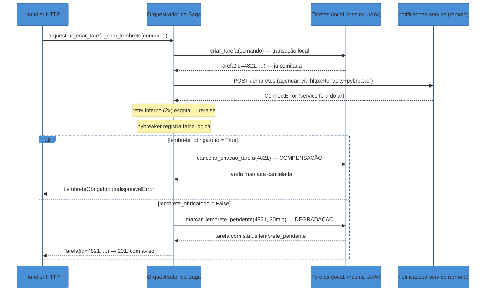

# Saga orquestrada em Python

> [!abstract] TL;DR
> Depois da extração do [[03 - Resiliência na prática — tenacity e circuit breaker|serviço de Notificações]] (notas 02-06 deste galho), criar uma tarefa com lembrete agendado deixou de ser uma operação de um serviço só — virou uma operação que atravessa dois processos, dois bancos, sem transação ACID cobrindo os dois. O conceito de [[03-Dominios/Engenharia/Comunicação entre Sistemas/4 - Comunicação assíncrona/04 - Outbox e Saga|Saga]] já foi coberto em profundidade, agnóstico de linguagem, na trilha de Comunicação entre Sistemas — esta nota não repete compensação, coreografia ou os três tipos de anomalia de isolamento; ela mostra a versão **orquestrada** rodando em Python de verdade. O orquestrador é uma extensão natural do [[03-Dominios/Tecnologia/Python/Arquitetura e Design Patterns/06 - Service Layer — orquestrando casos de uso|Service Layer]] do Galho 13: uma função Python que chama `criar_tarefa` localmente, depois tenta agendar o lembrete no `notificacoes-service` remoto usando o `httpx` + `tenacity` + `pybreaker` da [[03 - Resiliência na prática — tenacity e circuit breaker|nota 03]], e — se o passo remoto falhar — **decide explicitamente**, no código, entre compensar (cancelar a tarefa) ou degradar (manter a tarefa, marcar notificação como pendente). Compensação precisa ser tão idempotente quanto qualquer outro efeito de rede: o próprio orquestrador pode chamá-la mais de uma vez, num retry seu.

## O bug: uma tarefa órfã, e ninguém sabe

Segunda-feira, final de tarde. Um usuário cria uma tarefa "Ligar para o dentista — 09h de amanhã" e marca a caixa "me lembre 30 minutos antes". O handler que processa essa requisição, escrito rápido demais depois que o serviço de Notificações virou um processo separado, faz o óbvio:

```python
"""routers/tarefas.py — ANTES desta nota: fire-and-forget disfarçado de chamada síncrona."""

from fastapi import APIRouter, Depends
import httpx

from auth import get_current_user
from domain.commands import CriarTarefaComando
from domain.services import criar_tarefa
from domain.unit_of_work import AbstractUnitOfWork
from models import Usuario
from schemas import TarefaCreate, TarefaRead
from uow_provider import get_uow

router = APIRouter(prefix="/tarefas", tags=["Tarefas"])

cliente_notificacoes = httpx.Client(base_url="http://notificacoes-service", timeout=5.0)


@router.post("", response_model=TarefaRead, status_code=201)
def criar_tarefa_endpoint(
    dados: TarefaCreate,
    usuario: Usuario = Depends(get_current_user),
    uow: AbstractUnitOfWork = Depends(get_uow),
):
    comando = CriarTarefaComando(usuario_id=usuario.id, titulo=dados.titulo)
    tarefa = criar_tarefa(comando, uow)  # commit local — a tarefa JÁ existe no banco

    if dados.lembrete_minutos_antes:
        try:
            cliente_notificacoes.post(
                "/lembretes",
                json={
                    "tarefa_id": tarefa.id,
                    "usuario_id": usuario.id,
                    "minutos_antes": dados.lembrete_minutos_antes,
                },
            )
        except httpx.HTTPError:
            pass  # "não trava a criação da tarefa por causa de um lembrete" — decisão nunca escrita, só implícita

    return tarefa
```

O raciocínio por trás do `except httpx.HTTPError: pass` até fazia sentido, verbalmente: "se o serviço de Notificações estiver fora do ar, isso não deveria impedir o usuário de criar a tarefa". Só que essa frase nunca virou uma decisão *registrada* em lugar nenhum — virou um `pass` silencioso. `notificacoes-service` está em manutenção programada naquela tarde exata; a chamada `POST /lembretes` estoura `httpx.ConnectError`; o `except` engole a exceção; o handler devolve `201 Created` com a tarefa, exatamente como se o lembrete tivesse sido agendado com sucesso.

A tarefa existe. O lembrete não. Não existe log de erro visível (o `pass` não loga nada), não existe registro em nenhuma tabela de "isso precisa ser reprocessado", não existe um único bit de estado, em nenhum dos dois serviços, que diga "esta tarefa pediu lembrete e não conseguiu". Da perspectiva de qualquer consulta ao banco de Tarefas, a tarefa 4821 é indistinguível de uma tarefa que nunca pediu lembrete algum. O usuário não recebe o lembrete às 8h30 do dia seguinte, perde a consulta, e só descobre o motivo enviando um print de tela para o suporte três dias depois — tempo suficiente para ninguém mais lembrar que houve uma manutenção programada naquela tarde.

> [!bug] O que está quebrado, em uma frase
> `criar_tarefa` e "agendar o lembrete" são dois passos de uma única operação de negócio ("criar uma tarefa com lembrete garantido") espalhados por dois processos sem transação cruzando os dois — e o código atual não tem **nenhuma** lógica de compensação nem de decisão explícita para o caso em que o segundo passo falha depois do primeiro já ter comitado. Ele só tem um `except` que faz a falha desaparecer.

Este é exatamente o cenário que a [[03-Dominios/Engenharia/Comunicação entre Sistemas/4 - Comunicação assíncrona/04 - Outbox e Saga|nota de Outbox e Saga]] descreve em abstrato como o motivo de existir de uma Saga: uma operação de negócio que atravessa múltiplos serviços, sem ACID cruzando o processo, precisa de uma sequência de transações locais com compensação — não de um `try/except` que trata "falhou" e "sucesso silencioso" como a mesma coisa.

> [!question]- Por que não simplesmente publicar `TarefaCriada` como evento e deixar o serviço de Notificações reagir de forma assíncrona, como o `TarefaConcluida` do Galho 14?
> Porque o requisito aqui é diferente do que a mensageria assíncrona (Outbox + RabbitMQ, já construída no [[03-Dominios/Tecnologia/Python/Mensageria/index|Galho 14]] desta trilha) resolve bem. Um evento fire-and-forget garante *eventualmente* que o lembrete será agendado — mas "eventualmente" pode significar minutos ou horas depois, e o produto quer que a resposta HTTP de `POST /tarefas` já reflita se o lembrete foi de fato agendado ou não (a UI mostra um aviso "lembrete não pôde ser agendado agora" no mesmo instante da criação, não numa notificação separada depois). É exatamente a mesma distinção que a [[01 - Panorama — de monolito modular a microservices em Python|nota 01 deste galho]] já fez entre comunicação assíncrona (resolvida) e chamadas síncronas de pergunta-resposta (o problema que faltava resolver) — e é por isso que a Saga desta nota coordena com uma chamada síncrona no meio, não com um evento solto.

## Por que não existe transação cobrindo os dois serviços

O motivo de fundo — por que 2PC não é a resposta prática aqui, por que compensação não é rollback, por que uma Saga não tem isolamento — já está desenvolvido com profundidade na [[03-Dominios/Engenharia/Comunicação entre Sistemas/4 - Comunicação assíncrona/04 - Outbox e Saga|nota de Outbox e Saga]] da trilha de Comunicação entre Sistemas. Esta nota não reabre essa discussão; ela assume como dado que:

- Não existe transação ACID cobrindo o banco de Tarefas e o banco de Notificações — cada serviço tem o seu, dono exclusivo dos seus próprios dados.
- Compensar não é reverter um `INSERT` pendente — é rodar uma segunda operação de negócio (cancelar a tarefa, ou marcar a notificação como pendente) sobre um estado que **já está comitado e visível**.
- A Saga aceita consistência eventual e um período de estado intermediário visível — a diferença é que, com o orquestrador desta nota, esse estado intermediário é **nomeado e decidido**, não um silêncio acidental.

O que esta nota resolve, que a nota de Comunicação entre Sistemas deixa em aberto de propósito (ela é agnóstica de linguagem, esta é aplicada), é: como esse coordenador é, de fato, uma função Python — e como ela decide, sem esconder a decisão, o que fazer quando o passo remoto falha.

## O orquestrador: uma extensão do Service Layer

A [[03-Dominios/Tecnologia/Python/Arquitetura e Design Patterns/06 - Service Layer — orquestrando casos de uso|nota 06 do Galho 13]] já estabeleceu o vocabulário certo para isto: um Comando representando a intenção, uma função de caso de uso que recebe o Comando e orquestra o que precisa ser orquestrado, sem saber quem a chamou. A única coisa nova aqui é que, desta vez, parte do que a função orquestra não é um Repository local — é uma chamada de rede para outro serviço, com tudo que a [[03 - Resiliência na prática — tenacity e circuit breaker|nota 03 deste galho]] já ensinou sobre essa chamada poder falhar de verdade.

```python
"""domain/commands.py — o Comando ganha o campo que faltava: a intenção de lembrete."""

from dataclasses import dataclass


@dataclass(frozen=True)
class CriarTarefaComLembreteComando:
    usuario_id: int
    titulo: str
    lembrete_minutos_antes: int | None
    lembrete_obrigatorio: bool = False
    # True para compromissos que o produto classifica como "crítico" (ex.: consulta médica,
    # prazo legal) — se o lembrete não puder ser agendado, a criação inteira é desfeita.
    # False é o padrão: o usuário prefere ficar com a tarefa (sem lembrete, por ora)
    # a não ter tarefa nenhuma. Ver a decisão explícita mais abaixo.
```

`lembrete_obrigatorio` é a peça que faltava no handler original: uma decisão de negócio, nomeada, que existia antes só como intenção verbal ("não travar a criação por causa do lembrete") e nunca virou um fato explícito no código. Ela chega no Comando porque é o próprio chamador — o handler, hoje; um formulário de "compromisso crítico" no app, amanhã — quem sabe se aquele tipo de tarefa exige lembrete garantido ou tolera lembrete pendente.

```python
"""domain/sagas.py — o orquestrador: Python puro, sem fastapi, chamando dois "serviços" locais."""

import logging

import httpx
import pybreaker
from tenacity import retry, stop_after_attempt, wait_exponential, retry_if_exception

from domain.commands import CriarTarefaComLembreteComando, CriarTarefaComando
from domain.services import criar_tarefa, cancelar_criacao_tarefa, marcar_lembrete_pendente
from domain.tarefa import Tarefa
from domain.unit_of_work import AbstractUnitOfWork

logger = logging.getLogger("tarefas.saga.criar_com_lembrete")


def _deve_retentar(excecao: BaseException) -> bool:
    if isinstance(excecao, (httpx.TimeoutException, httpx.ConnectError)):
        return True
    if isinstance(excecao, httpx.HTTPStatusError):
        return excecao.response.status_code >= 500
    return False


breaker_notificacoes = pybreaker.CircuitBreaker(
    fail_max=5,
    reset_timeout=30,
    exclude=[lambda exc: isinstance(exc, httpx.HTTPStatusError) and exc.response.status_code < 500],
    name="notificacoes-service",
)


@breaker_notificacoes
@retry(
    stop=stop_after_attempt(2),
    wait=wait_exponential(multiplier=0.3, min=0.3, max=2),
    retry=retry_if_exception(_deve_retentar),
    reraise=True,
)
def _agendar_lembrete(cliente: httpx.Client, tarefa_id: int, usuario_id: int, minutos_antes: int) -> None:
    resposta = cliente.post(
        "/lembretes",
        json={"tarefa_id": tarefa_id, "usuario_id": usuario_id, "minutos_antes": minutos_antes},
    )
    resposta.raise_for_status()


def orquestrar_criar_tarefa_com_lembrete(
    comando: CriarTarefaComLembreteComando,
    uow: AbstractUnitOfWork,
    cliente_notificacoes: httpx.Client,
) -> Tarefa:
    """Coordenador central da Saga: cada passo é uma transação local; se o passo remoto
    falhar, a decisão de compensar ou degradar acontece AQUI, de forma explícita — não
    dentro de um `except` genérico escondido no handler HTTP."""

    # Passo 1 — transação local, no serviço de Tarefas. Reusa a Service Layer do Galho 13
    # sem reimplementar a regra de quota que `criar_tarefa` já aplica.
    tarefa = criar_tarefa(
        CriarTarefaComando(usuario_id=comando.usuario_id, titulo=comando.titulo), uow
    )

    if comando.lembrete_minutos_antes is None:
        return tarefa  # não pediu lembrete — a saga termina aqui, sem passo 2

    # Passo 2 — chamada síncrona pro serviço de Notificações, remoto.
    try:
        _agendar_lembrete(
            cliente_notificacoes, tarefa.id, comando.usuario_id, comando.lembrete_minutos_antes
        )
        logger.info("lembrete agendado: tarefa=%s usuario=%s", tarefa.id, comando.usuario_id)
        return tarefa

    except (pybreaker.CircuitBreakerError, httpx.HTTPError) as exc:
        logger.warning(
            "falha ao agendar lembrete: tarefa=%s erro=%r — decidindo compensação", tarefa.id, exc
        )

        # A DECISÃO, explícita, no código — não um `pass` silencioso:
        if comando.lembrete_obrigatorio:
            # Compensação: desfaz o passo 1. A tarefa não fica "pela metade" —
            # ela deixa de existir como se a operação inteira nunca tivesse acontecido.
            cancelar_criacao_tarefa(tarefa.id, uow)
            raise LembreteObrigatorioIndisponivelError(tarefa.id) from exc
        else:
            # Degradação: mantém o passo 1, marca o passo 2 como pendente de retomada.
            # A tarefa continua existindo — só que agora com um estado NOMEADO
            # (`lembrete_pendente`), não um silêncio indistinguível de sucesso.
            marcar_lembrete_pendente(tarefa.id, comando.lembrete_minutos_antes, uow)
            return tarefa


class LembreteObrigatorioIndisponivelError(Exception):
    def __init__(self, tarefa_id: int) -> None:
        self.tarefa_id = tarefa_id
        super().__init__(
            f"Tarefa {tarefa_id} exigia lembrete garantido; notificacoes-service indisponível — criação desfeita"
        )
```

Repare no que essa função **não** faz: ela não importa `fastapi`, não levanta `HTTPException`, não sabe se quem a chamou foi um handler `POST /tarefas` ou um script de importação em lote — exatamente a mesma disciplina que a nota 06 do Galho 13 já cravou para `criar_tarefa`. O que ela adiciona ao vocabulário da Service Layer é a orquestração de um passo **remoto**, com a mesma pilha de resiliência (`httpx` + `tenacity` + `pybreaker`) já construída na nota 03 deste galho, decorando a chamada interna `_agendar_lembrete`.



> [!tip] O breaker e o retry desta Saga são os mesmos da nota 03, não uma reinvenção
> `_agendar_lembrete` reusa exatamente a composição "breaker por fora, retry por dentro, poucas tentativas internas" que a [[03 - Resiliência na prática — tenacity e circuit breaker|nota 03 deste galho]] já justificou em detalhe — inclusive o motivo de `stop_after_attempt(2)` ser pequeno de propósito, para que uma falha lógica só conte uma vez para o `fail_max` do breaker. A Saga não precisa de uma pilha de resiliência própria; ela só precisa decidir o que fazer *depois* que essa pilha, já esgotada, devolve a exceção.

## A decisão explícita: compensar ou degradar

O ponto central desta nota não é o código do orquestrador em si — é o fato de que a bifurcação `if comando.lembrete_obrigatorio` **existe, tem nome, e foi colocada ali por alguém que pensou nas duas opções antes de escrever o código**, em vez de um `except: pass` que escolhe "ignorar" por padrão, sem que ninguém tenha de fato decidido isso.

```python
"""domain/services.py — as duas funções de Service Layer que a Saga chama para desfazer
ou degradar o passo 1, cada uma orquestrando UoW/Repository, sem saber nada de rede."""

from domain.tarefa import Tarefa
from domain.unit_of_work import AbstractUnitOfWork


def cancelar_criacao_tarefa(tarefa_id: int, uow: AbstractUnitOfWork) -> None:
    """Compensação do passo 1. NÃO é um DELETE físico — mantém o rastro de que a
    tarefa existiu e foi cancelada por falha de saga, útil para auditoria e suporte."""
    with uow:
        tarefa = uow.tarefas.get(tarefa_id)
        if tarefa is None:
            return  # idempotência: já não existe (ou já foi cancelada) — nada a fazer
        if tarefa.status == "cancelada_por_falha_saga":
            return  # idempotência: compensação já rodou antes — não reprocessa
        tarefa.status = "cancelada_por_falha_saga"
        uow.tarefas.add(tarefa)
        uow.commit()


def marcar_lembrete_pendente(tarefa_id: int, minutos_antes: int, uow: AbstractUnitOfWork) -> None:
    """Degradação do passo 2. Registra a intenção que falhou, para um job de
    reprocessamento (fora do escopo desta nota) tentar de novo mais tarde."""
    with uow:
        tarefa = uow.tarefas.get(tarefa_id)
        if tarefa is None:
            return
        if tarefa.status == "lembrete_pendente":
            return  # idempotência: já marcada — retry do orquestrador não duplica nada
        tarefa.status = "lembrete_pendente"
        tarefa.lembrete_minutos_antes_pendente = minutos_antes
        uow.tarefas.add(tarefa)
        uow.commit()
```

A régua que decide qual dos dois ramos usar não é técnica — é de produto, e por isso mora no Comando (`lembrete_obrigatorio`), não hardcoded no orquestrador. Uma tarefa comum ("comprar leite") tolera ficar sem lembrete por algumas horas até um job de reprocessamento tentar de novo; um compromisso marcado como crítico (uma consulta médica, um prazo com multa) pode justificar que a criação inteira falhe, visivelmente, em vez de dar ao usuário uma falsa sensação de segurança de que "está tudo criado e vai lembrar".

> [!question]- Por que compensar é "cancelar_criacao_tarefa", e não simplesmente `DELETE FROM tarefas WHERE id = ...`?
> Porque a compensação, como a [[03-Dominios/Engenharia/Comunicação entre Sistemas/4 - Comunicação assíncrona/04 - Outbox e Saga|nota de Outbox e Saga]] já nomeia com precisão, desfaz o **efeito observável** de um passo que já comitou — não apaga a história de que ele aconteceu. Um `DELETE` físico apaga qualquer rastro de que a tentativa existiu; se um usuário liga para o suporte perguntando "criei uma tarefa ontem, cadê ela?", não existe nenhum registro para investigar. Marcar como `cancelada_por_falha_saga` preserva o dado (auditável, consultável) enquanto produz o efeito líquido esperado: a tarefa não aparece mais como uma tarefa ativa para o usuário.

## Compensação também precisa ser idempotente

> [!warning] Compensação chamada duas vezes não é um caso hipotético
> **O que acontece:** o orquestrador em si pode ser reexecutado — por um retry de infraestrutura (um proxy que reenvia a requisição HTTP original depois de um timeout de resposta), por um worker que reprocessa uma mensagem de fila que dispara essa Saga, ou por um humano clicando "tentar de novo" numa tela de suporte. Se isso acontecer depois que `cancelar_criacao_tarefa` já rodou uma vez com sucesso, a segunda execução chama `cancelar_criacao_tarefa` de novo, sobre uma tarefa que já está cancelada. **Por quê:** a mesma disciplina de **at-least-once** que a [[03-Dominios/Tecnologia/Python/Mensageria/03 - Celery em produção — retries, idempotência e Celery Beat|nota 03 do Galho 14]] já cobriu para tasks Celery, e que a nota 03 deste galho já cobriu para retry HTTP, se aplica igualmente à compensação — ela **é** uma chamada de rede (ou uma escrita de banco) como qualquer outra, sujeita às mesmas garantias fracas de entrega. Não existe nada de especial em "isso é o código de desfazer" que a isente de ser chamada mais de uma vez. **Como evitar:** exatamente o padrão que `cancelar_criacao_tarefa` e `marcar_lembrete_pendente` já mostram acima — checar o estado atual antes de aplicar a mudança (`if tarefa.status == "cancelada_por_falha_saga": return`), transformando a operação numa espécie de upsert que produz o mesmo resultado final não importa quantas vezes rode. Não é uma técnica nova; é a mesma idempotência via checagem de estado já detalhada no Galho 14, aplicada ao lado "desfazer" da saga, não só ao lado "fazer".

O detalhe que costuma escapar na primeira implementação: a idempotência da compensação não é opcional "só em teoria" — o próprio orquestrador desta nota, se envolvido por uma camada de retry mais externa (o handler HTTP decorado com o mesmo `tenacity` de outras notas deste galho, por exemplo), pode reexecutar a Saga inteira, incluindo o ramo de compensação, sem nenhuma coordenação especial que impeça isso. Desenhar a compensação para ser segura de chamar de novo é parte do contrato da Saga, não um extra.

## Contraste breve: e se fosse coreografada?

O [[03-Dominios/Tecnologia/Python/Mensageria/08 - Capstone — processamento assíncrono na API de Tarefas|Galho 14 desta trilha]] já construiu, sem nomear explicitamente como tal, um pedaço de Saga **coreografada**: o serviço de Tarefas publica `TarefaConcluida` via Outbox, e o serviço de Notificações reage a esse evento, consumindo da fila, sem que exista um coordenador central sabendo que os dois passos formam uma sequência. Funciona bem ali porque o cenário é simples e linear — um único evento, um único consumidor reagindo — e porque nenhum dos dois lados precisa de resposta imediata: publicar o evento e seguir em frente é suficiente.

O cenário desta nota é estruturalmente diferente, e é isso que empurra a escolha para orquestração: o handler `POST /tarefas` precisa **saber, na mesma resposta HTTP**, se o lembrete foi agendado ou não, para decidir entre devolver a tarefa normalmente ou devolver um aviso — não existe "publicar e seguir em frente" quando a decisão de compensar-ou-degradar precisa acontecer antes da resposta voltar ao cliente. Numa saga coreografada, essa mesma decisão ficaria espalhada entre um handler de evento no serviço de Notificações (que publicaria `lembrete.falhou`) e um segundo handler no serviço de Tarefas (que reagiria a esse evento, compensando ou degradando) — funcionalmente equivalente, mas com o fluxo completo existindo só na cabeça de quem lê os dois handlers em repositórios diferentes, exatamente o trade-off de depurabilidade que a nota de Comunicação entre Sistemas já nomeia. Para uma cadeia de dois passos com uma decisão de negócio explícita no meio, orquestração dá visibilidade que compensa o acoplamento extra de o serviço de Tarefas "conhecer" o serviço de Notificações diretamente.

> [!tip] A régua não mudou de linguagem para linguagem
> A tabela "quando usar cada uma", com os critérios de número de passos, visibilidade, acoplamento e facilidade de depuração, já está na [[03-Dominios/Engenharia/Comunicação entre Sistemas/4 - Comunicação assíncrona/04 - Outbox e Saga#Quando usar cada uma|nota de Outbox e Saga]] e não é repetida aqui — o único acréscimo que vale essa nota é o exemplo concreto de por que **este** cenário específico (resposta síncrona precisa refletir o resultado do passo remoto) pesa a favor de orquestração, não uma regra geral de que orquestração é sempre melhor.

## Testando o orquestrador com Fakes

A mesma economia de testes que a [[03-Dominios/Tecnologia/Python/Arquitetura e Design Patterns/06 - Service Layer — orquestrando casos de uso|nota 06 do Galho 13]] já demonstrou para `criar_tarefa` se aplica aqui — com uma peça nova: além de um `FakeUnitOfWork`, o teste também precisa de um duplo de teste para o cliente HTTP do serviço de Notificações, para não depender de uma rede real nem de `notificacoes-service` estar de pé para rodar a suíte.

```python
"""tests/test_saga_criar_com_lembrete.py"""

import httpx
import pytest

from domain.commands import CriarTarefaComLembreteComando
from domain.sagas import orquestrar_criar_tarefa_com_lembrete, LembreteObrigatorioIndisponivelError
from tests.fakes import FakeUnitOfWork


def cliente_que_sempre_falha() -> httpx.Client:
    def handler(request: httpx.Request) -> httpx.Response:
        return httpx.Response(503, json={"detail": "fora do ar"})
    return httpx.Client(transport=httpx.MockTransport(handler))


def test_lembrete_nao_obrigatorio_degrada_em_vez_de_compensar():
    uow = FakeUnitOfWork()
    comando = CriarTarefaComLembreteComando(
        usuario_id=42, titulo="Comprar leite",
        lembrete_minutos_antes=30, lembrete_obrigatorio=False,
    )

    tarefa = orquestrar_criar_tarefa_com_lembrete(comando, uow, cliente_que_sempre_falha())

    assert tarefa.status == "lembrete_pendente"          # degradou, não cancelou
    assert uow.tarefas.get(tarefa.id) is not None         # a tarefa continua existindo


def test_lembrete_obrigatorio_compensa_cancelando_a_tarefa():
    uow = FakeUnitOfWork()
    comando = CriarTarefaComLembreteComando(
        usuario_id=42, titulo="Consulta médica",
        lembrete_minutos_antes=60, lembrete_obrigatorio=True,
    )

    with pytest.raises(LembreteObrigatorioIndisponivelError):
        orquestrar_criar_tarefa_com_lembrete(comando, uow, cliente_que_sempre_falha())

    tarefa_persistida = list(uow.tarefas.list(42))[0]
    assert tarefa_persistida.status == "cancelada_por_falha_saga"  # compensação rodou


def test_compensacao_chamada_duas_vezes_e_idempotente():
    uow = FakeUnitOfWork()
    comando = CriarTarefaComLembreteComando(
        usuario_id=42, titulo="Consulta médica",
        lembrete_minutos_antes=60, lembrete_obrigatorio=True,
    )

    for _ in range(2):  # simula o orquestrador sendo reexecutado
        with pytest.raises(LembreteObrigatorioIndisponivelError):
            orquestrar_criar_tarefa_com_lembrete(comando, uow, cliente_que_sempre_falha())

    tarefas = list(uow.tarefas.list(42))
    assert len(tarefas) == 1  # não duplicou nem quebrou na segunda chamada
    assert tarefas[0].status == "cancelada_por_falha_saga"
```

`httpx.MockTransport` substitui o `notificacoes-service` real por uma função Python que decide a resposta — sem subir servidor nenhum, sem depender de rede, no mesmo espírito do `FakeUnitOfWork` que já substitui o banco. O terceiro teste é o que prova, de forma executável, a garantia que a seção anterior só descreveu em prosa: rodar a compensação duas vezes produz o mesmo estado final da primeira vez, não um erro nem uma segunda tarefa cancelada duplicada.

## Casos práticos

### O orquestrador que virou um "deus" sabendo demais

Um time começa com o orquestrador desta nota coordenando dois serviços — Tarefas e Notificações. Seis meses depois, o mesmo orquestrador coordena cinco serviços (Tarefas, Notificações, Faturamento, Relatórios, Auditoria), porque cada nova integração pareceu, isoladamente, um `if` a mais de fácil justificativa. Nenhuma decisão consciente foi tomada sobre isso — é o mesmo antipadrão que a [[03-Dominios/Engenharia/Comunicação entre Sistemas/4 - Comunicação assíncrona/04 - Outbox e Saga|nota de Outbox e Saga]] já nomeia como risco estrutural da orquestração: o coordenador vira o serviço que sabe demais sobre todo mundo, o ESB disfarçado que a arquitetura de microsserviços tentava evitar desde o início. A correção não foi abandonar orquestração — foi separar sagas por bounded context: a saga de "criar tarefa com lembrete garantido" continua orquestrada (dois passos, decisão de negócio explícita, resposta síncrona necessária); o consumo por Relatórios e Auditoria virou coreografia pura, reagindo ao evento `TarefaCriada` publicado via Outbox, sem nenhuma ação compensatória — porque nenhum dos dois precisa desfazer nada se falhar, só reagir a um fato que já aconteceu, exatamente o critério que a nota de Comunicação entre Sistemas já formaliza para escolher entre as duas.

### `lembrete_obrigatorio=True` usado como padrão universal, sem pensar

Depois do primeiro incidente com uma tarefa "importante" perdida, alguém, sob pressão, muda o valor padrão de `lembrete_obrigatorio` de `False` para `True` "para garantir que isso nunca mais aconteça" — sem revisar o efeito colateral. Resultado: toda vez que `notificacoes-service` fica indisponível por qualquer motivo (um deploy rotineiro, um pico de tráfego normal), **toda** criação de tarefa com lembrete passa a falhar, mesmo tarefas triviais que jamais mereceriam esse tratamento. O sintoma visível na produção — taxa de erro de `POST /tarefas` subindo em conjunto com qualquer instabilidade do outro serviço — é o preço concreto de transformar uma decisão de negócio (que tipo de compromisso exige lembrete garantido) numa constante técnica aplicada sem critério. A correção: `lembrete_obrigatorio` voltou a ser decidido por quem cria a tarefa (uma categoria explícita de "compromisso crítico" na UI), não por um valor padrão ajustado no calor de um incidente.

## Em resumo

Uma Saga orquestrada em Python não precisa de framework de workflow nenhum para o caso simples desta nota — é uma função de Service Layer como qualquer outra, que chama um passo local (`criar_tarefa`, já pronta desde o Galho 13) e um passo remoto (decorado com a mesma pilha de resiliência da nota 03 deste galho), e que decide, de forma nomeada e testável, o que fazer quando o passo remoto falha: compensar (desfazer o efeito observável do passo local) ou degradar (manter o efeito, registrar a pendência). A parte que mais separa uma Saga de produção de uma Saga de tutorial não é o `try/except` — é duas coisas fáceis de esquecer sob pressão de prazo: a decisão entre compensar e degradar precisa existir explicitamente no código, nomeada e testada; e a própria compensação, sendo mais um efeito colateral sujeito às mesmas garantias fracas de entrega de qualquer chamada distribuída, precisa ser idempotente — porque o orquestrador que a chama pode, ele mesmo, ser reexecutado.

## O que vem a seguir

- [[08 - Capstone — extraindo o serviço de Notificações|08 — Capstone: extraindo o serviço de Notificações]] — todas as peças das sete notas anteriores deste galho, incluindo esta Saga, aplicadas de ponta a ponta na extração real do `AbstractNotificador`/`SlackAdapter`.

## Fontes

- Chris Richardson — [*Pattern: Saga*](https://microservices.io/patterns/data/saga.html), microservices.io (acessado 2026-07-12) — definição canônica de saga, coreografia vs orquestração, já referenciada em detalhe na nota irmã de Comunicação entre Sistemas.
- [[03-Dominios/Engenharia/Comunicação entre Sistemas/4 - Comunicação assíncrona/04 - Outbox e Saga|Outbox e Saga]] — conceito de Saga, compensação vs rollback, coreografia vs orquestração, anomalias de isolamento; fonte primária conceitual desta nota, agnóstica de linguagem, aplicada aqui em Python.
- [[03-Dominios/Tecnologia/Python/Arquitetura e Design Patterns/06 - Service Layer — orquestrando casos de uso|Service Layer — orquestrando casos de uso]] — Galho 13, vocabulário de Comando/função de caso de uso reusado sem repetição pelo orquestrador desta nota.
- [[03 - Resiliência na prática — tenacity e circuit breaker|Resiliência na prática — tenacity e circuit breaker]] — Galho 15, nota 03 deste mesmo galho: a composição breaker+retry decorando `_agendar_lembrete`.
- [[03-Dominios/Tecnologia/Python/Mensageria/03 - Celery em produção — retries, idempotência e Celery Beat|Celery em produção — retries, idempotência e Celery Beat]] — Galho 14, disciplina de at-least-once + idempotência reaproveitada, sem repetição, no aviso sobre compensação idempotente.
- httpx — [*Mock transports*](https://www.python-httpx.org/advanced/mocking/) (acessado 2026-07-12) — `httpx.MockTransport`, usado nos testes desta nota para simular `notificacoes-service` sem rede real.

## Veja também

- [[01 - Panorama — de monolito modular a microservices em Python|01 — Panorama: de monolito modular a microservices em Python]] — mapa do galho.
- [[02 - Comunicação síncrona entre serviços — httpx|02 — Comunicação síncrona entre serviços: httpx]] — o `httpx.Client` reutilizável usado como base da chamada remota desta nota.
- [[03 - Resiliência na prática — tenacity e circuit breaker|03 — Resiliência na prática: tenacity e circuit breaker]] — a pilha de resiliência decorando `_agendar_lembrete`.
- [[08 - Capstone — extraindo o serviço de Notificações|08 — Capstone: extraindo o serviço de Notificações]] — onde a Saga desta nota é aplicada de ponta a ponta.
- [[03-Dominios/Engenharia/Comunicação entre Sistemas/4 - Comunicação assíncrona/04 - Outbox e Saga|Outbox e Saga]] — o conceito, agnóstico de linguagem, que esta nota aplica.
- [[03-Dominios/Tecnologia/Python/Arquitetura e Design Patterns/06 - Service Layer — orquestrando casos de uso|Service Layer — orquestrando casos de uso]] — Galho 13, o vocabulário de Comando/caso de uso que o orquestrador estende.
- [[03-Dominios/Tecnologia/Python/Mensageria/08 - Capstone — processamento assíncrono na API de Tarefas|Capstone do Galho 14]] — o pedaço de Saga coreografada (`TarefaConcluida` via Outbox) contrastado brevemente nesta nota.
- [[03-Dominios/Tecnologia/Java/Mensageria/22 - Saga — transações distribuídas por eventos|Java — Saga: transações distribuídas por eventos]] — o mesmo padrão, implementação Java, trilha irmã.
