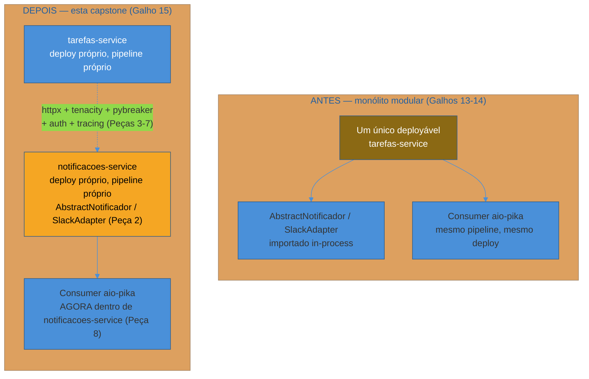
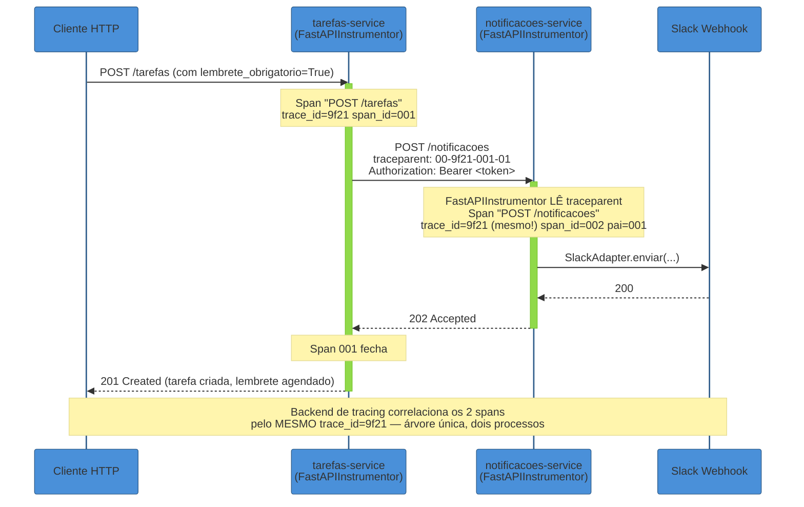
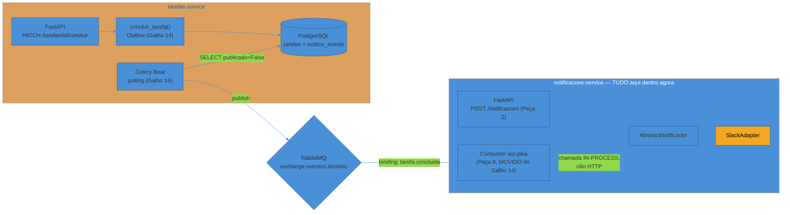
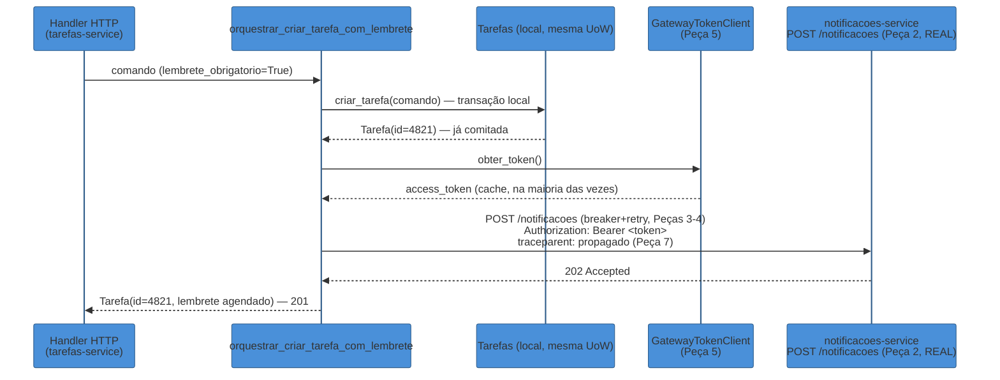
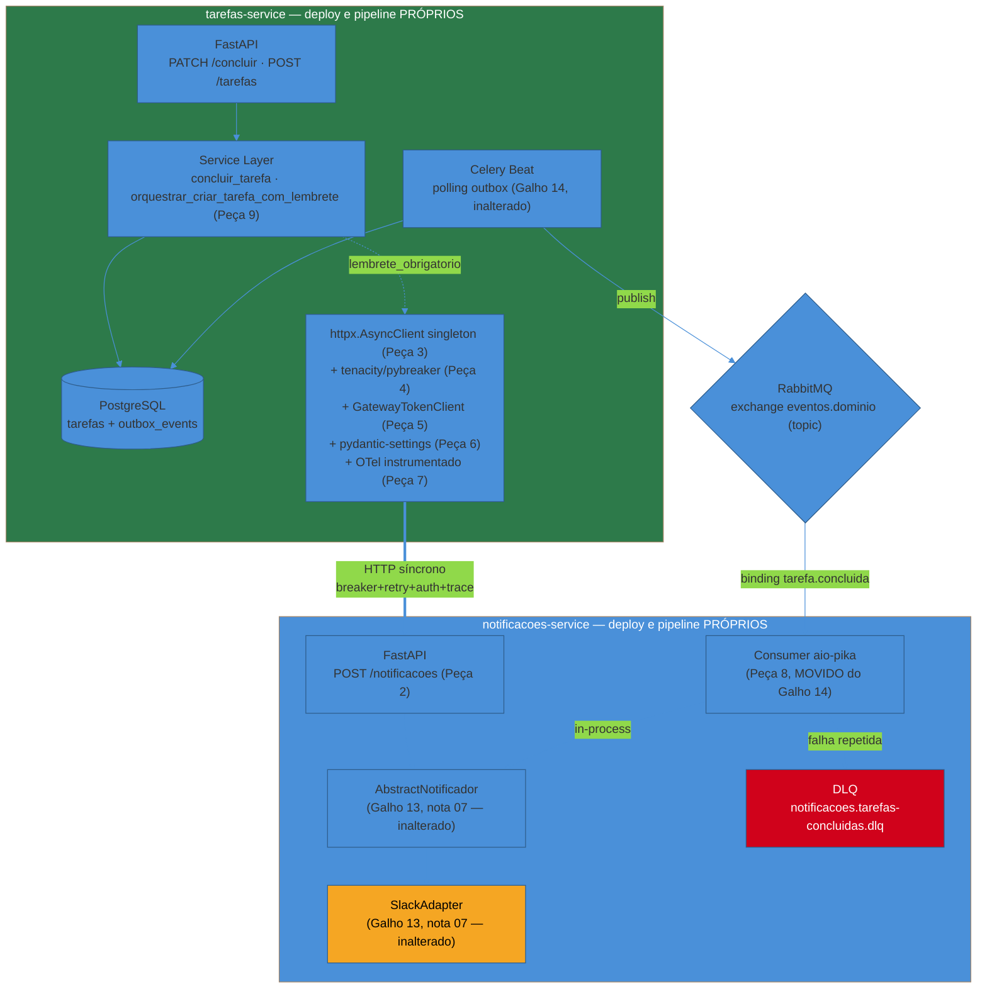

# Capstone — extraindo o serviço de Notificações

> [!abstract] TL;DR
> A [[01 - Panorama — de monolito modular a microservices em Python|nota 01 deste galho]] abriu com uma cena concreta: o time de notificações quer subir um adaptador de push mobile numa tarde em que o pipeline da API de Tarefas está em code freeze, e os dois times ficam reféns um do outro por um motivo que não tem nada a ver com código. Esta capstone fecha esse ciclo extraindo, de fato, o `AbstractNotificador`/`SlackAdapter` que a [[03-Dominios/Tecnologia/Python/Arquitetura e Design Patterns/07 - Arquitetura hexagonal e Ports and Adapters em Python|nota 07 do Galho 13]] já isolou como Port hexagonal — de uma dependência in-process do serviço de Tarefas para um `notificacoes-service` HTTP separado, com seu próprio processo, seu próprio deploy, sua própria cadência. Nada na fronteira muda: `AbstractNotificador` continua com a mesma assinatura, `SlackAdapter` continua com o mesmo código, e a única coisa genuinamente nova é uma casca FastAPI fina em volta dele. O que muda é tudo que está **entre** os dois processos agora — e é exatamente aí que as seis notas seguintes deste galho entram, cada uma amarrada nesta capstone a uma peça concreta: `httpx` ([[02 - Comunicação síncrona entre serviços — httpx|nota 02]]) como o cliente que atravessa a rede, `tenacity`/`pybreaker` ([[03 - Resiliência na prática — tenacity e circuit breaker|nota 03]]) protegendo essa travessia, client credentials cacheado ([[04 - Cliente de API Gateway — autenticação serviço-a-serviço|nota 04]]) autenticando o serviço de Tarefas perante o Gateway, `pydantic-settings` mais DNS do Kubernetes ([[05 - Service discovery na prática|nota 05]]) resolvendo o endereço sem hardcode, OpenTelemetry ([[06 - Tracing distribuído com OpenTelemetry|nota 06]]) correlacionando os dois processos numa árvore de spans só, e a Saga orquestrada ([[07 - Saga orquestrada em Python|nota 07]]) coordenando "criar tarefa com lembrete garantido" contra um serviço que, pela primeira vez nesta trilha, existe de verdade em vez de ser um cenário hipotético de "dois serviços". O worker assíncrono do [[03-Dominios/Tecnologia/Python/Mensageria/08 - Capstone — processamento assíncrono na API de Tarefas|Galho 14]] muda de endereço, não de mecânica: o mesmo consumer `aio-pika` que reagia a `TarefaConcluida` passa a rodar dentro do processo do `notificacoes-service`, não mais dentro do deployável do serviço de Tarefas. Fecha o galho e aponta para [[03-Dominios/Tecnologia/Python/index|Galho 16 — Build e tooling]]: com dois serviços Python de verdade em produção, packaging e ferramental consistentes entre eles deixam de ser um detalhe de gosto pessoal e passam a ser parte do contrato entre os dois times.

## De volta à cena que abriu o galho

A [[01 - Panorama — de monolito modular a microservices em Python|nota 01 deste galho]] descreveu uma reunião de sprint: o time de notificações quer subir uma mudança de adaptador de push mobile numa tarde em que a API de Tarefas está em code freeze por causa de uma migração de banco arriscada. Duas equipes, dois ritmos, um único deployável — e um bloqueia o outro por um motivo que não tem nada a ver com o código de nenhum dos dois.

Esta capstone é o dia em que isso para de ser verdade. `notificacoes-service` ganha seu próprio repositório, seu próprio pipeline de CI/CD, seu próprio deploy — o time de notificações sobe o adaptador de push mobile na tarde do code freeze de Tarefas sem pedir permissão a ninguém, porque o binário que ele está deployando não é mais o mesmo binário que a migração de banco está testando. É esse o resultado concreto, mensurável, de tudo que este galho ensinou: não "arquitetura mais bonita", mas "dois times deployando de forma independente por um motivo que já estava causando dor real".



O que o diagrama deixa explícito, lado a lado: no monólito modular, `AbstractNotificador`/`SlackAdapter` e o consumer da fila viviam dentro do mesmo processo — ou do mesmo conjunto de processos do mesmo repositório — que o handler HTTP de Tarefas. Depois desta capstone, os três (a interface de notificação, o adapter concreto e o consumer de eventos) migram inteiros para dentro de um processo separado, com seu próprio ciclo de vida. A seta pontilhada entre os dois blocos — a única coisa genuinamente nova em termos de tráfego de rede — é exatamente a seta que a [[01 - Panorama — de monolito modular a microservices em Python|nota 01]] já tinha antecipado no seu próprio diagrama, como o "preço" que esta extração cobra.

## Peça 1 — a fronteira já estava pronta (nota 01, e Galho 13 nota 07)

A razão desta extração ser mecânica — não uma descoberta às pressas de onde termina "notificação" e começa "tarefa" — é que a fronteira já existia havia dois galhos inteiros antes desta capstone. A [[03-Dominios/Tecnologia/Python/Arquitetura e Design Patterns/07 - Arquitetura hexagonal e Ports and Adapters em Python|nota 07 do Galho 13]] formalizou `AbstractNotificador` como Driven Port — a única coisa que a Service Layer da API de Tarefas sabe sobre "avisar alguém":

```python
"""domain/notificador.py — inalterado desde o Galho 13, nota 07."""

from abc import ABC, abstractmethod


class AbstractNotificador(ABC):
    """Contrato: qualquer forma de avisar um destinatário sobre algo."""

    @abstractmethod
    def enviar(self, destinatario: str, mensagem: str) -> None:
        """Envia `mensagem` para `destinatario`. Não garante entrega —
        só que a tentativa de envio foi disparada."""
        raise NotImplementedError
```

E `SlackAdapter`, também sem uma linha alterada, continua sendo a única implementação concreta que sabe falar com o webhook do Slack:

```python
"""infra/notificador_slack.py — inalterado desde o Galho 13, nota 07."""

import requests

from domain.notificador import AbstractNotificador


class SlackAdapter(AbstractNotificador):
    def __init__(self, webhook_url: str) -> None:
        self._webhook_url = webhook_url

    def enviar(self, destinatario: str, mensagem: str) -> None:
        resposta = requests.post(
            self._webhook_url,
            json={"channel": destinatario, "text": mensagem},
            timeout=5,
        )
        resposta.raise_for_status()
```

O detalhe que vale nomear explicitamente, porque é fácil passar batido: **nenhuma linha destes dois arquivos muda nesta capstone**. A promessa central da arquitetura hexagonal — "trocar um Adapter, ou mudar onde ele mora, sem tocar no core" — não é só sobre trocar `SlackAdapter` por `EmailAdapter`; é, com a mesma força, sobre mudar **onde o processo que hospeda esses arquivos roda**. Antes, `AbstractNotificador`/`SlackAdapter` viviam dentro do mesmo repositório e do mesmo deployável do serviço de Tarefas, instanciados pelo composition root da API de Tarefas. Depois desta capstone, eles vivem num repositório novo — `notificacoes-service/` — com seu próprio `main.py` decidindo qual `AbstractNotificador` concreto usar. O código-fonte dos dois arquivos é idêntico; o que mudou foi o processo, o pipeline e o time donos deles.

> [!tip] Por que essa extração é "candidata legítima", não Microservice Envy
> A [[01 - Panorama — de monolito modular a microservices em Python|nota 01 deste galho]] cravou o teste antes de qualquer código: "se eu não extrair este módulo, qual dor concreta continua existindo amanhã?" A resposta, nomeada na própria abertura desta capstone, é concreta e verificável — dois times não conseguem deployar sem se coordenar. As três propriedades que a nota 01 já listou como pré-requisito (fronteira de domínio estável, comunicação já assíncrona no ponto certo, contrato de evento já nomeado) estavam todas satisfeitas antes da primeira linha de código de rede desta capstone ser escrita — é exatamente esse pré-trabalho que torna a extração "mecânica" em vez de "arriscada".

## Peça 2 — o serviço de Notificações ganha sua própria API HTTP

O artefato genuinamente novo desta capstone é uma casca FastAPI fina, num repositório próprio, expondo um único endpoint síncrono: `POST /notificacoes`, recebendo `{usuario_id, mensagem, canal}`.

```python
"""notificacoes_service/schemas.py — o contrato HTTP do novo serviço."""

from pydantic import BaseModel


class NotificacaoIn(BaseModel):
    usuario_id: int
    mensagem: str
    canal: str  # nome do canal/destinatário Slack — ex: "#tarefas-concluidas", "@joana"


class NotificacaoOut(BaseModel):
    status: str
```

```python
"""notificacoes_service/main.py — o novo serviço, do zero, em cima do que o Galho 13 já construiu."""

from contextlib import asynccontextmanager
from collections.abc import AsyncGenerator

from fastapi import Depends, FastAPI

from domain.notificador import AbstractNotificador
from infra.notificador_slack import SlackAdapter
from notificacoes_service.config import settings
from notificacoes_service.schemas import NotificacaoIn, NotificacaoOut


@asynccontextmanager
async def lifespan(app: FastAPI) -> AsyncGenerator[None, None]:
    app.state.notificador = SlackAdapter(webhook_url=settings.slack_webhook_url)
    yield


app = FastAPI(lifespan=lifespan)


def get_notificador(request) -> AbstractNotificador:
    return request.app.state.notificador


@app.post("/notificacoes", response_model=NotificacaoOut, status_code=202)
def criar_notificacao(
    dados: NotificacaoIn,
    notificador: AbstractNotificador = Depends(get_notificador),
) -> NotificacaoOut:
    notificador.enviar(destinatario=dados.canal, mensagem=dados.mensagem)
    return NotificacaoOut(status="enviado")
```

Duas decisões pequenas, mas deliberadas, valem nomear. Primeiro, `criar_notificacao` é um handler **síncrono** (`def`, não `async def`) — porque `SlackAdapter.enviar()` chama `requests.post()`, uma biblioteca bloqueante, e o próprio FastAPI já sabe rodar handlers síncronos numa threadpool separada do event loop, exatamente para não travar o processo inteiro enquanto uma chamada bloqueante está em andamento; trocar `SlackAdapter` por um adapter assíncrono (usando `httpx.AsyncClient`, por exemplo) permitiria um handler `async def` no lugar, sem mudar mais nada na assinatura do Port. Segundo, o composition root deste serviço novo — o `lifespan` acima — é deliberadamente o **único** lugar em todo o `notificacoes-service` que sabe que `SlackAdapter` existe; o handler só conhece `AbstractNotificador`, exatamente a mesma disciplina de injeção de dependência que a nota 05 do Galho 13 já cravou para o serviço de Tarefas, agora reaplicada num repositório inteiramente novo.

> [!question]- Por que `202 Accepted`, e não `200 OK`, na resposta desse endpoint?
> Porque `enviar()` só garante que a tentativa de envio foi disparada — a própria docstring de `AbstractNotificador`, herdada sem alteração do Galho 13, já é honesta sobre isso: "não garante entrega". `202 Accepted` comunica precisamente esse contrato ao chamador: a requisição foi aceita e processada por este serviço, mas o resultado final (a mensagem chegou de verdade no Slack?) depende de um sistema de terceiros que este endpoint não espera confirmar de forma síncrona e definitiva. Um `200 OK` sugeriria uma garantia mais forte do que o código realmente entrega — o mesmo cuidado de honestidade semântica que vale para qualquer contrato HTTP entre dois times que não se sentam na mesma sala.

O `canal` do payload é passado direto como `destinatario` para `SlackAdapter.enviar()` — o mesmo campo que, dentro do processo único do Galho 13, era só um parâmetro de função, agora atravessa a fronteira de rede como um campo JSON validado pelo Pydantic. Nada na lógica de negócio de "como enviar uma mensagem ao Slack" mudou; o que mudou é a forma como a intenção de enviar chega até `SlackAdapter` — antes, uma chamada de método Python; agora, um corpo de requisição HTTP.

## Peça 3 — o serviço de Tarefas chama o serviço de Notificações via httpx (nota 02)

Do lado do serviço de Tarefas, a peça que substitui o antigo `import SlackAdapter` in-process é um `httpx.AsyncClient` singleton, criado no `lifespan` da aplicação — exatamente o padrão que a [[02 - Comunicação síncrona entre serviços — httpx|nota 02 deste galho]] já estabeleceu, com timeout explícito em todas as quatro fases.

```python
"""tarefas_service/main.py — lifespan ganha o cliente HTTP para notificacoes-service."""

from contextlib import asynccontextmanager
from collections.abc import AsyncGenerator

import httpx
from fastapi import FastAPI

from tarefas_service.config import settings


@asynccontextmanager
async def lifespan(app: FastAPI) -> AsyncGenerator[None, None]:
    app.state.notificacoes_client = httpx.AsyncClient(
        base_url=settings.notificacoes_service_url,  # Peça 6 — vem de config, não hardcode
        timeout=httpx.Timeout(connect=5.0, read=5.0, write=5.0, pool=2.0),
    )
    yield
    await app.state.notificacoes_client.aclose()


app = FastAPI(lifespan=lifespan)
```

Repare no que este `AsyncClient` **não** faz sozinho: ele não sabe que a chamada precisa de retry, de circuit breaker, de um token de autenticação anexado, ou de qualquer instrumentação de tracing — cada uma dessas responsabilidades é uma peça separada, decorando a mesma chamada `httpx` por cima, na ordem em que as notas seguintes deste galho já as construíram. Este `AsyncClient` sozinho resolve exatamente o problema que a nota 02 resolveu: timeout explícito (nenhuma chamada trava o worker/thread indefinidamente se `notificacoes-service` estiver travado) e reuso de conexão (o pool de conexões TCP+TLS mantido vivo entre chamadas, em vez de pago do zero a cada requisição).

## Peça 4 — resiliência: a chamada agora é rede de verdade (nota 03)

O `notificador.enviar(...)` que, no monólito modular, era uma chamada de método Python — sem timeout, sem possibilidade de `503`, sem rede envolvida — agora atravessa um processo separado, sujeito a tudo que a rede pode fazer de errado: `notificacoes-service` pode estar num deploy ruim, pode estar sobrecarregado, pode simplesmente estar fora do ar. A [[03 - Resiliência na prática — tenacity e circuit breaker|nota 03 deste galho]] já construiu a composição certa — circuit breaker por fora, retry por dentro, poucas tentativas internas — e é exatamente essa composição, sem nenhuma peça nova, que decora a chamada ao `notificacoes-service` real:

```python
"""tarefas_service/clientes/notificacoes.py — httpx + tenacity + pybreaker, sem reinvenção."""

import httpx
import pybreaker
from tenacity import retry, stop_after_attempt, wait_exponential, retry_if_exception


def _deve_retentar(excecao: BaseException) -> bool:
    if isinstance(excecao, (httpx.TimeoutException, httpx.ConnectError)):
        return True
    if isinstance(excecao, httpx.HTTPStatusError):
        return excecao.response.status_code >= 500
    return False


breaker_notificacoes = pybreaker.CircuitBreaker(
    fail_max=5,
    reset_timeout=30,
    exclude=[lambda exc: isinstance(exc, httpx.HTTPStatusError) and exc.response.status_code < 500],
    name="notificacoes-service",
)


@breaker_notificacoes
@retry(
    stop=stop_after_attempt(2),
    wait=wait_exponential(multiplier=0.3, min=0.3, max=2),
    retry=retry_if_exception(_deve_retentar),
    reraise=True,
)
async def enviar_notificacao(
    client: httpx.AsyncClient,
    token: str,
    usuario_id: int,
    mensagem: str,
    canal: str,
) -> None:
    resposta = await client.post(
        "/notificacoes",
        json={"usuario_id": usuario_id, "mensagem": mensagem, "canal": canal},
        headers={"Authorization": f"Bearer {token}"},  # Peça 5, logo abaixo
    )
    resposta.raise_for_status()
```

`enviar_notificacao` é literalmente a mesma composição de decorators que a nota 03 já justificou em detalhe — `fail_max=5`, `stop_after_attempt(2)` deliberadamente curto para que uma falha lógica conte uma vez só para o breaker, `exclude` protegendo o breaker contra `4xx` que não são culpa de `notificacoes-service`. A única mudança em relação aos exemplos didáticos da nota 03 é o `await`, porque o serviço de Tarefas chama isso de dentro de um handler `async def` do FastAPI, usando o `AsyncClient` singleton da Peça 3.

> [!warning] O que acontece quando `notificacoes-service` está fora do ar, com o breaker aberto
> Se `enviar_notificacao` esgota o retry interno e o `pybreaker` acumula cinco falhas lógicas seguidas, o circuito abre — a próxima tentativa de qualquer caller levanta `CircuitBreakerError` na hora, sem sequer tentar a rede. Isso importa especificamente para a Peça 9 (Saga) desta capstone: é exatamente essa exceção — `CircuitBreakerError` ou `httpx.HTTPError`, o mesmo par que a [[07 - Saga orquestrada em Python|nota 07]] já captura — que decide entre compensar e degradar quando o serviço de Notificações está genuinamente indisponível, não apenas lento.

## Peça 5 — autenticação serviço-a-serviço perante o Gateway (nota 04)

Extrair `notificacoes-service` para um processo separado também significa que ele deixa de ser confiável por construção — qualquer processo na rede interna que souber seu endereço pode, em princípio, chamar `POST /notificacoes` se nada exigir prova de identidade. A [[04 - Cliente de API Gateway — autenticação serviço-a-serviço|nota 04 deste galho]] escolheu OAuth2 Client Credentials como o exemplo principal, atrás de um API Gateway — e é essa escolha que esta capstone reaplica: o serviço de Tarefas se autentica perante o Gateway como client `tarefas-service`, com um `access_token` cacheado, renovado só quando expira de verdade.

```python
"""tarefas_service/clientes/token.py — GatewayTokenClient, reaproveitado sem alteração da nota 04."""

import time
import threading

import httpx


class GatewayTokenClient:
    def __init__(
        self,
        token_url: str,
        client_id: str,
        client_secret: str,
        scope: str,
        http_client: httpx.Client,
        margem_segundos: float = 30.0,
    ) -> None:
        self._token_url = token_url
        self._client_id = client_id
        self._client_secret = client_secret
        self._scope = scope
        self._http = http_client
        self._margem = margem_segundos
        self._token: str | None = None
        self._expira_em: float = 0.0
        self._lock = threading.Lock()

    def obter_token(self) -> str:
        if self._token is not None and time.monotonic() < self._expira_em:
            return self._token
        with self._lock:
            if self._token is not None and time.monotonic() < self._expira_em:
                return self._token
            resposta = self._http.post(
                self._token_url,
                data={
                    "grant_type": "client_credentials",
                    "client_id": self._client_id,
                    "client_secret": self._client_secret,
                    "scope": self._scope,
                },
            )
            resposta.raise_for_status()
            corpo = resposta.json()
            self._token = corpo["access_token"]
            expires_in = corpo.get("expires_in", 300)
            self._expira_em = time.monotonic() + expires_in - self._margem
            return self._token
```

Instanciado uma vez, no `lifespan` do serviço de Tarefas, ao lado do `AsyncClient` da Peça 3 — `scope="notificacoes.enviar"`, `client_id="tarefas-service"` — e injetado na chamada de `enviar_notificacao` como o argumento `token` que a Peça 4 já esperava. O `access_token`, uma vez emitido, cobre centenas de chamadas a `POST /notificacoes` sem uma única ida extra ao authorization server — o mesmo incidente que a nota 04 abriu descrevendo (`orders-service` sobrecarregando o authorization server compartilhado) é exatamente o incidente que este cache evita quando o volume de tarefas concluídas por minuto sobe.

> [!question]- Por que não `X-API-Key` estático, já que os dois serviços são do mesmo time?
> A nota 04 deixou essa alternativa registrada, e a régua dela é a mesma aqui: `X-API-Key` compensa em ambientes internos de baixo risco, com poucos serviços, sem exposição a parceiros externos. `notificacoes-service`, uma vez extraído, provavelmente cresce nesse sentido mais rápido do que parece hoje — o mesmo motivo que justificou a extração (times diferentes, cadências diferentes) tende a se repetir com mais consumidores do serviço de Notificações no futuro (um serviço de Faturamento avisando sobre cobrança, um serviço de Relatórios avisando sobre exportação pronta), cada um precisando de rastreabilidade própria sobre quem chamou o quê. Client credentials paga esse custo de setup uma vez, no início, em troca de escopo granular e revogação por client — a mesma troca que a tabela comparativa da nota 04 já formalizou.

## Peça 6 — o endereço do serviço vem de config, nunca de hardcode (nota 05)

O serviço de Tarefas não sabe, e não precisa saber, se `notificacoes-service` roda no Pod ao lado ou do outro lado do datacenter — a [[05 - Service discovery na prática|nota 05 deste galho]] já deixou claro que essa responsabilidade pertence à infraestrutura, não ao código Python. `pydantic-settings` continua sendo a única peça de configuração que o serviço de Tarefas precisa:

```python
"""tarefas_service/config.py — a URL do notificacoes-service, sem hardcode."""

from pydantic_settings import BaseSettings, SettingsConfigDict


class Settings(BaseSettings):
    model_config = SettingsConfigDict(env_file=".env", env_file_encoding="utf-8")

    notificacoes_service_url: str = "http://notificacoes-service.default.svc.cluster.local"
    notificacoes_token_url: str = "https://auth.interno.exemplo.com/oauth2/token"
    notificacoes_client_id: str = "tarefas-service"
    notificacoes_client_secret: str  # via secret manager, sem default
    notificacoes_scope: str = "notificacoes.enviar"


settings = Settings()
```

Em desenvolvimento local, `notificacoes_service_url` aponta para `http://localhost:8001`, onde o time roda `notificacoes-service` como um segundo processo na própria máquina; em produção, aponta para o nome DNS que o `Service` do Kubernetes de `notificacoes-service` já expõe automaticamente. Nenhuma linha do cliente HTTP das Peças 3-5 precisa saber a diferença — o mesmo `httpx.AsyncClient(base_url=settings.notificacoes_service_url)` funciona nos dois ambientes, porque a resolução de "qual IP está por trás desse nome" acontece uma camada abaixo do código Python, exatamente como a nota 05 já demonstrou.

> [!tip] O que esta capstone escolhe ser honesta em não fingir resolver
> A nota 05 já avisou que Kubernetes é tratado, nesta trilha, "como um fato do ambiente de execução" — sem ensinar a operar um cluster. Esta capstone segue a mesma disciplina: o `Service` do Kubernetes que dá nome DNS estável a `notificacoes-service`, o manifesto que declara suas réplicas, o `Deployment` que orquestra o rollout — nada disso é código Python, e nada disso é reconstruído aqui. O que esta capstone garante é que o código Python **do lado da aplicação** já está pronto para esse ambiente: nenhuma URL hardcoded, nenhuma suposição de "sempre um único IP fixo".

## Peça 7 — tracing propagado entre os dois processos (nota 06)

Com dois processos genuinamente separados agora — não mais uma hipótese didática, mas `tarefas-service` e `notificacoes-service` de fato rodando em pipelines distintos —, a pergunta que a [[06 - Tracing distribuído com OpenTelemetry|nota 06 deste galho]] respondeu em abstrato ganha um cenário real para se aplicar: como reconstruir a jornada de uma requisição que atravessou os dois. A resposta continua sendo instrumentação automática dos dois lados, sem uma linha de propagação manual.

```python
"""tarefas_service/observability.py — bootstrap OpenTelemetry do lado que chama."""

from opentelemetry import trace
from opentelemetry.sdk.resources import Resource
from opentelemetry.sdk.trace import TracerProvider
from opentelemetry.sdk.trace.export import BatchSpanProcessor
from opentelemetry.exporter.otlp.proto.grpc.trace_exporter import OTLPSpanExporter
from opentelemetry.instrumentation.fastapi import FastAPIInstrumentor
from opentelemetry.instrumentation.httpx import HTTPXClientInstrumentor

resource = Resource.create({"service.name": "tarefas-service"})
provider = TracerProvider(resource=resource)
provider.add_span_processor(
    BatchSpanProcessor(OTLPSpanExporter(endpoint="http://otel-collector:4317"))
)
trace.set_tracer_provider(provider)

HTTPXClientInstrumentor().instrument()  # antes de qualquer AsyncClient ser criado


def instrumentar(app) -> None:
    FastAPIInstrumentor.instrument_app(app)
```

```python
"""notificacoes_service/observability.py — o mesmo bootstrap, do lado que recebe."""

from opentelemetry import trace
from opentelemetry.sdk.resources import Resource
from opentelemetry.sdk.trace import TracerProvider
from opentelemetry.sdk.trace.export import BatchSpanProcessor
from opentelemetry.exporter.otlp.proto.grpc.trace_exporter import OTLPSpanExporter
from opentelemetry.instrumentation.fastapi import FastAPIInstrumentor

resource = Resource.create({"service.name": "notificacoes-service"})
provider = TracerProvider(resource=resource)
provider.add_span_processor(
    BatchSpanProcessor(OTLPSpanExporter(endpoint="http://otel-collector:4317"))
)
trace.set_tracer_provider(provider)


def instrumentar(app) -> None:
    FastAPIInstrumentor.instrument_app(app)
```

`resource.create({"service.name": ...})` é a única diferença entre os dois blocos — cada serviço se anuncia com seu próprio nome ao coletor, para que a árvore de spans resultante consiga distinguir "isso aconteceu em Tarefas" de "isso aconteceu em Notificações", exatamente como a nota 06 já explicou. Nenhum dos dois blocos escreve `headers={"traceparent": ...}` manualmente — `HTTPXClientInstrumentor` no lado que chama injeta o header sozinho; `FastAPIInstrumentor` no lado que recebe lê e usa esse header sozinho.



O gargalo hipotético que a nota 06 usou como incidente de abertura — três segundos escondidos dentro de uma chamada síncrona a um terceiro serviço, invisível até alguém abrir o log certo por desespero — passa a ser uma pergunta de dez segundos nesta arquitetura, com os dois lados instrumentados: abrir o `trace_id` da requisição e ver, numa única árvore, exatamente onde o tempo foi gasto — dentro do `POST /tarefas`, dentro do `POST /notificacoes`, ou dentro da chamada ao Slack em si.

> [!warning] Instrumentar só `tarefas-service` e esquecer `notificacoes-service` quebra a correlação silenciosamente
> É o mesmo aviso que a nota 06 já registrou, reafirmado aqui porque agora existe um segundo repositório inteiro onde alguém pode esquecer de configurar isso. Se `notificacoes-service` subir sem `FastAPIInstrumentor.instrument_app(app)`, o `traceparent` chega no header da requisição, mas nada do lado de Notificações lê ou usa esse valor — o span do lado de Tarefas existe isolado, sem nenhum filho do lado de lá, e a árvore fica incompleta exatamente na fronteira entre os dois times. Um checklist de "serviço novo pronto para produção" que inclua tracing ativo evita esse ponto cego se repetir a cada novo serviço extraído no futuro.

## Peça 8 — o worker do Galho 14 muda de processo, não de mecânica

O caminho assíncrono construído no [[03-Dominios/Tecnologia/Python/Mensageria/08 - Capstone — processamento assíncrono na API de Tarefas|Galho 14]] não muda uma linha de protocolo com esta extração — `Tarefa.concluir()` continua levantando `TarefaConcluida`, a Unit of Work continua gravando esse evento na tabela `outbox_events` na mesma transação, o Celery Beat continua fazendo polling e publicando na exchange `eventos.dominio` do RabbitMQ. O que muda é só **onde o consumer que reage a esse evento roda**. No Galho 14, esse consumer era um processo Python dedicado, mas pertencia ao mesmo repositório e ao mesmo pipeline de deploy da API de Tarefas — mudar o `SlackAdapter` que ele usava significava um deploy coordenado com o time de Tarefas, mesmo o consumer não tocando em nenhuma linha de domínio de tarefas. Depois desta capstone, esse mesmo consumer — sem alteração de mecânica, só de endereço — roda dentro do repositório e do deploy de `notificacoes-service`:

```python
"""notificacoes_service/workers/consumer_eventos.py — o mesmo consumer do Galho 14,
agora dentro do processo de notificacoes-service, chamando SlackAdapter IN-PROCESS."""

import asyncio
import json

import aio_pika

from domain.notificador import AbstractNotificador
from infra.notificador_slack import SlackAdapter
from notificacoes_service.config import settings


async def processar_tarefa_concluida(
    message: aio_pika.abc.AbstractIncomingMessage,
    notificador: AbstractNotificador,
) -> None:
    try:
        evento = json.loads(message.body)
        notificador.enviar(
            destinatario="#tarefas-concluidas",
            mensagem=f"Tarefa '{evento['titulo']}' foi concluída pelo usuário {evento['usuario_id']}",
        )
        await message.ack()
    except (KeyError, json.JSONDecodeError):
        await message.nack(requeue=False)
    except Exception:
        await message.nack(requeue=False)  # roteia pra DLQ — nota 07 do Galho 14, sem mudança


async def iniciar_consumer_eventos(notificador: AbstractNotificador) -> None:
    connection = await aio_pika.connect_robust(settings.rabbitmq_url)
    channel = await connection.channel()
    await channel.set_qos(prefetch_count=10)

    exchange = await channel.declare_exchange(
        "eventos.dominio", aio_pika.ExchangeType.TOPIC, durable=True,
    )
    queue = await channel.declare_queue(
        "notificacoes.tarefas-concluidas",
        durable=True,
        arguments={
            "x-dead-letter-exchange": "notificacoes.dlx",
            "x-dead-letter-routing-key": "tarefa.concluida.falha",
        },
    )
    await queue.bind(exchange, routing_key="tarefa.concluida")

    async with queue.iterator() as fila_iter:
        async for message in fila_iter:
            await processar_tarefa_concluida(message, notificador)
```

```python
"""notificacoes_service/main.py — o lifespan da Peça 2, agora também subindo o consumer."""

from contextlib import asynccontextmanager
from collections.abc import AsyncGenerator

import asyncio
from fastapi import FastAPI

from infra.notificador_slack import SlackAdapter
from notificacoes_service.config import settings
from notificacoes_service.workers.consumer_eventos import iniciar_consumer_eventos


@asynccontextmanager
async def lifespan(app: FastAPI) -> AsyncGenerator[None, None]:
    app.state.notificador = SlackAdapter(webhook_url=settings.slack_webhook_url)

    # o consumer roda como uma Task de background, dentro do MESMO processo
    # que serve POST /notificacoes — não mais um processo Python separado
    tarefa_consumer = asyncio.create_task(iniciar_consumer_eventos(app.state.notificador))
    yield
    tarefa_consumer.cancel()


app = FastAPI(lifespan=lifespan)
```

O detalhe que faz esta peça valer a capstone inteira, e não só uma nota a mais: `notificador.enviar(...)`, dentro de `processar_tarefa_concluida`, volta a ser uma **chamada de método Python in-process** — não uma requisição HTTP. É a mesma economia que existia antes de qualquer serviço ser extraído, só que agora confinada dentro do processo de `notificacoes-service`, que é o único lugar onde `SlackAdapter` ainda faz sentido morar sem atravessar rede. O consumer não precisa de `httpx`, não precisa de retry/circuit breaker das Peças 3-4 (essas peças protegem a chamada **entre** tarefas-service e notificacoes-service, não uma chamada dentro do próprio notificacoes-service), e não precisa de autenticação da Peça 5 — porque não há fronteira de rede a proteger ali dentro.



> [!question]- Por que não fazer o consumer chamar `POST /notificacoes` do próprio serviço, via `localhost`, em vez de chamar `SlackAdapter` direto?
> Porque isso adicionaria uma travessia HTTP inteiramente desnecessária — serialização JSON, um socket TCP, mesmo que `localhost`, tudo isso só para dois pedaços de código do **mesmo processo** conversarem. `POST /notificacoes` existe para atender chamadores **externos** ao processo de `notificacoes-service` (o serviço de Tarefas, via httpx, nas Peças 3-5) — não para o próprio serviço se autochamar. O consumer, rodando dentro do mesmo processo que já tem `AbstractNotificador` disponível como um objeto Python de verdade (`app.state.notificador`), simplesmente chama `.enviar()` diretamente, exatamente como o próprio handler HTTP `POST /notificacoes` já faz na Peça 2. As duas entradas — HTTP síncrono e evento assíncrono via fila — convergem no mesmo Port, cada uma vindo de um Driving Adapter diferente, a mesma simetria que a nota 07 do Galho 13 já formalizou.

> [!tip] Um detalhe honesto que esta capstone não resolve: tracing no caminho assíncrono
> A nota 06 já avisou, sem rodeio, que propagação de trace context através de mensagens de fila fica fora do escopo daquele texto — e essa lacuna continua existindo aqui. O `trace_id` do `PATCH /tarefas/{id}/concluir` que gerou o `TarefaConcluida` não viaja, hoje, dentro da mensagem RabbitMQ que o consumer desta peça processa; o processamento do evento aparece, no backend de tracing, como um trace novo, desconectado da requisição HTTP original que o originou. Corrigir isso exigiria propagação manual de `trace_id` no payload da mensagem (usando `opentelemetry.propagate.inject`/`extract` diretamente, como a nota 06 já mencionou de passagem) — uma extensão real, mas fora do escopo desta capstone, que se concentra no caminho síncrono entre os dois serviços.

## Peça 9 — a Saga contra o serviço que agora existe de verdade (nota 07)

A [[07 - Saga orquestrada em Python|nota 07 deste galho]] construiu o orquestrador de "criar tarefa com lembrete garantido" contra um `notificacoes-service` que, até esta capstone, era um cenário hipotético — os testes daquela nota usavam `httpx.MockTransport` justamente porque não havia, ainda, um serviço real do outro lado. Esta capstone fecha esse gancho: o mesmo orquestrador, com o mesmo código, passa a chamar o `POST /notificacoes` que a Peça 2 desta capstone construiu de verdade, protegido pela pilha inteira das Peças 3 a 7.

```python
"""domain/sagas.py — o orquestrador da nota 07, agora contra o serviço REAL desta capstone."""

import logging

import httpx
import pybreaker
from tenacity import retry, stop_after_attempt, wait_exponential, retry_if_exception

from domain.commands import CriarTarefaComLembreteComando, CriarTarefaComando
from domain.services import criar_tarefa, cancelar_criacao_tarefa, marcar_lembrete_pendente
from domain.tarefa import Tarefa
from domain.unit_of_work import AbstractUnitOfWork
from tarefas_service.clientes.token import GatewayTokenClient

logger = logging.getLogger("tarefas.saga.criar_com_lembrete")


def _deve_retentar(excecao: BaseException) -> bool:
    if isinstance(excecao, (httpx.TimeoutException, httpx.ConnectError)):
        return True
    if isinstance(excecao, httpx.HTTPStatusError):
        return excecao.response.status_code >= 500
    return False


breaker_notificacoes = pybreaker.CircuitBreaker(
    fail_max=5, reset_timeout=30,
    exclude=[lambda exc: isinstance(exc, httpx.HTTPStatusError) and exc.response.status_code < 500],
    name="notificacoes-service",
)


@breaker_notificacoes
@retry(
    stop=stop_after_attempt(2),
    wait=wait_exponential(multiplier=0.3, min=0.3, max=2),
    retry=retry_if_exception(_deve_retentar),
    reraise=True,
)
async def _agendar_lembrete(
    client: httpx.AsyncClient, token_client: GatewayTokenClient,
    tarefa_id: int, usuario_id: int, minutos_antes: int,
) -> None:
    token = token_client.obter_token()  # Peça 5 — cache, sem ida à rede na maioria das chamadas
    resposta = await client.post(
        "/notificacoes",  # o MESMO endpoint da Peça 2 — não mais /lembretes hipotético
        json={
            "usuario_id": usuario_id,
            "mensagem": f"Lembrete: tarefa {tarefa_id} em {minutos_antes} minutos",
            "canal": f"@usuario-{usuario_id}",
        },
        headers={"Authorization": f"Bearer {token}"},
    )
    resposta.raise_for_status()


async def orquestrar_criar_tarefa_com_lembrete(
    comando: CriarTarefaComLembreteComando,
    uow: AbstractUnitOfWork,
    client: httpx.AsyncClient,
    token_client: GatewayTokenClient,
) -> Tarefa:
    tarefa = criar_tarefa(
        CriarTarefaComando(usuario_id=comando.usuario_id, titulo=comando.titulo), uow
    )

    if comando.lembrete_minutos_antes is None:
        return tarefa

    try:
        await _agendar_lembrete(
            client, token_client, tarefa.id, comando.usuario_id, comando.lembrete_minutos_antes
        )
        logger.info("lembrete agendado: tarefa=%s usuario=%s", tarefa.id, comando.usuario_id)
        return tarefa

    except (pybreaker.CircuitBreakerError, httpx.HTTPError) as exc:
        logger.warning("falha ao agendar lembrete: tarefa=%s erro=%r", tarefa.id, exc)

        if comando.lembrete_obrigatorio:
            cancelar_criacao_tarefa(tarefa.id, uow)
            raise LembreteObrigatorioIndisponivelError(tarefa.id) from exc
        else:
            marcar_lembrete_pendente(tarefa.id, comando.lembrete_minutos_antes, uow)
            return tarefa
```

Comparando com o código original da nota 07: a única diferença estrutural é que `_agendar_lembrete` agora recebe o `AsyncClient` da Peça 3 e o `GatewayTokenClient` da Peça 5 como parâmetros — porque a nota 07 foi escrita antes de o galho ter construído autenticação e configuração de endereço, então seu exemplo usava um `httpx.Client()` genérico, síncrono, sem token. `_deve_retentar`, `breaker_notificacoes`, a decisão explícita entre `cancelar_criacao_tarefa` e `marcar_lembrete_pendente`, e a garantia de idempotência das duas funções de compensação — nada disso muda; é o mesmo código, agora rodando contra um serviço de verdade em vez de um `MockTransport` de teste.



O que a nota 07 nomeou como "a decisão de negócio explícita" — compensar quando `lembrete_obrigatorio=True`, degradar quando `False` — continua sendo a mesma bifurcação, só que agora exercida contra um serviço que pode, de fato, estar em manutenção programada, sofrer um deploy ruim, ou responder devagar sob carga real — os mesmos incidentes que as notas 02, 03 e 06 deste galho já descreveram como cenários de abertura, todos agora aplicáveis de verdade a `notificacoes-service`.

## A arquitetura completa, as nove peças juntas



O detalhe que resume a capstone inteira, se for preciso escolher só um: a caixa verde (`tarefas-service`) e a caixa azul (`notificacoes-service`) são, hoje, **dois deployáveis, dois pipelines, dois times** — mas o núcleo hexagonal de cada uma continua exatamente do tamanho que era. `AbstractNotificador`/`SlackAdapter` não cresceram uma linha para acomodar a extração; o que cresceu foi tudo que existe **na fronteira** entre as duas caixas — o cliente HTTP, a resiliência, a autenticação, a configuração, o tracing. É exatamente esse o "preço" que a nota 01 nomeou desde a abertura do galho, agora visível como código real, não mais como uma tabela abstrata de trade-offs.

## Fecha o galho — o que as sete notas anteriores ensinaram, amarradas aqui

Recapitulando as sete notas deste galho, cada uma aplicada nesta capstone como uma peça concreta da extração:

1. [[01 - Panorama — de monolito modular a microservices em Python|01 — Panorama]] deu o motivo concreto de extrair (dois times, um deployável, um code freeze bloqueando o outro) e as três pré-condições — fronteira estável, comunicação assíncrona já resolvida, contrato de evento já nomeado — que esta capstone confirmou, na Peça 1, estarem satisfeitas antes da extração começar.
2. [[02 - Comunicação síncrona entre serviços — httpx|02 — Comunicação síncrona entre serviços: httpx]] deu o `AsyncClient` singleton com timeout granular, criado no `lifespan` do serviço de Tarefas na Peça 3, substituindo o antigo `import SlackAdapter` in-process.
3. [[03 - Resiliência na prática — tenacity e circuit breaker|03 — Resiliência na prática: tenacity e circuit breaker]] deu a composição breaker-por-fora/retry-por-dentro que a Peça 4 aplicou sem alteração sobre a chamada real a `POST /notificacoes`.
4. [[04 - Cliente de API Gateway — autenticação serviço-a-serviço|04 — Cliente de API Gateway: autenticação serviço-a-serviço]] deu o `GatewayTokenClient` com cache de token que a Peça 5 usa para autenticar `tarefas-service` perante o Gateway antes de cada chamada a `notificacoes-service`.
5. [[05 - Service discovery na prática|05 — Service discovery na prática]] deu a disciplina de "endereço é config, não infraestrutura de código" que a Peça 6 aplicou com `pydantic-settings`, deixando o DNS do Kubernetes resolver o resto sem uma linha de código de discovery.
6. [[06 - Tracing distribuído com OpenTelemetry|06 — Tracing distribuído com OpenTelemetry]] deu a instrumentação automática dos dois lados — `FastAPIInstrumentor` e `HTTPXClientInstrumentor` — que a Peça 7 configurou em `tarefas-service` e `notificacoes-service`, produzindo a árvore de spans que correlaciona os dois processos por um único `trace_id`.
7. [[07 - Saga orquestrada em Python|07 — Saga orquestrada em Python]] deu o orquestrador de "criar tarefa com lembrete garantido", com a decisão explícita entre compensar e degradar — a Peça 9 reaplicou esse mesmo código, sem alteração de lógica, contra o `notificacoes-service` que passou a existir de verdade nesta capstone, em vez do `httpx.MockTransport` que os testes daquela nota precisavam usar.

Juntas, essas sete notas — mais o `AbstractNotificador`/`SlackAdapter` herdado sem alteração da [[03-Dominios/Tecnologia/Python/Arquitetura e Design Patterns/07 - Arquitetura hexagonal e Ports and Adapters em Python|nota 07 do Galho 13]], e o consumer assíncrono herdado sem alteração de mecânica do [[03-Dominios/Tecnologia/Python/Mensageria/08 - Capstone — processamento assíncrono na API de Tarefas|Galho 14]] — fecham o Galho 15. A API de Tarefas que saiu do Galho 14 como um monólito modular com processos internos coordenados por um banco e um broker compartilhados sai desta capstone como **dois serviços de verdade**: cada um com seu próprio deploy, seu próprio pipeline, seu próprio dono — comunicando-se por uma fronteira de rede que sabe timeoutar, tentar de novo com juízo, parar de tentar quando o outro lado está doente, provar identidade, resolver seu próprio endereço, e deixar rastro correlacionável quando algo dá errado.

## Em entrevista

Uma pergunta comum para quem chega numa entrevista sênior falando de "migração para microservices" é: **"o que, na prática, muda no código quando vocês extraem um serviço — e o que continua igual?"** É uma pergunta que separa quem trabalhou numa extração real de quem só desenhou o diagrama.

> "The extraction itself, in our case, touched almost none of the domain code. We had a clean port — an abstract notification interface — sitting behind a hexagonal boundary for two milestones before we ever extracted anything, and the concrete adapter that actually talks to Slack didn't change a single line when it moved into its own service. What grew was everything *between* the two processes: an HTTP client with explicit timeouts instead of a Python method call, retry and a circuit breaker because the call can now fail in ways a function call never could, cached client-credentials auth because the callee is no longer trusted by virtue of being in the same process, config-driven service discovery instead of an import statement, and distributed tracing because a single log file stopped being enough to answer 'why was this slow' the moment the operation crossed a process boundary. None of those six things are exotic — they're the standard toolkit for talking to another service over a network — but together they're the actual cost of the extraction, and pretending that cost doesn't exist is how a microservices migration turns into a distributed monolith with worse latency than the thing it replaced."

> [!question]- O entrevistador insiste: "e o worker que consumia o evento assíncrono — ele também precisou de toda essa pilha de resiliência?"
> Não, e essa resposta é o ponto mais fino da capstone inteira: o consumer que reage a `TarefaConcluida` foi movido para dentro do processo de `notificacoes-service` (Peça 8), e ao chegar lá, ele voltou a chamar `SlackAdapter` diretamente, como uma chamada de método Python — sem `httpx`, sem retry, sem circuit breaker, sem autenticação, porque não há mais nenhuma fronteira de rede entre o consumer e o adapter que ele chama; os dois moram no mesmo processo agora. A pilha de resiliência das Peças 3 a 7 protege especificamente a chamada síncrona **entre** `tarefas-service` e `notificacoes-service` — não qualquer chamada em qualquer lugar do sistema. Confundir os dois é o erro mais comum de quem generaliza "todo microservice precisa de circuit breaker em toda chamada" sem perguntar primeiro se aquela chamada específica atravessa uma fronteira de processo.

## Como explicar em inglês

> "This capstone is the moment a hexagonal port that had been ready for two milestones actually gets extracted into its own deployable. The notification interface and its Slack adapter don't change — what gets built is everything that has to exist once a method call becomes a network call: an HTTP client with explicit timeouts and connection pooling, a retry-plus-circuit-breaker stack so a bad deploy on one side doesn't cascade into the other, cached client-credentials auth so the callee can trust who's calling, config-driven service discovery so neither service hardcodes the other's address, and distributed tracing so a request that now spans two processes can still be debugged as a single story. The async event consumer that used to live inside the calling service's own deployment moves along with the notification logic it was always coupled to — and once it's inside the notification service's own process, it goes back to calling the adapter directly, no network hop needed, because the resilience stack exists to protect a process boundary, not to be sprinkled everywhere out of habit."

| PT-BR | English |
|---|---|
| serviço extraído | extracted service |
| fronteira de processo | process boundary |
| deployável próprio | independent deployable |
| chamada in-process | in-process call |
| pilha de resiliência | resilience stack |
| cadência de deploy independente | independent deploy cadence |
| árvore de spans correlacionada | correlated span tree |
| gancho de arquitetura | architectural hook |

## Em resumo

Nenhuma peça desta capstone é conceitualmente nova — cada uma já foi ensinada, isolada, nas sete notas anteriores deste galho, e o `AbstractNotificador`/`SlackAdapter` que ela finalmente extrai já existia, imutável, desde a nota 07 do Galho 13. O trabalho desta capstone foi integrar tudo isso contra um cenário real: um segundo serviço FastAPI, com seu próprio deploy, recebendo `POST /notificacoes` de um serviço de Tarefas que agora precisa de cliente HTTP, resiliência, autenticação, descoberta de endereço e tracing para fazer o que antes era uma única linha de código Python — e um consumer assíncrono que, ao mudar de processo, na verdade **perdeu** complexidade de rede em vez de ganhar, porque voltou a chamar seu adapter diretamente, dentro do processo que agora o hospeda de fato.

## O que vem a seguir

Com dois serviços Python de verdade em produção — cada um com seu próprio `pyproject.toml`, sua própria versão de dependências, seu próprio pipeline de lint e teste —, uma pergunta que não existia com um serviço só passa a importar: os dois times usam a mesma versão de Python? As mesmas ferramentas de formatação e lint? Dependências compartilhadas (como o próprio `AbstractNotificador`, se algum dia virar um pacote publicado internamente) gerenciadas de forma compatível entre os dois repositórios? Nenhuma dessas perguntas tinha peso real enquanto tudo vivia num monólito modular, com um único `pyproject.toml` cobrindo tudo — agora que existem dois deployáveis, packaging e ferramental consistentes deixam de ser preferência de time e passam a ser parte do contrato tácito entre `tarefas-service` e `notificacoes-service`.

- **[[03-Dominios/Tecnologia/Python/index|Galho 16 — Build e tooling]]** (próximo) — packaging moderno (`uv`, Poetry), ambientes virtuais, e a disciplina de ferramental compartilhado entre múltiplos serviços Python do mesmo ecossistema — exatamente o problema que `tarefas-service` e `notificacoes-service`, dois repositórios agora, tornam concreto pela primeira vez nesta trilha.
- [[03-Dominios/Tecnologia/Python/index|Trilha Python]] — MOC da trilha.
- [[index|Microservices e sistemas distribuídos (Galho 15)]] — MOC deste galho.
- [[01 - Panorama — de monolito modular a microservices em Python|01 — Panorama: de monolito modular a microservices em Python]] — o motivo concreto de extrair, e as três pré-condições confirmadas na Peça 1.
- [[02 - Comunicação síncrona entre serviços — httpx|02 — Comunicação síncrona entre serviços: httpx]] — o `AsyncClient` singleton da Peça 3.
- [[03 - Resiliência na prática — tenacity e circuit breaker|03 — Resiliência na prática: tenacity e circuit breaker]] — a composição breaker+retry da Peça 4.
- [[04 - Cliente de API Gateway — autenticação serviço-a-serviço|04 — Cliente de API Gateway: autenticação serviço-a-serviço]] — o `GatewayTokenClient` da Peça 5.
- [[05 - Service discovery na prática|05 — Service discovery na prática]] — a disciplina de config-como-endereço da Peça 6.
- [[06 - Tracing distribuído com OpenTelemetry|06 — Tracing distribuído com OpenTelemetry]] — a instrumentação dos dois lados na Peça 7.
- [[07 - Saga orquestrada em Python|07 — Saga orquestrada em Python]] — o orquestrador aplicado contra o serviço real na Peça 9.
- [[03-Dominios/Tecnologia/Python/Arquitetura e Design Patterns/07 - Arquitetura hexagonal e Ports and Adapters em Python|Arquitetura e Design Patterns, nota 07 (Galho 13)]] — origem de `AbstractNotificador`/`SlackAdapter`, reaproveitados sem alteração por esta capstone.
- [[03-Dominios/Tecnologia/Python/Mensageria/08 - Capstone — processamento assíncrono na API de Tarefas|Capstone do Galho 14]] — o estado do sistema antes desta extração; a Peça 8 desta capstone move, sem alterar mecânica, o consumer que a capstone do Galho 14 já tinha construído.

## Fontes

- Percival, Harry; Gregory, Bob. *Architecture Patterns with Python: Enabling Test-Driven Development, Domain-Driven Design, and Event-Driven Microservices*. O'Reilly Media, 2020. https://www.cosmicpython.com/book/preface.html (acessado em 2026-07-12) — fonte primária do Port/Adapter de notificação reaproveitado sem alteração nesta capstone.
- Martin Fowler — [*MicroservicePremium*](https://martinfowler.com/bliki/MicroservicePremium.html), martinfowler.com — o custo de rede que as Peças 3-7 desta capstone pagam de forma disciplinada, referenciado via [[01 - Panorama — de monolito modular a microservices em Python|nota 01 deste galho]].
- Encode — [*HTTPX documentation*](https://www.python-httpx.org/) (acessado em 2026-07-12) — `AsyncClient`, `Timeout`, reaproveitado sem alteração da nota 02.
- tenacity — [*Tenacity documentation*](https://tenacity.readthedocs.io/) (acessado em 2026-07-12) — `@retry`, reaproveitado sem alteração da nota 03.
- pybreaker — [*danielfm/pybreaker*](https://github.com/danielfm/pybreaker) (acessado em 2026-07-12) — `CircuitBreaker`, reaproveitado sem alteração da nota 03.
- IETF Datatracker — [*RFC 6749 — The OAuth 2.0 Authorization Framework*](https://datatracker.ietf.org/doc/html/rfc6749) §4.4 — client credentials grant, reaproveitado sem alteração da nota 04.
- Kubernetes — [*DNS for Services and Pods*](https://kubernetes.io/docs/concepts/services-networking/dns-pod-service/) (acessado em 2026-07-12) — resolução DNS de `Service`, reaproveitada sem alteração da nota 05.
- OpenTelemetry — [*Python SDK — Getting Started*](https://opentelemetry.io/docs/languages/python/getting-started/) (acessado em 2026-07-12) — `TracerProvider`, instrumentação automática, reaproveitados sem alteração da nota 06.
- W3C — [*Trace Context — Recommendation*](https://www.w3.org/TR/trace-context/) (acessado em 2026-07-12) — formato `traceparent`, referenciado via nota 06.
- Chris Richardson — [*Pattern: Saga*](https://microservices.io/patterns/data/saga.html), microservices.io (acessado em 2026-07-12) — orquestração vs coreografia, reaproveitado sem alteração da nota 07.
- [[01 - Panorama — de monolito modular a microservices em Python|01]], [[02 - Comunicação síncrona entre serviços — httpx|02]], [[03 - Resiliência na prática — tenacity e circuit breaker|03]], [[04 - Cliente de API Gateway — autenticação serviço-a-serviço|04]], [[05 - Service discovery na prática|05]], [[06 - Tracing distribuído com OpenTelemetry|06]], [[07 - Saga orquestrada em Python|07]] — as sete notas irmãs deste galho, cada uma fonte primária de uma peça amarrada nesta capstone.
- [[03-Dominios/Tecnologia/Python/Arquitetura e Design Patterns/07 - Arquitetura hexagonal e Ports and Adapters em Python|Arquitetura e Design Patterns 07 — Arquitetura hexagonal e Ports and Adapters em Python]] — a fronteira que esta capstone extrai sem alterar.
- [[03-Dominios/Tecnologia/Python/Mensageria/08 - Capstone — processamento assíncrono na API de Tarefas|Mensageria 08 — Capstone: processamento assíncrono na API de Tarefas]] — o estado do sistema antes desta extração, e a origem do consumer movido na Peça 8.

Consultado em 2026-07-12.
