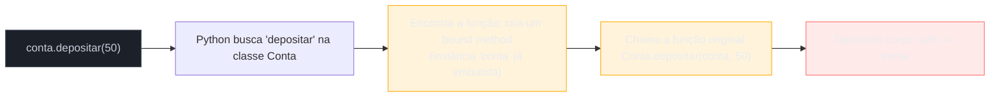
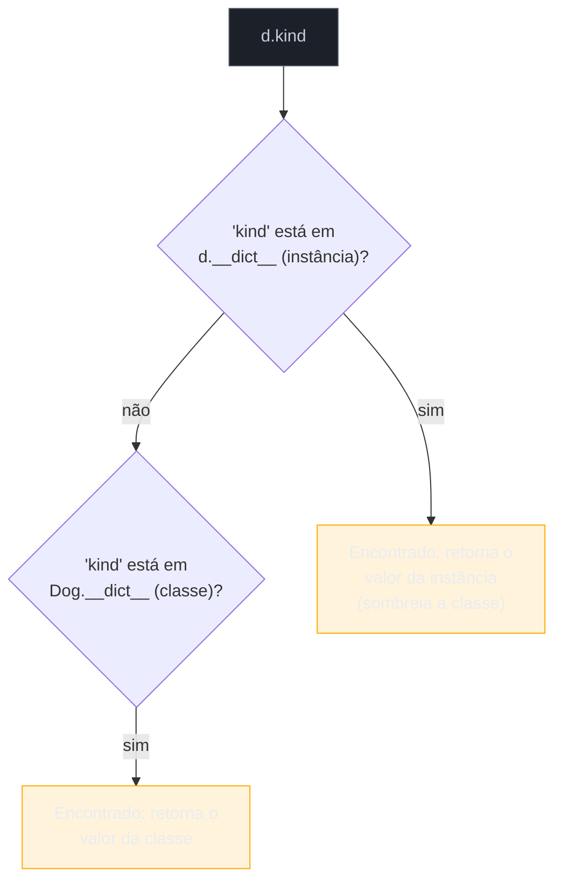
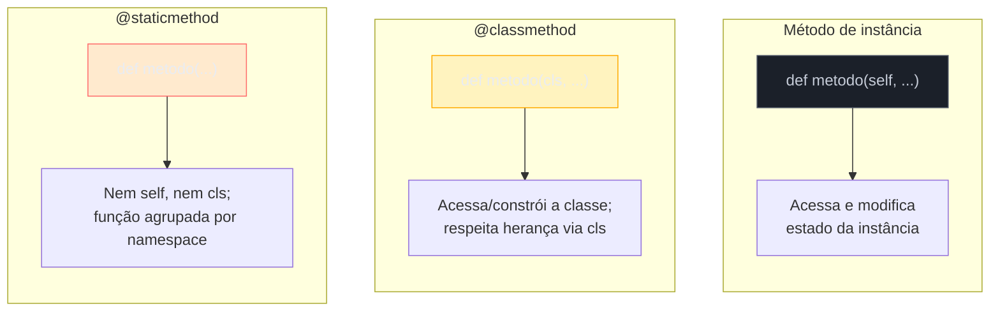

# Classes — definição, atributos e métodos

> [!abstract] TL;DR
> `class` cria um novo tipo; `self` é o **primeiro parâmetro explícito** de todo método de instância — não é palavra reservada, é convenção, mas o mecanismo por trás dela (o *binding* do método à instância) é real e não-opcional. `__init__` **inicializa** um objeto que já existe; o **construtor** de verdade é `__new__`, quase sempre invisível (aprofundado no Galho 8, metaclasses). A distinção mais perigosa deste tópico é **atributo de instância vs atributo de classe**: um atributo de classe mutável (`itens = []` dentro do corpo da classe, fora de `__init__`) é **compartilhado por todas as instâncias** — a mesma família de bug do argumento default mutável já visto no Core, só que travestida de "conveniência" na definição da classe. `@classmethod` (recebe `cls`) serve para *factory methods* alternativos; `@staticmethod` (não recebe nem `self` nem `cls`) serve para agrupar, dentro do namespace da classe, uma função utilitária que não precisa de estado nenhum.

## O bug que abre esta nota

Um carrinho de compras, modelado do jeito que pareceria natural pra quem vem de Java ou JavaScript — declarar o atributo `itens` "no topo da classe", como se fosse um campo de instância com valor inicial:

```python
class Carrinho:
    itens = []  # "valor inicial" do carrinho — ou é isso mesmo?

    def adicionar(self, produto):
        self.itens.append(produto)


carrinho_ana = Carrinho()
carrinho_bia = Carrinho()

carrinho_ana.adicionar("Livro")
carrinho_bia.adicionar("Caneta")

print(carrinho_ana.itens)  # ['Livro', 'Caneta']  ← Bia apareceu no carrinho da Ana!
print(carrinho_bia.itens)  # ['Livro', 'Caneta']  ← e vice-versa
```

Dois carrinhos, dois clientes, um item cada um — e os dois terminam com a lista completa dos dois. Não é um bug de lógica de negócio; é a consequência direta de onde `itens = []` foi declarado. `itens` foi escrito **no corpo da classe**, fora de qualquer método — e isso não cria "um valor inicial que cada instância copia", cria **um único objeto lista, vinculado à classe `Carrinho`**, que toda instância acessa através do mesmo caminho de busca de atributo. `self.itens.append(produto)` nunca cria uma lista nova por instância: ele encontra a lista da classe (porque nenhuma instância tem `itens` próprio) e faz `append` nela — a mesma lista, sempre.

Quem já leu a nota sobre [[03-Dominios/Tecnologia/Python/Core/02 - Tipos e variáveis|argumento default mutável]] do Core reconhece o formato do problema: um objeto mutável criado **uma vez** e reutilizado onde a intenção era "um novo objeto a cada vez". Lá, o gatilho era a avaliação única do valor default de uma função no momento da `def`. Aqui, o gatilho é a avaliação única do corpo da classe no momento do `class` — mas o mecanismo de fundo, e a solução, são estruturalmente os mesmos: **não usar um objeto mutável como valor "default" compartilhado; criar o objeto dentro de um lugar que executa por instância** (no caso das classes, dentro de `__init__`).

Esta nota cobre `class`, `self` (o porquê dele ser explícito e o que de fato acontece por trás), `__init__` como inicializador (com uma menção honesta ao verdadeiro construtor, `__new__`), a distinção entre atributos de instância e de classe — incluindo a correção completa do bug do carrinho — e os três tipos de método que uma classe Python pode declarar: de instância, `@classmethod` e `@staticmethod`.

## O que é

Uma **classe** em Python é um molde para criar objetos: define quais atributos e métodos as instâncias daquele tipo vão ter. A sintaxe mínima:

```python
class Produto:
    pass


p = Produto()
print(type(p))  # <class '__main__.Produto'>
```

`class Produto:` executa o corpo do bloco (mesmo que seja só `pass`) num namespace próprio e, ao final, cria um **objeto classe** — vinculado ao nome `Produto`, exatamente como `def` vincula um objeto função a um nome. Isso significa que, em Python, uma classe também é um objeto (instância de `type`, tema que o Galho 8 aprofunda) — pode ser passada como argumento, guardada numa variável, inspecionada em tempo de execução.

Uma classe com estado e comportamento reais:

```python
class Produto:
    def __init__(self, nome, preco):
        self.nome = nome
        self.preco = preco

    def aplicar_desconto(self, percentual):
        self.preco = self.preco - (self.preco * percentual)


caneta = Produto("Caneta", 5.0)
caneta.aplicar_desconto(0.1)
print(caneta.preco)  # 4.5
```

`__init__` roda automaticamente quando `Produto("Caneta", 5.0)` é chamado, recebendo a instância recém-criada como `self` e os demais argumentos posicionalmente. `self.nome = nome` e `self.preco = preco` criam **atributos de instância** — dados que pertencem só àquele objeto específico.

## Por que importa

Classes são a unidade central de organização de estado e comportamento em qualquer código Python orientado a objetos — de um `dataclass` simples a um modelo Django inteiro. Mas o modelo mental de "como uma classe funciona por baixo" em Python diverge de Java/C#/JS em pontos que geram bugs sutis e específicos se ignorados: `self` explícito não é frescura sintática, é reflexo direto de como o Python resolve `objeto.metodo()` (a explicação está na seção "Como funciona"); e a diferença entre atributo de instância e de classe é a fonte de uma das armadilhas mais reincidentes do dia a dia — o bug do carrinho compartilhado é real, aparece em código de produção, e a comunidade Python o documenta há tanto tempo que a [documentação oficial do tutorial de classes já usa exatamente essa armadilha](https://docs.python.org/3/tutorial/classes.html#class-and-instance-variables) (com um cachorro e seus truques, no lugar de um carrinho) como exemplo canônico.

Entender `@classmethod` e `@staticmethod` também importa além de "decorators a mais pra decorar": eles resolvem dois problemas de design recorrentes — como oferecer um jeito alternativo de construir um objeto (sem multiplicar `__init__`s, que Python não permite via overloading, como já visto no Core) e como agrupar, dentro do namespace de uma classe, uma função de apoio que logicamente pertence ali mas não precisa de estado nenhum.

## Como funciona

### `self`: por que Python exige o parâmetro explícito

Em Java, `this` é implícito — dentro de um método de instância, `this.saldo` e `saldo` (se não houver variável local com o mesmo nome) acessam o mesmo campo, e a linguagem cuida de injetar a referência ao objeto por baixo dos panos, invisível na assinatura do método. Python faz uma escolha de design diferente e deliberada: **a instância é passada como argumento comum, e o parâmetro que a recebe precisa aparecer explicitamente na assinatura** — por convenção universal, chamado `self`.

O mecanismo real é simples de demonstrar. Uma chamada de método via instância:

```python
class Conta:
    def __init__(self, saldo):
        self.saldo = saldo

    def depositar(self, valor):
        self.saldo += valor


conta = Conta(100)
conta.depositar(50)
```

`conta.depositar(50)` é, por baixo, **exatamente equivalente** a chamar a função definida na classe passando a instância como primeiro argumento:

```python
Conta.depositar(conta, 50)  # idêntico a conta.depositar(50)
```

Segundo o [tutorial oficial de classes do Python](https://docs.python.org/3/tutorial/classes.html#method-objects), quando se acessa `conta.depositar` (sem chamar), o Python não devolve a função "crua" — devolve um **método vinculado** (*bound method*): um objeto-wrapper que já guarda a instância e, ao ser chamado, insere essa instância automaticamente como primeiro argumento posicional na função original. É esse mecanismo de *binding* — não mágica de sintaxe — que faz `self` "aparecer" dentro do método sem que quem chama precise passá-lo manualmente.



Duas consequências práticas dessa explicitação:

1. **`self` não é palavra reservada.** A [documentação oficial é explícita sobre isso](https://docs.python.org/3/tutorial/classes.html#method-objects): *"the name self has absolutely no special meaning to Python"* — é só a primeira posição da assinatura, e qualquer método de instância recebe ali a instância que o chamou, não importa o nome escolhido. Trocar `self` por qualquer outro identificador (`this`, `instancia`, `eu`) funciona identicamente — mas quebra a convenção que 100% do código Python de terceiros, da stdlib e da comunidade segue, tornando o código instantaneamente menos legível para qualquer outro leitor.
2. **Chamar o método pela classe, sem instância, exige passar `self` manualmente** — é o que `Conta.depositar(conta, 50)` faz. Isso raramente aparece em código de aplicação, mas explica por que `self` precisa existir na assinatura: sem ele, não haveria onde a instância seria recebida quando o *binding* automático insere o primeiro argumento.

> [!question]- Se `self` é só convenção, por que nunca vejo código usando outro nome?
> Porque a PEP 8 (guia de estilo oficial) recomenda `self` como convenção firme para o primeiro parâmetro de métodos de instância, e ferramentas de lint/IDE (pylint, mypy, editores com autocomplete) assumem essa convenção para dar suporte inteligente — trocar o nome não quebra a execução, mas quebra expectativas de tooling e de leitura. É um dos raros casos em Python onde "convenção" é tratado quase como regra de sintaxe pela comunidade, mesmo não sendo imposta pelo interpretador.

### `__init__` inicializa; `__new__` constrói (introdução)

Um erro comum de quem aprende Python vindo de linguagens com "construtor" único é chamar `__init__` de "o construtor da classe". Tecnicamente, não é. Segundo a documentação e o próprio comportamento observável do interpretador, a criação de uma instância acontece em **duas etapas distintas**:

1. **`__new__(cls, ...)`** — o verdadeiro construtor. É um `@staticmethod` especial (implícito, não precisa do decorator) que recebe a classe (`cls`) e é responsável por **criar e devolver** o novo objeto — antes de qualquer atributo existir.
2. **`__init__(self, ...)`** — o inicializador. Recebe o objeto **já criado** por `__new__` (como `self`) e é responsável por **configurar seu estado inicial** — atribuir atributos, validar argumentos. Não devolve nada (na prática, devolver algo diferente de `None` de dentro de `__init__` levanta `TypeError`).

```python
class Produto:
    def __new__(cls, *args, **kwargs):
        print("1. __new__ cria o objeto")
        instancia = super().__new__(cls)
        return instancia

    def __init__(self, nome, preco):
        print("2. __init__ inicializa o objeto")
        self.nome = nome
        self.preco = preco


p = Produto("Caneta", 5.0)
# 1. __new__ cria o objeto
# 2. __init__ inicializa o objeto
```

`Produto("Caneta", 5.0)` primeiro chama `Produto.__new__(Produto, "Caneta", 5.0)` para obter uma instância vazia; em seguida, automaticamente, chama `instancia.__init__("Caneta", 5.0)` sobre o objeto recém-criado. Na esmagadora maioria do código Python de aplicação, `__new__` nunca é sobrescrito — a implementação padrão herdada de `object` já faz o trabalho de alocar o objeto, e só `__init__` é escrito. Sobrescrever `__new__` é necessário em casos específicos e relativamente raros: subclassificar um tipo imutável embutido (`str`, `int`, `tuple` — onde os atributos precisam existir *antes* de `__init__`, porque instâncias imutáveis não podem ser alteradas depois de criadas), implementar o padrão Singleton, ou controlar dinamicamente qual subclasse é de fato instanciada. O tratamento completo de `__new__`, junto com metaclasses (que controlam a própria criação de *classes*, um nível acima), fica para o [[03-Dominios/Tecnologia/Python/OO e Data Model/08 - Metaclasses — introdução|Galho 8]] — por ora, a ideia a fixar é: **`__init__` é inicializador, não construtor; `__new__` é o construtor real, quase sempre invisível.**

> [!question]- Por que a maioria dos tutoriais chama `__init__` de "construtor" mesmo assim?
> Porque, no dia a dia da imensa maioria do código Python, o efeito observável é indistinguível de um construtor: você escreve `Classe(args)`, uma instância nova aparece com os atributos configurados, e nunca precisa pensar em `__new__`. A distinção só importa na prática quando se subclassifica um tipo imutável ou se implementa um padrão de criação customizado — nesses casos, confundir os dois leva a bugs (por exemplo, tentar configurar em `__init__` um atributo que só pode ser definido em `__new__`, porque o objeto já é imutável quando `__init__` roda).

### Atributos de instância vs atributos de classe

Um **atributo de instância** é criado por atribuição a `self.algo` dentro de um método (tipicamente `__init__`) — cada instância tem sua própria cópia, independente das demais. Um **atributo de classe** é declarado diretamente no corpo da classe, no mesmo nível de indentação dos métodos — existe **uma única vez**, vinculado à classe, e é compartilhado por todas as instâncias que não tenham um atributo de instância com o mesmo nome sobrepondo-o.

```python
class Dog:
    kind = "canine"  # atributo de classe: um único valor, compartilhado

    def __init__(self, name):
        self.name = name  # atributo de instância: um valor por objeto


d = Dog("Fido")
e = Dog("Buddy")

print(d.kind, e.kind)   # canine canine — mesmo objeto string, os dois acessam
print(d.name, e.name)   # Fido Buddy — objetos distintos
```

Esse exemplo (adaptado do [tutorial oficial de classes](https://docs.python.org/3/tutorial/classes.html#class-and-instance-variables)) funciona sem surpresas porque `kind` é uma **string, imutável**: mesmo sendo compartilhada, nenhuma instância consegue *mutar* o valor que as outras enxergam — só consegue **reatribuir** `self.kind = "outro"`, o que cria um atributo de instância novo, sombreando (mas não alterando) o atributo de classe.

O mecanismo de busca por trás disso é a mesma cadeia usada para métodos: quando o Python resolve `objeto.atributo`, ele procura primeiro no **dicionário da instância** (`__dict__` do objeto); se não encontrar ali, sobe para o **dicionário da classe**; se ainda não encontrar, continua subindo pela cadeia de herança (MRO, tema do [[03-Dominios/Tecnologia/Python/OO e Data Model/02 - Herança e MRO|Galho 3, nota 02]]).



Essa mesma cadeia de busca é o motivo pelo qual **ler** um atributo de classe através de uma instância funciona sem drama (`d.kind` sobe e acha em `Dog`), mas **mutar via método** — quando o atributo é um objeto mutável — é onde a armadilha do início da nota se materializa.

> [!warning] Atributo de classe mutável é compartilhado por todas as instâncias — de propósito, não por acidente
> `itens = []` no corpo de uma classe cria **um objeto lista só**, vinculado à classe, no momento em que o `class` é executado — não "a cada instância criada". Todo `self.itens.append(x)` sobe a cadeia de busca (porque nenhuma instância tem `itens` próprio), encontra a lista da classe, e faz `append` **naquela mesma lista** que todas as outras instâncias também enxergam. É a mesma categoria de bug do [argumento default mutável](https://docs.python.org/3/reference/compound_stmts.html#function-definitions) do Core (nota 02 e nota 06): um objeto mutável criado uma vez só, num ponto de avaliação única (ali, a `def`; aqui, o corpo do `class`), reutilizado onde a intenção era "um novo objeto por chamada/instância". A regra de ouro é a mesma: **nunca declare uma lista, dicionário ou set diretamente no corpo da classe esperando que vire "valor inicial" por instância — crie o objeto mutável dentro de `__init__`, atribuído a `self`.**

Corrigindo o carrinho de compras da abertura:

```python
class Carrinho:
    def __init__(self):
        self.itens = []  # nova lista, criada a cada instância

    def adicionar(self, produto):
        self.itens.append(produto)


carrinho_ana = Carrinho()
carrinho_bia = Carrinho()

carrinho_ana.adicionar("Livro")
carrinho_bia.adicionar("Caneta")

print(carrinho_ana.itens)  # ['Livro']
print(carrinho_bia.itens)  # ['Caneta']
```

A diferença de uma linha (`itens = []` no corpo da classe vs `self.itens = []` dentro de `__init__`) muda completamente a semântica: no primeiro caso, o objeto lista é criado **uma vez**, quando a classe é definida; no segundo, `__init__` roda **uma vez por instância**, então cada `Carrinho()` recebe sua própria lista nova.

Quando um atributo de classe é **imutável** (número, string, tupla, `None`, booleano), o mesmo padrão de "valor default compartilhado" é inofensivo — não existe operação de mutação que uma instância possa fazer nele que vaze para as demais, porque qualquer "modificação" na prática cria um atributo de instância novo por reatribuição:

```python
class Configuracao:
    versao = "1.0"        # atributo de classe imutável — seguro compartilhar
    limite_padrao = 100    # idem

    def __init__(self, limite=None):
        self.limite = limite if limite is not None else self.limite_padrao
```

Atributos de classe também são o lugar certo para **constantes de fato compartilhadas** — valores que devem ser idênticos entre todas as instâncias por design, não por acidente: um multiplicador de taxa, um nome de espécie (`kind = "canine"` no exemplo do Dog), um contador de instâncias criadas (mutável, mas mutado de forma controlada, não pelo mesmo padrão do bug):

```python
class Usuario:
    total_criados = 0  # contador de classe — mutação controlada e intencional

    def __init__(self, nome):
        self.nome = nome
        Usuario.total_criados += 1  # reatribui via nome da classe, não via self


Usuario("Ana")
Usuario("Bia")
print(Usuario.total_criados)  # 2
```

Repare que `Usuario.total_criados += 1` usa o **nome da classe** explicitamente, não `self.total_criados += 1` — porque `self.total_criados += 1` seria lido como `self.total_criados = self.total_criados + 1`, que primeiro *lê* o valor (sobe a busca, acha em `Usuario`), mas depois *escreve* em `self` — criando um atributo de **instância** que sombreia o de classe a partir dali, exatamente o oposto do que se quer num contador global. É o mesmo tipo de armadilha do `UnboundLocalError` do Core (nota 06): atribuição e leitura têm caminhos de resolução diferentes, e confundir os dois gera bugs sutis.

> [!question]- Isso significa que devo evitar atributos de classe sempre que possível?
> Não — significa usá-los para o que eles são: **estado que deveria mesmo ser compartilhado entre todas as instâncias** (constantes, contadores globais, configuração default imutável). O problema nunca foi "atributo de classe" em si, foi usar um **objeto mutável** como se fosse um valor inicial exclusivo de cada instância. A [documentação oficial do Python](https://docs.python.org/3/tutorial/classes.html#class-and-instance-variables) resume a regra com o mesmo exemplo do cachorro e seus truques: *"class variables intended to be mutable should be avoided"* quando a intenção é um valor por instância.

### Métodos de instância

Um **método de instância** é uma função definida no corpo da classe cujo primeiro parâmetro é `self` — já visto nos exemplos anteriores (`depositar`, `adicionar`, `aplicar_desconto`). É o tipo de método mais comum: acessa e modifica o estado da instância específica que o chamou, via `self.atributo`.

```python
class Retangulo:
    def __init__(self, largura, altura):
        self.largura = largura
        self.altura = altura

    def area(self):
        return self.largura * self.altura

    def eh_quadrado(self):
        return self.largura == self.altura
```

Cada chamada — `retangulo.area()` — opera sobre os dados daquele `retangulo` específico, através do `self` que o *binding* automático injeta.

### `@classmethod`: métodos que operam na classe, não na instância

Um método decorado com `@classmethod` recebe, como primeiro parâmetro, **a classe** (por convenção, `cls`) em vez da instância. Isso significa que pode ser chamado tanto a partir da classe (`Classe.metodo()`) quanto a partir de uma instância (`instancia.metodo()`, que o Python resolve para a mesma classe por trás) — mas em nenhum dos dois casos ele tem acesso a `self`, porque não existe necessariamente uma instância envolvida.

```python
class Data:
    def __init__(self, dia, mes, ano):
        self.dia = dia
        self.mes = mes
        self.ano = ano

    def __repr__(self):
        return f"Data({self.dia}, {self.mes}, {self.ano})"

    @classmethod
    def de_string_iso(cls, texto):
        """Factory: cria uma Data a partir de uma string 'AAAA-MM-DD'."""
        ano, mes, dia = texto.split("-")
        return cls(int(dia), int(mes), int(ano))


d = Data.de_string_iso("2026-07-09")
print(d)  # Data(9, 7, 2026)
```

O uso mais comum e mais idiomático de `@classmethod` é exatamente esse: um **factory method alternativo** — um jeito diferente de construir uma instância, com uma assinatura de entrada diferente do `__init__` padrão. Como Python não tem overloading (a segunda `def __init__` simplesmente sobrescreveria a primeira, mesma regra já vista no Core), `@classmethod` é a ferramenta idiomática para oferecer múltiplos "modos de construção" sem sobrecarregar `__init__` com parâmetros opcionais e lógica condicional para decidir qual formato de entrada está sendo usado.

A própria biblioteca padrão usa esse padrão extensivamente: `dict.fromkeys(...)`, `datetime.fromtimestamp(...)`, `datetime.fromisoformat(...)` são todos `@classmethod`s — construtores alternativos nomeados, mais expressivos que um `__init__` genérico com flags.

Usar `cls` em vez de escrever `Data` diretamente dentro do corpo do método importa por um motivo concreto: **`cls` respeita herança**. Se uma subclasse `DataComHorario(Data)` herdar `de_string_iso` sem sobrescrevê-lo, `cls` dentro do método vai apontar para `DataComHorario`, não para `Data` — então `DataComHorario.de_string_iso(...)` devolve uma instância de `DataComHorario`, não de `Data`. Escrever `Data(int(dia), int(mes), int(ano))` (hardcoded) quebraria esse comportamento, sempre devolvendo `Data` mesmo quando chamado a partir da subclasse — um detalhe que só se paga na prática quando herança entra em cena, tema do [[03-Dominios/Tecnologia/Python/OO e Data Model/02 - Herança e MRO|próximo galho]].

### `@staticmethod`: nem `self`, nem `cls`

Um método decorado com `@staticmethod` não recebe nenhum parâmetro implícito — nem a instância, nem a classe. Na prática, é uma função comum que só "mora" dentro do namespace da classe por organização lógica:

```python
class Temperatura:
    def __init__(self, celsius):
        self.celsius = celsius

    @staticmethod
    def celsius_para_fahrenheit(graus_celsius):
        return (graus_celsius * 9 / 5) + 32

    def em_fahrenheit(self):
        return Temperatura.celsius_para_fahrenheit(self.celsius)


print(Temperatura.celsius_para_fahrenheit(0))    # 32.0
print(Temperatura.celsius_para_fahrenheit(100))  # 212.0

t = Temperatura(20)
print(t.em_fahrenheit())  # 68.0
```

`celsius_para_fahrenheit` não precisa de `self` (não lê nem escreve estado de nenhuma instância específica) nem de `cls` (não constrói nada nem acessa atributos de classe) — é pura transformação de um valor de entrada para um valor de saída. Poderia perfeitamente ser uma função solta no módulo (`def celsius_para_fahrenheit(graus): ...`); o ganho de declará-la como `@staticmethod` dentro de `Temperatura` é **organizacional e de namespace**: a função fica agrupada com o conceito ao qual pertence conceitualmente, acessível como `Temperatura.celsius_para_fahrenheit(...)` em vez de poluir o namespace do módulo com uma função solta, e o autocomplete de qualquer editor mostra `celsius_para_fahrenheit` como algo relacionado a `Temperatura` assim que se digita `Temperatura.`.

Segundo o material da [Real Python sobre os três tipos de método](https://realpython.com/instance-class-and-static-methods-demystified/), a orientação prática é: **use `@staticmethod` quando a lógica pertence conceitualmente à classe, mas não precisa nem de `self` nem de `cls` para funcionar** — é um sinal explícito, lido por qualquer desenvolvedor futuro (ou por ferramentas de lint), de que aquele método é isolado por design: não vai crescer para depender de estado de instância amanhã sem uma decisão consciente de removê-lo do `@staticmethod`. Quando a dúvida é "função solta no módulo ou `@staticmethod` na classe", a resposta costuma depender de quão fortemente a função está associada semanticamente àquele conceito — utilitários genéricos (formatação de string, cálculo matemático desacoplado) tendem a ficar melhor como função de módulo; utilitários que fazem sentido *apenas* no contexto daquela classe (validação de um formato específico do domínio, conversão ligada ao tipo) tendem a ganhar clareza como `@staticmethod`.

> [!question]- Por que não usar sempre `@classmethod` já que ele tem acesso a mais coisa (`cls`)?
> Porque `cls` sinaliza uma intenção diferente: "este método pode precisar construir ou inspecionar a classe" — e declarar `@classmethod` quando o método nunca usa `cls` é ruído, tanto para quem lê o código quanto para ferramentas de análise estática, que podem assumir (erroneamente) que o método participa de alguma lógica de herança/polimorfismo de classe. `@staticmethod` é o sinal mais preciso e honesto quando de fato não há necessidade de `self` nem de `cls` — a escolha do decorator é também documentação do contrato do método.

### Comparando os três tipos de método



| | Recebe | Chamado por | Uso típico |
|---|---|---|---|
| Método de instância | `self` (a instância) | `instancia.metodo()` | Ler/mutar estado de uma instância específica |
| `@classmethod` | `cls` (a classe) | `Classe.metodo()` ou `instancia.metodo()` | Factory methods alternativos; lógica ligada à classe, não à instância |
| `@staticmethod` | nada implícito | `Classe.metodo()` ou `instancia.metodo()` | Utilitário agrupado por namespace, sem depender de estado |

## Na prática

Juntando tudo — `__init__`, atributos de instância corretos, um `@classmethod` como factory alternativo e um `@staticmethod` de apoio — num exemplo mais completo:

```python
class Pedido:
    """Representa um pedido de compra com itens e status."""

    STATUS_VALIDOS = ("pendente", "pago", "enviado", "cancelado")  # atributo de classe imutável

    def __init__(self, cliente, status="pendente"):
        self.cliente = cliente
        self.itens = []          # atributo de instância mutável — criado por instância
        self._status = status

    @property
    def status(self):
        return self._status

    @classmethod
    def a_partir_de_carrinho(cls, cliente, carrinho):
        """Factory: cria um Pedido já populado a partir de um Carrinho."""
        pedido = cls(cliente)
        pedido.itens = list(carrinho.itens)  # copia — não compartilha a mesma lista
        return pedido

    @staticmethod
    def status_e_valido(status):
        return status in Pedido.STATUS_VALIDOS

    def adicionar_item(self, produto):
        self.itens.append(produto)

    def total_itens(self):
        return len(self.itens)


carrinho = Carrinho()
carrinho.adicionar("Livro")
carrinho.adicionar("Caneta")

pedido = Pedido.a_partir_de_carrinho("Ana", carrinho)
print(pedido.itens)                          # ['Livro', 'Caneta']
print(pedido.total_itens())                   # 2
print(Pedido.status_e_valido("pago"))         # True
print(Pedido.status_e_valido("enviado_hoje")) # False
```

(A sintaxe `@property` usada em `status` — para expor um atributo de leitura controlada sem chamar explicitamente um método — é assunto completo do [[03-Dominios/Tecnologia/Python/OO e Data Model/04 - Properties e encapsulamento|Galho 3, nota 04]]; aqui aparece só para mostrar como os elementos desta nota convivem num exemplo realista.)

`STATUS_VALIDOS` é um atributo de classe seguro (tupla, imutável) usado tanto por instâncias quanto pelo `@staticmethod` `status_e_valido`, que não precisa de nenhuma instância pra validar um status. `a_partir_de_carrinho` é o padrão de factory method: em vez de um segundo `__init__` (impossível em Python, como já visto) ou um `__init__` genérico com flag `a_partir_de_carrinho=None`, existe um construtor alternativo nomeado e explícito. E `self.itens = []` dentro de `__init__` garante que cada `Pedido` tem sua própria lista — o bug de abertura da nota, corrigido pela terceira vez nesta nota, em três formulações diferentes do mesmo princípio.

## Armadilhas

### (1) Atributo de classe mutável usado como "valor inicial" de instância

Já coberto em profundidade: `lista = []` no corpo da classe é compartilhado por todas as instâncias. Crie objetos mutáveis dentro de `__init__`, atribuídos a `self`.

### (2) Esquecer `self` na assinatura de um método

```python
class Contador:
    def incrementar():  # falta 'self'
        ...
```

Chamar `Contador().incrementar()` levanta `TypeError: incrementar() takes 0 positional arguments but 1 was given` — porque o *binding* automático sempre insere a instância como primeiro argumento posicional, e a assinatura sem `self` não tem onde recebê-la. É um dos erros mais comuns de quem está começando com classes, e a mensagem de erro (que menciona "1 was given" sem que o código pareça estar passando nada) costuma confundir até entender o mecanismo de binding.

### (3) Confundir `cls` com `self` dentro de um `@classmethod`

Dentro de um `@classmethod`, não existe `self` — só `cls`, que é a classe, não uma instância. Tentar `cls.algum_atributo_de_instancia` dentro de um `@classmethod` não funciona como esperado, porque não há instância nenhuma naquele contexto (a menos que o método esteja, ele mesmo, criando uma via `cls(...)`).

### (4) Usar `@staticmethod` quando o método na verdade precisa de `cls` ou `self`

Se um método declarado `@staticmethod` acaba precisando referenciar `NomeDaClasse.algo` diretamente (hardcoded) para funcionar, é sinal de que deveria ser `@classmethod` com `cls.algo` — a versão hardcoded quebra em subclasses, exatamente pelo motivo explicado na seção sobre `cls` e herança.

### (5) Reatribuir um atributo de classe via `self` esperando mutar o valor compartilhado

```python
class Usuario:
    total_criados = 0

    def __init__(self):
        self.total_criados += 1  # ERRO conceitual: cria atributo de instância, não incrementa o de classe
```

`self.total_criados += 1` lê o valor de classe (não achou na instância, subiu e achou em `Usuario`) mas **escreve** em `self` — criando, a partir daí, um atributo de instância `total_criados` que sombreia o da classe só para aquele objeto. O contador de classe nunca é de fato incrementado. A forma correta usa o nome da classe explicitamente: `Usuario.total_criados += 1`.

## Em entrevista

Perguntas previsíveis sobre este tópico:

- **"Por que `self` é explícito em Python, ao contrário de `this` em Java?"** Design deliberado: Python passa a instância como argumento comum, e o primeiro parâmetro da assinatura precisa recebê-la — não existe injeção implícita de contexto. `objeto.metodo(arg)` é açúcar sintático para `Classe.metodo(objeto, arg)`; o acesso via instância cria um *bound method* que já embute a instância como primeiro argumento.
- **"`self` é uma palavra reservada?"** Não — é convenção universal, sem significado especial para o interpretador. Trocar o nome funciona tecnicamente, mas quebra a legibilidade esperada por qualquer leitor familiarizado com Python.
- **"`__init__` é o construtor da classe?"** Tecnicamente não — é o **inicializador**. O construtor real é `__new__`, que cria e devolve o objeto antes de `__init__` configurá-lo. Na prática, a maioria do código nunca sobrescreve `__new__`; ele é relevante ao subclassificar tipos imutáveis ou implementar padrões como Singleton.
- **"Qual a diferença entre atributo de instância e atributo de classe?"** Atributo de instância é criado via `self.algo = valor` (tipicamente em `__init__`) e é exclusivo daquele objeto; atributo de classe é declarado no corpo da classe e é compartilhado por todas as instâncias que não o sombreiam. A busca de atributo procura primeiro no `__dict__` da instância, depois sobe para a classe.
- **"Explique o bug clássico do atributo de classe mutável."** Uma lista/dict/set declarado diretamente no corpo da classe é criado uma única vez, na definição da classe — não por instância. Toda instância que faz `self.lista.append(x)` está mutando o mesmo objeto compartilhado, porque nenhuma instância tem `lista` própria para sombrear o atributo de classe. É a mesma classe de bug do argumento default mutável em funções.
- **"Quando usar `@classmethod` em vez de `@staticmethod`?"** `@classmethod` quando o método precisa da classe em si — tipicamente para construir e devolver uma instância (factory method alternativo, respeitando herança via `cls`). `@staticmethod` quando o método não precisa nem de `self` nem de `cls` — é uma função utilitária agrupada por organização de namespace, não por necessidade de estado.
- **"Por que usar `cls` em vez do nome literal da classe dentro de um `@classmethod`?"** Porque `cls` respeita herança: se uma subclasse herdar o método sem sobrescrevê-lo, `cls` aponta para a subclasse, e o factory devolve uma instância do tipo correto. Hardcoded o nome da classe quebraria esse comportamento.

### How to explain in English

> In Python, `self` is explicit — every instance method's first parameter must receive the instance, unlike Java's implicit `this`. Calling `obj.method(arg)` is syntactic sugar for `Class.method(obj, arg)`: accessing a method through an instance creates a *bound method*, a wrapper that already has the instance baked in as the first argument. `self` isn't a reserved keyword, just a near-universal convention. `__init__` is technically the *initializer*, not the constructor — the real constructor is `__new__`, which creates and returns the object before `__init__` configures it; most application code never overrides `__new__`. The classic pitfall of this topic is a **mutable class attribute**: a list or dict declared directly in the class body (not inside `__init__`) is created exactly once, at class-definition time, and shared by every instance — the same underlying bug pattern as Python's mutable default argument trap, just wearing a different hat. The fix is the same: create mutable state inside `__init__`, bound to `self`, so each instance gets its own object. `@classmethod` receives the class (`cls`) instead of the instance and is mainly used for alternative constructors (factory methods) that respect inheritance, since `cls` points to whatever subclass actually called it. `@staticmethod` receives neither `self` nor `cls` — it's a plain function grouped inside the class namespace for organizational clarity, not because it needs any instance or class state.

| Termo PT | Termo EN |
|---|---|
| atributo de instância | instance attribute / instance variable |
| atributo de classe | class attribute / class variable |
| método vinculado | bound method |
| inicializador | initializer |
| construtor | constructor |
| método de fábrica / factory method | factory method |
| namespace da classe | class namespace |
| busca de atributo | attribute lookup |
| sombrear (um atributo) | to shadow (an attribute) |
| compartilhado entre instâncias | shared across instances |

## O que vem a seguir

Com classes, `self`, atributos e os três tipos de método estabelecidos, a próxima nota entra em **herança e MRO** (Method Resolution Order) — como uma classe estende outra, como `super()` funciona de verdade, e como Python decide, numa hierarquia com herança múltipla, qual implementação de um método vence. A [[03-Dominios/Tecnologia/Python/OO e Data Model/02 - Herança e MRO|nota 02]] retoma o mecanismo de busca de atributo apresentado aqui e estende para além de uma única classe.

## Veja também

- [[03-Dominios/Tecnologia/Python/Core/02 - Tipos e variáveis|Core, nota 02]] — a armadilha original do argumento default mutável, mesma família de bug do atributo de classe mutável
- [[03-Dominios/Tecnologia/Python/Core/06 - Funções — definição, argumentos e escopo básico|Core, nota 06]] — funções como objetos de primeira classe; ausência de overloading em Python
- [[03-Dominios/Tecnologia/Python/OO e Data Model/02 - Herança e MRO|02 — Herança e MRO]] — próxima nota do galho
- [[03-Dominios/Tecnologia/Python/OO e Data Model/04 - Properties e encapsulamento|04 — Properties e encapsulamento]] — `@property`, usada de relance nesta nota
- [[03-Dominios/Tecnologia/Python/OO e Data Model/08 - Metaclasses — introdução|08 — Metaclasses: introdução]] — `__new__` e a criação de classes em profundidade
- [[03-Dominios/Tecnologia/Python/OO e Data Model/index|OO e Data Model]] — MOC do galho
- [[03-Dominios/Tecnologia/Python/index|Trilha Python]]

## Fontes

- Python Software Foundation. *The Python Tutorial — 9. Classes*. docs.python.org, versão 3.14. https://docs.python.org/3/tutorial/classes.html (acessado em 2026-07-09)
- Python Software Foundation. *The Python Tutorial — 9.3.5. Class and Instance Variables*. docs.python.org. https://docs.python.org/3/tutorial/classes.html#class-and-instance-variables (acessado em 2026-07-09)
- Python Software Foundation. *The Python Tutorial — 9.4. Method Objects*. docs.python.org. https://docs.python.org/3/tutorial/classes.html#method-objects (acessado em 2026-07-09)
- Real Python. *Python's Instance, Class, and Static Methods Demystified*. https://realpython.com/instance-class-and-static-methods-demystified/ (acessado em 2026-07-09)
- Real Python. *Python Classes: The Power of Object-Oriented Programming*. https://realpython.com/python-classes/ (acessado em 2026-07-09)
- Ramalho, L. *Fluent Python*, 2ª ed. — Capítulo 9, "A Pythonic Object" (seção "classmethod Versus staticmethod", implementação de construtor alternativo via `@classmethod`). O'Reilly Media, 2022.
- GeeksforGeeks. *Python __init__ vs __new__*. https://www.geeksforgeeks.org/python/python-init-vs-new/ (acessado em 2026-07-09)
- PYnative. *Python Class Method vs. Static Method vs. Instance Method*. https://pynative.com/python-class-method-vs-static-method-vs-instance-method/ (acessado em 2026-07-09)

