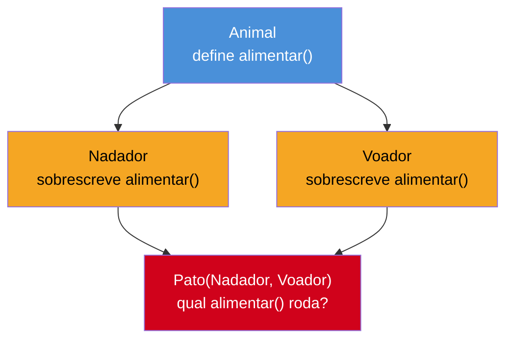

# Herança e MRO

> [!abstract] TL;DR
> Herança simples em Python (`class Cachorro(Animal)`) funciona como em qualquer linguagem OO. `super()` não é "chamar o método do pai" — é um proxy que delega para **a próxima classe na MRO** (Method Resolution Order), o que o torna seguro sob herança múltipla e refatoração, ao contrário de `Animal.__init__(self, ...)` explícito. A diferença que separa Python de Java aparece na herança múltipla real: Python permite `class C(A, B)` com duas classes-mãe concretas (Java só permite múltipla herança de *interfaces*), e isso reabre o **diamond problem** clássico — duas classes-mãe com um ancestral comum e um método de mesmo nome. Python resolve a ambiguidade com um algoritmo determinístico, o **C3 linearization**, que produz a MRO — visível via `Classe.__mro__` ou `Classe.mro()`. `isinstance()` (que respeita a hierarquia, inclusive múltipla) é preferível a `type(x) == Y` (que trava em igualdade exata de classe, ignorando subclasses). Herança múltipla saudável tem nome — **Mixin** — uma classe pequena, sem estado, que adiciona um comportamento pontual; profundidade real desse padrão fica pra nota 09.

## O bug que abre esta nota

Um time está modelando um sistema de notificações. Duas classes concretas — `Logavel` (registra a ação num log) e `Auditavel` (registra a ação numa trilha de auditoria com timestamp e usuário) — compartilham a mesma classe-mãe, `Registravel`, que define um método `registrar()` genérico. Cada uma sobrescreve `registrar()` à sua maneira:

```python
class Registravel:
    def registrar(self, evento):
        print(f"[Registravel] evento genérico: {evento}")


class Logavel(Registravel):
    def registrar(self, evento):
        print(f"[Logavel] logando: {evento}")


class Auditavel(Registravel):
    def registrar(self, evento):
        print(f"[Auditavel] auditando: {evento}")


class NotificacaoCritica(Logavel, Auditavel):
    pass


n = NotificacaoCritica()
n.registrar("pagamento processado")
```

Um desenvolvedor vindo de Java, onde isso simplesmente **não compilaria** (Java só permite herança múltipla de interfaces, nunca de duas classes concretas com implementação conflitante), espera um erro — ou, na falta de um, algum tipo de comportamento indefinido, talvez uma exceção em tempo de execução. Em vez disso, o código roda sem erro nenhum e imprime:

```
[Logavel] logando: pagamento processado
```

Nenhuma menção a `Auditavel`. Por quê `Logavel` "ganhou" e não `Auditavel`? A resposta não é aleatória, não depende da ordem em que os métodos foram definidos no arquivo, e não muda entre execuções — é o resultado de um **algoritmo determinístico** que Python roda toda vez que uma classe é criada, chamado **C3 linearization**, que produz uma sequência única de busca chamada **Method Resolution Order (MRO)**. Essa nota dissseca herança simples, o que `super()` realmente faz, por que herança múltipla é permitida (e perigosa) em Python, e como a MRO resolve — de forma previsível — o diamond problem que abriu esta seção.

## O que é

**Herança** é o mecanismo pelo qual uma classe (subclasse) reutiliza e especializa o comportamento de outra (superclasse). Em Python, a sintaxe é direta:

```python
class Animal:
    def __init__(self, nome):
        self.nome = nome

    def emitir_som(self):
        return "..."


class Cachorro(Animal):
    def emitir_som(self):
        return "Au au!"
```

`Cachorro` herda tudo de `Animal` — atributos, métodos — e pode **sobrescrever** (*override*) qualquer método, como `emitir_som()` acima. Até aqui, nenhuma surpresa para quem já programou em Java, C# ou qualquer linguagem OO clássica: herança simples funciona igual.

A diferença estrutural aparece na declaração da classe. Em Python, a lista entre parênteses depois do nome da classe pode ter **mais de um item**:

```python
class C(A, B):   # C herda de A E de B — ambas podem ser classes concretas
    pass
```

Isso é **herança múltipla real** — não herança de interfaces (como Java, com `implements`), mas herança de classes completas, com atributos, estado e implementação. Java, C#, e a maioria das linguagens estaticamente tipadas com herança de classe proíbem isso deliberadamente — um objeto só pode ter uma superclasse de implementação, ainda que possa implementar quantas interfaces quiser. Python não impõe essa restrição.

## Por que importa

Entender herança e MRO de verdade separa quem escreve Python "traduzindo mentalmente de Java" (herança simples só, sempre chamando `Classe.__init__(self, ...)` explicitamente) de quem entende o modelo de execução real da linguagem. Isso importa por três razões concretas:

1. **`super()` mal-entendido quebra sob refatoração.** Código que chama `Animal.__init__(self, ...)` diretamente (em vez de `super().__init__(...)`) funciona hoje, mas quebra silenciosamente assim que a hierarquia ganha uma classe intermediária ou vira herança múltipla — porque hardcoda um nome de classe específico em vez de seguir a cadeia dinâmica de resolução.
2. **Frameworks populares dependem de herança múltipla cooperativa.** `Django` (class-based views, `mixins.LoginRequiredMixin`), a biblioteca padrão (`socketserver.ThreadingMixIn`), e bibliotecas de teste (`unittest.TestCase` combinado com mixins customizados) só funcionam corretamente se `super()` for usado de forma disciplinada em toda a cadeia — um único `Classe.__init__(self)` explícito no meio de uma hierarquia com mixins quebra a cadeia de chamadas cooperativas.
3. **Debugar "por que esse método rodou e não aquele" exige entender a MRO.** Sem saber que Python computa uma ordem de busca linear e determinística, o comportamento de herança múltipla parece mágico ou arbitrário — como no bug de abertura desta nota.

## Como funciona

### `super()`: o que ele realmente faz

A armadilha mais comum é pensar em `super()` como "uma forma mais curta de chamar o método da classe-mãe". Não é isso. Segundo a [documentação oficial](https://docs.python.org/3/library/functions.html#super), `super()` devolve um **objeto proxy** que delega chamadas de método para **a próxima classe na Method Resolution Order (MRO)** — não necessariamente a "classe-mãe" no sentido ingênuo, e sim o próximo passo na cadeia de resolução calculada em tempo de execução.

Compare as duas formas de chamar o `__init__` da superclasse:

```python
class Cachorro(Animal):
    def __init__(self, nome, raca):
        Animal.__init__(self, nome)   # forma explícita — funciona, mas é frágil
        self.raca = raca


class Cachorro(Animal):
    def __init__(self, nome, raca):
        super().__init__(nome)        # forma idiomática — segue a MRO
        self.raca = raca
```

As duas produzem o mesmo resultado **neste caso específico** — herança simples, uma única superclasse. A diferença aparece em dois cenários:

1. **Refatoração da hierarquia.** Se `Animal` for renomeada, ou se uma classe intermediária for inserida entre `Cachorro` e `Animal` (`Cachorro(Mamifero)`, `Mamifero(Animal)`), o `Animal.__init__(self, ...)` explícito continua chamando `Animal` diretamente — pulando qualquer lógica que a nova classe intermediária tenha adicionado ao seu próprio `__init__`. `super().__init__(...)` continua correto automaticamente, porque segue a MRO recalculada, não um nome fixo.
2. **Herança múltipla cooperativa.** Se `Cachorro` também herdar de uma segunda classe (`class Cachorro(Animal, Rastreavel)`), `Animal.__init__(self, ...)` **nunca** chama o `__init__` de `Rastreavel` — ele não sabe que ela existe. `super().__init__(...)`, corretamente encadeado em toda a hierarquia, visita cada classe da MRO exatamente uma vez, na ordem certa.

Segundo o [artigo canônico de Raymond Hettinger](https://rhettinger.wordpress.com/2011/05/26/super-considered-super/) (autor original da implementação de `super()` no CPython), "the whole point of super() is to have cooperative multiple inheritance work — a use case that is unique to Python, not found in statically compiled languages or languages that only support single inheritance". A documentação oficial reforça: `super()` "makes it possible to implement 'diamond diagrams' where multiple base classes implement the same method" — desde que **toda** classe da hierarquia use `super()` de forma consistente, com a mesma assinatura de chamada em cada nível.

> [!warning] `super()` só funciona corretamente se TODA a hierarquia cooperar
> Um único `Classe.__init__(self)` explícito (em vez de `super().__init__()`) em qualquer ponto de uma hierarquia de herança múltipla quebra a cadeia — as classes depois dele na MRO simplesmente nunca são chamadas. Isso é chamado de "não-cooperativo": funciona isoladamente, mas quebra o contrato implícito que `super()` depende para funcionar em cadeia. A regra prática: numa hierarquia com múltiplas classes-mãe e mixins, **todo `__init__` (e todo método sobrescrito relevante) deve usar `super()`**, sem exceção — inclusive passando `**kwargs` adiante para acomodar assinaturas de classes que ainda nem existem (bibliotecas de terceiros que herdarão da sua classe no futuro).

### A forma de dois argumentos e o proxy

A forma "zero-argumento" — `super()` — só existe dentro de um corpo de método de classe; o compilador injeta implicitamente `type` (a classe onde o método está definido) e `object_or_type` (a instância `self`). A forma explícita de dois argumentos, `super(TipoAtual, instancia)`, é o que `super()` vira por baixo dos panos e ainda é útil quando é preciso especificar de onde a busca começa (por exemplo, ao delegar a partir de um ponto diferente da hierarquia):

```python
class C(B):
    def method(self, arg):
        super().method(arg)
        # equivalente a:
        super(C, self).method(arg)
```

Segundo a documentação, se a MRO de `object_or_type` é `D → B → C → A → object` e `type` é `B`, `super()` busca a partir de `C → A → object` — ou seja, **começa depois** da classe passada como `type`, e segue exatamente a MRO daquela instância, não uma cadeia fixa de heranças "declaradas".

### Herança múltipla: o que Python permite que Java não permite

Java só permite `extends` de **uma** classe; para reutilizar comportamento de múltiplas fontes, a única ferramenta é `implements` de várias **interfaces** (sem estado, até o Java 8; com métodos `default` a partir daí, mas ainda sem campos de instância). C# segue o mesmo modelo. Python não distingue "classe" de "interface" — qualquer classe pode aparecer na lista de herança, e uma subclasse pode combinar várias delas:

```python
class A:
    def cumprimentar(self):
        return "Olá de A"


class B:
    def cumprimentar(self):
        return "Olá de B"


class C(A, B):
    pass


c = C()
print(c.cumprimentar())   # "Olá de A" — por quê A e não B?
```

A resposta não é "porque `A` foi declarada primeiro, por coincidência" — é porque a **ordem de declaração na lista de herança é o primeiro critério que a MRO respeita**, formalizado pelo algoritmo que a próxima seção detalha.

### O diamond problem, formalizado

O cenário clássico: duas classes (`B`, `C`) herdam de uma base comum (`A`); uma quarta classe (`D`) herda de ambas `B` e `C`. Visualmente, forma um losango — daí o nome:



Em linguagens que proíbem herança múltipla de classes concretas (Java, C#), esse diagrama simplesmente **não pode ser desenhado** — o compilador rejeita `class Pato extends Nadador, Voador`. Em C++, que permite (com `virtual inheritance` como paliativo), o diamond problem é uma fonte histórica de bugs e complexidade. Python permite o diagrama, mas resolve a ambiguidade de forma **determinística e visível**: chamar `Pato().alimentar()` sempre produz o mesmo resultado, e esse resultado pode ser consultado antes mesmo de rodar o código, inspecionando a MRO da classe.

### C3 linearization: o algoritmo por trás da MRO

Desde o Python 2.3, a linguagem usa o algoritmo **C3 linearization** (originado na pesquisa sobre a linguagem Dylan, não inventado pela equipe do Python) para computar a MRO de qualquer hierarquia de classes — incluindo herança múltipla arbitrariamente complexa. Segundo o [guia oficial sobre MRO](https://docs.python.org/3/howto/mro.html) (docs.python.org), a linearização de uma classe `C` com bases `B1, ..., BN` é definida recursivamente:

```
L[C(B1 ... BN)] = C + merge(L[B1], ..., L[BN], [B1, ..., BN])
```

Ou seja: a MRO de `C` é `C` seguida da **fusão** (`merge`) das MROs de cada uma das suas bases, mais a lista das próprias bases na ordem declarada. O algoritmo de `merge` funciona assim, segundo a documentação: "pegue a cabeça (primeiro elemento) da primeira lista; se esse elemento não aparecer no **corpo** (qualquer posição além da cabeça) de nenhuma outra lista, remova-o de todas as listas e adicione-o à linearização resultante; senão, tente a cabeça da próxima lista. Repita até todas as listas esvaziarem."

Duas propriedades que o C3 garante, formalizadas na mesma documentação:

- **Ordem de precedência local**: a ordem das classes-mãe, exatamente como foram escritas na declaração (`class C(B1, B2)`), é preservada na MRO resultante — `B1` sempre aparece antes de `B2`.
- **Monotonicidade**: se uma classe `X` aparece antes de `Y` na MRO de `C`, essa relação (`X` antes de `Y`) se mantém em **qualquer subclasse** de `C` também. Isso é o que garante que herdar de uma classe não "embaralha" retroativamente a ordem de resolução que ela já tinha.

Quando o algoritmo encontra uma ordem impossível de satisfazer — bases declaradas em ordens conflitantes entre si —, ele **falha explicitamente** com `TypeError`, em vez de silenciosamente escolher uma ordem arbitrária:

```python
class X: pass
class Y: pass

class A(X, Y): pass
class B(Y, X): pass    # ordem invertida em relação a A

class Z(A, B): pass    # TypeError: Cannot create a consistent MRO
```

> [!question]- Por que Python prefere falhar ruidosamente a "adivinhar" uma ordem razoável?
> Porque qualquer ordem escolhida arbitrariamente seria surpreendente para um dos dois lados da hierarquia — `A` declarou `(X, Y)`, `B` declarou `(Y, X)`; honrar a ordem de `A` desonra a de `B` e vice-versa. Um `TypeError` explícito em tempo de definição da classe (não em tempo de chamada de método, que seria pior — o bug só apareceria quando aquele método específico fosse invocado) força quem está desenhando a hierarquia a resolver a ambiguidade de propósito, em vez de deixar Python decidir por trás das cortinas.

### Vendo a MRO na prática: `__mro__` e `mro()`

Toda classe em Python carrega sua MRO computada como um atributo consultável — `Classe.__mro__` (tupla) ou `Classe.mro()` (lista, método equivalente). Voltando ao bug de abertura:

```python
class Registravel:
    def registrar(self, evento):
        print(f"[Registravel] evento genérico: {evento}")


class Logavel(Registravel):
    def registrar(self, evento):
        print(f"[Logavel] logando: {evento}")


class Auditavel(Registravel):
    def registrar(self, evento):
        print(f"[Auditavel] auditando: {evento}")


class NotificacaoCritica(Logavel, Auditavel):
    pass


print(NotificacaoCritica.__mro__)
# (<class '__main__.NotificacaoCritica'>, <class '__main__.Logavel'>,
#  <class '__main__.Auditavel'>, <class '__main__.Registravel'>,
#  <class 'object'>)

print(NotificacaoCritica.mro())
# [NotificacaoCritica, Logavel, Auditavel, Registravel, object] — mesma coisa, como lista
```


A MRO explica o resultado do bug de abertura sem margem para dúvida: `NotificacaoCritica().registrar(...)` busca `registrar` seguindo essa sequência exata — encontra em `Logavel` (o segundo item, logo depois da própria classe) e **para ali**, nunca chegando a `Auditavel`. Não é sorte, não é ordem de definição no arquivo — é a ordem declarada em `class NotificacaoCritica(Logavel, Auditavel)`, propagada pelo C3 linearization.

Se a intenção fosse combinar **os dois** comportamentos (logar E auditar), a solução correta usa `super()` cooperativamente em cada classe, não a ordem de herança para "escolher um vencedor":

```python
class Logavel(Registravel):
    def registrar(self, evento):
        print(f"[Logavel] logando: {evento}")
        super().registrar(evento)   # continua a cadeia — chama o próximo na MRO


class Auditavel(Registravel):
    def registrar(self, evento):
        print(f"[Auditavel] auditando: {evento}")
        super().registrar(evento)


class NotificacaoCritica(Logavel, Auditavel):
    pass


NotificacaoCritica().registrar("pagamento processado")
# [Logavel] logando: pagamento processado
# [Auditavel] auditando: pagamento processado
# [Registravel] evento genérico: pagamento processado
```

Agora **todas as três** classes executam, na ordem da MRO, porque cada uma delega ao próximo elo da cadeia via `super()` em vez de simplesmente terminar sua própria execução. Isso é herança múltipla **cooperativa** — o padrão que frameworks como Django exploram extensivamente em suas class-based views.

> [!question]- `super().registrar(evento)` dentro de `Logavel` chama `Auditavel`, mas `Logavel` nem sabe que `Auditavel` existe. Como isso funciona?
> Justamente porque `super()` não resolve "a classe-mãe de `Logavel`" (que seria só `Registravel`, olhando a declaração isolada de `Logavel`) — resolve "a próxima classe na MRO **da instância que está rodando**". Quando `NotificacaoCritica` é criada combinando `Logavel` e `Auditavel`, a MRO calculada para *aquela classe específica* insere `Auditavel` entre `Logavel` e `Registravel`. `Logavel`, escrita de forma genérica e cooperativa, nem precisa saber sobre `Auditavel` — ela delega "para quem quer que seja o próximo", e a resposta depende de qual subclasse concreta está em uso. Essa é a citação central da documentação oficial: o comportamento de `super()` "adapta-se a mudanças na hierarquia de classes" e "pode incluir classes irmãs desconhecidas antes do tempo de execução".

### `isinstance()` e `issubclass()`: por que preferir a checagem de hierarquia

Duas funções built-in verificam relação de tipo em tempo de execução:

```python
isinstance(objeto, Classe)      # objeto é instância de Classe OU de qualquer subclasse dela?
issubclass(SubClasse, Classe)   # SubClasse é Classe ou herda (direta ou indiretamente) dela?
```

A alternativa tentadora, `type(objeto) == Classe`, parece equivalente à primeira vista — mas **não é**. `type()` devolve o tipo **exato** do objeto; `isinstance()` percorre toda a MRO daquele objeto, checando se `Classe` aparece em qualquer ponto da cadeia:

```python
class Animal:
    pass


class Cachorro(Animal):
    pass


rex = Cachorro()

isinstance(rex, Animal)      # True — Cachorro é subclasse de Animal
type(rex) == Animal          # False — o tipo EXATO de rex é Cachorro, não Animal
type(rex) == Cachorro        # True — mas essa checagem trava em "exatamente esta classe"
```

Um código que checa `type(x) == Animal` quebra silenciosamente assim que alguém introduz uma subclasse de `Animal` — mesmo que essa subclasse seja um `Animal` legítimo para todos os efeitos práticos, o `==` de tipo exato a rejeita. `isinstance()` respeita **polimorfismo**: qualquer subclasse é aceita como o tipo da superclasse, que é exatamente o comportamento esperado em código orientado a objetos. `isinstance()` também aceita uma **tupla de tipos**, útil para checar "é um dentre vários" numa única chamada:

```python
isinstance(valor, (int, float))   # True se valor for int OU float
```

`issubclass()` faz o equivalente para relações entre classes (não instâncias) — útil em código que trabalha com as próprias classes como valores, por exemplo em fábricas ou registries de plugins.

> [!warning] `type(x) == Y` também falha com herança múltipla e MRO
> Além de quebrar sob subclasses simples, `type(x) == Y` ignora completamente a MRO — não faz sentido perguntar "o tipo exato de `x` é igual a `Y`" quando `x` pode ser instância de uma classe que combina `Y` com outras via herança múltipla. `isinstance(x, Y)`, por percorrer a MRO inteira, responde corretamente mesmo em hierarquias complexas com Mixins. A forma correta de checar tipo exato (quando isso é de fato a intenção, o que é raro) é `type(x) is Y` — usando `is` em vez de `==`, já que classes são objetos únicos e comparação de identidade é semanticamente mais precisa e mais rápida que comparação de igualdade para esse caso.

### Mixins: o uso saudável de herança múltipla

A `NotificacaoCritica(Logavel, Auditavel)` do exemplo anterior já é, informalmente, um exemplo de **Mixin** — uma classe pequena, geralmente sem `__init__` próprio ou estado significativo, que existe exclusivamente para ser combinada (via herança múltipla) com outras classes, adicionando um comportamento pontual e reutilizável. A convenção de nomenclatura (não imposta pela linguagem, só uma prática comum) sufixa o nome com `Mixin`: `LoginRequiredMixin`, `ThreadingMixIn`.

Exemplos reais na biblioteca padrão e em frameworks populares: `socketserver.ThreadingMixIn` (adiciona suporte a threads a um servidor de rede, combinado com `TCPServer` ou `UDPServer`); Django class-based views combinam `ListView`, `LoginRequiredMixin`, `PermissionRequiredMixin` livremente para compor comportamento de autenticação, paginação e permissões numa única view, sem duplicar código entre views diferentes.

A regra prática que distingue um Mixin saudável de um diamond problem acidental: um Mixin bem desenhado **não assume nada sobre a classe com quem será combinado**, delega tudo relevante via `super()` (cooperativamente), e — na maioria dos casos — não guarda estado próprio, só comportamento. Quando uma hierarquia de herança múltipla vira mais que "um punhado de Mixins simples combinados com uma classe base", geralmente é sinal de que **composição** (montar um objeto a partir de outros objetos, em vez de herdar de vários) seria um modelo mais claro — o assunto central da [[09 - Composição vs herança|nota 09]], que fecha este galho.

## Na prática

Um exemplo mais completo, combinando herança simples com `super()`, e depois estendendo para herança múltipla cooperativa via Mixin — o cenário mais comum no dia a dia de código Python real:

```python
class Veiculo:
    def __init__(self, placa, ano):
        self.placa = placa
        self.ano = ano

    def descricao(self):
        return f"Veículo {self.placa}, ano {self.ano}"


class VeiculoEletrico(Veiculo):
    def __init__(self, placa, ano, capacidade_bateria_kwh):
        super().__init__(placa, ano)   # delega a inicialização comum
        self.capacidade_bateria_kwh = capacidade_bateria_kwh

    def descricao(self):
        base = super().descricao()     # reaproveita a descrição da superclasse
        return f"{base}, bateria de {self.capacidade_bateria_kwh}kWh"


class LogAoInicializarMixin:
    """Mixin: registra em log toda vez que um objeto é criado.
    Não assume nada sobre a classe-irmã com quem será combinado."""

    def __init__(self, *args, **kwargs):
        print(f"[LOG] Inicializando {type(self).__name__}...")
        super().__init__(*args, **kwargs)   # repassa adiante, cooperativamente


class VeiculoEletricoAuditado(LogAoInicializarMixin, VeiculoEletrico):
    pass


v = VeiculoEletricoAuditado("ABC-1234", 2026, 75)
# [LOG] Inicializando VeiculoEletricoAuditado...
print(v.descricao())
# Veículo ABC-1234, ano 2026, bateria de 75kWh

print(VeiculoEletricoAuditado.__mro__)
# (VeiculoEletricoAuditado, LogAoInicializarMixin, VeiculoEletrico, Veiculo, object)
```

Note que `LogAoInicializarMixin` precisa vir **antes** de `VeiculoEletrico` na declaração (`class VeiculoEletricoAuditado(LogAoInicializarMixin, VeiculoEletrico)`) para que seu `__init__` seja o primeiro a rodar na MRO — se a ordem fosse invertida, `VeiculoEletrico.__init__` rodaria primeiro e o `LogAoInicializarMixin.__init__` nunca seria alcançado (porque `VeiculoEletrico.__init__` não termina com `super().__init__(...)` cooperativo genérico — ele já sabe explicitamente que chama `Veiculo.__init__` via `super()`, mas não repassa `*args, **kwargs` arbitrários). Esse detalhe — a **ordem de declaração dos Mixins importa, e importa muito** — é uma das armadilhas mais comuns de quem começa a usar Mixins.

## Armadilhas

### (1) Chamar a superclasse diretamente em vez de usar `super()`

```python
class Cachorro(Animal):
    def __init__(self, nome):
        Animal.__init__(self, nome)   # frágil — quebra sob refatoração e herança múltipla
```

Prefira sempre `super().__init__(nome)`, salvo em casos raros onde é preciso pular deliberadamente um nível da hierarquia (uso avançado, incomum).

### (2) Assumir que a ordem de herança "não importa muito"

```python
class A(LogMixin, VeiculoBase): pass   # LogMixin roda primeiro
class B(VeiculoBase, LogMixin): pass   # VeiculoBase roda primeiro — pode quebrar o mixin
```

A ordem das classes-mãe define a MRO, e a MRO define literalmente qual método roda quando há ambiguidade. Mixins que dependem de rodar **antes** da classe base (para interceptar/decorar comportamento) precisam vir primeiro na lista de herança.

### (3) Misturar `super()` cooperativo com `Classe.__init__` explícito na mesma hierarquia

Um único elo não-cooperativo quebra a cadeia inteira — as classes que viriam depois dele na MRO nunca são alcançadas, mesmo que estejam corretamente implementadas com `super()`.

### (4) Herança múltipla profunda sem necessidade real

Hierarquias com 3+ níveis de herança múltipla combinando classes com estado (não Mixins simples) tendem a ficar difíceis de raciocinar — a MRO ainda é determinística, mas "determinística" não é o mesmo que "óbvia de ler". Quando isso acontece, vale perguntar se composição resolveria o mesmo problema com menos acoplamento (nota 09).

### (5) Confundir `type(x) == Y` com checagem de tipo "segura"

Como visto acima, `type(x) == Y` ignora tanto herança simples quanto múltipla — quebra silenciosamente assim que uma subclasse legítima aparece. `isinstance()` é a escolha correta na esmagadora maioria dos casos.

## Em entrevista

Perguntas previsíveis sobre este tópico:

- **"O que `super()` realmente faz? É o mesmo que chamar `ClasseMae.metodo(self, ...)`?"** Não. `super()` devolve um proxy que delega para a **próxima classe na MRO** daquela instância — não necessariamente "a classe-mãe". Em herança simples, na maioria dos casos o resultado é indistinguível de chamar a classe-mãe diretamente; a diferença aparece sob refatoração (inserir uma classe intermediária) e sob herança múltipla, onde `super()` segue a cadeia cooperativa completa e a chamada explícita não.
- **"Por que Python permite herança múltipla de classes concretas e Java não?"** É uma decisão de design deliberada de cada linguagem. Java restringe herança múltipla a interfaces para evitar ambiguidade de estado e de implementação conflitante (o diamond problem clássico). Python permite herança múltipla completa e resolve a ambiguidade em tempo de definição da classe, via um algoritmo determinístico (C3 linearization) que produz a MRO — o preço é que quem desenha a hierarquia precisa entender a MRO para prever o comportamento.
- **"O que é o diamond problem e como Python resolve?"** É a ambiguidade que surge quando duas classes-mãe de uma subclasse compartilham um ancestral comum e ambas sobrescrevem o mesmo método — qual versão roda? Python resolve computando uma ordem linear e determinística de busca (a MRO), via C3 linearization, respeitando a ordem declarada das classes-mãe e garantindo monotonicidade (a ordem não muda arbitrariamente em subclasses).
- **"Como você inspeciona a MRO de uma classe?"** `Classe.__mro__` (tupla) ou `Classe.mro()` (lista, método equivalente) — ambos mostram a ordem exata de busca que `super()` e a resolução normal de atributos seguem.
- **"Qual a diferença entre `isinstance(x, Y)` e `type(x) == Y`?"** `isinstance()` percorre a MRO inteira do objeto, retornando `True` se `Y` aparecer em qualquer ponto da cadeia de herança — respeita polimorfismo e subclasses. `type(x) == Y` checa o tipo **exato**, ignorando herança; quebra assim que uma subclasse legítima é introduzida. `isinstance()` é a escolha idiomática na quase totalidade dos casos.
- **"O que é um Mixin?"** Um padrão (não uma feature de linguagem) de herança múltipla saudável: uma classe pequena, tipicamente sem estado próprio, que adiciona um comportamento pontual e reutilizável quando combinada com outra classe via herança. Bem desenhado, não assume nada sobre a classe-irmã, delega via `super()` cooperativamente, e é nomeado por convenção com o sufixo `Mixin`.
- **"O que acontece se a MRO não puder ser calculada de forma consistente?"** Python levanta `TypeError` em tempo de **definição** da classe (não em tempo de chamada de método) — o algoritmo C3 detecta a ordem conflitante entre bases e recusa criar uma hierarquia ambígua, em vez de escolher uma ordem arbitrária.

### How to explain in English

> Simple inheritance in Python works like in any OO language. `super()` is often misunderstood as "a shortcut for calling the parent's method" — it isn't. It returns a proxy object that delegates to the **next class in the Method Resolution Order (MRO)**, which is what makes it safe under refactoring and, crucially, under multiple inheritance — unlike calling `ParentClass.__init__(self, ...)` explicitly, which hardcodes a specific class and breaks the cooperative chain. The real divergence from Java shows up in multiple inheritance: Python allows `class C(A, B)` with two concrete parent classes (Java only allows multiple inheritance of interfaces), which reopens the classic diamond problem — two parent classes sharing a common ancestor, both overriding the same method. Python resolves the ambiguity deterministically via the **C3 linearization** algorithm, producing the MRO, inspectable through `Class.__mro__` or `Class.mro()`. `isinstance()` walks the full MRO and respects subclassing; `type(x) == Y` checks exact type only and silently breaks the moment a legitimate subclass appears — prefer `isinstance()` in virtually every case. Healthy multiple inheritance has a name: **Mixins** — small, typically stateless classes designed to be combined via multiple inheritance, cooperatively delegating through `super()`, adding one focused behavior at a time.

| Termo PT | Termo EN |
|---|---|
| herança simples | single inheritance |
| herança múltipla | multiple inheritance |
| classe-mãe / superclasse | parent class / superclass |
| subclasse | subclass |
| sobrescrever (um método) | to override (a method) |
| ordem de resolução de métodos | Method Resolution Order (MRO) |
| linearização C3 | C3 linearization |
| problema do diamante | diamond problem |
| herança múltipla cooperativa | cooperative multiple inheritance |
| mixin | mixin |
| checagem de tipo | type check |
| polimorfismo | polymorphism |

## O que vem a seguir

Com herança e MRO estabelecidas, a próxima nota mergulha no coração filosófico de Python: o [[03 - O Data Model — dunder methods essenciais|Data Model]] — os métodos "dunder" (`__eq__`, `__len__`, `__iter__`, `__repr__`...) que fazem uma classe se comportar como um tipo nativo da linguagem, sem herdar de interface nenhuma.

## Veja também

- [[01 - Classes — definição, atributos e métodos|01 — Classes: definição, atributos e métodos]] — base de sintaxe de classe usada nesta nota
- [[03 - O Data Model — dunder methods essenciais|03 — O Data Model]] — próxima nota do galho
- [[09 - Composição vs herança|09 — Composição vs herança]] — capstone: quando herança múltipla profunda é sinal de que composição resolveria melhor
- [[03-Dominios/Tecnologia/Python/OO e Data Model/index|OO e Data Model]] — MOC do galho
- [[03-Dominios/Tecnologia/Python/index|Trilha Python]]

## Fontes

- Python Software Foundation. *Built-in Functions — super()*. docs.python.org, versão 3.14. https://docs.python.org/3/library/functions.html#super (acessado em 2026-07-09)
- Python Software Foundation. *The Python 2.3 Method Resolution Order*. docs.python.org. https://docs.python.org/3/howto/mro.html (acessado em 2026-07-09)
- Python.org. *The Python 2.3 Method Resolution Order* (documento histórico original, C3 linearization). https://www.python.org/download/releases/2.3/mro/ (acessado em 2026-07-09)
- Hettinger, R. *Python's super() considered super!*. Deep Thoughts by Raymond Hettinger. https://rhettinger.wordpress.com/2011/05/26/super-considered-super/ (acessado em 2026-07-09)
- Real Python. *Supercharge Your Classes With Python super()*. https://realpython.com/python-super/ (acessado em 2026-07-09)
- Real Python. *What Are Mixin Classes in Python?*. https://realpython.com/python-mixin/ (acessado em 2026-07-09)
- Switowski, S. *type() vs. isinstance()*. https://switowski.com/blog/type-vs-isinstance/ (acessado em 2026-07-09)
- Ramalho, L. *Fluent Python*, 2ª ed. — Capítulos sobre herança múltipla e o Data Model. O'Reilly Media.
