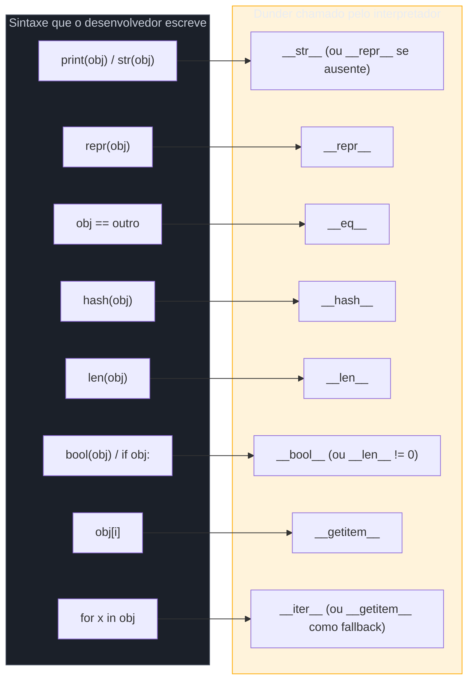
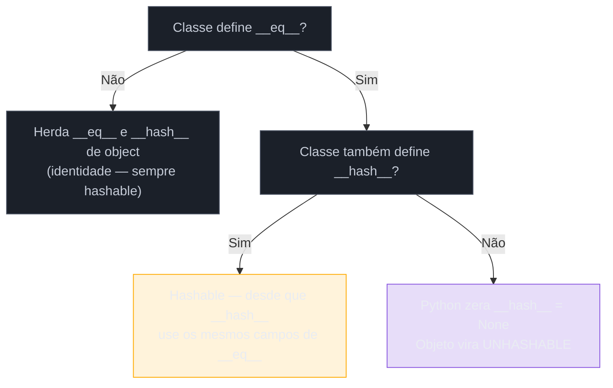
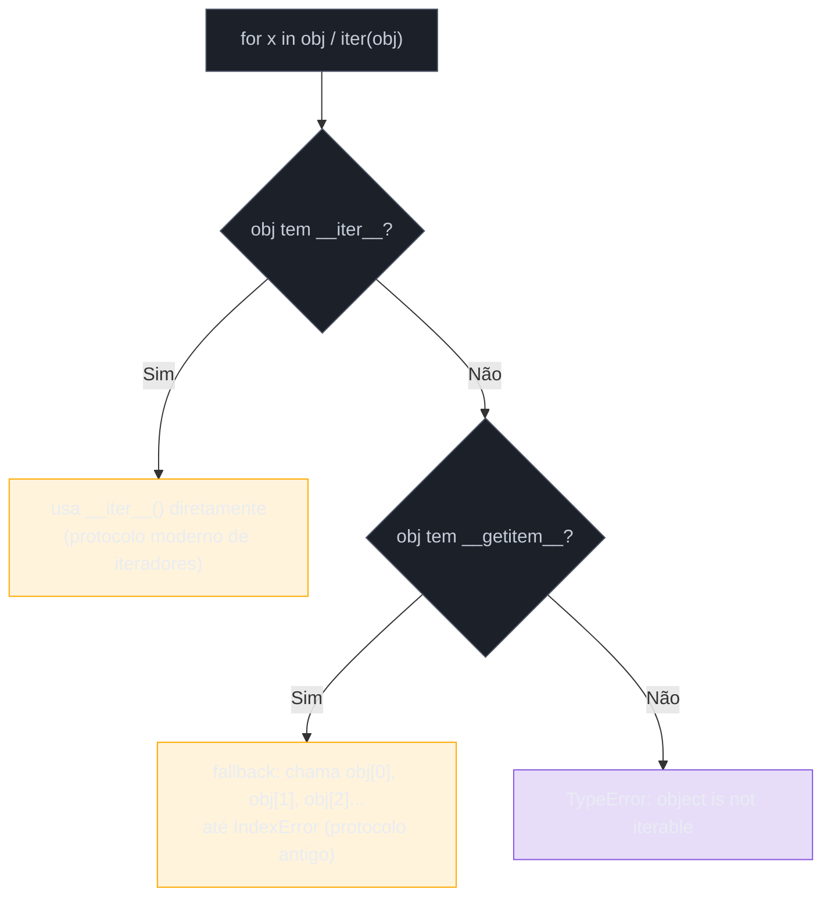

# O Data Model — dunder methods essenciais

> [!abstract] TL;DR
> Python não tem uma interface especial "Iterável" ou "Comparável" que uma classe precise implementar (herdando de algo) para participar da linguagem — tem um **protocolo**: um conjunto de métodos com nome reservado (`__repr__`, `__eq__`, `__len__`, `__getitem__`, `__iter__`...) que, se a classe os implementar, fazem o interpretador tratar aquele objeto como nativo. `repr(obj)` chama `__repr__` (representação para o **desenvolvedor**, idealmente reconstruível); `str(obj)` chama `__str__` — e, se este não existir, **cai de volta em `__repr__`** (nunca o contrário). `==` chama `__eq__`; `hash(obj)` chama `__hash__`, e as duas seguem um contrato obrigatório: **objetos iguais devem ter o mesmo hash** — por isso Python **desliga automaticamente** o hash (`__hash__ = None`) de qualquer classe que define `__eq__` sem definir `__hash__` junto, tornando-a inutilizável em `set`/`dict`. `len(obj)` chama `__len__`; `bool(obj)` chama `__bool__` — e, na ausência dele, cai para `__len__() != 0`. `obj[i]` chama `__getitem__`; `for x in obj` chama `__iter__` — e, na ausência deste, o interpretador tenta um fallback via `__getitem__(0)`, `__getitem__(1)`... até um `IndexError`. Este é o capítulo mais citado de *Python Fluente* (Ramalho): a ideia de que "pythônico" significa seguir o protocolo, não herdar de uma classe base especial.

## O bug que abre esta nota

Um desenvolvedor está construindo um pequeno sistema de tags para um catálogo de produtos. Cada tag é um objeto simples — um nome e uma cor — e ele quer usar um `set` para eliminar tags duplicadas automaticamente:

```python
class Tag:
    def __init__(self, nome, cor):
        self.nome = nome
        self.cor = cor

    def __eq__(self, outro):
        if not isinstance(outro, Tag):
            return NotImplemented
        return self.nome == outro.nome and self.cor == outro.cor


tag_a = Tag("promoção", "vermelho")
tag_b = Tag("promoção", "vermelho")

print(tag_a == tag_b)  # True — a igualdade funciona, como esperado

tags = {tag_a, tag_b}  # deveria colapsar em 1 item, já que são "iguais"
```

A última linha explode:

```
Traceback (most recent call last):
  File "tags.py", line 15, in <module>
    tags = {tag_a, tag_b}
            ^^^^^^^^^^^^^
TypeError: unhashable type: 'Tag'
```

O desenvolvedor implementou `__eq__` — `tag_a == tag_b` retorna `True`, exatamente como esperava — mas o Python se recusa a colocar essas instâncias num `set`. Não é bug do interpretador: é uma consequência **deliberada** de como o Data Model conecta igualdade e hashabilidade. Ao mesmo tempo, se ele tentasse depurar o problema imprimindo o objeto —

```python
print(tag_a)
```

```
<__main__.Tag object at 0x7f8e2c1a3d90>
```

— o `print` também não ajuda em nada: mostra o endereço de memória do objeto, não seu conteúdo. Dois sintomas diferentes, uma causa comum: a classe `Tag` não segue o **Data Model** — o protocolo de métodos com nome reservado que o interpretador consulta sempre que alguma operação de linguagem (`print`, `==`, `hash`, `in`, `for`, `[]`, `len`) é aplicada a um objeto. Esta nota dissseca os dunders essenciais desse protocolo — e explica por que resolver os dois sintomas acima exige entender a filosofia por trás deles, não só decorar a sintaxe.

## O que é

**Data Model** é o nome que a própria [documentação oficial do Python](https://docs.python.org/3/reference/datamodel.html) dá ao conjunto de regras que descreve como objetos, valores e tipos funcionam por baixo da sintaxe da linguagem. A peça central desse modelo é o conceito de **método especial** (ou *dunder method* — "double underscore", `__nome__`): um método com nome reservado que o interpretador chama automaticamente em resposta a uma operação de sintaxe, nunca sendo (na prática) chamado diretamente pelo código de aplicação. `obj + outro` não chama `obj.somar(outro)` — chama `obj.__add__(outro)`. `for x in obj` não pergunta se `obj` "é iterável" checando algum tipo — chama `iter(obj)`, que por sua vez chama `obj.__iter__()`.

A documentação chama o conjunto de dunders necessários para emular um determinado comportamento de tipo nativo de **protocolo**: "o conjunto de métodos que definem funcionalidade" de um papel específico (ser sequência, ser comparável, ser um número). Não existe uma classe base `Iterable` obrigatória para "ser iterável" em termos de **comportamento** — existe o protocolo de iteração (`__iter__`/`__next__`, ou o fallback via `__getitem__`), e qualquer classe que o implementar *é* iterável, ponto. (O módulo `collections.abc` oferece classes abstratas como `Iterable` que servem para *registrar* e *checar* esse comportamento formalmente com `isinstance()` — assunto da [[06 - ABC e Protocol — tipagem estrutural|nota 06]] — mas a checagem em tempo de execução, feita pelo interpretador quando o `for` roda, não passa por herança nenhuma.)



## Por que importa

Esse desenho não é um detalhe de implementação — é a explicação de por que Python é frequentemente descrito como uma linguagem "consistente": `len()` funciona igual em string, lista, dict, `set` e num objeto customizado seu porque **todos implementam o mesmo protocolo**, não porque compartilham uma superclasse. O mesmo vale para `in`, `for`, `[]`, `==`, `print()`. Isso é o oposto de linguagens onde "ser iterável" significa `implements Iterable<T>` — um contrato de tipo, checado em tempo de compilação, que amarra a classe a uma hierarquia. Em Python, o contrato é **comportamental**: a classe *é* o que ela *faz*, não o que ela declara herdar. Essa ideia — conhecida como **duck typing** ("se anda como pato e faz quack como pato, é um pato") — é a mesma filosofia por trás do EAFP visto na [[03-Dominios/Tecnologia/Python/Core/08 - Erros e exceções|nota 08 do Core]]: Python prefere que um objeto simplesmente *tente* se comportar como o esperado (e falhe explicitamente se não conseguir) a exigir uma declaração formal de "eu prometo que sou X" antes de deixar o código rodar.

A consequência prática é que **qualquer classe sua pode ganhar comportamento de tipo nativo** sem herdar de nada especial — só implementando os dunders certos. É por isso que o capítulo 1 de *Python Fluente* (Ramalho), dedicado inteiramente a esse tema, é hoje um dos trechos mais citados do livro: ele constrói uma classe `FrenchDeck` (um baralho de cartas) implementando só `__len__` e `__getitem__`, e mostra que essa classe, de graça, ganha `len()`, indexação `baralho[0]`, fatiamento `baralho[:3]`, iteração com `for`, o operador `in`, e até compatibilidade com `random.choice()` da biblioteca padrão — sem herdar de `list`, sem implementar `Iterable`, sem registrar nada. É esse "efeito de rede" que faz entender o Data Model valer o investimento: uma vez que a classe fala o protocolo certo, ela se encaixa em toda a linguagem de graça.

Vale contrastar explicitamente com o modelo de outras linguagens para quem chega de lá. Em Java, "ser iterável" significa implementar a interface `Iterable<T>` — uma declaração explícita, checada em tempo de compilação, que amarra a classe a um contrato nomeado (`implements Iterable<Carta>`). O compilador recusa código que tente usar `for` num objeto sem essa declaração, mesmo que ele já tenha um método `iterator()` funcionalmente idêntico. Em Python, não existe essa checagem estrutural em tempo de "compilação" (o interpretador nem checa tipos antes de rodar): o `for` simplesmente tenta chamar `__iter__`, e se o método existir e se comportar direito, funciona — não importa se a classe "declarou a intenção" de ser iterável ou não. Essa é a distinção entre **tipagem nominal** (o que a classe *diz* que é, via `implements`/`extends`) e **tipagem estrutural** (o que a classe *faz*, via forma/comportamento) — o Data Model é a manifestação mais profunda da segunda opção dentro da própria sintaxe da linguagem, não só uma conveniência de biblioteca. (A [[06 - ABC e Protocol — tipagem estrutural|nota 06]] retoma essa distinção formalmente, com `typing.Protocol` — a forma de o sistema de tipos moderno de Python *declarar* tipagem estrutural sem abrir mão dela.)

## Como funciona

### `__repr__` vs `__str__`: para quem cada um fala

A distinção real entre os dois não é "um é mais bonito que o outro" — é **audiência**. Segundo a [documentação oficial](https://docs.python.org/3/reference/datamodel.html#object.__repr__), `__repr__` deve devolver uma representação "oficial" do objeto, que, se possível, seja uma expressão Python válida que poderia recriar um objeto com o mesmo valor (`eval(repr(x)) == x` quando viável); `__str__`, segundo a mesma referência, é usado por `str()` e implicitamente por `print()` e `format()` para produzir uma representação "informal" e legível — voltada ao **usuário final**, não ao programador depurando o sistema.

| | `__repr__` | `__str__` |
|---|---|---|
| Público-alvo | desenvolvedor (debugging, logs, REPL) | usuário final (interface, relatório) |
| Objetivo | inequívoco — idealmente reconstrói o objeto | legível — prioriza clareza sobre precisão |
| Chamado por | `repr(x)`, REPL interativo, dentro de listas/dicts ao imprimir | `str(x)`, `print(x)`, `f"{x}"` |
| Se ausente | Python usa o `object.__repr__` padrão (`<Classe object at 0xADDR>`) | **cai de volta em `__repr__`** |
| Obrigatório? | sim, praticamente sempre — é o mínimo de higiene de uma classe | opcional — só quando há diferença real do `__repr__` |

O ponto mais frequentemente esquecido — e o que resolve o segundo sintoma do exemplo de abertura — é o **fallback**: se uma classe define `__repr__` mas não `__str__`, `print(obj)` e `str(obj)` usam `__repr__` automaticamente. O caminho inverso **não existe** — definir só `__str__` não dá a você um `__repr__` melhor; sobra o padrão feio `<__main__.Tag object at 0x...>` sempre que algo chamar `repr()` diretamente (por exemplo, ao inspecionar uma lista de tags no REPL, que sempre usa `repr()` em cada elemento, nunca `str()`). Por isso a [Real Python](https://realpython.com/python-repr-vs-str/) recomenda **sempre** implementar `__repr__`, mesmo que `__str__` nunca seja necessário — é o piso mínimo de "não deixar o objeto mudo".

```python
class Tag:
    def __init__(self, nome, cor):
        self.nome = nome
        self.cor = cor

    def __repr__(self):
        # Formato pensado pro desenvolvedor: reconstrói o objeto quase literalmente
        return f"Tag(nome={self.nome!r}, cor={self.cor!r})"

    def __str__(self):
        # Formato pensado pro usuário final: mais legível, menos técnico
        return f"#{self.nome}"


tag = Tag("promoção", "vermelho")

print(repr(tag))   # Tag(nome='promoção', cor='vermelho')  — devolvedor
print(str(tag))    # #promoção                              — usuário
print(tag)          # #promoção  — print() usa str()
print([tag])        # [Tag(nome='promoção', cor='vermelho')]  — lista sempre usa repr() nos itens
```

Repare no `!r` dentro do f-string em `__repr__`: ele força `repr()` no valor interpolado (em vez do `str()` padrão do f-string), garantindo que `'promoção'` apareça entre aspas — detalhe que mantém a saída próxima de uma expressão Python válida, coerente com a convenção `eval(repr(x)) == x`.

> [!question]- Por que uma lista de objetos usa `repr()` em cada item, mesmo quando eu dou `print()` na lista?
> Porque a representação de uma coleção precisa ser **inequívoca** sobre o que ela contém — misturar formatos "amigáveis" de `__str__` dentro de uma lista tornaria a saída ambígua (uma string dentro de uma lista de strings ficaria indistinguível de um elemento formatado à mão). O Python resolve isso com uma regra simples e consistente: **containers sempre chamam `repr()` nos elementos**, nunca `str()` — é por isso que `print([tag])` mostra `Tag(nome=..., cor=...)` mesmo que `tag` tenha um `__str__` bonito e amigável definido.

### `__eq__` e `__hash__`: o contrato que o exemplo de abertura quebrou

`==` não é comparação de identidade (isso é `is`) — por padrão, `object.__eq__` **é** identidade (`a == b` só é `True` se `a is b`). Definir `__eq__` numa classe substitui esse comportamento por igualdade **de valor**: dois objetos diferentes na memória, mas com os mesmos dados relevantes, passam a comparar `True`.

```python
class Tag:
    def __init__(self, nome, cor):
        self.nome = nome
        self.cor = cor

    def __eq__(self, outro):
        if not isinstance(outro, Tag):
            return NotImplemented  # não sabe comparar com esse tipo — deixa o Python decidir
        return self.nome == outro.nome and self.cor == outro.cor
```

(`NotImplemented` — não confundir com a exceção `NotImplementedError` — é o valor de sentinela correto para devolver quando a comparação não faz sentido para o tipo recebido; o Python então tenta `outro.__eq__(self)` antes de desistir e cair para `False`.)

Até aqui, tudo funciona. O problema aparece quando esse mesmo objeto tenta entrar num `set` ou virar chave de `dict` — operações que exigem que o objeto seja **hashable**, isto é, que `hash(obj)` produza um inteiro estável usado para localizar o "balde" (bucket) onde o objeto vive dentro da tabela hash interna dessas estruturas.

> [!warning] Definir `__eq__` sem `__hash__` torna o objeto **unhashable** — de propósito
> O contrato de hashabilidade do Python (documentado em [`object.__hash__`](https://docs.python.org/3/reference/datamodel.html#object.__hash__)) exige: **se `a == b`, então `hash(a) == hash(b)`**. É uma regra de consistência, não uma sugestão — um `set`/`dict` usa o hash pra decidir *onde procurar* o objeto e só depois confirma com `==`; se dois objetos iguais tivessem hashes diferentes, o `set` procuraria no bucket errado e nunca encontraria a "duplicata", quebrando silenciosamente a garantia de unicidade que é a própria razão de existir do `set`.
>
> O `object` base fornece um `__hash__` padrão baseado no `id()` do objeto (identidade de memória) — que é **incompatível** com uma igualdade de valor customizada (dois objetos de valores iguais, mas endereços de memória diferentes, teriam hashes diferentes por esse `__hash__` padrão, violando o contrato). Por isso, quando uma classe define `__eq__` e **não** define `__hash__`, o Python **desliga automaticamente** a hashabilidade daquela classe, fazendo `__hash__` apontar para `None` — não por bug, mas como salvaguarda deliberada contra a violação silenciosa do contrato. É exatamente esse mecanismo que produz o `TypeError: unhashable type: 'Tag'` do exemplo de abertura.
>
> A correção é implementar `__hash__` usando **os mesmos atributos** usados em `__eq__` (tipicamente hasheando uma tupla deles, já que tuplas de valores hashable são, elas mesmas, hashable):
> ```python
> class Tag:
>     def __init__(self, nome, cor):
>         self.nome = nome
>         self.cor = cor
>
>     def __eq__(self, outro):
>         if not isinstance(outro, Tag):
>             return NotImplemented
>         return self.nome == outro.nome and self.cor == outro.cor
>
>     def __hash__(self):
>         return hash((self.nome, self.cor))   # mesmos campos usados em __eq__
>
>
> tags = {Tag("promoção", "vermelho"), Tag("promoção", "vermelho")}
> print(len(tags))  # 1 — agora colapsa corretamente
> ```



Há também a direção oposta da regra, menos discutida mas igualmente importante: objetos que participam de igualdade de valor **deveriam ser imutáveis** — se um objeto muda depois de já estar dentro de um `set`, seu hash muda, mas o `set` não reindexa; o objeto fica "perdido" no bucket errado, efetivamente inacessível por busca, mesmo continuando fisicamente dentro da coleção. Por isso classes que implementam `__eq__` customizado e pretendem ser usadas em `set`/`dict` geralmente também tratam seus campos relevantes como somente-leitura após a construção (padrão que a [[05 - Dataclasses|nota 05, sobre `frozen=True`]], formaliza).

> [!question]- E se eu quiser um objeto mutável, com `__eq__` de valor, mas que nunca precisa ir num `set`?
> Nesse caso é legítimo definir `__eq__` e explicitamente marcar `__hash__ = None` (redundante com o comportamento automático, mas documenta a intenção), ou simplesmente aceitar o `TypeError` que o Python já dá de graça. O padrão perigoso não é "objeto mutável e não-hashable" — é achar que um objeto mutável com `__eq__` customizado *deveria* funcionar em `set`/`dict` e implementar um `__hash__` ingênuo baseado em campos que mudam, criando bugs de "sumiço" silencioso em vez de um erro explícito.

### `__len__` e `__bool__`: a ponte com truthiness

`len(obj)` chama `obj.__len__()`, que deve devolver um inteiro não-negativo. `bool(obj)` chama `obj.__bool__()` — mas, se a classe **não** define `__bool__`, o Python cai para `__len__() != 0`: um objeto sem itens (`len() == 0`) é considerado *falsy*; com pelo menos um item, *truthy*. Se nem `__bool__` nem `__len__` existirem, o objeto é sempre *truthy* — o comportamento padrão de `object`.

Essa cadeia de fallback é a mesma força que já apareceu no [[03-Dominios/Tecnologia/Python/Core/03 - Operadores e expressões|galho Core, sobre truthiness]]: `if lista:` funciona porque `list.__bool__` (indiretamente via `__len__`) devolve `False` para lista vazia — e a mesma regra vale, de graça, para qualquer classe própria que implemente `__len__`:

```python
class Carrinho:
    def __init__(self):
        self.itens = []

    def adicionar(self, item):
        self.itens.append(item)

    def __len__(self):
        return len(self.itens)


carrinho = Carrinho()

if carrinho:                    # chama __bool__ -> ausente -> cai para __len__() != 0
    print("Carrinho tem itens")
else:
    print("Carrinho vazio")     # imprime isso: len(carrinho) é 0, então bool(carrinho) é False

carrinho.adicionar("livro")
if carrinho:
    print("Carrinho tem itens")  # agora imprime isso
```

Definir `__bool__` explicitamente faz sentido quando "vazio" e "falsy" **não** deveriam significar a mesma coisa — por exemplo, um objeto de conexão de rede pode ter `len()` sem sentido algum, mas ainda assim precisar responder `True`/`False` para "está conectado?" via `__bool__` dedicado, sem qualquer relação com contagem de itens.

### `__getitem__` e `__iter__`: indexável e iterável sem herdar de nada

Esta é a dupla que Ramalho usa para o exemplo canônico do capítulo 1 de *Python Fluente*: a classe `FrenchDeck`, um baralho de 52 cartas, implementada com apenas dois dunders:

```python
import collections

Carta = collections.namedtuple("Carta", ["valor", "naipe"])


class BaralhoFrances:
    valores = [str(n) for n in range(2, 11)] + list("JQKA")
    naipes = "espadas ouros paus copas".split()

    def __init__(self):
        self._cartas = [
            Carta(valor, naipe)
            for naipe in self.naipes
            for valor in self.valores
        ]

    def __len__(self):
        return len(self._cartas)

    def __getitem__(self, posicao):
        return self._cartas[posicao]
```

Sem herdar de `list`, sem implementar `Iterable` ou `Sequence`, sem registrar nada em nenhum lugar, `BaralhoFrances` ganha, de graça:

```python
baralho = BaralhoFrances()

len(baralho)              # 52 — via __len__
baralho[0]                 # Carta(valor='2', naipe='espadas') — via __getitem__
baralho[-1]                 # última carta — __getitem__ delega pra self._cartas[-1], que já suporta índice negativo
baralho[12:13]              # fatiamento também funciona — delegado ao slicing de list

from random import choice
choice(baralho)             # random.choice funciona: só precisa de __len__ + __getitem__

for carta in baralho:       # for funciona!
    ...

Carta('Q', 'copas') in baralho   # in também funciona — varre item a item via __getitem__
```

O segredo por trás do `for` e do `in` funcionarem sem `__iter__`: o Python tem um **fallback de compatibilidade**. Se `iter(obj)` não encontra `__iter__`, mas encontra `__getitem__`, ele constrói um iterador que chama `obj[0]`, `obj[1]`, `obj[2]`... incrementando o índice até receber um `IndexError`, que interpreta como "fim da sequência". É esse mesmo mecanismo — parte do que a documentação chama de "protocolo de sequência antigo", preservado por retrocompatibilidade desde antes do protocolo moderno de iteradores (`__iter__`/`__next__`) existir — que faz o `BaralhoFrances` acima ser iterável sem uma única linha de `__iter__`.



Esse fallback é útil para entender código legado — e explica por que classes antigas em bibliotecas Python funcionam com `for` mesmo sem `__iter__` visível — mas **não é recomendado** para código novo: ele é, nas palavras usadas pela comunidade, "um hack" de compatibilidade. Uma classe que pretende ser genuinamente iterável (não só "acidentalmente iterável" por ter `__getitem__`) deveria implementar `__iter__` explicitamente — sinaliza intenção, funciona com `iter()` chamado diretamente em contextos onde o fallback via índice não se aplica (iteradores infinitos, por exemplo, não têm "índice"), e evita o [[04 - Properties e encapsulamento|acoplamento involuntário]] entre "ser indexável" e "ser iterável", que às vezes precisam divergir.

O caso oposto também vale registrar: uma classe pode implementar `__iter__` sem implementar `__getitem__` — perfeitamente iterável (`for x in obj` funciona), mas **não indexável** (`obj[0]` levanta `TypeError`). Os dois protocolos são independentes; o `BaralhoFrances` só parece "ambos de graça" porque `__getitem__`, sozinho, já cobre os dois.

> [!question]- Por que não implementar `__iter__` desde o início, já que ele é o jeito "certo"?
> No exemplo do livro, a decisão é didática — Ramalho quer mostrar exatamente esse fallback como uma curiosidade do Data Model antes de aprofundar o protocolo moderno de iteradores (`__iter__`/`__next__`, geradores) no capítulo seguinte, assunto que este vault cobre no [[03-Dominios/Tecnologia/Python/Funcional e idiomas avançados/index|Galho 4]]. Em código de produção, a resposta prática é: se a classe **já é**, naturalmente, uma sequência indexável (tem posições numeradas, suporta slicing), `__getitem__` sozinho é suficiente e idiomático — é exatamente o que o protocolo de sequência (`Sequence`) espera. Se a classe representa algo que só faz sentido percorrer (sem noção de "posição 5"), `__iter__` explícito é a escolha certa, e tentar forçar um `__getitem__` artificial só para ganhar iteração de graça é o antipadrão.

### `__getitem__` recebe mais do que inteiros: o parâmetro `slice`

O `baralho[12:13]` do exemplo acima "funciona de graça" porque `self._cartas[posicao]` já é uma lista, e listas sabem lidar com fatiamento nativamente — mas vale entender **o que** o Python de fato passa para `__getitem__` quando o código usa a sintaxe `obj[a:b:c]`. A resposta é: um objeto `slice`, com atributos `.start`, `.stop` e `.step`, não três argumentos separados. `obj[3]` chama `__getitem__(3)`; `obj[1:4]` chama `__getitem__(slice(1, 4, None))`; `obj[::2]` chama `__getitem__(slice(None, None, 2))`. Uma classe que só delega para uma lista interna (como o `BaralhoFrances`) recebe esse tratamento de graça, porque `list.__getitem__` já sabe interpretar `slice`. Uma classe que armazena os dados de outra forma (não numa lista/tupla interna) precisa checar o tipo recebido explicitamente:

```python
class SequenciaCustomizada:
    def __init__(self, dados):
        self._dados = list(dados)

    def __len__(self):
        return len(self._dados)

    def __getitem__(self, chave):
        if isinstance(chave, slice):
            # fatiamento: devolve uma NOVA instância da própria classe,
            # não uma lista solta — mantém o tipo do resultado consistente
            return SequenciaCustomizada(self._dados[chave])
        if isinstance(chave, int):
            return self._dados[chave]
        raise TypeError(f"índice deve ser int ou slice, recebeu {type(chave).__name__}")

    def __repr__(self):
        return f"SequenciaCustomizada({self._dados!r})"


seq = SequenciaCustomizada([10, 20, 30, 40, 50])
print(seq[1])        # 20              -- __getitem__(1), int
print(seq[1:3])        # SequenciaCustomizada([20, 30]) -- __getitem__(slice(1, 3, None))
```

A [documentação oficial](https://docs.python.org/3/reference/datamodel.html#object.__getitem__) recomenda explicitamente que, quando `__getitem__` recebe um `slice`, o resultado devolvido seja **do mesmo tipo** da sequência original sempre que fizer sentido — devolver uma lista "crua" a partir de uma fatia de um objeto customizado quebra a expectativa de quem encadeia operações (`obj[1:3][0]` deveria continuar se comportando como `obj`, não "degradar" silenciosamente para `list`).

## Na prática: uma classe que reúne os dunders essenciais

Um exemplo mais completo — um `Vetor2D`, no espírito do segundo capítulo de *Python Fluente* (dedicado a estender o Data Model com sobrecarga de operadores) — juntando `__repr__`, `__eq__`/`__hash__`, `__len__`/`__bool__` e `__getitem__`/`__iter__` numa única classe coesa:

```python
import math


class Vetor2D:
    def __init__(self, x, y):
        self.x = float(x)
        self.y = float(y)

    def __repr__(self):
        return f"Vetor2D({self.x!r}, {self.y!r})"

    def __str__(self):
        return f"({self.x}, {self.y})"

    def __eq__(self, outro):
        if not isinstance(outro, Vetor2D):
            return NotImplemented
        return (self.x, self.y) == (outro.x, outro.y)

    def __hash__(self):
        return hash((self.x, self.y))

    def __len__(self):
        return 2  # sempre 2 componentes — x e y

    def __bool__(self):
        # um vetor "vazio" é o vetor zero, não um vetor sem componentes
        return bool(abs(self))

    def __getitem__(self, indice):
        return (self.x, self.y)[indice]

    def __iter__(self):
        return iter((self.x, self.y))

    def __abs__(self):
        return math.hypot(self.x, self.y)


v1 = Vetor2D(3, 4)
v2 = Vetor2D(3, 4)
v3 = Vetor2D(0, 0)

print(v1)                    # (3.0, 4.0)              -- __str__
print(repr(v1))               # Vetor2D(3.0, 4.0)       -- __repr__
print(v1 == v2)                # True                   -- __eq__ (valor, não identidade)
print(v1 is v2)                # False                  -- identidades diferentes
print({v1, v2})                # {Vetor2D(3.0, 4.0)} — colapsa em 1: __hash__ consistente com __eq__
print(len(v1))                  # 2                      -- __len__
print(bool(v1), bool(v3))        # True False             -- __bool__ (vetor zero é falsy)
print(v1[0], v1[1])               # 3.0 4.0                -- __getitem__
x, y = v1                          # desempacotamento usa __iter__
print(abs(v1))                      # 5.0                   -- __abs__ (bônus, protocolo numérico)
```

Note que `__bool__` aqui **não** delega para `__len__` — um `Vetor2D` sempre tem 2 componentes (`len()` é sempre `2`), então usar `__len__() != 0` faria todo vetor ser sempre truthy, o que erra a semântica: um vetor "vazio" no sentido geométrico é o vetor zero (`(0, 0)`), não um vetor sem coordenadas. É um lembrete de que os dunders são **ferramentas**, não uma receita fixa — cabe à classe decidir qual protocolo faz sentido para o seu domínio.

## Armadilhas

### (1) Definir `__eq__` sem `__hash__` e ser surpreendido pelo `TypeError`
Já coberto em detalhe no `[!warning]` acima — é a armadilha mais comum e mais confusa (o erro só aparece na hora de usar `set`/`dict`, não na definição da classe).

### (2) Usar `__hash__` com campos diferentes dos usados em `__eq__`
```python
class Ponto:
    def __init__(self, x, y):
        self.x, self.y = x, y

    def __eq__(self, outro):
        return self.x == outro.x and self.y == outro.y   # compara x e y

    def __hash__(self):
        return hash(self.x)   # hasheia só x — quebra o contrato!
```
Dois pontos com `x` igual mas `y` diferente teriam o mesmo hash mas comparariam `False` — isso não é ilegal em si (o contrato exige só que iguais tenham hashes iguais, não o inverso), mas degrada drasticamente a performance do `set`/`dict` (muitas colisões de hash) e é sinal de um bug conceitual na modelagem.

### (3) Achar que `__repr__` e `__str__` são intercambiáveis
Definir só `__str__` deixa `repr()` no padrão feio `<Classe object at 0x...>` sempre que algo (uma lista, um debugger, o REPL) chamar `repr()` diretamente. A ordem de dependência é uma via de mão única: `__str__` cai para `__repr__`, nunca o contrário.

### (4) Confiar no fallback `__getitem__` → iterável para iteradores infinitos ou não-indexados
O fallback depende de `IndexError` para sinalizar "fim" — não funciona para geradores infinitos ou fontes de dados sem noção de posição numérica (um stream de rede, por exemplo). Nesses casos, `__iter__` explícito (tipicamente devolvendo um gerador) é obrigatório, não opcional.

### (5) `__bool__` que devolve algo que não é `bool`
`__bool__` deve devolver `True` ou `False` explicitamente (ou algo que `bool()` converte sem ambiguidade) — devolver, por exemplo, uma lista ou `None` levanta `TypeError: __bool__ should return bool, returned <tipo>`.

## Em entrevista

Perguntas previsíveis sobre este tópico:

- **"Qual a diferença entre `__repr__` e `__str__`?"** `__repr__` é a representação para o desenvolvedor — inequívoca, idealmente reconstrói o objeto (`eval(repr(x)) == x`); `__str__` é para o usuário final — legível, sem compromisso de precisão técnica. `str()`/`print()` caem para `__repr__` se `__str__` não existir; o inverso nunca acontece. Containers (listas, dicts) sempre usam `repr()` nos elementos ao serem impressos.
- **"Por que definir `__eq__` sem `__hash__` torna um objeto unhashable?"** Porque o contrato de hashabilidade exige que objetos iguais tenham o mesmo hash (`a == b` implica `hash(a) == hash(b)`). O `__hash__` padrão de `object` é baseado em identidade (`id()`), incompatível com uma igualdade de valor customizada. Para não permitir a violação silenciosa desse contrato, Python zera `__hash__` (`= None`) automaticamente quando `__eq__` é redefinido sem `__hash__` correspondente.
- **"Como fazer um objeto ser iterável sem definir `__iter__`?"** Implementando `__getitem__` que aceite índices inteiros a partir de zero e levante `IndexError` no fim — o Python usa isso como fallback de compatibilidade quando `__iter__` está ausente. Não é a forma recomendada para código novo; é um comportamento legado que vale reconhecer, não replicar deliberadamente.
- **"Como `bool()` se comporta num objeto sem `__bool__`?"** Cai para `__len__() != 0` — objeto com `len() == 0` é falsy. Se nem `__bool__` nem `__len__` existirem, o objeto é sempre truthy.
- **"O que é duck typing e como o Data Model o viabiliza?"** É a ideia de que o comportamento de um objeto (o que ele *faz*, via métodos implementados) importa mais que sua hierarquia declarada (o que ele *é*, via herança). O Data Model viabiliza isso porque cada operação de linguagem (`len()`, `for`, `==`, `[]`) é implementada como uma busca por um método com nome reservado — qualquer classe que o define participa da operação, sem precisar herdar de nenhuma interface especial.
- **"Você conhece o exemplo do FrenchDeck do Fluent Python? O que ele demonstra?"** Uma classe de baralho que implementa só `__len__` e `__getitem__` e, de graça, ganha `len()`, indexação, fatiamento, iteração via `for`, o operador `in` e compatibilidade com `random.choice()` — sem herdar de `list` nem implementar nenhuma interface. É o exemplo canônico de como o Data Model dá "efeito de rede" de graça a quem implementa o protocolo certo.

### How to explain in English

> Python's Data Model is the set of "dunder" (double-underscore) methods the interpreter calls under the hood whenever a language operation — `print()`, `==`, `hash()`, `len()`, `for`, `obj[i]` — is applied to an object. There's no special base class to inherit from to "become" iterable or comparable: any class that implements the right protocol just *is* that thing, the same duck-typing philosophy Python applies everywhere else. `__repr__` targets the developer (unambiguous, ideally `eval`-reconstructible); `__str__` targets the end user and falls back to `__repr__` when absent — never the other way around. `__eq__` and `__hash__` are bound by a strict contract: equal objects must hash equal, so Python automatically disables hashing (`__hash__ = None`) on any class that defines `__eq__` without also defining a matching `__hash__` — the classic "unhashable type" surprise. `__len__` and `__bool__` connect to truthiness: without `__bool__`, `bool(obj)` falls back to `len(obj) != 0`. `__getitem__` and `__iter__` make an object indexable and iterable respectively; if `__iter__` is missing but `__getitem__` exists, Python falls back to calling `obj[0]`, `obj[1]`, … until an `IndexError` — a legacy compatibility mechanism, not the recommended way to write new code. The canonical example from Fluent Python (Ramalho) is the `FrenchDeck` class, which implements only `__len__` and `__getitem__` and gets indexing, slicing, iteration, `in`, and `random.choice()` compatibility for free.

| Termo PT | Termo EN |
|---|---|
| método especial / dunder | special method / dunder method / magic method |
| protocolo | protocol |
| representação oficial (para debug) | official / unambiguous representation |
| representação informal (para usuário) | informal / readable representation |
| fallback / retrocesso | fallback |
| tornar hashable | make hashable |
| contrato de hashabilidade | hashability contract |
| tipagem de pato | duck typing |
| verdadeiro/falso implícito | truthiness |
| indexável | subscriptable / indexable |
| iterável | iterable |
| sobrecarga de operador | operator overloading |

## O que vem a seguir

Com o Data Model entendido — igualdade, hash, representação textual, indexação, iteração — a próxima peça é **como controlar o acesso aos atributos** de uma classe de forma pythônica: a [[04 - Properties e encapsulamento|nota 04]] cobre `@property`, a convenção `_underscore`/`__name mangling`, e por que Python raramente precisa de getters/setters explícitos no estilo Java. Operadores aritméticos (`__add__`, `__radd__`) e protocolos mais avançados (`__call__`, `__enter__`/`__exit__`) ficam para a [[07 - Operator overloading e protocolos avançados|nota 07]], na fase Magus deste galho.

## Veja também

- [[03-Dominios/Tecnologia/Python/OO e Data Model/01 - Classes — definição, atributos e métodos|01 — Classes: definição, atributos e métodos]] — base de sintaxe de classe usada em todos os exemplos aqui
- [[03-Dominios/Tecnologia/Python/OO e Data Model/02 - Herança e MRO|02 — Herança e MRO]] — `isinstance`, base para entender `NotImplemented` em `__eq__`
- [[03-Dominios/Tecnologia/Python/Core/08 - Erros e exceções|Core 08 — Erros e exceções]] — EAFP, a mesma filosofia de "comportamento antes de contrato formal" aplicada a erros
- [[03-Dominios/Tecnologia/Python/OO e Data Model/05 - Dataclasses|05 — Dataclasses]] — `@dataclass` gera `__init__`/`__repr__`/`__eq__` automaticamente a partir dos campos
- [[03-Dominios/Tecnologia/Python/OO e Data Model/06 - ABC e Protocol — tipagem estrutural|06 — ABC e Protocol]] — `collections.abc.Iterable`, `Hashable` como checagem formal do que esta nota trata como comportamento implícito
- [[03-Dominios/Tecnologia/Python/Funcional e idiomas avançados/index|Funcional e idiomas avançados]] — Galho 4: protocolo moderno de iteradores (`__iter__`/`__next__`), geradores
- [[03-Dominios/Tecnologia/Python/OO e Data Model/index|OO e Data Model]] — MOC do galho
- [[03-Dominios/Tecnologia/Python/index|Trilha Python]]

## Fontes

- Ramalho, L. *Fluent Python: Clear, Concise, and Effective Programming*, 2ª ed. — Capítulo 1, "The Python Data Model" (a fonte central desta nota; o exemplo `FrenchDeck` é retirado e adaptado dele). O'Reilly Media, 2022.
- Python Software Foundation. *3. Data model*. docs.python.org, versão 3.14. https://docs.python.org/3/reference/datamodel.html (acessado em 2026-07-09)
- Python Software Foundation. *object.__hash__* — contrato de hashabilidade. docs.python.org, versão 3.14. https://docs.python.org/3/reference/datamodel.html#object.__hash__ (acessado em 2026-07-09)
- Real Python. *When Should You Use .__repr__() vs .__str__() in Python?*. https://realpython.com/python-repr-vs-str/ (acessado em 2026-07-09)
- Real Python. *Python's Magic Methods: Leverage Their Power in Your Classes*. https://realpython.com/python-magic-methods/ (acessado em 2026-07-09)
- Real Python. *Iterators and Iterables in Python: Run Efficient Iterations*. https://realpython.com/python-iterators-iterables/ (acessado em 2026-07-09)
- fluentpython/example-code-2e (repositório oficial do livro). *01-data-model/frenchdeck.py*. GitHub. https://github.com/fluentpython/example-code-2e/blob/master/01-data-model/frenchdeck.py (acessado em 2026-07-09)
- Manushev, T. *The Hashable Contract: Implementing __eq__ and __hash__ Correctly*. Medium. https://medium.com/@tihomir.manushev/the-hashable-contract-implementing-eq-and-hash-correctly-473ce79aff04 (acessado em 2026-07-09)
- Schlawack, H. *Python Hashes and Equality*. hynek.me. https://hynek.me/articles/hashes-and-equality/ (acessado em 2026-07-09)
- pythontutorial.net. *Understanding The Python __repr__ Method*. https://www.pythontutorial.net/python-oop/python-__repr__/ (acessado em 2026-07-09)
- pythontutorial.net. *Python __bool__*. https://www.pythontutorial.net/python-oop/python-__bool__/ (acessado em 2026-07-09)
