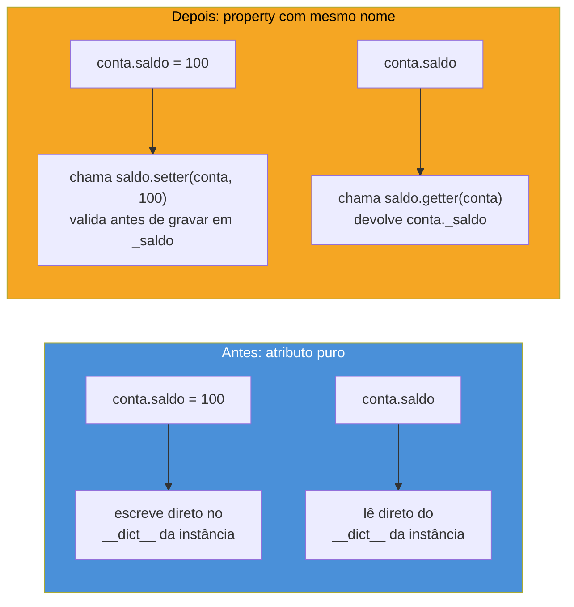
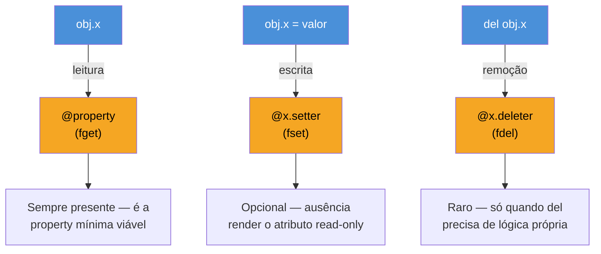
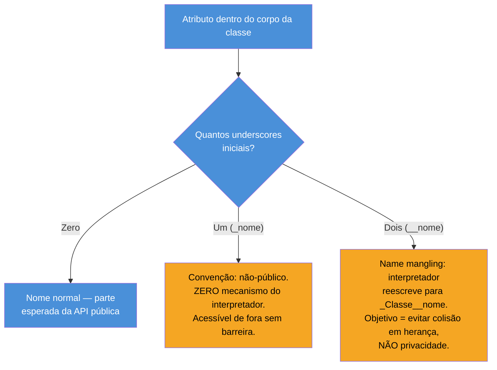

# Properties e encapsulamento

> [!abstract] TL;DR
> Em Python, o ponto de partida idiomático de uma classe é o **atributo público simples** (`self.saldo = 0`), não um par `getSaldo()`/`setSaldo()` como em Java. Quando — e só quando — surge a necessidade real de validar, calcular ou logar um acesso, `@property` transforma um método em atributo de leitura sem quebrar uma única linha do código que já fazia `conta.saldo`; `@x.setter` adiciona validação na escrita pelo mesmo caminho; `@x.deleter` é o irmão raro que intercepta `del obj.x`. Esse é o **Uniform Access Principle** aplicado à letra: o chamador nunca sabe (nem precisa saber) se `obj.x` é um atributo puro ou uma property calculada — a sintaxe de acesso é idêntica. Quanto a "privado de verdade": Python não tem. `_nome` (um underscore) é **convenção social** — "não é API pública, mas nada te impede de acessar". `__nome` (dois underscores) aciona **name mangling**, um mecanismo real do interpretador que reescreve `__nome` para `_Classe__nome` — mas seu propósito documentado é **evitar colisão de nomes em herança**, não impor privacidade; o atributo continua acessível via `obj._Classe__nome`. A filosofia por trás disso é o que a comunidade chama de "we're all consenting adults here": confiar no programador em vez de travar o acesso via linguagem.

## O bug que abre esta nota

Um desenvolvedor está construindo uma classe `ContaBancaria` simples para um sistema interno. No começo, ela não faz nada além de guardar dados:

```python
class ContaBancaria:
    def __init__(self, titular, saldo_inicial=0):
        self.titular = titular
        self.saldo = saldo_inicial
```

O código de aplicação, espalhado por vários módulos, usa a classe do jeito mais direto possível — porque não há razão para não usar:

```python
conta = ContaBancaria("Marina", 500)
conta.saldo = conta.saldo + 100   # depósito
conta.saldo -= 30                  # saque
print(conta.saldo)                 # 570
```

Semanas depois, um bug em produção revela um saldo negativo: alguém, em algum lugar do código, fez `conta.saldo -= 1000` sem checar se havia fundos suficientes. O time decide que **saldo nunca pode ficar negativo** — é uma invariante do domínio, não um detalhe de implementação. A reação instintiva de quem vem de Java é reescrever a classe inteira:

```python
class ContaBancaria:
    def __init__(self, titular, saldo_inicial=0):
        self.titular = titular
        self._saldo = saldo_inicial

    def get_saldo(self):
        return self._saldo

    def set_saldo(self, valor):
        if valor < 0:
            raise ValueError("Saldo não pode ser negativo")
        self._saldo = valor
```

O problema: isso **quebra toda a base de código existente**. Todo `conta.saldo = X` e todo `print(conta.saldo)` espalhado pelo sistema para de funcionar — precisaria virar `conta.set_saldo(X)` e `conta.get_saldo()` em cada um dos pontos de uso, uma migração mecânica e arriscada só para acrescentar uma validação. Esta nota resolve exatamente esse problema: como adicionar a validação **sem tocar em uma única linha** do código que já usa `conta.saldo` — e por que essa capacidade é uma das diferenças filosóficas mais profundas entre Python e linguagens como Java.

## O que é

`@property` é um decorador embutido na linguagem — na verdade, um [tipo built-in](https://docs.python.org/3/library/functions.html#property), `property(fget=None, fset=None, fdel=None, doc=None)` — que transforma um método de instância em um **atributo gerenciado**: algo que se **acessa** com a sintaxe de atributo (`obj.x`, sem parênteses) mas que, por trás, executa código Python arbitrário toda vez que é lido, escrito ou apagado. A forma decorada é a idiomática:

```python
class ContaBancaria:
    def __init__(self, titular, saldo_inicial=0):
        self.titular = titular
        self._saldo = saldo_inicial

    @property
    def saldo(self):
        """Getter: chamado em `conta.saldo`."""
        return self._saldo

    @saldo.setter
    def saldo(self, valor):
        """Setter: chamado em `conta.saldo = valor`."""
        if valor < 0:
            raise ValueError("Saldo não pode ser negativo")
        self._saldo = valor
```

```python
conta = ContaBancaria("Marina", 500)
conta.saldo = conta.saldo + 100   # ainda funciona — sintaxe idêntica de antes
conta.saldo -= 30                  # ainda funciona
print(conta.saldo)                 # 570 — ainda funciona

conta.saldo = -1000
```

```
Traceback (most recent call last):
  ...
ValueError: Saldo não pode ser negativo
```

Nenhuma linha do código de aplicação mudou. `conta.saldo` continua parecendo um atributo comum — porque, da perspectiva de quem chama, **é** um atributo comum. O que mudou foi só a implementação interna da classe: o que antes era um atributo de dados (`self.saldo`) virou um atributo gerenciado por dois métodos (`saldo` getter e `saldo` setter), reaproveitando o mesmo nome público.



> [!question]- Como o Python sabe que deve chamar um método em vez de simplesmente ler/gravar um valor, se a sintaxe (`obj.x`) é idêntica nos dois casos?
> Porque `property` é um **descritor de dados** — um objeto que implementa o protocolo `__get__`/`__set__`/`__delete__` (assunto aprofundado no [Descriptor HowTo Guide](https://docs.python.org/3/howto/descriptor.html) oficial). Quando a classe define `saldo = property(...)`, esse objeto `property` fica armazenado como **atributo de classe**. O mecanismo de busca de atributos do Python (`__getattribute__`) dá prioridade a descritores de dados encontrados na classe **antes** de olhar o `__dict__` da instância — é por isso que `conta.saldo` aciona o getter mesmo existindo um `conta._saldo` "de verdade" guardado na instância. Detalhe deliberado de nomenclatura no exemplo: o método decorado com `@property` e o método decorado com `@saldo.setter` têm o **mesmo nome** (`saldo`) — não é coincidência, é o mecanismo: `@saldo.setter` pega o objeto `property` já criado pelo `@property` anterior e devolve uma **nova** property, idêntica exceto pelo `fset` adicionado. Descriptors avançados (escrever o seu próprio, sem usar `property`) ficam para a fase Magus deste galho.

## Por que importa

A diferença filosófica com Java é estrutural, não estética. Em Java, um campo público exposto diretamente (`public int saldo;`) é considerado **falta grave de engenharia** — a prática recomendada, seguindo o *Uniform Access Principle* de Bertrand Meyer, é sempre encapsular com `getSaldo()`/`setSaldo()` desde o primeiro commit, mesmo quando eles só fazem `return this.saldo;`, porque o compilador Java **não permite** trocar um campo público por um método mantendo a mesma sintaxe de chamada no código cliente — `conta.saldo` (acesso a campo) e `conta.getSaldo()` (chamada de método) são sintaxes diferentes, e migrar de uma para outra depois exige alterar todo ponto de uso. A defesa contra esse custo futuro é pagar o boilerplate **antecipadamente**, em toda classe, "só por garantia" — mesmo nos 90% dos casos em que a lógica de validação nunca chega a ser necessária.

Python inverte essa equação porque `obj.x` (acesso a atributo) e `obj.x` (acesso a property) são a **mesma sintaxe** — o Uniform Access Principle é garantido pela própria linguagem, não por convenção de estilo. Isso libera o desenvolvedor Python para adiar a decisão: comece com o atributo público mais simples possível; refatore para `@property` **exatamente quando** surgir a necessidade real de validação, cálculo derivado ou efeito colateral controlado — nunca antes. A [Real Python](https://realpython.com/python-property/) resume essa vantagem como a possibilidade de propriedades funcionarem como "gerenciadores de atributos" que dão acesso controlado a atributos gerenciados sem quebrar a API pública da classe — e o ponto central é justamente esse: **a API não muda**, só a implementação por trás dela.

> [!warning] "Comece simples, refatore depois" não é preguiça — é a prática recomendada
> Criar getters/setters Java-style em toda classe Python "por precaução" é listado como antipadrão explícito na documentação da comunidade (ver [Python Anti-Patterns — Implementing Java-style getters and setters](https://docs.quantifiedcode.com/python-anti-patterns/correctness/implementing_java-style_getters_and_setters.html)): além de boilerplate desnecessário, esconde a intenção real do código atrás de chamadas de método triviais (`get_x()`/`set_x()` que só fazem `return self._x`/`self._x = value`) sem qualquer ganho — a mesma crítica aparece no livro *Effective Python* (Brett Slatkin), Item "Prefer Public Attributes Over Private Ones": comece com atributos públicos simples, use `@property` quando o comportamento precisar mudar. O custo de "esperar para encapsular" em Python é zero, porque a migração não quebra ninguém.

O caso de uso mais citado além de validação é a **propriedade computada** (calculada a partir de outros atributos, sem armazenamento próprio) — um jeito idiomático de expor um valor derivado como se fosse um dado simples:

```python
class Retangulo:
    def __init__(self, largura, altura):
        self.largura = largura
        self.altura = altura

    @property
    def area(self):
        # não existe self._area — é sempre recalculada, nunca fica desatualizada
        return self.largura * self.altura


r = Retangulo(4, 5)
print(r.area)     # 20 — parece um atributo, mas é sempre recomputado
r.largura = 10
print(r.area)      # 50 — reflete a mudança automaticamente
```

Se `area` fosse um método (`r.area()`), a chamada precisaria dos parênteses — um detalhe sintático pequeno, mas que sinaliza corretamente ao leitor "isso é uma operação" em vez de "isso é um dado", quando na verdade `area` é conceitualmente um dado do retângulo (ainda que computado), não uma ação que ele executa.

## Como funciona

### `@property`: o getter que vira atributo de leitura

A forma mais simples possível de property é **somente leitura**: um método decorado com `@property` e nenhum setter correspondente.

```python
class Circulo:
    def __init__(self, raio):
        self._raio = raio

    @property
    def raio(self):
        return self._raio

    @property
    def diametro(self):
        return self._raio * 2


c = Circulo(5)
print(c.raio)        # 5
print(c.diametro)     # 10 — computado, sem armazenamento próprio

c.raio = 10
```

```
Traceback (most recent call last):
  ...
AttributeError: property 'raio' of 'Circulo' object has no setter
```

Tentar escrever numa property sem `@x.setter` levanta `AttributeError` automaticamente — o Python nem precisa de código extra para impedir a escrita; a ausência do setter já é a proteção. Essa é a forma canônica de expor um valor de **leitura pública, escrita controlada (ou inexistente)** sem recorrer a convenções manuais como "documentar que ninguém deve escrever em `self.raio`".

### `@x.setter`: validação na escrita, sem quebrar quem já lê `obj.x`

O padrão completo — o que resolve o problema de abertura desta nota — usa três peças com o **mesmo nome de método**, cada uma decorada de forma diferente:

```python
class ContaBancaria:
    def __init__(self, titular, saldo_inicial=0):
        self.titular = titular
        self.saldo = saldo_inicial   # passa pelo setter já na construção!

    @property
    def saldo(self):
        return self._saldo

    @saldo.setter
    def saldo(self, valor):
        if valor < 0:
            raise ValueError("Saldo não pode ser negativo")
        self._saldo = valor
```

> [!question]- Por que `self.saldo = saldo_inicial` dentro de `__init__` funciona mesmo antes de `self._saldo` existir?
> Porque `self.saldo = saldo_inicial` **não** grava diretamente em `__dict__` — ele passa pelo mecanismo de descriptor, que aciona o **setter** (`@saldo.setter`), que por sua vez é quem cria `self._saldo` pela primeira vez. É um detalhe sutil e importante: usar a property (não `self._saldo` diretamente) dentro do próprio `__init__` garante que a validação também se aplique ao valor inicial — um `ContaBancaria("Marina", -500)` levanta o mesmo `ValueError`, em vez de deixar a instância nascer num estado inválido que só seria pego no primeiro `set` explícito.

### `@x.deleter`: o irmão raro

`@x.deleter` intercepta `del obj.x`, permitindo lógica customizada de remoção — por exemplo, limpar um cache ou logar a ação antes de apagar o atributo de fato:

```python
class Sessao:
    def __init__(self, token):
        self._token = token

    @property
    def token(self):
        return self._token

    @token.setter
    def token(self, valor):
        self._token = valor

    @token.deleter
    def token(self):
        print("Sessão encerrada — token invalidado")
        del self._token


s = Sessao("abc123")
del s.token   # imprime "Sessão encerrada — token invalidado", depois remove _token
```

Na prática, `@x.deleter` é o menos usado dos três — a [documentação oficial do `property`](https://docs.python.org/3/library/functions.html#property) o lista com o mesmo status dos outros dois, mas a maioria das properties do mundo real se limita a getter e (às vezes) setter; `del obj.x` é uma operação rara o suficiente no código de aplicação típico que raramente justifica lógica dedicada — vale conhecer, não vale usar por padrão.



### A forma funcional (sem decorador): `property()` direto

`@property` é açúcar sintático sobre o construtor `property(fget, fset, fdel, doc)`, útil de conhecer porque aparece em código legado e explica por que a sintaxe de decorador funciona:

```python
class ContaBancaria:
    def __init__(self, titular, saldo_inicial=0):
        self.titular = titular
        self.saldo = saldo_inicial

    def _get_saldo(self):
        return self._saldo

    def _set_saldo(self, valor):
        if valor < 0:
            raise ValueError("Saldo não pode ser negativo")
        self._saldo = valor

    saldo = property(_get_saldo, _set_saldo, doc="Saldo da conta, nunca negativo.")
```

As duas formas são **equivalentes em runtime** — a forma decorada só é preferida por legibilidade: o nome do atributo público (`saldo`) fica junto do método, em vez de reunido numa linha separada ao fim da classe.

## Por que Python não tem `private` de verdade

Aqui está a segunda metade da filosofia por trás de properties: se Python vai deixar qualquer atributo começar público e virar property depois sem quebrar nada, por que a linguagem nem se preocupa em oferecer um modificador `private` real, como `private` em Java ou C++?

A resposta, segundo a [documentação oficial](https://docs.python.org/3/tutorial/classes.html#private-variables), é direta: *"'Private' instance variables that cannot be accessed except from inside an object don't exist in Python"* — variáveis de instância verdadeiramente privadas simplesmente não existem na linguagem. O que existe são **duas convenções**, com força bem diferente:

| | `_nome` (um underscore) | `__nome` (dois underscores) |
|---|---|---|
| Mecanismo | nenhum — é só uma convenção de nomenclatura | **name mangling** real, feito pelo interpretador |
| O que o Python faz | nada — o atributo é acessado normalmente | reescreve `__nome` para `_NomeDaClasse__nome` em tempo de compilação do corpo da classe |
| Significado pretendido | "não é parte da API pública; implementação interna, sujeita a mudar sem aviso" | evitar colisão de nomes entre uma classe e suas subclasses |
| Acessível de fora? | sim, sempre — `obj._nome` funciona | sim, via o nome mangled — `obj._Classe__nome` funciona |
| É "privacidade" de verdade? | não — confiança, não imposição | não — proteção contra acidente, não contra acesso deliberado |

### `_nome`: convenção social, não imposição

Um único underscore inicial é, segundo a mesma documentação e reforçado pela [Real Python](https://realpython.com/python-double-underscore/), um sinal para outros desenvolvedores (e para ferramentas como linters e IDEs) de que aquele nome **deveria** ser tratado como não-público — parte da implementação interna, sujeita a mudar entre versões sem aviso prévio, não coberta pela promessa de estabilidade da API pública da classe. O PEP 8 formaliza essa convenção como padrão de estilo da comunidade. Mas o Python **não faz nada** para impedir o acesso:

```python
class Conta:
    def __init__(self, saldo):
        self._saldo = saldo   # convenção: "não mexa aqui de fora"


c = Conta(100)
print(c._saldo)   # 100 — funciona perfeitamente, o Python não reclama
c._saldo = -9999    # também funciona — nenhuma barreira técnica
```

Isso não é uma falha de segurança — é a escolha deliberada. `_saldo` comunica **intenção**, não impõe **restrição**.

### `__nome`: name mangling é mecanismo real, mas não é sobre privacidade

Dois underscores iniciais (e no máximo um underscore final) acionam algo que o interpretador de fato faz: o [tutorial oficial](https://docs.python.org/3/tutorial/classes.html#private-variables) descreve que "qualquer identificador da forma `__spam` (pelo menos dois underscores iniciais, no máximo um final) é textualmente substituído por `_classname__spam`, onde `classname` é o nome da classe atual com os underscores iniciais removidos". Isso acontece de forma puramente textual, durante a compilação do corpo da classe — não em runtime, não com base em quem está chamando.

```python
class Conta:
    def __init__(self, saldo):
        self.__saldo = saldo   # vira self._Conta__saldo internamente

    def mostrar(self):
        return self.__saldo    # também vira self._Conta__saldo — resolve automaticamente


c = Conta(100)
print(c.mostrar())        # 100 — funciona normalmente de dentro da classe
print(c.__saldo)           # AttributeError! __saldo não existe com esse nome exato
print(c._Conta__saldo)      # 100 — mas o nome mangled continua acessível
```

O **propósito documentado** desse mecanismo não é privacidade — é evitar colisão de nomes quando uma subclasse, sem saber, escolhe um atributo com o mesmo nome que a superclasse já usa internamente. O exemplo canônico da própria documentação:

```python
class Mapeamento:
    def __init__(self, iterable):
        self.items_list = []
        self.__update(iterable)     # vira self._Mapeamento__update(iterable)

    def update(self, iterable):
        for item in iterable:
            self.items_list.append(item)

    __update = update   # cópia privada do update() original — vira _Mapeamento__update


class SubMapeamento(Mapeamento):
    def update(self, chaves, valores):        # nova assinatura, sobrescreve update()
        for item in zip(chaves, valores):
            self.items_list.append(item)
    # __update NÃO é sobrescrito — continua sendo _Mapeamento__update("...")
```

Sem o name mangling, `SubMapeamento.update` (com a assinatura nova, incompatível) substituiria silenciosamente o `update` que `Mapeamento.__init__` espera chamar internamente — quebrando o construtor da superclasse por um acidente de nomenclatura. Com o mangling, `Mapeamento.__init__` sempre chama `_Mapeamento__update` (o método original, intocado), independentemente do que a subclasse define como `update` público. É proteção contra **colisão acidental em herança**, documentada dessa forma específica tanto no [tutorial de classes](https://docs.python.org/3/tutorial/classes.html#private-variables) quanto no [Descriptor HowTo Guide](https://docs.python.org/3/howto/descriptor.html).



> [!warning] Name mangling não é um cofre — é uma trava de gaveta, não de cofre-forte
> O nome mangled continua sendo um atributo Python normal, descobrível com `dir(obj)` ou `vars(obj)`, e acessível diretamente sabendo o padrão `_NomeDaClasse__nome`. Qualquer código que "quebre" a privacidade via name mangling **não está explorando uma falha** — está deliberadamente ignorando uma convenção, o que é sempre possível em Python e sempre desaconselhado por convenção social, nunca impedido tecnicamente. A [Real Python](https://realpython.com/python-double-underscore/) é explícita sobre isso: mesmo com name mangling, o Python "não restringe completamente o acesso" ao nome — a mangling existe para *evitar acidentes*, não para *impedir acesso deliberado*.

## A filosofia "we're all consenting adults here"

Essa frase — atribuída à cultura da lista de discussão original do Python e citada com frequência em discussões sobre encapsulamento — resume por que a linguagem escolheu convenção em vez de imposição. Java e C++ tratam o desenvolvedor que usa uma classe como um adversário em potencial contra o qual o autor da classe precisa se defender com modificadores de acesso reforçados pelo compilador. Python parte do princípio oposto: quem está lendo `_saldo` ou `_Conta__saldo` de fora da classe **sabe** o que está fazendo, está deliberadamente contornando uma convenção documentada, e a linguagem confia que essa pessoa tem um motivo legítimo (debugging, teste, um caso de uso que o autor original não previu) — em vez de bloquear tecnicamente o acesso e forçar um workaround pior (reflection, em Java, para "quebrar" um `private` quando realmente necessário).

Isso não significa que encapsulamento seja irrelevante em Python — significa que a ferramenta certa para proteger uma invariante real (como "saldo nunca é negativo") é **validação ativa via `@property`**, não um modificador de acesso passivo que só esconde o nome. A convenção `_`/`__` comunica intenção de API; `@property` com validação **de fato impede** o estado inválido, independentemente de quem está chamando ou de como o atributo se chama.

### Quando encapsular de verdade importa — e quando é over-engineering

| Encapsular importa | Over-engineering |
|---|---|
| Invariante de domínio precisa ser garantida sempre (saldo não-negativo, e-mail em formato válido, idade não-negativa) | Atributo é só um dado — não há regra de negócio nenhuma associada a ele |
| Escrita direta teria efeito colateral que precisa ser controlado (invalidar um cache, disparar um evento, logar uma auditoria) | O "getter"/"setter" só faz `return self._x` / `self._x = value`, sem lógica nenhuma — puro teatro de API |
| Valor é computado a partir de outros atributos e nunca deveria ser setado diretamente (`area`, `perimetro`, `idade` derivada de `data_nascimento`) | Toda classe do projeto ganha `@property` "por padrão", mesmo as que nunca vão precisar de validação — desperdício de linhas e de leitura |
| A classe é parte de uma API pública de biblioteca, onde builders futuros de fato não devem depender de detalhes internos de armazenamento | Código interno de aplicação, de vida curta, sem consumidores externos — o custo de "não ter encapsulado desde o início" é próximo de zero |

A recomendação prática, reforçada por [Effective Python](https://hacktec.gitbooks.io/effective-python/content/en/Chapter3/item27.html) (Slatkin) e pela cultura Real Python: **comece com atributo público simples sempre**. Não é preguiça — é reconhecer que, em Python, o custo de "esperar para encapsular" é praticamente zero (a migração para `@property` não quebra API), enquanto o custo de encapsular preventivamente em toda classe é real e recorrente: mais código para ler, mais indireção para seguir, sem benefício algum nos casos (a maioria) em que a lógica de validação nunca chega a ser necessária.

> [!question]- Isso significa que devo nunca usar `__nome` (double underscore) na prática?
> Não — só significa entender o motivo certo de usá-lo. `__nome` faz sentido quando você está escrevendo uma classe **pensada para ser herdada**, e quer proteger um atributo interno de colisão acidental com o que as subclasses definirem (o cenário exato do exemplo `Mapeamento`/`SubMapeamento` acima). Fora desse cenário — a maioria do código de aplicação, que não é uma base de classe para hierarquias profundas — um único underscore (`_nome`) já comunica a intenção "não é API pública" com a mesma clareza, sem o custo extra de mangling que às vezes surpreende quem depura via `dir()`/`vars()` e não reconhece o nome reescrito de cara.

## Na prática: refatorando sem quebrar ninguém

Fechando o ciclo do exemplo de abertura — o processo completo de "atributo público simples → property com validação", sem nenhuma mudança visível de fora:

```python
# Versão 1 — o ponto de partida correto, sem validação nenhuma ainda
class ContaBancaria:
    def __init__(self, titular, saldo_inicial=0):
        self.titular = titular
        self.saldo = saldo_inicial


# Meses depois: invariante "saldo nunca negativo" vira requisito real.
# Versão 2 — só a classe muda. Todo o resto do sistema continua igual.
class ContaBancaria:
    def __init__(self, titular, saldo_inicial=0):
        self.titular = titular
        self.saldo = saldo_inicial   # passa pelo setter, valida desde a criação

    @property
    def saldo(self):
        return self._saldo

    @saldo.setter
    def saldo(self, valor):
        if valor < 0:
            raise ValueError(f"Saldo não pode ser negativo: {valor}")
        self._saldo = valor

    @property
    def esta_negativo(self):
        # bônus: propriedade computada de leitura, sem armazenamento próprio
        return self._saldo < 0   # sempre False, dado o setter acima — mas útil como exemplo


# Código de aplicação em qualquer outro arquivo — ZERO mudanças necessárias:
conta = ContaBancaria("Marina", 500)
conta.saldo += 100
conta.saldo -= 30
print(conta.saldo)          # 570
print(conta.esta_negativo)   # False

try:
    conta.saldo = -1000
except ValueError as e:
    print(e)                # "Saldo não pode ser negativo: -1000"
```

Nenhum `conta.saldo` existente em produção precisou virar `conta.get_saldo()` ou `conta.set_saldo(...)`. A migração foi inteiramente interna à classe.

## Armadilhas

### (1) Confundir `_nome` com segurança real
`_saldo` não impede leitura nem escrita — é só um sinal de "não conte com isso continuar existindo do jeito que está". Tratar underscore único como se fosse `private` do Java é um erro comum de quem migra de linguagens com privacidade imposta pelo compilador.

### (2) Usar `__nome` (double underscore) esperando privacidade, e se surpreender com o `AttributeError`
```python
class Config:
    def __init__(self):
        self.__chave = "segredo"

cfg = Config()
print(cfg.__chave)   # AttributeError: 'Config' object has no attribute '__chave'
```
O erro não significa que o atributo "não existe" — significa que o nome foi reescrito para `_Config__chave` e o acesso direto por `__chave` simplesmente não encontra esse nome. Confundir isso com uma falha de segurança (ou, pior, com um bug do interpretador) é a armadilha mais comum de quem vê name mangling pela primeira vez.

### (3) Criar getters/setters explícitos "por garantia", em toda classe, desde o início
Já coberto no `[!warning]` acima — é o antipadrão mais citado na comparação Python-Java sobre este tema. O custo de esperar é próximo de zero; o custo de proteger preventivamente é recorrente e real.

### (4) Colocar lógica pesada ou I/O dentro de um getter de property
```python
@property
def dados(self):
    return requests.get(self._url).json()   # chamada de rede escondida atrás de sintaxe de atributo!
```
Como `obj.dados` parece um acesso simples de atributo (sem parênteses, sem indicação visual de "isso pode ser lento"), esconder uma chamada de rede, leitura de disco ou cálculo pesado atrás de uma property viola a expectativa implícita de que acesso a atributo é barato e sem efeitos colaterais surpreendentes. Quando a operação é cara o suficiente para justificar cache, log ou tratamento de erro visível, um método explícito (`obj.buscar_dados()`) comunica melhor a intenção ao leitor do código.

### (5) Esquecer que `@x.setter` exige o método base `@property` com o mesmo nome já definido antes
```python
class Ponto:
    @x.setter          # NameError: 'x' não está definido ainda!
    def x(self, valor):
        self._x = valor
```
`@x.setter` referencia o objeto `property` criado pelo `@property` anterior — sem essa definição prévia (com o mesmo nome de método), o decorador não tem a que se anexar.

## Em entrevista

Perguntas previsíveis sobre este tópico:

- **"Por que Python não força getters e setters como Java?"** Porque `@property` garante o Uniform Access Principle diretamente na linguagem: `obj.x` tem a mesma sintaxe seja `x` um atributo puro ou uma property computada/validada. Isso permite começar com atributo público simples e migrar para `@property` só quando necessário, sem quebrar nenhum código cliente existente — diferente de Java, onde trocar um campo público por um método exige atualizar todo ponto de uso.
- **"Como funciona `@property` por baixo dos panos?"** `property` é um descritor de dados (implementa `__get__`/`__set__`/`__delete__`), armazenado como atributo de classe. O mecanismo de resolução de atributos do Python (`__getattribute__`) prioriza descritores de dados encontrados na classe antes do `__dict__` da instância — por isso `obj.x` aciona o getter mesmo com um `obj._x` guardado na instância.
- **"Python tem atributos privados de verdade?"** Não. `_nome` é convenção pura (nenhum mecanismo do interpretador); `__nome` aciona name mangling — uma reescrita textual real para `_Classe__nome` — mas o objetivo documentado é evitar colisão de nomes em herança, não impor privacidade. O atributo continua acessível de fora sabendo o nome mangled.
- **"Qual a diferença entre `_nome` e `__nome`?"** `_nome` é sinalização social (PEP 8): "não é API pública". `__nome` tem efeito real do interpretador (name mangling), mas com propósito diferente de privacidade: evitar que uma subclasse sobrescreva acidentalmente um atributo que a superclasse usa internamente.
- **"Quando você usaria `@property` em vez de um atributo público simples?"** Quando surge necessidade real: validar uma invariante de domínio (saldo não-negativo), expor um valor computado a partir de outros atributos sem armazená-lo redundantemente (`area` a partir de `largura`/`altura`), ou controlar um efeito colateral na escrita (invalidar cache, disparar evento). Nunca como prática padrão "por precaução" — isso é o antipadrão getters/setters Java-style aplicado sem necessidade.
- **"O que é a filosofia 'we're all consenting adults here'?"** A ideia de que Python confia no desenvolvedor em vez de impor restrições de acesso via compilador. Convenções (`_`/`__`) comunicam intenção; quem contorna essas convenções deliberadamente presume-se que tem um motivo válido. Encapsulamento real, quando necessário, vem de validação ativa (`@property` com lógica), não de esconder nomes.

### How to explain in English

> Python doesn't force Java-style getters and setters because `@property` gives the language a built-in Uniform Access Principle: `obj.x` looks identical whether `x` is a plain attribute or a computed/validated property underneath. That lets you start every class with the simplest possible public attribute and only refactor to `@property` when real logic — validation, a derived value, a controlled side effect — is actually needed, without breaking a single caller. Mechanically, `property` is a data descriptor (it implements `__get__`/`__set__`/`__delete__`), stored as a class attribute; Python's attribute lookup gives data descriptors priority over instance `__dict__`, which is why `obj.x` triggers the getter even though a real `obj._x` sits in the instance. On privacy: Python has none, by design. A single leading underscore (`_name`) is pure convention — a signal that a name isn't part of the public API, enforced by nothing. A double leading underscore (`__name`) triggers real interpreter behavior called name mangling, rewriting the identifier to `_ClassName__name` — but its documented purpose is avoiding accidental name collisions in inheritance hierarchies, not enforcing privacy; the attribute stays reachable via the mangled name. This all reflects Python's "we're all consenting adults here" philosophy: trust the developer instead of gatekeeping access at the language level. Creating Java-style getters/setters for every attribute "just in case" is a well-documented anti-pattern in Python — the cost of waiting to encapsulate later is close to zero, while defensive boilerplate upfront is a real, recurring cost with no payoff in the common case where validation logic never ends up being needed.

| Termo PT | Termo EN |
|---|---|
| propriedade / atributo gerenciado | property / managed attribute |
| getter / setter / deleter | getter / setter / deleter |
| atributo somente leitura | read-only attribute |
| princípio do acesso uniforme | Uniform Access Principle |
| convenção de nomenclatura | naming convention |
| ofuscação de nome / name mangling | name mangling |
| encapsulamento | encapsulation |
| variável "privada" (por convenção) | "private" variable (by convention) |
| descritor de dados | data descriptor |
| "somos todos adultos que consentem" | "we're all consenting adults here" |
| boilerplate | boilerplate |
| invariante de domínio | domain invariant |
| propriedade computada | computed property |

## O que vem a seguir

Com properties e a convenção de "privacidade" entendidas, a próxima peça natural é **automatizar o boilerplate de classes de dados**: a [[05 - Dataclasses|nota 05]] cobre `@dataclass`, que gera `__init__`, `__repr__` e `__eq__` automaticamente a partir dos campos declarados — e mostra como combinar `@dataclass` com `@property` quando alguns campos precisam de validação e outros não. `collections.abc` e `typing.Protocol`, que formalizam contratos comportamentais além do que dunders e properties cobrem sozinhos, ficam para a [[06 - ABC e Protocol — tipagem estrutural|nota 06]].

## Veja também

- [[03-Dominios/Tecnologia/Python/OO e Data Model/01 - Classes — definição, atributos e métodos|01 — Classes: definição, atributos e métodos]] — base de sintaxe de classe e `self`, usada em todos os exemplos aqui
- [[03-Dominios/Tecnologia/Python/OO e Data Model/03 - O Data Model — dunder methods essenciais|03 — O Data Model: dunder methods essenciais]] — o protocolo de dunders que faz `property` funcionar por baixo (`__get__`/`__set__` como descritor de dados)
- [[03-Dominios/Tecnologia/Python/OO e Data Model/05 - Dataclasses|05 — Dataclasses]] — `@dataclass` automatiza o boilerplate de classes de dados simples, combinável com `@property`
- [[03-Dominios/Tecnologia/Python/Core/08 - Erros e exceções|Core 08 — Erros e exceções]] — `ValueError` como forma idiomática de sinalizar violação de invariante num setter
- [[03-Dominios/Tecnologia/Python/OO e Data Model/index|OO e Data Model]] — MOC do galho
- [[03-Dominios/Tecnologia/Python/index|Trilha Python]]

## Fontes

- Python Software Foundation. *9.6. Private Variables* — tutorial oficial, seção sobre convenção de underscore único e name mangling. docs.python.org, versão 3.14. https://docs.python.org/3/tutorial/classes.html#private-variables (acessado em 2026-07-09)
- Python Software Foundation. *Built-in Functions — property()*. docs.python.org, versão 3.14. https://docs.python.org/3/library/functions.html#property (acessado em 2026-07-09)
- Python Software Foundation. *Descriptor HowTo Guide*. docs.python.org, versão 3.14. https://docs.python.org/3/howto/descriptor.html (acessado em 2026-07-09)
- Real Python. *Python's property(): Add Managed Attributes to Your Classes*. https://realpython.com/python-property/ (acessado em 2026-07-09)
- Real Python. *Single and Double Underscores in Python Names*. https://realpython.com/python-double-underscore/ (acessado em 2026-07-09)
- Real Python. *Getters and Setters: Manage Attributes in Python*. https://realpython.com/python-getter-setter/ (acessado em 2026-07-09)
- Slatkin, B. *Effective Python: 90 Specific Ways to Write Better Python*, 2ª ed. — Item 27, "Prefer Public Attributes Over Private Ones". Addison-Wesley, 2019. Resumo consultado em: https://hacktec.gitbooks.io/effective-python/content/en/Chapter3/item27.html (acessado em 2026-07-09)
- Ramalho, L. *Fluent Python: Clear, Concise, and Effective Programming*, 2ª ed. — Capítulo 11, "A Pythonic Object", seção sobre atributos privados e "protegidos" em Python. O'Reilly Media, 2022.
- Python Anti-Patterns. *Implementing Java-style getters and setters*. docs.quantifiedcode.com. https://docs.quantifiedcode.com/python-anti-patterns/correctness/implementing_java-style_getters_and_setters.html (acessado em 2026-07-09)
- Python Software Foundation. *PEP 8 — Style Guide for Python Code*, seção "Naming Conventions". peps.python.org. https://peps.python.org/pep-0008/ (acessado em 2026-07-09)
