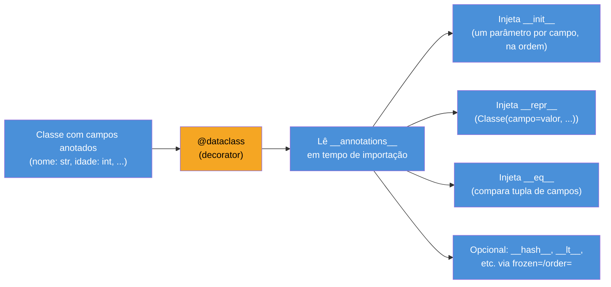
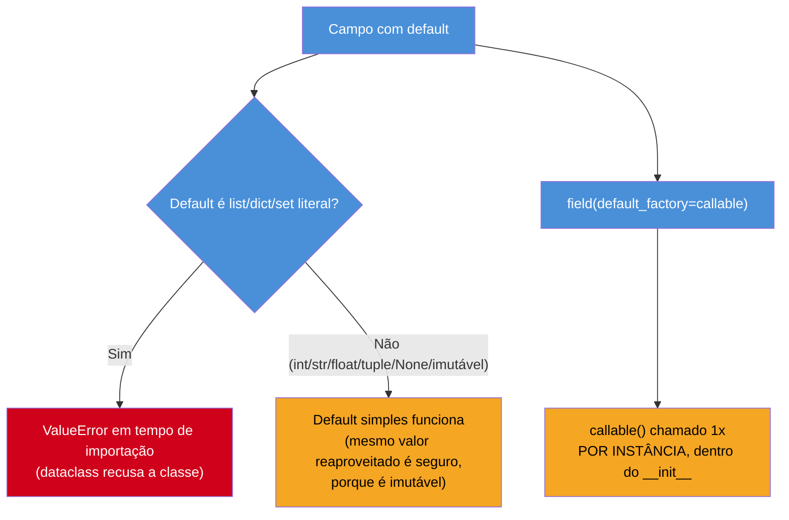
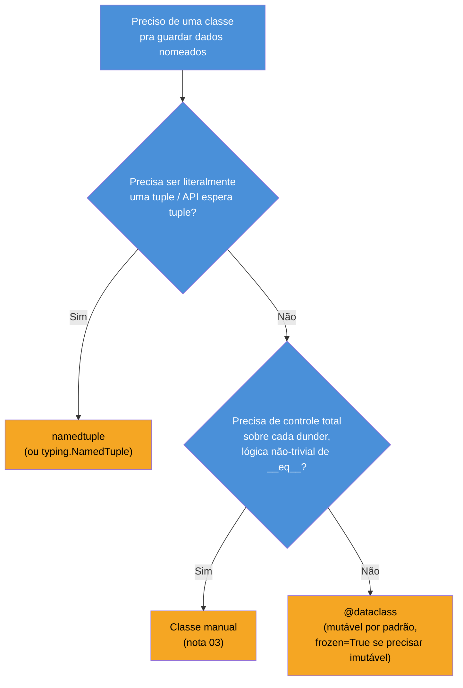

# Dataclasses

> [!abstract] TL;DR
> `@dataclass` (módulo `dataclasses`, [PEP 557](https://peps.python.org/pep-0557/), Python 3.7+) é um decorator que **lê os type hints de uma classe e gera automaticamente** `__init__`, `__repr__` e `__eq__` — os mesmos métodos que a [[03 - O Data Model — dunder methods essenciais|nota 03]] ensinou a escrever à mão. Campos com default mutável (`lista: list = []`) continuam proibidos — a mesma armadilha do argumento padrão mutável em funções — e exigem `field(default_factory=list)`. `__post_init__` roda depois do `__init__` gerado, para validação ou campos computados. `frozen=True` torna a instância imutável e reativa um `__hash__` automático (desligado por padrão, pela mesma razão que a nota 03 explicou). `order=True` gera `__lt__`/`__le__`/`__gt__`/`__ge__` a partir da ordem dos campos. Comparado a `namedtuple` (leve, sempre imutável, é uma `tuple` de verdade) e à classe manual (controle total, mais código), `dataclass` é hoje o meio-termo default para "classe que existe pra guardar dados" — mutável por padrão, mas pode ser congelada, aceita métodos e herança como qualquer classe comum.

## O bug que abre esta nota

Um sistema de RH precisa representar um funcionário: nome, cargo, salário, data de admissão, departamento e uma lista de habilidades. A versão "clássica", escrita à mão como a [[01 - Classes — definição, atributos e métodos|nota 01]] e a [[03 - O Data Model — dunder methods essenciais|nota 03]] ensinaram, fica assim:

```python
class Funcionario:
    def __init__(self, nome, cargo, salario, admissao, departamento, habilidades):
        self.nome = nome
        self.cargo = cargo
        self.salario = salario
        self.admissao = admissao
        self.departamento = departamento
        self.habilidades = habilidades

    def __repr__(self):
        return (
            f"Funcionario(nome={self.nome!r}, cargo={self.cargo!r}, "
            f"salario={self.salario!r}, admissao={self.admissao!r}, "
            f"departamento={self.departamento!r}, habilidades={self.habilidades!r})"
        )

    def __eq__(self, outro):
        if not isinstance(outro, Funcionario):
            return NotImplemented
        return (
            self.nome, self.cargo, self.salario,
            self.admissao, self.departamento, self.habilidades,
        ) == (
            outro.nome, outro.cargo, outro.salario,
            outro.admissao, outro.departamento, outro.habilidades,
        )
```

Vinte e seis linhas — e isso sem `__hash__`, sem validação de que `salario` não seja negativo, sem lidar com o fato de que `habilidades` é uma lista (e listas como default de parâmetro são, como o [[03-Dominios/Tecnologia/Python/Core/06 - Funções — definição, argumentos e escopo básico|Core 06]] já mostrou, uma cilada). Cada novo campo adicionado ao domínio — um `email`, um `gestor` — significa tocar em três lugares diferentes (`__init__`, `__repr__`, `__eq__`) e manter os três sincronizados manualmente. Esquecer de atualizar `__eq__` depois de adicionar um campo novo é um bug silencioso: o código continua rodando, só compara errado.

O padrão é mecânico o bastante para ser automatizado — e é exatamente isso que `@dataclass` faz: lê a lista de campos (que já precisa existir, como anotação de tipo, para qualquer ferramenta de análise estática funcionar) e gera `__init__`, `__repr__` e `__eq__` a partir dela, sem o desenvolvedor escrever uma linha de boilerplate.

```python
from dataclasses import dataclass, field
from datetime import date

@dataclass
class Funcionario:
    nome: str
    cargo: str
    salario: float
    admissao: date
    departamento: str
    habilidades: list[str] = field(default_factory=list)
```

Oito linhas — os mesmos três métodos gerados corretamente, incluindo o tratamento certo do default mutável (adiante). Esta nota dissseca o que o decorator gera, o que ele não gera, e quando `dataclass` é a ferramenta certa em vez de `namedtuple` ou de uma classe escrita à mão.

## O que é

`dataclasses` é um módulo da biblioteca padrão, introduzido no Python 3.7 pela [PEP 557](https://peps.python.org/pep-0557/) ("Data Classes"), que expõe o decorator `@dataclass`. Aplicado a uma classe cujo corpo declara campos como **anotações de tipo de classe** (a mesma sintaxe `nome: tipo` usada em variáveis anotadas, coberta pelo [[03-Dominios/Tecnologia/Python/Core/02 - Tipos e variáveis|Core 02]]), o decorator inspeciona essas anotações via `__annotations__` e, em tempo de importação (não em tempo de execução de cada instância), injeta métodos gerados na classe: por padrão, `__init__`, `__repr__` e `__eq__`.

Segundo a [documentação oficial](https://docs.python.org/3/library/dataclasses.html), a ideia central do PEP 557 é explicitamente **não** ser um sistema de tipos, nem um framework de validação (isso fica para bibliotecas de terceiros como Pydantic — mencionado adiante), nem um ORM. `dataclass` faz uma coisa: **elimina boilerplate mecânico** de classes cujo propósito primário é carregar dados nomeados. A [Real Python](https://realpython.com/python-data-classes/) resume o espírito do PEP: "dataclasses são, essencialmente, contêineres de dados mutáveis, assim como dicionários ou named tuples, mas projetados especificamente com classes Python e o conceito de tipagem em mente" — a citação captura por que o módulo existe entre `namedtuple` (leve, mas imutável e sem tipagem nativa) e a classe manual (flexível, mas verbosa).



Um ponto que costuma confundir quem chega de outras linguagens: `@dataclass` **não** cria um tipo novo nem um sistema de checagem em runtime. A anotação `nome: str` não impede `Funcionario(nome=123, ...)` de funcionar — Python continua sem checagem de tipo em tempo de execução (o [[03-Dominios/Tecnologia/Python/Core/02 - Tipos e variáveis|Core 02]] já cobriu essa característica da linguagem). As anotações servem só para o decorator descobrir **quais atributos existem** e **em que ordem**; checagem de tipo de verdade é trabalho de ferramentas externas (mypy, pyright) ou, em runtime, de bibliotecas como Pydantic — assunto do [[03-Dominios/Tecnologia/Python/Tipagem moderna/index|Galho 5]].

## Por que importa

O ganho não é só "menos digitação" — é **consistência garantida**. Numa classe escrita à mão, nada impede `__eq__` de ficar desatualizado depois que um campo novo é adicionado ao `__init__`: o código compila, roda, e compara errado silenciosamente. Numa `dataclass`, os três métodos são gerados a partir da **mesma fonte de verdade** (a lista de campos anotados) — adicionar um campo automaticamente propaga para `__init__`, `__repr__` e `__eq__` ao mesmo tempo, sem chance de os três divergirem.

Há também um efeito histórico dentro do próprio Python: `dataclass` é o sucessor direto — e hoje o substituto preferido na maioria dos casos — de `namedtuple`, que a nota [[03-Dominios/Tecnologia/Python/Collections e Comprehensions/07 - O módulo collections — Counter, defaultdict, deque, namedtuple|Collections 07]] já cobriu como a primeira ferramenta da biblioteca padrão a resolver esse mesmo problema (registro de dados nomeado, sem boilerplate) — mas sobre uma tupla, e portanto sempre imutável. O PEP 557 nasceu explicitamente da observação de que "muitas pessoas usam `namedtuple` só pelo `__repr__`/`__eq__` de graça, não porque queiram uma tupla de verdade" — e `dataclass` separa essas duas preocupações: dá o boilerplate de graça **sem** forçar a imutabilidade/comportamento-de-tupla que vem junto de `namedtuple`.

Vale contrastar com o padrão mais próximo em outras linguagens para quem chega de lá: Java tem `record` (desde Java 16), Kotlin tem `data class`, C# tem `record` também — todos resolvem o mesmo problema ("gerar `equals`/`hashCode`/`toString` a partir dos campos") com sintaxe dedicada de linguagem. Python resolve isso com um **decorator de biblioteca padrão**, não uma palavra-chave nova — coerente com a filosofia de "baterias inclusas, mas sem inchar a sintaxe da linguagem" que também explica por que `namedtuple` e `Enum` (visto no Core) são fábricas de classe, não keywords.

## Como funciona

### Os três métodos gerados por padrão

```python
from dataclasses import dataclass

@dataclass
class Ponto:
    x: float
    y: float

p1 = Ponto(3.0, 4.0)
p2 = Ponto(3.0, 4.0)

print(p1)          # Ponto(x=3.0, y=4.0)     -- __repr__ gerado
print(p1 == p2)      # True                   -- __eq__ gerado (compara campo a campo)
print(p1 is p2)       # False                  -- identidades diferentes, óbvio
```

`__init__` gerado aceita um parâmetro posicional-ou-nomeado por campo, na ordem em que os campos foram declarados no corpo da classe — exatamente o comportamento que o `Funcionario` escrito à mão, no exemplo de abertura, também tinha, só que sem o desenvolvedor precisar escrever `self.x = x` para cada campo. `__repr__` gerado segue o mesmo formato "reconstrutível" que a [[03 - O Data Model — dunder methods essenciais|nota 03]] recomendou como boa prática manual: `Classe(campo1=valor1, campo2=valor2, ...)`. `__eq__` gerado compara **tuplas de todos os campos**, na ordem declarada — equivalente a `(self.x, self.y) == (outro.x, outro.y)`, e só retorna `True` se `outro` for do **mesmo tipo exato** (não apenas uma instância compatível via herança).

> [!question]- `__eq__` gerado compara tipo exato ou aceita subclasses?
> Tipo exato. A implementação gerada por `dataclass` checa `other.__class__ is self.__class__` antes de comparar os campos — uma subclasse de `Ponto` nunca é `==` a um `Ponto`, mesmo com os mesmos valores de `x`/`y`. Isso é mais restritivo que o padrão manual mostrado na nota 03 (que usava `isinstance`), e é uma escolha deliberada do PEP 557 para evitar comparações ambíguas entre uma classe base e subclasses que podem ter adicionado campos.

O decorator **não** gera `__hash__` por padrão em classes mutáveis — mesma razão exposta na nota 03: um objeto mutável com `__eq__` de valor não deveria ser hasheável, porque seu hash mudaria se os campos mudassem depois de já estar num `set`. `dataclass`, ao gerar `__eq__`, automaticamente define `__hash__ = None` na classe resultante (a menos que `frozen=True`, coberto adiante) — o mesmo mecanismo de segurança que a nota 03 descreveu para classes manuais, só que aplicado automaticamente.

### Campos com default: valores simples e a armadilha do default mutável

Campos podem ter um valor padrão, exatamente como parâmetros de função — mas **na mesma ordem**: uma vez que um campo tem default, todos os campos seguintes também precisam ter (a mesma regra de parâmetros posicionais-com-default em funções comuns, já vista no [[03-Dominios/Tecnologia/Python/Core/06 - Funções — definição, argumentos e escopo básico|Core 06]]).

```python
from dataclasses import dataclass

@dataclass
class Produto:
    nome: str
    preco: float
    estoque: int = 0          # default simples — funciona normalmente
    ativo: bool = True
```

O problema aparece quando o default seria um objeto **mutável** — lista, dict, set:

```python
@dataclass
class Time:
    nome: str
    jogadores: list = []     # ERRO em tempo de importação
```

```
ValueError: mutable default <class 'list'> for field jogadores is not allowed:
use default_factory
```

> [!warning] `dataclass` recusa default mutável — de propósito, e antes mesmo de instanciar
> Esse é o mesmo bug clássico de "argumento padrão mutável" em funções, já coberto em detalhe no [[03-Dominios/Tecnologia/Python/Core/06 - Funções — definição, argumentos e escopo básico|Core 06]]: em Python, um valor default é avaliado **uma única vez**, no momento em que a função (ou, aqui, a classe) é definida — não a cada chamada/instanciação. Se o default fosse `jogadores: list = []`, **todas** as instâncias de `Time` compartilhariam a **mesma** lista física por baixo dos panos; `time1.jogadores.append("Ana")` vazaria para `time2.jogadores` também, porque é o mesmo objeto na memória.
>
> `dataclass` não deixa isso acontecer por acidente: ele detecta em tempo de importação (antes mesmo de qualquer instância existir) que o default declarado é uma instância de `list`, `dict` ou `set` — os tipos mutáveis embutidos reconhecidos pelo decorator — e recusa a classe com `ValueError`, forçando o desenvolvedor a usar `field(default_factory=...)` em vez do valor literal. É uma proteção mais forte que a de funções comuns, que **permitem** o bug silenciosamente (o `def f(x=[])` continua sendo aceito pelo interpretador, só é uma cilada esperando pra acontecer); `dataclass` transforma esse erro de runtime-silencioso em erro-de-importação-explícito.

A correção é `field(default_factory=...)`, importado do mesmo módulo `dataclasses`: em vez de um valor literal, uma função de zero argumentos que o `dataclass` chama **uma vez por instância**, dentro do `__init__` gerado — o mesmo padrão que `defaultdict` usa (coberto em [[03-Dominios/Tecnologia/Python/Collections e Comprehensions/07 - O módulo collections — Counter, defaultdict, deque, namedtuple|Collections 07]]), aplicado agora a campos de classe em vez de chaves de dicionário:

```python
from dataclasses import dataclass, field

@dataclass
class Time:
    nome: str
    jogadores: list = field(default_factory=list)   # list() chamado 1x POR INSTÂNCIA

t1 = Time("Tigres")
t2 = Time("Leões")

t1.jogadores.append("Ana")
print(t1.jogadores)   # ['Ana']
print(t2.jogadores)   # [] — instância independente, o bug não acontece
```



`field()` aceita outros parâmetros além de `default_factory`, entre os mais usados: `default` (equivalente a escrever o valor direto, útil quando outros parâmetros de `field()` também são necessários), `repr=False` (exclui o campo do `__repr__` gerado — útil para senhas, tokens, campos derivados grandes), `compare=False` (exclui o campo de `__eq__` e da ordenação de `order=True`), e `init=False` (campo não entra no `__init__` gerado — precisa ser setado depois, tipicamente dentro de `__post_init__`).

```python
from dataclasses import dataclass, field

@dataclass
class Usuario:
    nome: str
    senha_hash: str = field(repr=False)     # nunca aparece em logs/prints
    tentativas_login: int = field(default=0, compare=False)   # não afeta __eq__
```

### `__post_init__`: validação e campos computados depois do `__init__` gerado

O `__init__` gerado só faz uma coisa: atribuir cada parâmetro recebido ao atributo correspondente (mais chamar `default_factory` quando aplicável). Não há espaço, na assinatura gerada, para validar um valor ou calcular um campo derivado a partir de outros — para isso, `dataclass` chama automaticamente um método `__post_init__`, **se ele existir**, logo depois que o `__init__` gerado termina de atribuir todos os campos.

```python
from dataclasses import dataclass, field

@dataclass
class Retangulo:
    largura: float
    altura: float
    area: float = field(init=False)   # não recebido no __init__; calculado depois

    def __post_init__(self):
        if self.largura <= 0 or self.altura <= 0:
            raise ValueError("largura e altura devem ser positivas")
        self.area = self.largura * self.altura


r = Retangulo(3, 4)
print(r.area)          # 12 -- calculado dentro de __post_init__

Retangulo(-1, 4)        # ValueError: largura e altura devem ser positivas
```

`__post_init__` é o lugar certo tanto para **validação** (o exemplo acima) quanto para **campos derivados** (`area`, calculado a partir de `largura`/`altura`, marcado `init=False` porque não faz sentido o chamador fornecê-lo diretamente — ele é sempre recalculado). É também o gancho usado quando um campo precisa de processamento antes de ser guardado — normalizar uma string, converter um tipo, etc.

> [!question]- `__post_init__` roda antes ou depois de `field(default_factory=...)` ser resolvido?
> Depois. A ordem dentro do `__init__` gerado é: (1) atribuir cada campo — literal, valor recebido, ou resultado de `default_factory()` — na ordem em que foram declarados; (2) só então chamar `self.__post_init__()`, se o método existir. Isso significa que, dentro de `__post_init__`, todos os campos (inclusive os com `default_factory`) já estão totalmente inicializados e disponíveis via `self`.

### `frozen=True`: imutabilidade real — e o retorno do `__hash__`

Passar `frozen=True` para o decorator torna a instância genuinamente imutável: qualquer tentativa de atribuir (`instancia.campo = valor`) ou deletar (`del instancia.campo`) um atributo depois da construção levanta `FrozenInstanceError` (uma subclasse de `AttributeError`).

```python
from dataclasses import dataclass

@dataclass(frozen=True)
class Coordenada:
    latitude: float
    longitude: float

c = Coordenada(-23.55, -46.63)
c.latitude = 0.0   # dataclasses.FrozenInstanceError: cannot assign to field 'latitude'
```

Tecnicamente, `frozen=True` implementa a imutabilidade sobrescrevendo `__setattr__` e `__delattr__` da classe para sempre levantar a exceção — não é imutabilidade em nível de interpretador (como a de `tuple`/`str`), é imutabilidade **imposta pela própria classe gerada**. Isso significa que contornos deliberados ainda existem (`object.__setattr__(c, "latitude", 0.0)` funciona, porque contorna o `__setattr__` sobrescrito) — a barreira é uma convenção reforçada por código, não uma garantia do runtime, mas suficiente para o uso normal.

O efeito colateral relevante, já anunciado na nota 03: como uma instância `frozen=True` não pode mais mudar depois de criada, ela volta a satisfazer o contrato de hashabilidade (`a == b` implica `hash(a) == hash(b)`, sem risco do hash "sumir" depois — porque os campos nunca mudam). Por isso `dataclass(frozen=True)` **gera `__hash__` automaticamente** a partir dos mesmos campos usados em `__eq__` — ao contrário do caso mutável padrão, onde `__hash__` é explicitamente desligado.

```python
@dataclass(frozen=True)
class Coordenada:
    latitude: float
    longitude: float

pontos_visitados = {Coordenada(-23.55, -46.63), Coordenada(-23.55, -46.63)}
print(len(pontos_visitados))   # 1 -- hasheável, colapsa a duplicata
```

| | `@dataclass` (padrão) | `@dataclass(frozen=True)` |
|---|---|---|
| Mutável? | Sim | Não — `FrozenInstanceError` em qualquer atribuição pós-construção |
| `__hash__` gerado? | Não (`= None`) | Sim, a partir dos campos com `compare=True` |
| Usável em `set`/`dict` como chave? | Não, por padrão | Sim |
| Análogo | classe comum com dados | `namedtuple` / tupla nomeada, mas como classe de verdade |

> [!question]- Dá pra ter só alguns campos imutáveis, ou é tudo ou nada?
> `frozen` é uma opção de classe inteira — não existe `field(frozen=True)` por campo individual. Para imutabilidade parcial (alguns campos travados, outros livres), a alternativa é composição: um campo `frozen` aninhado dentro de uma dataclass mutável maior, ou property com setter que rejeita mudança só naquele atributo específico (a técnica manual coberta na [[04 - Properties e encapsulamento|nota 04]]).

### `order=True`: comparação ordenada gerada automaticamente

Por padrão, `dataclass` só gera `__eq__` — `p1 < p2` levanta `TypeError: '<' not supported`. Passar `order=True` gera também `__lt__`, `__le__`, `__gt__` e `__ge__`, comparando as instâncias como **tuplas de campos, na ordem declarada** — o mesmo critério lexicográfico que tuplas comuns já usam (`(1, 2) < (1, 3)` porque o segundo elemento decide, já que os primeiros empatam).

```python
from dataclasses import dataclass

@dataclass(order=True)
class Versao:
    major: int
    minor: int
    patch: int

v1 = Versao(1, 2, 0)
v2 = Versao(1, 3, 0)

print(v1 < v2)          # True -- (1,2,0) < (1,3,0), decide pelo segundo campo
print(sorted([v2, v1]))   # [Versao(1,2,0), Versao(1,3,0)] -- sorted() funciona de graça
```

`order=True` compara **todos** os campos com `compare=True` (o padrão), na ordem em que foram declarados — não há como escolher "compare por `minor` primeiro, `major` depois" sem reordenar os campos na própria classe ou usar `field(compare=False)` para excluir os que não devem entrar na comparação de ordem. Quando a comparação de ordem precisa de uma lógica diferente da ordem literal dos campos, a saída é implementar `__lt__` manualmente (ou usar `functools.total_ordering`) em vez de `order=True` — o gerado é conveniente, não infinitamente flexível.

> [!warning] `order=True` e `eq=False` juntos levantam erro
> `dataclass` exige `eq=True` (o padrão) para aceitar `order=True` — faz sentido: comparação de ordem sem comparação de igualdade seria inconsistente (`a <= b and a >= b` deveria implicar `a == b`, mas não haveria `__eq__` pra confirmar). Tentar `@dataclass(eq=False, order=True)` levanta `ValueError: eq must be true if order is true` em tempo de importação.

### `kw_only`: campos exigidos apenas por nome (Python 3.10+)

Por padrão, o `__init__` gerado aceita campos posicionalmente, na ordem declarada — o que reproduz, em classes com muitos campos, o mesmo problema de legibilidade que argumentos posicionais longos já têm em funções comuns (`Funcionario("Ana", "Dev", 8000, ...)` não deixa claro, no local da chamada, qual valor é qual). A partir do Python 3.10, `kw_only=True` (no decorator, ou em `field(kw_only=True)` por campo individual) força esses parâmetros a serem passados **somente por nome**, como se houvesse um `*` antes deles na assinatura — mesma sintaxe de "argumentos somente-nomeados" que o [[03-Dominios/Tecnologia/Python/Core/06 - Funções — definição, argumentos e escopo básico|Core 06]] já cobriu para funções comuns.

```python
from dataclasses import dataclass

@dataclass(kw_only=True)
class Funcionario:
    nome: str
    cargo: str
    salario: float

f = Funcionario(nome="Ana", cargo="Dev", salario=8000)   # OK
f2 = Funcionario("Ana", "Dev", 8000)                       # TypeError: takes 1 positional argument
```

Uma vantagem prática de `kw_only=True` além da legibilidade: ele remove a restrição de que "campo com default vem depois de campo sem default" — como todos os campos são nomeados, a ordem de declaração deixa de importar para a construção, então um campo obrigatório pode vir depois de um campo opcional sem erro (o que, sem `kw_only`, levantaria `TypeError: non-default argument follows default argument` em tempo de importação).

## Comparação de três vias: classe manual, `namedtuple`, `dataclass`

A pergunta "qual estrutura usar pra um registro de dados nomeado" já apareceu duas vezes neste vault — na [[03 - O Data Model — dunder methods essenciais|nota 03]] (classe manual, com dunders explícitos) e em [[03-Dominios/Tecnologia/Python/Collections e Comprehensions/07 - O módulo collections — Counter, defaultdict, deque, namedtuple|Collections 07]] (`namedtuple`, com a comparação já direcionada para `dataclass`). Fechando o triângulo:

| | Classe manual | `namedtuple` | `dataclass` |
|---|---|---|---|
| Boilerplate | Você escreve tudo | Zero — uma linha declarativa | Zero — anotações de tipo |
| Mutabilidade | Você decide | Sempre imutável | Mutável por padrão; `frozen=True` trava |
| É uma `tuple`? | Não | Sim (`isinstance(x, tuple)` é `True`) | Não |
| Unpacking posicional (`a, b = x`) | Só se você implementar `__iter__` | Sim, nativo | Não, a menos que implementado |
| Métodos e lógica de domínio | Natural — é uma classe comum | Exige subclassificar a fábrica | Natural — é uma classe comum |
| Validação (`__post_init__`) | Você escreve no `__init__` | Não tem gancho dedicado | `__post_init__` dedicado |
| Herança | Direta | Complicada (tuplas não foram feitas pra isso) | Direta |
| Hasheável por padrão | Só se você implementar `__hash__` | Sim (se campos forem hasheáveis) | Não — a menos que `frozen=True` |
| Peso por instância | Depende (tem `__dict__`, salvo `__slots__` manual) | Mais leve — sem `__dict__` | Levemente mais pesado; `slots=True` equipara |
| Quando escolher | Lógica de domínio rica, precisa de controle fino sobre cada dunder | API espera `tuple` de fato, ou volume de instâncias em escala, ou já é o contrato público de uma lib | Meio-termo default hoje — registro de dados com algum comportamento, mutável ou congelável |



A [Real Python](https://realpython.com/python-data-classes/) resume o consenso da comunidade de forma direta: `dataclass` é hoje "a escolha default para classes que existem principalmente para guardar dados" — não porque `namedtuple` ou a classe manual estejam obsoletas, mas porque `dataclass` cobre o caso comum (mutável, com métodos, tipado) sem abrir mão do caso raro (`frozen=True` recupera a imutabilidade de `namedtuple`, com o bônus de ainda ser uma classe comum, não uma tupla).

### O próximo passo: Pydantic

`dataclass` resolve boilerplate — mas, como a seção "O que é" já frisou, não faz **validação de tipo em runtime**: `Funcionario(salario="oito mil")` (uma string em vez de `float`) é aceito sem erro, porque as anotações de tipo são metadados, não checagem. Quando o domínio exige validar dados vindos de fora do programa — payload de API, arquivo de configuração, entrada de usuário — a ferramenta que assume esse papel no ecossistema moderno de Python é o **Pydantic**: uma biblioteca de terceiros que usa a mesma sintaxe de classe com anotações de tipo, mas valida e converte valores em runtime, levantando erros estruturados quando um dado não bate com o tipo declarado. Pydantic é o assunto central do [[03-Dominios/Tecnologia/Python/Tipagem moderna/index|Galho 5 (Tipagem moderna)]] desta trilha — vale já registrar a linha evolutiva: `namedtuple` → `dataclass` → `Pydantic`, cada um resolvendo uma camada adicional do mesmo problema (registro de dados nomeado → mais flexibilidade de classe → validação real).

## Na prática: reescrevendo o `Funcionario` de abertura

```python
from dataclasses import dataclass, field
from datetime import date

@dataclass
class Funcionario:
    nome: str
    cargo: str
    salario: float
    admissao: date
    departamento: str
    habilidades: list[str] = field(default_factory=list)

    def __post_init__(self):
        if self.salario < 0:
            raise ValueError("salário não pode ser negativo")

    def anos_de_casa(self, hoje: date) -> int:
        return (hoje - self.admissao).days // 365


f1 = Funcionario("Ana", "Dev Sênior", 12000, date(2020, 3, 1), "Engenharia")
f2 = Funcionario("Ana", "Dev Sênior", 12000, date(2020, 3, 1), "Engenharia")

print(f1)                     # Funcionario(nome='Ana', cargo='Dev Sênior', ...)
print(f1 == f2)                 # True -- __eq__ gerado, compara campo a campo
f1.habilidades.append("Python")
print(f2.habilidades)            # [] -- default_factory garante listas independentes

Funcionario("Beto", "Estagiário", -500, date.today(), "TI")
# ValueError: salário não pode ser negativo -- __post_init__ pega o caso inválido
```

Comparado às 26 linhas manuais do exemplo de abertura, a versão com `dataclass` tem 17 linhas — e as 9 a mais, em relação à versão mínima de 8 linhas mostrada antes, são justamente a **lógica de domínio real** (`__post_init__` com validação, `anos_de_casa`) que uma classe de dados deveria ter, não boilerplate mecânico repetido.

## Armadilhas

### (1) Default mutável direto no campo
Já coberto em detalhe no `[!warning]` acima — `campo: list = []` levanta `ValueError` em tempo de importação; a correção é `field(default_factory=list)`.

### (2) Esperar checagem de tipo em runtime
```python
@dataclass
class Ponto:
    x: float
    y: float

p = Ponto("três", "quatro")   # nenhum erro — anotação de tipo não valida nada em runtime
```
**Fix:** se validação real é necessária, use `__post_init__` para checar manualmente, ou migre para Pydantic (Galho 5) quando o volume de validação justificar a dependência.

### (3) Esquecer que `frozen=True` não é imutabilidade profunda
```python
@dataclass(frozen=True)
class Config:
    tags: list = field(default_factory=list)

c = Config()
c.tags.append("x")   # funciona! frozen impede REATRIBUIR self.tags, não mutar o objeto dentro dele
```
**Fix:** `frozen=True` impede `c.tags = [...]` (reatribuição do atributo), mas não impede `c.tags.append(...)` (mutação do objeto referenciado). Para imutabilidade de fato, os campos internos também precisam ser tipos imutáveis (`tuple` em vez de `list`, `frozenset` em vez de `set`).

### (4) Misturar campo sem default depois de campo com default (sem `kw_only`)
```python
@dataclass
class Item:
    nome: str
    preco: float = 0.0
    quantidade: int          # TypeError: non-default argument follows default argument
```
**Fix:** reordene os campos (obrigatórios primeiro) ou use `kw_only=True` para eliminar a restrição de ordem.

### (5) Usar `==` entre uma dataclass e sua subclasse esperando `True`
Já anotado no `[!question]-` acima — `__eq__` gerado checa `type(self) is type(other)`, não `isinstance`. Uma subclasse com os mesmos valores de campo **não** é igual à classe base.

## Em entrevista

Perguntas previsíveis sobre este tópico:

- **"O que `@dataclass` gera automaticamente, e o que não gera?"** Gera `__init__` (um parâmetro por campo anotado, na ordem declarada), `__repr__` (formato `Classe(campo=valor, ...)`) e `__eq__` (compara tuplas de campos) por padrão. Não gera checagem de tipo em runtime, não gera `__hash__` a menos que `frozen=True`, e não gera `__lt__`/ordenação a menos que `order=True`.
- **"Por que `campo: list = []` levanta erro numa dataclass, mas `def f(x=[])` não levanta erro numa função?"** O bug de fundo é o mesmo — um valor default mutável é criado uma única vez e compartilhado entre todas as instâncias/chamadas. `dataclass` detecta esse padrão especificamente para `list`/`dict`/`set` em tempo de importação e recusa a classe com `ValueError`, forçando `field(default_factory=...)`; funções comuns não têm essa proteção — o interpretador aceita `def f(x=[])` normalmente, e o bug só aparece depois, em runtime, quando alguém muta o default compartilhado.
- **"Como `frozen=True` afeta hashabilidade?"** Uma dataclass mutável tem `__hash__` desligado automaticamente (mesma lógica do Data Model: objeto que pode mudar não deveria ser hasheável, porque o hash mudaria e quebraria a garantia de `set`/`dict`). Com `frozen=True`, a instância não pode mais mudar depois de criada, então volta a satisfazer o contrato de hashabilidade — `dataclass` gera `__hash__` automaticamente nesse caso, a partir dos mesmos campos usados em `__eq__`.
- **"Quando você escolheria `dataclass` em vez de `namedtuple`?"** Quando precisa de mutabilidade (ou imutabilidade opcional via `frozen=True`, sem abrir mão do resto), quando a classe vai ter métodos de domínio além dos dados, ou quando herança é relevante. `namedtuple` continua vencendo quando o código consumidor espera literalmente uma `tuple` (unpacking posicional, `isinstance` check de API de terceiros) ou quando peso de memória por instância é crítico em escala.
- **"O que é `__post_init__` e quando usá-lo?"** Um método chamado automaticamente pelo `__init__` gerado, logo depois que todos os campos (inclusive os com `default_factory`) já foram atribuídos. Usado para validação (levantar exceção se um valor for inválido) e para calcular campos derivados a partir de outros já inicializados — tipicamente combinado com `field(init=False)` no campo derivado.
- **"`dataclass` faz validação de tipo?"** Não — as anotações de tipo servem só para o decorator descobrir quais campos existem e gerar os métodos; não há checagem em runtime. `Funcionario(salario="texto")` não levanta erro. Validação real de tipo em runtime é o papel do Pydantic, não de `dataclass`.

### How to explain in English

> `@dataclass` (from the standard library `dataclasses` module, PEP 557, Python 3.7+) is a decorator that reads a class's type-annotated fields and auto-generates `__init__`, `__repr__`, and `__eq__` from them — eliminating the mechanical boilerplate of writing those three methods by hand, which is exactly what the previous note in this branch showed how to do manually. Fields can carry simple defaults, but mutable defaults (a bare `list`/`dict`/`set` literal) are rejected at import time with a `ValueError`, mirroring the classic mutable-default-argument trap in ordinary functions — the fix is `field(default_factory=list)`, whose factory callable runs once per instance instead of once at class-definition time. `__post_init__`, if defined, runs automatically right after the generated `__init__` finishes assigning all fields — the natural hook for validation or computing derived fields (paired with `field(init=False)` on the derived one). `frozen=True` makes instances genuinely immutable (any attribute assignment raises `FrozenInstanceError`) and, because immutable objects satisfy the hashability contract for free, also auto-generates `__hash__` — something a mutable dataclass explicitly does not get, for the same reason a hand-written class loses `__hash__` when it defines a custom `__eq__` without a matching `__hash__`. `order=True` generates `__lt__`/`__le__`/`__gt__`/`__ge__`, comparing instances as tuples of fields in declaration order. `kw_only=True` (3.10+) forces fields to be passed by keyword only, both for readability with many fields and to lift the "non-default field after default field" ordering restriction. Compared against a hand-written class (full control, more code) and `namedtuple` (lightweight, always immutable, a real `tuple` under the hood), `dataclass` is today's default middle ground for data-holding classes — mutable unless frozen, method-friendly, and inheritance-friendly. The next step up the same evolutionary line is Pydantic, which adds real runtime type validation that `dataclass` deliberately does not provide.

| Termo PT | Termo EN |
|---|---|
| classe de dados | data class |
| campo | field |
| fábrica de valor padrão | default factory |
| congelado / imutável | frozen / immutable |
| pós-inicialização | post-init |
| campo computado | computed / derived field |
| somente-nomeado | keyword-only |
| boilerplate | boilerplate |
| gerado automaticamente | auto-generated |
| checagem de tipo em runtime | runtime type checking |

## O que vem a seguir

`dataclass` resolveu igualdade e representação de forma automática — mas a comparação `a == b` para classes que não são dataclasses (ou que precisam de lógica de igualdade custom mais elaborada) e, mais importante, a pergunta "como garantir que um objeto **se comporta** como uma sequência/comparável/hashável sem herdar de nada, de forma que o sistema de tipos moderno também entenda isso" leva à próxima nota: [[06 - ABC e Protocol — tipagem estrutural|06 — ABC e Protocol: tipagem estrutural]], que formaliza com `typing.Protocol` a mesma filosofia de duck typing que a nota 03 já havia introduzido de forma implícita.

## Veja também

- [[03-Dominios/Tecnologia/Python/OO e Data Model/03 - O Data Model — dunder methods essenciais|03 — O Data Model: dunder methods essenciais]] — `__init__`/`__repr__`/`__eq__`/`__hash__` escritos à mão; esta nota mostra a versão automatizada dos mesmos métodos
- [[03-Dominios/Tecnologia/Python/OO e Data Model/01 - Classes — definição, atributos e métodos|01 — Classes: definição, atributos e métodos]] — sintaxe de classe base sobre a qual `@dataclass` opera
- [[03-Dominios/Tecnologia/Python/Collections e Comprehensions/07 - O módulo collections — Counter, defaultdict, deque, namedtuple|Collections 07 — namedtuple]] — o predecessor direto de `dataclass`, com a mesma comparação vista do outro lado
- [[03-Dominios/Tecnologia/Python/Core/06 - Funções — definição, argumentos e escopo básico|Core 06 — Funções]] — a armadilha original do argumento padrão mutável, e a sintaxe de argumentos somente-nomeados que `kw_only` espelha
- [[03-Dominios/Tecnologia/Python/OO e Data Model/06 - ABC e Protocol — tipagem estrutural|06 — ABC e Protocol: tipagem estrutural]] — próxima nota do galho
- [[03-Dominios/Tecnologia/Python/Tipagem moderna/index|Tipagem moderna]] — Galho 5, onde Pydantic é coberto a fundo
- [[03-Dominios/Tecnologia/Python/OO e Data Model/index|OO e Data Model]] — MOC do galho
- [[03-Dominios/Tecnologia/Python/index|Trilha Python]]

## Fontes

- PEP 557 — *Data Classes*. Eric V. Smith. peps.python.org. https://peps.python.org/pep-0557/ (acessado em 2026-07-09)
- Python Software Foundation. *dataclasses — Data Classes*. docs.python.org, versão 3.14. https://docs.python.org/3/library/dataclasses.html (acessado em 2026-07-09)
- Real Python. *Data Classes in Python 3.7+ (Guide)*. https://realpython.com/python-data-classes/ (acessado em 2026-07-09)
- Real Python. *The Ultimate Guide to Data Classes in Python 3.7*. https://realpython.com/python-data-classes/ (acessado em 2026-07-09)
- Ramalho, L. *Fluent Python: Clear, Concise, and Effective Programming*, 2ª ed. — Capítulo 5, "Data Class Builders" (compara `namedtuple`, `typing.NamedTuple` e `@dataclass` lado a lado). O'Reilly Media, 2022.
- death and gravity. *namedtuple in a post-dataclasses world*. https://death.andgravity.com/namedtuples (acessado em 2026-07-09)
- Python Software Foundation. *3. Data model — object.__hash__*. docs.python.org, versão 3.14. https://docs.python.org/3/reference/datamodel.html#object.__hash__ (acessado em 2026-07-09)
- Python Software Foundation. *What's New in Python 3.10 — dataclasses kw_only*. docs.python.org. https://docs.python.org/3/whatsnew/3.10.html (acessado em 2026-07-09)
- Pydantic. *Pydantic vs dataclasses*. docs.pydantic.dev. https://docs.pydantic.dev/latest/concepts/dataclasses/ (acessado em 2026-07-09)
