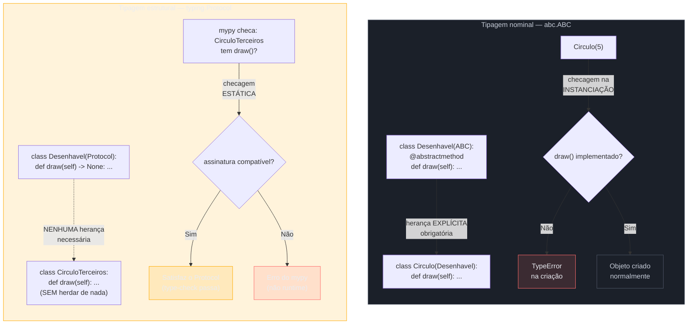
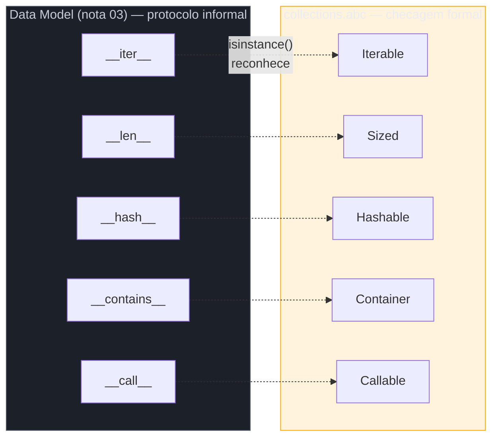

# ABC e Protocol — tipagem estrutural

> [!abstract] TL;DR
> Python oferece **duas** formas formais de dizer "este objeto se comporta como X", e elas resolvem problemas diferentes. **`abc.ABC` + `@abstractmethod`** é **tipagem nominal**: a classe precisa **herdar** explicitamente da ABC e implementar todo método marcado como abstrato — senão nem instancia (`TypeError` na hora de criar o objeto, não na hora de usá-lo). É o parente mais próximo de uma `interface` Java. **`typing.Protocol`** (PEP 544, Python 3.8+) é **tipagem estrutural**: uma classe "satisfaz" um Protocol só por **ter os métodos certos**, sem herdar de nada — é o duck typing do [[03 - O Data Model — dunder methods essenciais|Data Model]] (nota 03) formalizado, com verificação **estática** via mypy/pyright. Use ABC quando você controla a hierarquia e quer forçar implementação em tempo de instanciação (biblioteca própria, plugins). Use Protocol quando você **não controla** as classes que vão satisfazer o contrato (código de terceiros já escrito, biblioteca padrão, qualquer coisa que já tem o método certo mas não pode/deve herdar da sua classe). `@runtime_checkable` permite `isinstance()` com Protocol, mas só checa **presença** dos métodos — não assinatura, não tipos dos parâmetros. `collections.abc` fornece as ABCs built-in (`Iterable`, `Sized`, `Hashable`...) que espelham exatamente os dunders vistos na nota 03 — a mesma ideia, oficializada pela biblioteca padrão.

## O problema que abre esta nota

Um desenvolvedor está escrevendo uma função que renderiza uma lista de formas geométricas num canvas. Cada forma sabe se desenhar sozinha — ele só precisa de um método `.draw()`:

```python
def renderizar_todas(formas):
    for forma in formas:
        forma.draw()
```

Ele quer dar um **type hint** nessa função — `formas: list[???]` — para que o editor autocomplete e o `mypy` reclame se alguém passar algo sem `.draw()`. O problema: as formas vêm de lugares diferentes. Algumas são classes que ele mesmo escreveu (`Circulo`, `Retangulo`). Outras vêm de uma biblioteca de terceiros (`matplotlib.patches.Circle`, por exemplo) que também tem um método parecido, mas obviamente **não herda** de nenhuma classe base que ele possa inventar. E uma terceira forma é gerada por um plugin externo, cujo código-fonte ele nem tem acesso para editar.

A primeira tentativa, vinda de quem programou em Java, seria criar uma interface:

```python
from abc import ABC, abstractmethod

class Desenhavel(ABC):
    @abstractmethod
    def draw(self) -> None: ...


def renderizar_todas(formas: list[Desenhavel]) -> None:
    for forma in formas:
        forma.draw()
```

Funciona lindamente para `Circulo` e `Retangulo`, que ele escreveu e pode fazer herdar de `Desenhavel`. Mas quebra na hora de passar um objeto de terceiros: `matplotlib.patches.Circle` **já existe**, já tem `.draw()`, mas não herda de `Desenhavel` — porque a `matplotlib` foi escrita anos antes de `Desenhavel` existir, e obviamente não vai reescrever seu código para herdar de uma classe de outro projeto. Do ponto de vista de **execução**, `renderizar_todas([circle_matplotlib])` funciona perfeitamente — Python nunca checa herança em runtime para chamar `.draw()`, só chama. Mas o `mypy` reclama: `Argument has incompatible type "Circle"; expected "Desenhavel"`. O type checker está **certo** em reclamar segundo as regras de tipagem nominal — `Circle` não é declarado como `Desenhavel` — mas está **errado** em impedir um código que, na prática, roda sem problema nenhum.

Esse é exatamente o ponto onde `typing.Protocol` entra: um jeito de dizer "qualquer coisa com `.draw()` serve", verificável estaticamente, sem exigir herança de ninguém. Esta nota cobre as duas ferramentas — ABC primeiro, porque é mais familiar a quem vem de outras linguagens, e Protocol depois, como a resposta idiomaticamente Python ao mesmo problema.

## O que é

### `abc.ABC`: contrato explícito, checado na instanciação

O módulo [`abc`](https://docs.python.org/3/library/abc.html) da biblioteca padrão fornece a infraestrutura para **classes base abstratas** (Abstract Base Classes). A classe `ABC` é um atalho conveniente: herdar dela equivale a usar `ABCMeta` como metaclasse, sem precisar escrever `class Desenhavel(metaclass=ABCMeta)` manualmente. O decorador `@abstractmethod`, aplicado a um método dentro de uma classe que herda de `ABC`, marca esse método como **obrigatório**: qualquer subclasse concreta precisa sobrescrevê-lo.

```python
from abc import ABC, abstractmethod

class Desenhavel(ABC):
    @abstractmethod
    def draw(self) -> None:
        ...


class Circulo(Desenhavel):
    def __init__(self, raio):
        self.raio = raio
    # não implementou draw()!


circulo = Circulo(5)
```

```
TypeError: Can't instantiate abstract class Circulo with abstract method draw
```

O ponto central: o erro acontece **na criação do objeto** (`Circulo(5)`), não em algum momento posterior em que o código tenta chamar `.draw()` e descobre que não existe. Isso é bem diferente do que a nota 03 descreveu para o Data Model comum — lá, uma classe sem `__len__` simplesmente levanta `AttributeError` (ou nem participa do protocolo) quando alguém tenta usar `len()` nela; não há checagem antecipada nenhuma. Com ABC, a checagem acontece **antes**, de forma proativa, no momento de instanciar — o mesmo espírito de "falhar cedo e alto" que guia boa parte do design de exceções em Python, só que aqui aplicado à própria criação do objeto.

> [!question]- Por que ABC herda de `ABC` (uma classe) e não usa algum decorador de classe?
> Tecnicamente, `abc.ABC` é só um atalho — a mecânica real é a **metaclasse** `ABCMeta`. Uma metaclasse controla como a *classe em si* é construída (não as instâncias) e é o mecanismo que intercepta a chamada `Circulo(5)` para checar, antes de rodar `__init__`, se todos os métodos marcados com `@abstractmethod` foram sobrescritos. `class Desenhavel(ABC)` é equivalente a `class Desenhavel(metaclass=ABCMeta)` — herdar de `ABC` é só a forma mais legível de dizer "use `ABCMeta`". Metaclasses são um tópico avançado que este vault cobre em profundidade na [[08 - Metaclasses — introdução|nota 08]]; para os fins desta nota, basta saber que é esse mecanismo que dá à ABC seu poder de bloquear a instanciação.

Vale notar: um método abstrato **pode** ter implementação — não é proibido dar um corpo real ao método marcado com `@abstractmethod`. Segundo a [documentação oficial](https://docs.python.org/3/library/abc.html), a subclasse ainda é **obrigada** a sobrescrevê-lo, mas pode invocar a implementação da classe base via `super()` dentro da própria sobrescrita — um padrão útil quando a classe base quer fornecer um comportamento parcial reutilizável (por exemplo, logging comum) que toda subclasse deve **estender**, não substituir do zero:

```python
class Desenhavel(ABC):
    @abstractmethod
    def draw(self) -> None:
        print("Preparando canvas...")  # comportamento base reutilizável


class Circulo(Desenhavel):
    def draw(self) -> None:
        super().draw()          # reaproveita o comportamento da base
        print(f"Desenhando círculo de raio {self.raio}")
```

`abstractmethod` também combina com `@classmethod`, `@staticmethod` e `@property` — a ordem importa: `@abstractmethod` deve ser o decorador **mais interno** (mais próximo da definição do método), com os outros por cima:

```python
class Repositorio(ABC):
    @classmethod
    @abstractmethod
    def criar_conexao(cls) -> "Repositorio": ...

    @property
    @abstractmethod
    def total_registros(self) -> int: ...
```

### Comparando com interfaces de Java

Quem vem de Java reconhece o padrão imediatamente — `abc.ABC` é, de longe, o parente mais próximo de uma `interface`. Mas há diferenças que valem a pena nomear explicitamente:

| | Interface Java | `abc.ABC` do Python |
|---|---|---|
| Como declara conformidade | `class Circulo implements Desenhavel` | `class Circulo(Desenhavel)` — herança normal, não uma palavra-chave separada |
| Quando checa | Em **tempo de compilação** | Em **tempo de instanciação** (execução) — `Circulo(5)` levanta `TypeError` se faltar método |
| Pode ter implementação padrão? | Sim, desde Java 8 (`default` methods) | Sim, desde sempre — qualquer método abstrato pode ter corpo, acessível via `super()` |
| Múltipla "implementação" | `implements A, B, C` — comum e idiomático | Herança múltipla de ABCs — funciona (Python sempre permitiu herança múltipla, ver [[02 - Herança e MRO|nota 02]]), mas menos comum na prática |
| Registro sem herança | Não existe (sempre precisa `implements`) | Existe: `MinhaABC.register(OutraClasse)` — ver adiante |
| Verificação de "é subtipo" sem instanciar | `obj instanceof Desenhavel` — checado pelo compilador | `isinstance(obj, Desenhavel)` — checado em runtime, mas **exige herança real** (ou registro) |

O ponto mais estranho para quem vem de Java: em Python, o `TypeError` de instanciação não é uma checagem estática do "compilador" (Python não tem um, no sentido tradicional) — é uma checagem dinâmica feita pela metaclasse `ABCMeta` toda vez que `__call__` é invocado na classe (ou seja, toda vez que alguém escreve `Circulo(...)`). Isso significa que um bug de "esqueci de implementar `draw()`" só aparece quando **alguém tenta criar uma instância** — que pode ser bem depois de a classe ter sido escrita e até publicada, se nenhum teste instanciar aquela classe específica.

### Virtual subclasses: `register()`

Uma peculiaridade pouco conhecida do `abc` é o método `register()`, que permite declarar uma classe **já existente** (mesmo uma classe embutida, como `tuple`) como "subclasse virtual" de uma ABC, sem alterar seu código-fonte nem sua hierarquia real de herança:

```python
from abc import ABC

class MinhaABC(ABC):
    pass

MinhaABC.register(tuple)

issubclass(tuple, MinhaABC)   # True
isinstance((1, 2), MinhaABC)  # True
```

Segundo a [documentação oficial](https://docs.python.org/3/library/abc.html), classes registradas dessa forma **passam** em `isinstance()`/`issubclass()`, mas a ABC registradora **não aparece no MRO** da classe registrada, nem seus métodos ficam acessíveis via `super()`. É um mecanismo de "fingir herança" só para fins de checagem de tipo — útil para a biblioteca padrão integrar tipos embutidos (`tuple`, `list`) às ABCs de `collections.abc` sem reescrever `tuple` para herdar de `Sequence` de verdade. Na prática, código de aplicação raramente usa `register()` diretamente — mas vale reconhecer o padrão ao ler código de biblioteca, e é a ponte conceitual para entender por que `typing.Protocol`, quando `@runtime_checkable`, também é implementado internamente como uma ABC.



## Por que importa

A escolha entre ABC e Protocol não é estética — ela reflete uma pergunta concreta sobre **quem controla o código das classes envolvidas**. Se você é dono da hierarquia inteira (uma biblioteca própria de plugins, por exemplo, onde você define a interface e escreve — ou revisa — todo código que a implementa), ABC dá uma garantia forte e antecipada: ninguém consegue publicar um plugin quebrado, porque ele simplesmente não instancia. Se você **não** controla as classes que precisam satisfazer seu contrato — código de terceiros já escrito, tipos da biblioteca padrão, ou simplesmente qualquer coisa que já tem o método certo sem que você possa (ou deva) forçá-la a herdar da sua classe — ABC é inviável: você não pode reescrever `matplotlib.patches.Circle` para herdar de `Desenhavel`. Protocol resolve exatamente esse caso, e é justamente aí que ele se conecta de volta à filosofia do Data Model vista na [[03 - O Data Model — dunder methods essenciais|nota 03]]: "a classe é o que ela faz, não o que ela declara herdar" — só que agora com uma ferramenta que permite ao `mypy` **verificar isso estaticamente**, algo que o duck typing informal nunca ofereceu.

A [Real Python](https://realpython.com/python-protocol/) resume essa tensão como o contraste entre **duck typing dinâmico** (o que Python sempre fez: só tenta chamar o método e vê no que dá) e **duck typing estático** (o que Protocol viabiliza: um type checker confirma, antes do código rodar, que o método existe com a assinatura certa). Antes de `Protocol` existir (PEP 544, aceita para Python 3.8, 2019), ferramentas como `mypy` só sabiam checar tipagem **nominal** — baseada em `class X(Y)` — porque não havia forma declarativa de dizer "qualquer coisa com esse formato serve". Isso forçava um dilema real em bases de código bem tipadas: ou você usava `Any` (perdendo toda checagem) para aceitar "qualquer coisa com `.draw()`", ou inventava uma ABC artificial e obrigava tudo — inclusive tipos de terceiros, via wrappers estranhos — a herdar dela. `Protocol` fecha essa lacuna.

> [!warning] Protocol não é "ABC sem herança" — é uma categoria de tipo diferente
> É tentador pensar em Protocol como "uma ABC preguiçosa que não obriga herança". A diferença é mais funda: uma ABC participa da **hierarquia de classes em runtime** — `isinstance()`, MRO, `super()` — mesmo quando ninguém instancia diretamente. Um Protocol, por padrão, é **invisível em runtime**: ele existe só para o type checker (`mypy`, `pyright`) analisar o código **antes** de rodar. Sem `@runtime_checkable`, tentar `isinstance(obj, MeuProtocol)` levanta `TypeError: Instance and class checks can only be used with @runtime_checkable protocols` — porque, por padrão, um Protocol não vira uma ABC de verdade nos bastidores. Confundir os dois leva a código que passa no `mypy` mas quebra em produção com um `TypeError` de `isinstance`, ou vice-versa.

## Como funciona

### `typing.Protocol`: o contrato sem herança

Um `Protocol` se declara quase como uma classe normal, herdando de `typing.Protocol`, com os métodos que definem o contrato — mas **sem implementação real** (tipicamente `...` como corpo, já que o Protocol nunca é instanciado diretamente):

```python
from typing import Protocol

class Desenhavel(Protocol):
    def draw(self) -> None: ...


def renderizar_todas(formas: list[Desenhavel]) -> None:
    for forma in formas:
        forma.draw()
```

Agora, **qualquer** classe com um método `draw(self) -> None` satisfaz o tipo `Desenhavel` — sem herdar de nada:

```python
class Circulo:
    def __init__(self, raio: float):
        self.raio = raio

    def draw(self) -> None:
        print(f"Círculo de raio {self.raio}")


class Retangulo:
    def __init__(self, largura: float, altura: float):
        self.largura = largura
        self.altura = altura

    def draw(self) -> None:
        print(f"Retângulo {self.largura}x{self.altura}")


formas: list[Desenhavel] = [Circulo(5), Retangulo(3, 4)]
renderizar_todas(formas)   # mypy aprova as duas — nenhuma herda de Desenhavel
```

`mypy --strict` aceita esse código de bom grado — `Circulo` e `Retangulo` são, estruturalmente, `Desenhavel`, sem que nenhuma linha declare essa relação explicitamente. Segundo a [especificação oficial de tipagem](https://typing.python.org/en/latest/spec/protocol.html), essa checagem é feita membro a membro: para cada método/atributo declarado no `Protocol`, o type checker verifica se a classe candidata tem um membro compatível (mesmo nome, assinatura compatível). Se `Circulo.draw` tivesse uma assinatura diferente — por exemplo, exigindo um argumento extra — o `mypy` reportaria erro **na chamada**, não numa declaração de herança que nunca existiu.

### `@runtime_checkable`: isinstance() com limitações reais

Por padrão, um `Protocol` não pode ser usado com `isinstance()` ou `issubclass()` — ele é uma ferramenta de análise estática, não uma checagem de runtime. O decorador `@runtime_checkable` habilita essa checagem:

```python
from typing import Protocol, runtime_checkable

@runtime_checkable
class Desenhavel(Protocol):
    def draw(self) -> None: ...


class Circulo:
    def draw(self) -> None:
        print("desenhando")


print(isinstance(Circulo(), Desenhavel))   # True — tem draw()
print(isinstance("string qualquer", Desenhavel))  # False — não tem draw()
```

O ponto crítico, documentado tanto na [especificação de typing](https://typing.python.org/en/latest/spec/protocol.html) quanto reforçado pela [Real Python](https://realpython.com/python-protocol/): essa checagem **só confirma que o método existe**, não que a **assinatura** está correta. Uma classe com um `draw(self, cor)` (que exige um argumento extra) ainda passa em `isinstance(obj, Desenhavel)` — o runtime não tem como inspecionar assinaturas de forma barata e confiável a cada checagem, então ele simplesmente confirma presença via algo próximo de `hasattr()`.

```python
class DrawFalso:
    def draw(self, cor):  # assinatura incompatível com o Protocol!
        pass


print(isinstance(DrawFalso(), Desenhavel))  # True — só checou que draw() existe
DrawFalso().draw()  # TypeError em runtime: draw() faltando argumento
```

> [!warning] `isinstance()` com Protocol é uma checagem fraca — prefira o mypy para o contrato completo
> A checagem de `isinstance()` com `@runtime_checkable` é útil para um filtro rápido ("esse objeto sequer tenta ser um X?"), mas **não substitui** a verificação estática do type checker. Se a correção do contrato importa de verdade — não só "o método existe", mas "o método aceita os argumentos certos e devolve o tipo certo" — a ferramenta certa é rodar `mypy`/`pyright` sobre o código, não confiar em `isinstance()` em produção. Além disso, `isinstance()` com Protocol tem custo de performance mensuravelmente maior que com uma classe normal (a checagem percorre os membros do protocolo um a um), então usar em loops quentes é um antipadrão de performance, não só de precisão.

Outra assimetria documentada pela [especificação oficial](https://typing.python.org/en/latest/spec/protocol.html): `isinstance()` funciona tanto com Protocols "de dados" (que incluem atributos, não só métodos) quanto "sem dados" (só métodos) — mas `issubclass()` só funciona com Protocols **sem** atributos de dados, porque atributos de instância (definidos em `__init__`, por exemplo) não são visíveis a partir da **classe** sem instanciar nada.

```python
@runtime_checkable
class ComTamanho(Protocol):
    tamanho: int   # atributo de dado, não método

    def draw(self) -> None: ...


issubclass(Circulo, ComTamanho)  # TypeError — Protocol tem atributo de dado
```

### Protocol pode ser explicitamente subclasseado (mas não precisa)

Nada impede uma classe de herdar de um `Protocol` de propósito — isso é permitido e, às vezes, útil como forma de **documentar a intenção** de satisfazer aquele contrato, mesmo que não seja tecnicamente necessário para o type checker aprovar:

```python
class CirculoExplicito(Desenhavel):   # herda por clareza, não por obrigação
    def draw(self) -> None:
        print("círculo, herdando de propósito")
```

A diferença central em relação a ABC: essa herança é **opcional**. `CirculoExplicito` funcionaria exatamente igual, e passaria no `mypy` da mesma forma, sem essa linha de herança — a herança aqui é só uma escolha estilística de deixar explícito no código-fonte "esta classe pretende satisfazer este Protocol", útil em bases de código grandes onde a intenção pode não ser óbvia.

### `collections.abc`: as ABCs que espelham o Data Model

A biblioteca padrão fornece, no módulo [`collections.abc`](https://docs.python.org/3/library/collections.abc.html), um conjunto de ABCs que **formalizam** exatamente os protocolos informais vistos na nota 03 — cada uma corresponde a um ou mais dunder methods:

| ABC | Dunder(s) exigido(s) | Corresponde a (nota 03) |
|---|---|---|
| `Iterable` | `__iter__` | protocolo de iteração |
| `Sized` | `__len__` | `len(obj)` |
| `Hashable` | `__hash__` | contrato de hashabilidade |
| `Container` | `__contains__` | operador `in` |
| `Callable` | `__call__` | objetos "chamáveis" (nota 07) |
| `Sequence` | `__len__`, `__getitem__` (+ mixins: `__contains__`, `__iter__`, `.index()`, `.count()`...) | o padrão `BaralhoFrances` da nota 03 |

O detalhe mais importante, e mais fácil de confundir, é que `Iterable` **não detecta** o fallback via `__getitem__` que a nota 03 explicou:

```python
from collections.abc import Iterable

class BaralhoFrances:
    def __len__(self): ...
    def __getitem__(self, i): ...
    # sem __iter__ explícito


baralho = BaralhoFrances()
for carta in baralho:               # FUNCIONA — usa o fallback via __getitem__
    ...

isinstance(baralho, Iterable)        # False! — Iterable só reconhece __iter__ real
```

Segundo a [documentação oficial](https://docs.python.org/3/library/collections.abc.html), `isinstance(obj, Iterable)` detecta classes registradas como `Iterable` ou que **implementam `__iter__()`** — não detecta classes que só são iteráveis pelo mecanismo legado de `__getitem__`. É uma pegadinha real: um objeto pode funcionar perfeitamente com `for` e, ainda assim, reprovar em `isinstance(obj, Iterable)`. A lição prática: se a classe pretende ser genuinamente reconhecida como `Iterable` (por exemplo, porque outro código faz essa checagem antes de iterar), ela precisa de `__iter__` explícito — não basta o fallback de `__getitem__`, por mais que ele "funcione" na prática do `for`.

As ABCs de `collections.abc` funcionam tanto como **checagem** (`isinstance(x, Sized)`) quanto como **classe base real** para herança direta — diferente de `Protocol`, que raramente serve como base útil para herdar comportamento (um Protocol normalmente não tem implementação nenhuma). Herdar de `Sequence`, por exemplo, dá de graça `__contains__`, `__iter__`, `__reversed__`, `.index()` e `.count()` a partir de só `__len__` e `__getitem__` — um "mixin" fornecido pela própria ABC, aproveitando a mesma ideia de composição por herança que a nota 02 já discutiu para MRO.



## Na prática: reescrevendo o problema de abertura

Voltando ao exemplo de `renderizar_todas` — a versão idiomática combina o melhor dos dois mundos: `Protocol` para o contrato de "qualquer coisa desenhável", e uma ABC própria só onde faz sentido controlar uma hierarquia real (por exemplo, um conjunto de formas nativas da própria aplicação que compartilham lógica comum):

```python
from abc import ABC, abstractmethod
from typing import Protocol, runtime_checkable


@runtime_checkable
class Desenhavel(Protocol):
    """Contrato estrutural: qualquer coisa com draw() serve."""
    def draw(self) -> None: ...


class FormaNativa(ABC):
    """Base concreta para formas que a própria aplicação define,
    com lógica compartilhada real (não só um contrato)."""

    def __init__(self, cor: str):
        self.cor = cor

    @abstractmethod
    def area(self) -> float: ...

    def draw(self) -> None:
        print(f"Desenhando {type(self).__name__} ({self.cor}), área={self.area():.2f}")


class Circulo(FormaNativa):
    def __init__(self, raio: float, cor: str = "preto"):
        super().__init__(cor)
        self.raio = raio

    def area(self) -> float:
        return 3.14159 * self.raio ** 2


# Uma classe de terceiros, sem relação nenhuma com FormaNativa:
class RetanguloDeOutraLib:
    def __init__(self, largura, altura):
        self.largura, self.altura = largura, altura

    def draw(self) -> None:
        print(f"Retângulo externo {self.largura}x{self.altura}")


def renderizar_todas(formas: list[Desenhavel]) -> None:
    for forma in formas:
        if isinstance(forma, Desenhavel):   # checagem defensiva em runtime
            forma.draw()


renderizar_todas([Circulo(5, "vermelho"), RetanguloDeOutraLib(3, 4)])
```

`FormaNativa` usa ABC porque a aplicação **é dona** da hierarquia — quer forçar `area()` em toda forma nativa, e quer reaproveitar `draw()` de verdade via herança (não é só um contrato de nomes, é comportamento compartilhado). `Desenhavel` usa Protocol porque `RetanguloDeOutraLib` não pode (nem deveria) ser reescrita para herdar de `FormaNativa` — ela só precisa "parecer" desenhável, e já parece, de graça.

> [!question]- Preciso escolher um ou outro para o projeto inteiro?
> Não — e forçar essa escolha é o erro mais comum de quem chega nesse tópico vindo de uma linguagem com um único mecanismo de interface. ABC e Protocol coexistem no mesmo código-base, cada um resolvendo a parte do problema em que é mais forte: ABC onde você é dono da hierarquia e quer forçar implementação; Protocol onde o contrato precisa valer para código que você não controla. A biblioteca padrão do próprio Python faz isso — `collections.abc` usa ABCs de verdade (com herança real e `isinstance()` nativo), enquanto módulos de tipagem moderna (como partes de `typing` e bibliotecas como `Pydantic`) se apoiam fortemente em Protocol para aceitar "qualquer coisa com essa forma".

## Armadilhas

### (1) Achar que Protocol substitui ABC em todo caso
Se a classe precisa de **implementação compartilhada real** (não só um contrato de nomes) e você controla toda a hierarquia, ABC continua sendo a ferramenta certa — Protocol tipicamente não carrega implementação nenhuma (é raro e desencorajado dar corpo real aos métodos de um Protocol, embora tecnicamente possível via **Protocolos explícitos com mixin**, um caso avançado).

### (2) Esperar que `isinstance()` com `@runtime_checkable` valide assinaturas
Já coberto no `[!warning]` acima — a checagem confirma só **presença** do método, não compatibilidade de parâmetros/retorno. Um `TypeError` em runtime na hora de *chamar* o método ainda é possível mesmo depois de um `isinstance()` positivo.

### (3) Usar `Protocol` sem `@runtime_checkable` e tentar `isinstance()`
```python
class Desenhavel(Protocol):
    def draw(self) -> None: ...

isinstance(objeto, Desenhavel)
```
```
TypeError: Instance and class checks can only be used with @runtime_checkable protocols
```
Esquecer o decorador é o erro mais comum ao migrar de "só uso Protocol para type hints" para "quero checar em runtime também".

### (4) Confundir `Iterable` de `collections.abc` com "funciona no `for`"
Já demonstrado acima: uma classe pode funcionar perfeitamente com `for` (via fallback de `__getitem__`) e ainda assim reprovar em `isinstance(obj, Iterable)`. Se código downstream depende dessa checagem, o fallback legado não é suficiente — é preciso `__iter__` explícito.

### (5) Herança múltipla de ABCs sem pensar no MRO
ABCs participam do MRO normalmente — herdar de duas ABCs que definem o mesmo método abstrato de formas incompatíveis cai exatamente nas mesmas regras de linearização C3 vistas na [[02 - Herança e MRO|nota 02]]. Protocol, por outro lado, não costuma gerar esse problema na prática, já que raramente é usado como base de herança múltipla real.

## Em entrevista

Perguntas previsíveis sobre este tópico:

- **"Qual a diferença entre `abc.ABC` e `typing.Protocol`?"** ABC é tipagem nominal — a classe precisa herdar explicitamente e implementar todo método `@abstractmethod`, checado em tempo de instanciação (`TypeError` se faltar algo). Protocol é tipagem estrutural — uma classe satisfaz o contrato só por ter os métodos certos, sem herdar de nada, checado estaticamente por ferramentas como mypy/pyright.
- **"Quando você usaria ABC em vez de Protocol?"** Quando você controla a hierarquia inteira e quer forçar, em tempo de instanciação, que toda subclasse implemente certos métodos — tipicamente uma biblioteca própria de plugins, ou uma família de classes que compartilha implementação real via herança, não só um contrato de nomes.
- **"E quando Protocol em vez de ABC?"** Quando você não controla (ou não deveria alterar) as classes que precisam satisfazer o contrato — código de terceiros já escrito, tipos da biblioteca padrão, ou qualquer coisa que já "parece" o tipo certo sem herdar de nada seu. É a formalização estática do duck typing que o Data Model já praticava informalmente.
- **"`isinstance()` funciona com Protocol?"** Só se a classe for decorada com `@runtime_checkable` — e mesmo assim, a checagem confirma apenas a **presença** dos métodos, não a compatibilidade de assinatura. Um objeto pode passar em `isinstance()` e ainda assim levantar `TypeError` ao ser chamado, se os parâmetros não baterem.
- **"O que é `collections.abc.Iterable` e por que `isinstance(obj, Iterable)` pode dar `False` mesmo quando `for x in obj` funciona?"** `Iterable` só reconhece classes com `__iter__()` real (ou registradas explicitamente). O fallback legado de iteração via `__getitem__`, coberto na nota 03, faz `for` funcionar sem que a classe seja formalmente reconhecida como `Iterable`.
- **"Qual o equivalente Python de uma interface Java?"** `abc.ABC` com `@abstractmethod` é o mais próximo estruturalmente (herança explícita, checagem obrigatória), mas a diferença central é *quando* a checagem acontece: Java checa em compilação; Python checa na instanciação, em runtime. `Protocol` não tem equivalente direto em Java clássico — é mais próximo de interfaces estruturais como as de TypeScript ou Go.

### How to explain in English

> Python has two formal ways to say "this object behaves like X." `abc.ABC` with `@abstractmethod` is **nominal typing**: a class must explicitly inherit from the ABC and implement every abstract method, or it simply can't be instantiated — Python raises `TypeError` the moment you try to create an object, not later when a missing method gets called. It's the closest relative to a Java interface, except the check happens at instantiation time (runtime), not compile time. `typing.Protocol` (PEP 544, Python 3.8+) is **structural typing**: a class satisfies a Protocol just by having the right methods, with no inheritance required at all — it's Python's duck typing, made explicit and statically checkable by tools like mypy and pyright. Use ABC when you own the class hierarchy and want to force implementation at instantiation time — your own plugin system, or a family of classes that share real behavior via inheritance. Use Protocol when you don't control the classes that need to satisfy your contract — third-party code, standard library types, anything that already "quacks right" without being able (or willing) to inherit from your base class. `@runtime_checkable` lets you use `isinstance()` with a Protocol, but it only confirms method **presence**, not signature compatibility — an object can pass the isinstance check and still raise a `TypeError` when actually called with the wrong arguments. `collections.abc` provides the standard library's own ABCs — `Iterable`, `Sized`, `Hashable`, `Sequence` — which formalize exactly the dunder-based protocols the Data Model already uses informally, though `isinstance(obj, Iterable)` notably fails to detect the legacy `__getitem__`-based iteration fallback.

| Termo PT | Termo EN |
|---|---|
| tipagem nominal | nominal typing |
| tipagem estrutural | structural typing / structural subtyping |
| classe base abstrata | abstract base class (ABC) |
| método abstrato | abstract method |
| subclasse virtual | virtual subclass |
| checagem em tempo de instanciação | instantiation-time check |
| checagem estática de tipos | static type checking |
| checagem em tempo de execução | runtime check |
| duck typing estático | static duck typing |
| satisfazer um contrato | satisfy a contract / conform to a protocol |
| assinatura (de método) | signature |
| dono da hierarquia | owner of the hierarchy |

## O que vem a seguir

Com ABC e Protocol entendidos — as duas formas de formalizar "este objeto se comporta como X" —, a próxima nota mergulha em como fazer objetos participarem de mais operações nativas da linguagem além das vistas no Data Model básico: sobrecarga de operadores aritméticos (`__add__`, `__radd__`, `__iadd__`), objetos "chamáveis" (`__call__` — que é justamente o dunder por trás de `collections.abc.Callable`, visto nesta nota) e context managers implementados como classe (`__enter__`/`__exit__`). A [[07 - Operator overloading e protocolos avançados|nota 07]] fecha o círculo do Data Model iniciado na nota 03, agora na fase Magus do galho.

## Veja também

- [[03-Dominios/Tecnologia/Python/OO e Data Model/03 - O Data Model — dunder methods essenciais|03 — O Data Model: dunder methods essenciais]] — o duck typing informal que esta nota formaliza; `collections.abc` espelha diretamente os dunders vistos lá
- [[03-Dominios/Tecnologia/Python/OO e Data Model/02 - Herança e MRO|02 — Herança e MRO]] — MRO e herança múltipla, relevante para hierarquias de ABC
- [[03-Dominios/Tecnologia/Python/OO e Data Model/05 - Dataclasses|05 — Dataclasses]] — `@dataclass` como outra forma de reduzir boilerplate em classes que participam de protocolos
- [[03-Dominios/Tecnologia/Python/OO e Data Model/08 - Metaclasses — introdução|08 — Metaclasses: introdução]] — o mecanismo (`ABCMeta`) por trás de como `abc.ABC` bloqueia a instanciação
- [[03-Dominios/Tecnologia/Python/OO e Data Model/07 - Operator overloading e protocolos avançados|07 — Operator overloading e protocolos avançados]] — próxima nota do galho
- [[03-Dominios/Tecnologia/Python/Tipagem moderna/index|Tipagem moderna]] — Galho 5: type hints em profundidade, mypy/pyright, Pydantic (aqui só o suficiente para entender Protocol)
- [[03-Dominios/Tecnologia/Python/OO e Data Model/index|OO e Data Model]] — MOC do galho
- [[03-Dominios/Tecnologia/Python/index|Trilha Python]]

## Fontes

- Python Software Foundation. *abc — Abstract Base Classes*. docs.python.org, versão 3.14. https://docs.python.org/3/library/abc.html (acessado em 2026-07-09)
- Python Software Foundation. *collections.abc — Abstract Base Classes for Containers*. docs.python.org, versão 3.14. https://docs.python.org/3/library/collections.abc.html (acessado em 2026-07-09)
- Levkivskyi, I.; Torsvik, J.; Boskovic, G.; van Rossum, G.; Lehtosalo, J. *PEP 544 — Protocols: Structural subtyping (static duck typing)*. peps.python.org, 2017 (aceita para Python 3.8). https://peps.python.org/pep-0544/ (acessado em 2026-07-09)
- Python typing community. *Protocols and structural subtyping*. typing.python.org (especificação oficial de typing). https://typing.python.org/en/latest/spec/protocol.html (acessado em 2026-07-09)
- Real Python. *Python Protocols: Leveraging Structural Subtyping*. https://realpython.com/python-protocol/ (acessado em 2026-07-09)
- Real Python. *Duck Typing in Python: Writing Flexible and Decoupled Code*. https://realpython.com/duck-typing-python/ (acessado em 2026-07-09)
- Real Python. *abstract base class (ABC) — Python Glossary*. https://realpython.com/ref/glossary/abstract-base-class/ (acessado em 2026-07-09)
- mypy documentation. *Protocols and structural subtyping*. mypy.readthedocs.io. https://mypy.readthedocs.io/en/stable/protocols.html (acessado em 2026-07-09)
- Ramalho, L. *Fluent Python: Clear, Concise, and Effective Programming*, 2ª ed. — capítulos sobre "goose typing" (ABCs) e Protocols (structural typing). O'Reilly Media, 2022.
- Adam Johnson. *Python type hints: duck typing with Protocol*. adamj.eu, 2021. https://adamj.eu/tech/2021/05/18/python-type-hints-duck-typing-with-protocol/ (acessado em 2026-07-09)
