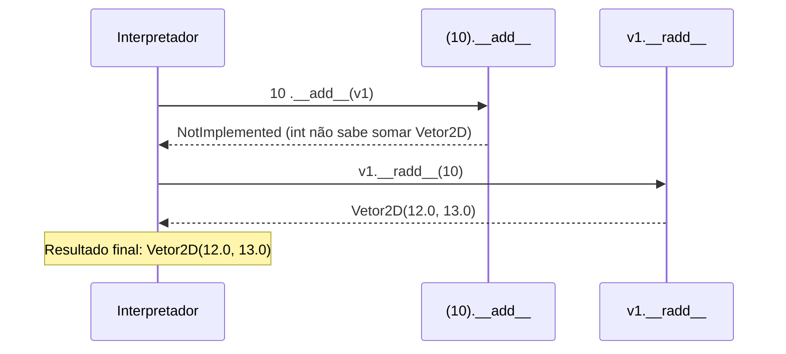
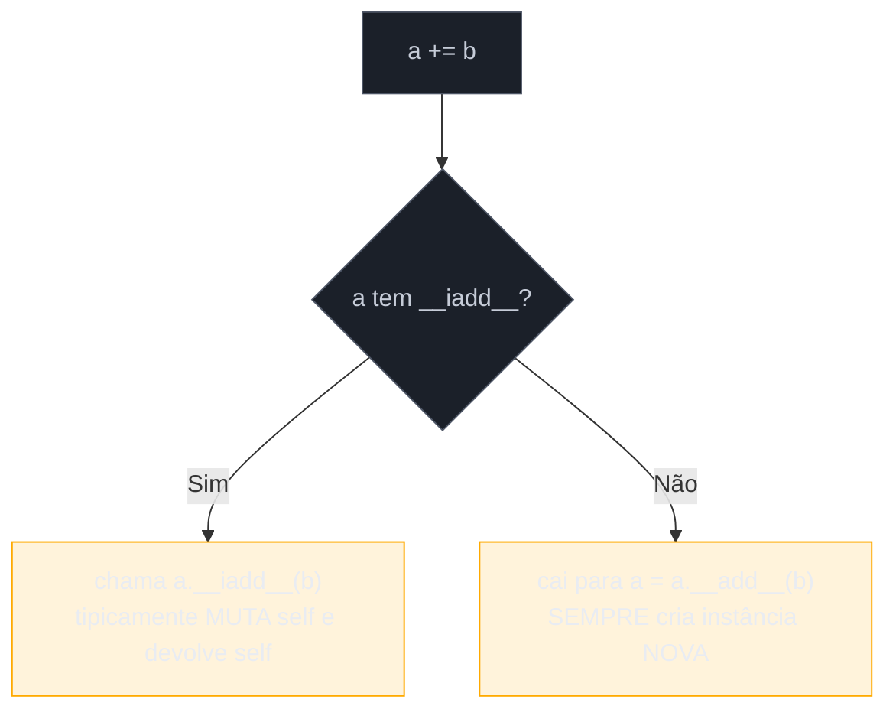
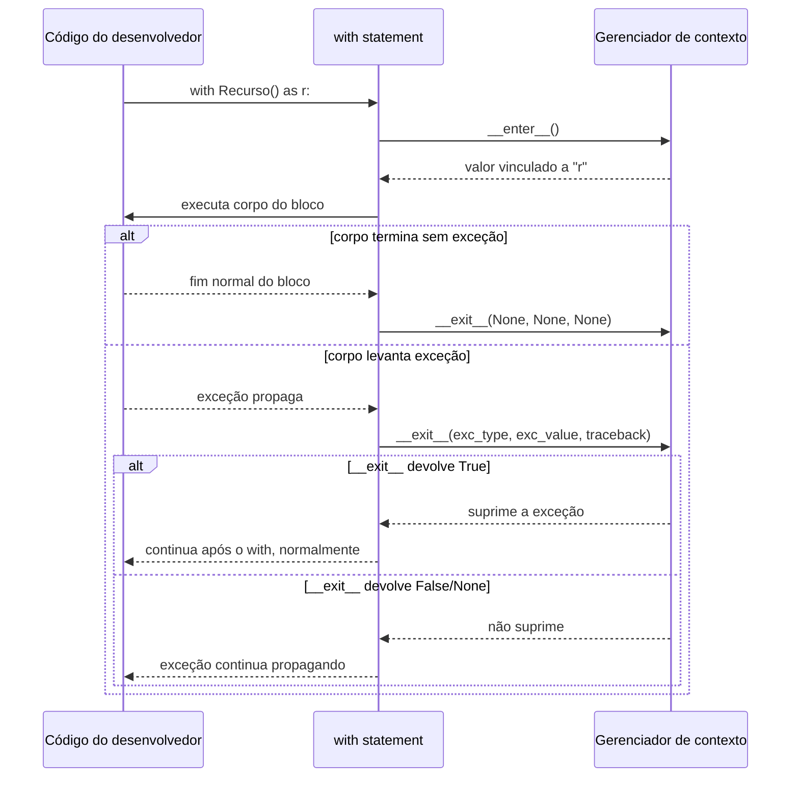

# Operator overloading e protocolos avançados

> [!abstract] TL;DR
> A [[03 - O Data Model — dunder methods essenciais|nota 03]] cobriu os dunders que fazem um objeto se comportar como container/valor (`__repr__`, `__eq__`, `__len__`, `__getitem__`, `__iter__`). Esta nota avança para três protocolos que fazem um objeto se comportar como **operando**, **função** e **recurso gerenciável**. **Operator overloading**: `a + b` chama `a.__add__(b)`; se isso devolver `NotImplemented` (não uma exceção — um valor sentinela), Python tenta `b.__radd__(a)` antes de desistir com `TypeError`. `+=` chama `__iadd__` quando existe — e a diferença entre `__add__` e `__iadd__` é a diferença entre criar uma instância nova e mutar a existente. **`__call__`** torna uma instância chamável como função (`instancia()`) — a base de decorators com estado e *functors*. **`__enter__`/`__exit__`** são o mecanismo completo por trás do `with` statement — dois métodos, nenhuma mágica: `__enter__` prepara o recurso e devolve o que vai para o `as`; `__exit__` recebe `(exc_type, exc_value, traceback)` e, se devolver um valor truthy, **suprime** a exceção que estava se propagando. `contextlib.contextmanager` é a alternativa baseada em generator para escrever o mesmo protocolo com metade do código.

## O bug que abre esta nota

O desenvolvedor da [[03 - O Data Model — dunder methods essenciais|nota anterior]] já tem seu `Vetor2D` funcionando bem — igualdade, hash, indexação, iteração. Agora ele quer somar vetores, porque é isso que se faz com vetores:

```python
class Vetor2D:
    def __init__(self, x, y):
        self.x = float(x)
        self.y = float(y)

    def __repr__(self):
        return f"Vetor2D({self.x!r}, {self.y!r})"

    def __add__(self, outro):
        return Vetor2D(self.x + outro.x, self.y + outro.y)


v1 = Vetor2D(2, 3)
v2 = Vetor2D(4, 5)

print(v1 + v2)   # Vetor2D(6.0, 8.0) — funciona!
```

Até aí, tudo certo. Mas ele quer um recurso extra bem comum em bibliotecas de vetores/matrizes: somar um vetor a um "deslocamento uniforme" representado por um número puro, tipo `v1 + 10` significando "some 10 a cada componente". E, por simetria matemática básica, `10 + v1` deveria funcionar exatamente igual — soma é comutativa. A primeira metade funciona:

```python
class Vetor2D:
    # ... __init__, __repr__ como antes ...

    def __add__(self, outro):
        if isinstance(outro, Vetor2D):
            return Vetor2D(self.x + outro.x, self.y + outro.y)
        if isinstance(outro, (int, float)):
            return Vetor2D(self.x + outro, self.y + outro)
        return NotImplemented


v1 = Vetor2D(2, 3)
print(v1 + 10)     # Vetor2D(12.0, 13.0) — funciona
```

Mas a segunda metade explode:

```python
print(10 + v1)
```

```
Traceback (most recent call last):
  File "vetor.py", line 15, in <module>
    print(10 + v1)
          ~~~^~~~
TypeError: unsupported operand type(s) for +: 'int' and 'Vetor2D'
```

O que está acontecendo? `10 + v1` não chama `Vetor2D.__add__` — chama `int.__add__(10, v1)` primeiro, porque `10` é o operando da **esquerda**. E o `int` embutido do Python, obviamente, não tem a menor ideia do que fazer com um `Vetor2D` — devolve `NotImplemented` (não levanta exceção; devolve um valor sentinela dizendo "não sei lidar com isso"). Nesse ponto, o Python **deveria** tentar o "espelho" da operação no outro operando — mas para isso `Vetor2D` precisa implementar um método específico para operações refletidas, e ele não implementou. Sem esse método, o Python desiste e levanta `TypeError`.

Esse é o primeiro dos três protocolos avançados desta nota: **sobrecarga de operadores** com o mecanismo de *fallback* que resolve exatamente esse bug. Os outros dois — tornar um objeto chamável como função, e escrever o protocolo completo por trás do `with` — completam o conjunto de ferramentas que fazem uma classe Python se comportar como qualquer coisa que a linguagem já sabe manipular nativamente.

## O que é

Três protocolos distintos, todos seguindo a mesma filosofia da [[03 - O Data Model — dunder methods essenciais|nota 03]]: implemente os métodos certos, ganhe o comportamento de graça, sem herdar de nada especial.

1. **Sobrecarga de operadores aritméticos** (`__add__`, `__radd__`, `__iadd__`, e a família equivalente para `-`, `*`, `/`, etc.) — permite que instâncias de uma classe participem de expressões com `+`, `-`, `*`, `/`, `+=`, e assim por diante, do mesmo jeito que `int` e `float` participam.
2. **`__call__`** — permite que uma instância seja invocada com `()`, como se fosse uma função.
3. **O protocolo de gerenciamento de contexto** (`__enter__`/`__exit__`) — o mecanismo exato que o `with` statement usa por baixo dos panos, formalizado desde a [PEP 343](https://peps.python.org/pep-0343/) (Python 2.5, 2006) como parte oficial da linguagem.

Segundo a [documentação oficial do Data Model](https://docs.python.org/3/reference/datamodel.html#emulating-numeric-types), os métodos que emulam tipos numéricos (`__add__`, `__sub__`, `__mul__`...) "devem devolver `NotImplemented` se não implementam a operação para os operandos fornecidos" — é esse contrato, não uma exceção customizada, que aciona o mecanismo de fallback que resolve o bug de abertura.

## Por que importa

Esses três protocolos aparecem constantemente em código Python de produção, mesmo em bases que nunca definem uma classe numérica customizada:

- **Operator overloading** é o que faz bibliotecas como NumPy, Pandas e `datetime` (`data2 - data1` devolvendo um `timedelta`) funcionarem com a sintaxe matemática natural em vez de métodos verbosos (`vetor.somar(outro)`). Segundo a [Real Python](https://realpython.com/operator-function-overloading/), sobrecarregar operadores "permite que classes definidas pelo usuário interajam com operadores embutidos do Python de forma natural" — é a mesma filosofia de "encaixar na linguagem" da nota anterior, aplicada a aritmética em vez de containers.
- **`__call__`** é a base de decorators com estado (um decorator que precisa lembrar quantas vezes foi chamado, por exemplo, não consegue guardar esse estado numa função simples sem recorrer a truques de closure ou atributo de função) e de *functors* — objetos que encapsulam tanto dados quanto uma operação sobre eles, um padrão comum em código de callback e pipelines de processamento.
- O protocolo `__enter__`/`__exit__` é, segundo a própria [PEP 343](https://peps.python.org/pep-0343/), uma forma de "fatorar usos padronizados de `try`/`finally`" — o `with` statement que qualquer código Python usa para abrir arquivos (`with open(...) as f:`) não é sintaxe especial da linguagem no sentido de ser inexplicável: é açúcar sintático sobre dois métodos que **qualquer classe** pode implementar. Entender esse protocolo é o que separa "sei usar `with`" de "sei escrever minha própria classe que se comporta como recurso gerenciável" — conexões de banco, locks, transações, medição de tempo, tudo isso vira gerenciador de contexto customizado com o mesmo padrão.

## Como funciona

### `__add__`, `__radd__` e o algoritmo de despacho duplo

Quando o interpretador avalia `a + b`, ele não chama só `a.__add__(b)` — segue um algoritmo com até duas tentativas, descrito na documentação como parte do protocolo de [tipos numéricos emulados](https://docs.python.org/3/reference/datamodel.html#object.__add__):

1. Chama `a.__add__(b)`. Se o resultado **não** for `NotImplemented`, esse é o resultado final.
2. Se `a.__add__(b)` devolver `NotImplemented` (ou `a` nem tiver `__add__`), o Python tenta o operando da direita: chama `b.__radd__(a)`.
3. Se `b.__radd__(a)` também devolver `NotImplemented` (ou `b` não tiver `__radd__`), o Python desiste e levanta `TypeError: unsupported operand type(s) for +: ...`.

Esse mecanismo — chamado de **double dispatch** — é o que resolve o bug de abertura. `10 + v1` primeiro tenta `(10).__add__(v1)`; o `int` não sabe lidar com `Vetor2D`, devolve `NotImplemented`; o Python então tenta `v1.__radd__(10)` — que só existe se a classe `Vetor2D` a implementar explicitamente:

```python
class Vetor2D:
    def __init__(self, x, y):
        self.x = float(x)
        self.y = float(y)

    def __repr__(self):
        return f"Vetor2D({self.x!r}, {self.y!r})"

    def __add__(self, outro):
        if isinstance(outro, Vetor2D):
            return Vetor2D(self.x + outro.x, self.y + outro.y)
        if isinstance(outro, (int, float)):
            return Vetor2D(self.x + outro, self.y + outro)
        return NotImplemented

    def __radd__(self, outro):
        # a adição de vetor com escalar é comutativa — reaproveita __add__
        return self.__add__(outro)


v1 = Vetor2D(2, 3)

print(v1 + 10)    # Vetor2D(12.0, 13.0) — via __add__
print(10 + v1)    # Vetor2D(12.0, 13.0) — via __radd__, agora funciona
```



Note que `__radd__` aqui só delega para `__add__` — um padrão comum quando a operação é comutativa (soma é; subtração e divisão **não** são, e exigem um `__rsub__`/`__rtruediv__` que inverta a ordem dos operandos corretamente: `outro - self`, não `self - outro`).

> [!warning] `NotImplemented` não é uma exceção — não confundir com `NotImplementedError`
> `NotImplemented` (sem parênteses, sem "Error") é um **valor sentinela** singleton, devolvido com `return`, sinalizando "esta operação não sabe lidar com esse tipo de operando — tente outra coisa". `NotImplementedError` **é** uma exceção, levantada com `raise`, tipicamente usada em métodos abstratos que uma subclasse deveria sobrescrever. Devolver `NotImplemented` de um método de operador é o comportamento correto e esperado sempre que o tipo do operando não é suportado — **nunca** levantar `TypeError` manualmente ali, porque isso interrompe o algoritmo de despacho duplo antes de dar ao outro operando a chance de responder pelo `__radd__`/`__rsub__`/etc. correspondente. Levantar a exceção manualmente é o erro mais comum de quem implementa sobrecarga de operador pela primeira vez.

> [!question]- Por que `__radd__` existe separado de `__add__`, já que a soma costuma ser comutativa?
> Porque nem toda operação **é** comutativa — `a - b` não é igual a `b - a` — então o Python precisa de um jeito de o operando da direita saber que ele está do lado "errado" da operação. `__radd__(self, outro)` significa "eu (`self`) sou o operando da **direita**; `outro` é o que está à minha esquerda". Para subtração, o método correspondente é `__rsub__(self, outro)`, que deve calcular `outro - self` (não `self - outro`) — inverter a ordem é o erro mais comum ao implementar esses métodos. Um exemplo concreto: se `Vetor2D` implementasse `__sub__` mas quisesse suportar `10 - v1` (10 menos cada componente do vetor), `__rsub__` precisaria devolver `Vetor2D(10 - self.x, 10 - self.y)`, não `Vetor2D(self.x - 10, self.y - 10)`.

### `__iadd__`: `+=` in-place, e por que difere de `__add__`

`a += b` não é só açúcar sintático para `a = a + b` — o Python primeiro checa se `a` tem um método `__iadd__`. Se tiver, chama `a.__iadd__(b)` e usa o **resultado desse método** como novo valor de `a` (que pode ou não ser o mesmo objeto). Só na **ausência** de `__iadd__` o Python cai de volta para o equivalente de `a = a.__add__(b)`.

A diferença semântica entre os dois é a diferença entre **mutação** e **criação de instância nova** — e é aqui que o comportamento diverge dependendo se o tipo é mutável ou imutável. Segundo a documentação, o objetivo de `__iadd__` é modificar o objeto **no lugar** e devolver o próprio objeto (`self`), em vez de construir um novo:

```python
class ListaDeCompras:
    def __init__(self, itens=None):
        self.itens = list(itens) if itens else []

    def __repr__(self):
        return f"ListaDeCompras({self.itens!r})"

    def __add__(self, outros):
        # + cria uma NOVA lista, combinando os itens — não muta self
        return ListaDeCompras(self.itens + list(outros))

    def __iadd__(self, outros):
        # += MUTA a lista existente, no lugar — não cria instância nova
        self.itens.extend(outros)
        return self   # __iadd__ deve devolver algo — geralmente self


lista_a = ListaDeCompras(["pão", "leite"])
lista_b = lista_a + ["ovos"]     # __add__: cria lista_b NOVA
print(lista_a is lista_b)         # False — objetos diferentes

lista_a += ["ovos"]                # __iadd__: muta lista_a no lugar
print(lista_a)                      # ListaDeCompras(['pão', 'leite', 'ovos'])
```

Esse comportamento espelha exatamente o que já acontece com os tipos embutidos: `list.__iadd__` existe e muta a lista no lugar (`lista += [item]` não recria a lista, só adiciona); `tuple` não tem `__iadd__` — sendo imutável, `+=` numa tupla cai para `__add__`, que sempre constrói uma tupla nova. Isso explica um efeito colateral clássico que confunde quem vem de outras linguagens:

```python
a = [1, 2]
b = a
a += [3]        # __iadd__ existe em list: MUTA o objeto que a e b compartilham
print(b)         # [1, 2, 3] — b também mudou! mesmo objeto, mutado no lugar

x = (1, 2)
y = x
x += (3,)        # tuple não tem __iadd__: __add__ cria uma tupla NOVA
print(y)           # (1, 2) — y não mudou, x agora aponta pra outro objeto
```

> [!question]- Se eu não implementar `__iadd__` na minha classe, `+=` simplesmente não funciona?
> Funciona, mas com o comportamento de fallback: `a += b` vira `a = a.__add__(b)`, criando sempre uma instância nova e reatribuindo `a` — nunca mutando o objeto original. Isso é perfeitamente correto para tipos que deveriam ser imutáveis (como o `Vetor2D` desta nota, que representa um valor matemático, não um recipiente mutável). Só vale a pena implementar `__iadd__` separadamente quando a classe representa algo que **deveria** ser mutado no lugar por eficiência ou por semântica de identidade compartilhada — coleções, acumuladores, buffers.



### `__call__`: instâncias que se comportam como função

`instancia()` — os parênteses depois de qualquer expressão — sempre chamam `__call__` do tipo daquela expressão. Isso já acontece com funções comuns (`funcao()` chama `function.__call__`) e com a própria criação de instância (`Classe()` chama `type.__call__`, que por sua vez orquestra `__new__` e `__init__`); o que `__call__` numa classe de usuário faz é permitir que **instâncias** dessa classe também sejam invocáveis dessa forma.

```python
class ContadorDeChamadas:
    def __init__(self, funcao):
        self.funcao = funcao
        self.chamadas = 0

    def __call__(self, *args, **kwargs):
        self.chamadas += 1
        print(f"Chamada #{self.chamadas} de {self.funcao.__name__}")
        return self.funcao(*args, **kwargs)


@ContadorDeChamadas
def saudacao(nome):
    return f"Olá, {nome}!"


print(saudacao("Ana"))    # Chamada #1 de saudacao \n Olá, Ana!
print(saudacao("Beto"))    # Chamada #2 de saudacao \n Olá, Beto!
print(saudacao.chamadas)    # 2 — estado acessível diretamente, algo que um decorator de função simples não oferece sem truques
```

Esse é exatamente o caso de uso que a [Real Python](https://realpython.com/python-callable-instances/) destaca como uma das aplicações mais práticas de `__call__`: **decorators com estado**. Um decorator escrito como função comum consegue guardar contadores usando um `nonlocal` de closure ou um atributo pendurado na função (`funcao.chamadas = 0`), mas ambos os truques são menos naturais do que simplesmente ter uma classe cujas instâncias já são, por natureza, objetos com estado.

O segundo caso de uso é o **functor** — um objeto que encapsula configuração junto com uma operação a ser aplicada repetidamente, funcionando como uma "função configurável":

```python
class Multiplicador:
    def __init__(self, fator):
        self.fator = fator

    def __call__(self, valor):
        return valor * self.fator


dobrar = Multiplicador(2)
triplicar = Multiplicador(3)

print(dobrar(21))       # 42
print(triplicar(21))     # 63
print(list(map(dobrar, [1, 2, 3])))   # [2, 4, 6] — dobrar se comporta como qualquer função em map()
```

`callable(obj)` — a função embutida que checa se um objeto pode ser invocado com `()` — devolve `True` para qualquer instância cuja classe define `__call__`, exatamente como devolveria para uma função comum:

```python
print(callable(dobrar))          # True — Multiplicador define __call__
print(callable(saudacao))         # True — mesmo sendo uma instância de ContadorDeChamadas
print(callable(42))                # False — int não define __call__
```

> [!question]- Qual a diferença prática entre uma classe com `__call__` e simplesmente escrever uma função que faz a mesma coisa?
> Estado. Uma função comum não tem um lugar natural para guardar dados entre chamadas sem recorrer a variáveis globais, closures com `nonlocal`, ou atributos pendurados na própria função (um padrão que funciona, mas que a maioria dos desenvolvedores Python considera menos legível). Uma instância com `__call__` já **é** um objeto — pode ter atributos, métodos auxiliares, um `__init__` que valida a configuração inicial, tudo isso organizado da forma natural de uma classe, além de continuar podendo ser usada em qualquer lugar que espera algo "chamável" (`map()`, `sorted(key=...)`, um callback de framework).

### `__enter__` / `__exit__`: o protocolo completo por trás do `with`

O problema que motiva o protocolo de gerenciamento de contexto é o mesmo que a [[03-Dominios/Tecnologia/Python/Core/08 - Erros e exceções|nota 08 do Core]] já tocou de leve: um recurso (arquivo, conexão, lock) precisa ser liberado **sempre**, exista exceção ou não — e a forma manual de garantir isso é `try`/`finally`:

```python
conexao = abrir_conexao_banco()
try:
    conexao.executar("INSERT INTO pedidos ...")
finally:
    conexao.fechar()   # roda sempre — sucesso ou exceção
```

Isso funciona, mas é verboso e fácil de esquecer — um desenvolvedor apressado escreve `conexao = abrir_conexao_banco()` seguido direto do `executar()`, sem `try`/`finally` nenhum, e se `executar()` levantar uma exceção, a conexão fica aberta para sempre (um vazamento de recurso que só aparece em produção, sob carga, quando o pool de conexões esgota). O `with` statement existe precisamente para eliminar essa classe de bug — segundo a [PEP 343](https://peps.python.org/pep-0343/), que introduziu a sintaxe no Python 2.5 (2006), o objetivo era permitir "fatorar usos padronizados de `try`/`finally` em uma instrução reutilizável".

A mecânica não é mágica — é a chamada, na ordem certa, de dois métodos:

1. Python avalia a expressão depois de `with` — o **gerenciador de contexto**.
2. Chama `gerenciador.__enter__()`. O valor devolvido é vinculado ao nome depois de `as` (se houver).
3. Executa o corpo indentado do `with`.
4. Quando o corpo termina — por qualquer motivo: terminou normalmente, teve `return`/`break`/`continue`, ou levantou uma exceção — Python chama `gerenciador.__exit__(exc_type, exc_value, traceback)`.
5. Se o corpo terminou sem exceção, os três argumentos de `__exit__` são todos `None`.
6. Se `__exit__` devolver um valor **truthy**, a exceção que estava se propagando é **suprimida** — o programa continua normalmente depois do `with`, como se nada tivesse acontecido. Se devolver `None` (ou qualquer valor *falsy* — o padrão implícito quando não há `return` explícito), a exceção continua se propagando normalmente.



Um gerenciador de contexto completo, escrito como classe, para uma transação de banco de dados — o exemplo canônico que aparece constantemente em material sobre o assunto, incluindo o [tutorial da Real Python sobre `with`](https://realpython.com/python-with-statement/):

```python
class Transacao:
    def __init__(self, conexao):
        self.conexao = conexao

    def __enter__(self):
        print("BEGIN — iniciando transação")
        self.conexao.executar("BEGIN")
        return self.conexao   # o que fica vinculado ao "as"

    def __exit__(self, exc_type, exc_value, traceback):
        if exc_type is None:
            print("COMMIT — tudo certo, confirmando")
            self.conexao.executar("COMMIT")
        else:
            print(f"ROLLBACK — erro detectado: {exc_type.__name__}: {exc_value}")
            self.conexao.executar("ROLLBACK")
        # não devolve True: não suprime a exceção, ela continua propagando
        # (a menos que a intenção seja engolir o erro deliberadamente)


with Transacao(conexao) as conn:
    conn.executar("INSERT INTO pedidos (id) VALUES (42)")
    conn.executar("UPDATE estoque SET qtd = qtd - 1 WHERE produto_id = 42")
# COMMIT roda automaticamente ao sair do bloco, sem exceção — via __exit__

with Transacao(conexao) as conn:
    conn.executar("INSERT INTO pedidos (id) VALUES (43)")
    raise ValueError("estoque insuficiente")
# ROLLBACK roda automaticamente — __exit__ vê a exceção e desfaz a transação,
# e como __exit__ não devolveu True, o ValueError continua propagando pra fora do with
```

> [!warning] `__exit__` sempre recebe exatamente três argumentos, mesmo sem exceção
> A assinatura de `__exit__(self, exc_type, exc_value, traceback)` é fixa — não é opcional nem varia conforme o caso. Quando o bloco `with` termina sem exceção, os três argumentos chegam como `None`; a checagem `if exc_type is None:` (não `if not exc_type:`, embora funcione igual aqui) é o jeito idiomático de perguntar "houve exceção?" dentro de `__exit__`. Esquecer um dos três parâmetros na assinatura (ex.: escrever `def __exit__(self, exc_type, exc_value):`, faltando `traceback`) é um erro comum que só aparece quando uma exceção de fato acontece dentro do bloco — o caminho "sem erro" passa despercebido nos testes até o dia em que o código de produção realmente falha dentro do `with`.

### Suprimindo exceções: quando `__exit__` devolve `True`

O caso mais discutido — e mais perigoso se usado sem cuidado — é devolver `True` (ou qualquer valor truthy) de `__exit__` para **engolir** a exceção deliberadamente:

```python
class IgnorarErros:
    def __init__(self, *tipos_a_ignorar):
        self.tipos_a_ignorar = tipos_a_ignorar

    def __enter__(self):
        return self

    def __exit__(self, exc_type, exc_value, traceback):
        if exc_type is not None and issubclass(exc_type, self.tipos_a_ignorar):
            print(f"Suprimindo {exc_type.__name__}: {exc_value}")
            return True   # suprime — o programa continua normalmente
        return False        # não suprime — qualquer outra exceção continua propagando


with IgnorarErros(FileNotFoundError, PermissionError):
    with open("arquivo_que_nao_existe.txt") as f:
        conteudo = f.read()

print("Programa continua normalmente aqui")   # roda mesmo com o FileNotFoundError acima
```

Esse padrão — gerenciador de contexto que suprime tipos específicos de exceção — é exatamente o que a biblioteca padrão já oferece pronto em [`contextlib.suppress`](https://docs.python.org/3/library/contextlib.html#contextlib.suppress), então escrever essa classe do zero raramente é necessário em código de produção; ela serve aqui como exemplo didático do mecanismo, não como recomendação de implementação.

> [!question]- Por que suprimir exceções via `__exit__` é considerado arriscado?
> Porque suprimir silenciosamente esconde bugs reais junto com os erros esperados — um `__exit__` escrito de forma descuidada (`return True` incondicional, sem checar `exc_type`) engole **qualquer** exceção que aconteça dentro do bloco, inclusive erros completamente não relacionados ao propósito do gerenciador de contexto (um `NameError` por um typo de variável, por exemplo, desaparecendo sem rastro). A prática recomendada é sempre checar `exc_type` explicitamente e só devolver `True` para os tipos de exceção que o gerenciador de contexto genuinamente sabe tratar — devolver `False` (ou nada — `None` já é falsy) para todo o resto, deixando propagar.

### `contextlib.contextmanager`: a alternativa baseada em generator

Escrever uma classe inteira com `__init__`, `__enter__` e `__exit__` é mais verboso do que o necessário para gerenciadores de contexto simples. A biblioteca padrão oferece [`contextlib.contextmanager`](https://docs.python.org/3/library/contextlib.html#contextlib.contextmanager), um decorator que transforma uma função geradora em um gerenciador de contexto completo — sem escrever `__enter__`/`__exit__` manualmente:

```python
from contextlib import contextmanager


@contextmanager
def transacao(conexao):
    print("BEGIN — iniciando transação")
    conexao.executar("BEGIN")
    try:
        yield conexao          # tudo antes do yield = __enter__; o valor virado "as"
        conexao.executar("COMMIT")     # roda se o bloco terminou sem exceção
        print("COMMIT — tudo certo")
    except Exception:
        conexao.executar("ROLLBACK")     # roda se o bloco levantou exceção
        print("ROLLBACK — erro detectado")
        raise    # relança — não suprime a exceção (equivalente a __exit__ devolvendo False)


with transacao(conexao) as conn:
    conn.executar("INSERT INTO pedidos (id) VALUES (42)")
```

O mapeamento entre as duas formas é direto: tudo **antes** do `yield` corresponde ao corpo de `__enter__`; o valor passado para `yield` é o que vira o `as`; tudo **depois** do `yield` corresponde ao corpo de `__exit__`, rodando quando o bloco `with` termina. Se uma exceção acontece dentro do `with`, ela é relançada **no ponto exato do `yield`**, dentro do generator — por isso o `try`/`except` envolve o `yield`, não vem antes ou depois dele. Segundo a [documentação oficial](https://docs.python.org/3/library/contextlib.html#contextlib.contextmanager), "se uma exceção não tratada ocorrer no bloco, ela é relevantada dentro do generator no ponto onde o `yield` ocorreu" — e se o generator capturar essa exceção sem relançá-la, isso **suprime** a exceção, o equivalente exato a `__exit__` devolver `True`.

| | Classe (`__enter__`/`__exit__`) | `@contextmanager` (generator) |
|---|---|---|
| Verbosidade | maior — dois métodos, `self` explícito | menor — uma função, `yield` único |
| Estado entre `__enter__` e `__exit__` | atributos de `self` | variáveis locais da função (closure natural) |
| Suprimir exceção | `return True` em `__exit__` | capturar a exceção no `except` e **não** relançar |
| Reutilizável como decorator de função | precisa herdar de `ContextDecorator` explicitamente | de graça — `contextmanager()` já usa `ContextDecorator` internamente |
| Quando escolher | lógica complexa, múltiplos métodos auxiliares, estado rico | caso comum: abrir/fechar recurso simples |

Esta nota fica só na ponte — o mecanismo completo por trás de `yield` dentro de generators (o que realmente acontece quando o interpretador "pausa" uma função no meio) é assunto do [[03-Dominios/Tecnologia/Python/Funcional e idiomas avançados/index|Galho 4, Funcional e idiomas avançados]], que aprofunda generators, iteradores modernos e decorators.

## Na prática: um gerenciador de conexão completo, nas duas formas

Fechando com um exemplo mais realista — um gerenciador de conexão de rede simulada, que mede o tempo de vida da conexão e garante que ela seja fechada mesmo se algo dentro do bloco falhar:

```python
import time
from contextlib import contextmanager


# Forma 1: classe
class Conexao:
    def __init__(self, host):
        self.host = host
        self.aberta = False

    def __enter__(self):
        print(f"Conectando a {self.host}...")
        self.aberta = True
        self._inicio = time.perf_counter()
        return self

    def __exit__(self, exc_type, exc_value, traceback):
        duracao = time.perf_counter() - self._inicio
        self.aberta = False
        if exc_type is not None:
            print(f"Conexão encerrada após erro ({duracao:.3f}s): {exc_value}")
        else:
            print(f"Conexão encerrada normalmente ({duracao:.3f}s)")
        return False   # não suprime nenhuma exceção

    def enviar(self, mensagem):
        if not self.aberta:
            raise RuntimeError("conexão não está aberta")
        print(f"Enviando: {mensagem}")


# Forma 2: generator + contextmanager — mesmo comportamento, menos código
@contextmanager
def conexao(host):
    print(f"Conectando a {host}...")
    inicio = time.perf_counter()
    try:
        yield host
    finally:
        duracao = time.perf_counter() - inicio
        print(f"Conexão encerrada ({duracao:.3f}s)")


with Conexao("api.exemplo.com") as c:
    c.enviar("GET /status")

with conexao("api.exemplo.com") as host:
    print(f"Usando {host}")
```

Repare que a versão generator usa `finally` (não `except`) porque, nesse caso, não há nada específico a fazer com o *tipo* da exceção — só garantir que o log de duração aconteça sempre, deixando a exceção propagar naturalmente (o `finally` não interfere na propagação, ao contrário de um `except` sem `raise`).

## Armadilhas

### (1) Levantar exceção manualmente em vez de devolver `NotImplemented`

```python
def __add__(self, outro):
    if not isinstance(outro, Vetor2D):
        raise TypeError("não sei somar isso")   # ERRADO: mata o fallback pro __radd__
    ...
```

Isso impede o Python de tentar `outro.__radd__(self)` — mesmo que `outro` soubesse responder, a exceção manual interrompe o algoritmo de despacho duplo antes de dar a ele a chance de agir. Sempre devolver `NotImplemented` (com `return`, não `raise`) quando o tipo do operando não é suportado.

### (2) Esquecer `__radd__` ao implementar `__add__` para tipos mistos

O bug de abertura desta nota. Se a classe pretende interagir com tipos nativos (`int`, `float`) de forma comutativa, `__radd__` (e equivalentes para outros operadores comutativos) é obrigatório — não opcional. Operadores não-comutativos (`__sub__`/`__rsub__`, `__truediv__`/`__rtruediv__`) exigem atenção redobrada à ordem dos operandos dentro do método refletido.

### (3) `__iadd__` que não devolve nada (implicitamente devolve `None`)

```python
def __iadd__(self, outro):
    self.itens.extend(outro)
    # esqueceu o "return self" — a variável agora aponta pra None!
```

Como `a += b` faz `a = a.__iadd__(b)`, esquecer o `return self` faz a variável ser reatribuída para `None` depois do `+=` — um bug silencioso que só aparece quando o código tenta usar `a` de novo.

### (4) `__call__` que esconde efeitos colaterais inesperados

Instâncias chamáveis são convenientes, mas um `__call__` que faz operações caras ou surpreendentes (I/O, mutação de estado global) quebra a expectativa de quem só espera "chamar algo parecido com função" — a mesma cautela que se aplica a qualquer função, só que mais fácil de esquecer porque a sintaxe `obj()` parece inócua.

### (5) `return True` incondicional em `__exit__`

Já discutido no `[!question]` acima — suprime qualquer exceção, inclusive bugs não relacionados ao propósito do gerenciador de contexto. Sempre checar `exc_type` explicitamente antes de devolver `True`.

### (6) Esquecer o `try`/`finally` (ou `try`/`except` + `raise`) dentro de um `@contextmanager`

```python
@contextmanager
def conexao_ruim(host):
    conn = abrir(host)
    yield conn
    conn.fechar()   # NÃO roda se o bloco with levantar exceção!
```

Sem `try`/`finally` envolvendo o `yield`, uma exceção dentro do `with` pula direto para fora da função geradora, sem nunca alcançar `conn.fechar()` — o mesmo vazamento de recurso que o `with` deveria evitar. A regra é: tudo que precisa rodar independentemente de exceção vai dentro de um `finally` (ou de um `except` que relança), nunca solto depois do `yield`.

## Em entrevista

Perguntas previsíveis sobre este tópico:

- **"O que acontece quando `a.__add__(b)` devolve `NotImplemented`?"** O Python tenta a operação refletida no outro operando: `b.__radd__(a)`. Se essa também devolver `NotImplemented` (ou não existir), o Python levanta `TypeError`. É o algoritmo de "despacho duplo" que dá ao operando da direita uma segunda chance de responder pela operação.
- **"Qual a diferença entre `NotImplemented` e `NotImplementedError`?"** `NotImplemented` é um valor sentinela devolvido (`return`) por métodos de operador para dizer "não sei lidar com esse tipo de operando" — não é uma exceção. `NotImplementedError` é uma exceção levantada (`raise`), tipicamente em métodos abstratos que uma subclasse deveria sobrescrever. Confundir os dois é um erro clássico.
- **"Por que `__add__` e `__iadd__` costumam se comportar diferente?"** `__add__` deveria sempre devolver uma instância **nova**, sem mutar `self`; `__iadd__` deveria mutar `self` **no lugar** e devolver `self`, mimetizando o comportamento de `list` (que tem `__iadd__`, mutando in-place) versus `tuple` (que não tem, então `+=` cai para `__add__`, sempre criando uma tupla nova).
- **"Como fazer uma instância ser chamável como função?"** Implementando `__call__` na classe. `instancia()` chama `instancia.__call__()`, com quaisquer argumentos passados adiante. Casos de uso comuns: decorators com estado (guardar contadores, cache) e functors (objetos que encapsulam configuração + operação, como um "multiplicador por N" reutilizável).
- **"Explique o protocolo por trás do `with` statement."** `with Expr() as x:` chama `Expr().__enter__()`, vincula o retorno a `x`, executa o corpo, e ao sair (com ou sem exceção) chama `__exit__(exc_type, exc_value, traceback)`. Se `__exit__` devolver um valor truthy, a exceção pendente é suprimida; senão, ela continua propagando. Não é sintaxe mágica — são dois métodos que qualquer classe pode implementar.
- **"Qual a diferença entre implementar um context manager como classe versus com `@contextmanager`?"** Como classe: dois métodos (`__enter__`/`__exit__`), estado guardado em atributos de `self`, mais verboso, mais flexível para lógica complexa. Com `@contextmanager` (de `contextlib`): uma função geradora com um único `yield` — tudo antes é `__enter__`, tudo depois é `__exit__`; para suprimir exceção, captura sem relançar; menos código para o caso comum.
- **"Como um context manager suprime uma exceção deliberadamente?"** Devolvendo um valor truthy de `__exit__` (versão classe) ou capturando a exceção sem relançá-la dentro do `try`/`except` que envolve o `yield` (versão `@contextmanager`). Deve ser feito com cautela, checando explicitamente o tipo da exceção — suprimir tudo incondicionalmente esconde bugs não relacionados.

### How to explain in English

> Beyond the container-like dunders (`__eq__`, `__len__`, `__getitem__`), Python has protocols that make an object behave as an operand, a callable, and a manageable resource. Operator overloading works through a double-dispatch algorithm: `a + b` first tries `a.__add__(b)`; if that returns the sentinel value `NotImplemented` — not an exception, just "I don't know how to handle this type" — Python tries the mirrored `b.__radd__(a)` before giving up with `TypeError`. This is why a custom numeric class needs both `__add__` and `__radd__` to interact naturally with built-in types on either side of the operator. `+=` calls `__iadd__` when defined, which is expected to mutate the object in place and return `self` — different from `__add__`, which should always build a fresh instance; this mirrors how `list` (mutable) implements `__iadd__` while `tuple` (immutable) falls back to `__add__`, always creating a new tuple. `__call__` makes an instance invocable with parentheses, like a function — the standard technique for stateful decorators (a class can hold a counter naturally, where a plain function needs closures or hacky function attributes) and for "functors" — configurable, reusable callables. The context manager protocol behind the `with` statement is just two methods: `__enter__()` sets up a resource and returns whatever gets bound after `as`; `__exit__(exc_type, exc_value, traceback)` tears it down and receives exception info if the block raised one — returning a truthy value from `__exit__` suppresses that exception; returning falsy lets it propagate. `contextlib.contextmanager` offers a lighter, generator-based alternative: everything before `yield` is `__enter__`, everything after is `__exit__`, and catching the exception without re-raising it inside the surrounding `try`/`except` is equivalent to `__exit__` returning `True`.

| Termo PT | Termo EN |
|---|---|
| sobrecarga de operador | operator overloading |
| despacho duplo | double dispatch |
| operação refletida / espelhada | reflected operation |
| valor sentinela | sentinel value |
| mutação no lugar / in-place | in-place mutation |
| instância chamável | callable instance |
| functor | functor |
| decorator com estado | stateful decorator |
| gerenciador de contexto | context manager |
| protocolo de gerenciamento de contexto | context management protocol |
| suprimir uma exceção | suppress an exception |
| gerador baseado em generator | generator-based context manager |

## O que vem a seguir

Com sobrecarga de operadores, `__call__` e o protocolo de gerenciamento de contexto entendidos, a última peça avançada do Data Model é entender **como as classes são construídas**, não só como as instâncias se comportam: a [[08 - Metaclasses — introdução|nota 08]] apresenta metaclasses — a ferramenta (raramente necessária, mas poderosa) que intercepta a própria criação de uma classe, do jeito que `__init__` intercepta a criação de instâncias.

## Veja também

- [[03-Dominios/Tecnologia/Python/OO e Data Model/03 - O Data Model — dunder methods essenciais|03 — O Data Model: dunder methods essenciais]] — pré-requisito direto desta nota; `Vetor2D` reaproveitado aqui foi introduzido lá
- [[03-Dominios/Tecnologia/Python/Core/08 - Erros e exceções|Core 08 — Erros e exceções]] — `try`/`finally` manual, o problema que `with` resolve estruturalmente
- [[03-Dominios/Tecnologia/Python/Funcional e idiomas avançados/index|Funcional e idiomas avançados]] — Galho 4: generators/`yield` em profundidade, decorators, closures — a mecânica por trás de `@contextmanager`
- [[03-Dominios/Tecnologia/Python/OO e Data Model/08 - Metaclasses — introdução|08 — Metaclasses: introdução]] — próxima nota do galho
- [[03-Dominios/Tecnologia/Python/OO e Data Model/index|OO e Data Model]] — MOC do galho
- [[03-Dominios/Tecnologia/Python/index|Trilha Python]]

## Fontes

- Ramalho, L. *Fluent Python: Clear, Concise, and Effective Programming*, 2ª ed. — Capítulo 16, "Operator Overloading". O'Reilly Media, 2022. https://www.oreilly.com/library/view/fluent-python-2nd/9781492056348/ch16.html (acessado em 2026-07-09)
- Python Software Foundation. *3. Data model — Emulating numeric types*. docs.python.org, versão 3.14. https://docs.python.org/3/reference/datamodel.html#emulating-numeric-types (acessado em 2026-07-09)
- Python Software Foundation. *3. Data model — With Statement Context Managers*. docs.python.org, versão 3.14. https://docs.python.org/3/reference/datamodel.html#with-statement-context-managers (acessado em 2026-07-09)
- van Rossum, G.; Coghlan, N. *PEP 343 — The "with" Statement*. peps.python.org. https://peps.python.org/pep-0343/ (acessado em 2026-07-09)
- Real Python. *Operator and Function Overloading in Custom Python Classes*. https://realpython.com/operator-function-overloading/ (acessado em 2026-07-09)
- Real Python. *Python's .__call__() Method: Creating Callable Instances*. https://realpython.com/python-callable-instances/ (acessado em 2026-07-09)
- Real Python. *Python's with Statement: Manage External Resources Safely*. https://realpython.com/python-with-statement/ (acessado em 2026-07-09)
- Python Software Foundation. *contextlib — Utilities for with-statement contexts*. docs.python.org, versão 3.14. https://docs.python.org/3/library/contextlib.html (acessado em 2026-07-09)
- fluentpython/example-code-2e (repositório oficial do livro). *16-op-overloading*. GitHub. https://github.com/fluentpython/example-code-2e/tree/master/16-op-overloading (acessado em 2026-07-09)
- Python.org Discuss. *NotImplemented and operator overloading*. https://discuss.python.org/t/notimplemented-and-operator-overloading/34935 (acessado em 2026-07-09)
- PythonInformer. *In place operator overloading*. https://www.pythoninformer.com/python-language/magic-methods/in-place-operator-overload/ (acessado em 2026-07-09)
