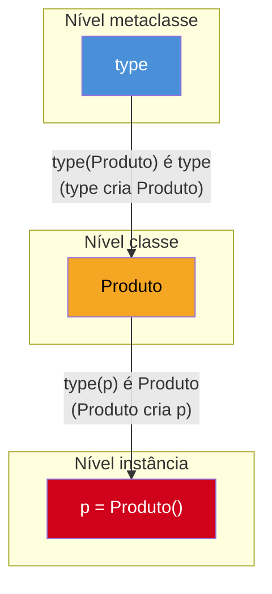
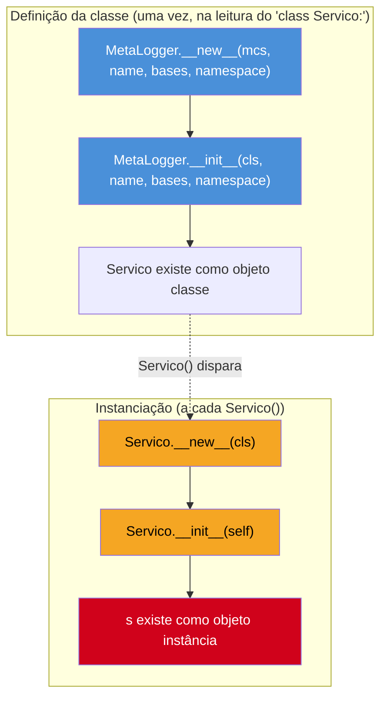

# Metaclasses — introdução

> [!abstract] TL;DR
> Em Python, **classes são objetos** — e todo objeto tem um tipo. O tipo de uma classe é sua **metaclasse**. Por padrão, toda classe é criada por `type`, a metaclasse embutida, que também funciona como **fábrica de classes** em tempo real: `type('Nome', (Base,), {'attr': 1})` cria uma classe do zero, sem a palavra-chave `class`. Uma metaclasse customizada (`class Meta(type): ...`) intercepta a **criação da classe**, não da instância — é um nível de indireção acima de `__new__`/`__init__` de uma classe comum. Casos de uso reais existem (registro automático de plugins, ORMs como o Django, enforcement de contrato em tempo de definição), mas a citação mais repetida da comunidade Python — atribuída a Tim Peters — resume o consenso: *"metaclasses are deeper magic than 99% of users should ever worry about"*. Para a maioria dos casos que "parecem precisar de metaclasse", `__init_subclass__` (desde Python 3.6, via [PEP 487](https://peps.python.org/pep-0487/)) ou um decorator de classe resolvem com muito menos complexidade. O objetivo desta nota não é te ensinar a escrever metaclasses no dia a dia — é te dar o modelo mental pra **reconhecer** uma quando ela aparecer em código de terceiros.

## O bug — na verdade, a confusão — que abre esta nota

Alguém lendo o código-fonte de um projeto Django pela primeira vez encontra algo como isto:

```python
from django.db import models


class Produto(models.Model):
    nome = models.CharField(max_length=100)
    preco = models.DecimalField(max_digits=10, decimal_places=2)

    class Meta:
        ordering = ["nome"]
        verbose_name = "Produto"
```

E a reação natural — especialmente pra quem já leu a [[03-Dominios/Tecnologia/Python/OO e Data Model/01 - Classes — definição, atributos e métodos|nota 01 deste galho]] e sabe que uma classe pode ter qualquer coisa dentro, inclusive outra classe — é pensar: *"ah, `Meta` é só uma classe aninhada qualquer, um jeito de agrupar configuração."* É uma leitura razoável. E está errada sobre o que realmente acontece.

`class Meta:` dentro de um `Model` do Django não é "uma classe interna qualquer" no sentido comum — ela nunca chega a existir como um objeto classe independente e utilizável fora dali. O que de fato acontece é mais estranho e mais interessante: quando `class Produto(models.Model):` é executado, o interpretador não cria `Produto` do jeito de sempre. Ele delega a criação para `ModelBase`, uma **metaclasse customizada** que o Django registrou como responsável por construir toda classe que herda de `models.Model`. `ModelBase.__new__` recebe o corpo inteiro da classe `Produto` — incluindo a classe `Meta` aninhada, os campos `nome` e `preco` — e faz algo que nenhuma classe comum faz sozinha: **lê o conteúdo de `Meta`**, extrai `ordering` e `verbose_name`, constrói um objeto `_meta` com essas opções, transforma cada `CharField`/`DecimalField` em uma coluna de banco de dados via `contribute_to_class`, e registra `Produto` no app registry do Django — tudo isso *antes* de qualquer instância de `Produto` existir, só pelo fato de a classe ter sido definida.

Nada disso é feito por `__init__` (que roda quando você faz `Produto(nome="Caneta", preco=5)`) nem por `__new__` da própria classe `Produto` (que a nota 01 já apresentou como o construtor real de *instâncias*). É um mecanismo de um nível acima: **algo que intercepta a criação da própria classe `Produto`**, antes de ela existir como tipo utilizável. Esse "algo" é uma metaclasse — e entender o que ela é, como `type` se encaixa nisso, e por que quase ninguém deveria escrever uma do zero é o assunto desta nota.

## O que é

### A frase que organiza tudo: classes são objetos, e todo objeto tem um tipo

Em Python, tudo é objeto — números, funções, módulos, e também **classes**. Se `42` é um objeto do tipo `int`, e `"oi"` é um objeto do tipo `str`, então uma classe como `Produto` também é um objeto — e, como todo objeto, tem um tipo. Confirmando no interpretador:

```python
class Produto:
    pass


print(type(42))       # <class 'int'>
print(type("oi"))     # <class 'str'>
print(type(Produto))  # <class 'type'>
```

`type(Produto)` devolve `type`. Não é coincidência de nome: **`type` é, ao mesmo tempo, a função embutida que responde "qual é o tipo deste objeto?" e a metaclasse padrão de toda classe em Python.** Uma **metaclasse** é exatamente isso — o tipo de uma classe. Assim como uma classe comum é o molde que define o comportamento das suas instâncias, uma metaclasse é o molde que define o comportamento das classes que ela cria. `Produto` é uma instância de `type`, da mesma forma que `p = Produto()` é uma instância de `Produto`.



A cadeia se repete em cada nível: `type` está para `Produto` assim como `Produto` está para `p`. `type` cria classes; classes criam instâncias. E, curiosamente, `type` também é instância de si mesma — `type(type)` devolve `type` — o ponto onde a cadeia de "tipo do tipo do tipo..." para, por definição da linguagem.

> [!question]- Toda classe em Python usa `type` como metaclasse, mesmo sem eu escrever nada especial?
> Sim. Quando você escreve `class Produto: ...` sem herdar de nada e sem especificar `metaclass=`, o Python usa `type` por padrão — é por isso que `type(Produto)` sempre devolve `type`, a menos que alguém explicitamente tenha trocado a metaclasse (o assunto do resto desta nota). Isso vale inclusive para classes que já usam recursos avançados como `ABC` (do [[03-Dominios/Tecnologia/Python/OO e Data Model/06 - ABC e Protocol — tipagem estrutural|Galho 3, nota 06]]) — `ABCMeta`, a metaclasse por trás de `abc.ABC`, é ela mesma uma subclasse de `type`, não uma alternativa a ele.

### `type()` como fábrica de classes em tempo real

A função `type()` tem dois comportamentos completamente diferentes dependendo de quantos argumentos recebe — e essa dualidade costuma confundir quem vê pela primeira vez:

- **Com um argumento**, `type(objeto)` devolve o tipo daquele objeto (o uso já familiar: `type(42)` → `int`).
- **Com três argumentos**, `type(nome, bases, namespace)` **cria uma classe nova**, dinamicamente, em tempo de execução — sem usar a palavra-chave `class` em lugar nenhum.

```python
Produto = type(
    "Produto",              # nome da classe → vira __name__
    (),                     # tupla de classes-base → vira __bases__
    {                       # namespace: atributos e métodos → vira __dict__
        "categoria": "geral",
        "descrever": lambda self: f"Produto da categoria {self.categoria}",
    },
)

p = Produto()
print(p.categoria)     # geral
print(p.descrever())   # Produto da categoria geral
print(type(Produto))   # <class 'type'>
```

Essa classe `Produto`, criada via `type(...)`, é **funcionalmente idêntica** a uma classe equivalente escrita com `class Produto: ...` — mesmo `__name__`, mesmo `__bases__`, mesmos atributos e métodos acessíveis. A diferença é só de mecanismo: quando o interpretador executa um bloco `class`, ele monta o nome, a tupla de bases e o dicionário de namespace do corpo da classe, e então **chama `type(nome, bases, namespace)` por baixo dos panos** — exatamente o que o código acima faz manualmente. Segundo o artigo canônico da [Real Python sobre metaclasses](https://realpython.com/python-metaclasses/), essa é a prova mais direta de que `type` funciona como fábrica de classes: `class` é açúcar sintático para uma chamada a `type()`.

```python
class ProdutoEquivalente:
    categoria = "geral"

    def descrever(self):
        return f"Produto da categoria {self.categoria}"


# As duas formas produzem classes equivalentes:
print(ProdutoEquivalente().descrever())  # Produto da categoria geral
print(Produto().descrever())              # Produto da categoria geral
```

> [!question]- Por que alguém usaria `type()` direto em vez de `class`?
> Quase nunca, em código de aplicação — `class` é mais legível para o caso comum de "eu sei o nome, as bases e o corpo da classe em tempo de escrita do código". `type(nome, bases, namespace)` importa quando **o nome, as bases ou os atributos só existem em tempo de execução** — por exemplo, gerando classes a partir de um schema JSON carregado de um arquivo, ou dentro da própria implementação de uma metaclasse customizada, que frequentemente termina chamando `super().__new__(mcs, name, bases, namespace)` — que é, no fundo, o mesmo `type()` de três argumentos, um nível acima na cadeia de herança de metaclasses.

## Por que importa

Entender essa cadeia (`type` cria classes; classes criam instâncias) muda a leitura de qualquer framework que usa metaclasses pesadamente — Django, SQLAlchemy (na `declarative_base`, embora versões recentes prefiram outras abordagens), frameworks de serialização, `Enum` da biblioteca padrão. Sem esse modelo mental, um trecho como `class Meta:` dentro de um Model parece "só configuração"; com ele, fica claro que existe um agente ativo (`ModelBase.__new__`) lendo aquele conteúdo e transformando a classe *antes dela existir*.

Mas a importância prática, pro dia a dia de quem escreve Python de aplicação, é quase o oposto de "aprender a escrever metaclasses": é aprender a **reconhecer** o padrão quando ele aparece em código de terceiros, entender por que ele resolve o problema que resolve, e — principalmente — saber quando a mesma necessidade pode ser resolvida sem pagar o custo de complexidade de uma metaclasse customizada. É esse o eixo do resto da nota.

## Como funciona

### Escrevendo uma metaclasse customizada

Uma metaclasse customizada é uma classe que herda de `type` (diretamente ou através de outra metaclasse) e sobrescreve os métodos que controlam a criação de classes — principalmente `__new__`, às vezes `__init__`, raramente `__call__` (que intercepta a criação de *instâncias* daquela classe, não o assunto central aqui).

```python
class MetaLogger(type):
    def __new__(mcs, name, bases, namespace):
        print(f"MetaLogger.__new__: criando a classe '{name}'")
        cls = super().__new__(mcs, name, bases, namespace)
        return cls

    def __init__(cls, name, bases, namespace):
        print(f"MetaLogger.__init__: inicializando a classe '{name}'")
        super().__init__(name, bases, namespace)


class Servico(metaclass=MetaLogger):
    def executar(self):
        return "executando"


# MetaLogger.__new__: criando a classe 'Servico'
# MetaLogger.__init__: inicializando a classe 'Servico'

s = Servico()
print(s.executar())  # executando (a criação de instância não passa pela metaclasse aqui)
```

Alguns pontos de vocabulário e mecanismo, ponto a ponto:

- **`class Servico(metaclass=MetaLogger):`** é a sintaxe que diz "não use `type` como metaclasse de `Servico`; use `MetaLogger`". É equivalente, por baixo, a `Servico = MetaLogger("Servico", (), {...})` — a mesma chamada de três argumentos vista na seção anterior, só que trocando `type` por `MetaLogger`.
- **`mcs`** é a convenção de nome para o primeiro parâmetro de `__new__`/`__init__` numa metaclasse — análoga a `cls` num `@classmethod` comum, mas indicando "a metaclasse em si" (aqui, `MetaLogger`), não a classe sendo criada.
- **`name`, `bases`, `namespace`** são exatamente os três argumentos de `type()`: o nome (`"Servico"`), a tupla de bases (`()`, vazia) e o dicionário do corpo da classe (contendo `executar`).
- `super().__new__(mcs, name, bases, namespace)` delega a criação de fato para `type.__new__` — a metaclasse customizada normalmente **não reimplementa** a criação do zero, ela intercepta, inspeciona ou modifica `namespace` antes de repassar para `type`.

O ponto central — e a resposta pra confusão mais comum de quem vê isso pela primeira vez — é: **`MetaLogger.__new__` e `MetaLogger.__init__` rodam quando a classe `Servico` é *definida*, uma única vez, no momento em que o interpretador processa o bloco `class Servico(metaclass=MetaLogger): ...`.** Eles não rodam quando `Servico()` é chamado para criar uma instância. `s = Servico()` continua seguindo o fluxo normal já visto na [[03-Dominios/Tecnologia/Python/OO e Data Model/01 - Classes — definição, atributos e métodos|nota 01]] — `Servico.__new__` (herdado de `object`, não sobrescrito aqui) cria a instância, `Servico.__init__` (também herdado de `object`) a inicializa. A metaclasse opera **um nível acima**: ela intercepta a criação da *classe* `Servico`, não das *instâncias* de `Servico`.



> [!question]- `__new__` vs `__init__` numa metaclasse — qual a diferença prática de usar um ou outro?
> A mesma distinção da [[03-Dominios/Tecnologia/Python/OO e Data Model/01 - Classes — definição, atributos e métodos|nota 01]], um nível acima: `__new__` da metaclasse **cria e devolve** o objeto classe — é o único lugar onde dá pra alterar `namespace` *antes* da classe existir (por exemplo, injetando um método novo, removendo um atributo, validando o corpo da classe e recusando a criação com uma exceção). `__init__` da metaclasse recebe a classe **já criada** como `cls` e serve para configuração posterior — por exemplo, registrar `cls` numa lista global, algo que não precisa alterar a estrutura da classe, só reagir à sua existência. Na prática, a maioria dos exemplos reais de metaclasse (registro de plugins, por exemplo) só precisa de `__new__` ou só de `__init__`, raramente dos dois fazendo coisas diferentes.

## Na prática — dois jeitos de resolver o mesmo problema

O exemplo mais citado e mais honesto de "quando uma metaclasse resolve um problema real" é **registro automático de plugins**: um sistema onde qualquer subclasse de uma classe-base "se cadastra sozinha" numa lista ou dicionário central, sem que ninguém precise lembrar de registrá-la manualmente em outro lugar do código.

### Versão 1 — via metaclasse customizada

```python
class RegistroDePlugins(type):
    plugins = {}

    def __new__(mcs, name, bases, namespace):
        cls = super().__new__(mcs, name, bases, namespace)
        if bases:  # não registra a própria classe-base, só as subclasses
            mcs.plugins[name] = cls
        return cls


class Plugin(metaclass=RegistroDePlugins):
    pass


class PluginExportarCSV(Plugin):
    def executar(self):
        return "exportando para CSV"


class PluginExportarPDF(Plugin):
    def executar(self):
        return "exportando para PDF"


print(RegistroDePlugins.plugins)
# {'PluginExportarCSV': <class '...PluginExportarCSV'>, 'PluginExportarPDF': <class '...PluginExportarPDF'>}

for nome, classe_plugin in RegistroDePlugins.plugins.items():
    instancia = classe_plugin()
    print(f"{nome}: {instancia.executar()}")
# PluginExportarCSV: exportando para CSV
# PluginExportarPDF: exportando para PDF
```

Repare no detalhe incômodo: `if bases:` existe só pra impedir que a própria classe `Plugin` (que não tem bases além de `object`, implícito) se registre a si mesma junto com as subclasses reais — um efeito colateral de a metaclasse interceptar *toda* criação de classe que a usa, inclusive a classe-base. Esse tipo de checagem defensiva extra é um sintoma comum de código que usa metaclasse pra um problema que, na verdade, é mais simples do que a ferramenta escolhida.

### Versão 2 — via `__init_subclass__` (Python 3.6+)

```python
class Plugin:
    plugins = {}

    def __init_subclass__(cls, **kwargs):
        super().__init_subclass__(**kwargs)
        Plugin.plugins[cls.__name__] = cls


class PluginExportarCSV(Plugin):
    def executar(self):
        return "exportando para CSV"


class PluginExportarPDF(Plugin):
    def executar(self):
        return "exportando para PDF"


print(Plugin.plugins)
# {'PluginExportarCSV': <class '...PluginExportarCSV'>, 'PluginExportarPDF': <class '...PluginExportarPDF'>}
```

Mesmo resultado, e uma diferença de design que resolve o problema do `if bases:` de graça: `__init_subclass__`, introduzido pela [PEP 487](https://peps.python.org/pep-0487/) e documentado na seção ["Customizing class creation"](https://docs.python.org/3/reference/datamodel.html#customizing-class-creation) do data model, é um hook definido **na própria classe-base** (`Plugin`, aqui — sem metaclasse nenhuma) que o Python chama automaticamente **toda vez que uma subclasse é criada** — mas nunca para a classe-base em si, porque `Plugin` não é subclasse de `Plugin`. Não existe `mcs`, não existe `type()` de três argumentos explícito, não existe `if bases:` — é um `classmethod` implícito (o Python trata `__init_subclass__` como `classmethod` automaticamente, mesmo sem o decorator) que roda no momento certo, sem introduzir um novo nível na hierarquia de tipos.

```python
print(type(Plugin))              # <class 'type'> — sem metaclasse customizada
print(type(PluginExportarCSV))   # <class 'type'> — idem
```

Nenhuma das duas classes ganhou uma metaclasse diferente de `type` — a diferença de comportamento inteira vem de um método comum, herdado normalmente pela cadeia de MRO já vista na [[03-Dominios/Tecnologia/Python/OO e Data Model/02 - Herança e MRO|nota 02]]. Essa é exatamente a motivação declarada da PEP 487: segundo o texto da proposta, a vasta maioria dos casos de uso de metaclasse cai em poucas categorias — inicialização após a criação da classe, inicialização de descritores, e controle da ordem de definição de atributos — e essas categorias "podem ser facilmente alcançadas com hooks simples na criação da classe", sem o peso conceitual de uma metaclasse completa.

## Casos de uso reais e honestos

Vale nomear onde metaclasses de fato aparecem em código de produção real — não como justificativa pra escrever uma, mas pra reconhecer o padrão quando aparecer:

1. **ORMs — o Django é o exemplo mais citado.** `django.db.models.base.ModelBase` é a metaclasse de `models.Model`. Segundo a documentação e análises do próprio código-fonte do Django, `ModelBase.__new__` percorre os atributos do corpo da classe, identifica quais são campos de banco de dados (`CharField`, `DecimalField`, etc. — objetos com um método `contribute_to_class`), monta o objeto `_meta` a partir da classe `Meta` aninhada (o mistério da abertura desta nota), e registra o model no app registry do Django — tudo em tempo de definição da classe, antes de qualquer instância existir. É o mecanismo que faz `class Meta: ordering = [...]` "significar algo" em vez de ser só uma classe aninhada inerte.
2. **Registro automático de subclasses (plugin systems).** O exemplo trabalhado nesta nota — sistemas de plugins, handlers, comandos de CLI, ou qualquer arquitetura onde "toda subclasse de X deveria aparecer automaticamente numa lista central" sem exigir um passo manual de registro.
3. **Enforcement de contrato em tempo de definição de classe.** `abc.ABCMeta` (a metaclasse por trás de `ABC`, vista na [[03-Dominios/Tecnologia/Python/OO e Data Model/06 - ABC e Protocol — tipagem estrutural|nota 06]]) usa uma metaclasse pra impedir a **instanciação** de uma classe que ainda tem métodos abstratos não implementados — uma checagem que roda no momento de `Instancia()`, não só de leitura estática. Isso é mais forte do que qualquer coisa que `__init_subclass__` sozinho consegue oferecer, porque `__init_subclass__` roda na definição da subclasse, não intercepta o processo de instanciação em si.
4. **Bibliotecas de serialização/validação e a stdlib.** `Enum`, na biblioteca padrão, usa `EnumMeta` (uma metaclasse) pra dar às classes de enumeração seu comportamento especial de iteração e imutabilidade de membros — outro exemplo de "framework interno da própria linguagem" que se apoia em metaclasse pra algo que um usuário final não replicaria a mão.

O padrão comum a todos: em todo caso real, a metaclasse é escrita **uma única vez, por quem constrói um framework ou biblioteca** (Django, `abc`, a própria stdlib) — e usada, sem nunca ser escrita de novo, por milhares de desenvolvedores de aplicação que só herdam de `models.Model` ou de `ABC`. É esse desequilíbrio — poucos autores de metaclasse, muitos consumidores — que explica por que "reconhecer, não escrever" é o objetivo realista desta nota.

## Quando NÃO usar

> [!warning] A citação mais repetida sobre este tópico existe por um motivo
> Tim Peters — autor do algoritmo Timsort e do [Zen of Python](https://peps.python.org/pep-0020/) — é amplamente citado (a frase circula há anos em listas de discussão, no artigo canônico da [Real Python sobre metaclasses](https://realpython.com/python-metaclasses/) e em *Fluent Python*) dizendo: **"Metaclasses are deeper magic than 99% of users should ever worry about. If you wonder whether you need them, you don't (the people who actually need them know with certainty that they need them, and don't need an explanation about why)."** Em tradução livre: *"metaclasses são magia mais profunda do que 99% dos usuários deveriam se preocupar. Se você está em dúvida se precisa delas, não precisa (quem realmente precisa sabe com certeza que precisa, e não precisa de uma explicação do motivo)."* A citação não é folclore anti-metaclasse gratuito — é um resumo honesto de décadas de experiência coletiva da comunidade: o padrão observado repetidas vezes é "desenvolvedor descobre metaclasses, acha o mecanismo fascinante, usa numa aplicação onde `__init_subclass__` ou um decorator resolveriam com um décimo da complexidade".

O sintoma mais confiável de over-engineering com metaclasse: se a necessidade real é só "rodar algo quando uma subclasse é definida" (registro, validação simples, configuração), e **você não precisa que a checagem funcione em tempo de instanciação** nem controlar `isinstance`/`issubclass`, três alternativas mais simples resolvem a maioria dos casos:

- **`__init_subclass__`** (Python 3.6+, [PEP 487](https://peps.python.org/pep-0487/)) — já demonstrado nesta nota. É a ferramenta certa quando o gatilho é "uma subclasse foi definida" e o efeito é algo que pode viver como um `classmethod` normal na classe-base.
- **Decorator de classe** — uma função que recebe a classe já pronta e devolve ela (modificada ou não), aplicado com `@meu_decorator` acima do `class`. Resolve casos onde não existe hierarquia de herança envolvida — só "faça algo com esta classe específica depois que ela for definida", sem precisar que o comportamento se propague automaticamente para subclasses futuras.
- **Composição/injeção simples** — em muitos casos, o problema que parecia pedir "interceptar a criação da classe" na verdade só precisa de uma função de registro chamada explicitamente, ou de um dicionário populado manualmente. Menos "mágico", mais fácil de rastrear com um debugger comum.

A regra prática, resumindo a orientação recorrente na comunidade (inclusive ecoada no material da Real Python e em discussões da própria PEP 487): **se a dúvida é "preciso de uma metaclasse ou um hook mais simples resolve?", a resposta quase sempre é o hook mais simples.** Metaclasse fica reservada para os casos da seção anterior — construção de framework, onde o comportamento realmente precisa interceptar a criação da classe em si (não só reagir à existência de uma subclasse) ou controlar o processo de instanciação de forma que `__init_subclass__` não alcança.

> [!question]- Se `__init_subclass__` resolve "quase tudo", por que Django continua usando uma metaclasse pra `Model`?
> Porque `ModelBase` faz mais do que só "reagir a uma subclasse sendo definida" — ela **transforma o namespace da classe antes dela existir** (convertendo `CharField`/`DecimalField` em colunas reais, montando `_meta` a partir de `Meta`), o que só é possível em `__new__` de uma metaclasse, onde `namespace` ainda pode ser alterado antes de a classe ser efetivamente criada. `__init_subclass__` roda **depois** que a classe já existe — dá pra inspecionar `cls`, mas não dá pra reescrever o dicionário de atributos antes da criação. Frameworks que precisam desse nível de controle sobre a própria estrutura da classe (não só reagir à sua existência) continuam sendo o caso legítimo de metaclasse — é por isso que ORMs aparecem tão consistentemente na lista de exemplos reais.

## Armadilhas

### (1) Confundir "classe intercepta a criação de instância" com "metaclasse intercepta a criação de classe"

`__new__`/`__init__` de uma classe comum controlam a criação de **instâncias** daquela classe (`Servico()`). `__new__`/`__init__` de uma **metaclasse** controlam a criação da **classe em si** (`class Servico(metaclass=MetaLogger): ...`). São dois níveis diferentes na cadeia `type → classe → instância`; confundi-los é o erro conceitual mais comum de quem lê sobre o assunto pela primeira vez.

### (2) Esquecer o `if bases:` (ou equivalente) numa metaclasse de registro e registrar a classe-base junto

Já demonstrado na Versão 1 do exemplo de plugins: sem essa checagem, a própria classe `Plugin` (sem implementação real, só a base) acaba entrando no dicionário de registro junto com as subclasses reais — um bug sutil que só aparece quando algo itera sobre o registro esperando encontrar só implementações concretas.

### (3) Escolher metaclasse por curiosidade técnica, não por necessidade

O sintoma mais comum: "descobri metaclasses, são fascinantes, vou usar aqui" — em um projeto de aplicação onde `__init_subclass__` ou um decorator de classe resolveriam o mesmo problema com uma fração da complexidade cognitiva para quem for ler o código depois. A citação de Tim Peters existe exatamente para nomear esse padrão.

### (4) Duas metaclasses conflitantes numa hierarquia de herança múltipla

Se uma classe herda de duas bases com metaclasses diferentes e incompatíveis entre si, o Python levanta `TypeError: metaclass conflict` — porque não existe uma forma automática de combinar duas metaclasses. Resolver isso exige criar manualmente uma terceira metaclasse que herda de ambas, um dos motivos concretos que motivaram a criação de `__init_subclass__` na PEP 487: hooks simples na classe-base compõem entre si sem esse tipo de conflito.

## Em entrevista

Perguntas previsíveis sobre este tópico:

- **"O que é uma metaclasse?"** É o tipo de uma classe — a mesma relação que existe entre uma classe e suas instâncias, um nível acima. Toda classe em Python tem uma metaclasse; por padrão, é `type`. `type(MinhaClasse)` devolve `type`, a menos que uma metaclasse customizada tenha sido especificada via `class X(metaclass=Y): ...`.
- **"`type` é só uma função ou é uma classe?"** É os dois ao mesmo tempo — `type(objeto)` com um argumento devolve o tipo do objeto (uso mais comum); `type(nome, bases, namespace)` com três argumentos cria uma classe nova dinamicamente. É a metaclasse padrão de toda classe Python e, simultaneamente, a "fábrica" que `class` chama por baixo dos panos.
- **"Quando você escreveria uma metaclasse customizada?"** Resposta honesta e alinhada com a citação de Tim Peters: raramente, em código de aplicação. Metaclasse é ferramenta de autor de framework/biblioteca — quando é preciso interceptar e transformar o namespace de uma classe *antes* dela existir (caso do Django `ModelBase`) ou controlar `isinstance`/instanciação (caso do `ABCMeta`). Pra maioria dos casos que parecem pedir metaclasse — registro automático, validação simples — `__init_subclass__` (desde Python 3.6) resolve com muito menos complexidade.
- **"Qual a diferença entre `__init_subclass__` e uma metaclasse?"** `__init_subclass__` é um hook definido na própria classe-base, chamado automaticamente quando uma subclasse é criada — sem introduzir um novo tipo na hierarquia (`type(Subclasse)` continua sendo `type`). Uma metaclasse intercepta a criação da classe em `__new__`, podendo modificar o namespace *antes* da classe existir, e opera em qualquer classe que a declare (não só subclasses de uma base comum). `__init_subclass__` cobre a maioria dos casos de uso reais de metaclasse com muito menos peso conceitual.
- **"O que a citação de Tim Peters sobre metaclasses quer dizer na prática?"** Que a maioria dos desenvolvedores Python nunca vai precisar escrever uma metaclasse — e que, se alguém está em dúvida se precisa, provavelmente não precisa: quem realmente precisa (normalmente autores de frameworks como Django, SQLAlchemy, ou da própria stdlib) sabe exatamente por quê, sem precisar da explicação. É um alerta contra usar a ferramenta por fascínio técnico em vez de necessidade real.

### How to explain in English

> In Python, classes are objects, and every object has a type — the type of a class is called its **metaclass**. By default, every class's metaclass is `type`, which does double duty: called with one argument it returns an object's type (`type(42)` → `int`); called with three arguments — `type(name, bases, namespace)` — it **dynamically creates a class**, the exact mechanism the `class` statement compiles down to under the hood. A custom metaclass is a subclass of `type` that overrides `__new__` and/or `__init__` to intercept **class creation** itself — not instance creation. That's the key distinction: a class's own `__new__`/`__init__` control what happens when you call `MyClass()` to make an instance; a metaclass's `__new__`/`__init__` control what happens when the `class` statement itself runs, one level up in the `type → class → instance` chain. Real, legitimate use cases exist — Django's `ModelBase` metaclass transforms class-body attributes into ORM fields before the model class even exists; `abc.ABCMeta` enforces that abstract methods are implemented before a class can be instantiated. But the most-quoted line on this topic, attributed to Tim Peters, sets the honest expectation: *"Metaclasses are deeper magic than 99% of users should ever worry about. If you wonder whether you need them, you don't."* For the vast majority of cases that look like they need a metaclass — auto-registering subclasses, simple validation at class-definition time — `__init_subclass__` (available since Python 3.6, via PEP 487) or a plain class decorator solves the same problem with far less conceptual overhead, without introducing a custom metaclass into the type hierarchy at all. The realistic goal for most developers isn't to write metaclasses day-to-day — it's to recognize one on sight in framework code like Django or SQLAlchemy.

| Termo PT | Termo EN |
|---|---|
| metaclasse | metaclass |
| fábrica de classes | class factory |
| criação da classe | class creation |
| namespace do corpo da classe | class body namespace |
| classe-base | base class |
| registro automático de subclasses | subclass auto-registration |
| enforcement de contrato | contract enforcement |
| magia profunda (sentido pejorativo) | deep magic |
| over-engineering | over-engineering |
| conflito de metaclasse | metaclass conflict |

## O que vem a seguir

Com a cadeia `type → classe → instância` e a distinção entre criação de classe e criação de instância estabelecidas, a última nota do galho — [[03-Dominios/Tecnologia/Python/OO e Data Model/09 - Composição vs herança|09 — Composição vs herança]] — fecha o arco do galho revisitando, de um ângulo de design, todas as ferramentas vistas até aqui (herança, MRO, Data Model, properties, dataclasses, ABC/Protocol, e agora metaclasses) para responder a pergunta que atravessa OO em qualquer linguagem: quando estender uma classe por herança e quando montar comportamento por composição — e como o duck typing de Python muda esse cálculo em relação a Java/C#.

## Veja também

- [[03-Dominios/Tecnologia/Python/OO e Data Model/01 - Classes — definição, atributos e métodos|01 — Classes: definição, atributos e métodos]] — `__new__` vs `__init__` no nível de instância, retomado aqui um nível acima
- [[03-Dominios/Tecnologia/Python/OO e Data Model/02 - Herança e MRO|02 — Herança e MRO]] — a cadeia de busca de atributo que `__init_subclass__` também percorre
- [[03-Dominios/Tecnologia/Python/OO e Data Model/06 - ABC e Protocol — tipagem estrutural|06 — ABC e Protocol: tipagem estrutural]] — `ABCMeta`, o exemplo de metaclasse da própria stdlib
- [[03-Dominios/Tecnologia/Python/OO e Data Model/09 - Composição vs herança|09 — Composição vs herança]] — capstone do galho, próxima nota
- [[03-Dominios/Tecnologia/Python/OO e Data Model/index|OO e Data Model]] — MOC do galho
- [[03-Dominios/Tecnologia/Python/index|Trilha Python]]

## Fontes

- Real Python. *Python Metaclasses*. https://realpython.com/python-metaclasses/ (acessado em 2026-07-09)
- Python Software Foundation. *The Python Language Reference — 3.3.3. Customizing class creation*. docs.python.org, versão 3.14. https://docs.python.org/3/reference/datamodel.html#customizing-class-creation (acessado em 2026-07-09)
- Python Software Foundation. *PEP 487 — Simpler customisation of class creation*. peps.python.org. https://peps.python.org/pep-0487/ (acessado em 2026-07-09)
- Ameer Hamza. *How Django's ModelBase metaclass transforms class definitions into model instances during import time*. Medium. https://ameerhamza1.medium.com/how-djangos-modelbase-metaclass-transforms-class-definitions-into-model-instances-during-import-5591ad5b76ec (acessado em 2026-07-09)
- Alex Gaynor. *How the Heck do Django Models Work*. https://alexgaynor.net/2008/nov/10/how-heck-do-django-models-work/ (acessado em 2026-07-09)
- Ramalho, L. *Fluent Python*, 2ª ed. — Capítulo 24, "Class Metaprogramming". O'Reilly Media, 2022.
- Python Software Foundation. *PEP 20 — The Zen of Python* (Tim Peters). https://peps.python.org/pep-0020/ (acessado em 2026-07-09; citação sobre metaclasses amplamente atribuída a Tim Peters, referenciada em Real Python e em discussões de python-dev)
- Effbot (Fredrik Lundh). *Using Metaclasses to Create Self-Registering Plugins*. http://effbot.org/zone/metaclass-plugins.htm (acessado em 2026-07-09)
