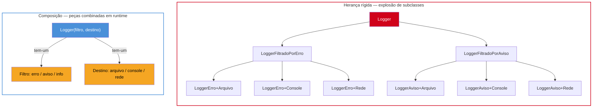
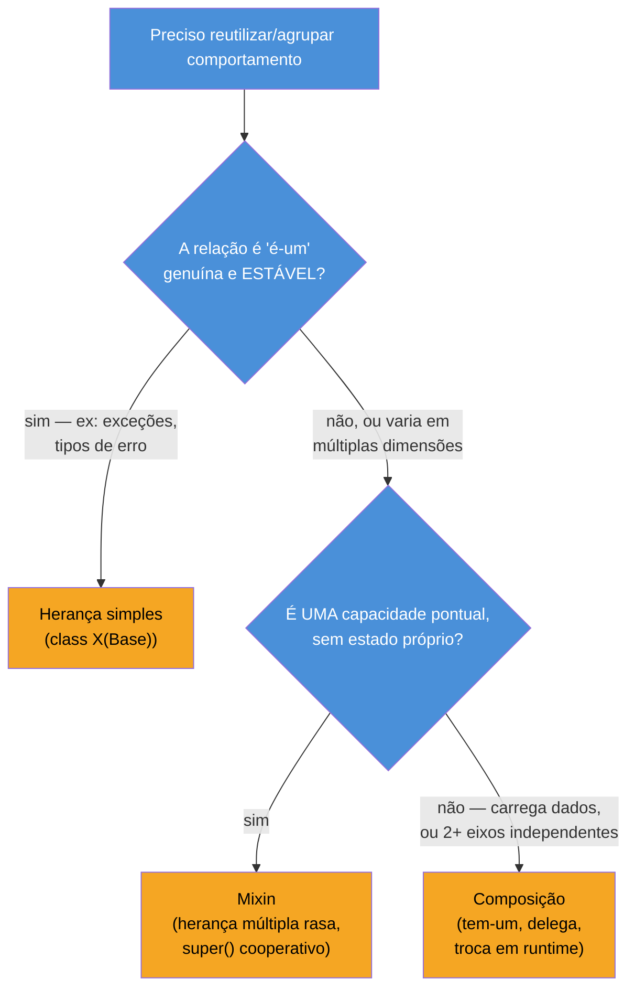

# Composição vs herança

> [!abstract] TL;DR
> "**Favor object composition over class inheritance**" é o segundo princípio de design orientado a objetos do livro *Design Patterns* (Gamma, Helm, Johnson, Vlissides — o "Gang of Four", 1994), e continua sendo a diretriz mais citada — e mais mal compreendida — de design OO. Herança modela "**é-um**" (`Cachorro` é um `Animal`) e acopla a subclasse à implementação inteira da classe-mãe: mudar a base pode quebrar subclasses distantes que ninguém revisita há meses (o **fragile base class problem**), e forçar tudo num único eixo de especialização gera **explosão de subclasses** quando o domínio precisa variar em duas ou mais dimensões independentes. Composição modela "**tem-um**" — montar um objeto combinando outros objetos, delegando comportamento em vez de herdar implementação — e troca o acoplamento rígido de uma árvore de classes por peças intercambiáveis em tempo de execução. Isso não significa banir herança: ela continua sendo a ferramenta certa quando a relação é-um é genuína e estável (o caso canônico em Python: exceções customizadas herdando de `Exception`). **Mixins** — já introduzidos na nota 02 — são o meio-termo pythônico: herança múltipla rasa, cada mixin adicionando **uma** capacidade pontual, sem estado, sem assumir nada sobre quem a usa. Esta é a nota de síntese que fecha o Galho 3: a "sabedoria aplicada" de quando usar qual ferramenta, depois de oito notas técnicas sobre classes, MRO, Data Model, properties, dataclasses, Protocol/ABC, operator overloading e metaclasses.

## A hierarquia que virou impossível de manter

Um sistema de simulação de patos para um jogo — o exemplo que abre o capítulo 1 de *Head First Design Patterns* (Freeman & Robson) e que se tornou, ao longo de duas décadas, o caso de estudo canônico do problema — começa com uma decisão aparentemente óbvia: criar uma classe-base `Pato`, com os comportamentos comuns a todo pato, e deixar cada espécie herdar dela.

```python
class Pato:
    def nadar(self):
        print("Nadando...")

    def voar(self):
        print("Voando...")

    def emitir_som(self):
        print("Quack!")

class PatoSelvagem(Pato):
    pass  # herda nadar/voar/emitir_som sem alterações — parece perfeito

class PatoDeChamariz(Pato):
    def emitir_som(self):
        print("Squeak!")  # patos de chamariz de madeira não fazem "quack" de verdade
```

Funciona bem até alguém pedir um **`PatoDeBorracha`** — o brinquedo clássico de banheira. Ele também deveria "ser um" `Pato`, certo? Só que:

```python
class PatoDeBorracha(Pato):
    def emitir_som(self):
        print("Squeak!")
    # mas PatoDeBorracha não deveria herdar voar() — pato de borracha não voa!
    # e nadar() também está errado — ele boia passivamente, não nada de verdade
```

`PatoDeBorracha(Pato)` herda `voar()` e `nadar()` automaticamente — métodos que fazem sentido para um pato de verdade, mas que não fazem sentido nenhum para um brinquedo de plástico. A saída ingênua é sobrescrever `voar()` para não fazer nada, ou levantar uma exceção — mas isso é o sintoma, não a cura: `PatoDeBorracha` está sendo forçado a herdar comportamento que **não lhe pertence**, só porque a árvore de herança colocou `voar`/`nadar` na classe-base compartilhada. Pior ainda: um `PatoModeloDecorativo` (estátua de jardim) também "é um" pato, no sentido de que tem bico e penas — mas não nada, não voa, nem emite som. A cada novo tipo de pato que quebra uma das suposições da classe-base, a solução vira sobrescrever mais um método pra "desligar" comportamento herdado — um sinal claro de que a hierarquia está modelando o domínio errado.

O problema não é a sintaxe de `class X(Y):` — é que **herança amarra a subclasse à implementação inteira da classe-mãe**, não só à sua interface pública. Quando a classe-base muda (alguém decide que `nadar()` agora precisa verificar `self.tem_motor_de_propulsao`, por exemplo, porque um novo tipo de pato-robô foi adicionado), toda subclasse que nunca pediu por esse detalhe é afetada — inclusive `PatoDeBorracha`, que nem deveria ter `nadar()` em primeiro lugar. Esse é o **fragile base class problem**: uma mudança "segura", vista isoladamente na classe-base, quebra subclasses distantes que ninguém tocou — porque a subclasse depende, silenciosamente, de detalhes de implementação da mãe que vão além do contrato público.

> [!question]- Isso é um problema específico do Python, ou de OO em geral?
> É um problema geral de linguagens orientadas a objeto com herança de implementação — Java, C#, C++, Python compartilham o mesmo risco estrutural. O [fragile base class problem](https://en.wikipedia.org/wiki/Fragile_base_class) é descrito na literatura de engenharia de software desde os anos 1990 justamente porque apareceu de forma recorrente em C++ e Smalltalk antes do Python existir com a popularidade atual. A diferença é que Python, por permitir herança múltipla real (nota 02) e duck typing (nota 03), tem **mais** ferramentas para evitar cair na armadilha — o problema é geral, mas as saídas pythônicas (Protocol, mixins, composição) são particularmente boas.

## Por que hierarquias profundas viram rígidas

O caso do Pato/PatoDeBorracha ilustra o problema em miniatura, mas a versão que aparece em código de produção real costuma ser mais sutil: um domínio que precisa variar em **duas ou mais dimensões independentes** ao mesmo tempo. O guia [python-patterns.guide](https://python-patterns.guide/gang-of-four/composition-over-inheritance/), que analisa o texto original do GoF em detalhe, usa um exemplo de sistema de logging: um `Logger` que precisa (1) filtrar mensagens por nível de severidade **e** (2) escrever a saída em destinos diferentes (arquivo, console, rede). Modelando as duas dimensões só com herança:

```python
class LoggerFiltradoPorErro:
    def escrever(self, msg, nivel):
        if nivel >= "ERROR":
            self._saida(msg)

class LoggerFiltradoPorAviso:
    def escrever(self, msg, nivel):
        if nivel >= "WARNING":
            self._saida(msg)

class LoggerArquivo(LoggerFiltradoPorErro):
    def _saida(self, msg):
        with open("log.txt", "a") as f:
            f.write(msg)

class LoggerConsole(LoggerFiltradoPorErro):
    def _saida(self, msg):
        print(msg)

# ... e assim por diante: toda combinação de (filtro × destino) vira uma classe nova
```

Com só 2 filtros e 3 destinos, já são **6 classes** — cada combinação nova de "mais um filtro" ou "mais um destino" multiplica, não soma, o número de classes necessárias. Esse é o padrão que o texto descreve como "**subclass explosion**": quando uma classe precisa ser especializada ao longo de eixos independentes ao mesmo tempo, herança força a criar uma classe para cada combinação, porque uma subclasse só pode herdar de uma posição fixa na árvore.



A metade direita do diagrama é a resposta: em vez de codificar cada combinação como uma classe, `Logger` **tem** um filtro e **tem** um destino — dois objetos pequenos, cada um resolvendo uma responsabilidade, montados juntos na hora de criar o `Logger`. Trocar o destino de arquivo pra rede é trocar **um objeto membro**, não reescrever ou criar uma classe nova.

> [!warning] Herança múltipla não é a saída para o problema de múltiplos eixos
> A tentação natural, ao ver o problema dos dois eixos (filtro × destino), é resolver com herança múltipla: `class LoggerErroArquivo(FiltroErro, DestinoArquivo)`. Isso até funciona sintaticamente em Python (nota 02), mas reintroduz o mesmo acoplamento rígido por outra porta — agora cada combinação ainda precisa de uma declaração de classe própria, só que com múltiplas classes-mãe em vez de uma. A saída real não é "herdar de mais lugares", é parar de herdar a combinação inteira e **compor** as duas peças como atributos independentes, escolhidos em tempo de execução.

## Composição: montar comportamento em vez de herdar

**Composição** é o nome para uma ideia simples: em vez de uma classe herdar comportamento de uma classe-mãe, ela **contém** (tem como atributo) instâncias de outras classes, e delega chamadas de método a elas. A relação deixa de ser "é-um" e passa a ser "**tem-um**" — e "tem-um" é montado, trocado e testado como qualquer outro atributo de objeto, sem exigir que ninguém reorganize uma árvore de herança.

### O exemplo trabalhado: o Robô que não deveria herdar de uma árvore rígida

Um sistema de robótica de jogo precisa modelar robôs com combinações variadas de capacidades: alguns voam, alguns não; alguns atiram, alguns só se movem; alguns têm as duas coisas. A tentação de herança forçaria uma hierarquia parecida com esta:

```python
class Robo:
    def mover(self):
        print("Movendo no chão...")

class RoboVoador(Robo):
    def mover(self):
        print("Voando...")

class RoboComArmas(RoboVoador):
    def atirar(self):
        print("Disparando...")
    # RoboComArmas herda voar() de RoboVoador — mas e se eu quiser
    # um robô com armas que NÃO voa? Preciso de outra ramificação inteira.

class RoboVoadorComArmas(RoboComArmas):
    pass  # e agora preciso de RoboTerrestreComArmas, RoboAnfibio, RoboAnfibioComArmas...
```

Cada combinação nova de "modo de movimento" × "tipo de ataque" força outra classe na árvore — exatamente o padrão de explosão de subclasses da seção anterior, só que em vez de filtro/destino, agora é movimento/ataque. E a relação "é-um" nem é totalmente honesta: um `RoboVoadorComArmas` não é fundamentalmente um tipo diferente de robô — ele é um robô que **tem** um jeito específico de se mover e **tem** um jeito específico de atacar.

A versão com composição inverte a pergunta: em vez de "de qual classe este robô herda?", pergunta "**quais componentes este robô tem?**".

```python
class SistemaDeMovimentoTerrestre:
    def mover(self):
        print("Movendo no chão...")

class SistemaDeMovimentoAereo:
    def mover(self):
        print("Voando...")

class SistemaDeAtaqueLaser:
    def atacar(self):
        print("Disparando laser...")

class SemAtaque:
    def atacar(self):
        print("Este robô não tem armas.")

class Robo:
    def __init__(self, sistema_movimento, sistema_ataque):
        self._movimento = sistema_movimento   # tem-um sistema de movimento
        self._ataque = sistema_ataque          # tem-um sistema de ataque

    def mover(self):
        self._movimento.mover()               # delega, não herda

    def atacar(self):
        self._ataque.atacar()                 # delega, não herda
```

Montar qualquer combinação vira uma questão de **escolher os objetos certos na criação**, sem precisar declarar uma classe nova para cada uma:

```python
robo_explorador = Robo(SistemaDeMovimentoTerrestre(), SemAtaque())
robo_de_combate_aereo = Robo(SistemaDeMovimentoAereo(), SistemaDeAtaqueLaser())
robo_tanque = Robo(SistemaDeMovimentoTerrestre(), SistemaDeAtaqueLaser())

robo_de_combate_aereo.mover()     # Voando...
robo_de_combate_aereo.atacar()    # Disparando laser...
```

Três "tipos" de robô diferentes, zero classes novas de robô — só combinações diferentes dos mesmos dois componentes reutilizáveis. Se amanhã surgir um `SistemaDeMovimentoAnfibio`, ele entra no sistema como **mais uma opção de componente**, sem tocar em nenhuma classe existente — nenhuma subclasse quebra, porque nenhuma subclasse depende de detalhes de implementação de `Robo`. É exatamente o oposto do fragile base class problem: mudar (ou adicionar) um componente não propaga efeito colateral pra quem usa `Robo`, porque a única coisa que `Robo` promete é chamar `.mover()` e `.atacar()` nos objetos que recebeu — o mesmo contrato mínimo que a nota 06 chamou de tipagem estrutural via `Protocol`.

> [!question]- Isso não é só delegação manual e repetitiva? Onde entra o Data Model?
> É delegação manual, sim — e para casos simples como este, isso já é suficiente. Mas o Python tem ferramentas do Data Model (nota 03) que tornam a delegação mais transparente quando o objeto composto precisa se comportar quase inteiramente como um dos seus componentes: implementar `__getattr__` para repassar automaticamente qualquer atributo não encontrado para o objeto interno é um padrão comum (às vezes chamado de "composição transparente" ou, informalmente, "proxy"). Ramalho discute essa técnica em *Fluent Python* junto com os protocolos de acesso a atributo. Vale como ferramenta avançada — mas comece sempre pela delegação explícita (método que chama método do componente), que é mais fácil de ler e depurar; só automatize com `__getattr__` quando o padrão de repasse for extenso o suficiente para justificar a indireção extra.

A [Real Python](https://realpython.com/inheritance-composition-python/) resume o critério de decisão de forma direta: use herança para modelar uma relação **é-um** clara e estável; use composição para reunir comportamentos e políticas que precisam ser trocados ou recombinados de forma independente — exatamente o caso do robô, cujo "modo de movimento" e "tipo de ataque" variam de forma ortogonal.

## Mixins: o meio-termo pythônico

A nota 02 já introduziu o conceito ao discutir MRO e herança múltipla cooperativa: um **Mixin** é uma classe pequena, tipicamente sem `__init__` próprio e sem estado significativo, cujo único propósito é ser combinada — via herança múltipla — com outra classe, adicionando **uma** capacidade pontual e reutilizável. Onde composição monta objetos como atributos (tem-um), um mixin adiciona comportamento pela mesma sintaxe de herança (`class X(MeuMixin, ClasseBase)`) — mas de um jeito disciplinado o suficiente para não recriar os problemas de hierarquias rígidas.

A diferença central entre um mixin saudável e o `RoboVoadorComArmas` problemático da seção anterior está em três regras práticas:

1. **Cada mixin resolve uma única responsabilidade**, nomeada pelo próprio nome da classe (`LogAoInicializarMixin`, `SerializavelMixin`, `ComparavelPorAtributoMixin`) — nunca "um pouco de tudo".
2. **Um mixin não guarda estado próprio significativo** — ele adiciona *comportamento*, não *dados*. Se a "capacidade" que você quer adicionar precisa carregar dados próprios (um sistema de movimento com posição atual, velocidade, etc.), é sinal de que composição — um objeto membro de verdade — é o modelo mais honesto, não um mixin.
3. **Um mixin não assume nada sobre a classe com quem será combinado**, e delega cooperativamente via `super()` (o mecanismo detalhado na nota 02) — nunca chama `ClasseBase.metodo(self)` de forma hardcoded.

```python
class LogAoInicializarMixin:
    """Mixin: registra em log toda criação de instância. Sem estado próprio."""
    def __init__(self, *args, **kwargs):
        print(f"[LOG] Criando instância de {type(self).__name__}")
        super().__init__(*args, **kwargs)   # delega cooperativamente — nunca assume a base

class SerializavelMixin:
    """Mixin: adiciona um método genérico de serialização baseado em __dict__."""
    def to_dict(self):
        return {k: v for k, v in self.__dict__.items() if not k.startswith("_")}

class Robo(LogAoInicializarMixin, SerializavelMixin):
    def __init__(self, nome):
        self.nome = nome
        super().__init__()

r = Robo("R2")
# [LOG] Criando instância de Robo
print(r.to_dict())   # {'nome': 'R2'}
```

Exemplos reais de mixins bem desenhados aparecem em toda a biblioteca padrão e nos frameworks mais usados em Python: `socketserver.ThreadingMixIn` adiciona suporte a threads a um servidor de rede sem reescrever `TCPServer`/`UDPServer`; Django combina `ListView`, `LoginRequiredMixin` e `PermissionRequiredMixin` livremente numa única view, cada mixin cuidando de uma preocupação isolada (paginação, autenticação, permissão) sem duplicar código entre views diferentes.

O critério para escolher entre mixin e composição, na prática: se a capacidade que você quer adicionar é **comportamento sem estado próprio relevante** e faz sentido "emprestar" pela sintaxe de herança (`isinstance()` deveria reconhecer o mixin como parte do tipo, e o método vira parte natural da interface pública da classe) — mixin é a ferramenta certa, e é mais direta de ler que um objeto membro para esse caso pontual. Se a capacidade **carrega dados próprios**, ou se você está montando **duas ou mais dimensões independentes** que variam de forma combinatória (como o robô ou o logger das seções anteriores) — composição é o modelo mais claro. A nota 02 já havia deixado essa ponte pendente: "quando uma hierarquia de herança múltipla vira mais que um punhado de mixins simples combinados com uma classe base, geralmente é sinal de que composição seria um modelo mais claro" — esta nota é onde essa observação se resolve.

> [!warning] Mixin com estado é o disfarce mais comum de acoplamento rígido
> O erro mais frequente ao adotar mixins é deixar um "mixin" acumular `__init__` com atributos próprios, métodos que dependem de estado interno complexo, e suposições sobre a ordem de inicialização de quem o usa. Nesse ponto, ele parou de ser um mixin — virou uma classe-base regular disfarçada, com todos os riscos de fragile base class problem e ordem de MRO sensível (nota 02) que um mixin de verdade deveria evitar. O teste prático: se remover o mixin da lista de herança de uma classe faz sentido sem reescrever nada além da própria declaração de classe, ele está saudável; se remover quebra outros métodos que dependiam de atributos que só o mixin inicializava, ele já cruzou a linha para virar uma classe-base regular.

## Quando herança ainda é a ferramenta certa

Nada disso significa banir herança — significa reservá-la para quando a relação **é-um** é genuína, estável, e a subclasse realmente quer herdar (não só reutilizar por atalho) o comportamento inteiro da classe-mãe, incluindo mudanças futuras nela. O caso mais claro e mais citado em Python, já visto no Galho 1 (Core, notas sobre erros/exceções): **exceções customizadas herdando de `Exception`** (ou de uma subclasse mais específica, como `ValueError`).

```python
class ErroDePagamento(Exception):
    """Erro base para toda a lógica de pagamento do sistema."""
    pass

class SaldoInsuficienteError(ErroDePagamento):
    def __init__(self, saldo_atual, valor_solicitado):
        self.saldo_atual = saldo_atual
        self.valor_solicitado = valor_solicitado
        super().__init__(
            f"Saldo insuficiente: disponível {saldo_atual}, solicitado {valor_solicitado}"
        )

class CartaoExpiradoError(ErroDePagamento):
    pass
```

`SaldoInsuficienteError` **é** um `ErroDePagamento`, que **é** uma `Exception` — essa cadeia de "é-um" é exatamente o que faz o mecanismo de `try`/`except` funcionar do jeito esperado: um `except ErroDePagamento:` captura tanto `SaldoInsuficienteError` quanto `CartaoExpiradoError` (e qualquer outra subclasse futura) sem que o código de tratamento precise conhecer cada tipo específico. É a mesma lógica que justifica capturar por classe-base ao longo de toda a hierarquia embutida do Python (`except (ValueError, TypeError):` funciona porque ambas herdam de `Exception`, mas capturar especificamente `ValueError` funciona porque ela é uma relação é-um estável — um erro de valor sempre vai continuar sendo, semanticamente, um erro de valor).

O que torna esse caso diferente do Pato/PatoDeBorracha: a relação não muda de forma nem precisa variar em múltiplas dimensões independentes. `SaldoInsuficienteError` não vai, um dia, deixar de ser conceitualmente um tipo de erro de pagamento; e a "classe-base" (`Exception`) tem uma interface pequena e extremamente estável (a stdlib do Python não reescreve o contrato de `Exception` a cada versão) — o que elimina praticamente todo o risco de fragile base class problem nesse caso específico.



> [!question]- O GoF estava dizendo "nunca use herança"?
> Não — e essa é a leitura rasa mais comum do princípio. O texto original de *Design Patterns* (analisado em detalhe pelo guia [python-patterns.guide](https://python-patterns.guide/gang-of-four/composition-over-inheritance/)) apresenta a recomendação depois de página e meia de justificativa, no meio de uma discussão de três páginas — não como uma regra absoluta, mas como um contrapeso a uma tendência real de reutilizar herança para qualquer forma de reuso de código, mesmo quando a relação não é é-um de verdade. O artigo do blog [You've Been Haacked](https://haacked.com/archive/2007/12/11/favor-composition-over-inheritance-and-other-pithy-catch-phrases.aspx/) chama atenção para o mesmo risco: frases de efeito como essa viram "clichês que terminam o pensamento" quando repetidas sem o raciocínio original por trás — o critério de decisão desta nota (é-um estável → herança; capacidade pontual sem estado → mixin; múltiplos eixos ou estado próprio → composição) é o raciocínio que a frase de efeito, sozinha, não carrega.

## Na prática: revisitando o Pato/PatoDeBorracha com composição

Fechando o ciclo aberto na abertura desta nota: como o problema do Pato ficaria com o critério desenvolvido aqui? A resposta clássica de *Head First Design Patterns* é exatamente composição — extrair "comportamento de voar" e "comportamento de emitir som" como interfaces/objetos separados, e cada tipo de pato compor os que fazem sentido pra ele:

```python
class ComportamentoDeVoo:
    def voar(self):
        raise NotImplementedError

class VoaDeVerdade(ComportamentoDeVoo):
    def voar(self):
        print("Voando de verdade!")

class NaoVoa(ComportamentoDeVoo):
    def voar(self):
        print("Este pato não voa.")

class ComportamentoDeSom:
    def emitir_som(self):
        raise NotImplementedError

class Quack(ComportamentoDeSom):
    def emitir_som(self):
        print("Quack!")

class Squeak(ComportamentoDeSom):
    def emitir_som(self):
        print("Squeak!")

class Pato:
    def __init__(self, comportamento_voo, comportamento_som):
        self._voo = comportamento_voo
        self._som = comportamento_som

    def voar(self):
        self._voo.voar()

    def emitir_som(self):
        self._som.emitir_som()

pato_selvagem = Pato(VoaDeVerdade(), Quack())
pato_de_borracha = Pato(NaoVoa(), Squeak())   # sem sobrescrever nada, sem herdar o que não usa
```

`PatoDeBorracha` nunca precisa "desligar" `voar()` sobrescrevendo com um `pass` estranho — ele simplesmente **recebe** um `ComportamentoDeVoo` que já não voa, honesto desde a criação do objeto. Nenhuma classe nova é necessária para o próximo tipo de pato que surgir (um pato com motor, por exemplo, só precisa de um novo `ComportamentoDeVoo` concreto) — exatamente o mesmo padrão que resolveu o robô e o logger.

## Armadilhas

### (1) Compor demais, gerando indireção sem ganho real

Composição resolve o problema de acoplamento rígido, mas não é grátis: cada camada de delegação (`self._voo.voar()` em vez de `self.voar()`) adiciona uma indireção que quem lê o código precisa seguir. Quando uma classe só precisa de **um** comportamento fixo, que nunca varia e nunca vai precisar variar, herança simples de uma única classe-base estável continua sendo mais direta de ler — composição existe para resolver variação real, não para evitar a palavra `class X(Y)` por princípio.

### (2) Confundir mixin com composição disfarçada

Um mixin que acumula estado próprio (seção "Mixins", `[!warning]` acima) não vira "composição" só porque parece mais modular — ele continua sendo herança múltipla, com todos os riscos de MRO e fragile base class problem que a nota 02 detalhou. Se a "capacidade" carrega dados, o modelo correto é um objeto membro de verdade (composição), não uma classe combinada via herança.

### (3) Aplicar o princípio como regra absoluta, sem julgamento de caso

Como o callout sobre o GoF já apontou: "favor composição" não é "nunca herança". Forçar composição num caso de relação é-um genuinamente estável (como exceções customizadas) troca uma solução simples e correta por uma indireção desnecessária — o critério da árvore de decisão desta nota existe justamente para evitar aplicar a regra de forma mecânica nos dois sentidos.

### (4) Ignorar `Protocol`/duck typing como terceira via

Muitas vezes a pergunta "herança ou composição?" já tem uma resposta melhor coberta na nota 06: se o que você precisa é só garantir que um objeto **tenha certos métodos**, sem se importar com de onde ele vem, `Protocol` (tipagem estrutural) elimina a necessidade de qualquer relação de herança ou composição explícita entre as classes envolvidas — qualquer objeto que "quackar" já serve, sem precisar herdar de nada nem ser montado dentro de outro objeto.

## Em entrevista

"Quando você usaria composição em vez de herança?" é uma pergunta clássica de design de sistemas/OO em entrevistas técnicas — testa se o candidato entende o trade-off além de decorar a frase de efeito do GoF.

- **"Explique 'favor composition over inheritance'. De onde vem esse princípio?"** É o segundo princípio de design OO do livro *Design Patterns* (Gamma, Helm, Johnson, Vlissides — GoF, 1994). A recomendação é usar objetos membros (relação tem-um) em vez de herança de implementação (relação é-um) quando o comportamento precisa variar de forma independente, porque composição reduz o acoplamento entre classes e evita que mudanças na classe-base se propaguem de forma inesperada para subclasses distantes.
- **"Dê um exemplo real de quando herança causa problema."** O fragile base class problem: uma mudança aparentemente segura numa classe-base, quando herdada por múltiplas subclasses, pode quebrar comportamento em subclasses que ninguém revisou — porque a subclasse dependia (às vezes sem perceber) de detalhes de implementação da mãe, não só do contrato público. O exemplo clássico didático é o Pato/PatoDeBorracha de *Head First Design Patterns*: forçar todo tipo de pato a herdar `voar()`/`nadar()` de uma classe-base comum quebra na primeira exceção real (um pato que não voa).
- **"Quando herança AINDA é a escolha certa?"** Quando a relação é-um é genuína e estável — o exemplo mais claro em Python é hierarquia de exceções customizadas herdando de `Exception`: `SaldoInsuficienteError` sempre vai ser, semanticamente, um tipo de erro de pagamento, e a interface de `Exception` é estável o suficiente para não gerar risco de fragile base class problem.
- **"O que é um mixin, e como ele difere de composição?"** Um mixin é uma classe pequena e sem estado próprio, combinada via herança múltipla para adicionar uma capacidade pontual (ex.: `LoginRequiredMixin` do Django). Diferente de composição, o mixin usa a sintaxe de herança (`class X(Mixin, Base)`), não um objeto membro — é apropriado quando a capacidade é comportamento puro, sem dados próprios; quando há estado ou múltiplas dimensões variando, composição é o modelo mais correto.
- **"Composição não deixa o código mais verboso, com mais indireção?"** Sim, em algum grau — cada delegação (`self._componente.metodo()`) é uma camada extra de leitura comparada a `self.metodo()` herdado diretamente. O trade-off vale a pena quando o comportamento realmente varia de forma independente ao longo de múltiplas dimensões (a explosão de subclasses do exemplo do logger); para um comportamento fixo e estável, herança simples continua sendo mais direta e não deveria ser evitada só por princípio.

### How to explain in English

> "Favor object composition over class inheritance" is the second object-oriented design principle from the Gang of Four's *Design Patterns* book (1994), and it remains the most quoted — and most superficially applied — guideline in OO design. Inheritance models an "is-a" relationship and couples a subclass to the entire implementation of its base class, not just its public contract: a seemingly safe change to the base class can silently break distant subclasses that depend on implementation details they were never meant to know about — this is the fragile base class problem. Deep or overloaded hierarchies also suffer from subclass explosion whenever a domain needs to vary along two or more independent dimensions at once (the classic textbook cases are the Duck/RubberDuck example from *Head First Design Patterns*, and a logging system that needs both independent filtering and independent output destinations). Composition flips the relationship to "has-a": instead of inheriting behavior, an object holds other objects as members and delegates to them — swapping components at runtime instead of hardcoding a fixed position in a class tree. This doesn't mean banning inheritance: it remains the right tool when the is-a relationship is genuine and stable — the canonical Python example is custom exceptions inheriting from `Exception`, since `except BaseError:` relies on that hierarchy working exactly as inheritance promises. **Mixins** are Python's pragmatic middle ground: shallow multiple inheritance, cooperative via `super()`, where each mixin adds exactly one focused, typically stateless capability (`socketserver.ThreadingMixIn`, Django's `LoginRequiredMixin`) — the moment a "mixin" starts carrying its own meaningful state, it has effectively become a regular base class with all of inheritance's usual risks, and composition is the more honest model at that point.

| Termo PT | Termo EN |
|---|---|
| composição | composition |
| herança | inheritance |
| relação é-um | is-a relationship |
| relação tem-um | has-a relationship |
| favorecer composição sobre herança | favor composition over inheritance |
| classe-base frágil / problema da classe-base frágil | fragile base class (problem) |
| explosão de subclasses | subclass explosion |
| mixin | mixin |
| delegação | delegation |
| acoplamento | coupling |
| desacoplado / fracamente acoplado | loosely coupled |
| objeto membro / componente | member object / component |

## Fechamento do Galho 3 — OO e Data Model

Esta é a última nota do Galho 3. Recapitulando o que as nove notas cobriram juntas:

1. [[01 - Classes — definição, atributos e métodos|01 — Classes]] estabeleceu `self` como o primeiro parâmetro explícito de todo método, a diferença entre `__init__` (inicializa) e `__new__` (constrói de verdade), a armadilha do atributo de classe mutável compartilhado, e `@classmethod`/`@staticmethod`.
2. [[02 - Herança e MRO|02 — Herança e MRO]] mostrou `super()` como proxy consciente da MRO (não "atalho pro pai"), a herança múltipla real do Python (impossível em Java sem interfaces), o diamond problem resolvido por C3 linearization, e introduziu Mixins — retomados em profundidade nesta nota.
3. [[03 - O Data Model — dunder methods essenciais|03 — O Data Model]] foi a nota central do galho: `__repr__`/`__str__`, `__eq__`/`__hash__`, `__len__`/`__bool__`, `__getitem__`/`__iter__` — o mecanismo pelo qual qualquer classe própria pode "ser" iterável, comparável ou indexável sem herdar de nada especial.
4. [[04 - Properties e encapsulamento|04 — Properties]] cobriu `@property`, a filosofia "consenting adults" por trás da convenção `_nome` (vs. o name mangling real de `__nome`), e quando encapsular de fato importa.
5. [[05 - Dataclasses|05 — Dataclasses]] mostrou `@dataclass` como forma declarativa de gerar `__init__`/`__repr__`/`__eq__` automaticamente, com `field()`, `frozen`, e a ponte pro Pydantic do Galho 5.
6. [[06 - ABC e Protocol — tipagem estrutural|06 — ABC e Protocol]] contrastou tipagem nominal (`abc.ABC`, "declaro que sou X") com tipagem estrutural (`typing.Protocol`, "sirvo como X se tiver os métodos certos") — a base conceitual usada nesta nota para justificar `Protocol` como terceira via entre herança e composição.
7. **07 — Operator overloading e protocolos avançados** estendeu o Data Model para `__add__`/`__radd__`/`__iadd__`, `__call__` (objetos chamáveis) e `__enter__`/`__exit__` (context managers como classe).
8. **08 — Metaclasses** deu uma introdução sóbria a `type` como fábrica de classes, `__new__` vs `__init__` no nível de metaclasse, e quando (raramente) essa ferramenta é justificada.
9. Esta nota fechou com o princípio "favor composition over inheritance": os problemas reais de hierarquias profundas (fragile base class, explosão de subclasses), o exemplo trabalhado do robô e do Pato/PatoDeBorracha, mixins como meio-termo pythônico, e quando herança continua sendo a escolha certa.

Juntas, essas nove notas formam **o modelo mental de OO "de verdade" em Python** — não a tradução mecânica de padrões de Java/C#, mas a filosofia própria da linguagem: o Data Model como contrato universal ("qualquer classe que implemente os métodos certos simplesmente *é* aquilo"), duck typing e `Protocol` como alternativa estrutural à hierarquia nominal, e um critério maduro de quando herança, mixin ou composição é a ferramenta certa para cada problema — em vez de aplicar qualquer uma delas por hábito.

## O que vem a seguir

Com o Galho 3 completo, a trilha segue para dois galhos que se apoiam diretamente no que foi construído aqui:

- **[[03-Dominios/Tecnologia/Python/Funcional e idiomas avançados/index|Galho 4 — Funcional e idiomas avançados]]** (ainda não escrito) é onde os generators e iterators — só tocados de raspão nas notas 03 (via `__iter__`/`__getitem__`) e nas comprehensions do Galho 2 — são explicados por baixo do capô de verdade: o protocolo `__iter__`/`__next__` implementado manualmente, como `yield` transforma uma função comum numa fábrica de generators, decorators (que dependem do modelo de objetos-chamáveis visto na nota 07 futura), closures, e context managers via `@contextmanager` como alternativa funcional ao `__enter__`/`__exit__` de classe. Este galho usou classes como o veículo principal; o Galho 4 mostra o lado funcional da mesma linguagem.
- **[[03-Dominios/Tecnologia/Python/Tipagem moderna/index|Galho 5 — Tipagem moderna]]** (ainda não escrito) formaliza ainda mais os `Protocol`s vistos na nota 06 e usados nesta nota como terceira via de design: type hints completos, `mypy`/`pyright`, e Pydantic — que usa dataclasses e validação de tipo em runtime para levar a tipagem estrutural do Python a um nível que a stdlib sozinha não cobre.

Ambos assumem que você já sabe reconhecer, sem hesitar, quando um objeto deveria implementar um dunder method em vez de expor um método nomeado (nota 03), quando `@property` é encapsulamento de verdade e quando é ritual desnecessário (nota 04), e — o assunto desta nota — quando herdar, quando compor, e quando um mixin resolve o problema com menos cerimônia que qualquer um dos dois.

## Veja também

- [[02 - Herança e MRO|02 — Herança e MRO]] — MRO, `super()` cooperativo, e a primeira introdução a Mixins que esta nota aprofunda
- [[03 - O Data Model — dunder methods essenciais|03 — O Data Model]] — o mecanismo (`__iter__`, `__eq__`...) que torna duck typing e composição tão naturais em Python
- [[06 - ABC e Protocol — tipagem estrutural|06 — ABC e Protocol]] — a terceira via entre herança nominal e composição: `Protocol` como contrato sem herança nem objeto membro
- [[03-Dominios/Tecnologia/Python/OO e Data Model/index|OO e Data Model]] — MOC do galho
- [[03-Dominios/Tecnologia/Python/index|Trilha Python]]
- [[03-Dominios/Engenharia/Design de Software/index|Design de Software]] — SOLID e GoF genérico, agnóstico de linguagem; esta nota é a reinterpretação idiomática Python do princípio

## Fontes

- Gamma, E., Helm, R., Johnson, R., Vlissides, J. *Design Patterns: Elements of Reusable Object-Oriented Software*. Addison-Wesley, 1994 — fonte original do princípio "favor object composition over class inheritance", segundo princípio de design OO do livro.
- python-patterns.guide. *The Composition Over Inheritance Principle*. https://python-patterns.guide/gang-of-four/composition-over-inheritance/ (acessado em 2026-07-09) — análise detalhada do texto original do GoF, com o exemplo de subclass explosion do sistema de logging.
- Real Python. *Inheritance and Composition: A Python OOP Guide*. https://realpython.com/inheritance-composition-python/ (acessado em 2026-07-09)
- Real Python. *What Are Mixin Classes in Python?*. https://realpython.com/python-mixin/ (acessado em 2026-07-09, já citado na nota 02)
- Freeman, E., Robson, E. *Head First Design Patterns*, 2ª ed. — Capítulo 1, "Intro to Design Patterns", exemplo canônico do sistema SimUDuck (Pato/PatoDeBorracha). O'Reilly Media. https://www.oreilly.com/library/view/head-first-design/0596007124/ch01.html (acessado em 2026-07-09)
- Wikipedia. *Fragile base class*. https://en.wikipedia.org/wiki/Fragile_base_class (acessado em 2026-07-09)
- Haack, P. *Composition over Inheritance and other Pithy Catch Phrases*. haacked.com, 2007-12-11. https://haacked.com/archive/2007/12/11/favor-composition-over-inheritance-and-other-pithy-catch-phrases.aspx/ (acessado em 2026-07-09) — contexto sobre o risco de aplicar o princípio como regra absoluta sem o raciocínio original.
- Slatkin, B. *Effective Python*, 2ª ed. — Item 41, "Consider Composing Functionality with Mix-in Classes". Addison-Wesley.
- Ramalho, L. *Fluent Python*, 2ª ed. — capítulo sobre idiomas orientados a objeto: "Favor Object Composition over Class Inheritance", "Mixin Classes", "Use Explicit Mixins for Code Reuse". O'Reilly Media.
- Python Software Foundation. *Built-in Exceptions*. docs.python.org, versão 3.14. https://docs.python.org/3/library/exceptions.html (acessado em 2026-07-09) — hierarquia de exceções como exemplo canônico de herança é-um estável.
- socketserver — documentação oficial, `ThreadingMixIn`. docs.python.org, versão 3.14. https://docs.python.org/3/library/socketserver.html (acessado em 2026-07-09)
