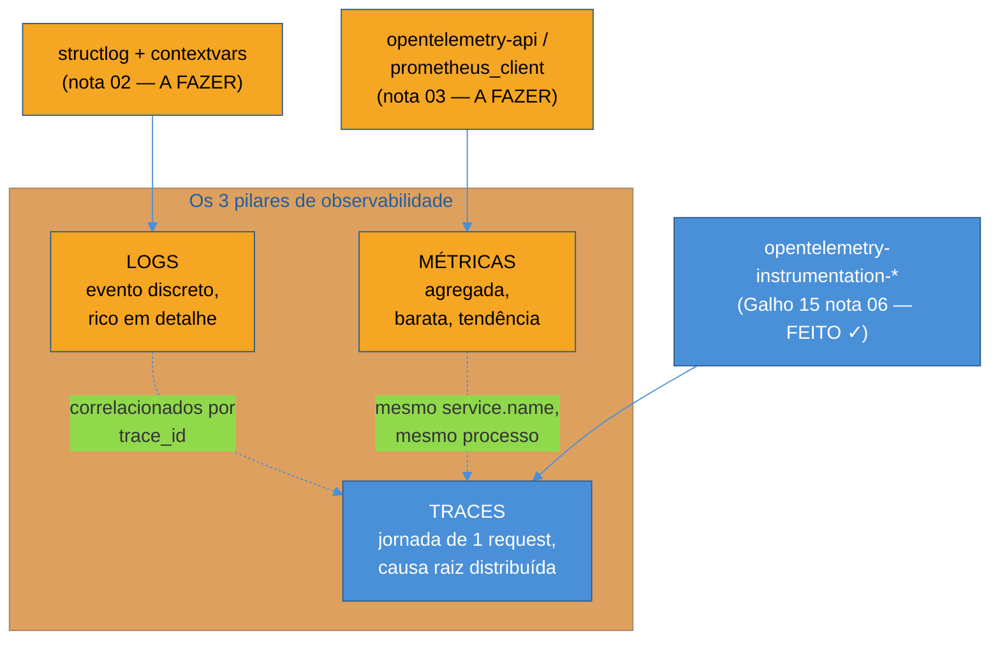

# Panorama — o que falta pra produção de verdade

> [!abstract] TL;DR
> Os dois serviços da trilha — Tarefas e Notificações — passam por Galhos 9 a 16 ganhando arquitetura, testes, tooling, mensageria, tracing distribuído. Rodam perfeitamente em `uvicorn --reload` na máquina de desenvolvimento. O que falta é o que só aparece quando um deles cai em produção, de madrugada, sem ninguém olhando: **logs estruturados** que respondam "o que aconteceu" sem grep em texto solto, **métricas** que respondam "isso é normal ou não" sem abrir código, e um **servidor de produção de verdade** — não o `--reload` de desenvolvimento — com workers configurados, graceful shutdown, health checks que dizem se o processo está pronto pra receber tráfego, e um `Dockerfile` que builda o artefato que vai pro ar. O **tracing** distribuído, terceiro pilar clássico de observabilidade, já foi resolvido com código real no [[03-Dominios/Tecnologia/Python/Microservices e sistemas distribuídos/06 - Tracing distribuído com OpenTelemetry|Galho 15]] — este galho completa os outros dois pilares e cobre o resto do que separa "funciona no meu notebook" de "está pronto pra produção de verdade". A **filosofia** de observabilidade (SLI/SLO, alerting, incident response, postmortems) já está coberta, agnóstica de linguagem, em [[03-Dominios/Engenharia/Operação/4 - Observar e responder/index|Engenharia/Operação]] — aqui é só o ferramental Python que instrumenta essa filosofia.

## A cena: dois serviços perfeitos, até não serem

Sexta-feira, 22h. Os dois serviços da trilha — a API de Tarefas e o serviço de Notificações, extraídos no [[03-Dominios/Tecnologia/Python/Microservices e sistemas distribuídos/index|Galho 15]] — estão rodando havia semanas sem incidente. O time passou por arquitetura hexagonal ([[03-Dominios/Tecnologia/Python/Arquitetura e Design Patterns/index|Galho 13]]), mensageria com Outbox e RabbitMQ ([[03-Dominios/Tecnologia/Python/Mensageria/index|Galho 14]]), resiliência entre serviços com retry e circuit breaker, e tracing distribuído com `trace_id` amarrando os dois processos numa árvore só ([[03-Dominios/Tecnologia/Python/Microservices e sistemas distribuídos/06 - Tracing distribuído com OpenTelemetry|Galho 15 nota 06]]). O `pytest` está verde, o `ruff` não reclama de nada, o tooling do [[03-Dominios/Tecnologia/Python/Build e tooling/index|Galho 16]] garante que o que passou no CI é exatamente o que roda em produção.

Às 3h12 da manhã seguinte, o serviço de Notificações para de responder. Ninguém percebe na hora — não há alerta configurado, porque não há métrica nenhuma emitindo um sinal de que algo mudou. O primeiro sintoma chega quatro horas depois, às 7h, quando um cliente reclama que não recebeu notificação nenhuma da madrugada. Alguém entra no servidor, tenta entender o que aconteceu, e encontra: um processo `uvicorn` sozinho, sem supervisor, que morreu com uma exceção não tratada e nunca reiniciou. O log é uma sequência de `print()` e `logging.info("processando...")` sem nenhuma estrutura — impossível filtrar por período, por tipo de erro, por qualquer coisa que não seja ler a sequência inteira de cima a baixo, torcendo pra achar a linha certa no meio de milhares de outras. Não existe um endpoint `/health` que um orquestrador pudesse ter consultado para saber que o processo estava morto e reiniciá-lo sozinho. Não existe métrica nenhuma — nem `requests_total`, nem `errors_total`, nem `latency_seconds` — que pudesse ter disparado um alerta às 3h13, em vez de um cliente reclamando às 7h.

O código de negócio dos dois serviços está correto. A arquitetura está correta. O problema não é nada que os Galhos 9 a 16 desta trilha ensinaram a evitar — é que nenhum deles ensinou o que fazer **quando** algo dá errado em produção, de madrugada, sem ninguém olhando a tela. É exatamente essa lacuna que este galho fecha.

> [!question]- Isso não é um problema de infraestrutura, não de código Python?
> É os dois, e a linha entre eles é menos nítida do que parece. Ter um orquestrador que reinicia processos mortos (Kubernetes, systemd, supervisord) é infraestrutura — e fica fora do escopo deste galho, reservado para o [[03-Dominios/Tecnologia/Python/Observabilidade e produção/index|Galho 18 futuro]]. Mas **expor um endpoint `/health` que reporte corretamente se o processo está vivo e pronto** é código de aplicação — ninguém de infraestrutura consegue inventar essa resposta sem que o serviço a exponha. O mesmo vale para métricas: o Prometheus pode existir e estar rodando perfeitamente, mas se o código do serviço não expõe um endpoint `/metrics` com os contadores certos, não há nada para o Prometheus coletar. Este galho cobre exatamente essa fronteira — o que o **código Python** precisa fazer para que a infraestrutura de observabilidade, quando existir, tenha algo útil para consumir.

## Os três pilares, de novo — mas agora completos

A nota [[03-Dominios/Engenharia/Operação/4 - Observar e responder/01 - Observabilidade como prática|Observabilidade como prática]], em Engenharia/Operação, já desenvolveu em profundidade a distinção entre monitoring e observability, o eixo de cardinalidade que separa os dois, e o trade-off estrutural de cada um dos três pilares clássicos — métricas, logs, traces. Vale relembrar rapidamente a tabela de trade-offs daquela nota, porque ela organiza o que este galho constrói:

| Pilar | Granularidade | Ótimo pra | Onde este galho entra |
| --- | --- | --- | --- |
| Métricas | Agregada (série temporal) | Tendência, dashboards, alerta de threshold | [[03 - Métricas com OpenTelemetry e Prometheus client\|nota 03]] — instrumentação real |
| Logs | Evento discreto | Detalhe de um evento específico | [[02 - Logging estruturado — structlog e correlação com trace\|nota 02]] — instrumentação real |
| Traces | Jornada de 1 request | Causa raiz em sistema distribuído | Já feito — [[03-Dominios/Tecnologia/Python/Microservices e sistemas distribuídos/06 - Tracing distribuído com OpenTelemetry\|Galho 15 nota 06]] |

O que muda aqui, em relação à nota de Operação, é a lente: lá, a pergunta era "por que cardinalidade importa, o que separa monitoring de observability, como pensar em wide events". Aqui, a pergunta é mais estreita e mais concreta: "dado que eu já sei o que é um log estruturado e uma métrica, que biblioteca Python eu instalo, que código eu escrevo, em que porta eu exponho isso, hoje, nos dois serviços desta trilha". Este galho não reabre a teoria — ele aplica.

O diagrama acima é literalmente o placar deste galho: tracing está pronto (azul), logging e métricas estão pendentes (âmbar) — e é isso que as notas 02 e 03 resolvem, uma de cada vez, sobre os mesmos dois serviços que o resto da trilha já construiu.

> [!tip] Por que traces primeiro, na ordem em que a trilha foi escrita, se este galho é sobre logs e métricas
> Não é acidente que o tracing tenha sido resolvido antes, no Galho 15, e não aqui. Tracing nasceu ali porque a dor que o motivou era específica de microservices — correlacionar uma jornada que atravessa dois processos, o incidente de abertura daquela nota. Logging estruturado e métricas, em contraste, são úteis mesmo num monólito de um processo só — a dor que os motiva (madrugada sem visibilidade nenhuma) não depende de ter dois serviços. Colocá-los num galho separado, depois, não é desorganização — é reconhecer que "produção de verdade" tem peças que fazem sentido isoladas do resto da conversa de microservices.

## Logs e métricas: por que ainda faltam, mesmo com tracing pronto

Vale ser honesto sobre por que os dois serviços da trilha chegaram até aqui sem log estruturado nem métrica nenhuma, apesar de já terem tracing distribuído funcionando desde o Galho 15. A resposta é que tracing resolveu um problema estrutural — "como correlacionar uma jornada entre processos" — mas não resolveu dois problemas adjacentes e igualmente reais:

- **"O que aconteceu neste processo específico, agora, sem abrir um backend de tracing"** — é o problema que logging estruturado resolve. Um `trace_id` te leva à árvore de spans certa, mas dentro de um span, entender *o que o código realmente fez* — que branch condicional entrou, que valor de negócio estava envolvido, que exceção específica foi lançada — ainda depende de log. `structlog`, o assunto da [[02 - Logging estruturado — structlog e correlação com trace|nota 02]], transforma logs de texto solto em eventos estruturados (JSON, campos nomeados) e os correlaciona com o mesmo `trace_id` que o Galho 15 já propaga — a ponte entre os dois pilares que a própria nota de tracing já antecipou, sem desenvolver.
- **"Isso é normal ou não, sem esperar alguém reclamar"** — é o problema que métricas resolvem, e é justamente o que faltou no incidente de abertura desta nota: nenhum sinal disparou às 3h13, porque não havia métrica nenhuma emitindo. A [[03 - Métricas com OpenTelemetry e Prometheus client|nota 03]] instrumenta os "4 golden signals" (latência, tráfego, erros, saturação — a versão consolidada de RED/USE que a nota de Operação já nomeou) diretamente nos endpoints FastAPI dos dois serviços.

> [!warning] Achar que tracing "já cobre" logging e métricas, porque os três são "a mesma coisa de observabilidade"
> **O que acontece:** um time instrumenta tracing distribuído, vê spans bonitos aparecendo num backend, e considera o trabalho de observabilidade concluído — sem notar que segue sem log estruturado e sem métrica nenhuma. **Por quê:** os três pilares respondem perguntas estruturalmente diferentes, listadas na tabela desta nota. Um trace mostra a topologia de uma jornada específica — não é bom pra responder "isso é normal, comparado à última hora?" (pergunta de métrica) nem "o que exatamente esse código fez neste ponto?" (pergunta de log). Ter um pilar excelente não substitui os outros dois — eles são complementares, não intercambiáveis. **Como evitar:** tratar "observabilidade pronta pra produção" como um checklist de três itens, não um: log estruturado emitindo, métrica exposta e coletável, trace correlacionando os dois — e só declarar o serviço pronto quando os três estiverem de fato instrumentados, não só o mais fácil ou o mais recente de implementar.

## Do log e da métrica até o processo rodando de verdade

Instrumentar bem não é suficiente se o processo em si não está configurado pra produção. É a segunda metade deste galho, e ela responde a uma pergunta diferente: mesmo com log estruturado e métrica expostos, **como esse processo Python roda de fato em produção**, de um jeito que sobrevive a picos de tráfego, a deploys sem downtime, e a falhas parciais sem virar um incidente maior do que precisava ser?

A trilha, até aqui, sempre rodou os serviços com `uvicorn --reload` — o modo de desenvolvimento, que reinicia o processo a cada mudança de arquivo e roda um único worker, sem qualquer preocupação com throughput ou resiliência de processo. Em produção, isso é o oposto do que se quer: nenhum reload automático (você não quer que o servidor reinicie sozinho por um arquivo temporário sendo escrito), múltiplos workers atendendo requisições em paralelo, e um comportamento bem definido quando o processo precisa desligar (um deploy novo chegando, um autoscaler removendo uma réplica) sem derrubar requisições em andamento no meio do caminho.

- **[[04 - WSGI vs ASGI na prática — gunicorn e uvicorn|WSGI vs ASGI na prática]]** — por que `gunicorn` (WSGI, maduro, gerenciador de processos) e `uvicorn` (ASGI, o protocolo que a trilha já usa desde o [[03-Dominios/Tecnologia/Python/Web e APIs REST/index|Galho 8]]) não competem, mas se combinam — `gunicorn` como gerente de processos, `uvicorn` como worker ASGI de fato, o combo padrão de produção Python.
- **[[05 - Configuração de servidor de produção — workers, timeouts e graceful shutdown|Configuração de servidor de produção]]** — número de workers, timeout por worker, e o mecanismo que teria evitado boa parte do estrago do incidente de abertura: graceful shutdown, que dá tempo pras requisições em andamento terminarem antes do processo morrer, em vez de cortá-las na marra.
- **[[06 - Health checks e probes|Health checks e probes]]** — o endpoint que faltou às 3h da manhã: `/health` (o processo está vivo?) e `/ready` (o processo está pronto pra receber tráfego — já conectou no banco, já processou o warm-up necessário?), a distinção que um orquestrador usa pra decidir se reinicia um processo ou só espera ele terminar de inicializar.
- **[[07 - Deploy básico — Dockerfile e CI-CD|Deploy básico]]** — o `Dockerfile` que empacota um dos dois serviços da trilha (reusando o tooling do [[03-Dominios/Tecnologia/Python/Build e tooling/index|Galho 16]], não reconstruindo do zero) e o esqueleto conceitual de um pipeline CI/CD que builda, testa e publica esse artefato.

> [!question]- Por que não ensinar Kubernetes de uma vez, já que é pra onde esse Dockerfile vai?
> Porque orquestração de containers é, por si só, um domínio inteiro — service mesh, scheduling, autoscaling, secrets de cluster, networking entre pods — e tentar espremer isso numa nota deste galho produziria só superficialidade nos dois assuntos. A fronteira cravada no roadmap deste galho é explícita: Kubernetes, containers em profundidade e deploy serverless ficam para o Galho 18 futuro (Cloud-native e produção), ainda não escrito. O que este galho entrega é o artefato — um `Dockerfile` correto, um processo bem configurado, health checks corretos — que qualquer orquestrador, quando existir, vai saber consumir. É a mesma lógica de fronteira que separou tracing (Galho 15) de logging/métricas (aqui): resolver a parte que o código Python controla, sem fingir que também é preciso ensinar a parte que é pura infraestrutura.

## O roteiro deste galho

O galho segue a ordem natural de quem está transformando os dois serviços prontos do [[03-Dominios/Tecnologia/Python/Build e tooling/index|Galho 16]] em algo que sobrevive a produção de verdade — primeiro fecha os pilares de observabilidade que faltam, depois configura o processo em si:

1. **[[02 - Logging estruturado — structlog e correlação com trace|Logging estruturado: structlog e correlação com trace]]** — `logging` stdlib versus `structlog`, logs como dicionários em vez de strings formatadas, e como correlacionar cada linha de log com o `trace_id` que o Galho 15 já propaga, via `contextvars`.
2. **[[03 - Métricas com OpenTelemetry e Prometheus client|Métricas com OpenTelemetry e Prometheus client]]** — contador, histograma e gauge, instrumentados num endpoint FastAPI real: latência, contagem de requests, taxa de erro — os golden signals na prática, não só na teoria.
3. **[[04 - WSGI vs ASGI na prática — gunicorn e uvicorn|WSGI vs ASGI na prática: gunicorn e uvicorn]]** — o combo `gunicorn -k uvicorn.workers.UvicornWorker`, e por que ele é o padrão de fato em produção Python.
4. **[[05 - Configuração de servidor de produção — workers, timeouts e graceful shutdown|Configuração de servidor de produção: workers, timeouts e graceful shutdown]]** — o ajuste fino que separa um servidor configurado por padrão de um servidor configurado pra aguentar tráfego real e desligar sem incidente.
5. **[[06 - Health checks e probes|Health checks e probes]]** — liveness versus readiness, e o endpoint que, se tivesse existido, teria transformado o incidente de abertura desta nota de "quatro horas sem ninguém notar" em "reiniciado automaticamente em segundos".
6. **[[07 - Deploy básico — Dockerfile e CI-CD|Deploy básico: Dockerfile e CI/CD]]** — o artefato que sai desta trilha pronto pra ir pro ar, e o esqueleto conceitual de um pipeline que builda, testa e publica esse artefato.
7. **[[08 - Capstone — os dois serviços prontos pra produção|Capstone: os dois serviços prontos pra produção]]** — recapitula o galho inteiro instrumentando de fato os dois serviços (Tarefas e Notificações) com logging, métricas, servidor configurado, health checks e Dockerfile — o cenário integrador que fecha a trilha de "produção de verdade" e aponta pro Galho 18.

> [!tip] Este galho não é o fim da história — é o início da parte que dói de verdade
> Terminar este galho não significa "pronto, produção resolvida". Significa que o código Python dos dois serviços não é mais o gargalo — ele expõe o que uma equipe de operação precisa pra fazer o resto: dashboards em cima das métricas expostas aqui, alertas configurados sobre elas (o assunto de [[03-Dominios/Engenharia/Operação/4 - Observar e responder/03 - Alerting que não gera fadiga|Alerting que não gera fadiga]], em Operação), e um processo de resposta a incidente que sabe usar esses dados quando o pager tocar de verdade (idem, [[03-Dominios/Engenharia/Operação/4 - Observar e responder/04 - Incident response e on-call|Incident response e on-call]]). A parte que este galho resolve é pré-condição pra tudo isso — sem log estruturado, sem métrica, sem health check, nenhuma dessas práticas de operação tem matéria-prima pra funcionar.

## Fronteiras: o que este galho não ensina de novo

Repetindo o padrão já estabelecido nos galhos anteriores desta trilha, vale nomear explicitamente o que este galho **não** cobre, porque já está resolvido em outro lugar:

- **SLI/SLO, alerting sem fadiga, incident response, postmortems blameless** → [[03-Dominios/Engenharia/Operação/4 - Observar e responder/index|Engenharia/Operação — Observar e responder]], agnóstico de linguagem. Este galho instrumenta os dados; a decisão de o que virar SLI e quanto de falha é tolerável é uma conversa entre engenharia e produto, não uma decisão de código.
- **Tracing distribuído, `Span`, `Tracer`, propagação de `traceparent`** → já construído com código real no [[03-Dominios/Tecnologia/Python/Microservices e sistemas distribuídos/06 - Tracing distribuído com OpenTelemetry|Galho 15 nota 06]]. As notas 02 e 03 deste galho reusam o mesmo `TracerProvider` e o mesmo `trace_id`, sem reconstruir a mecânica de tracing.
- **Secrets e configuração segura** (variáveis de ambiente, vaults, rotação de credenciais) → já coberto no [[03-Dominios/Tecnologia/Python/Segurança/06 - Secrets e configuração segura|Galho 11 nota 06]]. O `Dockerfile` da nota 07 referencia essa nota em vez de repetir como injetar segredo num container.
- **Containers em profundidade, Kubernetes, deploy serverless** → um galho futuro (Cloud-native e produção). O `Dockerfile` da nota 07 é o artefato mínimo; orquestrar esse artefato em escala fica pra depois.
- **Build, empacotamento e tooling consistente** (`uv`, `ruff`, CI de lint/teste) → já construído no [[03-Dominios/Tecnologia/Python/Build e tooling/index|Galho 16]]. Este galho parte dos dois serviços já com esse tooling pronto — não reabre a discussão de ferramenta.

## Em entrevista

Perguntas de entrevista sênior sobre "seu serviço está pronto pra produção?" raramente aceitam "sim, os testes passam" como resposta completa — o entrevistador está testando se você sabe nomear, especificamente, o que falta entre "os testes passam localmente" e "isso pode receber tráfego real, de madrugada, sem ninguém olhando". A resposta forte nomeia os três pilares de observabilidade (não só "eu tenho logs"), distingue liveness de readiness num health check, e explica por que graceful shutdown importa especificamente durante deploy — não como trivia, mas como o mecanismo concreto que evita cortar uma requisição de um cliente real no meio de um rolling update.

## How to explain in English

> "Being 'done' with a feature and being 'production-ready' are different bars. Production-ready means: structured logs you can query, not grep — metrics exposing the four golden signals so an alert fires before a customer complains — a trace correlating a request across services when something breaks — and a process configured to run under real load: multiple workers, explicit timeouts, and graceful shutdown so in-flight requests finish before a deploy kills the old process. Skipping any one of those doesn't just mean 'less visibility' — it means the next incident gets diagnosed by luck instead of by data."

| PT | EN |
|----|----|
| Pronto pra produção | Production-ready |
| Log estruturado | Structured logging |
| Sinais de ouro (latência, tráfego, erros, saturação) | Golden signals |
| Verificação de saúde | Health check |
| Prontidão / vivacidade | Readiness / liveness |
| Desligamento gracioso | Graceful shutdown |
| Implantação contínua | Rolling deploy |

## Fontes

- [[03-Dominios/Engenharia/Operação/4 - Observar e responder/01 - Observabilidade como prática|Observabilidade como prática]] — Engenharia/Operação — a filosofia agnóstica de linguagem: monitoring vs. observability, cardinalidade, os três pilares e seus trade-offs estruturais, wide events. Este galho aplica, não repete.
- [[03-Dominios/Tecnologia/Python/Microservices e sistemas distribuídos/06 - Tracing distribuído com OpenTelemetry|Tracing distribuído com OpenTelemetry]] — Galho 15 nota 06 — o terceiro pilar, já construído em código Python real; reusado sem reconstrução.
- OpenTelemetry. *What is OpenTelemetry?*. opentelemetry.io. https://opentelemetry.io/docs/what-is-opentelemetry/ (acessado em 2026-07-12) — visão geral do projeto e dos três sinais (logs, métricas, traces) sob um SDK único.
- OpenTelemetry. *Python — Getting Started*. opentelemetry.io. https://opentelemetry.io/docs/languages/python/getting-started/ (acessado em 2026-07-12) — ponto de partida para logging e métricas em Python, que as notas 02 e 03 deste galho desenvolvem.
- Google. *Site Reliability Engineering — Monitoring Distributed Systems*. sre.google/sre-book/monitoring-distributed-systems/ (acessado em 2026-07-12) — origem dos "4 golden signals" (latência, tráfego, erros, saturação) que a nota 03 instrumenta.

Consultado em 2026-07-12.
