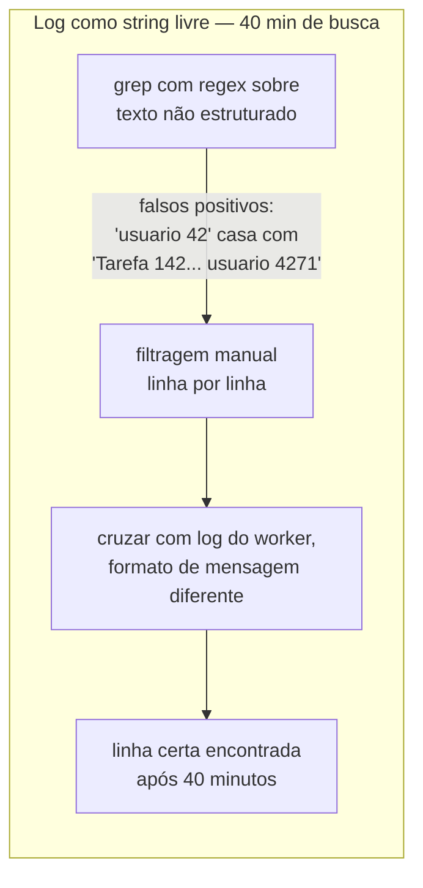
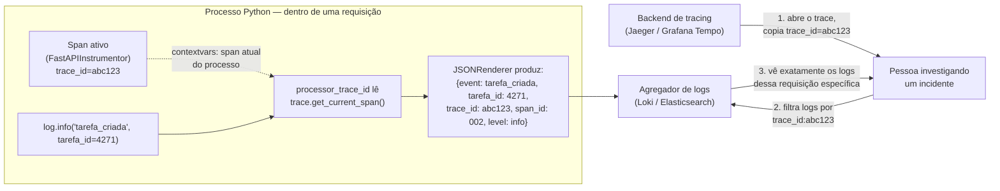

# Logging estruturado — structlog e correlação com trace

> [!abstract] TL;DR
> `logger.info(f"Tarefa {tarefa_id} criada por {usuario_id}")` produz uma **string**, não um dado — para achar "todas as tarefas criadas pelo usuário 42 na última hora" num agregador de logs (Loki, Elasticsearch, CloudWatch Logs Insights), alguém precisa escrever uma regex sobre texto livre, e essa regex quebra silenciosamente na primeira vez que a mensagem muda uma palavra. `structlog` resolve isso trocando a mensagem por um **dicionário**: `log.info("tarefa_criada", tarefa_id=tarefa_id, usuario_id=usuario_id)` — cada campo vira uma chave pesquisável e filtrável separadamente, sem regex, sem parsing frágil. O segundo ganho, que só aparece depois que o [[03-Dominios/Tecnologia/Python/Microservices e sistemas distribuídos/06 - Tracing distribuído com OpenTelemetry|Galho 15 nota 06]] já existe: injetar o `trace_id` do span atual automaticamente em **toda** linha de log, via um processor que lê `trace.get_current_span()` — assim, ao abrir um trace específico num backend de tracing, os logs daquela mesma requisição aparecem com um filtro trivial (`trace_id = abc123`), sem precisar adivinhar qual linha de log pertence a qual requisição. Em produção, `structlog` renderiza cada linha como JSON, pronto para um agregador consumir; em desenvolvimento local, a mesma chamada de log renderiza colorida e legível no terminal — a mesma chamada, dois formatos, escolhidos por configuração, não por código duplicado.

## O incidente: uma regex para achar um usuário em três milhões de linhas

Quinta-feira, 22h. Um cliente relata, pelo suporte, que perdeu uma tarefa importante — ela "sumiu" da lista depois de uma edição. O time de plantão recebe só um dado concreto: o e-mail do usuário e um horário aproximado, "por volta das 21h". Não existe `tarefa_id`, porque o cliente não sabe o ID da tarefa que sumiu — só sabe que era dele.

O primeiro instinto é abrir o log de produção e procurar. O log da API de Tarefas grava assim, há dois anos, desde o primeiro commit do projeto:

```python
import logging

logger = logging.getLogger(__name__)

logger.info(f"Tarefa {tarefa_id} criada por usuario {usuario_id}")
logger.info(f"Tarefa {tarefa_id} atualizada: titulo={titulo}")
logger.warning(f"Tarefa {tarefa_id} nao encontrada para usuario {usuario_id}")
```

Isso funciona bem quando alguém já sabe o `tarefa_id` e quer seguir a trilha de eventos daquela tarefa específica — um `grep "Tarefa 4271"` resolve na hora. O problema desta noite é o oposto: ninguém tem o `tarefa_id`, só tem o `usuario_id` (depois de uma consulta rápida no banco pelo e-mail) e uma janela de tempo. E o `usuario_id` não aparece de forma consistente em toda linha — em algumas mensagens ele vem como `usuario_id`, em outras como `usuario`, em pelo menos um trecho de código mais antigo como `user_id` (escrito por alguém que ainda pensava em inglês naquele dia), e em nenhuma delas existe uma estrutura que garanta que o campo esteja sempre no mesmo lugar da string.

A pessoa de plantão escreve a primeira tentativa de busca:

```bash
grep "usuario_id=42\|usuario 42\|user_id=42" producao.log | grep "21:"
```

Três milhões de linhas de log por dia, nesse serviço. A regex acima devolve duzentas e sessenta linhas — a maioria delas falsos positivos, porque `"usuario 42"` também casa com `"Tarefa 142 criada por usuario 4271"` (o `42` aparece dentro de outro número). Filtrar manualmente, linha por linha, os falsos positivos consome vinte minutos. Depois disso, ainda falta cruzar essas linhas com o log do worker de background que processa edições assíncronas — um log **diferente**, com seu próprio formato de mensagem, ligeiramente inconsistente com o da API, porque foi escrito por outra pessoa em outra época.

Quarenta minutos depois de começar a busca, alguém finalmente encontra a linha certa — uma exceção engolida silenciosamente num `except Exception: pass` que uma versão antiga do endpoint de edição ainda tinha, deixada para trás numa refatoração incompleta. A tarefa não sumiu: uma condição de corrida entre duas edições simultâneas do mesmo formulário (o cliente tinha duas abas abertas) fez a segunda escrita sobrescrever a primeira silenciosamente, sem erro visível para o usuário.

> [!bug] O que estava quebrado, em uma frase
> Um `except Exception: pass` esquecido escondia o erro real — mas encontrar sequer a linha de log certa consumiu quarenta minutos, porque nenhuma mensagem de log tinha uma estrutura confiável o suficiente para ser filtrada por `usuario_id` sem regex frágil e falsos positivos.



Duas semanas depois, o time migra para `structlog`. O mesmo tipo de investigação — "todos os eventos de um `usuario_id` específico numa janela de tempo" — vira uma query estruturada no agregador de logs: `usuario_id:42 AND timestamp:[21:00 TO 22:00]`. Sem regex, sem falso positivo, sem cruzar formatos de mensagem diferentes entre serviços, porque agora cada serviço grava o mesmo tipo de dado (dicionário/JSON) com as mesmas chaves consistentes. A investigação seguinte, de perfil parecido, leva menos de um minuto.

O resto desta nota constrói exatamente essa migração: por que `logging` puro empurra o problema para quem lê o log depois, como `structlog` transforma cada linha em dado estruturado, como correlacionar cada linha automaticamente com o `trace_id` do [[03-Dominios/Tecnologia/Python/Microservices e sistemas distribuídos/06 - Tracing distribuído com OpenTelemetry|Galho 15 nota 06]], quando usar cada nível de log, e como a mesma chamada produz JSON em produção e saída colorida em desenvolvimento.

## `logging`: o módulo nativo, e por que a string livre não escala

O módulo `logging` da stdlib gira em torno de quatro peças: um **`Logger`** (o objeto que o código chama — `logger.info(...)`, `logger.warning(...)`), um ou mais **`Handler`**s (para onde a linha vai — `StreamHandler` para `stdout`, `FileHandler` para um arquivo, `SysLogHandler` para um syslog remoto), um **`Formatter`** (como a linha é serializada em texto) e, opcionalmente, **`Filter`**s (lógica extra que decide se uma linha passa ou não, ou que enriquece o `LogRecord` antes da formatação).

```python
import logging

logging.basicConfig(
    level=logging.INFO,
    format="%(asctime)s %(levelname)s %(name)s: %(message)s",
)

logger = logging.getLogger(__name__)

logger.info(f"Tarefa {tarefa_id} criada por usuario {usuario_id}")
```

O padrão acima — chamar `getLogger(__name__)` uma vez por módulo — é uma convenção estabelecida da stdlib: o nome do logger vira o `__name__` do módulo que o criou, o que permite, mais tarde, configurar níveis de log diferentes por módulo (`logging.getLogger("app.pagamentos").setLevel(logging.DEBUG)` sem afetar o resto da aplicação). Isso já é uma boa prática independente de `structlog` — vale manter mesmo depois da migração desta nota.

O problema não está na arquitetura do `logging` — `Logger`/`Handler`/`Formatter`/`Filter` é um design sólido e ainda é a base sobre a qual `structlog` se apoia (a próxima seção mostra isso). O problema está em **como a mensagem em si é construída**: `f"Tarefa {tarefa_id} criada por usuario {usuario_id}"` interpola os valores dentro de uma string antes de qualquer coisa acontecer com o log. No momento em que essa string chega ao `Handler`, o `tarefa_id` e o `usuario_id` já deixaram de existir como dados — viraram texto indistinguível do resto da frase. Um sistema de agregação de log (Loki, Elasticsearch, Datadog, CloudWatch Logs Insights) pode até indexar o texto inteiro para busca full-text, mas não consegue **filtrar por campo** (`WHERE usuario_id = 42`) porque não existe campo — só uma frase.

> [!question]- `logging.info("mensagem %s", valor)` (lazy interpolation) já não resolve isso?
> Resolve um problema diferente e real — mas não este. `logger.info("Tarefa %s criada por usuario %s", tarefa_id, usuario_id)`, com placeholders `%s` em vez de f-string, adia a interpolação da string para **depois** de checar se aquele nível de log está ativo (economiza o custo de formatar uma string que nunca vai ser escrita, se o logger estiver configurado acima de `INFO`) — uma otimização de performance real e documentada pela própria stdlib. Mas o resultado final, depois que o `Formatter` roda, ainda é uma string de texto livre: `tarefa_id` e `usuario_id` continuam interpolados dentro da frase, não expostos como campos separados para quem lê o log depois. Lazy interpolation resolve "não desperdice CPU formatando string à toa"; não resolve "torne o dado pesquisável por campo" — são dois problemas diferentes, e `structlog` resolve o segundo.

## `structlog`: log como dicionário, não como frase

`structlog` reformula a chamada de log em duas partes: um **evento** (uma string curta, estável, que nomeia o que aconteceu — não uma frase completa com os dados embutidos) e um conjunto de **campos** (pares chave-valor, passados como *keyword arguments*, que carregam os dados de verdade).

```python
import structlog

log = structlog.get_logger()

log.info("tarefa_criada", tarefa_id=tarefa_id, usuario_id=usuario_id)
log.info("tarefa_atualizada", tarefa_id=tarefa_id, titulo=titulo)
log.warning("tarefa_nao_encontrada", tarefa_id=tarefa_id, usuario_id=usuario_id)
```

A diferença de vocabulário importa: `"tarefa_criada"` não é uma frase, é um **nome de evento** — estável entre chamadas, o suficiente para servir como chave de agrupamento num dashboard ("quantos eventos `tarefa_criada` por minuto?"). Os dados variáveis (`tarefa_id`, `usuario_id`, `titulo`) ficam de fora do evento, como campos próprios. Renderizado como JSON, a segunda linha de log do exemplo acima vira:

```json
{"event": "tarefa_atualizada", "tarefa_id": 4271, "titulo": "Revisar proposta", "timestamp": "2026-07-12T21:03:44Z", "level": "info", "logger": "app.tarefas"}
```

Cada chave desse objeto é filtrável, agregável e agrupável independentemente das outras, no agregador de logs de escolha do time — sem regex, sem parsing frágil de texto, sem depender de que ninguém nunca mude a ordem das palavras numa frase que quebraria uma regex existente.

### Bound logger: contexto que acompanha o logger, não repetido em toda chamada

Passar `tarefa_id=tarefa_id` em toda chamada de log dentro de uma mesma função é repetitivo. `structlog` resolve isso com **bound loggers** — um logger "vinculado" a um conjunto de campos que se repetem automaticamente em toda chamada subsequente, sem precisar passá-los de novo:

```python
import structlog

log = structlog.get_logger()


async def processar_conclusao_tarefa(tarefa_id: int, usuario_id: int) -> None:
    log_da_operacao = log.bind(tarefa_id=tarefa_id, usuario_id=usuario_id)

    log_da_operacao.info("iniciando_conclusao")
    tarefa = await buscar_tarefa(tarefa_id)

    if tarefa is None:
        log_da_operacao.warning("tarefa_nao_encontrada")
        return

    await salvar_tarefa(tarefa)
    log_da_operacao.info("conclusao_finalizada", duracao_ms=42)
```

`log.bind(...)` devolve um **novo** bound logger (imutável — não modifica `log` original), carregando `tarefa_id` e `usuario_id` em todo evento futuro chamado a partir dele. As três chamadas (`iniciando_conclusao`, `tarefa_nao_encontrada`, `conclusao_finalizada`) automaticamente incluem `tarefa_id=4271, usuario_id=42` sem repetir esses dois argumentos em cada linha — o que reduz repetição de código e, mais importante, elimina a chance de esquecer de incluir um campo importante numa das três chamadas por descuido.

> [!tip] `bind()` em cascata reflete a estrutura do código
> Nada impede encadear `bind()` em pontos diferentes de uma pilha de chamadas — um middleware faz `log.bind(request_id=..., metodo=..., rota=...)` uma vez, no início da requisição, e passa esse bound logger adiante (via `contextvars`, a seção seguinte mostra o padrão canônico); uma função mais interna pode fazer `log_da_requisicao.bind(tarefa_id=...)` de novo, acumulando contexto conforme a execução desce a pilha. Cada camada só adiciona o que sabe, sem precisar saber o que as camadas de fora ou de dentro já adicionaram.

### Processors: o pipeline que constrói cada linha de log

Por baixo, `structlog` funciona como um **pipeline de processors** — funções encadeadas que recebem o dicionário de evento em construção e o transformam ou enriquecem, uma etapa de cada vez, até a etapa final que renderiza a saída (JSON ou texto colorido).

```python
import structlog

structlog.configure(
    processors=[
        structlog.contextvars.merge_contextvars,
        structlog.processors.add_log_level,
        structlog.processors.TimeStamper(fmt="iso"),
        structlog.processors.JSONRenderer(),
    ],
)
```

Cada processor da lista roda em ordem: `merge_contextvars` injeta qualquer valor guardado em `contextvars` (a próxima seção usa exatamente esse mecanismo para o `trace_id`); `add_log_level` insere o campo `level`; `TimeStamper` insere um `timestamp` ISO 8601; `JSONRenderer` é o último da cadeia — serializa o dicionário acumulado como uma linha JSON. Trocar só o último processor (`JSONRenderer` por `ConsoleRenderer`) muda o formato de saída sem tocar em nenhuma chamada de log espalhada pelo código — a seção de configuração dev/prod, mais adiante, usa exatamente essa troca.

## Correlacionando cada linha de log com o `trace_id`

O [[03-Dominios/Tecnologia/Python/Microservices e sistemas distribuídos/06 - Tracing distribuído com OpenTelemetry|Galho 15 nota 06]] já resolveu como o `trace_id` viaja entre processos, via o header `traceparent` (padrão W3C Trace Context) e instrumentação automática de FastAPI/`httpx` — esta nota não repete esse mecanismo, só usa o `trace_id` que ele já gera. O ganho de injetar esse mesmo `trace_id` em toda linha de log é a ponte entre duas ferramentas de investigação diferentes: quem abre um trace específico no backend de tracing (Jaeger, Grafana Tempo) e quer ver os logs daquela requisição não precisa adivinhar qual linha pertence a qual trace — basta filtrar pelo mesmo `trace_id`, no mesmo agregador de logs.

```python
import structlog
from opentelemetry import trace


def processor_trace_id(logger, method_name, event_dict):
    span = trace.get_current_span()
    ctx = span.get_span_context()
    if ctx.is_valid:
        event_dict["trace_id"] = format(ctx.trace_id, "032x")
        event_dict["span_id"] = format(ctx.span_id, "016x")
    return event_dict


structlog.configure(
    processors=[
        structlog.contextvars.merge_contextvars,
        processor_trace_id,
        structlog.processors.add_log_level,
        structlog.processors.TimeStamper(fmt="iso"),
        structlog.processors.JSONRenderer(),
    ],
)
```

`processor_trace_id` é um processor customizado — uma função simples que recebe o `event_dict` em construção, consulta `trace.get_current_span()` (o mesmo span "atual" do processo que o `FastAPIInstrumentor` ou um `with tracer.start_as_current_span(...)` manual já deixou registrado via `contextvars`, exatamente como o Galho 15 nota 06 documentou), e injeta `trace_id`/`span_id` no dicionário se houver um span válido em andamento. Nenhum código de negócio precisa passar o `trace_id` manualmente — o processor faz isso automaticamente, em toda chamada de log, dentro ou fora de um handler HTTP.



> [!info] Leitura do diagrama
> O `trace_id` nasce no span (criado pela instrumentação de tracing do Galho 15 nota 06) e é lido — nunca gerado de novo — pelo processor de logging, via o mesmo mecanismo de `contextvars` que já propaga o span "atual" dentro do processo. O resultado é que o backend de tracing e o agregador de logs, apesar de serem ferramentas diferentes, com interfaces diferentes, compartilham o mesmo identificador — abrir um trace e filtrar logs pelo `trace_id` copiado dali é uma operação de segundos, não de correlacionar timestamps manualmente entre duas ferramentas que não se conhecem.

A [[03-Dominios/Tecnologia/Python/Web e APIs REST/07 - Middleware e o ciclo de vida da requisição|nota 07 do Galho 10]] já mostrou um padrão parecido, um `correlation_id_var: ContextVar[str]` gerado manualmente por um middleware, para times que ainda não adotaram tracing distribuído. O `trace_id` do OpenTelemetry cumpre exatamente esse mesmo papel de "amarrar logs de uma mesma requisição" — só que sem exigir que a aplicação gere e propague um ID próprio, porque a instrumentação de tracing já cuida disso; onde tracing já existe, `trace_id` é o identificador de correlação certo a usar no processor de logging, em vez de manter dois identificadores paralelos (um `correlation_id` caseiro e um `trace_id` do OpenTelemetry) fazendo o mesmo trabalho.

> [!question]- E se um evento acontecer fora de qualquer requisição HTTP — um job agendado, um script batch?
> `trace.get_current_span()` sempre devolve alguma coisa, mesmo fora de um handler instrumentado — só que, sem nenhum span ativo, `ctx.is_valid` retorna `False`, e o processor simplesmente não injeta `trace_id`/`span_id` naquela linha (o `if ctx.is_valid` do exemplo cobre exatamente esse caso). Um job agendado pode, se quiser correlação entre suas próprias linhas de log, criar seu próprio span raiz com `tracer.start_as_current_span("job_recalculo_noturno")` no início da execução — a partir daí, todo log emitido dentro daquele bloco ganha um `trace_id` novo, próprio daquela execução do job, sem depender de nenhuma requisição HTTP ter acontecido.

## Níveis de log: critério prático, não só definição

A stdlib e `structlog` compartilham os mesmos cinco níveis (`structlog` os expõe como métodos — `log.debug(...)`, `log.info(...)`, etc. — sobre o mesmo mecanismo de `logging.Logger` por baixo). A definição de dicionário ("DEBUG é informação detalhada de diagnóstico") ajuda pouco na hora de decidir, sob pressão, qual nível usar numa linha nova de código. O critério que funciona na prática é outro: **quem precisa ver essa linha, e com que urgência, quando ela aparecer em produção?**

- **`DEBUG`** — só interessa a quem está depurando ativamente, com o logger nesse nível deliberadamente ligado para aquele módulo específico. Nunca fica ativo por padrão em produção (o volume inundaria o agregador de logs e encareceria a fatura de ingestão) — é ligado pontualmente, durante uma investigação, e desligado depois. Exemplo: `log.debug("cache_hit", chave=chave, ttl_restante=ttl)`.
- **`INFO`** — o rastro normal de "o sistema está fazendo o que deveria" — eventos de negócio relevantes (`tarefa_criada`, `usuario_autenticado`, `pagamento_processado`) que alguém pode querer consultar depois, sem indicar problema nenhum. É o nível padrão de produção na maioria dos serviços.
- **`WARNING`** — algo inesperado aconteceu, mas o sistema se recuperou sozinho ou seguiu funcionando de forma degradada — não exige ação imediata de ninguém, mas vale registrar porque pode ser sintoma de um problema maior se o volume crescer. Exemplo: `log.warning("retry_de_chamada_externa", tentativa=2, servico="notificacoes")` — um retry que funcionou na segunda tentativa não é um erro, mas merece ficar registrado caso a taxa de retry comece a subir.
- **`ERROR`** — uma operação específica falhou e não completou o que deveria — o usuário daquela requisição específica foi impactado (recebeu um erro, uma operação não foi salva), mas o processo como um todo continua de pé, processando outras requisições normalmente. Exemplo: `log.error("falha_ao_salvar_tarefa", tarefa_id=tarefa_id, erro=str(exc))`.
- **`CRITICAL`** — o processo inteiro, ou uma capacidade essencial dele, está comprometido — não uma operação isolada, mas a saúde do serviço como um todo (perda de conexão com o banco de dados principal, disco cheio, uma dependência crítica indisponível o suficiente para impedir qualquer operação). Costuma ser configurado para disparar alerta automático imediato (PagerDuty, Slack de plantão), diferente de `ERROR`, que normalmente só é consultado sob demanda.

> [!tip] A pergunta certa não é "isso é grave?" — é "alguém precisa acordar por causa disso?"
> `ERROR` e `CRITICAL` são frequentemente confundidos porque os dois "parecem graves" na hora de escrever o código. O critério que separa os dois na prática é o raio de impacto: `ERROR` é grave para **quem fez aquela requisição específica**; `CRITICAL` é grave para **todo mundo usando o sistema agora**. Um serviço que dispara alerta de plantão para todo `ERROR` individual (um usuário digitou um CPF inválido, por exemplo, que já devia ser `WARNING` ou nem log nenhum, só uma resposta HTTP 400) treina a equipe de plantão a ignorar alertas — a mesma fadiga de alerta que a filosofia de observabilidade de [[03-Dominios/Engenharia/Operação/4 - Observar e responder/index|Engenharia/Operação]] trata a fundo, fora do escopo desta nota.

## JSON em produção, colorido em desenvolvimento — a mesma chamada, dois formatos

`structlog` resolve o dilema "JSON é ótimo para máquina, péssimo para olho humano" trocando só o processor final da configuração, condicionado ao ambiente:

```python
import logging
import os
import structlog


def configurar_logging() -> None:
    ambiente = os.environ.get("AMBIENTE", "desenvolvimento")

    processors_comuns = [
        structlog.contextvars.merge_contextvars,
        processor_trace_id,
        structlog.processors.add_log_level,
        structlog.processors.TimeStamper(fmt="iso"),
        structlog.processors.StackInfoRenderer(),
    ]

    if ambiente == "producao":
        renderer = structlog.processors.JSONRenderer()
    else:
        renderer = structlog.dev.ConsoleRenderer(colors=True)

    structlog.configure(
        processors=[*processors_comuns, renderer],
        wrapper_class=structlog.make_filtering_bound_logger(logging.INFO),
        logger_factory=structlog.PrintLoggerFactory(),
        cache_logger_on_first_use=True,
    )
```

Em produção (`ambiente == "producao"`), `JSONRenderer` produz uma linha JSON por evento — o formato que Loki, Elasticsearch ou CloudWatch Logs Insights esperam para indexar cada campo separadamente. Em desenvolvimento, `structlog.dev.ConsoleRenderer(colors=True)` produz uma linha colorida, alinhada, legível de relance no terminal — o mesmo dicionário de evento, só que formatado para olho humano em vez de máquina:

```
2026-07-12T21:03:44Z [info     ] tarefa_criada          tarefa_id=4271 usuario_id=42 trace_id=abc123
```

O ponto central: **nenhuma chamada `log.info(...)` espalhada pelo código muda entre os dois ambientes**. A diferença inteira mora numa única função de configuração, chamada uma vez no boot do processo — o mesmo princípio de indireção que [[03-Dominios/Tecnologia/Python/Segurança/06 - Secrets e configuração segura|secrets e configuração]] já aplicou para `os.environ` versus `.env` local: o código de negócio não sabe, e não precisa saber, qual formato de saída está ativo.

`wrapper_class=structlog.make_filtering_bound_logger(logging.INFO)` define o nível mínimo — equivalente ao `level=logging.INFO` do `basicConfig` da stdlib, só que aplicado no wrapper do `structlog`. `cache_logger_on_first_use=True` é uma otimização de performance: evita reconstruir a cadeia de processors a cada chamada de log, depois que o logger já foi resolvido pela primeira vez.

> [!tip] `structlog` se integra com `logging` da stdlib — não substitui, complementa
> `structlog.configure(...)` pode, alternativamente, usar `logger_factory=structlog.stdlib.LoggerFactory()` em vez de `PrintLoggerFactory()` — nesse modo, `structlog` só cuida da construção do dicionário de evento e do pipeline de processors, e delega a entrega final (para onde a linha vai — `stdout`, arquivo, `SysLogHandler`) para os `Handler`s do `logging` padrão já configurados via `logging.basicConfig()` ou um `dictConfig`. Isso importa em projetos com infraestrutura de logging já madura (handlers customizados, integração com uma biblioteca de terceiros que só fala com `logging.Logger`) — não é preciso escolher entre "usar `logging`" e "usar `structlog`"; o segundo constrói o dado estruturado, o primeiro continua entregando.

## Armadilhas comuns

> [!warning] Nunca logar dado sensível em texto claro
> **O que acontece:** um bound logger acumula contexto ao longo de uma função — `log.bind(usuario_id=..., email=..., senha=senha_digitada)` — ou uma linha isolada faz `log.info("login_tentativa", token=token_de_sessao)`, e o dado sensível passa a aparecer em toda linha subsequente daquele bound logger, ou naquela linha específica, indexado no agregador de logs junto com tudo mais. **Por quê:** logs têm um público muito mais amplo do que o código-fonte — qualquer pessoa com acesso ao dashboard de observabilidade (Datadog, Splunk, o painel do agregador) vê o valor, sem precisar tocar no repositório nem ter permissão de produção. Isso é o mesmo risco que a [[03-Dominios/Tecnologia/Python/Segurança/06 - Secrets e configuração segura|nota de secrets e configuração segura]] já detalhou para `print(settings.model_dump())` — logar a configuração inteira; o mesmo cuidado vale para qualquer campo estruturado passado a `log.info(...)`/`log.bind(...)`, porque `structlog` grava exatamente o que recebe, sem filtrar nada por padrão. **Como evitar:** nunca passar senha, token de sessão, chave de API ou qualquer segredo como campo de `structlog` — nem em texto claro, nem "temporariamente para debugar". Onde o dado é necessário para correlação (ex: um ID de sessão, não o token em si), logar um identificador opaco ou um hash, não o valor sensível bruto. Um processor customizado de *redaction* (que substitui automaticamente chaves conhecidas como `senha`/`password`/`token`/`authorization` por `"***"` antes do `JSONRenderer` final) é uma defesa adicional útil, mas não substitui a disciplina de nunca passar o valor sensível para o `log` em primeiro lugar.

> [!warning] `f-string` dentro do evento — o antipadrão volta pela porta dos fundos
> **O que acontece:** alguém já convencido de migrar para `structlog` escreve `log.info(f"tarefa {tarefa_id} criada")` em vez de `log.info("tarefa_criada", tarefa_id=tarefa_id)` — usando a API do `structlog`, mas devolvendo ao antipadrão de interpolar o dado dentro da string de evento. **Por quê:** o hábito de anos escrevendo `logging` puro é forte, e a API do `structlog` (`log.info(...)`) parece, à primeira vista, idêntica à do `logging.Logger.info(...)` — só que o primeiro argumento de `structlog` é pensado para ser um **nome de evento estável**, não uma frase interpolada. Uma vez que o `tarefa_id` volta a morar dentro da string, o ganho inteiro de campo pesquisável desaparece — o evento nem sequer agrupa mais corretamente num dashboard, porque `f"tarefa 4271 criada"` e `f"tarefa 4272 criada"` são strings de evento *diferentes*, uma por tarefa, em vez do mesmo evento `"tarefa_criada"` repetido com campos diferentes. **Como evitar:** tratar o primeiro argumento de toda chamada `log.<nivel>(...)` como uma constante — sempre uma string literal, nunca uma f-string ou `.format()` — e todo dado variável como *keyword argument* depois dela. Um linter customizado (regra simples de regex sobre `log\.\w+\(f["']`) pega esse antipadrão em CI antes de virar hábito espalhado pelo time.

## Como explicar em inglês

> "The core problem with `logger.info(f"Task {id} created by {user}")` is that the moment you interpolate values into an f-string, they stop being data and become plain text — a log aggregator can full-text search that line, but it can't filter on `user_id` as a field, because there's no field, just a sentence. `structlog` fixes that by splitting every log call into a stable event name plus keyword arguments — `log.info("task_created", task_id=id, user_id=user)` — so every field is independently searchable in Loki or Elasticsearch, no regex required. The second win only pays off once distributed tracing already exists: a custom processor reads the active OpenTelemetry span via `contextvars` and stamps every log line with the same `trace_id` that shows up in the trace backend — so investigating an incident means opening the trace once, copying the `trace_id`, and filtering logs by that exact value, instead of guessing which log lines belong to which request by timestamp. And because the whole pipeline is a list of processors, swapping the last one — `JSONRenderer` in production, `ConsoleRenderer` in development — changes the output format globally without touching a single log call anywhere in the codebase."

| PT | EN |
|----|----|
| Log estruturado | Structured logging |
| Evento (de log) | (Log) event |
| Campo (de log) | (Log) field |
| Logger vinculado / bound logger | Bound logger |
| Processor (pipeline) | Processor |
| Renderizador | Renderer |
| Nível de log | Log level |
| Correlação de log | Log correlation |
| Fadiga de alerta | Alert fatigue |
| Dado sensível / segredo | Sensitive data / secret |

## Síntese

`logging` puro não está quebrado — `Logger`/`Handler`/`Formatter`/`Filter` continua sendo a base de transporte que `structlog` usa por baixo. O que quebra é interpolar dados dentro da mensagem via f-string: no momento em que `tarefa_id` vira parte de uma frase, ele deixa de ser um dado pesquisável e passa a exigir regex frágil para ser encontrado de volta — o incidente de abertura desta nota gastou quarenta minutos exatamente nesse ponto. `structlog` resolve trocando a chamada de log por um evento nomeado mais campos estruturados (`log.info("tarefa_criada", tarefa_id=..., usuario_id=...)`), acumuláveis via `bind()` sem repetição, e correlacionáveis automaticamente com o `trace_id` do [[03-Dominios/Tecnologia/Python/Microservices e sistemas distribuídos/06 - Tracing distribuído com OpenTelemetry|Galho 15 nota 06]] através de um processor customizado que lê o span ativo via `contextvars` — a mesma ponte que já une "abrir um trace" e "filtrar logs daquela requisição" sem precisar de dois identificadores paralelos fazendo o mesmo trabalho. A escolha de formato — JSON em produção para o agregador consumir, colorido em desenvolvimento para o olho humano ler — mora inteiramente na configuração do pipeline de processors, nunca espalhada pelas chamadas de log em si.

O que esta nota deliberadamente não desenvolveu — a operação do agregador de logs em si (dimensionar retenção no Loki, configurar índices no Elasticsearch, custo de ingestão em escala), e a filosofia de quando um evento vira alerta versus quando fica só disponível para consulta sob demanda — é conteúdo de infraestrutura de observabilidade e de [[03-Dominios/Engenharia/Operação/4 - Observar e responder/index|Engenharia/Operação]], respectivamente; fora do escopo de código de aplicação Python que esta nota cobre.

- [[01 - Panorama — o que falta pra produção de verdade|01 — Panorama: o que falta pra produção de verdade]] — mapa deste galho; nomeia logs como um dos três pilares de observabilidade que este galho completa.
- [[03-Dominios/Tecnologia/Python/Microservices e sistemas distribuídos/06 - Tracing distribuído com OpenTelemetry|Galho 15 nota 06 — Tracing distribuído com OpenTelemetry]] — o `trace_id`/`span_id` que o processor desta nota lê via `contextvars`, sem repetir a mecânica de propagação entre processos.
- [[03-Dominios/Tecnologia/Python/Segurança/06 - Secrets e configuração segura|Galho 11 nota 06 — Secrets e configuração segura]] — o mesmo cuidado de nunca serializar dado sensível em log, aplicado ali a `settings.model_dump()`, aqui a campos de `structlog`.
- [[03-Dominios/Tecnologia/Python/Web e APIs REST/07 - Middleware e o ciclo de vida da requisição|Galho 10 nota 07 — Middleware e o ciclo de vida da requisição]] — o padrão de `ContextVar` para correlation ID caseiro, do qual o `trace_id` do OpenTelemetry é a evolução natural quando tracing distribuído já existe.
- [[index|Observabilidade e produção (Galho 17)]] — MOC deste galho.

## Fontes

- structlog. *Getting Started*. structlog.readthedocs.io. https://www.structlog.org/en/stable/getting-started.html (acessado em 2026-07-12) — `get_logger`, eventos, keyword arguments como campos.
- structlog. *Bound Loggers*. structlog.readthedocs.io. https://www.structlog.org/en/stable/bound-loggers.html (acessado em 2026-07-12) — `bind()`, contexto acumulado, imutabilidade.
- structlog. *Processors*. structlog.readthedocs.io. https://www.structlog.org/en/stable/processors.html (acessado em 2026-07-12) — pipeline de processors, `JSONRenderer`, `ConsoleRenderer`, `contextvars.merge_contextvars`.
- structlog. *Standard Library Logging*. structlog.readthedocs.io. https://www.structlog.org/en/stable/standard-library.html (acessado em 2026-07-12) — integração com `logging.Handler`, `structlog.stdlib.LoggerFactory`.
- Python Software Foundation. *`logging` — Logging facility for Python*. docs.python.org. https://docs.python.org/3/library/logging.html (acessado em 2026-07-12) — `Logger`, `Handler`, `Formatter`, `Filter`, níveis de log, lazy interpolation com `%s`.
- OpenTelemetry. *Python — Manual Instrumentation*. opentelemetry.io. https://opentelemetry.io/docs/languages/python/instrumentation/ (acessado em 2026-07-12) — `trace.get_current_span()`, `SpanContext`, o mesmo mecanismo já usado no processor de correlação desta nota.

Consultado em 2026-07-12.
