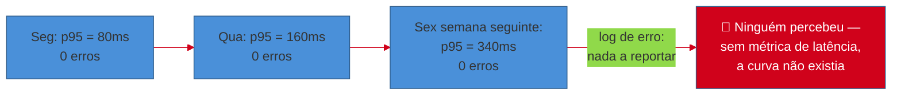
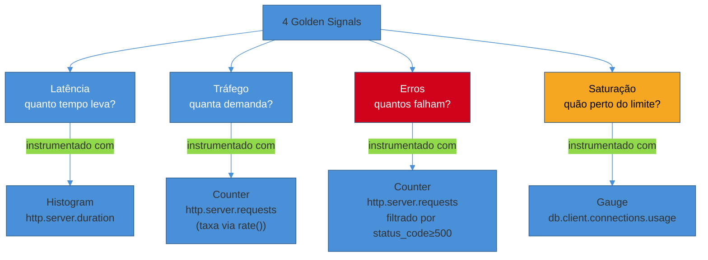

# Métricas com OpenTelemetry e Prometheus client

> [!abstract] TL;DR
> Um serviço pode degradar durante uma semana inteira, requisição a requisição, sem que um único log de erro seja emitido — porque nada quebrou, tudo só ficou mais lento. Log captura eventos discretos ("isto falhou"); métrica captura **tendência ao longo do tempo** ("isto está piorando"), e é o único dos dois sinais que responde à pergunta "quão rápido, em média, em mediana, no pior 1%?" sem exigir que alguém abra e correlacione milhares de linhas manualmente. Esta nota cobre os três tipos de métrica que cobrem praticamente todo caso de uso de produção — **Counter** (só cresce, ex.: total de requisições), **Histogram** (distribuição de valores em buckets, ex.: latência) e **Gauge** (sobe e desce, ex.: conexões ativas de um pool) — instrumentados de duas formas: via `opentelemetry-api`/`opentelemetry-sdk` (o mesmo SDK que o [[03-Dominios/Tecnologia/Python/Microservices e sistemas distribuídos/06 - Tracing distribuído com OpenTelemetry|Galho 15 nota 06]] já usou para tracing, agora emitindo métricas) ou via `prometheus_client` direto (mais simples, formato `/metrics` nativo). Os três tipos, juntos, instrumentam os **4 golden signals** — latência, tráfego, erros, saturação — no endpoint `POST /tarefas`. O que alimentar essas métricas *decide* — burn rate, error budget, alerta — já está resolvido em [[03-Dominios/Engenharia/Operação/4 - Observar e responder/02 - SLI, SLO e error budgets|Engenharia/Operação]]; esta nota só constrói o instrumento que gera o número bruto.

## O incidente que nenhum log capturou

Uma sexta-feira de manhã, o time de plataforma de um serviço de gestão de tarefas recebe o primeiro sinal de que algo está errado: um cliente enterprise reclama, no Slack de suporte, que "o app está lento faz uns dias, não sei dizer exatamente quando começou." A frase é vaga o bastante para não disparar nenhum alerta automático — ninguém definiu "lento faz uns dias" como condição de página, porque ninguém tinha uma métrica contínua de latência para comparar "hoje" com "há uma semana".

O primeiro instinto de quem investiga é abrir o log de erros do serviço. Ele está limpo. Zero exceções não tratadas, zero timeout registrado, zero status 5xx nas últimas 72 horas. Pelo padrão de log de erro, o serviço está saudável — e, tecnicamente, está: nenhuma requisição falhou. O que ninguém consegue enxergar olhando só para o log é que o tempo de resposta do endpoint `POST /tarefas` vinha subindo, de forma quase imperceptível, request a request, ao longo dos últimos sete dias: 80ms na segunda-feira da semana anterior, 340ms nesta sexta. Nenhum request individual "quebrou" — cada um, isoladamente, terminou com sucesso, só que cada um um pouquinho mais lento que o anterior, uma degradação tão gradual que nenhum humano lendo logs em tempo real jamais teria notado o padrão.

A causa raiz, encontrada horas depois, é banal: uma tabela sem índice numa coluna que passou a ser filtrada com mais frequência desde uma feature lançada há dez dias, crescendo linha a linha à medida que o produto ganhava tração. Cada query individual continuava respondendo — nunca deu timeout, nunca lançou exceção —, só ficava marginalmente mais lenta a cada milhares de linhas novas na tabela. Um sintoma clássico de degradação por crescimento de dados, o tipo de problema que **nenhum** log de erro pontual detecta, porque não existe "erro" no sentido estrito — existe uma curva de latência subindo, e só uma métrica coletada continuamente, com histórico, expõe uma curva.



> [!question]- Por que não bastava um alerta de "latência alta" configurado num limiar fixo?
> Porque não havia **nenhuma** métrica de latência sendo coletada continuamente — nem um limiar fixo, nem um histórico para comparar. O time tinha logging de erro (bom para "isto quebrou") e nada além disso. Um alerta de limiar fixo (ex.: "avisar se p95 > 500ms") só é possível depois que a métrica existe; a lacuna real aqui é anterior a "qual limiar escolher" — é "nada estava sendo medido continuamente". É exatamente a distinção que esta nota resolve: log registra eventos, métrica registra uma série temporal — e só a série temporal permite perguntar "isso está piorando?" sem depender da memória de alguém que lembra "parecia mais rápido semana passada".

Duas semanas depois, o time instrumenta o serviço com métricas de verdade. O próximo episódio de degradação gradual — porque sempre existe um próximo — é detectado num dashboard, com um alerta de burn rate disparando dias antes de qualquer cliente perceber, muito menos reclamar no Slack. O resto desta nota constrói exatamente essa instrumentação: os três tipos de métrica, os dois caminhos de código para emiti-las, e como aplicá-las aos quatro sinais que, juntos, respondem "este serviço está saudável?" sem depender de log nenhum.

## Log, trace e métrica: por que os três, e não só um

A [[01 - Panorama — o que falta pra produção de verdade|nota 01 deste galho]] já mapeou os três pilares da observabilidade — logs, métricas, traces — como peças complementares, não substitutas umas das outras. Vale fixar, antes de entrar em código, por que uma métrica de latência faz um trabalho que nem log nem trace fazem sozinhos:

- **Log** (coberto na [[02 - Logging estruturado — structlog e correlação com trace|nota 02 deste galho]]) registra **eventos discretos** — "esta requisição específica aconteceu, com estes atributos". Ótimo para reconstruir o que aconteceu numa requisição específica; péssimo para responder "qual a tendência ao longo de mil requisições", porque agregar milhares de linhas de log manualmente não escala.
- **Trace** ([[03-Dominios/Tecnologia/Python/Microservices e sistemas distribuídos/06 - Tracing distribuído com OpenTelemetry|Galho 15 nota 06]]) mostra a **anatomia interna de uma requisição específica** — onde o tempo foi gasto, dentro daquela árvore de spans. Ótimo para diagnosticar *por que* uma requisição específica foi lenta; caro demais para manter 100% amostrado em alto volume, e não pensado para responder "qual a distribuição de latência de todo o tráfego da última hora" de forma barata.
- **Métrica** é uma **série temporal agregada** — um número (ou um conjunto de buckets) que resume o comportamento de milhares ou milhões de eventos ao longo do tempo, a um custo de armazenamento e consulta ordens de magnitude menor que guardar cada evento individualmente. É o instrumento certo para "isto está piorando?", "quanto tráfego este endpoint recebe?", "quantas conexões do pool estão em uso agora?" — perguntas sobre agregado e tendência, não sobre um evento isolado.

Os três se complementam na prática de investigação: uma métrica de latência sobe → um trace amostrado daquele intervalo mostra onde o tempo foi gasto dentro de uma requisição representativa → um log correlacionado por `trace_id` (a ponte que a nota 02 já construiu) mostra o detalhe textual daquela requisição específica. Nenhum dos três substitui os outros dois; cada um responde a uma pergunta que os outros não respondem tão bem.

## Os três tipos de métrica

O vocabulário de métricas de aplicação, seja pela lente do OpenTelemetry ou do Prometheus (os dois compartilham o mesmo modelo conceitual — o formato de exposição do Prometheus, na prática, virou o padrão de fato que o OpenTelemetry Metrics também adota), se resume a três formas fundamentais de agregar um valor ao longo do tempo.

### Counter — só cresce

Um **Counter** é um valor cumulativo que só aumenta (ou reseta a zero quando o processo reinicia) — nunca decresce dentro da vida do processo. É o tipo certo para contar **eventos**: total de requisições recebidas, total de tarefas criadas, total de erros de um tipo específico.

```python
from opentelemetry import metrics

meter = metrics.get_meter(__name__)

requisicoes_total = meter.create_counter(
    name="http.server.requests",
    description="Total de requisições HTTP recebidas",
    unit="1",
)

# em cada requisição processada:
requisicoes_total.add(1, {"http.method": "POST", "http.route": "/tarefas", "http.status_code": 201})
```

`meter.create_counter(...)` cria o instrumento uma vez, geralmente no bootstrap da aplicação — o mesmo padrão que `trace.get_tracer(__name__)` já estabeleceu para tracing no Galho 15 nota 06: um `Meter` por módulo, obtido via `metrics.get_meter(__name__)`. `requisicoes_total.add(1, {...})` é chamado a cada evento, incrementando o contador em 1 e anexando **atributos** (chamados *labels* na terminologia Prometheus) que permitem depois fatiar o contador — "quantas requisições foram `POST /tarefas` com status `201`" versus "quantas foram `500`" — sem precisar de um contador separado para cada combinação.

O que um Counter **não** responde sozinho é "qual a taxa de crescimento agora" — o valor bruto acumulado (ex.: "3.482.910 requisições desde que o processo subiu") não diz nada por si só sobre o presente. É o backend de métricas (Prometheus, via a função `rate()` em PromQL, por exemplo) que deriva a **taxa** — requisições por segundo — a partir da diferença entre dois pontos no tempo. Isso é deliberado: o Counter em si só precisa saber somar; a derivada é responsabilidade de quem consulta a série temporal depois.

### Histogram — distribuição em buckets

Um **Histogram** registra a **distribuição** de um valor contínuo — não um único número resumo (como "latência média"), mas quantas observações caíram em cada faixa (*bucket*) de valores. É o tipo certo para latência, tamanho de payload, duração de qualquer operação onde a distribuição importa mais que a média.

```python
latencia_requisicao = meter.create_histogram(
    name="http.server.duration",
    description="Duração das requisições HTTP, em segundos",
    unit="s",
)

import time

inicio = time.perf_counter()
try:
    resposta = processar_requisicao()
    status = 201
finally:
    duracao = time.perf_counter() - inicio
    latencia_requisicao.record(duracao, {"http.method": "POST", "http.route": "/tarefas", "http.status_code": status})
```

`latencia_requisicao.record(duracao, {...})` registra uma única observação — 0,214 segundos, por exemplo — e o backend agrega essa observação num dos buckets pré-definidos (ex.: `≤0.1s`, `≤0.25s`, `≤0.5s`, `≤1s`, `≤2.5s`, `+Inf`). Com milhares de observações agregadas em buckets, é possível calcular **percentis** depois — p50, p95, p99 — que é exatamente o tipo de número que faltou no incidente de abertura desta nota: "80% das requisições respondem em menos de 200ms" é uma frase que só um histograma sustenta; uma média sozinha esconderia justamente a cauda lenta que os usuários mais sentem.

> [!question]- Por que não guardar cada latência individual e calcular o percentil exato depois?
> Porque isso não escala em volume real de produção — guardar cada observação individual (milhões por dia, num serviço de tráfego médio) custa armazenamento e CPU de agregação que crescem linearmente com o tráfego, sem limite. O histograma troca precisão exata por um custo constante: um número fixo de buckets (tipicamente 10-15), cada um só um contador incrementado, independente de quantas observações caem nele. O percentil calculado a partir de buckets é uma **aproximação** — o p95 "verdadeiro" pode estar em qualquer ponto dentro do bucket que contém o percentil 95 — mas essa aproximação é boa o suficiente para decisão operacional na esmagadora maioria dos casos, e o custo de armazenamento é constante em vez de crescer com o volume de tráfego. É a mesma troca que qualquer sistema de observabilidade de escala real faz — inclusive backends comerciais de APM.

A escolha dos limites de bucket (*bucket boundaries*) não é cosmética: buckets mal escolhidos escondem exatamente a informação que importa. Um serviço com SLO de latência em 300ms (o mesmo tipo de SLI que [[03-Dominios/Engenharia/Operação/4 - Observar e responder/02 - SLI, SLO e error budgets|SLI, SLO e error budgets]] discute em profundidade) precisa de um bucket próximo de 300ms — sem ele, é impossível distinguir "a maioria fica em 250ms" de "a maioria fica em 290ms", mesmo os dois estando tecnicamente "dentro do SLO".

```python
from opentelemetry.sdk.metrics.view import View, ExplicitBucketHistogramAggregation

view_latencia = View(
    instrument_name="http.server.duration",
    aggregation=ExplicitBucketHistogramAggregation(
        boundaries=[0.05, 0.1, 0.2, 0.3, 0.5, 1.0, 2.5, 5.0]
    ),
)
```

Um `View` no OpenTelemetry SDK permite customizar os limites de bucket de um instrumento específico pelo nome — aqui, concentrando resolução perto de 0,3s (o limiar de SLO), em vez de usar os buckets default genéricos do SDK, que não necessariamente alinham com o limiar que a organização de fato definiu.

### Gauge — sobe e desce

Um **Gauge** registra um valor que pode subir **e** descer livremente — o instantâneo do estado atual de algo, não um total acumulado. É o tipo certo para: conexões ativas num pool, itens numa fila em memória, uso de memória do processo, número de workers ativos.

```python
conexoes_ativas = meter.create_up_down_counter(
    name="db.client.connections.usage",
    description="Conexões ativas no pool de banco de dados",
    unit="1",
)

# ao pegar uma conexão do pool:
conexoes_ativas.add(1, {"pool.state": "used"})

# ao devolver a conexão:
conexoes_ativas.add(-1, {"pool.state": "used"})
```

No SDK do OpenTelemetry, o instrumento equivalente a um Gauge simples que a própria aplicação incrementa e decrementa é o `UpDownCounter` — o nome é uma pista honesta do que ele é: um contador que aceita valores negativos, ao contrário do `Counter` puro. Existe também um `ObservableGauge`, usado quando o valor não é algo que a aplicação incrementa/decrementa a cada evento, mas algo que é **lido** sob demanda, via callback, no momento em que o backend coleta a métrica:

```python
def ler_conexoes_ativas(options):
    yield metrics.Observation(pool.tamanho_atual(), {"pool.name": "postgres-principal"})

meter.create_observable_gauge(
    name="db.client.connections.usage",
    callbacks=[ler_conexoes_ativas],
    description="Conexões ativas no pool de banco de dados, lidas sob demanda",
    unit="1",
)
```

A diferença entre `UpDownCounter` (a aplicação empurra o valor, `+1`/`-1`, a cada evento) e `ObservableGauge` (o SDK puxa o valor, chamando o callback no momento da coleta) importa na prática: se o pool de conexões já expõe um método `pool.tamanho_atual()` — como a maioria das bibliotecas de pool de conexão faz — um `ObservableGauge` é mais simples e menos propenso a divergir do estado real (não existe risco de "esquecer o `-1`" numa exceção não tratada, porque não há incremento/decremento manual algum: o valor é sempre lido fresco, direto da fonte de verdade).

> [!tip] Gauge via callback evita o bug mais comum de contadores manuais
> Um `UpDownCounter` incrementado manualmente (`+1` ao pegar, `-1` ao devolver) tem um risco real: se o código que devolve a conexão nunca executa — uma exceção que escapa de um bloco sem `finally`, por exemplo — o contador fica permanentemente "vazado" acima do valor real, e ninguém percebe até o gauge mostrar "47 conexões ativas" num pool configurado para no máximo 20. Sempre que a fonte de verdade já existe em algum lugar acessível (o tamanho do pool, o tamanho de uma fila em memória, o número de threads vivas), prefira `ObservableGauge`/callback a incrementar manualmente — o valor nunca diverge da realidade, porque é lido dela diretamente a cada coleta, não acumulado por eventos que podem ser perdidos no meio do caminho.

## Dois caminhos de instrumentação

### Caminho 1 — OpenTelemetry (`opentelemetry-api` / `opentelemetry-sdk`)

É o caminho preferido nesta trilha, porque reaproveita exatamente o SDK que o [[03-Dominios/Tecnologia/Python/Microservices e sistemas distribuídos/06 - Tracing distribuído com OpenTelemetry|Galho 15 nota 06]] já configurou para tracing — o mesmo `Resource` com `service.name`, o mesmo padrão `get_meter(__name__)` espelhando `get_tracer(__name__)`, e, criticamente, a possibilidade de exportar métricas para o **mesmo** coletor OTLP que já recebe traces, unificando o pipeline de observabilidade num único destino em vez de dois sistemas paralelos.

```python
from opentelemetry import metrics
from opentelemetry.sdk.metrics import MeterProvider
from opentelemetry.sdk.metrics.export import PeriodicExportingMetricReader
from opentelemetry.exporter.otlp.proto.grpc.metric_exporter import OTLPMetricExporter
from opentelemetry.sdk.resources import Resource

resource = Resource.create({"service.name": "tarefas-service"})
reader = PeriodicExportingMetricReader(
    OTLPMetricExporter(endpoint="http://otel-collector:4317"),
    export_interval_millis=15000,
)
provider = MeterProvider(resource=resource, metric_readers=[reader])
metrics.set_meter_provider(provider)

meter = metrics.get_meter(__name__)
```

`PeriodicExportingMetricReader` exporta as métricas acumuladas em intervalos fixos (aqui, a cada 15 segundos) — diferente de spans de trace, que exportam ao fechar cada um individualmente (em lote, via `BatchSpanProcessor`), métricas são inerentemente agregadas ao longo de uma janela de tempo, então o modelo de exportação é "a cada N segundos, mande o estado acumulado", não "a cada evento".

### Caminho 2 — `prometheus_client` direto

O caminho mais simples quando o destino é sempre Prometheus e não há necessidade de unificar com tracing num único coletor OTLP: a biblioteca oficial `prometheus_client` expõe os mesmos três tipos de métrica com uma API mais direta, e cuida sozinha de servir o endpoint `/metrics` no formato de texto que o Prometheus sabe fazer *scrape* (coleta por pooling HTTP periódico).

```python
from prometheus_client import Counter, Histogram, Gauge, make_asgi_app

requisicoes_total = Counter(
    "http_server_requests_total",
    "Total de requisições HTTP recebidas",
    ["method", "route", "status_code"],
)

latencia_requisicao = Histogram(
    "http_server_duration_seconds",
    "Duração das requisições HTTP, em segundos",
    ["method", "route"],
    buckets=[0.05, 0.1, 0.2, 0.3, 0.5, 1.0, 2.5, 5.0],
)

conexoes_ativas = Gauge(
    "db_client_connections_usage",
    "Conexões ativas no pool de banco de dados",
)

# expõe /metrics como uma sub-aplicação ASGI, montada na app FastAPI:
# app.mount("/metrics", make_asgi_app())
```

A diferença de vocabulário mais visível entre os dois caminhos: `prometheus_client` recebe os *labels* (equivalente aos atributos do OpenTelemetry) já na **declaração** do instrumento (`["method", "route", "status_code"]`), e cada chamada de uso precisa fornecer valores para exatamente esses labels (`requisicoes_total.labels(method="POST", route="/tarefas", status_code="201").inc()`); o OpenTelemetry aceita atributos livres a cada chamada (`.add(1, {"qualquer.chave": valor})`), sem uma declaração prévia fixa. A troca é rigidez-antecipada (Prometheus força decidir o esquema de labels na criação) contra flexibilidade-tardia (OpenTelemetry aceita o atributo que a chamada quiser, o que também é mais fácil de usar mal — ver o `[!warning]` de cardinalidade adiante).

`make_asgi_app()` gera uma aplicação ASGI pronta que, montada em `/metrics`, responde no formato de texto padrão do Prometheus — texto plano, uma linha por série temporal, exatamente o formato que um Prometheus configurado para fazer *scrape* daquele endpoint espera consumir periodicamente (tipicamente a cada 15-30 segundos, configurado no lado do Prometheus, não do serviço). Esta nota não desenvolve a configuração do lado do Prometheus (arquivo `prometheus.yml`, `scrape_configs`, service discovery) — isso é infraestrutura de coleta, fora do escopo de código de aplicação.

> [!tip] Quando escolher qual caminho
> Se o serviço já emite traces via OpenTelemetry (como qualquer serviço desta trilha a partir do Galho 15), usar `opentelemetry-api`/`sdk` para métricas também mantém um único vocabulário, um único `Resource`, e — com um `OTLPMetricExporter` — um único coletor recebendo logs, métricas e traces juntos, o que simplifica correlação entre os três pilares. Se o serviço nunca vai emitir traces e o único consumidor de métricas é Prometheus direto, `prometheus_client` é código mais simples e um `/metrics` nativo sem exportador intermediário — uma escolha legítima para um serviço pequeno, isolado, sem ambição de correlação entre pilares.

## Os 4 golden signals aplicados a `POST /tarefas`

Os "4 golden signals" — latência, tráfego, erros, saturação — vêm do *Google SRE Book* como o conjunto mínimo de sinais que, monitorados juntos, cobrem a maior parte dos problemas de saúde de um serviço. Cada um deles mapeia diretamente para um (ou dois) dos três tipos de métrica cobertos acima:



Repare que **erros** não exige um instrumento novo — é o mesmo Counter de tráfego, fatiado pelo atributo `status_code`. Essa reutilização é deliberada: um único Counter bem rotulado (`http.server.requests`, com labels `method`, `route`, `status_code`) responde tráfego (soma de todas as séries) **e** erros (soma filtrada por `status_code` ∈ `{5xx}`) ao mesmo tempo, sem duplicar instrumentação.

Instrumentando o handler completo do endpoint `POST /tarefas`, os quatro sinais juntos:

```python
from fastapi import FastAPI, HTTPException
from opentelemetry import metrics
import time

app = FastAPI()
meter = metrics.get_meter(__name__)

requisicoes_total = meter.create_counter(
    name="http.server.requests",
    description="Total de requisições HTTP recebidas, por método/rota/status",
    unit="1",
)
latencia_requisicao = meter.create_histogram(
    name="http.server.duration",
    description="Duração das requisições HTTP, em segundos",
    unit="s",
)
conexoes_ativas = meter.create_up_down_counter(
    name="db.client.connections.usage",
    description="Conexões ativas no pool de banco de dados",
    unit="1",
)


@app.post("/tarefas", status_code=201)
async def criar_tarefa(payload: TarefaCreate):
    inicio = time.perf_counter()
    status_code = 201
    conexoes_ativas.add(1, {"pool": "postgres-principal"})
    try:
        tarefa = await salvar_tarefa(payload)  # (1) tráfego: contado sempre; (4) saturação: gauge sobe
        return tarefa
    except ValidacaoFalhou as exc:
        status_code = 422
        raise HTTPException(status_code=422, detail=str(exc)) from exc
    except Exception:
        status_code = 500  # (3) erros: contado no label status_code
        raise
    finally:
        duracao = time.perf_counter() - inicio  # (2) latência: sempre registrada, sucesso ou falha
        conexoes_ativas.add(-1, {"pool": "postgres-principal"})  # (4) saturação: gauge desce
        atributos = {"http.method": "POST", "http.route": "/tarefas", "http.status_code": status_code}
        requisicoes_total.add(1, atributos)
        latencia_requisicao.record(duracao, {"http.method": "POST", "http.route": "/tarefas"})
```

O bloco `finally` é o detalhe que faz os quatro sinais serem confiáveis: latência e contagem de requisição são registradas **independentemente** de sucesso ou exceção — se o registro da métrica só acontecesse no caminho feliz (dentro do `try`, antes do `return`), toda requisição que lançasse exceção desapareceria silenciosamente das métricas, distorcendo exatamente o sinal (erros) que mais importa capturar corretamente. O mesmo vale para o gauge de conexões: decrementar no `finally`, não só no caminho de sucesso, evita o vazamento de contador descrito no `[!tip]` da seção de Gauge.

> [!question]- Por que não usar `opentelemetry-instrumentation-fastapi` também para métricas, do jeito que a nota de tracing usou para spans?
> É possível, e vale a pena — a mesma biblioteca `opentelemetry-instrumentation-fastapi` que o [[03-Dominios/Tecnologia/Python/Microservices e sistemas distribuídos/06 - Tracing distribuído com OpenTelemetry|Galho 15 nota 06]] usou para criar spans automaticamente também emite um histograma de duração automático (`http.server.duration`) sem código adicional, seguindo a mesma filosofia de "instrumentação automática cobre a casca". A instrumentação manual desta nota fica explícita de propósito, para mostrar o mecanismo por trás — os três tipos de métrica, os atributos que cada um carrega, o cuidado com o `finally`. Em produção, o caminho de menor esforço é combinar os dois: instrumentação automática para o histograma de latência genérico por rota, instrumentação manual só para métricas de domínio específicas (como o gauge de conexões de pool, que nenhuma instrumentação automática genérica saberia criar sozinha, porque ela não conhece o vocabulário da aplicação).

## Do número bruto à decisão: onde esta nota termina

As quatro métricas acima — Counter de tráfego/erros, Histogram de latência, Gauge de saturação — são o **insumo bruto**. Elas não decidem, sozinhas, quando acordar alguém às 3 da manhã, nem quando um squad pode ou não lançar uma feature nova. Essa camada de decisão — como transformar a taxa de erro derivada do Counter numa razão eventos-bons/eventos-válidos (o formato de SLI canônico), como calibrar um SLO sobre o histograma de latência, como calcular um error budget em requests absolutos e alertar por burn rate multi-window — já está resolvida, em profundidade e com exemplo numérico completo, em [[03-Dominios/Engenharia/Operação/4 - Observar e responder/02 - SLI, SLO e error budgets|SLI, SLO e error budgets]]. Esta nota deliberadamente não repete esse território: o que ela entrega é o instrumento que **alimenta** aquele cálculo — sem um `Histogram` de latência coletando continuamente, não existe dado nenhum para calcular burn rate sobre.

## Armadilhas comuns

> [!warning] Cardinalidade alta em labels — a armadilha que explode o backend de métricas
> **O que acontece:** alguém adiciona um atributo aparentemente inofensivo a uma métrica — `usuario.id`, `tarefa.id`, ou pior, algo de valor livre como um `user_agent` completo — e, semanas depois, o backend de métricas (Prometheus ou o coletor OTLP) começa a consumir memória e CPU de forma desproporcional, consultas ficam lentas, e em casos severos o processo do backend cai sob pressão de memória. **Por quê:** cada combinação **única** de valores de labels gera uma série temporal **separada** e persistente. Um Counter com labels `method` (3 valores) e `route` (10 valores) gera até 30 séries — trivial. O mesmo Counter com um label adicional `usuario.id`, num serviço com 500 mil usuários ativos, multiplica isso por até 500 mil, gerando milhões de séries temporais só para essa métrica — a maioria delas com uma única observação na vida inteira, ocupando memória permanentemente até expirar. Esse fenômeno tem nome — *cardinality explosion* — e é a causa mais comum de backend de métricas caindo em produção, não bug de código nem falta de capacidade planejada. **Como evitar:** todo label proposto passa pelo teste "quantos valores distintos este label pode assumir, no limite?" Labels com cardinalidade **limitada e conhecida antecipadamente** — método HTTP, rota (parametrizada, `/tarefas/{id}`, nunca `/tarefas/482`), status code, nome de serviço — são seguros. Qualquer valor **de identidade** (IDs de usuário, IDs de recurso, e-mails, IPs, timestamps, texto livre) nunca vira label de métrica — se essa granularidade é necessária para investigação, ela pertence a um atributo de **span** (tracing, amostrado, não persiste indefinidamente) ou a um campo de **log** estruturado (a [[02 - Logging estruturado — structlog e correlação com trace|nota 02 deste galho]]), nunca a um label de série temporal, que por design é pensado para persistir e ser agregado continuamente, não para IDs de alta cardinalidade.

> [!warning] Buckets de histograma default escondem o limiar que importa
> **O que acontece:** o time instrumenta latência com um `Histogram` usando os buckets default do SDK (geralmente uma progressão genérica, ex.: `0.005, 0.01, 0.025, 0.05, ..., 10`) sem revisar se algum deles cai perto do SLO real do serviço — e meses depois, ao tentar calcular "que fração de requests ficou acima de 300ms" para alimentar um SLI, descobre que o bucket mais próximo é `0.25s` ou `0.5s`, nenhum dos dois em 0.3s, tornando o cálculo impreciso justamente no ponto que a organização mais precisa de precisão. **Por quê:** o percentil calculado a partir de um histograma é uma interpolação entre os limites de bucket existentes — se não existe um limite próximo do valor que a política de negócio usa como corte, a interpolação erra por uma margem maior exatamente ali. Buckets são decididos na criação do instrumento (ou via `View`/`buckets=` no `prometheus_client`) e não podem ser recalculados retroativamente sobre dados já coletados sem perder o histórico. **Como evitar:** definir os limites de bucket a partir do SLO real do serviço (o mesmo número calibrado em [[03-Dominios/Engenharia/Operação/4 - Observar e responder/02 - SLI, SLO e error budgets|SLI, SLO e error budgets]]) antes de instrumentar, não depois — um bucket exatamente no limiar de decisão (300ms, no exemplo desta nota) é o que torna o percentil derivado dali acionável, em vez de só aproximadamente informativo.

> [!warning] Métrica só registrada no caminho feliz esconde justamente os erros
> **O que acontece:** o time instrumenta latência e contagem de requisição só dentro do bloco `try`, antes do `return` — funciona nos testes, porque testes de caminho feliz nunca lançam exceção — e em produção, toda requisição que falha (exatamente o subconjunto que mais importa contar para o sinal de erros) simplesmente não gera nenhuma observação de métrica, porque a exceção interrompe a execução antes da linha que registraria o evento. **Por quê:** `Counter.add(...)` e `Histogram.record(...)` são chamadas de código como qualquer outra — se uma exceção interrompe o fluxo antes de alcançá-las, elas nunca executam, e a lacuna é silenciosa: o dashboard não mostra "erro ao coletar métrica", mostra menos requisições totais do que de fato aconteceram, o que é um tipo de mentira mais perigoso porque não parece um erro. **Como evitar:** registrar métricas de contagem e latência sempre num bloco `finally` (como o handler `POST /tarefas` desta nota faz), nunca só no caminho de sucesso — a mesma disciplina que garante que um gauge de conexões nunca vaze também garante que um Counter de erros nunca subestime a taxa real de falha.

## Casos práticos

### Cenário 1: detectando a degradação gradual do incidente de abertura, antes do cliente reclamar

Com o `Histogram` de latência instrumentado em `POST /tarefas`, o mesmo padrão de degradação do incidente de abertura desta nota — 80ms na segunda, 340ms na sexta seguinte — vira uma curva visível num dashboard, não uma suspeita vaga de suporte. Uma consulta PromQL simples sobre a série `http_server_duration_seconds` já expõe a tendência:

```promql
histogram_quantile(0.95, rate(http_server_duration_seconds_bucket{route="/tarefas"}[5m]))
```

Essa consulta calcula o p95 de latência da rota `/tarefas`, numa janela móvel de 5 minutos, recalculada continuamente. Um alerta configurado sobre essa mesma expressão — "avisar se o p95 ultrapassar 300ms por mais de 30 minutos" — dispara dias antes de qualquer cliente perceber a degradação conscientemente, transformando "o app está lento faz uns dias, não sei dizer quando começou" (a frase vaga do incidente de abertura) em "o p95 cruzou 300ms às 14h32 de terça, e a query mais lenta desde então é a mesma que sempre foi, só que sobre uma tabela 40% maior" — um ponto de partida concreto para investigação, em vez de um sentimento difuso de lentidão.

### Cenário 2: saturação do pool de conexões sob pico de tráfego, antes do erro de conexão esgotada

Um pool de conexões configurado para no máximo 20 conexões simultâneas, sob um pico de tráfego inesperado (uma campanha de marketing gerando um surto de criações de tarefa), começa a rejeitar novas conexões quando o pool esgota — o sintoma que os usuários sentem é um erro `500` ou um timeout, já tarde demais para agir preventivamente. Com o `Gauge` `db.client.connections.usage` instrumentado (via `ObservableGauge`, lendo `pool.tamanho_atual()` diretamente, como recomendado no `[!tip]` de Gauge), a saturação fica visível **antes** do esgotamento: um gráfico mostrando o gauge subindo de forma sustentada em direção ao limite configurado do pool, minutos antes do primeiro erro de conexão esgotada aparecer nos logs. Um alerta de burn rate sobre esse gauge ("saturação acima de 80% do limite do pool por mais de 5 minutos") dá ao time uma janela de reação — aumentar o pool, escalar réplicas — antes que a saturação vire indisponibilidade percebida pelo usuário, o mesmo tipo de antecipação que o error budget de [[03-Dominios/Engenharia/Operação/4 - Observar e responder/02 - SLI, SLO e error budgets|SLI, SLO e error budgets]] promete para latência e erro, agora aplicado ao quarto golden signal.

## Expondo `/metrics` para o Prometheus fazer scrape

Independente do caminho de instrumentação escolhido, o padrão de coleta do Prometheus é *pull*, não *push*: o próprio Prometheus, configurado com o endereço do serviço, faz requisições HTTP periódicas ao endpoint `/metrics` e lê o corpo da resposta no formato de texto padrão (uma linha por série, valor mais timestamp implícito no momento da coleta). Com `prometheus_client`, isso é `make_asgi_app()` montado em `/metrics`, como mostrado acima; com o caminho OpenTelemetry puro (`OTLPMetricExporter`), o modelo é *push* — o próprio processo empurra métricas periodicamente para o coletor, que por sua vez pode expor um `/metrics` compatível com Prometheus via o `Prometheus Exporter` do OpenTelemetry Collector.

Esta nota não desenvolve a configuração do lado do Prometheus — o arquivo `prometheus.yml`, os `scrape_configs`, como o Prometheus descobre o endereço do serviço em produção (service discovery, DNS, Kubernetes) — isso é infraestrutura de coleta, tratada como território de operação, não código de aplicação Python. O que importa reter do lado do código é só que o endpoint existe, responde rápido (ele mesmo não deveria ser instrumentado recursivamente, nem bloquear em I/O pesado), e usa um formato de texto padronizado que qualquer Prometheus, de qualquer versão recente, sabe interpretar sem configuração adicional.

## Síntese

Um serviço pode estar 100% "sem erros" no log e ainda assim estar degradando de forma perceptível para o usuário — o incidente de abertura desta nota é exatamente esse caso, e é o motivo pelo qual log sozinho nunca é suficiente em produção. Métricas fecham essa lacuna com três instrumentos: **Counter** para eventos que só acumulam (tráfego, erros — o mesmo contador, fatiado por `status_code`), **Histogram** para distribuições onde a média mente (latência — onde o p95/p99 importa mais que a média), e **Gauge** (via `UpDownCounter` ou, preferencialmente, `ObservableGauge` quando existe uma fonte de verdade a ler) para estado instantâneo que sobe e desce (saturação — conexões de pool, filas em memória). Os quatro golden signals — latência, tráfego, erros, saturação — se resolvem com essas três formas, aplicadas ao mesmo handler: `finally` garantindo que latência e contagem sejam registradas em todo caminho, sucesso ou falha; gauge decrementado no mesmo bloco para nunca vazar. `opentelemetry-api`/`sdk` reaproveita o mesmo `Meter`/`Resource` que o tracing do Galho 15 nota 06 já configurou, unificando o pipeline num único coletor; `prometheus_client` é o caminho mais direto quando o destino é sempre Prometheus e não há necessidade dessa unificação. O que essas métricas **alimentam** — SLI como razão eventos-bons/eventos-válidos, SLO calibrado, error budget em requests absolutos, burn rate multi-window — já está resolvido em [[03-Dominios/Engenharia/Operação/4 - Observar e responder/02 - SLI, SLO e error budgets|SLI, SLO e error budgets]]; esta nota constrói só o instrumento que gera o dado bruto, com o cuidado que separa uma métrica útil de um backend de métricas que cai sob cardinalidade explodida.

## Como explicar em inglês

> "A service can run with zero errors in the logs for a week and still be silently degrading, request by request, because logs capture discrete events, not trends — that's exactly the gap metrics close. Three instrument types cover almost every production use case: a Counter for anything that only accumulates, like total requests or total errors; a Histogram for distributions where the average lies, like latency, bucketed so you can derive p95 and p99 instead of a misleading mean; and a Gauge for state that goes up and down, like active connections in a pool, ideally read via a callback from the pool's own source of truth rather than incremented and decremented by hand, which is where leaks creep in. Wire those three into the four golden signals — latency, traffic, errors, saturation — around a single endpoint, always inside a `finally` block so a metric never silently disappears on the exception path, and you've got the raw signal that feeds an SLI, an SLO, and an error budget — the decision layer sits one level up from what this note builds."

| PT | EN |
|----|----|
| Contador | Counter |
| Histograma | Histogram |
| Medidor | Gauge |
| Buckets (de histograma) | Buckets |
| Rótulo / atributo | Label / attribute |
| Explosão de cardinalidade | Cardinality explosion |
| Série temporal | Time series |
| Coleta por sondagem (Prometheus) | Scrape (pull-based collection) |
| Sinais de ouro | Golden signals |
| Saturação | Saturation |

## O que vem a seguir

Com logs correlacionados (nota 02) e métricas instrumentadas (esta nota), os dois pilares de observabilidade que faltavam neste galho — logs e métricas, já que tracing veio pronto do Galho 15 — estão completos. O que falta agora é o resto do que torna um serviço Python pronto para produção de verdade: como ele roda de fato, sob um servidor WSGI/ASGI configurado corretamente.

- [[04 - WSGI vs ASGI na prática — gunicorn e uvicorn|04 — WSGI vs ASGI na prática: gunicorn e uvicorn]] — o servidor que roda o processo instrumentado por esta nota, e como ele decide quantos workers, com qual protocolo.

## Veja também

- [[index|Observabilidade e produção]] — MOC deste galho.
- [[01 - Panorama — o que falta pra produção de verdade|01 — Panorama: o que falta pra produção de verdade]] — mapa dos três pilares, referenciado na abertura desta nota.
- [[02 - Logging estruturado — structlog e correlação com trace|02 — Logging estruturado: structlog e correlação com trace]] — o outro pilar que completa este galho; onde granularidade de identidade (IDs, texto livre) deveria ir em vez de virar label de métrica.
- [[03-Dominios/Tecnologia/Python/Microservices e sistemas distribuídos/06 - Tracing distribuído com OpenTelemetry|Galho 15 nota 06 — Tracing distribuído com OpenTelemetry]] — o mesmo SDK, mesmo `Resource`, mesmo padrão `get_meter`/`get_tracer`, agora emitindo métricas em vez de spans.
- [[03-Dominios/Engenharia/Operação/4 - Observar e responder/02 - SLI, SLO e error budgets|Engenharia/Operação — SLI, SLO e error budgets]] — a camada de decisão que consome estas métricas: SLI, SLO, error budget, burn rate, política de freeze.

## Fontes

- OpenTelemetry. *Python — Metrics API*. opentelemetry.io. https://opentelemetry.io/docs/languages/python/instrumentation/#metrics (acessado em 2026-07-12) — `Meter`, `create_counter`, `create_histogram`, `create_up_down_counter`, `create_observable_gauge`.
- OpenTelemetry. *Metrics SDK — Views*. opentelemetry.io. https://opentelemetry.io/docs/languages/python/sdk/#metrics (acessado em 2026-07-12) — `View`, `ExplicitBucketHistogramAggregation`, customização de buckets por instrumento.
- OpenTelemetry. *Exporters — OTLP Metrics*. opentelemetry.io. https://opentelemetry.io/docs/languages/python/exporters/ (acessado em 2026-07-12) — `OTLPMetricExporter`, `PeriodicExportingMetricReader`, modelo de exportação periódica versus exportação por evento.
- Prometheus. *Client Libraries — Python (`prometheus_client`)*. prometheus.io. https://prometheus.io/docs/instrumenting/clientlibs/ e https://github.com/prometheus/client_python (acessado em 2026-07-12) — `Counter`, `Histogram`, `Gauge`, `make_asgi_app`, formato de exposição `/metrics`.
- Prometheus. *Metric and Label Naming* / *Best Practices*. prometheus.io. https://prometheus.io/docs/practices/naming/ e https://prometheus.io/docs/practices/instrumentation/#do-not-overuse-labels (acessado em 2026-07-12) — convenções de nomenclatura e o alerta oficial contra cardinalidade alta em labels.
- Google. *Site Reliability Engineering — Monitoring Distributed Systems* (os 4 golden signals). sre.google. https://sre.google/sre-book/monitoring-distributed-systems/ (acessado em 2026-07-12) — definição canônica de latência, tráfego, erros e saturação.
- [[03-Dominios/Engenharia/Operação/4 - Observar e responder/02 - SLI, SLO e error budgets|SLI, SLO e error budgets]] — Engenharia/Operação, já publicada em 2026-07-08 — a camada de decisão sobre as métricas desta nota.

Consultado em 2026-07-12.
