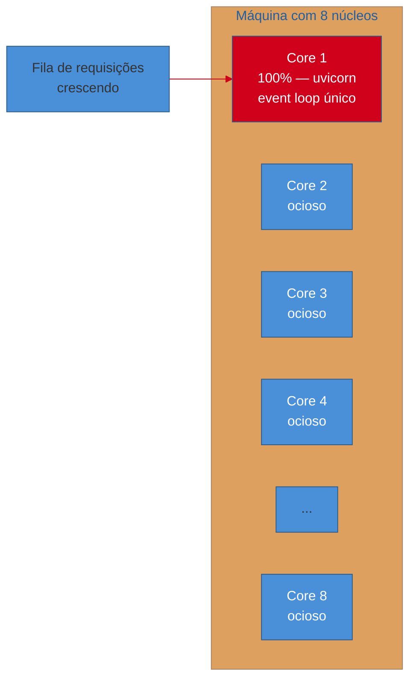
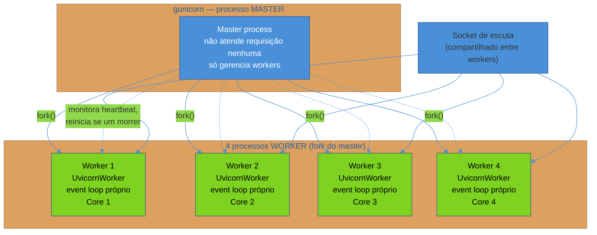
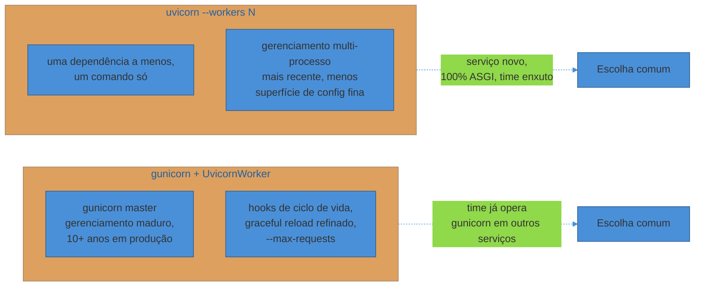

# WSGI vs ASGI na prática — gunicorn e uvicorn

> [!abstract] TL;DR
> `uvicorn app:app` sozinho, sem argumento nenhum, sobe **um** processo Python com **um** event loop `asyncio`. Esse processo usa, no máximo, um núcleo de CPU — não importa quantos núcleos a máquina tenha. Rodar assim em produção é deixar 7 de 8 núcleos ociosos enquanto o oitavo sufoca sob a carga inteira. A solução não é abandonar `uvicorn` — é combiná-lo com `gunicorn`: **`gunicorn -k uvicorn.workers.UvicornWorker -w 4 app:app`** sobe um processo `gunicorn` **master**, que faz *fork* de 4 processos **worker**, cada um rodando sua própria cópia do `uvicorn.workers.UvicornWorker` com seu próprio event loop, cada um num núcleo separado do sistema operacional. `gunicorn` entra como **gerenciador de processos** — quem reinicia um worker morto, quem distribui conexões entre eles, quem coordena um restart gracioso — enquanto `uvicorn` continua sendo o **executor ASGI** de fato, dentro de cada processo individual. Esta nota assume que o leitor já conhece o protocolo ASGI cru (`scope`/`receive`/`send`, coberto em profundidade no [[03-Dominios/Tecnologia/Python/Programação Reativa e Assíncrona/05 - ASGI e o ecossistema de frameworks assíncronos|Galho 8 nota 05]]) — aqui o assunto é operacional: como esses dois processos, `gunicorn` e `uvicorn`, se combinam para colocar uma aplicação ASGI (FastAPI, Starlette) rodando de verdade em produção, usando todos os núcleos disponíveis.

## O incidente: um core de oito, e a fila crescendo

O serviço de Notificações da trilha — o mesmo que apareceu morto e sem log estruturado no incidente que abre a [[01 - Panorama — o que falta pra produção de verdade|nota 01 deste galho]] — foi reconstruído depois daquele episódio. Ganhou logging estruturado ([[02 - Logging estruturado — structlog e correlação com trace|nota 02]]) e métricas expostas ([[03 - Métricas com OpenTelemetry e Prometheus client|nota 03]]). Alguém do time, satisfeito com o progresso, decide subir o serviço em produção do jeito mais direto possível — o mesmo comando que sempre funcionou em desenvolvimento, só tirando o `--reload`:

```bash
# em produção, numa instância com 8 vCPUs
uvicorn app:app --host 0.0.0.0 --port 8000
```

Funciona. O serviço sobe, responde requisições, os logs estruturados aparecem corretos, as métricas expõem em `/metrics`. Nas primeiras semanas, com tráfego baixo, ninguém percebe nada de errado — a latência está aceitável, o serviço não cai. O problema aparece num pico de tráfego real, quando uma campanha de marketing dispara um volume de notificações dez vezes maior que o normal: a fila de requisições cresce, a latência p95 sobe de 80ms para 4 segundos, e um alerta de saturação (o mesmo tipo de métrica instrumentada na [[03 - Métricas com OpenTelemetry e Prometheus client|nota 03]]) dispara.

A primeira suspeita do time é que o serviço precisa de "mais máquina" — escalam a instância de 8 vCPUs para 16. A latência não muda em nada. É só quando alguém roda `htop` durante o pico que o problema fica visível: **um** núcleo em 100%, os outros quinze completamente ociosos.



A causa raiz não é falta de capacidade de máquina — é que `uvicorn app:app` sozinho é **um processo Python com um event loop**, e um único processo Python, por natureza, roda num único núcleo de CPU por vez para o código Python que ele executa (o `asyncio` dá concorrência dentro desse processo, não paralelismo entre núcleos — a mesma distinção que os Galhos 6/7 desta trilha já fixaram para threading e multiprocessing). Escalar a instância de 8 para 16 núcleos não ajudou em nada porque o processo continuava usando só um deles — o problema nunca foi a quantidade de CPU disponível, era quantos processos estavam competindo por ela.

> [!bug] O que estava quebrado, em uma frase
> `uvicorn app:app`, do jeito mais simples, sobe **um processo** com **um event loop** — usa no máximo um núcleo de CPU, não importa quantos existam na máquina; a solução não é trocar de servidor, é rodar **múltiplos processos** dessa mesma coisa, um por núcleo disponível.

## Por que um event loop só não basta: revisitando o que o Galho 8 já estabeleceu

A [[03-Dominios/Tecnologia/Python/Programação Reativa e Assíncrona/05 - ASGI e o ecossistema de frameworks assíncronos|nota 05 do Galho 8]] já cobriu, em profundidade, o que `scope`, `receive` e `send` fazem e por que a coroutine `app(scope, receive, send)` é o contrato entre servidor e aplicação — esta nota não repete esse conteúdo. O que importa aqui é uma consequência prática daquele modelo: um servidor ASGI como `uvicorn`, ao rodar sozinho, gerencia **um** event loop `asyncio` por processo, atendendo potencialmente milhares de conexões concorrentes dentro desse loop único.

Concorrência dentro de um event loop é excelente para o problema que ela resolve — centenas de requisições esperando I/O (banco, chamada HTTP externa, disco) simultaneamente, sem bloquear umas às outras, porque a maior parte do tempo de cada requisição é gasto **esperando**, não processando. Mas isso não é **paralelismo** entre núcleos de CPU. O GIL (Global Interpreter Lock) garante que só uma thread Python executa bytecode por vez dentro de um processo — o mesmo limite estrutural que a [[03-Dominios/Tecnologia/Python/Concorrência e paralelismo/index|trilha de Concorrência e paralelismo]] já desenvolveu para threading (Galho 6) e que motivou `multiprocessing` como a saída para trabalho CPU-bound (Galho 6 nota 04) e `ProcessPoolExecutor` como abstração unificadora (Galho 6 nota 05). Um único processo `uvicorn`, não importa quão eficiente seu event loop seja para I/O concorrente, está sujeito ao mesmo teto: todo o trabalho de CPU daquele processo — parsing de JSON, serialização Pydantic, qualquer cálculo síncrono dentro de um handler — compete pelo mesmo núcleo.

A saída, então, é a mesma lógica de `multiprocessing`: **múltiplos processos**, cada um com seu próprio interpretador Python, seu próprio GIL, seu próprio event loop — rodando em paralelo, um por núcleo. É exatamente o papel que `gunicorn` assume.

> [!question]- Isso quer dizer que ASGI/asyncio "não ajuda" nesse cenário?
> Ajuda, mas resolve um problema diferente do que múltiplos processos resolvem. `asyncio` dentro de **um** processo resolve "como atender centenas de conexões simultâneas sem abrir uma thread por conexão" — o gargalo de I/O-bound que os Galhos 6/7 já trataram. Múltiplos **processos** `uvicorn`, coordenados por `gunicorn`, resolvem um problema ortogonal: "como usar todos os núcleos de CPU da máquina", que nenhuma quantidade de concorrência assíncrona dentro de um processo só resolve, porque o GIL limita cada processo a um núcleo por vez. Produção de verdade precisa dos dois: event loop assíncrono dentro de cada processo (concorrência de I/O) **e** múltiplos processos (paralelismo de CPU). Um sem o outro deixa capacidade real na mesa.

## `gunicorn`: o gerenciador de processos maduro

`gunicorn` ("Green Unicorn") nasceu, historicamente, como um servidor **WSGI** — a interface síncrona que a [[03-Dominios/Tecnologia/Python/Programação Reativa e Assíncrona/05 - ASGI e o ecossistema de frameworks assíncronos|nota 05 do Galho 8]] já contrastou com ASGI: `application(environ, start_response)`, uma função síncrona que recebe uma requisição completa e devolve uma resposta completa. Rodando puro, `gunicorn` gerencia workers **síncronos** — cada um bloqueando uma thread/processo inteiro até a requisição terminar, o modelo clássico de Flask/Django tradicional.

O que faz `gunicorn` valioso além do modo WSGI puro, e o motivo de ele continuar no combo de produção mesmo em serviços 100% assíncronos, é que ele é, antes de mais nada, um **gerenciador de processos** genérico — a parte que fica clara na arquitetura master/worker:



O processo **master** de `gunicorn` não atende requisição nenhuma diretamente — ele existe só para gerenciar o ciclo de vida dos workers: faz `fork()` do número configurado de processos filhos, escuta um sinal de heartbeat de cada um, e **reinicia automaticamente** qualquer worker que morra (por exceção não tratada, por exceder um limite de memória, ou por qualquer outra causa) — exatamente o mecanismo de auto-recuperação que faltou no incidente da [[01 - Panorama — o que falta pra produção de verdade|nota 01 deste galho]], onde o processo `uvicorn` sozinho morreu às 3h e ficou morto até alguém notar às 7h. Os workers compartilham o mesmo socket de escuta (o kernel distribui as conexões entrando entre eles), mas cada um roda de forma independente, com sua própria memória, seu próprio processo do sistema operacional — e, no caso do combo desta nota, seu próprio event loop `asyncio`.

Isso não é exclusivo de WSGI. A flag `-k` (*worker class*) de `gunicorn` permite trocar a **implementação do worker** sem trocar o gerenciador que envolve esses workers — é aqui que `uvicorn` entra.

## `uvicorn.workers.UvicornWorker`: o executor ASGI dentro de cada processo

`uvicorn` distribui uma classe de worker, `uvicorn.workers.UvicornWorker`, projetada especificamente para ser conectada em `gunicorn` via a flag `-k`. Quando `gunicorn` faz `fork()` de um worker configurado com essa classe, o que roda dentro daquele processo filho não é o worker WSGI síncrono padrão de `gunicorn` — é uma instância completa do runtime `uvicorn`, com seu próprio event loop `uvloop` (a implementação otimizada em Cython sobre `libuv` que a [[03-Dominios/Tecnologia/Python/Programação Reativa e Assíncrona/05 - ASGI e o ecossistema de frameworks assíncronos|nota 05 do Galho 8]] já citou), falando o protocolo ASGI cru (`scope`/`receive`/`send`) com a aplicação.

O comando completo do combo:

```bash
gunicorn -k uvicorn.workers.UvicornWorker -w 4 app:app \
  --bind 0.0.0.0:8000
```

```bash
# requer: pip install "gunicorn" "uvicorn[standard]"
```

Desmontando cada peça:

| Flag | O que faz |
|---|---|
| `gunicorn` | O processo que sobe primeiro — o master, gerenciador de processos |
| `-k uvicorn.workers.UvicornWorker` | Troca a *worker class* padrão (síncrona, WSGI) pela classe que embute um runtime `uvicorn` completo por processo filho |
| `-w 4` | Número de processos worker que o master faz `fork()` — tipicamente um por núcleo de CPU disponível, discutido na seção seguinte |
| `app:app` | Módulo `app.py`, objeto `app` — a aplicação ASGI (FastAPI, Starlette) que cada worker carrega e executa |
| `--bind 0.0.0.0:8000` | Endereço/porta do socket que o master abre e compartilha entre os workers |

O resultado prático: 4 processos Python separados, cada um com seu próprio event loop `asyncio` (via `uvloop`) atendendo requisições concorrentes de I/O dentro daquele processo — e os 4 processos rodando em paralelo, um por núcleo, se a máquina tiver pelo menos 4 núcleos disponíveis. É a combinação de concorrência (dentro de cada processo, via event loop) com paralelismo (entre processos, via múltiplos cores) que resolve tanto o gargalo de I/O quanto o gargalo de CPU ao mesmo tempo — sem essa combinação, um serviço FastAPI de produção real deixa capacidade real na mesa, exatamente como aconteceu no incidente de abertura desta nota.

> [!tip] `gunicorn` como gerenciador, `uvicorn` como executor — a divisão de responsabilidade que faz o combo valer a pena
> Vale fixar a divisão exata de papéis, porque é fácil confundir "por que dois servidores, se um já basta": `gunicorn` **não fala ASGI** — ele delega inteiramente a execução da aplicação ao worker class que você escolheu (`UvicornWorker`, aqui). O que `gunicorn` sabe fazer, e faz bem, há mais de uma década em produção, é: `fork()` de N processos, monitorar heartbeat, reiniciar processos mortos, distribuir sinais do sistema operacional (`SIGTERM`, `SIGHUP`) de forma coordenada entre todos os workers, e coordenar um restart gracioso sem derrubar o serviço inteiro de uma vez (assunto que a [[05 - Configuração de servidor de produção — workers, timeouts e graceful shutdown|nota 05 deste galho]] desenvolve). `uvicorn`, dentro de cada processo, sabe falar ASGI e rodar um event loop eficiente — mas, sozinho, não tem a mesma maturidade de gerenciamento multi-processo que `gunicorn` acumulou. Cada ferramenta faz a parte em que é historicamente mais forte.

## A alternativa mais recente: `uvicorn --workers N` sozinho

`uvicorn` ganhou, em versões mais recentes, capacidade própria de gerenciar múltiplos processos — dispensando `gunicorn` como camada intermediária:

```bash
uvicorn app:app --workers 4 --host 0.0.0.0 --port 8000
```

Esse comando também sobe 4 processos worker atendendo o mesmo socket, sem envolver `gunicorn` nenhum. É mais simples — uma dependência a menos, um comando só, sem precisar lembrar a sintaxe de `-k` — e é a opção que o próprio [FastAPI recomenda como ponto de partida na documentação de deployment](https://fastapi.tiangolo.com/deployment/server-workers/) para quem quer o caminho mais direto.

O trade-off real não é técnico no sentido de "um funciona e o outro não" — os dois funcionam, os dois usam múltiplos processos, os dois paralelizam entre núcleos. A diferença é **maturidade operacional acumulada**:

- `gunicorn` existe desde 2009, e o gerenciamento de processos — restart de worker morto, graceful reload sem derrubar conexões em andamento, distribuição de sinais do SO, hooks de configuração (`pre_fork`, `post_fork`, `worker_exit`) para customizar comportamento em cada estágio do ciclo de vida do worker — é o produto principal dele, refinado por mais de uma década de uso em produção em larga escala, por times de operação que bateram em praticamente todo caso extremo possível.
- O modo `--workers` de `uvicorn` é mais novo, e embora funcional para o caso comum, historicamente tem menos superfície de configuração fina para cenários avançados de gerenciamento de processo — reload gracioso sob alta carga, hooks de ciclo de vida por worker, políticas de reciclagem de processo por número de requisições atendidas (`--max-requests` do `gunicorn`, útil contra memory leaks acumulados).

> [!warning] Não existe "o jeito certo" universal entre os dois — existe o que o time já opera bem
> Times que já têm `gunicorn` rodando em produção para outros serviços Python (inclusive WSGI puro, Flask/Django tradicional) ganham mais reaproveitando esse conhecimento operacional acumulado — runbooks, configuração de systemd/supervisord, hooks já testados — do que trocando para `uvicorn --workers` só porque é "uma dependência a menos". Times novos, sem esse acúmulo, e com um serviço 100% ASGI desde o início, frequentemente preferem `uvicorn --workers` justamente pela simplicidade de ter um comando e uma dependência a menos para entender. Nenhuma das duas escolhas é "errada" — a pergunta certa é "que ferramenta a equipe já sabe operar bem sob incidente", não "qual é tecnicamente mais moderna".



## Quantos workers? A regra prática `(2 × núcleos) + 1`

Uma vez decidido rodar múltiplos processos worker — via `gunicorn -w N` ou `uvicorn --workers N`, a mecânica é a mesma —, a pergunta seguinte é quantos. A regra prática mais citada, inclusive na própria [documentação de deployment do gunicorn](https://docs.gunicorn.org/en/stable/design.html#how-many-workers), é:

```
workers = (2 × núcleos de CPU) + 1
```

Numa máquina de 4 núcleos, isso dá 9 workers; numa de 8 núcleos, 17. Vale ser honesto sobre o que essa fórmula é e o que ela não é: **não é uma lei física**, é um ponto de partida razoável, derivado de uma suposição específica — que o serviço é predominantemente **I/O-bound** (a maior parte do tempo de cada requisição é gasta esperando banco, rede, disco — não processando CPU). Com essa suposição, workers em excesso em relação ao número de núcleos ainda ajudam, porque enquanto um worker está bloqueado esperando I/O, outro pode estar usando a CPU — daí o fator `2×` em vez de `1×`. O `+1` é uma margem extra, para cobrir o caso em que um worker está temporariamente ocioso (reiniciando, ou processando algo fora do padrão) sem deixar a máquina subutilizada.

Essa suposição não vale para todo serviço. A distinção entre I/O-bound e CPU-bound, já desenvolvida em profundidade nos Galhos 6 e 7 desta trilha ([[03-Dominios/Tecnologia/Python/Concorrência e paralelismo/08 - Capstone — escolhendo threading vs multiprocessing vs asyncio|Galho 6 nota 08]] em particular, sobre como escolher entre os três modelos de concorrência conforme o perfil de carga), é exatamente o que determina se `2×núcleos+1` é um bom ponto de partida ou um número inflado demais:

- **Serviço predominantemente I/O-bound** (a maioria das APIs REST típicas — esperando banco, chamadas a serviços externos, fila de mensagens): a fórmula `2×núcleos+1` costuma ser um ponto de partida razoável, porque workers em excesso continuam úteis enquanto uns esperam I/O e outros processam.
- **Serviço predominantemente CPU-bound** (processamento de imagem, cálculo pesado dentro do handler, serialização de payloads muito grandes): workers em excesso do número de núcleos **competem** por CPU em vez de se complementarem — nesse caso, um número próximo do número real de núcleos (`workers ≈ núcleos`) tende a performar melhor que `2×núcleos+1`, porque o gargalo real é CPU, não espera de I/O, e processos demais só aumentam a troca de contexto do sistema operacional sem ganho real de throughput.

> [!question]- E se o serviço for uma mistura das duas coisas, como a maioria dos serviços reais?
> A resposta honesta é: a fórmula é um chute inicial informado, não um cálculo exato — o número certo de workers para um serviço específico só se conhece através de **teste de carga** (subir o serviço com N workers, medir throughput e latência sob carga representativa, repetir com N diferente, comparar) e observação em produção real, usando as próprias métricas que a [[03 - Métricas com OpenTelemetry e Prometheus client|nota 03 deste galho]] já instrumentou — latência p95, saturação de CPU por processo, taxa de erro sob carga. Um time que configura `2×núcleos+1` no primeiro deploy e nunca revisita esse número, mesmo depois de meses de dados de produção acumulados, está tratando um ponto de partida como se fosse a resposta final — o mesmo tipo de erro de "configurar uma vez e nunca reavaliar" que aparece em quase toda decisão de capacidade de infraestrutura.

> [!warning] Confundir "mais workers" com "mais capacidade", sem olhar pra memória
> **O que acontece:** um time, achando que mais workers é sempre melhor, sobe `-w 32` numa máquina de 8 núcleos e 8 GB de RAM, sem considerar que cada worker carrega sua própria cópia completa da aplicação Python na memória — imports, modelos de dados, pools de conexão próprios (se não configurados corretamente com `lifespan`, como a [[03-Dominios/Tecnologia/Python/Programação Reativa e Assíncrona/05 - ASGI e o ecossistema de frameworks assíncronos|nota 05 do Galho 8]] já discutiu).
> **Por quê:** cada processo worker é um interpretador Python inteiro, não uma thread leve — o custo de memória de N workers escala aproximadamente linear com N, e uma máquina que fica sem memória (OOM) sob carga derruba workers de forma muito mais destrutiva do que uma que só está um pouco sobrecarregada de CPU.
> **Como evitar:** medir o consumo de memória de **um** worker sob carga representativa antes de multiplicar por N, e dimensionar o número de workers considerando tanto CPU (`2×núcleos+1` como ponto de partida) quanto memória disponível (`memória_total / memória_por_worker`, com margem) — o menor dos dois números, não o maior.

## Calculando o número de workers em runtime, não hardcoded

Hardcodar `-w 4` num `Dockerfile` ou num script de start funciona até a instância mudar de tamanho — uma migração de uma máquina de 4 vCPUs para uma de 16 vCPUs não ganha automaticamente mais workers se o número está fixo no comando. A prática mais robusta é calcular o número de workers **em runtime**, a partir do número real de núcleos disponíveis no container ou na máquina:

```python
# gunicorn.conf.py — arquivo de configuração carregado automaticamente
# por `gunicorn -c gunicorn.conf.py app:app`
import multiprocessing
import os

# multiprocessing.cpu_count() lê o número de núcleos visíveis ao processo —
# em container, isso respeita cgroup limits (Kubernetes/Docker `--cpus`),
# não o hardware físico do host, desde que a imagem/runtime esteja atualizada
nucleos = multiprocessing.cpu_count()
workers_calculados = (2 * nucleos) + 1

# WEB_CONCURRENCY permite sobrescrever explicitamente via variável de
# ambiente, sem editar código — útil para ajustar em produção sem rebuild
workers = int(os.environ.get("WEB_CONCURRENCY", workers_calculados))

bind = "0.0.0.0:8000"
worker_class = "uvicorn.workers.UvicornWorker"
timeout = 30
```

```bash
# usa o valor calculado dinamicamente
gunicorn -c gunicorn.conf.py app:app

# ou sobrescreve explicitamente, sem tocar no arquivo de config
WEB_CONCURRENCY=8 gunicorn -c gunicorn.conf.py app:app
```

`gunicorn.conf.py` é lido automaticamente quando passado via `-c`, e é o lugar recomendado para configuração de produção que cresce além de meia dúzia de flags de linha de comando — mantém a configuração versionada junto do código, revisável em PR, em vez de espalhada em scripts de deploy. A variável de ambiente `WEB_CONCURRENCY` (convenção popularizada por buildpacks como o do Heroku, e adotada informalmente por boa parte do ecossistema Python de deploy) dá um jeito de ajustar o número de workers **sem rebuild de imagem** — só reiniciando o container com uma variável diferente, útil quando um time percebe, via as métricas de saturação já instrumentadas na [[03 - Métricas com OpenTelemetry e Prometheus client|nota 03]], que o número calculado automaticamente não é o ideal para aquele serviço específico.

> [!tip] `multiprocessing.cpu_count()` dentro de um container nem sempre reflete o limite real de CPU
> Em ambientes containerizados mais antigos, `cpu_count()` podia reportar o número de núcleos do **host físico**, não o limite de CPU configurado no container (`--cpus 2` no Docker, `resources.limits.cpu` no Kubernetes) — resultando em um número de workers inflado em relação à CPU de fato disponível para aquele container. Runtimes modernos de container e versões recentes do Python (que passaram a respeitar cgroup v2 corretamente) mitigam boa parte disso, mas vale validar em produção: rodar `python -c "import multiprocessing; print(multiprocessing.cpu_count())"` dentro do próprio container, comparando com o limite configurado no orquestrador, antes de confiar cegamente no cálculo automático.

## Fechando: o combo, e o que vem a seguir

`gunicorn -k uvicorn.workers.UvicornWorker -w N app:app` não é uma escolha arbitrária de sintaxe — é a resposta direta ao problema estrutural que abriu esta nota: um processo Python, mesmo assíncrono, usa um núcleo por vez; produção real precisa de múltiplos processos para usar a máquina inteira, e de um gerenciador maduro para manter esses processos vivos, reiniciados, e desligados de forma coordenada. `gunicorn` traz a maturidade de gerenciamento de processo acumulada há mais de uma década; `uvicorn.workers.UvicornWorker` traz o runtime ASGI de fato, com event loop, `uvloop`, e o protocolo `scope`/`receive`/`send` já coberto no Galho 8. `uvicorn --workers N` sozinho é a alternativa mais enxuta, ganhando tração conforme o próprio `uvicorn` amadurece nessa frente — sem ainda igualar a superfície de configuração fina que `gunicorn` acumulou.

Nenhuma das duas opções, sozinha, fecha o assunto de "servidor pronto pra produção" — o número de workers é só a primeira variável. A [[05 - Configuração de servidor de produção — workers, timeouts e graceful shutdown|próxima nota deste galho]] continua exatamente daqui: timeout por worker, graceful shutdown (o mecanismo que teria dado tempo às requisições em andamento de terminar, no incidente que abriu a [[01 - Panorama — o que falta pra produção de verdade|nota 01]]), preload de aplicação, e `--max-requests` para reciclar workers antes que um memory leak acumulado derrube o processo sozinho.

## Em entrevista

Uma pergunta clássica de entrevista sênior sobre deploy Python é "como você roda FastAPI em produção" — e a resposta fraca é só citar `uvicorn app:app`, sem mencionar workers. A resposta forte nomeia o combo `gunicorn -k uvicorn.workers.UvicornWorker -w N`, explica o **porquê** (um processo asyncio usa um core; múltiplos processos usam a máquina inteira), distingue os dois papéis (gerenciador de processo vs. executor ASGI), e sabe justificar o número de workers com a regra `2×núcleos+1` como ponto de partida — não como fórmula definitiva — condicionado ao perfil I/O-bound vs. CPU-bound do serviço.

## How to explain in English

> "A single `uvicorn app:app` process runs one asyncio event loop — it uses at most one CPU core, no matter how many the machine has. In production, you run multiple worker processes to use every core: `gunicorn -k uvicorn.workers.UvicornWorker -w 4 app:app` starts a gunicorn master process that forks 4 worker processes, each running a full `uvicorn` ASGI runtime with its own event loop. Gunicorn's job is process management — it's been doing that well for over a decade: restarting dead workers, coordinating graceful reloads, distributing OS signals. Uvicorn's job, inside each process, is actually executing the ASGI protocol — talking `scope`/`receive`/`send` to the application. A newer alternative is `uvicorn --workers N` on its own, which is simpler but has less battle-tested process-management surface. As for how many workers: `(2 × CPU cores) + 1` is a reasonable starting point for I/O-bound services, but it's not a magic formula — CPU-bound workloads want workers closer to the actual core count, and the real number only comes from load testing against your metrics."

| PT | EN |
|----|----|
| gerenciador de processos | process manager |
| executor ASGI | ASGI runtime / ASGI executor |
| processo master | master process |
| processo worker | worker process |
| classe de worker | worker class |
| paralelismo entre núcleos | cross-core parallelism |
| concorrência dentro de um processo | in-process concurrency |
| recarga graciosa | graceful reload |
| I/O-bound vs CPU-bound | I/O-bound vs CPU-bound |
| ponto de partida (não fórmula definitiva) | starting point (not a hard rule) |

## Fontes

- [[03-Dominios/Tecnologia/Python/Programação Reativa e Assíncrona/05 - ASGI e o ecossistema de frameworks assíncronos|ASGI e o ecossistema de frameworks assíncronos]] — Galho 8 nota 05 — o protocolo cru `scope`/`receive`/`send` e o contraste estrutural WSGI/ASGI, referenciado sem repetição.
- [[03-Dominios/Tecnologia/Python/Concorrência e paralelismo/08 - Capstone — escolhendo threading vs multiprocessing vs asyncio|Capstone — escolhendo threading vs multiprocessing vs asyncio]] — Galho 6 nota 08 — a distinção I/O-bound vs. CPU-bound que determina se `2×núcleos+1` é um bom ponto de partida.
- [[03-Dominios/Tecnologia/Python/Programação Reativa e Assíncrona/07 - Padrões de produção com asyncio — supervisão de tasks, graceful shutdown, circuit breaker|Padrões de produção com asyncio]] — Galho 8 nota 07 — supervisão de tasks e graceful shutdown no nível de código, complementar ao graceful shutdown no nível de processo que a nota 05 deste galho desenvolve.
- Benoit Chesneau e colaboradores. *Gunicorn — Design*. docs.gunicorn.org. https://docs.gunicorn.org/en/stable/design.html (acessado em 2026-07-12) — arquitetura master/worker, a regra prática `(2 × núcleos) + 1`.
- Benoit Chesneau e colaboradores. *Gunicorn — Settings*. docs.gunicorn.org. https://docs.gunicorn.org/en/stable/settings.html (acessado em 2026-07-12) — flags `-w`/`--workers`, `-k`/`--worker-class`, `--max-requests`, hooks de ciclo de vida.
- Ramírez, Marcelo Trylesinski (Encode). *Uvicorn — Deployment*. www.uvicorn.org. https://www.uvicorn.org/deployment/ (acessado em 2026-07-12) — `uvicorn.workers.UvicornWorker`, o combo com gunicorn, e o modo `--workers` standalone.
- Ramírez, Sebastián. *FastAPI — Server Workers — Gunicorn with Uvicorn*. fastapi.tiangolo.com. https://fastapi.tiangolo.com/deployment/server-workers/ (acessado em 2026-07-12) — a recomendação oficial do FastAPI para o combo gunicorn+uvicorn em produção, e a menção ao `uvicorn --workers` como alternativa mais simples.

Consultado em 2026-07-12.
