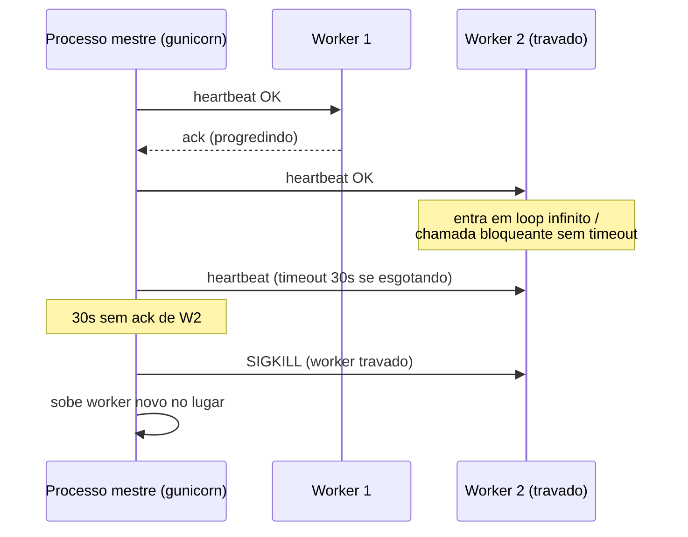
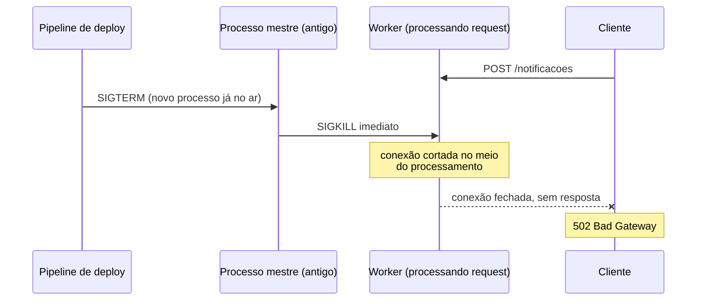
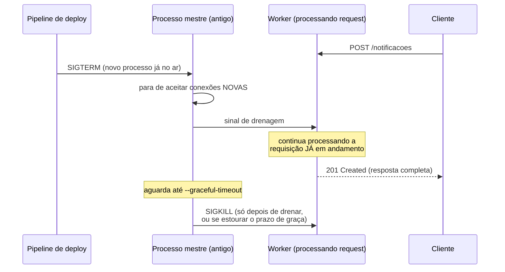
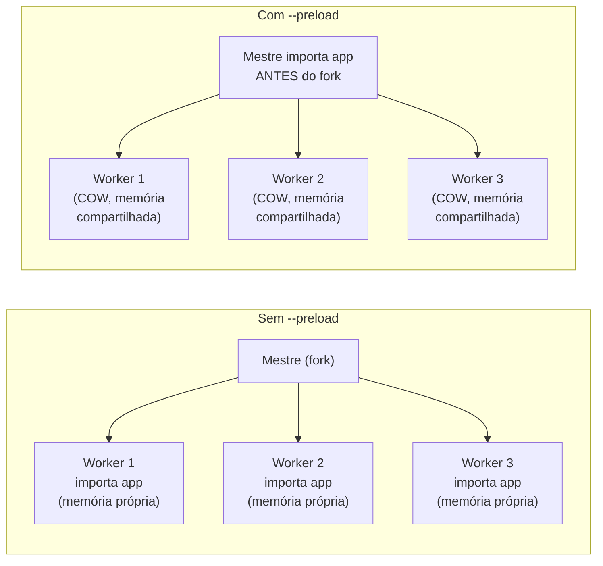

# Configuração de servidor de produção — workers, timeouts e graceful shutdown

> [!abstract] TL;DR
> Ter o combo `gunicorn -k uvicorn.workers.UvicornWorker` rodando (visto na [[04 - WSGI vs ASGI na prática — gunicorn e uvicorn|nota 04]]) não é o mesmo que ter esse combo **configurado pra produção**. Faltam quatro ajustes, nenhum ligado por padrão do jeito certo: um **timeout de worker** que mata um processo travado antes que ele derrube o serviço inteiro; um **graceful shutdown** que dá tempo pras requisições em andamento terminarem antes do processo morrer, em vez de cortá-las na marra durante um deploy; um **preload de app** que economiza memória entre workers via copy-on-write do `fork()`; e um **restart automático por número de requisições**, a defesa pragmática contra memory leaks que não dá pra corrigir na hora. Nenhum desses quatro é sobre lógica de negócio — são sobre o processo sobreviver a produção sem virar incidente.

## A cena: erro 500 toda sexta às 17h

O time de Notificações — o mesmo serviço que apareceu travado às 3h da manhã na [[01 - Panorama — o que falta pra produção de verdade|nota 01]] deste galho — tinha corrigido aquele incidente havia semanas. Log estruturado emitindo, métricas expostas, o combo `gunicorn`+`uvicorn` da [[04 - WSGI vs ASGI na prática — gunicorn e uvicorn|nota 04]] rodando com quatro workers. Um novo padrão surgiu, mais sutil: toda sexta-feira, por volta das 17h — horário do deploy semanal — o dashboard de erros mostrava um pico curto, mas consistente, de respostas `500` e `502`. Durava poucos segundos, nunca o suficiente pra disparar um alerta de SLO, mas aparecia toda vez, como um relógio.

A investigação começou pelo óbvio: não havia bug de código nenhum introduzido nos deploys recentes — o pico acontecia mesmo em semanas sem mudança de lógica de negócio, só um novo build da mesma imagem. O padrão apontava pro próprio mecanismo de deploy, não pro código dentro dele. O pipeline de CI/CD fazia o que qualquer pipeline de rolling deploy faz: subia um processo novo, esperava ele responder no health check, e então mandava `SIGTERM` pro processo antigo — o sinal padrão do Unix pra "termine, por favor". O gunicorn recebia o sinal e, por padrão, **matava os workers imediatamente**, sem esperar as requisições que estavam em voo naquele exato milissegundo. Um cliente que tinha acabado de mandar um `POST /notificacoes` — a conexão TCP já aberta, a requisição já entregue ao worker, a resposta ainda sendo processada — via a conexão cair no meio, sem resposta nenhuma. O load balancer, do lado de fora, traduzia isso num `502 Bad Gateway`.

Não era um bug. Era a ausência de uma configuração que o gunicorn já sabe fazer — só que não faz sozinho, por padrão, sem alguém pedir explicitamente.

> [!warning] Achar que "matar o processo antigo" e "desligar o processo antigo" são a mesma coisa
> **O que acontece:** um pipeline de deploy manda `SIGTERM` pro processo antigo e considera o trabalho feito assim que o processo novo responde no health check — sem verificar o que acontece com as requisições que estavam em andamento no processo antigo naquele instante.
> **Por quê:** `SIGTERM` é só um sinal — o que o processo faz ao recebê-lo depende inteiramente de como ele foi configurado. Sem graceful shutdown, o comportamento padrão de muitos servidores é encerrar imediatamente, cortando qualquer conexão aberta no meio, não importa o estado dela.
> **Como evitar:** configurar explicitamente um período de graça (`--graceful-timeout` no gunicorn) durante o qual o processo para de aceitar conexões **novas**, mas continua servindo as que já estão **em andamento**, até elas terminarem ou o prazo de graça esgotar — o assunto do resto desta nota.

## Timeout de worker: matar quem travou, antes que trave todo mundo

Antes de chegar em graceful shutdown, vale separar um mecanismo relacionado, mas diferente: o **timeout de worker** do gunicorn, configurado via `--timeout`.

```bash
gunicorn app.main:app \
    -k uvicorn.workers.UvicornWorker \
    -w 4 \
    --timeout 30
```

> [!question]- Isso não é o mesmo timeout que a [[03-Dominios/Tecnologia/Python/Microservices e sistemas distribuídos/02 - Comunicação síncrona entre serviços — httpx|nota 02 do Galho 15]] já cobriu?
> Não — são dois timeouts em lados opostos da mesma conexão, e confundir os dois é fácil porque o vocabulário é idêntico. O timeout de `httpx` (Galho 15, nota 02) é do lado **cliente**: quanto tempo o serviço de Pedidos espera por uma resposta do serviço de Notificações antes de desistir. O `--timeout` do gunicorn é do lado **servidor**: quanto tempo o processo mestre do gunicorn espera um **worker seu** responder a um heartbeat interno antes de considerá-lo travado e matá-lo. Um protege quem está chamando de esperar pra sempre por uma resposta; o outro protege o próprio servidor de manter vivo um worker que já não está progredindo. Os dois são necessários — um sem o outro deixa uma metade da conversa desprotegida.

O mecanismo por trás do `--timeout` do gunicorn é um heartbeat: cada worker precisa notificar o processo mestre periodicamente de que ainda está vivo e progredindo. Se um worker fica `--timeout` segundos sem enviar esse sinal — porque travou num loop infinito, ficou preso numa chamada bloqueante sem timeout próprio, ou entrou em deadlock — o mestre assume que o worker morreu de fato e o mata com `SIGKILL`, substituindo-o por um worker novo.



Esse é exatamente o mecanismo que teria evitado boa parte do estrago do incidente original da nota 01 — não porque teria evitado a exceção não tratada em si, mas porque teria limitado o dano dela a um único worker morto e substituído automaticamente, em vez de um processo inteiro parado sem supervisor nenhum reiniciando.

> [!tip] `--timeout 30` é o padrão do gunicorn — e é curto demais pra requisições assíncronas legítimas de longa duração
> Um endpoint que faz upload de arquivo grande, gera um relatório pesado, ou faz streaming de resposta por mais de 30 segundos vai ser morto pelo próprio gunicorn, achando que travou. A correção não é aumentar o timeout globalmente pra um valor genérico e grande — isso enfraquece a proteção contra deadlock de verdade. A correção correta é mover esse tipo de trabalho pra fora do ciclo request-response síncrono (fila de background, o assunto do [[03-Dominios/Tecnologia/Python/Mensageria/index|Galho 14]]) ou, se o endpoint realmente precisa ser longo, calibrar `--timeout` deliberadamente para o p99 real daquele workload — nunca "aumentar até parar de reclamar", sem medir.

Vale notar uma peculiaridade: com `uvicorn.workers.UvicornWorker`, o `--timeout` do gunicorn convive com o próprio event loop assíncrono do `uvicorn` dentro de cada worker. Uma coroutine individual travada numa chamada de I/O sem timeout próprio pode continuar bloqueando outras requisições daquele worker sem que o heartbeat do gunicorn perceba imediatamente — o heartbeat mede se o worker como um todo está progredindo, não se cada coroutine individual dentro dele está. É outro motivo, além do já coberto no Galho 15, pra nunca deixar uma chamada de I/O sem timeout explícito: o `--timeout` do gunicorn é uma rede de segurança de último nível, não um substituto pra timeouts corretos em cada chamada individual.

## Graceful shutdown: o mecanismo que resolve o incidente de abertura

Voltando ao pico de erro `502` toda sexta às 17h: a correção é configurar o gunicorn pra tratar `SIGTERM` de forma graciosa, em vez de abrupta.

### O que acontece sem graceful shutdown



### O que acontece com graceful shutdown configurado



A diferença entre os dois diagramas é o que separa "produção que sobrevive a deploy" de "produção que sangra erro toda semana": no segundo caso, o processo antigo **para de aceitar tráfego novo** assim que recebe `SIGTERM`, mas dá tempo pra quem já estava em atendimento terminar de ser servido.

A configuração, no gunicorn, é o parâmetro `--graceful-timeout`:

```bash
gunicorn app.main:app \
    -k uvicorn.workers.UvicornWorker \
    -w 4 \
    --timeout 30 \
    --graceful-timeout 30
```

Ao receber `SIGTERM`, o processo mestre do gunicorn:

1. Para de aceitar novas conexões no socket de escuta — qualquer requisição nova, a partir desse instante, não chega mais a esse processo (o load balancer já deveria ter parado de rotear pra ele, mas mesmo que ainda mande alguma, o processo recusa).
2. Sinaliza os workers pra terminarem o que já está em andamento, sem aceitar trabalho novo.
3. Espera até `--graceful-timeout` segundos pelos workers terminarem sozinhos.
4. Se algum worker ainda não terminou depois desse prazo, manda `SIGKILL` de verdade — o prazo de graça não é infinito, é uma janela finita pensada pra cobrir o caso comum (requisição terminando em segundos), não o caso patológico (um worker preso de verdade, que o `--timeout` de heartbeat já deveria ter pego antes).

> [!warning] `--graceful-timeout` alto demais atrasa deploys sem necessidade; baixo demais reproduz o problema original
> Um valor de 300 segundos parece "seguro", mas significa que todo deploy pode levar até cinco minutos esperando um worker teimoso terminar — em um pipeline com múltiplas réplicas fazendo rolling update, isso se multiplica. Um valor de 2 segundos, por outro lado, praticamente reproduz o comportamento abrupto original, porque a maioria das requisições reais não termina tão rápido sob carga. O valor certo é calibrado pela latência p99 real dos endpoints daquele serviço — normalmente alguns segundos acima do p99 medido, não um número redondo escolhido por instinto.

Do lado do `uvicorn` puro (sem gunicorn na frente, cenário menos comum em produção, mas que existe), o mecanismo equivalente já vem embutido: o `uvicorn` também escuta `SIGTERM`/`SIGINT` e implementa um shutdown gracioso por padrão, drenando conexões em andamento antes de encerrar — o parâmetro `timeout_graceful_shutdown` (em segundos) controla esse comportamento quando `uvicorn` é usado standalone. Quando `uvicorn` roda como worker do gunicorn (`-k uvicorn.workers.UvicornWorker`), é o gunicorn quem orquestra o sinal e o prazo — o `--graceful-timeout` do gunicorn é o que vale.

> [!question]- E se o pipeline de deploy nem espera o `SIGTERM` terminar — ele já mata tudo depois de N segundos, do lado de fora?
> Esse é exatamente o motivo de calibrar `--graceful-timeout` **abaixo** de qualquer timeout que o orquestrador externo (Kubernetes, systemd, o próprio script de deploy) aplica ao aguardar o processo terminar. Se o Kubernetes, por exemplo, manda `SIGTERM` e espera até `terminationGracePeriodSeconds` antes de mandar `SIGKILL` por fora, o `--graceful-timeout` do gunicorn precisa ser menor que esse valor — senão o orquestrador mata o processo à força antes do gunicorn ter chance de terminar sua própria drenagem graciosamente, e o resultado é o mesmo corte abrupto que a configuração tentou evitar. O ciclo de vida completo de um processo dentro de um deploy rolling, incluindo a coordenação com o orquestrador, é aprofundado no Galho 18 futuro (Cloud-native e produção); aqui, o que importa é que os dois prazos — o do orquestrador e o do gunicorn — precisam estar alinhados, com o do gunicorn sempre menor.

## Preload de app: economizar memória via copy-on-write

Um ajuste diferente, sem relação direta com shutdown, mas igualmente parte da configuração de produção: o flag `--preload`.

Por padrão, o gunicorn faz `fork()` do processo mestre pra criar cada worker **antes** de carregar o código da aplicação — cada worker importa o módulo da aplicação (`app.main:app`) de forma independente, depois de já existir como processo separado. Isso significa que, se a aplicação carrega algo pesado na importação — um modelo de machine learning, um cache grande em memória, um conjunto de configurações processadas — esse carregamento acontece **uma vez por worker**, multiplicando o custo de memória e o tempo de boot pelo número de workers.

```bash
gunicorn app.main:app \
    -k uvicorn.workers.UvicornWorker \
    -w 4 \
    --preload
```

Com `--preload`, a ordem se inverte: o processo mestre importa a aplicação **antes** de fazer `fork()`. O sistema operacional, ao criar cada processo filho via `fork()`, usa copy-on-write (COW) — as páginas de memória do processo pai não são copiadas de imediato para cada filho; elas são compartilhadas até que um dos processos tente **escrever** nelas, momento em que só essa página específica é de fato duplicada. Como o código Python já importado, os objetos já construídos na memória do processo mestre, e os dados carregados na inicialização são majoritariamente lidos, não escritos, depois do fork, a maior parte dessa memória permanece compartilhada entre os workers em vez de duplicada.



O ganho de memória é real, mas vem com um trade-off que importa especificamente em desenvolvimento: `--preload` é incompatível, em espírito, com hot-reload. O `uvicorn --reload` (o modo usado durante todo o desenvolvimento local desta trilha, mencionado na [[01 - Panorama — o que falta pra produção de verdade|nota 01]]) depende de recarregar o código da aplicação a cada mudança de arquivo — algo que só faz sentido quando cada worker importa a aplicação de forma independente e pode ser reiniciado isoladamente. `--preload`, ao carregar o código uma vez só no mestre antes do fork, é uma configuração de produção, pensada pra um processo que sobe uma vez e roda estável — nunca deveria coexistir com `--reload` no mesmo comando.

> [!warning] `--preload` some com o benefício se a aplicação abre recursos (conexão de banco, socket) na importação
> Conexões de banco, sockets, file handles e outros recursos de sistema operacional **não** se comportam bem com copy-on-write depois de um `fork()` — um socket TCP aberto no processo mestre antes do fork não vira automaticamente N sockets independentes e funcionais em cada worker; o comportamento é indefinido ou quebrado, dependendo da biblioteca. A prática correta é abrir recursos de conexão (pool de banco, cliente HTTP singleton, o `AsyncClient` da [[03-Dominios/Tecnologia/Python/Microservices e sistemas distribuídos/02 - Comunicação síncrona entre serviços — httpx|nota 02 do Galho 15]]) dentro de um hook `post_fork` do gunicorn ou no `lifespan` da aplicação ASGI — que roda depois do fork, uma vez por worker — nunca no escopo de módulo que `--preload` carrega antes do fork. `--preload` é seguro pra código puro e dados imutáveis carregados na importação; é perigoso pra qualquer coisa que abra uma conexão de rede ou de sistema operacional.

## `--max-requests`: restart periódico como defesa contra memory leak

O último ajuste desta nota não previne um problema — ele mitiga um que, na prática, é difícil de eliminar por completo: memory leak acumulado ao longo da vida de um worker de longa duração.

```bash
gunicorn app.main:app \
    -k uvicorn.workers.UvicornWorker \
    -w 4 \
    --timeout 30 \
    --graceful-timeout 30 \
    --max-requests 1000 \
    --max-requests-jitter 100
```

`--max-requests` diz ao gunicorn pra reiniciar automaticamente um worker depois que ele processar o número configurado de requisições — nesse exemplo, 1000. O worker é substituído do mesmo jeito gracioso descrito na seção de graceful shutdown: para de aceitar requisições novas, termina o que está em andamento, e só então é encerrado e substituído por um worker novo, com memória limpa.

`--max-requests-jitter` adiciona uma variação aleatória a esse número — no exemplo, até 100 requisições a mais ou a menos, escolhidas aleatoriamente por worker. Sem esse jitter, se todos os workers começaram ao mesmo tempo e recebem tráfego de forma razoavelmente uniforme, todos atingiriam o limite de 1000 requisições quase ao mesmo tempo — reiniciando em conjunto, criando um mini-pico de indisponibilidade parcial exatamente no momento em que todos os workers decidem reiniciar juntos. O jitter espalha esses reinícios ao longo do tempo, evitando que aconteçam em sincronia.

> [!question]- Isso não é só "esconder" o memory leak em vez de corrigi-lo de verdade?
> É uma defesa pragmática, não uma correção elegante — e vale ser honesto sobre isso. `--max-requests` não substitui a investigação de um leak real quando ele é identificável e corrigível (um cache que cresce sem limite, um listener de evento nunca removido, uma referência circular que o garbage collector do CPython não coleta em determinadas condições). Mas alguns leaks são difíceis de eliminar por completo: fragmentação de memória do próprio alocador do CPython, bibliotecas de terceiros com vazamentos sutis fora do controle direto do time, extensões C com bugs de gerenciamento de memória. Nesses casos, restart periódico é uma rede de segurança pragmática — limita o dano de um leak não resolvido a "no máximo N requisições de crescimento" em vez de "cresce indefinidamente até o processo ser morto pelo OOM killer do sistema operacional", que é um evento muito mais abrupto e muito mais difícil de diagnosticar depois do fato.

Vale notar a diferença de intenção entre este mecanismo e o `--timeout` de heartbeat visto antes: `--timeout` mata um worker que **parou de progredir** (patológico, indica bug); `--max-requests` recicla um worker que está progredindo normalmente, só que já rodou tempo/volume suficiente pra acumular degradação (rotina, indica manutenção preventiva). Os dois usam o mesmo mecanismo de restart gracioso por baixo, mas respondem a situações diferentes.

## A configuração completa, junta

Reunindo os quatro ajustes desta nota num único comando de produção:

```bash
gunicorn app.main:app \
    -k uvicorn.workers.UvicornWorker \
    -w 4 \
    --timeout 30 \
    --graceful-timeout 30 \
    --preload \
    --max-requests 1000 \
    --max-requests-jitter 100 \
    --bind 0.0.0.0:8000
```

Ou, equivalentemente, num arquivo `gunicorn.conf.py` — a forma preferida em produção, porque versiona a configuração junto do código em vez de depender de um comando shell longo copiado entre scripts de deploy:

```python
# gunicorn.conf.py
bind = "0.0.0.0:8000"
worker_class = "uvicorn.workers.UvicornWorker"
workers = 4

# Timeout de worker: mata um worker travado (heartbeat sem resposta)
timeout = 30

# Graceful shutdown: drena requisições em andamento antes de matar,
# num deploy rolling — o prazo precisa ser MENOR que o
# terminationGracePeriodSeconds do orquestrador, se houver um.
graceful_timeout = 30

# Preload: importa a app antes do fork, habilita copy-on-write
# entre workers. Cuidado com recursos de conexão abertos na
# importação — use post_fork ou lifespan pra isso.
preload_app = True

# Restart periódico: mitiga memory leak acumulado.
# Jitter evita que todos os workers reiniciem juntos.
max_requests = 1000
max_requests_jitter = 100


def post_fork(server, worker):
    """Roda uma vez por worker, DEPOIS do fork — o lugar certo
    pra abrir conexões (banco, cliente HTTP) quando --preload
    está ativo."""
    server.log.info("Worker %s inicializado, abrindo conexões...", worker.pid)
```

> [!tip] Nenhum desses quatro valores tem um "certo" universal — todos dependem do workload real
> `--timeout 30`, `--graceful-timeout 30`, `--max-requests 1000` são pontos de partida razoáveis, não leis. Um serviço com requisições tipicamente rápidas (dezenas de milissegundos) pode usar timeouts mais curtos e detectar problemas mais rápido; um serviço com uploads grandes ou processamento síncrono mais longo precisa de timeouts maiores, calibrados pelo p99 real medido nas métricas da [[03 - Métricas com OpenTelemetry e Prometheus client|nota 03]] deste galho — não escolhidos por instinto ou copiados de um exemplo de blog sem verificar se o workload é comparável.

## Síntese: checklist de configuração de produção

Antes de considerar um `gunicorn`+`uvicorn` pronto pra receber tráfego real, os quatro itens desta nota:

- [ ] **`--timeout`** configurado com um valor calibrado pelo workload real (não o padrão genérico sem revisão) — protege contra worker travado, mata e substitui automaticamente.
- [ ] **`--graceful-timeout`** configurado e **menor** que qualquer timeout externo de terminação (orquestrador, script de deploy) — sem isso, todo deploy corta requisições em andamento, gerando erro pro cliente.
- [ ] **`--preload`** avaliado — ativa se a aplicação carrega dados pesados na importação e não abre conexões de rede/sistema fora de `post_fork`/`lifespan`; desativa (ou nem cogita) em desenvolvimento com `--reload`.
- [ ] **`--max-requests`** com **`--max-requests-jitter`** configurados como rede de segurança contra memory leak acumulado — não substitui investigar um leak identificável, mas limita o dano de um que não é.

Nenhum desses quatro ajustes muda o comportamento do código de negócio da aplicação — é por isso que é fácil escrever meses de features corretas sem nunca configurar nenhum deles, e só descobrir a lacuna quando um deploy real corta uma requisição no meio ou um worker trava sem ninguém perceber. É exatamente o padrão que atravessa este galho inteiro: o código está certo, o que falta é o processo que o hospeda estar configurado pra sobreviver a produção de verdade.

## Em entrevista

Uma pergunta comum em entrevista sênior sobre operação de serviços Python é "como você garante zero downtime num deploy?" — e a resposta fraca é "usamos rolling deploy, o Kubernetes cuida disso". A resposta forte nomeia o mecanismo específico: o orquestrador manda `SIGTERM`, o servidor de aplicação precisa estar configurado pra parar de aceitar tráfego novo mas drenar o que já está em andamento (`--graceful-timeout` no gunicorn, alinhado com o prazo do orquestrador), e sem essa configuração explícita, "rolling deploy" só move o problema de "processo morre de vez" pra "processo corta conexões no meio", que ainda produz erro pro cliente.

## How to explain in English

> "A production server config isn't just 'workers running' — it's four separate guarantees. Worker timeout kills a hung process before it takes the whole service down. Graceful shutdown means SIGTERM stops accepting new connections but lets in-flight requests finish, so a rolling deploy doesn't cut off a customer mid-request. Preloading the app before forking workers saves memory via copy-on-write — as long as you don't open network connections before the fork. And periodic worker restarts via max-requests are a pragmatic defense against memory leaks you can't always fix outright. None of these are about business logic — they're about the process surviving real traffic and real deploys."

| PT | EN |
|----|----|
| Timeout de worker | Worker timeout |
| Desligamento gracioso | Graceful shutdown |
| Drenar requisições em andamento | Drain in-flight requests |
| Pré-carregamento (fork) | Preload |
| Copy-on-write | Copy-on-write (COW) |
| Reinício periódico de worker | Periodic worker restart |
| Vazamento de memória | Memory leak |

## Fontes

- Gunicorn. *Settings*. docs.gunicorn.org. https://docs.gunicorn.org/en/stable/settings.html (acessado em 2026-07-12) — referência completa dos parâmetros `timeout`, `graceful_timeout`, `preload_app`, `max_requests`, `max_requests_jitter` usados nesta nota.
- Gunicorn. *Design*. docs.gunicorn.org. https://docs.gunicorn.org/en/stable/design.html (acessado em 2026-07-12) — o modelo pre-fork de processos do gunicorn, a base do mecanismo de heartbeat/timeout de worker e do comportamento de sinal (`SIGTERM`/`SIGKILL`/`SIGWINCH`).
- Gunicorn. *Signal Handling*. docs.gunicorn.org. https://docs.gunicorn.org/en/stable/signals.html (acessado em 2026-07-12) — comportamento detalhado de cada sinal Unix tratado pelo processo mestre, incluindo a sequência de graceful shutdown descrita nesta nota.
- Uvicorn. *Settings*. www.uvicorn.org. https://www.uvicorn.org/settings/ (acessado em 2026-07-12) — parâmetro `timeout_graceful_shutdown` quando `uvicorn` roda standalone, sem gunicorn na frente.
- [[04 - WSGI vs ASGI na prática — gunicorn e uvicorn|WSGI vs ASGI na prática]] — nota 04 deste galho — o combo `gunicorn -k uvicorn.workers.UvicornWorker` que esta nota configura em detalhe.
- [[03-Dominios/Tecnologia/Python/Microservices e sistemas distribuídos/02 - Comunicação síncrona entre serviços — httpx|Comunicação síncrona entre serviços — httpx]] — Galho 15, nota 02 — o timeout do lado cliente, complementar ao timeout de worker do lado servidor desenvolvido nesta nota.

Consultado em 2026-07-12.
