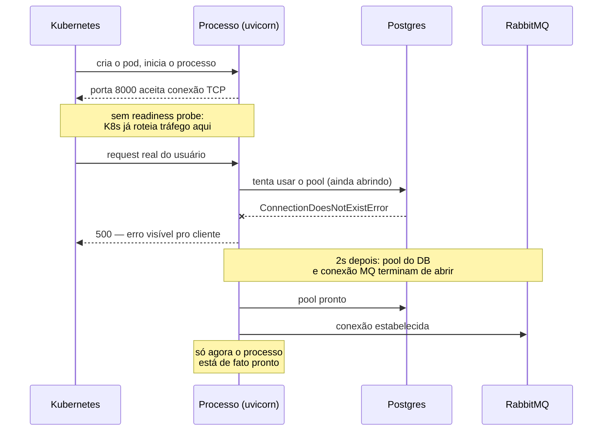
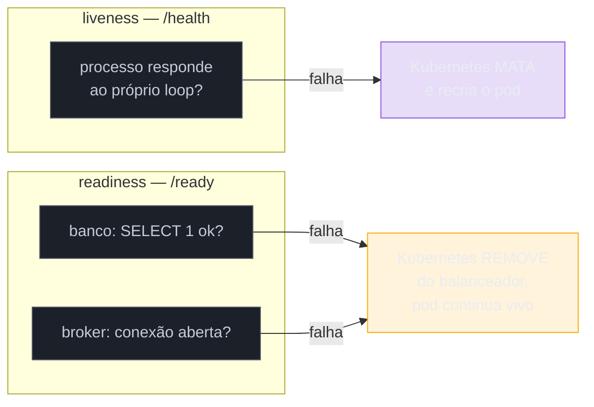

# Health checks e probes

> [!abstract] TL;DR
> Um deploy novo sobe, o processo Python inicia, o `uvicorn` começa a aceitar conexões TCP na porta — e, tecnicamente, o processo está "vivo". Mas a conexão com o banco ainda não foi estabelecida, o pool ainda está aquecendo, e nenhuma dessas coisas impede o orquestrador de já mandar tráfego real pra esse pod. Os primeiros requests falham com erro de conexão, não porque o código tem bug, mas porque ninguém disse ao orquestrador a diferença entre "o processo está vivo" e "o processo está pronto pra receber tráfego" — as duas perguntas que este galho batizou no [[01 - Panorama — o que falta pra produção de verdade|panorama]] como o que faltou no incidente de abertura. Esta nota cobre exatamente essa distinção: **liveness** (`/health` ou `/healthz`, o mais simples possível — só confirma que o processo responde, nunca checa dependência externa) versus **readiness** (`/ready`, mais completo — checa se as dependências críticas, como o banco e o broker RabbitMQ do [[03-Dominios/Tecnologia/Python/Mensageria/05 - aio-pika — RabbitMQ assíncrono|Galho 14]], estão de fato disponíveis), o contrato que o [[03-Dominios/Engenharia/Operação/4 - Observar e responder/index|Kubernetes]] consome via `livenessProbe`/`readinessProbe` no manifest do Pod — sem desenvolver Kubernetes a fundo, isso é para o Galho 18 futuro — e a armadilha de um `/ready` que checa demais e vira, ele mesmo, um ponto único de falha em cascata.

## A cena: o pod que nasceu vivo, mas não estava pronto

Uma sexta-feira à tarde, o time do serviço de Tarefas faz um deploy de rotina: uma correção pequena, revisada, testada, sem nada de anormal. O pipeline builda a imagem, o Kubernetes cria um pod novo, o processo `uvicorn` dentro dele inicia e, em menos de um segundo, já está escutando na porta 8000. Do ponto de vista do orquestrador, que só sabe fazer uma pergunta simples — "essa porta aceita conexão TCP?" — o pod está pronto. O balanceador de carga passa a rotear uma fatia do tráfego pra ele imediatamente.

O problema é que o código da aplicação, entre o momento em que o processo sobe e o momento em que ele de fato consegue atender uma requisição real, ainda precisa fazer duas coisas que levam alguns segundos: abrir o pool de conexões com o Postgres (um handshake TLS, autenticação, alguns round-trips de rede até o banco confirmar a conexão) e conectar no broker RabbitMQ que o [[03-Dominios/Tecnologia/Python/Mensageria/05 - aio-pika — RabbitMQ assíncrono|Galho 14]] já configurou para publicar eventos de domínio. Durante essa janela — tipicamente entre 1 e 4 segundos, mas às vezes mais, se o banco estiver sob carga ou a rede tiver uma hesitação momentânea — o processo está **vivo** (responde a qualquer request TCP, o `uvicorn` está de pé) mas não está **pronto** (qualquer handler que dependa do banco ou do broker vai falhar).

Os primeiros clientes que caem nesse pod, nessa janela de segundos, recebem um erro 500 — `asyncpg.exceptions.ConnectionDoesNotExistError` ou equivalente, porque o handler tenta usar um pool que ainda não terminou de abrir. Ninguém no time percebeu nada de errado no deploy: os testes passaram, o healthcheck simplório que o time tinha configurado (uma checagem TCP genérica, a única coisa que o orquestrador sabia fazer sem instrução explícita do código) disse "vivo, pode receber tráfego" no primeiro milissegundo em que a porta abriu. O "warm-up" do processo, que deveria ser invisível para o usuário, virou um punhado de erros reais, visíveis, num momento em que nada de fato quebrado tinha acontecido — só um processo que ainda não tinha terminado de se preparar sendo tratado, erroneamente, como pronto.



> [!question]- Isso não é um problema de configuração do Kubernetes, não de código Python?
> É os dois, mas a origem é código de aplicação. O Kubernetes só sabe distinguir "vivo" de "pronto" se o **código** expuser dois sinais diferentes — sem isso, ele só tem a checagem TCP genérica, que responde "a porta abriu" e nada além disso. É exatamente a mesma fronteira que a [[01 - Panorama — o que falta pra produção de verdade|nota 01 deste galho]] já registrou para logs e métricas: a infraestrutura de orquestração pode existir, configurada corretamente, mas se o serviço não expõe os endpoints certos, com a semântica certa, não há nada de útil para o orquestrador consumir. Esta nota cobre o que o **código Python** precisa fazer — o contrato — não como configurar o cluster que consome esse contrato.

## Liveness: "o processo está vivo?"

**Liveness** responde a uma pergunta deliberadamente estreita: *este processo ainda está funcionando, ou travou de um jeito que só um reinício resolve?* Não é "o processo está fazendo o trabalho certo" nem "as dependências dele estão saudáveis" — é só "o processo em si, o loop de eventos, ainda responde a uma requisição HTTP simples, sem travar, sem deadlock, sem consumir toda a CPU num loop infinito".

```python
from fastapi import FastAPI

app = FastAPI()


@app.get("/health")
async def liveness():
    return {"status": "ok"}
```

Repare no que **não** está aqui: nenhuma consulta ao banco, nenhuma checagem de fila, nenhuma chamada a um serviço externo. Isso é deliberado, não uma simplificação de exemplo didático — um endpoint de liveness que depende de qualquer coisa fora do próprio processo corre o risco de responder "não vivo" por um motivo que não tem nada a ver com o processo estar de fato travado, e a consequência de uma falha de liveness é drástica: **o orquestrador mata o processo e sobe um novo no lugar**.

> [!warning] Liveness verificando dependência externa é a receita pra um loop de reinício sem fim
> **O que acontece:** alguém, com boa intenção, coloca uma consulta ao banco dentro do `/health` — "afinal, se o banco caiu, o processo não está mesmo saudável, certo?" O banco fica indisponível por um minuto (manutenção, failover, sobrecarga momentânea). O `/health` de **todos** os pods do serviço passa a responder erro ao mesmo tempo, porque todos dependem do mesmo banco. O Kubernetes, vendo liveness falhar, começa a **reiniciar** todos os pods — não um por um, esperando o banco voltar, mas continuamente, porque cada pod novo também falha o `/health` assim que sobe, e é morto de novo. **Por quê:** liveness e reinício são a mesma ação, por design — o Kubernetes não tem uma resposta mais sutil que "matar e recriar" para uma falha de liveness. Se a causa da falha não está no processo em si, mas numa dependência externa temporariamente fora do ar, reiniciar o processo não resolve nada — o banco continua fora, o pod novo falha de novo, e o time ganha um "crash loop" (o próprio Kubernetes chama esse estado de `CrashLoopBackoff`) em cima de um problema que reiniciar processo nenhum jamais teria resolvido. **Como evitar:** `/health` (liveness) nunca consulta nada fora do processo. Ele responde `200` se o loop de eventos está processando requisições — no limite, checando algo interno e barato, como um contador incrementado a cada ciclo do event loop, nunca uma chamada de rede. Dependência externa é assunto de **readiness**, não de liveness — a seção seguinte.

## Readiness: "o processo está pronto pra receber tráfego?"

**Readiness** responde a uma pergunta diferente e mais ampla: *este processo específico, agora, está em condições de atender uma requisição real, ou existe algum motivo pelo qual ele deveria ficar temporariamente fora da rotação de tráfego, sem precisar ser reiniciado?* É exatamente a pergunta que faltou no incidente de abertura — o processo estava vivo (o `/health` responderia `200` sem problema), mas não estava pronto (o pool do banco ainda não tinha aberto).

```python
import asyncpg
from fastapi import FastAPI, Response, status

app = FastAPI()


@app.get("/ready")
async def readiness(response: Response):
    checks = {}

    try:
        async with app.state.db_pool.acquire() as conn:
            await conn.execute("SELECT 1")
        checks["database"] = "ok"
    except Exception as exc:
        checks["database"] = f"erro: {exc}"

    try:
        if app.state.rabbitmq_connection.is_closed:
            raise RuntimeError("conexão RabbitMQ fechada")
        checks["rabbitmq"] = "ok"
    except Exception as exc:
        checks["rabbitmq"] = f"erro: {exc}"

    todos_ok = all(v == "ok" for v in checks.values())
    if not todos_ok:
        response.status_code = status.HTTP_503_SERVICE_UNAVAILABLE

    return {"status": "ok" if todos_ok else "unavailable", "checks": checks}
```

Duas peças fazem esse endpoint funcionar corretamente. Primeiro, `SELECT 1` — a consulta mais barata possível, que só confirma que a conexão de fato responde, sem tocar em nenhuma tabela real nem competir por lock com tráfego de produção; um `/ready` que roda uma query cara a cada poucos segundos (o intervalo típico de um `readinessProbe`) vira, ele mesmo, uma fonte extra de carga no banco, o oposto do que um health check deveria fazer. Segundo, o `status_code` explícito: um `503 Service Unavailable` quando algo falha é o sinal que o Kubernetes espera para tirar o pod da rotação — devolver `200` com um corpo dizendo `"status": "unavailable"` não funciona, porque o `readinessProbe` do Kubernetes, por padrão, só olha o código de status HTTP, não o corpo da resposta.

> [!tip] Por que checar `is_closed` no RabbitMQ em vez de reabrir a conexão a cada chamada
> O objetivo do readiness é **observar** o estado atual da conexão que a aplicação já mantém — não criar uma conexão nova a cada verificação, o que seria caro (handshake AMQP completo) e mascararia o problema real: se a conexão de longa duração que os handlers de fato usam está fechada, é isso que precisa aparecer no `/ready`, não o resultado de uma conexão de teste que não tem nenhuma relação com o que os handlers vão usar de verdade. O mesmo raciocínio vale para o pool do banco: `SELECT 1` usa uma conexão emprestada do **mesmo** pool que os handlers usam, não uma conexão paralela criada só para o check.



O diagrama acima é a distinção inteira desta nota resumida numa ação: falha de liveness é **destrutiva** (mata o processo, na expectativa de que um processo novo resolva o que um travamento interno causou); falha de readiness é **reversível** (só tira o pod da fila de tráfego, sem tocar no processo, e assim que os checks voltarem a passar, o pod volta a receber requisições sozinho, sem intervenção nenhuma). Confundir as duas — colocar checagem de dependência externa no endpoint de liveness, como o `[!warning]` anterior descreveu — troca uma ação reversível por uma destrutiva, pelo motivo errado.

## Como o Kubernetes consome esse contrato

O código Python não decide, sozinho, quando o orquestrador chama esses endpoints — isso é configurado no manifest do Pod, fora do código da aplicação:

```yaml
livenessProbe:
  httpGet:
    path: /health
    port: 8000
  initialDelaySeconds: 5
  periodSeconds: 10

readinessProbe:
  httpGet:
    path: /ready
    port: 8000
  initialDelaySeconds: 2
  periodSeconds: 5
  failureThreshold: 3
```

O Kubernetes chama `httpGet` periodicamente contra o `path` e a `port` configurados, e trata qualquer resposta com status `2xx` como sucesso e qualquer outra coisa (erro de conexão, timeout, `4xx`/`5xx`) como falha. `initialDelaySeconds` dá um tempo antes da primeira checagem (evitando marcar o pod como falho antes mesmo dele terminar de subir); `periodSeconds` define o intervalo entre checagens; `failureThreshold` (mais comum em readiness, para não tirar o pod da rotação por uma falha isolada de rede) define quantas falhas seguidas são necessárias antes de agir. Vale notar a assimetria nos números do exemplo: readiness é checado com mais frequência e reage mais rápido (o pod precisa voltar à rotação assim que possível depois de um blip momentâneo), enquanto liveness tem um intervalo maior e uma ação mais cara — não convém disparar um reinício de processo por qualquer flutuação passageira.

> [!question]- Essa configuração YAML é o suficiente pra eu entender Kubernetes em produção?
> Não, e essa nota não tenta ensinar isso — o manifest acima é só a **superfície** do contrato que o código Python precisa honrar; como o Kubernetes decide *quando* remover um pod do Service (o objeto que faz o balanceamento de fato), o comportamento durante rolling updates, `startupProbe` (uma terceira probe, para processos com boot lento, que evita competir com o timing de liveness), afinidade de rede, tudo isso é orquestração de cluster — um domínio próprio, reservado para o Galho 18 futuro (Cloud-native e produção). O que esta nota garante é que, quando esse galho existir, o código Python dos dois serviços já vai ter os dois endpoints certos, com a semântica certa, prontos pra qualquer orquestrador consumir — Kubernetes ou qualquer outro.

## A armadilha do readiness que checa tudo

Um `/ready` completo — o exemplo desta nota já checa banco e broker — parece, à primeira vista, sempre melhor quanto mais dependências ele cobre. Na prática, esse instinto tem um limite, e passar dele transforma o próprio health check num ponto único de falha em cascata.

> [!warning] Um /ready que checa tudo pode derrubar toda a capacidade de uma vez
> **O que acontece:** o time, seguindo o raciocínio "quanto mais completo o readiness, melhor", adiciona checagem de **todas** as dependências do serviço ao `/ready` — banco principal, réplica de leitura, broker, um serviço de cache Redis, um serviço externo de terceiros usado só por uma feature secundária. O banco principal tem um blip de 90 segundos (um failover de réplica, por exemplo). Como o `/ready` depende dele, **todos os pods do serviço** — não só um — passam a falhar readiness ao mesmo tempo, porque todos consultam o mesmo banco. O Kubernetes tira **100% da capacidade** da rotação de tráfego simultaneamente. Requisições que nem tocariam no banco principal — uma leitura que usaria só a réplica, ou uma rota que não depende de nada externo — também param de ser atendidas, porque não existe pod nenhum disponível para atendê-las. **Por quê:** o `/ready`, ao agregar todas as dependências num único veredito binário ("pronto" ou "não pronto"), cria uma correlação artificial entre coisas que não precisavam estar correlacionadas. Um serviço com múltiplas dependências raramente falha todas ao mesmo tempo pela mesma causa — mas um readiness que soma todas numa checagem `all()` faz exatamente isso parecer verdade para o orquestrador, mesmo quando 90% do tráfego do serviço não dependia da peça que quebrou. **Como evitar:** distinguir dependências **críticas** (sem elas, nenhuma requisição do serviço pode ser atendida corretamente — normalmente o banco principal de escrita) de dependências **degradáveis** (o serviço consegue responder algo útil mesmo sem elas, mesmo que de forma reduzida — um serviço de terceiros usado só por uma feature opcional, um cache cuja ausência só significa "mais lento", não "impossível"). Só dependências críticas entram no `/ready`; falhas de dependência degradável viram uma métrica e um log de alerta (os pilares das notas anteriores deste galho), não uma remoção de capacidade. Em serviços com múltiplas rotas com necessidades muito diferentes, um único `/ready` agregado pode ser insuficiente por natureza — a alternativa, mais avançada e fora do escopo desta nota introdutória, é health check por sub-sistema, consultado seletivamente por quem decide rotear cada tipo de requisição.

O exemplo desta nota — banco e RabbitMQ — já reflete essa escolha: ambos são dependências das quais o serviço de Tarefas não consegue operar de forma nenhuma (toda escrita depende do banco; a publicação de eventos de domínio depende do broker), então ambos são, de fato, críticos o suficiente para justificar tirar o pod da rotação se falharem. Uma dependência hipotética mais periférica — um serviço de geolocalização usado só para enriquecer um campo opcional de resposta, por exemplo — não entraria nesse `/ready`; sua ausência produziria um log e talvez um campo faltando na resposta, não um pod inteiro fora do ar.

## Casos práticos

### Cenário 1: rolling update sem readiness probe configurado

Um serviço sobe uma versão nova via rolling update — o Kubernetes cria pods novos e, à medida que cada um fica disponível, começa a substituir os antigos. Sem `readinessProbe` configurado no manifest, o Kubernetes usa o mesmo critério simplório do incidente de abertura desta nota: a porta aceita conexão TCP, então o pod está "pronto" — mesmo que o processo dentro dele ainda esteja no meio do `startup event` do FastAPI, abrindo pool de banco e conexão com o broker. Durante os poucos segundos de warm-up de **cada** pod novo do rollout, uma fatia do tráfego cai nele e falha, se repetindo a cada novo pod que sobe — um rollout de 10 pods, sem readiness, pode gerar 10 pequenas janelas de erro visível, uma por pod, ao longo de alguns minutos. Com `readinessProbe` apontando para `/ready` configurado, o Kubernetes só inclui cada pod na rotação de tráfego depois que o endpoint responder `200` — ou seja, depois que o pool do banco e a conexão do broker já estiverem de fato estabelecidos —, e o rollout inteiro passa sem nenhum erro visível ao cliente, porque nenhum pod recebe tráfego antes de estar genuinamente pronto.

### Cenário 2: liveness genérico demais escondendo um deadlock real

Um processo trava — um lock nunca liberado por um bug de concorrência, o event loop do `asyncio` bloqueado por uma chamada síncrona que nunca deveria estar ali. Se o `/health` desta nota estivesse implementado como um simples `return {"status": "ok"}` numa rota registrada **antes** do travamento acontecer, mas o travamento estivesse no event loop principal, a rota nunca conseguiria nem processar a nova requisição de liveness — o `uvicorn` já não consegue nem aceitar a conexão TCP nova, e o `livenessProbe` acaba falhando de qualquer forma, por timeout, mesmo sem checar nada sofisticado. É esse comportamento — falhar por travamento real do event loop, não por checagem elaborada — que faz o `/health` minimalista funcionar como detector de deadlock sem precisar de lógica extra: um processo genuinamente travado deixa de responder a **qualquer** coisa, inclusive à rota mais simples possível, e é exatamente aí que o `livenessProbe` cumpre seu papel, matando e recriando o processo travado — a única ação que de fato resolve um deadlock interno, porque não existe checagem de código que "destrave" um lock por fora.

## Em entrevista

Perguntas sobre "como você garante zero downtime num deploy" ou "o que acontece quando seu banco cai por um minuto" costumam testar exatamente essa distinção. Uma resposta forte nomeia liveness e readiness como conceitos separados (não "eu tenho um health check", no singular), explica por que a checagem de dependência externa pertence só ao readiness — nunca ao liveness, sob risco de crash loop —, e sabe apontar a armadilha do readiness que agrega dependências demais: um candidato que só sabe dizer "eu checo tudo no `/health`" revela que nunca precisou debugar um crash loop causado por essa mesma escolha em produção.

## Síntese

Liveness e readiness respondem perguntas diferentes, e confundir as duas troca a ação certa pela errada: `/health` é deliberadamente burro — nunca toca em dependência externa, porque sua falha aciona a ação mais destrutiva que o orquestrador tem, matar e recriar o processo, algo que só ajuda quando o problema está de fato dentro do processo. `/ready` é onde a inteligência mora — checa exatamente as dependências sem as quais o serviço não consegue operar (`SELECT 1` no banco, estado da conexão com o broker), reutilizando o pool e a conexão que os handlers reais usam, nunca criando uma checagem paralela cara. Sua falha aciona algo reversível — sair da rotação de tráfego, sem tocar no processo — e é justamente por essa reversibilidade que vale a pena manter o `/ready` restrito às dependências verdadeiramente críticas: agregar demais nele transforma uma falha parcial e localizada numa falha total e simultânea de toda a capacidade do serviço, o oposto do que um health check deveria proteger. O Kubernetes consome esse contrato via `livenessProbe`/`readinessProbe` no manifest — a configuração do cluster em si fica para o Galho 18 futuro; o que este código garante, hoje, é que o contrato que qualquer orquestrador precisa está exposto corretamente.

## Como explicar em inglês

> "Liveness and readiness answer different questions, and conflating them means the orchestrator takes the wrong action for the wrong reason. `/health` should stay dumb on purpose — it never touches an external dependency, because a liveness failure triggers the most destructive response Kubernetes has: kill and recreate the process. That only helps when the problem is actually inside the process, like a deadlock. `/ready` is where the intelligence lives — it checks the dependencies the service genuinely can't operate without, like a trivial `SELECT 1` against the database pool the handlers actually use, and a failure there only pulls the pod out of the load balancer's rotation, without touching the process — fully reversible. The trap is over-checking: aggregate too many dependencies into one readiness verdict and a partial outage of one non-critical dependency takes down 100% of your serving capacity at once, because every pod fails the same check simultaneously. Keep `/ready` scoped to what's truly load-bearing, and let everything else degrade gracefully instead."

| PT | EN |
|----|----|
| Verificação de vivacidade | Liveness probe |
| Verificação de prontidão | Readiness probe |
| Processo travado | Deadlocked process |
| Aquecimento / warm-up | Warm-up |
| Falha em cascata | Cascading failure |
| Ponto único de falha | Single point of failure |
| Reinício em loop | Crash loop |
| Rotação de tráfego | Traffic rotation / load balancer rotation |

## O que vem a seguir

Com liveness e readiness expostos corretamente, o processo Python já dá ao orquestrador — Kubernetes ou qualquer outro — o contrato mínimo para decidir com segurança quando reiniciar e quando só pausar o roteamento de tráfego. Falta empacotar esse processo instrumentado num artefato que qualquer ambiente de produção sabe consumir.

- [[07 - Deploy básico — Dockerfile e CI-CD|07 — Deploy básico: Dockerfile e CI/CD]] — o `Dockerfile` que empacota o serviço com os endpoints desta nota já embutidos, e o esqueleto de um pipeline CI/CD.

## Veja também

- [[index|Observabilidade e produção]] — MOC deste galho.
- [[01 - Panorama — o que falta pra produção de verdade|01 — Panorama: o que falta pra produção de verdade]] — o incidente de abertura do galho, onde a ausência de um `/health` que um orquestrador pudesse consultar já foi nomeada como parte da lacuna que este galho fecha.
- [[04 - WSGI vs ASGI na prática — gunicorn e uvicorn|04 — WSGI vs ASGI na prática: gunicorn e uvicorn]] — o servidor que efetivamente expõe estes endpoints em produção.
- [[05 - Configuração de servidor de produção — workers, timeouts e graceful shutdown|05 — Configuração de servidor de produção: workers, timeouts e graceful shutdown]] — graceful shutdown, o outro mecanismo (além de readiness) que evita cortar requisições em andamento durante um deploy.
- [[03-Dominios/Tecnologia/Python/Mensageria/05 - aio-pika — RabbitMQ assíncrono|Galho 14 — aio-pika: RabbitMQ assíncrono]] — a conexão com o broker que o `/ready` desta nota verifica.

## Fontes

- Kubernetes. *Configure Liveness, Readiness and Startup Probes*. kubernetes.io. https://kubernetes.io/docs/tasks/configure-pod-container/configure-liveness-readiness-startup-probes/ (acessado em 2026-07-12) — semântica de `livenessProbe`/`readinessProbe`, `initialDelaySeconds`, `periodSeconds`, `failureThreshold`, e a ação que cada tipo de falha dispara.
- Kubernetes. *Pod Lifecycle*. kubernetes.io. https://kubernetes.io/docs/concepts/workloads/pods/pod-lifecycle/ (acessado em 2026-07-12) — como o estado de readiness de um pod se relaciona com sua inclusão nos endpoints de um Service.
- FastAPI. *First Steps* e *Response Status Code*. fastapi.tiangolo.com. https://fastapi.tiangolo.com/tutorial/response-status-code/ (acessado em 2026-07-12) — como definir status code explícito numa resposta, usado no `/ready` desta nota.
- [[01 - Panorama — o que falta pra produção de verdade|Panorama — o que falta pra produção de verdade]] — nota 01 deste galho, onde o incidente de abertura já nomeou a ausência de health check como parte da lacuna.

Consultado em 2026-07-12.
