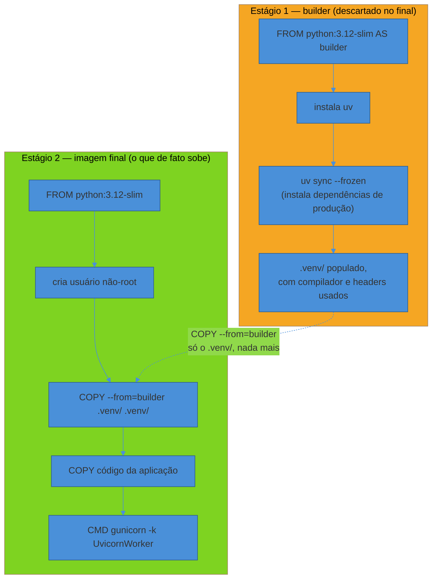
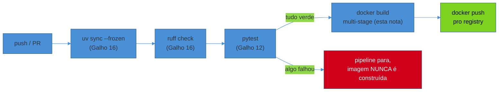

# Deploy básico — Dockerfile e CI/CD

> [!abstract] TL;DR
> A primeira versão do `Dockerfile` do serviço de Notificações builda uma imagem de **1.2 GB** — porque copia o repositório inteiro, incluindo `.git/` e o cache de teste, instala as dependências de desenvolvimento junto das de produção, e nunca separa o toolchain de build (compilador C, cabeçalhos, o próprio `uv`) do que de fato precisa rodar em produção. Um **multi-stage build** — um estágio que instala dependências com `uv sync --frozen`, outro que só copia o `.venv` e o código-fonte pra uma imagem base limpa — reduz a mesma imagem pra **180 MB**, sem tocar em uma linha do código da aplicação. A imagem final roda como **usuário não-root**, sem compilador nenhum instalado, e sobe em segundos em vez de minutos. Esta nota cobre o `Dockerfile` mínimo e correto pra empacotar um dos dois serviços da trilha, o `.dockerignore` que evita a maior parte do inchaço antes mesmo do multi-stage entrar em cena, e o esqueleto conceitual de um pipeline CI/CD que builda, testa e produz esse artefato — sem entrar em como orquestrar esse artefato depois, o assunto do [[03-Dominios/Tecnologia/Python/Observabilidade e produção/index|Galho 18 futuro]].

## A cena: 1.2 GB pra rodar um serviço de 40 MB de código

O serviço de Notificações — o mesmo que apareceu morto às 3h da manhã na [[01 - Panorama — o que falta pra produção de verdade|nota 01 deste galho]], depois ganhou logging estruturado, métricas, servidor `gunicorn`+`uvicorn` configurado com graceful shutdown, e health checks — já está pronto pra rodar em produção de verdade. Falta um detalhe que parece secundário até alguém medir: como esse serviço vira um artefato que uma máquina qualquer, num datacenter qualquer, sabe baixar e executar sem precisar ter Python instalado, sem precisar clonar o repositório, sem depender de mais nada além de rodar `docker run`.

Alguém do time escreve a primeira versão do `Dockerfile`, do jeito mais direto possível:

```dockerfile
# Dockerfile — primeira versão, ingênua
FROM python:3.12

WORKDIR /app
COPY . .

RUN pip install uv
RUN uv sync

CMD ["gunicorn", "app.main:app", "-k", "uvicorn.workers.UvicornWorker", "-w", "4"]
```

Funciona — a imagem builda, o container sobe, o serviço responde. O problema aparece quando alguém roda `docker images` e vê o tamanho: **1.2 GB**, pra um serviço cujo código-fonte inteiro, sem dependências, pesa uns 40 MB. O deploy, que antes levava segundos pra transferir a imagem entre o registry e o servidor, começa a levar minutos — cada rolling update do [[05 - Configuração de servidor de produção — workers, timeouts e graceful shutdown|combo gunicorn/uvicorn]] fica proporcionalmente mais lento, porque cada pod novo precisa baixar 1.2 GB antes de sequer começar a inicializar.

A investigação do porquê é rápida, uma vez que alguém olha com atenção pro que `COPY . .` de fato copiou:

- **`.git/`** — o histórico completo do repositório, com todos os commits, branches e objetos, entrou na imagem inteiro. Num repositório com anos de histórico, isso sozinho pode passar de centenas de MB.
- **`.venv/`** local do desenvolvedor que gerou a imagem, se existia na máquina no momento do build (dependendo de como o `COPY . .` foi executado) — uma cópia duplicada e potencialmente incompatível do ambiente virtual, por cima do `.venv` que o próprio `uv sync` dentro do container ia gerar de qualquer forma.
- **`__pycache__/`** e artefatos de teste (`.pytest_cache/`, relatórios de cobertura) — nada disso é necessário pra rodar o serviço, só pra desenvolvê-lo.
- **A imagem base `python:3.12` completa**, não a variante `slim` — a imagem `python:3.12` "cheia" inclui um compilador C, bibliotecas de desenvolvimento, ferramentas de debug e documentação que o processo em produção nunca usa, porque o build de qualquer dependência com extensão C já aconteceu (ou deveria ter acontecido) antes da imagem final existir.
- **`uv` instalado na imagem final** — a ferramenta usada pra *instalar* as dependências continua presente depois de já ter feito seu trabalho, ocupando espaço sem propósito nenhum depois do `uv sync` terminar.

> [!warning] Imagem gigante não é só "mais lenta pra baixar" — é superfície de ataque maior
> **O que acontece:** uma imagem com compilador, ferramentas de build e o `.git` inteiro embutidos não é só ineficiente — é uma superfície de ataque desnecessariamente maior. Qualquer CVE em qualquer pacote do toolchain de build (que nunca deveria estar presente em produção) vira uma vulnerabilidade reportada contra a imagem de produção, mesmo que o código de produção nunca toque nesse pacote. **Por quê:** scanners de vulnerabilidade (Trivy, Grype, os scanners nativos de registries como GHCR e ECR) avaliam **tudo** que está instalado na imagem, não só o que o processo principal executa — um compilador C com uma CVE conhecida é reportado do mesmo jeito que uma dependência de runtime com a mesma CVE, mesmo que o primeiro nunca seja executado depois do build. **Como evitar:** multi-stage build — o assunto do resto desta nota — separa fisicamente o que é necessário pra **construir** o artefato do que é necessário pra **executá-lo**, e só o segundo grupo sobrevive na imagem final.

A segunda versão do `Dockerfile`, com multi-stage build correto, reduz a mesma imagem pra **180 MB** — sem mudar uma linha de código da aplicação, só a forma como o artefato é construído.

## Multi-stage build: dois `FROM`, um artefato final enxuto

A ideia central de um multi-stage build é simples: um `Dockerfile` pode conter **múltiplos** blocos `FROM`, cada um começando um estágio novo, isolado dos anteriores. Cada estágio pode copiar arquivos específicos dos estágios anteriores via `COPY --from=<nome-do-estágio>` — mas nada mais do estágio anterior vaza pra frente automaticamente. Isso permite que o estágio de **build** tenha acesso a tudo que precisa (compilador, `uv`, dependências de desenvolvimento) sem que nada disso sobreviva no estágio **final**, que só recebe, explicitamente, o que foi pedido via `COPY --from`.



O compilador C, os headers de desenvolvimento, o próprio `uv`, o `.git`, o cache de teste — tudo isso existe **só dentro do estágio `builder`**, que o Docker descarta por completo depois que o build termina. A imagem final nunca viu nenhuma dessas camadas; ela só recebeu, via `COPY --from=builder`, exatamente o diretório `.venv/` já pronto e o código-fonte da aplicação.

> [!question]- Por que não simplesmente instalar as dependências direto na imagem final, sem um estágio `builder` separado?
> Porque instalar dependências com extensões C (drivers de banco compilados, bibliotecas de serialização otimizadas) frequentemente exige um compilador e headers de desenvolvimento **durante a instalação**, mesmo que o resultado final — o binário já compilado, dentro do `.venv` — não precise mais deles depois. Sem multi-stage, a única forma de ter esse compilador disponível durante `uv sync` é instalá-lo na imagem final também, e ele fica lá pra sempre, sem uso depois do build terminar. O multi-stage resolve exatamente essa tensão: o compilador existe só onde e quando é necessário (o estágio `builder`), e desaparece antes da imagem final existir.

## O `Dockerfile` completo, estágio por estágio

Reusando o tooling que o [[03-Dominios/Tecnologia/Python/Build e tooling/index|Galho 16]] já estabeleceu — `uv` como gerenciador de dependências, `uv.lock` como fonte de verdade reproduzível — o `Dockerfile` fica assim:

```dockerfile
# syntax=docker/dockerfile:1

# ---------- Estágio 1: builder ----------
FROM python:3.12-slim AS builder

# Instala o uv copiando o binário oficial (mais rápido e
# reprodutível que "pip install uv" dentro do container).
# Comandos do uv em si (uv sync, uv.lock, --locked/--frozen)
# já foram cobertos em profundidade no Galho 16 — aqui é só uso.
COPY --from=ghcr.io/astral-sh/uv:latest /uv /uvx /bin/

WORKDIR /app

# Copia só o necessário pra resolver dependências ANTES do
# código-fonte — camada de cache do Docker: se pyproject.toml
# e uv.lock não mudaram, esta camada não rebuilda em todo push.
COPY pyproject.toml uv.lock ./

# --frozen: falha se uv.lock estiver desatualizado em relação ao
# pyproject.toml, em vez de resolver de novo silenciosamente —
# a mesma garantia de reprodutibilidade que --locked, mas sem
# tentar sincronizar um lockfile que não deveria mudar em CI.
# --no-dev: só dependências de produção, nada de pytest/ruff aqui.
RUN uv sync --frozen --no-dev

# Só agora copia o código-fonte — mudanças de código não invalidam
# a camada de dependências acima, então rebuilds de rotina (sem
# mudança de dependência) reaproveitam o cache do estágio anterior.
COPY app/ ./app/

# ---------- Estágio 2: imagem final ----------
FROM python:3.12-slim

# Usuário não-root — princípio de menor privilégio já
# desenvolvido em profundidade no Galho 11 (Segurança); aqui só
# a aplicação prática: se o processo for comprometido, ele não
# roda como root dentro do container.
RUN groupadd --gid 1000 appuser \
    && useradd --uid 1000 --gid appuser --shell /bin/false --no-create-home appuser

WORKDIR /app

# Copia SÓ o ambiente virtual já resolvido e o código —
# nada de compilador, nada de uv, nada de .git, nada de cache
# de teste. Isso é o que reduz a imagem de 1.2 GB pra 180 MB.
COPY --from=builder --chown=appuser:appuser /app/.venv /app/.venv
COPY --from=builder --chown=appuser:appuser /app/app /app/app

# Ativa o venv sem precisar de "source activate" — só aponta o
# PATH pro bin/ do venv copiado, o mesmo padrão que o Galho 16
# já usou pra explicar por que uv nunca chama "activate".
ENV PATH="/app/.venv/bin:$PATH"

USER appuser

EXPOSE 8000

# gunicorn.conf.py já traz workers, timeout, graceful-timeout,
# preload e max-requests configurados — ver nota 05 deste galho.
CMD ["gunicorn", "app.main:app", "-c", "gunicorn.conf.py"]
```

> [!tip] `--chown` no `COPY --from` evita um `chown -R` caro depois
> É tentador copiar os arquivos primeiro e rodar `RUN chown -R appuser:appuser /app` depois, como um passo separado — mas isso cria uma camada extra na imagem que duplica o peso de tudo que acabou de ser copiado (o Docker guarda cada camada, incluindo a versão "antes do chown" e "depois do chown", até fazer squash). Usar `--chown` diretamente na instrução `COPY` aplica a mudança de dono no momento da cópia, sem duplicar camada nenhuma.

> [!warning] Rodar o processo como `root` dentro do container — o padrão perigoso mais comum em imagens Python
> **O que acontece:** sem um `USER` explícito no `Dockerfile`, o Docker roda o `CMD` como `root` por padrão — o mesmo usuário com privilégio total dentro do container. Se o processo da aplicação for comprometido (uma dependência com vulnerabilidade, uma falha de deserialização, qualquer vetor de execução de código), o atacante herda os privilégios de `root` **dentro do container**, o que amplia significativamente o que ele consegue fazer a partir daí — inclusive, dependendo da configuração do runtime de container e de eventuais volumes montados, escalar para o host. **Por quê:** a maioria dos serviços não precisa de privilégio nenhum de sistema pra atender requisições HTTP, ler variáveis de ambiente e escrever log em `stdout` — rodar como `root` é conveniência de quem escreveu o `Dockerfile` rápido, não uma necessidade real da aplicação. **Como evitar:** criar um usuário e grupo dedicados (`appuser`, no exemplo acima), copiar os arquivos já com o dono correto via `--chown`, e declarar `USER appuser` antes do `CMD` — o mesmo princípio de menor privilégio que o [[03-Dominios/Tecnologia/Python/Segurança/06 - Secrets e configuração segura|Galho 11]] já desenvolveu pra outras superfícies da aplicação, aplicado aqui ao processo do container em si.

## `.dockerignore`: o que nunca deve nem chegar perto do contexto de build

O multi-stage build resolve o que sobrevive na imagem **final**, mas o estágio `builder` ainda recebe, por padrão, tudo que o comando `docker build` enxerga no diretório do projeto — o "contexto de build". Sem um `.dockerignore`, o `.git/` inteiro, o `.venv/` local, o `__pycache__/` e qualquer arquivo `.env` com segredo continuam sendo enviados ao daemon do Docker antes mesmo do primeiro `COPY` rodar, o que desperdiça tempo de build e, no caso de `.env`, é um risco de segurança real — um `COPY . .` descuidado em qualquer estágio pode incluir segredo nenhum deveria estar numa imagem versionada num registry.

```gitignore
# .dockerignore

# Controle de versão — nunca precisa estar dentro de uma imagem
.git/
.gitignore

# Ambiente virtual local — o builder cria o seu próprio via uv sync;
# copiar um .venv local pode até ser incompatível com a plataforma
# de destino (ex: build feito num Mac, imagem rodando em Linux amd64)
.venv/

# Bytecode e cache — nunca necessário, sempre regenerado
__pycache__/
*.pyc
.pytest_cache/
.ruff_cache/
.mypy_cache/

# Cobertura e relatórios de teste — artefato de CI, não de produção
htmlcov/
.coverage
coverage.xml

# Segredos locais — NUNCA devem entrar no contexto de build,
# muito menos numa imagem; gestão real de secrets em produção
# já foi coberta no Galho 11 nota 06
.env
.env.*
!.env.example

# Metadados de IDE e SO
.vscode/
.idea/
.DS_Store

# Documentação e arquivos que não afetam o runtime
README.md
docs/
```

> [!question]- Por que isso importa se o multi-stage já descarta o estágio `builder` inteiro?
> Porque o `.dockerignore` age **antes** de qualquer estágio existir — ele filtra o que o comando `docker build` sequer envia ao daemon como contexto, independente de quantos estágios o `Dockerfile` tenha. Sem ele, mesmo um multi-stage bem feito ainda paga o custo de transferir um `.git/` de centenas de MB pro daemon a cada build (mais lento, mesmo que essa camada específica seja descartada depois), e ainda corre o risco de um `COPY . .` mal escrito em qualquer estágio — inclusive o `builder` — incluir um `.env` com credencial de verdade dentro de uma camada de imagem, que persiste no histórico da imagem mesmo que um estágio posterior não a copie adiante. `.dockerignore` e multi-stage resolvem problemas complementares, não redundantes: um filtra o que **entra** no build; o outro filtra o que **sai** dele.

## Pipeline CI/CD: o esqueleto conceitual

Com o `Dockerfile` e o `.dockerignore` prontos, falta o mecanismo que garante que a imagem só é construída — e só chega a um registry — depois que o código passou pelos mesmos gates que o [[03-Dominios/Tecnologia/Python/Build e tooling/index|Galho 16]] já configurou localmente: lint e testes. A filosofia de **por que** um pipeline de CI/CD existe, o que separa "deploy" de "release", e como desenhar gates sem sacrificar velocidade já foi desenvolvida, agnóstica de linguagem, em [[03-Dominios/Engenharia/Operação/2 - Entrega e release/01 - Pipeline de CI-CD como decisão de design|Engenharia/Operação — Pipeline de CI/CD como decisão de design]] — esta nota não repete essa discussão. O que segue é só o esqueleto **Python-específico** de um pipeline GitHub Actions: quais steps, em que ordem, usando as ferramentas que a trilha já construiu.



O ponto estrutural do diagrama acima — e a razão de existir um pipeline em vez de rodar `docker build` manualmente do laptop de alguém — é a seta vermelha: se `ruff check` ou `pytest` falharem, a imagem **nunca é construída**, muito menos publicada. É a mesma garantia que o [[03-Dominios/Tecnologia/Python/Build e tooling/08 - Capstone — tooling consistente nos dois serviços|capstone do Galho 16]] já estabeleceu para lint e teste local — reaplicada aqui num contexto onde o resultado de passar é literalmente um artefato indo pra produção, não só um commit sendo aceito.

```yaml
# .github/workflows/deploy.yml
name: build-test-deploy

on:
  push:
    branches: [main]

jobs:
  test:
    runs-on: ubuntu-latest
    steps:
      - uses: actions/checkout@v4

      - name: Instala uv
        uses: astral-sh/setup-uv@v3

      # uv sync --frozen: exatamente o mesmo lockfile que rodou
      # local e que vai rodar dentro do estágio builder do
      # Dockerfile — nenhuma resolução de dependência nova em CI
      - name: Instala dependências (dev incluídas, pra lint/teste)
        run: uv sync --frozen

      # ruff check — já coberto em profundidade no Galho 16
      - name: Lint
        run: uv run ruff check .

      # pytest — já coberto em profundidade no Galho 12
      - name: Testes
        run: uv run pytest

  build-and-push:
    needs: test  # só roda se o job "test" terminou com sucesso
    runs-on: ubuntu-latest
    steps:
      - uses: actions/checkout@v4

      - name: Login no registry
        uses: docker/login-action@v3
        with:
          registry: ghcr.io
          username: ${{ github.actor }}
          password: ${{ secrets.GITHUB_TOKEN }}

      - name: Build e push da imagem
        uses: docker/build-push-action@v6
        with:
          context: .
          push: true
          tags: ghcr.io/org/notificacoes:${{ github.sha }}
          cache-from: type=gha
          cache-to: type=gha,mode=max
```

Vale nomear três decisões deliberadas nesse esqueleto:

- **Dois `jobs` separados** (`test` e `build-and-push`), com `needs: test` conectando o segundo ao primeiro — não um `job` único fazendo tudo em sequência. Isso deixa explícito, na própria estrutura do YAML, que build de imagem é logicamente dependente de teste passar, e permite paralelizar `test` mais facilmente no futuro (matriz de versão de Python, por exemplo) sem tocar no job de build.
- **`uv sync --frozen`** roda igual nos dois lugares — no job `test` do pipeline e dentro do estágio `builder` do `Dockerfile` — garantindo que a mesma árvore de dependências exata que passou no teste é a mesma que vai pra imagem final. Divergência entre "o que foi testado" e "o que foi empacotado" é uma classe inteira de bug de produção que `--frozen` em ambos os lugares elimina de raiz.
- **Tag da imagem é o `github.sha`**, não `latest`. Cada commit gera uma imagem rastreável e imutável — o mesmo princípio de reprodutibilidade que o `uv.lock` já aplica a dependências, aplicado agora ao artefato de deploy inteiro. `latest` sozinho, sem essa tag, torna impossível saber com certeza qual commit está de fato rodando em produção num dado momento.

> [!question]- Onde entra o "deploy" de verdade — subir essa imagem num servidor?
> Propositalmente, fora do escopo desta nota e deste galho. O pipeline acima termina no `docker push` — a imagem está construída, testada, versionada e disponível num registry, pronta pra qualquer ambiente de execução baixar. O que acontece depois — orquestrar essa imagem num cluster Kubernetes, aplicar uma estratégia de rollout (blue-green, canary, rolling update), configurar autoscaling — é o assunto do [[03-Dominios/Tecnologia/Python/Observabilidade e produção/index|Galho 18 futuro]] (Cloud-native e produção) do lado Python, e já tem a filosofia geral, agnóstica de linguagem, coberta em [[03-Dominios/Engenharia/Operação/2 - Entrega e release/02 - Deployment strategies|Engenharia/Operação — Deployment strategies]]. A fronteira é a mesma que atravessa este galho inteiro: até aqui, o que o **código Python controla** — o `Dockerfile`, os steps de CI que validam esse código antes de empacotá-lo. Orquestrar o artefato resultante é uma decisão de infraestrutura, não de código de aplicação.

> [!tip] `cache-from`/`cache-to type=gha` acelera builds repetidos sem afetar o conteúdo da imagem
> A camada de cache de dependências do multi-stage build (a que só reconstrói quando `pyproject.toml`/`uv.lock` mudam) já ajuda dentro de uma única máquina, mas o GitHub Actions roda cada job numa máquina efêmera nova — sem esse cache local entre execuções, o Docker recomeça do zero a cada push. `cache-from: type=gha` e `cache-to: type=gha,mode=max` persistem as camadas de build no cache do próprio GitHub Actions entre execuções do workflow, então um push que só mudou o código da aplicação (não as dependências) reaproveita a camada `uv sync --frozen` já construída antes, em vez de reinstalar tudo do zero a cada vez.

## Síntese: o que este galho entrega, e onde ele para

Com o `Dockerfile` multi-stage, o `.dockerignore` e o pipeline desta nota, os dois serviços da trilha — Tarefas e Notificações — têm tudo que o código Python precisa controlar pra chegar em produção de verdade: logging estruturado correlacionado a trace ([[02 - Logging estruturado — structlog e correlação com trace|nota 02]]), métricas expostas nos golden signals ([[03 - Métricas com OpenTelemetry e Prometheus client|nota 03]]), servidor configurado com múltiplos workers e graceful shutdown ([[04 - WSGI vs ASGI na prática — gunicorn e uvicorn|nota 04]] e [[05 - Configuração de servidor de produção — workers, timeouts e graceful shutdown|nota 05]]), health checks que distinguem liveness de readiness ([[06 - Health checks e probes|nota 06]]), e agora um artefato Docker enxuto, testado antes de existir, publicado de forma rastreável.

O que este galho **não** entrega, deliberadamente, é qualquer coisa sobre **onde** e **como** essa imagem roda depois de publicada — quantas réplicas, em qual cluster, com qual estratégia de rollout, atrás de qual load balancer. Essa é a fronteira exata que separa "o código está pronto pra produção" de "a infraestrutura de produção existe e está configurada" — a mesma distinção que atravessou este galho inteiro desde o incidente de abertura da [[01 - Panorama — o que falta pra produção de verdade|nota 01]]: código Python expõe o contrato certo (logs estruturados, métricas, health checks, uma imagem reproduzível); a infraestrutura, quando existir, sabe consumir esse contrato. O [[08 - Capstone — os dois serviços prontos pra produção|capstone]] recapitula tudo isso instrumentando de fato os dois serviços da trilha, de ponta a ponta.

## Em entrevista

Uma pergunta comum de entrevista sênior é "como você reduziria o tamanho de uma imagem Docker Python de 1 GB pra menos de 200 MB" — e a resposta fraca é só citar "usar Alpine" (que traz seus próprios problemas de compatibilidade com extensões C compiladas via `glibc`, fora do escopo desta nota). A resposta forte nomeia multi-stage build especificamente: separar o estágio que instala dependências (com compilador, se necessário) do estágio final que só copia o `.venv` resolvido, e explica por que isso reduz tanto o tamanho quanto a superfície de vulnerabilidade — não é só "menos MB pra transferir", é "menos pacotes que um scanner de segurança tem que avaliar contra CVE".

## How to explain in English

> "The first version of our Docker image was 1.2 GB, because it copied the entire git history, ran the build toolchain inside the final image, and never separated 'what's needed to build' from 'what's needed to run.' A multi-stage build fixes that structurally: one `FROM` stage installs dependencies with `uv sync --frozen`, using whatever compiler that requires; a second, separate `FROM` stage starts from a clean slim base, copies over only the resolved virtual environment and the application code via `COPY --from=builder`, and runs as a non-root user. Everything from the first stage — the compiler, `uv` itself, `.git`, test caches — never exists in the final image. That took us from 1.2 GB to 180 MB, with zero application code changes. The CI pipeline enforces that this image is only ever built after `ruff check` and `pytest` both pass — build and push are a separate job that depends on the test job succeeding, so a broken build never reaches the registry."

| PT | EN |
|----|----|
| Build em múltiplos estágios | Multi-stage build |
| Estágio de construção | Build stage |
| Imagem base enxuta | Slim base image |
| Usuário não-root | Non-root user |
| Contexto de build | Build context |
| Camada (de imagem Docker) | Layer |
| Cache de camada | Layer cache |
| Artefato reprodutível | Reproducible artifact |
| Registro de imagens | Container registry |

## Fontes

- Docker. *Multi-stage builds*. docs.docker.com. https://docs.docker.com/build/building/multi-stage/ (acessado em 2026-07-12) — mecânica de `FROM ... AS <nome>` e `COPY --from=<estágio>`, a base do `Dockerfile` desta nota.
- Docker. *Dockerfile reference — best practices*. docs.docker.com. https://docs.docker.com/build/building/best-practices/ (acessado em 2026-07-12) — ordenação de camadas para aproveitamento de cache, `.dockerignore`, usuário não-root.
- Astral. *uv — Using uv in Docker*. docs.astral.sh/uv. https://docs.astral.sh/uv/guides/integration/docker/ (acessado em 2026-07-12) — guia oficial de integração `uv`+Docker: copiar o binário via `COPY --from=ghcr.io/astral-sh/uv`, `uv sync --frozen`, ordenação de camadas para cache máximo.
- GitHub. *docker/build-push-action*. github.com/docker/build-push-action. https://github.com/docker/build-push-action (acessado em 2026-07-12) — a action usada no esqueleto de pipeline desta nota, incluindo `cache-from`/`cache-to` com `type=gha`.
- [[03-Dominios/Engenharia/Operação/2 - Entrega e release/01 - Pipeline de CI-CD como decisão de design|Pipeline de CI/CD como decisão de design]] — Engenharia/Operação — a filosofia de por que um pipeline existe e como desenhar gates, referenciada sem repetição.
- [[03-Dominios/Tecnologia/Python/Build e tooling/04 - uv — o gerenciador moderno|uv — o gerenciador moderno]] — Galho 16 nota 04 — `uv sync`, `--frozen`/`--locked`, `uv.lock`, reusados sem reconstrução nesta nota.
- [[03-Dominios/Tecnologia/Python/Segurança/06 - Secrets e configuração segura|Secrets e configuração segura]] — Galho 11 nota 06 — injeção de segredo em produção e o princípio de menor privilégio que motiva o usuário não-root desta nota.

Consultado em 2026-07-12.
