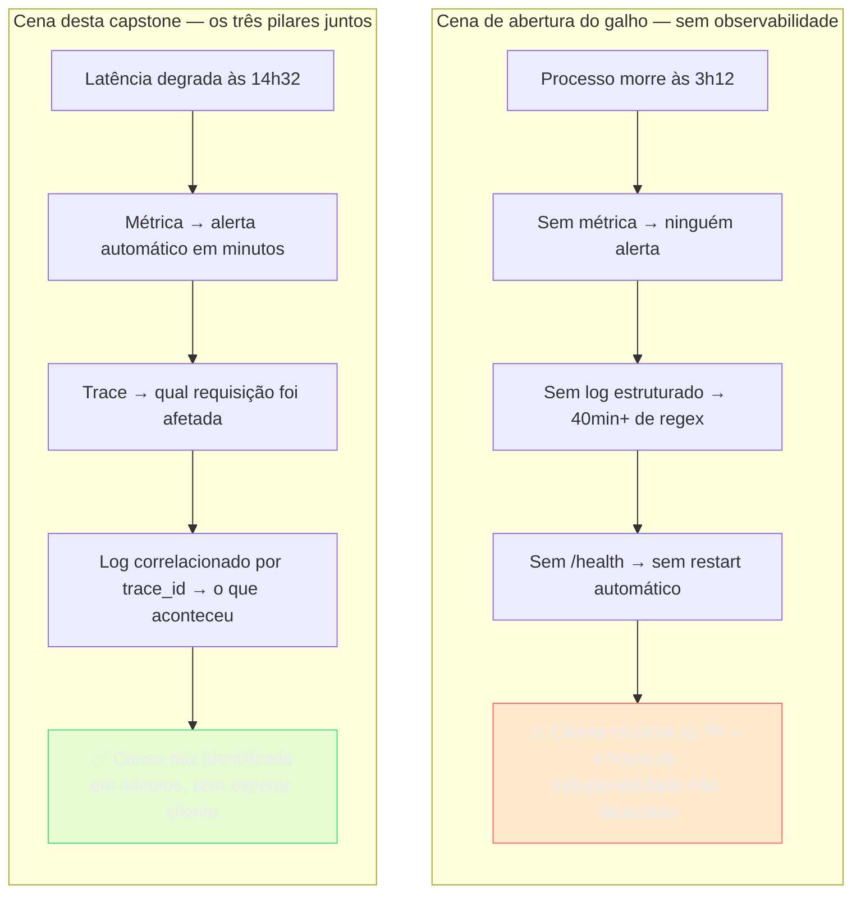
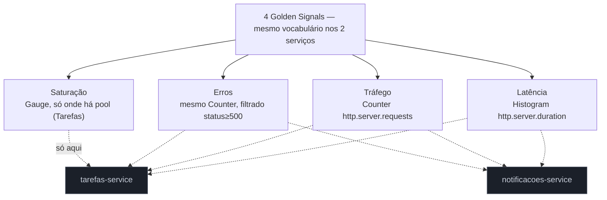
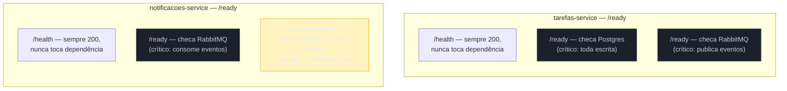
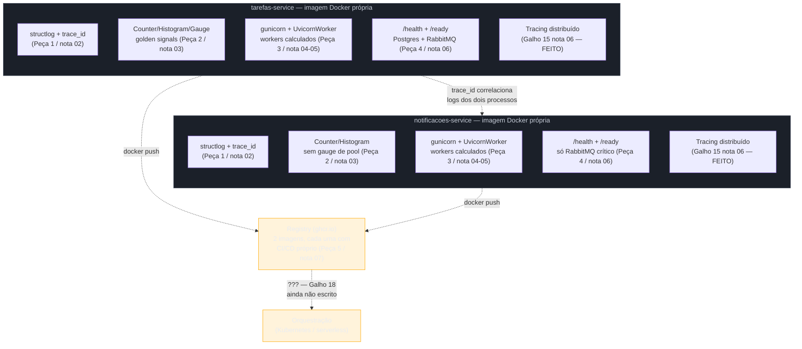
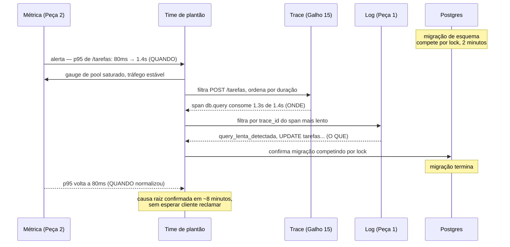

# Capstone — os dois serviços prontos pra produção

> [!abstract] TL;DR
> A [[03-Dominios/Tecnologia/Python/Build e tooling/08 - Capstone — tooling consistente nos dois serviços|capstone do Galho 16]] terminou com `tarefas-service` e `notificacoes-service` construídos com disciplina idêntica — mesmo `uv`, mesmo `ruff`, mesma versão de Python, mesmo `.pre-commit-config.yaml`. Mas "construído direito" e "pronto pra produção" são bares diferentes, e a [[01 - Panorama — o que falta pra produção de verdade|nota 01 deste galho]] abriu com a cena que prova a diferença: um processo que morreu às 3h da manhã, sem log estruturado, sem métrica, sem health check, sem ninguém sabendo por quatro horas. Esta capstone fecha o Galho 17 aplicando, aos mesmos dois serviços, tudo que faltava: **logging estruturado correlacionado por `trace_id`** ([[02 - Logging estruturado — structlog e correlação com trace|nota 02]]), **métricas dos 4 golden signals** ([[03 - Métricas com OpenTelemetry e Prometheus client|nota 03]]), um **servidor `gunicorn`+`uvicorn` configurado** com workers calculados e graceful shutdown ([[04 - WSGI vs ASGI na prática — gunicorn e uvicorn|nota 04]], [[05 - Configuração de servidor de produção — workers, timeouts e graceful shutdown|nota 05]]), **health checks** que distinguem liveness de readiness sem cascatear ([[06 - Health checks e probes|nota 06]]), e um **`Dockerfile` multi-stage com CI/CD** que só publica o que passou por teste ([[07 - Deploy básico — Dockerfile e CI-CD|nota 07]]). A síntese final é um cenário de incidente simulado — o banco de dados degrada por dois minutos — mostrando como os três pilares, juntos, transformam uma investigação que levaria horas numa que leva minutos. Fecha o galho e aponta para o [[03-Dominios/Tecnologia/Python/index|Galho 18 — Cloud-native e produção]]: os dois serviços agora têm imagem Docker e observabilidade completas, mas ainda não estão de fato orquestrados em lugar nenhum.

## A cena que fecha o galho: o mesmo incidente, seis meses depois

Volta à cena de abertura da [[01 - Panorama — o que falta pra produção de verdade|nota 01 deste galho]]: sexta-feira, 22h, os dois serviços rodando sem incidente havia semanas, até o serviço de Notificações parar de responder às 3h12 da manhã seguinte. Ninguém percebeu na hora — sem métrica, sem alerta. O primeiro sintoma chegou quatro horas depois, um cliente reclamando. Um processo `uvicorn` sozinho, sem supervisor, morto por uma exceção não tratada, sem log estruturado pra reconstruir o que aconteceu, sem endpoint que um orquestrador pudesse ter consultado pra reiniciá-lo sozinho.

Avança seis meses. Os dois serviços da trilha — Tarefas e Notificações — passaram pelas sete notas deste galho. Uma sexta-feira comum, 14h32, o time recebe um alerta automático: `p95 de latência em POST /tarefas subiu de 80ms pra 1.4s nos últimos três minutos`. Ninguém precisa esperar um cliente reclamar. Ninguém precisa abrir três milhões de linhas de log com uma regex frágil. O que acontece a partir daqui — e a diferença entre as duas cenas é exatamente o que esta capstone existe para provar — é o assunto da última seção desta nota. Antes de chegar lá, vale percorrer, peça por peça, o que mudou nos dois serviços entre a cena de abertura e a cena de agora.



> [!tip] Esta capstone não introduz nada novo — ela integra
> Vale nomear isso de saída, porque é fácil esperar uma capstone acrescentar mais um pedaço de teoria: nenhuma das sete peças a seguir traz um mecanismo que as notas 02 a 07 já não tenham construído em código real. O trabalho desta nota é diferente — é amarrar as sete peças **nos mesmos dois serviços**, mostrando onde cada uma entra no código de `tarefas-service` e `notificacoes-service`, e por que a soma das sete é maior do que qualquer uma isolada, exatamente como a cena de incidente do final desta nota demonstra.

## Peça 1 — logging estruturado correlacionado nos dois serviços (nota 02)

A [[02 - Logging estruturado — structlog e correlação com trace|nota 02 deste galho]] resolveu um problema muito concreto: `logger.info(f"Tarefa {id} criada")` produz uma frase, não um dado, e reconstruir "todos os eventos do usuário 42 numa janela de tempo" a partir de frases livres custa quarenta minutos de regex frágil. `structlog` trocou isso por um dicionário — `log.info("tarefa_criada", tarefa_id=..., usuario_id=...)` — e um processor customizado injeta o `trace_id` do span ativo em toda linha, lendo `trace.get_current_span()` via `contextvars`, sem exigir que nenhum código de negócio passe esse identificador manualmente.

Aplicado aos dois serviços da trilha, o `configurar_logging()` da nota 02 — o mesmo processor de correlação, o mesmo `JSONRenderer` em produção — entra uma vez no bootstrap de cada um:

```python
# tarefas-service/app/observabilidade.py
import logging
import os
import structlog
from opentelemetry import trace


def processor_trace_id(logger, method_name, event_dict):
    span = trace.get_current_span()
    ctx = span.get_span_context()
    if ctx.is_valid:
        event_dict["trace_id"] = format(ctx.trace_id, "032x")
        event_dict["span_id"] = format(ctx.span_id, "016x")
    return event_dict


def configurar_logging() -> None:
    ambiente = os.environ.get("AMBIENTE", "desenvolvimento")
    processors_comuns = [
        structlog.contextvars.merge_contextvars,
        processor_trace_id,
        structlog.processors.add_log_level,
        structlog.processors.TimeStamper(fmt="iso"),
    ]
    renderer = (
        structlog.processors.JSONRenderer()
        if ambiente == "producao"
        else structlog.dev.ConsoleRenderer(colors=True)
    )
    structlog.configure(
        processors=[*processors_comuns, renderer],
        wrapper_class=structlog.make_filtering_bound_logger(logging.INFO),
        logger_factory=structlog.PrintLoggerFactory(),
        cache_logger_on_first_use=True,
    )
```

```python
# notificacoes-service/app/observabilidade.py — MESMO arquivo, byte a byte
# (copiado do tarefas-service, sem adaptação — a função não depende
# de nada específico de domínio, só do trace_id que o Galho 15 nota 06
# já propaga igualmente nos dois serviços)
```

O detalhe que faz essa peça valer a pena **entre** dois serviços, não só dentro de um: como os dois compartilham o mesmo `service.name` distinto (`tarefas-service` e `notificacoes-service`, já configurados no `Resource` do Galho 15 nota 06) mas o **mesmo formato** de log e o **mesmo mecanismo** de correlação, uma requisição que atravessa os dois — o handler de `POST /tarefas` publicando um evento que o serviço de Notificações consome via RabbitMQ, o fluxo que o [[03-Dominios/Tecnologia/Python/Mensageria/index|Galho 14]] já construiu — produz logs em **dois processos diferentes, dois repositórios diferentes**, que carregam o mesmo `trace_id`. Filtrar por esse `trace_id` num agregador de logs mostra as linhas dos dois serviços juntas, na ordem em que aconteceram, sem precisar saber de antemão que a requisição cruzou uma fronteira de processo.

> [!question]- Por que o processor de correlação não amarra nada de negócio, se cada serviço loga campos diferentes?
> Porque a correlação e o vocabulário de negócio são eixos independentes, do mesmo jeito que a Peça 2 da [[03-Dominios/Tecnologia/Python/Build e tooling/08 - Capstone — tooling consistente nos dois serviços|capstone do Galho 16]] já separou "mesma estrutura de `pyproject.toml`" de "dependências diferentes por serviço". `tarefas-service` loga `log.info("tarefa_criada", tarefa_id=..., usuario_id=...)`; `notificacoes-service` loga `log.info("notificacao_enviada", canal="push", destinatario_id=...)` — eventos e campos completamente diferentes, porque os domínios são diferentes. O que os dois compartilham não é o vocabulário de negócio, é a **mecânica**: o mesmo processor `processor_trace_id`, o mesmo `JSONRenderer` em produção, o mesmo `ConsoleRenderer` em desenvolvimento. É exatamente a mesma distinção entre consistência de estrutura e liberdade de conteúdo que atravessou o galho anterior inteiro.

## Peça 2 — métricas dos 4 golden signals nos endpoints principais (nota 03)

A [[03 - Métricas com OpenTelemetry e Prometheus client|nota 03 deste galho]] instrumentou `POST /tarefas` com três instrumentos — um `Counter` de tráfego/erros, um `Histogram` de latência, um `Gauge` de saturação de pool — dentro de um bloco `finally`, garantindo que nenhuma requisição, sucesso ou exceção, escape de ser contada. Aplicado aos dois serviços, cada um instrumenta o **seu** endpoint principal, com o mesmo padrão de código, os mesmos nomes de métrica seguindo a convenção semântica do OpenTelemetry (`http.server.requests`, `http.server.duration`):

```python
# tarefas-service/app/main.py — endpoint principal do domínio
@app.post("/tarefas", status_code=201)
async def criar_tarefa(payload: TarefaCreate):
    inicio = time.perf_counter()
    status_code = 201
    conexoes_ativas.add(1, {"pool": "postgres-principal"})
    try:
        tarefa = await salvar_tarefa(payload)
        return tarefa
    except Exception:
        status_code = 500
        raise
    finally:
        duracao = time.perf_counter() - inicio
        conexoes_ativas.add(-1, {"pool": "postgres-principal"})
        atributos = {"http.method": "POST", "http.route": "/tarefas", "http.status_code": status_code}
        requisicoes_total.add(1, atributos)
        latencia_requisicao.record(duracao, {"http.method": "POST", "http.route": "/tarefas"})
```

```python
# notificacoes-service/app/main.py — mesmo padrão, endpoint diferente,
# sem gauge de pool de banco (este serviço não escreve em Postgres —
# ver a Peça 4 sobre por que o /ready dos dois serviços difere)
@app.post("/notificacoes", status_code=202)
async def enviar_notificacao(payload: NotificacaoCreate):
    inicio = time.perf_counter()
    status_code = 202
    try:
        await publicar_notificacao(payload)
        return {"status": "aceito"}
    except Exception:
        status_code = 500
        raise
    finally:
        duracao = time.perf_counter() - inicio
        atributos = {"http.method": "POST", "http.route": "/notificacoes", "http.status_code": status_code}
        requisicoes_total.add(1, atributos)
        latencia_requisicao.record(duracao, {"http.method": "POST", "http.route": "/notificacoes"})
```

A diferença entre os dois handlers é exatamente o que **deveria** diferir: `tarefas-service` tem um gauge de conexões de pool porque escreve em Postgres a cada requisição; `notificacoes-service` não instrumenta esse gauge porque não tem essa dependência — a mesma lógica que a Peça 2 da capstone do Galho 16 já aplicou ao `pyproject.toml` (`notificacoes-service` nunca declarou `sqlalchemy` como dependência, porque nunca usou). O que os dois **compartilham** é o esqueleto: `Counter` de tráfego/erro, `Histogram` de latência, sempre dentro de `finally`, sempre com os mesmos nomes de atributo (`http.method`, `http.route`, `http.status_code`) — o vocabulário comum que faz um dashboard olhando os dois serviços lado a lado fazer sentido sem tradução.



> [!warning] Copiar o handler instrumentado sem revisar as dependências reais do serviço
> O mesmo alerta que a Peça 2 da [[03-Dominios/Tecnologia/Python/Build e tooling/08 - Capstone — tooling consistente nos dois serviços|capstone do Galho 16]] já fez para `pyproject.toml` vale aqui: copiar o handler de `tarefas-service` inteiro para `notificacoes-service`, incluindo o gauge de pool de Postgres, instrumentaria uma métrica que nunca teria sinal real — o gauge ficaria sempre em zero, porque o serviço nunca abre esse pool. Uma métrica que nunca muda não é neutra, é ruído: ocupa espaço num dashboard, aparece numa busca por "métricas de saturação" sem nunca ser útil, e — pior — pode enganar alguém investigando um incidente a achar que aquele serviço depende de um pool de banco que ele nunca teve. Consistência de **padrão** de instrumentação (o esqueleto Counter/Histogram/finally) não é o mesmo que replicar toda métrica individual sem checar se ela faz sentido no domínio daquele serviço específico.

## Peça 3 — servidor `gunicorn`+`uvicorn` configurado, workers calculados (notas 04, 05)

A [[04 - WSGI vs ASGI na prática — gunicorn e uvicorn|nota 04]] resolveu por que `uvicorn app:app` sozinho usa um núcleo só, não importa quantos a máquina tenha, e por que `gunicorn -k uvicorn.workers.UvicornWorker -w N` — gerenciador de processos maduro por fora, executor ASGI de fato por dentro — é o combo padrão de produção. A [[05 - Configuração de servidor de produção — workers, timeouts e graceful shutdown|nota 05]] completou com os quatro ajustes que separam "combo rodando" de "combo configurado pra produção": timeout de worker, graceful shutdown, preload, restart periódico via `--max-requests`.

Aplicado aos dois serviços, cada um ganha seu próprio `gunicorn.conf.py`, calculando o número de workers a partir dos núcleos visíveis ao container — não hardcoded, para sobreviver a uma mudança de tamanho de instância sem precisar de rebuild:

```python
# tarefas-service/gunicorn.conf.py
import multiprocessing
import os

nucleos = multiprocessing.cpu_count()
workers_calculados = (2 * nucleos) + 1
workers = int(os.environ.get("WEB_CONCURRENCY", workers_calculados))

bind = "0.0.0.0:8000"
worker_class = "uvicorn.workers.UvicornWorker"
timeout = 30
graceful_timeout = 30  # menor que terminationGracePeriodSeconds do orquestrador, quando existir
preload_app = True
max_requests = 1000
max_requests_jitter = 100


def post_fork(server, worker):
    # pool de Postgres e conexão RabbitMQ abrem AQUI, depois do fork —
    # nunca no escopo de módulo que --preload carrega antes do fork
    server.log.info("Worker %s inicializado, abrindo pool de conexões...", worker.pid)
```

```python
# notificacoes-service/gunicorn.conf.py — mesma estrutura, mesmos
# valores de timeout/graceful_timeout/max_requests; post_fork abre
# só a conexão com o RabbitMQ, sem pool de Postgres (o serviço não tem)
import multiprocessing
import os

nucleos = multiprocessing.cpu_count()
workers_calculados = (2 * nucleos) + 1
workers = int(os.environ.get("WEB_CONCURRENCY", workers_calculados))

bind = "0.0.0.0:8000"
worker_class = "uvicorn.workers.UvicornWorker"
timeout = 30
graceful_timeout = 30
preload_app = True
max_requests = 1000
max_requests_jitter = 100


def post_fork(server, worker):
    server.log.info("Worker %s inicializado, abrindo conexão RabbitMQ...", worker.pid)
```

Vale nomear o motivo de calibrar `timeout`/`graceful_timeout`/`max_requests` com os **mesmos** valores nos dois serviços, mesmo que o tráfego real de cada um seja diferente: assim como a Peça 4 da capstone do Galho 16 defendeu o mesmo `line-length` de `ruff` nos dois — não porque 100 seja objetivamente melhor, mas porque a mesma escolha reduz atrito de revisão cross-time — a mesma lógica social se aplica aqui. Um `graceful_timeout` de 30s em `tarefas-service` e de 5s em `notificacoes-service`, sem justificativa de workload real, é o tipo de divergência que só aparece meses depois, quando alguém do time de Tarefas debuga um deploy de Notificações e se surpreende com um comportamento que "deveria" ser igual. Onde os workloads de fato diferem de forma mensurável — e é legítimo que difiram — o valor muda com justificativa explícita, calibrado pelo p99 real medido nas métricas da Peça 2, não copiado por hábito nem divergido por acidente.

> [!tip] O gauge de saturação da Peça 2 e o `post_fork` desta peça se encontram
> Vale notar a costura entre as Peças 2 e 3: o `post_fork` de `tarefas-service` é exatamente onde o pool de conexões que alimenta o `Gauge` `db.client.connections.usage` da nota 03 é aberto — depois do fork, uma vez por worker, nunca no escopo de módulo que `preload_app = True` carregaria antes do fork (o mesmo cuidado que o `[!warning]` da nota 05 sobre `--preload` e recursos de rede já detalhou). Instrumentar a métrica certa e abrir a conexão no momento certo do ciclo de vida do processo não são peças isoladas — uma sem a outra produz um gauge que nunca reflete a realidade, ou um pool que vaza entre workers via copy-on-write indevido.

## Peça 4 — health checks assimétricos, sem cascata (nota 06)

A [[06 - Health checks e probes|nota 06 deste galho]] estabeleceu a distinção central: `/health` (liveness) nunca toca dependência externa, porque sua falha é destrutiva — mata e recria o processo; `/ready` (readiness) checa só as dependências **críticas**, porque sua falha é reversível — só tira o pod da rotação de tráfego. A nota também nomeou a armadilha específica que esta capstone precisa evitar de propósito: um `/ready` que agrega dependências demais vira, ele mesmo, um ponto único de falha em cascata.

`tarefas-service` depende, de forma crítica, de duas coisas — o banco de dados (toda escrita passa por ele) e o RabbitMQ (a publicação de eventos de domínio que o [[03-Dominios/Tecnologia/Python/Mensageria/index|Galho 14]] já construiu depende dele). O `/ready` desse serviço, então, checa exatamente essas duas:

```python
# tarefas-service/app/main.py
@app.get("/health")
async def liveness():
    return {"status": "ok"}


@app.get("/ready")
async def readiness(response: Response):
    checks = {}
    try:
        async with app.state.db_pool.acquire() as conn:
            await conn.execute("SELECT 1")
        checks["database"] = "ok"
    except Exception as exc:
        checks["database"] = f"erro: {exc}"

    try:
        if app.state.rabbitmq_connection.is_closed:
            raise RuntimeError("conexão RabbitMQ fechada")
        checks["rabbitmq"] = "ok"
    except Exception as exc:
        checks["rabbitmq"] = f"erro: {exc}"

    todos_ok = all(v == "ok" for v in checks.values())
    if not todos_ok:
        response.status_code = status.HTTP_503_SERVICE_UNAVAILABLE
    return {"status": "ok" if todos_ok else "unavailable", "checks": checks}
```

`notificacoes-service`, em contraste, **não** tem pool de Postgres — o serviço lê e escreve pouquíssimo estado próprio, e sua dependência crítica de verdade é só a conexão com o RabbitMQ (de onde consome eventos de domínio publicados por Tarefas) e, dependendo da arquitetura, o cliente HTTP usado para chamar provedores externos de push/e-mail via circuit breaker (o padrão já coberto no Galho 15). Copiar o `/ready` de `tarefas-service` inteiro para `notificacoes-service` — checando um `db_pool` que este serviço nunca abre — não é só código morto: é um `/ready` que falharia sempre, com um `AttributeError` ao tentar acessar `app.state.db_pool` inexistente, derrubando **100% da capacidade** de Notificações por um bug de copiar-e-colar, exatamente a armadilha de cascata que a nota 06 já nomeou, só que causada por consistência aplicada sem pensar, em vez de causada por checar dependências demais.

```python
# notificacoes-service/app/main.py — /ready DIFERENTE, refletindo
# as dependências reais deste serviço, não uma cópia do outro
@app.get("/health")
async def liveness():
    return {"status": "ok"}


@app.get("/ready")
async def readiness(response: Response):
    checks = {}
    try:
        if app.state.rabbitmq_connection.is_closed:
            raise RuntimeError("conexão RabbitMQ fechada")
        checks["rabbitmq"] = "ok"
    except Exception as exc:
        checks["rabbitmq"] = f"erro: {exc}"

    # provedor de push mobile: dependência DEGRADÁVEL, não crítica —
    # se ele estiver fora do ar, o serviço ainda consegue enfileirar
    # e tentar de novo depois (retry + circuit breaker do Galho 15);
    # por isso NÃO entra no /ready, só vira log/métrica de erro
    todos_ok = all(v == "ok" for v in checks.values())
    if not todos_ok:
        response.status_code = status.HTTP_503_SERVICE_UNAVAILABLE
    return {"status": "ok" if todos_ok else "unavailable", "checks": checks}
```



> [!question]- Isso não contradiz a consistência que as outras peças defendem?
> Não, e é o mesmo padrão que já apareceu nas Peças 1 e 2 desta capstone: consistência de **estrutura** (os dois serviços expõem `/health` burro e `/ready` inteligente, com a mesma semântica de status HTTP, o mesmo `503` em caso de falha) não é consistência de **conteúdo** (quais dependências específicas cada `/ready` verifica). A [[06 - Health checks e probes|nota 06 deste galho]] já deixou isso implícito ao distinguir dependência crítica de dependência degradável — o que esta capstone faz é nomear explicitamente que essa distinção **muda entre serviços do mesmo domínio**, porque cada um tem um grafo de dependência real diferente. Forçar os dois `/ready` a serem idênticos byte a byte, do jeito que a Peça 4 da capstone do Galho 16 defendeu para `ruff`, seria aplicar a lição errada de propósito errado — ali a consistência importava porque o conteúdo (regras de lint) não tem relação com o domínio de cada serviço; aqui o conteúdo do `/ready` **é** o domínio de cada serviço, por definição.

## Peça 5 — Dockerfile multi-stage e CI/CD, cada serviço com sua imagem (nota 07)

A [[07 - Deploy básico — Dockerfile e CI-CD|nota 07 deste galho]] reduziu a imagem ingênua de `notificacoes-service`, de 1.2 GB para 180 MB, via multi-stage build — um estágio `builder` com compilador e `uv`, descartado por completo; um estágio final que só recebe, via `COPY --from=builder`, o `.venv/` já resolvido e o código-fonte, rodando como usuário não-root. Aplicado aos dois serviços, cada um ganha seu próprio `Dockerfile`, reusando exatamente a mesma estrutura de dois estágios, com o mesmo `.dockerignore` — a mesma disciplina de tooling consistente que a capstone do Galho 16 já cravou para `pyproject.toml`/`ruff`, agora estendida ao artefato de deploy:

```dockerfile
# tarefas-service/Dockerfile
# syntax=docker/dockerfile:1
FROM python:3.12-slim AS builder
COPY --from=ghcr.io/astral-sh/uv:latest /uv /uvx /bin/
WORKDIR /app
COPY pyproject.toml uv.lock ./
RUN uv sync --frozen --no-dev
COPY app/ ./app/

FROM python:3.12-slim
RUN groupadd --gid 1000 appuser \
    && useradd --uid 1000 --gid appuser --shell /bin/false --no-create-home appuser
WORKDIR /app
COPY --from=builder --chown=appuser:appuser /app/.venv /app/.venv
COPY --from=builder --chown=appuser:appuser /app/app /app/app
COPY --chown=appuser:appuser gunicorn.conf.py ./
ENV PATH="/app/.venv/bin:$PATH"
USER appuser
EXPOSE 8000
CMD ["gunicorn", "app.main:app", "-c", "gunicorn.conf.py"]
```

```dockerfile
# notificacoes-service/Dockerfile — IDÊNTICO estrutura a estrutura,
# nome de imagem e dependências diferentes (herdadas do pyproject.toml
# próprio de cada serviço, como a capstone do Galho 16 já mostrou)
```

E dois pipelines separados — um por repositório, cada serviço deployado no próprio ritmo, a mesma decisão estrutural (repositórios independentes, não um monorepo) que a Peça 6 da capstone do Galho 16 já justificou:

```yaml
# .github/workflows/deploy.yml — IDÊNTICO nos dois repositórios,
# salvo o nome da imagem publicada (tarefas / notificacoes)
name: build-test-deploy
on:
  push:
    branches: [main]

jobs:
  test:
    runs-on: ubuntu-latest
    steps:
      - uses: actions/checkout@v4
      - uses: astral-sh/setup-uv@v3
      - run: uv sync --frozen
      - run: uv run ruff check .
      - run: uv run pytest

  build-and-push:
    needs: test
    runs-on: ubuntu-latest
    steps:
      - uses: actions/checkout@v4
      - uses: docker/login-action@v3
        with:
          registry: ghcr.io
          username: ${{ github.actor }}
          password: ${{ secrets.GITHUB_TOKEN }}
      - uses: docker/build-push-action@v6
        with:
          context: .
          push: true
          tags: ghcr.io/org/tarefas:${{ github.sha }}
          cache-from: type=gha
          cache-to: type=gha,mode=max
```

O ponto que fecha esta peça: cada imagem, de cada serviço, é o artefato final que carrega **todas** as quatro peças anteriores dentro de si — o `configurar_logging()` da Peça 1, os instrumentos de métrica da Peça 2, o `gunicorn.conf.py` da Peça 3, os endpoints `/health`/`/ready` da Peça 4 — tudo empacotado, testado antes de existir (a seta vermelha do diagrama da nota 07: se `ruff check` ou `pytest` falharem, a imagem nunca é construída), publicado de forma rastreável pela tag `github.sha`.

## O estado final: dois serviços, observabilidade completa, ainda sem orquestração

Juntando as cinco peças, o diagrama que resume o que esta capstone entrega:



O diagrama deixa a fronteira explícita: os dois serviços têm, cada um, os três pilares de observabilidade completos e um artefato Docker publicável — mas o retângulo "Orquestração" continua vazio, um ponto de interrogação deliberado. É exatamente aí que este galho para, e onde o [[03-Dominios/Tecnologia/Python/index|Galho 18]] começa.

## Síntese: um incidente simulado, os três pilares juntos

Volta à cena do início desta nota — sexta-feira, 14h32, o alerta de `p95` de `POST /tarefas` subindo de 80ms para 1.4s. A causa raiz, injetada de propósito neste cenário simulado: o banco de dados principal degrada por dois minutos — uma migração de esquema rodando em produção, competindo por lock numa tabela quente, o tipo de degradação temporária e real que acontece em qualquer operação madura. O que seguem são os passos reais de diagnóstico, cada um usando exatamente uma das peças construídas neste galho — não uma sequência hipotética, mas o fluxo que a instrumentação desta capstone torna possível.

**Minuto 0 — a métrica dispara o alerta.** O `Histogram` `http.server.duration` da Peça 2, coletado continuamente desde que o serviço subiu, alimenta a mesma consulta PromQL que a nota 03 já mostrou: `histogram_quantile(0.95, rate(http_server_duration_seconds_bucket{route="/tarefas"}[5m]))`. O alerta configurado sobre essa expressão — "avisar se p95 > 300ms por mais de 1 minuto" — dispara automaticamente, sem esperar um cliente reclamar. É o mesmo mecanismo que faltou por completo no incidente de abertura da nota 01: **a métrica responde "quando" a degradação começou**, com um timestamp exato, não uma frase vaga de suporte tipo "está lento faz uns dias".

**Minuto 1 — o gauge de saturação confirma onde o gargalo está.** Junto do alerta de latência, o `Gauge` `db.client.connections.usage` da mesma Peça 2 mostra o pool de conexões de `tarefas-service` saturado, perto do limite configurado — não porque o serviço está recebendo mais tráfego que o normal (o `Counter` de tráfego mostra volume estável), mas porque cada conexão está demorando mais para devolver a conexão ao pool, um sintoma clássico de contenção no lado do banco, não no lado da aplicação. Duas métricas, lidas juntas, já apontam a hipótese mais provável antes de qualquer log ser aberto.

**Minuto 3 — o trace mostra qual requisição foi afetada, e onde.** Alguém do time abre o backend de tracing (Jaeger, Grafana Tempo — o destino que o [[03-Dominios/Tecnologia/Python/Microservices e sistemas distribuídos/06 - Tracing distribuído com OpenTelemetry|Galho 15 nota 06]] já configurou) e filtra spans de `POST /tarefas` na janela dos últimos cinco minutos, ordenados por duração. O span mais lento mostra a anatomia interna da requisição: um span filho chamado `db.query` — a chamada ao Postgres — consumindo 1.3 dos 1.4 segundos totais, contra os 40ms que esse mesmo span leva em condições normais. O trace não diz **por que** a query está lenta — só mostra, com precisão cirúrgica, **onde** dentro da requisição o tempo está sendo gasto: não é serialização Pydantic, não é uma chamada HTTP a Notificações, é especificamente a query ao banco.

**Minuto 5 — o log correlacionado por `trace_id` mostra o que aconteceu.** Com o `trace_id` daquele span específico copiado do backend de tracing, o time filtra o agregador de logs — o mesmo padrão que a nota 02 já descreveu, sem regex, sem cruzar formatos de mensagem diferentes entre serviços — e encontra a linha estruturada exata daquela requisição, emitida pelo processor `processor_trace_id` da Peça 1:

```json
{"event": "query_lenta_detectada", "tarefa_id": 8842, "duracao_ms": 1310, "query": "UPDATE tarefas SET status=$1 WHERE usuario_id=$2", "trace_id": "a1b2c3...", "level": "warning", "logger": "app.tarefas.db"}
```

O log estruturado, correlacionado pelo mesmo `trace_id` que o trace já isolou, mostra **o que exatamente** aconteceu naquela requisição específica: qual query, qual `tarefa_id`, quanto tempo — o detalhe textual que nenhum dos outros dois pilares carrega sozinho. Cruzando esse log com o horário do alerta de métrica (minuto 0) e o gauge de saturação (minuto 1), a hipótese de contenção no banco vira certeza: alguém confirma, num painel de administração do banco, que uma migração de esquema estava de fato rodando naquele intervalo exato, competindo por lock com a mesma tabela `tarefas`.

**Minuto 8 — a métrica confirma quando a degradação normalizou.** A migração termina; o mesmo `Histogram` de latência, na mesma consulta PromQL, mostra o p95 voltando a 80ms dentro de segundos — sem precisar de nenhuma ação manual do time além de confirmar que o sintoma desapareceu. É a mesma pergunta que abriu a [[03 - Métricas com OpenTelemetry e Prometheus client|nota 03 deste galho]] — "isso é normal ou não, sem esperar alguém reclamar" — respondida duas vezes na mesma investigação: uma vez para detectar o início, outra para confirmar o fim.



O contraste com a cena de abertura da [[01 - Panorama — o que falta pra produção de verdade|nota 01 deste galho]] é o argumento inteiro deste galho, resumido num número: quatro horas de indisponibilidade não detectada, seguidas de quarenta minutos de investigação manual sobre logs de texto livre, viram oito minutos de investigação guiada por dado — e o alerta dispara antes de qualquer cliente perceber, não depois de uma reclamação chegar no suporte. Nenhum dos três pilares, sozinho, chega a esse resultado: a métrica sabe **quando**, mas não sabe **onde** dentro da requisição nem **o que** aconteceu de fato; o trace sabe **onde**, mas não carrega o detalhe textual de uma query específica; o log sabe **o que**, mas sem o `trace_id` copiado do trace, ninguém saberia qual das milhares de linhas daquele minuto pertence à requisição certa. É exatamente a mesma lição que a nota 03 já nomeou de forma abstrata — "ter um pilar excelente não substitui os outros dois" — agora demonstrada com um incidente de ponta a ponta, nos mesmos dois serviços que a trilha inteira construiu.

> [!warning] Nenhuma dessas cinco peças, sozinha, teria resolvido este incidente em oito minutos
> Vale nomear explicitamente o que cada peça, isolada, **não** teria feito: só métrica (sem trace nem log) teria dito "algo degradou às 14h32", sem apontar onde nem por quê — o time ainda precisaria adivinhar a causa. Só trace (sem métrica) exigiria abrir o backend de tracing manualmente, sem saber quando procurar, porque não existe alerta automático baseado só em spans individuais amostrados. Só log (sem trace nem métrica) volta exatamente ao problema que abriu a nota 02 desta galho — quarenta minutos de regex, sem sequer saber que horário procurar. A velocidade do diagnóstico desta síntese não vem de nenhuma peça isolada — vem da composição das cinco, cada uma cobrindo exatamente o ponto cego que as outras deixam.

## O que esta capstone fecha, e o que abre

Esta nota fecha o Galho 17 inteiro. A [[01 - Panorama — o que falta pra produção de verdade|nota 01]] abriu o galho com a cena que provou a lacuna — dois serviços com código correto, arquitetura correta, tooling consistente do Galho 16, mas nenhuma visibilidade de produção. As notas [[02 - Logging estruturado — structlog e correlação com trace|02]] e [[03 - Métricas com OpenTelemetry e Prometheus client|03]] completaram os dois pilares de observabilidade que faltavam, já que o terceiro — tracing — tinha vindo pronto do [[03-Dominios/Tecnologia/Python/Microservices e sistemas distribuídos/06 - Tracing distribuído com OpenTelemetry|Galho 15]]. As notas [[04 - WSGI vs ASGI na prática — gunicorn e uvicorn|04]] e [[05 - Configuração de servidor de produção — workers, timeouts e graceful shutdown|05]] transformaram `uvicorn --reload` de desenvolvimento num servidor de produção de verdade, com paralelismo real entre núcleos e um ciclo de vida de processo que sobrevive a deploy sem cortar requisição no meio. A nota [[06 - Health checks e probes|06]] deu ao orquestrador — quando ele existir — o contrato para distinguir "reiniciar" de "só pausar tráfego". A nota [[07 - Deploy básico — Dockerfile e CI-CD|07]] empacotou tudo isso num artefato reproduzível, testado antes de existir. Esta capstone não introduziu nenhum mecanismo novo — pegou as cinco peças e mostrou, nos mesmos dois serviços da trilha, com um incidente simulado de ponta a ponta, o motivo real de construir todas: nenhuma, isolada, teria diagnosticado a degradação de banco em oito minutos.

O que fica de fora, deliberadamente, e aponta para o próximo galho: os dois serviços agora têm uma imagem Docker publicável e observabilidade completa — mas ninguém, ainda, decidiu **onde** essas imagens rodam de fato. Quantas réplicas, atrás de qual load balancer, com qual estratégia de rollout (blue-green, canary), como o `livenessProbe`/`readinessProbe` da nota 06 se traduz num manifest de verdade, como um autoscaler decide quando subir mais réplicas usando as métricas de saturação da nota 03 como sinal. Essa é exatamente a lacuna que o [[03-Dominios/Tecnologia/Python/index|Galho 18 — Cloud-native e produção]] cobre: agora que o código Python controla tudo que estava sob seu controle — logs, métricas, servidor, health checks, artefato — o próximo passo é a infraestrutura que consome esse contrato e de fato coloca as réplicas no ar, seja via Kubernetes, seja via uma plataforma serverless.

> [!tip] O padrão desta capstone — cinco peças, um incidente de prova — se repete em qualquer serviço que chega em produção pela primeira vez
> Nada nesta capstone é específico de `tarefas-service`/`notificacoes-service` — é o mesmo checklist que qualquer serviço Python precisa passar antes de receber tráfego real: log estruturado correlacionável, métrica dos golden signals, servidor configurado com paralelismo e graceful shutdown, health check que distingue liveness de readiness sem cascatear, artefato reproduzível testado antes de publicar. O cenário de incidente simulado desta nota não é um exercício acadêmico — é o teste que de fato importa: se um time não consegue reconstruir "quando, onde e o que aconteceu" numa degradação simulada como esta, alguma das cinco peças ainda está faltando, não importa quão elegante o resto do código seja.

## Em entrevista

Uma pergunta clássica de entrevista sênior é "conte sobre um incidente de produção que você diagnosticou" — e a resposta fraca descreve só a causa raiz técnica, sem mencionar como ela foi encontrada. A resposta forte narra o processo de diagnóstico nomeando explicitamente os três pilares e o papel de cada um — métrica apontando quando, trace apontando onde dentro da requisição, log correlacionado por `trace_id` mostrando o detalhe exato — e sabe explicar por que nenhum dos três, sozinho, teria bastado. É exatamente a estrutura da síntese desta capstone, e é o tipo de resposta que separa "eu sei que existem três pilares de observabilidade" (definição) de "eu já usei os três juntos pra resolver um incidente real" (experiência aplicada).

## How to explain in English

> "Being 'built correctly' and being 'production-ready' are different bars, and the gap between them only becomes visible when something breaks at 3 a.m. with nobody watching. This capstone applies structured logging correlated by `trace_id`, the four golden signals as real metrics, a properly configured `gunicorn`+`uvicorn` server with calculated workers and graceful shutdown, health checks that distinguish liveness from readiness without cascading, and a multi-stage Docker image with a CI/CD gate — to two real services, each with its own repository and its own deploy cadence. The proof that all five pieces matter together, not in isolation, is a simulated incident: a database slowdown that a metric alert catches within a minute, a trace that pinpoints exactly which span inside the request is slow, and a log line — correlated by the same `trace_id` the trace already isolated — that shows the exact query and the exact record involved. Metrics answer *when*; traces answer *where*; logs answer *what*. None of the three alone gets you from alert to root cause in eight minutes — the composition does. What's still missing, deliberately, is where these two Docker images actually run: replica count, rollout strategy, autoscaling — that's infrastructure orchestration, the next chapter, not application code."

| PT | EN |
|----|----|
| Pronto pra produção | Production-ready |
| Log correlacionado por trace_id | Trace-correlated logging |
| Sinais de ouro | Golden signals |
| Servidor configurado | Configured server |
| Health check sem cascata | Non-cascading health check |
| Artefato reproduzível | Reproducible artifact |
| Incidente simulado | Simulated incident |
| Causa raiz | Root cause |
| Diagnóstico guiado por dado | Data-driven diagnosis |

## Fontes

- Este galho — [[01 - Panorama — o que falta pra produção de verdade]], [[02 - Logging estruturado — structlog e correlação com trace]], [[03 - Métricas com OpenTelemetry e Prometheus client]], [[04 - WSGI vs ASGI na prática — gunicorn e uvicorn]], [[05 - Configuração de servidor de produção — workers, timeouts e graceful shutdown]], [[06 - Health checks e probes]], [[07 - Deploy básico — Dockerfile e CI-CD]] — base factual completa desta capstone.
- [[03-Dominios/Tecnologia/Python/Build e tooling/08 - Capstone — tooling consistente nos dois serviços|Capstone do Galho 16]] — estado dos dois serviços antes desta capstone: tooling consistente, ainda sem observabilidade nem servidor de produção configurado.
- [[03-Dominios/Tecnologia/Python/Microservices e sistemas distribuídos/06 - Tracing distribuído com OpenTelemetry|Galho 15 nota 06 — Tracing distribuído com OpenTelemetry]] — o terceiro pilar, já pronto antes deste galho, reusado sem reconstrução na síntese do incidente simulado.
- [[03-Dominios/Engenharia/Operação/4 - Observar e responder/01 - Observabilidade como prática|Observabilidade como prática]] — Engenharia/Operação — a distinção entre monitoring e observability, e os três pilares na teoria, aplicados em código nesta capstone.
- Google. *Site Reliability Engineering — Monitoring Distributed Systems* (os 4 golden signals). sre.google. https://sre.google/sre-book/monitoring-distributed-systems/ (acessado em 2026-07-12).
- OpenTelemetry. *What is OpenTelemetry?*. opentelemetry.io. https://opentelemetry.io/docs/what-is-opentelemetry/ (acessado em 2026-07-12) — os três sinais sob um SDK único, a base que amarra logs, métricas e traces nesta capstone.

Consultado em 2026-07-12.
