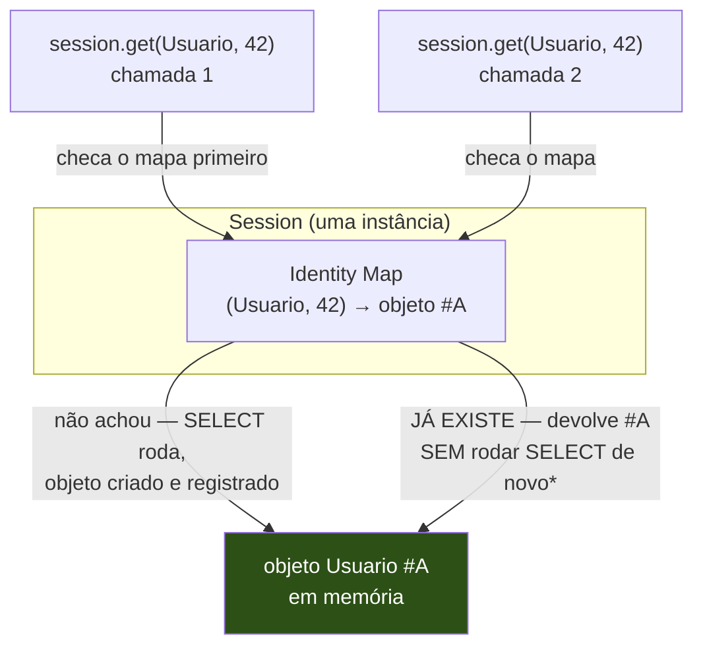
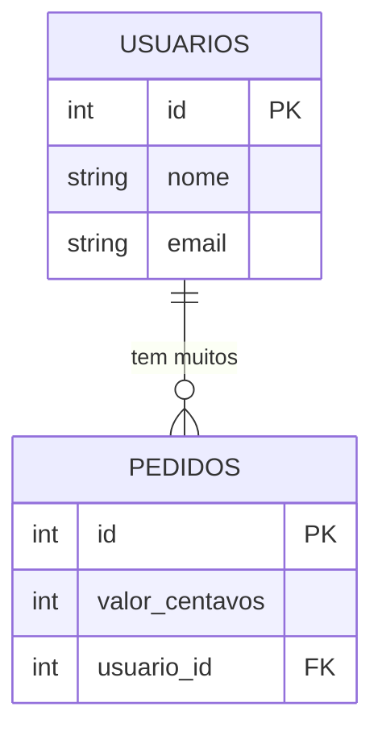
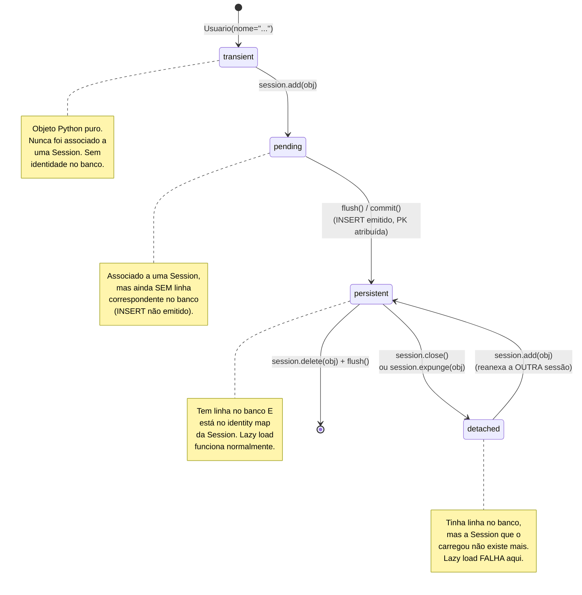

# SQLAlchemy ORM — Session, mapped classes e relationships

> [!abstract] TL;DR
> O ORM do SQLAlchemy mapeia classes Python para tabelas via `DeclarativeBase` e `Mapped[]`/`mapped_column()` (estilo 2.0, totalmente tipado). A peça central de tudo é a `Session`: ela é ao mesmo tempo uma **Unit of Work** (acumula mudanças em memória e só emite SQL quando manda, tipicamente no `commit()`) e um **Identity Map** (uma tabela hash interna `(classe, chave primária) → objeto Python` que garante que duas buscas pelo mesmo registro, na mesma sessão, retornem o **mesmo objeto** — não uma cópia, o mesmo `id()` em memória). Essa mesma estrutura interna é o motivo pelo qual `Session` **não é thread-safe**: duas threads escrevendo no identity map ao mesmo tempo corrompem o estado, então a regra é uma `Session` por thread ou por request, nunca compartilhada — o paralelo direto é o mesmo problema de estado mutável compartilhado sem lock, visto em [[03-Dominios/Tecnologia/Python/Concorrência e paralelismo/01 - Threading na prática — Thread, Lock e condições de corrida|threading]], só que aqui a resposta certa não é "adicionar um lock", é "não compartilhar a sessão". `relationship()` declara como classes mapeadas se relacionam (`one-to-many`, `many-to-many` via tabela de associação) e por padrão carrega dados **preguiçosamente** (lazy load) — o que só funciona enquanto o objeto está anexado a uma `Session` viva. Um objeto mapeado atravessa quatro estados — `transient` → `pending` → `persistent` → `detached` — e acessar um atributo lazy num objeto `detached` (fora da sessão que o carregou) levanta `DetachedInstanceError`: não é mágica quebrada, é a Session avisando que não tem mais como buscar o dado que falta.

## O bug que abre esta nota

Um desenvolvedor está construindo uma API com FastAPI e SQLAlchemy. O padrão que ele escreve parece razoável à primeira vista: uma função de repositório abre uma sessão, busca um `Usuario`, fecha a sessão, e devolve o objeto pra camada de cima serializar como JSON.

```python
from sqlalchemy.orm import Session

def buscar_usuario(id_usuario: int) -> "Usuario":
    with Session(engine) as session:
        usuario = session.get(Usuario, id_usuario)
        return usuario   # a sessão fecha ao sair do `with`, ANTES do return ser usado

# em outro lugar do código:
usuario = buscar_usuario(42)
print(usuario.nome)                 # funciona — nome já foi carregado no SELECT inicial
print(usuario.pedidos)              # 💥 sqlalchemy.orm.exc.DetachedInstanceError
```

O erro completo é sucinto e, para quem não conhece o mecanismo por trás, completamente opaco:

```
sqlalchemy.orm.exc.DetachedInstanceError: Instance <Usuario at 0x7f2a1c0d5a90>
is not bound to a Session; attribute refresh operation cannot proceed
```

`usuario.nome` funcionou sem problema — o valor já estava carregado em memória desde o `SELECT` original. `usuario.pedidos` (uma `relationship()` que aponta para os pedidos daquele usuário) explodiu, porque **nunca foi carregado**: por padrão, `relationship()` usa *lazy loading* — o SQLAlchemy só dispara o `SELECT` da relação quando o atributo é acessado pela primeira vez, e esse `SELECT` precisa de uma `Session` ativa e conectada para acontecer. Como a sessão já fechou (`with` terminou antes do `.pedidos` ser tocado), o objeto virou **detached** — ainda existe em memória, ainda tem o `nome` que já foi carregado, mas perdeu a capacidade de buscar qualquer coisa que faltava.

> [!bug] O que está quebrado, em uma frase
> `relationship()` é lazy por padrão — ela só busca dados quando você acessa o atributo, e essa busca depende de uma `Session` viva; se a sessão já fechou, o objeto vira `detached` e qualquer atributo ainda não carregado levanta `DetachedInstanceError` em vez de simplesmente devolver o valor.

Esse é, de longe, o erro mais reportado por quem está aprendendo SQLAlchemy — e entender por que ele acontece exige entender três coisas que esta nota constrói em ordem: como uma classe vira uma tabela (mapeamento), o que a `Session` realmente é por baixo (Unit of Work + Identity Map), e o ciclo de vida completo que um objeto mapeado atravessa entre nascer em Python e ser persistido no banco.

## Pré-requisito: esta nota constrói em cima do Core

Esta nota assume [[01 - SQLAlchemy Core — Engine, Connection e expressão SQL|a nota anterior]] como lida — `Engine`, `Connection` e a linguagem de expressão SQL (`select`/`insert`/`Table`/`MetaData`) não são reexplicados aqui. O ponto que importa reter: **o ORM não substitui o Core, ele é construído em cima dele**. Toda `Session` do ORM, por baixo, adquire uma `Connection` do mesmo `Engine` que o Core usa, e todo `session.execute(select(Usuario))` eventualmente vira o mesmo tipo de `SELECT` compilado que a nota anterior gerou manualmente com `Table`/`select()`. A diferença é o que acontece **em volta** desse SQL: o ORM adiciona mapeamento objeto-relacional, rastreamento de mudanças e um cache de identidade — as três coisas que esta nota cobre.

## `DeclarativeBase` e mapped classes: como uma classe vira uma tabela

No estilo SQLAlchemy 2.0 (a API atual, recomendada desde a versão 2.0 lançada em 2023), o mapeamento entre classe Python e tabela de banco é declarado com `DeclarativeBase` como classe-base e `Mapped[]`/`mapped_column()` para cada atributo — uma sintaxe que se apoia inteiramente em type hints, o mesmo mecanismo visto em [[03-Dominios/Tecnologia/Python/Tipagem moderna/01 - Type hints — fundamentos e gradual typing|Galho 5, tipagem moderna]], só que aqui os hints não são só documentação estática: `Mapped[str]` e `Mapped[int]` são lidos pelo SQLAlchemy em tempo de definição de classe para inferir o tipo de coluna, e por checadores estáticos (mypy/pyright) pra dar autocomplete e checagem real nos atributos do modelo.

```python
from datetime import datetime
from sqlalchemy import String, ForeignKey
from sqlalchemy.orm import DeclarativeBase, Mapped, mapped_column, relationship


class Base(DeclarativeBase):
    """Classe-base de todos os modelos mapeados desta aplicação."""
    pass


class Usuario(Base):
    __tablename__ = "usuarios"

    id: Mapped[int] = mapped_column(primary_key=True)
    nome: Mapped[str] = mapped_column(String(120))
    email: Mapped[str] = mapped_column(String(255), unique=True)
    criado_em: Mapped[datetime] = mapped_column(default=datetime.utcnow)

    # relationship — coberta em detalhe na próxima seção
    pedidos: Mapped[list["Pedido"]] = relationship(back_populates="usuario")


class Pedido(Base):
    __tablename__ = "pedidos"

    id: Mapped[int] = mapped_column(primary_key=True)
    valor_centavos: Mapped[int] = mapped_column()
    usuario_id: Mapped[int] = mapped_column(ForeignKey("usuarios.id"))

    usuario: Mapped["Usuario"] = relationship(back_populates="pedidos")
```

Alguns pontos que vale destrinchar linha a linha:

- **`class Base(DeclarativeBase): pass`** — toda classe mapeada da aplicação herda dessa base compartilhada. É essa herança que registra a classe no *registry* interno do SQLAlchemy (mapeando `Usuario` ↔ tabela `usuarios`) e que dá acesso a `Base.metadata`, o mesmo `MetaData` visto no Core — `Base.metadata.create_all(engine)` cria todas as tabelas registradas de uma vez, útil em testes e protótipos (em produção, isso é papel do Alembic, coberto na próxima nota do galho).
- **`Mapped[int]`** — o tipo Python do atributo depois que o objeto é carregado. `Mapped[str]` vira `NOT NULL VARCHAR` por padrão; `Mapped[str | None]` (ou `Optional[str]`, ver [[03-Dominios/Tecnologia/Python/Tipagem moderna/02 - Union, Optional e o operador |-|Galho 5 nota 02]]) vira uma coluna que aceita `NULL` — a nulabilidade da coluna é **inferida do type hint**, não precisa ser redeclarada manualmente com `nullable=True/False` na maioria dos casos.
- **`mapped_column()`** — onde vive o detalhe específico do banco que o type hint sozinho não carrega: tamanho de `String`, `unique=True`, valor `default`, e (como visto abaixo) `primary_key=True`. Pense em `Mapped[X]` como "o tipo Python" e `mapped_column(...)` como "os detalhes de coluna SQL" — os dois se complementam.
- **`primary_key=True`** — marca a coluna como chave primária. É essa chave (não o objeto Python em si) que a `Session` usa como chave do Identity Map, discutido a seguir.

> [!question]- Por que não usar dataclasses puras (`@dataclass`, visto em [[03-Dominios/Tecnologia/Python/OO e Data Model/05 - Dataclasses|Galho 3 nota 05]]) para os modelos?
> Dataclasses geram `__init__`/`__repr__`/`__eq__` automaticamente a partir de anotações de classe — exatamente o que uma classe mapeada também parece precisar. A diferença é que uma classe mapeada do SQLAlchemy precisa fazer muito mais por baixo dos panos: instrumentar cada atributo com um *descriptor* que rastreia mudanças (essencial para a Unit of Work saber o que mudou desde o último `flush`), participar do Identity Map, e permitir lazy loading de relationships. `DeclarativeBase` faz esse trabalho de instrumentação ao herdar a classe; uma `@dataclass` comum não tem nada disso. É possível combinar os dois — SQLAlchemy 2.0 suporta `MappedAsDataclass` como mixin, gerando `__init__` no estilo dataclass sobre um modelo ainda totalmente instrumentado — mas a herança pura de `DeclarativeBase` continua sendo o caminho mais comum e mais simples de entender primeiro.

## `Session`: Unit of Work + Identity Map

A `Session` é o objeto central de qualquer código ORM do SQLAlchemy — tudo passa por ela: buscar objetos, adicionar novos, deletar, e coordenar quando o SQL de fato sai para o banco. Ela cumpre dois papéis distintos, e entender os dois separadamente é o que faz o comportamento da `Session` parar de parecer mágico.

### Unit of Work: acumula, depois emite

**Unit of Work** é o padrão em que um objeto rastreia todas as mudanças feitas durante uma "unidade de trabalho" (tipicamente uma transação lógica) e as aplica ao banco de uma vez, na ordem certa, quando mandado — em vez de emitir um `UPDATE`/`INSERT` a cada atribuição de atributo Python.

```python
from sqlalchemy.orm import Session

with Session(engine) as session:
    usuario = Usuario(nome="Ana Silva", email="ana@example.com")
    session.add(usuario)          # registra a intenção — NENHUM SQL rodou ainda

    usuario.nome = "Ana P. Silva" # ainda nenhum SQL — a Session só está rastreando

    session.commit()              # AGORA: INSERT é emitido, e a transação é commitada
```

Entre o `session.add()` e o `session.commit()`, nenhuma linha de SQL foi enviada ao banco — a `Session` está só acumulando um grafo de objetos "sujos" (novos, modificados, marcados para deleção) em memória. Quando `commit()` é chamado (ou quando um `flush()` explícito ou implícito acontece — por exemplo, antes de uma query que precisa ver o estado atualizado), a `Session` calcula o SQL necessário, respeitando dependências entre objetos (não tenta inserir um `Pedido` antes do `Usuario` que ele referencia, por exemplo), e emite tudo dentro de uma única transação. Isso é o que permite modificar vários objetos relacionados e ter a certeza de que ou tudo é persistido junto, ou nada é — a mesma garantia atômica de transações que a nota 06 do galho aprofunda.

### Identity Map: por que duas buscas retornam o MESMO objeto

**Identity Map** é uma estrutura interna da `Session` — na prática, um dicionário que mapeia `(classe mapeada, valor da chave primária) → instância Python já carregada`. Toda vez que a `Session` está prestes a materializar uma linha do banco como um objeto Python, ela primeiro checa esse mapa: se já existe uma instância para aquela combinação classe+chave, ela **devolve a instância existente** em vez de criar uma nova — mesmo que o `SELECT` tenha rodado de novo e trazido os dados do banco outra vez.

```python
with Session(engine) as session:
    usuario_a = session.get(Usuario, 42)
    usuario_b = session.get(Usuario, 42)

    print(usuario_a is usuario_b)   # True — o MESMO objeto Python, não uma cópia
    print(id(usuario_a) == id(usuario_b))  # True — mesmo endereço de memória

    usuario_a.nome = "Novo Nome"
    print(usuario_b.nome)           # "Novo Nome" — porque é o MESMO objeto
```

Isso não é uma otimização de cache que poderia "dar errado" — é uma garantia estrutural do padrão Identity Map, e tem uma consequência prática importante: **mudar um atributo em qualquer referência ao objeto muda "o registro" inteiro**, porque não existem duas cópias divergentes para sincronizar. Isso elimina uma classe inteira de bugs que existiriam se cada `SELECT` criasse uma instância nova — inconsistência entre duas "visões" do mesmo registro dentro da mesma transação lógica.



> [!question]- A segunda chamada a `session.get()` sempre evita o `SELECT` completamente?
> Para `session.get()` especificamente, sim — se o objeto já está no identity map, `get()` retorna direto da memória, sem tocar o banco (a menos que uma expiração explícita tenha acontecido, por exemplo depois de `session.expire_all()`). Já uma query mais geral via `session.execute(select(Usuario).where(...))` sempre roda o `SELECT` no banco para achar quais linhas satisfazem o filtro — mas ao materializar cada linha resultante em objeto Python, ela ainda consulta o identity map, e se a linha corresponde a um objeto já carregado, devolve a instância existente (possivelmente atualizando seus atributos com os dados frescos do banco) em vez de criar uma segunda instância Python para o mesmo registro. A garantia de identidade única por chave primária dentro de uma sessão vale nos dois casos; o que muda é só se o SQL em si é ou não re-executado.

O identity map é escopado à **sessão**, não ao processo inteiro: duas `Session`s diferentes buscando o mesmo `Usuario` de id 42 produzem **dois objetos Python distintos**, cada um vivendo no identity map da própria sessão — não há identidade global compartilhada entre sessões, e é essa a hipótese que gera o próximo tópico.

## Por que `Session` NÃO é thread-safe

O identity map, o rastreamento de estado sujo (dirty tracking) da Unit of Work, e o buffer interno de identidade da conexão da `Session` são todos **estado mutável não sincronizado**. Duas threads chamando métodos na mesma instância de `Session` ao mesmo tempo — uma fazendo `session.add()`, outra fazendo `session.query()` — competem por essa estrutura interna sem nenhum lock protegendo o acesso concorrente. O resultado é exatamente a classe de bug vista em [[03-Dominios/Tecnologia/Python/Concorrência e paralelismo/01 - Threading na prática — Thread, Lock e condições de corrida|threading]]: corrupção silenciosa de estado interno, erros intermitentes e difíceis de reproduzir, ou (mais comumente na prática) `InvalidRequestError`/comportamento indefinido quando duas operações concorrentes pisam na mesma transação subjacente.

A documentação oficial do SQLAlchemy é explícita sobre isso: **`Session` não é thread-safe e não foi projetada para ser compartilhada entre threads**. A regra prática, sem exceção, é: **uma `Session` por thread, ou uma `Session` por request** (em aplicações web) — nunca uma sessão global compartilhada entre workers concorrentes.

```python
# ERRADO — sessão global compartilhada entre requests concorrentes
session_global = Session(engine)   # criada uma vez, reusada por todo mundo

def endpoint_a():
    usuario = session_global.get(Usuario, 1)   # thread A
    ...

def endpoint_b():
    usuario = session_global.get(Usuario, 2)   # thread B, MESMA sessão — corrida
    ...
```

```python
# CERTO — uma sessão nova por unidade de trabalho (request, task, etc.)
def endpoint_a():
    with Session(engine) as session:    # sessão isolada nesta chamada
        usuario = session.get(Usuario, 1)
        ...
```

Frameworks web (FastAPI, Flask) resolvem isso estruturalmente com **`scoped_session`** ou, mais comumente hoje, injeção de dependência que cria uma `Session` nova por request e a fecha ao final — o padrão de contexto (`with Session(engine) as session:` ou o equivalente via `Depends()` no FastAPI) já implementa a regra "uma sessão por unidade de trabalho" sem que o desenvolvedor precise lembrar manualmente. O paralelo com threading não é coincidência: assim como `threading.local()` (visto na nota de threading) resolve estado-por-thread eliminando o compartilhamento em vez de sincronizá-lo, a resposta correta para `Session` não-thread-safe não é "colocar um lock em volta dela" — seria correto, mas destruiria toda concorrência — é **não compartilhar a sessão entre threads**, dando a cada uma a sua própria.

## `relationship()`: como classes mapeadas se conectam

`relationship()` declara, no nível do ORM, como duas classes mapeadas se relacionam — em cima de uma `ForeignKey` que já existe no nível de coluna (SQL puro, coberto na nota anterior do galho). A relação em si não cria coluna nenhuma; ela dá ao ORM um jeito de navegar de um objeto Python para os objetos relacionados sem escrever `JOIN`s manualmente.

### One-to-many: o caso mais comum

O exemplo `Usuario`/`Pedido` do início da nota já é um one-to-many: um usuário tem muitos pedidos, cada pedido pertence a exatamente um usuário. A `ForeignKey` mora na tabela "muitos" (`pedidos.usuario_id`); a `relationship()` aparece dos dois lados.



```python
usuario = session.get(Usuario, 1)
for pedido in usuario.pedidos:          # dispara SELECT lazy na 1ª iteração
    print(pedido.valor_centavos)

pedido = session.get(Pedido, 10)
print(pedido.usuario.nome)              # navega o lado "muitos → um"
```

### Many-to-many: a tabela de associação

Quando dois lados podem se relacionar livremente entre si (um `Produto` pode estar em várias `Tag`s, uma `Tag` pode estar em vários `Produto`s), a chave estrangeira não cabe em nenhuma das duas tabelas — precisa de uma terceira, a **tabela de associação**, contendo só as duas chaves estrangeiras (e, opcionalmente, colunas extras da própria relação, como `criado_em`).

```python
from sqlalchemy import Table, Column, ForeignKey

produto_tag = Table(
    "produto_tag",
    Base.metadata,
    Column("produto_id", ForeignKey("produtos.id"), primary_key=True),
    Column("tag_id", ForeignKey("tags.id"), primary_key=True),
)


class Produto(Base):
    __tablename__ = "produtos"
    id: Mapped[int] = mapped_column(primary_key=True)
    nome: Mapped[str] = mapped_column(String(120))
    tags: Mapped[list["Tag"]] = relationship(secondary=produto_tag, back_populates="produtos")


class Tag(Base):
    __tablename__ = "tags"
    id: Mapped[int] = mapped_column(primary_key=True)
    nome: Mapped[str] = mapped_column(String(60), unique=True)
    produtos: Mapped[list["Produto"]] = relationship(secondary=produto_tag, back_populates="tags")
```

O parâmetro `secondary=produto_tag` é o que diferencia essa `relationship()` de uma one-to-many: ele diz ao SQLAlchemy "para navegar dessa classe até a outra, passe por esta tabela intermediária" — o ORM gera os `JOIN`s através dela automaticamente, e `produto.tags.append(alguma_tag)` insere uma linha em `produto_tag` sem que o desenvolvedor escreva esse `INSERT` manualmente.

### `back_populates` vs `backref`

Os dois exemplos acima usam `back_populates` dos dois lados — a forma explícita e recomendada no estilo 2.0: cada classe declara sua própria `relationship()`, e `back_populates="nome_do_atributo_do_outro_lado"` diz ao SQLAlchemy para manter os dois sincronizados em memória (atribuir a um lado atualiza o outro automaticamente, sem precisar de um `commit()` no meio).

```python
usuario = Usuario(nome="Bia", email="bia@example.com")
pedido = Pedido(valor_centavos=5000)

pedido.usuario = usuario
print(usuario.pedidos)   # [<Pedido ...>] — back_populates já refletiu o outro lado
```

A alternativa mais antiga é `backref`, que declara a relação em **um só lado** e gera o atributo do outro lado automaticamente:

```python
class Usuario(Base):
    ...
    pedidos: Mapped[list["Pedido"]] = relationship(backref="usuario")
    # Pedido.usuario passa a existir automaticamente, sem ser declarado na classe Pedido
```

| Aspecto | `back_populates` | `backref` |
|---|---|---|
| Onde se declara | Nos dois lados, explicitamente | Só em um lado; o outro é gerado |
| Visibilidade no código | O atributo do lado "gerado" não aparece na definição da classe — precisa procurar a outra classe pra achar | Atributo implícito, mais difícil de localizar/tipar estaticamente |
| Recomendação atual | Preferido no estilo 2.0 — mais explícito, com melhor suporte de type checkers | Legado — ainda funciona, mas a documentação oficial recomenda migrar para `back_populates` |

A razão prática para preferir `back_populates`: com `Mapped[]` tipado, um checador estático como mypy só consegue verificar o tipo de um atributo que está de fato declarado na classe — `backref` cria o atributo em tempo de execução, fora da visão do type checker, então `pedido.usuario` gerado via `backref` não tem o mesmo suporte de autocomplete/checagem que `pedido.usuario` declarado explicitamente com `back_populates`.

## O ciclo de vida de um objeto mapeado

Todo objeto de uma classe mapeada passa por até quatro estados possíveis, e o `DetachedInstanceError` do início da nota só faz sentido à luz desse ciclo completo.



- **`transient`** (transitório): `usuario = Usuario(nome="Ana")` — um objeto Python comum, instanciado mas nunca visto por nenhuma `Session`. Não tem correspondência nenhuma no banco, e a `Session` não sabe que ele existe.
- **`pending`** (pendente): depois de `session.add(usuario)`, o objeto está associado à `Session` — ela sabe que precisa inserir esse objeto — mas o `INSERT` ainda não foi emitido (lembrando a Unit of Work: a `Session` acumula, não age imediatamente). Se a chave primária é autogerada pelo banco (`autoincrement`), ela ainda não existe em `usuario.id` neste estado.
- **`persistent`** (persistente): depois de um `flush()` (explícito, ou implícito dentro de `commit()`, ou disparado automaticamente antes de uma query que precisa ver o estado atualizado), o `INSERT` foi emitido, a chave primária foi atribuída de volta ao objeto Python, e o objeto está registrado no identity map da `Session`. Este é o estado "normal" de um objeto vivo e utilizável — lazy loading de relationships funciona porque a `Session` que o carregou ainda está conectada.
- **`detached`** (desanexado): a `Session` que carregou/persistiu o objeto foi fechada (`session.close()`, ou saída de um bloco `with`) — o objeto Python continua existindo em memória, com os atributos que já foram carregados até aquele ponto preservados, mas perdeu o vínculo com qualquer `Session`. É exatamente o estado do `usuario` no bug de abertura: `usuario.nome` funciona (já carregado), `usuario.pedidos` falha (nunca tocado, e agora não há como buscar).

> [!question]- Um objeto `detached` pode "voltar à vida"?
> Sim — `nova_session.add(objeto_detached)` (ou `merge()`, para o caso de já existir uma versão diferente carregada na sessão de destino) reanexa o objeto a uma `Session` ativa, levando-o de volta a `persistent`. É um padrão legítimo, comum em cenários como cache de objetos entre requests — mas não resolve o problema do bug de abertura por si só: se o objetivo é "devolver dados de relationships junto com o objeto principal", a resposta correta não é reanexar depois, é **carregar os dados necessários antes da sessão fechar** (a próxima seção mostra como).

### Como evitar o `DetachedInstanceError` de fato

Existem três formas legítimas de resolver o bug de abertura — a escolha depende do que o código realmente precisa:

```python
# Opção 1 — acessar o atributo AINDA dentro do `with`, enquanto a sessão vive
def buscar_usuario_com_pedidos(id_usuario: int):
    with Session(engine) as session:
        usuario = session.get(Usuario, id_usuario)
        _ = usuario.pedidos   # força o lazy load AQUI, sessão ainda ativa
        return usuario
    # `usuario.pedidos` já está em memória — acessível mesmo detached depois

# Opção 2 — eager loading explícito: pedir os dados relacionados no MESMO SELECT
from sqlalchemy.orm import selectinload
from sqlalchemy import select

def buscar_usuario_com_pedidos_eager(id_usuario: int):
    with Session(engine) as session:
        stmt = select(Usuario).where(Usuario.id == id_usuario).options(
            selectinload(Usuario.pedidos)   # carrega pedidos junto, sem lazy load depois
        )
        return session.scalars(stmt).one()

# Opção 3 — não devolver o objeto ORM pra fora da sessão; devolver um DTO/schema
def buscar_usuario_dto(id_usuario: int) -> UsuarioDTO:
    with Session(engine) as session:
        usuario = session.get(Usuario, id_usuario)
        return UsuarioDTO(nome=usuario.nome, pedidos=[p.valor_centavos for p in usuario.pedidos])
    # o DTO é um objeto Python puro, sem nenhum vínculo com Session — nunca "detacha"
```

A opção 2 (`selectinload`, e suas primas `joinedload`/`subqueryload`) é o mecanismo central da próxima nota do galho, sobre N+1 — vale reter aqui só que ela existe e resolve o mesmo problema de outro ângulo: em vez de manter a sessão aberta por mais tempo, ela garante que os dados relacionados já cheguem no primeiro round-trip ao banco.

## Armadilhas comuns

> [!warning] Retornar um objeto ORM de uma função que fecha a sessão
> **O que acontece:** uma função abre uma `Session` num bloco `with`, busca um objeto, e retorna esse objeto — a sessão fecha ao sair da função, o objeto vira `detached`, e qualquer código chamador que tente acessar uma relationship não carregada explode com `DetachedInstanceError`. **Por quê:** lazy loading depende de uma `Session` ativa para disparar o `SELECT` sob demanda; a sessão fechando não avisa "carregue tudo antes de eu ir embora" — ela simplesmente corta o vínculo. **Como evitar:** carregar explicitamente (`selectinload`/`joinedload`) tudo que o chamador vai precisar antes de sair da sessão, ou devolver um DTO/schema Pydantic (ver [[03-Dominios/Tecnologia/Python/Tipagem moderna/06 - Pydantic — validação em runtime|Galho 5 nota 06]]) em vez do objeto ORM cru.

> [!warning] Compartilhar uma `Session` entre threads ou requests
> **O que acontece:** uma `Session` criada uma única vez (por exemplo, como variável global ou singleton) é reusada por múltiplas requisições concorrentes de um servidor web — o identity map e o dirty-tracking interno corrompem sob acesso concorrente, produzindo erros intermitentes difíceis de reproduzir em desenvolvimento (onde requests raramente são de fato simultâneas) e comuns em produção sob carga real. **Por quê:** `Session` não tem nenhum lock interno protegendo seu estado mutável — o design assume, por contrato, uma sessão por thread/unidade de trabalho. **Como evitar:** usar `with Session(engine) as session:` (ou `sessionmaker`/injeção de dependência do framework) para criar uma sessão nova por unidade de trabalho, nunca uma instância global reusada.

> [!warning] Confundir `flush()` com `commit()`
> **O que acontece:** assumir que `session.add()` sozinho já persistiu o dado no banco, ou assumir que só `commit()` gera SQL — e ficar confuso quando um `SELECT` subsequente na mesma sessão já "vê" um objeto ainda não commitado. **Por quê:** `flush()` (automático antes de queries, ou manual) envia o SQL pendente (`INSERT`/`UPDATE`) **dentro da transação em aberto**, tornando o estado visível para queries subsequentes na mesma transação — mas não finaliza (`COMMIT`) a transação em si; `commit()` faz o `flush()` implícito E fecha a transação, tornando as mudanças permanentes e visíveis para outras conexões/sessões. **Como evitar:** pensar em `flush()` como "sincronizar o que está em memória com o banco, dentro da transação atual" e `commit()` como "finalizar a transação de vez" — dois passos distintos, mesmo que `commit()` normalmente faça os dois.

> [!warning] Esquecer `back_populates`/`backref` e ter os dois lados dessincronizados em memória
> **O que acontece:** declarar `relationship()` sem `back_populates` nem `backref` nos dois lados relacionados — atribuir `pedido.usuario = usuario` não atualiza `usuario.pedidos` em memória (só depois de um `commit()`+recarga), gerando bugs sutis quando o código lê o lado "não atualizado" antes de persistir. **Por quê:** sem `back_populates`, cada `relationship()` é independente do ponto de vista do Python em memória — a sincronização automática entre os dois lados é uma feature explícita, não um comportamento padrão de toda relação. **Como evitar:** declarar `back_populates` nos dois lados de toda relação bidirecional relevante ao código, por padrão.

## Em entrevista

`Session` como Unit of Work + Identity Map, e o motivo dela não ser thread-safe, são perguntas recorrentes em entrevistas backend Python de nível pleno/sênior — testam se o candidato entende o ORM como mecanismo, não só como API.

> "SQLAlchemy's `Session` does two jobs at once. It's a Unit of Work: when you call `session.add()` or mutate a tracked object, nothing hits the database immediately — the session just records that the object is dirty, and batches all the SQL into a single flush when you commit, or whenever a flush is triggered. It's also an Identity Map: internally it keeps a map from `(mapped class, primary key)` to the Python object already loaded, so if you call `session.get(Usuario, 42)` twice in the same session, you get back the *same* object — not a copy — because the second call checks the map before hitting the database. That's also exactly why `Session` isn't thread-safe: that identity map and the dirty-tracking state are mutable, unsynchronized structures, so two threads mutating the same session concurrently corrupt it the same way any shared mutable state does without a lock. The fix isn't to lock the session, it's to never share one — one `Session` per thread, or per request."

Uma pergunta de acompanhamento comum: **"o que causa `DetachedInstanceError` e como você evita?"** — a resposta sênior nomeia lazy loading + sessão fechada como causa, e cita eager loading (`selectinload`/`joinedload`) ou retornar DTOs como as duas soluções estruturais, não "adicionar um `try/except`" (que só esconde o sintoma).

> [!question]- E se perguntarem sobre `expire_on_commit`?
> Por padrão, `commit()` **expira** todos os objetos da sessão (`expire_on_commit=True` é o padrão) — não os remove do identity map, mas marca seus atributos como "precisam ser recarregados do banco" na próxima vez que forem acessados, garantindo que o código sempre veja o estado mais atual pós-commit em vez de um valor potencialmente obsoleto em cache. Isso interage diretamente com o tema desta nota: um objeto **expirado** que também está **detached** (sessão já fechada) vai falhar com `DetachedInstanceError` ao tentar recarregar *qualquer* atributo — inclusive atributos simples como `nome`, não só relationships — porque a expiração força uma releitura que a sessão fechada não pode mais fazer. É um detalhe que aparece com frequência quando o `DetachedInstanceError` acontece em um atributo escalar simples, não numa relationship, e costuma pegar quem só decorou "relationships são lazy" sem entender a expiração.

## Como explicar em inglês

| PT | EN |
|----|----|
| classe mapeada | mapped class |
| mapeamento objeto-relacional | object-relational mapping (ORM) |
| unidade de trabalho | Unit of Work |
| mapa de identidade | Identity Map |
| carregamento preguiçoso | lazy loading |
| carregamento adiantado/ansioso | eager loading |
| objeto transitório | transient object |
| objeto pendente | pending object |
| objeto persistente | persistent object |
| objeto desanexado | detached object |
| tabela de associação | association table |
| reanexar (à sessão) | reattach (to the session) |
| estado sujo (mudanças não persistidas) | dirty state |

## O que vem a seguir

Esta nota estabeleceu o núcleo do ORM — mapeamento, `Session` como Unit of Work + Identity Map, `relationship()`, e o ciclo de vida completo de um objeto mapeado. As próximas notas do galho constroem diretamente sobre isso:

- [[03 - Migrations com Alembic — versionamento de schema|03 — Migrations com Alembic]] — como versionar as mudanças de schema que os modelos mapeados aqui descrevem, em vez de rodar `create_all()` diretamente contra produção.
- [[05 - N+1 e eager loading — joinedload-selectinload vs select_related-prefetch_related|05 — N+1 e eager loading]] — aprofunda `selectinload`/`joinedload`/`subqueryload`, introduzidos brevemente aqui como fix para `DetachedInstanceError`, agora sob a lente de performance: o problema clássico de disparar uma query por iteração de loop.
- [[06 - Transações e isolamento — ACID na prática, isolation levels, deadlocks de aplicação|06 — Transações e isolamento]] — a distinção `flush()`/`commit()` tocada aqui de leve vira o assunto central: isolation levels, `session.begin()`, e deadlock de aplicação.
- [[01 - SQLAlchemy Core — Engine, Connection e expressão SQL|01 — SQLAlchemy Core]] — pré-requisito direto: `Engine`/`Connection`/expressão SQL sobre os quais toda `Session` é construída.
- [[03-Dominios/Tecnologia/Python/Concorrência e paralelismo/01 - Threading na prática — Thread, Lock e condições de corrida|Galho 7 nota 01 — Threading na prática]] — pano de fundo conceitual pra "por que Session não é thread-safe": mesmo mecanismo de estado mutável compartilhado sem sincronização.
- [[index|Persistência de dados (Galho 9)]] — MOC deste galho.

## Fontes

- SQLAlchemy. *ORM Quick Start*. docs.sqlalchemy.org, versão 2.0. https://docs.sqlalchemy.org/en/20/orm/quickstart.html (acessado em 2026-07-11) — `DeclarativeBase`, `Mapped[]`, `mapped_column()`, exemplos canônicos de mapeamento.
- SQLAlchemy. *Session Basics*. docs.sqlalchemy.org, versão 2.0. https://docs.sqlalchemy.org/en/20/orm/session_basics.html (acessado em 2026-07-11) — Unit of Work, `flush()`/`commit()`, política "uma Session por thread/request" declarada explicitamente pela documentação oficial.
- SQLAlchemy. *Session State Management: Transient, Pending, Persistent, Detached*. docs.sqlalchemy.org, versão 2.0. https://docs.sqlalchemy.org/en/20/orm/session_state_management.html (acessado em 2026-07-11) — ciclo de vida completo do objeto mapeado, origem exata de `DetachedInstanceError`.
- SQLAlchemy. *Relationship Configuration*. docs.sqlalchemy.org, versão 2.0. https://docs.sqlalchemy.org/en/20/orm/relationships.html (acessado em 2026-07-11) — `relationship()`, `back_populates`, `secondary=` para many-to-many.
- SQLAlchemy. *Is the Session thread-safe? Is AsyncSession safe to share in concurrent tasks?*. docs.sqlalchemy.org, FAQ, versão 2.0. https://docs.sqlalchemy.org/en/20/orm/session_basics.html#is-the-session-thread-safe (acessado em 2026-07-11) — declaração oficial de que `Session` não é thread-safe.
- [[01 - SQLAlchemy Core — Engine, Connection e expressão SQL|01 — SQLAlchemy Core]] — nota irmã deste galho, pré-requisito direto (Core não é reexplicado aqui).
- [[03-Dominios/Tecnologia/Python/Concorrência e paralelismo/01 - Threading na prática — Thread, Lock e condições de corrida|Threading na prática]] — nota do Galho 7, referenciada para o paralelo de estado mutável compartilhado sem sincronização.

Consultado em 2026-07-11.
