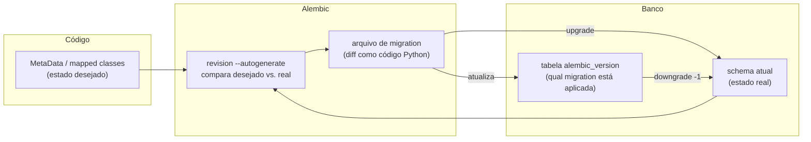
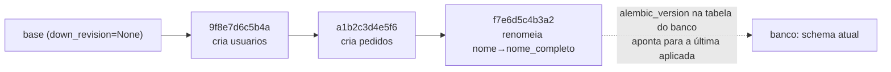

# Migrations com Alembic — versionamento de schema

> [!abstract] TL;DR
> Um schema de banco de dados em produção não é um artefato que se "recria do zero" a cada mudança — é **estado mutável e compartilhado**, com dados reais que não podem ser descartados. Migrations são a resposta estrutural a esse problema: cada mudança de schema vira um arquivo Python versionado, encadeado ao anterior por `down_revision`, aplicável (`upgrade`) e reversível (`downgrade`). Alembic é a ferramenta de migrations do SQLAlchemy — `alembic revision --autogenerate` compara o `MetaData` definido no código (via `Table`/`Column` do Core, visto em [[01 - SQLAlchemy Core — Engine, Connection e expressão SQL|nota 01]], ou mapped classes do ORM, [[02 - SQLAlchemy ORM — Session, mapped classes e relationships|nota 02]]) com o estado real do banco, e gera um diff como código Python. O problema é que esse diff é uma **inferência sintática**, não semântica: o caso canônico é um rename de coluna, que o autogenerate não reconhece como rename — ele gera um `DROP COLUMN` seguido de `ADD COLUMN`, o que **apaga os dados da coluna antiga silenciosamente** se a migration for aplicada sem revisão. Por isso toda migration gerada é, por definição, um rascunho: revisar o diff antes de rodar `alembic upgrade head` não é boa prática opcional, é o gate que separa "ferramenta de produtividade" de "ferramenta de perda de dados em produção".

## O bug que abre esta nota

Uma desenvolvedora pleno está fazendo uma limpeza de nomenclatura num modelo `Usuario` que cresceu organicamente — a coluna `nome` deveria ter sido `nome_completo` desde o início, e agora é a hora de corrigir. A mudança no código parece trivial:

```python
# Antes
class Usuario(Base):
    __tablename__ = "usuarios"

    id: Mapped[int] = mapped_column(primary_key=True)
    nome: Mapped[str] = mapped_column(String(120))
    email: Mapped[str] = mapped_column(String(255), unique=True)

# Depois — só renomeou o atributo e a coluna
class Usuario(Base):
    __tablename__ = "usuarios"

    id: Mapped[int] = mapped_column(primary_key=True)
    nome_completo: Mapped[str] = mapped_column(String(120))
    email: Mapped[str] = mapped_column(String(255), unique=True)
```

Ela roda o comando que gera a migration automaticamente e olha rapidamente o resultado — parece razoável, o nome da tabela está certo, o nome do arquivo menciona `usuarios`, segue em frente:

```bash
alembic revision --autogenerate -m "renomeia nome para nome_completo em usuarios"
alembic upgrade head
```

A migration gerada — que ela não leu com atenção — continha isto:

```python
def upgrade() -> None:
    op.add_column("usuarios", sa.Column("nome_completo", sa.String(length=120), nullable=True))
    op.drop_column("usuarios", "nome")


def downgrade() -> None:
    op.add_column("usuarios", sa.Column("nome", sa.String(length=120), nullable=True))
    op.drop_column("usuarios", "nome_completo")
```

Em produção, com 40 mil usuários cadastrados, o resultado é: uma coluna nova `nome_completo` inteiramente `NULL`, e a coluna `nome` — com o nome de cada um desses 40 mil usuários — **apagada**. Não houve erro, não houve exceção, o deploy passou verde. O sistema simplesmente esqueceu o nome de todo mundo.

> [!bug] O que está quebrado, em uma frase
> `alembic revision --autogenerate` detecta um rename de coluna como duas colunas diferentes — uma que sumiu, uma que apareceu — e gera `DROP COLUMN` + `ADD COLUMN` em vez de `ALTER TABLE ... RENAME COLUMN`, o que descarta os dados da coluna original a menos que a migration gerada seja corrigida manualmente antes de aplicar.

O resto desta nota existe para explicar por que isso acontece, como Alembic funciona por baixo, e — principalmente — como ler e corrigir uma migration gerada antes que ela chegue perto de um banco de produção.

## Por que schema de produção não é "recriável"

Em desenvolvimento, é comum tratar o schema do banco como algo descartável: `Base.metadata.drop_all()` seguido de `Base.metadata.create_all()` resolve qualquer divergência entre o código e o banco local, porque não há dado nenhum que importe perder. Esse hábito é rápido e inofensivo — até o momento em que o mesmo raciocínio, aplicado a um banco de produção, significa apagar pedidos, contas de usuário, histórico financeiro.

A diferença estrutural é que um banco de produção acumula **estado que não existe em nenhum outro lugar** — não há como "recompilar" os dados de um cliente a partir do código-fonte da aplicação. Isso muda a pergunta de "como eu faço o schema ficar do jeito que o código espera" para "como eu transformo o schema atual, com todos os dados que ele guarda, no schema que o código espera, sem perder nada no caminho". A segunda pergunta é estritamente mais difícil, e é o problema que uma ferramenta de migrations resolve.

Vale a analogia direta, porque ela é precisa e não só didática: **migrations são o Git do schema**. Cada migration é um commit — uma mudança incremental, com um identificador único, encadeada à mudança anterior, que pode ser aplicada (`upgrade`, como um `git checkout` avançando no histórico) ou revertida (`downgrade`, como reverter um commit). O histórico de migrations, em conjunto, é a única fonte de verdade sobre como o schema chegou ao estado atual — e, crucialmente, é código versionado no mesmo repositório da aplicação, revisado em pull request como qualquer outra mudança, não um ajuste manual feito direto num cliente SQL contra o banco de produção (o equivalente a editar arquivos direto no servidor sem passar por commit — funciona uma vez, e destrói a rastreabilidade de todo o resto).



## `alembic init`: a estrutura gerada

Alembic é instalado como dependência separada do SQLAlchemy (`pip install alembic`) e inicializado uma vez por projeto:

```bash
alembic init alembic
```

O comando cria uma estrutura de arquivos que passa a viver junto do código da aplicação, versionada no mesmo repositório Git:

```
projeto/
├── alembic.ini          # configuração: onde está o banco, formatação de logs
└── alembic/
    ├── env.py            # script de ambiente — roda a cada comando alembic
    ├── script.py.mako     # template usado para gerar novas migrations
    └── versions/          # cada migration é um arquivo .py aqui
```

**`alembic.ini`** é o arquivo de configuração de mais alto nível — na prática, o único ajuste quase sempre necessário é a URL de conexão (`sqlalchemy.url`), embora em projetos reais essa URL costume vir de variável de ambiente em vez de hardcoded no arquivo (que é versionado em Git):

```ini
# alembic.ini — trecho relevante
[alembic]
script_location = alembic
# sqlalchemy.url normalmente é sobrescrito em env.py a partir de uma variável de ambiente,
# não deixado hardcoded aqui (evita credenciais versionadas em texto plano)
```

**`env.py`** é o script que Alembic executa a cada comando (`revision`, `upgrade`, `downgrade`) — é aqui que a conexão real com o banco é estabelecida, e é aqui que o `MetaData` da aplicação precisa ser importado e apontado, para que `--autogenerate` saiba contra o que comparar:

```python
# alembic/env.py — trecho essencial, editado após alembic init
from meu_app.db import Base   # importa a Base declarativa da nota 02
from meu_app.config import DATABASE_URL

# Alembic compara o schema REAL do banco contra isto:
target_metadata = Base.metadata

config.set_main_option("sqlalchemy.url", DATABASE_URL)
```

Sem essa linha (`target_metadata = Base.metadata`) apontando para o `MetaData` correto, `--autogenerate` não tem contra o que comparar — gera migrations vazias, ou, pior, tenta recriar do zero tabelas que já existem, porque enxerga um `MetaData` vazio como "estado desejado".

**`versions/`** é o diretório que acumula um arquivo por migration, cada um com um identificador hexadecimal único gerado automaticamente e um `down_revision` apontando para o arquivo anterior — é essa cadeia de referências que forma o histórico linear (ou, em casos de merge de branches, ramificado) de mudanças de schema.

## `revision --autogenerate`: como o diff é gerado

O comando central do dia a dia é:

```bash
alembic revision --autogenerate -m "cria tabela pedidos"
```

Por baixo, Alembic faz duas coisas: conecta no banco configurado em `env.py` e usa **reflection** (o SQLAlchemy lê o schema real inspecionando `information_schema` ou equivalente do banco) para reconstruir uma representação do estado atual; em seguida, compara essa representação com o `target_metadata` importado do código da aplicação. A diferença entre os dois vira uma sequência de chamadas de API (`op.create_table`, `op.add_column`, `op.drop_column`, `op.alter_column`...) escritas automaticamente dentro de um arquivo novo em `versions/`.

```python
# versions/a1b2c3d4e5f6_cria_tabela_pedidos.py — gerado por --autogenerate
"""cria tabela pedidos

Revision ID: a1b2c3d4e5f6
Revises: 9f8e7d6c5b4a
Create Date: 2026-07-11 10:15:32.001234
"""
from alembic import op
import sqlalchemy as sa

revision = "a1b2c3d4e5f6"
down_revision = "9f8e7d6c5b4a"   # aponta para a migration anterior — forma a cadeia
branch_labels = None
depends_on = None


def upgrade() -> None:
    op.create_table(
        "pedidos",
        sa.Column("id", sa.Integer(), nullable=False),
        sa.Column("usuario_id", sa.Integer(), nullable=False),
        sa.Column("total_centavos", sa.Integer(), nullable=False),
        sa.Column("criado_em", sa.DateTime(), server_default=sa.func.now(), nullable=False),
        sa.PrimaryKeyConstraint("id"),
        sa.ForeignKeyConstraint(["usuario_id"], ["usuarios.id"]),
    )


def downgrade() -> None:
    op.drop_table("pedidos")
```

O par `revision`/`down_revision` é o mecanismo que forma a cadeia de histórico — cada migration nova referencia a que veio antes dela, formando uma lista encadeada armazenada em disco como uma sequência de arquivos:



O banco em si guarda, numa tabela de controle chamada `alembic_version` (criada automaticamente na primeira `upgrade`), apenas o identificador da última migration aplicada — é comparando esse valor com a cadeia de arquivos em `versions/` que Alembic sabe quais migrations ainda faltam aplicar (`upgrade head` roda todas as que estão à frente do ponteiro atual) ou reverter.

## `upgrade`/`downgrade`: aplicando e revertendo

```bash
alembic upgrade head       # aplica todas as migrations pendentes até a mais recente
alembic upgrade +1         # aplica só a próxima migration pendente
alembic downgrade -1       # reverte a última migration aplicada
alembic downgrade base     # reverte tudo, até o schema vazio
alembic current            # mostra qual migration está aplicada agora
alembic history            # lista a cadeia inteira, em ordem
```

`head` é um alias que sempre aponta para a migration mais recente da cadeia — o comando mais comum do dia a dia é `alembic upgrade head`, que roda, em sequência, todas as migrations entre o estado atual do banco (registrado em `alembic_version`) e o topo da cadeia. `downgrade` percorre o caminho inverso, chamando a função `downgrade()` de cada migration, na ordem reversa — o que só funciona corretamente se cada `downgrade()` for, de fato, o inverso exato do `upgrade()` correspondente (algo que o autogenerate tenta fazer, mas que também merece revisão, pelo mesmo motivo do `upgrade`).

Vale registrar a fronteira aqui: em produção, `downgrade` é usado com muito mais cautela do que em desenvolvimento — reverter uma migration que já rodou contra dados reais pode ser tão destrutivo quanto aplicá-la incorretamente da primeira vez (reverter uma migration que adicionou uma coluna `NOT NULL` populada por um `UPDATE` em massa, por exemplo, descarta esses dados junto com a coluna). Na prática, é mais comum escrever uma migration nova "pra frente" que desfaz o efeito de uma anterior, do que efetivamente rodar `downgrade` contra produção.

## Modo online vs. offline, e por que a maioria roda em modo online

`env.py` gerado por `alembic init` já vem preparado para dois modos de execução, e vale entender a diferença porque ela aparece na primeira leitura do arquivo: **modo online** conecta de fato no banco (via `Engine`/`Connection`, os mesmos objetos do Core vistos na nota 01) e aplica cada operação diretamente; **modo offline** (`alembic upgrade head --sql`) não conecta em banco nenhum — em vez disso, gera o SQL bruto correspondente às operações e imprime na saída padrão, sem executar nada.

```python
# alembic/env.py — as duas funções que env.py já traz prontas
def run_migrations_offline() -> None:
    context.configure(url=DATABASE_URL, target_metadata=target_metadata, literal_binds=True)
    with context.begin_transaction():
        context.run_migrations()


def run_migrations_online() -> None:
    connectable = engine_from_config(config.get_section(config.config_ini_section))
    with connectable.connect() as connection:
        context.configure(connection=connection, target_metadata=target_metadata)
        with context.begin_transaction():
            context.run_migrations()
```

Na imensa maioria dos times, o dia a dia usa o modo online — é o que `alembic upgrade head` faz por padrão, aplicando direto. O modo offline existe para um cenário específico e relativamente raro: bancos onde a própria aplicação não tem (ou não deveria ter) permissão para rodar DDL diretamente, e o SQL gerado precisa passar por um DBA ou por uma ferramenta de aprovação de mudanças antes de ser executado manualmente contra produção — o `--sql` produz exatamente o script que seria revisado nesse fluxo.

## Ajustando a sensibilidade do autogenerate

Por padrão, `--autogenerate` ignora silenciosamente certas categorias de mudança — não porque sejam impossíveis de detectar, mas porque a detecção por padrão é conservadora o suficiente para evitar falsos positivos ruidosos em cada `revision`. Duas flags de `context.configure()` em `env.py` valem conhecer, porque mudam o que aparece (ou deixa de aparecer) num diff gerado:

```python
# alembic/env.py — dentro de run_migrations_online()/offline()
context.configure(
    connection=connection,
    target_metadata=target_metadata,
    compare_type=True,             # detecta mudança de TIPO de coluna (desligado por padrão)
    compare_server_default=True,   # detecta mudança de valor DEFAULT no servidor (desligado por padrão)
)
```

Sem `compare_type=True`, trocar `String(120)` por `String(255)` no código não gera nenhuma linha no diff — o autogenerate simplesmente não compara tipos por padrão, por causa de inconsistências históricas entre como diferentes dialetos de banco reportam tipos via reflection. Ativar essas duas flags aumenta a cobertura do que é detectado automaticamente, mas não elimina a necessidade de revisão manual — só reduz a categoria de mudanças que passam batido silenciosamente, sem gerar migration nenhuma (um problema irmão do bug de abertura: não é dado perdido por uma migration errada, é uma mudança de schema que deveria ter virado migration e não virou, ficando divergente entre código e banco até alguém notar).

## Migrations vazias como sinal de alerta

Um hábito de verificação simples, e barato o suficiente para valer sempre: depois de qualquer `alembic revision --autogenerate`, olhar primeiro se o arquivo gerado tem corpo. Um `upgrade()`/`downgrade()` totalmente vazios (só `pass`) depois de uma mudança real no modelo é sinal de que algo está desalinhado — o candidato mais comum é `target_metadata` em `env.py` apontando para o `MetaData` errado (ou não importando o módulo onde a tabela nova está definida), fazendo o autogenerate comparar o banco contra um `MetaData` que não reflete a mudança que acabou de ser feita no código. O oposto também é um sinal — uma migration "gigante", recriando dezenas de tabelas que já existem, geralmente indica o mesmo problema de configuração, na direção inversa (o `MetaData` alvo está vazio ou incompleto, então tudo que existe no banco parece "sobrando" a menos, ou tudo que está no código parece "faltando").

## O bug revisitado: por que rename vira DROP + ADD

Voltando ao bug de abertura — a raiz do problema é que a comparação que `--autogenerate` faz é inteiramente **sintática, não semântica**. Alembic (via `sqlalchemy.schema` reflection) enxerga duas listas de nomes de coluna: a que existe no banco (`["id", "nome", "email"]`) e a que existe no `MetaData` do código (`["id", "nome_completo", "email"]`). Comparando as duas listas, `nome` está numa e não na outra — vira candidato a `DROP`; `nome_completo` está na outra e não na primeira — vira candidato a `ADD`. Não existe, nesse processo, nenhuma noção de "intenção" — o autogenerate não tem como saber que `nome_completo` é a continuação de `nome` com os mesmos dados, versus uma coluna genuinamente nova e não relacionada. Ele produz a interpretação estruturalmente mais simples e, no caso de rename, é exatamente a interpretação errada.

> [!bug] A migration gerada, corrigida manualmente
> A correção é trocar o par `add_column`/`drop_column` por uma única operação `alter_column` com `new_column_name` — que o dialeto do banco traduz para `ALTER TABLE ... RENAME COLUMN` (Postgres, MySQL 8+) ou o equivalente do banco em questão, preservando os dados existentes na coluna:
>
> ```python
> def upgrade() -> None:
>     op.alter_column(
>         "usuarios",
>         "nome",
>         new_column_name="nome_completo",
>     )
>
>
> def downgrade() -> None:
>     op.alter_column(
>         "usuarios",
>         "nome_completo",
>         new_column_name="nome",
>     )
> ```
>
> Nenhum dado é perdido — a coluna muda de nome, o conteúdo de cada linha permanece intacto. A diferença entre as duas versões da migration é a diferença entre "40 mil nomes de usuário preservados" e "40 mil nomes de usuário apagados", e ela é invisível olhando só o resultado final do schema (as duas migrations terminam com uma tabela `usuarios` tendo a coluna `nome_completo`) — só aparece ao olhar o que acontece **durante** a aplicação.

Vale nomear a categoria mais ampla, porque rename de coluna é o exemplo mais didático, mas não é o único ponto cego do autogenerate:

- **Rename de tabela** sofre do mesmo problema — vira `drop_table` + `create_table`, perdendo todas as linhas, a menos que seja substituído manualmente por `op.rename_table`.
- **Mudança de tipo com perda de precisão** (por exemplo, `Numeric(10, 2)` para `Integer`) é detectada como `alter_column` com `type_=`, mas o autogenerate não avalia se a conversão é segura para os dados existentes — uma coluna com valores decimais truncaria silenciosamente ao virar inteiro, e isso só aparece revisando a migration e testando contra uma cópia realista dos dados.
- **Mudanças em `server_default`, índices parciais, constraints `CHECK` complexas, e a maioria das particularidades específicas de cada dialeto de banco** têm suporte parcial ou nulo no autogenerate — a documentação oficial do Alembic lista explicitamente o que é e não é detectado (link nas Fontes), e a lista muda entre versões, o que reforça que "confiar cegamente no diff gerado" nunca é uma prática segura, independente de quão madura a ferramenta fique.
- **Dados a migrar, não só schema** — trocar uma coluna `status` de string livre para uma FK a uma tabela `status_pedido` exige não só a mudança estrutural (`ADD COLUMN status_id`, `DROP COLUMN status`), mas um passo de **migração de dados** (popular `status_id` a partir do valor textual antigo, para cada linha existente) que o autogenerate nunca vai gerar sozinho — precisa ser escrito manualmente dentro da mesma migration, tipicamente usando `op.get_bind()` para rodar SQL ou operações via Core diretamente dentro do `upgrade()`.

```python
def upgrade() -> None:
    op.add_column("pedidos", sa.Column("status_id", sa.Integer(), nullable=True))

    # Passo de migração de DADOS — autogenerate nunca gera isto sozinho
    conn = op.get_bind()
    conn.execute(sa.text(
        "UPDATE pedidos SET status_id = "
        "(SELECT id FROM status_pedido WHERE status_pedido.nome = pedidos.status)"
    ))

    op.alter_column("pedidos", "status_id", nullable=False)
    op.drop_column("pedidos", "status")
```

## Por que revisar toda migration gerada é obrigatório

A conclusão prática do bug de abertura generaliza para uma regra sem exceção em qualquer time que roda Alembic contra produção: **`--autogenerate` produz um rascunho, nunca uma migration pronta para aplicar**. A ferramenta economiza o trabalho mecânico de escrever `op.add_column`/`op.create_table` à mão, o que é genuinamente valioso, mas ela não tem — e estruturalmente não pode ter — informação sobre a **intenção** por trás de uma mudança de schema. Só quem escreveu o código sabe se uma coluna sumindo e outra aparecendo é um rename disfarçado ou duas mudanças genuinamente independentes.

Isso se traduz em um checklist mínimo antes de qualquer `alembic upgrade` contra um banco com dados reais:

1. **Ler o diff gerado linha por linha** — não confiar na mensagem de commit (`-m "..."`) como resumo suficiente do que a migration faz de fato.
2. **Procurar especificamente por pares `add_column`/`drop_column` do mesmo tipo em colunas com nomes semanticamente parecidos** — o sinal mais forte de um rename mal interpretado.
3. **Rodar a migration contra uma cópia dos dados de produção** (ou um subconjunto anonimizado representativo) em ambiente de staging, não só contra um banco de desenvolvimento vazio — um `ALTER COLUMN` que muda `nullable=True` para `nullable=False` sem `server_default` falha (ou pior, aplica silenciosamente com `NULL`, dependendo do dialeto) se houver linhas existentes com valor nulo naquela coluna, algo que um banco vazio nunca revela.
4. **Testar `downgrade` também**, não só `upgrade` — uma migration sem caminho de volta funcional vira uma armadilha no primeiro rollback de deploy necessário.
5. **Tratar o arquivo de migration como código de produção normal** — revisão em pull request por outra pessoa do time, não um artefato gerado e aplicado sem revisão só porque "o Alembic gerou automaticamente".

## Migrations em CI/CD — menção breve

Em times maduros, `alembic upgrade head` não é rodado manualmente por uma pessoa contra o banco de produção — é um passo automatizado do pipeline de deploy, executado antes (ou como parte) da subida da nova versão da aplicação, geralmente contra uma réplica de teste primeiro e só depois contra produção, com falha do passo bloqueando o deploy inteiro. Esse tema — orquestração de migrations em pipelines de CI/CD, estratégias de deploy sem downtime quando schema e código precisam mudar juntos (expand/contract pattern), rollback automatizado — é aprofundado no galho futuro de Operação (DevOps/SRE), fora do escopo desta nota, que fica no nível de "como escrever e revisar uma migration corretamente" antes de ela chegar a qualquer pipeline.

## Armadilhas comuns

> [!warning] Aplicar `--autogenerate` sem ler o diff
> **O que acontece:** o time trata `alembic revision --autogenerate` seguido de `alembic upgrade head` como um fluxo de dois comandos confiável, sem revisão intermediária — exatamente o padrão que causou o bug de abertura. **Por quê:** o autogenerate compara nomes e tipos sintaticamente, sem noção de intenção — rename, mudança de tipo com perda de dados, e migração de dados associada a uma mudança estrutural nunca são gerados corretamente sozinhos. **Como evitar:** revisão humana obrigatória de todo arquivo em `versions/` antes de mesclar o pull request que o introduz, com atenção especial a pares `add_column`/`drop_column` e a `alter_column` com mudança de tipo.

> [!warning] `env.py` apontando para o `MetaData` errado (ou nenhum)
> **O que acontece:** `target_metadata` em `env.py` não foi atualizado para importar a `Base` real da aplicação (ou aponta para um `MetaData` parcial, cobrindo só algumas tabelas) — `--autogenerate` então "detecta" como novidade tabelas que já existem no banco, ou ignora tabelas que deveriam ser rastreadas. **Por quê:** Alembic não descobre o `MetaData` da aplicação magicamente — é uma linha explícita de configuração em `env.py`, fácil de esquecer de atualizar quando a estrutura de módulos do projeto muda. **Como evitar:** conferir `target_metadata` sempre que a migration gerada parecer "grande demais" ou "recriando tudo do zero" — geralmente é sinal de `MetaData` desalinhado, não de um schema genuinamente todo novo.

> [!warning] Editar uma migration já aplicada em produção
> **O que acontece:** depois de uma migration já ter rodado contra o banco de produção, alguém volta e edita o arquivo `.py` correspondente em `versions/` para "corrigir" algo, em vez de escrever uma migration nova. **Por quê:** o arquivo em disco deixa de refletir o que realmente rodou contra produção — qualquer ambiente novo (staging, banco de outro desenvolvedor, disaster recovery restaurando de um snapshot mais antigo) que rode a cadeia de migrations do zero vai aplicar a versão editada, potencialmente produzindo um schema diferente do que existe em produção, uma divergência silenciosa e difícil de diagnosticar. **Como evitar:** tratar migrations já mescladas na branch principal como imutáveis, exatamente como um commit de Git já publicado — correções viram uma migration nova, encadeada depois da original.

> [!warning] Múltiplos desenvolvedores gerando migrations em paralelo, sem coordenar
> **O que acontece:** duas pessoas, em branches diferentes, rodam `alembic revision --autogenerate` a partir do mesmo `down_revision` (a mesma migration mais recente na hora em que cada uma criou a sua) — ao mesclar as duas branches, a cadeia bifurca: duas migrations diferentes apontam para o mesmo `down_revision`, e `alembic upgrade head` não sabe qual ordem seguir. **Por quê:** a cadeia de migrations é uma lista, não uma árvore, por padrão — bifurcações exigem resolução explícita. **Como evitar:** `alembic merge` resolve bifurcações criando uma migration de merge com dois `down_revision`; na prática, o mais simples é rebasear a branch mais recente contra a mais recente mesclada antes de gerar a migration nova, e coordenar no time quando duas mudanças de schema estão em voo ao mesmo tempo.

> [!warning] Testar migration só contra banco de desenvolvimento vazio
> **O que acontece:** a migration roda sem erro contra o banco local, criado do zero há poucos minutos e sem nenhuma linha de dado real — o pull request é aprovado com base nisso, e a migration falha (ou pior, "funciona" de um jeito silenciosamente destrutivo) só ao rodar contra produção, onde as tabelas têm milhões de linhas com combinações de valores que nunca existiram no ambiente local. **Por quê:** um banco vazio nunca exercita os casos que só aparecem com dados reais — `NOT NULL` sem `server_default` numa tabela com linhas existentes, `UNIQUE` numa coluna que já tem duplicatas, `FOREIGN KEY` apontando para linhas que não existem mais. **Como evitar:** manter um ambiente de staging com um subconjunto realista (idealmente anonimizado) dos dados de produção, e rodar `alembic upgrade head` contra ele como parte do processo de revisão, não só contra um banco de desenvolvimento recém-criado.

## Em entrevista

Alembic aparece com frequência em entrevistas sênior de Python/backend menos como "você sabe os comandos" e mais como um teste de julgamento sobre operação segura de banco de dados em produção — o rename de coluna é praticamente um clássico.

> "Alembic's `--autogenerate` compares the application's `MetaData` against the live database schema via reflection, and generates the diff as Python code — `op.add_column`, `op.drop_column`, and so on. The catch is that this comparison is purely syntactic: it matches column names, not intent. The textbook failure case is a column rename — if you rename `nome` to `nome_completo` in your model, autogenerate doesn't understand that as a rename; it sees one column that disappeared and one that appeared, and generates a `DROP COLUMN` followed by an `ADD COLUMN`. Applied against production, that silently deletes every value that was in the old column, with no error, no warning — the deploy just goes green. The fix is to manually rewrite that into a single `op.alter_column(..., new_column_name=...)`, which the dialect translates into an actual `RENAME COLUMN` and preserves the data. That's exactly why every autogenerated migration is a draft, never something to apply blind — reviewing the diff before running `upgrade head` against a database with real data isn't optional process overhead, it's the line between a productivity tool and a data-loss incident."

Uma pergunta de acompanhamento comum: **"o que mais o autogenerate erra ou detecta mal, além de rename?"** — vale citar mudança de tipo com perda de precisão, e o caso mais estrutural: quando uma migração exige não só mudança de schema mas migração de dados associada (popular uma FK nova a partir de um campo textual antigo), que nunca é gerado automaticamente e precisa ser escrito manualmente dentro do `upgrade()`.

> [!question]- E se perguntarem sobre estratégia de deploy sem downtime quando schema e código mudam juntos?
> Vale nomear o padrão **expand/contract** (também chamado de *parallel change*): em vez de uma migration só que renomeia/remove uma coluna de uma vez (o que quebra a versão antiga da aplicação ainda rodando durante um deploy gradual), a mudança se divide em etapas — primeiro uma migration que **adiciona** a estrutura nova sem remover a antiga (expand), um deploy da aplicação que escreve em ambas e lê da nova, e só depois, com todas as instâncias antigas já substituídas, uma migration final que remove a estrutura antiga (contract). É o tipo de coreografia entre schema e deploy que pertence ao galho futuro de Operação, mas nomear o padrão sinaliza maturidade sênior na resposta.

## Como explicar em inglês

| PT | EN |
|----|----|
| migration | migration |
| versionamento de schema | schema versioning |
| gerar automaticamente (a migration) | autogenerate |
| aplicar (uma migration) | apply / upgrade |
| reverter (uma migration) | revert / downgrade |
| renomear coluna | rename column |
| diff de schema | schema diff |
| cadeia de migrations | migration chain |
| tabela de controle de versão | version tracking table |
| migração de dados | data migration |
| bifurcação da cadeia | branching / diverging heads |
| aplicar sem revisão | apply blind |

## O que vem a seguir

Esta nota estabeleceu o mecanismo de migrations em cima do `MetaData`/mapped classes definidos nas notas anteriores do galho — a próxima nota muda de ferramenta para comparar uma abordagem concorrente que integra migrations diretamente ao ORM:

- [[04 - Django ORM — QuerySets, managers e migrations nativas|04 — Django ORM: QuerySets, managers e migrations nativas]] — `makemigrations`/`migrate` do Django, contraste direto com Alembic (Django integra migrations ao ORM desde o início; SQLAlchemy trata como ferramenta separada e opcional), e quando escolher um framework sobre o outro.
- [[02 - SQLAlchemy ORM — Session, mapped classes e relationships|02 — SQLAlchemy ORM: Session, mapped classes e relationships]] — pré-requisito direto: é o `MetaData` por trás das mapped classes definidas ali que o autogenerate compara contra o banco.
- [[03-Dominios/Tecnologia/Python/Persistência de dados/index|Persistência de dados (Galho 9)]] — MOC deste galho.

## Fontes

- Alembic. *Auto Generating Migrations*. alembic.sqlalchemy.org. https://alembic.sqlalchemy.org/en/latest/autogenerate.html (acessado em 2026-07-11) — o que `--autogenerate` detecta corretamente e o que não detecta (rename de coluna/tabela, mudanças de tipo, constraints).
- Alembic. *Tutorial*. alembic.sqlalchemy.org. https://alembic.sqlalchemy.org/en/latest/tutorial.html (acessado em 2026-07-11) — `alembic init`, estrutura de `env.py`, `revision`, `upgrade`/`downgrade`.
- Alembic. *Operation Reference*. alembic.sqlalchemy.org. https://alembic.sqlalchemy.org/en/latest/ops.html (acessado em 2026-07-11) — `op.alter_column`, `op.rename_table`, `op.add_column`, `op.drop_column`, `op.get_bind()`.
- Alembic. *Branches and Merges*. alembic.sqlalchemy.org. https://alembic.sqlalchemy.org/en/latest/branches.html (acessado em 2026-07-11) — cadeias bifurcadas de migrations e `alembic merge`.
- SQLAlchemy. *Schema Definition Language*. docs.sqlalchemy.org, versão 2.0. https://docs.sqlalchemy.org/en/20/core/metadata.html (acessado em 2026-07-11) — `MetaData`/`Table`, base da comparação que o autogenerate faz.
- [[01 - SQLAlchemy Core — Engine, Connection e expressão SQL|01 — SQLAlchemy Core]] — nota irmã (Galho 9), pré-requisito: `Table`/`MetaData` referenciados, não repetidos, nesta nota.
- [[02 - SQLAlchemy ORM — Session, mapped classes e relationships|02 — SQLAlchemy ORM]] — nota irmã (Galho 9), pré-requisito: mapped classes referenciadas, não repetidas, nesta nota.

Consultado em 2026-07-11.
