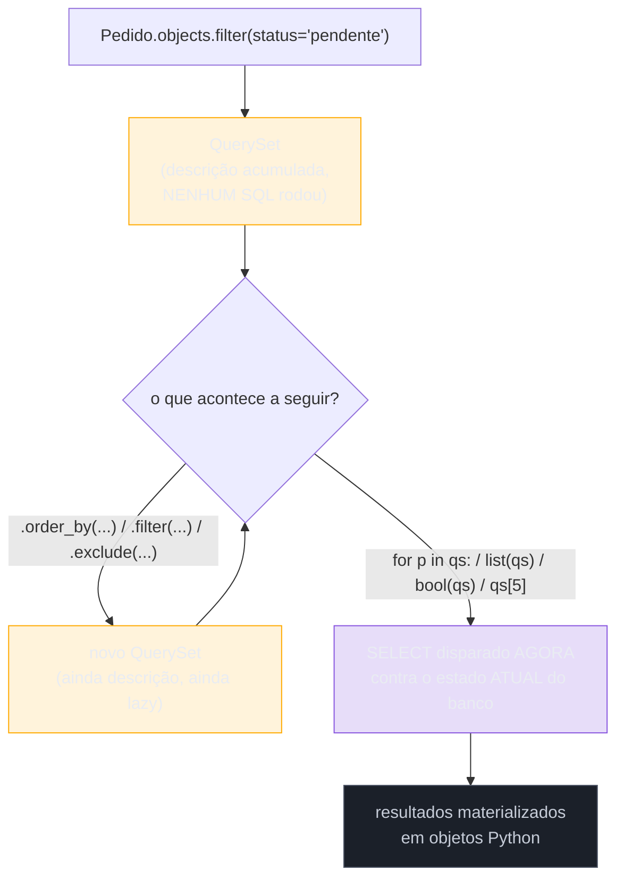
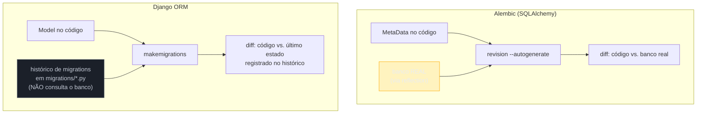

# Django ORM — QuerySets, managers e migrations nativas

> [!abstract] TL;DR
> No Django ORM, `Model.objects` é um **`Manager`** — o ponto de entrada para toda query — e todo método de filtro (`filter()`, `exclude()`, `annotate()`...) devolve um **`QuerySet`**, não uma lista de resultados. Um `QuerySet` é **preguiçoso (lazy)**: construir um, encadear `.filter()` várias vezes, ou passá-lo entre funções não toca o banco — nenhum SQL roda até o `QuerySet` ser **avaliado** (iterado, convertido com `list()`, fatiado com passo, ou checado com `bool()`/`len()`). Isso permite compor queries complexas de forma incremental e legível, mas também é a fonte de um bug clássico: um `QuerySet` guardado numa variável não é uma foto congelada dos dados — é uma consulta ainda não disparada, e se o banco mudar entre a criação e a avaliação, o resultado reflete o estado **no momento da avaliação**, não da criação. A API fluente (`filter`/`exclude`/`annotate`/`aggregate`, com `Q` para OR/NOT e `F` para comparar colunas entre si dentro do banco) é açúcar sintático sobre SQL gerado automaticamente. A diferença mais estrutural frente ao [[02 - SQLAlchemy ORM — Session, mapped classes e relationships|SQLAlchemy ORM]] não é a API de query — é que o Django **integra migrations ao ORM por padrão**: `makemigrations` lê os `Model`s diretamente (sem reflection contra o banco) e gera o diff, `migrate` aplica; não existe uma ferramenta separada com `env.py` para configurar, porque migrations são parte do framework, não um pacote adicional como o [[03 - Migrations com Alembic — versionamento de schema|Alembic]]. Essa integração profunda ao framework é também o trade-off central: Django ORM só funciona dentro de um projeto Django (com `settings.py`, `INSTALLED_APPS`, `AppConfig`); SQLAlchemy roda em qualquer script, worker, ou framework — a escolha entre os dois é, na prática, a escolha entre produtividade imediata dentro de um monólito Django e flexibilidade de uso fora dele.

## O bug que abre esta nota

Um desenvolvedor pleno está implementando um relatório de fechamento noturno para um sistema de e-commerce. A tarefa: contar quantos pedidos estão pendentes de pagamento, executar um lote de cobrança automática contra o gateway, e só então informar quantos pedidos **ainda continuam** pendentes depois do lote rodar.

O código que ele escreve parece direto ao ponto — captura o `QuerySet` de pedidos pendentes uma vez, no início, e reusa a mesma variável no fim para comparar:

```python
from pedidos.models import Pedido

def fechamento_noturno():
    pendentes = Pedido.objects.filter(status="pendente")
    print(f"Pedidos pendentes no início: {pendentes.count()}")

    for pedido in pendentes:
        resultado = gateway_pagamento.cobrar(pedido)
        if resultado.aprovado:
            pedido.status = "pago"
            pedido.save()

    # "essa variável já tinha os pendentes do início, então isso deveria
    # mostrar quantos NÃO foram cobrados com sucesso, certo?"
    print(f"Pedidos pendentes restantes: {pendentes.count()}")
```

A intuição por trás do código é a de quem já programou com listas: `pendentes` foi atribuído uma vez, no início da função, então "deveria" continuar representando o snapshot daquele momento — os mesmos pedidos, com o mesmo status `"pendente"`, independente do que aconteça depois. Só que o segundo `pendentes.count()` **não imprime o número de pedidos que continuam pendentes desde o início**: ele dispara um `SELECT COUNT(*) ... WHERE status = 'pendente'` **novo**, contra o banco **no estado em que ele está agora** — depois que o loop já rodou e já mudou o status de vários pedidos para `"pago"`. O relatório final mostra um número consistente com a realidade (pedidos que continuam pendentes agora), mas completamente diferente do que o nome da variável e a intenção do código sugeriam — e, pior, se o mesmo `pendentes` fosse reutilizado em um terceiro ponto do código mais tarde, ele contaria de novo, do zero, contra o estado daquele instante.

> [!bug] O que está quebrado, em uma frase
> `pendentes = Pedido.objects.filter(status="pendente")` não executa nada — ela cria um objeto `QuerySet` que representa a *intenção* de consultar; toda vez que esse `QuerySet` é avaliado (aqui, duas vezes, via `.count()`), o Django dispara um `SELECT` novo contra o estado **atual** do banco, não um snapshot do momento em que a variável foi atribuída.

Esse comportamento não é um bug do Django — é o design deliberado do `QuerySet`, e entender exatamente **quando** um `QuerySet` roda contra o banco (e quando não roda) é o que separa quem usa a API por tentativa e erro de quem sabe prever o comportamento antes de rodar o código. É o assunto central desta nota.

## `Manager`: o ponto de entrada — `Model.objects`

Todo `Model` do Django ganha, automaticamente, um atributo chamado `objects` — uma instância de `Manager`, que é o objeto responsável por construir `QuerySet`s para aquele modelo. `Manager` não guarda dados nem representa uma query em si; ele é a **fábrica** que produz o `QuerySet` inicial, "sem filtro nenhum", a partir do qual toda consulta encadeada é construída.

```python
from django.db import models


class Pedido(models.Model):
    STATUS_CHOICES = [
        ("pendente", "Pendente"),
        ("pago", "Pago"),
        ("cancelado", "Cancelado"),
    ]

    cliente = models.ForeignKey("Cliente", on_delete=models.CASCADE, related_name="pedidos")
    status = models.CharField(max_length=20, choices=STATUS_CHOICES, default="pendente")
    valor_centavos = models.PositiveIntegerField()
    criado_em = models.DateTimeField(auto_now_add=True)

    def __str__(self) -> str:
        return f"Pedido #{self.pk} ({self.status})"
```

```python
Pedido.objects                      # o Manager — não é um QuerySet, é a fábrica de QuerySets
Pedido.objects.all()                 # QuerySet "todos os pedidos" — ainda não avaliado
Pedido.objects.filter(status="pago") # QuerySet filtrado — ainda não avaliado
```

Ao contrário do padrão do SQLAlchemy, onde a [[02 - SQLAlchemy ORM — Session, mapped classes e relationships|`Session`]] é um objeto explícito que o desenvolvedor cria e passa adiante (`with Session(engine) as session:`), o Django não tem um objeto de sessão visível no código de aplicação — a conexão com o banco é gerenciada internamente pelo framework, tipicamente uma por request (ou por thread, em contextos fora de request), e o `Manager` acessa essa conexão implicitamente. Essa é uma diferença de design que aparece direto na ergonomia: código Django não tem `with Session(...)` em toda função — a troca é menos controle explícito sobre o escopo da conexão, em favor de menos cerimônia no código de aplicação comum.

Um modelo pode ter **managers customizados** além do `objects` padrão — útil para encapsular um filtro usado com frequência, sem repetir a mesma chamada em todo lugar:

```python
class PedidoManager(models.Manager):
    def pendentes(self):
        return self.filter(status="pendente")

    def pagos_no_mes(self, ano: int, mes: int):
        return self.filter(status="pago", criado_em__year=ano, criado_em__month=mes)


class Pedido(models.Model):
    objects = PedidoManager()   # substitui o Manager padrão por este customizado
    # ... campos como antes
```

```python
Pedido.objects.pendentes()                 # em vez de Pedido.objects.filter(status="pendente")
Pedido.objects.pagos_no_mes(2026, 7)
```

Um manager customizado é o lugar certo para centralizar uma query recorrente e nomeá-la com um verbo de domínio (`pendentes()`, `pagos_no_mes()`) em vez de espalhar `filter(status="pendente")` como um "magic string" repetido por dezenas de arquivos do código de aplicação.

## `QuerySet`: representa a intenção, não o resultado

Um `QuerySet` é, na prática, uma estrutura de dados que acumula a **descrição** de uma consulta SQL — quais tabelas, quais filtros, qual ordenação, quais `JOIN`s — sem executar nada disso até ser forçado. Encadear métodos num `QuerySet` não muda um objeto existente; cada método (`.filter()`, `.exclude()`, `.order_by()`...) devolve um **novo** `QuerySet`, com a descrição acumulada, deixando o original intacto:

```python
base = Pedido.objects.filter(status="pendente")          # QuerySet A — descrição: WHERE status='pendente'
recentes = base.order_by("-criado_em")                    # QuerySet B — descrição: A + ORDER BY criado_em DESC
caros = recentes.filter(valor_centavos__gte=10_000_00)     # QuerySet C — descrição: B + AND valor_centavos >= ...

# base, recentes e caros são TRÊS objetos distintos, cada um com sua própria descrição acumulada.
# Nenhum SELECT rodou ainda em nenhuma dessas três linhas.
```

Essa imutabilidade — cada `.filter()`/`.exclude()`/`.order_by()` devolvendo um `QuerySet` novo em vez de mutar o existente — é o que torna seguro construir uma query em etapas condicionais, um padrão comum em código real de filtro dinâmico (uma tela de busca com múltiplos campos opcionais, por exemplo):

```python
def buscar_pedidos(status: str | None, valor_minimo: int | None, cliente_id: int | None):
    qs = Pedido.objects.all()          # QuerySet base, sem filtro

    if status is not None:
        qs = qs.filter(status=status)
    if valor_minimo is not None:
        qs = qs.filter(valor_centavos__gte=valor_minimo)
    if cliente_id is not None:
        qs = qs.filter(cliente_id=cliente_id)

    return qs   # nenhum SELECT rodou até aqui — mesmo que os três `if` sejam verdadeiros
```

Nenhum `SELECT` roda até `buscar_pedidos(...)` retornar e o chamador, em algum ponto, **avaliar** o `QuerySet` resultante. Isso é exatamente o mecanismo por trás do padrão de "construir a query condicionalmente" que aparece o tempo todo em views e endpoints — e é também, como o bug de abertura mostrou, a fonte de confusão para quem espera que uma variável `QuerySet` se comporte como uma lista já resolvida.

### O que dispara a avaliação

O Django documenta explicitamente a lista de operações que forçam um `QuerySet` a rodar contra o banco — vale internalizar essa lista, porque é justamente o limite entre "ainda é só descrição" e "acabou de virar SQL de verdade":

| Operação | Exemplo | O que dispara |
|---|---|---|
| Iteração | `for p in qs:` | percorre linha a linha — o `SELECT` roda na primeira iteração |
| `list()`/conversão | `list(qs)`, `[p for p in qs]` | força a materialização completa em memória |
| Fatiamento com passo, ou índice único | `qs[5]`, `qs[2:4:1]` | `LIMIT`/`OFFSET` no `SELECT` (fatiamento simples `qs[2:4]` **não** avalia — ver abaixo) |
| `bool()`/checagem de verdade | `if qs:`, `bool(qs)` | roda `SELECT` e checa se há ao menos uma linha |
| `len()` | `len(qs)` | materializa tudo para contar (evitar — `count()` é mais eficiente, ver adiante) |
| `repr()` | print de um `QuerySet` no console/shell | avalia até 21 itens, para exibição |
| `pickle` | serializar o `QuerySet` | força avaliação antes de serializar os resultados |

Um detalhe que confunde bastante gente: **fatiamento simples não avalia** — `Pedido.objects.all()[:10]` continua sendo um `QuerySet` preguiçoso, só que agora com um `LIMIT 10` já embutido na descrição SQL, sem ter rodado nada ainda. `QuerySet`s fatiados dessa forma geralmente não suportam mais `.filter()` adicional (o Django levanta `AssertionError` se você tentar filtrar depois de fatiar), mas continuam preguiçosos até algo da lista acima acontecer.



> [!question]- Se eu avaliar o mesmo `QuerySet` duas vezes, ele roda o `SELECT` duas vezes?
> Depende do que "o mesmo `QuerySet`" significa aqui. Cada `QuerySet` tem um **cache interno de resultados** — na primeira avaliação (por exemplo, o primeiro `for p in qs:`), o Django popula esse cache com os objetos materializados; uma segunda iteração sobre **a mesma instância** de `QuerySet` reusa o cache, sem rodar `SELECT` de novo. O problema do bug de abertura é diferente: `pendentes.count()` chamado duas vezes **não usa esse cache** — `count()` (assim como `exists()`) é uma das operações que sempre dispara uma query nova contra o banco, mesmo que o cache de resultados já exista, porque a query de `COUNT(*)` é estruturalmente diferente da query de buscar as linhas. É por isso que, no bug de abertura, mesmo reusando a variável `pendentes`, cada `.count()` ainda ia ao banco de novo — e cada vez encontrava um número diferente, porque o banco tinha mudado entre as duas chamadas.

## API fluente: `filter`, `exclude`, `annotate`, `aggregate`, `Q`, `F`

### `filter()` e `exclude()`: os dois lados do `WHERE`

`filter(**kwargs)` adiciona condições que os resultados **precisam** satisfazer; `exclude(**kwargs)` adiciona condições que os resultados **não podem** satisfazer — os dois aceitam a mesma sintaxe de "lookups" (`campo__operador=valor`) usada em toda a API:

```python
Pedido.objects.filter(status="pago")                          # WHERE status = 'pago'
Pedido.objects.exclude(status="cancelado")                     # WHERE NOT (status = 'cancelado')
Pedido.objects.filter(valor_centavos__gte=5_000_00)             # WHERE valor_centavos >= 500000
Pedido.objects.filter(criado_em__year=2026, criado_em__month=7) # WHERE EXTRACT(year...) = 2026 AND EXTRACT(month...) = 7
Pedido.objects.filter(cliente__nome__icontains="silva")         # JOIN em cliente + WHERE nome ILIKE '%silva%'
```

O último exemplo — `cliente__nome__icontains` — mostra o mecanismo de **lookup através de relacionamento**: o duplo underscore (`__`) atravessa a `ForeignKey` (`cliente`) e chega até um campo da tabela relacionada (`nome`), com o Django gerando o `JOIN` necessário automaticamente. Encadear vários `filter()` em sequência produz `AND` entre eles por padrão:

```python
Pedido.objects.filter(status="pago").filter(valor_centavos__gte=10_000_00)
# equivalente a: WHERE status = 'pago' AND valor_centavos >= 1000000
```

### `Q` objects: quando `AND` implícito não basta

Encadear `.filter()` só produz `AND`. Para expressar `OR`, `NOT` combinado com outras condições, ou agrupamento explícito com parênteses lógicos, é preciso o objeto `Q`, que representa uma condição isolada, combinável com operadores Python (`|` para OR, `&` para AND, `~` para NOT):

```python
from django.db.models import Q

# pedidos pendentes OU cancelados nos últimos 7 dias
Pedido.objects.filter(
    Q(status="pendente") | Q(status="cancelado"),
    criado_em__gte=sete_dias_atras,
)
# WHERE (status = 'pendente' OR status = 'cancelado') AND criado_em >= ...

# pedidos que NÃO são pagos E têm valor alto — combinando ~ com &
Pedido.objects.filter(~Q(status="pago") & Q(valor_centavos__gte=50_000_00))
# WHERE NOT (status = 'pago') AND valor_centavos >= 5000000
```

Sem `Q`, expressar "status pendente OU cancelado" exigiria cair para SQL bruto ou para `filter(status__in=["pendente", "cancelado"])` (que funciona para esse caso específico de igualdade contra o mesmo campo, mas não generaliza para OR entre condições de campos **diferentes**, onde `Q` é indispensável).

### `F` expressions: comparar colunas dentro do banco, sem trazer dados pra Python

Um erro comum de quem está começando é comparar dois campos do mesmo registro trazendo os valores para Python primeiro:

```python
# ERRADO (ineficiente e propenso a condição de corrida) — traz tudo pra Python pra comparar
for pedido in Pedido.objects.all():
    if pedido.valor_centavos > pedido.limite_credito_centavos:
        pedido.status = "bloqueado"
        pedido.save()
```

`F()` representa o **valor de um campo, avaliado dentro do próprio banco**, no momento em que o SQL roda — permitindo comparar (ou fazer aritmética entre) colunas do mesmo registro sem nunca trazer os valores para a camada Python:

```python
from django.db.models import F

# CERTO — filtro roda inteiramente no banco, comparando colunas entre si
Pedido.objects.filter(valor_centavos__gt=F("limite_credito_centavos")).update(status="bloqueado")
# WHERE valor_centavos > limite_credito_centavos
```

`F` também resolve um problema clássico de condição de corrida em incrementos — `produto.estoque -= 1; produto.save()` lê o valor em Python, decrementa em Python, e escreve de volta: se duas requisições concorrentes fizerem isso ao mesmo tempo, uma leitura pode ficar obsoleta antes do `save()` da outra (a mesma classe de problema vista em [[03-Dominios/Tecnologia/Python/Concorrência e paralelismo/01 - Threading na prática — Thread, Lock e condições de corrida|condições de corrida]], só que aqui a "seção crítica" é uma linha de banco compartilhada entre processos/requests, não threads de um processo só). Usando `F`, o decremento acontece **atomicamente dentro do próprio `UPDATE`**, sem essa janela de leitura-modificação-escrita em Python:

```python
# ERRADO — condição de corrida entre leitura em Python e escrita
produto = Produto.objects.get(pk=produto_id)
produto.estoque -= 1
produto.save()

# CERTO — o decremento acontece no banco, atomicamente, sem trazer o valor pra Python antes
Produto.objects.filter(pk=produto_id).update(estoque=F("estoque") - 1)
```

### `annotate()` e `aggregate()`: agregação por linha vs. agregação total

`aggregate()` calcula **um valor agregado sobre o `QuerySet` inteiro**, devolvendo um dicionário (não um `QuerySet` — `aggregate()` é uma das operações que sempre avalia imediatamente):

```python
from django.db.models import Sum, Avg, Count

Pedido.objects.filter(status="pago").aggregate(total=Sum("valor_centavos"))
# {'total': 458732100}  — um SELECT SUM(valor_centavos) ... para o QuerySet inteiro

Pedido.objects.aggregate(media=Avg("valor_centavos"), quantidade=Count("id"))
# {'media': 12453.7, 'quantidade': 892}
```

`annotate()`, por outro lado, adiciona um valor calculado **por linha do resultado**, mantendo o `QuerySet` como `QuerySet` (continua lazy, continua encadeável) — o caso mais comum é agregar sobre um relacionamento, agrupando implicitamente por linha do modelo principal:

```python
from django.db.models import Count

# quantos pedidos cada cliente tem — uma linha por Cliente, com a contagem anexada
Cliente.objects.annotate(total_pedidos=Count("pedidos"))
# SELECT cliente.*, COUNT(pedido.id) AS total_pedidos
# FROM cliente LEFT JOIN pedido ON pedido.cliente_id = cliente.id
# GROUP BY cliente.id

for cliente in Cliente.objects.annotate(total_pedidos=Count("pedidos")).filter(total_pedidos__gt=5):
    print(cliente.nome, cliente.total_pedidos)   # atributo NOVO, criado pelo annotate
```

O `GROUP BY` no SQL gerado é implícito — o desenvolvedor nunca escreve `GROUP BY` diretamente; o Django infere o agrupamento a partir de quais campos vêm do modelo principal (`Cliente`) versus quais vêm de uma função de agregação (`Count("pedidos")`). É possível filtrar por um valor `annotate`ado (`filter(total_pedidos__gt=5)`, no exemplo acima) — o filtro atravessa para uma cláusula `HAVING` no SQL final, quando aplicado depois de um `annotate` com agregação, diferente de um `filter` sobre um campo comum, que vira `WHERE`.

> [!question]- Qual a regra prática para lembrar `annotate` vs. `aggregate`?
> `aggregate` responde "um número (ou poucos) sobre o `QuerySet` inteiro" — "qual o total de vendas do mês". `annotate` responde "um número extra, por linha, dentro do `QuerySet`" — "quantos pedidos **cada** cliente tem". Uma forma de fixar: `aggregate()` sempre encerra a cadeia (devolve `dict`, não `QuerySet`); `annotate()` sempre continua a cadeia (devolve `QuerySet`, encadeável com mais `.filter()`/`.order_by()`).

## `select_related`/`prefetch_related`: menção breve

A API fluente até aqui já esbarra num tema que merece nota própria: `Cliente.objects.annotate(total_pedidos=Count("pedidos"))` funciona sem N+1 porque `annotate` com agregação faz **um único `JOIN`+`GROUP BY`**, mas iterar sobre `usuario.pedidos.all()` para cada `Usuario` de um loop — sem carregar os relacionamentos junto — dispara uma query nova por iteração, o mesmo problema estrutural de `relationship()` lazy no SQLAlchemy visto na [[02 - SQLAlchemy ORM — Session, mapped classes e relationships#`relationship()`\: como classes mapeadas se conectam|nota 02]]. O Django resolve isso com `select_related()` (para relações `ForeignKey`/`OneToOne`, via `JOIN`) e `prefetch_related()` (para relações many-to-many/reverse-FK, via uma query adicional otimizada) — o par equivalente a `joinedload`/`selectinload` do SQLAlchemy. Esse mecanismo, e como detectar N+1 na prática antes que ele vire um incidente de performance em produção, é o assunto central da [[05 - N+1 e eager loading — joinedload-selectinload vs select_related-prefetch_related|próxima nota do galho]] — aqui vale reter só que o problema existe e que a lazy evaluation do `QuerySet` é a mesma raiz mecânica do bug de abertura desta nota, aplicada a relacionamentos em vez de a filtros.

## Migrations nativas: `makemigrations`/`migrate`

Esta é a diferença mais estrutural entre Django ORM e SQLAlchemy, e vale destrinchar com cuidado porque é fácil subestimar o quanto ela muda o fluxo de trabalho do dia a dia.

### O contraste direto com Alembic

A [[03 - Migrations com Alembic — versionamento de schema|nota anterior]] estabeleceu que Alembic é um **pacote separado** do SQLAlchemy: instalado à parte (`pip install alembic`), inicializado explicitamente (`alembic init`), configurado num `env.py` que precisa apontar manualmente para o `MetaData` da aplicação (`target_metadata = Base.metadata`). O Alembic gera o diff comparando o `MetaData` do código contra o **estado real do banco**, via reflection — ele não sabe nada sobre o histórico de mudanças além do que está encadeado em `versions/` mais o que reflection revela sobre o banco agora.

Django faz algo estruturalmente diferente: migrations são **parte do framework**, não um pacote adicional, e o comando que gera o diff — `makemigrations` — não faz reflection contra o banco. Ele compara o estado atual dos `Model`s no código contra o **histórico de migrations já registrado em disco** (os arquivos `.py` dentro de `migrations/` de cada app), que por sua vez é a fonte de verdade sobre "o que o Django acha que o schema deveria ser neste momento".



Essa diferença tem uma consequência prática direta: `makemigrations` funciona **sem conexão nenhuma com um banco de dados** — é possível rodar `makemigrations` num ambiente que nunca tocou o banco de produção, porque a comparação é inteiramente contra arquivos versionados no repositório. `migrate` (o equivalente Django ao `upgrade` do Alembic) é o comando separado que de fato conecta no banco e aplica as migrations pendentes:

```bash
python manage.py makemigrations      # gera o(s) arquivo(s) de migration, SEM tocar o banco
python manage.py migrate             # aplica as migrations pendentes contra o banco configurado
python manage.py showmigrations      # lista todas as migrations e quais já foram aplicadas ([X]) ou não ([ ])
python manage.py sqlmigrate app_name 0003   # mostra o SQL bruto que uma migration específica geraria
```

### Uma migration gerada, na prática

Partindo do `Pedido` definido no início desta nota, `makemigrations` gera um arquivo dentro de `pedidos/migrations/`:

```python
# pedidos/migrations/0001_initial.py — gerado por `makemigrations`
from django.db import migrations, models
import django.db.models.deletion


class Migration(migrations.Migration):

    initial = True

    dependencies = [
        ("clientes", "0001_initial"),   # depende da migration que cria Cliente
    ]

    operations = [
        migrations.CreateModel(
            name="Pedido",
            fields=[
                ("id", models.BigAutoField(auto_created=True, primary_key=True, serialize=False)),
                ("status", models.CharField(
                    choices=[("pendente", "Pendente"), ("pago", "Pago"), ("cancelado", "Cancelado")],
                    default="pendente", max_length=20,
                )),
                ("valor_centavos", models.PositiveIntegerField()),
                ("criado_em", models.DateTimeField(auto_now_add=True)),
                ("cliente", models.ForeignKey(
                    on_delete=django.db.models.deletion.CASCADE,
                    related_name="pedidos", to="clientes.cliente",
                )),
            ],
        ),
    ]
```

A estrutura lembra a migration Alembic da nota anterior — uma lista de operações (`CreateModel`, e em migrations subsequentes `AddField`/`RemoveField`/`AlterField`/`RenameField`) — mas com uma diferença que vale destacar: **existe um `RenameField` nativo**, porque o `makemigrations` compara contra o histórico de migrations, não contra nomes de coluna refletidos do banco. Quando um campo é renomeado no `Model` e `makemigrations` roda logo em seguida (antes de outras mudanças serem intercaladas), o Django **pergunta interativamente** se aquilo é um rename ou um campo novo mais um campo removido — porque o histórico de migrations dá contexto suficiente para essa pergunta fazer sentido, algo que a reflection pura do Alembic não tem como oferecer:

```
$ python manage.py makemigrations
Did you rename usuarios.nome to usuarios.nome_completo (a CharField)? [y/N]
```

> [!question]- Isso significa que o Django nunca tem o mesmo bug de rename-vira-DROP-ADD do Alembic?
> Não elimina o risco por completo — reduz bastante, mas não é uma garantia. A detecção de rename do `makemigrations` depende de comparar o histórico local de migrations contra o estado atual do código **numa única execução coerente**: se duas mudanças de schema forem feitas em commits separados sem rodar `makemigrations` entre elas (por exemplo, remover um campo num commit e adicionar outro com nome parecido num commit seguinte, cada um gerando sua própria migration isoladamente), o Django perde o contexto de que aquilo era, na intenção do desenvolvedor, um rename — e gera `RemoveField` + `AddField` como duas operações independentes, com a mesma perda silenciosa de dados que o Alembic teria. A pergunta interativa só aparece quando as duas mudanças (campo removido + campo novo) coexistem no *diff* que uma única chamada de `makemigrations` está avaliando. A lição de fundo da nota 03 — revisar toda migration gerada antes de aplicar contra produção — vale igualmente aqui, mesmo com essa detecção nativa reduzindo a frequência do problema.

### Por que a integração muda o fluxo de trabalho

A consequência mais visível do dia a dia: em um projeto Django, **esquecer de rodar `makemigrations` depois de mudar um `Model`** é um erro extremamente comum e detectável cedo — o comando `migrate` (e, em desenvolvimento, o próprio `runserver`) avisa explicitamente quando há mudanças de modelo sem migration correspondente. No SQLAlchemy+Alembic, não existe esse acoplamento: é inteiramente possível mudar uma mapped class e nunca gerar (ou aplicar) a migration correspondente, sem qualquer aviso automático do framework — o desconforto de descobrir a divergência só aparece quando algo quebra em runtime (uma coluna que o código espera e o banco não tem).

```python
# manage.py runserver, com um Model mudado e `makemigrations` esquecido:
#
# You have 1 model change that is not reflected in a migration, and so won't be applied.
# Run 'python manage.py makemigrations' to make new migrations, and then re-run
# 'python manage.py migrate' to apply them.
```

Essa checagem automática é o tipo de detalhe que só existe porque migrations não são um add-on — são parte do ciclo de vida padrão de qualquer app Django, verificadas a cada carregamento do servidor de desenvolvimento.

## Tabela de decisão: SQLAlchemy vs. Django ORM

| Dimensão | SQLAlchemy (+ Alembic) | Django ORM |
|---|---|---|
| Acoplamento ao framework | Nenhum — roda em qualquer script, worker Celery, CLI, FastAPI, Flask, ou processo Python puro | Total — exige um projeto Django configurado (`settings.py`, `INSTALLED_APPS`, `AppConfig`); não roda "solto" sem instanciar o framework |
| Migrations | Ferramenta separada (Alembic), configuração manual (`env.py`), reflection contra o banco real | Nativas, parte do framework (`makemigrations`/`migrate`), comparam contra histórico de migrations em disco, sem reflection |
| Detecção de rename | Nunca automática — sempre vira `DROP`+`ADD`, correção manual obrigatória | Detecção interativa quando remoção+adição coexistem no mesmo diff (não é garantia total — ver ressalva acima) |
| Controle fino sobre SQL gerado | Alto — expressão SQL do Core sempre disponível por baixo, `select()`/`Table` explícitos | Menor por padrão — API do ORM abstrai mais; SQL bruto via `.raw()`/`connection.cursor()` quando necessário, mas é a exceção, não o caminho natural |
| Curva de produtividade inicial | Mais lenta — decisões explícitas de `Engine`/`Session`/mapeamento antes do primeiro CRUD funcionar | Mais rápida — `Model`, `admin.py` (interface administrativa gerada automaticamente), `Manager` padrão, tudo funcionando com pouquíssimo código |
| Flexibilidade de arquitetura | Alta — múltiplos bancos, múltiplas `Session`s com propósitos diferentes, uso parcial (só Core, sem ORM) são cenários de primeira classe | Menor — pressupõe "um projeto Django, um `settings.DATABASES` primário"; multi-banco é possível mas menos idiomático |
| Onde brilha | Serviços que não são "o app inteiro" — workers, pipelines de dados, microsserviços fora de um monólito Django, scripts CLI | Aplicações web full-stack construídas dentro do próprio framework Django — admin gerado, forms integrados, autenticação pronta |
| Onde causa atrito | Cerimônia inicial maior para tarefas simples; nenhuma integração automática entre mudança de modelo e migration | Tentar usar o ORM fora de um contexto Django "de verdade" (scripts standalone) exige configurar `django.setup()` manualmente — funciona, mas é rodar o framework inteiro só para usar o ORM |

> [!question]- Dá pra usar o Django ORM "sozinho", fora de um projeto Django completo?
> Tecnicamente sim, via `django.setup()` configurando `DJANGO_SETTINGS_MODULE` manualmente antes de importar qualquer `Model` — é o mecanismo que scripts de manutenção ou notebooks de análise de dados usam para consultar o banco de um projeto Django existente sem subir o servidor web. Mas isso ainda carrega o framework inteiro por baixo (o sistema de apps, o registry de models, o carregamento de `settings.py`) — não é "só o ORM" isolado como uma biblioteca independente da forma que SQLAlchemy é. Esse é exatamente o ponto da tabela: o acoplamento ao framework é estrutural, não uma limitação incidental fácil de contornar.

Na prática, a decisão raramente é "qual ORM é melhor" em abstrato — é "este componente vai viver dentro de um monólito Django, ou é um serviço independente que precisa de acesso a dados sem carregar um framework web inteiro". Times que já têm um projeto Django ganham produtividade real usando o ORM nativo (migrations automáticas, admin gerado, integração com forms/serializers). Times construindo um worker, um pipeline, ou um serviço que não é primariamente uma aplicação web Django tendem a preferir SQLAlchemy justamente pela ausência de acoplamento — a mesma dependência (`sqlalchemy`) funciona idêntica dentro de um FastAPI, um script batch, ou uma task Celery, sem carregar nada além do que a query em si precisa.

## Armadilhas comuns

> [!warning] Tratar um `QuerySet` guardado numa variável como um snapshot congelado
> **O que acontece:** um `QuerySet` é atribuído a uma variável no início de uma função, código roda entre a atribuição e o uso, e o desenvolvedor espera que reavaliar a variável mais tarde reflita o estado do banco **no momento da atribuição** — exatamente o bug de abertura desta nota. **Por quê:** `QuerySet` é uma descrição de query, não um resultado materializado; cada avaliação (iteração, `.count()`, `bool()`) dispara SQL contra o estado **atual** do banco, não contra um snapshot do passado. **Como evitar:** se o objetivo é de fato um snapshot fixo, forçar a avaliação explicitamente e guardar o resultado materializado (`pendentes = list(Pedido.objects.filter(status="pendente"))`), não o `QuerySet` em si; se o objetivo é contar de novo depois, nomear a variável de forma que deixe isso claro (`contar_pendentes = lambda: Pedido.objects.filter(status="pendente").count()`) em vez de reusar a mesma variável com uma intenção ambígua.

> [!warning] Ler-modificar-escrever em Python em vez de usar `F()`
> **O que acontece:** um contador ou saldo é lido em Python (`obj.campo`), incrementado/decrementado em Python, e salvo de volta (`obj.save()`) — sob concorrência real (múltiplos requests/processos), duas operações concorrentes podem ler o mesmo valor inicial e uma escrita "perde" o efeito da outra. **Por quê:** a leitura e a escrita não são atômicas quando passam por Python no meio — há uma janela entre o `SELECT` que traz o valor e o `UPDATE` que escreve o novo valor, onde outro processo pode ter mudado o mesmo registro. **Como evitar:** usar `F()` para expressar a operação inteiramente dentro do `UPDATE` (`Model.objects.filter(pk=x).update(campo=F("campo") - 1)`), que o banco executa atomicamente sem expor a janela de leitura-escrita ao código Python.

> [!warning] Confundir `annotate()` com `aggregate()` e receber um resultado do tipo errado
> **O que acontece:** esperar um número único de `annotate()` (que devolve um `QuerySet` com um campo extra por linha) ou esperar poder continuar encadeando `.filter()` depois de `aggregate()` (que devolve um `dict`, encerrando a cadeia). **Por quê:** os dois nomes soam parecidos e ambos envolvem funções de agregação (`Sum`, `Count`, `Avg`), mas atuam em escopos diferentes — `aggregate` colapsa o `QuerySet` inteiro num valor; `annotate` mantém uma linha por registro, com um valor extra anexado a cada uma. **Como evitar:** perguntar "eu quero um número sobre tudo, ou um número por linha?" antes de escolher — a primeira resposta é `aggregate`, a segunda é `annotate`.

> [!warning] Esquecer `makemigrations` depois de mudar um `Model`
> **O que acontece:** um campo é adicionado/removido/alterado num `Model`, o código roda sem erro em desenvolvimento (o Django não impede o processo de subir), mas o banco nunca recebe a mudança de schema correspondente — o primeiro sintoma costuma ser um erro de coluna inexistente na primeira query que toca o campo novo. **Por quê:** ao contrário de `Base.metadata.create_all()` do SQLAlchemy (que recria tudo de uma vez em desenvolvimento), o Django não sincroniza `Model`s com o banco automaticamente a cada mudança — `makemigrations` precisa ser rodado explicitamente para registrar a mudança como uma migration nova, e `migrate` para aplicá-la. **Como evitar:** prestar atenção ao aviso que `runserver`/`migrate` emitem quando detectam mudanças de modelo sem migration correspondente ("You have model changes that are not reflected in a migration") — e tratar `makemigrations` como parte do commit que muda o `Model`, não um passo separado e esquecível.

## Em entrevista

`QuerySet` lazy é uma das perguntas mais comuns em entrevistas backend Python/Django de nível pleno — testa se o candidato entende o ORM como mecanismo (constrói descrição, executa sob demanda) em vez de decorar a API superficialmente.

> "A `QuerySet` in Django is lazy — calling `.filter()`, `.exclude()`, or chaining more query methods never touches the database; it just builds up a description of the query. The SQL only runs when the `QuerySet` is evaluated — iterating over it, calling `list()`, slicing with a step, checking truthiness with `bool()`, or calling `.count()`/`.exists()`. This is genuinely useful for building queries conditionally — you can pass a `QuerySet` through several functions, each adding a `.filter()` only if some condition holds, and no query fires until the very end. But it's also a classic footgun: a `QuerySet` stored in a variable isn't a frozen snapshot of data, it's an unexecuted query. If you evaluate the same `QuerySet` twice — say, calling `.count()` before and after some mutation happens — you get two different numbers, because each evaluation runs fresh against whatever state the database is in *at that moment*, not at the moment the variable was assigned."

Uma pergunta de acompanhamento comum: **"e as migrations do Django, como elas se comparam com Alembic?"** — a resposta sênior nomeia a diferença estrutural (Django compara contra histórico de migrations em disco, sem reflection; Alembic compara `MetaData` contra o banco real via reflection) e a consequência prática (Django detecta rename com mais frequência, porque tem o contexto do histórico; nenhum dos dois é infalível, revisão continua obrigatória).

> [!question]- E se perguntarem "quando você escolheria Django ORM sobre SQLAlchemy, ou vice-versa?"
> A resposta sênior evita "Django é melhor"/"SQLAlchemy é melhor" em abstrato e ancora na forma do sistema: se o componente **é** uma aplicação web Django (o framework já está lá, com `INSTALLED_APPS`, admin, forms), o ORM nativo elimina cerimônia e integra migrations automaticamente — não faz sentido trazer SQLAlchemy pra dentro de um monólito Django só por preferência estilística. Se o componente é um worker, um pipeline de dados, uma API construída em FastAPI/Flask, ou qualquer coisa que não é primariamente "um site Django", SQLAlchemy evita carregar um framework web inteiro só para acessar o banco — e dá controle mais fino sobre `Session`/conexões quando o padrão de acesso não é "uma sessão por request HTTP".

## Como explicar em inglês

| PT | EN |
|----|----|
| gerenciador (padrão `objects`) | manager |
| conjunto de consulta preguiçoso | lazy queryset |
| avaliar (forçar a execução) | evaluate |
| encadeamento de métodos | method chaining |
| busca através de relacionamento | related lookup |
| expressão de campo (comparar colunas no banco) | field expression (`F()`) |
| objeto de consulta complexa (OR/NOT) | query object (`Q()`) |
| gerar migrations | generate migrations |
| aplicar migrations | apply migrations |
| campo renomeado (detectado) | detected field rename |
| leitura-modificação-escrita | read-modify-write |
| condição de corrida | race condition |

## O que vem a seguir

Esta nota estabeleceu o núcleo do Django ORM — `Manager`/`objects`, `QuerySet` lazy e quando ele de fato dispara SQL, a API fluente de filtro e agregação, e como `makemigrations`/`migrate` integram migrations diretamente ao ciclo de vida do `Model`. O próximo passo natural do galho pega exatamente o ponto onde esta nota tocou de leve — relacionamentos acessados em loop — e aprofunda sob a lente de performance:

- [[05 - N+1 e eager loading — joinedload-selectinload vs select_related-prefetch_related|05 — N+1 e eager loading]] — o problema clássico de disparar uma query por iteração de loop (mencionado brevemente aqui via `select_related`/`prefetch_related`), com bug-driven opening real, e o mesmo par de soluções nas duas ferramentas: `joinedload`/`selectinload` no SQLAlchemy, `select_related`/`prefetch_related` no Django.
- [[02 - SQLAlchemy ORM — Session, mapped classes e relationships|02 — SQLAlchemy ORM]] — a base de comparação usada nesta nota: `Session` como Unit of Work + Identity Map, ausente no Django, onde a gestão de conexão é implícita ao framework.
- [[03 - Migrations com Alembic — versionamento de schema|03 — Migrations com Alembic]] — o contraste direto de migrations: ferramenta separada com reflection contra o banco, versus integração nativa com histórico em disco.
- [[03-Dominios/Tecnologia/Python/Persistência de dados/index|Persistência de dados (Galho 9)]] — MOC deste galho.

## Fontes

- Django. *Making queries*. docs.djangoproject.com, versão estável (5.x). https://docs.djangoproject.com/en/stable/topics/db/queries/ (acessado em 2026-07-11) — `Manager`, `QuerySet`, lookups de campo, relacionamentos.
- Django. *QuerySet API reference — When QuerySets are evaluated*. docs.djangoproject.com, versão estável (5.x). https://docs.djangoproject.com/en/stable/ref/models/querysets/#when-querysets-are-evaluated (acessado em 2026-07-11) — lista oficial de operações que forçam avaliação de um `QuerySet`.
- Django. *Aggregation*. docs.djangoproject.com, versão estável (5.x). https://docs.djangoproject.com/en/stable/topics/db/aggregation/ (acessado em 2026-07-11) — `annotate()`, `aggregate()`, diferença de escopo entre os dois.
- Django. *Complex lookups with Q objects*. docs.djangoproject.com, versão estável (5.x). https://docs.djangoproject.com/en/stable/topics/db/queries/#complex-lookups-with-q-objects (acessado em 2026-07-11) — `Q`, combinação com `|`/`&`/`~`.
- Django. *Query Expressions — F() expressions*. docs.djangoproject.com, versão estável (5.x). https://docs.djangoproject.com/en/stable/ref/models/expressions/#f-expressions (acessado em 2026-07-11) — `F()`, comparação/aritmética de colunas no banco, evitando condição de corrida em updates.
- Django. *Migrations*. docs.djangoproject.com, versão estável (5.x). https://docs.djangoproject.com/en/stable/topics/migrations/ (acessado em 2026-07-11) — `makemigrations`/`migrate`, detecção de rename, comparação contra histórico de migrations em vez de reflection contra o banco.
- Django. *Managers*. docs.djangoproject.com, versão estável (5.x). https://docs.djangoproject.com/en/stable/topics/db/managers/ (acessado em 2026-07-11) — `Model.objects`, managers customizados.
- [[02 - SQLAlchemy ORM — Session, mapped classes e relationships|02 — SQLAlchemy ORM]] — nota irmã (Galho 9), base de contraste para `Session`/relationships/identity map, não repetida nesta nota.
- [[03 - Migrations com Alembic — versionamento de schema|03 — Migrations com Alembic]] — nota irmã (Galho 9), base de contraste para o mecanismo de migrations, não repetida nesta nota.

Consultado em 2026-07-11.
