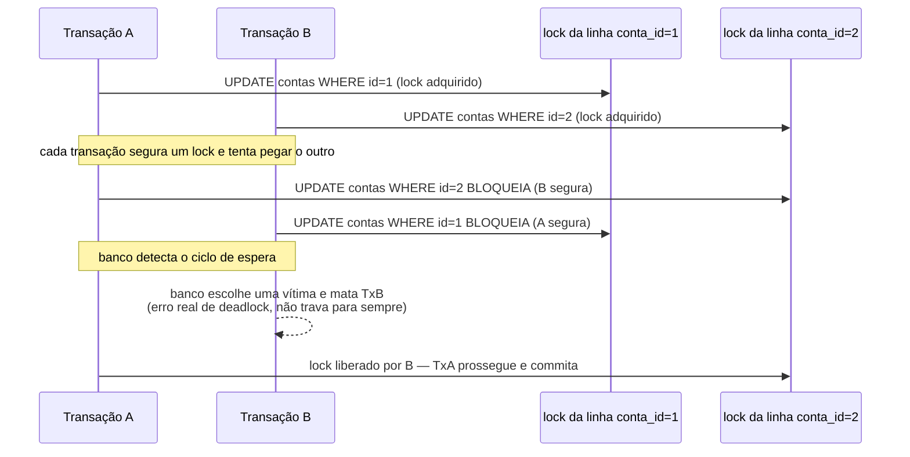

# Transações e isolamento — ACID na prática, isolation levels, deadlocks de aplicação

> [!abstract] TL;DR
> Uma transação de banco garante **ACID**: Atomicity (tudo ou nada — se qualquer passo falha, o banco desfaz tudo, não deixa meio-caminho persistido), Consistency (constraints do banco protegem invariantes mesmo quando a aplicação erra), Isolation (transações concorrentes não enxergam o trabalho inacabado umas das outras — o foco desta nota) e Durability (depois do `COMMIT`, o dado sobrevive a crash, porque foi escrito no *write-ahead log* antes da confirmação). Isolation é o eixo mais sutil porque é **regulável**: o SQL padrão define quatro níveis — `READ UNCOMMITTED`, `READ COMMITTED`, `REPEATABLE READ`, `SERIALIZABLE` — cada um proibindo uma anomalia a mais que o anterior (dirty read → non-repeatable read → phantom read) ao custo de mais bloqueio e menos concorrência. PostgreSQL usa `READ COMMITTED` como padrão; SQLite serializa toda escrita por padrão (só uma transação de escrita por vez no banco inteiro), o que mascara a maioria dessas anomalias em teste local. Quando duas transações competem por locks de linhas em ordem diferente, o banco pode entrar em **deadlock** — o mesmo problema estrutural do [[03-Dominios/Tecnologia/Python/Concorrência e paralelismo/02 - Sincronização avançada — Semaphore, Condition, Event, Barrier|deadlock de threading]], só que os "locks" agora são linhas de tabela e quem detecta e mata uma das transações é o próprio banco, não o programador.

## O bug que abre esta nota

Um sistema bancário simples transfere dinheiro entre duas contas. A operação parece óbvia: debitar de uma, creditar na outra.

```python
from sqlalchemy.orm import Session
from sqlalchemy import select

def transferir_SEM_transacao(engine, id_origem: int, id_destino: int, valor_centavos: int):
    with Session(engine) as session:
        origem = session.get(Conta, id_origem)
        origem.saldo_centavos -= valor_centavos
        session.commit()                      # ① commit #1 — debitou, já é permanente

        if valor_centavos > 100_000_00:
            raise ValueError("valor acima do limite de transferência única")
        # 💥 exceção acontece AQUI — depois do débito já ter sido commitado

        destino = session.get(Conta, id_destino)
        destino.saldo_centavos += valor_centavos
        session.commit()                      # ② nunca executa
```

Se a validação de limite falhar entre os dois `commit()`, o dinheiro **desaparece**: saiu da conta de origem (commit #1 já é permanente, não há como desfazer sem uma nova operação manual) e nunca chegou à conta de destino (commit #2 nunca rodou). Não é um bug exótico — é o resultado natural de tratar duas operações relacionadas como se fossem independentes. A correção não precisa reescrever a lógica de negócio, só precisa amarrar as duas mudanças numa única transação:

```python
def transferir_COM_transacao(engine, id_origem: int, id_destino: int, valor_centavos: int):
    with Session(engine) as session:
        with session.begin():                 # abre a transação explicitamente
            origem = session.get(Conta, id_origem)
            origem.saldo_centavos -= valor_centavos

            if valor_centavos > 100_000_00:
                raise ValueError("valor acima do limite de transferência única")
            # 💥 exceção ainda acontece aqui — mas agora nada foi commitado

            destino = session.get(Conta, id_destino)
            destino.saldo_centavos += valor_centavos
        # saída do `with session.begin()`:
        #   sem exceção → COMMIT automático (as duas mudanças juntas)
        #   com exceção → ROLLBACK automático (nenhuma das duas mudanças fica)
```

> [!bug] O que está quebrado, em uma frase
> Sem uma transação amarrando as duas operações, cada `session.commit()` isolado torna aquele passo permanente por conta própria — se o segundo passo falhar, o primeiro já não pode mais ser desfeito automaticamente; com `session.begin()` como bloco único, ou as duas mudanças são persistidas juntas, ou nenhuma é.

O `with session.begin()` é o contrato de **Atomicity**: tudo dentro do bloco acontece como uma unidade indivisível do ponto de vista de qualquer observador externo — o banco nunca mostra um estado onde o débito aconteceu mas o crédito não. É a primeira das quatro garantias que esta nota percorre, antes de mergulhar na mais sutil das quatro: Isolation.

## ACID, com exemplo Python para cada letra

**ACID** é o acrônimo consagrado (formalizado por Härder e Reuter em 1983, mas descrevendo garantias já buscadas por sistemas transacionais anteriores) para as quatro propriedades que um banco relacional promete sobre uma transação. Cada uma tem uma manifestação concreta em código, não só uma definição de livro-texto.

### Atomicity — tudo ou nada

Já demonstrada acima: `with session.begin():` (ou, no nível mais baixo do Core, `with connection.begin():` — ver [[01 - SQLAlchemy Core — Engine, Connection e expressão SQL|nota 01 do galho]]) delimita o que conta como uma unidade atômica. Se qualquer exceção propaga para fora do bloco antes de sair normalmente, o SQLAlchemy emite `ROLLBACK` automaticamente; se o bloco termina sem exceção, emite `COMMIT`. Não existe estado intermediário visível de fora — ou a transação inteira "aconteceu", ou nenhuma parte dela aconteceu.

```python
try:
    with session.begin():
        session.add(Pedido(cliente_id=1, valor_centavos=15000))
        session.add(ItemPedido(pedido_id=..., produto_id=99, quantidade=3))
        # se o segundo add() (ou qualquer flush/constraint check) falhar,
        # o primeiro INSERT já emitido dentro da MESMA transação
        # é desfeito junto no ROLLBACK — nunca fica um Pedido órfão sem itens
except Exception:
    print("nem Pedido nem ItemPedido foram persistidos")
```

### Consistency — o banco protege invariantes mesmo com bug na aplicação

**Consistency**, no sentido ACID, não é sobre réplicas concordando entre si (esse é outro uso da palavra, do teorema CAP — fora do escopo desta nota, tratado em System Design) — é sobre a transação nunca deixar o banco num estado que viole suas próprias regras declaradas: `NOT NULL`, `UNIQUE`, `FOREIGN KEY`, `CHECK`. A garantia interessante aqui é que essas constraints protegem o banco **mesmo quando a aplicação Python tem um bug** que tentaria violá-las.

```python
from sqlalchemy import CheckConstraint

class Conta(Base):
    __tablename__ = "contas"
    id: Mapped[int] = mapped_column(primary_key=True)
    saldo_centavos: Mapped[int] = mapped_column()

    __table_args__ = (
        CheckConstraint("saldo_centavos >= 0", name="ck_saldo_nao_negativo"),
    )

# bug na aplicação: subtrai sem checar saldo suficiente
with session.begin():
    conta = session.get(Conta, 1)          # saldo_centavos = 5000
    conta.saldo_centavos -= 10_000         # bug: nada valida isso em Python
# ao fazer flush/commit:
# sqlalchemy.exc.IntegrityError: CheckViolation: new row for relation "contas"
# violates check constraint "ck_saldo_nao_negativo"
```

O bug existe — nada em Python impediu `saldo_centavos -= 10_000` de rodar — mas o banco recusa persistir o estado inválido, porque a `CHECK CONSTRAINT` é avaliada no `flush()`, dentro da mesma transação, antes de qualquer `COMMIT` tornar o dado visível para o resto do sistema. Essa é a diferença entre validação **na aplicação** (útil para dar erro cedo e amigável) e validação **no banco** (a última linha de defesa, que vale mesmo se a validação da aplicação tiver um bug, for esquecida num novo endpoint, ou for contornada por um script de manutenção que escreve direto no banco).

### Isolation — o assunto central desta nota

Coberta em profundidade na próxima seção — o que significa dizer que duas transações concorrentes "não se veem" enquanto ambas estão em aberto, e os graus reguláveis dessa garantia.

### Durability — breve

**Durability** é a promessa mais simples de enunciar e a mais cara de implementar corretamente: depois que `COMMIT` retorna com sucesso, o dado sobrevive a qualquer falha subsequente — crash do processo do banco, queda de energia, reboot do SO. O mecanismo por trás, na maioria dos bancos relacionais (PostgreSQL incluído), é o **write-ahead log (WAL)**: antes de confirmar o `COMMIT` ao cliente, o banco escreve um registro da mudança num log sequencial em disco e força um `fsync()` (garantindo que o SO realmente gravou os bytes em mídia persistente, não só no cache da página) — só depois disso o `COMMIT` retorna. Se o processo do banco cair um milissegundo depois, o WAL na próxima inicialização é reaplicado, reconstruindo o estado que tinha sido confirmado. A aplicação Python nunca interage com o WAL diretamente — só precisa saber que `commit()` bem-sucedido é uma garantia real, não uma expectativa otimista, e que um `commit()` que lança exceção **não** deve ser tratado como "provavelmente funcionou".

## Isolation levels: o que cada um previne

Isolation regula uma tensão direta: quanto mais uma transação é isolada das outras, menos anomalias ela vê — mas também menos concorrência o banco consegue sustentar, porque isolamento mais forte normalmente significa mais bloqueio (ou mais trabalho de detecção de conflito). O padrão SQL define quatro níveis, cada um proibindo uma anomalia a mais que o anterior:


| Nível | Dirty read | Non-repeatable read | Phantom read | Uso típico |
|---|---|---|---|---|
| `READ UNCOMMITTED` | permite | permite | permite | Raro na prática — PostgreSQL trata como sinônimo de `READ COMMITTED` (nunca implementou de fato) |
| `READ COMMITTED` | **proíbe** | permite | permite | **Padrão do PostgreSQL, MySQL InnoDB (via variante), SQL Server** |
| `REPEATABLE READ` | proíbe | **proíbe** | permite* | Relatórios/leituras longas que precisam de um snapshot estável |
| `SERIALIZABLE` | proíbe | proíbe | **proíbe** | Invariantes financeiras/de estoque que não toleram nenhuma anomalia |

`*` No PostgreSQL especificamente, `REPEATABLE READ` também previne phantom read na prática (implementado via *snapshot isolation*, mais forte que o mínimo exigido pelo padrão SQL para esse nível) — mas o padrão SQL em si só garante isso a partir de `SERIALIZABLE`. Vale conferir a documentação do banco específico em uso; o comportamento exato de `REPEATABLE READ` varia entre PostgreSQL, MySQL e SQL Server.

As três anomalias, na ordem em que os níveis as fecham:

- **Dirty read**: ler um dado que outra transação escreveu mas ainda **não commitou** — se aquela transação der rollback, o dado lido nunca existiu de verdade.
- **Non-repeatable read**: ler a mesma linha duas vezes dentro da mesma transação e obter valores diferentes, porque outra transação commitou uma mudança **entre** as duas leituras.
- **Phantom read**: rodar a mesma query de **intervalo** (`WHERE valor > 100`) duas vezes dentro da mesma transação e obter um conjunto de linhas diferente, porque outra transação inseriu/removeu linhas que passaram a satisfazer (ou deixaram de satisfazer) o filtro.

### Dirty read acontecendo de fato

SQLite não serve para este exemplo — ele nunca implementou `READ UNCOMMITTED` de forma que uma transação veja escrita não commitada de outra (as escritas são inteiramente serializadas por padrão, ver seção seguinte). O exemplo abaixo é conceitual contra PostgreSQL, com duas sessões SQLAlchemy concorrentes; rodar de fato exige um PostgreSQL real e `isolation_level="READ UNCOMMITTED"` — que o próprio PostgreSQL trata como `READ COMMITTED`, então **dirty read é estruturalmente impossível de reproduzir em PostgreSQL**, mesmo pedindo o nível mais fraco. É informação relevante por si só: PostgreSQL nunca expõe dado não commitado, ponto.

```python
# Sessão A (transação em aberto, SEM commit ainda)
with session_a.begin():
    conta = session_a.get(Conta, 1)
    conta.saldo_centavos = 999_999          # mudança em memória + flush, mas SEM commit
    # ... transação A continua aberta aqui, aguardando outra operação

# Sessão B, concorrente, tentando ler o valor "sujo" de A
with session_b.begin():
    stmt = select(Conta.saldo_centavos).where(Conta.id == 1)
    valor = session_b.execute(stmt).scalar_one()
    # em READ UNCOMMITTED (outro banco, ex. algumas configurações de SQL Server):
    #   valor == 999_999 — dado que A ainda pode desfazer com rollback
    # em READ COMMITTED (PostgreSQL, padrão):
    #   valor == o saldo ANTERIOR — B não vê nada até A commitar
```

### Non-repeatable read acontecendo de fato (contra `READ COMMITTED`)

Este é reproduzível de verdade contra PostgreSQL, e é o comportamento **default** — vale rodar contra um Postgres real para ver a anomalia acontecer:

```python
# Sessão A abre uma transação e lê o saldo duas vezes, com uma pausa no meio
with session_a.begin():
    saldo_1 = session_a.execute(
        select(Conta.saldo_centavos).where(Conta.id == 1)
    ).scalar_one()
    print(f"1ª leitura: {saldo_1}")          # ex: 5000

    # --- ENQUANTO isso, Sessão B (outro processo/thread) roda e COMMITA ---
    with session_b.begin():
        conta_b = session_b.get(Conta, 1)
        conta_b.saldo_centavos = 8000
    # session_b já commitou aqui

    saldo_2 = session_a.execute(
        select(Conta.saldo_centavos).where(Conta.id == 1)
    ).scalar_one()
    print(f"2ª leitura: {saldo_2}")          # em READ COMMITTED: 8000 — MUDOU dentro da mesma transação A
```

Em `READ COMMITTED` (padrão do PostgreSQL), cada `SELECT` dentro da transação A vê o snapshot mais recente **commitado no momento daquele SELECT específico** — não o snapshot do início da transação. É por isso que `saldo_2` reflete a mudança de B, mesmo que A nunca tenha commitado nada entre as duas leituras. Em `REPEATABLE READ`, a transação A tira um snapshot no início e todas as leituras subsequentes veem exatamente aquele snapshot — `saldo_2` seria `5000`, igual a `saldo_1`, independente do que B fizer e commitar no meio tempo.

```python
from sqlalchemy import create_engine

engine = create_engine("postgresql+psycopg://...", isolation_level="REPEATABLE READ")
# ou, por transação específica:
with engine.connect().execution_options(isolation_level="REPEATABLE READ") as conn:
    with conn.begin():
        ...
```

### Phantom read acontecendo de fato

Diferença chave em relação a non-repeatable read: não é a mesma linha mudando de valor, é o **conjunto de linhas que satisfaz um filtro** mudando entre duas execuções da mesma query dentro da transação.

```python
# Sessão A, em REPEATABLE READ, conta quantos pedidos estão "pendente"
with session_a.begin():
    total_1 = session_a.execute(
        select(func.count()).select_from(Pedido).where(Pedido.status == "pendente")
    ).scalar_one()
    print(f"1ª contagem: {total_1}")         # ex: 12

    # --- Sessão B insere um novo pedido pendente e commita ---
    with session_b.begin():
        session_b.add(Pedido(cliente_id=7, status="pendente", valor_centavos=3000))

    total_2 = session_a.execute(
        select(func.count()).select_from(Pedido).where(Pedido.status == "pendente")
    ).scalar_one()
    print(f"2ª contagem: {total_2}")
    # padrão SQL: REPEATABLE READ NÃO garante proteção contra phantom read → poderia ser 13
    # PostgreSQL especificamente: REPEATABLE READ usa snapshot isolation e AQUI total_2 == 12
    #   (o novo pedido de B não aparece no snapshot que A já tirou)
    # SERIALIZABLE: garantido 12 em qualquer banco compatível com o padrão
```

A pegadinha prática: se o código depende de "nenhuma linha nova aparece durante minha transação", `SERIALIZABLE` é a única garantia formalmente portável entre bancos — confiar no comportamento mais forte que o PostgreSQL dá de graça em `REPEATABLE READ` funciona, mas amarra o código a um detalhe de implementação específico do PostgreSQL, não ao padrão SQL.

## `session.begin()` no SQLAlchemy, `transaction.atomic()` no Django

O padrão usado em toda esta nota — `with session.begin():` — é a forma explícita e recomendada no SQLAlchemy 2.0 de delimitar uma transação: abre no `__enter__`, commita no `__exit__` sem exceção, dá rollback no `__exit__` com exceção. Existe também a forma implícita, onde a `Session` já mantém uma transação aberta assim que qualquer operação acontece (autobegin), exigindo `session.commit()`/`session.rollback()` explícitos:

```python
# Forma explícita (recomendada) — escopo da transação é o bloco `with`
with Session(engine) as session:
    with session.begin():
        session.add(Pedido(...))
    # commit/rollback já aconteceu ao sair do `with session.begin()`

# Forma implícita — autobegin, transação encerrada manualmente
with Session(engine) as session:
    session.add(Pedido(...))
    session.commit()          # se esquecer isso, a transação fica pendurada até session.close()
```

O padrão Django ORM equivalente é `transaction.atomic()`, com a mesma semântica de bloco (commit ao sair normalmente, rollback em exceção) e a vantagem de ser **aninhável** via savepoints — `atomic()` dentro de `atomic()` cria um savepoint, permitindo desfazer só a parte interna sem abortar a transação externa inteira:

```python
from django.db import transaction

# equivalente direto ao with session.begin() do SQLAlchemy
with transaction.atomic():
    origem.saldo -= valor
    origem.save()
    destino.saldo += valor
    destino.save()
    # exceção aqui → ROLLBACK de tudo dentro do bloco atomic()

# aninhamento com savepoint — só a parte interna é desfeita
with transaction.atomic():
    pedido.save()
    try:
        with transaction.atomic():          # savepoint aninhado
            processar_pagamento_arriscado(pedido)
    except PagamentoRecusado:
        pass  # savepoint interno desfeito; `pedido.save()` externo permanece
```

O SQLAlchemy também suporta savepoints (`session.begin_nested()`), com a mesma ideia — mas o uso mais comum em Django tende a ser mais implícito (decorador `@transaction.atomic` em views inteiras), enquanto SQLAlchemy tende a expor o bloco explicitamente no ponto exato onde a atomicidade é necessária. A diferença de filosofia ecoa o contraste já visto entre os dois ORMs na [[04 - Django ORM — QuerySets, managers e migrations nativas|nota 04 do galho]]: Django integra mais decisões no framework, SQLAlchemy deixa mais explícito no código de quem chama.

## SQLite: uma ressalva necessária sobre isolation levels

SQLite **não implementa isolation levels ajustáveis** da mesma forma que PostgreSQL. Por padrão, ele serializa toda escrita no nível do banco inteiro — só uma transação de escrita pode estar em aberto por vez (as demais bloqueiam ou recebem `database is locked`), o que na prática torna a maioria das anomalias descritas acima **impossíveis de reproduzir** contra SQLite: se só uma escrita acontece por vez, não há como uma segunda transação ler dado sujo de uma primeira ainda em aberto, porque a segunda transação de escrita nem consegue começar até a primeira terminar. Leituras concorrentes com uma escrita em aberto são possíveis (modo WAL do próprio SQLite, não confundir com o WAL genérico de Durability), mas o modelo de concorrência inteiro é mais simples e mais restritivo que o de um banco cliente-servidor como PostgreSQL.

> [!warning] Não valide isolation levels contra SQLite
> Testes automatizados que usam SQLite em memória (comum em suites de teste Python por velocidade) **não conseguem reproduzir** dirty read, non-repeatable read nem a maioria dos cenários de deadlock de duas transações concorrentes descritos nesta nota — porque SQLite serializa escritas por padrão. Código que depende de um isolation level específico (`REPEATABLE READ`, `SERIALIZABLE`) precisa ser testado contra o banco real de produção (PostgreSQL, tipicamente via `testcontainers` ou um banco de teste dedicado) — testar só contra SQLite dá falso sentido de segurança.

## Deadlock de transação: o paralelo com deadlock de threading

[[03-Dominios/Tecnologia/Python/Concorrência e paralelismo/02 - Sincronização avançada — Semaphore, Condition, Event, Barrier|A nota de sincronização avançada do Galho 7]] já cobriu deadlock de threading em profundidade — duas threads competindo por dois `Lock`s Python em ordem invertida, cada uma travada esperando o lock que a outra segura, sem nenhuma delas conseguir prosseguir. **Deadlock de transação é estruturalmente o mesmo problema**, só que os "locks" não são objetos `threading.Lock()` em memória — são locks de linha (ou de tabela) que o próprio banco adquire implicitamente a cada `UPDATE`/`DELETE`, e liberados só no `COMMIT` ou `ROLLBACK` da transação inteira.



A diferença crucial em relação ao deadlock de `threading.Lock()`: **o banco detecta o ciclo de espera ativamente** (PostgreSQL roda um detector de deadlock periódico) e mata uma das transações envolvidas, devolvendo um erro real ao cliente — a aplicação não trava para sempre, ela recebe uma exceção e precisa decidir o que fazer com ela. Isso é diferente de dois `threading.Lock()` Python competindo, onde não existe detector algum e o processo trava silenciosamente para sempre (o cenário exato do bug de abertura da nota de threading).

```python
import time
from sqlalchemy.exc import OperationalError

def transferir_ordem_A_para_B(engine, id_1: int, id_2: int, valor: int):
    """Debita id_1, credita id_2 — nessa ordem."""
    with Session(engine) as session:
        with session.begin():
            conta_1 = session.get(Conta, id_1)
            conta_1.saldo_centavos -= valor
            time.sleep(0.1)                    # dá tempo pra outra transação colidir
            conta_2 = session.get(Conta, id_2)
            conta_2.saldo_centavos += valor

def transferir_ordem_B_para_A(engine, id_1: int, id_2: int, valor: int):
    """MESMAS duas linhas, ORDEM INVERTIDA — a receita do deadlock."""
    with Session(engine) as session:
        with session.begin():
            conta_2 = session.get(Conta, id_2)
            conta_2.saldo_centavos -= valor
            time.sleep(0.1)
            conta_1 = session.get(Conta, id_1)
            conta_1.saldo_centavos += valor

# Thread 1: transferir_ordem_A_para_B(engine, 1, 2, 500)
# Thread 2: transferir_ordem_B_para_A(engine, 1, 2, 300)   <- ordem trocada nas linhas!
#
# Uma das duas eventualmente recebe:
# sqlalchemy.exc.OperationalError: (psycopg.errors.DeadlockDetected)
# deadlock detected
# DETAIL: Process 1234 waits for ShareLock on transaction 5678;
# blocked by process 5678.
```

O erro `DeadlockDetected` é real, específico, e vem com detalhe suficiente (PIDs das transações envolvidas, quais locks cada uma esperava) para diagnosticar — bem diferente do deadlock de threading, que trava sem deixar rastro.

### Como evitar: ordem consistente + retry com backoff

As duas defesas contra deadlock de transação espelham exatamente as defesas contra deadlock de threading vistas na nota do Galho 7 — **lock ordering consistente** é a primeira linha de defesa, sempre:

```python
def transferir_ordem_consistente(engine, id_origem: int, id_destino: int, valor: int):
    """Trava SEMPRE na ordem crescente de id, não na ordem 'origem, destino'
    do domínio de negócio — elimina o ciclo de espera por construção."""
    id_menor, id_maior = sorted([id_origem, id_destino])

    with Session(engine) as session:
        with session.begin():
            conta_menor = session.get(Conta, id_menor)   # sempre trava a de id menor primeiro
            conta_maior = session.get(Conta, id_maior)    # depois a de id maior

            if id_origem == id_menor:
                conta_menor.saldo_centavos -= valor
                conta_maior.saldo_centavos += valor
            else:
                conta_maior.saldo_centavos -= valor
                conta_menor.saldo_centavos += valor
```

Ordenar por uma chave estável (id crescente, por exemplo) garante que **toda** transação que toca as contas 1 e 2 adquire os locks na mesma ordem, não importa se é uma transferência "de 1 para 2" ou "de 2 para 1" do ponto de vista do negócio — elimina o ciclo de espera na raiz, porque não existem mais duas transações esperando em direções opostas.

Quando a ordem consistente não é viável (por exemplo, o conjunto de linhas tocado varia dinamicamente e não dá para ordenar previsivelmente), a segunda linha de defesa é **capturar o erro de deadlock especificamente e tentar de novo**, com backoff para não martelar o banco:

```python
import random

def transferir_com_retry(engine, id_origem: int, id_destino: int, valor: int, tentativas: int = 3):
    for tentativa in range(1, tentativas + 1):
        try:
            with Session(engine) as session:
                with session.begin():
                    origem = session.get(Conta, id_origem)
                    origem.saldo_centavos -= valor
                    destino = session.get(Conta, id_destino)
                    destino.saldo_centavos += valor
            return  # sucesso
        except OperationalError as e:
            if "deadlock detected" not in str(e).lower():
                raise  # não é deadlock — não faz sentido re-tentar cegamente
            if tentativa == tentativas:
                raise  # esgotou as tentativas, propaga o erro real
            espera = (2 ** tentativa) + random.uniform(0, 0.1)   # backoff exponencial + jitter
            time.sleep(espera)
```

O ponto importante do `except`: **só** re-tentar quando o erro é especificamente deadlock — qualquer outro `OperationalError` (conexão caiu, constraint violada, banco fora do ar) deve propagar normalmente, porque re-tentar cegamente esconderia bugs reais atrás de um retry silencioso.

## Armadilhas comuns

> [!warning] Assumir `session.commit()` isolado como transação atômica multi-passo
> **O que acontece:** duas ou mais operações relacionadas (débito + crédito, criação de pedido + itens) são commitadas em chamadas separadas de `session.commit()`, sem um `session.begin()` envolvendo as duas — se a segunda falhar, a primeira já é permanente. **Por quê:** cada `commit()` finaliza a transação atual e implicitamente inicia uma nova (autobegin) — não existe atomicidade entre dois commits distintos, só dentro de um único bloco transacional. **Como evitar:** delimitar `with session.begin():` (ou o equivalente `transaction.atomic()` do Django) em volta de todo o conjunto de operações que precisa ser tudo-ou-nada.

> [!warning] Testar isolation level contra SQLite e generalizar o resultado
> **O que acontece:** um teste automatizado roda contra SQLite em memória, não reproduz nenhuma anomalia de concorrência, e a equipe conclui erroneamente que o código está correto sob concorrência real. **Por quê:** SQLite serializa escritas por padrão — a maioria das condições de corrida entre transações simplesmente não existe nesse banco, porque só uma transação de escrita roda por vez. **Como evitar:** testar cenários de isolation/deadlock contra o banco real de produção (PostgreSQL via `testcontainers` ou instância de teste dedicada), nunca só contra SQLite.

> [!warning] Re-tentar qualquer `OperationalError` como se fosse deadlock
> **O que acontece:** um `except OperationalError` genérico re-tenta a operação inteira sem checar a mensagem específica — mascarando erros reais (conexão perdida, timeout, banco fora do ar) atrás de retries silenciosos que não vão resolver o problema real. **Por quê:** `OperationalError` é uma categoria ampla no SQLAlchemy — deadlock é só um dos motivos possíveis, e cada um pede uma resposta diferente. **Como evitar:** checar a mensagem/código de erro especificamente por "deadlock detected" (ou o código de erro do driver específico, ex. `psycopg.errors.DeadlockDetected`) antes de decidir re-tentar.

> [!warning] Confiar em `REPEATABLE READ` do PostgreSQL como se fosse garantia do padrão SQL
> **O que acontece:** código que depende de `REPEATABLE READ` prevenir phantom read funciona em PostgreSQL mas quebra ao migrar para outro banco (ou ao trocar de driver/config) que segue estritamente o mínimo exigido pelo padrão SQL para esse nível. **Por quê:** o padrão SQL só garante ausência de phantom read a partir de `SERIALIZABLE`; o comportamento mais forte de `REPEATABLE READ` no PostgreSQL é uma característica da implementação (snapshot isolation), não uma garantia portável. **Como evitar:** se o código realmente não pode tolerar phantom read em nenhuma circunstância, usar `SERIALIZABLE` explicitamente, documentando a decisão — não depender de um detalhe de implementação específico de um banco.

## Em entrevista

Isolation levels e deadlock de transação são perguntas recorrentes em entrevistas backend de nível pleno/sênior — testam se o candidato entende concorrência de banco como mecanismo, não como trivia decorada.

> "ACID's Isolation property is regulated, not binary — SQL defines four levels, each closing off one more anomaly than the last: dirty read, non-repeatable read, and phantom read. PostgreSQL's default is `READ COMMITTED`, which stops dirty reads — you never see another transaction's uncommitted writes — but each `SELECT` inside your transaction still sees the latest committed snapshot at the moment it runs, so the same row can return different values across two reads in the same transaction. `REPEATABLE READ` fixes that by taking one snapshot at the start of the transaction. `SERIALIZABLE` is the strongest — no anomaly gets through, at the cost of the most contention and potential serialization failures the application has to retry. Deadlock is the sharp edge of all this: it's structurally identical to a threading deadlock — two transactions each holding a row lock the other one wants, in a wait cycle — except the database actively detects the cycle and kills one of the transactions with a real, catchable error, instead of just hanging forever like two Python threads would. The fix is the same in both worlds: consistent lock ordering eliminates the cycle at the source; when that's not possible, catch the specific deadlock error and retry with backoff."

Uma pergunta de acompanhamento comum: **"por que o SQLite não é um bom lugar para testar isso?"** — a resposta sênior nomeia a serialização de escritas por padrão do SQLite como a razão estrutural, não um detalhe de configuração ajustável.

> [!question]- E se perguntarem "qual isolation level você usaria por padrão?"
> A resposta sênior não é "sempre `SERIALIZABLE` para ser seguro" — `SERIALIZABLE` tem custo real de concorrência e pode produzir erros de serialização que a aplicação precisa tratar com retry, mesmo sem deadlock verdadeiro. A resposta é situacional: `READ COMMITTED` (o próprio padrão do PostgreSQL) é suficiente para a maioria dos casos de uso CRUD comuns, onde non-repeatable read dentro de uma única transação curta raramente importa na prática; `REPEATABLE READ` ou `SERIALIZABLE` entram quando a lógica de negócio depende explicitamente de um snapshot estável ou de garantias mais fortes — por exemplo, contagens/agregações que alimentam uma decisão dentro da própria transação (reservar o último assento disponível, aplicar um desconto baseado em total acumulado). Escolher o nível mais forte disponível "por garantia", sem necessidade real, é trocar throughput por uma garantia que o caso de uso não pede.

## Como explicar em inglês

| PT | EN |
|----|----|
| atomicidade | atomicity |
| consistência | consistency |
| isolamento | isolation |
| durabilidade | durability |
| leitura suja | dirty read |
| leitura não repetível | non-repeatable read |
| leitura fantasma | phantom read |
| nível de isolamento | isolation level |
| bloqueio de linha | row lock |
| impasse (banco de dados) | deadlock |
| ordem de aquisição de locks | lock ordering |
| write-ahead log | write-ahead log (WAL) — termo já em inglês no PT técnico |
| tentar novamente com espera crescente | retry with backoff |
| ponto de salvamento (transação aninhada) | savepoint |

## O que vem a seguir

Esta nota fechou o núcleo de correção transacional do galho — ACID com exemplos reais, isolation levels regulando o que uma transação concorrente pode enxergar, e deadlock de transação como o paralelo direto do deadlock de threading do Galho 7. As próximas peças do galho constroem sobre isso:

- [[07 - Connection pooling e performance em produção|07 — Connection pooling e performance em produção]] — depois de garantir *correção* transacional, o próximo passo é *performance*: como o SQLAlchemy reutiliza conexões TCP já autenticadas em vez de abrir uma nova a cada transação.
- [[08 - Capstone — projetando a camada de persistência de um serviço real|08 — Capstone do galho]] — integra transação atômica com isolation level explícito junto com modelagem (nota 02), migrations (nota 03), eager loading (nota 05) e pool de conexões (nota 07) num cenário único.
- [[02 - SQLAlchemy ORM — Session, mapped classes e relationships|02 — SQLAlchemy ORM]] — pré-requisito direto: a distinção `flush()`/`commit()` tocada ali de leve é o alicerce de tudo que esta nota constrói sobre atomicidade.
- [[03-Dominios/Tecnologia/Python/Concorrência e paralelismo/02 - Sincronização avançada — Semaphore, Condition, Event, Barrier|Galho 7 nota 02 — Sincronização avançada]] — pano de fundo conceitual do deadlock: mesmo ciclo de espera estrutural, mecanismo de detecção diferente.
- [[index|Persistência de dados (Galho 9)]] — MOC deste galho.

## Fontes

- PostgreSQL Global Development Group. *Transaction Isolation*. postgresql.org/docs, capítulo 13.2. https://www.postgresql.org/docs/current/transaction-iso.html (acessado em 2026-07-11) — definição oficial dos quatro níveis, comportamento real do PostgreSQL para cada um (incluindo `READ UNCOMMITTED` tratado como `READ COMMITTED`).
- PostgreSQL Global Development Group. *Explicit Locking — Deadlocks*. postgresql.org/docs, capítulo 13.3.4. https://www.postgresql.org/docs/current/explicit-locking.html#LOCKING-DEADLOCKS (acessado em 2026-07-11) — mecanismo de detecção de deadlock e a escolha de vítima.
- PostgreSQL Global Development Group. *Write-Ahead Logging (WAL)*. postgresql.org/docs, capítulo 30. https://www.postgresql.org/docs/current/wal-intro.html (acessado em 2026-07-11) — mecanismo de Durability.
- SQLAlchemy. *Managing Transactions*. docs.sqlalchemy.org, versão 2.0. https://docs.sqlalchemy.org/en/20/orm/session_transaction.html (acessado em 2026-07-11) — `session.begin()`, autobegin, `begin_nested()`/savepoints.
- SQLAlchemy. *Setting Transaction Isolation Levels including DBAPI Autocommit*. docs.sqlalchemy.org, versão 2.0. https://docs.sqlalchemy.org/en/20/orm/session_transaction.html#setting-transaction-isolation-levels-including-dbapi-autocommit (acessado em 2026-07-11) — `isolation_level` via `create_engine`/`execution_options`.
- Django Software Foundation. *Transactions*. docs.djangoproject.com. https://docs.djangoproject.com/en/stable/topics/db/transactions/ (acessado em 2026-07-11) — `transaction.atomic()`, aninhamento via savepoints.
- SQLite Consortium. *Isolation In SQLite*. sqlite.org/isolation.html. https://sqlite.org/isolation.html (acessado em 2026-07-11) — serialização de escritas por padrão, limitações de isolation level ajustável.
- [[03-Dominios/Tecnologia/Python/Concorrência e paralelismo/02 - Sincronização avançada — Semaphore, Condition, Event, Barrier|Sincronização avançada]] — nota do Galho 7, referenciada para o paralelo de deadlock.
- [[02 - SQLAlchemy ORM — Session, mapped classes e relationships|02 — SQLAlchemy ORM]] — nota irmã deste galho, pré-requisito direto.

Consultado em 2026-07-11.
