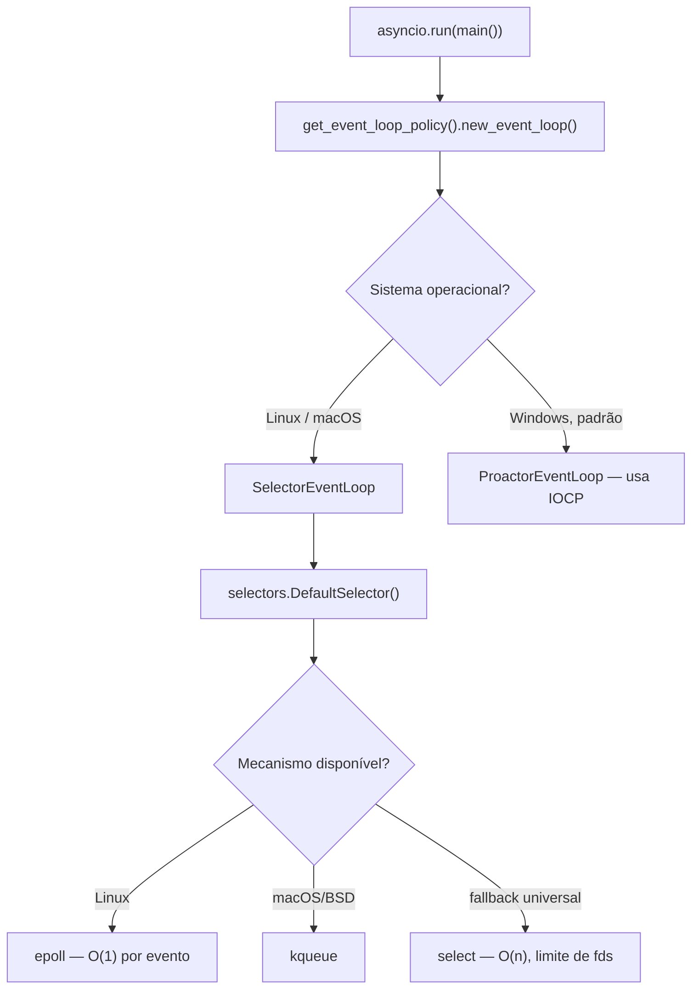
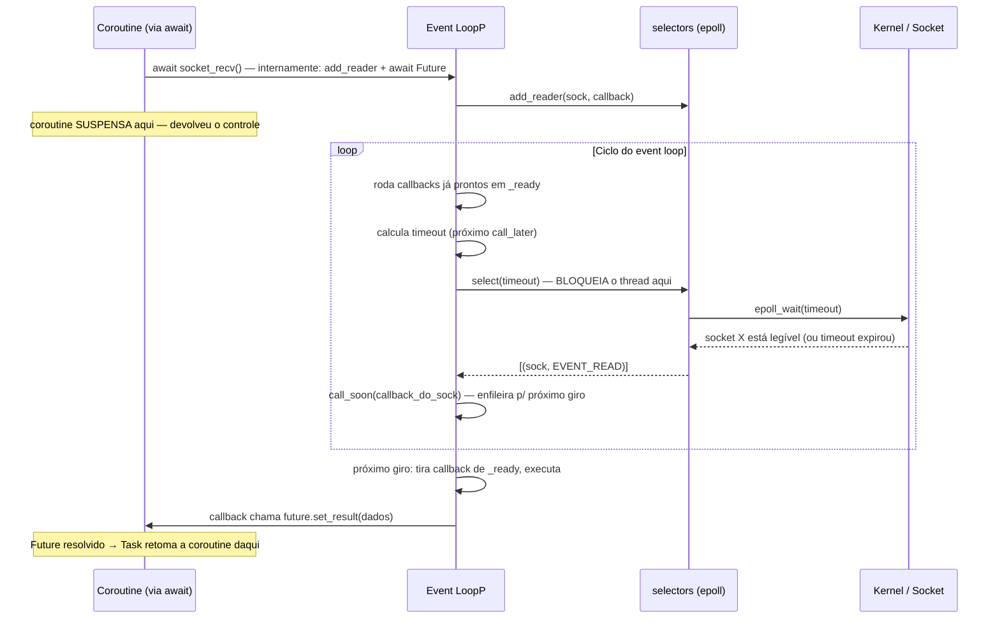
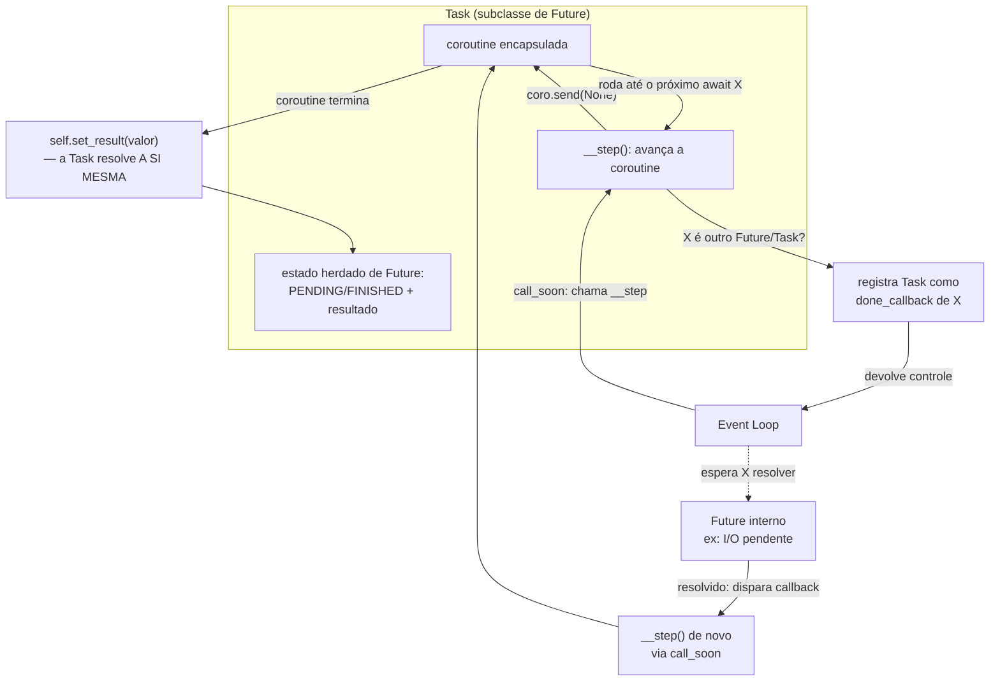

# Event loop por dentro — selectors, callbacks e a relação Future/Task

> [!abstract] TL;DR
> `asyncio.run()` não conjura concorrência do nada — ele instancia um **event loop concreto**, tipicamente `SelectorEventLoop` no Linux/macOS, construído sobre o módulo `selectors` da biblioteca padrão, que por sua vez escolhe a melhor chamada de sistema disponível (`epoll` no Linux, `kqueue` no macOS/BSD, `select` como fallback universal) para perguntar ao sistema operacional, de uma vez só, "quais destes N sockets estão prontos para leitura ou escrita agora?". O loop não fica girando em busy-wait: quando não há nenhum callback pronto para rodar imediatamente, ele bloqueia dentro dessa chamada de sistema, calculando o timeout exato até o próximo `call_later`/`call_at` agendado, e só acorda quando o SO sinaliza um socket pronto **ou** esse timeout expira — é aí que mora a eficiência de escalar a milhares de conexões com um único thread. `await` numa coroutine `asyncio` não é mágica de linguagem: nos pontos mais baixos da pilha, ele se traduz em registrar um callback via `loop.add_reader()`/`add_writer()` (ou, mais comumente hoje, via `loop.sock_recv()`/`sock_sendall()`, que fazem esse registro internamente) associado a um `Future`. `Future` é o objeto mais fundamental do modelo — uma "caixa" que ainda não tem valor, mas vai ter, com uma lista de callbacks a disparar quando `set_result()` ou `set_exception()` for chamado. `Task` **é**, literalmente, uma subclasse de `Future` (`class Task(Future)` no código-fonte do CPython) que adiciona uma coroutine encapsulada e o mecanismo de "avançar essa coroutine sozinha, um passo por vez, agendando-se de volta no loop a cada `await` interno até a coroutine terminar — e então resolver a si mesma (o `Future` que ela também é) com o resultado". `loop.call_soon()`, `call_later()` e `call_at()` são a camada de agendamento mais crua de todas: agendar uma função comum (não uma coroutine) para rodar no próximo giro do loop, depois de N segundos, ou num instante absoluto do relógio interno do loop — é o primitivo sobre o qual até `asyncio.sleep()` é implementado.

## O bug que abre esta nota

Uma desenvolvedora sênior está depurando um serviço que processa webhooks. O time decidiu, num momento de "vamos otimizar", trocar um `await asyncio.sleep(0)` espalhado pelo código — usado para forçar o loop a dar uma passada por outras tarefas pendentes — por uma chamada direta a `loop.call_soon(callback)`, pensando que seria "mais barato" por evitar o overhead de criar e aguardar uma coroutine. O código compila, os testes unitários passam. Em produção, porém, uma métrica específica — o tempo entre o webhook chegar e o handler correspondente processá-lo — começa a mostrar picos esporádicos e inexplicáveis, sempre nos mesmos horários de pico de tráfego.

```python
import asyncio

def processar_callback(nome):
    print(f"processando {nome}")

async def fluxo_com_callback_direto():
    print("início")
    loop = asyncio.get_running_loop()
    loop.call_soon(processar_callback, "webhook-1")   # agenda, mas NÃO espera
    print("fim da função — mas o callback ainda nem rodou!")
    # a função termina AQUI, call_soon só garantiu que vai rodar
    # em algum próximo giro do loop, não que já rodou

asyncio.run(fluxo_com_callback_direto())
```

Rodando esse trecho, a saída é:

```
início
fim da função — mas o callback ainda nem rodou!
processando webhook-1
```

A ordem surpreende quem espera que `call_soon` funcione como um `await` disfarçado: `loop.call_soon(processar_callback, "webhook-1")` **não** suspende a coroutine chamadora, **não** executa o callback imediatamente, e **não** devolve nada que possa ser aguardado. Ele só empurra `processar_callback` para uma fila interna do loop (`_ready`) e retorna instantaneamente — o restante de `fluxo_com_callback_direto()` continua rodando até seu próprio `return` (implícito, no fim da função) antes que o loop tenha qualquer chance de tirar `processar_callback` da fila e executá-lo. No caso do time de webhooks, o problema era mais sutil: `call_soon` funciona perfeitamente para "rodar isso assim que possível, sem bloquear ninguém" — mas o código presumia, incorretamente, que ele servia como ponto de sincronização, algo que só um `await` genuíno (numa coroutine, ou sobre um `Future`) garante.

> [!bug] O que está quebrado, em uma frase
> `loop.call_soon()` agenda um callback comum (não-`async`) para rodar no próximo giro do loop e retorna imediatamente — ele não é uma forma alternativa de `await`, não suspende quem chamou, e não oferece nenhum jeito nativo de esperar pelo resultado, porque não devolve um `Future` por conta própria.

Entender por que `call_soon` se comporta assim exige descer um andar abaixo do que a [[03-Dominios/Tecnologia/Python/Concorrência e paralelismo/06 - asyncio fundamentals — event loop, coroutines e Task|nota 06 do Galho 7]] cobriu — não o que `await`/`Task`/`asyncio.run()` fazem do ponto de vista de quem escreve `async def`, mas o mecanismo concreto por baixo: que objeto o Python realmente instancia, como ele descobre que um socket está pronto, e o que `Future` e `Task` são de fato, em termos de herança e de dados internos. É esse andar que esta nota abre.

## O que `asyncio.run()` de fato instancia

A [[03-Dominios/Tecnologia/Python/Concorrência e paralelismo/06 - asyncio fundamentals — event loop, coroutines e Task|nota 06]] já cobriu o ciclo de vida em alto nível — criar o loop, agendar a coroutine raiz, rodar até completar, fechar. O que ficou em aberto ali, deliberadamente, é: **qual classe concreta** é essa "instância nova de event loop"? A resposta depende do sistema operacional, e é definida por uma política de criação de loop (`asyncio.get_event_loop_policy()`), configurável mas raramente trocada na prática:

- **Linux e macOS**: `asyncio.SelectorEventLoop`, que delega a espera por I/O ao módulo `selectors` da biblioteca padrão.
- **Windows**: `asyncio.ProactorEventLoop` é o padrão desde o Python 3.8, porque o Windows não tem um equivalente direto de `epoll`/`kqueue` — o modelo nativo do Windows para I/O assíncrono é **IOCP** (I/O Completion Ports), estruturalmente um modelo de *proactor* (o SO notifica quando a operação **terminou**), diferente do modelo de *reactor* usado por `selectors` (o SO notifica quando um socket está **pronto para uma operação começar**). `SelectorEventLoop` também existe no Windows, mas com suporte reduzido (não suporta subprocessos, por exemplo), e por isso não é mais o padrão.

O módulo `selectors`, por sua vez, não implementa nenhum mecanismo de espera por I/O do zero — ele é uma camada de abstração fina sobre as chamadas de sistema que o SO já oferece, escolhendo automaticamente a melhor disponível:

| Mecanismo | Sistema | Característica |
|---|---|---|
| `epoll` | Linux | O(1) por evento — o kernel mantém a lista de sockets monitorados; complexidade não cresce com o número de sockets sendo consultados, só com o número de eventos prontos |
| `kqueue` | macOS, BSD | Equivalente conceitual do `epoll`, API própria do BSD |
| `select` | Universal (fallback) | O(n) — o kernel varre todos os sockets passados a cada chamada; existe um limite prático de descritores de arquivo (historicamente 1024 no `FD_SETSIZE`) que o torna inadequado para escala alta |

`selectors.DefaultSelector()` escolhe automaticamente `epoll`/`kqueue` quando disponíveis, caindo para `select` só como último recurso — é essa escolha automática que faz o mesmo código `asyncio` escalar bem em produção Linux sem o desenvolvedor jamais precisar tocar em `selectors` diretamente.



> [!question]- Por que "escolher o event loop" é uma decisão que a maioria do código nunca precisa tomar?
> Porque `asyncio.run()` já toma essa decisão automaticamente via `asyncio.get_event_loop_policy()`, e a política padrão já seleciona a implementação correta por sistema operacional. A única situação prática em que isso aparece explicitamente no código de aplicação é ao trocar a implementação por uma terceira (como `uvloop`, um event loop compatível com a API do `asyncio` mas escrito em Cython sobre `libuv`, tipicamente 2-4x mais rápido em benchmarks de I/O — trocado via `uvloop.install()` ou, no Python 3.12+, `asyncio.run(main(), loop_factory=uvloop.new_event_loop)`). Fora desse cenário de otimização deliberada, o mecanismo concreto por baixo é uma escolha que o próprio `asyncio` faz por você — mas saber que ela existe, e por que, é o que separa "sei usar `async`/`await`" de "entendo o que estou usando".

## Como I/O não-bloqueante é registrado e despachado

O núcleo do mecanismo — a peça que faz um `await socket_ops()` "voltar" no momento certo sem nunca bloquear o thread — é o par `loop.add_reader()`/`loop.add_writer()`, documentado em [asyncio-eventloop.html#watching-file-descriptors](https://docs.python.org/3/library/asyncio-eventloop.html#watching-file-descriptors). A API é de baixo nível o suficiente para não aparecer no código de aplicação comum (que usa `StreamReader`/`StreamWriter`, cobertos na próxima nota do galho, ou `sock_recv`/`sock_sendall`, que fazem esse registro internamente) — mas é exatamente o que essas camadas mais altas usam por baixo, e vale ver funcionando diretamente pelo menos uma vez para o mecanismo parar de ser uma caixa-preta.

```python
import asyncio
import socket

def le_dados_prontos(sock, future):
    # Chamado pelo loop QUANDO o socket sinaliza "pronto para leitura"
    # — não antes, não em polling, é o SO que avisa via epoll/kqueue.
    loop = asyncio.get_running_loop()
    loop.remove_reader(sock)   # registra só uma vez; remove após disparar
    try:
        dados = sock.recv(4096)
        future.set_result(dados)
    except Exception as exc:
        future.set_exception(exc)

async def ler_socket_manual(sock):
    loop = asyncio.get_running_loop()
    future = loop.create_future()   # Future "vazio" — ainda sem valor
    sock.setblocking(False)
    loop.add_reader(sock, le_dados_prontos, sock, future)
    # await aqui SUSPENDE esta coroutine até future.set_result() ser chamado
    # em algum callback disparado pelo loop — não há busy-wait, não há
    # polling ativo de "será que já chegou?" no código Python
    return await future
```

O fluxo completo, do ponto de vista do event loop, para uma única iteração:

1. **Registrar interesse**: `add_reader(sock, callback)` diz ao selector "avise quando `sock` estiver legível" — internamente, isso vira uma chamada equivalente a `epoll_ctl(EPOLL_CTL_ADD, sock.fileno(), EPOLLIN)`.
2. **Rodar callbacks já prontos**: o loop primeiro esvazia sua fila `_ready` — callbacks agendados via `call_soon()` (incluindo os "próximos passos" de `Task`s que já estavam prontas antes desta iteração).
3. **Calcular o timeout**: olhando a fila de agendamentos futuros (`call_later`/`call_at`, uma heap ordenada por tempo), o loop calcula quanto tempo pode ficar bloqueado na chamada de sistema sem perder nenhum prazo — se não há nada em `_ready` e o próximo `call_later` está a 3 segundos, o loop pode bloquear até 3 segundos (ou menos, se um evento de I/O chegar antes).
4. **Bloquear na chamada de sistema**: `selector.select(timeout)` — que por baixo chama `epoll_wait()` no Linux — bloqueia o **thread inteiro do processo Python**, mas de forma produtiva: o kernel acorda essa chamada assim que qualquer socket monitorado sinaliza pronto, **ou** quando o timeout expira, o que vier primeiro.
5. **Despachar eventos prontos**: para cada socket que voltou como pronto, o loop enfileira (via `call_soon`) o callback associado — não o executa ainda dentro do próprio `select()`, só agenda para a próxima passada pelo passo 2.
6. **Repetir**: volta ao passo 2 — o "próximo giro" já tem os callbacks recém-despachados prontos para rodar.



O detalhe que costuma escapar na primeira leitura: o `select()`/`epoll_wait()` **bloqueia o thread**, sim — mas isso não contradiz o modelo cooperativo, porque é exatamente o comportamento desejado quando não há absolutamente nada para fazer (nenhuma coroutine pronta para progredir, nenhum callback pendente). Bloquear ali é produtivo — o SO acorda o processo assim que há trabalho real, e o CPU fica livre para outros processos nesse meio tempo, em vez de o `asyncio` fazer *busy-waiting* (checar repetidamente "chegou? chegou? chegou?" num loop apertado, desperdiçando ciclos de CPU). É essa espera passiva e produtiva — delegada ao kernel, que já sabe monitorar milhares de descritores de arquivo eficientemente via `epoll` — que permite um único thread Python sustentar dezenas de milhares de conexões simultâneas com uso de CPU próximo de zero enquanto todas estão apenas esperando.

> [!warning] `add_reader`/`add_writer` é API de baixo nível — raramente usada em código de aplicação
> A documentação oficial (asyncio-eventloop.html) é explícita: os métodos "Low-level" do loop (`add_reader`, `add_writer`, `call_soon`, `create_future`, entre outros) existem principalmente para quem está implementando bibliotecas ou frameworks sobre `asyncio` (como `aiohttp` ou um driver de banco assíncrono), não para código de aplicação comum. Em código de produção, a interface certa é `StreamReader`/`StreamWriter` (via `asyncio.open_connection()`), cobertos na [[02 - Streams assíncronos — StreamReader, StreamWriter e protocolos de rede|próxima nota deste galho]], que envolvem exatamente esse mecanismo de `add_reader`/`Future` numa API que já devolve objetos aguardáveis (`await reader.read(...)`) sem expor o registro de callback diretamente.

## `Future`: a promessa de um valor, sem coroutine nenhuma

`asyncio.Future` é o objeto mais primitivo do modelo, documentado em [asyncio-future.html](https://docs.python.org/3/library/asyncio-future.html) — e vale isolá-lo de `Task` explicitamente, porque a confusão entre os dois é comum mesmo em quem já usa `asyncio` há tempo. Um `Future` **não tem coroutine nenhuma dentro dele** — é uma estrutura de dados relativamente simples: um estado (`PENDING`, `CANCELLED`, `FINISHED`), um lugar para guardar um resultado ou uma exceção, e uma lista de callbacks a disparar quando esse estado muda de `PENDING` para algo final.

```python
import asyncio

async def demonstrar_future():
    loop = asyncio.get_running_loop()
    future = loop.create_future()   # PENDING — sem valor, sem exceção

    def resolver_mais_tarde():
        future.set_result("valor resolvido por um callback qualquer")

    loop.call_later(1.0, resolver_mais_tarde)   # agenda a resolução

    print("future ainda pendente:", not future.done())
    resultado = await future   # SUSPENDE até set_result() ser chamado
    print("resultado:", resultado)

asyncio.run(demonstrar_future())
```

A API essencial de `Future` — a mesma que `Task` herda e reaproveita integralmente:

| Método/propriedade | O que faz |
|---|---|
| `set_result(valor)` | Marca o `Future` como concluído com `valor`; dispara os callbacks registrados |
| `set_exception(exc)` | Marca como concluído com uma exceção; `await future` relança `exc` no ponto do `await` |
| `result()` | Devolve o valor (ou relança a exceção) se já concluído; levanta `InvalidStateError` se ainda `PENDING` |
| `done()` | `True` se `PENDING` não é mais o estado (concluído, com erro, ou cancelado) |
| `cancel()` | Marca como `CANCELLED`; qualquer `await` pendente sobre ele recebe `CancelledError` |
| `add_done_callback(fn)` | Registra `fn(future)` para rodar quando `done()` se tornar `True` — o mecanismo interno por trás de `await future` |

O que faz `Future` ser *aguardável* (`await future` funcionar) é a implementação do método especial `__await__` — que, de forma simplificada, verifica se o `Future` já está `done()`; se não estiver, registra a coroutine chamadora para ser retomada via `add_done_callback`, devolve o controle ao event loop (é o ponto de suspensão real), e só volta a produzir um valor quando esse callback dispara. Esse mecanismo é o que o exemplo de `add_reader` da seção anterior usa por baixo — `await future` na coroutine, `future.set_result(dados)` chamado de dentro do callback registrado via `add_reader`, e a "ponte" entre os dois mundos (callback de baixo nível ↔ coroutine que estava suspensa) é inteiramente esse objeto `Future`.

## `Task`: `Future` + coroutine agendada — literalmente uma subclasse

A relação entre `Future` e `Task` não é uma analogia solta — é herança direta no código-fonte do CPython: `class Task(Future)`, no módulo `asyncio.tasks`. Toda a API que a seção anterior descreveu (`result()`, `done()`, `cancel()`, `add_done_callback()`) já vem de graça para uma `Task`, porque uma `Task` **é um** `Future` no sentido estrito de tipagem — `isinstance(minha_task, asyncio.Future)` é `True`.

O que `Task` acrescenta é a parte que faz uma coroutine efetivamente rodar sozinha, sem que ninguém precise chamar `next()` nela manualmente: internamente, cada `Task` guarda uma referência à coroutine que ela encapsula, e um método (`__step`, no código do CPython, não-público) que a documentação descreve conceitualmente como "avança a coroutine até o próximo ponto de suspensão". A cada chamada de `__step`:

1. A `Task` chama `coro.send(None)` (ou `coro.throw(exc)`, se estiver retomando após uma exceção) — literalmente o mesmo mecanismo de avançar um gerador manualmente, ilustrado na nota 06 do Galho 7.
2. A coroutine roda até seu próximo `await` — se esse `await` é sobre outro `Future` (incluindo outra `Task`, ou o resultado de `add_reader` como visto acima), a coroutine "devolve" esse `Future` via o mecanismo de geradores (`yield` interno da máquina de `await`).
3. A `Task` registra a si mesma como callback desse `Future` interno (`add_done_callback`) — "quando esse `Future` resolver, me chame de novo (`__step`) para eu continuar avançando a coroutine".
4. A `Task` devolve o controle ao event loop — que agora tem uma entrada a menos em `_ready` para processar imediatamente, e vai processar essa `Task` de novo só quando o `Future` interno resolver e disparar o callback do passo 3.
5. Quando a coroutine finalmente termina (`return` ou exceção não tratada), a `Task` chama `self.set_result(...)` ou `self.set_exception(...)` **em si mesma** — porque, sendo um `Future`, ela também precisa resolver seu próprio estado, para que quem estiver com `await minha_task` seja notificado.



Essa recursão — uma `Task` que avança sua coroutine, e cada `await` interno vira "espere este outro `Future`/`Task` resolver antes de me chamar de novo" — é o que produz, na prática, a intercalação cooperativa descrita na nota 06: dezenas de `Task`s, cada uma um `Future` esperando resolução, todas competindo pela mesma fila `_ready` do loop, nunca duas rodando simultaneamente, cada uma avançando um passo (até o próximo `await`) por vez que é chamada.

> [!question]- Se `Task` já é um `Future`, por que a documentação as trata como conceitos separados na prática?
> Porque a relação de herança é um detalhe de implementação que a maior parte do código de aplicação nunca precisa tocar diretamente — o que importa no dia a dia é a diferença de **uso pretendido**: um `Future` "cru" (via `loop.create_future()`) é o primitivo que bibliotecas de baixo nível usam para representar "um valor que vai chegar de uma operação que não é, ela mesma, uma coroutine Python" (o resultado de uma chamada de sistema, de uma extensão em C, de um callback de outra biblioteca) — não há coroutine nenhuma sendo avançada, só um sinalizador de "pronto" com um valor anexado. `asyncio.create_task(coroutine)` é o caso amplamente mais comum no código de aplicação: "eu tenho uma coroutine Python que eu quero agendar e ver progredir sozinha". A API pública (`asyncio.Future` documentado como tipo, `asyncio.Task` documentado com sua própria seção) reflete essa distinção de uso — mas o `isinstance` continua verdadeiro, e é por isso que `await minha_task` funciona com exatamente o mesmo mecanismo de `await meu_future`: ambos implementam o mesmo protocolo de "aguardável" herdado de `Future`.

## `loop.call_soon`, `call_later` e `call_at`: agendar fora do mundo de coroutines

Toda a maquinaria descrita até aqui — `Task` avançando coroutines, `Future` sendo resolvido por callbacks — depende de um primitivo ainda mais básico: a capacidade de agendar uma **função comum** (não `async def`, sem `await` nenhum dentro dela) para rodar num momento específico do futuro. É essa a família `call_soon`/`call_later`/`call_at`, documentada em [asyncio-eventloop.html#scheduling-callbacks](https://docs.python.org/3/library/asyncio-eventloop.html#scheduling-callbacks) — e é literalmente o mecanismo sobre o qual `asyncio.sleep()` é implementado internamente (a fonte do CPython mostra `asyncio.sleep` criando um `Future` e usando `call_later` para resolvê-lo depois do delay).

```python
import asyncio
import time

def callback_simples(nome, inicio):
    decorrido = time.perf_counter() - inicio
    print(f"{nome} disparado após {decorrido:.3f}s")

async def demonstrar_agendamento():
    loop = asyncio.get_running_loop()
    inicio = time.perf_counter()

    # call_soon: roda no PRÓXIMO giro do loop, assim que possível
    loop.call_soon(callback_simples, "call_soon", inicio)

    # call_later: roda depois de N segundos (relativo a AGORA)
    loop.call_later(1.0, callback_simples, "call_later(1.0)", inicio)

    # call_at: roda num instante ABSOLUTO do relógio do loop
    # loop.time() é o relógio monotônico do próprio loop, não time.time()
    momento_alvo = loop.time() + 2.0
    loop.call_at(momento_alvo, callback_simples, "call_at(+2.0)", inicio)

    await asyncio.sleep(2.5)   # mantém o loop vivo até os três dispararem

asyncio.run(demonstrar_agendamento())
```

Saída (aproximada — a ordem e o timing têm a mesma garantia de "pelo menos", nunca "exatamente"):

```
call_soon disparado após 0.000s
call_later(1.0) disparado após 1.001s
call_at(+2.0) disparado após 2.001s
```

Diferenças-chave entre os três:

| Método | Quando dispara | Uso típico |
|---|---|---|
| `call_soon(cb, *args)` | No próximo giro do loop, o mais cedo possível — mas depois de qualquer callback já enfileirado antes dele em `_ready` (ordem FIFO) | Desacoplar uma chamada de dentro de um callback síncrono já em execução, evitando recursão profunda; é o mecanismo que `Task.__step` usa para "continuar depois" |
| `call_later(delay, cb, *args)` | Depois de `delay` segundos, medidos a partir de `loop.time()` no momento da chamada | Timeouts, retries com backoff, o próprio `asyncio.sleep()` internamente |
| `call_at(quando, cb, *args)` | Num instante absoluto, em termos de `loop.time()` (não `time.time()`) | Agendar vários callbacks relativos a um mesmo instante de referência, sem recalcular deltas a cada chamada |

Um detalhe de precisão que vale registrar, porque aparece nas próprias notas de rodapé da documentação oficial: `loop.time()` usa um **relógio monotônico** (`time.monotonic()`), não o relógio de parede (`time.time()`) — o que importa porque relógio de parede pode "pular" (ajuste de NTP, mudança de fuso, hora de verão), e um agendamento baseado nele poderia disparar cedo demais, tarde demais, ou nunca, se o relógio do sistema mudar no meio da espera. `call_later`/`call_at` são imunes a esse problema porque são sempre relativos ao relógio monotônico do próprio loop.

Todos os três devolvem um objeto `asyncio.TimerHandle` (ou `asyncio.Handle`, no caso de `call_soon`) — não um `Future`, e essa é a distinção prática mais importante em relação a `create_task()`: o `Handle` devolvido só serve para **cancelar** o agendamento (`handle.cancel()`), não para aguardar um resultado. Não há `await handle` possível — é exatamente o motivo do bug de abertura desta nota: `call_soon` não é uma forma de conseguir concorrência aguardável, é um agendamento unidirecional, "dispare e esqueça", cujo único ponto de contato de volta com o resto do código é o que o próprio callback fizer explicitamente (como chamar `future.set_result()` manualmente, exatamente como no exemplo de `add_reader`).

> [!question]- Por que `call_soon` existe, se `create_task()` parece cobrir o mesmo caso de uso de forma mais conveniente?
> Porque resolvem problemas de camadas diferentes. `create_task(coroutine)` é para "eu tenho uma coroutine e quero que ela progrida concorrentemente" — o caso comum do código de aplicação. `call_soon(funcao_comum, *args)` é para "eu tenho uma função **síncrona** (sem `await` nela) e preciso que ela rode no contexto do event loop, não imediatamente, no próximo giro" — um caso de uso tipicamente interno a implementações de baixo nível: é assim que o próprio `asyncio` implementa partes de si mesmo (o mecanismo de `Task.__step`, callbacks de `add_reader`, a resolução de timers). Na prática, código de aplicação chama `call_soon` raramente e diretamente — mais frequentemente aparece quando se integra `asyncio` com código de callback de outra biblioteca (uma extensão em C, uma biblioteca de UI) que só sabe invocar funções comuns, e é preciso uma ponte explícita de volta para o mundo do event loop.

## Fechando o ciclo: como `asyncio.sleep()` é montado sobre `call_later`

Vale amarrar as três peças desta nota — `Future`, `Task`, `call_later` — num único exemplo que mostra por que `asyncio.sleep()`, a função mais usada de toda a biblioteca em exemplos didáticos, não é um primitivo especial: é código Python comum, construído inteiramente sobre o que já foi descrito. A implementação real no CPython tem alguns detalhes extras (tratamento de `delay <= 0` como caso especial, que devolve o controle ao loop sem agendar timer algum), mas o núcleo é exatamente este:

```python
import asyncio

async def meu_sleep(delay, resultado=None):
    """Reimplementação simplificada de asyncio.sleep(), para expor o mecanismo."""
    loop = asyncio.get_running_loop()
    future = loop.create_future()   # 1. cria o Future — ainda PENDING

    # 2. agenda, via call_later, a resolução do Future no futuro
    handle = loop.call_later(delay, future.set_result, resultado)

    try:
        return await future   # 3. suspende esta coroutine até o Future resolver
    finally:
        handle.cancel()   # limpeza: evita disparar o callback se já resolvido/cancelado

async def main():
    print("dormindo com a reimplementação manual...")
    valor = await meu_sleep(1.0, resultado="acordei")
    print(valor)

asyncio.run(main())
```

O paralelo com o exemplo de `demonstrar_future()`, mais acima nesta nota, é direto — a única diferença é que ali o `Future` era resolvido por um callback registrado via `call_later` explicitamente no corpo da coroutine chamadora, e aqui a mesma coisa está encapsulada numa função reutilizável. É esse tipo de composição — `Future` como ponto de encontro entre "algo agendado de forma crua" (`call_later`) e "algo aguardável de dentro de uma coroutine" (`await`) — que aparece repetidamente por baixo de praticamente toda primitiva de alto nível do `asyncio`: `sleep()`, `wait_for()`, os métodos de rede de `StreamReader`, até `gather()` (que, internamente, cria uma `Task` por coroutine via `ensure_future()` e usa um `Future` agregador que só resolve quando todas as `Task`s individuais tiverem resolvido).

> [!question]- Existe alguma otimização recente que muda esse fluxo padrão de criação de `Task`?
> Sim — vale citar como detalhe de atualidade, mesmo sem se aprofundar (é comportamento de runtime, não muda o modelo mental desta nota): a partir do Python 3.12, `asyncio` introduziu a chamada **eager task factory** (`asyncio.eager_task_factory`, configurável via `loop.set_task_factory()`). No comportamento padrão (histórico), `create_task()` sempre agenda a primeira execução da coroutine via `call_soon` — ou seja, mesmo o primeiro passo da coroutine só roda no próximo giro do loop, nunca de forma síncrona dentro da própria chamada de `create_task()`. Com a fábrica *eager*, a `Task` executa a coroutine imediatamente, de forma síncrona, até o primeiro ponto de suspensão real — só caindo para o comportamento agendado (`call_soon`) se a coroutine genuinamente precisar ceder o controle. Isso reduz uma camada de indireção (um giro do loop a menos) para o caso comum de uma `Task` que começa com trabalho síncrono antes do primeiro `await` — mas é uma otimização de runtime, documentada em [asyncio-task.html#asyncio.eager_task_factory](https://docs.python.org/3/library/asyncio-task.html#eager-task-factory), não uma mudança de modelo: o resultado observável do código continua sendo o mesmo, só o timing exato de quando o primeiro pedaço de código roda é que muda.

## Enxergando o mecanismo em produção: modo debug do `asyncio`

Todo o mecanismo descrito nesta nota — a fila `_ready`, os callbacks agendados, os `Future`s pendentes — normalmente fica invisível: o `asyncio` não expõe, por padrão, quanto tempo cada callback levou para rodar, nem avisa quando um callback demora o suficiente para começar a atrasar a responsividade do loop. Existe, porém, um **modo debug** embutido, documentado em [asyncio-dev.html#debug-mode](https://docs.python.org/3/library/asyncio-dev.html#debug-mode), que instrumenta exatamente essas camadas internas — vale conhecer porque é a ferramenta certa para diagnosticar, na prática, os sintomas que esta nota descreveu em teoria.

```python
import asyncio
import time

async def callback_lento():
    time.sleep(0.2)   # bloqueante, de propósito — simula o erro comum

async def main():
    await callback_lento()
    await asyncio.sleep(0.01)

# Ativa o modo debug — três formas equivalentes:
# 1. asyncio.run(main(), debug=True)
# 2. variável de ambiente PYTHONASYNCIODEBUG=1
# 3. loop.set_debug(True) após obter o loop manualmente
asyncio.run(main(), debug=True)
```

Com `debug=True`, o loop passa a medir quanto tempo cada callback (incluindo cada passo de `Task.__step`) leva para retornar o controle, e emite um aviso no logger `asyncio` quando esse tempo excede um limiar configurável (`loop.slow_callback_duration`, padrão 0.1 segundos):

```
Executing <Task finished name='Task-1' coro=<main() done, ...> took 0.201 seconds
```

Esse aviso é, na prática, a confirmação direta e mensurável de uma das armadilhas centrais do modelo cooperativo — coberta em detalhe na [[03-Dominios/Tecnologia/Python/Concorrência e paralelismo/06 - asyncio fundamentals — event loop, coroutines e Task|nota 06 do Galho 7]] (código bloqueante síncrono trava o loop inteiro): o modo debug transforma "o loop travou por um instante" de uma suspeita difícil de provar em produção para uma métrica concreta, com o nome da `Task` e a duração exata. O modo debug também ativa outras checagens úteis para o dia a dia: detecta coroutines nunca aguardadas mais cedo (com um traceback de onde a coroutine foi criada, não só onde o coletor de lixo a descartou), e verifica se métodos do loop sensíveis a thread (como `call_soon`) estão sendo chamados de fora da thread do event loop — um erro sutil e comum ao misturar `asyncio` com `threading`.

> [!warning] Modo debug tem custo de performance — nunca deixar ligado em produção por padrão
> Cada callback instrumentado, cada medição de tempo, tem overhead — pequeno individualmente, mas não gratuito em um sistema que processa dezenas de milhares de callbacks por segundo. O uso recomendado é diagnóstico: ativar temporariamente (via `PYTHONASYNCIODEBUG=1` num ambiente de staging, ou `asyncio.run(main(), debug=True)` numa investigação pontual), nunca como configuração permanente de produção — o mesmo princípio de qualquer instrumentação de profiling, que troca overhead por visibilidade e deve ser ligada sob demanda, não sempre.

## Armadilhas comuns

> [!warning] Tratar `call_soon`/`call_later` como um substituto aguardável de `await`
> **O que acontece:** o bug de abertura desta nota — chamar `loop.call_soon(funcao)` ou `loop.call_later(delay, funcao)` esperando algum tipo de sincronização com o código que segue, como se fosse um `await` mais barato. **Por quê:** esses métodos agendam uma função **comum**, não uma coroutine, e devolvem um `Handle`/`TimerHandle` — não um `Future`, não algo aguardável. Não existe nenhum ponto de sincronização automático entre "agendei o callback" e "o callback rodou". **Como evitar:** se o objetivo é esperar por um resultado produzido de forma assíncrona, criar explicitamente um `Future` (`loop.create_future()`), passar esse `Future` para dentro do callback (como no exemplo de `demonstrar_future`), e `await` sobre ele. Se o objetivo é só "rodar isso mais tarde, sem esperar", `call_soon`/`call_later` já fazem exatamente isso — o erro é só esperar sincronização onde não existe.

> [!warning] Confundir `Future` com `Task` a ponto de tentar `asyncio.create_task()` sobre algo que já é um `Future`
> **O que acontece:** chamar `asyncio.create_task(meu_future)`, esperando "promover" um `Future` já existente a algo agendável, e receber um `TypeError` — `create_task()` exige explicitamente uma coroutine (ou algo aguardável convertível via `ensure_future`, mas nunca um `Future` cru passado diretamente a `create_task`). **Por quê:** `create_task()` existe para encapsular uma coroutine que ainda não começou a rodar e precisa de alguém (a própria `Task`) para avançá-la, passo a passo, via `__step`. Um `Future` cru não tem coroutine nenhuma para avançar — ele só espera alguém, externamente, chamar `set_result()`/`set_exception()` nele. Não há nada para uma `Task` "avançar" nesse caso. **Como evitar:** usar `asyncio.ensure_future(x)` quando o código precisa aceitar tanto coroutines quanto `Future`s já existentes de forma uniforme (ele devolve `x` sem modificação se já for um `Future`/`Task`, ou envolve numa `Task` nova se for uma coroutine) — é o mecanismo interno que `asyncio.gather()` usa para normalizar seus argumentos.

> [!warning] Assumir que `loop.time()` e `time.time()` são intercambiáveis
> **O que acontece:** calcular um `call_at()` usando `time.time() + 5` em vez de `loop.time() + 5`, e o callback disparar num momento completamente errado (imediatamente, ou nunca, dependendo da diferença entre os dois relógios). **Por quê:** `call_at()` espera um valor no domínio do relógio **monotônico interno do loop** (`loop.time()`), que normalmente não coincide com o timestamp Unix de `time.time()` — passar um valor do domínio errado produz um instante-alvo sem relação nenhuma com "agora" na referência que o loop usa. **Como evitar:** sempre derivar o argumento de `call_at()` a partir de `loop.time()` (como `loop.time() + delay`), nunca de `time.time()` ou `datetime.now()`. Quando o delay já é conhecido (não um instante absoluto), `call_later(delay, ...)` é a escolha mais simples e evita esse erro por completo, porque calcula o instante absoluto internamente a partir de `loop.time()`.

> [!warning] Registrar `add_reader` sem nunca remover, causando callbacks duplicados
> **O que acontece:** chamar `loop.add_reader(sock, callback)` dentro de um callback que já está tratando um evento de leitura daquele mesmo socket, sem primeiro `remove_reader()` — o próximo evento de leitura dispara o callback de novo, empilhando registros ou causando comportamento inesperado se o socket for reaproveitado. **Por quê:** `add_reader` associa exatamente **um** callback a um descritor de arquivo por vez — chamar de novo sobre o mesmo `sock` substitui o callback anterior (não empilha), mas esquecer de `remove_reader()` quando o socket deixa de precisar de monitoramento (por exemplo, foi fechado) deixa uma referência obsoleta registrada no selector, que pode causar erros na próxima vez que o loop tentar consultar aquele descritor de arquivo já fechado. **Como evitar:** tratar `add_reader`/`remove_reader` como um par que precisa ser balanceado, análogo a `acquire`/`release` de um lock — o padrão canônico (visto no exemplo desta nota) é o próprio callback chamar `remove_reader()` como primeira ação, antes de processar o evento, se o registro era de disparo único. Na prática, é exatamente por essa complexidade de gerenciamento manual que a recomendação é usar `StreamReader`/`StreamWriter` (próxima nota do galho) em vez de `add_reader`/`add_writer` diretamente.

## Em entrevista

Perguntas sobre o mecanismo interno do event loop aparecem em entrevistas sênior de Python especificamente para diferenciar quem sabe usar `asyncio` de quem entende o que está por baixo — é um sinal de profundidade real, porque a resposta correta exige ter descido pelo menos uma vez abaixo da API pública de `async`/`await`.

> "`asyncio.run()` doesn't create concurrency out of nothing — it instantiates a concrete event loop, `SelectorEventLoop` on Linux and macOS, built on top of the standard library's `selectors` module, which itself picks the best syscall the OS offers — `epoll` on Linux, `kqueue` on BSD/macOS, `select` as a universal fallback. The loop's main cycle is: run whatever callbacks are already queued and ready, compute how long it can safely block based on the earliest scheduled timer, then block inside that select call — which is a real, efficient block, not busy-waiting, because the kernel wakes it up the instant a watched socket becomes ready or the timeout expires. `await` on I/O ultimately resolves to registering a callback via `add_reader`/`add_writer` tied to a `Future`. The `Future`/`Task` relationship is something people often get fuzzy on: `Task` is literally a subclass of `Future` in CPython — a `Future` is just a box with a state and a list of done-callbacks, no coroutine involved at all, whereas a `Task` adds the machinery to actually drive a coroutine forward one step at a time, `send`-ing into it like a generator, and resolving itself — because it *is* a Future — once the coroutine returns. And below all of that, `call_soon`/`call_later`/`call_at` are the rawest scheduling primitive: scheduling a plain, non-async function to run later, with no await, no Future by default — which is exactly the tool `asyncio.sleep()` itself is built on internally."

Uma pergunta de acompanhamento comum: **"por que `epoll` é preferível a `select` em escala?"** — a resposta sênior nomeia a diferença de complexidade algorítmica (`select` é O(n) porque o kernel varre toda a lista de descritores a cada chamada; `epoll` é O(1) por evento porque o kernel mantém o estado de interesse registrado entre chamadas, só devolvendo o que efetivamente mudou) e o limite prático de descritores de arquivo do `select` (historicamente 1024, via `FD_SETSIZE`), que o torna inviável para servidores com dezenas de milhares de conexões simultâneas — exatamente o cenário em que `asyncio` é escolhido em primeiro lugar.

> [!question]- E se perguntarem especificamente "o que `Task.__step()` faz"?
> Vale nomear com precisão, mesmo sendo um método não-público (prefixo `_`, não faz parte da API pública documentada, pode mudar entre versões do CPython): conceitualmente, é o método que avança a coroutine encapsulada chamando `coroutine.send(None)` (ou `.throw()`, ao retomar após cancelamento/exceção), captura o `Future` que a coroutine produziu no próximo `await`, registra a própria `Task` como callback desse `Future` via `add_done_callback`, e devolve o controle — até ser chamada de novo quando esse `Future` interno resolver. É essencialmente o mesmo laço "avançar gerador manualmente, um `next()` de cada vez" que a nota 06 do Galho 7 mostrou com um gerador simples — só que automatizado pelo event loop, e reagendado via `call_soon` a cada retomada, em vez de chamado manualmente pelo programador.

## Como explicar em inglês

| PT | EN |
|----|----|
| loop de eventos concreto | concrete event loop implementation |
| chamada de sistema | system call (syscall) |
| bloquear (produtivamente) | block (productively) / block on the syscall |
| espera ativa / consumo de CPU sem propósito | busy-waiting |
| descritor de arquivo | file descriptor |
| registrar interesse (num socket) | register interest (in a socket) |
| callback de conclusão | done callback |
| relógio monotônico | monotonic clock |
| agendar (fora de coroutines) | schedule (outside the coroutine world) |
| avançar a coroutine (um passo) | drive/step the coroutine forward |
| resolver a si mesma | resolve itself |
| disparar (um callback) | fire / trigger (a callback) |

## O que vem a seguir

Esta nota abriu a caixa-preta que a nota 06 do Galho 7 deixou fechada de propósito: o event loop concreto (`SelectorEventLoop`/`selectors`/`epoll`), o mecanismo de registro e despacho de I/O não-bloqueante (`add_reader`/`add_writer`), a relação de herança real entre `Future` e `Task`, e a família de agendamento cru (`call_soon`/`call_later`/`call_at`). A partir dessa base:

- [[02 - Streams assíncronos — StreamReader, StreamWriter e protocolos de rede|02 — Streams assíncronos: StreamReader, StreamWriter e protocolos de rede]] — a camada de API de alto nível construída exatamente sobre o mecanismo de `add_reader`/`Future` visto aqui, usada na prática para implementar protocolos de rede sem nunca tocar `selectors` diretamente.
- [[03 - aiohttp cliente — ClientSession, connection pooling e requisições concorrentes|03 — aiohttp cliente]] — uma biblioteca de produção construída sobre streams assíncronos, onde connection pooling e requisições concorrentes dependem diretamente de como o event loop multiplexa I/O que esta nota descreveu.
- [[03-Dominios/Tecnologia/Python/Concorrência e paralelismo/06 - asyncio fundamentals — event loop, coroutines e Task|Galho 7 nota 06 — asyncio fundamentals]] — pré-requisito direto: o modelo mental de coroutines, `await`, `Task` e `asyncio.run()` do ponto de vista de quem escreve código de aplicação, sem o mecanismo interno aprofundado aqui.
- [[03-Dominios/Tecnologia/Python/Concorrência e paralelismo/07 - asyncio na prática — gather, TaskGroup, timeouts e cancelamento|Galho 7 nota 07 — asyncio na prática]] — o ferramental de produção (`gather`, `TaskGroup`, timeouts, cancelamento) construído sobre a mesma base de `Task`/`Future` detalhada aqui.

## Fontes

- Python Software Foundation. *Event Loop*. docs.python.org, versão 3.14. https://docs.python.org/3/library/asyncio-eventloop.html (acessado em 2026-07-11) — referência oficial de `SelectorEventLoop`/`ProactorEventLoop`, `add_reader`/`add_writer`, `call_soon`/`call_later`/`call_at`, métodos de baixo nível do loop.
- Python Software Foundation. *Future — asyncio.Future*. docs.python.org, versão 3.14. https://docs.python.org/3/library/asyncio-future.html (acessado em 2026-07-11) — referência oficial de `Future`, seus estados, `set_result`/`set_exception`, `add_done_callback`.
- Python Software Foundation. *Coroutines and Tasks — asyncio.Task*. docs.python.org, versão 3.14. https://docs.python.org/3/library/asyncio-task.html (acessado em 2026-07-11) — `Task` como subclasse de `Future`, `ensure_future`, ciclo de vida de agendamento.
- Python Software Foundation. *selectors — High-level I/O multiplexing*. docs.python.org, versão 3.14. https://docs.python.org/3/library/selectors.html (acessado em 2026-07-11) — `DefaultSelector`, seleção automática entre `epoll`/`kqueue`/`select`.
- Python Software Foundation. *Platform Support — asyncio*. docs.python.org, versão 3.14. https://docs.python.org/3/library/asyncio-platforms.html (acessado em 2026-07-11) — diferenças entre `SelectorEventLoop` e `ProactorEventLoop` no Windows, limitações de cada um.
- Python Software Foundation. *Develop with asyncio — Running Blocking Code*. docs.python.org, versão 3.14. https://docs.python.org/3/library/asyncio-dev.html (acessado em 2026-07-11) — notas de desenvolvimento sobre o comportamento do loop e armadilhas comuns de baixo nível.
- MagicStack. *uvloop — Ultra fast asyncio event loop*. GitHub. https://github.com/MagicStack/uvloop (acessado em 2026-07-11) — implementação alternativa de event loop compatível com a API do `asyncio`, citada como exemplo de troca deliberada de implementação.
- [[03-Dominios/Tecnologia/Python/Concorrência e paralelismo/06 - asyncio fundamentals — event loop, coroutines e Task|Galho 7 nota 06 — asyncio fundamentals]] — nota-mãe deste galho, pré-requisito direto: modelo mental de `await`/coroutine/`Task` do ponto de vista de aplicação, não repetido aqui.

Consultado em 2026-07-11.
