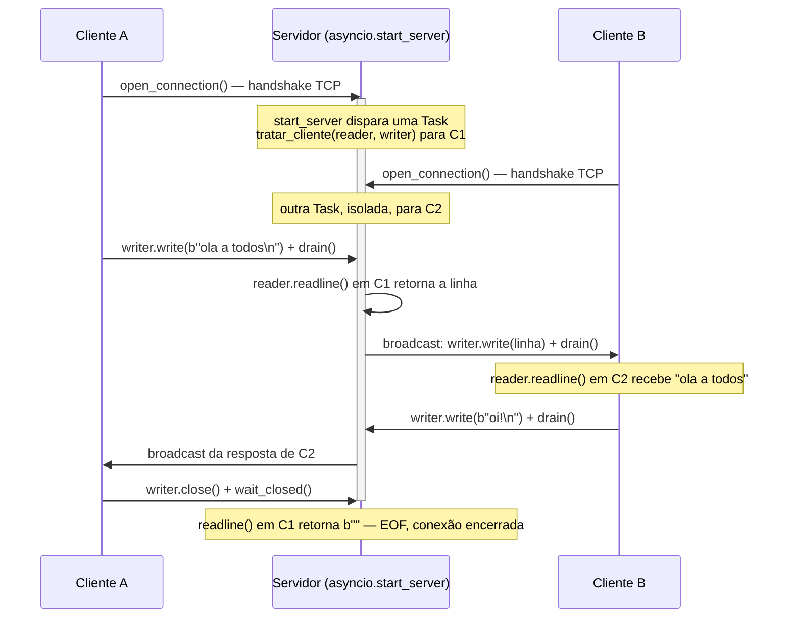
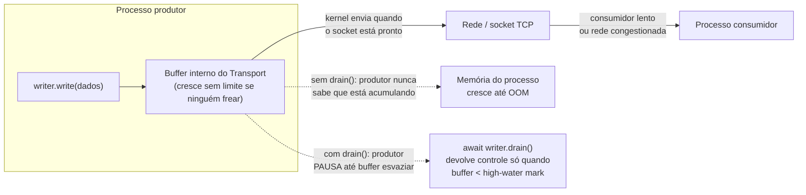

# Streams assíncronos — StreamReader, StreamWriter e protocolos de rede

> [!abstract] TL;DR
> `asyncio.open_connection()` (cliente) e `asyncio.start_server()` (servidor) são a API de streams de alto nível do asyncio para sockets TCP — cada conexão vira um par `StreamReader`/`StreamWriter`, e ler/escrever bytes de rede se torna tão natural quanto `await reader.readline()` e `writer.write(dados)`. Por baixo, é o event loop (visto em [[01 - Event loop por dentro — selectors, callbacks e a relação Future-Task]]) quem orquestra os callbacks de I/O não-bloqueante que alimentam esses streams — `StreamReader`/`StreamWriter` são só uma fachada ergonômica sobre o `Transport`/`Protocol` de baixo nível. O detalhe que separa quem só copiou um tutorial de quem entende a API de verdade é `writer.drain()`: `write()` **nunca bloqueia** — ele empilha bytes num buffer interno e retorna imediatamente, mesmo que a rede do outro lado esteja lenta ou o kernel não tenha espaço pra enviar mais nada agora. Se o código escreve mais rápido do que a rede escoa e nunca faz `await writer.drain()`, esse buffer cresce sem limite — e a "network back-pressure" que deveria naturalmente desacelerar o produtor simplesmente não existe, até a memória do processo esgotar ou o kernel matar a conexão. `drain()` é o `await` que devolve o controle ao produtor só quando o buffer volta a um nível seguro — é o mecanismo de back-pressure em nível de socket, e ignorá-lo é um dos bugs de produção mais silenciosos e mais caros em serviços assíncronos de rede.

## O bug que abre esta nota

Uma equipe constrói um serviço de streaming de eventos internos: um processo produtor lê uma fila de mensagens em memória (deliberadamente rápida — milhares de eventos por segundo) e as retransmite via TCP para um processo consumidor mais lento, que precisa persistir cada mensagem em disco antes de confirmar. O código do lado produtor parece direto:

```python
import asyncio

async def enviar_eventos(writer: asyncio.StreamWriter, fila: asyncio.Queue):
    while True:
        evento = await fila.get()
        linha = (evento + "\n").encode("utf-8")
        writer.write(linha)   # sem await writer.drain() — o bug está aqui
```

Em desenvolvimento, com poucos eventos por segundo e o consumidor rodando na mesma máquina, tudo funciona perfeitamente — a latência de rede é desprezível, o consumidor absorve tudo quase instantaneamente, e ninguém nota nada de errado. Em produção, sob carga real, com o consumidor do outro lado do datacenter fazendo `fsync` a cada mensagem persistida, o quadro muda: o produtor consegue gerar dezenas de milhares de eventos por segundo, mas a rede e o consumidor conseguem escoar só uma fração disso. `writer.write()` continua aceitando cada chamada sem reclamar — porque `write()` **nunca bloqueia**, ele só empilha os bytes num buffer interno gerenciado pelo `Transport` do asyncio, esperando o kernel ter oportunidade de realmente enviá-los pela rede.

O resultado, em minutos: o buffer de saída do socket cresce sem controle, byte a byte, mensagem a mensagem, porque nada nunca diz ao produtor "espera, estou atrasado" — até o processo produtor consumir gigabytes de RAM guardando dados que ainda nem saíram da máquina, e ser derrubado pelo OOM killer do Linux, ou o kernel simplesmente recusar mais dados e a exceção aparecer em produção sem ninguém entender por quê. Nenhuma linha do código está "errada" sintaticamente — o programa roda, os testes locais passam, a lógica de negócio está correta. O que falta é uma única palavra: `await` antes de um `drain()` que ninguém chamou.

> [!bug] O que está quebrado, em uma frase
> `writer.write()` é uma chamada síncrona que só enfileira bytes num buffer — ela nunca espera a rede ter capacidade de enviá-los; sem `await writer.drain()`, nada impede esse buffer de crescer sem limite quando o produtor é mais rápido que a rede/consumidor.

Entender por que `write()` funciona assim, e como `drain()` resolve exatamente esse problema, é o assunto do resto desta nota — construído em cima de um cliente e um servidor TCP reais, funcionais, que implementam um protocolo simples de linha.

## `asyncio.open_connection()` e `asyncio.start_server()`: a API de streams

O asyncio oferece duas camadas para trabalhar com sockets: uma API de baixo nível baseada em `Transport`/`Protocol` (que expõe os callbacks brutos do event loop — `connection_made`, `data_received`, etc., o mesmo mecanismo de callbacks visto na nota anterior do galho) e a API de **streams**, construída em cima da primeira, que troca callbacks por um par de objetos com interface `async`/`await` — `StreamReader` para ler, `StreamWriter` para escrever. Para a esmagadora maioria dos casos de uso de rede TCP simples, a API de streams é a escolha certa: mais legível, menos propensa a erro, e suficiente até que se precise de controle muito fino sobre o protocolo (caso em que vale cair para `Transport`/`Protocol` diretamente, fora do escopo desta nota).

```python
import asyncio

async def cliente_exemplo():
    reader, writer = await asyncio.open_connection("127.0.0.1", 8888)
    # reader: StreamReader — para ler bytes recebidos do servidor
    # writer: StreamWriter — para escrever bytes e controlar a conexão
    ...

async def servidor_exemplo():
    async def tratar_cliente(reader: asyncio.StreamReader, writer: asyncio.StreamWriter):
        # chamado uma vez por conexão aceita, com seu próprio par reader/writer
        ...

    server = await asyncio.start_server(tratar_cliente, "127.0.0.1", 8888)
    async with server:
        await server.serve_forever()
```

`asyncio.open_connection(host, port)` abre uma conexão TCP para `host:port` e retorna uma tupla `(reader, writer)` assim que o *three-way handshake* do TCP completa — do lado do chamador, é só mais um `await`, sem nenhuma callback pra registrar manualmente. `asyncio.start_server(callback, host, port)` faz o papel oposto: cria um socket em modo *listen*, e para **cada conexão aceita**, dispara `callback(reader, writer)` como uma nova coroutine agendada no event loop — o que significa que múltiplos clientes são atendidos concorrentemente, cada um com seu próprio par `reader`/`writer` isolado, sem que o código do servidor precise gerenciar threads ou processos para isso. Essa é, na prática, a mesma ideia de concorrência via `Task`s vista no Galho 7 (nota 06-07) aplicada especificamente a conexões de rede: uma `Task` por conexão, todas compartilhando o mesmo event loop de thread única.

## Implementando um protocolo real: mini-chat linha-a-linha

Para tornar o mecanismo concreto, o resto desta nota constrói um protocolo simples e completo de ponta a ponta: um servidor de chat minimalista, onde cada linha enviada por um cliente é retransmitida (*broadcast*) para todos os outros clientes conectados. É deliberadamente mais rico que um simples eco — envolve estado compartilhado entre conexões (a lista de clientes ativos), leitura linha-a-linha, e escrita concorrente em múltiplos writers, o suficiente para expor os detalhes reais de trabalhar com streams em produção.

O protocolo em si é trivial por design: cada mensagem é uma linha de texto UTF-8 terminada em `\n` — o formato mais simples possível de delimitar mensagens sobre um stream de bytes contínuo, que é o que TCP entrega (TCP não preserva fronteiras de mensagem; sem um delimitador ou um cabeçalho de tamanho, não há como saber onde uma mensagem termina e outra começa).



### O servidor

```python
# servidor_chat.py
import asyncio

clientes: dict[asyncio.StreamWriter, str] = {}

async def tratar_cliente(reader: asyncio.StreamReader, writer: asyncio.StreamWriter):
    endereco = writer.get_extra_info("peername")
    apelido = f"{endereco[0]}:{endereco[1]}"
    clientes[writer] = apelido
    print(f"[+] {apelido} conectou. Total: {len(clientes)}")

    try:
        while True:
            # readline() lê até encontrar b"\n" (ou EOF, ou o limite de buffer)
            linha = await reader.readline()
            if not linha:
                # linha vazia == EOF: o cliente fechou a conexão do lado dele
                break

            mensagem = linha.decode("utf-8").rstrip("\n")
            if not mensagem:
                continue

            print(f"[{apelido}] {mensagem}")
            await broadcast(f"[{apelido}] {mensagem}\n", exceto=writer)

    except asyncio.IncompleteReadError:
        # o cliente derrubou a conexão no meio de uma escrita — trata como desconexão
        pass
    except ConnectionResetError:
        pass
    finally:
        del clientes[writer]
        writer.close()
        await writer.wait_closed()
        print(f"[-] {apelido} desconectou. Total: {len(clientes)}")

async def broadcast(mensagem: str, exceto: asyncio.StreamWriter):
    dados = mensagem.encode("utf-8")
    mortos = []
    for writer in clientes:
        if writer is exceto:
            continue
        try:
            writer.write(dados)
            await writer.drain()   # respeita o back-pressure de CADA cliente individualmente
        except (ConnectionResetError, BrokenPipeError):
            mortos.append(writer)
    for writer in mortos:
        clientes.pop(writer, None)

async def main():
    server = await asyncio.start_server(tratar_cliente, "127.0.0.1", 8888)
    endereco = server.sockets[0].getsockname()
    print(f"Servidor de chat ouvindo em {endereco}")
    async with server:
        await server.serve_forever()

if __name__ == "__main__":
    asyncio.run(main())
```

Alguns detalhes que valem nomear explicitamente:

- **Uma `Task` por conexão, isolamento automático.** `start_server` cria uma nova execução de `tratar_cliente` para cada conexão aceita — nenhum cliente vê o `reader`/`writer` de outro, apesar de todos rodarem no mesmo processo e no mesmo event loop de thread única. O estado que *precisa* ser compartilhado (o dicionário `clientes`) é compartilhado deliberadamente, entre `await`s — e como não há preempção real dentro do event loop de uma thread só, não há race condition clássica de threading aqui (contraste direto com o bug do `contador += 1` visto na nota de Threading do Galho 7: sem múltiplas threads reais competindo, um dicionário Python simples é seguro de mutar entre pontos de `await`, desde que a mutação em si não ceda o controle no meio).
- **`writer.get_extra_info("peername")`** expõe metadados de baixo nível da conexão subjacente (endereço IP e porta do cliente, nesse caso) — útil para logging e identificação sem precisar implementar um handshake de apresentação no protocolo.
- **`readline()` devolve `b""` em EOF**, não levanta exceção — é assim que se detecta que o cliente fechou a conexão do lado dele de forma limpa. `IncompleteReadError` é levantado especificamente por `readexactly()` quando a conexão fecha antes do número de bytes pedido chegar por completo.
- **`broadcast` protege cada `write`/`drain()` individualmente** contra falha — um cliente lento ou desconectado não pode travar ou corromper o envio para os outros; o `try`/`except` por writer, dentro do loop, é o que garante isso.

### O cliente

```python
# cliente_chat.py
import asyncio
import sys

async def ler_do_servidor(reader: asyncio.StreamReader):
    while True:
        linha = await reader.readline()
        if not linha:
            print("\n[servidor encerrou a conexão]")
            break
        print(linha.decode("utf-8"), end="")

async def ler_do_teclado_e_enviar(writer: asyncio.StreamWriter):
    loop = asyncio.get_running_loop()
    while True:
        # input() é bloqueante — roda num executor pra não travar o event loop
        texto = await loop.run_in_executor(None, sys.stdin.readline)
        if not texto:
            break
        writer.write(texto.encode("utf-8"))
        await writer.drain()   # espera o buffer de saída ter espaço antes de continuar

async def main():
    reader, writer = await asyncio.open_connection("127.0.0.1", 8888)
    print("Conectado. Digite mensagens (Ctrl+D para sair):")

    tarefa_leitura = asyncio.create_task(ler_do_servidor(reader))
    tarefa_envio = asyncio.create_task(ler_do_teclado_e_enviar(writer))

    # encerra assim que qualquer uma das duas tarefas terminar
    _, pendentes = await asyncio.wait(
        {tarefa_leitura, tarefa_envio}, return_when=asyncio.FIRST_COMPLETED
    )
    for tarefa in pendentes:
        tarefa.cancel()

    writer.close()
    await writer.wait_closed()

if __name__ == "__main__":
    asyncio.run(main())
```

Rodando `python servidor_chat.py` num terminal e `python cliente_chat.py` em dois ou mais outros, cada linha digitada num cliente aparece nos demais em tempo real — um protocolo de rede completo, funcional, em menos de cem linhas de código, sem nenhuma dependência além da biblioteca padrão.

## `readline()`, `readuntil()`, `readexactly()`, `read()`: as formas de ler

`StreamReader` oferece quatro formas distintas de consumir bytes, cada uma resolvendo um problema diferente de "como saber onde uma mensagem termina":

| Método | Quando usar | Comportamento |
|---|---|---|
| `read(n)` | Protocolo baseado em tamanho fixo, ou "leia tudo que tiver disponível agora" | Lê até `n` bytes (ou até EOF se `n` for omitido/`-1`); pode retornar **menos** de `n` bytes se for tudo que está disponível no momento |
| `readexactly(n)` | Protocolos com cabeçalho de tamanho fixo (ex: 4 bytes de comprimento + payload) | Bloqueia até ter exatamente `n` bytes; levanta `IncompleteReadError` se a conexão fechar antes disso |
| `readline()` | Protocolos delimitados por linha (como o chat acima) | Lê até encontrar `b"\n"` (inclusive), ou até EOF/limite de buffer |
| `readuntil(separador)` | Delimitador customizado, não necessariamente `\n` | Lê até encontrar a sequência de bytes `separador`; levanta `LimitOverrunError` se o buffer interno estourar sem encontrar o separador |

```python
# Exemplo: protocolo de cabeçalho de tamanho fixo, comum em RPCs binários
async def ler_mensagem_com_cabecalho(reader: asyncio.StreamReader) -> bytes:
    cabecalho = await reader.readexactly(4)          # 4 bytes = tamanho do payload
    tamanho = int.from_bytes(cabecalho, "big")
    payload = await reader.readexactly(tamanho)       # lê exatamente o payload inteiro
    return payload
```

`readline()`/`readuntil()` têm um limite interno de buffer (`asyncio.streams._DEFAULT_LIMIT`, 64 KiB por padrão, configurável via o parâmetro `limit=` de `open_connection`/`start_server`) — proteção deliberada contra um peer malicioso ou com bug que envia gigabytes de dados sem nunca emitir o delimitador esperado, o que encheria a memória do processo receptor indefinidamente esperando por uma linha que nunca termina. Estourar esse limite levanta `LimitOverrunError` (para `readuntil`) ou trunca com uma exceção equivalente — nunca falha silenciosamente consumindo memória sem fim.

## `writer.drain()`: o mecanismo de back-pressure em nível de socket

Voltando ao bug de abertura — `writer.write(dados)` é **síncrono e nunca bloqueia**: ele copia os bytes para um buffer interno mantido pelo `Transport` do asyncio, e o event loop, por baixo, vai enviando esse buffer pela rede conforme o socket subjacente sinaliza que está pronto para escrever mais (o mesmo mecanismo de callbacks de I/O da nota 01 do galho, aplicado à direção de escrita). Se o produtor chama `write()` mais rápido do que a rede consegue escoar — porque a rede está congestionada, porque o receptor está processando devagar, ou porque a janela TCP do outro lado está cheia — esse buffer só cresce, sem limite superior automático nenhum.



`writer.drain()` é o contrapeso: `await writer.drain()` **suspende a coroutine chamadora** até que o buffer de saída volte a um nível considerado seguro (o *low-water mark*) — se o buffer já está abaixo desse nível quando `drain()` é chamado, ele retorna quase instantaneamente (não há espera real); se o buffer cresceu além do *high-water mark* configurado, `drain()` bloqueia a coroutine até o event loop conseguir esvaziá-lo o suficiente. Os limites são configuráveis via `transport.set_write_buffer_limits(high, low)`, com padrões razoáveis do próprio asyncio (tipicamente 64 KiB de high-water mark) — na prática, quase ninguém precisa mexer nesses valores; o que importa é **sempre fazer `await writer.drain()` depois de cada `write()` (ou grupo de `write()`s) num loop que produz continuamente**.

```python
# ERRADO — sem drain(), o buffer cresce sem controle sob carga
async def enviar_rapido_demais(writer: asyncio.StreamWriter, itens):
    for item in itens:
        writer.write(serializar(item))
        # nada aqui pausa o produtor — write() sempre "funciona" na hora

# CORRETO — drain() aplica back-pressure real
async def enviar_com_backpressure(writer: asyncio.StreamWriter, itens):
    for item in itens:
        writer.write(serializar(item))
        await writer.drain()   # se o buffer está cheio, PAUSA aqui até esvaziar
```

O efeito prático de `drain()` é transformar "o produtor pode gerar dados infinitamente mais rápido que o consumidor consegue absorver" em "o produtor desacelera automaticamente até o ritmo que a rede/consumidor sustenta" — exatamente a mesma ideia de back-pressure que aparece de novo, num nível mais alto de abstração, com `asyncio.Queue(maxsize=N)` (nota 06 do galho): em ambos os casos, a estrutura pausa o produtor via `await` em vez de deixá-lo acumular trabalho não processado sem limite. A diferença é o nível: `Queue` aplica back-pressure entre coroutines dentro do mesmo processo; `drain()` aplica back-pressure entre o processo e a rede/socket subjacente.

> [!question]- Por que `write()` não é simplesmente feito bloqueante, evitando esse problema de raiz?
> Porque `write()` bloqueante destruiria a razão de ser do asyncio para I/O de rede: se `write()` esperasse a rede confirmar cada envio, chamar `write()` seria equivalente a um `send()` de socket bloqueante — voltando ao modelo síncrono que o asyncio existe para evitar. Separar `write()` (nunca bloqueia, só enfileira) de `drain()` (bloqueia sob demanda, só quando o buffer já está saturado) dá o melhor dos dois mundos: escritas pequenas e esporádicas nunca pagam o custo de um `await` que na prática retornaria instantaneamente, enquanto produtores genuinamente rápidos demais são desacelerados exatamente quando (e só quando) isso é necessário. É o mesmo princípio de design por trás de buffers de I/O em qualquer sistema operacional — otimista por padrão, com um mecanismo explícito de recuo quando o otimismo não se sustenta.

### Por baixo do `drain()`: `pause_writing()`/`resume_writing()`

`writer.drain()` não é mágica — ele é a face `async`/`await` de um par de callbacks que existe uma camada abaixo, no `Protocol` que a API de streams implementa internamente sobre o `Transport` (o mesmo par `Transport`/`Protocol` mencionado no início desta nota como a API de baixo nível). Vale nomear o mecanismo real, porque ele aparece de novo em qualquer código que trabalhe diretamente com `Transport`/`Protocol` sem passar pela conveniência de streams:

- Quando o buffer de escrita do `Transport` ultrapassa o *high-water mark*, o event loop chama `protocol.pause_writing()` — um sinal de "pare de me dar mais dados até eu avisar o contrário".
- Quando o buffer volta a cair abaixo do *low-water mark* (depois que o kernel conseguiu enviar o suficiente pela rede), o event loop chama `protocol.resume_writing()` — o sinal inverso, "pode continuar".

O `StreamWriter` internamente mantém um `Future` que fica pendente enquanto `pause_writing()` foi chamado e ainda não houve `resume_writing()` correspondente — e é exatamente esse `Future` que `await writer.drain()` aguarda. Em outras palavras: `drain()` não faz polling nem espera um tempo fixo, ele literalmente suspende a coroutine chamadora até o callback `resume_writing()` disparar, e o event loop só dispara esse callback quando o socket subjacente sinaliza (via `select`/`epoll`, o mesmo mecanismo da nota 01 do galho) que há espaço de novo para escrever. Entender esse caminho completo — do `write()` síncrono até o `Future` interno que `drain()` aguarda — é o que separa "sei que preciso chamar `drain()`" de "sei por que `drain()` funciona".

```python
# Esboço simplificado do que acontece dentro do StreamWriter (não é a implementação real,
# mas captura a ideia central do mecanismo por trás de drain())
class ProtocoloDeStream(asyncio.Protocol):
    def __init__(self):
        self._drain_waiter: asyncio.Future | None = None
        self._paused = False

    def pause_writing(self):
        self._paused = True   # chamado pelo event loop quando o buffer estoura o high-water mark

    def resume_writing(self):
        self._paused = False
        if self._drain_waiter and not self._drain_waiter.done():
            self._drain_waiter.set_result(None)   # libera qualquer drain() pendente

    async def drain(self):
        if not self._paused:
            return   # buffer já está OK — retorna na hora, sem esperar nada
        self._drain_waiter = asyncio.get_running_loop().create_future()
        await self._drain_waiter   # suspende até resume_writing() disparar
```

## Testando o servidor manualmente: `nc`/`telnet` como cliente descartável

Antes de escrever um cliente Python completo, vale saber que qualquer protocolo de texto delimitado por linha (como o chat acima) pode ser testado diretamente com ferramentas de linha de comando padrão do sistema operacional — útil tanto para depurar rapidamente quanto para demonstrar, numa entrevista ao vivo, que o protocolo implementado é um TCP genuíno, sem nada escondido:

```bash
# Com o servidor_chat.py rodando em outro terminal:
nc 127.0.0.1 8888
# ou, em sistemas onde nc não está disponível:
telnet 127.0.0.1 8888
```

Qualquer linha digitada em uma sessão `nc` aparece nas outras sessões conectadas — porque, do ponto de vista do servidor, `nc` é indistinguível de um cliente escrito em Python: ambos abrem um socket TCP e trocam bytes delimitados por `\n`. Esse é, também, um bom lembrete de que o protocolo definido nesta nota não tem autenticação, criptografia, nem validação de entrada nenhuma — adequado para um exemplo didático de rede local, mas o tipo de simplicidade que um protocolo de produção precisaria endurecer (TLS via `asyncio.open_connection(ssl=...)`/`start_server(ssl=...)`, limites de tamanho de mensagem, validação de origem) antes de ser exposto além de uma rede confiável.

## Fechando conexões corretamente: `close()` e `wait_closed()`

Fechar um `StreamWriter` também tem uma armadilha de assincronia sutil, análoga à de `write()`/`drain()`: `writer.close()` **não é uma coroutine** — é uma chamada síncrona que **inicia** o processo de fechamento (envia o FIN do TCP, por exemplo), mas não garante que o fechamento tenha completado quando retorna. `writer.wait_closed()`, por sua vez, é uma coroutine que só resolve quando o fechamento de fato terminou — inclusive esvaziando qualquer dado ainda pendente no buffer de saída, quando possível.

```python
writer.close()             # inicia o fechamento — síncrono, retorna na hora
await writer.wait_closed()  # espera o fechamento completar de verdade
```

Pular o `await writer.wait_closed()` funciona na maioria dos casos simples (o processo eventualmente fecha o socket de qualquer forma quando termina), mas em código que abre e fecha muitas conexões em sequência rápida — um cliente HTTP simplificado, por exemplo, ou um pool de conexões implementado à mão — pular esse `await` pode levar a *warnings* de `ResourceWarning: unclosed transport` do próprio asyncio, ou a sockets deixados num estado `TIME_WAIT`/parcialmente fechado por mais tempo do que o necessário, competindo por recursos do sistema operacional (número de file descriptors, portas efêmeras) sem necessidade.

## Armadilhas comuns

> [!warning] Escrever num loop sem `await writer.drain()`
> **O que acontece:** o produtor gera dados mais rápido que a rede/consumidor consegue absorver, e como `write()` nunca bloqueia, o buffer de saída do `Transport` cresce indefinidamente — memória do processo sobe sem limite até OOM, ou latência de entrega explode silenciosamente porque tudo fica represado no buffer local em vez de fluir pela rede. **Por quê:** `write()` só enfileira bytes; `drain()` é quem devolve back-pressure real ao chamador, pausando-o quando o buffer já está saturado. Sem o `await drain()`, não existe nenhum mecanismo que desacelere o produtor. **Como evitar:** tratar `write()` + `await drain()` como um par indissociável em qualquer loop de escrita contínua — a mesma disciplina de "sempre em par" que `acquire()`/`release()` exige para locks (ver nota de Threading do Galho 7). Um `write()` isolado, fora de loop, quase nunca precisa de `drain()` imediato — mas qualquer coisa que escreve repetidamente precisa.

> [!warning] Confundir `readline()` com "ler uma requisição completa"
> **O que acontece:** assumir que `readline()` devolve uma mensagem de aplicação inteira, quando na verdade o protocolo real usa várias linhas por mensagem (cabeçalhos + corpo, como HTTP) ou dados binários que não têm relação nenhuma com `\n` como delimitador — resultando em mensagens cortadas ou parseadas incorretamente. **Por quê:** `readline()` só entende o byte `\n` como fronteira — ele não sabe nada sobre a semântica do protocolo de aplicação. Se o protocolo real é mais rico que "uma linha = uma mensagem", `readline()` sozinho não é suficiente. **Como evitar:** desenhar o protocolo de aplicação com clareza antes de escolher o método de leitura — delimitado por linha (`readline`/`readuntil`), por tamanho fixo (`readexactly` com cabeçalho), ou por parsing incremental sobre `read()` bruto para formatos mais complexos (como um parser HTTP de verdade faria).

> [!warning] Esquecer de tratar EOF (`b""`) e desconexões abruptas separadamente
> **O que acontece:** o código trata só o caminho feliz — servidor nunca verifica se `readline()` devolveu `b""`, nunca captura `ConnectionResetError`/`BrokenPipeError` — e uma desconexão de cliente vira uma exceção não tratada que derruba a `Task` daquela conexão (silenciosamente, sem afetar outras conexões, mas sem limpeza de estado como remover o writer de uma lista de clientes ativos). **Por quê:** conexões de rede terminam de formas variadas — fechamento limpo (EOF, `readline()` retorna vazio), fechamento abrupto do lado remoto (`ConnectionResetError`), ou uma tentativa de escrever num socket já fechado do outro lado (`BrokenPipeError`). Cada uma é um caminho de código distinto que precisa de tratamento. **Como evitar:** todo loop de leitura de um stream de rede de longa duração deveria verificar explicitamente por `b""` (EOF) e envolver o corpo num `try`/`except` que capture pelo menos `ConnectionResetError` e `BrokenPipeError`, com um `finally` que garanta a limpeza de qualquer estado associado àquela conexão (como no `tratar_cliente` do exemplo acima).

> [!warning] Rodar código bloqueante (I/O de disco, `input()`, CPU pesada) dentro de um handler de stream
> **O que acontece:** um handler de conexão (como `tratar_cliente`) chama uma função síncrona e lenta — uma query de banco síncrona, uma leitura de arquivo bloqueante, um cálculo pesado em CPU — diretamente, sem `run_in_executor`. Isso bloqueia o event loop inteiro, travando **todas** as outras conexões simultâneas enquanto essa chamada não termina. **Por quê:** o event loop de asyncio é de thread única — enquanto uma coroutine está executando código síncrono (não um `await`), nenhuma outra coroutine, de nenhuma outra conexão, pode progredir. Um servidor que atende 500 conexões concorrentes perde essa concorrência inteira no instante em que uma delas chama uma função bloqueante sem isolá-la. **Como evitar:** qualquer chamada síncrona e potencialmente lenta dentro de um handler assíncrono precisa passar por `loop.run_in_executor(None, funcao_sincrona, *args)` (como feito para `sys.stdin.readline` no cliente do chat acima), delegando o bloqueio para uma thread do pool padrão em vez de travar o event loop inteiro.

## Em entrevista

Streams assíncronos e back-pressure de socket são um tema clássico para separar quem só sabe escrever `async def` de quem entende o que está acontecendo por baixo em I/O de rede real.

> "`asyncio.open_connection()` and `asyncio.start_server()` give you `StreamReader`/`StreamWriter` pairs for TCP sockets, built on top of the event loop's `Transport`/`Protocol` machinery. The detail that trips people up in production is `writer.write()`: it's synchronous and never blocks — it just appends bytes to an internal buffer and returns immediately, regardless of whether the network or the receiver can actually keep up. If you write in a tight loop without `await writer.drain()`, that buffer grows unbounded, because nothing signals back-pressure to the producer — I've seen this exact bug cause a process to OOM in production because a fast producer streamed events to a slower consumer over TCP with no `drain()` call anywhere in the send loop. `drain()` is a coroutine that suspends the caller until the write buffer drops back under a safe watermark — it's the mechanism that converts 'the network is falling behind' into an actual pause in the producer, instead of silent unbounded memory growth. The rule of thumb: any loop that calls `write()` repeatedly needs a matching `await drain()`, the same way every `lock.acquire()` needs a matching `release()`."

Uma pergunta de acompanhamento frequente: **"por que `write()` não bloqueia por padrão, já que isso evitaria o problema?"** — a resposta sênior explica que fazer `write()` bloquear destruiria o propósito do modelo assíncrono (voltaria a um `send()` síncrono disfarçado), e que separar "enfileirar" (`write()`, sempre rápido) de "esperar sob demanda" (`drain()`, só quando necessário) é o design que preserva throughput no caso comum e ainda oferece um freio real no caso de saturação.

> [!question]- E se perguntarem sobre a diferença entre back-pressure aqui e em `asyncio.Queue`?
> Vale nomear que são o mesmo princípio em dois pontos diferentes da cadeia: `asyncio.Queue(maxsize=N)` (nota 06 do galho) aplica back-pressure **entre coroutines dentro do mesmo processo** — um produtor que chama `await queue.put(item)` numa fila cheia é pausado até um consumidor tirar algo. `writer.drain()` aplica back-pressure **entre o processo e a rede/socket** — o produtor é pausado até o kernel/rede conseguir escoar o que já foi enfileirado para envio. Um pipeline de produção robusto tipicamente usa os dois: uma `Queue` interna para desacoplar produção de I/O de rede, e `drain()` no lado que efetivamente escreve no socket, cada um resolvendo o gargalo específico da sua camada.

## Como explicar em inglês

| PT | EN |
|----|----|
| stream assíncrono | asynchronous stream |
| leitor / escritor de stream | stream reader / stream writer |
| buffer de saída | write buffer / send buffer |
| back-pressure | back-pressure |
| esvaziar o buffer | drain the buffer |
| marca d'água alta/baixa | high-water mark / low-water mark |
| fim de arquivo (EOF) | end of file (EOF) |
| conexão fechada abruptamente | connection reset |
| handshake (TCP) | handshake |
| protocolo delimitado por linha | line-delimited protocol |
| transmissão para todos (broadcast) | broadcast |
| bloquear o event loop | block the event loop |

## O que vem a seguir

Esta nota deu corpo concreto ao que o event loop orquestra por baixo dos panos ([[01 - Event loop por dentro — selectors, callbacks e a relação Future-Task|nota 01]]): um servidor e um cliente TCP reais, um protocolo de linha funcional, e o mecanismo de back-pressure que separa código de rede ingênuo de código pronto para produção. A partir daqui, o galho sobe de nível de abstração:

- **03 — aiohttp cliente: ClientSession, connection pooling e requisições concorrentes** — a mesma ideia de streams assíncronos, mas encapsulada numa biblioteca HTTP de alto nível, com pooling de conexões e tratamento de erro pronto — o que `open_connection` faria manualmente para implementar HTTP do zero, `aiohttp` já resolve.
- **06 — Back-pressure: Semaphore, Queue com maxsize e buffering** — generaliza o princípio de `drain()` para outros pontos do sistema: limitar concorrência com `Semaphore`, represar trabalho com `Queue(maxsize=N)`.
- [[03-Dominios/Tecnologia/Python/Programação Reativa e Assíncrona/index|Programação Reativa e Assíncrona (Galho 8)]] — MOC deste galho.
- [[03-Dominios/Tecnologia/Python/Concorrência e paralelismo/03 - queue.Queue e o padrão produtor-consumidor|Galho 7 nota 03 — queue.Queue e o padrão produtor-consumidor]] — a versão síncrona/threading do mesmo princípio de back-pressure via buffer limitado, útil para contrastar com o `drain()` assíncrono desta nota.

## Fontes

- Python Software Foundation. *asyncio Streams*. docs.python.org, versão 3.14. https://docs.python.org/3/library/asyncio-stream.html (acessado em 2026-07-11) — referência oficial de `open_connection`, `start_server`, `StreamReader`, `StreamWriter`, `drain()`.
- Python Software Foundation. *asyncio — Transports and Protocols*. docs.python.org, versão 3.14. https://docs.python.org/3/library/asyncio-protocol.html (acessado em 2026-07-11) — camada de baixo nível sobre a qual a API de streams é construída, incluindo `set_write_buffer_limits` e os watermarks de back-pressure.
- Python Software Foundation. *asyncio — Development Guidelines*. docs.python.org, versão 3.14. https://docs.python.org/3/library/asyncio-dev.html (acessado em 2026-07-11) — seção específica sobre evitar bloquear o event loop com chamadas síncronas.
- Real Python. *Async IO in Python: A Complete Walkthrough*. realpython.com. https://realpython.com/async-io-python/ (acessado em 2026-07-11) — exemplos de streams e discussão de back-pressure em código assíncrono.
- [[01 - Event loop por dentro — selectors, callbacks e a relação Future-Task|01 — Event loop por dentro]] — nota irmã deste galho, pré-requisito conceitual: o mecanismo de callbacks/selectors que a API de streams encapsula.
- [[03-Dominios/Tecnologia/Python/Concorrência e paralelismo/01 - Threading na prática — Thread, Lock e condições de corrida|Galho 7 nota 01 — Threading na prática]] — paralelo conceitual citado nesta nota: a disciplina de "chamada em par" (`acquire`/`release` vs `write`/`drain`) como padrão recorrente em concorrência.

Consultado em 2026-07-11.
