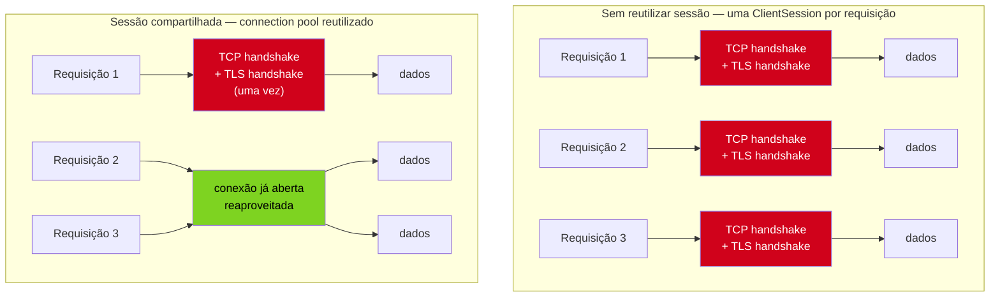
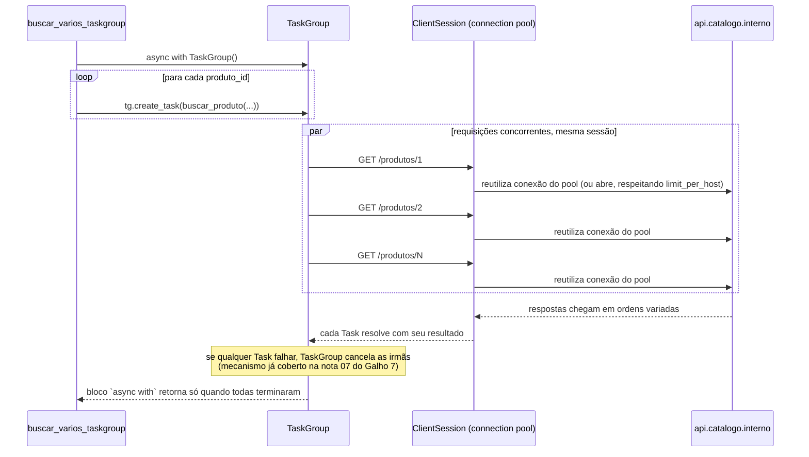

# aiohttp cliente — ClientSession, connection pooling e requisições concorrentes

> [!abstract] TL;DR
> `aiohttp.ClientSession` não é um detalhe de conveniência de API — é o objeto que possui o **connection pool**: um conjunto de conexões TCP (e, sobre HTTPS, handshakes TLS já concluídos) mantidas vivas via keep-alive e reutilizáveis entre requisições. Criar uma `ClientSession` nova a cada requisição — `async with aiohttp.ClientSession() as s: await s.get(url)` dentro de uma função chamada em loop — descarta esse pool a cada chamada, forçando um handshake TCP+TLS novo (3 RTTs para HTTPS: SYN/SYN-ACK/ACK + ClientHello/ServerHello/Finished) para cada requisição que, com uma sessão reutilizada, custaria zero RTTs extras. A API recomendada é **uma `ClientSession` por aplicação (ou por ciclo de vida coerente, como o tempo de vida de um worker)**, fechada explicitamente ao final. Requisições concorrentes de verdade não vêm de `for` sequencial com `await` — vêm de disparar múltiplas coroutines de uma sessão compartilhada via `asyncio.gather()`/`TaskGroup()` ([[03-Dominios/Tecnologia/Python/Concorrência e paralelismo/07 - asyncio na prática — gather, TaskGroup, timeouts e cancelamento|Galho 7 nota 07]]), que reaproveitam o mesmo pool de conexões da sessão. Timeouts em `aiohttp` são controlados por `aiohttp.ClientTimeout` — um teto `total` (do início ao fim da requisição inteira, incluindo tempo de fila esperando uma conexão livre do pool) ou tetos granulares (`connect`, `sock_connect`, `sock_read`) para distinguir "não conseguiu conectar" de "conectou, mas o servidor não respondeu a tempo". Erros de rede chegam como subclasses de `aiohttp.ClientError` (`ClientConnectorError`, `ServerDisconnectedError`, etc.) — não confundir com o `asyncio.TimeoutError`/`TimeoutError` nativo que `ClientTimeout` levanta quando o teto estoura. Para respostas grandes, `response.content.iter_chunked(n)` transmite o corpo em pedaços, evitando carregar um payload inteiro (potencialmente gigabytes) em memória de uma vez.

## O bug que abre esta nota

Um serviço interno precisa buscar detalhes de centenas de produtos, um por um, num catálogo remoto via HTTP. O código, escrito por alguém migrando de `requests` para `aiohttp` para "aproveitar o async", parece razoável: uma função `buscar_produto` que faz uma requisição e devolve o JSON, chamada repetidamente.

```python
import aiohttp

async def buscar_produto(produto_id: str) -> dict:
    async with aiohttp.ClientSession() as session:
        async with session.get(f"https://api.catalogo.interno/produtos/{produto_id}") as resp:
            resp.raise_for_status()
            return await resp.json()

async def buscar_varios(ids: list[str]) -> list[dict]:
    resultados = []
    for produto_id in ids:
        resultado = await buscar_produto(produto_id)
        resultados.append(resultado)
    return resultados
```

Funcionalmente, isso funciona — cada chamada devolve o JSON esperado, os testes passam, o código sobe pra produção. O problema aparece só sob carga: buscar 500 produtos leva um tempo desproporcionalmente maior do que o esperado para 500 requisições HTTP simples, e o número de conexões TCP abertas simultaneamente no servidor remoto (visível em métricas de rede, ou em `netstat` do lado cliente) dispara de forma que não faz sentido para um código que, aparentemente, "usa async". Em produção, sob volume real, aparece também um sintoma colateral: warnings no log parecidos com `Unclosed client session` e `Unclosed connector` — sinal de que sessões estão sendo criadas e não fechadas corretamente em algum caminho de código (normalmente uma exceção que pula o `async with`, ou um teste que nunca chega no `__aexit__`).

> [!bug] O que está quebrado, em uma frase
> `buscar_produto` cria uma `aiohttp.ClientSession` nova — com seu próprio connection pool vazio — a cada chamada, então cada requisição paga o custo completo de abrir uma conexão TCP nova e, para HTTPS, um handshake TLS novo, em vez de reutilizar uma conexão já estabelecida e mantida viva por keep-alive.

O código não está "errado" no sentido de produzir resultado incorreto — está pagando, a cada uma das 500 chamadas, um custo de rede que deveria ser pago **uma vez só**. Entender por que `ClientSession` existe como objeto de vida longa — e não como um detalhe descartável do `async with` mais próximo — é o assunto desta nota. O nível de abstração abaixo deste, sockets TCP crus manipulados diretamente com `StreamReader`/`StreamWriter`, já foi coberto em [[02 - Streams assíncronos — StreamReader, StreamWriter e protocolos de rede|nota 02]] — `aiohttp` é o cliente HTTP que resolve, numa API de alto nível, exatamente esse tipo de gerenciamento de conexão que ali é feito manualmente.

## `ClientSession`: por que é o objeto que importa, não a requisição

Uma requisição HTTP sobre TCP não é uma operação isolada e barata — antes de qualquer byte de dado de aplicação trafegar, é preciso: (1) um *three-way handshake* TCP (`SYN` → `SYN-ACK` → `ACK`, um RTT completo), e, se o destino é HTTPS (a norma para qualquer API real hoje), (2) um handshake TLS por cima disso (troca de certificados, negociação de cifra, geração de chaves de sessão — tipicamente mais um RTT completo com TLS 1.3, dois com TLS 1.2). Só depois desses handshakes a conexão está pronta para transportar a requisição HTTP em si e receber a resposta.

`ClientSession` existe precisamente para não pagar esse custo repetidamente: internamente, ela possui um `TCPConnector`, responsável por manter um **pool de conexões abertas**, reaproveitando conexões já estabelecidas para o mesmo host (via `Connection: keep-alive`, o comportamento padrão do HTTP/1.1) em vez de abrir uma conexão nova a cada requisição. Quando uma requisição termina e a conexão TCP subjacente não foi explicitamente fechada pelo servidor, ela volta para o pool, disponível para a próxima requisição ao mesmo host — sem handshake novo, sem RTT extra.



O fix do bug de abertura é criar **uma** `ClientSession` fora do loop de requisições, e passá-la (ou reutilizá-la via closure/parâmetro) para cada chamada individual:

```python
import aiohttp

async def buscar_produto(session: aiohttp.ClientSession, produto_id: str) -> dict:
    async with session.get(f"https://api.catalogo.interno/produtos/{produto_id}") as resp:
        resp.raise_for_status()
        return await resp.json()

async def buscar_varios(ids: list[str]) -> list[dict]:
    async with aiohttp.ClientSession() as session:
        resultados = []
        for produto_id in ids:
            resultado = await buscar_produto(session, produto_id)
            resultados.append(resultado)
        return resultados
```

Note a mudança estrutural: `ClientSession()` sobe **uma vez**, no escopo de `buscar_varios`, não dentro de `buscar_produto`. As 500 chamadas a `session.get(...)` agora compartilham o mesmo `TCPConnector` e, portanto, o mesmo pool — a partir da segunda requisição ao mesmo host, não há handshake novo a pagar (dentro da janela de keep-alive, tipicamente configurável no servidor, e sujeita ao limite de conexões simultâneas por host que o `TCPConnector` também impõe por padrão). Esse ajuste sozinho, sem tocar em concorrência ainda, já elimina o custo repetido de handshake — o próximo passo, na seção seguinte, é parar de esperar cada requisição terminar antes de disparar a próxima.

> [!info] Regra prática: uma `ClientSession` por escopo de vida coerente
> A documentação oficial do `aiohttp` é explícita sobre isso: "*Don't create a session per request. Most likely you need a session per application which performs all requests together.*" Em uma aplicação de longa duração (um worker, um serviço web), isso costuma significar uma `ClientSession` criada na inicialização e fechada no encerramento — não uma sessão global-mutável-para-sempre sem gerenciamento de ciclo de vida, e não uma sessão nova a cada chamada de função. Em um script de vida curta (como os exemplos desta nota), um único `async with aiohttp.ClientSession() as session:` envolvendo todo o trabalho já captura essa regra corretamente.

### O warning `Unclosed client session` e o vazamento por trás dele

O sintoma colateral mencionado no bug de abertura — `Unclosed client session` / `Unclosed connector` nos logs — aparece quando uma `ClientSession` é criada mas nunca chega ao seu `close()` (implícito no `__aexit__` do `async with`, ou explícito se a sessão foi instanciada sem gerenciador de contexto). Isso deixa conexões TCP abertas penduradas, consumindo sockets e memória, até o coletor de lixo do Python eventualmente destruir o objeto — momento em que `aiohttp` emite o warning, tarde demais para evitar o desperdício que já aconteceu.

```python
# Padrão que VAZA: sessão criada sem gerenciador de contexto, sem close() garantido
async def buscar_arriscado(url: str) -> dict:
    session = aiohttp.ClientSession()
    resp = await session.get(url)         # se isso levantar exceção,
    dados = await resp.json()             # session.close() nunca é chamado
    await session.close()
    return dados
```

Se `session.get(url)` ou qualquer linha entre a criação e o `close()` explícito levantar uma exceção, o fluxo pula direto para o handler mais próximo (ou propaga para fora da função) — e `session.close()`, por estar depois da linha que falhou, nunca executa. O padrão correto é sempre `async with aiohttp.ClientSession() as session:` (ou, num escopo maior de aplicação, `try`/`finally` com `await session.close()` no `finally`), pelo mesmo motivo estrutural que `with lock:` é preferível a `acquire()`/`release()` manuais em `threading` ([[03-Dominios/Tecnologia/Python/Concorrência e paralelismo/01 - Threading na prática — Thread, Lock e condições de corrida|Galho 7 nota 01]]) — o gerenciador de contexto garante a limpeza mesmo em caminho de exceção.

> [!warning] `Unclosed client session` não é um warning cosmético
> **O que acontece:** uma `ClientSession` (ou o `TCPConnector` que ela possui) é descartada sem `close()` explícito — o objeto Python eventualmente é coletado pelo GC, mas os sockets TCP subjacentes podem continuar abertos do ponto de vista do sistema operacional por mais tempo, e a mensagem só é emitida no momento da coleta, não no momento em que o vazamento de fato começou. **Por quê:** fechar uma sessão envolve I/O assíncrono (encerrar conexões de forma limpa) — o destrutor síncrono do Python (`__del__`) não pode fazer `await`, então tudo que ele consegue fazer é registrar o warning e torcer para o SO reclamar os sockets eventualmente. **Como evitar:** sempre `async with aiohttp.ClientSession() as session:`, ou, se a sessão precisa viver além de um único bloco (aplicação de longa duração), gerenciar seu ciclo de vida explicitamente com `await session.close()` num handler de shutdown — nunca deixar a sessão "solta" na esperança de que o GC resolva.

## Requisições concorrentes: aplicando `gather`/`TaskGroup` sobre uma sessão compartilhada

Trocar a sessão por requisição por uma sessão compartilhada já elimina o custo de handshake repetido — mas o código de `buscar_varios` acima ainda é **sequencial**: cada `await buscar_produto(...)` espera a resposta completa antes de disparar a próxima. Para 500 produtos com, digamos, 100ms de latência média cada, isso ainda leva ~50 segundos, porque nada roda em paralelo — é só reutilização de conexão, não concorrência.

A ferramenta para disparar as requisições de fato ao mesmo tempo já foi coberta em profundidade em [[03-Dominios/Tecnologia/Python/Concorrência e paralelismo/07 - asyncio na prática — gather, TaskGroup, timeouts e cancelamento|Galho 7 nota 07]] — `asyncio.gather()` e `asyncio.TaskGroup` orquestram múltiplas coroutines concorrentemente. A única coisa nova aqui é **aplicar** esse mecanismo a coroutines que fazem requisições HTTP via uma `ClientSession` compartilhada, para que a concorrência de tarefas se traduza em concorrência real de conexões de rede saindo do mesmo pool:

```python
import asyncio
import aiohttp

async def buscar_produto(session: aiohttp.ClientSession, produto_id: str) -> dict:
    async with session.get(f"https://api.catalogo.interno/produtos/{produto_id}") as resp:
        resp.raise_for_status()
        return await resp.json()

async def buscar_varios_concorrente(ids: list[str]) -> list[dict]:
    async with aiohttp.ClientSession() as session:
        return await asyncio.gather(
            *(buscar_produto(session, produto_id) for produto_id in ids)
        )
```

Com `gather()`, as 500 requisições são todas agendadas de uma vez — o event loop intercala o trabalho de I/O de cada uma, e o tempo total deixa de ser a soma das latências individuais e passa a ser dominado pelo gargalo real: o limite de conexões simultâneas do `TCPConnector` (por padrão, 100 conexões totais e 100 por host — configurável via `aiohttp.TCPConnector(limit=..., limit_per_host=...)`), a capacidade do servidor remoto, ou a banda disponível — não mais "uma requisição de cada vez, esperando a anterior terminar".

Para código novo, e principalmente quando uma falha numa requisição deveria abortar as demais, `TaskGroup` é a escolha estrutural preferida (a mesma recomendação da nota 07 do Galho 7 se aplica sem alteração):

```python
async def buscar_varios_taskgroup(ids: list[str]) -> list[dict]:
    async with aiohttp.ClientSession() as session:
        tasks = []
        async with asyncio.TaskGroup() as tg:
            for produto_id in ids:
                tasks.append(tg.create_task(buscar_produto(session, produto_id)))
        return [t.result() for t in tasks]
```



A escolha entre `gather()` (com ou sem `return_exceptions=True`) e `TaskGroup` aqui segue exatamente a mesma tabela de decisão já estabelecida na nota 07 do Galho 7 — nada muda por estar fazendo HTTP em vez de, por exemplo, esperar `asyncio.sleep()`. O que muda é que a falha típica de uma requisição HTTP não é um `ValueError` arbitrário, é uma das exceções de rede da seção seguinte.

> [!question]- Vale limitar a concorrência quando há centenas ou milhares de IDs, em vez de disparar tudo de uma vez com `gather`?
> Sim — disparar 5000 requisições simultâneas de uma vez, mesmo com uma única `ClientSession`, satura o `limit`/`limit_per_host` do `TCPConnector` (as requisições excedentes ficam enfileiradas esperando uma conexão livre do pool, o que já ajuda a não abrir milhares de sockets reais) e pode sobrecarregar o servidor remoto de forma indesejada, mesmo que o cliente "aguente". Limitar a concorrência de forma explícita e controlada — tipicamente com `asyncio.Semaphore` — é assunto da [[06 - Back-pressure — Semaphore, Queue com maxsize e buffering|nota 06]] deste galho; esta nota foca em como disparar concorrência corretamente sobre uma sessão compartilhada, não em como limitá-la.

### `raise_for_status` na criação da sessão vs. por chamada

Um detalhe pequeno, mas que evita repetição em bases de código maiores: `raise_for_status` pode ser passado como padrão para toda a sessão (`aiohttp.ClientSession(raise_for_status=True)`), em vez de chamado manualmente em cada `async with session.get(...) as resp:`. Isso reduz o risco de esquecer a checagem numa chamada específica — o preço é que fica menos explícito, lendo o código isoladamente, que uma exceção pode vir daquele bloco; times que preferem explicitação local sobre configuração global tendem a manter `resp.raise_for_status()` por chamada mesmo assim. Nenhuma das duas formas é "mais correta" — é uma escolha de legibilidade vs. repetição, coerente com o restante do estilo do time.

```python
# Padrão de sessão: qualquer resp.status >= 400 já levanta ClientResponseError
# automaticamente, sem precisar chamar raise_for_status() em cada chamada
async with aiohttp.ClientSession(raise_for_status=True) as session:
    async with session.get(url) as resp:
        return await resp.json()   # se chegou aqui, o status já foi 2xx
```

## Timeouts: `aiohttp.ClientTimeout` e a diferença entre `total` e granular

Sem um timeout explícito, uma requisição HTTP pode ficar pendurada indefinidamente esperando um servidor remoto degradado — o mesmo problema geral já discutido para qualquer coroutine em [[03-Dominios/Tecnologia/Python/Concorrência e paralelismo/07 - asyncio na prática — gather, TaskGroup, timeouts e cancelamento|Galho 7 nota 07]], via `asyncio.wait_for()`. `aiohttp` tem seu próprio mecanismo dedicado, `aiohttp.ClientTimeout`, porque uma requisição HTTP tem várias fases distintas onde "está lento" pode significar coisas bem diferentes — e um timeout único e genérico não distingue entre elas.

```python
import aiohttp

# timeout total: do início ao fim da requisição inteira,
# incluindo tempo esperando uma conexão livre do pool
timeout = aiohttp.ClientTimeout(total=10.0)

async def buscar_com_timeout(session: aiohttp.ClientSession, url: str) -> dict:
    async with session.get(url, timeout=timeout) as resp:
        resp.raise_for_status()
        return await resp.json()
```

O parâmetro `total` é o mais simples e, na maioria dos casos, o único necessário: um teto para a requisição inteira, do momento em que ela é agendada (incluindo espera por uma conexão disponível no pool, se o `limit` do `TCPConnector` estiver saturado) até receber a resposta completa. Quando o motivo do lentidão precisa ser diagnosticado com mais granularidade — "a conexão nunca abre" é um problema diferente de "conectou, mas o servidor está mudo" — `ClientTimeout` aceita tetos separados:

```python
timeout_granular = aiohttp.ClientTimeout(
    total=30.0,        # teto absoluto para a requisição inteira
    connect=5.0,        # teto para completar o handshake TCP+TLS
    sock_connect=5.0,   # teto para a conexão de socket em si (subconjunto de connect)
    sock_read=10.0,     # teto para cada leitura individual de dados do socket
)
```

| Parâmetro | O que mede | Sintoma que ajuda a diagnosticar |
|---|---|---|
| `total` | Requisição inteira, do agendamento à resposta completa | Teto geral de "desista disso" — sempre vale ter um |
| `connect` | Tempo até a conexão (TCP+TLS) estar pronta para uso | Host inalcançável, firewall bloqueando, DNS lento |
| `sock_connect` | Subconjunto de `connect` — só a fase de socket TCP | Diagnóstico mais fino de rede, raramente necessário separar de `connect` |
| `sock_read` | Tempo máximo entre dois pacotes de dados recebidos | Servidor aceitou a conexão mas está "mudo" — processamento travado do lado dele |

Na prática, a maioria dos sistemas em produção configura só `total` (um teto simples e suficiente) e, quando o diagnóstico de incidentes específicos exige diferenciar "não conectou" de "conectou e travou", adiciona `connect`/`sock_read` pontualmente. `timeout` pode ser passado por chamada (`session.get(url, timeout=...)`, sobrescrevendo o padrão só para aquela requisição) ou uma vez, na criação da `ClientSession` (`aiohttp.ClientSession(timeout=timeout)`), valendo como padrão para todas as requisições feitas por ela — a forma recomendada quando o mesmo teto se aplica à maioria das chamadas.

## Tratamento de erros de rede: `aiohttp.ClientError` vs `TimeoutError`

`aiohttp` organiza seus próprios erros de rede sob a hierarquia `aiohttp.ClientError` — distinta tanto de exceções HTTP "de negócio" (um `404` não é, por si, uma exceção — é preciso checar `resp.status` ou chamar `resp.raise_for_status()` explicitamente, que levanta `aiohttp.ClientResponseError`, uma subclasse de `ClientError`) quanto do `TimeoutError` nativo que `ClientTimeout` levanta quando um teto estoura.

```python
import asyncio
import aiohttp

async def buscar_resiliente(session: aiohttp.ClientSession, url: str) -> dict | None:
    try:
        async with session.get(url) as resp:
            resp.raise_for_status()   # levanta ClientResponseError em 4xx/5xx
            return await resp.json()
    except aiohttp.ClientConnectorError as e:
        print(f"não conseguiu conectar: {e}")   # DNS falhou, host recusou conexão, etc.
    except aiohttp.ServerDisconnectedError:
        print("servidor derrubou a conexão no meio da requisição")
    except aiohttp.ClientResponseError as e:
        print(f"resposta HTTP de erro: status={e.status}, mensagem={e.message}")
    except TimeoutError:
        # aiohttp.ClientTimeout estourou — desde Python 3.11, TimeoutError
        # é o mesmo tipo que asyncio.TimeoutError (ver nota 07 do Galho 7)
        print(f"requisição excedeu o timeout configurado: {url}")
    except aiohttp.ClientError as e:
        # captura genérica para qualquer outro erro de ClientError não tratado acima
        print(f"erro de rede não específico: {e!r}")
    return None
```

Algumas subclasses de `ClientError` que valem estar no radar, pela frequência com que aparecem em produção:

- **`ClientConnectorError`** — falha ao estabelecer a conexão em si: DNS não resolve, host recusa a conexão (porta fechada), rede inacessível. Acontece **antes** de qualquer byte de HTTP ser trocado.
- **`ServerDisconnectedError`** — a conexão foi encerrada pelo servidor (ou por um proxy/load balancer intermediário) no meio de uma requisição já em andamento — comum sob alta carga do lado do servidor, ou quando conexões keep-alive do pool expiraram e o servidor as fechou sem o cliente ter percebido a tempo.
- **`ClientResponseError`** — levantada explicitamente por `resp.raise_for_status()` quando o status HTTP é 4xx/5xx; carrega `status` e `message` para diagnóstico. Sem chamar `raise_for_status()`, um `404` ou `500` não levanta nada sozinho — `resp.status` precisa ser checado manualmente.
- **`ContentTypeError`** — levantada por `resp.json()` quando o corpo da resposta não é `application/json` válido (um erro comum quando uma API devolve HTML de erro genérico do servidor web em vez do JSON esperado, tipicamente em falhas 502/504 de um proxy reverso).

`asyncio.TimeoutError`/`TimeoutError` **não** é uma subclasse de `aiohttp.ClientError` — é a exceção nativa de timeout do próprio `asyncio`, levantada pelo mecanismo interno de `ClientTimeout` (que usa `asyncio.wait_for()` por baixo, o mesmo mecanismo já coberto na nota 07 do Galho 7). Um `except aiohttp.ClientError` sozinho **não captura** um timeout — é um erro comum tratar só `ClientError` e deixar timeouts vazarem como exceção não tratada.

> [!warning] `except aiohttp.ClientError` não pega timeouts
> **O que acontece:** um bloco `try`/`except aiohttp.ClientError:` trata erros de conexão e de resposta HTTP corretamente, mas quando `ClientTimeout` estoura, a exceção levantada é `TimeoutError` (nativo do Python, não uma subclasse de `ClientError`) — ela escapa do `except` e propaga como exceção não tratada, derrubando a tarefa (ou, dentro de um `TaskGroup`, sendo agrupada num `ExceptionGroup` junto com qualquer coisa que o código não esperava tratar ali). **Por quê:** `aiohttp.ClientTimeout` é implementado sobre `asyncio.wait_for()`/`asyncio.timeout()` internamente — o timeout é um conceito de `asyncio`, não de `aiohttp`, então a exceção que ele levanta segue a hierarquia de `asyncio`/nativa do Python, não a hierarquia própria de `aiohttp`. **Como evitar:** sempre incluir `except TimeoutError:` (ou `except (aiohttp.ClientError, TimeoutError):` numa cláusula combinada, se o tratamento for idêntico) ao lidar com chamadas `aiohttp` — nunca assumir que `ClientError` sozinho cobre "qualquer coisa que pode dar errado numa requisição HTTP".

### Combinando timeout e erro de rede numa requisição concorrente

Vale fechar o círculo mostrando como os três pedaços — sessão compartilhada, concorrência via `TaskGroup`, e tratamento de erro por requisição individual — se combinam quando uma das N requisições concorrentes falha e as outras não devem ser derrubadas por causa dela. A armadilha aqui é sutil: se `buscar_produto` deixar uma exceção de rede escapar sem tratar, e o código estiver usando `TaskGroup`, essa falha cancela **todas** as tarefas irmãs (o comportamento correto de `TaskGroup`, coberto na nota 07 do Galho 7) — o que pode não ser o que se quer quando o objetivo é "buscar o que der certo, reportar o que falhou", não "abortar tudo se um produto específico não existir".

```python
import asyncio
import aiohttp

async def buscar_produto_seguro(
    session: aiohttp.ClientSession, produto_id: str
) -> dict | None:
    try:
        async with session.get(
            f"https://api.catalogo.interno/produtos/{produto_id}",
            timeout=aiohttp.ClientTimeout(total=5.0),
        ) as resp:
            resp.raise_for_status()
            return await resp.json()
    except (aiohttp.ClientError, TimeoutError) as e:
        print(f"produto {produto_id} falhou: {e!r}")
        return None   # falha isolada, não propaga — as outras tasks seguem normalmente

async def buscar_varios_resiliente(ids: list[str]) -> list[dict]:
    async with aiohttp.ClientSession() as session:
        resultados = await asyncio.gather(
            *(buscar_produto_seguro(session, produto_id) for produto_id in ids)
        )
        return [r for r in resultados if r is not None]
```

Aqui a decisão de design é deliberada: capturar `ClientError`/`TimeoutError` **dentro** de `buscar_produto_seguro`, devolvendo `None` em vez de deixar a exceção propagar, transforma "uma falha isolada" em "um resultado ausente", que nem `gather()` nem `TaskGroup` tratam como motivo para cancelar as demais — porque, do ponto de vista da orquestração, nenhuma tarefa levantou exceção. Quando o comportamento desejado é o oposto — uma falha de rede genuína **deve** abortar o lote inteiro (por exemplo, ao buscar peças de um mesmo pedido que só fazem sentido em conjunto) — a captura de erro deve ficar de fora de `buscar_produto`, deixando `TaskGroup` cancelar as irmãs normalmente.

## Streaming de resposta grande: `response.content.iter_chunked()`

`await resp.json()` e `await resp.text()` carregam o corpo **inteiro** da resposta em memória antes de devolver qualquer coisa — perfeitamente adequado para JSONs de API típicos (kilobytes), mas problemático para downloads grandes (um arquivo de vários gigabytes, um dump de dados, um vídeo) onde carregar tudo de uma vez pode esgotar a memória disponível do processo, ou simplesmente ser um desperdício quando o objetivo é só, por exemplo, escrever os bytes direto num arquivo em disco conforme chegam.

`response.content` expõe um `StreamReader` — o mesmo tipo de objeto já visto em [[02 - Streams assíncronos — StreamReader, StreamWriter e protocolos de rede|nota 02]], já que é exatamente essa a camada que `aiohttp` usa por baixo para receber bytes da rede — e `iter_chunked(n)` itera sobre o corpo da resposta em pedaços de até `n` bytes, sem nunca materializar o corpo inteiro de uma vez:

```python
import aiohttp

async def baixar_arquivo_grande(session: aiohttp.ClientSession, url: str, destino: str) -> int:
    total_bytes = 0
    async with session.get(url) as resp:
        resp.raise_for_status()
        with open(destino, "wb") as arquivo:
            async for pedaco in resp.content.iter_chunked(64 * 1024):   # 64 KiB por vez
                arquivo.write(pedaco)
                total_bytes += len(pedaco)
    return total_bytes
```

Cada iteração de `async for pedaco in resp.content.iter_chunked(65536)` devolve até 64 KiB de dados assim que estão disponíveis no buffer de recepção — o processo Python nunca precisa reter mais do que esse pedaço (mais o overhead de escrita em disco) por vez, independente de o arquivo remoto ter 10 MB ou 10 GB. O custo de memória do download passa a ser **constante**, não proporcional ao tamanho do arquivo — a mesma lógica de back-pressure conceitual que a [[06 - Back-pressure — Semaphore, Queue com maxsize e buffering|nota 06]] deste galho vai aprofundar para outros cenários de produtor/consumidor.

```python
# Variante: processar cada pedaço em vez de gravar em arquivo — por exemplo,
# calcular um hash incremental sem nunca ter o conteúdo inteiro em memória
import hashlib

async def hash_de_arquivo_remoto(session: aiohttp.ClientSession, url: str) -> str:
    hasher = hashlib.sha256()
    async with session.get(url) as resp:
        resp.raise_for_status()
        async for pedaco in resp.content.iter_chunked(64 * 1024):
            hasher.update(pedaco)
    return hasher.hexdigest()
```

`aiohttp` também expõe `iter_chunks()` (que preserva os limites de chunk exatos usados pelo protocolo HTTP subjacente, útil quando o formato de chunking em si importa) e `iter_any()` (devolve pedaços de tamanho arbitrário, o que o buffer tiver disponível no momento, com o menor overhead de bufferização) — para a grande maioria dos casos de streaming genérico, `iter_chunked(n)` com um tamanho de pedaço fixo e razoável (tipicamente entre 8 KiB e 1 MiB, dependendo do caso) é a escolha padrão e suficiente.

> [!warning] Usar `resp.json()`/`resp.text()` em respostas cujo tamanho não é conhecido de antemão
> **O que acontece:** um endpoint que normalmente devolve payloads pequenos, num caso de borda (um relatório maior que o usual, um bug do lado do servidor gerando um corpo enorme), devolve um corpo de várias centenas de megabytes ou mais — `await resp.json()` tenta materializar tudo isso em memória de uma vez antes de sequer começar a fazer o parse, podendo levar o processo a um `MemoryError` ou degradação severa sob concorrência (múltiplas requisições grandes simultâneas multiplicando o problema). **Por quê:** `resp.json()`/`resp.text()` não têm noção de streaming — são conveniências que assumem, implicitamente, que o corpo inteiro cabe confortavelmente em memória. **Como evitar:** para qualquer endpoint cujo tamanho de resposta não seja conhecido e limitado (uploads/downloads de arquivo, exports, dumps), preferir `resp.content.iter_chunked()` desde o design, mesmo que o caso comum seja pequeno — ou, no mínimo, impor um limite de tamanho verificado incrementalmente (via `Content-Length` do cabeçalho, com cautela — nem todo servidor o envia corretamente — ou contando bytes durante o streaming e abortando se um teto for excedido).

## Armadilhas comuns

> [!warning] Criar uma `ClientSession` nova por requisição (o bug desta nota)
> **O que acontece:** cada chamada de função que faz uma requisição HTTP cria e destrói sua própria `ClientSession` — funciona corretamente, mas cada requisição paga o custo completo de um handshake TCP+TLS novo, em vez de reutilizar uma conexão já estabelecida via keep-alive; sob volume, isso é uma degradação de performance severa e silenciosa (nenhuma exceção, só lentidão). **Por quê:** `ClientSession` possui o `TCPConnector` — é o objeto que mantém o pool de conexões vivas entre chamadas; recriá-la descarta o pool a cada vez. **Como evitar:** uma `ClientSession` por aplicação (ou por escopo de vida coerente — um worker, um script de execução única), criada uma vez e reutilizada por todas as chamadas, fechada explicitamente ao final via `async with` ou `close()` num `finally`.

> [!warning] Requisições sequenciais disfarçadas de assíncronas
> **O que acontece:** um `for` com `await` dentro, chamando uma função async a cada iteração — o código "usa `async`/`await`", mas não usa concorrência nenhuma; cada requisição ainda espera a anterior terminar antes de começar. **Por quê:** `await` sozinho não paraleliza nada — só cede o controle ao event loop enquanto espera; sem `gather()`/`TaskGroup()` agendando múltiplas coroutines de uma vez, não há sobreposição real de I/O. **Como evitar:** para múltiplas requisições independentes, criar as coroutines e disparar todas juntas via `asyncio.gather()` ou `asyncio.TaskGroup()`, aplicando o mecanismo já coberto na nota 07 do Galho 7, não um loop sequencial de `await`.

> [!warning] `except aiohttp.ClientError` sem `except TimeoutError` (já detalhado acima)
> **O que acontece:** timeouts de `ClientTimeout` escapam de um bloco que só trata `aiohttp.ClientError`, porque `TimeoutError` não é subclasse de `ClientError`. **Por quê:** o timeout é implementado sobre o mecanismo de `asyncio`, não sobre a hierarquia de exceções própria de `aiohttp`. **Como evitar:** sempre tratar `TimeoutError` explicitamente ao lado de `aiohttp.ClientError` em qualquer código que faz requisições com timeout configurado.

> [!warning] Não fechar a sessão em caminhos de exceção (`Unclosed client session`)
> **O que acontece:** uma `ClientSession` criada sem gerenciador de contexto (`async with`) e sem `try`/`finally` ao redor do `close()` vaza conexões quando uma exceção interrompe o fluxo antes do `close()` explícito ser alcançado. **Por quê:** `close()` só é chamado se o fluxo de controle chegar até aquela linha — o mesmo princípio de `try`/`finally` obrigatório já visto para `Lock.release()` em `threading` se aplica aqui. **Como evitar:** `async with aiohttp.ClientSession() as session:` sempre que possível; para sessões de vida mais longa que um único bloco, gerenciar o ciclo de vida com `try`/`finally` ou um hook de shutdown explícito da aplicação.

## Em entrevista

`aiohttp.ClientSession` e connection pooling são um tema que separa quem só sabe fazer uma requisição HTTP assíncrona funcionar de quem entende o custo de rede por trás dela:

> "The single most common `aiohttp` mistake I see is creating a new `ClientSession` per request instead of reusing one — it still works correctly, but you throw away the connection pool every time, so every single request pays a full TCP handshake, and a full TLS handshake if it's HTTPS, instead of reusing a keep-alive connection that's already open. `ClientSession` owns the `TCPConnector`, which is what actually holds the pool — the fix is to create one session per application, or per coherent lifecycle scope, and reuse it across every call. On top of that, concurrency doesn't come for free just because you're using `async`/`await` — a `for` loop awaiting one request at a time is still fully sequential; you need `asyncio.gather()` or `TaskGroup` to actually fire multiple requests concurrently against the same shared session, so they draw from the same connection pool instead of each opening its own. For timeouts, `aiohttp.ClientTimeout` lets you set a `total` ceiling for the whole request, or granular ones like `connect` and `sock_read` to distinguish 'couldn't connect' from 'connected but the server went silent.' And a subtle gotcha: `asyncio`'s `TimeoutError` isn't a subclass of `aiohttp.ClientError`, so an `except aiohttp.ClientError` alone silently misses timeouts — you need to catch both explicitly."

Uma pergunta de acompanhamento comum: **"como você baixaria um arquivo de vários gigabytes sem estourar a memória do processo?"** — a resposta sênior nomeia `response.content.iter_chunked()` diretamente, com a justificativa de custo de memória constante em vez de proporcional ao tamanho do arquivo, e idealmente menciona que é a mesma camada de `StreamReader` usada por baixo em qualquer protocolo assíncrono de rede em Python.

> [!question]- E se perguntarem sobre o limite de conexões simultâneas do `TCPConnector`?
> Vale mencionar que `aiohttp.TCPConnector(limit=..., limit_per_host=...)` controla quantas conexões simultâneas o pool mantém no total e por host (padrão: 100 e 100, respectivamente) — disparar milhares de requisições concorrentes via `gather()`/`TaskGroup` não significa milhares de conexões TCP reais simultâneas; requisições além do limite ficam enfileiradas dentro da própria sessão esperando uma conexão do pool ficar livre. Isso é uma forma de back-pressure implícita já embutida no `aiohttp` — mas não substitui um `Semaphore` explícito quando o objetivo é limitar a carga imposta sobre o servidor remoto de forma deliberada e visível no código (assunto da nota 06 deste galho), não só limitar quantos sockets o cliente abre.

## Como explicar em inglês

| PT | EN |
|----|----|
| pool de conexões | connection pool |
| conexão mantida viva (keep-alive) | keep-alive connection |
| handshake TCP/TLS | TCP/TLS handshake |
| requisição concorrente | concurrent request |
| teto de tempo total vs. granular | total vs. granular timeout |
| erro de rede | network error |
| corpo da resposta | response body |
| transmitir em pedaços / streaming | stream in chunks |
| sessão não fechada (vazamento) | unclosed session (leak) |
| levantar uma exceção para status HTTP de erro | raise for HTTP error status |
| limite de conexões por host | per-host connection limit |
| enfileirado esperando conexão livre | queued waiting for a free connection |

## O que vem a seguir

Esta nota fechou o cliente HTTP assíncrono do galho — `ClientSession` como dono do connection pool, concorrência real via `gather()`/`TaskGroup` aplicados sobre uma sessão compartilhada (não reexplicados, só aplicados), `ClientTimeout` com tetos total e granulares, a distinção entre `aiohttp.ClientError` e `TimeoutError`, e streaming de respostas grandes com `iter_chunked()`. O galho segue para o lado servidor e para os padrões de produção que usam este cliente como peça:

- [[04 - aiohttp servidor — web.Application, routing e middlewares|04 — aiohttp servidor: web.Application, routing e middlewares]] — o mesmo `aiohttp`, do lado servidor: `web.Application`, rotas, handlers assíncronos, middlewares.
- [[06 - Back-pressure — Semaphore, Queue com maxsize e buffering|06 — Back-pressure: Semaphore, Queue com maxsize e buffering]] — como limitar deliberadamente a concorrência de requisições disparadas via `gather()`/`TaskGroup`, em vez de depender só do limite implícito do `TCPConnector`.
- [[08 - Capstone — web scraper assíncrono de produção|08 — Capstone: web scraper assíncrono de produção]] — recombina `ClientSession` (esta nota) com `Semaphore` (nota 06), tratamento de erro e retry, e graceful shutdown (nota 07) num scraper real.
- [[02 - Streams assíncronos — StreamReader, StreamWriter e protocolos de rede|02 — Streams assíncronos: StreamReader, StreamWriter e protocolos de rede]] — o nível de abstração abaixo desta nota: o mesmo `StreamReader` que `response.content` expõe, manipulado diretamente sobre sockets crus.
- [[03-Dominios/Tecnologia/Python/Concorrência e paralelismo/07 - asyncio na prática — gather, TaskGroup, timeouts e cancelamento|Galho 7 nota 07 — asyncio na prática: gather, TaskGroup, timeouts e cancelamento]] — pré-requisito direto: o mecanismo de orquestração de tarefas aplicado, não reexplicado, nesta nota.

## Fontes

- aiohttp contributors. *Client Quickstart — aiohttp documentation*. docs.aiohttp.org, versão estável. https://docs.aiohttp.org/en/stable/client_quickstart.html (acessado em 2026-07-11) — `ClientSession`, uso recomendado de sessão única por aplicação, requisições básicas.
- aiohttp contributors. *Client Reference — aiohttp documentation*. docs.aiohttp.org, versão estável. https://docs.aiohttp.org/en/stable/client_reference.html (acessado em 2026-07-11) — referência completa de `ClientSession`, `ClientTimeout`, `TCPConnector`, `ClientResponse.content`/`iter_chunked`.
- aiohttp contributors. *Client Advanced Usage — aiohttp documentation*. docs.aiohttp.org, versão estável. https://docs.aiohttp.org/en/stable/client_advanced.html (acessado em 2026-07-11) — connection pooling, `TCPConnector` (`limit`/`limit_per_host`), timeouts granulares, streaming de respostas.
- aiohttp contributors. *Client Exceptions — aiohttp documentation*. docs.aiohttp.org, versão estável. https://docs.aiohttp.org/en/stable/client_reference.html#client-exceptions (acessado em 2026-07-11) — hierarquia de `aiohttp.ClientError` e subclasses (`ClientConnectorError`, `ServerDisconnectedError`, `ClientResponseError`, `ContentTypeError`).
- Python Software Foundation. *Coroutines and Tasks — asyncio*. docs.python.org, versão 3.14. https://docs.python.org/3/library/asyncio-task.html (acessado em 2026-07-11) — `TimeoutError`/`asyncio.TimeoutError` como o mesmo tipo desde Python 3.11, referenciado ao contrastar com `aiohttp.ClientError`.
- [[03-Dominios/Tecnologia/Python/Concorrência e paralelismo/07 - asyncio na prática — gather, TaskGroup, timeouts e cancelamento|Galho 7 nota 07 — asyncio na prática: gather, TaskGroup, timeouts e cancelamento]] — nota-irmã, pré-requisito direto desta nota.
- [[02 - Streams assíncronos — StreamReader, StreamWriter e protocolos de rede|02 — Streams assíncronos: StreamReader, StreamWriter e protocolos de rede]] — nota-irmã, nível de abstração abaixo desta.

Consultado em 2026-07-11.
