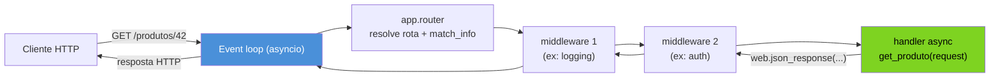
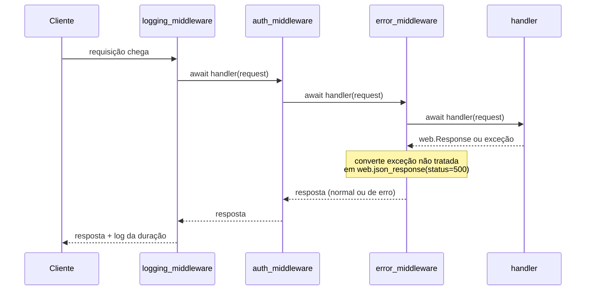
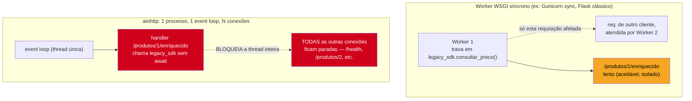

# aiohttp servidor — web.Application, routing e middlewares

> [!abstract] TL;DR
> `aiohttp.web.Application` é o servidor HTTP assíncrono da mesma biblioteca cujo lado cliente foi coberto na [[03 - aiohttp cliente — ClientSession, connection pooling e requisições concorrentes|nota 03]] — mas o modelo de concorrência que ele expõe é qualitativamente diferente do de um framework WSGI síncrono como Flask clássico ou Django sem ASGI. Rotas são registradas via `app.router.add_get`/`add_post` (ou o decorator `@routes.get`/`@routes.post` sobre um `web.RouteTableDef`) e apontam para **handlers assíncronos** — `async def handler(request: web.Request) -> web.Response`, que devolvem `web.Response`/`web.json_response`. **Middlewares** são coroutines com a assinatura `@web.middleware async def mw(request, handler)`, encadeadas em pipeline em torno de cada handler — usadas para logging de requisição, tratamento de exceção centralizado (convertendo exceções não tratadas em resposta JSON de erro) e autenticação via header. O ponto crítico de todo esse modelo: cada handler roda **na mesma thread, no mesmo event loop**, cooperativamente — se um handler chamar código bloqueante síncrono (`time.sleep()`, uma query de banco síncrona, uma chamada de I/O sem `await`), ele não apenas atrasa a própria requisição: ele **congela o event loop inteiro**, impedindo que qualquer outra conexão — de qualquer outro cliente — seja atendida enquanto o loop estiver preso naquela chamada. Isso é estruturalmente diferente de um worker WSGI síncrono (Flask/Gunicorn sync worker, Django sem ASGI), onde 1 worker atende 1 requisição de cada vez de forma bloqueante por design — uma requisição lenta atrasa só quem está na fila daquele worker, não corrompe silenciosamente a capacidade dos outros workers. `web.run_app()` sobe o `Application`, cria (ou reaproveita) o event loop, registra os handlers de sinal (`SIGINT`/`SIGTERM`) para desligamento gracioso, e bloqueia até o processo ser encerrado.

## O bug que abre esta nota

Um serviço interno expõe uma API HTTP construída com `aiohttp.web` para servir metadados de produtos — a escolha de `aiohttp` em vez de um framework WSGI tradicional foi deliberada: "precisamos de alta concorrência, então usamos async". Um dos endpoints, `/produtos/{id}/enriquecido`, precisa consultar um serviço legado de precificação que só expõe um SDK Python síncrono (uma biblioteca antiga, mantida por outro time, sem suporte a `asyncio`). O desenvolvedor, pressionado por prazo, resolve pragmaticamente:

```python
from aiohttp import web
import legacy_pricing_sdk  # SDK síncrono, bloqueante, sem suporte a async

routes = web.RouteTableDef()

@routes.get("/produtos/{id}/enriquecido")
async def get_produto_enriquecido(request: web.Request) -> web.Response:
    produto_id = request.match_info["id"]
    produto = await buscar_produto_no_banco(produto_id)  # isso aqui é async, ok

    # "só uma chamadinha síncrona, não deve ter problema..."
    preco = legacy_pricing_sdk.consultar_preco(produto_id)  # BLOQUEANTE — sem await

    return web.json_response({**produto, "preco": preco})
```

O endpoint funciona nos testes locais — um usuário, uma requisição, resposta em 300ms (o SDK legado é lento, mas "aceitável"). Em produção, sob duas ou três requisições concorrentes a esse mesmo endpoint, o sintoma é catastrófico: **todas as outras rotas do servidor** — incluindo endpoints que não têm nada a ver com precificação, como `/health` ou `/produtos/{id}` simples — começam a travar, com latência subindo de forma sincronizada entre requisições completamente não relacionadas. Um `curl /health` que deveria responder em milissegundos passa a demorar segundos, exatamente enquanto uma chamada a `/produtos/{id}/enriquecido` está em andamento.

> [!bug] O que está quebrado, em uma frase
> `legacy_pricing_sdk.consultar_preco()` é uma chamada síncrona e bloqueante executada dentro de um handler `async def` sem `await` — ela não cede o controle ao event loop, então, enquanto ela roda, o event loop inteiro fica congelado: nenhuma outra coroutine, de nenhuma outra requisição concorrente, pode avançar, porque `aiohttp` (como qualquer servidor `asyncio`) atende todas as conexões na mesma thread, cooperativamente.

Esse é o ponto que separa quem entende o modelo de concorrência de `aiohttp` de quem só copiou a sintaxe `async def`: um bloqueio síncrono dentro de um handler não é "um erro isolado numa requisição" — é um apagão que afeta **toda conexão simultânea no processo**, incluindo requisições de outros usuários completamente sem relação com a que causou o bloqueio. Entender por que isso acontece — e como o modelo `aiohttp` contrasta estruturalmente com um servidor WSGI síncrono, onde esse mesmo bug teria um raio de impacto muito menor — é o fio condutor desta nota.

## `web.Application`, rotas e handlers: o esqueleto mínimo

`aiohttp.web.Application` é o objeto central do lado servidor — análogo, na forma, ao objeto `app` de Flask ou `Application`/`urlpatterns` de Django, mas com uma diferença de fundo: cada handler registrado nele é uma coroutine, executada dentro do event loop do processo, não uma função síncrona despachada para uma thread ou processo dedicado.

Rotas podem ser registradas de duas formas equivalentes — diretamente no `router` do `Application`, ou via decorator sobre um `RouteTableDef` (a forma mais comum em bases de código maiores, por manter a definição da rota perto do handler):

```python
from aiohttp import web

# Forma 1: registro direto no router
async def handler_direto(request: web.Request) -> web.Response:
    return web.Response(text="registrado via app.router.add_get")

app = web.Application()
app.router.add_get("/direto", handler_direto)
app.router.add_post("/direto", handler_direto)

# Forma 2: RouteTableDef + decorator — mais comum em código real
routes = web.RouteTableDef()

@routes.get("/produtos/{id}")
async def get_produto(request: web.Request) -> web.Response:
    produto_id = request.match_info["id"]
    return web.json_response({"id": produto_id, "nome": "Produto Exemplo"})

@routes.post("/produtos")
async def criar_produto(request: web.Request) -> web.Response:
    dados = await request.json()   # ler o corpo da requisição é uma operação async
    novo_id = "prod-123"
    return web.json_response({"id": novo_id, **dados}, status=201)

app.add_routes(routes)   # registra tudo que foi decorado no RouteTableDef
```

Todo handler recebe um único argumento, `request: web.Request`, e devolve (ou levanta, no caso de erros HTTP) um `web.Response` — ou uma subclasse dele, como `web.json_response(...)` (atalho para `web.Response` com `Content-Type: application/json` e o corpo já serializado). Parâmetros de rota (`{id}` na URL) chegam via `request.match_info`; query string via `request.query`; o corpo da requisição, quando presente, é lido de forma assíncrona — `await request.json()`, `await request.text()`, `await request.read()` — pelo mesmo motivo estrutural de qualquer I/O de rede em `asyncio`: ler o corpo pode envolver esperar bytes que ainda não chegaram pela rede, e esse tempo de espera não pode bloquear o processo.



Handlers também podem ser implementados como classes (`web.View`), úteis quando múltiplos métodos HTTP para a mesma rota compartilham estado ou lógica de preparação — mas para a maioria dos endpoints, uma função `async def` simples, registrada por método e path, é suficiente e é o padrão dominante no ecossistema.

> [!info] `web.json_response` vs. `web.Response` manual
> `web.json_response(dados, status=200)` é açúcar sintático para `web.Response(text=json.dumps(dados), content_type="application/json", status=status)` — ele cuida da serialização e do cabeçalho `Content-Type` automaticamente. Para respostas que não são JSON (texto puro, HTML, bytes de um arquivo), `web.Response(text=..., content_type=...)` ou `web.Response(body=...)` (para bytes crus) são as formas diretas.

## Middlewares: pipeline em torno do handler

Um middleware em `aiohttp.web` é uma coroutine com assinatura fixa `async def middleware(request, handler)`, decorada com `@web.middleware` — ela recebe a requisição e uma referência ao **próximo elo da cadeia** (que pode ser outro middleware ou, no fim da cadeia, o handler de fato), e é responsável por chamar esse próximo elo (`await handler(request)`) e devolver (ou transformar) o resultado. É estruturalmente o mesmo padrão de "wrapper em cadeia" que aparece em quase todo framework web — Express (`next()`), Django (`get_response`), Flask (`before_request`/`after_request`) — mas aqui, por ser `asyncio`, cada elo da cadeia é uma coroutine, e o encadeamento acontece via `await`.

```python
from aiohttp import web
import logging
import time

logger = logging.getLogger("api")

@web.middleware
async def logging_middleware(request: web.Request, handler):
    inicio = time.monotonic()
    try:
        resposta = await handler(request)
        duracao_ms = (time.monotonic() - inicio) * 1000
        logger.info(
            "%s %s -> %d (%.1fms)",
            request.method, request.path, resposta.status, duracao_ms,
        )
        return resposta
    except web.HTTPException:
        duracao_ms = (time.monotonic() - inicio) * 1000
        logger.info(
            "%s %s -> exceção HTTP (%.1fms)",
            request.method, request.path, duracao_ms,
        )
        raise   # HTTPException é a forma "esperada" de erro em aiohttp — deixa propagar
```

O middleware acima envolve a chamada ao próximo elo num `try`/`except`, mede o tempo decorrido, registra o log, e — ponto importante — **devolve** (`return resposta`) ou **relança** (`raise`) o que veio de `handler(request)`, nunca engolindo silenciosamente o resultado. Middlewares são registrados na criação do `Application`, numa lista ordenada — a ordem importa, porque cada middleware envolve todos os que vêm depois dele na lista:

```python
app = web.Application(middlewares=[logging_middleware, auth_middleware, error_middleware])
```



### Middleware de tratamento de exceção centralizado

Sem um middleware dedicado, uma exceção não tratada dentro de um handler (um `ValueError` inesperado, um erro de banco, um `KeyError` em `request.match_info`) propaga até `aiohttp` capturar genericamente e devolver um `500 Internal Server Error` — funcional, mas sem controle sobre o formato da resposta, que por padrão é HTML, não JSON, quebrando o contrato de uma API que deveria sempre devolver JSON, erro ou sucesso.

```python
from aiohttp import web
import logging

logger = logging.getLogger("api")

@web.middleware
async def error_middleware(request: web.Request, handler):
    try:
        return await handler(request)
    except web.HTTPException:
        # HTTPException (404, 400, 403, etc.) já é uma resposta HTTP válida
        # levantada deliberadamente — não é um bug, é fluxo de controle esperado
        raise
    except Exception as exc:
        # qualquer outra exceção é um erro não previsto — loga com stack trace completo
        # e devolve um JSON consistente, sem vazar detalhes internos ao cliente
        logger.exception("erro não tratado em %s %s", request.method, request.path)
        return web.json_response(
            {"erro": "erro interno do servidor"},
            status=500,
        )
```

A distinção entre `web.HTTPException` (a classe-base de `web.HTTPNotFound`, `web.HTTPBadRequest`, `web.HTTPForbidden`, etc. — todas subclasses de `web.Response`, deliberadamente levantadas por um handler para sinalizar um erro HTTP específico) e qualquer outra `Exception` é o coração deste middleware: `HTTPException` **é** a resposta HTTP de erro (basta relançar, `aiohttp` sabe convertê-la), enquanto qualquer outra exceção é um bug real que precisa ser logado com detalhe e, ao mesmo tempo, escondido do cliente por trás de uma mensagem genérica — o mesmo princípio de não vazar stack traces internos numa resposta de API pública que se aplica a qualquer framework web, síncrono ou não.

```python
# Um handler que usa web.HTTPException deliberadamente
@routes.get("/produtos/{id}")
async def get_produto(request: web.Request) -> web.Response:
    produto_id = request.match_info["id"]
    produto = await buscar_produto_no_banco(produto_id)
    if produto is None:
        raise web.HTTPNotFound(
            text='{"erro": "produto não encontrado"}',
            content_type="application/json",
        )
    return web.json_response(produto)
```

### Middleware de autenticação básica via header

Um terceiro exemplo canônico de middleware — autenticação simples verificando um header de API key antes de deixar a requisição chegar ao handler:

```python
from aiohttp import web

API_KEYS_VALIDAS = {"chave-secreta-do-cliente-a", "chave-secreta-do-cliente-b"}

@web.middleware
async def auth_middleware(request: web.Request, handler):
    # rotas públicas não exigem autenticação — checagem simples por path
    if request.path in {"/health", "/"}:
        return await handler(request)

    api_key = request.headers.get("X-API-Key")
    if api_key not in API_KEYS_VALIDAS:
        raise web.HTTPUnauthorized(
            text='{"erro": "API key ausente ou inválida"}',
            content_type="application/json",
        )

    # anexa informação de contexto para os middlewares/handler seguintes
    request["cliente_autenticado"] = api_key
    return await handler(request)
```

`request[chave] = valor` (o `Request` de `aiohttp` suporta acesso como dicionário, herdado de `MutableMapping`) é o mecanismo padrão para middlewares passarem dados adiante na cadeia — o handler final, ou qualquer middleware posterior, pode ler `request["cliente_autenticado"]` sem precisar de um mecanismo externo (variável global, `contextvars`, etc.) para propagar esse contexto ao longo da requisição.

> [!warning] Ordem dos middlewares importa — e é fácil errar
> **O que acontece:** registrar `auth_middleware` **depois** de um middleware que já faz trabalho custoso (uma consulta a cache, uma query) significa que esse trabalho é executado para requisições que, no fim, serão rejeitadas por falta de autenticação — desperdício de recursos, e em alguns casos uma superfície de ataque (permitir que um cliente não autenticado dispare trabalho custoso no servidor repetidamente). **Por quê:** a lista de `middlewares=[...]` passada ao `Application` define a ordem de envolvimento — o primeiro da lista é o mais externo (executa primeiro, antes de qualquer middleware seguinte), o último é o mais próximo do handler. **Como evitar:** middlewares baratos e que podem **rejeitar cedo** (autenticação, rate limiting simples, validação de payload) devem vir antes de middlewares que fazem trabalho custoso (logging detalhado com I/O, métricas com chamada de rede) — a ordem lógica costuma ser: autenticação → validação → logging/métricas → tratamento de exceção envolvendo tudo (`error_middleware` frequentemente é o primeiro da lista, para capturar exceções de qualquer middleware posterior também).

## Servidor completo: `Application` + rotas + middlewares + `web.run_app`

Juntando as peças num servidor mínimo, mas funcional e testável — duas rotas (`GET /health` e `GET /produtos/{id}`) e o middleware de tratamento de exceção centralizado:

```python
from aiohttp import web
import logging

logging.basicConfig(level=logging.INFO)
logger = logging.getLogger("api")

routes = web.RouteTableDef()

# "banco de dados" em memória, só para o exemplo ser executável de ponta a ponta
PRODUTOS = {
    "1": {"id": "1", "nome": "Teclado mecânico", "preco": 350.0},
    "2": {"id": "2", "nome": "Monitor 27 polegadas", "preco": 1200.0},
}


@routes.get("/health")
async def health(request: web.Request) -> web.Response:
    return web.json_response({"status": "ok"})


@routes.get("/produtos/{id}")
async def get_produto(request: web.Request) -> web.Response:
    produto_id = request.match_info["id"]
    produto = PRODUTOS.get(produto_id)
    if produto is None:
        raise web.HTTPNotFound(
            text='{"erro": "produto não encontrado"}',
            content_type="application/json",
        )
    return web.json_response(produto)


@web.middleware
async def error_middleware(request: web.Request, handler):
    try:
        return await handler(request)
    except web.HTTPException:
        raise
    except Exception:
        logger.exception("erro não tratado em %s %s", request.method, request.path)
        return web.json_response({"erro": "erro interno do servidor"}, status=500)


@web.middleware
async def logging_middleware(request: web.Request, handler):
    resposta = await handler(request)
    logger.info("%s %s -> %d", request.method, request.path, resposta.status)
    return resposta


def criar_app() -> web.Application:
    app = web.Application(middlewares=[error_middleware, logging_middleware])
    app.add_routes(routes)
    return app


if __name__ == "__main__":
    web.run_app(criar_app(), host="0.0.0.0", port=8080)
```

`web.run_app(app, host=..., port=...)` é a função que efetivamente **sobe o servidor**: por baixo, ela chama `asyncio.run()` (ou reaproveita um loop existente, dependendo da versão e do contexto de chamada) para criar/obter o event loop, inicializa o `Application` (disparando os handlers de `on_startup` registrados, se houver), cria o socket TCP e o vincula à porta, registra handlers de sinal do sistema operacional para `SIGINT` (Ctrl+C) e `SIGTERM` (o sinal padrão que orquestradores como Kubernetes ou `systemd` enviam para pedir desligamento gracioso) — e então **bloqueia**, rodando o event loop indefinidamente até um desses sinais chegar, momento em que ela conduz um encerramento ordenado: para de aceitar novas conexões, aguarda um tempo configurável para requisições em andamento terminarem (`shutdown_timeout`, com um padrão de 60 segundos), dispara os handlers de `on_cleanup` registrados, e só então retorna, deixando o processo terminar.

> [!info] `web.run_app` já cuida de graceful shutdown — não é preciso reimplementar
> O padrão manual de capturar `SIGINT`/`SIGTERM` com `loop.add_signal_handler()` para desligar um servidor de forma limpa (assunto que será aprofundado de forma genérica, para qualquer aplicação `asyncio` de longa duração, na [[07 - Padrões de produção com asyncio — supervisão de tasks, graceful shutdown, circuit breaker|nota 07]] deste galho) já vem embutido em `web.run_app()` para o caso específico de um servidor `aiohttp.web` — não é necessário reimplementar essa lógica na maioria dos casos. `on_shutdown`/`on_cleanup` são os pontos de extensão corretos para lógica adicional de encerramento (fechar uma pool de conexões de banco, um `ClientSession` compartilhado, etc.), registrados via `app.on_shutdown.append(...)`/`app.on_cleanup.append(...)`.

## O bug revisitado: por que um handler bloqueante trava tudo

Voltando ao bug de abertura — `legacy_pricing_sdk.consultar_preco()` chamado sem `await` dentro de um handler `async def`. O motivo estrutural é o mesmo que já apareceu, de forma mais genérica, em [[01 - Event loop por dentro — selectors, callbacks e a relação Future/Task|nota 01]] deste galho: o event loop de `asyncio` roda numa **única thread**, alternando entre coroutines suspensas em pontos de `await` — mas essa alternância só é possível nos pontos em que a coroutine efetivamente cede o controle (`await` sobre I/O, `asyncio.sleep()`, etc.). Uma chamada síncrona bloqueante, como `time.sleep()` ou uma consulta de rede feita por uma biblioteca que não usa `asyncio`, **não tem nenhum ponto de cessão** — do ponto de vista do event loop, aquela coroutine "está rodando" ininterruptamente do início ao fim da chamada bloqueante, e nenhuma outra coroutine — de nenhuma outra conexão — pode avançar nesse intervalo, porque só existe uma thread executando o código Python de todos os handlers.



A comparação com um worker WSGI síncrono deixa o contraste explícito: em Flask clássico servido por Gunicorn com workers síncronos (ou Django sem ASGI, num modelo equivalente), **1 worker atende 1 requisição de cada vez, de forma bloqueante por design** — se um handler chama `time.sleep(5)` ou uma query lenta, aquele worker específico fica ocupado por 5 segundos, mas outros workers (processos ou threads, dependendo da configuração) continuam livres para atender outras requisições normalmente. O modelo é "lento, mas isolado" — o preço de uma chamada bloqueante é pago só pela requisição que a fez (e por quem estiver na fila daquele worker específico, se a fila do servidor de aplicação estiver saturada). Em `aiohttp` (e em qualquer servidor `asyncio` de forma geral, incluindo ASGI — assunto da [[05 - ASGI e o ecossistema de frameworks assíncronos|nota 05]]), o modelo é o oposto: **1 processo lida com milhares de conexões concorrentes de forma não-bloqueante**, o que é extremamente eficiente exatamente porque nenhuma conexão individual monopoliza a CPU enquanto espera I/O — mas essa eficiência depende inteiramente da disciplina de que **nenhum handler bloqueie a thread**. Um único ponto de bloqueio síncrono derruba a propriedade central do modelo inteiro: em vez de "lento, mas isolado", vira "uma requisição lenta paralisa todas as outras".

> [!warning] Chamar código síncrono bloqueante dentro de um handler `async def` (o bug desta nota)
> **O que acontece:** uma chamada de função síncrona que faz I/O bloqueante (SDK legado sem suporte a `asyncio`, `time.sleep()`, uma query de ORM síncrono, leitura de arquivo grande sem `aiofiles`) roda dentro de um handler `aiohttp.web` sem passar por nenhum mecanismo de liberar a thread — o event loop fica preso do início ao fim dessa chamada, e **toda outra conexão simultânea** no processo — de qualquer rota, de qualquer cliente — fica parada nesse intervalo, mesmo que não tenha relação nenhuma com a requisição que causou o bloqueio. **Por quê:** `aiohttp.web` (como qualquer servidor `asyncio`) atende todas as conexões numa única thread, cooperativamente — a cessão de controle só acontece em pontos de `await` sobre operações que de fato integram com o event loop; uma chamada síncrona bloqueante não tem esse ponto de cessão, então monopoliza a thread inteira pelo tempo que durar. **Como evitar:** para código síncrono que não pode ser reescrito como async (SDKs de terceiros, bibliotecas legadas), delegar a execução a uma thread separada via `loop.run_in_executor(None, funcao_sincrona, *args)` (ou `asyncio.to_thread(funcao_sincrona, *args)`, o atalho equivalente desde Python 3.9) — isso tira a chamada bloqueante da thread do event loop, deixando-a rodar num `ThreadPoolExecutor` em paralelo, enquanto o event loop continua livre para atender outras conexões.

```python
# Fix do bug de abertura: delega a chamada síncrona a uma thread separada
import asyncio
from aiohttp import web
import legacy_pricing_sdk

@routes.get("/produtos/{id}/enriquecido")
async def get_produto_enriquecido(request: web.Request) -> web.Response:
    produto_id = request.match_info["id"]
    produto = await buscar_produto_no_banco(produto_id)

    # asyncio.to_thread: roda a chamada bloqueante num ThreadPoolExecutor,
    # sem travar o event loop — outras conexões continuam sendo atendidas
    preco = await asyncio.to_thread(legacy_pricing_sdk.consultar_preco, produto_id)

    return web.json_response({**produto, "preco": preco})
```

Com `asyncio.to_thread()`, a chamada síncrona ainda leva o mesmo tempo (300ms, no exemplo) — não há mágica que acelere um SDK legado lento — mas esse tempo é pago numa thread separada do `ThreadPoolExecutor` padrão do loop, enquanto a thread principal do event loop permanece livre para despachar `/health`, `/produtos/2`, e qualquer outra requisição concorrente normalmente. O raio de impacto do bloqueio volta a ser "só a requisição que fez a chamada lenta", igualando (nesse aspecto específico) o comportamento ao de um worker WSGI síncrono — a diferença é que, nos outros 99% dos handlers que não dependem de código bloqueante legado, `aiohttp` continua lidando com milhares de conexões concorrentes num único processo, sem o custo de memória de um processo/thread por conexão que um modelo WSGI tradicional pagaria para atingir a mesma concorrência.

## Armadilhas comuns

> [!warning] Handler síncrono bloqueante travando o event loop (já detalhado acima)
> **O que acontece:** qualquer chamada bloqueante sem `await` dentro de um handler `async def` congela o event loop inteiro, não só a requisição que a fez. **Como evitar:** `asyncio.to_thread()`/`loop.run_in_executor()` para código síncrono que não pode ser reescrito como async; nunca chamar diretamente.

> [!warning] Middleware que não devolve nem relança o resultado de `handler(request)`
> **O que acontece:** um middleware escrito incorretamente — por exemplo, um `try`/`except` que engole uma exceção sem `raise` e não devolve nada explicitamente — faz a cadeia inteira devolver `None` implicitamente, e `aiohttp` levanta um erro interno confuso sobre o tipo de retorno do handler, difícil de rastrear até a causa real. **Por quê:** cada middleware é responsável por `return await handler(request)` (ou uma transformação explícita desse retorno) — omitir isso quebra silenciosamente o contrato da cadeia. **Como evitar:** todo middleware deve ter um caminho de código que termina em `return` (com o resultado de `handler(request)` ou uma resposta construída deliberadamente) ou `raise` — nunca deixar um branch "cair no fim da função" sem retorno explícito.

> [!warning] Registrar rotas depois de já ter chamado `web.run_app`
> **O que acontece:** tentar adicionar uma rota (`app.router.add_get(...)`) depois que o `Application` já está rodando (ex: dentro de um handler, ou num código que roda após `web.run_app()` já ter sido chamado) levanta `RuntimeError` — o roteador é "congelado" (`frozen`) assim que o app começa a rodar. **Por quê:** `aiohttp` resolve rotas de forma otimizada assumindo uma topologia fixa, definida antes do servidor subir — permitir mutação do roteador em tempo de execução abriria uma classe inteira de condições de corrida e inconsistências. **Como evitar:** registrar todas as rotas (diretamente ou via `RouteTableDef`) antes de chamar `web.run_app()` — normalmente numa função `criar_app()` separada, como no exemplo desta nota, chamada uma única vez na inicialização.

> [!warning] Confundir `web.HTTPException` com um erro genérico no middleware de tratamento de exceção
> **O que acontece:** um `except Exception` sem distinguir `web.HTTPException` captura e "trata como bug" uma `web.HTTPNotFound` levantada deliberadamente por um handler — transformando um `404` esperado num `500` genérico e incorreto. **Por quê:** `web.HTTPException` é subclasse de `Exception` (e de `web.Response`) — um `except Exception` genérico, sem checar o tipo específico antes, intercepta ela também. **Como evitar:** sempre ter um `except web.HTTPException: raise` **antes** do `except Exception:` genérico no middleware de tratamento de erro, exatamente como no exemplo desta nota — a ordem dos `except` importa tanto quanto a ordem dos middlewares.

## Em entrevista

O modelo de concorrência de `aiohttp.web` é um tema que revela rapidamente se quem está respondendo entende o que "assíncrono" realmente compra — e o que ele exige em troca:

> "The thing people miss about `aiohttp.web` — or any `asyncio`-based server, really — is that it runs every connection on a single thread, cooperatively. That's what lets one process handle thousands of concurrent connections cheaply: while one request is waiting on I/O, the event loop picks up another. But it only works if every handler actually yields control at its `await` points. The moment a handler calls something synchronous and blocking — a legacy SDK, `time.sleep()`, a blocking DB driver — there's no yield point, so the whole event loop freezes for the duration of that call, and every other connection in the process stalls, not just the one that made the blocking call. That's a fundamentally different failure mode than a synchronous WSGI worker, like classic Flask under Gunicorn: there, one worker blocks, but other workers keep serving requests independently, because each worker really is isolated. So async concurrency buys you a lot of efficiency, but it comes with a discipline requirement WSGI doesn't have — you have to keep blocking calls out of the event loop thread entirely, usually with `asyncio.to_thread()` or `run_in_executor()`, or the whole efficiency story collapses under load."

Uma pergunta natural de acompanhamento: **"como você teria detectado esse problema antes de produção?"** — a resposta sênior menciona rodar o event loop em modo debug (`PYTHONASYNCIODEBUG=1`, já visto na nota 01 deste galho), que emite um warning quando um callback do loop leva tempo demais para retornar (um sinal direto de bloqueio síncrono), além de testar sob carga concorrente real (não só requisições isoladas sequenciais) desde o ambiente de staging.

> [!question]- E se perguntarem sobre middlewares vs. decorators para funcionalidade cross-cutting?
> Vale mencionar que middlewares em `aiohttp.web` resolvem o mesmo problema que decorators por handler resolveriam (`@requer_autenticacao` aplicado individualmente em cada rota), mas de forma centralizada e configurável em um único lugar — a vantagem é não depender de disciplina manual (esquecer o decorator numa rota nova é um erro de omissão fácil de cometer); a desvantagem é que middlewares se aplicam a **todas** as rotas por padrão, exigindo lógica de exclusão explícita (como a checagem de `request.path` no exemplo de `auth_middleware` desta nota) para rotas que devem ficar fora do comportamento — decorators, por outro lado, são opt-in por natureza. Times maduros costumam combinar os dois: middlewares para o que é verdadeiramente global (logging, tratamento de exceção), decorators ou checagem explícita dentro do handler para regras específicas de uma rota.

## Como explicar em inglês

| PT | EN |
|----|----|
| rota | route |
| handler assíncrono | async handler |
| middleware encadeado | chained middleware |
| tratamento de exceção centralizado | centralized exception handling |
| autenticação via header | header-based authentication |
| desligamento gracioso | graceful shutdown |
| bloquear o event loop | block the event loop |
| ceder o controle | yield control |
| worker síncrono | synchronous worker |
| concorrência não-bloqueante | non-blocking concurrency |
| delegar para uma thread separada | offload to a separate thread |
| resposta em JSON | JSON response |

## O que vem a seguir

Esta nota fechou o lado servidor de `aiohttp` — `web.Application`, rotas via `RouteTableDef`/`app.router`, handlers assíncronos, middlewares encadeados (logging, tratamento de exceção, autenticação), `web.run_app()` e o contraste de modelo de concorrência com WSGI síncrono. O galho segue para o protocolo que generaliza esse mesmo modelo servidor-assíncrono para todo o ecossistema Python, e depois para as ferramentas de controle de carga que evitam o próprio tipo de saturação que um handler bloqueante pode causar:

- [[05 - ASGI e o ecossistema de frameworks assíncronos|05 — ASGI e o ecossistema de frameworks assíncronos]] — o protocolo que generaliza o modelo servidor-assíncrono visto aqui (um único processo, um único event loop, milhares de conexões concorrentes) para além de `aiohttp` — quem implementa ASGI (Uvicorn, Hypercorn) e quem constrói sobre ele (Starlette, FastAPI), sem entrar em nenhum framework específico em profundidade.
- [[06 - Back-pressure — Semaphore, Queue com maxsize e buffering|06 — Back-pressure: Semaphore, Queue com maxsize e buffering]] — como limitar deliberadamente a concorrência de trabalho disparado por um handler (ex: chamadas a serviços externos feitas dentro de uma rota), evitando que um único endpoint sature recursos compartilhados.
- [[07 - Padrões de produção com asyncio — supervisão de tasks, graceful shutdown, circuit breaker|07 — Padrões de produção com asyncio: supervisão de tasks, graceful shutdown, circuit breaker]] — aprofunda, de forma genérica para qualquer aplicação `asyncio` de longa duração, o mecanismo de graceful shutdown que `web.run_app()` já embute especificamente para servidores `aiohttp.web`.
- [[03 - aiohttp cliente — ClientSession, connection pooling e requisições concorrentes|03 — aiohttp cliente: ClientSession, connection pooling e requisições concorrentes]] — o lado cliente da mesma biblioteca; um handler deste servidor que precisa chamar outro serviço HTTP usaria exatamente o `ClientSession` compartilhado descrito naquela nota, não uma sessão nova por requisição.
- [[01 - Event loop por dentro — selectors, callbacks e a relação Future/Task|01 — Event loop por dentro: selectors, callbacks e a relação Future/Task]] — a base conceitual de por que uma chamada bloqueante congela o loop inteiro: o mecanismo de despacho de callbacks numa única thread, explicado em detalhe naquela nota.

## Fontes

- aiohttp contributors. *Server Quickstart — aiohttp documentation*. docs.aiohttp.org, versão estável. https://docs.aiohttp.org/en/stable/web_quickstart.html (acessado em 2026-07-11) — `web.Application`, `add_routes`, `RouteTableDef`, handlers, `web.Response`/`web.json_response`.
- aiohttp contributors. *Middlewares — aiohttp documentation*. docs.aiohttp.org, versão estável. https://docs.aiohttp.org/en/stable/web_advanced.html#middlewares (acessado em 2026-07-11) — assinatura `@web.middleware`, encadeamento, ordem de execução.
- aiohttp contributors. *Web Server Reference — aiohttp documentation*. docs.aiohttp.org, versão estável. https://docs.aiohttp.org/en/stable/web_reference.html (acessado em 2026-07-11) — referência de `Application`, `Request`, `web.run_app`, `on_startup`/`on_shutdown`/`on_cleanup`, `shutdown_timeout`.
- aiohttp contributors. *Graceful Shutdown — aiohttp documentation*. docs.aiohttp.org, versão estável. https://docs.aiohttp.org/en/stable/web_advanced.html#graceful-shutdown (acessado em 2026-07-11) — o que `web.run_app()` faz ao receber `SIGINT`/`SIGTERM`.
- Python Software Foundation. *asyncio — Running in Threads*. docs.python.org, versão 3.14. https://docs.python.org/3/library/asyncio-task.html#running-in-threads (acessado em 2026-07-11) — `asyncio.to_thread()`, delegação de chamadas bloqueantes para fora do event loop.
- [[03-Dominios/Tecnologia/Python/Concorrência e paralelismo/01 - Threading na prática — Thread, Lock e condições de corrida|Galho 7 nota 01 — Threading na prática]] — contraste de modelo de concorrência com threads do sistema operacional, referenciado ao explicar por que `run_in_executor`/`to_thread` resolvem o bloqueio.
- [[01 - Event loop por dentro — selectors, callbacks e a relação Future/Task|01 — Event loop por dentro: selectors, callbacks e a relação Future/Task]] — nota-irmã, base conceitual do mecanismo de despacho numa única thread.
- [[03 - aiohttp cliente — ClientSession, connection pooling e requisições concorrentes|03 — aiohttp cliente: ClientSession, connection pooling e requisições concorrentes]] — nota-irmã, o lado cliente da mesma biblioteca.

Consultado em 2026-07-11.
