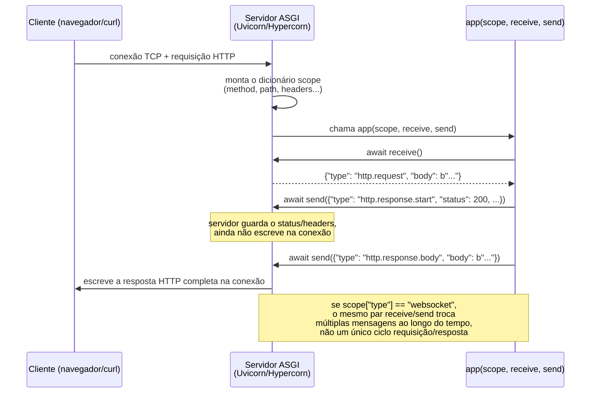
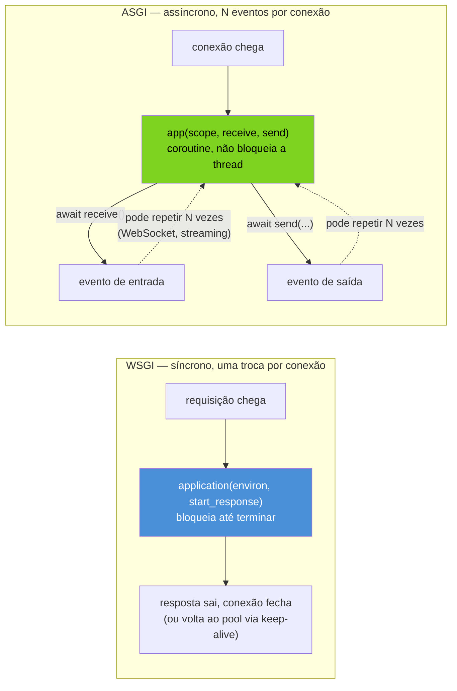
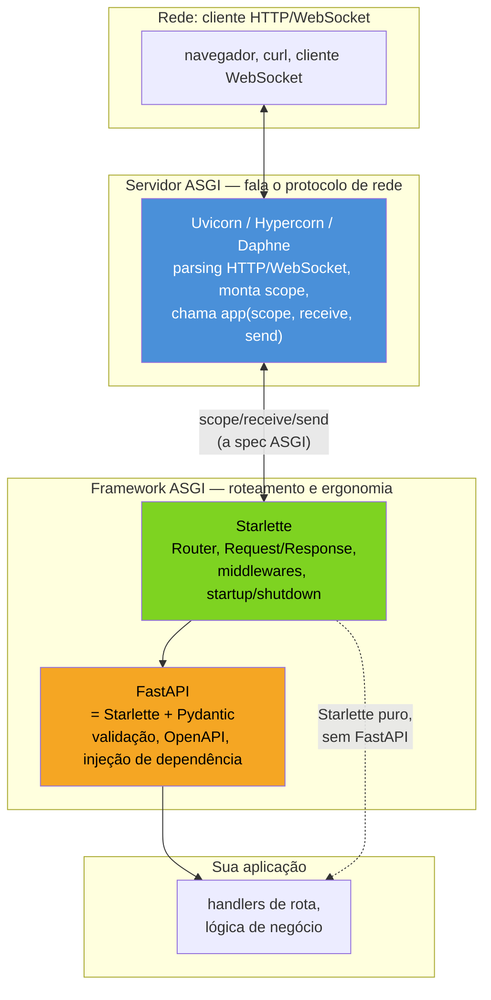

# ASGI e o ecossistema de frameworks assíncronos

> [!abstract] TL;DR
> **ASGI** (Asynchronous Server Gateway Interface) é o sucessor assíncrono de **WSGI** — a interface padrão entre um servidor web Python e uma aplicação. WSGI define uma aplicação como uma função síncrona `application(environ, start_response)`: recebe uma requisição, devolve uma resposta, e a conexão termina ali. Isso funciona perfeitamente para HTTP request/response tradicional, mas não tem como representar **WebSocket** (conexão bidirecional de longa duração), **Server-Sent Events**/long-polling (o servidor precisa enviar múltiplos eventos ao longo do tempo numa única conexão), ou qualquer padrão de comunicação que não seja "uma pergunta, uma resposta, fim". ASGI generaliza a interface de uma função de dois parâmetros para uma **coroutine de três parâmetros** — `async def app(scope, receive, send)` — onde `scope` é um dicionário imutável descrevendo a conexão (tipo `http`/`websocket`/`lifespan`, path, headers, etc.), `receive` é uma coroutine que a aplicação chama para **receber** o próximo evento (corpo da requisição, mensagem WebSocket, sinal de desconexão), e `send` é uma coroutine que a aplicação chama para **enviar** eventos de volta (início de resposta, corpo, mensagem WebSocket). Trocar "retornar uma resposta" por "trocar eventos ao longo do tempo" é a mudança conceitual inteira — é isso que abre espaço para WebSocket, streaming, e Server-Sent Events sem inventar um protocolo paralelo. O ecossistema se divide em dois papéis distintos: **servidores ASGI** (Uvicorn, Hypercorn, Daphne — processos que abrem sockets, falam HTTP/WebSocket na fiação, e invocam `app(scope, receive, send)`) e **frameworks ASGI** (Starlette como a camada mínima de roteamento/middlewares sobre o protocolo cru; FastAPI construído em cima de Starlette, adicionando validação via Pydantic e geração automática de schema OpenAPI). Esta nota fica no nível do protocolo — o "como funciona por baixo" — e não entra em profundidade em FastAPI/Django nem em construção de APIs REST completas, que ficam para o Galho 10 (Web e APIs REST) desta trilha.

## O bug que abre esta nota: por que WSGI não faz WebSocket

Um time decide adicionar uma feature de notificações em tempo real a uma aplicação Flask (WSGI) já em produção — quando algo acontece no backend, o navegador do usuário deveria ser avisado sem precisar recarregar a página. A primeira tentativa, escrita por alguém que não questionou a arquitetura, tenta abrir uma conexão WebSocket dentro de uma view Flask comum:

```python
# NÃO FUNCIONA como WebSocket de verdade — isto é WSGI, não ASGI
from flask import Flask

app = Flask(__name__)

@app.route("/notificacoes")
def notificacoes():
    # "e agora, como eu mantenho essa conexão aberta e envio
    # múltiplas mensagens ao longo do tempo, dentro de uma
    # função que só sabe fazer return uma vez?"
    ...
```

A função `notificacoes()` é chamada, executa até o fim, e devolve **uma** resposta — é exatamis o contrato WSGI: `application(environ, start_response)` é invocada uma vez por requisição, e o ciclo de vida da chamada termina quando a função retorna. Não existe, na assinatura WSGI, um jeito de "manter a função rodando" enquanto o servidor mantém a conexão TCP aberta e ambos os lados trocam mensagens ao longo do tempo — o modelo inteiro pressupõe que uma requisição é uma pergunta e uma resposta é a resposta, ponto final. Bibliotecas de WebSocket sobre Flask/WSGI existem (`flask-sock`, extensões que fazem *bypass* do WSGI padrão usando threads ou hooks específicos do servidor), mas são gambiarras em cima de uma interface que não foi desenhada para isso — não uma solução de primeira classe do protocolo.

> [!bug] O que está quebrado, em uma frase
> WSGI modela uma aplicação como `application(environ, start_response) -> resposta`: uma chamada síncrona que recebe uma requisição completa e devolve uma resposta completa — não há como representar, nessa assinatura, uma conexão que troca múltiplos eventos ao longo do tempo em ambas as direções, que é exatamente o que WebSocket e streaming exigem.

Antes de qualquer framework, vale ver como fica uma aplicação ASGI crua — sem Flask, sem FastAPI, só a interface nua que resolve esse problema:

```python
# app_cru.py — aplicação ASGI mínima, sem framework nenhum
# roda com: uvicorn app_cru:app

async def app(scope, receive, send):
    assert scope["type"] == "http"

    # 1. espera o evento de início da requisição chegar via receive()
    await receive()  # {"type": "http.request", "body": b"...", "more_body": False}

    # 2. envia o início da resposta: status e headers
    await send({
        "type": "http.response.start",
        "status": 200,
        "headers": [(b"content-type", b"text/plain")],
    })

    # 3. envia o corpo da resposta
    await send({
        "type": "http.response.body",
        "body": b"Hello, ASGI!",
    })
```

Isso já é uma aplicação web completa e funcional — sem Flask, sem FastAPI, sem Django, nenhuma dependência além do servidor ASGI que a executa (`pip install uvicorn`, depois `uvicorn app_cru:app`). Não há `return`; não há uma função que "devolve uma resposta". Há duas coroutines, `receive` e `send`, que a aplicação chama para trocar **eventos** com o servidor, um de cada vez, ao longo do tempo em que a conexão dura. É exatamente essa mudança — de "retornar uma resposta" para "trocar eventos" — que abre a porta para WebSocket, sem inventar um protocolo paralelo: WebSocket é só um `scope["type"]` diferente (`"websocket"` em vez de `"http"`), com um vocabulário de eventos diferente passando pelas mesmas duas coroutines `receive`/`send`.

## A spec ASGI: `scope`, `receive`, `send`

A especificação ASGI (mantida pela [Encode](https://github.com/encode), a mesma organização por trás de Starlette, Uvicorn e HTTPX) define uma aplicação como uma única coroutine assinada `async def app(scope, receive, send)`. Os três parâmetros carregam papéis bem distintos:

- **`scope`** — um dicionário Python **imutável para a duração da conexão**, criado pelo servidor antes de chamar a aplicação. Contém tudo que descreve a conexão: `type` (`"http"`, `"websocket"` ou `"lifespan"`), `method`, `path`, `query_string`, `headers` (lista de tuplas `(nome, valor)` em bytes), `client`, `server`, versão do protocolo ASGI, e mais campos específicos de cada tipo de conexão. `scope` é preenchido uma vez, no início, e não muda — é o "quem é você, o que você quer" da conexão.
- **`receive`** — uma coroutine sem argumentos que a aplicação `await`s para obter o **próximo evento de entrada**: o corpo de uma requisição HTTP (possivelmente em pedaços, via `more_body`), uma mensagem recebida num WebSocket, ou um sinal de desconexão do cliente. Cada chamada a `receive()` bloqueia até o próximo evento estar disponível — é assim que a aplicação "espera" por dados sem travar o event loop, o mesmo padrão de `await` já visto em toda a trilha desde o Galho 7.
- **`send`** — uma coroutine que recebe um dicionário de evento e o **envia de volta** ao servidor (que, por sua vez, o traduz para bytes na conexão real): início de resposta HTTP com status e headers, um pedaço do corpo, uma mensagem WebSocket, ou o fechamento da conexão. Cada `await send(evento)` empurra um evento para fora — a aplicação pode chamar `send` quantas vezes forem necessárias, não apenas uma.



### Os três tipos de `scope`: `http`, `websocket`, `lifespan`

`scope["type"]` determina qual vocabulário de eventos a aplicação deve esperar de `receive()` e pode enviar via `send()`. Os três tipos definidos pela spec:

| `scope["type"]` | O que representa | Eventos típicos de `receive()` | Eventos típicos de `send()` |
|---|---|---|---|
| `"http"` | Uma requisição HTTP request/response | `http.request` (corpo, possivelmente em pedaços via `more_body`), `http.disconnect` | `http.response.start` (status + headers), `http.response.body` (pedaço do corpo) |
| `"websocket"` | Uma conexão WebSocket, potencialmente de longa duração | `websocket.connect`, `websocket.receive` (mensagem do cliente), `websocket.disconnect` | `websocket.accept`, `websocket.send` (mensagem para o cliente), `websocket.close` |
| `"lifespan"` | O ciclo de vida da **aplicação inteira** (não de uma conexão individual) — usado para inicializar/limpar recursos (pool de conexão de banco, cliente HTTP compartilhado) | `lifespan.startup`, `lifespan.shutdown` | `lifespan.startup.complete`/`lifespan.startup.failed`, `lifespan.shutdown.complete`/`lifespan.shutdown.failed` |

O tipo `lifespan` merece destaque à parte: é o protocolo ASGI resolvendo, de forma padronizada entre servidores e frameworks diferentes, o mesmo problema que a [[07 - Padrões de produção com asyncio — supervisão de tasks, graceful shutdown, circuit breaker|nota 07]] deste galho vai tratar de forma mais geral — inicializar recursos compartilhados (uma `aiohttp.ClientSession` da [[03 - aiohttp cliente — ClientSession, connection pooling e requisições concorrentes|nota 03]], um pool de conexões de banco) quando a aplicação sobe, e limpá-los quando ela desce, em vez de deixar cada requisição individual abrir/fechar seus próprios recursos.

```python
# app_lifespan.py — aplicação ASGI crua que trata http E lifespan
recurso_global = {}

async def app(scope, receive, send):
    if scope["type"] == "lifespan":
        while True:
            evento = await receive()
            if evento["type"] == "lifespan.startup":
                recurso_global["conexao"] = "pool inicializado aqui"
                await send({"type": "lifespan.startup.complete"})
            elif evento["type"] == "lifespan.shutdown":
                recurso_global.clear()
                await send({"type": "lifespan.shutdown.complete"})
                return
    elif scope["type"] == "http":
        await receive()
        await send({
            "type": "http.response.start",
            "status": 200,
            "headers": [(b"content-type", b"text/plain")],
        })
        corpo = f"recurso ativo: {recurso_global}".encode()
        await send({"type": "http.response.body", "body": corpo})
```

Rodando com `uvicorn app_lifespan:app --lifespan on` (Uvicorn tenta detectar suporte a `lifespan` automaticamente, mas o flag existe para tornar explícito), o servidor chama `app(scope, receive, send)` **uma vez** com `scope["type"] == "lifespan"` durante toda a vida do processo — dentro desse `while True`, ele recebe `lifespan.startup` assim que o processo sobe e `lifespan.shutdown` quando recebe sinal de encerramento (`SIGTERM`/`SIGINT`), respondendo a cada um com o evento `.complete` correspondente para o servidor saber que pode prosseguir. Cada requisição HTTP subsequente é uma chamada **separada** a `app(scope, receive, send)`, com `scope["type"] == "http"`.

> [!info] Por que `receive`/`send` são coroutines, não valores diretos
> Passar `receive` e `send` como coroutines — em vez de, por exemplo, a aplicação simplesmente ler `scope["body"]` diretamente — é o que permite que o corpo de uma requisição HTTP grande chegue em pedaços (`more_body: True` sinalizando "tem mais"), que uma conexão WebSocket troque um número arbitrário de mensagens ao longo de minutos ou horas, e que a aplicação seja notificada de uma desconexão do cliente (`http.disconnect`/`websocket.disconnect`) **enquanto ainda está processando** — nada disso é representável com uma função que recebe tudo de uma vez e devolve tudo de uma vez, o modelo que WSGI usa.

## WSGI vs. ASGI: o contraste estrutural

WSGI (PEP 3333) formalizou, em 2010, um contrato que já era de fato o padrão da comunidade Python desde o início dos anos 2000: `application(environ, start_response)`. `environ` é um dicionário com a requisição inteira já materializada (método, path, headers, e um *stream* de leitura síncrona do corpo), `start_response` é uma função que a aplicação chama **uma vez** para declarar status e headers da resposta, e o valor de retorno da função `application` é um iterável de bytes — o corpo da resposta. É uma interface desenhada, deliberadamente, para o modelo request/response clássico do HTTP/1.0-1.1: uma requisição chega, o servidor bloqueia uma thread (ou processo, ou worker) esperando a aplicação terminar, a resposta sai, a thread fica livre para a próxima requisição.



Essa diferença estrutural — bloquear uma thread até uma resposta completa vs. `await`s intercalados por uma coroutine — não é uma escolha estética. É a razão pela qual servidores WSGI tradicionais (Gunicorn com workers síncronos, uWSGI no modo padrão) escalam concorrência via **múltiplos processos ou threads**: cada requisição em andamento ocupa um worker inteiro até terminar. Servidores ASGI escalam concorrência via **um único event loop por processo** cuidando de milhares de conexões simultâneas, porque a maior parte do tempo de qualquer requisição de rede é gasto esperando I/O — exatamente o problema que o Galho 7 (event loop, `Task`, `gather`) e as notas anteriores deste galho (streams, `aiohttp`) já resolveram para o caso geral; ASGI é a formalização desse modelo assíncrono como uma interface padronizada entre servidor e aplicação web, em vez de cada framework assíncrono inventar sua própria integração ad-hoc com cada servidor.

| Aspecto | WSGI | ASGI |
|---|---|---|
| Assinatura | `application(environ, start_response)` — função síncrona | `app(scope, receive, send)` — coroutine |
| Modelo de troca | Uma requisição → uma resposta, fim | N eventos ao longo do tempo, em ambas as direções |
| WebSocket / long-polling nativo | Não — exige gambiarras específicas do servidor | Sim — `scope["type"] == "websocket"` é cidadão de primeira classe da spec |
| Concorrência | Threads/processos (um worker por requisição em andamento) | Event loop único, cooperativo, por processo |
| Servidores de referência | Gunicorn, uWSGI, mod_wsgi | Uvicorn, Hypercorn, Daphne |
| Ciclo de vida da app | Sem conceito padronizado — cada framework resolve à sua maneira | `lifespan` — startup/shutdown padronizados na própria spec |

> [!warning] ASGI não torna WSGI "obsoleto" para todo caso de uso
> Aplicações que fazem só HTTP request/response tradicional, sem WebSocket, sem streaming de longa duração, e cujo gargalo real é CPU-bound (não I/O-bound) não ganham necessariamente vantagem de throughput trocando WSGI por ASGI — o modelo de concorrência assíncrona ajuda quando o tempo é dominado por espera de I/O (banco, chamadas HTTP externas, rede), não quando é dominado por processamento puro. A escolha entre WSGI e ASGI é uma decisão de arquitetura sobre o perfil de carga da aplicação, não um upgrade automático "mais novo é melhor" — Django, por exemplo, suporta ambos os modos (WSGI clássico e ASGI desde a versão 3.0) precisamente porque nem toda aplicação Django precisa de WebSocket ou alta concorrência de I/O.

## Quem implementa cada papel: servidores vs. frameworks ASGI

A spec ASGI deliberadamente separa dois papéis que, em WSGI, tendiam a ficar mais emaranhados na prática:

**Servidores ASGI** são os processos que efetivamente escutam uma porta TCP, falam os protocolos de rede (HTTP/1.1, HTTP/2, WebSocket) na fiação, montam o `scope` a partir dos bytes recebidos, e invocam `app(scope, receive, send)` — depois traduzem de volta os eventos que a aplicação envia via `send()` em bytes reais na conexão. Não têm opinião sobre roteamento, validação, ou qualquer lógica de aplicação — só falam o protocolo de rede de um lado e o protocolo ASGI do outro.

- **Uvicorn** — o servidor ASGI mais usado no ecossistema atual, construído sobre `uvloop` (um event loop mais rápido que o `asyncio` padrão, escrito em Cython sobre `libuv`) e `httptools`/`h11` para parsing HTTP. É o servidor de desenvolvimento padrão recomendado por Starlette e FastAPI, e também rodado em produção (tipicamente atrás de um proxy reverso como Nginx, ou com múltiplos workers via Gunicorn como *process manager*, usando `uvicorn.workers.UvicornWorker`).
- **Hypercorn** — suporta HTTP/2 e HTTP/3 nativamente (Uvicorn historicamente focou em HTTP/1.1 e WebSocket), além de rodar sobre `asyncio`, `trio` ou `curio` como backend de concorrência — uma opção quando o requisito é HTTP/2+ ou integração com `trio`.
- **Daphne** — o servidor ASGI original do projeto Django Channels, que foi, historicamente, quem cunhou boa parte do que virou a spec ASGI ao resolver WebSocket para Django antes de ASGI existir como padrão formal.

**Frameworks ASGI** são bibliotecas que a aplicação usa **por cima** da interface `scope`/`receive`/`send` crua, para não precisar escrever o tipo de código visto nos exemplos desta nota à mão para cada rota — roteamento por path, extração de parâmetros, middlewares, tratamento de exceção centralizado.

- **Starlette** é a camada mínima: um framework ASGI leve que fornece roteamento (`Route`, `Router`), classes de `Request`/`Response` convenientes por cima de `scope`/`receive`/`send`, suporte a middlewares, WebSocket de alto nível, e eventos de `startup`/`shutdown` (a versão ergonômica do tipo `lifespan` visto acima). É, ele mesmo, uma aplicação ASGI válida — qualquer instância `Starlette(...)` pode ser passada diretamente para `uvicorn.run()` porque implementa `__call__(self, scope, receive, send)` seguindo a mesma spec.
- **FastAPI** é construído **em cima** de Starlette (para roteamento e o núcleo ASGI) e Pydantic (para validação de dados e serialização), adicionando: tipagem de parâmetros de rota via *type hints* Python, validação automática de corpo de requisição, geração automática de schema OpenAPI/Swagger a partir das assinaturas de função, e injeção de dependências. Toda aplicação FastAPI é, por baixo, uma aplicação Starlette — e, por transitividade, uma aplicação ASGI válida que qualquer servidor ASGI (Uvicorn, Hypercorn, Daphne) sabe executar sem precisar saber que FastAPI existe.
- **Django (modo ASGI)** — desde a versão 3.0 (2019), Django expõe `django.core.asgi.get_asgi_application()`, uma aplicação ASGI válida que envolve o roteamento e as views tradicionais do Django, permitindo que um projeto Django rode atrás de Uvicorn/Hypercorn/Daphne em vez de (ou além de) Gunicorn/uWSGI — abrindo caminho para WebSocket via Django Channels no mesmo projeto.



Uma aplicação Starlette mínima já dá uma noção concreta do que essa camada economiza em relação a escrever `scope`/`receive`/`send` na mão — sem entrar em profundidade em Starlette/FastAPI, que é assunto do Galho 10:

```python
# requer: pip install starlette uvicorn
from starlette.applications import Starlette
from starlette.responses import PlainTextResponse
from starlette.routing import Route

async def homepage(request):
    return PlainTextResponse("Hello, Starlette!")

app = Starlette(routes=[
    Route("/", homepage),
])
# uvicorn este_arquivo:app
```

O que mudou, em relação ao `app_cru.py` do início desta nota: Starlette já implementa `__call__(self, scope, receive, send)` por baixo, faz o roteamento por path (`Route("/", homepage)`), converte `scope`/`receive` num objeto `Request` mais ergonômico, e converte um objeto `Response`/`PlainTextResponse` de volta nos eventos `http.response.start`/`http.response.body` que o servidor espera — mas a interface entre `app` e Uvicorn continua sendo exatamente a mesma spec `scope`/`receive`/`send` vista nos exemplos crus acima. É esse contrato compartilhado — não o framework em si — que permite trocar Uvicorn por Hypercorn, ou Starlette por FastAPI, sem reescrever a integração entre as camadas.

> [!question]- Por que não simplesmente usar `aiohttp` para tudo, já que ele também é assíncrono?
> `aiohttp`, coberto na [[04 - aiohttp servidor — web.Application, routing e middlewares|nota 04]] deste galho, **não é uma implementação ASGI** — tem sua própria API de servidor (`web.Application`, `web.run_app`) e seu próprio modelo de handlers, desenhado antes de ASGI existir como padrão formal e mantido como um ecossistema paralelo, não sobre `scope`/`receive`/`send`. A diferença prática: uma aplicação ASGI (Starlette, FastAPI, Django em modo ASGI) pode rodar sob **qualquer** servidor ASGI — Uvicorn, Hypercorn ou Daphne — porque todos falam a mesma interface padronizada; uma aplicação `aiohttp` só roda sob o próprio runtime de servidor do `aiohttp`. Isso não torna `aiohttp` pior — como cliente HTTP ([[03 - aiohttp cliente — ClientSession, connection pooling e requisições concorrentes|nota 03]]) ele é, inclusive, amplamente usado *dentro* de aplicações ASGI para fazer chamadas HTTP a serviços externos — só significa que, do lado servidor, `aiohttp` e o ecossistema ASGI (Starlette/FastAPI/Django) são duas famílias de interface distintas e não intercambiáveis, cada uma com seu próprio conjunto de servidores compatíveis.

## O panorama do ecossistema, sem se aprofundar em nenhum framework

Vale fechar com um mapa de onde cada peça se encaixa, para orientar decisões futuras sem confundir "protocolo" com "framework":

- **A spec em si** — mantida pela Encode em [asgi.readthedocs.io](https://asgi.readthedocs.io), versionada (a versão atual em uso amplo é a 3.0), define os tipos de `scope`, o vocabulário de eventos de cada tipo de conexão (`http`, `websocket`, `lifespan`), e as regras de como servidores e aplicações devem se comportar (ex: uma aplicação não deve enviar `http.response.body` antes de `http.response.start`).
- **Servidores** implementam o lado "de baixo" — falam TCP/HTTP/WebSocket na fiação e invocam `app(scope, receive, send)`. Uvicorn é o mais comum hoje; Hypercorn quando HTTP/2+HTTP/3 importa; Daphne por herança histórica do Django Channels.
- **Frameworks minimalistas** (Starlette) implementam o lado "de cima" — roteamento, `Request`/`Response` ergonômicos, middlewares — sem impor um modelo de validação de dados ou geração de schema.
- **Frameworks completos** (FastAPI, Django em modo ASGI) empilham camadas adicionais sobre a base ASGI — validação (Pydantic no caso de FastAPI), ORM e admin (no caso de Django), geração de documentação de API, injeção de dependência — que são, deliberadamente, **fora do escopo desta nota**. O Galho 10 (Web e APIs REST) desta trilha vai tratar FastAPI/Django em profundidade: roteamento de aplicação real, serialização com Pydantic aplicada, autenticação, e construção de APIs REST completas. Esta nota entrega só a fundação conceitual que torna esse próximo galho legível: quando o Galho 10 disser "FastAPI roda sobre um servidor ASGI como Uvicorn", o "por quê" e o "como" já estarão resolvidos aqui.

## Armadilhas comuns

> [!warning] Confundir "assíncrono" com "ASGI" (nem todo código async é ASGI)
> **O que acontece:** assumir que qualquer biblioteca Python que usa `async`/`await` — incluindo `aiohttp` do lado servidor, ou um script assíncrono qualquer — é automaticamente compatível com o ecossistema ASGI (rodável sob Uvicorn, por exemplo). **Por quê:** ASGI é uma **interface específica** (`scope`/`receive`/`send`, com o vocabulário exato de eventos definido pela spec), não um sinônimo de "usa asyncio". `aiohttp.web.Application`, por exemplo, é assíncrono, mas expõe sua própria interface de servidor, não a interface ASGI — não é intercambiável com Uvicorn/Starlette sem uma camada de adaptação. **Como evitar:** verificar explicitamente se uma biblioteca declara suporte a ASGI (normalmente documentado como tal, ou expondo um objeto com `__call__(self, scope, receive, send)`) antes de assumir que ela roda sob um servidor ASGI genérico.

> [!warning] Esquecer que `scope` é montado uma vez, não por evento
> **O que acontece:** código que tenta reler `scope` esperando que ele reflita mudanças ao longo da conexão (ex: esperando que `scope["headers"]` mude durante uma sessão WebSocket longa). **Por quê:** `scope` descreve a conexão **no momento em que ela foi estabelecida** — é imutável pela spec para a duração daquela conexão. Informação que muda ao longo do tempo (mensagens WebSocket subsequentes, corpo de requisição em pedaços) chega via eventos de `receive()`, não por releitura de `scope`. **Como evitar:** tratar `scope` como configuração de conexão fixa, e usar `receive()`/`send()` para qualquer coisa que varia ao longo da vida da conexão.

> [!warning] Não implementar `lifespan` corretamente e vazar recursos entre requisições
> **O que acontece:** cada handler de rota abre seus próprios recursos (conexão de banco, `ClientSession` HTTP) em vez de reutilizar recursos inicializados uma vez no evento `lifespan.startup` — o mesmo tipo de bug já visto para `aiohttp.ClientSession` na [[03 - aiohttp cliente — ClientSession, connection pooling e requisições concorrentes|nota 03]], só que agora no nível da aplicação inteira. **Por quê:** sem tratar `lifespan.startup`/`lifespan.shutdown`, não há um lugar padronizado e garantido pelo protocolo para inicializar/limpar recursos compartilhados — cada requisição HTTP é uma chamada separada de `app(scope, receive, send)`, então qualquer recurso criado dentro dela não é automaticamente compartilhado com a próxima. **Como evitar:** em frameworks como Starlette/FastAPI, usar os hooks de `startup`/`shutdown` (ou o gerenciador de contexto `lifespan` do FastAPI moderno) para inicializar recursos de vida longa uma vez, não a cada requisição — aplicando, no nível ASGI, o mesmo princípio já estabelecido para `ClientSession` na nota 03.

> [!warning] Bloquear o event loop dentro de um handler ASGI
> **O que acontece:** código síncrono e bloqueante (uma chamada de biblioteca sem suporte async, uma operação de I/O de arquivo sem `aiofiles`, um cálculo pesado de CPU) executado diretamente dentro de um `async def` handler — o mesmo problema geral de bloquear o event loop já coberto para asyncio em geral no Galho 7, mas com um custo amplificado num servidor ASGI: **todas** as outras requisições sendo servidas pelo mesmo processo/worker travam junto, porque um único event loop está cuidando de todas elas concorrentemente. **Por quê:** um servidor ASGI tipicamente roda um único event loop por worker, atendendo potencialmente centenas ou milhares de conexões concorrentes nesse loop — código bloqueante em qualquer requisição individual bloqueia o loop inteiro, não só aquela conexão. **Como evitar:** usar bibliotecas assíncronas nativas para I/O (como `aiohttp`/`httpx` para chamadas HTTP, drivers de banco assíncronos), ou delegar trabalho síncrono/bloqueante a um thread pool (`asyncio.to_thread`, ou o mecanismo equivalente do framework, como `run_in_threadpool` do Starlette) em vez de rodá-lo direto na coroutine do handler.

## Em entrevista

ASGI é um tema que revela se o candidato entende a camada de protocolo por baixo de FastAPI/Django, ou só sabe usar o framework sem saber o que está por baixo:

> "ASGI is the async successor to WSGI — the standard interface between a Python web server and an application. WSGI models an application as a synchronous function, `application(environ, start_response)`, that receives one request and returns one response — there's no way to represent a connection that exchanges multiple events over time in both directions, which is exactly what WebSocket and server-sent streaming need. ASGI generalizes that into a coroutine, `app(scope, receive, send)`: `scope` is an immutable dict describing the connection — HTTP, WebSocket, or lifespan — `receive` is an awaitable the app calls to get the next incoming event, and `send` is an awaitable the app calls to push an outgoing event. The key shift is from 'return a response' to 'exchange events over time,' and that's what makes WebSocket a first-class citizen instead of a bolt-on hack. The ecosystem splits into two roles: ASGI servers — Uvicorn, Hypercorn, Daphne — that speak the actual network protocol and invoke `app(scope, receive, send)`, and ASGI frameworks — Starlette as the minimal routing layer, FastAPI built on top of Starlette plus Pydantic for validation and automatic OpenAPI generation. Both Starlette and FastAPI apps are, underneath, plain ASGI callables — that shared contract is what lets you swap Uvicorn for Hypercorn, or Starlette for FastAPI, without touching the integration layer."

Uma pergunta de acompanhamento comum: **"por que não usar `aiohttp` do lado servidor em vez de todo esse ecossistema ASGI?"** — a resposta sênior nomeia diretamente que `aiohttp` não implementa a interface ASGI (tem sua própria API de servidor, `web.Application`), então uma aplicação `aiohttp` só roda sob o runtime de servidor do próprio `aiohttp`, enquanto uma aplicação ASGI roda sob qualquer servidor ASGI compatível — a portabilidade entre servidor e framework é o valor concreto da spec padronizada.

> [!question]- E se perguntarem "o que é `lifespan` e por que ele existe"?
> Vale explicar que `lifespan` é o terceiro tipo de `scope` da spec ASGI (ao lado de `http` e `websocket`), representando o ciclo de vida da **aplicação inteira**, não de uma conexão individual — o servidor chama `app(scope, receive, send)` uma vez com `scope["type"] == "lifespan"` durante toda a vida do processo, entregando `lifespan.startup` quando o processo sobe e `lifespan.shutdown` quando recebe sinal de encerramento. É o lugar padronizado, garantido pelo protocolo, para inicializar e limpar recursos compartilhados (pool de conexão, `ClientSession` HTTP) — a alternativa, sem `lifespan`, seria cada framework inventar seu próprio mecanismo ad-hoc de "rodar algo no startup", o que de fato acontecia antes de ASGI padronizar isso.

## Como explicar em inglês

| PT | EN |
|----|----|
| interface de gateway (assíncrona) | (asynchronous) gateway interface |
| escopo da conexão | connection scope |
| evento de entrada/saída | inbound/outbound event |
| ciclo de vida da aplicação | application lifespan |
| servidor ASGI | ASGI server |
| aplicação ASGI (o callable) | ASGI application / ASGI callable |
| camada mínima de roteamento | minimal routing layer |
| validação de dados | data validation |
| geração automática de schema | automatic schema generation |
| bloquear o event loop | blocking the event loop |
| conexão de longa duração | long-lived connection |
| interoperabilidade entre servidor e framework | server/framework interoperability |

## O que vem a seguir

Esta nota fechou o protocolo ASGI no nível conceitual: por que ele existe (o limite estrutural de WSGI para WebSocket/streaming), a spec `scope`/`receive`/`send` com seus três tipos de conexão, e o mapa de quem implementa cada papel — servidores (Uvicorn, Hypercorn, Daphne) vs. frameworks (Starlette como camada mínima, FastAPI construído em cima dela). O galho segue para o problema de controlar a carga que uma aplicação assíncrona impõe sobre si mesma e sobre serviços externos:

- [[04 - aiohttp servidor — web.Application, routing e middlewares|04 — aiohttp servidor: web.Application, routing e middlewares]] — o contraste direto: um modelo de servidor assíncrono que não é ASGI, com sua própria API própria.
- [[06 - Back-pressure — Semaphore, Queue com maxsize e buffering|06 — Back-pressure: Semaphore, Queue com maxsize e buffering]] — como um handler ASGI (ou qualquer código assíncrono) evita sobrecarregar recursos downstream, aplicando `Semaphore`/`Queue` sobre a concorrência que o event loop já entrega de graça.
- [[03 - aiohttp cliente — ClientSession, connection pooling e requisições concorrentes|03 — aiohttp cliente: ClientSession, connection pooling e requisições concorrentes]] — o cliente HTTP tipicamente usado *dentro* de handlers ASGI para chamar serviços externos, com o mesmo cuidado de ciclo de vida (`lifespan.startup`/`shutdown`) discutido aqui para `ClientSession`.
- Galho 10 (Web e APIs REST, futuro) — FastAPI e Django em modo ASGI tratados em profundidade: roteamento de aplicação, serialização com Pydantic aplicada, autenticação, construção de APIs REST completas sobre a fundação conceitual desta nota.

## Fontes

- Encode / Django Software Foundation. *ASGI Documentation*. asgi.readthedocs.io, versão da spec 3.0. https://asgi.readthedocs.io/en/latest/ (acessado em 2026-07-11) — especificação completa: `scope`, `receive`/`send`, os três tipos de conexão (`http`, `websocket`, `lifespan`).
- Encode / Django Software Foundation. *ASGI — Specification details*. asgi.readthedocs.io. https://asgi.readthedocs.io/en/latest/specs/main.html (acessado em 2026-07-11) — detalhamento do contrato entre servidor e aplicação, formato exato dos eventos por tipo de scope.
- Encode / Django Software Foundation. *ASGI — Lifespan Protocol*. asgi.readthedocs.io. https://asgi.readthedocs.io/en/latest/specs/lifespan.html (acessado em 2026-07-11) — protocolo `lifespan`, eventos `startup`/`shutdown`.
- Ramírez, Marcelo Trylesinski (Encode). *Uvicorn — ASGI web server*. uvicorn.org. https://www.uvicorn.org/ (acessado em 2026-07-11) — documentação do servidor, `uvloop`/`httptools`, modo `--lifespan`, deployment com workers.
- Encode. *Starlette — The little ASGI framework that shines*. www.starlette.io. https://www.starlette.io/ (acessado em 2026-07-11) — `Route`/`Router`, `Request`/`Response`, eventos `startup`/`shutdown`, middlewares.
- Ramírez, Sebastián. *FastAPI — Documentation*. fastapi.tiangolo.com. https://fastapi.tiangolo.com/ (acessado em 2026-07-11) — relação FastAPI/Starlette/Pydantic, citado só para o panorama do ecossistema; profundidade fica para o Galho 10.
- Django Software Foundation. *Django — Asynchronous support*. docs.djangoproject.com, versão estável. https://docs.djangoproject.com/en/stable/topics/async/ (acessado em 2026-07-11) — `get_asgi_application()`, suporte a ASGI desde Django 3.0.
- Pgjones. *Hypercorn Documentation*. hypercorn.readthedocs.io. https://hypercorn.readthedocs.io/ (acessado em 2026-07-11) — suporte a HTTP/2, HTTP/3, e backends `asyncio`/`trio`/`curio`.
- [[04 - aiohttp servidor — web.Application, routing e middlewares|04 — aiohttp servidor: web.Application, routing e middlewares]] — nota-irmã, contraste explícito de um modelo assíncrono não-ASGI.
- [[03 - aiohttp cliente — ClientSession, connection pooling e requisições concorrentes|03 — aiohttp cliente: ClientSession, connection pooling e requisições concorrentes]] — nota-irmã, cliente HTTP tipicamente usado dentro de handlers ASGI.

Consultado em 2026-07-11.
