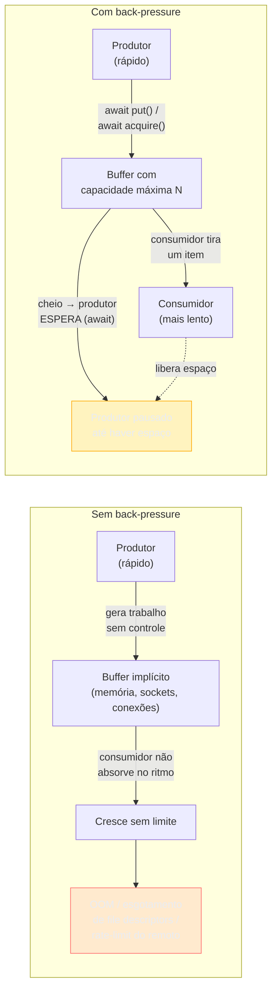
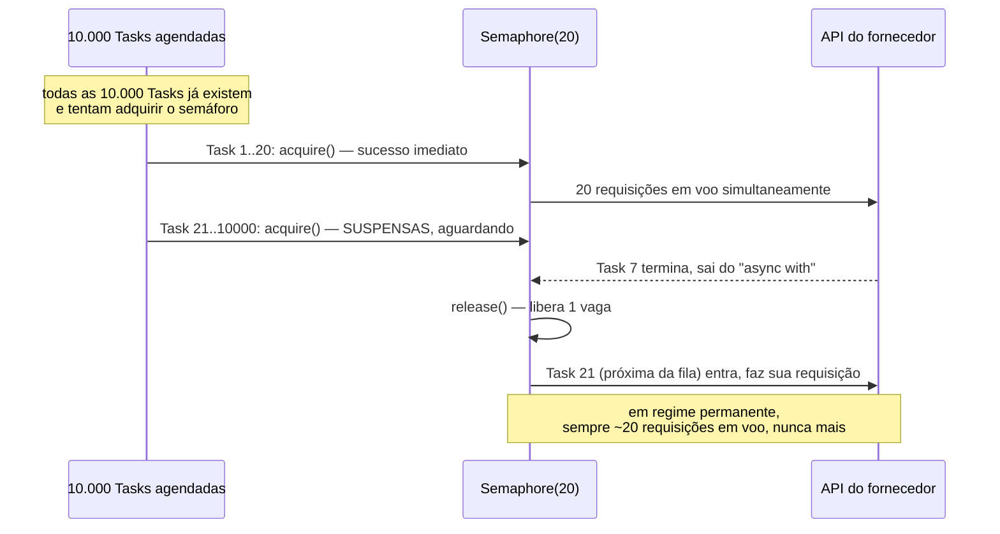
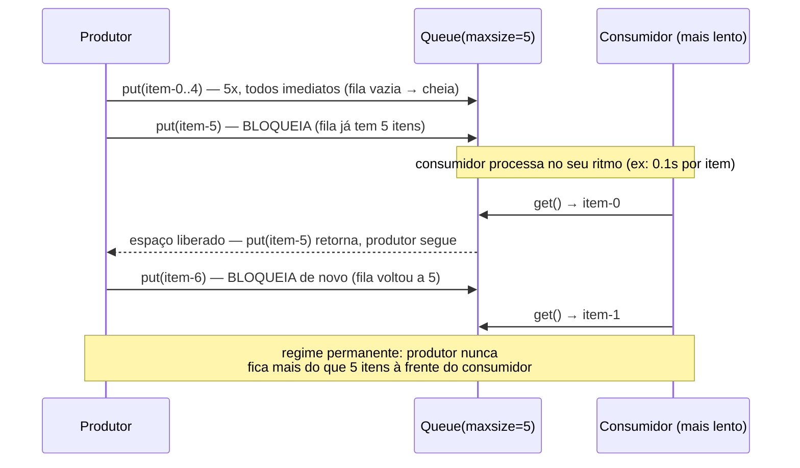

# Back-pressure — Semaphore, Queue com maxsize e buffering

> [!abstract] TL;DR
> Back-pressure é o problema de um produtor mais rápido que um consumidor: sem nenhum mecanismo de freio, o trabalho não processado se acumula em algum buffer implícito — memória do processo, sockets abertos, conexões pendentes — até um limite físico estourar (RAM esgotada, o SO recusando mais file descriptors, o servidor remoto derrubando a conexão por excesso de carga). `asyncio.Semaphore(N)` resolve o caso de **limitar concorrência**: no máximo `N` corrotinas podem estar dentro de um `async with semaphore:` ao mesmo tempo, e a `N+1`-ésima simplesmente espera sua vez — é o padrão certo para "no máximo 20 requisições HTTP simultâneas contra uma API que só aguenta isso". `asyncio.Queue(maxsize=N)` resolve o caso de **desacoplar produção de consumo com um buffer de tamanho fixo**: `await fila.put(item)` bloqueia (assincronamente, sem travar o event loop) quando a fila já tem `N` itens, e só retorna quando um consumidor tirar espaço com `get()` — a fila propaga a lentidão do consumidor de volta para o produtor automaticamente, sem que ninguém precise escrever lógica de controle de fluxo manual. Rate limiting (impor um teto de operações por segundo, não só de concorrência simultânea) é um terceiro padrão, geralmente implementado como um `Semaphore` combinado com `asyncio.sleep()` calculado, ou uma variante simplificada de token bucket. Os três mecanismos resolvem a mesma pergunta de fundo — "o que impede um lado do sistema de sobrecarregar o outro?" — em pontos diferentes: `Semaphore` limita **quantas operações rodam ao mesmo tempo**, `Queue(maxsize=N)` limita **quanto trabalho não processado pode se acumular**, rate limiting limita **a taxa de novas operações ao longo do tempo**.

## O bug que abre esta nota

Um scraper interno precisa buscar os detalhes de 10.000 produtos de um catálogo, cada um via uma requisição HTTP separada para uma API de fornecedor. O código parece a aplicação direta do que já foi visto neste galho — `aiohttp.ClientSession` reutilizada ([[03 - aiohttp cliente — ClientSession, connection pooling e requisições concorrentes|nota 03]]) e concorrência via `asyncio.gather` ([[03-Dominios/Tecnologia/Python/Concorrência e paralelismo/07 - asyncio na prática — gather, TaskGroup, timeouts e cancelamento|Galho 7 nota 07]]):

```python
import asyncio
import aiohttp

async def buscar_produto(session: aiohttp.ClientSession, produto_id: str) -> dict:
    async with session.get(f"https://api.fornecedor.com/produtos/{produto_id}") as resp:
        resp.raise_for_status()
        return await resp.json()

async def buscar_catalogo_inteiro(ids_produtos: list[str]) -> list[dict]:
    async with aiohttp.ClientSession() as session:
        # 10.000 requisições, todas disparadas de uma vez, sem limite nenhum
        tarefas = [buscar_produto(session, pid) for pid in ids_produtos]
        return await asyncio.gather(*tarefas, return_exceptions=True)

asyncio.run(buscar_catalogo_inteiro(ids_produtos=[f"SKU-{i}" for i in range(10_000)]))
```

Em teste local, com uma dezena de IDs, tudo funciona instantaneamente. Rodando contra os 10.000 produtos reais, o script trava em segundos, e o console se enche de erros de naturezas completamente diferentes ao mesmo tempo: `aiohttp.ClientConnectorError: Cannot connect to host` para uma fração das requisições, `TooManyOpenFiles` do próprio sistema operacional para outra fração, e — do lado do fornecedor, quando alguém finalmente consegue investigar — um e-mail de abuso reportando "picos de tráfego anormais" na API deles, seguido de um bloqueio temporário do IP de origem.

Três problemas distintos, todos com a mesma causa raiz: `asyncio.gather()` agenda as 10.000 coroutines **todas de uma vez** — não existe nenhum limite implícito no `asyncio` que impeça isso. Cada `session.get()` tenta abrir uma conexão TCP imediatamente; o processo do scraper tenta abrir milhares de sockets simultâneos e esbarra no limite de file descriptors do sistema operacional (`ulimit -n`, tipicamente 1024 por padrão em muitas distribuições Linux) antes mesmo de completar um décimo das conexões. Das conexões que conseguem abrir, uma fração enorme chega ao servidor do fornecedor ao mesmo tempo, que não foi dimensionado para isso e responde com timeouts, `503`s, ou simplesmente derruba a conexão. E o padrão de tráfego — milhares de requisições no mesmo instante, vindas do mesmo IP — é exatamente a assinatura que qualquer sistema de rate limiting ou detecção de abuso do lado do fornecedor foi desenhado para pegar.

> [!bug] O que está quebrado, em uma frase
> `asyncio.gather()` não impõe nenhum limite de concorrência por padrão — despachar 10.000 coroutines de uma vez cria 10.000 tentativas de conexão simultâneas, o que estoura limites do sistema operacional local e sobrecarrega (ou aciona o rate limiting de) qualquer serviço remoto que não foi dimensionado para esse volume instantâneo.

Nada no código está sintaticamente errado — `gather()` faz exatamente o que promete, rodar tudo concorrentemente. O que falta é uma decisão explícita sobre **quanta concorrência é segura**, e um mecanismo que imponha esse limite. Essa decisão — e as ferramentas do `asyncio` para aplicá-la — é o assunto desta nota.

> [!info] Pré-requisito
> Esta nota assume que `asyncio.Semaphore` e `asyncio.Queue` já foram apresentados como API — [[03-Dominios/Tecnologia/Python/Concorrência e paralelismo/07 - asyncio na prática — gather, TaskGroup, timeouts e cancelamento|Galho 7 nota 07]] mostra a sintaxe básica (`async with semaphore:`, `await fila.put()`/`await fila.get()`) como paralelo assíncrono das primitivas de `threading`. Esta nota não repete essa introdução — ela assume a API conhecida e foca no **problema de back-pressure** que motiva usá-las, e nos padrões de produção para resolvê-lo. Também assume [[02 - Streams assíncronos — StreamReader, StreamWriter e protocolos de rede|nota 02]], que já tocou em back-pressure em nível de socket via `writer.drain()` — esta nota generaliza o mesmo princípio para o nível de aplicação.

## O que é back-pressure, de forma geral

Back-pressure é o nome que sistemas de streaming e de mensageria dão a um problema estrutural simples: sempre que um produtor de trabalho é mais rápido que o consumidor desse trabalho, e não existe nenhum mecanismo que force o produtor a desacelerar, o trabalho não processado tem que ir para algum lugar — e esse lugar, na ausência de um limite explícito, é tipicamente memória (uma lista, uma fila, um buffer que cresce a cada iteração) ou conexões/recursos do sistema operacional abertos e nunca liberados a tempo.



A pergunta que qualquer sistema produtor-consumidor precisa responder explicitamente é: **o que acontece quando o produtor está adiantado demais em relação ao consumidor?** Há três respostas possíveis, e só uma delas é geralmente aceitável em produção:

1. **Deixar acumular sem limite** — a resposta padrão quando ninguém pensou no problema (o bug de abertura desta nota). Funciona até um limite físico ser atingido, e então falha de forma abrupta e geralmente no pior momento possível (sob carga real, não em teste).
2. **Descartar trabalho excedente** — aceitável em alguns domínios (métricas amostradas, onde perder um ponto de dado ocasional é tolerável), inaceitável em outros (uma transação financeira não pode simplesmente ser descartada porque a fila estava cheia).
3. **Propagar a lentidão de volta ao produtor** — fazer o produtor **esperar** até que haja capacidade de absorver mais trabalho. É essa a resposta que `Semaphore` e `Queue(maxsize=N)` implementam, e é geralmente a escolha certa quando descartar dados não é uma opção: o produtor simplesmente desacelera até o ritmo que o resto do sistema sustenta, em vez de continuar gerando trabalho que ninguém vai processar a tempo.

Essa terceira resposta — propagar a lentidão de volta — é exatamente o que [[02 - Streams assíncronos — StreamReader, StreamWriter e protocolos de rede|nota 02]] já mostrou em nível de socket: `await writer.drain()` suspende o produtor até o buffer de saída do TCP ter espaço de novo. `Semaphore` e `Queue(maxsize=N)` fazem o mesmo princípio em dois pontos diferentes, mais acima na pilha — não entre o processo e a rede, mas entre corrotinas dentro da mesma aplicação.

## `asyncio.Semaphore`: limitar quantas operações rodam ao mesmo tempo

`asyncio.Semaphore(N)` mantém um contador interno inicializado em `N`. Cada `async with semaforo:` (ou `await semaforo.acquire()` explícito) decrementa esse contador; se o contador já chegou a zero, a próxima corrotina que tentar adquirir o semáforo **suspende** (via `await`, sem bloquear a thread) até alguém liberar (`release()`, feito automaticamente ao sair do `async with`). O efeito líquido: no máximo `N` corrotinas estão dentro da seção protegida a qualquer instante — a `N+1`-ésima espera sua vez, formando uma fila implícita de corrotinas aguardando.

Aplicando isso diretamente ao bug de abertura — a correção inteira é envolver cada requisição com um semáforo compartilhado entre todas as `Task`s:

```python
import asyncio
import aiohttp

LIMITE_CONCORRENCIA = 20   # a API do fornecedor documenta suportar até ~25 conexões simultâneas

async def buscar_produto(
    session: aiohttp.ClientSession,
    produto_id: str,
    semaforo: asyncio.Semaphore,
) -> dict:
    async with semaforo:   # só entra aqui se houver uma das 20 "vagas" disponíveis
        async with session.get(f"https://api.fornecedor.com/produtos/{produto_id}") as resp:
            resp.raise_for_status()
            return await resp.json()

async def buscar_catalogo_inteiro(ids_produtos: list[str]) -> list[dict]:
    semaforo = asyncio.Semaphore(LIMITE_CONCORRENCIA)
    async with aiohttp.ClientSession() as session:
        async with asyncio.TaskGroup() as tg:
            tarefas = [
                tg.create_task(buscar_produto(session, pid, semaforo))
                for pid in ids_produtos
            ]
        return [t.result() for t in tarefas]

asyncio.run(buscar_catalogo_inteiro(ids_produtos=[f"SKU-{i}" for i in range(10_000)]))
```

Com essa mudança, as 10.000 `Task`s ainda são criadas de uma vez — isso, por si só, é barato (criar uma `Task` não abre nenhuma conexão) — mas só 20 delas conseguem passar do `async with semaforo:` e efetivamente chamar `session.get()` a qualquer instante. Assim que uma requisição termina (sucesso ou erro) e sai do bloco `async with semaforo:`, o semáforo libera uma vaga, e a próxima corrotina na fila de espera é liberada para prosseguir. O resultado observável: nunca mais que 20 conexões TCP simultâneas abertas contra o fornecedor, nenhum estouro de file descriptors, e um padrão de tráfego que se parece com um cliente bem-comportado, não com um pico de abuso.



Vale notar o que mudou de fato em relação ao bug de abertura: `asyncio.TaskGroup` no lugar de `gather(return_exceptions=True)` é uma escolha independente da correção de back-pressure (ver [[03-Dominios/Tecnologia/Python/Concorrência e paralelismo/07 - asyncio na prática — gather, TaskGroup, timeouts e cancelamento|Galho 7 nota 07]] para a diferença entre as duas) — o que resolve o problema desta nota é exclusivamente o `Semaphore` compartilhado envolvendo a chamada de rede. O número `20` não é mágico: é uma decisão que depende do que o serviço remoto documenta suportar (limite de conexões simultâneas do fornecedor, se publicado), do que a própria máquina aguenta (limite de file descriptors disponíveis, tipicamente configurável via `ulimit -n` mas raramente vale forçar além de alguns milhares), e de quanto risco de rate-limiting/bloqueio o time está disposto a correr — na ausência de um número documentado pelo fornecedor, começar conservador (10-20) e medir taxa de erro/latência antes de subir é a abordagem mais segura.

> [!question]- Por que não simplesmente criar só 20 `Task`s por vez, em lotes, em vez de criar as 10.000 de uma vez e deixar o `Semaphore` filtrar?
> As duas abordagens chegam num resultado parecido, mas com uma diferença de robustez: criar 10.000 `Task`s de uma vez e deixar o `Semaphore` controlar quantas *executam* simultaneamente significa que, assim que uma requisição termina, a próxima da fila começa **imediatamente** — não há nenhum momento ocioso entre lotes. Uma abordagem manual em lotes (`for lote in dividir_em_lotes(ids, 20): await gather(*lote)`) espera **todo** o lote terminar antes de iniciar o próximo — se uma requisição do lote demorar muito mais que as outras 19, todo o lote fica bloqueado esperando por ela antes que a vaga seguinte comece, mesmo que houvesse capacidade livre havia tempo. `Semaphore` mantém a taxa de utilização da concorrência disponível sempre no máximo permitido, sem esse efeito de "sincronização artificial em lotes" — por isso é geralmente preferível ao particionamento manual em batches.

### `BoundedSemaphore`: a variante que detecta `release()` em excesso

`asyncio.Semaphore` aceita chamadas de `release()` além do número de `acquire()`s já feitos — o contador interno simplesmente sobe acima do valor inicial, sem erro nenhum, o que na prática **desativa silenciosamente o limite** se algum caminho de código chamar `release()` a mais por engano (por exemplo, um `release()` manual fora de um `async with`, duplicado por um bug de lógica em um `finally` mal escrito). `asyncio.BoundedSemaphore` é a mesma primitiva com uma verificação extra: levanta `ValueError` se `release()` for chamado mais vezes do que `acquire()`, tornando esse tipo de bug barulhento e imediato em vez de silencioso e só perceptível meses depois, quando alguém notar que o limite de concorrência configurado não está mais sendo respeitado de verdade.

```python
semaforo = asyncio.BoundedSemaphore(20)
# se algum caminho de código chamar release() sem o acquire() correspondente,
# ValueError é levantado na hora — em vez de o limite de 20 silenciosamente
# virar 21, 22, 23... ao longo do tempo, sem ninguém perceber
```

Como o uso recomendado é sempre via `async with semaforo:` (que garante `acquire()`/`release()` pareados automaticamente, mesmo em caso de exceção dentro do bloco), esse bug específico é raro em código que segue esse padrão — mas `BoundedSemaphore` é a escolha mais segura por padrão sempre que `acquire()`/`release()` são chamados manualmente, fora de um gerenciador de contexto, exatamente pelo mesmo motivo que `Lock`s com `acquire()`/`release()` manuais são mais propensos a erro que seus equivalentes em `with`.

## `asyncio.Queue(maxsize=N)`: buffer com capacidade máxima entre produtor e consumidor

`Semaphore` resolve "quantas operações em voo ao mesmo tempo" — mas pressupõe que produtor e consumidor de fato estão fundidos na mesma operação (a corrotina que adquire o semáforo é a mesma que faz o trabalho). Um padrão distinto, e igualmente comum, é ter um produtor e um consumidor genuinamente **desacoplados** — rodando como corrotinas separadas, o produtor gerando itens continuamente, o consumidor processando-os em seu próprio ritmo — coordenados por uma fila intermediária. Esse é o padrão produtor-consumidor já visto na versão síncrona em [[03-Dominios/Tecnologia/Python/Concorrência e paralelismo/03 - queue.Queue e o padrão produtor-consumidor|Galho 7 nota 03]], e `asyncio.Queue` é o equivalente assíncrono — a diferença central para esta nota é o parâmetro `maxsize`.

Uma `asyncio.Queue()` sem `maxsize` (ou com `maxsize=0`, o padrão) é **ilimitada** — `await fila.put(item)` sempre retorna imediatamente, não importa quantos itens já estão na fila. Isso reproduz exatamente o mesmo problema do bug de abertura, só que num nível diferente: se o produtor gera itens mais rápido do que o consumidor consegue tirá-los, a fila cresce sem limite, cada item ocupando memória, até o processo esgotar RAM.

```python
# ERRADO — fila sem limite reproduz o mesmo problema do gather() sem Semaphore
fila_sem_limite = asyncio.Queue()   # maxsize=0 por padrão: sem teto nenhum
```

`asyncio.Queue(maxsize=N)`, em contraste, impõe um teto real: quando a fila já contém `N` itens, `await fila.put(item)` **suspende** o produtor até um consumidor tirar algo com `get()` e abrir espaço. É exatamente o mesmo princípio de `writer.drain()` — o produtor é pausado via `await`, não travado numa chamada bloqueante de thread — só que aplicado a um buffer de itens de aplicação, não a bytes de um socket TCP.

```python
import asyncio
import random

async def produtor(fila: asyncio.Queue, total: int):
    for i in range(total):
        item = f"item-{i}"
        await fila.put(item)   # BLOQUEIA (assincronamente) se a fila já tem `maxsize` itens
        print(f"produzido: {item} (fila com {fila.qsize()} itens)")
    await fila.put(None)   # sentinela: sinaliza ao consumidor que acabou

async def consumidor(fila: asyncio.Queue):
    while True:
        item = await fila.get()
        if item is None:
            fila.task_done()
            break
        # simula processamento mais lento que a produção — ex: persistir em disco,
        # fazer uma chamada de rede, aplicar uma transformação cara
        await asyncio.sleep(random.uniform(0.05, 0.15))
        print(f"consumido: {item}")
        fila.task_done()

async def main():
    fila = asyncio.Queue(maxsize=5)   # buffer limitado a 5 itens não processados
    async with asyncio.TaskGroup() as tg:
        tg.create_task(produtor(fila, total=20))
        tg.create_task(consumidor(fila))

asyncio.run(main())
```

Rodando esse código, o padrão observável no console é revelador: o produtor consegue disparar as primeiras 5 mensagens quase instantaneamente (a fila tinha espaço livre), e a partir daí passa a produzir no mesmo ritmo em que o consumidor consegue absorver — `fila.qsize()` oscila perto do limite de 5, nunca ultrapassando, porque `put()` simplesmente não retorna enquanto não houver espaço. Nenhuma linha de código do produtor precisou saber nada sobre a velocidade do consumidor — a fila propaga essa informação implicitamente, via o próprio mecanismo de bloqueio de `put()`.



### `task_done()`/`join()`: saber quando todo o trabalho terminou

`asyncio.Queue` tem um mecanismo complementar ao `put`/`get`, útil quando quem orquestra o pipeline precisa saber "todo o trabalho enfileirado já foi processado", não só "a fila está vazia agora" (que pode ser um estado momentâneo, antes do próximo item ser produzido): cada `get()` bem-sucedido deveria ser seguido, depois do processamento, por uma chamada a `fila.task_done()` — e `await fila.join()`, chamado de qualquer outra corrotina, suspende até que o número de `task_done()` chamados iguale o número de itens colocados na fila (via `put()`) que já foram retirados.

```python
async def orquestrador():
    fila = asyncio.Queue(maxsize=10)

    async def produzir_tudo():
        for item in gerar_itens():
            await fila.put(item)

    async def consumir_continuamente():
        while True:
            item = await fila.get()
            await processar(item)
            fila.task_done()   # sinaliza que ESTE item específico terminou de ser processado

    tarefa_consumidor = asyncio.create_task(consumir_continuamente())
    await produzir_tudo()          # termina de enfileirar tudo
    await fila.join()              # espera até o ÚLTIMO item ser processado, não só enfileirado
    tarefa_consumidor.cancel()     # o consumidor roda em loop infinito — cancela quando não há mais nada
```

A distinção importa porque `fila.empty()` (`qsize() == 0`) sozinho não é suficiente para saber que o trabalho terminou — a fila pode estar momentaneamente vazia porque o consumidor acabou de tirar o último item, mas ainda estar processando-o quando o orquestrador checa. `join()` espera pelo sinal explícito de `task_done()`, que só é emitido depois do processamento efetivamente terminar — a diferença entre "não há mais nada na fila" e "tudo que já esteve na fila foi de fato processado".

### Padrão worker pool: vários consumidores lendo da mesma fila

Um único consumidor por fila é o caso mais simples, mas raramente o mais eficiente quando o processamento de cada item envolve I/O (uma chamada de rede, uma escrita em disco): enquanto um consumidor está esperando um `await` resolver, ele não está tirando novos itens da fila, mesmo que já haja outros itens acumulados esperando. O padrão de produção mais comum é um **pool de workers** — várias corrotinas consumidoras, todas lendo da mesma `Queue`, cada uma processando um item por vez, competindo naturalmente pelos itens disponíveis:

```python
import asyncio

async def worker(nome: str, fila: asyncio.Queue):
    while True:
        item = await fila.get()
        try:
            # processamento com I/O — é aqui que ter vários workers compensa,
            # porque enquanto um worker está em await, outro pode estar processando
            resultado = await processar_com_io(item)
            print(f"[{nome}] processou {item} -> {resultado}")
        except Exception as e:
            print(f"[{nome}] falhou em {item}: {e!r}")
        finally:
            fila.task_done()   # sempre marcar como concluído, mesmo em caso de erro

async def executar_pipeline(itens: list, num_workers: int = 5):
    fila = asyncio.Queue(maxsize=num_workers * 2)   # buffer um pouco maior que o número de workers

    async def alimentar_fila():
        for item in itens:
            await fila.put(item)

    async with asyncio.TaskGroup() as tg:
        tg.create_task(alimentar_fila())
        tarefas_workers = [
            tg.create_task(worker(f"worker-{i}", fila)) for i in range(num_workers)
        ]
        # os workers rodam em loop infinito — precisam ser cancelados
        # explicitamente depois que toda a fila foi drenada
        await fila.join()
        for t in tarefas_workers:
            t.cancel()
```

O `maxsize` da fila, nesse padrão, não precisa ser exatamente igual ao número de workers — um valor um pouco maior (aqui, `num_workers * 2`) dá alguma folga para que o produtor mantenha os workers sempre alimentados sem ficar bloqueando a cada `put()`, sem abrir mão do teto que evita acumular todo o trabalho de uma vez em memória. Esse é, na prática, o mesmo princípio do `Semaphore` (limitar quanto trabalho concorrente existe) expresso através do número de workers em vez de um contador explícito — com a vantagem adicional de que a `Queue` também resolve a distribuição do trabalho entre eles, algo que um `Semaphore` sozinho não faz.

## Semaphore vs Queue(maxsize): quando usar cada um

Os dois padrões resolvem back-pressure, mas em formas estruturalmente diferentes, e a escolha errada gera código estranho — usar `Queue` para um caso de `Semaphore` costuma exigir inventar itens artificiais só para ter algo para enfileirar; usar `Semaphore` para um caso de `Queue` costuma exigir reimplementar manualmente a lógica de "esperar até haver espaço" que a fila já dá de graça.

| Situação | Ferramenta | Por quê |
|---|---|---|
| N operações homogêneas, cada uma independente, sem necessidade de desacoplar produção de execução (ex: buscar 10.000 URLs) | `Semaphore(N)` | A corrotina que "produz" o trabalho é a mesma que o "consome" — não há uma fila de itens esperando entre dois papéis distintos |
| Produtor e consumidor são corrotinas/componentes genuinamente separados, com ritmos diferentes, e o item precisa transitar de um para o outro | `Queue(maxsize=N)` | A fila é o canal de comunicação — sem ela, produtor e consumidor precisariam de outro mecanismo de handoff (callbacks, futures manuais) |
| Precisa saber quando *todo* um lote de trabalho foi processado, não só disparado | `Queue` + `task_done()`/`join()` | `Semaphore` não tem noção de "itens" — só de quantas seções críticas estão ativas agora |
| Vários produtores e/ou vários consumidores da mesma fonte de trabalho (ex: 3 corrotinas produzindo, 5 consumindo da mesma fila) | `Queue(maxsize=N)` | `Queue` é naturalmente muitos-para-muitos; um `Semaphore` sozinho não coordena a distribuição de itens entre múltiplos consumidores |
| Limitar simultaneidade de uma operação que não tem "itens" nenhum, só "estar dentro ou fora de uma seção" (ex: no máximo 5 uploads simultâneos de arquivos já em disco) | `Semaphore(N)` | Não existe um fluxo de itens transitando entre papéis — só um teto de quantas execuções concorrentes são permitidas |

Em pipelines reais, as duas ferramentas frequentemente aparecem **juntas**: uma `Queue(maxsize=N)` desacopla a etapa de leitura de uma etapa de processamento mais lenta, e dentro da etapa de processamento, um `Semaphore` limita quantos itens da fila são processados concorrentemente (por exemplo, vários consumidores lendo da mesma fila, cada um limitado por um semáforo compartilhado ao fazer sua própria chamada de rede). Não são alternativas mutuamente exclusivas — são ferramentas para camadas diferentes do mesmo problema, do mesmo jeito que `Queue` interna e `writer.drain()` (nota 02) coexistem num pipeline de rede: cada uma resolve o back-pressure do seu próprio elo da cadeia.

## Rate limiting: impor um teto de operações por tempo, não só de concorrência

`Semaphore` limita **quantas** operações rodam ao mesmo tempo — mas não limita a **taxa** em que novas operações começam. Um `Semaphore(20)` permite, em tese, 20 requisições que terminam quase instantaneamente, seguidas de outras 20, seguidas de outras 20, dezenas de vezes por segundo — concorrência baixa, mas taxa (*requests per second*) potencialmente alta. Muitas APIs externas documentam limites explicitamente em taxa, não em concorrência ("máximo de 10 requisições por segundo", independente de quantas estão "em voo" simultaneamente) — para esse caso, `Semaphore` sozinho não é suficiente, e é preciso um mecanismo que espace as chamadas ao longo do tempo.

A forma mais simples de implementar isso em `asyncio`, sem depender de bibliotecas externas, é combinar um `Semaphore` (para o teto de concorrência) com um controle explícito de intervalo mínimo entre disparos — uma versão simplificada do padrão *token bucket* (onde "tokens" são gerados a uma taxa fixa e cada operação consome um token, esperando se não houver nenhum disponível):

```python
import asyncio
import time

class LimitadorDeTaxa:
    """Permite no máximo `taxa_por_segundo` operações por segundo,
    numa implementação simplificada de token bucket."""

    def __init__(self, taxa_por_segundo: float):
        self._intervalo_minimo = 1.0 / taxa_por_segundo
        self._proximo_horario_permitido = 0.0
        self._lock = asyncio.Lock()   # protege o estado compartilhado entre corrotinas concorrentes

    async def esperar_vaga(self):
        async with self._lock:
            agora = time.monotonic()
            espera = self._proximo_horario_permitido - agora
            if espera > 0:
                await asyncio.sleep(espera)
                agora = time.monotonic()
            # marca o próximo horário permitido ANTES de liberar o lock,
            # para que a próxima corrotina que chegar já veja o slot ocupado
            self._proximo_horario_permitido = agora + self._intervalo_minimo


async def buscar_produto_com_rate_limit(
    session: aiohttp.ClientSession,
    produto_id: str,
    semaforo: asyncio.Semaphore,
    limitador: LimitadorDeTaxa,
) -> dict:
    async with semaforo:                 # teto de concorrência (ex: 20 em voo)
        await limitador.esperar_vaga()   # teto de TAXA (ex: 10 novas chamadas/s)
        async with session.get(f"https://api.fornecedor.com/produtos/{produto_id}") as resp:
            resp.raise_for_status()
            return await resp.json()
```

Os dois limites são complementares, não redundantes: o `Semaphore` evita que muitas requisições fiquem simultaneamente "em voo" (protegendo file descriptors locais e a capacidade de processamento concorrente do fornecedor); o `LimitadorDeTaxa` evita que novas requisições sejam **disparadas** rápido demais, mesmo que cada uma individualmente termine rápido (protegendo contra limites de *requests per second* documentados pela API, que são violados independentemente de quantas conexões estão abertas ao mesmo tempo). Um scraper contra uma API com limite documentado de "10 req/s, máximo 20 conexões simultâneas" precisa dos dois mecanismos ao mesmo tempo — só `Semaphore` deixaria a taxa instantânea sem controle; só o limitador de taxa, sem `Semaphore`, ainda permitiria picos de concorrência se várias chamadas levarem tempos muito diferentes para completar.

> [!question]- Vale usar uma biblioteca pronta de rate limiting em vez de implementar isso à mão?
> Para produção, sim, geralmente — bibliotecas como `aiolimiter` (implementação de *leaky bucket* assíncrona, pequena e focada) ou `tenacity` (mais focada em retry com backoff, mas frequentemente combinada com rate limiting) cobrem casos de borda que uma implementação de algumas linhas como a acima tende a deixar passar — janelas deslizantes mais precisas, *burst* controlado (permitir rajadas curtas acima da taxa média, absorvidas depois), e testes já validados contra concorrência real. A implementação manual acima vale como exercício para entender o mecanismo por baixo (e é suficiente para scripts internos e scrapers de baixo risco) — mas um sistema de produção com requisitos reais de rate limiting contra uma API de terceiros geralmente se beneficia de uma biblioteca madura, pelo mesmo motivo que ninguém reimplementa TLS à mão.

## Armadilhas comuns

> [!warning] Criar um `Semaphore` novo por chamada, em vez de compartilhar uma instância
> **O que acontece:** `asyncio.Semaphore(20)` é instanciado dentro da função que faz cada requisição individual, em vez de ser criado uma vez e passado como parâmetro (ou capturado por closure) para todas as chamadas. Cada requisição recebe seu **próprio** semáforo com contador zerado em `20` — o limite de concorrência nunca é de fato aplicado, porque não há nenhum estado compartilhado entre as chamadas. **Por quê:** um `Semaphore` só limita concorrência entre corrotinas que compartilham a **mesma instância** — o contador interno vive naquele objeto específico. Criar uma instância nova a cada chamada é equivalente a não ter limite nenhum, só com sintaxe de `async with semaforo:` enganosamente presente no código. **Como evitar:** o `Semaphore` (como a `ClientSession` da nota 03) deve ser criado **uma vez**, fora do laço/das chamadas individuais, e reutilizado entre todas elas — passado como parâmetro explícito, ou como atributo de um objeto/closure que engloba o conjunto de chamadas relacionadas.

> [!warning] Escolher um `maxsize`/limite de concorrência sem medir, e travar num número arbitrário
> **O que acontece:** o limite (`Semaphore(N)` ou `Queue(maxsize=N)`) é escolhido por instinto — "20 parece razoável" — sem verificar o que o serviço remoto realmente documenta ou suporta, e sem medir taxa de erro/latência sob esse valor. O sistema tanto pode estar deixando throughput na mesa (limite baixo demais, sem necessidade) quanto ainda estar sobrecarregando o remoto (limite alto demais, mas abaixo do que gerou o problema original, mascarando o sintoma sem resolver a causa). **Por quê:** o número certo depende de fatores externos ao código Python — capacidade documentada (ou não) do serviço remoto, limites de recursos locais (file descriptors, memória por item na fila), e requisitos de latência do próprio sistema — nenhum dos quais o `asyncio` sabe ou pode inferir sozinho. **Como evitar:** tratar o limite como um parâmetro configurável (não uma constante mágica no meio do código), documentar de onde ele veio (limite publicado pelo fornecedor, teste de carga próprio, valor conservador de partida), e medir taxa de erro/latência sob carga real antes de considerá-lo definitivo — subir ou descer o valor com base em evidência, não em suposição.

> [!warning] Misturar `Queue` sem `maxsize` com a expectativa de que ela vá aplicar back-pressure
> **O que acontece:** o código usa `asyncio.Queue()` (sem `maxsize`, portanto ilimitada) esperando implicitamente que ela vá desacelerar um produtor rápido demais — mas como não há teto, `put()` sempre retorna na hora, e a fila cresce exatamente como o buffer sem limite do bug de abertura desta nota, só que guardando objetos Python em vez de bytes de rede. **Por quê:** o comportamento de back-pressure de `asyncio.Queue` **depende inteiramente** do parâmetro `maxsize` — sem ele, `Queue` é só uma estrutura de dados FIFO thread-safe-para-corrotinas, sem nenhuma propriedade de controle de fluxo embutida. **Como evitar:** qualquer `Queue` usada para desacoplar um produtor potencialmente mais rápido de um consumidor mais lento deveria, por padrão, ter um `maxsize` explícito — mesmo que generoso (algumas centenas ou milhares de itens) — e não deixar o valor padrão (`0`, ilimitado) passar despercebido como se fosse uma escolha deliberada.

> [!warning] Esquecer que `Semaphore`/`Queue` só coordenam dentro do mesmo event loop
> **O que acontece:** um sistema que mistura `asyncio` com `multiprocessing` ou `threading` de verdade tenta compartilhar um `asyncio.Semaphore` ou `asyncio.Queue` entre processos ou threads distintas, esperando que ele limite concorrência global do sistema — e a coordenação simplesmente não funciona, porque cada processo (ou cada thread rodando seu próprio event loop) tem sua própria instância isolada de qualquer objeto Python, `asyncio.Semaphore` incluso. **Por quê:** as primitivas de `asyncio`, como já visto em [[03-Dominios/Tecnologia/Python/Concorrência e paralelismo/07 - asyncio na prática — gather, TaskGroup, timeouts e cancelamento|Galho 7 nota 07]], só coordenam corrotinas do **mesmo** event loop de uma única thread — não têm nenhum mecanismo de sincronização entre processos ou entre threads reais do sistema operacional. **Como evitar:** se o limite de concorrência precisa valer *globalmente*, entre múltiplos processos (ex: vários workers de um scraper distribuído, cada um seu próprio processo Python), a coordenação precisa de um mecanismo externo — um limitador compartilhado via Redis, um semáforo do sistema operacional, ou simplesmente dividir o orçamento total de concorrência entre os processos na configuração (ex: 4 processos, 5 de limite cada, para um teto global de 20) em vez de tentar compartilhar o objeto `asyncio.Semaphore` em si, o que não é possível entre processos distintos.

## Em entrevista

Back-pressure é um tema que aparece com frequência em entrevistas de sistemas assíncronos/distribuídos, porque testa se o candidato pensa em limites de recursos de forma proativa, não só reativa:

> "Back-pressure is what happens when a producer generates work faster than a consumer can absorb it, and nothing forces the producer to slow down — the unprocessed work has to accumulate somewhere, usually in memory or open connections, until something breaks: the process runs out of RAM, the OS runs out of file descriptors, or a remote service starts rejecting or rate-limiting the traffic. In asyncio, there are two main tools depending on the shape of the problem. `asyncio.Semaphore(N)` limits how many operations are in flight at once — you wrap each operation in `async with semaphore`, and the N+1th caller just waits its turn; it's the right fit when the same coroutine both triggers and performs the work, like fetching N URLs with no more than 20 in flight simultaneously. `asyncio.Queue(maxsize=N)` is for when producer and consumer are genuinely separate coroutines connected by a buffer — `await queue.put(item)` blocks once the queue already holds `maxsize` items, which naturally propagates the consumer's slowness back to the producer, the same way `writer.drain()` does at the socket level, just one layer up in the application. The bug I've actually seen in production is firing off `asyncio.gather()` over thousands of coroutines with zero concurrency limit — it doesn't just slow things down, it can exhaust local file descriptors and get your IP rate-limited or blocked by the remote service, because gather never imposes any concurrency ceiling by default."

Uma pergunta de acompanhamento comum: **"por que não simplesmente processar tudo em lotes fixos em vez de usar `Semaphore`?"** — a resposta sênior explica a diferença de eficiência: lotes fixos sincronizam artificialmente o início de cada grupo ao término do mais lento do grupo anterior, enquanto `Semaphore` mantém utilização máxima contínua, iniciando a próxima operação assim que qualquer vaga se libera, sem esperar o "lote" inteiro terminar.

> [!question]- E se perguntarem sobre a diferença entre back-pressure e rate limiting especificamente?
> Vale ser preciso sobre a distinção: back-pressure (via `Semaphore`/`Queue(maxsize)`) limita **quanto trabalho está em andamento ao mesmo tempo** — é uma resposta reativa à capacidade real disponível, que se ajusta sozinha (se o consumidor acelerar, o produtor acelera junto, sem nenhuma mudança de configuração). Rate limiting impõe um **teto de taxa ao longo do tempo** (N operações por segundo), independente de quão rápido cada operação individual termina — é uma restrição fixa, tipicamente imposta porque um terceiro (a API remota) documenta esse limite explicitamente, não porque o sistema local mediu que está sobrecarregado. Um sistema robusto contra uma API de terceiros frequentemente precisa dos dois: back-pressure para não sobrecarregar os próprios recursos (conexões, memória), rate limiting para respeitar o contrato documentado do lado remoto — mesmo quando o lado remoto teria capacidade de sobra para absorver mais.

## Como explicar em inglês

| PT | EN |
|----|----|
| back-pressure / contrapressão | back-pressure |
| produtor mais rápido que o consumidor | producer outpacing the consumer |
| limitar concorrência | throttle concurrency / limit concurrency |
| buffer com capacidade máxima | bounded buffer |
| fila sem limite | unbounded queue |
| bloquear (assincronamente) até haver espaço | (asynchronously) block until there's room |
| taxa de operações por segundo | requests/operations per second |
| token bucket / leaky bucket | token bucket / leaky bucket |
| esgotamento de recursos | resource exhaustion |
| conexões simultâneas | concurrent connections / connections in flight |
| desacoplar produção de consumo | decouple production from consumption |
| propagar a pressão de volta | propagate the pressure back |

## O que vem a seguir

Esta nota fechou o mecanismo de controle de fluxo em nível de aplicação — `Semaphore` para limitar concorrência, `Queue(maxsize=N)` para desacoplar produtor e consumidor com um buffer de tamanho fixo, e rate limiting simples para impor um teto de taxa. O galho segue para consolidar isso em padrões de produção mais amplos:

- [[07 - Padrões de produção com asyncio — supervisão de tasks, graceful shutdown, circuit breaker|07 — Padrões de produção com asyncio]] — supervisão de tasks de longa duração, graceful shutdown, e circuit breaker: o que falta para levar um serviço assíncrono da correção funcional (que esta nota e as anteriores cobrem) até robustez operacional real.
- [[08 - Capstone — web scraper assíncrono de produção|08 — Capstone: web scraper assíncrono de produção]] — recapitula o galho inteiro aplicando `ClientSession` (nota 03) + `Semaphore` (esta nota) + tratamento de erro/retry + graceful shutdown (nota 07) num cenário integrador único.
- [[02 - Streams assíncronos — StreamReader, StreamWriter e protocolos de rede|02 — Streams assíncronos]] — o mesmo princípio de back-pressure, em nível de socket, via `writer.drain()`; vale revisitar para contrastar os dois níveis onde a mesma ideia se aplica.
- [[03-Dominios/Tecnologia/Python/Programação Reativa e Assíncrona/index|Programação Reativa e Assíncrona (Galho 8)]] — MOC deste galho.

## Fontes

- Python Software Foundation. *asyncio Synchronization Primitives*. docs.python.org, versão 3.14. https://docs.python.org/3/library/asyncio-sync.html (acessado em 2026-07-11) — referência oficial de `asyncio.Semaphore`, `BoundedSemaphore`, `Lock`.
- Python Software Foundation. *asyncio Queues*. docs.python.org, versão 3.14. https://docs.python.org/3/library/asyncio-queue.html (acessado em 2026-07-11) — referência oficial de `asyncio.Queue`, `maxsize`, `put`/`get`/`task_done`/`join`.
- Python Software Foundation. *asyncio Streams*. docs.python.org, versão 3.14. https://docs.python.org/3/library/asyncio-stream.html (acessado em 2026-07-11) — `writer.drain()`, citado aqui como o paralelo de back-pressure em nível de socket já coberto na nota 02 deste galho.
- Real Python. *Async IO in Python: A Complete Walkthrough*. realpython.com. https://realpython.com/async-io-python/ (acessado em 2026-07-11) — exemplos de `Semaphore` limitando concorrência em requisições HTTP concorrentes.
- [[03-Dominios/Tecnologia/Python/Concorrência e paralelismo/07 - asyncio na prática — gather, TaskGroup, timeouts e cancelamento|Galho 7 nota 07 — asyncio na prática]] — nota irmã, pré-requisito direto: introduz a API básica de `asyncio.Semaphore`/`asyncio.Queue` como paralelos assíncronos das primitivas de threading.
- [[02 - Streams assíncronos — StreamReader, StreamWriter e protocolos de rede|02 — Streams assíncronos]] — nota irmã deste galho: back-pressure em nível de socket via `writer.drain()`, generalizada nesta nota para o nível de aplicação.
- [[03 - aiohttp cliente — ClientSession, connection pooling e requisições concorrentes|03 — aiohttp cliente]] — nota irmã cujo padrão de requisições concorrentes é diretamente estendido aqui com `Semaphore` para resolver o problema real de limite de concorrência contra uma API externa.
- [[03-Dominios/Tecnologia/Python/Concorrência e paralelismo/03 - queue.Queue e o padrão produtor-consumidor|Galho 7 nota 03 — queue.Queue e o padrão produtor-consumidor]] — a versão síncrona/threading do mesmo padrão produtor-consumidor com buffer limitado, útil para contrastar com `asyncio.Queue`.

Consultado em 2026-07-11.

