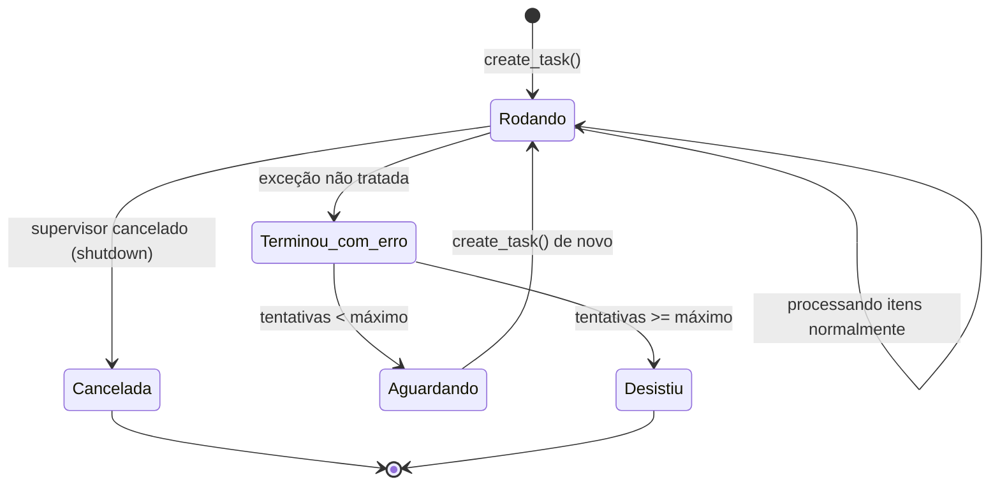
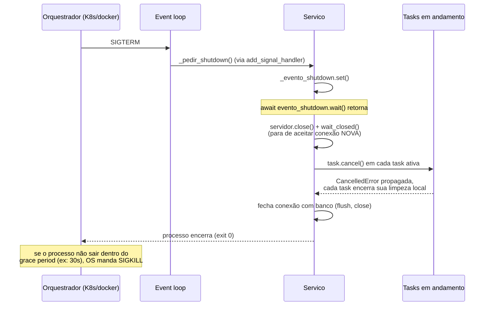
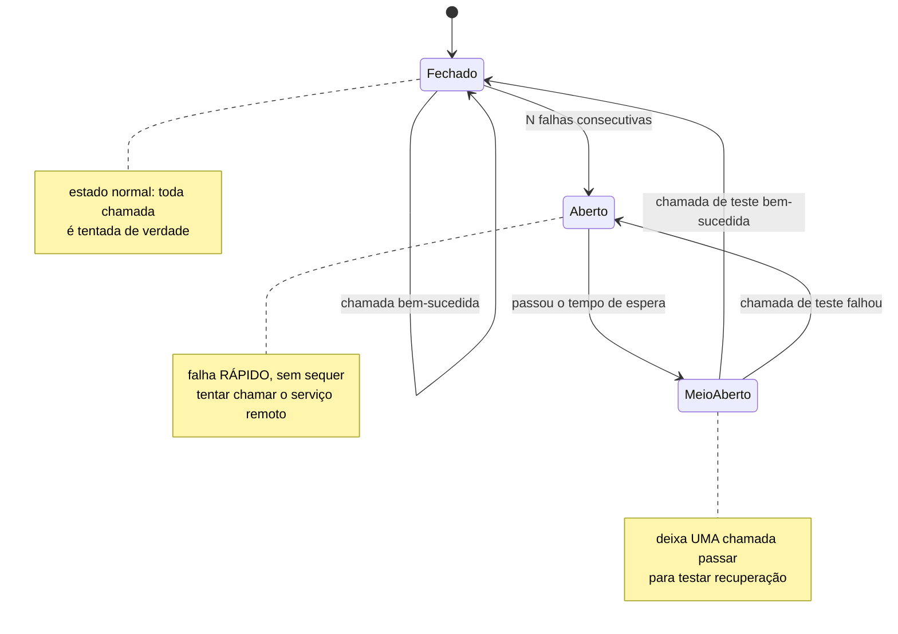

# Padrões de produção com asyncio — supervisão de tasks, graceful shutdown, circuit breaker

> [!abstract] TL;DR
> `asyncio.create_task()` cria uma `Task` que roda em segundo plano — mas se ninguém nunca fizer `await` nela nem checar seu resultado, uma exceção levantada dentro dela **não derruba o programa, não aparece no log, e não interrompe nada**: a task simplesmente morre, silenciosamente, e o único vestígio é um warning tardio (`Task exception was never retrieved`) emitido pelo garbage collector, minutos ou horas depois, quando o objeto `Task` finalmente é coletado — se é que alguém está olhando o log naquele momento. É o bug mais citado por quem já rodou `asyncio` em produção, e o fix é estrutural: toda `Task` "solta" (fire-and-forget) precisa de um supervisor — um `add_done_callback()` que verifica e propaga (ou loga) a exceção assim que a task termina, ou um loop supervisor que recria a task se ela cair. Graceful shutdown é o segundo pilar de robustez operacional: capturar `SIGTERM`/`SIGINT` via `loop.add_signal_handler()`, parar de aceitar trabalho novo, cancelar (cooperativamente) as tasks em andamento, e **esperar** a limpeza terminar (fechar conexões, dar flush em buffers, persistir estado) antes do processo morrer — sem isso, um `kill` ou um `docker stop` interrompe o processo no meio de uma operação, sem chance de arrumar a casa. Circuit breaker é o terceiro padrão: uma máquina de três estados (fechado → chamadas passam normalmente; aberto → falha rápido sem sequer tentar, depois de N falhas seguidas, protegendo um serviço externo já instável de mais carga; half-open → depois de um tempo de espera, deixa UMA chamada de teste passar para decidir se volta a fechar ou volta a abrir) que evita que um serviço dependente instável derrube o sistema inteiro por acúmulo de chamadas travadas em timeout. Os três padrões respondem à mesma pergunta de fundo — o que este sistema faz quando algo dá errado de um jeito que o "caminho feliz" do código não previu? — em pontos diferentes: supervisão cobre falhas dentro de uma task; graceful shutdown cobre o fim de vida do processo; circuit breaker cobre falhas de uma dependência externa.

## O bug que abre esta nota

Um serviço de notificações mantém, além do servidor HTTP principal, uma task de fundo que consome uma fila interna e envia e-mails de forma assíncrona — parece um padrão inofensivo, disparar-e-esquecer:

```python
import asyncio

async def processar_fila_de_emails(fila: asyncio.Queue):
    while True:
        mensagem = await fila.get()
        # bug real: o campo "destinatario" às vezes vem None
        # (um registro mal migrado, um formulário sem validação)
        await enviar_email(destinatario=mensagem["destinatario"], corpo=mensagem["corpo"])
        fila.task_done()

async def iniciar_servico(fila: asyncio.Queue):
    # dispara a task de fundo e segue em frente — "fire and forget"
    asyncio.create_task(processar_fila_de_emails(fila))
    await rodar_servidor_http()   # o processo principal continua vivo aqui
```

Em produção, na primeira mensagem com `destinatario=None`, `enviar_email()` levanta uma exceção dentro de `processar_fila_de_emails`. A `Task` morre nesse ponto — o `while True` para de rodar, silenciosamente. **Nenhum log aparece.** O servidor HTTP continua respondendo normalmente, então nenhum health check acusa problema. Só dias depois alguém percebe que nenhum e-mail de notificação saiu desde uma data específica — e, ao investigar, descobre que a fila interna está cheia de mensagens nunca processadas, acumulando desde o momento exato em que aquele `None` passou pela primeira vez.

> [!bug] O que está quebrado, em uma frase
> Uma `Task` criada com `asyncio.create_task()` e nunca aguardada (`await`ada) ou verificada não propaga sua exceção para lugar nenhum — se ela levantar um erro não tratado, a task simplesmente termina, e o único sinal é um warning tardio de "exception was never retrieved" emitido pelo `__del__` do objeto `Task`, quando (e se) o garbage collector finalmente o coletar.

Do ponto de vista do event loop, isso não é um defeito — é a semântica documentada de `Task`: ela é um `Future` (como já visto em [[01 - Event loop por dentro — selectors, callbacks e a relação Future-Task|nota 01]]), e um `Future` guarda sua exceção internamente até alguém perguntar por ela via `await`/`.result()`. Se ninguém nunca perguntar, a exceção fica presa dentro do objeto, inacessível, até ele ser destruído — e só nesse instante o `asyncio` reclama, tarde demais para qualquer ação corretiva.

```python
import asyncio
import warnings

async def tarefa_com_bug():
    await asyncio.sleep(0.1)
    raise ValueError("destinatário inválido")

async def demo():
    asyncio.create_task(tarefa_com_bug())   # ninguém guarda a referência, ninguém dá await
    await asyncio.sleep(0.5)                # o programa segue "normalmente"
    print("processo continua rodando, aparentemente sem problema nenhum")

asyncio.run(demo())
# saída: só "processo continua rodando..." — nenhum erro visível
# (o warning "Task exception was never retrieved" só aparece quando o
#  event loop fecha e o garbage collector finalmente varre o objeto Task,
#  e mesmo assim só se PYTHONASYNCIODEBUG ou o logging padrão estiverem ativos)
```

> [!info] Pré-requisito
> Esta nota assume [[03-Dominios/Tecnologia/Python/Concorrência e paralelismo/07 - asyncio na prática — gather, TaskGroup, timeouts e cancelamento|Galho 7 nota 07]] como conhecido — cancelamento cooperativo via `CancelledError`, `asyncio.shield()`, `TaskGroup` cancelando tarefas irmãs em caso de erro. Esta nota não repete esse mecanismo; assume-o como ferramenta e foca no problema estrutural de **tasks de longa duração, fora do escopo de qualquer `TaskGroup` ou `gather()`** — o caso de uma task de fundo que vive pelo tempo de vida inteiro do processo, sem ninguém esperando por ela num `await` direto. Também assume [[01 - Event loop por dentro — selectors, callbacks e a relação Future-Task|nota 01]] (relação `Task`/`Future`) e [[06 - Back-pressure — Semaphore, Queue com maxsize e buffering|nota 06]] (`asyncio.Queue`, usada no exemplo acima e ao longo desta nota).

`TaskGroup` resolve esse problema **quando a task cabe dentro de um escopo estruturado com início e fim claros** — mas uma task de fundo de longa duração (o consumidor de fila deste exemplo, um poller, um listener de webhook) não cabe nesse molde: ela é criada uma vez, no início do processo, e deveria viver até o processo morrer. É exatamente esse caso — tasks que vivem soltas pelo tempo de vida do processo — que exige um mecanismo de supervisão explícito, o assunto da primeira metade desta nota.

## Supervisão de tasks: garantir que uma exceção nunca morra em silêncio

Duas ferramentas resolvem esse problema, com trade-offs diferentes: um callback que dispara quando a task termina (detecta e reage, mas não recupera o serviço sozinho), e um loop supervisor que recria a task automaticamente (recupera, mas precisa de cuidado para não entrar em loop de falha).

### `add_done_callback()`: reagir assim que a task termina, com sucesso ou erro

Todo objeto `Task` (por herdar de `Future`) aceita `add_done_callback(fn)` — `fn` é chamada, de forma síncrona, assim que a task termina, seja por conclusão normal, por exceção, ou por cancelamento. O callback recebe a própria `Task` como argumento, e é dentro dele que se verifica se houve exceção — via `task.exception()`, que devolve a exceção levantada (ou `None`, se a task terminou normalmente; ela também levanta `CancelledError` se a task foi cancelada, cuidado a checar isso primeiro):

```python
import asyncio
import logging

logger = logging.getLogger(__name__)

def _reportar_falha(task: asyncio.Task) -> None:
    """Callback chamado quando a task termina — loga qualquer exceção
    que teria, de outra forma, morrido em silêncio."""
    if task.cancelled():
        return   # cancelamento intencional não é uma falha a reportar
    excecao = task.exception()
    if excecao is not None:
        logger.error(
            "Task de fundo '%s' terminou com exceção não tratada",
            task.get_name(),
            exc_info=excecao,
        )

def criar_task_supervisionada(coro, *, nome: str) -> asyncio.Task:
    task = asyncio.create_task(coro, name=nome)
    task.add_done_callback(_reportar_falha)
    return task
```

Aplicando ao bug de abertura — a mudança mínima que transforma um silêncio perigoso em um erro visível:

```python
async def iniciar_servico(fila: asyncio.Queue):
    criar_task_supervisionada(
        processar_fila_de_emails(fila),
        nome="consumidor-de-emails",
    )
    await rodar_servidor_http()
```

Com isso, na primeira mensagem com `destinatario=None`, o log registra imediatamente `Task de fundo 'consumidor-de-emails' terminou com exceção não tratada`, com o stack trace completo — visível em qualquer sistema de observabilidade padrão, no instante em que acontece, não dias depois. `add_done_callback()` **não impede** a task de morrer — ela ainda para de processar a fila — mas transforma um bug invisível em um alerta acionável. É o mínimo necessário para qualquer task de fundo em produção, e vale como prática padrão mesmo antes de decidir se o próximo passo é só logar ou também recuperar.

> [!question]- Por que não simplesmente colocar um `try`/`except` dentro da própria coroutine, em vez de um callback externo?
> As duas coisas não são mutuamente exclusivas, e servem propósitos diferentes. Um `try`/`except` **dentro** de `processar_fila_de_emails` pode capturar o erro de uma mensagem específica e continuar o loop (a correção mais direta para este bug em particular — ver a seção seguinte). Mas isso só cobre exceções que o autor da função **previu** e envolveu explicitamente; qualquer exceção fora desse escopo (um bug não antecipado, um erro de programação genuíno) ainda derruba a task inteira, e sem `add_done_callback()` ainda morre em silêncio. O callback é uma rede de segurança **estrutural**, que funciona independente de qualquer `try`/`except` interno — vale ter os dois: tratamento específico de erros esperados dentro da coroutine, e supervisão genérica por fora para qualquer coisa que escape desse tratamento.

### O supervisor que recria a task: recuperação automática

`add_done_callback()` sozinho detecta e reporta — não recupera o serviço. Para uma task que **deveria** continuar rodando pelo tempo de vida do processo (o consumidor de fila é exatamente esse caso), um padrão mais robusto é um loop supervisor: uma corrotina que cria a task, espera ela terminar, e — se terminou por exceção (não por cancelamento deliberado) — recria a task do zero, com um pequeno atraso para não entrar num loop de falha instantânea caso o erro seja persistente:

```python
import asyncio
import logging

logger = logging.getLogger(__name__)

async def supervisionar(
    fabrica_de_coroutine,
    *,
    nome: str,
    atraso_entre_tentativas: float = 1.0,
    max_tentativas_consecutivas: int = 5,
) -> None:
    """Roda `fabrica_de_coroutine()` como uma Task; se ela cair por exceção,
    recria automaticamente, com um teto de tentativas consecutivas para não
    reiniciar para sempre um serviço genuinamente quebrado."""
    tentativas_consecutivas = 0
    while True:
        task = asyncio.create_task(fabrica_de_coroutine(), name=nome)
        try:
            await task
            # terminou sem exceção — nesse desenho, isso é inesperado para
            # uma task de longa duração; loga e encerra o supervisor
            logger.warning("Task '%s' terminou normalmente; supervisor encerrando", nome)
            return
        except asyncio.CancelledError:
            # o próprio supervisor foi cancelado (ex: durante graceful shutdown) —
            # propaga o cancelamento para a task filha e sai sem tentar recriar
            task.cancel()
            raise
        except Exception:
            tentativas_consecutivas += 1
            logger.exception(
                "Task '%s' caiu (tentativa %d/%d) — recriando em %.1fs",
                nome, tentativas_consecutivas, max_tentativas_consecutivas,
                atraso_entre_tentativas,
            )
            if tentativas_consecutivas >= max_tentativas_consecutivas:
                logger.critical(
                    "Task '%s' excedeu %d falhas consecutivas — desistindo",
                    nome, max_tentativas_consecutivas,
                )
                raise
            await asyncio.sleep(atraso_entre_tentativas)
```



O contador `tentativas_consecutivas` é resetado implicitamente só se a função for reescrita para isso — na versão acima, ele **nunca** reseta, o que é uma escolha deliberada e conservadora (um serviço que falhou 5 vezes desde o boot para de tentar, mesmo que as falhas estivessem espaçadas por horas). Em produção, é comum resetar o contador depois de um período de execução estável (ex: task rodou por mais de 60 segundos sem cair, considera a falha anterior "esquecida") — a escolha certa depende de quão caro é falhar silenciosamente versus quão caro é reiniciar em loop um serviço genuinamente quebrado; ambos os extremos merecem alerta ativo (métrica, page) para um humano decidir, não só o supervisor sozinho.

> [!warning] Não confundir "supervisor recria a task" com "o bug foi corrigido"
> Um supervisor que recria a task indefinidamente pode mascarar um problema real: se `destinatario=None` aparece em toda mensagem de um lote específico, o supervisor vai recriar a task, ela vai consumir a **próxima** mensagem da fila (não a que quebrou — ela já foi retirada com `get()` antes de falhar) e seguir andando, mas a mensagem problemática já foi perdida silenciosamente, sem nenhum reprocessamento. Supervisão de processo (a task continua rodando) não é o mesmo que tratamento de erro de negócio (o que fazer com a mensagem específica que falhou — descartar? mover para uma fila de mensagens mortas/*dead-letter queue*? tentar de novo?) — os dois são necessários, e resolvem problemas diferentes.

## Graceful shutdown: encerrar o processo sem interromper trabalho no meio

Supervisão de tasks lida com falhas *durante* a vida do processo. Graceful shutdown lida com o *fim* dela: quando um orquestrador (Kubernetes fazendo rolling deploy, `docker stop`, um operador rodando `Ctrl+C` no terminal) decide que o processo deve terminar, ele normalmente não mata na hora — envia `SIGTERM` primeiro, esperando que o processo tenha a chance de encerrar suas operações em andamento antes de um `SIGKILL` forçado (tipicamente depois de um teto configurável de segundos, no Kubernetes o padrão é 30s). Um processo `asyncio` que ignora esse sinal — ou que trata o recebimento dele como um encerramento instantâneo, sem nenhuma limpeza — corre o risco real de interromper uma escrita em disco pela metade, deixar uma conexão de banco em estado inconsistente, ou perder mensagens que já saíram de uma fila mas ainda não foram persistidas no destino final.

`asyncio` expõe `loop.add_signal_handler()` para registrar um callback que roda dentro do próprio event loop quando um sinal chega — diferente do `signal.signal()` clássico do módulo `signal`, que roda o handler de forma assíncrona em relação ao interpretador (fora do controle do event loop) e não pode, com segurança, chamar código `async`:

```python
import asyncio
import signal
import logging

logger = logging.getLogger(__name__)

class Servico:
    def __init__(self):
        self._evento_shutdown = asyncio.Event()
        self._tasks_em_andamento: set[asyncio.Task] = set()
        self._conexao_banco = None   # populado em iniciar()

    def registrar_handlers_de_sinal(self, loop: asyncio.AbstractEventLoop) -> None:
        for sinal in (signal.SIGTERM, signal.SIGINT):
            loop.add_signal_handler(sinal, self._pedir_shutdown, sinal)

    def _pedir_shutdown(self, sinal: signal.Signals) -> None:
        logger.info("Sinal %s recebido — iniciando graceful shutdown", sinal.name)
        self._evento_shutdown.set()   # acorda quem estiver esperando em wait()

    async def iniciar(self):
        self._conexao_banco = await abrir_conexao_banco()
        loop = asyncio.get_running_loop()
        self.registrar_handlers_de_sinal(loop)

        servidor = await asyncio.start_server(self._lidar_com_cliente, "0.0.0.0", 8080)

        # espera até o sinal chegar — o coração do graceful shutdown
        await self._evento_shutdown.wait()

        logger.info("Parando de aceitar novas conexões...")
        servidor.close()
        await servidor.wait_closed()

        await self._encerrar_tasks_em_andamento()
        await self._limpar_recursos()
        logger.info("Shutdown concluído — processo pode encerrar")

    async def _encerrar_tasks_em_andamento(self, timeout: float = 10.0) -> None:
        if not self._tasks_em_andamento:
            return
        logger.info("Cancelando %d task(s) em andamento...", len(self._tasks_em_andamento))
        for task in self._tasks_em_andamento:
            task.cancel()
        # aguarda o cancelamento cooperativo se completar, com um teto de tempo —
        # se alguma task ignorar CancelledError indefinidamente, não trava o shutdown pra sempre
        resultados = await asyncio.wait(self._tasks_em_andamento, timeout=timeout)
        pendentes = resultados[1]
        if pendentes:
            logger.warning("%d task(s) não terminaram a tempo do timeout de shutdown", len(pendentes))

    async def _limpar_recursos(self) -> None:
        # flush de buffers, fechamento de conexões — na ordem inversa da abertura
        if self._conexao_banco is not None:
            await self._conexao_banco.close()
            logger.info("Conexão com o banco fechada")
```



Alguns pontos que fazem a diferença entre um shutdown que funciona na teoria e um que funciona sob carga real:

- **Parar de aceitar trabalho novo antes de esperar o trabalho existente terminar** — `servidor.close()` primeiro, para não ficar recebendo conexões novas enquanto tenta drenar as antigas, o que faria o shutdown nunca convergir sob tráfego constante.
- **Cancelamento com timeout, não sem limite** — `asyncio.wait(..., timeout=timeout)` garante que o processo não fica pendurado para sempre esperando uma task mal comportada que ignora `CancelledError`; passado o timeout, o shutdown segue em frente (registrando o problema no log) em vez de travar o orquestrador até o `SIGKILL` forçado.
- **Ordem de limpeza importa** — fechar conexões na ordem inversa da abertura, e só depois que as tasks que as usam já terminaram (cancelar a task antes de fechar a conexão que ela usa, não o contrário, evita erros de "conexão já fechada" durante o cancelamento cooperativo).
- **`loop.add_signal_handler()` só funciona no Unix** — no Windows, essa chamada levanta `NotImplementedError`; sistemas que precisam rodar em ambos usam `signal.signal()` combinado com um mecanismo de acordar o event loop (ex: escrever num socket auto-conectado), ou bibliotecas que já abstraem essa diferença.

> [!question]- Por que usar `asyncio.Event` para sinalizar o shutdown, em vez de simplesmente cancelar a task principal direto no handler de sinal?
> `add_signal_handler()` chama seu callback de forma **síncrona** — não é uma corrotina, não pode dar `await`. Se o handler chamasse `task.cancel()` diretamente na task principal (a que está rodando `servidor.serve_forever()` ou equivalente), o cancelamento interromperia o fluxo no meio de qualquer `await` em andamento, sem dar chance de executar a sequência ordenada de "parar de aceitar → cancelar tasks → limpar recursos" descrita acima — o shutdown ordenado simplesmente não existiria, seria substituído por um cancelamento abrupto e sem sequência garantida. `asyncio.Event` resolve isso: o handler síncrono só faz `.set()` (uma operação instantânea, sem `await`), e a lógica de shutdown ordenado roda numa corrotina normal que estava esperando em `await evento.wait()` — o sinal só *acorda* essa corrotina, não interrompe nada no meio.

## Circuit breaker assíncrono: proteger o sistema de uma dependência instável

Supervisão de tasks e graceful shutdown lidam com a saúde do próprio processo. Circuit breaker lida com a saúde de uma **dependência externa** — um serviço de terceiro, um outro microsserviço interno, um banco de dados sob sobrecarga — que começou a falhar ou a responder devagar demais. Sem proteção, o comportamento padrão de qualquer chamada de rede sob uma dependência degradada é continuar tentando, indefinidamente, uma chamada atrás da outra, cada uma consumindo uma conexão, uma `Task`, um `timeout` inteiro antes de desistir — e se o volume de chamadas for alto o suficiente, o próprio sistema que está chamando fica sobrecarregado de chamadas travadas em timeout, mesmo que o problema de origem esteja inteiramente do lado remoto.

O padrão circuit breaker (nomeado por analogia com o disjuntor elétrico) resolve isso com uma máquina de três estados:



- **Fechado (`CLOSED`)**: estado normal — toda chamada passa e é de fato tentada contra o serviço remoto. Falhas são contadas; ao atingir um limiar (ex: 5 falhas consecutivas), o circuito abre.
- **Aberto (`OPEN`)**: nenhuma chamada é sequer tentada — o breaker levanta uma exceção própria (`CircuitBreakerOpenError`) imediatamente, sem tocar a rede. Isso protege tanto o serviço remoto (que já está sob estresse, não recebe mais carga do lado do chamador) quanto o próprio sistema chamador (que não fica com dezenas de chamadas travadas esperando um timeout que provavelmente vai falhar de qualquer forma). Depois de um tempo configurado (ex: 30 segundos), o circuito passa para meio-aberto.
- **Meio-aberto (`HALF_OPEN`)**: deixa **uma única** chamada passar, como teste. Se ela tiver sucesso, o circuito assume que o serviço se recuperou e volta a fechado (resetando o contador de falhas). Se ela falhar, volta a aberto, reiniciando o tempo de espera — sem deixar um enxame de chamadas simultâneas testarem a recuperação ao mesmo tempo, o que recriaria a mesma sobrecarga que o circuito estava tentando evitar.

Uma implementação mínima, funcional, sem depender de biblioteca externa:

```python
import asyncio
import time
import enum
from typing import Callable, Awaitable, TypeVar

T = TypeVar("T")


class EstadoCircuito(enum.Enum):
    FECHADO = "fechado"
    ABERTO = "aberto"
    MEIO_ABERTO = "meio_aberto"


class CircuitBreakerAbertoError(Exception):
    """Levantada quando uma chamada é recusada porque o circuito está aberto."""


class CircuitBreaker:
    def __init__(
        self,
        *,
        limiar_de_falhas: int = 5,
        tempo_de_espera_segundos: float = 30.0,
    ):
        self._limiar_de_falhas = limiar_de_falhas
        self._tempo_de_espera = tempo_de_espera_segundos
        self._estado = EstadoCircuito.FECHADO
        self._falhas_consecutivas = 0
        self._abriu_em: float | None = None
        self._lock = asyncio.Lock()   # protege as transições de estado entre chamadas concorrentes

    async def chamar(self, operacao: Callable[[], Awaitable[T]]) -> T:
        async with self._lock:
            if self._estado is EstadoCircuito.ABERTO:
                if time.monotonic() - self._abriu_em >= self._tempo_de_espera:
                    self._estado = EstadoCircuito.MEIO_ABERTO
                else:
                    raise CircuitBreakerAbertoError(
                        "Circuito aberto — chamada recusada sem tentar o serviço remoto"
                    )

        # a chamada de fato acontece FORA do lock — não queremos segurar o lock
        # (e bloquear outras corrotinas checando o estado) durante uma chamada de rede lenta
        try:
            resultado = await operacao()
        except Exception:
            await self._registrar_falha()
            raise
        else:
            await self._registrar_sucesso()
            return resultado

    async def _registrar_falha(self) -> None:
        async with self._lock:
            self._falhas_consecutivas += 1
            if self._estado is EstadoCircuito.MEIO_ABERTO:
                # a chamada de teste falhou — volta a abrir, reinicia o relógio
                self._estado = EstadoCircuito.ABERTO
                self._abriu_em = time.monotonic()
            elif self._falhas_consecutivas >= self._limiar_de_falhas:
                self._estado = EstadoCircuito.ABERTO
                self._abriu_em = time.monotonic()

    async def _registrar_sucesso(self) -> None:
        async with self._lock:
            self._falhas_consecutivas = 0
            self._estado = EstadoCircuito.FECHADO
```

Usando o breaker para proteger uma chamada real contra um serviço externo instável:

```python
breaker = CircuitBreaker(limiar_de_falhas=5, tempo_de_espera_segundos=30.0)

async def buscar_cotacao(session, produto_id: str) -> dict:
    async def _chamada():
        async with session.get(f"https://api.cotacoes.com/{produto_id}") as resp:
            resp.raise_for_status()
            return await resp.json()

    try:
        return await breaker.chamar(_chamada)
    except CircuitBreakerAbertoError:
        # fallback explícito: cache antigo, valor padrão, ou propagar
        # um erro específico de "serviço indisponível" para a camada acima
        return {"cotacao": None, "origem": "fallback — circuito aberto"}
```

Vale notar o que essa implementação mínima **não** cobre, e que uma biblioteca de produção (`aiobreaker`, ou circuit breakers embutidos em service meshes como Istio/Envoy) tipicamente resolve: contagem de falhas em janela deslizante (não só "consecutivas", o que pode ser sensível demais a uma única falha isolada), múltiplas chamadas de teste em meio-aberto com limite de concorrência (em vez de exatamente uma), métricas expostas (`circuit_breaker_state`, taxa de rejeição), e distinção entre tipos de falha (um `TimeoutError` provavelmente deveria contar para o breaker; um `ValueError` de validação de payload local provavelmente não deveria, porque não indica nada sobre a saúde do serviço remoto).

> [!warning] Contar falhas de validação local como se fossem falhas do serviço remoto
> **O que acontece:** o breaker está configurado para contar *qualquer* exceção levantada dentro de `operacao()` como uma falha do serviço — incluindo um `KeyError` de um bug no parsing da resposta, ou um `ValueError` de validação de um payload malformado que o chamador montou errado. O circuito abre por um problema que é inteiramente local, e passa a recusar chamadas legítimas contra um serviço remoto que está, na verdade, saudável.
> **Por quê:** o breaker, por padrão, não distingue "o serviço remoto está com problema" de "meu próprio código tem um bug" — as duas coisas aparecem, do ponto de vista dele, como uma `Exception` qualquer levantada dentro da operação protegida.
> **Como evitar:** capturar especificamente as exceções que de fato indicam problema do lado remoto (erros de rede, timeouts, códigos HTTP 5xx) e deixar exceções de bug local (erros de parsing, validação) vazarem sem contar como falha do circuito — geralmente feito filtrando por tipo de exceção dentro de `_registrar_falha`, ou capturando só um subconjunto de exceções esperadas no `try`/`except` ao redor de `await breaker.chamar(...)`.

## Armadilhas comuns

> [!warning] Criar uma `Task` de fundo sem guardar a referência nem supervisioná-la
> **O que acontece:** `asyncio.create_task(coro())` é chamado sem atribuir o resultado a nenhuma variável (`asyncio.create_task(minha_coro())` como statement solto) e sem `add_done_callback()`. Além do problema central desta nota (exceção morre em silêncio), existe um segundo risco, mais sutil: o event loop mantém apenas uma referência **fraca** (`weakref`) para tasks agendadas dessa forma — se o garbage collector coletar o objeto `Task` antes dela terminar (o que pode acontecer se nenhuma outra referência forte existir em lugar nenhum), a task pode ser **cancelada e destruída no meio da execução**, de forma imprevisível.
> **Por quê:** o `asyncio` documenta explicitamente esse comportamento — é responsabilidade de quem cria a task manter uma referência forte a ela enquanto ela deve continuar viva, geralmente guardando-a num `set` de tasks em andamento (como `self._tasks_em_andamento` no exemplo de graceful shutdown desta nota).
> **Como evitar:** sempre guardar a referência retornada por `create_task()` — num atributo, numa lista/set de tasks ativas, ou (mínimo) numa variável cujo escopo sobrevive até a task terminar — e remover essa referência só depois de confirmado que a task terminou (tipicamente dentro do próprio `add_done_callback`, com `tasks_ativas.discard(task)`).

> [!warning] Tratar `SIGKILL` como algo que o processo pode "capturar" e reagir
> **O que acontece:** o código de graceful shutdown é testado só com `Ctrl+C` (`SIGINT`) ou `docker stop` (`SIGTERM`, com grace period generoso) — nunca sob a condição real de um `SIGKILL` (ou o timeout do grace period expirando e o orquestrador forçando), e a equipe assume, implicitamente, que a lógica de limpeza sempre vai rodar.
> **Por quê:** `SIGKILL` não pode ser capturado, bloqueado, nem ignorado por nenhum processo — é o sinal que o kernel usa exatamente para os casos em que o processo não respondeu a tempo ao `SIGTERM`. Nenhum handler Python é chamado; o processo simplesmente é encerrado imediatamente pelo sistema operacional.
> **Como evitar:** desenhar o shutdown para ser **idempotente e resiliente a interrupção total** — checkpoints frequentes de progresso (não confiar que uma limpeza longa vai sempre completar), transações que podem ser retomadas ou revertidas de forma segura na reinicialização, e um teto de tempo no próprio graceful shutdown (como o `timeout` em `_encerrar_tasks_em_andamento`) que seja **menor** que o grace period configurado no orquestrador — se o shutdown ordenado não convergir dentro desse teto, é melhor sair de forma controlada (mesmo que incompleta) do que arriscar o `SIGKILL` interromper no pior momento possível.

> [!warning] Circuit breaker compartilhado incorretamente entre chamadas que não deveriam compartilhar estado
> **O que acontece:** uma única instância de `CircuitBreaker` é usada para proteger chamadas contra **múltiplos** endpoints ou serviços diferentes (ex: o mesmo breaker envolvendo tanto `GET /produtos` quanto `GET /pedidos` da mesma API) — uma instabilidade isolada em `/pedidos` abre o circuito e passa a recusar também chamadas para `/produtos`, que nunca teve problema nenhum.
> **Por quê:** o breaker rastreia falhas de forma agregada, sem distinguir a origem — do ponto de vista dele, "falhas consecutivas" é um contador único, não importa qual chamada especificamente falhou.
> **Como evitar:** uma instância de `CircuitBreaker` por dependência logicamente independente — geralmente por endpoint, ou por serviço remoto distinto — não uma instância global compartilhada por toda a aplicação; um dicionário `{nome_do_endpoint: CircuitBreaker(...)}` criado sob demanda é o padrão mais comum quando o conjunto de endpoints não é conhecido de antemão.

## Em entrevista

Esses três padrões — supervisão, graceful shutdown, circuit breaker — são o tipo de pergunta que separa quem só sabe a sintaxe de `asyncio` de quem já operou um serviço assíncrono em produção:

> "The single most common asyncio production bug I've seen is a background task created with `asyncio.create_task()` that nobody ever awaits — if it raises an unhandled exception, that exception doesn't crash the process, doesn't get logged, and doesn't stop anything. It just silently dies, and the only trace is a delayed 'Task exception was never retrieved' warning when the garbage collector eventually reclaims the object — which might be minutes or hours later, if it happens at all. The fix is to always attach an `add_done_callback` that checks `task.exception()` and logs it immediately, or, for long-running background tasks, wrap them in a supervisor loop that recreates the task on failure with a backoff and a cap on consecutive retries. The second production concern is graceful shutdown — catching `SIGTERM` via `loop.add_signal_handler`, since a plain `signal.signal()` handler can't safely await anything; the handler just sets an `asyncio.Event`, and a coroutine waiting on that event runs the actual ordered shutdown: stop accepting new work, cancel in-flight tasks cooperatively with a timeout so a misbehaving task can't hang shutdown forever, then flush and close resources. And circuit breaker protects against a flaky external dependency — closed state tries every call normally, but after N consecutive failures it opens and fails fast without even attempting the remote call, protecting both the remote service from more load and your own system from piling up timed-out calls; after a cooldown it goes half-open and lets exactly one test call through to decide whether to close again or reopen."

Uma pergunta de acompanhamento comum: **"como você evita que o circuit breaker abra por um erro que não tem nada a ver com a saúde do serviço remoto?"** — a resposta sênior é filtrar por tipo de exceção: só contar como falha o que de fato indica problema do lado de lá (timeout, erro de conexão, `5xx`), deixando bugs locais (parsing, validação) vazarem sem afetar o estado do circuito.

> [!question]- E se perguntarem por que não usar simplesmente `try`/`except` com retry em vez de circuit breaker?
> Retry (tentar de novo, com backoff) e circuit breaker resolvem problemas complementares, não o mesmo problema: retry ajuda com falhas **transitórias e isoladas** (um timeout ocasional, uma conexão que caiu uma vez) — tentar de novo, com algum atraso, frequentemente resolve. Circuit breaker entra quando as falhas **deixam de ser isoladas** e passam a ser um padrão sustentado — nesse cenário, continuar tentando (mesmo com retry e backoff) só adiciona mais carga a um serviço já sobrecarregado, e cada tentativa ainda paga o custo de um timeout inteiro antes de desistir. Um sistema robusto tipicamente usa os dois juntos: retry para absorver falhas isoladas, e o circuit breaker envolvendo o retry inteiro, para desistir completamente (e rápido) quando o padrão de falhas indica que insistir não vai ajudar.

## Como explicar em inglês

| PT | EN |
|----|----|
| task de fundo / fire-and-forget | background task / fire-and-forget task |
| morrer em silêncio | fail silently / die silently |
| exceção nunca recuperada | exception never retrieved |
| supervisionar / supervisor | supervise / supervisor |
| encerramento gracioso | graceful shutdown |
| capturar um sinal | catch/handle a signal |
| parar de aceitar trabalho novo | stop accepting new work |
| drenar conexões em andamento | drain in-flight connections |
| circuito fechado/aberto/meio-aberto | closed/open/half-open circuit |
| falhar rápido | fail fast |
| serviço instável / degradado | flaky / degraded service |
| janela de falhas consecutivas | consecutive failure window |

## O que vem a seguir

Esta nota fechou os três pilares de robustez operacional que faltavam depois da correção funcional coberta pelas notas anteriores do galho: supervisão de tasks para nunca perder um erro em silêncio, graceful shutdown para encerrar sem interromper trabalho no meio, e circuit breaker para não deixar uma dependência instável derrubar o resto do sistema.

- [[08 - Capstone — web scraper assíncrono de produção|08 — Capstone: web scraper assíncrono de produção]] — aplica os três padrões desta nota junto com `ClientSession` (nota 03) e `Semaphore` (nota 06) num cenário integrador único, recapitulando o galho inteiro.
- [[06 - Back-pressure — Semaphore, Queue com maxsize e buffering|06 — Back-pressure]] — o `asyncio.Queue` usado no exemplo de abertura desta nota; vale revisitar para o mecanismo de `maxsize`/`task_done`/`join` por trás do consumidor de e-mails.
- [[03-Dominios/Tecnologia/Python/Concorrência e paralelismo/07 - asyncio na prática — gather, TaskGroup, timeouts e cancelamento|Galho 7 nota 07 — asyncio na prática]] — cancelamento cooperativo e `CancelledError`, mecanismo de base que esta nota aplica (não reexplica) em `_encerrar_tasks_em_andamento`.
- [[03-Dominios/Tecnologia/Python/Programação Reativa e Assíncrona/index|Programação Reativa e Assíncrona (Galho 8)]] — MOC deste galho.

## Fontes

- Python Software Foundation. *Coroutines and Tasks — asyncio*. docs.python.org, versão 3.14. https://docs.python.org/3/library/asyncio-task.html (acessado em 2026-07-11) — referência oficial de `Task`, `add_done_callback`, `Task.exception()`, e a nota de documentação sobre referências fracas a tasks "fire-and-forget".
- Python Software Foundation. *signal — Set handlers for asynchronous events*. docs.python.org, versão 3.14. https://docs.python.org/3/library/signal.html (acessado em 2026-07-11) — semântica de `SIGTERM`/`SIGINT`/`SIGKILL`, por que `SIGKILL` não pode ser capturado.
- Python Software Foundation. *Event Loop — add_signal_handler*. docs.python.org, versão 3.14. https://docs.python.org/3/library/asyncio-eventloop.html#asyncio.loop.add_signal_handler (acessado em 2026-07-11) — `loop.add_signal_handler()`, disponibilidade só em Unix.
- Fowler, Martin. *CircuitBreaker*. martinfowler.com, 2014. https://martinfowler.com/bliki/CircuitBreaker.html (acessado em 2026-07-11) — artigo canônico que nomeia e descreve o padrão de três estados usado nesta nota.
- Kubernetes documentation. *Pod Lifecycle — Termination of Pods*. kubernetes.io. https://kubernetes.io/docs/concepts/workloads/pods/pod-lifecycle/#pod-termination (acessado em 2026-07-11) — sequência `SIGTERM` → grace period → `SIGKILL` usada como contexto operacional do graceful shutdown desta nota.
- [[03-Dominios/Tecnologia/Python/Concorrência e paralelismo/07 - asyncio na prática — gather, TaskGroup, timeouts e cancelamento|Galho 7 nota 07 — asyncio na prática]] — nota irmã, pré-requisito direto: cancelamento cooperativo, `CancelledError`, `TaskGroup`.
- [[01 - Event loop por dentro — selectors, callbacks e a relação Future-Task|01 — Event loop por dentro]] — nota irmã deste galho: a relação `Task(Future)` que explica por que uma exceção fica "presa" dentro do objeto até alguém perguntar por ela.
- [[06 - Back-pressure — Semaphore, Queue com maxsize e buffering|06 — Back-pressure]] — nota irmã cujo `asyncio.Queue(maxsize=N)` é a base do exemplo de abertura (consumidor de fila de e-mails) desta nota.

Consultado em 2026-07-11.
