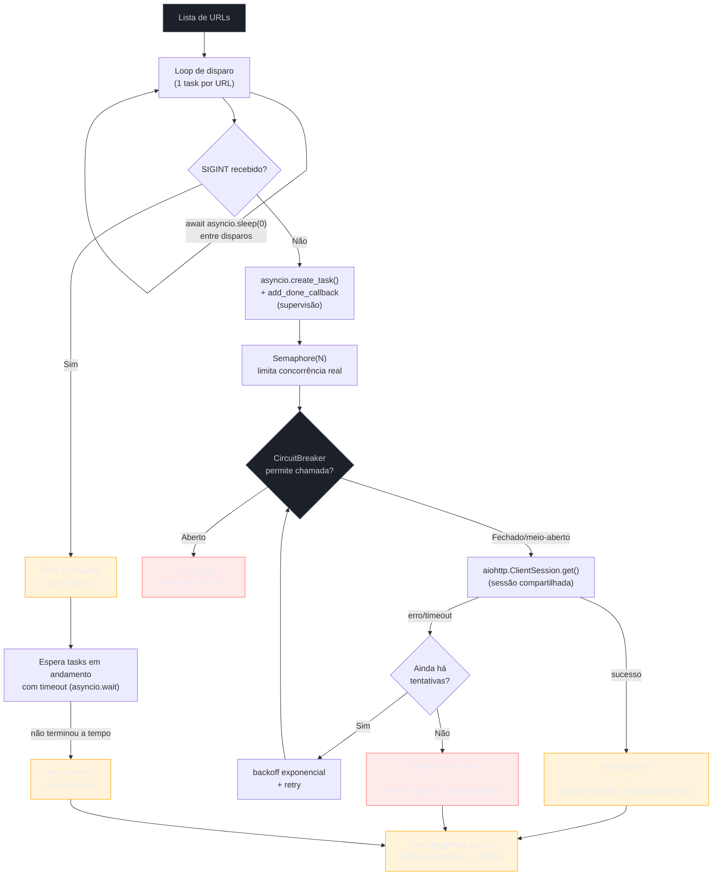

# Capstone — web scraper assíncrono de produção

> [!abstract] TL;DR
> Esta nota fecha o Galho 8 construindo, peça por peça, o programa que só faz sentido depois de ler as sete notas anteriores: um web scraper assíncrono real, rodável, que bate em centenas de URLs sem derrubar o alvo nem o próprio processo. A base é a [[03 - aiohttp cliente — ClientSession, connection pooling e requisições concorrentes|`aiohttp.ClientSession` reutilizada]] (nota 03) — uma sessão só, criada uma vez, compartilhando o pool de conexões entre todas as requisições. Por cima dela, um [[06 - Back-pressure — Semaphore, Queue com maxsize e buffering|`asyncio.Semaphore`]] (nota 06) trava o número de requisições concorrentes num teto explícito, protegendo tanto o alvo remoto quanto os file descriptors locais. Cada requisição individual passa por retry com backoff exponencial e por um `CircuitBreaker` minimalista (nota 07) que para de bater no alvo assim que ele começa a falhar em série, em vez de insistir cegamente. Cada task de scraping é supervisionada via `add_done_callback()` (nota 07) — se uma delas morrer por uma exceção que a lógica de retry não previu, o erro é logado e as outras continuam, sem derrubar o processo inteiro. E o programa inteiro responde a `Ctrl+C`/`SIGINT` com graceful shutdown ordenado (nota 07): para de disparar URLs novas, dá um teto de tempo para as requisições em andamento terminarem — cancelando as que não terminaram a tempo — e grava as URLs ainda pendentes num arquivo de progresso, para retomar depois sem perder o trabalho já feito. Nenhuma peça deste programa é conceito novo: as sete notas anteriores já ensinaram cada mecanismo isoladamente; esta nota só os amarra, na ordem em que um scraper de produção de verdade precisa deles.

## O cenário: um scraper de produção amarra o galho inteiro

Um serviço interno precisa varrer um catálogo de produtos de um fornecedor externo — algumas centenas a alguns milhares de URLs — e consolidar o conteúdo bruto de cada página para processamento posterior. É o tipo de tarefa que parece trivial na primeira versão e revela, uma por uma, todas as armadilhas que este galho passou sete notas explicando:

- A primeira versão ingênua recria uma `ClientSession` por requisição (o bug de abertura da [[03 - aiohttp cliente — ClientSession, connection pooling e requisições concorrentes|nota 03]]) e paga handshake TCP+TLS a cada chamada.
- A segunda versão corrige a sessão mas dispara todas as requisições de uma vez com `asyncio.gather()`, sem limite nenhum — o bug de abertura da [[06 - Back-pressure — Semaphore, Queue com maxsize e buffering|nota 06]] — e o fornecedor começa a devolver `429 Too Many Requests` ou simplesmente derruba a conexão sob a carga.
- A terceira versão limita a concorrência mas não trata erro nenhum: a primeira URL que dá timeout ou erro de rede propaga a exceção e mata o `gather()` inteiro, perdendo o progresso de todas as outras requisições que já tinham terminado.
- A quarta versão trata erro individualmente mas, rodando em produção há horas, alguém aperta `Ctrl+C` para fazer um deploy — e o processo simplesmente morre no meio, sem salvar nada do que já foi coletado, sem nem tentar deixar as requisições em andamento terminarem.

Cada uma dessas versões corrigidas corresponde a uma nota deste galho. O programa desta capstone é a quinta versão — a que já nasce com as quatro correções embutidas, porque não há razão nenhuma para descobrir cada uma delas de novo em produção depois de já tê-las estudado aqui.



## Etapa 1: sessão reutilizada e concorrência limitada

A base de qualquer scraper `aiohttp` de produção é a mesma da [[03 - aiohttp cliente — ClientSession, connection pooling e requisições concorrentes|nota 03]]: **uma `ClientSession` só**, criada uma vez no início do programa e reaproveitada por todas as requisições, dentro de um `async with` que garante o fechamento ordenado ao final. Guardar a sessão como atributo de instância — não recriá-la dentro do método que faz cada requisição — é o que preserva o connection pool entre chamadas.

Por cima da sessão, o `asyncio.Semaphore` da [[06 - Back-pressure — Semaphore, Queue com maxsize e buffering|nota 06]] entra exatamente no ponto em que cada task individual tenta de fato executar sua requisição — não no ponto em que a task é criada. Essa distinção importa: `asyncio.create_task()` é barato e pode ser chamado para todas as URLs de uma vez sem problema nenhum (criar uma `Task` não abre conexão nenhuma); é dentro do corpo de cada task, no `async with self._semaforo:`, que o limite de concorrência real entra em vigor — no máximo `N` tasks conseguem passar do `async with` ao mesmo tempo, e as demais esperam sua vez sem bloquear o event loop.

```python
class ScraperAssincrono:
    def __init__(self, urls: list[str], max_concorrencia: int = 10) -> None:
        self._urls = list(urls)
        self._semaforo = asyncio.Semaphore(max_concorrencia)
        self._session: aiohttp.ClientSession | None = None

    async def _processar_url(self, url: str) -> None:
        async with self._semaforo:          # trava a concorrência real aqui
            resultado = await self._buscar_com_retry(url)
            self._resultados.append(resultado)
```

O valor de `max_concorrencia` não é um número abstrato — ele é uma escolha deliberada entre dois riscos opostos, o mesmo dilema que a nota 06 nomeou: baixo demais e o scraper demora sem necessidade; alto demais e o alvo remoto começa a devolver `429`/`503` ou simplesmente derruba conexões sob carga, o que degrada a taxa de sucesso e aciona o circuit breaker da etapa 2 mais cedo do que deveria. Em produção, esse número normalmente vem de um teste empírico contra o alvo real (ou de um limite documentado pelo fornecedor da API), não de um chute — começar conservador (10-20) e subir com observação é mais seguro que começar alto e descobrir o teto do jeito caro.

> [!question]- Por que não usar `asyncio.Queue` (também da nota 06) em vez de `Semaphore` aqui?
> As duas ferramentas resolvem o mesmo problema de fundo — quanto trabalho concorrente o sistema aguenta — mas com formas diferentes. `Queue(maxsize=N)` faz mais sentido quando produção e consumo são processos genuinamente separados (um produtor que gera itens ao longo do tempo, consumidores que os processam), como o padrão worker pool da nota 06. Aqui a lista de URLs já existe por inteiro no início — não há um "produtor" separado gerando URLs aos poucos —, então criar uma task por URL e deixar o `Semaphore` limitar quantas rodam ao mesmo tempo é mais direto: não precisa de um `Queue` intermediário nem de workers explícitos consumindo dela. Se o scraper precisasse, em vez disso, ler URLs de uma fonte contínua (uma fila externa alimentada em tempo real por outro serviço), a resposta mudaria para `Queue` com workers de longa duração — o padrão exato que a nota 06 descreveu.

## Etapa 2: retry com backoff e circuit breaker

Uma única requisição HTTP contra um alvo real falha por motivos rotineiros e transitórios: um timeout ocasional, uma queda momentânea de conexão, um `503` de sobrecarga passageira. Tratar a primeira falha como definitiva — descartando a URL de vez — desperdiça trabalho que um simples retry resolveria. Mas retry sem limite, disparado imediatamente, é o oposto perigoso: se o alvo estiver genuinamente fora do ar ou degradado, tentar de novo na hora só adiciona mais carga a um sistema que já está sofrendo.

A resposta é a combinação que a [[07 - Padrões de produção com asyncio — supervisão de tasks, graceful shutdown, circuit breaker|nota 07]] já descreveu: um número limitado de tentativas, cada uma esperando um intervalo crescente (backoff exponencial) antes da próxima, e um `CircuitBreaker` que aprende, ao longo de várias URLs diferentes, quando o alvo como um todo — não só uma URL isolada — está falhando em série.

```python
class EstadoCircuito(Enum):
    FECHADO = auto()      # tudo normal — chamadas passam
    ABERTO = auto()       # falhando em série — falha rápido, sem bater na rede
    MEIO_ABERTO = auto()  # tempo de recuperação passou — deixa uma chamada testar


class CircuitBreaker:
    def __init__(self, limite_falhas: int = 5, tempo_recuperacao: float = 30.0) -> None:
        self._limite_falhas = limite_falhas
        self._tempo_recuperacao = tempo_recuperacao
        self._falhas_seguidas = 0
        self._estado = EstadoCircuito.FECHADO
        self._abriu_em = 0.0
        self._lock = asyncio.Lock()   # protege as transições de estado (nota 07)

    async def permite_chamada(self) -> bool:
        async with self._lock:
            if self._estado is EstadoCircuito.ABERTO:
                if time.monotonic() - self._abriu_em < self._tempo_recuperacao:
                    return False
                self._estado = EstadoCircuito.MEIO_ABERTO
            return True

    async def registrar_resultado(self, sucesso: bool) -> None:
        async with self._lock:
            if sucesso:
                self._falhas_seguidas = 0
                self._estado = EstadoCircuito.FECHADO
                return
            self._falhas_seguidas += 1
            if self._falhas_seguidas >= self._limite_falhas:
                self._estado = EstadoCircuito.ABERTO
                self._abriu_em = time.monotonic()
```

O ponto onde o circuit breaker e o retry se encontram é dentro do método que busca uma única URL: antes de cada tentativa, checa se o circuito permite a chamada; depois de cada tentativa, registra o resultado. Se o circuito já estiver aberto (o alvo falhou cinco vezes seguidas, vindas possivelmente de URLs diferentes), a URL atual falha imediatamente, **sem sequer tentar a rede** — é exatamente o "falhar rápido" que a nota 07 descreveu como o valor central de um circuit breaker: proteger o alvo (e o próprio scraper, que pararia de queimar tempo em timeouts previsíveis) enquanto o problema não se resolve sozinho.

```python
async def _buscar_com_retry(self, url: str) -> Resultado:
    for tentativa in range(1, self._max_tentativas + 1):
        if not await self._breaker.permite_chamada():
            return Resultado(url, sucesso=False, erro="circuito aberto")
        try:
            timeout = aiohttp.ClientTimeout(total=10.0)
            async with self._session.get(url, timeout=timeout) as resp:
                resp.raise_for_status()
                corpo = await resp.read()
            await self._breaker.registrar_resultado(sucesso=True)
            return Resultado(url, sucesso=True, tamanho_bytes=len(corpo))
        except (aiohttp.ClientError, asyncio.TimeoutError, TimeoutError) as exc:
            await self._breaker.registrar_resultado(sucesso=False)
            logger.warning(
                "tentativa %d/%d falhou para %s: %s",
                tentativa, self._max_tentativas, url, exc,
            )
            if tentativa < self._max_tentativas:
                await asyncio.sleep(0.5 * 2 ** (tentativa - 1))
    return Resultado(url, sucesso=False, erro="esgotou tentativas")
```

O `except` captura exatamente a dupla que a [[03 - aiohttp cliente — ClientSession, connection pooling e requisições concorrentes|nota 03]] nomeou como armadilha comum: `aiohttp.ClientError` (a hierarquia de erros de rede específica do `aiohttp` — conexão recusada, DNS falhou, conexão derrubada no meio) e `asyncio.TimeoutError`/`TimeoutError` nativo (o que `ClientTimeout` levanta quando o teto de tempo estoura) — um `except Exception` genérico aqui capturaria demais (inclusive bugs de programação que deveriam derrubar a task, não ser tratados como "falha de rede recuperável"); um `except aiohttp.ClientError` sozinho deixaria passar o `TimeoutError`, silenciosamente pulando o retry para o erro mais comum de todos.

> [!warning] O backoff exponencial cresce rápido — sempre com um teto
> `0.5 * 2 ** (tentativa - 1)` produz 0.5s, 1s, 2s, 4s... Com `max_tentativas=3` isso é inofensivo, mas se alguém aumentar o número de tentativas sem pensar, o backoff cresce exponencialmente sem limite — a quinta tentativa já espera 8 segundos, a décima esperaria mais de quatro minutos. Produção real quase sempre limita o backoff com um teto explícito (`min(0.5 * 2 ** (tentativa - 1), 30.0)`, por exemplo) — omitido aqui só para manter o código enxuto, mas vale registrar antes de copiar este trecho para um sistema real.

## Etapa 3: supervisão — uma task que morre não derruba as outras

O retry da etapa 2 cobre falhas *esperadas* — erro de rede, timeout, resposta ruim do servidor. Mas nada impede que uma task de scraping morra por um motivo que o `except` não previu: um bug real no parsing do corpo da resposta, um `KeyError` inesperado, uma exceção de uma biblioteca de terceiros que não é `aiohttp.ClientError`. Sem tratamento, esse tipo de exceção sobe até o topo da coroutine da task e a task morre — silenciosamente, se ninguém nunca verificar seu resultado, exatamente o bug de abertura da [[07 - Padrões de produção com asyncio — supervisão de tasks, graceful shutdown, circuit breaker|nota 07]].

A correção é a mesma: um `add_done_callback()` registrado em cada task no momento em que ela é criada, que verifica se a task terminou com exceção e loga — sem derrubar o programa e sem impedir as outras tasks de continuar rodando.

```python
def _supervisionar(self, task: asyncio.Task) -> None:
    if task.cancelled():
        return
    exc = task.exception()
    if exc is not None:
        logger.error("task de scraping morreu por exceção não tratada: %r", exc)
        # não relança — as outras tasks seguem normalmente
```

```python
task = asyncio.create_task(self._processar_url(url))
task.add_done_callback(self._supervisionar)
```

Note o que esse callback **não** faz: ele não tenta recuperar a URL que falhou, não a recoloca numa fila de retry, não interrompe as demais tasks. Isso é intencional e diferente do loop supervisor com recriação automática que a nota 07 mostrou para uma task de longa duração (um consumidor de fila que deveria rodar para sempre) — aqui cada task de scraping tem começo, meio e fim (uma URL, processada, terminado), então "recuperar" uma task morta não significa recriá-la infinitamente, significa apenas: **não deixar que ela suma sem deixar rastro**. A URL que causou a exceção simplesmente não aparece na lista de resultados bem-sucedidos nem na de falhas tratadas — ela fica de fora, visível no relatório final como uma discrepância entre URLs enviadas e URLs com resultado, o sinal de que algo além do esperado aconteceu e precisa de investigação manual.

> [!question]- Por que não simplesmente colocar um `try/except Exception` amplo dentro de `_processar_url`, capturando tudo, em vez de depender do `add_done_callback`?
> As duas táticas não competem — elas cobrem camadas diferentes. Um `except Exception` amplo dentro de `_processar_url` capturaria e trataria a exceção *ali mesmo*, permitindo, por exemplo, registrar um `Resultado` de erro específico para aquela URL. Isso é razoável e pode ser combinado com a supervisão. O que o `add_done_callback` garante é uma **rede de segurança estrutural**, independente de qualquer `try/except` que o código de dentro da task tenha (ou tenha esquecido de ter): mesmo que alguém adicione uma nova etapa de processamento no futuro e esqueça de tratar uma exceção nova ali, a supervisão ainda loga o problema em vez de deixá-lo desaparecer silenciosamente no aviso tardio `Task exception was never retrieved` do garbage collector — o mesmo bug de abertura da nota 07.

## Etapa 4: graceful shutdown com progresso parcial

A última peça é a que só aparece quando o scraper roda por tempo suficiente para alguém precisar interrompê-lo — um deploy, uma manutenção, ou simplesmente `Ctrl+C` porque o operador percebeu um problema nos primeiros resultados. O padrão é o mesmo `loop.add_signal_handler()` + `asyncio.Event` da [[07 - Padrões de produção com asyncio — supervisão de tasks, graceful shutdown, circuit breaker|nota 07]], adaptado às duas particularidades deste programa: **parar de disparar URLs novas** (não só parar de aceitar conexões, como no exemplo de servidor da nota 07) e **salvar as URLs ainda pendentes**, para que uma execução futura não precise recomeçar do zero.

```python
def _pedir_shutdown(self) -> None:
    logger.info("sinal recebido — parando de disparar URLs novas")
    self._evento_shutdown.set()
```

```python
loop = asyncio.get_running_loop()
for sinal in (signal.SIGINT, signal.SIGTERM):
    loop.add_signal_handler(sinal, self._pedir_shutdown)
```

O detalhe que passa despercebido na primeira tentativa de implementar isso: o loop que dispara uma `Task` por URL, se escrito como um `for` síncrono sem nenhum `await` no meio, **nunca cede o controle de volta ao event loop** entre um `create_task()` e o próximo — e é justamente cedendo o controle que o event loop tem a chance de processar o callback do signal handler e definir `self._evento_shutdown`. Com centenas de URLs, um `SIGINT` recebido no meio do disparo só seria percebido depois que *todas* as tasks já tivessem sido criadas, tarde demais para impedir que qualquer uma delas fosse disparada. A correção é um `await asyncio.sleep(0)` entre cada disparo — a forma mais direta de ceder o controle ao loop sem introduzir atraso perceptível — que dá ao event loop a chance de rodar qualquer callback pendente, inclusive o do signal handler, antes de seguir para a próxima URL.

```python
async def rodar(self) -> list[Resultado]:
    loop = asyncio.get_running_loop()
    for sinal in (signal.SIGINT, signal.SIGTERM):
        loop.add_signal_handler(sinal, self._pedir_shutdown)

    async with aiohttp.ClientSession() as session:
        self._session = session
        tasks: list[asyncio.Task] = []
        for url in self._urls:
            if self._evento_shutdown.is_set():
                logger.info(
                    "shutdown solicitado — %d URL(s) não disparadas ficam pendentes",
                    len(self._urls) - len(tasks),
                )
                break
            task = asyncio.create_task(self._processar_url(url))
            task.add_done_callback(self._supervisionar)
            tasks.append(task)
            await asyncio.sleep(0)   # cede o loop — permite o handler de sinal rodar

        if self._evento_shutdown.is_set():
            await self._drenar_com_timeout(tasks, timeout=15.0)
        else:
            await asyncio.gather(*tasks, return_exceptions=True)

    self._salvar_progresso_parcial()
    return self._resultados
```

Uma vez que o shutdown foi sinalizado e o disparo de URLs novas parou, o programa ainda precisa decidir o que fazer com as tasks já em andamento — a segunda metade do padrão da nota 07: dar um teto de tempo para elas terminarem sozinhas e, se algumas não terminarem a tempo, cancelá-las explicitamente em vez de esperar para sempre.

```python
async def _drenar_com_timeout(self, tasks: list[asyncio.Task], timeout: float) -> None:
    concluidas, pendentes = await asyncio.wait(tasks, timeout=timeout)
    if pendentes:
        logger.warning("%d task(s) não terminaram a tempo — cancelando", len(pendentes))
        for task in pendentes:
            task.cancel()
        await asyncio.gather(*pendentes, return_exceptions=True)
```

E, por fim, a peça que este cenário acrescenta ao padrão genérico da nota 07: gravar em disco quais URLs ficaram de fora — tanto as que nunca chegaram a ser disparadas quanto as que foram canceladas no meio — para que a próxima execução possa retomar de onde parou, em vez de reprocessar o catálogo inteiro.

```python
def _salvar_progresso_parcial(self) -> None:
    if not self._pendentes:
        self._arquivo_progresso.unlink(missing_ok=True)
        return
    dados = {
        "urls_pendentes": sorted(self._pendentes),
        "resultados": [r.__dict__ for r in self._resultados],
    }
    self._arquivo_progresso.write_text(json.dumps(dados, indent=2))
    logger.info(
        "progresso parcial salvo em %s (%d URL(s) pendentes)",
        self._arquivo_progresso, len(self._pendentes),
    )
```

`self._pendentes` é um `set[str]` inicializado com todas as URLs e reduzido (`.discard(url)`) só quando uma URL termina de ser processada dentro de `_processar_url` — não importa se o resultado final foi sucesso ou falha tratada, o que importa para o progresso parcial é "essa URL já teve uma tentativa completa registrada". URLs nunca disparadas (por causa do `break` no loop de disparo) e URLs canceladas no meio (por causa do timeout de drenagem) permanecem em `self._pendentes`, e são exatamente as que vão para o arquivo de retomada.

## O programa completo

Juntando as quatro etapas — sessão reutilizada com `Semaphore` (1), retry com backoff e circuit breaker (2), supervisão via `add_done_callback` (3), graceful shutdown com progresso parcial (4) — o arquivo inteiro fica assim, rodável de ponta a ponta:

```python
"""scraper.py — web scraper assíncrono de produção.

Combina ClientSession reutilizada (nota 03) + Semaphore para limitar
concorrência (nota 06) + retry com backoff e circuit breaker + supervisão
de tasks e graceful shutdown com progresso parcial (nota 07).
"""

from __future__ import annotations

import asyncio
import json
import logging
import signal
import time
from dataclasses import dataclass
from enum import Enum, auto
from pathlib import Path

import aiohttp

logger = logging.getLogger("scraper")


class EstadoCircuito(Enum):
    FECHADO = auto()
    ABERTO = auto()
    MEIO_ABERTO = auto()


class CircuitBreaker:
    def __init__(self, limite_falhas: int = 5, tempo_recuperacao: float = 30.0) -> None:
        self._limite_falhas = limite_falhas
        self._tempo_recuperacao = tempo_recuperacao
        self._falhas_seguidas = 0
        self._estado = EstadoCircuito.FECHADO
        self._abriu_em = 0.0
        self._lock = asyncio.Lock()

    async def permite_chamada(self) -> bool:
        async with self._lock:
            if self._estado is EstadoCircuito.ABERTO:
                if time.monotonic() - self._abriu_em < self._tempo_recuperacao:
                    return False
                self._estado = EstadoCircuito.MEIO_ABERTO
            return True

    async def registrar_resultado(self, sucesso: bool) -> None:
        async with self._lock:
            if sucesso:
                self._falhas_seguidas = 0
                self._estado = EstadoCircuito.FECHADO
                return
            self._falhas_seguidas += 1
            if self._falhas_seguidas >= self._limite_falhas:
                self._estado = EstadoCircuito.ABERTO
                self._abriu_em = time.monotonic()


@dataclass
class Resultado:
    url: str
    sucesso: bool
    tamanho_bytes: int = 0
    erro: str | None = None


class ScraperAssincrono:
    def __init__(
        self,
        urls: list[str],
        max_concorrencia: int = 10,
        max_tentativas: int = 3,
        arquivo_progresso: Path = Path("progresso_scraper.json"),
    ) -> None:
        self._urls = list(urls)
        self._pendentes: set[str] = set(urls)
        self._semaforo = asyncio.Semaphore(max_concorrencia)
        self._max_tentativas = max_tentativas
        self._breaker = CircuitBreaker()
        self._evento_shutdown = asyncio.Event()
        self._resultados: list[Resultado] = []
        self._session: aiohttp.ClientSession | None = None
        self._arquivo_progresso = arquivo_progresso

    def _pedir_shutdown(self) -> None:
        logger.info("sinal recebido — parando de disparar URLs novas")
        self._evento_shutdown.set()

    def _supervisionar(self, task: asyncio.Task) -> None:
        if task.cancelled():
            return
        exc = task.exception()
        if exc is not None:
            logger.error("task de scraping morreu por exceção não tratada: %r", exc)

    async def _buscar_com_retry(self, url: str) -> Resultado:
        for tentativa in range(1, self._max_tentativas + 1):
            if not await self._breaker.permite_chamada():
                return Resultado(url, sucesso=False, erro="circuito aberto")
            try:
                timeout = aiohttp.ClientTimeout(total=10.0)
                assert self._session is not None
                async with self._session.get(url, timeout=timeout) as resp:
                    resp.raise_for_status()
                    corpo = await resp.read()
                await self._breaker.registrar_resultado(sucesso=True)
                return Resultado(url, sucesso=True, tamanho_bytes=len(corpo))
            except (aiohttp.ClientError, asyncio.TimeoutError, TimeoutError) as exc:
                await self._breaker.registrar_resultado(sucesso=False)
                logger.warning(
                    "tentativa %d/%d falhou para %s: %s",
                    tentativa, self._max_tentativas, url, exc,
                )
                if tentativa < self._max_tentativas:
                    await asyncio.sleep(min(0.5 * 2 ** (tentativa - 1), 10.0))
        return Resultado(url, sucesso=False, erro="esgotou tentativas")

    async def _processar_url(self, url: str) -> None:
        async with self._semaforo:
            resultado = await self._buscar_com_retry(url)
            self._resultados.append(resultado)
            self._pendentes.discard(url)

    async def _drenar_com_timeout(self, tasks: list[asyncio.Task], timeout: float) -> None:
        _concluidas, pendentes = await asyncio.wait(tasks, timeout=timeout)
        if pendentes:
            logger.warning("%d task(s) não terminaram a tempo — cancelando", len(pendentes))
            for task in pendentes:
                task.cancel()
            await asyncio.gather(*pendentes, return_exceptions=True)

    def _salvar_progresso_parcial(self) -> None:
        if not self._pendentes:
            self._arquivo_progresso.unlink(missing_ok=True)
            return
        dados = {
            "urls_pendentes": sorted(self._pendentes),
            "resultados": [r.__dict__ for r in self._resultados],
        }
        self._arquivo_progresso.write_text(json.dumps(dados, indent=2))
        logger.info(
            "progresso parcial salvo em %s (%d URL(s) pendentes)",
            self._arquivo_progresso, len(self._pendentes),
        )

    async def rodar(self) -> list[Resultado]:
        loop = asyncio.get_running_loop()
        for sinal in (signal.SIGINT, signal.SIGTERM):
            loop.add_signal_handler(sinal, self._pedir_shutdown)

        async with aiohttp.ClientSession() as session:
            self._session = session
            tasks: list[asyncio.Task] = []
            for url in self._urls:
                if self._evento_shutdown.is_set():
                    logger.info(
                        "shutdown solicitado — %d URL(s) não disparadas ficam pendentes",
                        len(self._urls) - len(tasks),
                    )
                    break
                task = asyncio.create_task(self._processar_url(url))
                task.add_done_callback(self._supervisionar)
                tasks.append(task)
                await asyncio.sleep(0)

            if self._evento_shutdown.is_set():
                await self._drenar_com_timeout(tasks, timeout=15.0)
            else:
                await asyncio.gather(*tasks, return_exceptions=True)

        self._salvar_progresso_parcial()
        return self._resultados


async def main() -> None:
    logging.basicConfig(level=logging.INFO, format="%(asctime)s %(levelname)s %(message)s")
    urls = [f"https://exemplo-catalogo.interno/produto/{i}" for i in range(500)]
    scraper = ScraperAssincrono(urls, max_concorrencia=20, max_tentativas=3)
    resultados = await scraper.rodar()

    sucesso = sum(1 for r in resultados if r.sucesso)
    falha = len(resultados) - sucesso
    logger.info("concluído: %d sucesso, %d falha, de %d URL(s) processadas", sucesso, falha, len(resultados))


if __name__ == "__main__":
    asyncio.run(main())
```

Rodar este arquivo contra um alvo de teste real — por exemplo, um servidor local montado com o `aiohttp.web.Application` da [[04 - aiohttp servidor — web.Application, routing e middlewares|nota 04]], simulando algumas rotas lentas e algumas que devolvem erro — é a forma mais direta de observar o comportamento inteiro: aumente `max_concorrencia` até ver `429`/timeouts aparecerem nos logs, force um handler a sempre devolver `500` em algumas rotas e observe o `CircuitBreaker` abrir no log (`circuito ABERTO após 5 falhas seguidas`), e aperte `Ctrl+C` no meio da execução para ver `progresso_scraper.json` aparecer no diretório com as URLs que não deram tempo de terminar — depois rode de novo lendo esse arquivo (extensão natural, não incluída aqui para manter o programa focado) para retomar de onde parou.

> [!warning] `loop.add_signal_handler()` só existe no Unix
> Como a nota 07 já registrou, essa chamada levanta `NotImplementedError` no Windows. Um scraper que precisa rodar em ambas as plataformas trocaria o registro de sinal por `signal.signal()` combinado com um mecanismo que acorda o event loop, ou usaria uma biblioteca que já abstrai a diferença — fora do escopo deste programa, que assume um ambiente Unix (o caso comum de produção: containers Linux).

## Armadilhas comuns

> [!warning] Recriar `ClientSession` dentro do loop de disparo, um `async with` por URL
> **O que acontece:** cada requisição paga handshake TCP+TLS do zero, e sob volume alto o programa esgota portas locais efêmeras ou aciona o warning `Unclosed client session` do `aiohttp`. **Por quê:** a sessão é o objeto que possui o connection pool — recriá-la descarta esse pool a cada chamada, exatamente o bug de abertura da [[03 - aiohttp cliente — ClientSession, connection pooling e requisições concorrentes|nota 03]]. **Como evitar:** uma única `ClientSession`, criada no início de `rodar()` e guardada como atributo de instância, reaproveitada por todas as tasks.

> [!warning] Disparar todas as tasks com `asyncio.gather()` sem `Semaphore`
> **O que acontece:** milhares de requisições concorrentes simultâneas — o alvo remoto começa a devolver `429`/`503` ou derruba conexões, e o processo local pode esgotar file descriptors. **Por quê:** `create_task()` não tem noção nenhuma de quanto o alvo aguenta; sem um limitador explícito, "concorrente" vira "tudo de uma vez", o bug de abertura da [[06 - Back-pressure — Semaphore, Queue com maxsize e buffering|nota 06]]. **Como evitar:** `asyncio.Semaphore(N)` dentro de cada task, com `N` calibrado empiricamente contra o alvo real — nunca um número arbitrário copiado de outro projeto.

> [!warning] Loop de disparo sem nenhum `await` entre as tasks, impedindo o shutdown de agir a tempo
> **O que acontece:** um `SIGINT` no meio do disparo de centenas de URLs só é percebido depois que todas já foram criadas — o shutdown "gracioso" não impede nenhum disparo novo, só a fase seguinte. **Por quê:** o event loop só processa o callback do signal handler quando algum `await` cede o controle de volta a ele; um `for` síncrono sem `await` no meio nunca dá essa chance. **Como evitar:** um `await asyncio.sleep(0)` (ou qualquer ponto de cessão real) entre cada `create_task()` no loop de disparo.

> [!warning] Cancelar tasks em andamento sem timeout, ou sem tentar drená-las primeiro
> **O que acontece:** ou o processo fica pendurado indefinidamente esperando uma task que nunca termina sozinha, ou — no extremo oposto — cancela tudo imediatamente e perde resultados que estavam a milissegundos de terminar. **Por quê:** requisições em andamento não são instantâneas; um shutdown que não dá nenhuma chance de conclusão natural desperdiça trabalho que já estava quase pronto, e um shutdown sem timeout nenhum não é "gracioso", é simplesmente lento. **Como evitar:** `asyncio.wait(tasks, timeout=...)` primeiro, cancelamento explícito só nas que sobrarem — o padrão exato da [[07 - Padrões de produção com asyncio — supervisão de tasks, graceful shutdown, circuit breaker|nota 07]].

## Em entrevista

A pergunta "descreva como você construiria um scraper assíncrono de produção" (ou variantes — "como você lidaria com rate limiting", "como seu sistema se comporta se o alvo cair") é um teste de julgamento de sistemas mais do que de sintaxe: qualquer pessoa consegue escrever `await session.get(url)` num loop; o que diferencia quem já operou algo assim é saber nomear, sem que o entrevistador precise puxar, os quatro problemas que só aparecem sob carga real.

> "I'd start with a single, reused `aiohttp.ClientSession` — creating a new session per request throws away connection pooling and pays a fresh TCP/TLS handshake every time. On top of that, I'd bound concurrency with an `asyncio.Semaphore`, calibrated empirically against the target, because firing everything at once with `asyncio.gather()` is the fastest way to get rate-limited or to exhaust local file descriptors. Each individual request needs retry with exponential backoff for transient failures — timeouts, connection resets — but retry alone doesn't protect the target if it's failing consistently, so I'd add a circuit breaker on top: after N consecutive failures, stop hitting the target entirely for a cooldown window instead of hammering something that's already struggling. Every scraping task also needs supervision — an `add_done_callback` that logs any exception the retry logic didn't anticipate, so one bad task doesn't die silently and doesn't take the whole process down with it. And the whole thing needs graceful shutdown: on SIGINT or SIGTERM, stop dispatching new requests, give in-flight ones a bounded amount of time to finish, cancel whatever doesn't finish in time, and persist which URLs are still pending so a restart can resume instead of reprocessing everything from scratch. None of these are exotic — they're the same handful of production patterns that show up in almost any long-running asyncio service, just applied specifically to an HTTP client workload."

Uma pergunta de acompanhamento comum: **"o que você faria diferente se o volume fosse grande demais para uma única máquina?"** — a resposta sênior reconhece a fronteira sem tentar espremer a solução inteira num só processo: nesse ponto, a lista de URLs vira trabalho distribuído entre vários workers — uma fila de tarefas (Celery, RQ, ou uma fila gerenciada) particionando o catálogo entre múltiplos processos ou máquinas, cada um rodando uma instância deste mesmo scraper sobre uma fatia do trabalho — um problema de arquitetura distribuída, não mais de concorrência dentro de um processo Python.

> [!question]- O entrevistador insiste: "por que não simplesmente aumentar `max_concorrencia` até o scraper terminar mais rápido?"
> Porque concorrência sem limite empírico não é "mais rápido" — é uma aposta no comportamento do alvo remoto sob carga que ninguém testou. Passado o ponto em que o alvo consegue absorver requisições confortavelmente, aumentar a concorrência só desloca o gargalo: em vez de o scraper esperar, o alvo começa a devolver erro (`429`/`503`), o que aciona retries, que geram *mais* carga sobre um sistema já sobrecarregado — o efeito inverso do pretendido, e exatamente o cenário que o circuit breaker desta capstone existe para conter. A resposta sênior trata `max_concorrencia` como um parâmetro a calibrar com dados (taxa de erro observada em diferentes níveis), não como um dial para girar até o máximo.

## Como explicar em inglês

> A production-grade async scraper is less about the HTTP call itself and more about the handful of failure modes that only show up under sustained load. You reuse a single `ClientSession` so connections get pooled instead of re-established on every request. You bound concurrency with a semaphore so you don't overwhelm the target or exhaust local resources — "concurrent" doesn't mean "unlimited." Each request gets retried with exponential backoff for transient failures, but a circuit breaker sits above the retry logic so that when the target is failing consistently — not just once — the scraper backs off entirely instead of hammering a struggling system with retries from every single request. Every task is supervised: a done-callback logs any exception the retry logic didn't anticipate, so one bad task can't die silently and can't take the whole process down with it. And the whole program handles shutdown gracefully — on a termination signal, it stops dispatching new work, gives in-flight requests a bounded window to finish, cancels whatever doesn't, and persists which URLs are still pending so a restart resumes instead of starting over. None of these pieces are exotic on their own; what makes the difference between a toy script and something you'd actually run unattended is having all of them present at once.

| PT | EN |
|---|---|
| sessão reutilizada | reused session |
| limitar concorrência | bound/throttle concurrency |
| backoff exponencial | exponential backoff |
| falhar em série | fail consecutively / fail in a row |
| falhar rápido | fail fast |
| supervisão de task | task supervision |
| encerramento gracioso | graceful shutdown |
| progresso parcial | partial progress |
| retomar de onde parou | resume where it left off |
| janela de tempo limitada | bounded time window |

## Fechamento do Galho 8 — Programação Reativa e Assíncrona

Esta é a última nota do Galho 8. Recapitulando o que as oito notas cobriram juntas:

1. [[01 - Event loop por dentro — selectors, callbacks e a relação Future-Task|01 — Event loop por dentro]] abriu o galho por baixo do capô: `SelectorEventLoop`, `epoll`/`kqueue`/`select` via `selectors.DefaultSelector`, a relação de herança real `Task(Future)`, e `call_soon`/`call_later`/`call_at` como os primitivos sobre os quais tudo mais neste galho está construído.
2. [[02 - Streams assíncronos — StreamReader, StreamWriter e protocolos de rede|02 — Streams assíncronos]] deu o primeiro contato com rede assíncrona de baixo nível — `open_connection`/`start_server`, `StreamReader`/`StreamWriter` — e introduziu `writer.drain()` como back-pressure em nível de socket, o precursor conceitual do `Semaphore`/`Queue` da nota 06.
3. [[03 - aiohttp cliente — ClientSession, connection pooling e requisições concorrentes|03 — `aiohttp` cliente]] subiu um nível de abstração — `ClientSession`, connection pooling, `ClientTimeout` granular — e é a peça que esta capstone reutiliza literalmente, sem modificação, como base do scraper.
4. [[04 - aiohttp servidor — web.Application, routing e middlewares|04 — `aiohttp` servidor]] espelhou o lado servidor — rotas, middlewares, `web.run_app()` — e mostrou o mesmo risco de travar o event loop inteiro, agora do lado de quem atende requisições em vez de fazê-las.
5. [[05 - ASGI e o ecossistema de frameworks assíncronos|05 — ASGI]] deu o panorama do protocolo por trás de Starlette/FastAPI/Uvicorn, deliberadamente sem se aprofundar em nenhum framework específico — fronteira explícita com o Galho 10.
6. [[06 - Back-pressure — Semaphore, Queue com maxsize e buffering|06 — Back-pressure]] entregou o `Semaphore` e o `Queue(maxsize=N)` que esta capstone aplica diretamente para limitar concorrência contra o alvo remoto.
7. [[07 - Padrões de produção com asyncio — supervisão de tasks, graceful shutdown, circuit breaker|07 — Padrões de produção]] entregou os três pilares de robustez operacional — supervisão via `add_done_callback`, graceful shutdown via `asyncio.Event` + sinais, circuit breaker de três estados — que esta capstone combina com as notas 03/06 num programa só.
8. Esta nota fechou amarrando as quatro peças (sessão+semáforo, retry+circuit breaker, supervisão, shutdown gracioso com progresso parcial) num scraper real, rodável, testável contra um servidor local — sem introduzir mecanismo novo, só integração.

Juntas, essas oito notas formam **o "além do fundamentals" de `asyncio` aplicado** — não mais "o que é uma coroutine" (isso ficou no Galho 7), mas "como você constrói algo que fala com a rede, em produção, sem travar e sem perder trabalho quando as coisas dão errado".

## O que vem a seguir

Esta capstone deliberadamente não introduziu nada além do que as sete notas anteriores já tinham ensinado — nenhum framework web completo, nenhuma persistência de dados, nenhum mecanismo novo de concorrência. O que falta para um scraper de produção genuinamente completo pertence a outros galhos da trilha:

- **[[03-Dominios/Tecnologia/Python/Persistência de dados/index|Galho 9 — Persistência de dados]]** (ainda não escrito) — este scraper guarda resultados em memória e progresso parcial num JSON simples; um scraper de produção real persiste resultados incrementalmente num banco (SQLAlchemy, ou uma fila de escrita assíncrona), o degrau natural para quem já sabe extrair dados e precisa guardá-los de verdade.
- [[03-Dominios/Tecnologia/Python/Concorrência e paralelismo/index|Galho 7 — Concorrência e paralelismo]] — o par que fecha, junto com este galho, o bloco de concorrência e execução da trilha: o Galho 7 ensinou `threading`/`multiprocessing`/`concurrent.futures`/`asyncio` fundamentals e quando escolher cada um; este galho aprofundou `asyncio` para rede e produção. Um scraper que precisasse de parsing HTML pesado (CPU-bound) combinaria as duas capstones — o `run_in_executor()`+`ProcessPoolExecutor` do Galho 7 descarregando o parsing, exatamente como o cenário 3 daquela capstone descreveu.
- [[03-Dominios/Tecnologia/Python/Web e APIs REST/index|Galho 10 — Web e APIs REST]] — se este scraper precisasse expor seu próprio status via um endpoint HTTP (progresso, últimas falhas, controle de start/stop), esse é o território que o Galho 10 cobre em profundidade, usando o protocolo ASGI que a nota 05 deste galho só introduziu conceitualmente.
- [[03-Dominios/Tecnologia/Python/index|Trilha Python]] — MOC da trilha.

## Fontes

- Python Software Foundation. *asyncio — Asynchronous I/O*, especialmente *Streams*, *Synchronization Primitives* e *Developing with asyncio*. docs.python.org, versão 3.14. https://docs.python.org/3/library/asyncio.html (acessado em 2026-07-11)
- aiohttp contributors. *aiohttp Client — Advanced Usage* e *aiohttp Client Reference*. docs.aiohttp.org, versão estável. https://docs.aiohttp.org/en/stable/client_advanced.html (acessado em 2026-07-11)
- Python Software Foundation. *asyncio — Event Loop, add_signal_handler()*. docs.python.org, versão 3.14. https://docs.python.org/3/library/asyncio-eventloop.html#asyncio.loop.add_signal_handler (acessado em 2026-07-11)
- Nygard, M. T. *Release It!: Design and Deploy Production-Ready Software*, 2ª ed. — capítulo sobre o padrão Circuit Breaker. Pragmatic Bookshelf, 2018.
- Real Python. *Async IO in Python: A Complete Walkthrough* e *Getting Started With Async Features in Python*. https://realpython.com/ (acessado em 2026-07-11)
- Grinberg, M. *Asyncio and the future of Python: threads vs. coroutines*. PyCon talks (transcrições/slides consultados via miguelgrinberg.com). (acessado em 2026-07-11)
- [[01 - Event loop por dentro — selectors, callbacks e a relação Future-Task|01]], [[02 - Streams assíncronos — StreamReader, StreamWriter e protocolos de rede|02]], [[03 - aiohttp cliente — ClientSession, connection pooling e requisições concorrentes|03]], [[04 - aiohttp servidor — web.Application, routing e middlewares|04]], [[05 - ASGI e o ecossistema de frameworks assíncronos|05]], [[06 - Back-pressure — Semaphore, Queue com maxsize e buffering|06]], [[07 - Padrões de produção com asyncio — supervisão de tasks, graceful shutdown, circuit breaker|07]] — as sete notas irmãs deste galho, cada uma fonte primária dos mecanismos amarrados nesta capstone.
- [[03-Dominios/Tecnologia/Python/Concorrência e paralelismo/08 - Capstone — escolhendo threading vs multiprocessing vs asyncio|Concorrência e paralelismo 08 — Capstone]] — o capstone irmão do Galho 7, mesmo padrão de fechamento, cenário integrador complementar (CPU-bound + `run_in_executor`).

Consultado em 2026-07-11.
