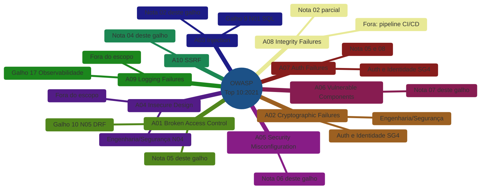

# OWASP Top 10 aplicado a Python web — o mapa

> [!abstract] TL;DR
> O **OWASP Top 10:2021** — a edição vigente — lista dez categorias de risco em aplicações web. Esta nota não desenvolve nenhuma delas a fundo: ela é o **mapa de navegação** deste galho, dizendo o que cada categoria significa numa API Python (Django/FastAPI/Flask) e apontando pra onde ir — dentro deste galho, na trilha [[03-Dominios/Engenharia/Auth e Identidade/index|Auth e Identidade]], ou em [[03-Dominios/Engenharia/Segurança/index|Engenharia/Segurança]]. Das dez categorias, cinco ganham nota dedicada aqui; três já vivem noutra trilha do vault; duas (A04 e A09, e parte de A08) ficam de fora por serem disciplina de arquitetura/observabilidade, não de código Python — e a nota explica por quê.

## O pentest que ninguém pediu

Uma API de tarefas passou seis meses em produção. Todo pull request teve *code review* — alguém sempre olhou a query, o schema Pydantic, o teste. O time se sentia confortável: "a gente revisa tudo, isso aqui é seguro." Então um cliente enterprise, antes de assinar contrato, exigiu um pentest externo.

O relatório voltou com quatro achados. Um endpoint de busca que aceitava `ORDER BY` vindo direto da query string, sem allowlist — injeção de identificador SQL. Um template Jinja2 renderizando um campo de "nome de exibição" com `|safe`, permitindo XSS armazenado. Uma variável de ambiente `DATABASE_URL` com a senha do banco de produção, commitada num `.env.example` que na verdade não era exemplo nenhum. E um endpoint de webhook que aceitava qualquer URL fornecida pelo cliente e fazia uma requisição HTTP pra ela sem validar destino — um SSRF de manual, capaz de ler `http://169.254.169.254/latest/meta-data/` (o endpoint de metadados da instância cloud) e vazar credenciais.

Nenhum desses quatro problemas era sutil. Nenhum exigia conhecimento exótico de exploit. Todos tinham nome e categoria no OWASP Top 10 — o documento que o time nunca tinha aberto, porque "a gente revisa tudo" e revisão funcional não é a mesma coisa que revisão de segurança. Um `code review` pergunta "isso funciona?"; um pentest pergunta "isso resiste a alguém tentando quebrar?" — são lentes diferentes, e só a segunda captura a classe de bug que este galho existe para prevenir.

> [!question]- Por que "a gente revisa tudo" não bastou?
> Porque revisão funcional otimiza pra um objetivo (o código faz o que deveria fazer no caminho feliz) e revisão de segurança otimiza pra outro (o código resiste a alguém tentando fazê-lo fazer o que **não** deveria). São lentes ortogonais. O `ORDER BY` sem allowlist *funcionava perfeitamente* pra todo usuário legítimo — o bug só aparece quando alguém testa deliberadamente um valor hostil. Segurança não emerge de "olhar o código com atenção"; emerge de perguntar sistematicamente "o que acontece se este input for adversarial?" — e o OWASP Top 10 é o checklist que estrutura essa pergunta por categoria de risco.

## O que é o OWASP Top 10

O **OWASP Top 10** é mantido pela Open Worldwide Application Security Project e lista as dez categorias de risco mais críticas em aplicações web, revisado periodicamente com base em dados reais de incidentes e pesquisa da comunidade. A edição vigente ao escrever esta nota é a **2021** (a próxima revisão major, 2025, ainda não é a referência padrão do mercado em 2026 — mas os nomes de categoria migram entre edições, então vale checar a fonte oficial antes de citar em entrevista).

> [!info] Não é um checklist exaustivo
> Cumprir as dez categorias não significa "aplicação segura" — significa que as classes de risco mais recorrentes foram consideradas. É um documento de *conscientização e priorização*, não uma certificação. Trate-o como vocabulário compartilhado entre quem escreve código e quem audita segurança, não como lista de tarefas a marcar.

As dez categorias da edição 2021, na ordem oficial:

- **A01** — Broken Access Control
- **A02** — Cryptographic Failures
- **A03** — Injection
- **A04** — Insecure Design
- **A05** — Security Misconfiguration
- **A06** — Vulnerable and Outdated Components
- **A07** — Identification and Authentication Failures
- **A08** — Software and Data Integrity Failures
- **A09** — Security Logging and Monitoring Failures
- **A10** — Server-Side Request Forgery (SSRF)

Este galho não reensina cada uma dessas categorias do zero — algumas já têm tratamento profundo em outras trilhas do vault, e repetir seria desperdício. O trabalho desta nota é **mapear**: para cada categoria, o que ela significa especificamente numa stack Python, e onde no vault ela é (ou será) desenvolvida.

## Como funciona: a leitura da tabela

A tabela abaixo é o núcleo desta nota. Ela cruza categoria OWASP × significado prático em Python × destino no vault. Leia a coluna "Destino" como um mapa de tesouro: cada linha te diz exatamente onde cavar quando o assunto aparecer de verdade — em produção, numa entrevista, ou num pentest como o do cenário de abertura.

| Categoria OWASP | O que significa numa API Python | Destino no vault |
|---|---|---|
| **A01 — Broken Access Control** | Endpoint sem checagem de posse do recurso (`/pedidos/42` retorna o pedido de outro usuário), rota administrativa exposta sem `permission_classes`, elevação de privilégio via campo não protegido no payload | [[05 - Autenticação e autorização na prática — a ponte com Auth e Identidade\|nota 05 deste galho]] (ponte com Auth e Identidade) + [[03-Dominios/Tecnologia/Python/Web e APIs REST/05 - Django REST Framework — serializers, viewsets e routers\|Galho 10 nota 05]] (`permission_classes` do DRF) |
| **A02 — Cryptographic Failures** | Senha em texto puro no banco, hash fraco (MD5/SHA1 sem salt) pra senha, segredo simétrico reutilizado entre ambientes, dado sensível sem TLS em trânsito | [[03-Dominios/Engenharia/Segurança/index\|Engenharia/Segurança]] — hashing criptográfico ([[03-Dominios/Engenharia/Segurança/06 - Hashing criptográfico\|nota 06]]), PKI e TLS ([[03-Dominios/Engenharia/Segurança/11 - PKI e certificados\|nota 11]]); a aplicação prática em Python já está em [[03-Dominios/Engenharia/Auth e Identidade/4 - Auth nos stacks/03 - Python — FastAPI\|Auth e Identidade SG4]] (`pwdlib`) |
| **A03 — Injection** | SQL injection (concatenação de string em query), SSTI em Jinja2/Django Templates, command injection via `subprocess.run(shell=True)`, deserialização insegura com `pickle.loads()` de fonte não confiável | SQL injection já coberto em [[03-Dominios/Tecnologia/Python/Persistência de dados/01 - SQLAlchemy Core — Engine, Connection e expressão SQL\|Galho 9 nota 01]]; SSTI, command injection e deserialização insegura em [[02 - Injeção — SQL, template, comando e deserialização insegura\|nota 02 deste galho]] |
| **A04 — Insecure Design** | Falta de threat modeling, fluxo de negócio que assume boa-fé do cliente (ex: preço calculado no frontend e aceito sem revalidação no backend) | Fora do escopo deste galho — é decisão de arquitetura anterior ao código, tratada em [[03-Dominios/Engenharia/Segurança/04 - Princípios de design seguro\|Engenharia/Segurança nota 04]] |
| **A05 — Security Misconfiguration** | `DEBUG=True` em produção, `SECRET_KEY` hardcoded, `.env` commitado, CORS com `allow_origins=["*"]`, mensagem de erro vazando stack trace | [[06 - Secrets e configuração segura\|nota 06 deste galho]] |
| **A06 — Vulnerable and Outdated Components** | Dependência de terceiros com CVE conhecido, `requirements.txt` sem pin de versão, typosquatting de pacote no PyPI | [[07 - Segurança de dependências e supply chain\|nota 07 deste galho]] |
| **A07 — Identification and Authentication Failures** | Senha fraca aceita sem política, ausência de rate limit no login, JWT sem expiração, sessão que não invalida no logout | Mecanismo (JWT/OAuth2) em [[03-Dominios/Engenharia/Auth e Identidade/index\|Auth e Identidade]] SG4; aplicação na API deste galho em [[05 - Autenticação e autorização na prática — a ponte com Auth e Identidade\|nota 05]]; brute force em [[08 - Rate limiting e proteção contra abuso\|nota 08]] |
| **A08 — Software and Data Integrity Failures** | Deserialização sem verificação de origem (sobreposto com A03), pipeline de CI/CD que instala dependência sem checar hash/assinatura, auto-update sem verificação de integridade | A face de deserialização insegura é coberta na [[02 - Injeção — SQL, template, comando e deserialização insegura\|nota 02]]; a face de pipeline/CI fica fora — é disciplina de build, não de código de aplicação |
| **A09 — Security Logging and Monitoring Failures** | Tentativas de login falhas não registradas, ausência de alerta para padrão anômalo de acesso, logs sem correlação entre requisição e usuário | Fora do escopo deste galho — é observabilidade de produção, tema do galho 17 (Observabilidade e produção) da [[03-Dominios/Tecnologia/Python/index\|trilha Python]], ainda planejado |
| **A10 — Server-Side Request Forgery (SSRF)** | Endpoint que aceita URL do cliente e faz requisição a partir do servidor sem validar destino, permitindo alcançar rede interna ou endpoint de metadados cloud | [[04 - Validação de input como controle de segurança\|nota 04 deste galho]] — explica por que validação de *tipo* não é validação de *destino*, e o que ela não previne |

> [!warning] A tabela não é ranking de gravidade
> A ordem A01→A10 reflete prevalência/impacto agregado medido pela OWASP em dados reais de incidentes — não é uma escala "A01 é sempre pior que A10 no seu sistema". Um SSRF (A10) que expõe metadados de instância cloud pode ser mais grave, num caso concreto, do que um Broken Access Control (A01) menor. Trate a numeração como índice, não como prioridade universal.

## O mapa em diagrama



Repare no padrão: as categorias com nó de destino **dentro deste galho** (A01, A03, A05, A06, A07, A10) são as que dependem de escolhas de código Python — biblioteca certa, padrão de query, validação de allowlist. As que apontam **para fora** (A02, A04, A09, parte de A08) são as que dependem de teoria agnóstica de linguagem, arquitetura anterior ao código, ou infraestrutura de observabilidade — o vault já cobre isso noutro lugar, e duplicar seria ruído, não profundidade.

## Dois vislumbres do que vem por aí

Esta nota não desenvolve código — isso é trabalho das notas 02 a 08. Mas dois recortes rápidos ajudam a tornar concreto por que cada categoria mapeada acima é um problema *de aplicação Python*, não uma abstração teórica.

O primeiro é o `ORDER BY` do cenário de abertura — a face de A03 que bind parameters **não** resolvem, porque bind parameters cobrem valores, não identificadores:

```python
# Vulnerável: o nome da coluna vem direto do cliente
coluna = request.query_params.get("ordenar_por", "id")
query = f"SELECT * FROM tarefas ORDER BY {coluna}"  # nenhum bind parameter salva isso

# Defesa: allowlist explícita de identificadores permitidos
COLUNAS_PERMITIDAS = {"id", "titulo", "criado_em"}
if coluna not in COLUNAS_PERMITIDAS:
    raise ValueError(f"coluna de ordenação inválida: {coluna}")
query = f"SELECT * FROM tarefas ORDER BY {coluna}"  # agora seguro — valor vem de um conjunto fechado
```

O segundo é o SSRF do webhook — a categoria A10, que nenhuma validação de *tipo* (Pydantic incluso) intercepta sozinha, porque `str` é um tipo válido tanto para `https://api.parceiro.com/callback` quanto para `http://169.254.169.254/latest/meta-data/`:

```python
from pydantic import BaseModel, HttpUrl

class WebhookConfig(BaseModel):
    callback_url: HttpUrl  # valida que É uma URL bem-formada — não valida PRA ONDE ela aponta
```

`HttpUrl` garante formato, não destino. Um atacante pode fornecer uma URL sintaticamente perfeita apontando para a rede interna ou para o endpoint de metadados da instância cloud — e o Pydantic, corretamente, não vê nada de errado, porque não é trabalho dele saber que aquele IP é privilegiado. A nota 04 deste galho desenvolve a defesa real: resolução de DNS explícita + checagem de IP contra faixas privadas antes de qualquer requisição sair do servidor.

> [!question]- Se Pydantic não previne SSRF, por que ele aparece na tabela de A10?
> Ele não aparece como *defesa* de A10 — aparece como o lugar onde a confusão nasce. Muita gente assume que "o campo tem `HttpUrl`, então tá validado" e para por aí. A nota 04 existe justamente para separar essas duas camadas: validação de forma (Pydantic resolve) e validação de destino (Pydantic não resolve, e exige lógica adicional). Confundir as duas é o erro mais comum que este mapa tenta prevenir.

## Armadilhas comuns ao usar este mapa

> [!warning] "Meu framework já resolve isso"
> **O que acontece:** o time assume que, por usar Django ou FastAPI, várias categorias do Top 10 já estão cobertas por padrão — e para de verificar. **Por quê:** frameworks Python têm bons defaults (Django escapa HTML por padrão, SQLAlchemy usa bind parameters por padrão), mas *default* não é *garantia incondicional*. Escape hatches existem (`|safe`, `.raw()`, `text()` com f-string) e são usados sob pressão de prazo, sem que ninguém perceba que reabriram a vulnerabilidade. **Como evitar:** tratar cada uso de escape hatch como uma decisão consciente e revisada, nunca como atalho silencioso — e testar authorization/injection explicitamente, não assumir que o framework cobre.

> [!warning] Tratar o Top 10 como as únicas dez formas de quebrar o sistema
> **O que acontece:** o time audita contra as dez categorias, encontra zero problemas, e declara "estamos seguros". **Por quê:** o Top 10 é o conjunto das categorias mais *prevalentes* segundo dados agregados da comunidade OWASP — não o conjunto de todas as categorias possíveis. Lógica de negócio abusada de forma específica ao domínio (ex: aplicar um cupom de desconto duas vezes por uma race condition) frequentemente não cabe limpo em nenhuma das dez. **Como evitar:** usar o Top 10 como piso, não como teto. Ele estrutura a conversa inicial de segurança; não substitui threat modeling específico do seu domínio de negócio (A04, que este galho não desenvolve por esse exato motivo).

## Como explicar em inglês

> "I use the OWASP Top 10:2021 as a map, not a checklist — it tells me which risk category a bug belongs to and where the concrete defense lives in my stack. In Python that means: SQL injection is closed structurally by bind parameters in SQLAlchemy, not by string escaping; template injection and insecure deserialization are the categories most specific to Python's dynamic nature; and validation with Pydantic closes type-level risk but doesn't close destination-level risk like SSRF — those need a separate check. The categories I don't try to solve at the code level, like insecure design or logging failures, I route to architecture and observability instead of forcing a framework-level fix that doesn't actually exist."

| PT | EN |
|----|----|
| categoria de risco | risk category |
| checklist de conscientização | awareness checklist |
| validação de forma vs. de destino | format validation vs. destination validation |
| allowlist de identificadores | identifier allowlist |
| escape hatch (do framework) | framework escape hatch |
| threat modeling | threat modeling |

## O que fica fora — e por quê

Três categorias merecem uma palavra a mais sobre a fronteira, porque "fora do escopo" sem explicação parece preguiça — e não é.

**A04 — Insecure Design** é sobre decisões tomadas *antes* da primeira linha de código: threat modeling, modelagem de fluxo de confiança, a pergunta "o que um atacante ganharia se este fluxo de negócio fosse abusado?". Isso é disciplina de arquitetura de sistema, não de framework Python — o Django não tem opinião sobre se seu fluxo de checkout deveria revalidar preço no backend. [[03-Dominios/Engenharia/Segurança/04 - Princípios de design seguro|Engenharia/Segurança nota 04]] trata os princípios (least privilege, fail secure, defense-in-depth) de forma agnóstica de linguagem; aplicá-los é trabalho de design de cada sistema, não algo que uma nota de trilha Python consiga ensinar em abstrato.

**A09 — Security Logging and Monitoring Failures** é sobre *observabilidade*: registrar eventos de autenticação/autorização, correlacionar logs, alertar em anomalia. Isso pertence à disciplina de operação de sistemas em produção — monitoramento, alerting, dashboards — que é tema do galho 17 (Observabilidade e produção) da [[03-Dominios/Tecnologia/Python/index|trilha Python]], não deste galho de Segurança. Colocar aqui seria antecipar conteúdo que ainda não tem base (logging estruturado, métricas) construída.

**A08 — Software and Data Integrity Failures** tem duas faces, e só uma pertence a este galho. A face de "deserializar dado não confiável sem verificar origem" é a mesma vulnerabilidade tratada como injection na [[02 - Injeção — SQL, template, comando e deserialização insegura|nota 02]] — `pickle.loads()` de uma fonte não confiável é ao mesmo tempo A03 e A08, e a nota 02 cobre o mecanismo. A outra face — pipeline de CI/CD que instala dependência sem verificar hash/assinatura, artefato de build adulterado — é disciplina de infraestrutura de entrega, fora do que uma trilha de linguagem consegue ensinar sem virar curso de DevOps.

> [!tip] A honestidade da lacuna é parte do mapa
> Um mapa que finge cobrir tudo é pior que um mapa que marca "aqui não fui" — porque o segundo te avisa onde procurar ajuda externa. As três categorias acima não são "menos importantes"; são categorias cuja defesa não mora em código Python de aplicação, e fingir o contrário produziria uma nota rasa em vez de um apontamento honesto.

## Como este mapa se conecta ao resto do vault

Vale reforçar as três fronteiras já cravadas no [[index|índice deste galho]], porque elas explicam por que a tabela acima aponta tanto pra fora quanto pra dentro:

- **Autenticação/autorização em profundidade** (JWT, OAuth2, sessões) mora em [[03-Dominios/Engenharia/Auth e Identidade/index|Auth e Identidade]], sub-galho 4. Este galho não reexplica `pyjwt` nem `OAuth2PasswordBearer` — a nota 05 só amarra esse mecanismo à API construída no [[03-Dominios/Tecnologia/Python/Web e APIs REST/index|Galho 10]].
- **Conceitos criptográficos genéricos** (hashing, PKI, MAC/HMAC) moram em [[03-Dominios/Engenharia/Segurança/index|Engenharia/Segurança]]. Este galho é a *aplicação* Python desses conceitos, nunca a teoria.
- **Validação com Pydantic** (mecânica de `BaseModel`/`Field`) já foi ensinada no [[03-Dominios/Tecnologia/Python/Web e APIs REST/03 - Validação e serialização com Pydantic|Galho 10 nota 03]]. A nota 04 deste galho revisita o mesmo Pydantic sob lente de segurança — o que ele previne e o que não previne — sem repetir a API.

Essas três fronteiras existem por um motivo simples: quando um assunto já tem uma casa profunda no vault, a escolha certa é linkar, não reescrever.

## O que vem a seguir

Esta nota deu o mapa; as próximas cinco preenchem o território que é específico de Python e ainda não tem casa no vault. A ordem segue a lógica de dependência: injeção primeiro (porque é o vetor mais comum em código de aplicação), depois XSS/CSRF (a superfície do lado do template/browser), depois validação como controle (o que Pydantic garante e o que não garante), depois a ponte com autenticação real (agora que já ficou claro onde ela mora), fechando o bloco Adepto.

- [[02 - Injeção — SQL, template, comando e deserialização insegura|02 — Injeção: SQL, template, comando e deserialização insegura]] — o A03 do mapa, desenvolvido: SSTI, command injection e `pickle` inseguro.
- [[03 - XSS e CSRF nos frameworks Python|03 — XSS e CSRF nos frameworks Python]] — autoescape, `|safe`/`mark_safe`, e por que APIs JWT-em-header são naturalmente imunes a CSRF.
- [[04 - Validação de input como controle de segurança|04 — Validação de input como controle de segurança]] — Pydantic sob lente de segurança, e o A10 (SSRF) que validação de tipo sozinha não resolve.
- [[05 - Autenticação e autorização na prática — a ponte com Auth e Identidade|05 — Autenticação e autorização na prática: a ponte com Auth e Identidade]] — o A01 e o A07 do mapa, amarrados à API do Galho 10.
- [[06 - Secrets e configuração segura|06 — Secrets e configuração segura]] — o A05 do mapa, aprofundado.

## Fontes

- **OWASP** — [*OWASP Top 10:2021*](https://owasp.org/Top10/) — fonte primária; a taxonomia e a ordenação por prevalência/impacto usadas nesta nota vêm diretamente daqui.
- **OWASP** — [*OWASP Top 10 — Project*](https://owasp.org/www-project-top-ten/) — página do projeto, com histórico de edições anteriores (2017, 2013…) pra quem quiser comparar como categorias migraram.
- **Real Python** — [*Preventing SQL Injection Attacks With Python*](https://realpython.com/prevent-python-sql-injection/) — referência prática de A03 em Python, base do aprofundamento na nota 02.
- **OWASP Cheat Sheet Series** — [*Server Side Request Forgery Prevention Cheat Sheet*](https://cheatsheetseries.owasp.org/cheatsheets/Server_Side_Request_Forgery_Prevention_Cheat_Sheet.html) — referência de A10, base da nota 04.

Consultado em 2026-07-11.
