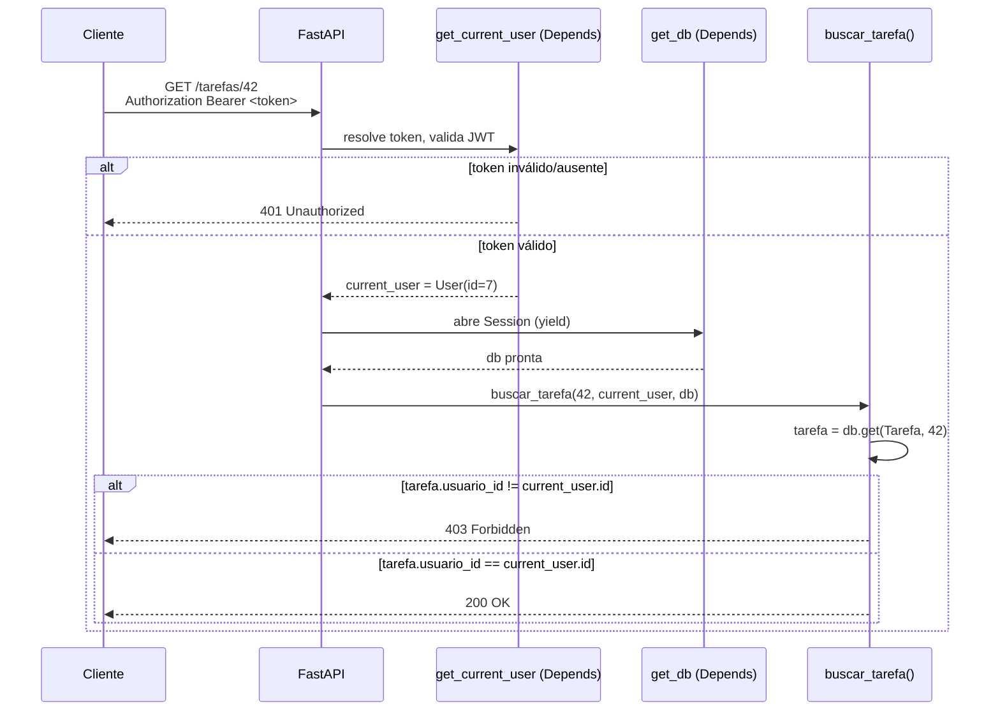

# Autenticação e autorização na prática — a ponte com Auth e Identidade

> [!abstract] TL;DR
> Esta nota não ensina JWT, OAuth2 nem sessão — isso já está resolvido, com código real, em [[03-Dominios/Engenharia/Auth e Identidade/4 - Auth nos stacks/03 - Python — FastAPI|Auth e Identidade SG4, Python — FastAPI]] e [[03-Dominios/Engenharia/Auth e Identidade/4 - Auth nos stacks/02 - Python — Django|Python — Django]]. O trabalho aqui é mais estreito e mais perigoso de pular: mostrar onde `Depends(get_current_user)` se encaixa no pipeline de dependências que o [[03-Dominios/Tecnologia/Python/Web e APIs REST/04 - Injeção de dependência no FastAPI — Depends|Galho 10, nota 04]] já ensinou, como um `401`/`403` se encaixa no contrato de erro que a [[03-Dominios/Tecnologia/Python/Web e APIs REST/06 - Tratamento de erros e respostas HTTP padronizadas|nota 06]] já propôs — e, principalmente, expor o bug que nenhuma das duas notas cobre: verificar que o token é válido (autenticação) não verifica que o dono do token pode acessar **este** recurso específico (autorização de posse). É o A01 — Broken Access Control do [[01 - OWASP Top 10 aplicado a Python web — o mapa|mapa deste galho]], e é a falha mais comum e mais barata de introduzir em qualquer API que cresce endpoint a endpoint.

> [!question]- Perguntas que esta nota responde
> - Onde exatamente `Depends(get_current_user)` entra na árvore de dependências de um endpoint real do Galho 10?
> - Como um `HTTPException(401)`/`HTTPException(403)` vira o mesmo envelope `type`/`title`/`status`/`detail` que o resto da API já usa?
> - Por que "o endpoint checa `Depends(get_current_user)`" não é o mesmo que "o endpoint está seguro"?
> - Qual é, na prática, o código vulnerável de Broken Access Control — e qual é a correção de uma linha que fecha o buraco?
> - `permission_classes` do DRF resolve o mesmo problema, ou é uma armadilha diferente?

## O pentest que achou o óbvio

A API de tarefas do [[03-Dominios/Tecnologia/Python/Web e APIs REST/09 - Capstone — uma API REST completa de ponta a ponta|capstone do Galho 10]] está em produção há dois meses. Toda rota sensível tem `Depends(get_current_user)` na assinatura — o time seguiu à risca o padrão de [[03-Dominios/Engenharia/Auth e Identidade/4 - Auth nos stacks/03 - Python — FastAPI|Auth e Identidade SG4]], token JWT validado, `401` devolvido para quem não está logado. Em code review, ninguém encontrou problema: "toda rota que precisa de usuário logado, tem `Depends(get_current_user)`. Está protegida."

O pentest contratado antes de fechar um cliente enterprise (o mesmo cenário de abertura do [[01 - OWASP Top 10 aplicado a Python web — o mapa|mapa deste galho]]) discordou. O analista fez login com uma conta de teste, criou uma tarefa, recebeu `{"id": 41, "titulo": "...", "usuario_id": 7}` — e então rodou isto, sem trocar nenhuma credencial:

```bash
curl -H "Authorization: Bearer $TOKEN_DA_CONTA_DE_TESTE" \
     https://api.exemplo.com/tarefas/42
```

`42` não era uma tarefa da conta de teste — era de outro usuário, escolhido só por estar um número acima de `41`. A resposta voltou `200 OK`, com o título completo da tarefa alheia. O endpoint:

```python
@app.get("/tarefas/{tarefa_id}")
def buscar_tarefa(
    tarefa_id: int,
    current_user: Annotated[User, Depends(get_current_user)],
    db: Session = Depends(get_db),
):
    tarefa = db.get(Tarefa, tarefa_id)
    if tarefa is None:
        raise HTTPException(status_code=404, detail="Tarefa não encontrada")
    return tarefa
```

`Depends(get_current_user)` está lá. A rota exige um token válido — sem ele, `401`. Mas depois que o token passa, `current_user` nunca é usado para nada além de existir na assinatura: a busca (`db.get(Tarefa, tarefa_id)`) não filtra por dono, então qualquer usuário autenticado — não importa quem — pode ler qualquer tarefa de qualquer outro usuário só sabendo (ou adivinhando, ou incrementando) o `id`.

> [!bug] O que está quebrado, em uma frase
> O endpoint responde corretamente à pergunta "você está logado?" e nunca faz a pergunta seguinte, "você é dono **deste** recurso?" — e a segunda pergunta é a que realmente protege o dado.

> [!warning] Autenticado não é autorizado — e essa frase é o resumo do achado A01 mais comum em pentest
> `Depends(get_current_user)` resolve identidade: quem está fazendo a requisição. Isso é necessário, mas nunca suficiente. Autorização é uma pergunta separada — **dado que sei quem você é, você pode fazer isso, com este recurso específico?** — e ela não vem de graça junto com a autenticação. Um endpoint pode estar 100% correto do ponto de vista de "exige login" e 100% quebrado do ponto de vista de "não vaza dado de terceiros". São duas camadas, e confundir "protegi a rota" com "protegi o recurso" é exatamente o erro que a OWASP registra como **A01 — Broken Access Control**, a categoria de maior prevalência do Top 10:2021.

O resto desta nota resolve esse achado — primeiro nomeando onde a autenticação já resolvida se encaixa no que o Galho 10 já ensinou, depois desenvolvendo a correção da autorização de posse, que é o ponto original desta nota.

## Recapitulando (sem reensinar): onde o mecanismo de auth já está pronto

Duas notas de outra trilha já resolveram o **como** — a assinatura, os claims, o ciclo de vida do token:

- **FastAPI** — [[03-Dominios/Engenharia/Auth e Identidade/4 - Auth nos stacks/03 - Python — FastAPI|Auth e Identidade SG4, Python — FastAPI]] mostra `OAuth2PasswordBearer` extraindo o token do header, `PyJWT` decodificando e validando assinatura/expiração/`aud`/`iss`, e a dependência `get_current_user` que devolve um `User` ou levanta `HTTPException(401)`. É exatamente essa função que esta nota reusa a partir de agora, sem repetir uma linha do mecanismo interno dela.
- **Django** — [[03-Dominios/Engenharia/Auth e Identidade/4 - Auth nos stacks/02 - Python — Django|Auth e Identidade SG4, Python — Django]] cobre sessão nativa (`django.contrib.auth`) para o painel server-rendered e `SimpleJWT`/`mozilla-django-oidc` para a API DRF — o par exato de `authentication_classes` que a [[03-Dominios/Tecnologia/Python/Web e APIs REST/05 - Django REST Framework — serializers, viewsets e routers|nota 05 deste Galho 10]] já nomeou, sem desenvolver.

Nenhuma das duas notas resolve o problema desta seção: **depois** que o usuário está identificado, quem decide se ele pode tocar em um recurso específico?

## Onde `Depends(get_current_user)` entra na árvore do Galho 10

A [[03-Dominios/Tecnologia/Python/Web e APIs REST/04 - Injeção de dependência no FastAPI — Depends|nota 04 do Galho 10]] já tinha adiantado isso, de raspão, numa seção chamada "Autenticação: `Depends()` é o mecanismo, não o conteúdo" — uma dependência de auth é só mais um nó na mesma árvore que resolve `db: Session = Depends(get_db)`, sem tratamento especial. Aqui a árvore fica completa, com o conteúdo real que a nota 04 deixou como placeholder:

```python
from typing import Annotated

from fastapi import APIRouter, Depends, HTTPException
from sqlalchemy.orm import Session

from .auth import get_current_user, User    # mecanismo de Auth e Identidade SG4
from .db import get_db                       # Galho 10, nota 04
from .models import Tarefa

router = APIRouter()


@router.get("/tarefas/{tarefa_id}")
def buscar_tarefa(
    tarefa_id: int,
    current_user: Annotated[User, Depends(get_current_user)],
    db: Session = Depends(get_db),
):
    tarefa = db.get(Tarefa, tarefa_id)
    if tarefa is None:
        raise HTTPException(status_code=404, detail="Tarefa não encontrada")
    if tarefa.usuario_id != current_user.id:
        raise HTTPException(status_code=403, detail="Você não tem acesso a esta tarefa")
    return tarefa
```

Repare no que muda de pouco para muito importante: `current_user` deixa de ser um parâmetro decorativo (presente só para forçar `401` em quem não tem token) e passa a **ser usado** dentro do corpo do handler, na comparação `tarefa.usuario_id != current_user.id`. É essa linha — uma linha — que separa o endpoint vulnerável do incidente de abertura do endpoint corrigido. A árvore de dependências, resolvida pelo FastAPI antes de `buscar_tarefa` rodar, é:



`get_current_user` responde "quem é você" e devolve `401` se não souber; a checagem de posse dentro do handler responde "você pode ver isto" e devolve `403` se a resposta for não. As duas checagens moram em camadas diferentes da mesma árvore — a primeira é uma dependência reaproveitável em toda rota autenticada; a segunda é específica de cada recurso, porque só o handler sabe qual é a regra de posse daquele recurso em particular.

> [!question]- Por que não colocar a checagem de posse dentro de uma dependência também, em vez de no handler?
> Dá, e em APIs maiores costuma valer a pena — uma dependência `get_tarefa_do_usuario(tarefa_id: int, current_user: Annotated[User, Depends(get_current_user)], db: Session = Depends(get_db))` que já busca o objeto, checa posse, e levanta `404`/`403` conforme o caso, devolvendo a `Tarefa` já validada para o handler. O ganho é reaproveitar a checagem em `GET`, `PUT`, `DELETE` do mesmo recurso sem repetir a lógica três vezes. O ponto que esta nota fixa primeiro é o mais simples — a checagem dentro do próprio handler — porque é a forma mais direta de entender **que** a checagem precisa existir; a extração para dependência reaproveitável é uma refatoração de duplicação, não uma correção de segurança adicional.

## Onde `401`/`403` se encaixam no contrato de erro do Galho 10

A [[03-Dominios/Tecnologia/Python/Web e APIs REST/06 - Tratamento de erros e respostas HTTP padronizadas|nota 06 do Galho 10]] já nomeou, numa pergunta de leitor, que 401/403 "passam pelo mesmo pipeline de exception handler descrito ali" — sem desenvolver o handler em si, porque o mecanismo de autenticação ainda não tinha sido apresentado. Aqui está o handler que fecha esse ponto em aberto, seguindo exatamente o mesmo envelope `type`/`title`/`status`/`detail` que a nota 06 já fixou para 404/409/422/500:

```python
from fastapi import Request
from fastapi.responses import JSONResponse

from .auth import NaoAutenticado, SemPermissao   # exceções de domínio, sem import de FastAPI


@app.exception_handler(NaoAutenticado)
def tratar_nao_autenticado(request: Request, exc: NaoAutenticado):
    return JSONResponse(
        status_code=401,
        content={
            "type": "nao-autenticado",
            "title": "Autenticação necessária",
            "status": 401,
            "detail": "Token ausente, expirado ou inválido.",
            "instance": str(request.url),
        },
        headers={"WWW-Authenticate": "Bearer"},
    )


@app.exception_handler(SemPermissao)
def tratar_sem_permissao(request: Request, exc: SemPermissao):
    return JSONResponse(
        status_code=403,
        content={
            "type": "sem-permissao",
            "title": "Acesso negado",
            "status": 403,
            "detail": str(exc) or "Você não tem permissão para acessar este recurso.",
            "instance": str(request.url),
        },
    )
```

Duas decisões deliberadas aqui, ecoando o que a nota 06 já ensinou para outros tipos de erro:

1. **Exceção de domínio, não `HTTPException` direto.** `get_current_user` (código de Auth e Identidade SG4) pode continuar levantando `HTTPException(401)` como já mostrado lá — é o caminho mais simples e o FastAPI já sabe convertê-lo numa resposta. Mas se o projeto adota o envelope único da nota 06 para *toda* a API, o mesmo padrão de "exceção de domínio pura + `@app.exception_handler`" se aplica aqui: `NaoAutenticado`/`SemPermissao` como classes Python comuns, sem nenhum import de FastAPI, traduzidas centralmente. É a mesma separação entre `ProdutoNaoEncontrado`/`EstoqueInsuficiente` que a nota 06 já desenvolveu — só aplicada às duas exceções que faltavam no seu catálogo.
2. **`detail` genérico em 401, específico em 403.** Repare que `tratar_nao_autenticado` nunca diz *por que* o token falhou (expirado? assinatura inválida? ausente?) — dizer isso ajudaria um atacante a calibrar o próximo ataque. `tratar_sem_permissao`, por outro lado, pode ser mais específico, porque quem recebe um 403 já provou identidade (passou pela autenticação); a mensagem "você não é dono desta tarefa" não vaza nada que o requisitante já não soubesse sobre si mesmo.

> [!tip] O status code também é uma decisão de segurança, não só de semântica HTTP
> Uma prática defendível (e às vezes exigida por auditoria) é devolver `404` em vez de `403` quando o recurso existe mas pertence a outro usuário — para não confirmar a um atacante que o `id` que ele está testando corresponde a um recurso real. A troca é um trade-off: `403` é mais honesto sobre o que aconteceu e mais fácil de depurar; `404` esconde a existência do recurso, fechando um vetor de enumeração. A decisão depende do quanto a existência de um `id` numérico sequencial já é, por si só, informação sensível no seu domínio — para a maioria das APIs internas, `403` é suficiente; para APIs que expõem dados sensíveis a terceiros, `404` uniforme é a escolha mais conservadora.

## O ponto central: autorização de posse de recurso

Esta é a parte que nem [[03-Dominios/Engenharia/Auth e Identidade/4 - Auth nos stacks/03 - Python — FastAPI|Auth e Identidade SG4]] nem o [[03-Dominios/Tecnologia/Python/Web e APIs REST/index|Galho 10]] cobrem — porque nenhuma das duas trilhas tinha, ainda, um recurso concreto com dono para proteger. É o **A01 — Broken Access Control** do [[01 - OWASP Top 10 aplicado a Python web — o mapa|mapa deste galho]], na forma mais comum que ele assume em código Python real.

### O padrão vulnerável, generalizado

O incidente de abertura não é um bug exótico — é o padrão-fantasma que aparece toda vez que alguém escreve "buscar por id" sem se perguntar "de quem":

```python
# VULNERÁVEL — qualquer usuário autenticado acessa qualquer tarefa
@router.get("/tarefas/{tarefa_id}")
def buscar_tarefa(
    tarefa_id: int,
    current_user: Annotated[User, Depends(get_current_user)],
    db: Session = Depends(get_db),
):
    tarefa = db.get(Tarefa, tarefa_id)
    if tarefa is None:
        raise HTTPException(status_code=404, detail="Tarefa não encontrada")
    return tarefa   # current_user nunca é comparado com tarefa.usuario_id
```

O mesmo bug se replica, sem exceção, em `PUT`/`PATCH`/`DELETE` — e nesses verbos o dano é maior, porque o atacante não só lê dado alheio, edita ou apaga:

```python
# VULNERÁVEL — qualquer usuário autenticado apaga a tarefa de qualquer outro
@router.delete("/tarefas/{tarefa_id}", status_code=204)
def deletar_tarefa(
    tarefa_id: int,
    current_user: Annotated[User, Depends(get_current_user)],
    db: Session = Depends(get_db),
):
    tarefa = db.get(Tarefa, tarefa_id)
    if tarefa is None:
        raise HTTPException(status_code=404, detail="Tarefa não encontrada")
    db.delete(tarefa)
    db.commit()
```

### A correção: filtrar por dono, não só buscar pelo id

A correção não é sofisticada — é disciplinada. Toda operação que busca um recurso por `id` filtra também pelo dono, na própria query, em vez de buscar primeiro e comparar depois:

```python
# CORRIGIDO — a query já nasce restrita ao dono, não confia em checagem posterior
@router.get("/tarefas/{tarefa_id}")
def buscar_tarefa(
    tarefa_id: int,
    current_user: Annotated[User, Depends(get_current_user)],
    db: Session = Depends(get_db),
):
    tarefa = (
        db.query(Tarefa)
        .filter(Tarefa.id == tarefa_id, Tarefa.usuario_id == current_user.id)
        .first()
    )
    if tarefa is None:
        raise HTTPException(status_code=404, detail="Tarefa não encontrada")
    return tarefa


@router.delete("/tarefas/{tarefa_id}", status_code=204)
def deletar_tarefa(
    tarefa_id: int,
    current_user: Annotated[User, Depends(get_current_user)],
    db: Session = Depends(get_db),
):
    tarefa = (
        db.query(Tarefa)
        .filter(Tarefa.id == tarefa_id, Tarefa.usuario_id == current_user.id)
        .first()
    )
    if tarefa is None:
        raise HTTPException(status_code=404, detail="Tarefa não encontrada")
    db.delete(tarefa)
    db.commit()
```

Repare que a tarefa de outro usuário agora devolve `404`, não `403` — porque a própria query nunca a encontra (a linha `Tarefa.usuario_id == current_user.id` a exclui do resultado antes mesmo de o handler decidir o que responder). É a variante "404 uniforme" citada no callout de segurança acima, e ela surge naturalmente desta forma de escrever a query — sem precisar de uma decisão extra sobre qual status code usar.

> [!question]- E se eu preciso do 403 explícito (ex: para dar uma mensagem diferente de "não encontrado")?
> Aí a versão de duas etapas do início da nota — buscar por `id` sozinho, depois comparar `tarefa.usuario_id != current_user.id` e levantar `403` — é a forma certa, contanto que a comparação **exista** e não seja esquecida. A armadilha real não é "buscar em duas etapas versus buscar filtrado" — as duas são seguras se implementadas corretamente. A armadilha é buscar em duas etapas e **esquecer** a segunda etapa, que é exatamente o bug do incidente de abertura. Buscar já filtrado por dono (a versão desta seção) tem uma vantagem estrutural: é estruturalmente impossível esquecer a checagem, porque ela é parte da própria query que busca o dado — não uma linha extra que alguém precisa lembrar de adicionar depois.

### Por que isso escapa de code review com tanta facilidade

O incidente de abertura já nomeou o porquê, mas vale generalizar: o endpoint **funciona** perfeitamente para todo usuário legítimo testando o próprio fluxo — ninguém, no caminho feliz, tenta acessar o `id` de outra pessoa. `Depends(get_current_user)` presente na assinatura passa uma inspeção visual rápida como "está protegido", porque o reviewer lê "existe uma dependência de auth aqui" e não necessariamente rastreia se o valor retornado por ela é **usado** dentro do corpo da função. É o mesmo tipo de lacuna cognitiva que o `fields = "__all__"` do [[03-Dominios/Tecnologia/Python/Web e APIs REST/05 - Django REST Framework — serializers, viewsets e routers|Galho 10, nota 05]] explora — a superfície de erro não é visível numa leitura rápida do código; só aparece quando alguém testa deliberadamente um input adversarial (o `id` de outra pessoa), que é exatamente o que um pentest existe para fazer e um code review funcional raramente faz.

## O mesmo princípio no lado Django: `permission_classes`

A [[03-Dominios/Tecnologia/Python/Web e APIs REST/05 - Django REST Framework — serializers, viewsets e routers|nota 05 do Galho 10]] já nomeou `permission_classes` como a peça DRF que decide "o que essa identidade pode fazer" — sem desenvolver, porque o assunto era `Serializer`/`ViewSet`/`Router`. O princípio é idêntico ao do FastAPI: `IsAuthenticated` (RBAC coarse-grained, `django.contrib.auth`) responde "está logado?", mas não responde "é dono deste objeto?" — essa segunda pergunta exige `has_object_permission`, implementado numa `BasePermission` customizada, ou o filtro de `get_queryset` já mostrado na nota 05 (`Tarefa.objects.filter(criado_por=self.request.user)`), que tem a mesma vantagem estrutural da versão FastAPI filtrada por dono: a query nunca alcança o objeto de outro usuário, então não há checagem posterior para esquecer.

## Armadilhas comuns

> [!warning] Confiar que `Depends(get_current_user)` (ou `IsAuthenticated`) "já protege a rota"
> **O que acontece:** o endpoint declara a dependência de auth, passa em todo teste do caminho feliz, e ninguém verifica se o valor de `current_user` é de fato usado para filtrar o recurso acessado. **Por quê:** autenticação e autorização são duas perguntas diferentes — "quem é você" nunca implica "o que você pode tocar". A presença da dependência de auth na assinatura é necessária, mas visualmente indistinguível, numa leitura rápida de code review, de uma checagem de posse que nunca foi escrita. **Como evitar:** toda rota que recebe um `id` de recurso via path/query filtra a busca desse recurso pelo dono (ou pela regra de posse aplicável), na própria query — nunca busca "solto" e confia numa comparação manual que pode ser esquecida.

> [!warning] Testar autorização só com a própria conta
> **O que acontece:** a suíte de testes (e o code review) sempre usa uma única conta de teste — o fluxo "eu crio, eu leio, eu edito, eu apago" nunca exercita o cenário "usuário B tenta acessar recurso do usuário A". **Por quê:** Broken Access Control é, por definição, um bug que só aparece quando duas identidades diferentes interagem com o mesmo recurso — um teste de caminho feliz com uma única conta nunca vai encontrar esse bug, porque o cenário adversarial nunca é exercitado. **Como evitar:** todo endpoint que opera sobre um recurso com dono ganha, na suíte de testes, pelo menos um caso "usuário B tenta `GET`/`PUT`/`DELETE` num recurso do usuário A, espera `403`/`404`" — não é opcional, é o teste que teria pego o incidente de abertura antes do pentest.

> [!warning] Elevação de privilégio via campo aceito sem filtro no payload
> **O que acontece:** um endpoint de atualização (`PUT`/`PATCH`) aceita o corpo inteiro do JSON e grava direto no modelo, incluindo um campo como `usuario_id` ou `is_admin` que o cliente não deveria poder alterar. **Por quê:** é a mesma família de A01 — o controle de acesso falha não porque falta autenticação, mas porque o servidor confia demais no que o cliente envia, deixando o cliente "reatribuir" um recurso a si mesmo ou se autopromover. **Como evitar:** o schema de entrada (Pydantic `BaseModel` de update, ou `Serializer` do DRF com `fields` explícito) nunca inclui campos que definem posse ou privilégio — esses campos são atribuídos pelo servidor (`current_user.id`, nunca um valor vindo do payload), o mesmo princípio de "peneira declarativa" que a nota 05 do Galho 10 já ensinou para vazamento de saída, aplicado aqui à entrada.

## Checklist: autenticado ≠ autorizado

- [ ] Toda rota que recebe um `id` de recurso via path/query filtra a busca por dono (ou regra de posse), na própria query — não busca solto e compara depois?
- [ ] `current_user` (ou `request.user`) é efetivamente **usado** dentro do corpo do handler, não só declarado na assinatura para forçar `401`?
- [ ] `PUT`/`PATCH`/`DELETE` do mesmo recurso repetem a mesma checagem de posse que o `GET` já tem — não é seguro assumir que só leitura precisa de proteção?
- [ ] O schema de entrada nunca aceita campos que definem posse (`usuario_id`) ou privilégio (`is_admin`) vindos do payload do cliente?
- [ ] Existe pelo menos um teste automatizado por endpoint sensível simulando "usuário B tenta acessar recurso do usuário A"?
- [ ] `401`/`403` seguem o mesmo envelope de erro (`type`/`title`/`status`/`detail`) do resto da API, sem vazar detalhe que ajude um atacante a calibrar o próximo passo?
- [ ] No lado Django, `permission_classes`/`get_queryset` aplicam o mesmo filtro por dono que a versão FastAPI aplica na query — não confiam só em `IsAuthenticated`?

## Em entrevista

A pergunta mais reveladora aqui não é "o que é autenticação" — é **"seu endpoint tem `Depends(get_current_user)`. Isso é suficiente para protegê-lo?"** Uma resposta fraca diz "sim, porque exige login". Uma resposta forte separa as duas camadas: "não — `Depends(get_current_user)` resolve autenticação, garante que sei quem está fazendo a requisição. Autorização é uma pergunta separada: dado que sei quem você é, você pode tocar neste recurso específico? Se a query que busca o recurso não filtra por dono, qualquer usuário autenticado acessa qualquer recurso de qualquer outro, só variando o `id` na URL — é a categoria A01, Broken Access Control, do OWASP Top 10, e é sistematicamente a categoria de maior prevalência em pentests reais, precisamente porque passa despercebida em code review funcional."

## Como explicar em inglês

> "Authentication answers 'who are you' — authorization answers 'what can you touch, given who you are' — and confusing the two is the single most common Broken Access Control bug I see in real APIs. `Depends(get_current_user)` on a FastAPI route, or `IsAuthenticated` on a DRF view, only proves the first question was answered. If the query that fetches a resource by ID doesn't also filter by ownership, any authenticated user can read, edit, or delete any other user's data just by varying the ID in the URL — the fix is one line, but it has to be a line someone remembers to write, which is exactly why filtering ownership directly into the query, instead of fetching first and comparing after, is the more defensible pattern: it's structurally impossible to forget."

| PT | EN |
|----|----|
| autorização de posse de recurso | resource ownership authorization |
| controle de acesso quebrado | broken access control |
| checagem de posse | ownership check |
| elevação de privilégio | privilege escalation |
| enumeração de recurso | resource enumeration |
| filtrar por dono | scope by owner |

## O que vem a seguir

Esta nota fecha o A01/A07 do mapa deste galho, amarrando autenticação (já resolvida em Auth e Identidade) e autorização de posse (o ponto original desta nota) à API concreta do Galho 10. A próxima nota do galho troca a lente: de "quem pode acessar o quê" para "que segredo de configuração nunca deveria vazar" — o `SECRET_KEY` hardcoded, o `.env` commitado, a `DATABASE_URL` em texto puro que o pentest do mapa também encontrou.

- [[06 - Secrets e configuração segura|06 — Secrets e configuração segura]] — próxima nota deste galho, o A05 do mapa.
- [[01 - OWASP Top 10 aplicado a Python web — o mapa|01 — OWASP Top 10 aplicado a Python web]] — mapa deste galho, A01/A07 posicionados aqui.
- [[03-Dominios/Engenharia/Auth e Identidade/4 - Auth nos stacks/03 - Python — FastAPI|Auth e Identidade SG4 — Python — FastAPI]] — mecanismo de `get_current_user`/JWT reusado, não repetido, nesta nota.
- [[03-Dominios/Engenharia/Auth e Identidade/4 - Auth nos stacks/02 - Python — Django|Auth e Identidade SG4 — Python — Django]] — sessão/SimpleJWT/OIDC, o par Django de FastAPI reusado aqui.
- [[03-Dominios/Tecnologia/Python/Web e APIs REST/04 - Injeção de dependência no FastAPI — Depends|Galho 10, nota 04 — Depends()]] — pipeline de dependências onde `get_current_user` se encaixa.
- [[03-Dominios/Tecnologia/Python/Web e APIs REST/05 - Django REST Framework — serializers, viewsets e routers|Galho 10, nota 05 — DRF]] — `permission_classes`/`get_queryset`, o par Django da checagem de posse.
- [[03-Dominios/Tecnologia/Python/Web e APIs REST/06 - Tratamento de erros e respostas HTTP padronizadas|Galho 10, nota 06 — Tratamento de erros]] — envelope `type`/`title`/`status`/`detail` que os handlers de 401/403 desta nota seguem.

## Fontes

- **FastAPI (oficial)** — [*Security*](https://fastapi.tiangolo.com/tutorial/security/) — `Depends()` aplicado a auth, mecanismo já reusado nesta nota; acessado em 2026-07-11.
- **OWASP** — [*A01:2021 — Broken Access Control*](https://owasp.org/Top10/A01_2021-Broken_Access_Control/) — definição formal da categoria, exemplos de "insecure direct object reference" (IDOR), a mesma classe de bug do incidente de abertura; acessado em 2026-07-11.
- **OWASP Cheat Sheet Series** — [*Authorization Cheat Sheet*](https://cheatsheetseries.owasp.org/cheatsheets/Authorization_Cheat_Sheet.html) — padrão de filtrar por dono na query, distinção autenticação vs. autorização; acessado em 2026-07-11.
- **Real Python** — [*FastAPI Security*](https://realpython.com/) — padrões de proteção de rota e checagem de recurso em APIs Python; acessado em 2026-07-11.
- [[01 - OWASP Top 10 aplicado a Python web — o mapa|OWASP Top 10 aplicado a Python web — o mapa]] — nota irmã deste galho, mapa que posiciona A01/A07 nesta nota.
- [[03-Dominios/Engenharia/Auth e Identidade/4 - Auth nos stacks/03 - Python — FastAPI|Python — FastAPI]] e [[03-Dominios/Engenharia/Auth e Identidade/4 - Auth nos stacks/02 - Python — Django|Python — Django]] — notas de Auth e Identidade SG4, fonte do mecanismo de `get_current_user`/sessão/JWT reusado aqui.

Consultado em 2026-07-11.
