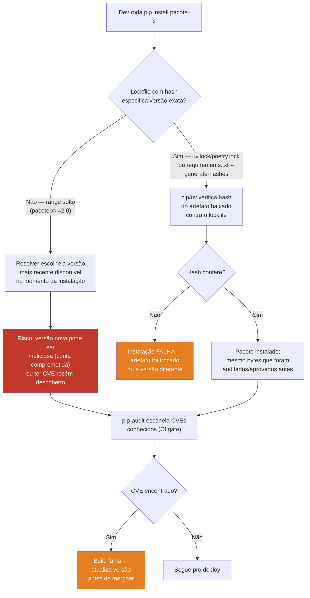

# Segurança de dependências e supply chain

> [!abstract] TL;DR
> Toda dependência de terceiros é código que roda com os mesmos privilégios da sua aplicação — e você não revisou uma linha dela. O ataque ao pacote `ctx` no PyPI, em maio de 2022, mostrou o padrão exato: um domínio de e-mail expirado foi requisitado, a conta do mantenedor foi sequestrada, e uma versão maliciosa começou a roubar variáveis de ambiente de quem instalasse — sem nenhuma mudança visível no código-fonte do GitHub. A defesa tem três frentes: **scan de CVEs conhecidas** com `pip-audit` (mantido pela PyPA), **lockfile com hash pinado** (`uv.lock`, `poetry.lock`, ou `pip-compile --generate-hashes`) para eliminar o risco de "range solto" instalar uma versão comprometida silenciosamente, e **atenção a typosquatting** — pacotes com nome parecido ao popular, hospedados livremente no PyPI, que só existem para capturar erros de digitação no `pip install`.

## O pacote que só existia havia sete anos — até não existir mais

`ctx` era um pacote Python pequeno e chato de descrever: um wrapper fino que deixava acessar dicionários com notação de ponto (`ctx.chave` em vez de `ctx["chave"]`). Nada de especial, poucos milhares de downloads por mês, mantido de forma esporádica desde 2014. O tipo de dependência transitiva que ninguém audita porque ninguém nem lembra que instalou — ela entrou no `requirements.txt` de algum projeto como dependência de uma dependência, anos atrás, e ficou lá.

Em maio de 2022, alguém percebeu que o domínio de e-mail associado à conta do mantenedor no PyPI — `figlief.com` — havia expirado. Um atacante registrou esse domínio, usou o fluxo de "esqueci minha senha" do PyPI para assumir a conta do mantenedor original, e publicou uma nova versão do pacote. Os logs de atividade mostram que o ataque começou **12 minutos depois** do registro do domínio — o processo estava automatizado, esperando o domínio ficar disponível.

A versão maliciosa não mudava o comportamento visível do pacote. `ctx.chave` continuava funcionando exatamente como antes. Mas, por baixo, o construtor da classe `Ctx` agora coletava `os.environ.items()` inteiro — todas as variáveis de ambiente do processo que instanciasse um objeto `Ctx` — codificava em base64, e enviava como parâmetro de query para uma aplicação Heroku controlada pelo atacante (`anti-theft-web.herokuapp.com`). Em ambientes de CI/CD e produção, variáveis de ambiente frequentemente **são** os segredos — chaves de nuvem, tokens de API, strings de conexão de banco, exatamente o que a [[06 - Secrets e configuração segura|nota 06 deste galho]] ensina a nunca hardcodear no código, mas que continuam vulneráveis se uma dependência maliciosa simplesmente ler `os.environ` em runtime.

O PyPI estimou que cerca de **27 mil cópias** da versão maliciosa foram baixadas antes da remoção — e o mesmo atacante, no mesmo golpe, comprometeu a biblioteca PHP `phpass` com um payload equivalente, mostrando que a técnica (sequestro de domínio → reset de senha → publicação silenciosa) não é específica de um ecossistema. É supply chain attack no sentido mais literal: o atacante não invadiu a sua infraestrutura, não escreveu um exploit contra o seu código — ele comprometeu um elo anterior na cadeia de fornecimento e deixou que `pip install` fizesse o resto.

> [!question]- Por que não usar um caso do npm como analogia, já que o `event-stream` de 2018 é mais famoso?
> O `ctx` é preferível porque é um caso **real e documentado no próprio ecossistema Python**, com o mesmo padrão estrutural que o `event-stream` do npm tornou famoso (mantainer inativo/conta vulnerável → sequestro → payload injetado silenciosamente em uma dependência confiada). O princípio dos dois casos é idêntico — supply chain attack não é uma categoria exclusiva de nenhuma linguagem, é uma propriedade de qualquer ecossistema de pacotes com publicação descentralizada — mas usar o exemplo nativo do PyPI evita qualquer dúvida sobre se a lição se aplica a Python. Ver [[01 - OWASP Top 10 aplicado a Python web — o mapa|nota 01 deste galho]], que mapeia este tema como **A06 — Vulnerable and Outdated Components**.

## O que o A06 do OWASP cobre, na prática

A [[01 - OWASP Top 10 aplicado a Python web — o mapa|nota 01]] já apontou pra cá: A06 é a categoria "dependência de terceiros com CVE conhecido, `requirements.txt` sem pin de versão, typosquatting de pacote no PyPI". O caso `ctx` ilustra a face mais dramática (conta comprometida, payload malicioso deliberado), mas a maior parte do risco do dia a dia é mais banal: uma dependência que você instalou de boa-fé, escrita por gente de boa-fé, que **tem uma vulnerabilidade conhecida** — um CVE já catalogado, um patch já disponível, e ninguém no seu time atualizou.



> [!info] Leitura do diagrama
> O lockfile com hash e o `pip-audit` cobrem ameaças diferentes e complementares. O lockfile responde "isto é exatamente o artefato que eu já vi e aprovei antes?" — protege contra troca silenciosa de bytes, seja por comprometimento de conta (como o `ctx`) seja por um mirror comprometido. O `pip-audit` responde "esta versão específica, que eu escolhi instalar deliberadamente, tem alguma vulnerabilidade já catalogada?" — protege contra o caso mais comum, que não é ataque deliberado: uma dependência legítima com um bug de segurança que só foi descoberto depois que você já a instalou.

## `pip-audit` — o scanner oficial da PyPA

`pip-audit` é mantido pela **Python Packaging Authority (PyPA)** — o mesmo grupo responsável por `pip`, `setuptools` e `twine` — o que o torna a escolha padrão quando não há motivo específico para preferir outra ferramenta. Ele cruza os pacotes instalados (ou listados num `requirements.txt`/`pyproject.toml`) contra a **Python Packaging Advisory Database (PyPI Advisory Database)** e o **OSV** (Open Source Vulnerabilities, o banco de dados agregador mantido pelo Google), reportando qualquer CVE conhecido que se aplique à versão exata instalada.

### Instalação e uso básico

```bash
pip install pip-audit

# Audita o ambiente Python ativo (todos os pacotes instalados)
pip-audit

# Audita um requirements.txt específico, sem precisar instalar nada
pip-audit -r requirements.txt

# Audita sem resolver a árvore de dependências transitivas
# (mais rápido, mas menos completo — útil quando o requirements.txt já é resolvido)
pip-audit --no-deps -r requirements.txt

# Exige que o requirements.txt tenha hashes (ver seção de lockfiles) —
# falha se algum pacote não tiver hash declarado
pip-audit --require-hashes -r requirements.txt
```

### Interpretando o output

```
Found 2 known vulnerabilities in 2 packages
Name    Version Vulnerability ID    Fix Versions
------- ------- ------------------ -------------
requests 2.25.1  GHSA-j8r2-6x86-q33q 2.31.0
pyyaml   5.3.1   GHSA-8q59-q68h-6hv4 5.4
```

Cada linha diz: qual pacote, qual versão instalada, o identificador da vulnerabilidade (formato GHSA — GitHub Security Advisory, ou às vezes CVE direto), e a versão mínima que já contém o fix. A leitura correta não é "existe uma linha, logo o projeto está condenado" — é "existe um caminho de correção conhecido e documentado; atualize para a versão indicada e rode de novo para confirmar".

`pip-audit` também suporta correção automática, com cautela:

```bash
# Tenta atualizar automaticamente os pacotes vulneráveis
# para a versão fix mais próxima — SEMPRE revisar o diff antes de commitar
pip-audit --fix
```

> [!warning] `--fix` não substitui revisão humana
> Atualizar automaticamente uma dependência para "a versão que corrige o CVE" pode introduzir uma *breaking change* não relacionada — bibliotecas nem sempre seguem versionamento semântico à risca, e um patch de segurança às vezes vem empacotado junto com mudanças de API na mesma minor version. Rode `--fix`, mas trate o resultado como uma sugestão de PR a revisar — nunca como merge automático sem rodar a suíte de testes.

### `pip-audit` em CI

O padrão recomendado é rodar o scan como gate obrigatório em todo pull request, com `--strict` para que qualquer achado quebre o build:

```yaml
# .github/workflows/security.yml
name: Dependency audit
on: [pull_request]

jobs:
  pip-audit:
    runs-on: ubuntu-latest
    steps:
      - uses: actions/checkout@v4
      - uses: actions/setup-python@v5
        with:
          python-version: "3.13"
      - name: Install pip-audit
        run: pip install pip-audit
      - name: Audit dependencies
        run: pip-audit -r requirements.txt --strict
```

A PyPA também mantém uma GitHub Action oficial (`pypa/gh-action-pip-audit`), que envolve o mesmo comando com relatório formatado direto na interface de checks do PR — equivalente ao comando acima, mas com integração nativa de anotações.

### Formatos de saída e granularidade

`pip-audit` suporta múltiplos formatos de output, o que importa quando o resultado precisa alimentar outra ferramenta (dashboard interno, sistema de tickets) em vez de só aparecer no log de CI:

```bash
# Formato legível por humano (padrão)
pip-audit

# JSON — para consumir programaticamente em outro sistema
pip-audit --format json

# Markdown — útil para colar direto num comentário de PR ou changelog
pip-audit --format markdown

# Ignora vulnerabilidades específicas já triadas/aceitas (ex: sem fix disponível
# ainda, ou avaliada como não-explorável no contexto do projeto)
pip-audit --ignore-vuln GHSA-j8r2-6x86-q33q
```

`--ignore-vuln` existe porque nem todo CVE catalogado é acionável no momento — às vezes o fix ainda não foi publicado, ou a vulnerabilidade está num code path que o projeto nunca exercita. Usar essa flag é uma decisão que deveria ficar documentada (por que foi ignorado, quem decidiu, quando reavaliar) — não um jeito silencioso de fazer o CI parar de reclamar.

> [!tip] `pip-audit` não substitui atualização de dependências, só a torna visível
> A ferramenta não previne nada sozinha — ela **relata**. O valor real vem de rodá-la como gate bloqueante (falha o build, não só um warning ignorável) e de ter um processo real para agir sobre os achados, seja atualização manual seja `--fix` revisado. Um scan que roda e ninguém lê o resultado é teatro de segurança, não defesa.

## `safety` — a alternativa com base de dados própria

`safety` é outra ferramenta de scan de CVEs em dependências Python, e frequentemente aparece lado a lado com `pip-audit` em comparações. A diferença principal não é de mecânica — os dois leem `requirements.txt` ou o ambiente instalado e reportam vulnerabilidades conhecidas — é de **fonte de dados**: `pip-audit` consulta a Python Packaging Advisory Database e o OSV (bancos abertos, mantidos pela comunidade/Google), enquanto `safety` historicamente depende de um banco de dados próprio (a Safety DB), com um tier gratuito mais limitado e um tier comercial (Safety CLI / pyup.io) com cobertura mais ampla e atualizações mais frequentes.

```bash
pip install safety
safety scan   # ou `safety check` em versões mais antigas da ferramenta
```

Na prática, muitos times rodam **os dois** — não são mutuamente exclusivos, e cada banco de dados tem achados que o outro pode não ter catalogado ainda. Mas se o objetivo é escolher **um** para começar, `pip-audit` tem a vantagem de ser mantido pela mesma organização que mantém o `pip`, usar bancos de dados abertos sem paywall, e ser o que a comunidade Python cita como referência de facto quando o assunto é "scan oficial de CVE" — por isso esta nota o trata como padrão e `safety` como complementar/alternativo.

## Lockfiles: por que "range solto" é risco de supply chain

Um `requirements.txt` como este parece razoável à primeira vista:

```
requests>=2.0
pyyaml>=5.0
```

Mas "maior ou igual a" é uma promessa perigosa: toda vez que alguém roda `pip install -r requirements.txt` num ambiente novo — uma máquina de CI, um container recém-buildado, o notebook de um dev novo no time — o resolver do `pip` escolhe **a versão mais recente disponível no PyPI naquele momento** que satisfaça o range. Se uma versão nova de `requests` for publicada amanhã — seja por atualização legítima, seja por uma conta comprometida como no caso do `ctx` — o próximo `pip install` a instala silenciosamente, sem que ninguém tenha revisado nada. Não há decisão consciente de "vou atualizar agora"; há apenas a passagem do tempo.

Esse é o mecanismo exato que torna o `ctx` perigoso além do caso isolado: qualquer projeto que dependesse de `ctx` (direta ou transitivamente) sem um lockfile de hash pinado recebeu a versão maliciosa **automaticamente**, no próximo `pip install` ou rebuild de container, sem nenhuma ação deliberada do time.

### `pip-compile --generate-hashes`

A ferramenta `pip-tools` (comando `pip-compile`) resolve um `requirements.in` (com ranges soltos, legível por humano) para um `requirements.txt` totalmente pinado, com hash SHA-256 de cada artefato:

```
# requirements.in
requests>=2.0
pyyaml>=5.0
```

```bash
pip-compile --generate-hashes requirements.in
```

```
# requirements.txt gerado — trecho
requests==2.31.0 \
    --hash=sha256:942c5a758f98d790eaed1a29cb6eefc7ffb0d1cf7af05c3d2791656dbd6ad1e \
    --hash=sha256:64299f4909223da747622c030b781c0d7c39952689f9a4174cf7b45ce6c1a2c
```

O hash não é decorativo: `pip install -r requirements.txt` (rodado com pacotes hasheados presentes) **verifica** que o artefato baixado do índice bate byte a byte com o hash registrado. Se um mirror comprometido, um ataque man-in-the-middle, ou uma reescrita silenciosa de artefato tentar entregar bytes diferentes sob o mesmo nome/versão, a instalação **falha** em vez de aceitar silenciosamente.

### `uv.lock` e `poetry.lock` — lockfile como resolução determinística

Ferramentas mais modernas de gerenciamento de projeto — `uv` (Astral) e `Poetry` — vão além do hash por linha: elas mantêm um **lockfile de projeto** (`uv.lock`, `poetry.lock`) que registra a árvore de dependências inteira resolvida, incluindo transitivas, com hashes, de forma determinística e legível por máquina (não editado manualmente).

```bash
# uv: adiciona dependência ao pyproject.toml E resolve o lockfile
uv add requests

# uv: reproduz exatamente o ambiente descrito no uv.lock —
# nenhuma resolução nova acontece, apenas instala o que já foi travado
uv sync --locked
```

```bash
# Poetry: equivalente
poetry add requests
poetry install --no-update
```

A diferença prática para segurança é a mesma do `--generate-hashes`, mas com granularidade de projeto inteiro em vez de arquivo solto: `uv.lock`/`poetry.lock` é commitado no repositório, revisado em code review como qualquer outro arquivo (um diff que muda a versão de uma dependência transitiva fica visível), e `--locked`/`--no-update` garante que CI e produção instalem **exatamente** o que foi resolvido e aprovado — nunca "a versão mais nova disponível hoje".

> [!warning] Lockfile sem `--locked`/`--frozen` no CI não protege nada
> Ter um `uv.lock` no repositório não ajuda se o pipeline de CI rodar `uv sync` sem a flag que força uso exato do lockfile — dependendo da configuração, isso pode re-resolver e ignorar o que está travado. O ganho de segurança do lockfile só se realiza quando o comando de instalação em CI/produção é explicitamente instruído a **não** resolver de novo, só reproduzir o que já foi travado (`uv sync --locked`, `pip install --require-hashes`, `poetry install --no-update`).

| Ferramenta | O que trava | Formato |
|---|---|---|
| `pip-compile --generate-hashes` | `requirements.txt` com hash por pacote | texto, um pacote por linha |
| `uv.lock` | árvore completa de dependências (diretas + transitivas), hash + resolução por plataforma | TOML gerado por máquina |
| `poetry.lock` | árvore completa, hash + resolução | TOML gerado por máquina |

## Typosquatting: o erro de digitação como vetor de ataque

Typosquatting é o registro deliberado de um nome de pacote parecido com um nome popular, na expectativa de capturar instalações por erro de digitação. O PyPI, como a maioria dos índices de pacotes públicos, **não** exige aprovação prévia de nome — qualquer pessoa pode publicar um pacote com qualquer nome disponível, o que torna o typosquatting trivial de executar e caro de prevenir estruturalmente.

O caso mais documentado no ecossistema Python é o `colourama` — um pacote publicado com grafia britânica ("colour" em vez de "color") do popular `colorama`, biblioteca de output colorido em terminal usada por milhares de projetos. Quem digitasse `pip install colourama` por hábito ortográfico (ou confusão genuína) recebia um pacote funcionalmente idêntico ao `colorama` legítimo — mas com um payload adicional de roubo de credenciais de Bitcoin embutido. O mesmo padrão se repetiu contra o próprio `colorama` mais recentemente, com variações de nome carregando malware do tipo *info-stealer*, e contra `python-dateutil` — um pacote chamado `python-dateutils` (com "s" a mais) minerava criptomoeda Monero e tentava roubar credenciais AWS de quem o instalasse por engano.

> [!question]- Por que o PyPI não bloqueia nomes parecidos automaticamente?
> Definir "parecido o suficiente para ser malicioso" sem falsos positivos é um problema genuinamente difícil — muitos pacotes legítimos têm nomes parecidos por coincidência de domínio (bibliotecas de fork, reimplementações, nomes de projeto comuns como `utils` ou `client`). O PyPI investe em detecção heurística e resposta a denúncia, mas não em bloqueio proativo de qualquer string com distância de edição pequena — isso bloquearia registros legítimos também. A defesa prática, do lado de quem instala, não depende do índice resolver isso por você.

Defesas práticas contra typosquatting:

- **Conferir o nome exato antes de instalar**, especialmente em pacotes novos que você não usa rotineiramente — um segundo de atenção ao digitar `pip install` evita a classe inteira de erro.
- **Preferir lockfile commitado** (seção anterior): se um pacote errado entrar uma vez, o lockfile revisado em code review tem boa chance de expor o nome estranho antes de chegar em produção.
- **`pip-audit` e `safety` não detectam typosquatting diretamente** — eles catalogam CVEs de pacotes *conhecidos*, não avaliam se um nome é uma armadilha deliberada. Ferramentas dedicadas de detecção heurística de typosquatting (fora do escopo desta nota) existem, mas a defesa mais barata continua sendo atenção humana + lockfile revisado.

## Confusão de dependências: quando o nome interno vaza pro público

Existe uma variante do ataque de nome que não depende de typosquatting nem de erro de digitação: **dependency confusion**. O padrão foi documentado publicamente pelo pesquisador de segurança Alex Birsan em fevereiro de 2021, num relato que rendeu comprometimento de mais de 35 grandes empresas — incluindo Apple, Microsoft, Tesla e PayPal — e mais de US$130 mil em recompensas de *bug bounty*.

O mecanismo explora uma ambiguidade estrutural, não um erro humano: muitas organizações mantêm pacotes internos, privados, com nomes como `empresa-utils` ou `empresa-auth-client`, publicados num índice interno (Artifactory, um registry privado, um servidor PyPI corporativo). Esses nomes frequentemente vazam — aparecem em arquivos `package.json`/`requirements.txt` de repositórios open-source da própria empresa, em logs de erro públicos, em vagas de emprego que mencionam a stack interna. Birsan percebeu que, quando um `requirements.txt` referencia `empresa-utils` sem apontar explicitamente para o índice privado, muitas configurações de build (por padrão ou por engano) consultam o **índice público** (PyPI) além do privado — e se ele publicasse um pacote público chamado `empresa-utils` com **número de versão mais alto** que o pacote interno, o resolver de dependências, seguindo a lógica normal de "pegue a versão mais recente que satisfaça o range", escolhia a versão pública maliciosa em vez da interna legítima.

Nenhum erro de digitação foi necessário — o nome estava certo, correto, exatamente como o time interno o escreveu. A vulnerabilidade estava na resolução ambígua entre índice interno e público, não no nome do pacote em si.

> [!question]- Dependency confusion e typosquatting são a mesma coisa?
> Não — são vetores irmãos, mas com mecanismo diferente. Typosquatting explora um **erro humano** (dedo escorregou, grafia diferente) num nome que o atacante escolhe para parecer com um pacote público existente. Dependency confusion explora uma **ambiguidade de configuração de build** num nome que já é correto — o de um pacote *privado* que a organização já usa — publicando uma versão pública com número mais alto para vencer a resolução. A defesa também é diferente: typosquatting se mitiga com atenção ao digitar e lockfile revisado; dependency confusion se mitiga configurando o resolver para nunca consultar o índice público para namespaces internos (escopo dedicado, ex: `--index-url` restrito, ou reservar o nome no PyPI público mesmo sem uso, como medida defensiva).

Defesas específicas contra dependency confusion:

- **Registrar o nome do pacote interno também no PyPI público** — mesmo como um pacote vazio, sem código — de forma que nenhum atacante consiga reivindicar aquele nome. Prática recomendada por várias empresas depois do relato de Birsan.
- **Configurar o resolver para nunca fazer fallback ao índice público** para pacotes de namespace interno — via `--index-url` restrito (sem `--extra-index-url` apontando pro PyPI simultaneamente) ou escopo dedicado no gerenciador de pacotes.
- **Lockfile pinado** (a mesma defesa da seção anterior) também ajuda aqui: se a versão exata e a origem já estão travadas, uma versão pública "mais nova" publicada por um atacante não é sequer considerada pelo resolver.

## SBOM: o inventário formal de dependências

**SBOM (Software Bill of Materials)** é um inventário formal e legível por máquina de tudo que compõe um artefato de software — toda dependência direta e transitiva, com versão exata, licença, e às vezes hash. É, essencialmente, o `uv.lock`/`poetry.lock` elevado a formato padronizado e trocável entre organizações, em vez de um artefato interno de build.

A prática está crescendo por pressão de **compliance**: exigências regulatórias e contratuais (em setores como financeiro, saúde, e fornecedores de governo) cada vez mais pedem SBOM como condição de contrato — a pergunta que a auditoria faz não é mais só "vocês testaram o código", é "vocês sabem, com precisão, tudo que está rodando dentro do seu artefato, incluindo transitivas de terceiro nível". Formatos comuns são **CycloneDX** e **SPDX**.

```bash
# cyclonedx-py: gera SBOM em formato CycloneDX a partir do ambiente/lockfile
pip install cyclonedx-bom
cyclonedx-py environment -o sbom.json

# syft (ferramenta mais ampla, não específica de Python — escaneia
# containers, imagens, e ecossistemas variados): gera SBOM de uma imagem Docker
syft packages docker:minha-imagem:latest -o cyclonedx-json
```

Esta nota não desenvolve SBOM a fundo — é prática emergente de nível de organização/compliance, não uma técnica de código Python de aplicação. Vale saber que existe, que os nomes das ferramentas são `cyclonedx-py`/`cyclonedx-bom` (específico do ecossistema Python) e `syft` (mais amplo, multi-linguagem), e que o valor prático dela é responder, em auditoria, exatamente a pergunta que um lockfile já responde para o time interno — só que num formato padronizado que outra organização consegue consumir.

> [!tip] SBOM e lockfile não competem, se complementam
> O lockfile (`uv.lock`/`poetry.lock`) é o artefato de trabalho do time — resolve build, garante reprodutibilidade, é lido por ferramentas internas. O SBOM é o artefato de comunicação — formato padronizado (CycloneDX/SPDX) que uma equipe de compliance, um cliente enterprise, ou um auditor externo consegue interpretar sem conhecer `uv` ou `poetry`. Times que já têm lockfile rigoroso frequentemente descobrem que gerar SBOM é quase mecânico — a informação já existe, só precisa ser exportada num formato diferente. A prática de "SBOM primeiro, lockfile depois" raramente faz sentido; a ordem natural é a inversa.

## Atualização automatizada: Dependabot e Renovate

Lockfile pinado resolve o risco de "instalação silenciosa de versão nova", mas cria um problema simétrico: se ninguém atualizar deliberadamente, o projeto congela em versões cada vez mais antigas, acumulando CVEs conhecidos sem nenhum mecanismo automático de correção. A resposta não é voltar a ranges soltos — é automatizar a **proposta** de atualização, mantendo a **revisão** humana.

**Dependabot** (nativo do GitHub) e **Renovate** (mais configurável, self-hosted ou via app) escaneiam periodicamente o lockfile do projeto, comparam com as versões mais recentes disponíveis, e abrem um pull request automático para cada atualização — um PR por dependência (ou agrupado, conforme configuração), com o diff do lockfile já pronto para revisão.

```yaml
# .github/dependabot.yml
version: 2
updates:
  - package-ecosystem: "pip"
    directory: "/"
    schedule:
      interval: "weekly"
    open-pull-requests-limit: 10
```

O ganho é que a atualização deixa de depender de alguém lembrar de rodar `uv lock --upgrade` manualmente de tempos em tempos — o bot propõe, o `pip-audit` do CI roda no PR de atualização como em qualquer outro PR, os testes rodam, e um humano aprova ou rejeita. Isso fecha o ciclo: lockfile pinado impede atualização *silenciosa*, e Dependabot/Renovate garante que atualização *deliberada* continue acontecendo com regularidade, em vez de todo o processo de segurança de dependências depender inteiramente de disciplina manual.

> [!tip] PR de Dependabot com CVE crítico merece prioridade fora do ciclo normal
> A maioria dos PRs de atualização de dependência pode esperar a revisão de rotina do time. Mas quando `pip-audit` aponta um CVE de severidade alta/crítica numa dependência já em produção, o PR correspondente do Dependabot/Renovate deveria furar a fila — a janela entre "vulnerabilidade divulgada publicamente" e "exploit automatizado em massa" costuma ser medida em dias, não semanas, especialmente para bibliotecas amplamente usadas.

## Armadilhas comuns

> [!warning] "`pip-audit` roda localmente uma vez, tá resolvido"
> **O que acontece:** alguém roda `pip-audit` manualmente antes de um deploy importante, encontra zero vulnerabilidades, e considera o assunto encerrado. **Por quê:** o banco de CVEs cresce todo dia — uma dependência limpa hoje pode ter uma vulnerabilidade catalogada amanhã, sem que nenhuma linha do seu código tenha mudado. Um scan pontual só prova que o estado *daquele momento* estava limpo; não é uma propriedade permanente do projeto. **Como evitar:** rodar como gate de CI em todo PR (a versão instalada muda a cada merge de dependência) e, adicionalmente, um scan agendado periódico (ex: diário/semanal via cron de CI) que não depende de nenhum PR estar acontecendo — porque o CVE pode aparecer num dia sem nenhum commit novo.

> [!warning] Confundir "range solto facilita atualização" com "range solto é seguro"
> **O que acontece:** um time evita lockfile de propósito, argumentando que `requests>=2.0` deixa o projeto "sempre atualizado" automaticamente, sem esforço manual. **Por quê:** "sempre a versão mais nova" e "sempre a versão revisada" não são a mesma coisa. Atualização automática sem revisão é exatamente o mecanismo que expõe ao `ctx`: a versão nova pode ser legítima e melhor, ou pode ser uma conta comprometida publicando um payload malicioso — o range solto não distingue os dois casos, só aceita o que estiver disponível no momento. **Como evitar:** lockfile pinado por padrão + um processo deliberado de atualização (ex: Dependabot/Renovate abrindo PR de bump, revisado como qualquer outro PR, com `pip-audit` rodando no PR de atualização também). Atualização deliberada e revisada não é mais lenta de forma relevante — é a mesma velocidade, com uma checagem no meio.

> [!warning] Achar que dependência popular/madura está imune
> **O que acontece:** o time audita rigorosamente pacotes novos ou pouco conhecidos, mas assume que bibliotecas estabelecidas e amplamente usadas (com milhões de downloads) são automaticamente seguras. **Por quê:** `ctx` tinha anos de existência e reputação estabelecida — a confiança acumulada é exatamente o que o ataque explorou. Popularidade reduz a *probabilidade* de comprometimento (mais olhos, mais scrutínio), mas não elimina o vetor: qualquer pacote depende de uma conta de mantenedor, e qualquer conta pode ser comprometida. **Como evitar:** tratar lockfile de hash + scan de CVE como padrão universal, sem exceção por "esse pacote é famoso, não precisa". A defesa estrutural (hash pinado, scan automatizado) não deveria depender de julgamento caso a caso sobre qual pacote "parece confiável".

## Como explicar em inglês

> "Every third-party dependency is code running with the same privileges as my application, and I haven't reviewed a line of it — that's the core risk supply chain security addresses. The `ctx` package incident on PyPI in 2022 is the canonical example: a maintainer's email domain expired, an attacker re-registered it, took over the PyPI account via password reset, and published a version that silently exfiltrated `os.environ` to an external server — no visible change to the source on GitHub. My defense has three layers: `pip-audit`, the PyPA-maintained scanner, checks installed packages against the Python Advisory Database and OSV for known CVEs, run as a blocking CI gate on every PR. A pinned lockfile — `uv.lock`, `poetry.lock`, or `pip-compile --generate-hashes` — verifies the exact bytes of every artifact against a hash, so a loose version range like `requests>=2.0` can't silently pull in a compromised release on the next install. And I stay alert to typosquatting — packages like `colourama` or `python-dateutils` that exist purely to catch a typo in `pip install` — because PyPI doesn't police name similarity proactively; that defense is on the installer, not the index."

| PT | EN |
|----|----|
| supply chain attack | supply chain attack |
| cadeia de fornecimento de software | software supply chain |
| conta de mantenedor comprometida | compromised maintainer account |
| dependência transitiva | transitive dependency |
| lockfile / arquivo de trava | lockfile |
| range solto (de versão) | loose version range |
| resolução determinística | deterministic resolution |
| verificação de hash | hash verification |
| typosquatting | typosquatting |
| inventário de software / SBOM | software bill of materials (SBOM) |
| vulnerabilidade conhecida / CVE | known vulnerability / CVE |
| gate de CI | CI gate |

## Checklist de higiene de supply chain

- [ ] Lockfile commitado no repositório (`uv.lock`, `poetry.lock`, ou `requirements.txt` com `--generate-hashes`) — nunca só ranges soltos em produção
- [ ] Instalação em CI/produção usa flag de reprodução exata (`uv sync --locked`, `pip install --require-hashes`, `poetry install --no-update`) — nunca re-resolve silenciosamente
- [ ] `pip-audit` (ou `safety`) rodando como gate bloqueante em todo PR
- [ ] Scan de CVE agendado periodicamente (não só em PR), pois vulnerabilidades novas aparecem sem nenhum commit
- [ ] Nome de todo pacote novo conferido caractere a caractere antes de instalar, especialmente em dependências pouco usadas
- [ ] Processo deliberado de atualização de dependências (Dependabot/Renovate ou revisão manual periódica), nunca "deixa o range solto atualizar sozinho"
- [ ] `pip-audit --fix` (ou update manual) sempre revisado em PR, com testes rodando — nunca merge automático sem revisão
- [ ] Para projetos com exigência de compliance, avaliar geração de SBOM (`cyclonedx-py`/`syft`) como parte do pipeline de build

## Fontes

- **The Register** — [*Ctx Python package compromised with info-stealing code*](https://www.theregister.com/2022/05/24/pypi_ctx_package_compromised/) — cobertura do incidente, cronologia do sequestro de domínio e conta.
- **Python Security (python-security.readthedocs.io)** — [*Account Takeover and Malicious Replacement of ctx Project*](https://python-security.readthedocs.io/pypi-vuln/index-2022-05-24-ctx-domain-takeover.html) — registro técnico do advisory, incluindo o payload de exfiltração de `os.environ` e o endpoint Heroku usado.
- **Sonatype** — [*PyPI Package 'ctx' and PHP Library 'phpass' Compromised*](https://www.sonatype.com/blog/pypi-package-ctx-compromised-are-you-at-risk) — confirma o número estimado de ~27 mil downloads maliciosos e o ataque paralelo ao `phpass`.
- **PyPA** — [*pip-audit — PyPI*](https://pypi.org/project/pip-audit/) e [*pypa/pip-audit — GitHub*](https://github.com/pypa/pip-audit) — documentação oficial da ferramenta, flags e uso em CI.
- **Astral** — [*uv — Locking and syncing*](https://docs.astral.sh/uv/) — documentação do `uv.lock` e `uv sync --locked`.
- **OWASP** — [*OWASP Top 10:2021 — A06 Vulnerable and Outdated Components*](https://owasp.org/Top10/A06_2021-Vulnerable_and_Outdated_Components/) — categoria sob a qual este tema se enquadra no mapa da [[01 - OWASP Top 10 aplicado a Python web — o mapa|nota 01 deste galho]].
- **GitHub (tartley/colorama issue #202)** — [*FYI: PyPI package 'colourama' (with a 'u') is MALWARE, steals bitcoin*](https://github.com/tartley/colorama/issues/202) — relato original do typosquatting contra `colorama`.
- **Sonatype** — [*Cryptominer Disguised: Python-Dateutils Targets OS Platforms*](https://www.sonatype.com/blog/python-dateutils-a-moner-cryptominer-in-disguise-for-windows-linux-macos) — caso de typosquatting contra `python-dateutil`.
- **Alex Birsan (Medium)** — [*Dependency Confusion: How I Hacked Into Apple, Microsoft and Dozens of Other Companies*](https://medium.com/@alex.birsan/dependency-confusion-4a5d60fec610) — relato original da técnica de dependency confusion, publicado em fevereiro de 2021.

Consultado em 2026-07-11.
