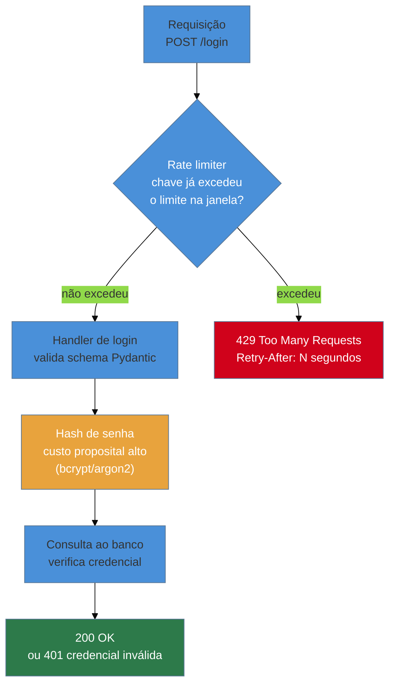
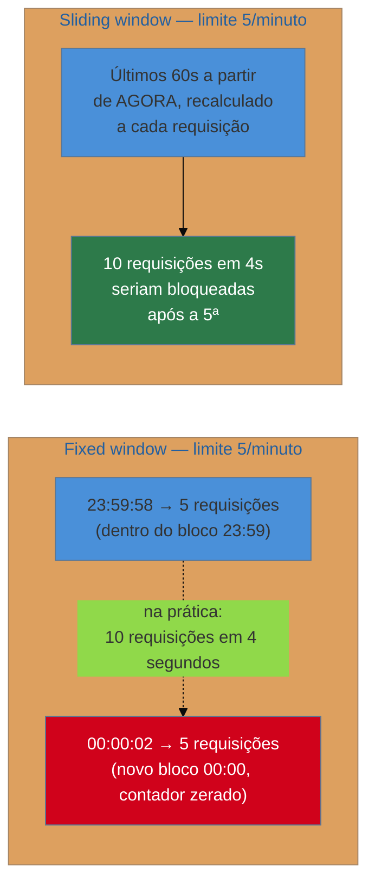
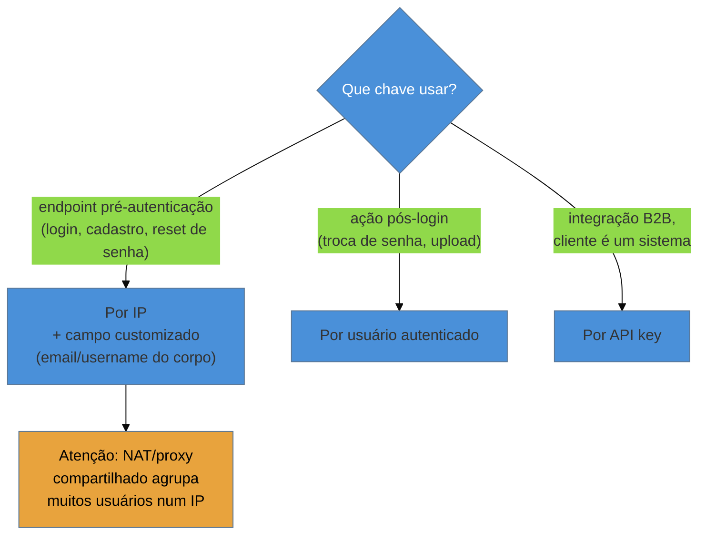

# Rate limiting e proteção contra abuso

> [!abstract] TL;DR
> Um endpoint de login sem limite de tentativas não é uma omissão cosmética — é um convite explícito a **brute force** (tentar senhas em sequência contra uma conta) e **credential stuffing** (testar, em massa, pares usuário/senha vazados de *outro* serviço contra o seu, na aposta de que alguém reutilizou a senha). A defesa de aplicação tem nome: **rate limiting** — recusar uma requisição, com `429 Too Many Requests`, antes que ela chegue ao handler, quando um cliente excede um número de tentativas numa janela de tempo. Em Python, `slowapi` traz essa defesa pro FastAPI (baseado na lib `limits`, com `@limiter.limit("5/minute")` por rota) e `django-ratelimit` faz o mesmo no Django (`@ratelimit(key="ip", rate="5/m")`). A escolha da **chave** de limitação importa tanto quanto o número: por IP é simples mas quebra atrás de NAT/proxy compartilhado, por usuário autenticado é mais preciso mas só funciona pós-login, por API key é o padrão em integrações B2B. E há uma fronteira honesta que esta nota não esconde: rate limiting de aplicação não resolve DDoS distribuído de verdade — milhares de IPs, volume que satura a rede antes mesmo de chegar no código Python — isso é trabalho de infraestrutura (Cloudflare, AWS Shield), fora do que uma linha de código consegue prevenir.

## As 50 mil tentativas que só apareceram no gráfico de CPU

Uma manhã de terça-feira, o time de infraestrutura de uma API de e-commerce recebe um alerta automático: CPU do banco de dados de produção em 94%, sustentado, há quarenta minutos — fora de qualquer padrão de tráfego conhecido para aquele horário. Não é hora de pico de vendas, não há campanha de marketing rodando, não há deploy recente. O primeiro instinto é procurar uma query lenta nova — mas o `EXPLAIN ANALYZE` da query mais frequente no `pg_stat_statements` não mostra nada de anormal em termos de plano de execução. O que salta aos olhos é o **volume**: a mesma query de autenticação, contra a tabela `usuarios`, rodando dezenas de milhares de vezes por hora.

A investigação nos logs de acesso do endpoint `/login` confirma o padrão: cerca de **50 mil tentativas de login em uma hora**, vindas de um conjunto rotativo de poucas centenas de IPs, cada um fazendo um número modesto de tentativas — baixo o bastante para não disparar nenhum alerta de rede, mas repetido de forma incansável, com pares de usuário/senha diferentes a cada requisição. Um cruzamento rápido com uma base pública de credenciais vazadas confirma a suspeita: os pares testados batem, em proporção alta, com um vazamento conhecido de outro serviço — um site de streaming que sofreu uma violação de dados meses antes. Não é um ataque de força bruta contra uma conta específica; é **credential stuffing** — a aposta estatística de que uma fração dos usuários reutiliza a mesma senha em serviços diferentes, testada em escala contra qualquer API que aceite.

O endpoint `/login` da API, escrito seis meses antes, tinha autenticação correta — hash de senha com `pwdlib` (o mecanismo em si já coberto em [[03-Dominios/Engenharia/Auth e Identidade/4 - Auth nos stacks/03 - Python — FastAPI|Auth e Identidade SG4]]), validação de schema com Pydantic, resposta 401 padronizada para credencial errada. O que faltava era mais simples e mais barato de implementar do que qualquer uma dessas três coisas: **um limite de quantas vezes um cliente pode tentar, num intervalo de tempo**. Sem esse limite, o endpoint aceita — e processa até o fim, com todo o custo de hash de senha e consulta ao banco — qualquer volume de tentativas que alguém queira mandar.

> [!bug] O que estava quebrado, em uma frase
> O endpoint de login tratava cada tentativa de autenticação como um evento isolado e legítimo, sem nenhum mecanismo que perguntasse "quantas vezes esse cliente já tentou isso recentemente?" — e sem essa pergunta, 50 mil tentativas por hora custam ao servidor exatamente o mesmo que 50 tentativas legítimas, só que multiplicadas por mil.

> [!question]- Por que ninguém percebeu antes do gráfico de CPU?
> Porque cada tentativa individual de login, isoladamente, é indistinguível de uma tentativa legítima — o mesmo formato de requisição, o mesmo endpoint, a mesma resposta 401 para credencial errada. Não existe um "erro" óbvio nos logs de aplicação para alertar; existe só volume anormal, e volume só vira sintoma visível quando satura algum recurso finito — nesse caso, CPU do banco, consumida pelo custo de hash de senha (deliberadamente caro, por design — ver [[03-Dominios/Engenharia/Segurança/06 - Hashing criptográfico|Engenharia/Segurança nota 06]] sobre por que `bcrypt`/`argon2` são lentos de propósito) multiplicado por 50 mil. Um sistema de observabilidade que tivesse um contador simples de "tentativas de login por minuto" teria disparado o alerta muito antes do sintoma indireto de CPU — mas esse é um problema de detecção (fora do escopo desta nota, tema de A09 no [[01 - OWASP Top 10 aplicado a Python web — o mapa|mapa OWASP]]). Rate limiting é a defesa que **previne** o ataque de ter efeito, não a que **detecta** que ele está acontecendo — as duas são complementares, não substitutas.

O resto desta nota resolve esse incidente: como impedir, estruturalmente, que um endpoint aceite volume ilimitado de tentativas, nos dois frameworks principais da trilha — `slowapi` no FastAPI e `django-ratelimit` no Django — e como escolher a chave de limitação certa para cada caso, fechando com a fronteira honesta sobre o que rate limiting de aplicação não alcança.

## Brute force vs. credential stuffing: duas ameaças, uma defesa

Vale nomear a diferença entre os dois vetores que abrem esta nota, porque a defesa é a mesma, mas o padrão de ataque é distinto:

- **Brute force clássico** — o atacante mira **uma conta específica** (geralmente um alvo de valor, como um administrador ou um e-mail conhecido) e testa senhas em sequência contra ela — por dicionário, por padrão comum (`123456`, `senha123`), ou por força bruta pura em espaços de senha curtos. O volume se concentra numa única conta.
- **Credential stuffing** — o atacante já tem uma lista de pares usuário/senha **vazados de outro serviço** (um dump de violação de dados conhecida, circulando publicamente ou vendido em fóruns) e testa esses pares, em massa, contra **muitas contas diferentes** do seu sistema — na aposta estatística de que uma fração dos usuários reutilizou a mesma senha. É o padrão exato do incidente de abertura: 50 mil tentativas, contas diferentes, senhas vindas de um vazamento alheio.

A OWASP trata credential stuffing como uma categoria própria de ameaça — não é "só" A07 (Identification and Authentication Failures) genérico, é um padrão de ataque automatizado, geralmente executado por *botnets* ou ferramentas especializadas (Sentry MBA, OpenBullet são exemplos históricos citados em relatórios de segurança), capaz de testar milhões de combinações por hora se não houver fricção nenhuma no caminho.

> [!tip] Rate limiting não impede um ataque determinado — ele muda o custo dele
> Um atacante com paciência infinita e um pool grande o bastante de IPs consegue, tecnicamente, contornar qualquer rate limit dado tempo suficiente. O ponto de rate limiting não é tornar o ataque **impossível** — é torná-lo **caro o bastante, em tempo e em recursos do atacante**, para que deixe de ser economicamente atrativo comparado a alvos sem essa defesa. Um credential stuffing que levaria uma hora contra um endpoint sem limite passa a levar semanas contra um endpoint com `5/minute` por IP — na prática, a maioria dos atacantes automatizados simplesmente move o alvo para o próximo site da lista, sem essa fricção.

Ambas as ameaças compartilham a mesma correção estrutural: um limite de tentativas por janela de tempo, aplicado **antes** que a requisição chegue à lógica cara de autenticação (hash de senha, consulta ao banco).

## O mecanismo: onde o rate limiter entra no pipeline da requisição

Antes de entrar em código específico de framework, vale visualizar onde essa defesa se encaixa — porque o ponto central é que a rejeição acontece **antes** do handler de negócio, evitando o custo da lógica cara:



A requisição rejeitada por `429` nunca chega ao hash de senha nem à consulta ao banco — é justamente esse curto-circuito que evita a saturação de CPU vista no incidente de abertura. Um rate limiter mal posicionado (por exemplo, checado só depois de já ter feito o hash) perde boa parte do benefício, porque o custo caro já foi pago antes da rejeição.

## Fixed window vs. sliding window: por que a janela importa

Tanto `slowapi` quanto `django-ratelimit` (via a lib `limits`, no caso do `slowapi`) implementam algoritmos de janela de tempo para contar tentativas — e a escolha do algoritmo tem uma consequência prática que vale entender antes de configurar qualquer limite.

**Fixed window (janela fixa)** divide o tempo em blocos fixos — por exemplo, cada minuto do relógio, de `HH:MM:00` a `HH:MM:59` — e conta requisições dentro de cada bloco, zerando o contador na virada. É o algoritmo mais simples de implementar (um contador por chave, resetado por tempo) e mais barato computacionalmente.

**Sliding window (janela deslizante)** não usa blocos fixos alinhados ao relógio — o limite é sempre calculado sobre os últimos N segundos **a partir do momento atual** da requisição, não a partir de uma borda de minuto fixa.

A diferença prática aparece exatamente na borda entre dois blocos:



No fixed window, um cliente pode disparar 5 requisições no último segundo de um bloco e mais 5 no primeiro segundo do bloco seguinte — 10 requisições em poucos segundos, mesmo com um limite nominal de "5 por minuto". Cada bloco individualmente respeitou o limite; a borda entre eles não. Isso é conhecido como o problema de **burst na borda** (*boundary burst*), e é a razão pela qual o sliding window é considerado mais justo: ele nunca permite que uma janela de 60 segundos qualquer, medida a partir de qualquer ponto no tempo, exceda o limite — não só as janelas alinhadas ao relógio.

> [!question]- Se sliding window é mais justo, por que fixed window ainda é usado?
> Custo computacional e de memória. Fixed window precisa só de um contador por chave, incrementado e resetado — operação `O(1)`, trivial de implementar até com um `dict` em memória para um serviço pequeno. Sliding window "puro" (mantendo timestamp de cada requisição individual, dentro da janela, pra recalcular a qualquer momento) custa mais memória e mais CPU por checagem, especialmente sob volume alto. Na prática, a maioria das implementações de produção (incluindo a lib `limits`, usada pelo `slowapi`) usa uma aproximação — o **sliding window counter**, que combina o contador do bloco atual com uma fração ponderada do contador do bloco anterior, chegando a um resultado quase idêntico ao sliding window puro por uma fração do custo. Para a maioria das APIs, mesmo o fixed window simples já é uma melhoria enorme sobre não ter limite nenhum — a escolha entre os dois algoritmos importa mais quando o limite é apertado e a borda de burst é um vetor de abuso real e observado, não uma preocupação teórica.

## `slowapi` no FastAPI

`slowapi` é a biblioteca de rate limiting mais adotada no ecossistema FastAPI — construída sobre a lib `limits`, que implementa os algoritmos de janela descritos acima e sabe usar tanto memória local quanto Redis como *backend* de armazenamento de contadores (Redis é o padrão recomendado assim que a aplicação roda em mais de um processo/instância, porque contadores em memória local não são compartilhados entre workers).

### Instalação e setup básico

```python
# main.py
from fastapi import FastAPI, Request
from slowapi import Limiter, _rate_limit_exceeded_handler
from slowapi.util import get_remote_address
from slowapi.errors import RateLimitExceeded

limiter = Limiter(key_func=get_remote_address)  # chave = IP do cliente, por padrão

app = FastAPI()
app.state.limiter = limiter
app.add_exception_handler(RateLimitExceeded, _rate_limit_exceeded_handler)
```

`get_remote_address` é a função de chave default — extrai o IP do cliente da requisição. `Limiter` precisa ser registrado tanto no `app.state` quanto como *exception handler* para `RateLimitExceeded`, porque é assim que `slowapi` sinaliza "esse cliente excedeu o limite": levantando uma exceção Python, capturada pelo mesmo mecanismo de exception handler já visto na [[03-Dominios/Tecnologia/Python/Web e APIs REST/06 - Tratamento de erros e respostas HTTP padronizadas|nota 06 do Galho 10]] — `slowapi` não inventa um mecanismo novo de tratamento de erro, encaixa no que o FastAPI já oferece.

### Aplicando o limite num endpoint específico

```python
from fastapi import Depends

@app.post("/login")
@limiter.limit("5/minute")
def login(request: Request, credenciais: CredenciaisLogin):
    usuario = autenticar(credenciais.email, credenciais.senha)
    if usuario is None:
        raise HTTPException(status_code=401, detail="Credenciais inválidas")
    return {"access_token": gerar_token(usuario)}
```

Dois detalhes de assinatura merecem atenção: o decorator `@limiter.limit("5/minute")` precisa vir **depois** de `@app.post(...)` na ordem de decoradores (decoradores aplicam de baixo para cima, e `slowapi` precisa ver a rota já registrada), e a função precisa receber `request: Request` como parâmetro explícito — `slowapi` inspeciona esse parâmetro pra extrair a chave de limitação (por padrão, o IP, via `get_remote_address`).

A string `"5/minute"` é a sintaxe da lib `limits` para taxa — aceita variações como `"10/second"`, `"100/hour"`, `"1000/day"`, e até limites compostos separados por ponto e vírgula (`"5/minute;100/day"`, aplicando ambos simultaneamente).

### A resposta 429 e o contrato de erro do Galho 10

Quando o limite é excedido, `slowapi` devolve `429 Too Many Requests` por padrão, com um corpo simples (`{"error": "Rate limit exceeded: 5 per 1 minute"}`) e um header `Retry-After` indicando quantos segundos o cliente deveria esperar antes de tentar de novo. Esse formato default não bate com o envelope `type`/`title`/`status`/`detail` proposto na [[03-Dominios/Tecnologia/Python/Web e APIs REST/06 - Tratamento de erros e respostas HTTP padronizadas|nota 06 do Galho 10]] — para uma API que já adotou esse contrato, o handler default de `slowapi` deve ser substituído por um handler customizado que reformata a resposta:

```python
from fastapi.responses import JSONResponse
from slowapi.errors import RateLimitExceeded


@app.exception_handler(RateLimitExceeded)
def tratar_limite_excedido(request: Request, exc: RateLimitExceeded):
    return JSONResponse(
        status_code=429,
        content={
            "type": "limite-de-requisicoes-excedido",
            "title": "Muitas tentativas em pouco tempo",
            "status": 429,
            "detail": f"Limite excedido: {exc.detail}. Tente novamente mais tarde.",
            "instance": str(request.url),
        },
        headers={"Retry-After": "60"},
    )
```

Essa nota não repete a mecânica do contrato de erro em si — só nomeia que `429` se encaixa nele exatamente como `404`/`409`/`422` já se encaixavam, e que o header `Retry-After` (parte do padrão HTTP, não do envelope JSON) é o detalhe adicional que vale sempre incluir numa resposta de rate limit, porque é o sinal que um cliente bem-comportado (ou uma lib HTTP com retry automático) usa para não tentar de novo cedo demais.

> [!tip] `Retry-After` é o que diferencia um 429 útil de um 429 genérico
> Um cliente automatizado bem-comportado (inclusive muitos SDKs HTTP modernos) sabe interpretar o header `Retry-After` e esperar automaticamente antes de tentar de novo, sem precisar de lógica de retry customizada. Omitir esse header não impede o rate limit de funcionar, mas força qualquer cliente a adivinhar quanto tempo esperar — geralmente resultando em retry mais agressivo do que o necessário, ou mais passivo, ambos piores do que um valor explícito.

### Limites por rota, por grupo de rotas, e limite default

`slowapi` permite compor limites em granularidades diferentes: um limite default para toda a aplicação (aplicado via `Limiter(default_limits=[...])`), sobrescrito por decorator em rotas específicas que precisam de um limite mais apertado (como `/login`) ou mais folgado (como um endpoint de leitura pública de baixo custo):

```python
limiter = Limiter(
    key_func=get_remote_address,
    default_limits=["100/minute"],  # aplica a toda rota que não sobrescreve
)

@app.post("/login")
@limiter.limit("5/minute")  # mais apertado que o default — endpoint sensível
def login(...):
    ...

@app.get("/produtos")
@limiter.limit("300/minute")  # mais folgado — leitura pública, barata
def listar_produtos(...):
    ...
```

## `django-ratelimit` no Django

`django-ratelimit` resolve o mesmo problema no Django, com um decorator aplicado diretamente na view — a ergonomia central é parecida com o `@limiter.limit(...)` do `slowapi`, mas com a sintaxe de chave e taxa próprias da lib.

### Setup e uso básico

```python
# views.py
from django_ratelimit.decorators import ratelimit
from django.http import JsonResponse
from django.views.decorators.csrf import csrf_exempt


@csrf_exempt
@ratelimit(key="ip", rate="5/m", block=True)
def login_view(request):
    email = request.POST.get("email")
    senha = request.POST.get("senha")
    usuario = autenticar(email, senha)
    if usuario is None:
        return JsonResponse({"detail": "Credenciais inválidas"}, status=401)
    return JsonResponse({"access_token": gerar_token(usuario)})
```

`key="ip"` define a chave de limitação (o IP do cliente, extraído da requisição), `rate="5/m"` define a taxa (5 por minuto — `django-ratelimit` usa sufixos curtos: `s`/`m`/`h`/`d`), e `block=True` faz o decorator **interromper** a requisição automaticamente com `403 Forbidden` quando o limite é excedido (o default do pacote é `403`, não `429` — um ponto de atenção coberto a seguir).

### Chaves de limitação: `ip`, `user`, e campo customizado

`django-ratelimit` aceita várias estratégias de chave, das mais simples às mais específicas de domínio:

```python
# Por IP — funciona sem autenticação, é a chave default
@ratelimit(key="ip", rate="5/m", block=True)
def login_view(request):
    ...

# Por usuário autenticado — mais preciso pós-login,
# porque a chave é o usuário, não o IP compartilhado dele
@ratelimit(key="user", rate="100/h", block=True)
def alterar_senha_view(request):
    ...

# Por campo customizado do corpo da requisição —
# útil quando o "recurso" limitado é o e-mail alvo, não quem envia
@ratelimit(key="post:email", rate="5/m", block=True)
def solicitar_reset_senha_view(request):
    ...
```

`key="post:email"` é o exemplo mais interessante para o caso de credential stuffing: limitar por IP protege contra um atacante concentrado num único endereço, mas um botnet distribuído (o padrão real do incidente de abertura, com centenas de IPs diferentes) contorna esse limite trivialmente. Limitar por `email` do corpo da requisição — quantas tentativas de login foram feitas **contra aquela conta específica**, independente de quantos IPs diferentes as originaram — fecha exatamente essa lacuna: não importa quantos IPs o atacante rotacione, a mesma conta-alvo continua sendo a chave de limitação.

> [!tip] Combinar chaves cobre mais superfície do que uma única chave isolada
> Um padrão robusto de proteção de login combina duas checagens: uma por IP (`5/m`, pega o atacante concentrado num único endereço) e outra por e-mail alvo (`5/m`, pega o credential stuffing distribuído contra a mesma conta) — aplicando os dois decoradores `@ratelimit` empilhados na mesma view, cada um com sua própria chave e taxa. Nenhuma chave isolada cobre os dois padrões de ataque ao mesmo tempo.

### O status code default é 403, não 429 — e por que isso importa

Um detalhe que vale nomear explicitamente: o comportamento padrão de `django-ratelimit`, com `block=True`, devolve **`403 Forbidden`**, não `429 Too Many Requests` — diferente de `slowapi`, que já usa `429` por padrão. Para uma API que segue o vocabulário semântico de status code (já discutido na [[03-Dominios/Tecnologia/Python/Web e APIs REST/06 - Tratamento de erros e respostas HTTP padronizadas|nota 06 do Galho 10]], onde 4xx carrega significado específico), vale sobrescrever esse comportamento para devolver `429`, que é o status code correto para "excesso de requisições" segundo a RFC 6585:

```python
from django.core.exceptions import PermissionDenied
from django_ratelimit.exceptions import Ratelimited


def tratador_de_excecoes_customizado(get_response):
    def middleware(request):
        try:
            return get_response(request)
        except Ratelimited:
            return JsonResponse(
                {
                    "type": "limite-de-requisicoes-excedido",
                    "title": "Muitas tentativas em pouco tempo",
                    "status": 429,
                    "detail": "Limite de tentativas excedido. Tente novamente mais tarde.",
                    "instance": request.path,
                },
                status=429,
                headers={"Retry-After": "60"},
            )
    return middleware
```

Ou, de forma mais direta, usando `block=False` no decorator (que não interrompe a requisição automaticamente, só marca `request.limited = True`) e checando esse atributo explicitamente na view — dando controle total sobre o formato de resposta, ao custo de precisar checar `request.limited` manualmente em cada view protegida:

```python
@ratelimit(key="ip", rate="5/m", block=False)
def login_view(request):
    if getattr(request, "limited", False):
        return JsonResponse(
            {
                "type": "limite-de-requisicoes-excedido",
                "title": "Muitas tentativas em pouco tempo",
                "status": 429,
                "detail": "Limite de tentativas excedido.",
                "instance": request.path,
            },
            status=429,
            headers={"Retry-After": "60"},
        )
    ...
```

> [!question]- Vale a pena usar `block=True` (mais simples) ou `block=False` (mais controle)?
> `block=True` é o caminho de menor esforço quando a API aceita devolver `403` sem reformatar — funciona, protege, mas não bate com um contrato de erro consistente. `block=False` exige uma linha a mais (`if getattr(request, "limited", False):`) em cada view protegida, mas devolve controle total sobre o formato — inclusive o status code correto (`429`) e o envelope de erro padronizado da API. Para uma API pequena ou um protótipo, `block=True` é aceitável; para uma API que já adotou o contrato de erro da [[03-Dominios/Tecnologia/Python/Web e APIs REST/06 - Tratamento de erros e respostas HTTP padronizadas|nota 06 do Galho 10]], `block=False` com checagem explícita (ou o middleware customizado do exemplo anterior, que centraliza a checagem uma vez só, em vez de repetir em cada view) é o caminho consistente com o resto da API.

## Estratégias de chave: IP, usuário, API key — e o cuidado com `X-Forwarded-For`

A escolha de **chave** de limitação — o "quem" que está sendo contado — é tão importante quanto o número escolhido. Três estratégias cobrem a maioria dos casos:

**Por IP** — a chave mais simples, disponível mesmo antes de qualquer autenticação (por isso é a escolha natural para o próprio endpoint de login, onde o usuário ainda não está identificado). A limitação real: atrás de um NAT corporativo, uma rede universitária, ou um proxy compartilhado (comum em redes móveis, que fazem *carrier-grade NAT*), **muitos usuários legítimos compartilham o mesmo IP público**. Um limite apertado por IP pode bloquear um escritório inteiro por conta de um único usuário digitando a senha errada repetidamente.

**Por usuário autenticado** — mais preciso, porque a chave é a identidade real, não um endereço de rede compartilhável. Só funciona **depois** que a requisição já está autenticada — inútil para proteger o próprio endpoint de login (onde, por definição, o usuário ainda não foi identificado), mas ideal para proteger ações pós-login sensíveis (troca de senha, geração de token de API, envio de e-mail).

**Por API key** — o padrão em integrações B2B, onde o cliente não é uma pessoa navegando, mas um sistema integrando via chave de API. A chave de limitação é a própria API key do cliente, permitindo que cada parceiro de integração tenha sua própria cota, independente do IP de onde as requisições partem (que pode mudar, se o parceiro roda em infraestrutura de nuvem elástica).



> [!warning] Confiar em `X-Forwarded-For` sem proxy confiável é abrir a porta para spoofing do próprio rate limiter
> Quando a aplicação roda atrás de um proxy reverso ou *load balancer* (Nginx, um CDN, um API Gateway), o IP que chega na camada de aplicação via `request.client.host` (FastAPI) ou `request.META["REMOTE_ADDR"]` (Django) é o IP do **proxy**, não do cliente real — todo tráfego parece vir de um único IP. A correção comum é ler o IP real do header `X-Forwarded-For`, populado pelo proxy com a cadeia de IPs que a requisição atravessou. O problema: **`X-Forwarded-For` é só um header HTTP comum, e qualquer cliente pode enviá-lo com qualquer valor**, a menos que a infraestrutura garanta que só o proxy confiável consegue setá-lo (sobrescrevendo qualquer valor que o cliente tenha enviado antes de repassar). Se a aplicação confia cegamente no primeiro valor de `X-Forwarded-For` sem essa garantia de infraestrutura, um atacante contorna o rate limit trivialmente — só manda um `X-Forwarded-For: 1.2.3.4` diferente a cada requisição, e o rate limiter, lendo esse header sem desconfiar, conta cada requisição como vindo de um IP "novo", nunca acumulando limite suficiente para ser bloqueado. A defesa correta: configurar o proxy/load balancer para **sempre sobrescrever** (não anexar) o `X-Forwarded-For` recebido do cliente com o IP real da conexão TCP, e configurar a aplicação para confiar só no **último** IP da cadeia (o mais próximo da aplicação, adicionado pelo proxy confiável, não o primeiro, que pode ter sido forjado pelo cliente) — `slowapi`/`limits` e `django-ratelimit` aceitam uma função de extração de IP customizada exatamente para esse ajuste; o valor default (`get_remote_address` no `slowapi`, `REMOTE_ADDR` no Django) não faz essa distinção sozinho.

```python
# slowapi — extração de IP customizada, confiando só no proxy conhecido
def obter_ip_real(request: Request) -> str:
    forwarded = request.headers.get("X-Forwarded-For")
    if forwarded:
        # confia só no último IP da cadeia — o adicionado pelo proxy confiável,
        # não no primeiro, que o cliente pode ter forjado
        return forwarded.split(",")[-1].strip()
    return request.client.host


limiter = Limiter(key_func=obter_ip_real)
```

## O que rate limiting NÃO resolve: DDoS distribuído de infraestrutura

A fronteira mais importante desta nota, e a mais honesta de nomear: rate limiting em nível de aplicação Python resolve abuso de **volume moderado, concentrado em algumas chaves identificáveis** (um IP, uma conta, uma API key) — exatamente o padrão do incidente de abertura, 50 mil tentativas vindas de algumas centenas de IPs.

Não resolve um **DDoS distribuído de verdade**: um ataque coordenado a partir de dezenas de milhares (ou milhões) de IPs diferentes — tipicamente uma botnet de dispositivos comprometidos — gerando volume de requisições, ou até tráfego de rede bruto (SYN flood, UDP flood, saturação de banda), grande o bastante para **saturar a infraestrutura de rede antes mesmo de qualquer requisição chegar ao processo Python**. Nesse cenário:

- Cada IP individual faz pouquíssimas requisições — abaixo de qualquer limite razoável por chave, porque a chave "IP" deixa de fazer sentido quando há mais IPs distintos do que o próprio rate limiter consegue rastrear em memória.
- O volume agregado pode saturar a capacidade de rede do servidor (largura de banda, conexões simultâneas) **antes** de qualquer linha de código Python ser executada — o processo da aplicação nem chega a rodar, porque o próprio sistema operacional ou a interface de rede já está sobrecarregado.
- Um rate limiter rodando **dentro** do processo da aplicação já perdeu a corrida nesse ponto — ele só consegue agir sobre requisições que efetivamente chegaram ao processo, e num DDoS de infraestrutura, o gargalo está antes disso.

> [!warning] Não confundir a defesa certa com a camada errada
> Tratar DDoS distribuído como um problema que `slowapi`/`django-ratelimit` deveriam resolver é pedir pra uma ferramenta de aplicação fazer o trabalho de uma camada de infraestrutura inteira. A defesa real contra esse padrão de ataque mora em **CDN e proteção de borda** — Cloudflare, AWS Shield, Google Cloud Armor, Akamai — serviços desenhados para absorver e filtrar volume de tráfego na borda da rede, com capacidade agregada muito maior do que qualquer servidor de aplicação individual, geograficamente distribuídos para não depender de um único ponto de saturação. Essa camada é disciplina de arquitetura de infraestrutura/rede — coberta, de forma agnóstica de linguagem, na trilha [[03-Dominios/Engenharia/Operação/index|Engenharia/Operação]] — e está deliberadamente fora do escopo de uma trilha de linguagem de programação. Rate limiting de aplicação e proteção de borda contra DDoS **não competem** — são camadas complementares: a borda filtra o volume bruto antes que chegue perto do processo Python, e o rate limiting de aplicação lida com o abuso de volume moderado que passa por essa borda legitimamente (a maioria do tráfego de credential stuffing real, incluindo o do incidente de abertura desta nota, se parece exatamente com tráfego legítimo até ser analisado por padrão — não é volume bruto suficiente para acionar proteção de borda).

> [!question]- Se a defesa "de verdade" contra DDoS mora fora do código Python, por que instalar rate limiting na aplicação?
> Porque a maioria dos abusos reais que uma API sofre no dia a dia **não é** um DDoS volumétrico de infraestrutura — é exatamente o padrão do incidente de abertura: um atacante (ou uma ferramenta automatizada de credential stuffing) testando credenciais em volume moderado, indistinguível de tráfego legítimo até ser medido por chave. Esse padrão passa por qualquer proteção de borda genérica sem disparar alarme, porque o volume agregado de rede não é anormal — só o volume **por conta-alvo** é. É exatamente esse gargalo que rate limiting de aplicação fecha, e é por isso que ele continua sendo trabalho de código Python, mesmo com CDN/Shield na frente: as duas camadas protegem contra ameaças de escala e formato diferentes.

## Armadilhas comuns

> [!warning] Rate limit só no IP, ignorando credential stuffing distribuído
> **O que acontece:** o time configura `@limiter.limit("5/minute")` no endpoint de login, usando a chave default (IP), e considera o problema resolvido. **Por quê:** protege contra um atacante concentrado num único endereço, mas um credential stuffing real — como o do incidente de abertura, com centenas de IPs rotativos — nunca acumula 5 tentativas no mesmo IP, contornando o limite por design. **Como evitar:** combinar chave por IP com chave por conta-alvo (`email`/`username` do corpo da requisição), como no exemplo de `key="post:email"` desta nota — a segunda chave fecha exatamente a lacuna que a primeira deixa aberta.

> [!warning] Confiar em `X-Forwarded-For` sem garantir que só o proxy confiável o define
> **O que acontece:** a aplicação lê `X-Forwarded-For` diretamente do header da requisição, sem checar se a infraestrutura garante que esse header não pode ser forjado pelo próprio cliente. **Por quê:** qualquer cliente HTTP pode enviar qualquer valor nesse header — sem uma camada de proxy confiável que sobrescreva (não anexe) esse valor antes de repassar, um atacante contorna o rate limiter trivialmente, variando o header a cada requisição. **Como evitar:** configurar o proxy/load balancer da infraestrutura para sempre sobrescrever `X-Forwarded-For` com o IP real da conexão, e ler só o último IP da cadeia na aplicação — nunca o primeiro, que pode ter sido forjado.

> [!warning] Rate limit checado depois da lógica cara, não antes
> **O que acontece:** o rate limiter é aplicado depois que a senha já foi hasheada e o banco já foi consultado — perdendo a maior parte do benefício de custo, mesmo bloqueando a resposta final. **Por quê:** o objetivo do rate limiting não é só "recusar a resposta", é evitar o **custo computacional** de processar a tentativa — e esse custo (hash de senha deliberadamente lento, consulta ao banco) já foi pago se o limite é checado tarde demais no pipeline. **Como evitar:** aplicar o decorator de rate limit o mais cedo possível no pipeline da requisição — como decorator direto na view/rota, antes de qualquer lógica de negócio, exatamente como os exemplos desta nota fazem.

> [!warning] Achar que rate limiting de aplicação substitui proteção de borda
> **O que acontece:** o time trata `slowapi`/`django-ratelimit` como suficiente para qualquer forma de ataque de volume, sem avaliar proteção de infraestrutura (CDN/Shield). **Por quê:** rate limiting de aplicação só age sobre requisições que já chegaram ao processo — um DDoS volumétrico real satura a rede antes disso, tornando a defesa de aplicação irrelevante para esse cenário específico. **Como evitar:** tratar rate limiting de aplicação e proteção de borda como camadas complementares, não substitutas — a segunda é responsabilidade de infraestrutura/operação, fora do escopo desta trilha, mas não pode ser ignorada num sistema de produção real.

## Em entrevista

- **"Como você protegeria um endpoint de login contra brute force e credential stuffing?"** Rate limiting aplicado o mais cedo possível no pipeline da requisição, antes do hash de senha e da consulta ao banco — `slowapi` no FastAPI ou `django-ratelimit` no Django. A chave de limitação importa: por IP sozinho não pega credential stuffing distribuído (muitos IPs, poucas tentativas cada), então combino com uma chave por conta-alvo (o e-mail do corpo da requisição) — assim, não importa quantos IPs diferentes o atacante use, a mesma conta continua acumulando o limite.
- **"Qual a diferença entre fixed window e sliding window?"** Fixed window conta requisições dentro de blocos de tempo alinhados ao relógio, resetando o contador na virada — simples e barato, mas permite um burst na borda entre dois blocos (até o dobro do limite nominal em poucos segundos). Sliding window recalcula o limite sobre os últimos N segundos a partir do momento atual, sem alinhamento a blocos fixos, fechando essa brecha — ao custo de mais complexidade e memória, geralmente implementado como uma aproximação (sliding window counter) na prática.
- **"Por que `X-Forwarded-For` é perigoso pra rate limiting?"** É um header HTTP comum, que qualquer cliente pode definir com qualquer valor — sem uma camada de proxy confiável que sobrescreva esse header com o IP real antes de repassar a requisição, um atacante contorna o rate limiter só variando o valor do header a cada tentativa. A correção é de infraestrutura: o proxy precisa sobrescrever (não anexar) o header, e a aplicação precisa ler só o IP adicionado pelo proxy confiável, não o que o cliente originalmente enviou.
- **"Rate limiting resolve DDoS?"** Só a fatia de abuso que se parece com tráfego legítimo em volume agregado — o padrão mais comum na prática, como credential stuffing. Um DDoS volumétrico distribuído de verdade, com volume grande o bastante pra saturar a rede antes de chegar ao processo Python, é problema de infraestrutura de borda (CDN, AWS Shield) — nenhuma lib de rate limiting de aplicação alcança esse cenário, porque o gargalo acontece numa camada anterior ao próprio código.

> [!question]- O entrevistador pergunta: "e se o rate limiter em si virar um vetor de negação de serviço, por exemplo por consumir muita memória contando chaves de milhões de IPs distintos?"
> É uma preocupação real em produção de escala: um `Limiter` que guarda contador por chave, sem limite de retenção, pode crescer indefinidamente em memória se um atacante gerar volume de chaves distintas (IPs diferentes a cada requisição, por exemplo). A mitigação prática é dupla — usar um backend com expiração automática de chave (Redis com TTL, que é justamente o backend recomendado pela lib `limits` assim que a aplicação sai de um único processo local) em vez de um dicionário em memória sem limite, e aceitar que o rate limiter em si precisa de um limite superior de chaves simultâneas rastreadas, com uma política de descarte (LRU, por exemplo) para o excesso. Isso reforça o ponto da fronteira honesta desta nota: rate limiting de aplicação assume um volume de chaves distintas dentro de uma ordem de grandeza razoável — um volume verdadeiramente distribuído (milhões de chaves) volta a ser problema de infraestrutura, não de configuração da lib.

## How to explain in English

> Rate limiting is the difference between an authentication endpoint that costs an attacker nothing to hammer and one that costs them real time. Without it, every login attempt — whether from a legitimate user or a botnet testing fifty thousand leaked credential pairs — pays the exact same, deliberately expensive, password-hashing cost, and the server has no structural way to say "you've tried enough, slow down." In FastAPI, `slowapi` (built on the `limits` library) closes that gap with a decorator per route, translating an exceeded limit into a `429 Too Many Requests` that plugs into the same exception-handler pipeline used for every other structured error. In Django, `django-ratelimit` does the same with a `@ratelimit` decorator, letting you key the limit by IP, by authenticated user, or by an arbitrary field in the request body — which matters, because IP-based limiting alone misses distributed credential stuffing entirely: an attacker rotating across hundreds of IPs never accumulates enough attempts on any single one to trip the limit. Keying by the target account instead closes exactly that gap. What none of this touches, and what's worth being explicit about instead of quietly implying otherwise, is a genuine volumetric DDoS — traffic large enough to saturate network capacity before a single request reaches the Python process. That's an infrastructure problem, solved at the edge by a CDN or a service like AWS Shield, not something any application-level rate limiter, however well configured, can reach.

| PT-BR | English |
|---|---|
| limite de taxa / limitação de taxa | rate limiting |
| força bruta | brute force |
| ataque de credencial em massa | credential stuffing |
| janela fixa | fixed window |
| janela deslizante | sliding window |
| burst na borda | boundary burst |
| chave de limitação | rate-limit key |
| proteção de borda | edge protection |
| negação de serviço distribuída | distributed denial of service (DDoS) |

## Síntese e checklist

O mecanismo que atravessa esta nota, em ordem de aplicação:

1. **Rate limiting o mais cedo possível no pipeline** — antes de qualquer lógica cara (hash de senha, consulta ao banco) — para que a rejeição também evite o custo computacional, não só a resposta final.
2. **Escolha de algoritmo de janela** — fixed window é suficiente na maioria dos casos; sliding window (ou sua aproximação, sliding window counter) fecha o burst na borda quando o limite é apertado o bastante para essa brecha importar de verdade.
3. **Escolha de chave adequada ao momento da requisição** — IP para endpoints pré-autenticação (com atenção a `X-Forwarded-For`), usuário autenticado para ações pós-login, API key para integrações B2B — e, para endpoints de autenticação especificamente, combinar IP com uma chave por conta-alvo, fechando a lacuna que credential stuffing distribuído explora.
4. **429 no contrato de erro padronizado da API**, com `Retry-After`, seguindo o mesmo envelope de erro já estabelecido para `404`/`409`/`422`.
5. **Fronteira honesta sobre DDoS** — rate limiting de aplicação resolve abuso de volume moderado e concentrado em chaves identificáveis; DDoS volumétrico distribuído é trabalho de proteção de borda (CDN/Shield), camada de infraestrutura fora do alcance de qualquer lib Python.

Checklist rápido antes de considerar a proteção contra abuso de uma API pronta:

- [ ] Todo endpoint de autenticação (login, cadastro, reset de senha) tem rate limit aplicado antes da lógica cara?
- [ ] A chave de limitação do endpoint de login combina IP com uma chave por conta-alvo, para cobrir tanto brute force concentrado quanto credential stuffing distribuído?
- [ ] A aplicação confia em `X-Forwarded-For` só se a infraestrutura garante que o proxy sobrescreve esse header, e lê o IP correto da cadeia?
- [ ] A resposta de limite excedido é `429`, no mesmo envelope de erro do resto da API, com `Retry-After`?
- [ ] Existe consciência explícita, documentada, de que rate limiting de aplicação não substitui proteção de borda contra DDoS volumétrico — e que essa camada, se necessária, é responsabilidade de infraestrutura?

## Veja também

- [[01 - OWASP Top 10 aplicado a Python web — o mapa|01 — OWASP Top 10 aplicado a Python web: o mapa]] — mapeou A07 (Identification and Authentication Failures) apontando pra esta nota como o destino de "ausência de rate limit no login".
- [[07 - Segurança de dependências e supply chain|07 — Segurança de dependências e supply chain]] — nota irmã imediatamente anterior deste galho.
- [[03-Dominios/Tecnologia/Python/Web e APIs REST/06 - Tratamento de erros e respostas HTTP padronizadas|Galho 10, nota 06 — Tratamento de erros e respostas HTTP padronizadas]] — contrato de erro (`type`/`title`/`status`/`detail`) referenciado para o `429` desta nota, não repetido aqui.
- [[03-Dominios/Engenharia/Segurança/06 - Hashing criptográfico|Engenharia/Segurança, nota 06 — Hashing criptográfico]] — por que o hash de senha é deliberadamente caro, o que amplifica o custo de um brute force sem rate limit.
- [[09 - Capstone — hardening da API do Galho 10|09 — Capstone: hardening da API do Galho 10]] — aplica rate limiting no endpoint de login/criação de conta da API construída no Galho 10.
- [[index|Segurança (Galho 11)]] — MOC deste galho.

## Fontes

- Sepehri, L. (mantenedor). *slowapi — A rate limiting extension for Starlette and FastAPI*. github.com/laurentS/slowapi. https://github.com/laurentS/slowapi (acessado em 2026-07-11) — API do `Limiter`, `@limiter.limit()`, integração com exception handlers do FastAPI, backends de armazenamento (memória/Redis).
- Rees, S. e mantenedores. *django-ratelimit — Documentation*. django-ratelimit.readthedocs.io. https://django-ratelimit.readthedocs.io/ (acessado em 2026-07-11) — `@ratelimit`, chaves (`ip`/`user`/campo customizado), `block=True/False`, comportamento default de status code.
- Alliance for Internet Security / Ozkaya, M. et al. *limits — Rate limiting utilities*. limits.readthedocs.io. https://limits.readthedocs.io/ (acessado em 2026-07-11) — algoritmos de janela (fixed window, moving window/sliding window counter) implementados sob `slowapi`.
- OWASP. *Credential Stuffing Prevention Cheat Sheet*. cheatsheetseries.owasp.org. https://cheatsheetseries.owasp.org/cheatsheets/Credential_Stuffing_Prevention_Cheat_Sheet.html (acessado em 2026-07-11) — definição de credential stuffing, distinção de brute force, catálogo de mitigações (das quais rate limiting é uma).
- OWASP. *API Security Top 10 — API4:2023 Unrestricted Resource Consumption*. owasp.org. https://owasp.org/API-Security/editions/2023/en/0xa4-unrestricted-resource-consumption/ (acessado em 2026-07-11) — ausência de rate limit como categoria de risco em APIs.
- Fielding, R. et al. *RFC 6585 — Additional HTTP Status Codes*. datatracker.ietf.org. https://datatracker.ietf.org/doc/html/rfc6585 (acessado em 2026-07-11) — especificação formal do `429 Too Many Requests` e do header `Retry-After`.
- Real Python. *Rate Limiting in FastAPI*. realpython.com. https://realpython.com/ (acessado em 2026-07-11) — exemplo prático de `slowapi` aplicado a endpoints sensíveis.
- [[01 - OWASP Top 10 aplicado a Python web — o mapa|OWASP Top 10 aplicado a Python web]] — nota deste galho, referenciada para o mapeamento original de A07 até esta nota.

Consultado em 2026-07-11.
