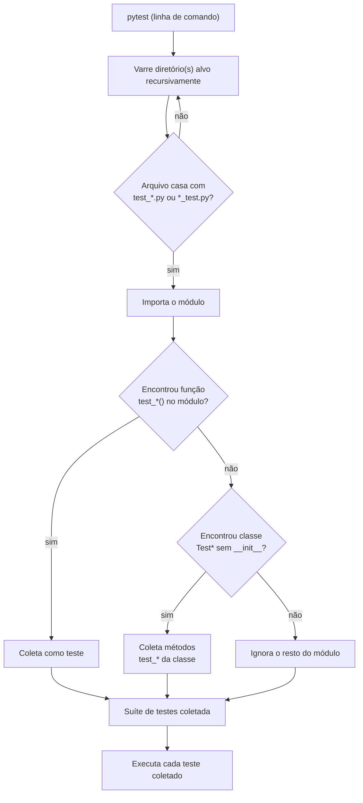
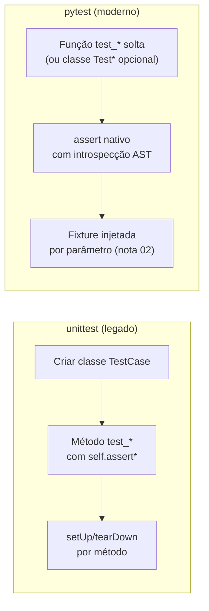

# pytest fundamentos — anatomia, discovery e assert introspection

> [!abstract] TL;DR
> `pytest` dominou o ecossistema Python porque testa com o `assert` nativo da linguagem — sem `self.assertEqual`, sem herdar de `TestCase` — e ainda assim produz uma mensagem de erro detalhada quando o assert falha, graças à **assert rewriting**: o pytest reescreve o bytecode do teste para capturar os valores intermediários da expressão. Um teste é uma função `test_*()` num arquivo `test_*.py`; o pytest **descobre** esses testes por convenção de nome, sem registro manual. Esta nota cobre a anatomia mínima, o mecanismo de discovery, os markers básicos (`skip`/`skipif`/`xfail`) e as flags de execução mais usadas (`-v`, `-k`, `-x`, `--pdb`). A pirâmide de testes e a filosofia de test doubles ficam em [[03-Dominios/Engenharia/Testes/index|Engenharia/Testes]] — aqui é só o ferramental.

## A surpresa do primeiro teste

Um dev que passou anos escrevendo Java abre seu primeiro projeto Python com suíte de testes. Ele já sabe o ritual: uma classe que estende `TestCase`, um método `setUp()`, e um `self.assertEqual(esperado, obtido)` para cada verificação — porque foi assim que aprendeu com JUnit 4 e com `unittest`, o framework de testes que vem na biblioteca padrão do Python e foi desenhado copiando o `JUnit` clássico (o próprio nome do módulo, `unittest`, é herança direta do `PyUnit` dos anos 2000). Ele escreve:

```python
import unittest

class TestCalculadora(unittest.TestCase):
    def test_soma(self):
        self.assertEqual(5, somar(2, 3))

    def test_divisao_por_zero(self):
        with self.assertRaises(ZeroDivisionError):
            dividir(10, 0)
```

Funciona. Mas um colega de time olha por cima do ombro e pergunta: "por que você não usa `assert` direto?" O dev estranha — `assert` é a palavra reservada crua do Python, a mesma que quebra com uma mensagem genérica e inútil tipo `AssertionError` sem contexto nenhum, certo? Ele testa, meio cético:

```python
def test_soma():
    assert somar(2, 3) == 5
```

Roda `pytest`. Passa. Aí ele **quebra o teste de propósito** pra ver a mensagem de erro — muda `somar(2, 3) == 5` para `somar(2, 3) == 6` — e o output do pytest mostra:

```
    def test_soma():
>       assert somar(2, 3) == 6
E       assert 5 == 6
E        +  where 5 = somar(2, 3)
```

Isso não é o `assert` nativo do Python fazendo isso sozinho. Um `assert` cru, rodado fora do pytest, produziria só `AssertionError` — sem valores, sem contexto. O que aconteceu é que o pytest **interceptou e reescreveu** o teste antes de executá-lo, para instrumentar aquela linha de `assert` e capturar os valores de cada subexpressão. Esse mecanismo — **assert rewriting** — é o motivo central pelo qual a comunidade Python largou o `unittest` verboso em favor do `pytest`: você escreve a asserção mais simples possível (`assert x == y`) e ainda ganha o diagnóstico rico que, em outras linguagens, só vem de uma biblioteca de assertions dedicada (como o AssertJ do Java, ver [[03-Dominios/Tecnologia/Java/Testes/03 - AssertJ — fluent assertions|AssertJ]]).

> [!question]- Se `assert` é uma palavra reservada da linguagem, como o pytest "reescreve" ela?
> O pytest não modifica o interpretador Python nem a semântica da linguagem. Ele age no momento de **importação** do arquivo de teste: um *import hook* customizado intercepta o carregamento do módulo, faz o parsing do código-fonte em uma **AST** (Abstract Syntax Tree — a árvore que representa a estrutura sintática do código antes de virar bytecode), localiza os nós `Assert`, e os substitui por uma versão instrumentada que guarda cada subexpressão numa variável temporária antes de montar a mensagem de erro. O bytecode final que a CPython realmente executa já vem alterado — mas só para arquivos de teste (`test_*.py`), nunca para o código de produção. Fora do pytest (rodando `python meu_teste.py` direto), a mesma linha de `assert` volta a ser o `assert` cru, sem introspecção nenhuma.

## Por que pytest venceu o unittest

Três fatores empilham a favor do pytest, e vale nomeá-los porque cada um resolve uma dor concreta de quem vem de outro ecossistema:

**1. Assert introspection sem biblioteca extra.** Como acabamos de ver, `assert a == b` já entrega o diagnóstico completo. Em `unittest`, o equivalente rico exige lembrar o método certo para cada tipo de comparação — `assertEqual`, `assertIn`, `assertIsInstance`, `assertAlmostEqual` para float, `assertRaises` para exceção — um vocabulário de dezenas de métodos que precisa ser memorizado ou consultado. No pytest, é sempre `assert`, e a expressão booleana comum do Python (`==`, `in`, `isinstance(...)`) já basta.

**2. Sintaxe enxuta, sem boilerplate de classe.** Um teste pytest pode ser uma função solta — nada de herdar `TestCase`, nada de `self`. Isso não é só estética: reduz o atrito de escrever o *primeiro* teste de um módulo pequeno, e deixa o corpo do teste mais perto de pseudocódigo.

**3. Ecossistema de plugins.** O pytest tem um sistema de *hooks* que permite plugins de terceiros injetarem comportamento — fixtures reutilizáveis, relatórios customizados, integração com frameworks web. `pytest-cov` (coverage), `pytest-mock` (wrapper de mocking), `pytest-django`, `pytest-asyncio`, `pytest-xdist` (paralelização) são só a ponta do iceberg. Esse ecossistema — coberto ao longo deste galho — é parte do motivo de o pytest ter se tornado o padrão de fato mesmo sem estar na biblioteca padrão.

> [!tip] pytest também roda testes escritos em unittest
> Um projeto legado com `unittest.TestCase` não precisa ser reescrito para adotar pytest: o `pytest` funciona como **test runner** para qualquer suíte, incluindo classes `TestCase` — ele descobre e executa esses testes normalmente, só sem o assert rewriting (que é específico do `assert` cru). Migração pode ser gradual: trocar o runner primeiro, reescrever os testes depois, um arquivo por vez.

## Anatomia de um teste pytest

Um teste pytest, no caso mais simples, é uma **função** cujo nome começa com `test_`, dentro de um **arquivo** cujo nome começa com `test_` ou termina com `_test.py`. Não há classe obrigatória, não há decorator obrigatório, não há import de framework para escrever o teste em si — só para as ferramentas extras (fixtures, markers).

```python
# test_calculadora.py

def somar(a, b):
    return a + b


def test_soma_dois_numeros_positivos():
    # Arrange: monta o cenário — aqui, trivial, só os operandos
    a, b = 2, 3

    # Act: executa a ação sob teste
    resultado = somar(a, b)

    # Assert: verifica o resultado
    assert resultado == 5
```

O padrão **AAA** (Arrange-Act-Assert) — já coberto em profundidade, de forma agnóstica de linguagem, em [[03-Dominios/Engenharia/Testes/index|Engenharia/Testes]] nota 03 — se aplica ao pytest exatamente como se aplica a qualquer framework: monta o cenário, executa a única ação sob teste, verifica o resultado. A diferença sintática pro Java (ver [[03-Dominios/Tecnologia/Java/Testes/02 - JUnit 5 — anatomia, lifecycle e o padrão AAA|JUnit 5 — anatomia, lifecycle e o padrão AAA]]) é que aqui não existe cerimônia de classe: a função é a unidade de teste, ponto final.

Isso não significa que classes sejam proibidas — pytest também descobre testes dentro de classes, desde que o nome da classe comece com `Test` e ela **não tenha um `__init__`** (regra que existe porque o pytest precisa conseguir instanciar a classe sem argumentos para coletar os testes):

```python
class TestCalculadora:
    def test_soma(self):
        assert somar(2, 3) == 5

    def test_subtracao(self):
        assert subtrair(5, 3) == 2
```

Classes são úteis para **agrupar** testes relacionados (compartilham um `setup_method`, por exemplo) — mas a unidade atômica continua sendo a função `test_*`, e a maioria dos projetos pytest modernos prefere funções soltas organizadas por módulo a classes, reservando classes para quando o agrupamento realmente ajuda a leitura.

### Testando uma exceção esperada

Onde `unittest` usa `self.assertRaises(TipoDeErro)` como *context manager*, o pytest tem `pytest.raises`, com a mesma forma de uso mas sem precisar de `self` nem de classe:

```python
import pytest


def dividir(a, b):
    if b == 0:
        raise ZeroDivisionError("não é possível dividir por zero")
    return a / b


def test_divisao_por_zero_levanta_excecao():
    with pytest.raises(ZeroDivisionError):
        dividir(10, 0)


def test_mensagem_da_excecao():
    # match aceita regex — útil para verificar não só o TIPO, mas o CONTEÚDO da mensagem
    with pytest.raises(ZeroDivisionError, match="não é possível dividir"):
        dividir(10, 0)
```

## Discovery: como o pytest encontra os testes

O discovery do pytest é **convenção sobre configuração** — não existe um arquivo central listando "estes são os testes". Rodar `pytest` na raiz de um projeto dispara um algoritmo de varredura:

1. Começa no(s) diretório(s) passado(s) na linha de comando (ou no diretório atual, se nenhum for passado).
2. Recursivamente entra em subdiretórios, ignorando os que começam com `.` ou correspondem a padrões de exclusão padrão (`__pycache__`, ambientes virtuais reconhecidos).
3. Dentro de cada diretório, coleta arquivos que casam com `test_*.py` ou `*_test.py` (o padrão é configurável via `python_files` no `pytest.ini`/`pyproject.toml`, mas a convenção-padrão é essa).
4. Dentro de cada arquivo coletado, importa o módulo e coleta:
   - funções cujo nome começa com `test_` (padrão `python_functions`);
   - classes cujo nome começa com `Test` (padrão `python_classes`) e, dentro delas, métodos `test_*`.



Note o detalhe do passo "casa com `test_*.py` ou `*_test.py`" — um arquivo chamado `calculadora_test_helpers.py` **não** é coletado (não termina em `_test.py`, termina em `_helpers.py`), mas `test_calculadora.py` e `calculadora_test.py` são ambos válidos. Essa convenção de nome é o motivo pelo qual pytest não precisa de um `TestSuite` explícito nem de registro manual: o *nome do arquivo e da função já É a configuração*.

> [!warning] Discovery silencioso é uma faca de dois gumes
> A vantagem de "não precisa configurar nada" tem um custo: um teste que você **acha** que está rodando pode simplesmente não estar sendo coletado, porque o arquivo ou a função não seguem a convenção de nome — e o pytest não avisa "ei, encontrei um arquivo `helpers_test_calc.py` que parece teste mas não bate o padrão". Um erro de digitação no prefixo (`tests_calculadora.py` em vez de `test_calculadora.py`) produz uma suíte "verde" silenciosamente incompleta — zero testes rodando dali, zero erro. Rode `pytest --collect-only` periodicamente para conferir que a contagem de testes coletados bate com o que você espera.

### Estrutura de diretório recomendada

A convenção mais comum em projetos Python de porte médio a grande separa o código de produção do código de teste, e replica a árvore de módulos dentro de `tests/`:

```
meu_projeto/
├── src/
│   └── meu_projeto/
│       ├── __init__.py
│       ├── calculadora.py
│       └── servicos/
│           ├── __init__.py
│           └── pedidos.py
├── tests/
│   ├── __init__.py
│   ├── test_calculadora.py
│   └── servicos/
│       └── test_pedidos.py
├── pyproject.toml
└── conftest.py
```

Espelhar a estrutura (`servicos/pedidos.py` → `tests/servicos/test_pedidos.py`) facilita achar o teste de um módulo dado o caminho do módulo, e vice-versa. A separação `src/` vs `tests/` como diretórios irmãos (em vez de misturar `test_*.py` dentro do próprio pacote de produção) evita que os testes sejam empacotados junto com o código quando o projeto é distribuído (`pip install`) — um detalhe que projetos que publicam pacote no PyPI levam a sério, mas que também vale como boa prática em APIs internas, por manter a árvore de produção limpa. A organização fina de diretório (`tests/unit` vs `tests/integration`) e os arquivos `conftest.py` como mecanismo de compartilhamento entre testes ficam para [[02 - Fixtures — escopos, yield e conftest.py|nota 02]] e [[03 - Parametrização e organização de suíte|nota 03]] deste galho.

## Markers básicos: skip, skipif, xfail

**Markers** são decorators que anexam metadados a um teste, mudando como o pytest o trata durante a coleta ou execução. Os três mais usados no dia a dia:

### `@pytest.mark.skip` — pula incondicionalmente

```python
import pytest


@pytest.mark.skip(reason="endpoint de exportação ainda não implementado")
def test_exporta_relatorio_pdf():
    ...
```

O teste é coletado, mas nunca executado — aparece no relatório como `SKIPPED`, com o motivo visível. Útil para marcar trabalho futuro sem apagar o esqueleto do teste nem deixá-lo falhar silenciosamente ignorado.

### `@pytest.mark.skipif` — pula condicionalmente

```python
import sys

import pytest


@pytest.mark.skipif(sys.version_info < (3, 11), reason="requer tomllib, disponível a partir do Python 3.11")
def test_le_configuracao_toml():
    ...
```

A condição é avaliada no momento da coleta. Casos comuns: versão do Python, sistema operacional, ausência de uma variável de ambiente (ex: pular um teste de integração se não houver `DATABASE_URL` configurada no ambiente de CI).

### `@pytest.mark.xfail` — falha esperada

```python
@pytest.mark.xfail(reason="bug conhecido no parser de datas, ver issue #142")
def test_parseia_data_com_fuso_horario_ambiguo():
    resultado = parsear_data("2026-07-11T10:00:00")
    assert resultado.tzinfo is not None
```

Diferente de `skip`, o `xfail` **executa** o teste — mas trata uma falha como esperada (`XFAIL` no relatório, não conta como erro na suíte) e, crucialmente, se o teste **passar** inesperadamente, o pytest reporta `XPASS`, sinalizando que o bug documentado pode ter sido corrigido (ou que o teste ficou frágil demais para capturar a regressão). É a ferramenta certa para documentar um bug conhecido sem quebrar o CI, mantendo visibilidade de que ele ainda está lá — e criando um lembrete automático quando deixar de estar.

> [!tip] `xfail(strict=True)` transforma XPASS em falha real
> Por padrão, um `XPASS` não quebra a build — é só um aviso. Com `@pytest.mark.xfail(reason="...", strict=True)`, um teste que passa inesperadamente **falha** a suíte. Vale usar `strict=True` quando o objetivo é forçar alguém a remover o marker explicitamente assim que o bug for corrigido, em vez de deixar o `xfail` esquecido para sempre num teste que já passa.

## Rodando: as flags do dia a dia

```bash
# Roda a suíte inteira em modo verboso — mostra o nome de cada teste e seu resultado
pytest -v

# Filtra por substring do nome do teste (ou marker, com -m)
pytest -k "divisao"
pytest -k "divisao and not zero"   # expressões booleanas são aceitas

# Para na primeira falha — útil ao depurar, evita rodar a suíte inteira
# até o primeiro erro estar resolvido
pytest -x

# Dropa no debugger (pdb) no ponto exato da falha
pytest --pdb

# Combinação comum durante desenvolvimento: filtro + parada + debugger
pytest -k "test_pedido_com_prazo_no_passado" -x --pdb
```

A tabela abaixo resume o propósito de cada flag e quando ela entra no fluxo de trabalho:

| Flag | O que faz | Quando usar |
|---|---|---|
| `-v` / `--verbose` | Lista cada teste coletado com seu resultado individual | Sempre que quiser visibilidade além do resumo `. F .` |
| `-k EXPR` | Roda só os testes cujo nome (ou marker) casa com a expressão | Iterando num teste específico ou num grupo relacionado |
| `-x` | Para no primeiro teste que falhar | Depuração — evita ruído de N falhas em cascata |
| `--pdb` | Ao falhar, dropa numa sessão interativa do debugger `pdb` no ponto da falha | Investigar o estado exato das variáveis no momento do erro |
| `-m MARKER` | Roda só os testes com um marker específico (`pytest -m slow`) | Separar testes rápidos de lentos/de integração |
| `--collect-only` | Lista os testes que seriam coletados, sem executá-los | Conferir que o discovery pegou o que deveria |

> [!question]- `-x` para no primeiro erro de um arquivo, ou da suíte inteira?
> Da suíte inteira. `pytest -x` interrompe a execução assim que **qualquer** teste falhar, independente de em qual arquivo ele está — a coleta continua normal (todos os testes são descobertos), mas a execução para no primeiro `FAILED`. Uma variante é `--maxfail=N`, que permite até N falhas antes de abortar — útil quando você quer ver "as primeiras 3 falhas" sem esperar a suíte inteira nem parar na primeira.

## O contraste com unittest

O `unittest` da biblioteca padrão não vai a lugar nenhum — projetos legados o usam, e o pytest sabe rodar suítes `unittest` sem modificação, como já mencionado. Mas vale nomear a diferença de filosofia de uma vez, para quem chega de um ecossistema onde `TestCase`/`setUp`/`assertEqual` é o vocabulário natural (Java, com JUnit 3/4, tem a mesma forma):

```python
# Estilo unittest: herança obrigatória, self.assert*, setUp/tearDown como métodos
import unittest


class TestPedido(unittest.TestCase):
    def setUp(self):
        self.pedido = Pedido()

    def test_pedido_vazio_tem_total_zero(self):
        self.assertEqual(0, self.pedido.total())

    def tearDown(self):
        self.pedido = None


# Estilo pytest: função solta, assert nativo, fixture (nota 02) no lugar de setUp/tearDown
import pytest


@pytest.fixture
def pedido():
    return Pedido()


def test_pedido_vazio_tem_total_zero(pedido):
    assert pedido.total() == 0
```

A diferença não é só sintática. `setUp`/`tearDown` do `unittest` amarram a preparação de estado à hierarquia de classe — se dois testes de classes diferentes precisam do mesmo setup, ele é duplicado ou movido para uma superclasse comum. O mecanismo de **fixtures** do pytest (nota 02 deste galho) é uma forma de injeção de dependência: a fixture existe uma vez, é declarada por nome como parâmetro do teste, e compartilhada entre qualquer teste que precise dela, sem hierarquia de herança nenhuma. É uma diferença de arquitetura, não só de estilo de código.

| Aspecto | `unittest` | `pytest` |
|---|---|---|
| Unidade de teste | Método dentro de `TestCase` | Função solta (classe é opcional) |
| Asserção | `self.assertEqual(a, b)` e ~40 variantes | `assert a == b` (introspecção automática) |
| Setup/teardown por teste | `setUp()` / `tearDown()` (métodos de instância) | Fixture com escopo `function` (nota 02) |
| Setup/teardown por classe/módulo | `setUpClass()` / `tearDownClass()` (static) | Fixture com escopo `class`/`module`/`session` |
| Compartilhar setup entre arquivos | Superclasse comum (herança) | `conftest.py` (sem herança, sem import explícito) |
| Exceção esperada | `with self.assertRaises(Tipo):` | `with pytest.raises(Tipo, match="...")` |
| Origem | Biblioteca padrão (inspirado no JUnit 3/4) | Pacote de terceiros (`pip install pytest`), plugin-first |
| Roda testes do outro? | Não roda testes pytest nativamente | Sim, roda suítes `unittest` sem modificação |

O gráfico abaixo resume a mesma comparação como fluxo: o caminho `unittest` sempre passa por uma classe; o caminho pytest bifurca — função solta é o caminho comum, classe é opcional.



## Configuração mínima: pytest.ini, pyproject.toml e testpaths

O pytest funciona sem nenhum arquivo de configuração — mas, na prática, todo projeto real ganha um pouco de configuração explícita assim que a suíte cresce além de um punhado de arquivos. A configuração pode viver em `pytest.ini` (arquivo dedicado), `pyproject.toml` (seção `[tool.pytest.ini_options]`, a opção preferida em projetos modernos que já centralizam configuração de build ali) ou `tox.ini`/`setup.cfg` (legado). O pytest procura esses arquivos subindo a árvore de diretórios a partir de onde foi invocado, e o primeiro encontrado também define o **rootdir** — a raiz que ancora caminhos relativos e a busca por `conftest.py`.

```toml
# pyproject.toml
[tool.pytest.ini_options]
testpaths = ["tests"]              # onde procurar testes por padrão (evita varrer o repo inteiro)
python_files = ["test_*.py"]       # convenção de nome de arquivo (pode restringir o padrão default)
addopts = "-v --strict-markers"    # flags aplicadas em toda invocação de `pytest`
markers = [
    "slow: marca testes que demoram mais que 1s (rodar com -m 'not slow' no dia a dia)",
    "integration: marca testes que dependem de banco de dados ou rede",
]
```

Dois detalhes valem destaque: `testpaths` restringe o discovery a um diretório específico — sem isso, um `pytest` disparado na raiz de um monorepo pode varrer diretórios irrelevantes e desperdiçar tempo (ou, pior, coletar acidentalmente algo que casa com o padrão de nome mas não é teste de verdade). E `--strict-markers` (dentro de `addopts`) faz o pytest **falhar** se um teste usar um marker não registrado na lista `markers` — sem essa flag, um typo como `@pytest.mark.slwo` (em vez de `slow`) é silenciosamente ignorado, sem erro nem aviso, e o teste simplesmente não é filtrado como esperado depois. Registrar markers customizados explicitamente é a prática recomendada assim que a suíte passa a usar mais de skip/skipif/xfail — tema desenvolvido em [[03 - Parametrização e organização de suíte|nota 03]] deste galho.

> [!tip] Exit codes do pytest são informação, não só sucesso/falha
> O processo `pytest` termina com código `0` (todos os testes passaram), `1` (algum teste falhou), `2` (execução interrompida pelo usuário), `3` (erro interno), `4` (erro de uso da linha de comando) ou `5` (nenhum teste foi coletado). O código `5` é particularmente valioso em CI: sem ele, um pipeline mal configurado que aponta para o diretório errado (e por isso não coleta nenhum teste) reportaria "sucesso" com zero testes rodados — um falso positivo perigoso. Um step de CI que checa explicitamente o exit code (ou usa `--strict-markers` combinado com um mínimo de testes esperado) evita essa armadilha silenciosa.

## Armadilhas

### (1) Confundir `assert` de teste com asserção de produção

Como o `assert` do pytest é o mesmo `assert` da linguagem, existe a tentação de deixar `assert`s de validação dentro do código de produção pensando que "funciona igual". Não funciona: fora de um arquivo coletado pelo pytest, `assert` continua sendo o `assert` cru do Python — e, mais grave, o Python **remove** todos os `assert`s do bytecode quando rodado com a flag de otimização `-O` (ou `PYTHONOPTIMIZE=1`). Um `assert` usado para validação de negócio em produção simplesmente desaparece silenciosamente nesse modo. `assert` é ferramenta de teste e de invariante de desenvolvimento (documentar uma premissa que "nunca deveria" ser falsa) — nunca validação de input de usuário, que deve levantar uma exceção explícita (`ValueError`, uma exceção de domínio) independente de flag de otimização.

### (2) Nomear um arquivo helper como se fosse teste

```python
# tests/test_helpers.py — nome ambíguo!
def test_data_valida():  # não é um teste de verdade, é uma função utilitária
    ...
```

Um arquivo `tests/helpers.py` com uma função `criar_data_valida()` (sem prefixo `test_`) não seria coletado — mas se alguém nomear por engano `test_data_valida()` pensando em "dado de teste válido" em vez de "um teste que verifica data válida", o pytest coleta e tenta **executar** como teste, o que costuma quebrar (a função pode esperar argumentos que o pytest não sabe fornecer, gerando um erro de coleta confuso). Mantenha utilitários de apoio em arquivos que não batem o padrão `test_*.py`/`*_test.py` (ex: `tests/helpers.py`, `tests/factories.py`), e reserve o prefixo `test_` exclusivamente para funções que são, de fato, casos de teste.

## Na prática: um caso de negócio completo

Para fechar com um exemplo além da calculadora de brinquedo, considere um pedaço pequeno mas realista de uma API de tarefas — o mesmo domínio construído nos Galhos 9-11 desta trilha. A regra: um `Pedido` tem itens, cada um com preço e quantidade, e aplica desconto progressivo a partir de um certo valor total.

```python
# src/pedidos/modelo.py
from dataclasses import dataclass, field


@dataclass
class Item:
    nome: str
    preco_unitario: float
    quantidade: int = 1

    @property
    def subtotal(self) -> float:
        return self.preco_unitario * self.quantidade


@dataclass
class Pedido:
    itens: list[Item] = field(default_factory=list)

    def adicionar(self, item: Item) -> None:
        self.itens.append(item)

    @property
    def subtotal_bruto(self) -> float:
        return sum(item.subtotal for item in self.itens)

    @property
    def total_com_desconto(self) -> float:
        bruto = self.subtotal_bruto
        if bruto >= 500:
            return bruto * 0.90  # 10% de desconto acima de R$500
        if bruto >= 200:
            return bruto * 0.95  # 5% de desconto acima de R$200
        return bruto
```

E a suíte de teste correspondente, já usando os elementos cobertos nesta nota — funções soltas, `assert` nativo, `pytest.raises` quando cabe, e um marker `xfail` documentando uma regra de negócio ainda não implementada:

```python
# tests/test_pedidos.py
import pytest

from pedidos.modelo import Item, Pedido


def test_pedido_vazio_tem_subtotal_zero():
    pedido = Pedido()
    assert pedido.subtotal_bruto == 0


def test_pedido_sem_desconto_abaixo_de_duzentos():
    pedido = Pedido()
    pedido.adicionar(Item(nome="Caneta", preco_unitario=10.0, quantidade=5))

    assert pedido.subtotal_bruto == 50.0
    assert pedido.total_com_desconto == 50.0  # sem desconto, abaixo do limiar


def test_pedido_aplica_cinco_por_cento_entre_duzentos_e_quinhentos():
    pedido = Pedido()
    pedido.adicionar(Item(nome="Monitor", preco_unitario=250.0, quantidade=1))

    assert pedido.total_com_desconto == pytest.approx(237.50)
    # pytest.approx evita falha por imprecisão de ponto flutuante em comparação de float


def test_pedido_aplica_dez_por_cento_acima_de_quinhentos():
    pedido = Pedido()
    pedido.adicionar(Item(nome="Notebook", preco_unitario=600.0, quantidade=1))

    assert pedido.total_com_desconto == pytest.approx(540.00)


@pytest.mark.xfail(reason="cupom de desconto ainda não implementado — ver backlog #58")
def test_pedido_aceita_cupom_de_desconto_adicional():
    pedido = Pedido()
    pedido.adicionar(Item(nome="Notebook", preco_unitario=600.0, quantidade=1))

    pedido.aplicar_cupom("BEMVINDO10")  # método que ainda não existe no modelo

    assert pedido.total_com_desconto < 540.00
```

Rodando `pytest -v tests/test_pedidos.py`, o output lista cada teste com seu nome completo e resultado (`PASSED`, `XFAIL`), sem precisar de nenhuma classe `TestCase`, nenhum `setUp`, nenhum registro manual de suíte — só a convenção de nome fazendo o trabalho de discovery, e o `assert` nativo fazendo o trabalho de verificação. É esse par — discovery por convenção e assert introspection — que forma o alicerce sobre o qual as próximas oito notas deste galho constroem fixtures, parametrização, mocking e a suíte completa da API de Tarefas.

> [!question]- Por que usar `pytest.approx` em vez de comparar float com `==` direto?
> Ponto flutuante binário não representa exatamente a maioria dos decimais — `0.1 + 0.2 == 0.3` é `False` em Python (e em praticamente toda linguagem que usa IEEE 754), porque o resultado real da soma é `0.30000000000000004`. Um `assert total == 237.50` pode falhar por uma diferença de centésimos de centavo de erro de arredondamento, mesmo quando a lógica de negócio está correta. `pytest.approx(237.50)` compara com uma tolerância relativa pequena (por padrão, `1e-6`), absorvendo esse ruído de representação sem mascarar um erro de cálculo real, que tipicamente produz uma diferença muito maior que a tolerância.

## Em resumo

O pytest venceu o `unittest` porque removeu atrito em todos os pontos onde `unittest` copiava cerimônia do JUnit 3/4: nada de herdar `TestCase`, nada de decorar cada comparação com um método `assert*` específico, nada de configuração central de suíte — o `assert` nativo com introspecção via reescrita de AST entrega diagnóstico rico de graça, e a convenção de nome (`test_*.py`, `test_*()`) faz o discovery acontecer sem registro manual. Isso não é "pytest é mágico" — é um framework que decidiu investir engenharia (o import hook, a reescrita de bytecode) para que o código do usuário pudesse ficar simples. As próximas notas deste galho constroem em cima desse alicerce: [[02 - Fixtures — escopos, yield e conftest.py|fixtures]] formalizam a injeção de dependência que `setUp`/`tearDown` faziam de forma mais rígida, e [[08 - TDD na prática com pytest|TDD na prática]] mostra o ciclo red-green-refactor rodando sobre esse ferramental num caso de negócio real.

## Fontes

- pytest documentation — How to write and report assertions in tests (assert rewriting): https://docs.pytest.org/en/stable/how-to/assert.html (consultado em 2026-07-11)
- pytest documentation — How to invoke pytest: https://docs.pytest.org/en/stable/how-to/usage.html (consultado em 2026-07-11)
- pytest documentation — Test discovery / conftest.py: https://docs.pytest.org/en/stable/explanation/goodpractices.html (consultado em 2026-07-11)
- pytest documentation — Skip and xfail: mark test functions as skipped or as an expected failure: https://docs.pytest.org/en/stable/how-to/skipping.html (consultado em 2026-07-11)
- Real Python — Effective Python Testing With pytest: https://realpython.com/pytest-python-testing/ (consultado em 2026-07-11)
- Percival, H. & Gregory, B. — *Architecture Patterns with Python* (referência de disciplina de testes usada na trilha; capítulos de TDD)

## Veja também

- [[03-Dominios/Engenharia/Testes/index|Testes (Engenharia)]] — teoria e estratégia stack-agnóstica: pirâmide de testes, AAA, test doubles, TDD
- [[03-Dominios/Tecnologia/Java/Testes/02 - JUnit 5 — anatomia, lifecycle e o padrão AAA|JUnit 5 — anatomia, lifecycle e o padrão AAA]] — mesma anatomia de framework, stack Java
- [[02 - Fixtures — escopos, yield e conftest.py|02 — Fixtures: escopos, yield e conftest.py]] — o mecanismo de injeção de dependência que sucede `setUp`/`tearDown`
- [[08 - TDD na prática com pytest|08 — TDD na prática com pytest]] — o ciclo red-green-refactor aplicado com este ferramental
- [[03-Dominios/Tecnologia/Python/Testes/index|Testes (MOC do galho)]]
