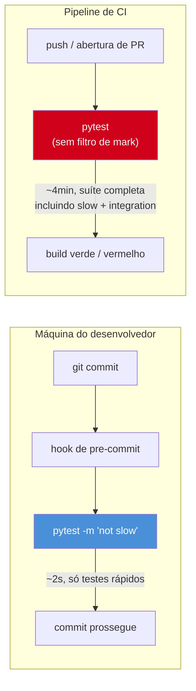
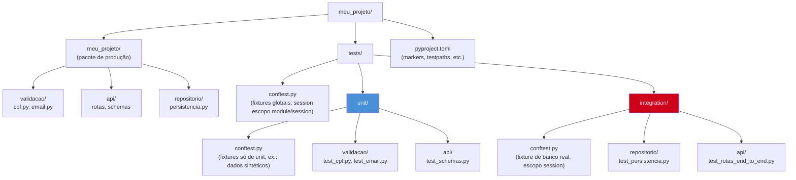

# Parametrização e organização de suíte

> [!abstract] TL;DR
> `@pytest.mark.parametrize` elimina a duplicação de testes quase-idênticos que só variam o dado de entrada — uma função de teste, N casos, em vez de N funções copiadas e coladas (com o risco estrutural de um `assert` esquecido no copy-paste). O parâmetro `ids` transforma o output do `pytest -v` de `test_valida[case3]` em algo legível, tipo `test_valida[cpf-com-digito-verificador-invalido]`. Marks customizados (`@pytest.mark.slow`) precisam ser registrados em `pyproject.toml` para não gerar warning, e habilitam execução seletiva com `-m "not slow"` — testes rápidos no pre-commit, suíte completa só em CI. E a organização de diretório (`tests/unit/` espelhando o pacote de produção, `conftest.py` em níveis diferentes da árvore) é o que faz uma suíte de 15 testes continuar navegável quando ela vira 500.

## Quinze testes, um bug escondido no copy-paste

Uma fintech pequena escreveu um validador de CPF para o cadastro de clientes — a função que confere se os dois dígitos verificadores batem com o algoritmo módulo 11, além de rejeitar CPFs com todos os dígitos iguais (`"111.111.111-11"`, que passaria matematicamente no cálculo do dígito verificador mas é conhecido por não ser um CPF real, usado historicamente para preencher formulários que exigem o campo). A função:

```python
def valida_cpf(cpf: str) -> bool:
    """Valida um CPF (formato livre: aceita com ou sem pontuação)."""
    digitos = [int(c) for c in cpf if c.isdigit()]

    if len(digitos) != 11:
        return False

    # Rejeita sequências de dígito repetido (111.111.111-11, 222.222.222-22, ...)
    if len(set(digitos)) == 1:
        return False

    def calcula_digito_verificador(digitos_base: list[int]) -> int:
        peso_inicial = len(digitos_base) + 1
        soma = sum(d * peso for d, peso in zip(digitos_base, range(peso_inicial, 1, -1)))
        resto = (soma * 10) % 11
        return 0 if resto == 10 else resto

    primeiro_dv = calcula_digito_verificador(digitos[:9])
    segundo_dv = calcula_digito_verificador(digitos[:9] + [primeiro_dv])

    return digitos[9] == primeiro_dv and digitos[10] == segundo_dv
```

O time de QA escreveu a suíte de testes do jeito mais óbvio para quem está começando com `pytest` — uma função por caso de negócio, seguindo o padrão de nomenclatura `test_<descrição>` que a [[03-Dominios/Tecnologia/Python/Testes/01 - pytest fundamentos — anatomia, discovery e assert introspection|nota 01 deste galho]] já apresentou:

```python
def test_cpf_valido_com_pontuacao():
    assert valida_cpf("529.982.247-25") is True

def test_cpf_valido_sem_pontuacao():
    assert valida_cpf("52998224725") is True

def test_cpf_com_todos_digitos_iguais_e_invalido():
    assert valida_cpf("111.111.111-11") is False

def test_cpf_com_primeiro_digito_verificador_errado():
    assert valida_cpf("529.982.247-15") is False

def test_cpf_com_segundo_digito_verificador_errado():
    assert valida_cpf("529.982.247-26") is False

def test_cpf_com_menos_de_onze_digitos_e_invalido():
    assert valida_cpf("529.982.247") is False

def test_cpf_com_mais_de_onze_digitos_e_invalido():
    assert valida_cpf("529.982.247-255") is False

def test_cpf_vazio_e_invalido():
    assert valida_cpf("") is False

def test_cpf_com_letras_e_invalido():
    assert valida_cpf("529.982.abc-25") is False

# ... e mais seis funções no mesmo molde, cobrindo outros CPFs válidos conhecidos
# (usados para testar a fórmula do módulo 11 contra vários pontos do espaço de entrada)
```

Quinze funções, noventa por cento delas idênticas em estrutura: monta uma string de CPF, chama `valida_cpf`, compara o resultado com um booleano esperado. A única coisa que muda de uma função para a outra é a *string* e o *booleano*. Três meses depois, alguém adicionou mais um caso — um CPF com todos os dígitos zero (`"000.000.000-00"`) — copiando a função mais parecida (`test_cpf_com_todos_digitos_iguais_e_invalido`) e trocando o valor do CPF:

```python
def test_cpf_com_todos_digitos_zero_e_invalido():
    cpf = "000.000.000-00"
    resultado = valida_cpf(cpf)
    assert resultado is False  # ainda "False" — copiado da função anterior
```

Esse caso específico deu certo por acaso, porque a asserção esperada (`False`) coincidiu com a do caso copiado. O problema real apareceu na semana seguinte, quando outra pessoa copiou `test_cpf_valido_sem_pontuacao` para testar mais um CPF válido conhecido, mas — no meio de uma tarde cheia de reuniões — esqueceu de trocar o `assert ... is True` residual de um rascunho anterior que tinha ficado colado no clipboard, e commitou:

```python
def test_cpf_valido_outro_exemplo():
    cpf = "398.808.938-77"  # CPF válido, dígitos verificadores corretos
    assert valida_cpf(cpf) is False  # deveria ser True — copy-paste trouxe o assert errado
```

O teste passou. Não porque `valida_cpf` estivesse certa — ela retorna `True` para esse CPF, como deveria — mas porque o teste, por engano, virou "eu espero que a validação **rejeite** um CPF válido", e como isso é falso, o `assert` deveria ter falhado... só que na revisão apressada do PR, ninguém notou que a lógica do teste estava invertida, porque o nome da função (`test_cpf_valido_outro_exemplo`) parecia genérico o bastante para não levantar suspeita, e o CI reportou "15 passed" como sempre. O bug ficou dormente: a suíte não estava testando o que o nome dizia que estava testando, e continuaria "verde" mesmo que alguém quebrasse a validação de CPFs válidos amanhã, porque aquele caso específico estava, por acidente, testando o inverso.

Isso não é um problema de disciplina de quem escreveu o teste — é um problema **estrutural** do formato "quinze funções quase idênticas". Cada cópia é uma nova chance de esquecer de trocar alguma coisa (o CPF, o valor esperado, ou os dois), e nada no formato torna esse tipo de erro visualmente óbvio numa revisão de código — quinze blocos parecidos, cada um com uma pequena variação, é exatamente o tipo de texto que o olho humano lê por cima, confiando no padrão repetido em vez de conferir cada linha. `@pytest.mark.parametrize` resolve isso não corrigindo o hábito de quem escreve o teste, mas **eliminando a superfície onde o erro pode acontecer**: existe uma função só, um `assert` só, e os quinze casos viram dados — uma tabela que se lê de cima a baixo, onde qualquer inconsistência salta aos olhos porque todas as linhas têm exatamente a mesma forma.

## `@pytest.mark.parametrize`: uma função, N casos

### Sintaxe básica

`@pytest.mark.parametrize` recebe dois argumentos posicionais: uma string com o(s) nome(s) dos parâmetros (separados por vírgula, se forem mais de um) que a função de teste vai receber, e uma lista de tuplas — uma tupla por caso, na mesma ordem dos nomes declarados. O `pytest` gera uma **invocação separada da função de teste para cada tupla**, cada uma reportada individualmente no output:

```python
import pytest

@pytest.mark.parametrize(
    "cpf,esperado",
    [
        ("529.982.247-25", True),
        ("52998224725", True),
        ("111.111.111-11", False),
        ("000.000.000-00", False),
        ("529.982.247-15", False),
        ("529.982.247-26", False),
        ("529.982.247", False),
        ("529.982.247-255", False),
        ("", False),
        ("529.982.abc-25", False),
    ],
)
def test_valida_cpf(cpf, esperado):
    assert valida_cpf(cpf) is esperado
```

Uma função, uma asserção, dez linhas de dados. Isso é a mesma quantidade de casos das primeiras dez funções da suíte original — comprimidas em um bloco onde cada linha tem exatamente a mesma forma sintática (`"<cpf>", <booleano>`), o que faz qualquer inconsistência (uma vírgula fora do lugar, um booleano que não bate com o comentário mental de "isso deveria ser válido") pular aos olhos numa leitura rápida, em vez de se esconder atrás da similaridade estrutural de quinze `def`s parecidos.

Rodando com `pytest -v`, cada tupla vira uma linha independente no relatório:

```
test_cpf.py::test_valida_cpf[529.982.247-25-True] PASSED
test_cpf.py::test_valida_cpf[52998224725-True] PASSED
test_cpf.py::test_valida_cpf[111.111.111-11-False] PASSED
test_cpf.py::test_valida_cpf[000.000.000-00-False] PASSED
test_cpf.py::test_valida_cpf[529.982.247-15-False] PASSED
...
```

Isso já resolve o problema estrutural do copy-paste: se alguém adicionar `("398.808.938-77", False)` por engano (o mesmo erro do incidente anterior — um CPF válido com o booleano invertido), a linha fica visível lado a lado com as outras nove, todas seguindo o mesmo padrão `"<cpf-válido>", True`. Não elimina 100% a chance de erro humano — ainda é possível digitar o booleano errado — mas colapsa a superfície de dez lugares onde o erro pode se esconder (dez corpos de função, cada um podendo ter um `assert` desalinhado do nome) para um lugar só (uma tabela de dados, onde o padrão visual repetido torna o outlier óbvio).

> [!question]- Por que não usar simplesmente um loop `for` dentro de uma função de teste, iterando sobre a lista de casos?
> Porque um `for` dentro de um único `test_*` produz **um resultado só** para o `pytest` — se o terceiro caso do loop falhar, o teste inteiro é reportado como "1 failed", e os relatórios de CI, ferramentas de cobertura e o próprio contador "X passed, Y failed" enxergam aquilo como um teste único, escondendo quantos dos N casos realmente passaram. Pior: dependendo de como o loop é escrito, um `assert` que falha no meio interrompe a execução do resto do loop (a exceção do `assert` propaga e aborta a função), então os casos posteriores nem chegam a rodar naquela execução — você descobre que o caso 3 falhou, mas não sabe se os casos 4 a 10 também falhariam, até corrigir o caso 3 e rodar de novo. `@pytest.mark.parametrize` gera uma invocação de teste **de verdade** por caso — cada uma isolada, cada uma reportada individualmente, e uma falha em um caso não impede os outros de rodar e serem reportados na mesma execução.

### Múltiplos parâmetros e casos vindos de função

Quando os dados de teste não cabem confortavelmente numa lista literal — porque são construídos, ou porque vêm de outro lugar do código de produção — o segundo argumento de `parametrize` aceita qualquer iterável, não só uma lista escrita à mão. É comum extrair a lista de casos para uma variável no topo do módulo, o que também facilita reutilizá-la em mais de um teste:

```python
CASOS_CPF_INVALIDO_POR_FORMATO = [
    pytest.param("529.982.247", id="menos-de-11-digitos"),
    pytest.param("529.982.247-255", id="mais-de-11-digitos"),
    pytest.param("", id="string-vazia"),
    pytest.param("529.982.abc-25", id="contem-letras"),
    pytest.param(None, id="none-em-vez-de-string"),
]

@pytest.mark.parametrize("cpf_malformado", CASOS_CPF_INVALIDO_POR_FORMATO)
def test_valida_cpf_rejeita_formato_malformado(cpf_malformado):
    # cpf_malformado pode ser None — a função precisa lidar com isso sem estourar exceção
    if cpf_malformado is None:
        with pytest.raises(TypeError):
            valida_cpf(cpf_malformado)
    else:
        assert valida_cpf(cpf_malformado) is False
```

Repare no uso de `pytest.param(...)` em vez de uma tupla crua — isso é o mecanismo que dá nome explícito a cada caso, o assunto da próxima seção.

## `ids`: dando nome aos casos no output do pytest

Sem nenhuma configuração extra, o `pytest` gera um `id` automático para cada caso de parametrização a partir do próprio valor — números e strings curtas aparecem literalmente no `id` (como nos exemplos acima, `[529.982.247-25-True]`), mas valores mais complexos (listas, dicionários, objetos) degradam para `case0`, `case1`, `case2`... Mesmo quando o valor aparece literal, um `id` como `[529.982.247-15-False]` não comunica **por que** aquele CPF é inválido (dígito verificador errado? Sequência repetida?) — quem lê o relatório de CI precisa abrir o código do teste para entender o que quebrou.

`ids` resolve isso de duas formas: uma lista paralela de strings, ou (a forma que este vault recomenda por escalar melhor conforme os casos crescem) `pytest.param(..., id="...")` — associar o nome ao caso, no mesmo lugar onde o caso é definido, em vez de manter duas listas sincronizadas manualmente:

```python
@pytest.mark.parametrize(
    "cpf,esperado",
    [
        pytest.param("529.982.247-25", True, id="cpf-valido-com-pontuacao"),
        pytest.param("52998224725", True, id="cpf-valido-sem-pontuacao"),
        pytest.param("111.111.111-11", False, id="todos-digitos-iguais-a-1"),
        pytest.param("000.000.000-00", False, id="todos-digitos-iguais-a-0"),
        pytest.param("529.982.247-15", False, id="primeiro-digito-verificador-errado"),
        pytest.param("529.982.247-26", False, id="segundo-digito-verificador-errado"),
        pytest.param("529.982.247", False, id="menos-de-onze-digitos"),
        pytest.param("529.982.247-255", False, id="mais-de-onze-digitos"),
        pytest.param("", False, id="string-vazia"),
        pytest.param("529.982.abc-25", False, id="contem-letras"),
    ],
)
def test_valida_cpf(cpf, esperado):
    assert valida_cpf(cpf) is esperado
```

O output de `pytest -v` passa a ler como uma especificação em prosa, em vez de uma lista de valores brutos:

```
test_cpf.py::test_valida_cpf[cpf-valido-com-pontuacao] PASSED
test_cpf.py::test_valida_cpf[cpf-valido-sem-pontuacao] PASSED
test_cpf.py::test_valida_cpf[todos-digitos-iguais-a-1] PASSED
test_cpf.py::test_valida_cpf[todos-digitos-iguais-a-0] PASSED
test_cpf.py::test_valida_cpf[primeiro-digito-verificador-errado] PASSED
test_cpf.py::test_valida_cpf[segundo-digito-verificador-errado] FAILED
test_cpf.py::test_valida_cpf[menos-de-onze-digitos] PASSED
...
```

Um `FAILED` em `[segundo-digito-verificador-errado]` conta uma história completa sem que ninguém precise abrir o arquivo de teste — quem lê o log do CI já sabe qual regra de negócio quebrou. Isso também é o que torna `-k` (filtro por substring do nome do teste, apresentado na [[03-Dominios/Tecnologia/Python/Testes/01 - pytest fundamentos — anatomia, discovery e assert introspection|nota 01]]) útil em conjunto com parametrização: `pytest -k "digito-verificador"` roda só os dois casos que exercitam a lógica do dígito verificador, sem precisar saber a posição numérica deles na lista.

> [!warning] `id` duplicado ou parcialmente vazio
> Se dois casos de `parametrize` acabarem com o mesmo `id` (por exemplo, dois `pytest.param(..., id="cpf-invalido")` diferentes), o `pytest` desambigua automaticamente sufixando um contador (`cpf-invalido0`, `cpf-invalido1`) — o que já é sinal de que os `id`s escolhidos não são específicos o bastante para comunicar a diferença entre os casos. Vale tratar isso como um cheiro de código no teste: um bom `id` descreve **o que torna aquele caso diferente dos outros**, não uma categoria genérica repetida.

> [!tip] `ids` como callable, para listas de casos muito grandes
> Quando os casos vêm de uma lista construída em outro lugar (não escrita à mão caso a caso), `parametrize` aceita `ids=<função>` — uma função que recebe cada valor e retorna a string do `id`. Isso evita duplicar `pytest.param(..., id=...)` para dezenas ou centenas de casos gerados programaticamente (por exemplo, uma lista de CPFs válidos conhecidos carregada de um arquivo de fixture de dados).

## Parametrização empilhada: produto cartesiano de casos

É possível empilhar mais de um `@pytest.mark.parametrize` na mesma função — o `pytest` gera o **produto cartesiano** de todas as combinações. Um teste com dois decorators, um com 3 casos e outro com 4, produz 12 invocações (3 × 4), cada combinação testada independentemente:

```python
@pytest.mark.parametrize("formato", ["com_pontuacao", "sem_pontuacao"])
@pytest.mark.parametrize("cpf_base", ["52998224725", "39880893877", "11144477735"])
def test_valida_cpf_em_qualquer_formato(cpf_base, formato):
    cpf = formatar_cpf(cpf_base, formato)  # função auxiliar hipotética
    assert valida_cpf(cpf) is True
```

Essa técnica é útil quando dois eixos de variação são genuinamente independentes um do outro (aqui: qual CPF válido, e qual formato de apresentação), mas cresce rápido — produto cartesiano de 10 × 10 já são 100 invocações — e vale usar com moderação, preferindo uma lista única de tuplas quando os casos não são combinações livres, mas pares específicos que fazem sentido testar juntos.

## Marks customizados: registrar, aplicar, selecionar

`@pytest.mark.slow`, `@pytest.mark.integration`, `@pytest.mark.smoke` — qualquer nome depois de `pytest.mark.` funciona sintaticamente sem nenhuma configuração, mas rodar a suíte sem registrar esses marks primeiro produz um warning (`PytestUnknownMarkWarning`) para cada um, porque o `pytest` não tem como distinguir um mark customizado intencional de um erro de digitação em `@pytest.mark.slwo`. A correção é registrar cada mark customizado explicitamente.

### Registrando em `pyproject.toml`

A seção `[tool.pytest.ini_options]` do `pyproject.toml` (alternativa moderna ao arquivo `pytest.ini` separado — ambos funcionam, mas `pyproject.toml` evita mais um arquivo de configuração na raiz do projeto) aceita a chave `markers`, uma lista de strings no formato `"<nome>: <descrição>"`:

```toml
[tool.pytest.ini_options]
markers = [
    "slow: testes que levam mais de 1s para rodar (ex.: sobem container, fazem I/O de rede)",
    "integration: testes que dependem de um recurso externo real (banco, API, fila)",
    "smoke: subconjunto mínimo de testes que valida que o sistema não está quebrado",
]
```

Com o mark registrado, `pytest --strict-markers` (recomendado em CI) passa a **falhar** — em vez de só avisar — se algum teste usar um mark não registrado, o que pega erros de digitação (`@pytest.mark.slwo`) antes que eles silenciosamente façam um teste "lento" nunca ser filtrado corretamente.

### Aplicando o mark

O decorator vai na função (ou na classe, aplicando a todos os testes dela):

```python
import time
import pytest

@pytest.mark.slow
def test_validacao_em_lote_de_cem_mil_cpfs():
    cpfs = carregar_lote_de_teste("fixtures/cem_mil_cpfs.csv")
    resultados = [valida_cpf(cpf) for cpf in cpfs]
    assert len(resultados) == 100_000


@pytest.mark.integration
@pytest.mark.slow
def test_validacao_de_cpf_contra_api_da_receita_federal_simulada():
    # sobe um servidor de teste que simula a API de consulta de CPF,
    # exercitando o cliente HTTP de verdade — não é mais um teste unitário puro
    ...
```

Um teste pode acumular mais de um mark — o exemplo acima é `slow` e `integration` ao mesmo tempo, e ambos os filtros se aplicam a ele.

### Selecionando com `-m`

A flag `-m` (não confundir com `-k`, que filtra por substring do **nome**; `-m` filtra por **mark**) aceita uma expressão booleana sobre os marks registrados:

```bash
# roda só os testes marcados como slow
pytest -m "slow"

# roda tudo, EXCETO os marcados como slow — a forma mais comum no dia a dia
pytest -m "not slow"

# combina: testes de integração que também são lentos
pytest -m "integration and slow"

# testes rápidos E que não dependem de integração externa
pytest -m "not slow and not integration"
```

### Caso de uso real: pre-commit rápido, CI completo

Esse mecanismo é o que permite ter dois perfis de execução da mesma suíte, sem manter dois conjuntos de testes: um hook de pre-commit local (que roda a cada `git commit`, e por isso precisa ser rápido o bastante para não frustrar quem está commitando) chama `pytest -m "not slow"`, enquanto o pipeline de CI, sem a mesma pressão de latência interativa, roda a suíte completa:



Isso resolve uma tensão real de qualquer suíte que cresce: testes de integração genuinamente lentos (subindo um container de banco, fazendo uma chamada HTTP real) dão confiança maior, mas rodá-los a cada `git commit` tornaria o ciclo de desenvolvimento insuportável. Marcar esses testes como `slow`/`integration` e filtrá-los do hook local, mantendo-os obrigatórios no CI, dá as duas coisas: feedback rápido localmente, confiança completa antes do merge.

> [!tip] Configurar `-m "not slow"` como padrão do pre-commit, não como hábito manual
> Em vez de confiar que cada desenvolvedor vai lembrar de digitar `-m "not slow"` toda vez, o comando correto — com o filtro já embutido — deve estar no hook de pre-commit versionado no repositório (`.pre-commit-config.yaml` ou script equivalente), assim como no comando documentado no `README`/`CONTRIBUTING`. O filtro só cumpre a função de "guarda-corpo automático" se ninguém precisar lembrar de aplicá-lo manualmente.

## Organização de diretório: `tests/` espelhando o código de produção

Com quinze testes num arquivo `test_cpf.py`, organização de diretório é irrelevante. Com quinhentos testes cobrindo uma API inteira — validação, persistência, endpoints REST, regras de negócio — a estrutura de pastas deixa de ser estética e vira a diferença entre encontrar o teste relevante em segundos ou vasculhar um `test_utils.py` de 3 mil linhas.

A convenção mais comum na comunidade Python é uma pasta `tests/` na raiz do projeto (fora do pacote de produção, para não ser empacotada e distribuída junto com o código de produção), com subpastas que espelham a estrutura de módulos que ela testa — e, dentro disso, uma separação de primeiro nível entre `unit/` (testes que exercitam uma função ou classe isolada, sem I/O real) e `integration/` (testes que envolvem um recurso externo de verdade: banco de dados, sistema de arquivos, um serviço HTTP):



A pasta `unit/validacao/` espelhando `meu_projeto/validacao/` não é uma regra rígida — é uma convenção que paga dividendos justamente quando a suíte cresce: quem move `cpf.py` de `validacao/` para `dominio/cpf/` sabe exatamente qual pasta de teste mover junto, e quem procura o teste de uma função sabe onde procurar sem depender de busca textual.

### `conftest.py` em níveis diferentes e escopo de fixture

A [[03-Dominios/Tecnologia/Python/Testes/02 - Fixtures — escopos, yield e conftest.py|nota 02 deste galho]] já cobriu o mecanismo de `conftest.py` — fixtures definidas ali ficam disponíveis para todos os testes do mesmo diretório e subdiretórios, sem import explícito. O que a organização em `unit/`/`integration/` acrescenta é **onde** cada fixture deve morar, e isso interage diretamente com escopo:

- **`tests/conftest.py`** (raiz): fixtures verdadeiramente globais, que fazem sentido tanto para testes unitários quanto de integração — por exemplo, uma fixture de configuração da aplicação (`escopo="session"`), ou dados de teste sintéticos reutilizados em qualquer parte da suíte.
- **`tests/unit/conftest.py`**: fixtures específicas de testes unitários — tipicamente `escopo="function"` (o padrão), porque testes unitários devem ser baratos e isolados; não há razão para reaproveitar estado entre eles, e reaproveitar aumentaria o risco de um teste vazar estado para o próximo.
- **`tests/integration/conftest.py`**: fixtures específicas de integração — aqui é onde `escopo="session"` ou `escopo="module"` faz sentido de verdade, porque subir um container de Postgres ou abrir uma conexão de banco real é caro, e o objetivo é pagar esse custo **uma vez** para todos os testes de integração da sessão, não uma vez por função de teste.

Essa divisão é o motivo pelo qual misturar teste unitário e teste de integração no mesmo diretório tende a degradar com o tempo: sem uma fronteira física entre eles, é fácil uma fixture cara (banco real) vazar para um `conftest.py` compartilhado com testes que deveriam ser baratos, e a suíte inteira fica lenta sem que ninguém decida isso deliberadamente — ela só "acontece", uma fixture de conveniência por vez.

> [!question]- Um teste em `tests/unit/` pode usar uma fixture definida em `tests/conftest.py` da raiz?
> Sim — esse é exatamente o mecanismo de herança por diretório do `pytest`: uma fixture declarada em `conftest.py` fica visível para qualquer teste no mesmo diretório **e em qualquer subdiretório**, recursivamente. Um teste em `tests/unit/validacao/test_cpf.py` enxerga fixtures de `tests/conftest.py`, `tests/unit/conftest.py` e `tests/unit/validacao/conftest.py` (se existir), todas ao mesmo tempo, sem nenhum import — é o oposto de módulos Python comuns, onde tudo precisa ser importado explicitamente. Quando duas fixtures em níveis diferentes têm o mesmo nome, a mais próxima do teste (mais profunda na árvore) vence — um mecanismo de override que a nota 02 já ilustrou com escopo.

### `testpaths` e organização do comando de execução

Uma configuração pequena, mas que paga bem: `testpaths` em `pyproject.toml` diz ao `pytest` onde procurar testes por padrão, então rodar `pytest` sem argumentos (dentro do repositório) já sabe olhar só `tests/`, sem varrer o repositório inteiro procurando arquivos `test_*.py` perdidos (o que importa em monorepos, ou quando há uma pasta `scripts/` ou `examples/` com arquivos que por acaso batem o padrão de nome):

```toml
[tool.pytest.ini_options]
testpaths = ["tests"]
markers = [
    "slow: testes que levam mais de 1s",
    "integration: testes que dependem de recurso externo real",
]
```

Combinado com marks, o comando do dia a dia fica simples de memorizar e de documentar: `pytest -m "not slow"` para o ciclo rápido local, `pytest` (sem filtro) para a suíte completa, `pytest tests/unit/` para rodar só uma subárvore durante um debug pontual.

## Fixtures parametrizadas: a técnica mais avançada

A [[03-Dominios/Tecnologia/Python/Testes/02 - Fixtures — escopos, yield e conftest.py|nota 02]] apresentou `@pytest.fixture` como o mecanismo de injeção de dependência do `pytest`. O que ainda não foi mostrado ali é que uma fixture também pode ser parametrizada — `@pytest.fixture(params=[...])` faz a fixture ser executada uma vez **por valor da lista**, e qualquer teste que dependa dela é automaticamente multiplicado pelo número de parâmetros, sem que o próprio teste precise de nenhum `@pytest.mark.parametrize`:

```python
import pytest

@pytest.fixture(params=["sqlite", "postgres"])
def repositorio_de_cpf(request):
    tipo_banco = request.param  # o valor da iteração atual, injetado pelo pytest
    if tipo_banco == "sqlite":
        conexao = criar_conexao_sqlite_em_memoria()
    else:
        conexao = criar_conexao_postgres_de_teste()

    repositorio = RepositorioCpf(conexao)
    yield repositorio
    conexao.close()


def test_repositorio_persiste_cpf_valido(repositorio_de_cpf):
    repositorio_de_cpf.salvar("529.982.247-25")
    assert repositorio_de_cpf.buscar("529.982.247-25") is not None
```

`test_repositorio_persiste_cpf_valido` roda **duas vezes** — uma com `repositorio_de_cpf` montada sobre SQLite, outra sobre Postgres — sem que o corpo do teste saiba disso; a variação está inteiramente na fixture. Isso é útil quando o que varia entre os casos não é um dado de entrada simples (o território de `@pytest.mark.parametrize`), mas a **configuração do ambiente de teste** em si — mesma bateria de testes, rodando contra implementações ou backends diferentes, garantindo que o comportamento seja consistente entre eles.

> [!tip] Quando escolher fixture parametrizada em vez de `@pytest.mark.parametrize` direto no teste
> A regra prática: se o que varia é um **argumento de teste** (um CPF, um payload de API, um número), use `@pytest.mark.parametrize` no próprio teste — é mais direto e o `id` de cada caso fica visível junto do dado. Se o que varia é a **fixture** (qual banco, qual cliente HTTP, qual configuração de ambiente) e vários testes diferentes precisam rodar sob cada variação, `@pytest.fixture(params=[...])` evita repetir o mesmo `@pytest.mark.parametrize` em cada um desses testes — a variação fica centralizada em um único lugar, a fixture.

## Uma suíte madura: sintetizando

O incidente do CPF com o `assert` invertido não foi um problema de pessoas descuidadas — foi um problema de forma. Quinze funções quase idênticas são um convite estrutural ao erro de copy-paste, porque nada no formato torna um `assert` desalinhado visualmente diferente de um `assert` correto. `@pytest.mark.parametrize` resolve isso reduzindo N funções repetidas a uma função e uma tabela de dados, onde a repetição estrutural (mesma forma, linha após linha) torna qualquer inconsistência um outlier visível, e `ids` customizados garantem que essa clareza sobreviva até o relatório do CI, não só até a leitura do código-fonte.

Isso resolve o problema no nível de **um** teste. Os outros três mecanismos desta nota resolvem o problema equivalente no nível da **suíte inteira**: marks customizados (`slow`, `integration`) dão controle sobre **quando** cada teste roda, permitindo dois perfis de execução — rápido localmente, completo em CI — sem duplicar código de teste. Organização de diretório (`unit/`/`integration/` espelhando o pacote de produção, `conftest.py` em níveis diferentes) dá estrutura física que escala de 15 para 500 testes sem virar um `test_utils.py` monolítico, e alinha o **escopo de fixture** com o **custo real** de cada categoria de teste — barato e isolado em `unit/`, caro e compartilhado em `integration/`. E fixtures parametrizadas fecham o conjunto de ferramentas para o caso em que a variação não está no dado de entrada, mas no próprio ambiente sob teste.

Nenhuma dessas quatro técnicas substitui a próxima peça que falta nesta trilha: até aqui, toda suíte testou código que roda inteiramente dentro do processo Python, sem tocar recursos externos de verdade. A [[03-Dominios/Tecnologia/Python/Testes/04 - Mocking com unittest.mock e pytest-mock|próxima nota]] cobre o que fazer quando o código sob teste depende de algo que não pode (ou não deve) rodar de verdade durante um teste unitário — uma chamada HTTP para um serviço de terceiros, o relógio do sistema, um envio de e-mail — via `unittest.mock` e `pytest-mock`.

## Como explicar em inglês

Numa entrevista técnica, o jeito mais limpo de descrever esse conjunto de práticas é começar pelo problema estrutural que elas resolvem, não pela sintaxe:

> "When I see several near-identical test functions that only differ in the input value and the expected result, that's a signal to collapse them into a single `@pytest.mark.parametrize`-decorated test — one assertion, a table of cases. It's not just about reducing line count: a table of data makes an inconsistent case visually stand out as an outlier, where a copy-pasted test function hides that same inconsistency inside boilerplate that looks the same everywhere. I always give each case an explicit `id` — otherwise the CI report shows `test_foo[case3]`, which tells you nothing about what broke. For suite-wide concerns, I register custom marks like `slow` or `integration` in `pyproject.toml`, so `pytest -m 'not slow'` can run as a fast pre-commit gate while the full suite — including anything hitting a real database or network — only runs in CI. And I mirror the test directory structure to the production package, splitting `unit/` from `integration/` specifically because fixture scope should track the real cost of setup: cheap, function-scoped fixtures for unit tests, expensive, session-scoped fixtures for anything touching a real external resource."

| PT | EN |
|----|----|
| parametrização | parametrization |
| caso de teste | test case |
| marca / marcador customizado | custom mark / marker |
| execução seletiva | selective test run |
| espelhar a estrutura de diretórios | mirror the directory structure |
| fixture parametrizada | parametrized fixture |
| produto cartesiano de casos | cartesian product of cases |

## Recapitulando o que muda de "funciona" para "escala"

Vale nomear explicitamente a diferença entre uma suíte que só "funciona" hoje e uma suíte que continua navegável daqui a um ano, porque as quatro técnicas desta nota atacam exatamente essa diferença, cada uma num eixo diferente:

| Eixo | Sem a técnica | Com a técnica |
|------|----------------|----------------|
| Duplicação de teste | N funções quase idênticas, erro de copy-paste invisível | 1 função + tabela de dados, outlier salta aos olhos |
| Legibilidade do relatório de CI | `test_valida[case7]` — sem significado | `test_valida[segundo-digito-verificador-errado]` — autoexplicativo |
| Velocidade do ciclo local | suíte inteira roda a cada commit, incluindo testes de integração lentos | `-m "not slow"` no pre-commit, suíte completa só em CI |
| Navegação em suítes grandes | um `test_utils.py` monolítico, busca textual pra achar o teste certo | `tests/unit/validacao/test_cpf.py` espelha `meu_projeto/validacao/cpf.py` |
| Custo de fixture cara (banco real, container) | pago a cada função de teste, ou vazado para testes que não precisavam dele | isolado em `tests/integration/conftest.py`, escopo `session` |

Nenhuma dessas mudanças exige reescrever a suíte do zero — cada uma pode ser aplicada incrementalmente sobre uma suíte já existente, começando pelos pontos de maior dor (tipicamente: o arquivo de teste com mais funções duplicadas, ou o teste de integração que ninguém lembra de pular localmente).

## Fontes

- **pytest** — [*How to parametrize fixtures and test functions*](https://docs.pytest.org/en/stable/how-to/parametrize.html) — documentação oficial de `@pytest.mark.parametrize`, `pytest.param`, `ids` e parametrização de fixtures via `params`. Consultado em 2026-07.
- **pytest** — [*Working with custom markers*](https://docs.pytest.org/en/stable/how-to/mark.html) — registro de marks customizados, `--strict-markers`, seleção via `-m`. Consultado em 2026-07.
- **pytest** — [*Configuration*](https://docs.pytest.org/en/stable/reference/customize.html) — `pyproject.toml` e a seção `[tool.pytest.ini_options]`, incluindo `markers` e `testpaths`. Consultado em 2026-07.
- **pytest** — [*Good Integration Practices*](https://docs.pytest.org/en/stable/explanation/goodpractices.html) — recomendações oficiais de organização de diretório de testes (`tests/` fora do pacote de produção, `conftest.py` por nível). Consultado em 2026-07.
- **Real Python** — [*Effective Python Testing With Pytest*](https://realpython.com/pytest-python-testing/) — seções sobre parametrização, marks e organização de suíte com exemplos práticos. Consultado em 2026-07.
