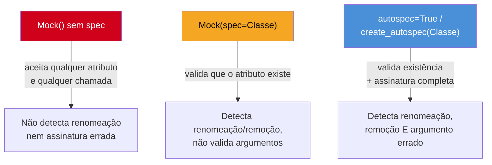
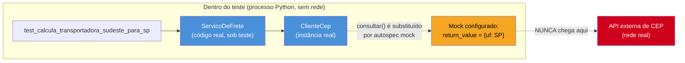

# Mocking com unittest.mock e pytest-mock

> [!abstract] TL;DR
> `unittest.mock.Mock` (e sua variante `MagicMock`, que implementa os *dunder methods* automaticamente) cria um objeto que registra toda chamada feita a ele e devolve o que você configurar — a ferramenta padrão para substituir uma fronteira externa (HTTP, banco, relógio) num teste unitário. `patch` troca um objeto real por um mock durante o teste, em três formas equivalentes: context manager, decorator, ou — a preferida em suítes pytest — a fixture `mocker` do plugin `pytest-mock`, que desfaz o patch sozinha no teardown. O perigo escondido: um `Mock()` sem `spec` aceita **qualquer** chamada, mesmo `mock.metodo_que_nao_existe()` — ele não valida contra o objeto real. `autospec=True` fecha esse buraco, validando assinatura e existência do atributo. A regra prática de quando mockar: fronteiras externas, sim; o próprio código sob teste, não — mock demais termina testando a implementação, não o comportamento (taxonomia completa de test doubles em [[03-Dominios/Engenharia/Testes/index|Engenharia/Testes]]).

## O mock que sobreviveu ao refactor

Um time mantinha um serviço de checkout que, entre outras coisas, consultava o CEP do cliente numa API externa de terceiros para calcular o frete. O cliente HTTP dessa integração vivia numa classe pequena:

```python
# src/frete/cliente_cep.py
import httpx


class ClienteCep:
    def __init__(self, base_url: str = "https://api.cep-terceiro.com"):
        self._base_url = base_url

    def consultar(self, cep: str) -> dict:
        resposta = httpx.get(f"{self._base_url}/cep/{cep}")
        resposta.raise_for_status()
        return resposta.json()
```

E o serviço de checkout, que usa esse cliente para decidir a transportadora:

```python
# src/frete/servico.py
from frete.cliente_cep import ClienteCep


class ServicoDeFrete:
    def __init__(self, cliente_cep: ClienteCep):
        self._cliente_cep = cliente_cep

    def calcular_transportadora(self, cep: str) -> str:
        dados = self._cliente_cep.consultar(cep)
        if dados["uf"] in ("SP", "RJ", "MG"):
            return "transportadora-sudeste"
        return "transportadora-nacional"
```

O teste original, escrito por quem já conhecia `unittest.mock`, mockava o cliente para não bater na API de verdade durante o teste unitário — decisão correta, coberta em detalhe mais adiante nesta nota. O problema não estava em mockar; estava em **como**:

```python
# tests/test_servico_frete.py — versão original, sem spec
from unittest.mock import Mock

from frete.servico import ServicoDeFrete


def test_calcula_transportadora_sudeste_para_sp():
    cliente_falso = Mock()
    cliente_falso.consultar.return_value = {"uf": "SP", "cidade": "São Paulo"}

    servico = ServicoDeFrete(cliente_falso)

    assert servico.calcular_transportadora("01310-100") == "transportadora-sudeste"
```

O teste passava, e continuou passando por meses. Até que um refactor — motivado por uma padronização de nomenclatura em todo o time, alinhando os clientes HTTP internos a um padrão comum de `buscar_por_cep` em vez de `consultar` — renomeou o método:

```python
# cliente_cep.py depois do refactor
class ClienteCep:
    def buscar_por_cep(self, cep: str) -> dict:   # renomeado de consultar()
        ...
```

Quem fez o refactor rodou a suíte de testes, viu tudo verde, e fez o merge. **A suíte inteira continuou passando** — inclusive `test_calcula_transportadora_sudeste_para_sp` — porque `cliente_falso` era um `Mock()` puro, sem `spec`. `ServicoDeFrete.calcular_transportadora` chama `self._cliente_cep.consultar(cep)`, e como `consultar` nunca foi renomeado dentro de `ServicoDeFrete` (o refactor mexeu só em `ClienteCep`, deixando `ServicoDeFrete` desatualizado por descuido), o teste continuava chamando um método que, no `Mock()`, existe automaticamente — `Mock` cria qualquer atributo acessado, na hora, sem perguntar se ele deveria existir. O bug real só apareceu em produção: `ServicoDeFrete` chamando `self._cliente_cep.consultar(...)` contra um `ClienteCep` **de verdade**, que já não tinha mais o método `consultar` — `AttributeError: 'ClienteCep' object has no attribute 'consultar'`, estourando no meio de um checkout de cliente pagante.

O que devia ter pegado esse erro — o teste que exercitava exatamente essa integração — não pegou, porque o mock nunca soube que `consultar` deixou de existir no objeto real. Um `Mock()` sem `spec` não tem ideia do que o objeto que ele substitui realmente oferece; ele é, por design, permissivo com qualquer chamada.

> [!warning] `Mock()` sem spec mascara erro de assinatura
> `mock = Mock()` aceita `mock.qualquer_coisa()`, `mock.outro_atributo.mais_um_nivel()`, `mock.metodo_que_nunca_existiu(1, 2, 3, argumento_que_nao_existe=True)` — tudo sem erro, porque `Mock` cria atributos e permite chamadas dinamicamente, sem checar contra nenhuma classe real. Isso é conveniente para escrever o teste rápido, mas significa que um `Mock()` cru **não detecta** quando o código de produção chama um método renomeado, removido, ou com assinatura mudada (número/nome de argumentos diferente). O teste continua "verde" testando uma interface que já não existe mais. A correção — `autospec=True` ou `spec=ClasseReal` — é o assunto central desta nota, e devia ser o padrão, não a exceção.

## `Mock` e `MagicMock`: a peça básica

`unittest.mock`, na biblioteca padrão desde o Python 3.3, oferece duas classes centrais. `Mock` é o objeto genérico: qualquer atributo acessado vira, automaticamente, um novo `Mock` filho; qualquer chamada é registrada e pode ser configurada para devolver um valor específico.

```python
from unittest.mock import Mock

mock = Mock()

# Configurar o retorno de uma chamada
mock.calcular.return_value = 42
assert mock.calcular() == 42
assert mock.calcular(1, 2, 3) == 42          # o valor de retorno não depende dos argumentos

# Toda chamada fica registrada — o mock "lembra" o que aconteceu
mock.calcular(10, 20)
mock.calcular.assert_called_once_with(10, 20)   # falha, porque foi chamado 3 vezes no total acima
```

Esse último `assert_called_once_with` ilustra o padrão central de uso: primeiro você **age** (executa o código sob teste, que internamente chama o mock), depois você **verifica** que o mock foi chamado do jeito esperado — quantas vezes, com quais argumentos. Essa verificação de interação (em vez de estado) é o que diferencia mock de stub na taxonomia de test doubles; a distinção completa (dummy/stub/spy/mock/fake) já está tratada em [[03-Dominios/Engenharia/Testes/index|Engenharia/Testes]] nota 05 — aqui o foco é só a API Python.

```python
from unittest.mock import Mock

mock = Mock()
mock.enviar_email("cliente@example.com", assunto="Bem-vindo")

# Os métodos de asserção mais usados no dia a dia:
mock.enviar_email.assert_called()                    # foi chamado, pelo menos uma vez
mock.enviar_email.assert_called_once()                # foi chamado exatamente uma vez
mock.enviar_email.assert_called_with(
    "cliente@example.com", assunto="Bem-vindo"
)                                                       # a última chamada teve exatamente estes argumentos
mock.enviar_email.assert_called_once_with(
    "cliente@example.com", assunto="Bem-vindo"
)                                                       # combina as duas checagens acima
assert mock.enviar_email.call_count == 1               # acesso direto ao contador, sem assert dedicado
```

### `MagicMock`: os dunder methods de graça

`Mock` não implementa métodos "mágicos" (dunder methods: `__len__`, `__iter__`, `__enter__`/`__exit__`, `__getitem__` etc.) por padrão — tentar usar `len(mock)` num `Mock()` cru levanta `TypeError`, porque `Mock` não define `__len__`. `MagicMock` é uma subclasse de `Mock` que pré-configura os dunders mais comuns, o que o torna a escolha padrão sempre que o objeto mockado precisa se comportar como uma sequência, um gerenciador de contexto, ou qualquer protocolo que dependa de dunder:

```python
from unittest.mock import MagicMock

conexao_falsa = MagicMock()
conexao_falsa.__enter__.return_value = conexao_falsa   # simula "with conexao as c: ..."
conexao_falsa.executar.return_value = [{"id": 1}, {"id": 2}]

with conexao_falsa as c:
    resultado = c.executar("SELECT * FROM pedidos")

assert len(resultado) == 2
```

> [!tip] `patch()` já devolve `MagicMock` por padrão
> Quando você usa `patch(...)` (próxima seção) sem passar `new=Mock()` explicitamente, o objeto substituto criado automaticamente já é um `MagicMock`, não um `Mock` simples — motivo pelo qual, na prática, a maioria dos mocks usados no dia a dia de uma suíte pytest já suporta dunders sem que ninguém precise pensar na diferença entre as duas classes. Vale conhecer `Mock` puro para os casos em que você quer deliberadamente que dunders **não** funcionem (documentando que o objeto não deveria ser usado como container/contexto), mas isso é raro.

### Configurando efeitos além do retorno simples

Além de `return_value`, dois outros atributos cobrem os casos que aparecem com frequência: `side_effect` para levantar exceção (simulando falha de rede, timeout) ou executar uma função customizada, e uma sequência de valores diferentes por chamada:

```python
from unittest.mock import Mock
import httpx

cliente_falso = Mock()

# Simula uma falha de rede — útil para testar o caminho de erro do código sob teste
cliente_falso.consultar.side_effect = httpx.ConnectError("conexão recusada")

# Ou: uma sequência de retornos diferentes a cada chamada sucessiva
cliente_falso.consultar.side_effect = [
    {"uf": "SP"},
    {"uf": "RJ"},
    httpx.TimeoutException("tempo esgotado"),   # a terceira chamada levanta exceção, não retorna dict
]

# Ou: uma função de verdade, para lógica condicional no retorno
def resposta_por_cep(cep):
    if cep.startswith("01"):
        return {"uf": "SP"}
    return {"uf": "RJ"}

cliente_falso.consultar.side_effect = resposta_por_cep
```

`side_effect` como exceção é o padrão usado para testar o **caminho infeliz** — o que o código sob teste faz quando a fronteira externa falha — sem precisar derrubar de propósito um serviço real durante o teste.

## `patch`: trocando o objeto real pelo mock

`Mock()` cria um objeto novo do zero. `patch` faz algo diferente e mais delicado: ele **substitui temporariamente** um objeto que já existe em algum módulo — tipicamente uma classe, uma função, ou um atributo — por um mock, e garante que o objeto original volte ao lugar depois. Existem três formas de usar `patch`, funcionalmente equivalentes, mas com ergonomia bem diferente.

### 1. Como context manager

```python
from unittest.mock import patch

from frete.servico import ServicoDeFrete


def test_calcula_transportadora_sudeste_para_sp():
    with patch("frete.cliente_cep.ClienteCep.consultar") as consultar_mock:
        consultar_mock.return_value = {"uf": "SP", "cidade": "São Paulo"}

        from frete.cliente_cep import ClienteCep
        servico = ServicoDeFrete(ClienteCep())

        assert servico.calcular_transportadora("01310-100") == "transportadora-sudeste"

    # fora do `with`, ClienteCep.consultar já voltou a ser o método real
```

O `patch` substitui o atributo referenciado pela string (`"frete.cliente_cep.ClienteCep.consultar"`) enquanto o bloco `with` está ativo, e restaura o original ao sair do bloco — mesmo se o teste levantar exceção no meio, porque `patch` como context manager segue o mesmo protocolo `__enter__`/`__exit__` de qualquer gerenciador de contexto Python, garantindo o teardown.

> [!warning] O caminho da string em `patch` importa: onde o nome é **usado**, não onde é **definido**
> `patch("frete.cliente_cep.ClienteCep.consultar")` funciona porque o teste importa `ClienteCep` diretamente do módulo onde ela é definida. Se o código sob teste tivesse feito `from frete.cliente_cep import ClienteCep` dentro de `servico.py` e o teste tentasse `patch("frete.servico.ClienteCep.consultar")`, o resultado dependeria de qual referência o Python resolve em qual namespace — a regra geral (documentada como "where to patch" na documentação oficial) é: faça o patch no **namespace onde o nome é procurado no momento da chamada**, não necessariamente onde o objeto foi originalmente definido. Esse é um dos erros mais comuns e mais confusos de quem começa com `patch` — o teste "não funciona" e o mock "não é chamado", sem erro nenhum, porque o patch caiu no módulo errado.

### 2. Como decorator

A mesma substituição, aplicada à função de teste inteira em vez de só um trecho — o `patch` injeta o mock como argumento adicional da função:

```python
from unittest.mock import patch


@patch("frete.cliente_cep.ClienteCep.consultar")
def test_calcula_transportadora_sudeste_para_sp(consultar_mock):
    consultar_mock.return_value = {"uf": "SP", "cidade": "São Paulo"}

    from frete.cliente_cep import ClienteCep
    from frete.servico import ServicoDeFrete

    servico = ServicoDeFrete(ClienteCep())
    assert servico.calcular_transportadora("01310-100") == "transportadora-sudeste"
```

Empilhar múltiplos `@patch` funciona, mas com uma pegadinha de ordem que costuma confundir: os decorators são aplicados de baixo para cima, mas os mocks são injetados como parâmetros na **ordem inversa** — o decorator mais próximo da função (o último, lido de cima para baixo, mas o primeiro aplicado) corresponde ao **primeiro** parâmetro depois de `self`:

```python
@patch("frete.servico.EnviadorDeEmail.enviar")
@patch("frete.cliente_cep.ClienteCep.consultar")
def test_checkout_completo(consultar_mock, enviar_mock):
    # consultar_mock corresponde ao @patch mais próximo da função (ClienteCep.consultar)
    # enviar_mock corresponde ao @patch mais distante (EnviadorDeEmail.enviar)
    ...
```

Essa ordem "de baixo para cima" é uma fonte recorrente de bugs sutis em testes — trocar dois mocks de posição silenciosamente configura o mock errado, e o teste pode continuar passando por acidente (se o mock trocado nunca for chamado da forma que expõe o erro) ou falhar com uma mensagem confusa que não aponta para a causa real.

### 3. Como fixture, via `pytest-mock`: a forma preferida

`pytest-mock` é um plugin (`pip install pytest-mock`) fino sobre `unittest.mock.patch` que expõe uma fixture chamada `mocker`. A API de patch é a mesma (`mocker.patch(...)` em vez de `patch(...)`), mas o mecanismo de limpeza muda de forma importante:

```python
def test_calcula_transportadora_sudeste_para_sp(mocker):
    consultar_mock = mocker.patch(
        "frete.cliente_cep.ClienteCep.consultar",
        return_value={"uf": "SP", "cidade": "São Paulo"},
    )

    from frete.cliente_cep import ClienteCep
    from frete.servico import ServicoDeFrete

    servico = ServicoDeFrete(ClienteCep())
    assert servico.calcular_transportadora("01310-100") == "transportadora-sudeste"

    consultar_mock.assert_called_once_with("01310-100")
```

Repare que `mocker.patch(...)` já aceita `return_value=` diretamente como argumento nomeado, poupando uma linha em relação à forma `consultar_mock.return_value = ...` separada — um detalhe pequeno, mas comum o bastante para valer a pena conhecer.

> [!question]- Por que `mocker` é considerado mais idiomático em pytest do que `patch` direto?
> Três razões concretas, não só preferência estética:
> 1. **Integra com o ciclo de vida de fixture do pytest.** `mocker` é ela mesma uma fixture — o pytest já cuida de instanciá-la, injetá-la no teste por nome de parâmetro (o mesmo mecanismo coberto na [[03-Dominios/Tecnologia/Python/Testes/02 - Fixtures — escopos, yield e conftest.py|nota 02]]), e compor com outras fixtures do teste sem aninhamento manual.
> 2. **Desfaz o patch automaticamente no teardown, sem `with` nem decorator.** Com `patch` como context manager, esquecer o `with` (ou fechá-lo cedo demais) deixa o patch vazando para outros testes. Com `mocker.patch(...)`, o plugin registra o patch e desfaz sozinho ao final do teste — o mesmo padrão de limpeza automática que fixtures com `yield` já garantem para outros recursos.
> 3. **Evita aninhamento de `with` quando o teste precisa mockar mais de uma coisa.** Três `patch` como context manager empilhados viram três níveis de indentação (ou um `with A, B, C:` de uma linha só, que fica difícil de ler com nomes longos). Com `mocker`, cada `mocker.patch(...)` é uma linha solta no corpo do teste, sem indentação adicional — e a ordem de leitura acompanha a ordem de execução, ao contrário dos decorators empilhados, cujos parâmetros vêm na ordem inversa.
>
> A ressalva: `mocker` exige a dependência extra `pytest-mock`. Em projetos que já usam pytest (a esmagadora maioria da comunidade), esse custo é mínimo, e o ganho de legibilidade — especialmente em testes que mockam três ou quatro colaboradores — compensa.

O quadro comparativo resume as três formas:

| Forma | Sintaxe | Teardown | Quando preferir |
|---|---|---|---|
| Context manager (`with patch(...)`) | Escopo explícito, indentação | Automático ao sair do `with` | Mock precisa valer só para um trecho pequeno do teste |
| Decorator (`@patch(...)`) | Parâmetro extra na função | Automático ao fim da função | Mock vale para o teste inteiro; poucos patches (1-2) |
| Fixture (`mocker.patch(...)`) | Uma linha, sem indentação extra | Automático no teardown do pytest | Suítes pytest em geral — é a forma recomendada por padrão nesta trilha |

## `spec` e `autospec`: fechando o buraco do incidente

Voltando ao incidente do início: a correção não é deixar de mockar — é mockar **com verificação de assinatura**. `unittest.mock` oferece dois níveis de rigor.

### `spec`: restringe os atributos acessíveis

Passar `spec=ClienteCep` (a classe) ou `spec=instancia_real` faz o `Mock` consultar `dir()` do objeto real para saber quais atributos existem, e levantar `AttributeError` para qualquer acesso fora dessa lista — mas **não** valida a assinatura dos métodos, só a existência deles:

```python
from unittest.mock import Mock
from frete.cliente_cep import ClienteCep

cliente_falso = Mock(spec=ClienteCep)

cliente_falso.consultar("01310-100")          # ok, consultar existe em ClienteCep
cliente_falso.metodo_que_nao_existe()          # AttributeError — spec bloqueia
```

### `autospec=True`: valida também a assinatura

`autospec` (usado como `patch(..., autospec=True)` ou `create_autospec(ClienteCep)`) vai além de `spec`: ele inspeciona a assinatura real de cada método via `inspect.signature` e valida, em cada chamada do mock, se os argumentos passados são compatíveis com a assinatura do método real — número de argumentos posicionais, nomes de argumentos nomeados, tudo.

```python
from unittest.mock import create_autospec
from frete.cliente_cep import ClienteCep

cliente_falso = create_autospec(ClienteCep, instance=True)

cliente_falso.consultar("01310-100")           # ok, uma string posicional bate com a assinatura real
cliente_falso.consultar()                       # TypeError — consultar(self, cep) exige o argumento cep
cliente_falso.consultar("01310-100", "extra")  # TypeError — consultar não aceita um segundo argumento
cliente_falso.metodo_que_nao_existe()           # AttributeError — nem existe em ClienteCep
```

Reescrevendo o teste do incidente com `autospec`, o refactor que renomeou `consultar` para `buscar_por_cep` teria quebrado o teste **imediatamente**, no mesmo commit, em vez de deixar o bug esperar até produção:

```python
def test_calcula_transportadora_sudeste_para_sp(mocker):
    consultar_mock = mocker.patch(
        "frete.cliente_cep.ClienteCep.consultar",
        autospec=True,
        return_value={"uf": "SP", "cidade": "São Paulo"},
    )
    # se `consultar` não existir mais em ClienteCep no momento do patch,
    # esta linha já levanta AttributeError — o teste falha na hora certa

    from frete.cliente_cep import ClienteCep
    from frete.servico import ServicoDeFrete

    servico = ServicoDeFrete(ClienteCep())
    assert servico.calcular_transportadora("01310-100") == "transportadora-sudeste"
```

`mocker.patch(..., autospec=True)` combina os dois: já é o `patch` que troca o objeto no módulo certo, e valida a assinatura contra o objeto real no momento em que o patch é aplicado **e** a cada chamada subsequente do mock durante o teste.

> [!tip] `autospec=True` como padrão de equipe, não exceção pontual
> A recomendação prática deste vault: trate `patch(..., autospec=True)` (ou `mocker.patch(..., autospec=True)`) como o padrão de toda a suíte, e a omissão de `autospec` como algo que precisa de justificativa — não o contrário. O custo é pequeno (um pouco mais de introspecção no momento do patch) e o ganho é o exato incidente narrado no início desta nota: um mock sem spec continua "verde" mesmo depois que o método real deixou de existir ou mudou de assinatura, e esse é precisamente o tipo de falha que só aparece em produção, quando já é tarde.

O diagrama abaixo resume as três camadas de rigor, da mais permissiva (e mais perigosa) à mais estrita:



## Quando mockar, quando não mockar

A [[03-Dominios/Engenharia/Testes/index|nota 06 de Engenharia/Testes]] já cobre a distinção conceitual entre testar comportamento e testar implementação, e a taxonomia completa de test doubles (dummy/stub/spy/mock/fake) mora na nota 05 do mesmo galho — esta nota não repete isso. O que vale fixar aqui, em termos operacionais para Python, é uma regra prática de bolso:

**Mocke fronteiras externas ao processo:**
- Chamadas HTTP para serviços de terceiros (o exemplo do `ClienteCep` desta nota).
- Acesso a banco de dados, num teste que é deliberadamente **unitário** (testes de integração, que exercitam o banco de verdade, são um tipo de teste diferente — ver [[03-Dominios/Engenharia/Testes/index|nota 07]]).
- O relógio do sistema (`datetime.now()`, `time.time()`) — sem mockar, um teste que depende de "agora" é não determinístico por natureza, e vira um flaky test à espreita.
- Sistema de arquivos, filas de mensagens, envio de e-mail/SMS, geração de UUID/número aleatório quando o teste precisa de um valor previsível.

**Não mocke o próprio código que você está testando:**

```python
# Ruim: mocka um método interno da própria classe sob teste
def test_calcular_transportadora_chama_consulta_correta(mocker):
    servico = ServicoDeFrete(cliente_cep=Mock())
    mock_interno = mocker.patch.object(servico, "_normalizar_cep")  # método PRIVADO da própria classe testada

    servico.calcular_transportadora("01310-100")

    mock_interno.assert_called_once()
    # Esse teste não verifica NADA sobre o comportamento observável do sistema —
    # só verifica que um detalhe de implementação interno foi chamado.
    # Se `_normalizar_cep` for removido ou renomeado num refactor que NÃO muda
    # o comportamento externo, este teste quebra mesmo sem bug nenhum.
```

Esse é o "over-mocking" mencionado na nota 06 de Engenharia/Testes: mockar demais faz o teste travar na forma atual do código, não no comportamento que o código promete entregar. Um teste assim vira um obstáculo a qualquer refactor — quebra toda vez que a implementação interna muda de forma, mesmo quando ninguém introduziu um bug de verdade, e isso corrói a confiança da equipe na suíte ("de novo esse teste quebrou, deve ser bobagem, só atualiza o mock e segue").

A régua prática: se o objeto que você está prestes a mockar é algo que **seu processo Python não controla** — está atrás de uma rede, de um disco, de um relógio que ninguém pode pausar — mockar é a decisão certa. Se é uma classe ou função que faz parte do próprio desenho da solução que você está testando, prefira deixá-la rodar de verdade e verificar o resultado final observável.

> [!question]- E se o "código interno" for uma dependência cara, tipo um serviço de outro módulo do mesmo processo?
> Aí a resposta depende do que o teste está tentando garantir. Se o teste é sobre `ServicoDeFrete` isoladamente, e `ClienteCep` é uma dependência real que **também** roda dentro do processo — mas cuja responsabilidade é fazer I/O de rede — a fronteira relevante não é "está no mesmo processo Python ou não", é "esse componente faz alguma coisa que não é determinística ou não é barata de rodar num teste unitário" (rede, banco, tempo). `ClienteCep` se qualifica para mock porque ele encapsula a chamada HTTP, não porque é "outro módulo". Já um `ValidadorDeCep` que só faz validação de formato em memória, sem I/O nenhum, não deveria ser mockado — deixe-o rodar de verdade; ele é rápido, determinístico, e mocká-lo só empurraria a cobertura real desse validador para fora do teste.

## Exemplo completo: consultando CEP sem tocar a rede

Fechando com o cenário do início, agora como suíte completa, mostrando o que é real e o que é mockado dentro do mesmo teste:

```python
# tests/test_servico_frete.py
import httpx
import pytest


def test_calcula_transportadora_sudeste_para_sp(mocker):
    consultar_mock = mocker.patch(
        "frete.cliente_cep.ClienteCep.consultar",
        autospec=True,
        return_value={"uf": "SP", "cidade": "São Paulo"},
    )

    from frete.cliente_cep import ClienteCep
    from frete.servico import ServicoDeFrete

    servico = ServicoDeFrete(ClienteCep())            # ClienteCep real — mas seu método de I/O está mockado
    resultado = servico.calcular_transportadora("01310-100")

    assert resultado == "transportadora-sudeste"
    consultar_mock.assert_called_once_with(mocker.ANY, "01310-100")
    # mocker.ANY (repasse de unittest.mock.ANY) casa com qualquer valor —
    # aqui, usado para o `self` implícito que autospec exige no primeiro argumento


def test_calcula_transportadora_nacional_para_outros_estados(mocker):
    mocker.patch(
        "frete.cliente_cep.ClienteCep.consultar",
        autospec=True,
        return_value={"uf": "BA", "cidade": "Salvador"},
    )

    from frete.cliente_cep import ClienteCep
    from frete.servico import ServicoDeFrete

    servico = ServicoDeFrete(ClienteCep())
    assert servico.calcular_transportadora("40010-000") == "transportadora-nacional"


def test_propaga_erro_quando_api_de_cep_falha(mocker):
    mocker.patch(
        "frete.cliente_cep.ClienteCep.consultar",
        autospec=True,
        side_effect=httpx.ConnectError("conexão recusada"),
    )

    from frete.cliente_cep import ClienteCep
    from frete.servico import ServicoDeFrete

    servico = ServicoDeFrete(ClienteCep())
    with pytest.raises(httpx.ConnectError):
        servico.calcular_transportadora("01310-100")
```

O terceiro teste é o motivo prático de mockar a fronteira externa em vez de rodar o teste contra a API real: derrubar deliberadamente a conexão de uma API de terceiro, de forma controlada e repetível, é trivial com `side_effect` — e seria praticamente impossível de forçar de forma confiável contra o serviço de verdade, sem falar que um teste que depende de rede real é lento e flaky por natureza (a API pode estar fora do ar, lenta, ou mudar de comportamento sem aviso, e nada disso deveria fazer a suíte unitária falhar).

O diagrama mostra a fronteira entre o que roda de verdade e o que é substituído nesse teste:



`ServicoDeFrete` e a instância de `ClienteCep` são reais — o teste exercita a lógica de decisão de transportadora de verdade. Só o método que faz a chamada HTTP (`consultar`) é substituído, e a linha pontilhada até a API externa nunca é percorrida durante o teste. Essa é a assinatura de um mock bem colocado: a fronteira do mock coincide exatamente com a fronteira de I/O externo, nem mais (mockando lógica interna) nem menos (deixando a rede real vazar para dentro do teste unitário).

## Checklist: quando mockar

Antes de escrever `mocker.patch(...)`, vale passar por esta lista curta:

- [ ] **O que estou prestes a mockar faz I/O real** (rede, disco, banco, fila) **ou é não determinístico** (relógio, aleatório, UUID)? Se sim, mockar é apropriado.
- [ ] **É parte do desenho interno do código sob teste** (um método privado, uma função auxiliar da mesma classe)? Se sim, não mocke — deixe rodar, e verifique o resultado observável.
- [ ] **Estou usando `autospec=True`** (ou, no mínimo, `spec=`)? Se não, o mock pode estar mascarando um erro de assinatura que só vai aparecer em produção — o incidente do início desta nota.
- [ ] **Estou usando `mocker` (pytest-mock)** em vez de `patch` cru como context manager/decorator, para não depender de lembrar de desfazer o patch manualmente?
- [ ] **O teste ainda falharia se a lógica de negócio real quebrasse** — não só se o mock fosse chamado de forma diferente? Um teste que só verifica `mock.assert_called_with(...)`, sem nenhum `assert` sobre o resultado observável do sistema, está testando a chamada, não o comportamento.
- [ ] **Esse é o teste certo para essa fronteira**, ou a fronteira já é coberta por um teste de integração de verdade em outro lugar da suíte (ver [[03-Dominios/Engenharia/Testes/index|nota 07, Testes de integração]])? Mock não substitui a necessidade de, em algum ponto da pirâmide, testar a integração real.

## Em resumo

`unittest.mock` resolve o problema mecânico — criar um objeto que registra chamadas e devolve valores configurados — e `patch` resolve o problema de substituição — trocar temporariamente um objeto real por esse mock, com teardown automático, de preferência via a fixture `mocker` do `pytest-mock`. Mas a ferramenta sozinha não evita o incidente do início desta nota: um `Mock()` sem `spec` é permissivo por design, e permanece "verde" mesmo depois que o método real que ele substitui muda de assinatura ou deixa de existir. `autospec=True` fecha esse buraco tratando o mock como um contrato validado contra o objeto real, não como uma caixa que aceita qualquer coisa. E a decisão mais importante continua sendo a mais simples de enunciar e a mais fácil de errar na prática: mockar a fronteira (rede, banco, relógio), nunca o próprio código sob teste — porque mock demais não testa comportamento, testa a forma atual da implementação, e quebra a cada refactor que não introduziu bug nenhum.

## Fontes

- Python documentation — `unittest.mock` — mock object library: https://docs.python.org/3/library/unittest.mock.html (consultado em 2026-07-11)
- Python documentation — `unittest.mock` — `patch`, `autospec`, "Where to patch": https://docs.python.org/3/library/unittest.mock.html#where-to-patch (consultado em 2026-07-11)
- Python documentation — `unittest.mock` — `create_autospec` e "Autospeccing": https://docs.python.org/3/library/unittest.mock.html#autospeccing (consultado em 2026-07-11)
- PyPI — `pytest-mock`: https://pypi.org/project/pytest-mock/ (consultado em 2026-07-11)
- pytest-mock documentation — the `mocker` fixture: https://pytest-mock.readthedocs.io/en/latest/usage.html (consultado em 2026-07-11)
- Real Python — Understanding the Python Mock Object Library: https://realpython.com/python-mock-library/ (consultado em 2026-07-11)

## Veja também

- [[03-Dominios/Tecnologia/Python/Testes/01 - pytest fundamentos — anatomia, discovery e assert introspection|01 — pytest fundamentos]] — anatomia do teste e discovery, base para tudo neste galho
- [[03-Dominios/Tecnologia/Python/Testes/02 - Fixtures — escopos, yield e conftest.py|02 — Fixtures]] — o mecanismo de injeção de dependência que `mocker` reaproveita
- [[03-Dominios/Tecnologia/Python/Testes/03 - Parametrização e organização de suíte|03 — Parametrização e organização de suíte]] — nota anterior deste galho
- [[03-Dominios/Engenharia/Testes/index|Testes (Engenharia)]] — taxonomia de test doubles (nota 05) e comportamento×implementação (nota 06), stack-agnóstico
- [[03-Dominios/Tecnologia/Python/Testes/index|Testes (MOC do galho)]]
