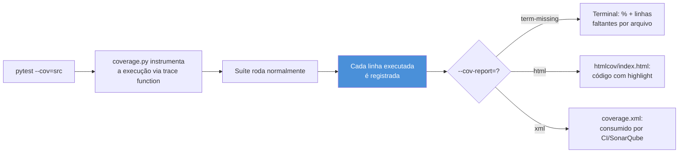
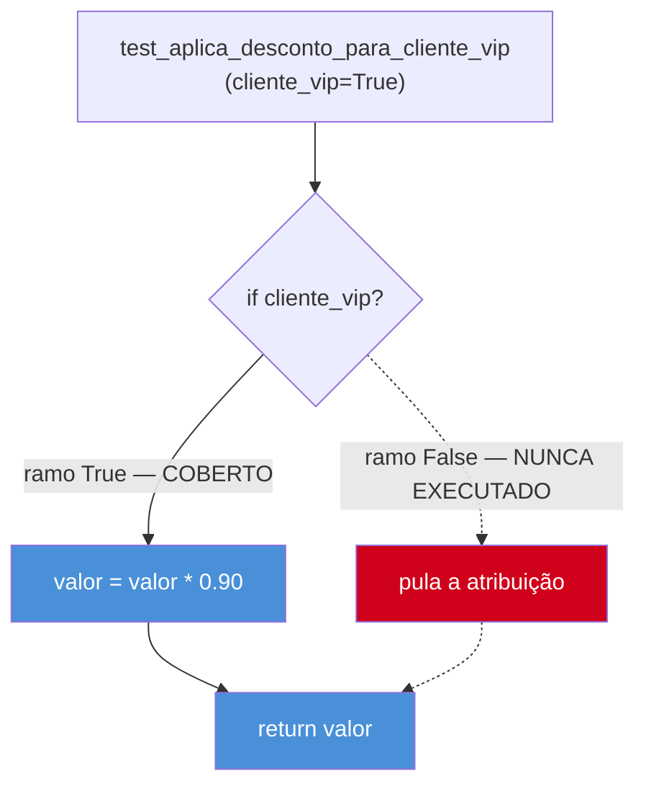

# Coverage — pytest-cov e o que ele não mede

> [!abstract] TL;DR
> `pytest-cov` (wrapper de `coverage.py` para o pytest) mede quais linhas do código de produção rodaram durante a suíte — `pytest --cov=src --cov-report=term-missing` mostra o percentual e aponta exatamente as linhas nunca tocadas. É uma ferramenta de diagnóstico honesta para achar código esquecido. O problema é o que ela vira quando o time transforma "% de coverage" em meta: 100% de coverage de **linha** não significa 100% de coverage de **caso** — uma linha é marcada como "coberta" assim que qualquer teste passa por ela ao menos uma vez, mesmo que esse teste não faça nenhum `assert` relevante sobre o resultado. Coverage mede **execução**, não **correção**. `--cov-branch` é um refinamento real (exige que ambos os ramos de um `if` tenham rodado, não só a linha), mas ainda não garante que os asserts certos foram escritos. O próximo degrau — provar que os testes de fato *pegam* uma regressão — é mutation testing (`mutmut` em Python, equivalente ao PIT do Java), conceito já coberto em [[03-Dominios/Engenharia/Testes/12 - Coverage e mutation testing|Engenharia/Testes]] e só referenciado aqui.

## Os 98% que não pegaram o bug

Um time de fintech tinha orgulho da própria suíte de testes. O dashboard de CI mostrava `98% coverage` em letras verdes no topo de cada pull request, um número que o time citava em toda retrospectiva como prova de maturidade técnica — "nossa cobertura está em 98%, estamos numa posição muito melhor que o time do produto vizinho, que mal passa de 60%". O gate de CI (`--cov-fail-under=90`) nunca tinha barrado um PR havia meses. A confiança era genuína, e não era descabida: 98% é, à primeira vista, um número que qualquer engenheiro sênior reconheceria como "essa suíte é séria".

A função que calculava o valor final de um empréstimo — juros compostos aplicados sobre o principal, com uma regra de arredondamento para o centavo mais próximo — estava entre as mais testadas do sistema. O relatório de coverage mostrava **100% de cobertura de linha** para o módulo inteiro, sem exceção:

```python
# src/emprestimos/calculo.py

def calcular_valor_final(principal: float, taxa_mensal: float, meses: int) -> float:
    if meses <= 0:
        raise ValueError("número de meses deve ser positivo")

    valor = principal
    for _ in range(meses):
        valor *= (1 + taxa_mensal)

    valor_arredondado = round(valor, 2)
    return valor_arredondado
```

E o teste correspondente, que qualquer revisor de PR bateria o olho e aprovaria sem hesitar — o nome da função é descritivo, o teste "existe", a suíte está verde:

```python
def test_calcular_valor_final_emprestimo_de_doze_meses():
    resultado = calcular_valor_final(principal=10_000.0, taxa_mensal=0.02, meses=12)
    assert resultado is not None
```

O bug chegou em produção três semanas depois, quando alguém alterou a ordem dos parâmetros da função durante um refactor — trocou `principal` e `taxa_mensal` de posição na assinatura sem atualizar todos os call sites, um erro clássico de argumentos posicionais. A função continuou executando sem lançar nenhuma exceção: `calcular_valor_final(taxa_mensal, principal, meses)` invertido simplesmente calcula um número diferente, plausível, sem nenhum erro de tipo (ambos são `float`). O sistema calculou o valor final de centenas de empréstimos com principal e taxa trocados — para um cliente com principal de R$ 50.000 e taxa de 1,5%, a inversão produziu um resultado catastroficamente errado, mas ainda um número positivo, sem exceção, sem crash.

O motivo do bug não pegar em nenhum teste: `assert resultado is not None` é tecnicamente um assert — a linha `assert` existe, o pytest a executa, o teste "passa". Mas ele não verifica **nenhum valor**. Não importa se `calcular_valor_final` retorna `10.712,41` (o valor correto) ou `50.000.000,00` (o valor de uma inversão de parâmetros) — `is not None` é `True` em ambos os casos. O relatório de `pytest-cov` marcou cada linha da função como executada, porque o teste de fato chamou a função e ela de fato rodou até o `return`. **Coverage de linha não distingue "a linha rodou" de "o resultado foi verificado"** — e foi exatamente essa distinção que separou "98% de coverage" de "zero proteção contra esse bug específico".

> [!warning] Coverage alto não é sinônimo de qualidade
> Um número de coverage alto prova uma coisa só: que a suíte **executa** uma fração grande do código de produção. Não prova que os testes verificam o comportamento certo, não prova que os edge cases foram pensados, e não prova que um refactor descuidado seria pego antes de chegar em produção. Tratar coverage como proxy de qualidade é o erro estrutural que abriu esta nota — o número subiu, a proteção real não.

## O que `pytest-cov` mede, tecnicamente

`pytest-cov` é um plugin do pytest que envolve a biblioteca `coverage.py` — a ferramenta de instrumentação de código que faz o trabalho pesado de rastrear execução. `coverage.py` funciona interceptando a execução do interpretador Python (via um *trace function*, o mesmo mecanismo de baixo nível que um debugger usa para observar cada linha executada) e registrando, para cada linha executável do código-fonte, se ela rodou pelo menos uma vez durante a sessão monitorada. `pytest-cov` só integra esse rastreamento ao ciclo de vida do pytest: liga o `coverage.py` antes da suíte começar, desliga depois que o último teste termina, e formata o relatório.

### Instalação e uso básico

```bash
pip install pytest-cov
```

```bash
# roda a suíte inteira, medindo cobertura do pacote src/
pytest --cov=src

# saída resumida (percentual por arquivo)
pytest --cov=src --cov-report=term

# saída detalhada — mostra exatamente QUAIS linhas não rodaram
pytest --cov=src --cov-report=term-missing
```

O relatório `term-missing` é o mais útil no dia a dia porque não para no número agregado — ele lista, arquivo por arquivo, os números de linha que nunca foram tocados:

```
Name                          Stmts   Miss  Cover   Missing
------------------------------------------------------------
src/emprestimos/calculo.py       12      2    83%   18-19
src/emprestimos/validacao.py      8      0   100%
------------------------------------------------------------
TOTAL                            20      2    90%
```

A coluna `Missing` (`18-19`) é o dado acionável: duas linhas específicas do arquivo nunca executaram durante a suíte inteira. Esse é o uso honesto de coverage — como mapa de buracos, apontando código que ninguém escreveu teste nenhum para ele, nem bom nem ruim. É informação estritamente negativa: coverage baixo é sinal real de risco (há lógica sem teste algum); coverage alto não é sinal de segurança, como o incidente do empréstimo acabou de mostrar.

### `--cov-report`: term, html, xml

Três formatos de saída cobrem os três consumidores típicos de um relatório de coverage:

| Formato | Comando | Para quem/o quê |
|---|---|---|
| `term` / `term-missing` | `--cov-report=term-missing` | Terminal, durante desenvolvimento local — feedback imediato |
| `html` | `--cov-report=html` | Navegador — gera `htmlcov/index.html`, navegável linha a linha com destaque de cor |
| `xml` | `--cov-report=xml` | Máquina — formato Cobertura XML, consumido por ferramentas de CI (SonarQube, Codecov, GitHub Actions annotations) |

O relatório HTML merece destaque porque é o único formato que mostra o código-fonte com highlight linha a linha — verde para executado, vermelho para não executado, e (quando `--cov-branch` está ativo) uma marcação parcial para uma linha cujo desvio condicional só foi parcialmente exercitado:

```bash
pytest --cov=src --cov-report=html
# abre htmlcov/index.html no navegador
```



> [!question]- `coverage.py` instrumenta bytecode como o PIT do Java, ou é diferente?
> É um mecanismo bem diferente, e vale a distinção porque as duas ferramentas fazem coisas conceitualmente distintas apesar do nome parecido. `coverage.py` usa a *trace function* do próprio interpretador CPython — um hook nativo que a linguagem já expõe para depuração e profiling, chamado a cada linha executada — para simplesmente **observar e contar** o que já ia rodar de qualquer forma. Não modifica o comportamento do programa, só registra passivamente. **PIT** (Java, coberto na nota [[03-Dominios/Tecnologia/Java/Testes/17 - Mutation testing — PIT e cobertura honesta|Mutation testing — PIT e cobertura honesta]]) faz algo estruturalmente diferente: ele **reescreve** o bytecode compilado para introduzir defeitos deliberados (mutantes) e depois roda a suíte contra cada versão mutada, perguntando se algum teste falha. Um instrumenta para contar; o outro modifica para sabotar. Essa diferença de mecanismo é o motivo pelo qual coverage é barato (uma passada da suíte) e mutation testing é caro (uma passada da suíte por mutante gerado) — tema retomado adiante nesta nota.

## Gate de coverage em CI: `--cov-fail-under` e o número mágico

`pytest-cov` aceita um limiar mínimo que, se não atingido, faz o processo `pytest` sair com código de erro — útil como *quality gate* de CI, barrando um PR que reduz a cobertura abaixo de um piso combinado:

```bash
pytest --cov=src --cov-report=term-missing --cov-fail-under=80
```

```toml
# pyproject.toml — configuração equivalente, sem precisar repetir a flag em todo comando
[tool.coverage.run]
source = ["src"]
branch = true

[tool.coverage.report]
fail_under = 80
show_missing = true
```

### Por que 80% (ou qualquer número fixo) não é uma verdade universal

O incidente do empréstimo já deixou claro que um coverage alto não prova qualidade — mas isso não significa que o gate seja inútil. Vale separar duas perguntas que costumam ser confundidas: "que número usar como piso?" e "o que esse piso realmente garante?".

A primeira pergunta não tem resposta universal, e qualquer artigo que prescreve "sempre 100%" ou "sempre 80%" como regra absoluta está sendo dogmático em vez de honesto. Alguns fatores concretos que mudam a resposta certa para um projeto específico:

- **Tipo de código.** Lógica de domínio com regras de negócio complexas (cálculo financeiro, validação de estado) justifica um piso mais alto — o custo de um bug ali é grande e o custo de testar é proporcional ao risco. Código de infraestrutura fina (um wrapper trivial em volta de uma chamada HTTP, um `__repr__`, um DTO sem lógica) tem retorno marginal decrescente perto de 100%: o teste vira boilerplate que só existe para bater o número, sem proteger nada de fato — exatamente o padrão que a nota [[03-Dominios/Engenharia/Testes/12 - Coverage e mutation testing|Coverage e mutation testing]] de Engenharia/Testes chama de **coverage theater**.
- **Fase do projeto.** Um protótipo em validação de mercado não justifica o mesmo investimento em teste que um sistema de pagamentos em produção há três anos com SLA contratual.
- **Custo de um bug em produção.** Sistemas médicos, financeiros ou de infraestrutura crítica justificam pisos mais altos (e, adiante nesta nota, mutation testing mais rigoroso) do que uma ferramenta interna de baixo risco.

A faixa que aparece com mais frequência em times maduros — não uma lei, uma heurística observada — fica entre **70% e 90%**: abaixo disso, tipicamente há lógica de negócio genuinamente descoberta; acima disso, o custo marginal de perseguir os últimos pontos costuma superar o valor marginal, e o tempo é mais bem gasto testando os cenários que realmente importam (o assunto da próxima seção) do que testando um getter.

> [!tip] O gate deve ser um piso, não um teto
> `--cov-fail-under=80` funciona bem como **piso** — "não deixe a cobertura cair abaixo disto", prevenindo erosão gradual conforme código novo entra sem teste nenhum. Funciona mal como **teto perseguido** — "bata exatamente 80% a qualquer custo" empurra o time a escrever testes vazios só para subir o número quando ele está perto do limiar, o mesmo padrão de coverage theater. A diferença de postura é sutil no texto do gate (é a mesma flag `--cov-fail-under`), mas enorme na cultura do time: um gate que existe para impedir regressão de um patamar já alcançado é saudável; um gate perseguido como meta de sprint recompensa o comportamento errado.

> [!question]- Se o gate não garante qualidade, por que ter um gate de coverage em CI?
> Porque ele resolve um problema real e mais estreito do que "garantir qualidade": **prevenir erosão silenciosa**. Sem nenhum gate, é fácil um PR adicionar uma função nova inteira sem nenhum teste, e ninguém perceber durante a revisão — coverage cai um pouco, mas ninguém está olhando o número a cada PR individual, só no agregado trimestral, quando já caiu bastante. Um gate que falha o build quando a cobertura de um PR específico cai abaixo do piso do repositório força a conversa **no momento em que a lacuna é introduzida**, não seis meses depois. Isso não substitui julgamento humano sobre se os testes daquele PR são bons — só garante que existe *algum* teste tocando o código novo, o que já é melhor que nada tocando.

## O coração do problema: execução não é correção

A seção do incidente já mostrou o sintoma. Vale nomear o mecanismo com precisão, porque é essa distinção — não a de "coverage é ruim" — que separa quem usa coverage bem de quem o usa como teatro.

**Coverage de linha responde a uma pergunta só: essa linha rodou pelo menos uma vez durante a suíte?** Não pergunta "o resultado produzido por essa linha foi comparado contra um valor esperado?", não pergunta "esse teste falharia se essa linha tivesse um bug?". A ferramenta simplesmente não tem acesso a essa informação — ela instrumenta a *execução do interpretador*, não o *conteúdo semântico dos asserts*. `assert resultado is not None` e `assert resultado == 10712.41` produzem exatamente o mesmo efeito no relatório de `pytest-cov`, porque os dois chamam a função e a linha roda de qualquer forma.

O exemplo mais didático — e mais citado nesse contexto, porque expõe o problema com o mínimo de código possível — é um `if` sem `else` testado só pelo caminho feliz:

```python
def aplicar_desconto(valor: float, cliente_vip: bool) -> float:
    if cliente_vip:
        valor = valor * 0.90  # 10% de desconto
    return valor
```

```python
def test_aplica_desconto_para_cliente_vip():
    resultado = aplicar_desconto(100.0, cliente_vip=True)
    assert resultado == 90.0
```

Rodando `pytest --cov=src --cov-report=term-missing`, o resultado é **100% de cobertura de linha** para `aplicar_desconto` — as três linhas do corpo da função (`if`, atribuição, `return`) executaram, todas registradas como cobertas. Mas o caminho `cliente_vip=False` — o `return valor` sem passar pela atribuição — nunca rodou nesta suíte. Se alguém introduzir um bug que quebra especificamente o caso "cliente não-VIP" (por exemplo, trocar `return valor` por `return valor * 0.90` sem querer, aplicando desconto para todo mundo), **nenhum teste desta suíte detecta o bug**, apesar do relatório mostrar 100%.



Line coverage enxerga o nó `E` (`return valor`) como coberto — ele de fato rodou, no caminho `True`. O que ele não enxerga é que existem **dois caminhos diferentes** chegando até `E`, e só um foi exercitado. Isso não é uma falha de implementação de `coverage.py` — é uma limitação estrutural da própria métrica de linha: ela conta linhas, não caminhos.

> [!warning] Um teste sem assert relevante ainda conta como "cobertura"
> `pytest-cov` não sabe distinguir `assert resultado == 90.0` de `assert resultado is not None` de nenhum assert (uma chamada solta, sem `assert` algum). As três formas executam exatamente as mesmas linhas do código sob teste, e as três produzem o mesmo número no relatório. Um time que confunde "a suíte tem N testes cobrindo 98% do código" com "a suíte protege 98% do comportamento" está fazendo exatamente a inferência que o incidente do empréstimo desta nota mostrou ser falsa — coverage não sabe o que um assert verifica, só sabe que uma linha rodou.

## Branch coverage: um refinamento real, ainda não uma garantia

`--cov-branch` ataca especificamente a lacuna do exemplo anterior: em vez de contar só linhas, ele conta **ramos de decisão** — cada `if`/`else`, cada operador booleano de curto-circuito, cada `for`/`while` precisa ter, no mínimo, uma execução que segue por cada um dos caminhos possíveis para ser considerado 100% coberto.

```bash
pytest --cov=src --cov-branch --cov-report=term-missing
```

Rodando o mesmo exemplo de `aplicar_desconto` com branch coverage ativo, a suíte que só testa `cliente_vip=True` reporta:

```
Name                Stmts   Miss  Branch  BrPart  Cover   Missing
--------------------------------------------------------------------
src/desconto.py         3      0       2       1     83%   3->exit
```

A coluna `BrPart` (branches parcialmente cobertos) e a anotação `3->exit` na coluna `Missing` são a diferença central: o relatório agora aponta explicitamente que existe um desvio de fluxo (da linha 3, o `if`, direto para o fim da função, pulando a atribuição) que nunca foi exercitado — informação que o relatório de line coverage simplesmente não tinha como expressar, porque para ele a linha 3 "rodou" e ponto.

```python
def test_nao_aplica_desconto_para_cliente_nao_vip():
    resultado = aplicar_desconto(100.0, cliente_vip=False)
    assert resultado == 100.0
```

Com este segundo teste adicionado, `--cov-branch` sobe para 100% — os dois ramos do `if` agora têm pelo menos uma execução cada.

### O que branch coverage ainda não garante

Branch coverage é estritamente mais rigoroso que line coverage — todo código com 100% de branch coverage automaticamente tem 100% de line coverage, mas a recíproca não vale, como o exemplo acabou de mostrar. Ainda assim, branch coverage **não** resolve o problema central desta nota: ele garante que um caminho *rodou*, não que o *resultado daquele caminho foi verificado corretamente*. Um teste como este mantém 100% de branch coverage e continua sem proteger nada:

```python
def test_nao_aplica_desconto_para_cliente_nao_vip():
    resultado = aplicar_desconto(100.0, cliente_vip=False)
    assert resultado is not None  # roda o ramo False, não verifica o VALOR
```

O ramo `False` agora está coberto — a linha `return valor` executou no caminho sem desconto. Mas se alguém introduzir um bug que aplica 5% de desconto por engano até para clientes não-VIP, esse teste continua verde: `95.0 is not None` é `True` do mesmo jeito que `100.0 is not None` é `True`. Branch coverage resolveu o problema de **caminho não exercitado**; não resolveu, e estruturalmente não pode resolver, o problema de **asserção fraca**. São dois problemas de camadas diferentes, e cada ferramenta ataca só um deles.

> [!tip] Regra prática de configuração
> Vale sempre ligar `--cov-branch` por padrão (via `branch = true` em `[tool.coverage.run]` no `pyproject.toml`) em vez de deixar como flag opcional lembrada manualmente — o custo de processamento é desprezível e o ganho de sinal é real: um `if` com só o caminho feliz testado é um dos bugs mais comuns e mais baratos de pegar antes de produção, e line coverage sozinho simplesmente não enxerga esse tipo de lacuna.

## Os três degraus de rigor: linha, ramo, mutação

Vale sintetizar os três níveis numa escala só, porque cada um responde a uma pergunta estritamente mais forte que o anterior — e nenhum dos três primeiros dois substitui o terceiro:

```mermaid
flowchart LR
    subgraph L1["Nível 1 — Line coverage"]
        direction TB
        A1["Pergunta:<br/>a linha EXECUTOU?"]
        A2["pytest --cov=src"]
        A3["Garante: quase nada.<br/>Passa com zero asserts."]
    end

    subgraph L2["Nível 2 — Branch coverage"]
        direction TB
        B1["Pergunta:<br/>AMBOS os ramos<br/>do if/else EXECUTARAM?"]
        B2["pytest --cov=src --cov-branch"]
        B3["Garante: todo caminho<br/>de decisão foi percorrido.<br/>Ainda passa com assert fraco."]
    end

    subgraph L3["Nível 3 — Mutation testing"]
        direction TB
        C1["Pergunta:<br/>se essa linha MUDAR,<br/>algum teste RECLAMA?"]
        C2["mutmut run"]
        C3["Garante: a asserção de fato<br/>protege contra regressão.<br/>Caro — roda periódico, não a cada commit."]
    end

    L1 -->|"mais rigoroso"| L2
    L2 -->|"mais rigoroso"| L3

    style L1 fill:#D0021B,color:#fff
    style L2 fill:#F5A623,color:#000
    style L3 fill:#4A90D9,color:#fff
```



Cada degrau pressupõe o anterior sem substituí-lo: não faz sentido medir mutation score numa linha que nem sequer executou durante a suíte (`coverage.py` já reportaria essa lacuna, mais barato). E branch coverage 100% não é um passo perdido rumo a mutation testing — é o filtro rápido e barato que roda a cada commit, encontrando o tipo de lacuna óbvia (caminho não testado) antes de investir no filtro caro e lento que encontra a lacuna sutil (caminho testado, mas com assert fraco).

## Mutation testing: o próximo degrau, `mutmut`

O incidente do empréstimo, o exemplo do `if` sem `else`, e o exemplo do assert fraco em branch coverage têm todos a mesma estrutura de fundo: um teste **executa** código sem **verificar** o resultado de forma que pegaria uma regressão real. Nem line coverage nem branch coverage têm como enxergar esse problema — os dois medem execução, e um assert vazio executa exatamente igual a um assert rigoroso.

A técnica que ataca esse ponto cego diretamente é **mutation testing**: em vez de perguntar "essa linha/ramo rodou?", a ferramenta introduz um defeito deliberado no código de produção (troca um `>` por `>=`, inverte um `==` para `!=`, troca um `+` por `-`) e roda a suíte contra essa versão "mutada". Se algum teste falha, o defeito foi pego — o mutante está *morto*, e isso prova que existe pelo menos uma asserção protegendo aquele trecho de fato. Se nenhum teste falha, o mutante *sobreviveu* — prova material de que um bug daquele formato passaria despercebido em produção, mesmo com a linha marcada como 100% coberta.

Este vault já cobre o mecanismo completo de mutation testing — o conceito de mutante morto/sobrevivente, mutation score, a Lei de Goodhart aplicada a métricas de coverage viradas meta, os mutadores típicos (Conditionals Boundary, Negate Conditionals, troca de operador aritmético) — na nota [[03-Dominios/Engenharia/Testes/12 - Coverage e mutation testing|Coverage e mutation testing]] de Engenharia/Testes, de forma agnóstica de linguagem, com o exemplo equivalente em Java na nota [[03-Dominios/Tecnologia/Java/Testes/17 - Mutation testing — PIT e cobertura honesta|Mutation testing — PIT e cobertura honesta]] usando `PITest`. Esta nota não repete esse conteúdo — só nomeia o ferramental Python correspondente.

No ecossistema Python, a ferramenta equivalente ao PIT do Java é o **`mutmut`**:

```bash
pip install mutmut
mutmut run --paths-to-mutate=src/
mutmut results   # lista mutantes sobreviventes
mutmut html      # relatório navegável
```

`mutmut` opera sobre o código-fonte Python (diferente de PIT, que muta bytecode JVM já compilado — em Python não existe um passo de compilação equivalente a interceptar) e, assim como PIT, usa a informação de coverage já coletada para restringir a mutação apenas a linhas que algum teste sequer executa — mutar uma linha sem cobertura nenhuma é desperdício de tempo, o resultado já é óbvio (mutante sobrevive, porque nenhum teste roda aquela linha). O custo computacional segue a mesma lógica do PIT: a suíte roda, em essência, uma vez por mutante gerado, então `mutmut` não é ferramenta de rodar a cada `git commit` — o padrão de mercado é um job periódico (nightly ou semanal), não um gate de PR.

> [!tip] Quando vale investir em mutation testing
> Nem todo módulo justifica o custo de rodar `mutmut`. A regra prática, já estabelecida em Engenharia/Testes: reservar mutation testing para o código onde um bug silencioso é caro — lógica de cálculo financeiro, regras de autorização, validação de dados críticos — não para o codebase inteiro. Rodar `mutmut` sobre um módulo de DTOs ou de configuração de logging só produz ruído: mutantes sobreviventes em código sem lógica de negócio real não indicam risco proporcional ao esforço de investigá-los.

## Casos práticos

### Cenário 1: um PR reduz coverage e o CI barra a merge

Um desenvolvedor adiciona um endpoint novo de cancelamento de pedido sem escrever teste nenhum para o caminho de erro (pedido já cancelado, tentativa de cancelar de novo). O pipeline de CI roda:

```bash
pytest --cov=src --cov-branch --cov-report=term-missing --cov-fail-under=82
```

A cobertura do repositório cai de 84% para 79%, abaixo do piso configurado — o processo `pytest` sai com código de erro diferente de zero, e o step de CI marca o job como falho, bloqueando o merge até que o PR inclua pelo menos um teste cobrindo o caminho novo. Isso não garante que o teste adicionado seja bom (poderia, na pior das hipóteses, ser um `assert resultado is not None` disfarçado) — mas garante que a lacuna óbvia ("função nova, zero testes") não passa despercebida na revisão apressada de um PR grande.

### Cenário 2: revisando um relatório HTML para decidir onde investir

Um time herdou um módulo de processamento de pagamentos com 68% de cobertura de linha e nenhuma cobertura de branch configurada. Antes de simplesmente "escrever mais testes até bater 80%", alguém abre `htmlcov/index.html` e usa o relatório navegável para separar dois tipos de lacuna: (1) um método `__repr__` de debug, nunca testado e irrelevante — ignorado conscientemente; (2) a função `processar_estorno`, com 40% de cobertura, onde justamente o ramo de "estorno parcial acima do limite permitido" nunca roda em nenhum teste existente. O tempo do time vai inteiro para o segundo caso — o relatório de coverage funcionou exatamente como deveria: como mapa de onde investir, não como meta a bater cegamente.

## Armadilhas comuns

> [!warning] Perseguir 100% em vez de cobrir o que importa
> **O que acontece:** um time trata `--cov-fail-under=100` como meta de qualidade e passa a escrever testes para `__repr__`, getters/setters, DTOs sem lógica, só para fechar a lacuna que falta. **Por quê:** o custo marginal de cobrir os últimos pontos percentuais cresce (código trivial, código defensivo que "nunca deveria" acontecer) enquanto o valor marginal cai — o tempo gasto testando um `__repr__` é tempo não gasto testando a regra de negócio que de fato tem risco. **Como evitar:** tratar o piso do gate como faixa razoável (70-90%, calibrada pelo tipo de código), não como 100% absoluto; usar o relatório `term-missing`/HTML para decidir, linha a linha, se aquela lacuna específica importa, em vez de perseguir o percentual cegamente.

> [!warning] Confundir "coverage subiu" com "a suíte ficou mais forte"
> **O que acontece:** um PR adiciona testes que chamam funções sem verificar nada de específico no resultado (`assert resultado is not None`, ou pior, nenhum `assert`), só para melhorar o número no dashboard de CI. **Por quê:** como esta nota mostrou repetidamente, `pytest-cov` não distingue um assert forte de um fraco — os dois executam a mesma linha. Um coverage que sobe sem que nenhuma asserção nova exista de fato não protege nada a mais que antes. **Como evitar:** revisão de código deve olhar o *conteúdo* do assert, não só a existência de um teste novo cobrindo a linha. Periodicamente (não a cada commit), rodar `mutmut` sobre os módulos críticos para validar se os asserts existentes realmente pegam regressão — o teste honesto que coverage sozinho não consegue fazer.

> [!warning] Esquecer `--cov-branch` e achar que 100% de line coverage é suficiente
> **O que acontece:** o time configura `pytest-cov` sem `--cov-branch`, e um `if` sem `else` testado só no caminho feliz aparece como 100% coberto, escondendo a lacuna estrutural. **Por quê:** line coverage conta linhas executadas, não caminhos de decisão — uma linha dentro de um `if` pode rodar em 100% das execuções da suíte enquanto o `else` correspondente nunca roda nenhuma vez, e o relatório de linha não tem vocabulário para expressar essa diferença. **Como evitar:** ligar `branch = true` por padrão em `[tool.coverage.run]` no `pyproject.toml`, não como flag lembrada manualmente — o custo é desprezível e o ganho de sinal (lacunas de ramo não testado, comuns e baratas de corrigir) é real.

## Em resumo

`pytest-cov` responde com precisão a uma pergunta estreita — "que fração do código a suíte executou?" — e é uma ferramenta honesta e barata para essa pergunta específica: roda a cada commit, aponta linhas esquecidas, serve como piso contra erosão silenciosa de qualidade. O erro não está na ferramenta, está em pedir a ela uma resposta que ela estruturalmente não tem como dar: "os testes verificam o comportamento certo?". Isso exige olhar o conteúdo dos asserts (revisão de código), medir se um caminho de decisão foi de fato exercitado (branch coverage, um refinamento real mas ainda incompleto), e — para o código onde vale o investimento — provar que a suíte de fato reage a uma mudança de comportamento (mutation testing, via `mutmut`, caro e por isso periódico, não a cada commit). Um número de coverage alto nunca é, sozinho, prova de qualidade; é, na melhor das hipóteses, um piso contra o pior tipo de lacuna — código sem teste nenhum tocando ele.

O próximo passo natural deste galho sai da métrica retrospectiva ("quanto do que já existe está testado?") para a disciplina prospectiva de escrever o teste **antes** do código de produção — o assunto da próxima nota.

## Como explicar em inglês

> "Code coverage tells you which lines executed during the test suite — it says nothing about whether the test actually verified the right outcome. You can hit 100% line coverage with an assertion as weak as `assert result is not None`, and that line still counts as covered. Branch coverage is a real improvement — it requires both sides of an `if`/`else` to run, not just the statement — but it still doesn't guarantee the assertion is meaningful; a branch can be fully exercised by a test that never checks the actual value. I treat `--cov-fail-under` as a floor against silent erosion, not a target to chase — pushing toward 100% usually means writing tests for trivial code just to hit the number, which is a waste of effort compared to reviewing whether the assertions on business-critical code are actually strong. For the parts of the system where that matters — a financial calculation, an authorization check — I go one level further with mutation testing (`mutmut` in Python, PIT in Java): it deliberately injects small bugs into the code and reruns the suite. If nothing fails, that's proof a real regression of that shape would slip through, no matter what the coverage report said."

| PT | EN |
|----|----|
| cobertura de linha | line coverage |
| cobertura de ramo | branch coverage |
| gate de cobertura | coverage gate |
| piso de cobertura | coverage floor / threshold |
| asserção fraca / vazia | weak / empty assertion |
| coverage como teatro | coverage theater |
| mutante sobrevivente | surviving mutant |
| teste de mutação | mutation testing |

## Veja também

- [[03-Dominios/Tecnologia/Python/Testes/01 - pytest fundamentos — anatomia, discovery e assert introspection|01 — pytest fundamentos: anatomia, discovery e assert introspection]] — o `assert` nativo com introspecção que este galho usa desde a primeira nota; `pytest-cov` mede execução dele, não qualidade.
- [[03-Dominios/Tecnologia/Python/Testes/03 - Parametrização e organização de suíte|03 — Parametrização e organização de suíte]] — marks (`@pytest.mark.slow`/`integration`) usados para separar o que roda no gate rápido de CI do que roda periodicamente, o mesmo raciocínio aplicado aqui a mutation testing.
- [[03-Dominios/Tecnologia/Python/Testes/06 - Testando a camada de persistência — banco de teste e rollback|06 — Testando a camada de persistência: banco de teste e rollback]] — nota anterior deste galho; a suíte de persistência é um bom candidato a `--cov-branch` rigoroso, dado o custo de um bug silencioso em transação.
- [[03-Dominios/Engenharia/Testes/12 - Coverage e mutation testing|Coverage e mutation testing (Engenharia/Testes)]] — teoria completa e agnóstica de linguagem: mutation score, mutadores, Lei de Goodhart aplicada a metas de coverage; referenciada e não repetida nesta nota.
- [[03-Dominios/Tecnologia/Java/Testes/17 - Mutation testing — PIT e cobertura honesta|Mutation testing — PIT e cobertura honesta (Java)]] — o mesmo conceito de mutation testing, ferramental JVM (`PITest`), útil para comparar vocabulário com `mutmut`.
- [[03-Dominios/Tecnologia/Python/Testes/index|Testes (MOC do galho)]]

## Fontes

- **pytest-cov** — [PyPI: pytest-cov](https://pypi.org/project/pytest-cov/) — documentação oficial do plugin: `--cov`, `--cov-report`, `--cov-fail-under`, integração com `coverage.py`. Consultado em 2026-07-11.
- **coverage.py** — [Coverage.py documentation](https://coverage.readthedocs.io/) — mecanismo de instrumentação via trace function, `branch = true`, formatos de relatório (`term`, `html`, `xml`). Consultado em 2026-07-11.
- **mutmut** — [github.com/boxed/mutmut](https://github.com/boxed/mutmut) — ferramenta de mutation testing para Python: mutadores suportados, `mutmut run`/`results`/`html`, uso de coverage existente para restringir mutantes. Consultado em 2026-07-11.
- **Real Python** — [Python Code Quality: Tools & Best Practices](https://realpython.com/python-code-quality/) e [Effective Python Testing With pytest](https://realpython.com/pytest-python-testing/) — seções sobre `pytest-cov` na prática e o papel de coverage num fluxo de qualidade. Consultado em 2026-07-11.
- [[03-Dominios/Engenharia/Testes/12 - Coverage e mutation testing|Coverage e mutation testing]] — nota de Engenharia/Testes, fonte direta do enquadramento "line/branch/mutation como degraus de rigor crescente" reaproveitado nesta nota, e das citações de Martin Fowler e da Lei de Goodhart sobre metas de coverage.
