# TDD na prática com pytest

> [!abstract] TL;DR
> [[03-Dominios/Engenharia/Testes/index|Engenharia/Testes]] já cobriu o que é TDD e por que fazer — esta nota não repete a filosofia, aplica o ciclo **red-green-refactor** com `pytest`, num caso de negócio pequeno e real da API de Tarefas: proibir criar tarefa com `data_limite` no passado. RED escreve o teste que ainda não passa porque a regra não existe. GREEN escreve o mínimo de código para o teste ficar verde — sem elegância, só funcionando. REFACTOR move essa validação de um `if` solto no endpoint para um `@field_validator` do Pydantic, sem que o teste precise mudar uma linha. O fio condutor: o teste é o que fica constante enquanto a implementação por baixo dele muda de forma.

## O incidente que este ciclo teria evitado

Um endpoint `POST /tarefas` da API de Tarefas (a mesma construída ao longo dos Galhos 10 e 11 desta trilha) aceita `titulo` e `data_limite` no corpo da requisição. Um cliente do frontend, testando manualmente, um dia digita uma data errada por engano — `2024-03-01` em vez de `2026-03-01` — e a tarefa é criada normalmente, com um prazo dois anos no passado. Ninguém percebe até um relatório de "tarefas atrasadas" aparecer com uma entrada bizarra: uma tarefa criada ontem, já "atrasada" desde antes de existir.

> [!bug] O que está quebrado, em uma frase
> Nada no servidor impede um `data_limite` anterior ao momento da criação — a regra de negócio "prazo não pode estar no passado" nunca foi escrita como código, porque ninguém pensou nela até o dado ruim já estar salvo.

A correção em si é trivial — uma comparação de data. O que interessa aqui não é a regra, é **a ordem em que o código nasce**. Se alguém tivesse escrito primeiro um teste chamado `test_criar_tarefa_com_prazo_no_passado_retorna_422` e rodado a suíte, o teste teria falhado imediatamente — porque a rota aceita qualquer data — e essa falha teria sido o lembrete automático, impossível de esquecer, de que a validação precisava existir antes de a rota ser considerada pronta. TDD não é sobre escrever mais testes; é sobre **inverter a ordem**: o teste nasce antes do código que ele verifica, e por isso vira impossível esquecer uma regra que o teste já nomeia.

## O que esta nota assume como já sabido

O ciclo red-green-refactor como conceito — o que cada fase significa, por que forçar "só o mínimo" em GREEN, o que TDD garante e o que não garante — está em [[03-Dominios/Engenharia/Testes/index|Engenharia/Testes]], notas [[03-Dominios/Engenharia/Testes/08 - TDD - o ciclo Red-Green-Refactor|08]] e [[03-Dominios/Engenharia/Testes/09 - TDD na prática|09]], de forma agnóstica de linguagem. Esta nota não reensina isso — assume que quem chega aqui já sabe o que é RED, GREEN e REFACTOR, e foca só em como esse ciclo fica quando a ferramenta é `pytest` e o alvo é um endpoint FastAPI real.

Também assumidos como já cobertos: a anatomia de um teste pytest e `assert` nativo ([[01 - pytest fundamentos — anatomia, discovery e assert introspection|nota 01]]), `TestClient` e `app.dependency_overrides` para simular requisição HTTP sem servidor ([[05 - Testando a API REST — TestClient e dependency overrides|nota 05]]), e a mecânica de `@field_validator` do Pydantic ([[03-Dominios/Tecnologia/Python/Web e APIs REST/03 - Validação e serialização com Pydantic|Galho 10, nota 03]]) — usada aqui, não reexplicada.

## Outside-in: a referência de Percival & Gregory

A trilha usa como referência de rigor o estilo que Harry Percival e Bob Gregory descrevem em *Architecture Patterns with Python* (e que Percival já havia desenvolvido antes no livro *Test-Driven Development with Python*, cujo site companion é o `obeythetestinggoat.com`): TDD **outside-in**. A ideia central é começar pelo teste de mais alto nível possível — o comportamento observável por quem usa o sistema, não um detalhe interno — e só descer para testes de unidade menores conforme a implementação exige quebrar o problema em peças.

Para o caso desta nota, "outside-in" significa começar pelo teste de `TestClient` batendo no endpoint real (`POST /tarefas` recebe `data_limite` no passado, espera `422`) — não por um teste unitário isolado de uma função `validar_data_limite()` que ainda nem existe. O teste de fora define **o que** o sistema deve fazer, do ponto de vista de quem chama a API; só durante o REFACTOR, quando a implementação pede uma peça menor e reutilizável (o `@field_validator`), é que um teste mais focado nessa peça pode fazer sentido — e mesmo assim, o teste de TestClient continua sendo a prova final de que o comportamento observável não mudou.

> [!question]- Por que não começar pelo teste unitário da validação, que é mais simples de escrever?
> Começar de dentro para fora (um teste unitário isolado da função de validação, antes de decidir onde ela vai morar) tende a acoplar o teste a uma decisão de implementação que ainda nem foi tomada — "a validação vai ser uma função solta", "vai ser um método", "vai ser um validator Pydantic" são três desenhos possíveis, e comprometer-se com um deles antes de escrever o comportamento observável costuma travar o refactor depois: mudar de função solta para `@field_validator`, mais tarde, quebraria um teste unitário que testava a função solta especificamente. Um teste outside-in (`TestClient` batendo no endpoint) não sabe nem se importa **onde** a validação mora — só que o endpoint recusa a requisição com `422`. Isso é exatamente o que permite o REFACTOR desta nota mover a validação de um `if` para um `@field_validator` sem tocar no teste.

## RED: o teste que ainda não passa

O ponto de partida é a suíte de testes de API já estabelecida na [[05 - Testando a API REST — TestClient e dependency overrides|nota 05]] — a fixture `client` de `conftest.py`, com `get_db` e `get_current_user` já trocados por versões de teste. O primeiro passo do ciclo é escrever o teste da regra nova, e só ele, antes de tocar em qualquer código de produção:

```python
# tests/test_tarefas.py
from datetime import date, timedelta


def test_criar_tarefa_com_prazo_no_passado_retorna_422(client):
    ontem = date.today() - timedelta(days=1)

    resposta = client.post(
        "/tarefas",
        json={"titulo": "Relatório atrasado por definição", "data_limite": ontem.isoformat()},
    )

    assert resposta.status_code == 422
    corpo = resposta.json()
    assert any("data_limite" in erro["loc"] for erro in corpo["detail"])
```

Rodando `pytest -v -k prazo_no_passado`:

```
FAILED tests/test_tarefas.py::test_criar_tarefa_com_prazo_no_passado_retorna_422
E       assert 201 == 422
E        +  where 201 = <Response [201]>.status_code
```

Esse é o RED — não um erro de sintaxe, não um `ImportError`, mas o teste rodando de ponta a ponta e **discordando** do comportamento atual: a API aceitou a tarefa com prazo no passado e devolveu `201`, quando o teste exige `422`. É essa falha específica, com essa mensagem específica, que prova duas coisas ao mesmo tempo — que o teste está de fato exercitando o caminho certo (não é um teste que "passaria de qualquer jeito", um erro comum coberto em [[03-Dominios/Engenharia/Testes/03 - Anatomia de um bom teste|Anatomia de um bom teste]]), e que a regra de negócio, hoje, genuinamente não existe no código.

> [!warning] Um RED que falha por motivo errado não é RED de verdade
> Se rodar esse teste desse, por exemplo, `NameError: name 'client' is not defined` (porque a fixture não foi importada) ou `KeyError: 'data_limite'` (porque o campo nem existe no modelo `TarefaCreate` ainda), isso também é uma falha — mas não é a falha que RED precisa provar. O objetivo de RED não é "o teste falhou", é "o teste falhou **pelo motivo certo**": a asserção de negócio (`assert resposta.status_code == 422`) rodou e foi contrariada pelo comportamento real do sistema. Um teste que quebra antes de chegar nessa asserção — por um erro de setup, um import faltando, um campo que nem existe no schema — não prova nada sobre a regra em si; só prova que o teste, como código, tem um bug próprio que precisa ser corrigido primeiro.

```mermaid
stateDiagram-v2
    [*] --> RED
    RED: RED — test_criar_tarefa_com_prazo_no_passado_retorna_422\nfalha — API devolve 201, esperado 422
    GREEN: GREEN — if data_limite < date.today() — raise HTTPException(422)\ndentro do handler; teste passa
    REFACTOR: REFACTOR — @field_validator("data_limite") em TarefaCreate\nteste continua verde, sem mudar uma linha
    RED --> GREEN: escreve o código mínimo
    GREEN --> REFACTOR: teste verde dá segurança pra mudar a forma
    REFACTOR --> RED: próxima regra de negócio
```



## GREEN: o mínimo código que faz o teste passar

A disciplina de GREEN é deliberadamente desconfortável para quem já sabe, de antemão, que a solução "elegante" é um `@field_validator` — a regra do ciclo é resistir a essa tentação e escrever primeiro o caminho mais direto, mesmo que feio, só para tirar o teste do vermelho:

```python
# main.py (endpoint, versão GREEN — funcional, não elegante)
from datetime import date

from fastapi import FastAPI, HTTPException

app = FastAPI()


@app.post("/tarefas", status_code=201)
def criar_tarefa(dados: TarefaCreate, db=Depends(get_db), usuario=Depends(get_current_user)):
    if dados.data_limite is not None and dados.data_limite < date.today():
        raise HTTPException(
            status_code=422,
            detail=[{"loc": ["body", "data_limite"], "msg": "data_limite não pode estar no passado"}],
        )

    tarefa = Tarefa(titulo=dados.titulo, data_limite=dados.data_limite, usuario_id=usuario.id)
    db.add(tarefa)
    db.commit()
    db.refresh(tarefa)
    return tarefa
```

Rodando `pytest -v -k prazo_no_passado` de novo:

```
tests/test_tarefas.py::test_criar_tarefa_com_prazo_no_passado_retorna_422 PASSED
```

GREEN. E é importante nomear o que esse código **não** é: não está no lugar certo (validação de entrada dentro do handler, não no modelo de entrada), não reaproveita o `pydantic-core` que já valida todo o resto do payload, e o formato de `detail` foi montado à mão em vez de usar o mecanismo nativo de erro 422 que o Pydantic já produziria sozinho (a [[03-Dominios/Tecnologia/Python/Web e APIs REST/03 - Validação e serialização com Pydantic|nota 03 do Galho 10]] mostrou o formato exato que `ValidationError` do Pydantic gera automaticamente). Nada disso importa **ainda** — o único critério de sucesso de GREEN é: o teste passa, e nenhum outro teste da suíte quebrou. A suíte inteira (`pytest`, sem filtro) precisa continuar verde antes de avançar — GREEN de um teste isolado que quebra outro em silêncio não é GREEN de verdade.

> [!tip] "O mínimo" também significa não resolver problemas que o teste não pediu
> É tentador, já em GREEN, adiantar e tratar também `data_limite` inválida (string malformada), ou aplicar a mesma regra num endpoint de atualização (`PUT /tarefas/{id}`) que ainda não tem teste nenhum para isso. TDD disciplinado resiste a essa antecipação: cada regra nova ganha seu próprio ciclo RED-GREEN-REFACTOR, um de cada vez. Resolver "de brinde" um caso que nenhum teste cobre é código sem rede de segurança — se quebrar depois, nada vai acusar.

## REFACTOR: mover a validação para o Pydantic, sem tocar no teste

Com o teste verde, o momento de mudar a **forma** do código, mantendo o **comportamento** idêntico, chegou. A validação vive hoje dentro do handler, misturada com a lógica de persistência — o lugar certo, dado que `TarefaCreate` já é o contrato declarativo de entrada (Galho 10, nota 03), é um `@field_validator` no próprio modelo:

```python
# schemas.py
from datetime import date

from pydantic import BaseModel, field_validator


class TarefaCreate(BaseModel):
    titulo: str
    data_limite: date | None = None

    @field_validator("data_limite")
    @classmethod
    def data_limite_nao_pode_estar_no_passado(cls, valor: date | None) -> date | None:
        if valor is not None and valor < date.today():
            raise ValueError("data_limite não pode estar no passado")
        return valor
```

```python
# main.py (endpoint, versão REFACTOR — validação já resolvida antes de chegar aqui)
@app.post("/tarefas", status_code=201)
def criar_tarefa(dados: TarefaCreate, db=Depends(get_db), usuario=Depends(get_current_user)):
    # dados.data_limite, neste ponto, JÁ foi validado — nenhuma checagem manual é necessária
    tarefa = Tarefa(titulo=dados.titulo, data_limite=dados.data_limite, usuario_id=usuario.id)
    db.add(tarefa)
    db.commit()
    db.refresh(tarefa)
    return tarefa
```

O handler volta a ter uma única responsabilidade — persistir uma tarefa já válida — e a regra de negócio passa a viver no mesmo lugar que todas as outras restrições de `TarefaCreate` (comprimento de `titulo`, formato de `data_limite` em si), em vez de espalhada entre o modelo e o handler. Rodando a suíte inteira de novo:

```
pytest -v tests/test_tarefas.py

tests/test_tarefas.py::test_criar_tarefa_retorna_201_com_shape_correto PASSED
tests/test_tarefas.py::test_criar_tarefa_com_prazo_no_passado_retorna_422 PASSED
tests/test_tarefas.py::test_fluxo_completo_criar_listar_e_negar_acesso_de_outro_usuario PASSED
```

Nenhuma linha do teste `test_criar_tarefa_com_prazo_no_passado_retorna_422` mudou entre GREEN e REFACTOR — só a asserção `assert any("data_limite" in erro["loc"] for erro in corpo["detail"])` continua batendo, porque o formato de erro do `@field_validator` (interceptado pelo Pydantic, convertido para `422` pelo FastAPI, com `loc` apontando para `data_limite`) é compatível com o que o teste já verificava. É essa estabilidade — o teste como contrato fixo, a implementação por baixo dele livre para mudar de forma — que dá o nome ao terceiro passo do ciclo, e é o motivo estrutural pelo qual REFACTOR só é seguro **depois** de GREEN, nunca antes: sem um teste verde já provando o comportamento correto, não existe uma rede de segurança que acuse se a mudança de forma quebrou alguma coisa no caminho.

> [!question]- O `detail` mudou de formato entre GREEN e REFACTOR — por que o teste não quebrou?
> Porque o teste foi escrito, desde RED, checando a propriedade que importa (`"data_limite" in erro["loc"]` para pelo menos um erro na lista), não o valor exato de cada campo do JSON de erro. A versão GREEN produzia `detail` manualmente, com uma mensagem escrita à mão; a versão REFACTOR produz `detail` automaticamente, via `ValidationError` do Pydantic, com um `type`/`msg`/`ctx` que a nota 03 do Galho 10 já detalhou. Os dois formatos diferem em vários campos — mas ambos satisfazem "existe um erro cujo `loc` menciona `data_limite`", que é a única coisa que o teste afirma. Um teste que tivesse comparado o dicionário de erro inteiro, campo por campo (`assert corpo == {...}`), teria quebrado no REFACTOR mesmo sem nenhuma regressão real de comportamento — um sintoma clássico de teste acoplado demais a um detalhe de implementação, tema já desenvolvido em [[03-Dominios/Engenharia/Testes/06 - Testar comportamento, não implementação|Testar comportamento, não implementação]].

## Quando esse ciclo funciona bem — e quando não

TDD outside-in, do jeito que esta nota mostrou, funciona melhor quando o requisito já está claro o suficiente para virar uma asserção antes de qualquer código existir — "prazo não pode estar no passado" é uma frase que já é quase um `assert`. Regras de negócio, contratos de API, correções de bug com reprodução conhecida (o formato clássico: primeiro escrever o teste que reproduz o bug, depois corrigir) são o terreno onde esse ciclo rende mais, porque o "o quê" já está decidido — só falta o "como".

O ciclo funciona pior, e às vezes até atrapalha, quando o "o quê" ainda não existe — exploração de UI, prototipagem de uma ideia de produto ainda incerta, um script de análise de dados sendo escrito enquanto a pergunta em si muda a cada resultado. Nesses casos, escrever o teste primeiro exige comprometer-se com uma forma de comportamento antes de saber se aquela é a forma certa — e o custo de escrever e reescrever testes junto com um design que ainda está mudando de rumo supera o benefício da rede de segurança. A prática mais honesta, nesses cenários, costuma inverter a ordem de fato: prototipar rápido, sem teste, até o comportamento desejado ficar claro o bastante para valer a pena travá-lo — e só então (ou nunca, se o protótipo for descartado) escrever os testes que formalizam o que foi descoberto. [[03-Dominios/Engenharia/Testes/09 - TDD na prática|A nota 09 de Engenharia/Testes]] já nomeia essa posição pragmática (test-after como alternativa legítima, não como "TDD malfeito") em profundidade — esta nota só reafirma, com o exemplo concreto de `data_limite`, por que o caso oposto (requisito já claro) é onde TDD compensa o investimento.

> [!warning] TDD não substitui pensar sobre o design — só força o pensamento pra antes
> É tentador ler "escrever o teste primeiro" como uma receita mecânica que, sozinha, produz bom design. Não produz — o teste `test_criar_tarefa_com_prazo_no_passado_retorna_422` desta nota não "descobriu" que a validação deveria virar `@field_validator`; isso foi uma decisão de design tomada durante REFACTOR, informada pelo conhecimento de que Pydantic já tem esse mecanismo (Galho 10, nota 03). O que TDD garante é que essa decisão pôde ser tomada **depois**, com segurança, porque o comportamento já estava provado por um teste — não que a decisão certa apareça sozinha. Sem saber que `@field_validator` existe, REFACTOR teria produzido alguma outra forma, talvez pior; o ciclo protege contra regressão, não contra falta de conhecimento de design.

## Em resumo

Outside-in, na prática, é começar pelo teste que fala a língua de quem usa a API (`TestClient`, status code, formato de erro) — não pela peça interna que ainda nem foi desenhada. RED prova que a regra genuinamente não existe, com o motivo certo de falha, não um erro de setup. GREEN resiste à tentação de já escrever a versão elegante — só o suficiente para o teste passar, suíte inteira ainda verde. REFACTOR usa a segurança do teste passando para mover a validação para onde ela pertence — de um `if` solto para um `@field_validator` do Pydantic — sem que o teste precise saber ou se importar com essa mudança de forma. E a régua honesta para quando aplicar esse ciclo não é "sempre": é "sempre que o requisito já está claro o bastante para virar uma frase testável antes do código existir" — o que cobre a maior parte de regras de negócio e correções de bug, e deixa de fora, de propósito, a exploração onde ninguém ainda sabe qual é o comportamento certo.

## Em entrevista

- **"Como você aplica TDD num endpoint de API real?"** Outside-in: primeiro um teste com `TestClient` batendo no endpoint e verificando o comportamento observável (status code, formato de erro) — não um teste unitário isolado de uma função interna que ainda não existe. RED prova que a regra não existe; GREEN escreve o mínimo para passar, mesmo que a validação esteja no lugar errado; REFACTOR move a validação para onde pertence (ex: um `@field_validator` do Pydantic), sem que o teste precise mudar, porque ele testa comportamento, não implementação.
- **"TDD é aplicável a 100% do código?"** Não, e afirmar que é costuma ser sinal de dogma, não de experiência. Funciona bem quando o requisito já é claro o bastante para virar asserção antes do código — regras de negócio, correção de bug com reprodução conhecida. Funciona mal em exploração e prototipagem, onde o comportamento desejado ainda está sendo descoberto; nesses casos, test-after (escrever o teste depois de estabilizar o design) é uma escolha legítima, não um desvio da prática.

## Fontes

- Percival, H. & Gregory, B. — *Architecture Patterns with Python*, O'Reilly (referência de disciplina outside-in usada nesta trilha; capítulos de TDD e arquitetura orientada a testes).
- Percival, H. — *Test-Driven Development with Python*, O'Reilly; site companion Obey the Testing Goat: https://www.obeythetestinggoat.com/ (consultado em 2026-07-11).
- pytest documentation — How to write and report assertions in tests: https://docs.pytest.org/en/stable/how-to/assert.html (consultado em 2026-07-11).
- FastAPI. *Testing*: https://fastapi.tiangolo.com/tutorial/testing/ (consultado em 2026-07-11).
- Real Python — Test-Driven Development With pytest: https://realpython.com/python-testing/ (consultado em 2026-07-11).

## Veja também

- [[03-Dominios/Engenharia/Testes/index|Testes (Engenharia)]] — teoria e estratégia stack-agnóstica; TDD como conceito nas notas 08 e 09.
- [[03-Dominios/Engenharia/Testes/08 - TDD - o ciclo Red-Green-Refactor|Engenharia/Testes, 08 — TDD: o ciclo Red-Green-Refactor]] — o ciclo como conceito, não reensinado aqui.
- [[03-Dominios/Engenharia/Testes/09 - TDD na prática|Engenharia/Testes, 09 — TDD na prática]] — quando TDD brilha × quando atrapalha, posição pragmática sobre test-after.
- [[01 - pytest fundamentos — anatomia, discovery e assert introspection|01 — pytest fundamentos]] — anatomia do teste e `assert` nativo usados no ciclo desta nota.
- [[02 - Fixtures — escopos, yield e conftest.py|02 — Fixtures: escopos, yield e conftest.py]] — a fixture `client` reaproveitada em todo o ciclo RED-GREEN-REFACTOR desta nota.
- [[05 - Testando a API REST — TestClient e dependency overrides|05 — Testando a API REST: TestClient e dependency overrides]] — `TestClient`, `dependency_overrides`, a suíte de `test_tarefas.py` estendida aqui.
- [[03-Dominios/Tecnologia/Python/Web e APIs REST/03 - Validação e serialização com Pydantic|Galho 10, nota 03 — Validação e serialização com Pydantic]] — mecânica de `@field_validator`, usada e não repetida no REFACTOR desta nota.
- [[03-Dominios/Tecnologia/Python/Testes/index|Testes (MOC do galho)]]

Consultado em 2026-07-11.
