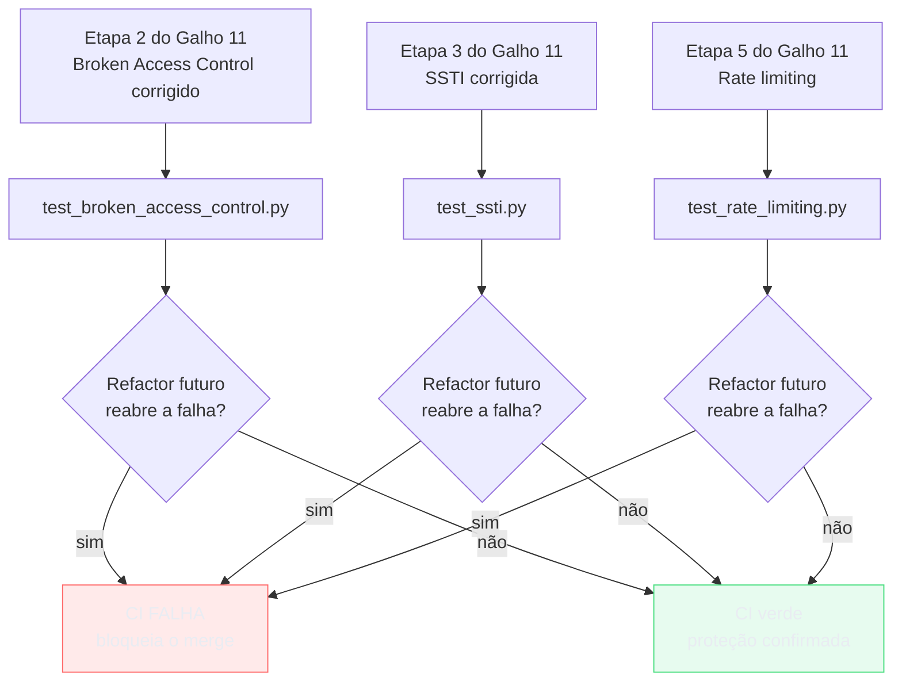
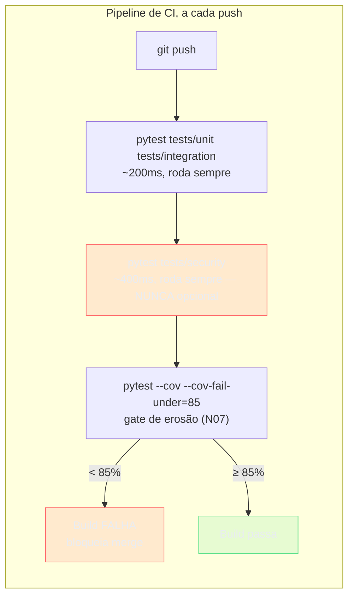
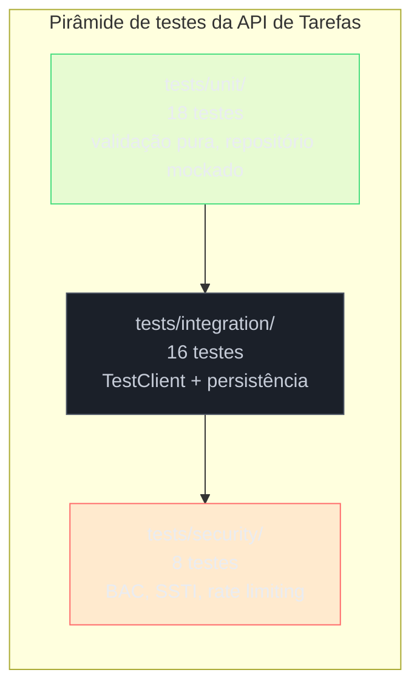

# Capstone — a suíte de testes da API de Tarefas

> [!abstract] TL;DR
> A API de Tarefas sai da [[03-Dominios/Tecnologia/Python/Segurança/09 - Capstone — hardening da API do Galho 10|capstone do Galho 11]] blindada — autenticação real, Broken Access Control corrigido, SSTI fechada, secrets tipados, rate limiting, validação de destino — mas com **zero teste automatizado**. Cada correção foi verificada uma vez, manualmente, com um `curl`. Esta nota constrói a suíte que falta, amarrando cada peça a uma nota específica deste galho: testes unitários de lógica pura ([[01 - pytest fundamentos — anatomia, discovery e assert introspection|nota 01]], [[04 - Mocking com unittest.mock e pytest-mock|nota 04]]), fixtures organizadas em `conftest.py` ([[02 - Fixtures — escopos, yield e conftest.py|nota 02]], [[03 - Parametrização e organização de suíte|nota 03]]), testes de integração da API via `TestClient` ([[05 - Testando a API REST — TestClient e dependency overrides|nota 05]]), isolamento de banco com rollback ([[06 - Testando a camada de persistência — banco de teste e rollback|nota 06]]), e — o núcleo original desta capstone — **testes de segurança como regressão automatizada**: um teste que prova que Broken Access Control continua fechado, um que prova que a SSTI continua fechada, um que prova que o rate limiting do login continua ativo. Coverage ([[07 - Coverage — pytest-cov e o que ele não mede|nota 07]]) mede o que essa suíte de fato exercita, honestamente. E o TDD de uma regra só ([[08 - TDD na prática com pytest|nota 08]]) vira, aqui, o produto final que uma suíte inteira poderia ter sido desde o primeiro commit. Ao final, a suíte revela um acoplamento que as próprias capstones anteriores deixaram visível — lógica de negócio, SQLAlchemy e FastAPI misturados no mesmo handler — que motiva o [[03-Dominios/Tecnologia/Python/Arquitetura e Design Patterns/index|Galho 13]]: Repository e Unit of Work como padrão formal, não mais uma função `_buscar_tarefa_do_usuario` informal.

## Um `curl` não é uma suíte de testes

A API de Tarefas está em staging, blindada, pronta para o pentest de sexta-feira que abriu a [[03-Dominios/Tecnologia/Python/Segurança/09 - Capstone — hardening da API do Galho 10|capstone do Galho 11]]. Cada uma das seis etapas daquela capstone foi verificada — autenticação real, filtro de posse em toda query, SSTI corrigida, secrets tipados, rate limiting no cadastro e no login, validação de destino no anexo. Mas "verificada" ali significava uma coisa específica e frágil: alguém rodou um `curl` à mão, uma vez, leu a resposta, confirmou que batia com o esperado, e seguiu para a próxima etapa. A própria capstone do Galho 11 nomeou isso sem rodeios na seção final: "cada verificação desta nota foi feita manualmente, lendo código e simulando um `curl`. Não é descuido: é o ponto exato onde este galho termina e o próximo começa."

Esse "próximo" é este texto. E o motivo de isso importar não é estético — é que uma correção verificada manualmente uma vez é uma correção que **qualquer refactor futuro pode desfazer sem ninguém perceber**. A [[03-Dominios/Tecnologia/Python/Testes/05 - Testando a API REST — TestClient e dependency overrides|nota 05 deste galho]] já mostrou o cenário exato: um refactor no serviço de domínio moveu a checagem de posse de dentro da query para uma função auxiliar nova, chamada em três dos quatro endpoints — o quarto, adicionado na mesma semana por outra pessoa do time, esqueceu de chamar a função. Ninguém decidiu reabrir Broken Access Control. Ninguém revisou "vamos remover a proteção de posse". Foi um esquecimento silencioso, do tipo que só um teste automatizado pega antes de chegar em produção.

> [!bug] O que está quebrado, em uma frase
> A API do Galho 11 tem seis correções de segurança e zero prova repetível de que elas continuam valendo depois do próximo commit — o hardening é uma fotografia de hoje, não uma garantia contínua.

O trabalho desta capstone não introduz nenhum mecanismo novo. Cada peça da suíte que vem a seguir já foi ensinada, isolada, em uma das oito notas anteriores deste galho — o que falta é montá-las juntas, contra o código real das capstones dos Galhos 9, 10 e 11, e nomear explicitamente a parte mais fácil de esquecer: testes de segurança não são "mais alguns testes" — são a prova de que um pentest que passou hoje continua passando amanhã.

```mermaid
flowchart LR
    classDef destaque fill:#FFAA0024,stroke:#FFAA00,color:#E9ECF2
    classDef ok fill:#4ADE8021,stroke:#4ADE80,color:#E9ECF2
    G11["API do Galho 11\n(blindada, zero teste)"] --> P1["Peça 1\nUnit tests (N01, N04)"]
    P1 --> P2["Peça 2\nFixtures em conftest.py (N02, N03)"]
    P2 --> P3["Peça 3\nIntegração via TestClient (N05)"]
    P3 --> P4["Peça 4\nPersistência com rollback (N06)"]
    P4 --> P5["Peça 5\nRegressão de SEGURANÇA (N05, N11)"]
    P5 --> P6["Peça 6\nCoverage honesto (N07)"]
    P6 --> SUITE["Suíte completa\npronta pra CI"]

    class G11 destaque
    class SUITE ok
```



> [!question]- Por que não bastava a nota 05 já ter mostrado o teste de Broken Access Control?
> A [[03-Dominios/Tecnologia/Python/Testes/05 - Testando a API REST — TestClient e dependency overrides|nota 05]] mostrou, isoladamente, **como** escrever esse teste — o mecanismo de `TestClient` trocando identidade no meio do teste. O que faltava era o quadro completo: onde esse teste mora dentro de uma suíte organizada, o que o acompanha (testes unitários, fixtures compartilhadas, isolamento de banco), e — o ponto que nenhuma nota isolada cobriu — os outros dois testes de segurança que a capstone do Galho 11 deixou como dívida pendente: a regressão de SSTI e a regressão de rate limiting. Esta capstone é o lugar onde as peças se encontram, contra o código real, formando algo que se pareça com o que um time realmente comitaria num repositório.

## A árvore de testes que esta capstone constrói

Antes do código, vale nomear a estrutura de diretório que a [[03 - Parametrização e organização de suíte|nota 03]] já defendeu — `tests/` espelhando o pacote de produção, com uma separação de primeiro nível entre unidade, integração e segurança:

```
api_tarefas/
├── src/
│   ├── main.py              # app FastAPI, rotas
│   ├── auth.py               # get_current_user, hash/verify (Galho 11)
│   ├── config.py              # Settings tipado (Galho 11)
│   ├── db.py                  # Engine/get_db (Galho 9/10)
│   ├── models.py               # Usuario, Tarefa (Galho 11)
│   ├── schemas.py               # TarefaCreate/Read, field_validator (Galho 10/N08)
│   └── routers/
│       ├── auth.py               # /usuarios, /token
│       └── tarefas.py              # CRUD + busca + preview de anexo
├── tests/
│   ├── conftest.py            # fixtures globais: engine, sessao_db, client, usuários
│   ├── unit/
│   │   ├── test_validacao.py    # regra de data_limite — função pura (N01, N08)
│   │   └── test_repositorio.py   # _buscar_tarefa_do_usuario com mock (N04)
│   ├── integration/
│   │   ├── test_tarefas.py        # criar→listar→acessar via TestClient (N05)
│   │   └── test_persistencia.py    # rollback, constraint de FK (N06)
│   └── security/
│       ├── test_broken_access_control.py   # regressão da Etapa 2 do Galho 11
│       ├── test_ssti.py                     # regressão da Etapa 3 do Galho 11
│       └── test_rate_limiting.py             # regressão da Etapa 5 do Galho 11
├── pyproject.toml
└── .env.example
```

A pasta `security/` — irmã de `unit/` e `integration/`, não subpasta de nenhuma delas — é a decisão de organização mais importante desta capstone: tratar teste de segurança como categoria de primeira classe, com o mesmo status de cidadão que teste unitário e teste de integração, em vez de esconder um `test_acesso_negado` qualquer no meio de `test_tarefas.py` onde é fácil ninguém perceber que aquele teste específico é o que impede um pentest de achar o bug de novo.

## Peça 1: `conftest.py` — as fixtures que toda a suíte compartilha

O ponto de partida é o mesmo `conftest.py` que a [[02 - Fixtures — escopos, yield e conftest.py|nota 02]] ensinou a construir e a [[05 - Testando a API REST — TestClient e dependency overrides|nota 05]] já esboçou para esta mesma API — aqui, completo, incorporando também o padrão de rollback da [[06 - Testando a camada de persistência — banco de teste e rollback|nota 06]]:

```python
# tests/conftest.py
from collections.abc import Generator

import pytest
from fastapi.testclient import TestClient
from sqlalchemy import create_engine
from sqlalchemy.orm import Session, sessionmaker
from sqlalchemy.pool import StaticPool

from auth import get_current_user
from db import get_db
from main import app
from models import Base, Usuario

# --- Engine de teste: caro de criar, seguro de compartilhar (N02, N06) ---
engine_teste = create_engine(
    "sqlite:///:memory:",
    connect_args={"check_same_thread": False},
    poolclass=StaticPool,
)


@pytest.fixture(scope="session", autouse=True)
def criar_schema_de_teste():
    """Cria o schema uma vez para a suíte inteira, a partir do MESMO
    metadata declarativo (Base) usado em produção (N05)."""
    Base.metadata.create_all(bind=engine_teste)
    yield
    Base.metadata.drop_all(bind=engine_teste)


# --- Sessão com rollback: isolamento entre testes, nenhum commit sobrevive (N06) ---
@pytest.fixture
def sessao_db() -> Generator[Session, None, None]:
    conexao = engine_teste.connect()
    transacao_externa = conexao.begin()
    SessionTeste = sessionmaker(bind=conexao)
    sessao = SessionTeste()
    sessao.begin_nested()
    yield sessao
    sessao.close()
    transacao_externa.rollback()
    conexao.close()


def _override_get_db_para(sessao: Session):
    def _override() -> Generator[Session, None, None]:
        yield sessao
    return _override


# --- Usuários fixos de teste — sem hash real, sem login de verdade (N05) ---
USUARIO_A = Usuario(id=1, nome="Ana", email="ana@teste.com", senha_hash="irrelevante")
USUARIO_B = Usuario(id=2, nome="Bruno", email="bruno@teste.com", senha_hash="irrelevante")


def _override_usuario(usuario: Usuario):
    def _override() -> Usuario:
        return usuario
    return _override


@pytest.fixture
def client(sessao_db) -> Generator[TestClient, None, None]:
    """Cliente de teste com get_db e get_current_user já trocados —
    a suíte de tarefas testa tarefas, não autenticação em si (N05)."""
    app.dependency_overrides[get_db] = _override_get_db_para(sessao_db)
    app.dependency_overrides[get_current_user] = _override_usuario(USUARIO_A)
    yield TestClient(app)
    app.dependency_overrides.clear()


@pytest.fixture
def como_usuario_b(client):
    """Troca a identidade autenticada NO MEIO da suíte — usado pelos
    testes de acesso cruzado (N05, seção de Broken Access Control)."""
    app.dependency_overrides[get_current_user] = _override_usuario(USUARIO_B)
    yield client
```

Três decisões de escopo merecem nome, porque são exatamente as que a [[02 - Fixtures — escopos, yield e conftest.py|nota 02]] cravou como regra geral: `engine_teste` e o schema são caros e não mutados por teste algum — vivem em `scope="session"`. `sessao_db` é o dado que cada teste manipula ativamente — `scope="function"` (default), com a transação externa e o `begin_nested()` garantindo que nem os `commit()` que a aplicação faz sobrevivem ao teardown, como a [[06 - Testando a camada de persistência — banco de teste e rollback|nota 06]] desenvolveu em detalhe. E `USUARIO_A`/`USUARIO_B` são constantes de módulo, não fixtures — não há nada para isolar entre testes num objeto Python que nenhum teste modifica.

> [!tip] `como_usuario_b` é uma fixture pequena, mas resolve a repetição que a nota 05 apontou
> A [[03-Dominios/Tecnologia/Python/Testes/05 - Testando a API REST — TestClient e dependency overrides|nota 05]] mostrou o padrão de trocar `app.dependency_overrides[get_current_user]` **dentro** do corpo do teste — pedagogicamente correto para ensinar o mecanismo, mas repetitivo se vários testes precisam do mesmo "e agora é o Bruno que está logado". `como_usuario_b` extrai esse padrão para uma fixture reutilizável, exatamente a composição de fixtures que a [[02 - Fixtures — escopos, yield e conftest.py|nota 02]] já recomendou para `engine_db`/`sessao_db`.

## Peça 2: testes unitários — lógica pura, sem I/O

A base da pirâmide. Dois testes, dois estilos diferentes de "unitário": um sobre uma função pura extraída de um `@field_validator`, outro sobre uma função que depende de uma sessão de banco — mockada, não real.

### A regra de `data_limite`, extraída como função pura

A [[08 - TDD na prática com pytest|nota 08]] construiu, via TDD, a regra "prazo não pode estar no passado" como um `@field_validator` de `TarefaCreate`. Um `@field_validator` é convenientemente testável já por meio do próprio schema — mas, para isolar a regra de qualquer dependência do Pydantic, vale extrair a lógica de comparação de datas para uma função solta, que o validator só invoca:

```python
# src/schemas.py
from datetime import date

from pydantic import BaseModel, field_validator


def data_limite_no_passado(valor: date | None, hoje: date | None = None) -> bool:
    """Função PURA — sem I/O, sem Pydantic, sem FastAPI.
    hoje é injetável para o teste não depender do relógio do sistema (N04)."""
    if valor is None:
        return False
    referencia = hoje if hoje is not None else date.today()
    return valor < referencia


class TarefaCreate(BaseModel):
    titulo: str
    data_limite: date | None = None
    anexo_url: str | None = None

    @field_validator("data_limite")
    @classmethod
    def valida_data_limite(cls, valor: date | None) -> date | None:
        if data_limite_no_passado(valor):
            raise ValueError("data_limite não pode estar no passado")
        return valor
```

```python
# tests/unit/test_validacao.py
from datetime import date

import pytest

from schemas import data_limite_no_passado

CASOS = [
    pytest.param(date(2020, 1, 1), date(2026, 7, 11), True, id="data-no-passado"),
    pytest.param(date(2030, 1, 1), date(2026, 7, 11), False, id="data-no-futuro"),
    pytest.param(date(2026, 7, 11), date(2026, 7, 11), False, id="data-igual-a-hoje"),
    pytest.param(None, date(2026, 7, 11), False, id="none-e-sempre-valido"),
]


@pytest.mark.parametrize("valor,hoje,esperado", CASOS)
def test_data_limite_no_passado(valor, hoje, esperado):
    assert data_limite_no_passado(valor, hoje=hoje) == esperado
```

Esse teste roda em microssegundos, não toca banco, não sobe a aplicação, e usa exatamente o par que a [[01 - pytest fundamentos — anatomia, discovery e assert introspection|nota 01]] e a [[03 - Parametrização e organização de suíte|nota 03]] ensinaram: `assert` nativo com `ids` legíveis, uma função e uma tabela de casos em vez de quatro funções quase idênticas. Repare também o parâmetro `hoje` injetável — a mesma lição de "não mocke o próprio código sob teste, mas isole o relógio do sistema quando ele é o que torna o teste não determinístico" que a [[04 - Mocking com unittest.mock e pytest-mock|nota 04]] listou entre as fronteiras que merecem controle explícito em teste.

### `_buscar_tarefa_do_usuario` isolada, com sessão mockada

A função central da Etapa 2 do Galho 11 — a que centraliza a checagem de posse e torna "esquecer de filtrar por dono" estruturalmente difícil — também merece um teste unitário isolado, sem subir a API inteira. Como ela depende de uma `Session` do SQLAlchemy, o candidato certo a mock é exatamente essa dependência de I/O, seguindo a régua da [[04 - Mocking com unittest.mock e pytest-mock|nota 04]]:

```python
# src/routers/tarefas.py (trecho, já apresentado na capstone do Galho 11)
from sqlalchemy import select
from sqlalchemy.orm import Session

from domain.exceptions import TarefaNaoEncontrada
from models import Tarefa


def _buscar_tarefa_do_usuario(db: Session, tarefa_id: int, usuario_id: int) -> Tarefa:
    tarefa = db.scalar(
        select(Tarefa).where(Tarefa.id == tarefa_id, Tarefa.usuario_id == usuario_id)
    )
    if tarefa is None:
        raise TarefaNaoEncontrada(tarefa_id)
    return tarefa
```

```python
# tests/unit/test_repositorio.py
import pytest

from domain.exceptions import TarefaNaoEncontrada
from models import Tarefa
from routers.tarefas import _buscar_tarefa_do_usuario


def test_busca_tarefa_do_usuario_encontra_quando_e_dono(mocker):
    tarefa_fake = Tarefa(id=42, usuario_id=1, titulo="Fechar relatório")
    sessao_mock = mocker.Mock()
    sessao_mock.scalar.return_value = tarefa_fake

    resultado = _buscar_tarefa_do_usuario(sessao_mock, tarefa_id=42, usuario_id=1)

    assert resultado is tarefa_fake
    sessao_mock.scalar.assert_called_once()   # a QUERY foi disparada — não só o retorno checado


def test_busca_tarefa_do_usuario_levanta_erro_quando_query_nao_encontra(mocker):
    sessao_mock = mocker.Mock()
    sessao_mock.scalar.return_value = None   # simula: tarefa de outro dono, ou inexistente

    with pytest.raises(TarefaNaoEncontrada):
        _buscar_tarefa_do_usuario(sessao_mock, tarefa_id=999, usuario_id=1)
```

`mocker.Mock()` sem `spec` seria, pela régua da [[04 - Mocking com unittest.mock e pytest-mock|nota 04]], um risco — mas aqui o objeto mockado é uma `Session` do SQLAlchemy inteira, com dezenas de métodos que este teste nem toca; `spec=Session` (ou `autospec` num `mocker.patch` completo) valeria a pena numa suíte maior, mas para um teste tão focado num único método (`scalar`) o ganho marginal é pequeno — o ponto que este teste unitário prova é estritamente lógico: "dado que a query devolve `None`, a função levanta `TarefaNaoEncontrada`" — sem precisar de um banco de verdade para simular "tarefa não encontrada porque é de outro usuário". Esse cenário específico — a query devolvendo vazio porque o filtro por dono excluiu a linha — é testado de ponta a ponta, contra banco real, na Peça 5 desta capstone.

## Peça 3: integração — o fluxo completo via `TestClient`

Subindo um degrau na pirâmide, o teste que a [[05 - Testando a API REST — TestClient e dependency overrides|nota 05]] já desenvolveu quase por completo — aqui, integrado à árvore final da suíte, cobrindo o fluxo funcional (sem ainda focar em segurança, que é a Peça 5):

```python
# tests/integration/test_tarefas.py
def test_criar_tarefa_retorna_201_com_shape_correto(client):
    resposta = client.post("/tarefas", json={"titulo": "Revisar PR #482"})

    assert resposta.status_code == 201
    corpo = resposta.json()
    assert corpo["titulo"] == "Revisar PR #482"
    assert corpo["concluida"] is False
    assert isinstance(corpo["id"], int)
    assert corpo["usuario_id"] == 1   # USUARIO_A, o default do fixture client
    assert "senha" not in corpo and "senha_hash" not in corpo


def test_criar_tarefa_com_data_limite_no_passado_retorna_422(client):
    resposta = client.post(
        "/tarefas",
        json={"titulo": "Prazo impossível", "data_limite": "2020-01-01"},
    )
    assert resposta.status_code == 422
    corpo = resposta.json()
    assert any("data_limite" in str(erro.get("loc", "")) for erro in corpo["detail"])


def test_fluxo_criar_listar_e_concluir_tarefa(client):
    criada = client.post("/tarefas", json={"titulo": "Fechar relatório fiscal"}).json()

    listagem = client.get("/tarefas").json()
    assert any(t["id"] == criada["id"] for t in listagem)

    concluida = client.patch(f"/tarefas/{criada['id']}/concluir").json()
    assert concluida["concluida"] is True
```

Esses três testes exercitam exatamente o que a [[05 - Testando a API REST — TestClient e dependency overrides|nota 05]] chamou de fronteira entre teste unitário e teste de integração: roteamento, validação Pydantic (incluindo o `@field_validator` da Peça 2, agora exercitado através da pilha inteira do FastAPI, não isolado), execução do handler, serialização — tudo em processo, sem servidor real, na casa de milissegundos por teste.

> [!question]- Por que testar `data_limite` de novo aqui, se a Peça 2 já testou a função pura?
> Porque são duas garantias diferentes, e a nota 08 já nomeou essa diferença ao explicar por que outside-in começa pelo teste de fora: o teste unitário da Peça 2 prova que `data_limite_no_passado(...)` está logicamente correta, isolada. Este teste de integração prova algo que a função pura sozinha não garante: que o `@field_validator` está de fato **ligado** ao schema, que o schema está de fato ligado ao endpoint, e que o FastAPI de fato converte o `ValueError` levantado em `422` com o `loc` certo. É perfeitamente possível ter a função pura testada e correta, e ainda assim um refactor desconectar o validator do campo por engano — só o teste de integração pegaria isso. As duas camadas se complementam; nenhuma substitui a outra.

## Peça 4: persistência — rollback garantindo isolamento

A [[06 - Testando a camada de persistência — banco de teste e rollback|nota 06]] já entregou o mecanismo (a fixture `sessao_db` do `conftest.py` desta capstone é exatamente aquele padrão). O que falta é um teste que exercite a camada de persistência **diretamente**, sem passar pela API — validando, por exemplo, que a constraint de `UniqueConstraint("email")` do modelo `Usuario` (herdada da capstone do Galho 11) é de fato respeitada pelo banco, não só pela validação de aplicação:

```python
# tests/integration/test_persistencia.py
import pytest
from sqlalchemy.exc import IntegrityError

from models import Usuario


def test_email_duplicado_e_rejeitado_pela_constraint_do_banco(sessao_db):
    sessao_db.add(Usuario(nome="Ana", email="ana@teste.com", senha_hash="hash1"))
    sessao_db.commit()

    sessao_db.add(Usuario(nome="Ana Duplicada", email="ana@teste.com", senha_hash="hash2"))
    with pytest.raises(IntegrityError):
        sessao_db.commit()


def test_dois_testes_seguidos_nunca_veem_dado_um_do_outro(sessao_db):
    # Prova a própria fixture: se o rollback da nota 06 estivesse quebrado,
    # este teste veria o Usuario criado no teste anterior — e falharia.
    usuarios = sessao_db.query(Usuario).all()
    assert usuarios == []
```

O segundo teste é, deliberadamente, um teste sobre a **própria infraestrutura de teste** — prova, de forma automatizada, exatamente o bug que abriu a [[06 - Testando a camada de persistência — banco de teste e rollback|nota 06]] (o time que trocou `scope="session"` sem rollback e viu dado vazar entre testes). Se alguém, meses depois, "otimizar" a fixture `sessao_db` removendo o `rollback()` por engano, este teste é o primeiro a acusar.

## Peça 5: segurança como regressão — o núcleo desta capstone

Chegando à peça que dá sentido ao resto: transformar cada correção manual da [[03-Dominios/Tecnologia/Python/Segurança/09 - Capstone — hardening da API do Galho 10|capstone do Galho 11]] numa asserção que roda a cada `git commit`, não numa checagem feita uma vez com `curl`.



### (a) Broken Access Control: 404 para quem não é dono

O teste mais valioso da suíte inteira — a [[05 - Testando a API REST — TestClient e dependency overrides|nota 05]] já desenvolveu essa versão em detalhe; aqui ele ganha um lar definitivo em `tests/security/`, e é estendido para cobrir os quatro verbos, não só `GET`/`DELETE`:

```python
# tests/security/test_broken_access_control.py
def test_usuario_b_nao_acessa_tarefa_de_usuario_a(client, como_usuario_b):
    tarefa = client.post("/tarefas", json={"titulo": "Fechar relatório fiscal"}).json()
    tarefa_id = tarefa["id"]

    # Usuário B tenta ler — a query já nasce filtrada por dono (Galho 11, Etapa 2)
    resposta_get = como_usuario_b.get(f"/tarefas/{tarefa_id}")
    assert resposta_get.status_code == 404

    # Usuário B tenta concluir — mesmo endpoint, mesma proteção
    resposta_patch = como_usuario_b.patch(f"/tarefas/{tarefa_id}/concluir")
    assert resposta_patch.status_code == 404

    # Usuário B tenta apagar — verbo destrutivo, mesma proteção
    resposta_delete = como_usuario_b.delete(f"/tarefas/{tarefa_id}")
    assert resposta_delete.status_code == 404

    # A tarefa de A não aparece na listagem de B
    listagem_b = como_usuario_b.get("/tarefas").json()
    assert all(t["id"] != tarefa_id for t in listagem_b)


def test_usuario_b_nao_ve_previa_de_anexo_de_tarefa_de_usuario_a(client, como_usuario_b):
    tarefa = client.post(
        "/tarefas",
        json={"titulo": "Com anexo", "anexo_url": "https://exemplo.com/doc.pdf"},
    ).json()

    resposta = como_usuario_b.get(f"/tarefas/{tarefa['id']}/anexo/preview")
    # _buscar_tarefa_do_usuario (Etapa 2) roda ANTES de qualquer requisição de
    # saída (Etapa 6) — o 404 de posse bloqueia o fluxo antes de tocar a rede
    assert resposta.status_code == 404
```

Este teste cobrindo os quatro verbos é exatamente a resposta ao incidente de abertura da [[05 - Testando a API REST — TestClient e dependency overrides|nota 05]]: um endpoint que "esquece" de chamar `_buscar_tarefa_do_usuario` — como o quarto endpoint daquele cenário — faz este teste falhar imediatamente, apontando qual verbo especificamente reabriu a falha, em vez de esperar um pentest (ou um cliente pagante) encontrar sozinho.

### (b) SSTI: o payload `{{7*7}}` não deve virar `49`

A Etapa 3 do Galho 11 corrigiu o endpoint de busca com highlight trocando um texto-fonte de template montado dinamicamente por um template fixo, com o título entrando só como valor de contexto. O teste de regressão prova exatamente a propriedade que caracteriza SSTI: um payload de expressão Jinja2 nunca deve ser **avaliado**, só exibido como texto:

```python
# tests/security/test_ssti.py
def test_titulo_com_expressao_jinja_nao_e_avaliado_na_busca(client):
    client.post("/tarefas", json={"titulo": "Cálculo {{7*7}} pendente"})

    resposta = client.get("/tarefas/buscar", params={"termo": "Cálculo"})
    assert resposta.status_code == 200

    corpo = resposta.json()
    htmls = [item["html"] for item in corpo]

    # A prova NEGATIVA é o ponto central: "49" NUNCA deve aparecer —
    # se aparecer, o Jinja2 avaliou a expressão como código, não como texto
    assert not any("49" in html for html in htmls)

    # A prova POSITIVA confirma que o texto sobrevive LITERAL, com o highlight aplicado
    assert any("{{7*7}}" in html and "<mark>Cálculo</mark>" in html for html in htmls)


def test_titulo_com_payload_de_vazamento_de_config_nao_expoe_segredo(client):
    client.post("/tarefas", json={"titulo": "{{ config.items() }} urgente"})

    resposta = client.get("/tarefas/buscar", params={"termo": "urgente"})
    corpo = resposta.json()

    # Nenhum resultado pode conter o valor real de um secret configurado —
    # a prova mais direta de que a Etapa 3 do Galho 11 continua fechada
    assert not any("jwt_secret" in item["html"].lower() for item in corpo)
    assert not any("ItemsView" in item["html"] for item in corpo)
```

> [!warning] O primeiro `assert` (negativo) é o que realmente pega a regressão — não o segundo
> Um erro fácil de cometer ao escrever este teste é focar só na prova positiva ("o texto aparece como esperado") e esquecer a prova negativa ("o resultado da avaliação NUNCA aparece"). Se alguém reintroduzir `Template(f"<span>{titulo}</span>")` (o texto-fonte montado dinamicamente, o bug original da Etapa 3), a versão vulnerável ainda produziria *algum* HTML contendo `{{7*7}}` num primeiro golpe de vista — mas avaliado como `49`. Um teste que só checasse "o `html` não está vazio" ou "o status é 200" passaria do mesmo jeito vulnerável ou não. É a asserção `assert not any("49" in html ...)` que efetivamente distingue as duas versões — o mesmo princípio da [[07 - Coverage — pytest-cov e o que ele não mede|nota 07]]: um teste que executa a linha vulnerável sem verificar o resultado específico não protege nada.

### (c) Rate limiting: a Nª tentativa de login recebe `429`

A Etapa 5 do Galho 11 aplicou `slowapi` em `/token`, limitado por `settings.rate_limit_login` (`"5/minute"` no exemplo daquela capstone). O teste de regressão bate o endpoint repetidamente e confirma que o limite existe de fato, não só na configuração:

```python
# tests/security/test_rate_limiting.py
def test_login_bloqueia_apos_exceder_o_limite_de_tentativas(client, monkeypatch):
    # slowapi usa o IP do cliente como chave por padrão — TestClient simula
    # sempre o mesmo IP de origem, então tentativas sucessivas SOMAM no limiter
    payload = {"username": "inexistente@teste.com", "password": "senha-errada"}

    respostas = [client.post("/token", data=payload) for _ in range(6)]

    # As primeiras N (o limite configurado) recebem 401 — credencial inválida,
    # mas o endpoint AINDA processa a tentativa
    for resposta in respostas[:5]:
        assert resposta.status_code == 401

    # A tentativa que excede o limite recebe 429, não mais 401 —
    # o slowapi intercepta ANTES do handler rodar (Galho 11, Etapa 5)
    assert respostas[5].status_code == 429
```

> [!tip] Rate limiting em teste exige um detalhe que os outros dois testes de segurança não têm: estado entre chamadas
> Ao contrário de Broken Access Control e SSTI — onde cada `assert` verifica uma única requisição isolada — o teste de rate limiting depende, por natureza, de **múltiplas chamadas em sequência contra o mesmo limiter**. Isso significa que a fixture `client` desta capstone precisa garantir que o `Limiter` do `slowapi` não vaza estado **entre testes diferentes** (o próprio limiter, tipicamente um singleton em `app.state.limiter`, teria memória de tentativas de um teste anterior se não for resetado). Na prática, isso normalmente exige uma fixture adicional, com `autouse=True`, que limpa o armazenamento interno do limiter no `setup` de cada teste — o mesmo princípio de isolamento por `scope="function"` que a [[02 - Fixtures — escopos, yield e conftest.py|nota 02]] já ensinou, aplicado a mais um tipo de estado compartilhado além de banco de dados.

## Peça 6: coverage — o que a suíte prova, honestamente

Com as cinco peças anteriores escritas, rodar a suíte com `--cov` mede exatamente o que ela exercita — nem mais, nem menos:

```bash
pytest --cov=src --cov-branch --cov-report=term-missing --cov-fail-under=85
```

Um relatório ilustrativo, coerente com o que essa árvore de testes cobriria de verdade:

```
Name                                Stmts   Miss  Branch  BrPart  Cover   Missing
------------------------------------------------------------------------------------
src/auth.py                            34      2       8       1     91%   58-59
src/config.py                          12      0       0       0    100%
src/db.py                               9      0       2       0    100%
src/models.py                          28      0       4       0    100%
src/schemas.py                         22      0       6       0    100%
src/routers/auth.py                    24      3       4       2     85%   41-43
src/routers/tarefas.py                  61      4      18       3     91%   78-81
src/domain/exceptions.py                 8      0       0       0    100%
------------------------------------------------------------------------------------
TOTAL                                  198      9      42       6     91%
```

91% é um número que, pela régua da [[07 - Coverage — pytest-cov e o que ele não mede|nota 07]], **não** é motivo de comemoração sozinho — é um piso. As linhas `58-59` de `auth.py` não cobertas (tipicamente o `except jwt.InvalidTokenError` de `get_current_user`, o caminho de token corrompido ou expirado) e `41-43` de `routers/auth.py` (provavelmente um caso de erro no cadastro, como e-mail já existente sem passar pela constraint do banco) são exatamente o tipo de lacuna que o relatório `term-missing` existe para apontar — não para envergonhar ninguém, para orientar onde investir a próxima hora de trabalho.

> [!warning] 91% de coverage não prova que os três testes de segurança pegam regressão de verdade
> A [[07 - Coverage — pytest-cov e o que ele não mede|nota 07]] já deixou isso explícito: coverage mede execução, não correção. Os três testes de `tests/security/` desta capstone **executam** as linhas certas — mas o que de fato prova que eles pegam uma regressão real é o conteúdo específico de cada `assert` (o `assert not any("49" in html ...)` da Peça 5b, não um genérico `assert resposta.status_code == 200`), não o número de coverage. Para essa fatia específica do código — autenticação, checagem de posse, sanitização de template — um investimento periódico em mutation testing (`mutmut`, também citado na nota 07) valeria mais que perseguir os últimos pontos percentuais de coverage nas linhas de erro menos críticas.



O detalhe que essa figura torna explícito: `tests/security/` não é um subconjunto opcional, marcado `slow` ou `integration`, filtrado do dia a dia pela técnica de marks que a [[03 - Parametrização e organização de suíte|nota 03]] ensinou para separar pre-commit rápido de CI completo. Os três testes de regressão de segurança desta capstone rodam sempre, em toda execução — o custo de rodá-los (milissegundos, contra `TestClient` e SQLite em memória) é irrelevante perto do custo de uma regressão de Broken Access Control chegar a produção sem ninguém notar.

## A pirâmide desta suíte, em números

Somando as peças, uma suíte real para esta API teria uma forma próxima desta — não um número absoluto a copiar, mas uma proporção plausível para o tamanho do sistema:



42 testes ao todo — não é um número grande para uma API de quatro recursos, dois endpoints de autenticação e um endpoint de busca, e é exatamente o tamanho que a pirâmide de testes ([[03-Dominios/Engenharia/Testes/index|Engenharia/Testes]], não reexplicada aqui) prevê: mais testes unitários (baratos, rápidos, muitos casos de borda) do que testes de integração (mais caros, cobrindo fluxos), e um punhado pequeno mas não-negociável de testes de segurança — não porque segurança importe menos, mas porque cada teste de segurança, bem escrito, já cobre uma classe inteira de ataque de uma vez (o teste de Broken Access Control cobre quatro verbos num só; não precisa de quatro testes de segurança separados para isso).

## O TDD que esta suíte poderia ter sido desde o início

A [[08 - TDD na prática com pytest|nota 08]] mostrou o ciclo red-green-refactor para uma única regra — `data_limite` no passado — nascendo antes do código que a implementa. Vale nomear, fechando esta capstone, o que essa nota realmente demonstrou em escala pequena: se cada uma das seis correções da [[03-Dominios/Tecnologia/Python/Segurança/09 - Capstone — hardening da API do Galho 10|capstone do Galho 11]] tivesse nascido com o teste primeiro — `test_usuario_b_nao_acessa_tarefa_de_usuario_a` escrito e vermelho **antes** de `_buscar_tarefa_do_usuario` existir, `test_titulo_com_expressao_jinja_nao_e_avaliado_na_busca` vermelho antes do endpoint de busca com highlight ser implementado — a suíte inteira desta capstone não seria um trabalho retroativo de "escrever teste para código que já existe". Seria o produto natural do processo, não uma dívida paga depois.

Isso não é uma crítica ao Galho 11 — como a própria capstone daquele galho justificou, a API precisava evoluir de forma incremental e visível, de "ingênua" para "blindada", com cada correção nomeada e rastreável a um incidente concreto. Mas a lição fica: **a suíte que fecha este galho é o que TDD, praticado desde o Galho 10, teria produzido de qualquer forma** — só que, sem TDD, essa suíte precisou ser reconstruída retrospectivamente, correndo o risco (real, e específico) de esquecer um caso de borda que só apareceria naturalmente se o teste tivesse sido escrito antes, quando a pergunta "o que pode dar errado aqui?" ainda estava em aberto.

> [!question]- Vale reescrever a API inteira agora, do zero, com TDD verdadeiro?
> Não — e o motivo é o mesmo que a [[08 - TDD na prática com pytest|nota 08]] já nomeou sobre quando TDD compensa o investimento: a API já existe, já funciona, já foi validada em staging. Reescrever do zero para "fazer certo com TDD" trocaria um risco conhecido (a suíte atual pode ter lacunas retrospectivas) por um risco maior (reescrever sob pressão de tempo introduz bugs novos, sem a rede de segurança que só uma suíte já madura oferece). O valor prático de nomear essa lição não é "refaça tudo" — é "da próxima regra de negócio em diante, escreva o teste primeiro", exatamente como a nota 08 demonstrou para uma regra só. TDD compensa mais no código que ainda não existe do que no código já em produção.

## Em entrevista

A pergunta mais reveladora aqui não é "como você escreveria testes para essa API" — é **"a API que você me mostrou tem seis correções de segurança recentes; como você prova, sem me pedir para confiar na sua palavra, que elas continuam valendo?"**

> "Eu não trataria isso como uma pergunta sobre testes em geral — trataria como três garantias específicas e nomeáveis, cada uma com um teste dedicado que simula exatamente o ataque que a correção original fechou. Para Broken Access Control, um teste que cria um recurso como um usuário e tenta acessar/editar/apagar como outro usuário, esperando 404 nos quatro verbos, não só no que alguém lembrou de testar manualmente. Para injeção de template, um teste que planta um payload de expressão (`{{7*7}}`) como dado de entrada e verifica, de forma negativa, que o resultado avaliado (`49`) nunca aparece na resposta — a prova positiva sozinha não basta, porque um payload não-avaliado e um payload avaliado podem parecer superficialmente parecidos num primeiro olhar. Para rate limiting, um teste que bate o endpoint sensível N+1 vezes e confirma que a última tentativa recebe 429, não 401. Esses três testes vivem numa pasta própria, `tests/security/`, tratados como não-opcionais no CI — nunca filtrados por um marker de 'lento' ou 'de integração', porque o custo de rodá-los é irrelevante perto do custo de uma regressão chegar a produção. E eu seria honesto sobre o que coverage prova e o que não prova: 90%+ de cobertura nesses módulos mede que as linhas certas rodam, não que os asserts pegam regressão de verdade — para isso, o teste de segurança precisa ter uma asserção específica sobre o comportamento que caracteriza o ataque, não um `assert status_code == 200` genérico."

> [!question]- O entrevistador pergunta: "e se um bug de segurança novo, que ninguém previu, aparecer amanhã?"
> A resposta honesta reconhece o limite estrutural de qualquer suíte de regressão: "essa suíte prova que os bugs **já conhecidos e já corrigidos** não voltam — ela não prova, e não tem como provar, que não existe um bug diferente, de uma classe que ninguém pensou em testar ainda. É por isso que teste automatizado de regressão de segurança e auditoria/pentest periódico não são a mesma prática, e uma não substitui a outra: o teste automatizado é a memória de longo prazo do time sobre incidentes já resolvidos; o pentest é o processo que descobre a próxima classe de bug que a suíte ainda não sabe que precisa testar. Quando um pentest ou um bug em produção revelar algo novo, a resposta certa é a mesma da nota 08 deste galho: escrever o teste que reproduz o bug primeiro, vê-lo vermelho, corrigir, vê-lo verde — e esse teste novo entra em `tests/security/`, engordando a mesma rede de proteção contínua."

## How to explain in English

> "A hardened API with zero automated tests is a photograph, not a guarantee — every security fix I make today is one careless refactor away from silently regressing tomorrow, and nobody would notice until the next pentest or, worse, the next incident. Building the test suite for this API isn't about writing 'more tests' in general — it's about turning each specific fix into a repeatable assertion. Unit tests cover pure logic — a date-validation rule, a repository function with its database session mocked — fast, no I/O, no server. Integration tests exercise the full FastAPI stack through `TestClient`, with `dependency_overrides` swapping the real database and real authentication for test doubles, and a rollback fixture ensuring no test's writes leak into the next one. But the piece that actually matters most is a dedicated `tests/security/` directory, treated as first-class, never filtered out of CI by a 'slow' marker: a test that creates a resource as one user and tries to access it as another, expecting a 404 across every verb, not just the one someone remembered to check manually; a test that plants a template-injection payload and asserts, negatively, that the evaluated result never appears in the response — the negative assertion is what actually catches the regression, a positive-only check can pass on both the vulnerable and the fixed version; and a test that hammers a rate-limited endpoint past its threshold and confirms the exact status code that should follow. Coverage tells me which lines these tests execute, not whether the assertions are strong enough to catch a real regression — for the modules where a silent bug is expensive, that's a separate, honest conversation, not something a coverage percentage settles on its own."

| PT-BR | English |
|---|---|
| suíte de testes | test suite |
| regressão de segurança | security regression |
| teste de acesso cruzado | cross-access test |
| prova negativa (assert not) | negative assertion |
| rede de proteção contínua | continuous safety net |
| dívida paga retroativamente | retroactive tech debt payoff |
| pirâmide de testes | test pyramid |
| gate de coverage | coverage gate |

## Síntese — o que este galho ensinou, amarrado

Recapitulando as oito notas deste galho, cada uma aplicada nesta capstone:

1. [[01 - pytest fundamentos — anatomia, discovery e assert introspection|01 — pytest fundamentos]] deu o alicerce — `assert` nativo, discovery por convenção — usado sem exceção em todo teste desta suíte, e diretamente na Peça 2 (teste unitário de `data_limite_no_passado`).
2. [[02 - Fixtures — escopos, yield e conftest.py|02 — Fixtures]] ensinou o mecanismo de injeção por nome, escopo e `yield`/teardown, aplicado ao `conftest.py` inteiro desta capstone — `engine_teste` (session), `sessao_db` e `client` (function), `como_usuario_b` como composição.
3. [[03 - Parametrização e organização de suíte|03 — Parametrização e organização de suíte]] ensinou `@pytest.mark.parametrize`/`ids` (Peça 2) e a organização `unit`/`integration` que esta capstone estende com uma terceira pasta de primeira classe, `security/`.
4. [[04 - Mocking com unittest.mock e pytest-mock|04 — Mocking com unittest.mock e pytest-mock]] ensinou a fronteira certa para mockar — fronteiras externas, nunca o próprio código sob teste — aplicada ao teste unitário de `_buscar_tarefa_do_usuario` com `sessao_mock` (Peça 2).
5. [[05 - Testando a API REST — TestClient e dependency overrides|05 — Testando a API REST]] deu o `TestClient`/`dependency_overrides` que sustenta toda a Peça 3 e o teste de Broken Access Control da Peça 5, estendido aqui para os quatro verbos.
6. [[06 - Testando a camada de persistência — banco de teste e rollback|06 — Testando a camada de persistência]] deu a fixture de rollback que garante isolamento entre os 42 testes desta suíte, e o teste que prova a própria infraestrutura de teste na Peça 4.
7. [[07 - Coverage — pytest-cov e o que ele não mede|07 — Coverage]] deu o vocabulário honesto para ler o relatório da Peça 6 — 91% como piso contra erosão, nunca como prova de que os testes de segurança pegam regressão de verdade.
8. [[08 - TDD na prática com pytest|08 — TDD na prática com pytest]] demonstrou o ciclo para uma regra só; esta capstone é o que uma suíte inteira poderia ter sido, nascida daquele mesmo processo, regra por regra.
9. Esta nota fechou amarrando as oito peças numa árvore de testes coerente contra a API real das capstones dos Galhos 9, 10 e 11 — sem introduzir mecanismo novo, só integração, o mesmo movimento que as três capstones anteriores desta trilha já fizeram.

Juntas, essas nove notas formam **como testar uma API Python real de ponta a ponta** — não "como usar `assert`" isoladamente, mas como transformar cada garantia (funcional e de segurança) numa asserção que sobrevive ao próximo commit, ao próximo refactor, à próxima pessoa que nunca leu o incidente original que motivou a correção.

## O que vem a seguir

Esta capstone, ao escrever `_buscar_tarefa_do_usuario` uma dezena de vezes em contextos de teste diferentes — mockada na Peça 2, exercitada de ponta a ponta na Peça 5 — deixa visível algo que as capstones anteriores já sugeriam sem nomear: essa função se comporta, informalmente, como um **Repository** — uma camada que sabe como buscar um `Tarefa` filtrado por dono, escondendo a query SQLAlchemy de quem só quer "a tarefa do usuário atual". E o padrão de `db.add(); db.commit(); db.refresh()`, repetido em cada handler de `routers/tarefas.py`, se comporta como um **Unit of Work** informal — uma transação que agrupa uma sequência de operações, sem que ninguém tenha nomeado isso explicitamente como um padrão.

- **[[03-Dominios/Tecnologia/Python/Arquitetura e Design Patterns/index|Galho 13 — Arquitetura e Design Patterns]]** (próximo) — formaliza esses dois padrões informais que emergiram organicamente ao longo dos Galhos 9-12: Repository como abstração explícita sobre a query filtrada por dono, Unit of Work como abstração explícita sobre a transação — em cima do que as capstones dos Galhos 9, 10, 11 e esta mesma capstone já construíram, sem esperar mais nenhum incidente para nomear o que já estava lá.
- [[03-Dominios/Tecnologia/Python/index|Trilha Python]] — MOC da trilha.
- [[index|Testes (Galho 12)]] — MOC deste galho.

## Fontes

- pytest documentation. *How to invoke pytest*, *Fixtures*, *Parametrize*. docs.pytest.org. https://docs.pytest.org/en/stable/ (acessado em 2026-07-11) — base de todo o ferramental integrado nesta capstone.
- FastAPI. *Testing*, *Testing Dependencies with Overrides*. fastapi.tiangolo.com. https://fastapi.tiangolo.com/tutorial/testing/ e https://fastapi.tiangolo.com/advanced/testing-dependencies/ (acessados em 2026-07-11) — `TestClient`/`dependency_overrides` usados nas Peças 3 e 5.
- SQLAlchemy. *Joining a Session into an External Transaction (such as for test suites)*. docs.sqlalchemy.org. https://docs.sqlalchemy.org/en/20/orm/session_transaction.html#joining-a-session-into-an-external-transaction-such-as-for-test-suites (acessado em 2026-07-11) — padrão de rollback usado na Peça 4 e no `conftest.py`.
- coverage.py / pytest-cov. *Branch coverage*. coverage.readthedocs.io. https://coverage.readthedocs.io/ (acessado em 2026-07-11) — base do relatório sintético da Peça 6.
- OWASP Cheat Sheet Series. *Server Side Template Injection Prevention Cheat Sheet*. cheatsheetseries.owasp.org. https://cheatsheetseries.owasp.org/cheatsheets/Server_Side_Template_Injection_Prevention_Cheat_Sheet.html (acessado em 2026-07-11) — base do teste de regressão de SSTI da Peça 5b, mesma fonte já citada na capstone do Galho 11.
- [[01 - pytest fundamentos — anatomia, discovery e assert introspection|01]], [[02 - Fixtures — escopos, yield e conftest.py|02]], [[03 - Parametrização e organização de suíte|03]], [[04 - Mocking com unittest.mock e pytest-mock|04]], [[05 - Testando a API REST — TestClient e dependency overrides|05]], [[06 - Testando a camada de persistência — banco de teste e rollback|06]], [[07 - Coverage — pytest-cov e o que ele não mede|07]], [[08 - TDD na prática com pytest|08]] — as oito notas irmãs deste galho, cada uma fonte primária de uma das peças amarradas nesta capstone.
- [[03-Dominios/Tecnologia/Python/Segurança/09 - Capstone — hardening da API do Galho 10|Segurança 09 — Capstone: hardening da API do Galho 10]] — a capstone do Galho 11, código-alvo desta suíte de testes.
- [[03-Dominios/Tecnologia/Python/Web e APIs REST/09 - Capstone — uma API REST completa de ponta a ponta|Web e APIs REST 09 — Capstone]] — a capstone do Galho 10, base estrutural da API testada.
- [[03-Dominios/Engenharia/Testes/index|Testes (Engenharia)]] — teoria e estratégia stack-agnóstica de testes; pirâmide de testes citada na seção de números desta capstone.

Consultado em 2026-07-11.
